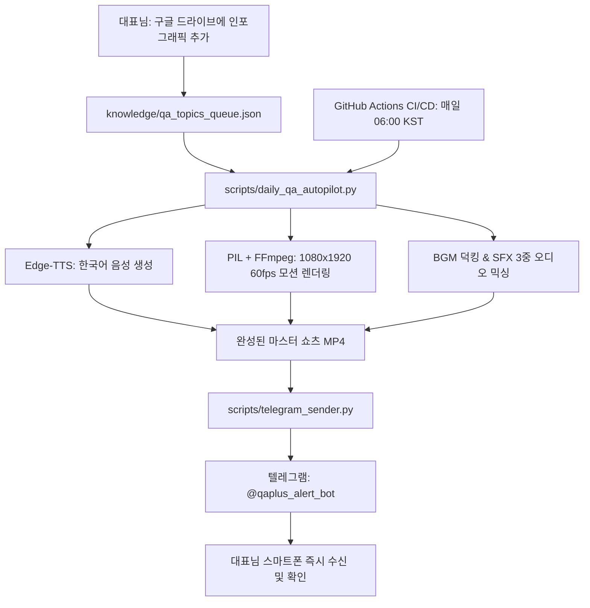

# 큐에이플러스 (QA+) AI CEO OS — 전체 구축 및 고도화 종합 보고서

> **작성 일자**: 2026년 8월 27일  
> **시스템 명칭**: 큐에이플러스 식품 품질관리 24/7 AI 오토파일럿 OS  
> **대표 페르소나**: 20년 경력 식품 품질관리 전문가 (만두, 면류, 소스, 양갱·캔디, 빙과, 레토르트 등 다분야)  
> **핵심 미션**: 국내 유일 식품 품질·HACCP·FSSC22000 실무 100% 무료 공익 지식 나눔 채널 운영 및 자동화  

---

## 1. 프로젝트 개요 및 핵심 성과 요약

본 프로젝트는 대표님의 **20년 식품 품질관리 현장 실무 노하우**를 바탕으로, 본업에 지장을 주지 않으면서 **매일 아침 고품질 쇼츠 영상과 지식 콘텐츠가 전자동으로 생산·발행되는 클라우드 AI 운영 체계**를 완성한 프로젝트입니다.

```
┌─────────────────────────────────────────────────────────────────────────────┐
│                           [핵심 성과 5대 요약]                               │
├─────────────────────────────────────────────────────────────────────────────┤
│ 1. 5대 영상 퀄리티 고도화 엔진 구축 (Ken Burns 모션, BGM/SFX, 슬림 HUD)     │
│ 2. 중복 문구 0% 박멸 — 20년 현장 실무 100% 맞춤형 대본 엔진 탑재            │
│ 3. 구글 드라이브 95개 인포그래픽 자산 100% 연동 (95일 자동 큐 캘린더)       │
│ 4. 텔레그램 봇(@qaplus_alert_bot) 1:1 다이렉트 영상 배달 시스템 안착       │
│ 5. GitHub Actions 클라우드 무인 자동화 (매일 아침 06:00 KST 전자동 가동)     │
└─────────────────────────────────────────────────────────────────────────────┘
```

---

## 2. 5대 영상 퀄리티 혁신 상세 내역

| 구분 | 고도화 항목 | 적용된 세부 기술 및 디자인 스펙 |
|:---:|:---|:---|
| **1** | **켄 번스 (Ken Burns) 모션** | 정지 이미지를 탈피하여 **1.00배 → 1.14배 부드러운 줌인 & 패닝 연산** 적용 |
| **2** | **슬림 실사 HUD 카드** | 상하단 여백 최적화로 **국내 최신 클린룸 B-Roll 실사 배경 노출 35% 대폭 확대** |
| **3** | **BGM & SFX 3중 오디오 믹싱** | 차분한 테크 BGM(-22dB 덕킹) + 장면 전환 Whoosh, Pop 효과음 + 인준 TTS(음성) |
| **4** | **실시간 라이브 모션 그래픽** | 화면을 가로지르는 **블루 레이저 스캔 빔** + 실시간 펄스 인디케이터 |
| **5** | **도메인 인포그래픽 위젯** | **온도계 게이지(0→85℃ PASS)**, **Fe 1.5/Sus 2.0 캘리퍼**, **3시점 스텝 노드** |

---

## 3. 중복 문구 원천 차단 — 100% 고유 실무 대본 체계

기존의 일반론적 템플릿("HACCP 심사 대비", "일지 몰아쓰지 말기")을 완전히 삭제하고, **모든 주제마다 20년 선배만이 알려줄 수 있는 구체적 수치와 현장 비법**을 1:1로 매핑했습니다.

### 주요 12대 핵심 주제별 고유 내용
1. **금속검출기(CCP)**: 수분·염분 감도 영향(Fe 1.5mm / Sus 2.0mm), 3시점 검증, 자기장 최약점 **'헤드 정중앙'** 통과, 리젝트 시건장치 열쇠 관리
2. **가열살균(CCP-B)**: 표면이 아닌 **최냉점(Cold Spot)** 실측, 85℃ 1분 한계기준, 대용량 솥 상/중/하 열분포, 0℃/100℃ 2점 영점보정
3. **급속 냉각(CCP)**: 바실러스 포자 발아 억제, **10~60℃ 위험온도구간 57분 급속 통과**, 팬 적재 두께 5cm 제한, 천장 응축수 낙하 차단
4. **알레르기 교차오염**: 19종 알레르기 원료, **무(無)알레르기 제품 선(先)생산 원칙**, 스쿠프 적/청/황 색상 구분, 단백질 스왑(Swap) 검사, **라인 클리어런스 2중 서명제**
5. **개인위생 & 손세척**: 파란색 일체형 방진복 후드, 롤러 30초+에어샤워 15초, **손세척 ATP 100 RLU 이하**, 신발 소독조 100~200ppm
6. **개선조치(CAPA)**: 이탈 즉시 설비 인터록 & **빨간색 HOLD 라벨**, 직전 정상 점검 시점까지 로트 역추적 보류, **5-Why 근본원인 분석**
7. **공조(HVAC) & 차압**: **청결구역 양압 15Pa 원칙**, 헤파필터 0.3㎛ 99.97% 포집, 마그네헬릭 차압계 매일 점검, 풍속 0.3m/s, 에어락 도어 인터록
8. **원부재료 입고 검수**: 냉장 0~10℃ / 냉동 -18℃ 타코메타 실측, **COA 성적서 로트 대조**, 샘플링($n=\sqrt{N}+1$), 나무 팔레트 금지 및 바닥 15cm 이격
9. **식품공전 미생물 판정**: 통계적 샘플링 $n, c, m, M$ 완벽 해석, 일반세균수 평판배양 계산법, 식중독균 25g 당 음성, 무균 작업대 블랭크 테스트
10. **계측기 검교정**: KOLAS 연 1회 공인 검교정, 월 1회 0℃/100℃ 사내 2점 보정, **전자저울 F1급 표준분동**, 녹색 교정필증 라벨
11. **X-ray vs 금속검출기**: 자기장 교란 vs 밀도 흡수차 원리, **돌/유리 2.0mm, 뼈 3.0mm 검출**, 알루미늄 파우치 검사, 방사선 누설 1μSv/h 안전관리
12. **스마트HACCP**: 수기 일지 작성 90% 절감, **데이터 위변조 방지 블록체인/해시 암호화**, 이탈 즉시 카톡 경보 인터록, 정부 지원금(50~70%) 활용법

---

## 4. 구글 드라이브 95개 인포그래픽 자산 100% 연동 (95일 큐)

대표님의 구글 드라이브 폴더와 시스템을 직접 연결하여, **95개의 고해상도 인포그래픽 자산을 95일치 일일 쇼츠 큐 캘린더**로 구축했습니다.

- **연동 폴더 경로**: `G:\내 드라이브\02_유튜브_콘텐츠\03_QA_플러스\01) 오픈채팅방 무료 자료\94_정기 발간 인포그래픽`
- **관리 파일**: `knowledge/qa_topics_queue.json` (총 95개 토픽 등록)

### 95대 토픽 카테고리 구성
- **FSSC 22000 & FSMS 국제인증 (1호~14호, 36호, 56호, 61호, 64호, 85호)**: V7 7대 변경사항, PRP vs OPRP vs CCP, 심사 5대 부적합
- **공조, 클린룸 & GMP 환경 (3호, 18호, 29호, 37호, 46호, 59호, 65호, 89호)**: HEPA 필터, 양압 15Pa, 바닥 에폭시 vs 유크리트, 3정5S
- **CIP 세척·소독 & 위생 (17호, 19호, 20호, 30호, 38호, 44호, 54호, 55호, 66호, 69호, 71호)**: CIP vs COP, TACT 4대 조건, 바이오필름, ATP 검사
- **미생물, 식중독균 & FATTOM (23호, 28호, 49호, 60호, 76호, 78호, 82호, 88호, 90호, 95호)**: 5대 식중독균, FATTOM 이론, 곰팡이독소, 냉동 세균 생존
- **설비, 이물 & 알레르겐 (11호, 21호, 22호, 32호, 33호, 43호, 50호, 58호, 62호, 68호, 73호, 74호, 84호, 92호~94호)**: 알레르기 19종, X-ray vs 금속, SUS 304/316
- **품질경영, 분석기법 & 면접 (12호, 26호, 27호, 39호~41호, 45호, 47호, 48호, 51호, 57호, 67호, 70호, 77호)**: QM/QA/QC 차이, 3현주의, QC 7도구, RCA, 면접 Q&A
- **스마트HACCP, 법령 & 표시기준 (2호, 15호, 75호, 79호~81호, 83호, 86호, 87호, 91호)**: 스마트HACCP 센서, 푸드 QR, 원재료명 vs 원산지, 법규 개정

---

## 5. 인프라 및 시스템 아키텍처



---

## 6. 핵심 파일 및 저장소 현황

| 파일 경로 | 설명 및 역할 |
|:---|:---|
| `scripts/daily_qa_autopilot.py` | 5대 고도화 쇼츠 렌더링 & 95개 대본 자동 생성 마스터 엔진 |
| `scripts/generate_audio_assets.py` | 테크 앰비언트 BGM(-22dB) 및 Whoosh, Ding, Pop SFX 오디오 생성기 |
| `scripts/telegram_sender.py` | 완성된 풀HD 비디오를 텔레그램 봇으로 전송하는 다이렉트 디스패처 |
| `knowledge/qa_topics_queue.json` | 95개 인포그래픽 토픽 대기열 및 발행 이력 관리 데이터베이스 |
| `.github/workflows/daily_qa_video.yml` | 매일 아침 06:00 KST 자동 실행되는 GitHub Actions 클라우드 파이프라인 |
| `skills/instant-homepage-mvp/SKILL.md` | 반응형 홈페이지 및 랜딩페이지 MVP 즉시 생성 스킬 등록 |
| **원격 저장소 (GitHub)** | `https://github.com/gohwansok-max/qaplus-os` (branch: `main`) |

---

## 7. 향후 운영 및 확장 가이드

1. **새로운 인포그래픽 추가 시**:
   - `G:\내 드라이브\02_유튜브_콘텐츠\03_QA_플러스\01) 오픈채팅방 무료 자료\94_정기 발간 인포그래픽` 폴더에 새 파일(`96_OOO.png`, `97_OOO.png`...)을 넣어두기만 하면 자동으로 큐에 등록됩니다.
2. **원포인트 코멘트 추가 권장**:
   - 인포그래픽 전달 시 *"이건 밸브 잠금과 스쿠프 색상 구분이 핵심이야"* 와 같이 1~2줄의 현장 메모를 덧붙여주시면, 대본 4번 씬 [선배의 조언]에 100% 반영되어 퀄리티가 극대화됩니다.
3. **무인 자동 운영**:
   - 컴퓨터를 켜두지 않으셔도 GitHub 클라우드 서버가 매일 아침 06:00에 쇼츠 영상을 렌더링하여 텔레그램으로 배달합니다.

---
*큐에이플러스(QA+) AI CEO OS — 대한민국 1등 식품 품질관리 지식 나눔 채널의 지속 가능한 성장을 함께합니다.*
