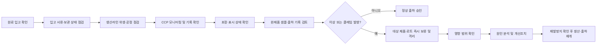
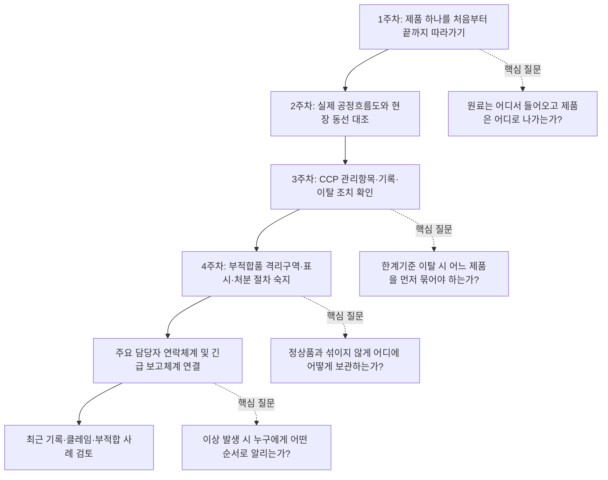
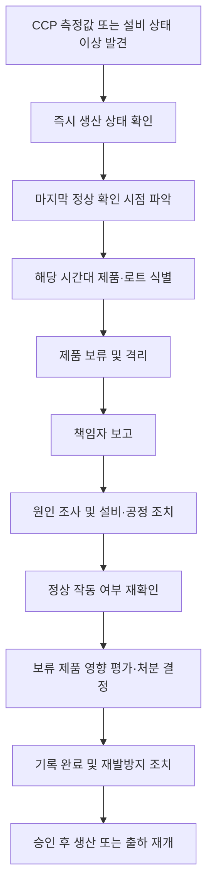

# [QA+ 블로그 생성 결과물] FS009 식품제조현장 기대와현실
생성일시: 2026-08-27 14:50:12
적용모델: gpt-5.6-terra

================================================================================
# 📋 최종 발행용 블로그 패키지

### 1. 메타 데이터 (SEO 설정)
- **최종 포스팅 제목**: 식품회사 QA·QC·HACCP 현실: 신입 품질관리자가 첫해에 마주하는 진짜 업무
- **메타 디스크립션 (120자 내외 요약)**: 식품회사 QA·QC·HACCP 담당자의 실제 업무와 신입 첫 30일 우선순위, CCP 이탈·격리·기록관리·생산팀 소통법을 정리했습니다.
- **추천 해시태그 (10개)**: #식품품질관리 #식품회사QA #식품회사QC #HACCP #식품안전 #식품제조현장 #식품공장 #품질관리직무 #CCP관리 #식품위생
- **카테고리**: 식품품질실무 / HACCP가이드

> **법령·사실관계 검수 메모**
> - HACCP의 법적 근거인 「식품위생법」 제48조 및 관련 세부 기준 언급을 유지했습니다.
> - 식품 제조·가공업의 시설기준 및 영업자 준수사항 관련 「식품위생법 시행규칙」 별표 14, 별표 17 언급을 유지했습니다.
> - HACCP 한계기준, 모니터링 주기, 개선조치 기준은 제품·사업장별 HACCP 관리계획서에 따라 달라질 수 있으므로 본문에 사업장별 기준 준수 문구를 반영했습니다.
> - 법령·고시 개정 가능성을 고려해 국가법령정보센터 및 식품안전나라 최신 시행본 확인 안내를 유지했습니다.

---

## 2. 네이버 블로그 / 티스토리 복사용 최종 원고 (Markdown)

# 식품제조현장 기대와 현실: QA·QC·HACCP 담당자가 첫해에 마주하는 진짜 업무

> **20년 실무 선배의 한 줄 요약**  
> 식품 품질관리는 검사 결과를 확인하는 일이 아니라, 문제가 소비자에게 가기 전에 공정에서 멈추게 만드는 일입니다.  
> 처음부터 모든 기준을 외우려 하지 마세요. **제품 흐름 → CCP → 일탈 시 제품 격리 → 사실 기반 기록**. 이 네 가지만 먼저 잡으면 현장에서 중심을 잡을 수 있습니다.

---

## 1. “검사만 하는 줄 알았습니다”가 가장 흔한 식품제조현장 현실입니다

식품회사 품질관리 직무를 처음 떠올리면 보통 하얀 가운을 입고 미생물 검사나 이화학 분석을 하는 모습을 생각합니다. 물론 검사도 매우 중요한 업무입니다. 그런데 실제 식품제조현장에서 QA, QC, HACCP 담당자가 보내는 시간은 검사실보다 생산라인, 원료창고, 탈의실, 세척실, 포장실, 출하장에 더 많이 분포되는 경우가 많습니다.

특히 인력이 넉넉하지 않은 중소 식품제조업체라면 한 사람이 QC 검사, QA 문서, HACCP 관리, 거래처 대응, 클레임 조사까지 함께 맡기도 합니다.

신입분들이 현장에서 많이 당황하는 부분이 바로 이것입니다. 오전에는 원료 입고 서류를 확인하고, 점심 전에는 생산라인의 금속검출기 기록을 보고, 오후에는 완제품 샘플을 채취하고, 퇴근 직전에는 작업자 위생교육 자료를 수정하는 식입니다. 갑자기 설비가 멈추거나, 포장 필름 인쇄가 틀리거나, 거래처에서 이물 클레임이 들어오면 원래 계획했던 업무는 뒤로 밀립니다.

그래서 식품회사 품질관리 현실은 “정해진 검사 업무를 정확히 수행하는 일”보다 “계속 발생하는 변수를 안전하게 통제하는 일”에 가깝습니다.

QA와 QC를 일반적으로 나누면 다음과 같습니다.

- **QC(Quality Control)**: 원료·공정·완제품이 기준에 적합한지 검사하고 확인하는 역할
- **QA(Quality Assurance)**: 기준서, 교육, 협력업체, 변경관리, 부적합 관리, 클레임, 심사 대응처럼 품질이 유지되도록 시스템을 운영하는 역할
- **HACCP 담당 업무**: 위해요소를 분석하고, CCP를 관리하며, 이탈 시 제품 통제와 개선조치가 작동하도록 관리하는 역할

쉽게 말하면 QC가 **지금 나온 제품을 확인하는 사람**이라면, QA는 **문제가 반복되지 않도록 공장 운영 방식을 만드는 사람**입니다. 다만 회사마다 조직 규모와 직무분장이 다르므로 “QA는 문서만 하고 QC는 검사만 한다”라고 단정하면 현장에서는 맞지 않는 경우가 많습니다.

가장 중요한 사실은 품질팀이 생산팀을 감시하기 위해 존재하는 부서가 아니라는 점입니다. 품질팀의 역할은 생산을 멈추게 하는 데 있지 않습니다. 안전하지 않은 제품이 출고되는 일을 막고, 안전하게 생산을 재개할 수 있는 방법을 함께 찾는 데 있습니다.

그래서 실무에서는 “안 됩니다”라는 말보다 “이 상태에서는 이런 위험이 있으니, 이 조치를 하고 재개합시다”라는 말이 훨씬 강력합니다.




다음으로는 입사 전 기대와 실제 현장이 왜 이렇게 달라지는지 표로 정리해 보겠습니다. 이 차이를 이해하면 현장에서 발생하는 갈등도 개인 성격 문제가 아니라 구조의 문제라는 것이 보입니다.

---

## 2. 식품회사 품질관리 기대와 현실, 정확히 무엇이 다를까요?

식품제조현장에서는 생산량, 납기, 인력 공백, 설비 상태, 원료 편차, 거래처 요구사항이 동시에 움직입니다. 품질팀은 그 흐름 안에서 식품안전 기준을 유지해야 합니다.

생산팀 입장에서는 “오늘 출고 물량을 맞춰야 한다”가 절실하고, 품질팀 입장에서는 “이 로트의 안전성과 추적성이 확보됐는가”가 절실합니다. 둘 중 누가 맞고 틀린 문제가 아니라, 둘 다 반드시 해결해야 하는 문제입니다.

| 구분 | 입사 전 기대 | 실제 식품제조현장 |
|---|---|---|
| 주요 업무 | 제품 검사, 성적서 관리 | 입고검사, 공정점검, 위생, CCP, 문서, 교육, 심사, 클레임 |
| HACCP | 인증 심사용 서류 | 위해 예방, 일탈 통제, 추적성 확보 체계 |
| 생산팀과 관계 | 관리·감독 관계 | 안전한 생산을 위한 협업 관계 |
| 문제 발생 시 | 불량 판정 후 종료 | 격리, 영향 범위 확인, 원인분석, 처분, 재발방지 |
| 필요한 역량 | 분석 능력 | 관찰력, 판단력, 소통력, 문서화, 분석 능력 |
| 업무 속도 | 계획대로 진행 | 생산 변동과 긴급 이슈에 따라 우선순위 수시 변경 |

첫 번째 현실은 검사 결과가 “정상”이라고 해서 품질관리가 끝나는 것이 아니라는 점입니다. 예를 들어 완제품 미생물 검사 결과가 적합하더라도 생산 중 작업자 위생 상태가 불량했거나 원료 보관 온도 기록이 빠졌다면 관리상 문제는 남아 있습니다.

반대로 어떤 제품이 외관상 멀쩡해도 금속검출기 이탈, 살균 조건 미달, 알레르겐 표시 오류가 있었다면 단순 출하 판정으로 끝낼 수 없습니다. 식품안전은 최종 검사 한 번보다 공정 전체가 어떻게 통제되었는지가 더 중요할 때가 많습니다.

두 번째 현실은 HACCP 기록이 생각보다 많다는 것입니다. 하지만 기록 자체가 목적은 아닙니다. 기록은 “언제, 누가, 무엇을, 어떤 기준으로 확인했고, 이상이 있을 때 무엇을 했는지”를 남기는 데이터입니다.

쉽게 말하면 기록지는 심사관에게 보여주기 위한 숙제가 아니라, 문제가 생겼을 때 우리 제품의 안전성을 설명하고 범위를 추적하기 위한 블랙박스입니다.

세 번째 현실은 품질팀이 혼자 식품안전을 만들 수 없다는 점입니다. 생산팀은 공정을 실제로 실행하고, 설비팀은 설비 상태를 유지하며, 구매팀은 원료와 협력업체를 관리하고, 물류팀은 보관·출하 조건을 지킵니다. 경영진은 필요한 인력과 설비, 교육 시간, 개선 예산을 결정합니다.

품질팀은 이 모든 활동이 식품안전 기준 안에서 연결되도록 조정하고 확인하는 중심축 역할을 합니다.

---

## 3. HACCP 기록과 현장 위생관리는 왜 선택이 아니라 의무일까요?

국내 HACCP 제도의 법적 근거는 「식품위생법」 제48조, 즉 식품안전관리인증기준입니다. HACCP은 식품의 원료 입고부터 제조·가공·보관·유통까지 과정에서 발생할 수 있는 위해요소를 분석하고 관리하는 체계입니다.

여기서 위해요소란 미생물, 화학물질, 금속·플라스틱 같은 이물처럼 소비자 건강에 문제를 일으킬 수 있는 요인을 말합니다. 쉽게 말하면 “문제가 생긴 뒤 검사로 찾아내는 방식”보다 “문제가 생길 수 있는 지점을 미리 관리하는 방식”입니다.

세부 운영 기준은 「식품 및 축산물 안전관리인증기준」에서 확인할 수 있습니다. 이 기준은 선행요건관리, 위해요소분석, 중요관리점(CCP), 한계기준, 모니터링, 개선조치, 검증, 기록관리의 틀을 제시합니다.

용어가 어렵게 느껴질 수 있는데, 현장 언어로 바꾸면 훨씬 단순합니다.

> **무슨 위험이 있는지 찾고, 반드시 잡아야 할 공정을 정하고, 기준을 세우고, 실제로 지키는지 확인하고, 벗어나면 제품을 통제하고, 그 사실을 남기는 것.**

또한 「식품위생법 시행규칙」 별표 14와 별표 17에는 식품 제조·가공업의 시설기준 및 영업자 준수사항과 관련된 기준이 규정되어 있습니다. 작업장 구획, 방충·방서, 세척·소독, 종업원 위생관리, 원료 및 제품의 보관·관리 같은 항목은 현장 선택사항이 아닙니다.

“작업자가 바빠서 손 세척을 생략했다”거나 “창고 자리가 없어서 원료와 완제품을 잠시 같이 뒀다”는 말은 식품안전 관점에서 정당화되기 어렵습니다. 특히 알레르겐 원료, 냉장·냉동 원료, 개봉 원료, 부적합품은 관리가 느슨해지는 순간 큰 리스크로 이어질 수 있습니다.

식품공전, 즉 「식품의 기준 및 규격」도 품질관리의 중요한 기준입니다. 미생물, 식품첨가물, 이물, 제조·가공 기준, 표시 기준 등은 담당자의 감이나 거래처의 관행으로 판단하면 안 됩니다. 제품 특성에 맞는 법적 기준과 자사 기준을 확인하고, 그 기준에 따라 관리해야 합니다.

법령과 고시는 개정될 수 있으므로 실제 업무 또는 게시 전에는 반드시 국가법령정보센터와 식품안전나라의 최신 시행본을 확인해 주세요.

> **현장 핵심 정리**  
> HACCP 기록이 많은 이유는 담당자를 힘들게 하려는 것이 아닙니다.  
> 기록이 없으면 “관리했는지”, “언제 문제가 시작됐는지”, “어느 로트까지 영향이 있는지”를 판단할 수 없기 때문입니다.

공식 기준을 이해했다면 이제 실무 우선순위를 잡아야 합니다. 신입 때는 모든 문서를 외우려는 분이 많은데요. 그보다 먼저 현장의 흐름을 몸으로 익히는 편이 훨씬 빠릅니다.

---

## 4. 신입 QA·QC가 첫 30일 동안 반드시 잡아야 할 우선순위

첫 번째로 해야 할 일은 제품 하나를 처음부터 끝까지 따라가 보는 것입니다. 원료가 어느 창고에 들어오는지, 검수는 누가 하는지, 전처리와 배합은 어디에서 이뤄지는지, 가열·냉각·포장 공정은 어떻게 연결되는지 직접 걸어 보셔야 합니다.

공정흐름도를 책상에서 읽는 것과 현장에서 보는 것은 완전히 다릅니다. 문서에는 한 줄로 적힌 “냉각” 공정이 실제로는 냉각 대기, 이동, 용기 교체, 온도 측정, 보관까지 여러 단계로 나뉘어 있을 수 있습니다.

두 번째는 CCP를 외우기보다 의미를 이해하는 것입니다. 예를 들어 가열 공정이 CCP라면 단순히 “온도와 시간을 적는 공정”이 아닙니다. 미생물 위해를 줄이기 위해 반드시 달성해야 하는 조건을 관리하는 공정입니다.

금속검출 공정이 CCP라면 금속검출기 감도 확인, 시험편 통과 여부, 불합격품 배출 확인, 이탈 시 제품 격리 범위가 모두 연결됩니다. 한계기준은 사업장별 HACCP 관리계획서에 설정된 값을 따라야 하며, 현장 담당자는 그 수치의 의미와 이탈 시 조치를 알아야 합니다.

세 번째는 부적합품 격리 장소와 표시 방법을 정확히 아는 것입니다. 이상 제품을 발견했을 때 가장 먼저 할 일은 원인을 멋지게 분석하는 것이 아닙니다. 해당 제품이 정상품과 섞이지 않도록 식별하고, 보류·격리하고, 이미 출하됐는지 확인하는 것입니다.

“나중에 다시 확인하자”며 라인 옆에 두거나, 제품에 아무 표시 없이 팔레트 위에 올려두는 순간 추적성은 무너집니다. 격리표에는 일반적으로 제품명, 로트, 수량, 발생일시, 부적합 내용, 조치 상태, 담당자를 명확히 남기는 방식이 좋습니다.

네 번째는 사람을 외우는 것입니다. 생산반장, 현장 작업자 리더, 설비 담당자, 창고 담당자, 출하 담당자, 연구개발 담당자와 연락 체계를 먼저 만들어 두세요. 식품제조현장은 문서만으로 움직이지 않습니다.

일탈이 생겼을 때 “누구에게 어떤 순서로 보고해야 하는지”를 모르면 10분짜리 문제가 2시간짜리 문제가 됩니다. 특히 CCP 이탈, 알레르겐 교차접촉 가능성, 중대 이물, 표시 오류, 추적성 혼선은 즉시 보고 기준을 사전에 합의해 두는 것이 좋습니다.




### 신입 실무자 첫 30일 체크리스트

| 점검 항목 | 확인 기준 | 현장에서 확인하는 방법 |
|---|---|---|
| 주력 제품 이해 | 제품별 원료·공정·보관조건 설명 가능 | 제품 1~2개를 골라 제조부터 출하까지 동행 |
| 공정흐름도 | 실제 공정과 문서 일치 | 현장 동선에 직접 표시하며 비교 |
| CCP 관리 | 관리항목·한계기준·이탈 조치 이해 | 담당자에게 실제 기록 작성 과정을 확인 |
| 격리 관리 | 보류구역·표시표·처분 절차 확인 | 부적합품 표찰과 출입 통제 상태 점검 |
| 기록 관리 | 실시간 작성·수정 이력·로트 연결 | 생산일보, CCP일지, 출하일지 대조 |
| 보고 체계 | 긴급 이슈별 보고 대상 명확 | 비상 연락망과 의사결정 권한 확인 |
| 최근 이슈 | 클레임·부적합 재발방지 확인 | 최근 3개월 사례와 조치 결과 검토 |

이제 현장에 익숙해지기 시작하면 가장 어려운 문제가 나옵니다. 바로 생산팀과 품질팀 사이의 대화입니다. 여기서 말 한마디를 어떻게 하느냐에 따라 개선이 되기도 하고, 문제 은폐가 시작되기도 합니다.

---

## 5. 생산팀과 갈등하지 않고 기준을 지키는 대화법

생산팀이 품질팀을 불편하게 느끼는 이유는 단순하지 않습니다. 생산팀은 정해진 시간 안에 생산량을 맞춰야 하고, 설비가 멈추면 손실이 바로 보이며, 작업자 공백까지 감당해야 합니다.

그런 상황에서 품질팀이 “규정이니까 중단하세요”라고만 말하면 현장에서는 품질팀이 생산을 방해한다고 받아들이기 쉽습니다. 하지만 식품안전상 이슈를 그냥 넘길 수는 없습니다.

그래서 품질 담당자는 “규정”과 “제품 리스크”를 함께 설명해야 합니다. 예를 들어 작업복 소독 절차가 누락됐을 때 “위생복 규정 위반입니다”라고만 하지 말고, 다음과 같이 설명해 보세요.

> “이 상태로 청결구역에 들어가면 외부 오염원이 제품 쪽으로 이동할 수 있습니다. 지금 복장 교체와 손 소독을 확인하면 생산 중단 없이 바로 재개할 수 있습니다.”

현장은 왜 멈춰야 하는지, 그리고 어떻게 하면 빨리 다시 시작할 수 있는지를 알아야 협조합니다.

특히 양보할 수 없는 항목은 명확히 구분해야 합니다.

- CCP 한계기준 이탈
- 알레르겐 교차접촉 가능성
- 법정 표시사항 오류
- 중대 이물 혼입 우려
- 미생물 위해 가능성
- 출하 제품의 추적 불가 문제

이 경우 품질 담당자가 혼자 판단을 떠안기보다 기준서와 제품 영향 범위를 근거로 책임자에게 즉시 보고해야 합니다. “누가 잘못했는지”보다 “어느 제품이 영향을 받았고 출하를 막았는지”를 먼저 정리하는 것이 우선입니다.

반대로 모든 문제를 무조건 생산 중단으로 연결하는 것도 좋은 품질관리는 아닙니다. 예를 들어 포장 자재가 라인에 투입되기 전 인쇄 위치 이상을 발견했다면, 해당 자재만 보류하고 정상 자재로 교체해 생산을 이어갈 수 있는지 검토할 수 있습니다.

세척 확인이 부족하다면 세척 재실시, ATP 측정 또는 내부 기준에 따른 확인, 작업자 재교육 후 재개라는 대안을 제시할 수 있습니다. 품질팀의 전문성은 “안 된다”를 많이 말하는 데 있지 않고, 안전성을 해치지 않는 범위에서 가장 빠르고 확실한 해결 경로를 만드는 데 있습니다.

> **★ 현장 실무 꿀팁**  
> 생산팀에 요청할 때는 “심사에서 지적됩니다”보다 “이대로 가면 어느 로트까지 격리해야 할지 모르게 됩니다”라고 설명해 보세요.  
> 심사 리스크보다 출하 지연, 폐기, 회수 가능성처럼 현장이 체감할 수 있는 언어가 훨씬 빠르게 전달됩니다.

말보다 더 설득력 있는 것은 실제 사례입니다. 아래 세 사례는 업종은 다르지만, 결국 제품 격리·원인 분석·현장 실행·기록 연결이 핵심이었다는 공통점을 보여줍니다.

---

## 6. 실제 현장 사례로 보는 식품제조현장 적용법

### 사례 1. 냉동만두 제조공장: 금속검출기 이탈을 “잠깐의 설비 오류”로 넘기지 않은 경우

한 냉동만두 제조공장에서는 포장 공정 중 금속검출기 감도 확인용 시험편이 기준대로 배출되지 않는 일이 발생했습니다. 당시 생산팀은 설비 주변에 원료와 반제품이 많이 쌓여 있어 라인을 오래 멈추기 어렵다고 판단했습니다.

처음에는 “방금 전까지 제품은 정상으로 나왔으니 설비만 조정하고 계속 생산하자”는 의견도 있었습니다. 그러나 QC 담당자는 마지막 정상 확인 시점부터 현재까지 통과한 제품 로트를 먼저 확인하고, 해당 시간대 제품을 즉시 보류구역으로 이동시켰습니다.

원인 분석 결과 금속검출기 자체 고장보다는 컨베이어 벨트 장력 변화로 인해 제품 통과 위치가 편차를 보인 것이 원인이었습니다. 쉽게 말하면 검출기는 작동하고 있었지만, 제품이 센서의 가장 민감한 위치를 일정하게 지나가지 못했던 것입니다.

설비팀은 벨트 장력과 가이드 위치를 조정했고, 품질팀은 조정 후 시험편 테스트를 연속으로 실시해 자사 기준에 맞게 정상 작동하는지 확인했습니다. 보류 제품은 마지막 정상 확인 시점, 설비 이상 확인 시점, 재가동 승인 시점을 기준으로 로트 범위를 구분해 재검사 및 처분 절차를 진행했습니다.

이 사례의 핵심은 금속검출기 이탈을 단순 설비 문제로만 보지 않았다는 점입니다. CCP 이탈 가능성이 발생하면 “설비를 고쳤는가”뿐 아니라 “그 사이 생산된 제품은 안전하게 통제됐는가”를 같이 봐야 합니다.

이후 공장에서는 시험편 확인 주기, 작업자 확인 방법, 설비 이상 발생 시 제품 격리 위치를 재정비했습니다. 결과적으로 이후 심사에서도 이탈 발생 시 제품 통제와 개선조치 기록이 명확하다는 평가를 받을 수 있었습니다.

### 사례 2. 소스류 제조공장: 알레르겐 원료 전환 세척이 문서와 달랐던 경우

소스류 제조공장에서는 대두 성분이 포함된 양념소스를 생산한 뒤, 대두를 사용하지 않는 제품으로 생산 전환하는 공정이 있었습니다. HACCP 관리기준서에는 생산 전환 전 세척과 확인 절차가 정리되어 있었지만, 실제 현장에서는 납기 압박으로 일부 작업자가 세척 확인 단계를 축소해서 운영하고 있었습니다.

작업자들은 “같은 소스니까 큰 차이가 없다”고 생각했지만, 알레르겐 관리는 제품 맛의 문제가 아니라 소비자 건강 위해와 표시 적합성의 문제입니다. 품질팀은 현장 순회 중 세척 기록의 시간과 실제 생산일보 시간이 맞지 않는 점을 발견했습니다.

조사 결과 문제의 근본 원인은 작업자가 절차를 몰라서만이 아니었습니다. 생산 전환 시간이 너무 짧게 계획되어 있었고, 세척 완료 여부를 확인하는 책임자도 명확하지 않았으며, 세척 전후 사진이나 체크포인트 같은 시각적 기준도 부족했습니다.

품질팀은 생산팀과 함께 알레르겐 제품군별 생산 순서를 다시 검토했습니다. 가능하면 비알레르겐 제품을 먼저 생산하고, 알레르겐 원료 사용 제품을 후순위로 배치하는 방향으로 일정을 조정했습니다.

또한 세척 절차를 글 중심 문서에서 사진 중심의 작업표준으로 바꾸고, 밸브·호스·충진기 노즐처럼 잔류가 발생하기 쉬운 지점을 별도 확인 항목으로 만들었습니다. 세척 후에는 자사 기준에 맞는 확인 절차를 거친 뒤 품질 또는 지정 책임자가 생산 재개를 승인하도록 했습니다.

작업자는 단순히 서명만 하는 것이 아니라 실제 전환 세척 시연 교육을 받았습니다. 그 결과 기록 시간과 생산 시간이 어긋나는 사례가 줄었고, 현장도 왜 세척이 필요한지 이해하게 되어 불필요한 갈등이 크게 감소했습니다.

### 사례 3. 레토르트 식품 제조공장: 살균기록은 있었지만 개선조치가 비어 있던 경우

레토르트 죽 제품을 생산하는 한 공장에서는 정기 내부점검 중 살균 공정 기록 일부에서 관리값이 기준에 근접하거나 일시적으로 벗어난 흔적이 발견됐습니다. 기록지에는 측정값이 적혀 있었지만, 이탈 또는 경향 이상에 대한 조치란은 비어 있었습니다.

생산 담당자는 “잠깐 떨어졌다가 바로 회복됐고 제품도 이미 출하됐다”고 설명했습니다. 하지만 레토르트 제품의 열처리 공정은 제품 안전성과 직접 연결될 수 있으므로, 단순히 값이 회복됐다는 사실만으로 판단할 수 없습니다.

품질팀은 우선 해당 시간대의 제조번호, 충전 기록, 살균기 운전 기록, 냉각 기록, 출하 기록을 대조했습니다. 그 과정에서 일부 기록의 작성 시점이 실제 생산시간과 불명확하다는 문제도 발견됐습니다.

근본 원인은 설비 화면의 알람 기준과 HACCP 기록 기준이 작업자에게 명확히 전달되지 않았고, 이탈 발생 시 누구에게 보고해야 하는지 교육이 부족했던 것이었습니다. 즉, 개인의 기록 실수처럼 보였지만 실제로는 시스템과 교육의 실패였습니다.

개선조치로 공장은 살균 설비 알람 발생 시 작업자가 즉시 수행할 조치를 1장짜리 비상대응 카드로 만들어 설비 옆에 부착했습니다. 해당 제품은 자동으로 보류 상태가 되도록 생산·품질 간 확인 절차를 정비했고, 출하 승인 전 기록 검토 항목도 강화했습니다.

또한 단순히 “이탈 시 보고한다”는 교육에서 끝내지 않고, 가상의 이탈 상황을 만들어 제품 격리부터 보고·기록까지 모의훈련을 실시했습니다. 이후에는 기준 근접값이 반복될 때 설비 예방정비를 검토하는 경향관리까지 연결할 수 있었습니다.

사례를 보면 공통점이 하나 있습니다. 사고가 없었던 것이 아니라, 이상을 발견했을 때 제품을 먼저 묶고 사실을 기록하며 재발방지까지 연결했기 때문에 더 큰 사고를 막을 수 있었다는 점입니다.



---

## 7. HACCP 심사와 내부점검에서 반복되는 지적 포인트

심사에서 가장 자주 나오는 문제는 문서와 현장이 맞지 않는 경우입니다. 관리기준서에는 점검하도록 되어 있는데 현장 작업자는 그 항목을 모르거나, 공정흐름도에는 없는 설비가 실제 현장에 설치되어 있는 식입니다.

HACCP 팀 구성원이나 비상연락망이 퇴사자 이름으로 남아 있는 경우도 생각보다 많습니다. 문서는 한 번 만들면 끝나는 자료가 아니라, 공정·설비·조직이 바뀔 때마다 검토하고 개정해야 하는 운영 문서입니다.

두 번째는 CCP 모니터링과 개선조치의 연결이 약한 경우입니다. 측정값이 한계기준을 벗어났는데도 “정상”으로 표시하거나, 조치란에 “재확인”이라고만 쓰고 제품 처분 내용이 없는 기록은 위험합니다.

기준 이탈이 발생했다면 최소한 이탈 시점, 대상 제품 또는 로트, 격리 여부, 원인, 조치, 재발방지, 조치 효과 확인이 연결되어야 합니다. 쉽게 말하면 숫자 하나가 틀렸을 때 “다시 쟀더니 정상”에서 끝나는 것이 아니라, 그 사이 나온 제품을 어떻게 통제했는지까지 남아 있어야 합니다.

세 번째는 선행요건관리의 실행력 부족입니다. 손 세척·소독, 위생복 착용, 방충·방서, 세척·소독, 원료 보관, 구역 구분은 사소한 기본처럼 보이지만 실제 위해를 막는 바닥입니다. 바닥이 흔들리면 CCP만 잘 관리해도 전체 안전성이 약해집니다.

특히 원료·반제품·완제품의 식별, 개봉 원료의 관리, 청결구역과 일반구역의 동선 분리는 매일 현장에서 확인해야 하는 항목입니다.

네 번째는 교육을 했다는 기록만 남고, 교육 효과 확인이 없는 경우입니다. 교육일지에 참석자 서명만 있다고 해서 작업자가 절차를 이해한 것은 아닙니다. 외국인 근로자가 많은 현장이라면 사진, 색상, 픽토그램, 다국어 안내를 병행하는 것이 효과적입니다.

교육 후에는 현장에서 실제로 수행하는지 관찰하고, 반복 위반이 있으면 재교육과 원인 확인을 해야 합니다.

| 흔한 실수 | 왜 문제가 되는가 | 올바른 대응 |
|---|---|---|
| 모든 시간대에 같은 측정값 기입 | 실제 측정 신뢰성 의심, 추적 불가 | 실측값·시간·담당자 사실대로 기록 |
| CCP 이탈 후 재측정만 함 | 이탈 기간 제품 통제가 없음 | 제품 격리, 영향 범위 확인, 처분 결정 |
| 부적합품을 라인 옆에 보관 | 정상품과 혼입 가능 | 전용 격리구역, 식별표, 출입 관리 |
| 절차서는 있으나 작업자는 모름 | 문서-현장 불일치 | 현장 시연 교육, 작업표준 시각화 |
| 클레임 조치가 “주의”로 끝남 | 재발 가능성 지속 | 근본 원인분석, 책임자·기한·효과 확인 |

심사는 특별한 날에 갑자기 잘하는 시험이 아닙니다. 평소 현장이 기준대로 움직이고, 그 사실이 기록으로 남아 있을 때 자연스럽게 통과됩니다.

따라서 심사 직전에 서류만 정리하는 방식보다 매주 짧게라도 현장과 기록을 함께 보는 습관이 훨씬 중요합니다.

---

## 8. 식품 QA·QC·HACCP 담당자가 자주 묻는 질문 FAQ

### Q1. 식품회사 품질관리는 야근이 많은 직무인가요?

**A.** 회사의 생산 운영시간, 교대제 여부, 성수기, 신제품 출시 빈도, 심사 일정, 인력 구성에 따라 크게 다릅니다. 야간 생산이 있거나 생산 종료 후 세척 상태를 확인해야 하는 사업장, 긴급 클레임이 자주 발생하는 사업장은 근무시간이 유동적일 수 있습니다.

입사 전에는 품질팀 인원, 생산 교대 운영, 야간·주말 대응 방식, 외부 시험기관 활용 여부를 구체적으로 확인하는 것이 좋습니다.

### Q2. QA와 QC 중 어떤 직무가 더 잘 맞을까요?

**A.** 검사·분석·수치 확인·샘플링·공정점검을 선호한다면 QC 업무에서 흥미를 느낄 가능성이 큽니다. 문서체계, 원인분석, 교육, 협력업체 관리, 부서 조율, 심사 대응에 관심이 있다면 QA 성향과 더 잘 맞을 수 있습니다.

다만 중소 식품제조업체에서는 QA·QC·HACCP 업무를 함께 경험하는 경우가 많으므로, 초반에는 구분보다 제조공정 전체를 이해하는 것이 더 중요합니다.

### Q3. 생산팀이 “그 정도는 괜찮다”고 하면 어떻게 해야 하나요?

**A.** 식품안전, 법적 기준, CCP 한계기준, 알레르겐, 표시사항, 이물, 추적성과 관련된 이슈라면 개인 판단으로 넘기면 안 됩니다. 기준서와 실제 측정값, 제품 영향 범위를 근거로 설명하고 필요하면 즉시 책임자에게 보고해야 합니다.

감정적으로 “안 됩니다”라고 맞서기보다 “이 상태로 진행하면 어느 로트까지 영향을 받을 수 있고, 지금 격리하면 정상 제품 출하를 지킬 수 있습니다”라고 말하는 방식이 좋습니다.

### Q4. HACCP 기록은 나중에 한꺼번에 작성해도 되나요?

**A.** 원칙적으로 실제 점검·측정·확인이 이루어진 시점에 사실대로 작성해야 합니다. 사후 작성은 기록의 신뢰성을 떨어뜨리고, 이탈이 발생했을 때 정확한 시작 시점과 영향 로트를 판단하기 어렵게 만듭니다.

전자기록을 사용하더라도 입력 시점, 변경 이력, 권한 관리가 명확해야 하며, 편리하다는 이유로 사실과 다른 기록을 남겨서는 안 됩니다.

### Q5. 신입 담당자가 현장 개선을 제안해도 될까요?

**A.** 당연히 가능합니다. 다만 처음부터 “이렇게 바꿔야 합니다”라고 결론을 내리기보다 현장 작업자가 왜 현재 방식으로 일하는지 먼저 들어보는 것이 중요합니다.

관찰 사실, 식품안전 리스크, 실행 가능한 대안, 확인 방법 순서로 제안하면 훨씬 잘 받아들여집니다.

### Q6. 클레임이 들어오면 품질팀이 모든 책임을 져야 하나요?

**A.** 품질팀이 클레임 조사와 제품 영향 평가를 주도하는 경우는 많지만, 원인에 따라 생산·설비·구매·물류·영업이 함께 대응해야 합니다.

중요한 것은 책임자를 빨리 정하는 것보다 제품 회수 필요성, 출하 범위, 보관 샘플, 제조기록, 거래처 정보 등을 신속히 확보하는 것입니다. 클레임 대응도 결국 부서 간 정보가 얼마나 빨리 연결되느냐가 핵심입니다.

FAQ에서 보셨듯이 식품 품질관리의 핵심 역량은 지식 하나가 아닙니다. 기준을 알고, 현장을 보고, 사람과 소통하고, 사실을 기록하는 능력이 함께 필요합니다.

---

## 9. 매일·매주 점검하면 좋은 식품공장 품질관리 체크리스트

매일 점검은 모든 것을 완벽하게 하려는 작업이 아닙니다. 사고 가능성이 큰 항목을 놓치지 않기 위한 최소한의 안전망입니다.

특히 생산 시작 전, 생산 중, 생산 종료 후에 무엇을 봐야 하는지 구분하면 업무가 훨씬 정리됩니다. 처음에는 체크리스트를 그대로 사용하고, 익숙해지면 자사 제품과 공정에 맞게 항목을 보완하시면 됩니다.

생산 시작 전에는 작업자 위생상태, 설비 세척 상태, 원료 식별, 알레르겐 관리, 온도 관리 상태를 우선 확인합니다. 생산 중에는 CCP 모니터링, 포장 상태, 중량, 이물, 라벨·유통기한 인쇄, 공정별 기록을 확인합니다.

생산 종료 후에는 잔여 원료와 반제품의 식별, 세척·소독, 부적합품 보관, 기록 누락 여부를 확인하는 흐름이 좋습니다. 단, 실제 관리 주기와 세부 기준은 반드시 자사 HACCP 관리계획서와 작업표준서를 따라야 합니다.

| 시점 | 점검 항목 | 확인 포인트 | 이상 시 즉시 조치 |
|---|---|---|---|
| 생산 전 | 작업자 위생 | 복장, 손 세척·소독, 건강상태 | 재교육, 복장 교체, 작업 배제 검토 |
| 생산 전 | 원료 관리 | 라벨, 유통기한, 보관온도, 알레르겐 | 보류·격리, 입고기록 확인 |
| 생산 중 | CCP 모니터링 | 한계기준, 주기, 측정기기 상태 | 제품 격리, 보고, 재측정·원인 확인 |
| 생산 중 | 포장·표시 | 제품명, 알레르겐, 유통기한, 인쇄 상태 | 자재 교체, 해당 시간대 제품 보류 |
| 생산 중 | 이물 관리 | 금속검출, 파손, 설비 이상 | 라인 점검, 영향 로트 통제 |
| 생산 후 | 세척·소독 | 세척 누락, 잔류물, 교차오염 가능성 | 재세척, 확인 후 승인 |
| 생산 후 | 기록 검토 | 시간·로트·측정값·서명 연결 | 누락 원인 확인, 사실 기반 보완 |
| 출하 전 | 추적성 | 제품 로트와 거래처 출고정보 일치 | 출하 보류, 출하자료 재확인 |

매주 또는 매월에는 반복되는 경향을 봐야 합니다. 예를 들어 특정 설비에서 온도 편차가 반복되는지, 특정 시간대에 포장 불량이 많은지, 특정 작업자에게 위생수칙 위반이 반복되는지 확인해야 합니다.

같은 문제가 세 번 이상 반복된다면 “작업자 주의”로 끝낼 단계는 이미 지났을 가능성이 큽니다. 설비, 교육, 작업표준, 생산계획, 인력배치 중 어디가 근본 원인인지 다시 봐야 합니다.

기록을 검토할 때는 숫자만 보지 마세요. 생산일보의 로트와 CCP 기록의 로트, 금속검출 기록의 시간, 출하 기록의 수량이 서로 연결되는지 보는 습관이 중요합니다.

이 연결이 되어야 실제 문제가 생겼을 때 영향 범위를 빠르게 좁힐 수 있습니다. 추적성은 심사 때만 하는 시험이 아니라, 위기 상황에서 회수 범위를 최소화하는 실무 능력입니다.

마지막으로 이 일을 오래 잘하려면 완벽주의보다 우선순위 감각이 필요합니다. 모든 문제를 혼자 해결하려 하지 말고, 식품안전과 직결되는 이슈부터 막고 보고하고 기록하세요.

---

## 10. 식품제조현장의 현실은 힘들지만, 결국 사람을 지키는 일입니다

식품제조현장은 생각보다 빠르고 복잡합니다. 계획대로 흘러가는 날도 있지만, 원료 입고 지연, 작업자 공백, 설비 이상, 납기 변경, 거래처 요청, 클레임처럼 예상하지 못한 변수가 계속 생깁니다.

그 안에서 QA·QC·HACCP 담당자는 기준을 붙잡고 현장이 무너지지 않도록 조율합니다. 그래서 이 직무는 단순히 꼼꼼한 사람만 잘하는 일이 아니라, 기준과 현실 사이에서 판단할 줄 아는 사람이 성장하는 일입니다.

오늘 내용을 세 줄로 정리하면 이렇습니다.

1. 식품 품질관리의 핵심은 최종 검사보다 **공정에서 위해를 예방하는 관리**입니다.  
2. HACCP 기록은 심사 대응용 서류가 아니라 **제품 안전성과 추적성을 증명하는 데이터**입니다.  
3. 생산팀과 품질팀은 대립하는 부서가 아니라 **안전한 제품을 제시간에 생산하기 위해 서로 필요한 파트너**입니다.  

신입 때는 점검표, 기준서, 용어, 기록지가 너무 많아 보일 수 있습니다. 하지만 한 번에 다 외우려고 하면 금방 지칩니다.

먼저 우리 제품 하나의 흐름을 따라가 보고, CCP가 어디인지 확인하고, 문제가 생겼을 때 제품을 어디에 격리하는지 배우세요. 그다음 기록이 왜 필요한지 이해하면 문서도 더 이상 단순한 서류가 아니라 현장을 읽는 지도처럼 보이기 시작합니다.

품질관리자는 문제가 생긴 뒤 누군가를 혼내는 사람이 아닙니다. 문제가 소비자에게 가기 전 멈추고, 같은 문제가 다시 일어나지 않도록 공정을 바꾸는 사람입니다.

처음에는 “내가 생산을 방해하는 건 아닐까” 고민될 수 있지만, 안전 기준을 근거 있게 지키는 것은 생산을 방해하는 일이 아니라 회수·폐기·신뢰 하락을 막는 일입니다.

막히는 부분이 있으면 언제든 댓글로 편하게 물어보세요. 후배님들이 현장에서 기준은 단단하게 지키고, 불필요한 야근은 줄이며, 당당하게 성장하시길 응원합니다.

---

## 3. 워드프레스 / 웹사이트용 HTML 원고

```html
<article class="food-qa-post">
  <header>
    <h1>식품제조현장 기대와 현실: QA·QC·HACCP 담당자가 첫해에 마주하는 진짜 업무</h1>
    <p class="lead"><strong>20년 실무 선배의 한 줄 요약:</strong> 식품 품질관리는 검사 결과를 확인하는 일이 아니라, 문제가 소비자에게 가기 전에 공정에서 멈추게 만드는 일입니다. 처음부터 모든 기준을 외우려 하지 마세요. <strong>제품 흐름 → CCP → 일탈 시 제품 격리 → 사실 기반 기록</strong> 이 네 가지만 먼저 잡으면 현장에서 바로 중심을 잡을 수 있습니다.</p>
  </header>

  <section>
    <h2>1. “검사만 하는 줄 알았습니다”가 가장 흔한 식품제조현장 현실입니다</h2>
    <p>식품회사 품질관리 직무를 처음 떠올리면 보통 하얀 가운을 입고 미생물 검사나 이화학 분석을 하는 모습을 생각합니다. 물론 검사도 매우 중요한 업무입니다. 그런데 실제 식품제조현장에서 QA, QC, HACCP 담당자가 보내는 시간은 검사실보다 생산라인, 원료창고, 탈의실, 세척실, 포장실, 출하장에 더 많이 분포되는 경우가 많습니다. 특히 인력이 넉넉하지 않은 중소 식품제조업체라면 한 사람이 QC 검사, QA 문서, HACCP 관리, 거래처 대응, 클레임 조사까지 함께 맡기도 합니다.</p>
    <p>신입분들이 현장에서 많이 당황하는 부분이 바로 이것입니다. 오전에는 원료 입고 서류를 확인하고, 점심 전에는 생산라인의 금속검출기 기록을 보고, 오후에는 완제품 샘플을 채취하고, 퇴근 직전에는 작업자 위생교육 자료를 수정하는 식입니다. 갑자기 설비가 멈추거나, 포장 필름 인쇄가 틀리거나, 거래처에서 이물 클레임이 들어오면 원래 계획했던 업무는 뒤로 밀립니다. 그래서 식품회사 품질관리 현실은 “정해진 검사 업무를 정확히 수행하는 일”보다 “계속 발생하는 변수를 안전하게 통제하는 일”에 가깝습니다.</p>
    <p>QA와 QC를 일반적으로 나누면 QC(Quality Control)는 원료·공정·완제품이 기준에 적합한지 검사하고 확인하는 역할입니다. QA(Quality Assurance)는 기준서, 교육, 협력업체, 변경관리, 부적합 관리, 클레임, 심사 대응처럼 품질이 유지되도록 시스템을 운영하는 역할에 가깝습니다. 쉽게 말하면 QC가 <strong>지금 나온 제품을 확인하는 사람</strong>이라면, QA는 <strong>문제가 반복되지 않도록 공장 운영 방식을 만드는 사람</strong>입니다. 다만 회사마다 조직 규모와 직무분장이 다르므로 “QA는 문서만 하고 QC는 검사만 한다”라고 단정하면 현장에서는 맞지 않는 경우가 많습니다.</p>
    <p>가장 중요한 사실은 품질팀이 생산팀을 감시하기 위해 존재하는 부서가 아니라는 점입니다. 품질팀의 역할은 생산을 멈추게 하는 데 있지 않습니다. 안전하지 않은 제품이 출고되는 일을 막고, 안전하게 생산을 재개할 수 있는 방법을 함께 찾는 데 있습니다. 그래서 실무에서는 “안 됩니다”라는 말보다 “이 상태에서는 이런 위험이 있으니, 이 조치를 하고 재개합시다”라는 말이 훨씬 강력합니다.</p>

    <figure>
      
      <figcaption>QA·QC·HACCP 담당자의 업무는 검사실뿐 아니라 원료 입고, 생산, 포장, 출하와 클레임 대응까지 이어집니다.</figcaption>
    </figure>

    <div class="mermaid">
flowchart LR
    A[원료 입고 확인] --> B[입고 서류·보관 상태 점검]
    B --> C[생산라인 위생·공정 점검]
    C --> D[CCP 모니터링 및 기록 확인]
    D --> E[포장·표시 상태 확인]
    E --> F[완제품 샘플·출하 기록 검토]
    F --> G{이상 또는 클레임 발생?}
    G -- 아니오 --> H[정상 출하 승인]
    G -- 예 --> I[대상 제품·로트 즉시 보류 및 격리]
    I --> J[영향 범위 확인]
    J --> K[원인 분석 및 개선조치]
    K --> L[재발방지 확인 후 생산·출하 재개]
    </div>
  </section>

  <section>
    <h2>2. 식품회사 품질관리 기대와 현실, 정확히 무엇이 다를까요?</h2>
    <p>식품제조현장에서는 생산량, 납기, 인력 공백, 설비 상태, 원료 편차, 거래처 요구사항이 동시에 움직입니다. 품질팀은 그 흐름 안에서 식품안전 기준을 유지해야 합니다. 생산팀 입장에서는 “오늘 출고 물량을 맞춰야 한다”가 절실하고, 품질팀 입장에서는 “이 로트의 안전성과 추적성이 확보됐는가”가 절실합니다. 둘 중 누가 맞고 틀린 문제가 아니라, 둘 다 반드시 해결해야 하는 문제입니다.</p>

    <table>
      <thead>
        <tr><th>구분</th><th>입사 전 기대</th><th>실제 식품제조현장</th></tr>
      </thead>
      <tbody>
        <tr><td>주요 업무</td><td>제품 검사, 성적서 관리</td><td>입고검사, 공정점검, 위생, CCP, 문서, 교육, 심사, 클레임</td></tr>
        <tr><td>HACCP</td><td>인증 심사용 서류</td><td>위해 예방, 일탈 통제, 추적성 확보 체계</td></tr>
        <tr><td>생산팀과 관계</td><td>관리·감독 관계</td><td>안전한 생산을 위한 협업 관계</td></tr>
        <tr><td>문제 발생 시</td><td>불량 판정 후 종료</td><td>격리, 영향 범위 확인, 원인분석, 처분, 재발방지</td></tr>
        <tr><td>필요한 역량</td><td>분석 능력</td><td>관찰력, 판단력, 소통력, 문서화, 분석 능력</td></tr>
        <tr><td>업무 속도</td><td>계획대로 진행</td><td>생산 변동과 긴급 이슈에 따라 우선순위 수시 변경</td></tr>
      </tbody>
    </table>

    <p>첫 번째 현실은 검사 결과가 “정상”이라고 해서 품질관리가 끝나는 것이 아니라는 점입니다. 예를 들어 완제품 미생물 검사 결과가 적합하더라도 생산 중 작업자 위생 상태가 불량했거나 원료 보관 온도 기록이 빠졌다면 관리상 문제는 남아 있습니다. 반대로 어떤 제품이 외관상 멀쩡해도 금속검출기 이탈, 살균 조건 미달, 알레르겐 표시 오류가 있었다면 단순 출하 판정으로 끝낼 수 없습니다. 식품안전은 최종 검사 한 번보다 공정 전체가 어떻게 통제되었는지가 더 중요할 때가 많습니다.</p>
    <p>두 번째 현실은 HACCP 기록이 생각보다 많다는 것입니다. 하지만 기록 자체가 목적은 아닙니다. 기록은 “언제, 누가, 무엇을, 어떤 기준으로 확인했고, 이상이 있을 때 무엇을 했는지”를 남기는 데이터입니다. 쉽게 말하면 기록지는 심사관에게 보여주기 위한 숙제가 아니라, 문제가 생겼을 때 우리 제품의 안전성을 설명하고 범위를 추적하기 위한 블랙박스입니다.</p>
    <p>세 번째 현실은 품질팀이 혼자 식품안전을 만들 수 없다는 점입니다. 생산팀은 공정을 실제로 실행하고, 설비팀은 설비 상태를 유지하며, 구매팀은 원료와 협력업체를 관리하고, 물류팀은 보관·출하 조건을 지킵니다. 경영진은 필요한 인력과 설비, 교육 시간, 개선 예산을 결정합니다. 품질팀은 이 모든 활동이 식품안전 기준 안에서 연결되도록 조정하고 확인하는 중심축 역할을 합니다.</p>
  </section>

  <section>
    <h2>3. HACCP 기록과 현장 위생관리는 왜 선택이 아니라 의무일까요?</h2>
    <p>국내 HACCP 제도의 법적 근거는 「식품위생법」 제48조, 즉 식품안전관리인증기준입니다. HACCP은 식품의 원료 입고부터 제조·가공·보관·유통까지 과정에서 발생할 수 있는 위해요소를 분석하고 관리하는 체계입니다. 여기서 위해요소란 미생물, 화학물질, 금속·플라스틱 같은 이물처럼 소비자 건강에 문제를 일으킬 수 있는 요인을 말합니다. 쉽게 말하면 “문제가 생긴 뒤 검사로 찾아내는 방식”보다 “문제가 생길 수 있는 지점을 미리 관리하는 방식”입니다.</p>
    <p>세부 운영 기준은 「식품 및 축산물 안전관리인증기준」에서 확인할 수 있습니다. 이 기준은 선행요건관리, 위해요소분석, 중요관리점(CCP), 한계기준, 모니터링, 개선조치, 검증, 기록관리의 틀을 제시합니다. 현장 언어로 바꾸면 <strong>무슨 위험이 있는지 찾고, 반드시 잡아야 할 공정을 정하고, 기준을 세우고, 실제로 지키는지 확인하고, 벗어나면 제품을 통제하고, 그 사실을 남기는 것</strong>입니다.</p>
    <p>또한 「식품위생법 시행규칙」 별표 14와 별표 17에는 식품 제조·가공업의 시설기준 및 영업자 준수사항과 관련된 기준이 규정되어 있습니다. 작업장 구획, 방충·방서, 세척·소독, 종업원 위생관리, 원료 및 제품의 보관·관리 같은 항목은 현장 선택사항이 아닙니다. 특히 알레르겐 원료, 냉장·냉동 원료, 개봉 원료, 부적합품은 관리가 느슨해지는 순간 큰 리스크로 이어질 수 있습니다.</p>
    <p>식품공전, 즉 「식품의 기준 및 규격」도 품질관리의 중요한 기준입니다. 미생물, 식품첨가물, 이물, 제조·가공 기준, 표시 기준 등은 담당자의 감이나 거래처의 관행으로 판단하면 안 됩니다. 제품 특성에 맞는 법적 기준과 자사 기준을 확인하고, 그 기준에 따라 관리해야 합니다. 법령과 고시는 개정될 수 있으므로 실제 업무 또는 게시 전에는 반드시 국가법령정보센터와 식품안전나라의 최신 시행본을 확인해 주세요.</p>
    <blockquote>
      <p><strong>현장 핵심 정리</strong><br>HACCP 기록이 많은 이유는 담당자를 힘들게 하려는 것이 아닙니다. 기록이 없으면 “관리했는지”, “언제 문제가 시작됐는지”, “어느 로트까지 영향이 있는지”를 판단할 수 없기 때문입니다.</p>
    </blockquote>
  </section>

  <section>
    <h2>4. 신입 QA·QC가 첫 30일 동안 반드시 잡아야 할 우선순위</h2>
    <p>첫 번째로 해야 할 일은 제품 하나를 처음부터 끝까지 따라가 보는 것입니다. 원료가 어느 창고에 들어오는지, 검수는 누가 하는지, 전처리와 배합은 어디에서 이뤄지는지, 가열·냉각·포장 공정은 어떻게 연결되는지 직접 걸어 보셔야 합니다. 공정흐름도를 책상에서 읽는 것과 현장에서 보는 것은 완전히 다릅니다.</p>
    <p>두 번째는 CCP를 외우기보다 의미를 이해하는 것입니다. 가열 공정이 CCP라면 단순히 온도와 시간을 적는 공정이 아닙니다. 미생물 위해를 줄이기 위해 반드시 달성해야 하는 조건을 관리하는 공정입니다. 금속검출 공정이 CCP라면 금속검출기 감도 확인, 시험편 통과 여부, 불합격품 배출 확인, 이탈 시 제품 격리 범위가 모두 연결됩니다.</p>
    <p>세 번째는 부적합품 격리 장소와 표시 방법을 정확히 아는 것입니다. 이상 제품을 발견했을 때 가장 먼저 할 일은 원인을 멋지게 분석하는 것이 아닙니다. 해당 제품이 정상품과 섞이지 않도록 식별하고, 보류·격리하고, 이미 출하됐는지 확인하는 것입니다.</p>
    <p>네 번째는 사람을 외우는 것입니다. 생산반장, 현장 작업자 리더, 설비 담당자, 창고 담당자, 출하 담당자, 연구개발 담당자와 연락 체계를 먼저 만들어 두세요. 특히 CCP 이탈, 알레르겐 교차접촉 가능성, 중대 이물, 표시 오류, 추적성 혼선은 즉시 보고 기준을 사전에 합의해 두는 것이 좋습니다.</p>

    <figure>
      
      <figcaption>신입 담당자는 제품 흐름, CCP, 격리구역, 기록, 주요 담당자 연락체계를 우선 파악해야 합니다.</figcaption>
    </figure>

    <table>
      <thead>
        <tr><th>점검 항목</th><th>확인 기준</th><th>현장에서 확인하는 방법</th></tr>
      </thead>
      <tbody>
        <tr><td>주력 제품 이해</td><td>제품별 원료·공정·보관조건 설명 가능</td><td>제품 1~2개를 골라 제조부터 출하까지 동행</td></tr>
        <tr><td>공정흐름도</td><td>실제 공정과 문서 일치</td><td>현장 동선에 직접 표시하며 비교</td></tr>
        <tr><td>CCP 관리</td><td>관리항목·한계기준·이탈 조치 이해</td><td>담당자에게 실제 기록 작성 과정을 확인</td></tr>
        <tr><td>격리 관리</td><td>보류구역·표시표·처분 절차 확인</td><td>부적합품 표찰과 출입 통제 상태 점검</td></tr>
        <tr><td>기록 관리</td><td>실시간 작성·수정 이력·로트 연결</td><td>생산일보, CCP일지, 출하일지 대조</td></tr>
        <tr><td>보고 체계</td><td>긴급 이슈별 보고 대상 명확</td><td>비상 연락망과 의사결정 권한 확인</td></tr>
        <tr><td>최근 이슈</td><td>클레임·부적합 재발방지 확인</td><td>최근 3개월 사례와 조치 결과 검토</td></tr>
      </tbody>
    </table>
  </section>

  <section>
    <h2>5. 생산팀과 갈등하지 않고 기준을 지키는 대화법</h2>
    <p>생산팀은 정해진 시간 안에 생산량을 맞춰야 하고, 설비가 멈추면 손실이 바로 보이며, 작업자 공백까지 감당해야 합니다. 그런 상황에서 품질팀이 “규정이니까 중단하세요”라고만 말하면 현장에서는 품질팀이 생산을 방해한다고 받아들이기 쉽습니다. 하지만 식품안전상 이슈를 그냥 넘길 수는 없습니다.</p>
    <p>그래서 품질 담당자는 “규정”과 “제품 리스크”를 함께 설명해야 합니다. 예를 들어 작업복 소독 절차가 누락됐을 때 “위생복 규정 위반입니다”라고만 하지 말고, “이 상태로 청결구역에 들어가면 외부 오염원이 제품 쪽으로 이동할 수 있습니다. 지금 복장 교체와 손 소독을 확인하면 생산 중단 없이 바로 재개할 수 있습니다”라고 설명해 보세요.</p>
    <p>CCP 한계기준 이탈, 알레르겐 교차접촉 가능성, 법정 표시사항 오류, 중대 이물 혼입 우려, 미생물 위해 가능성, 출하 제품의 추적 불가 문제는 생산 압박만으로 임의 완화하면 안 됩니다. 기준서와 제품 영향 범위를 근거로 책임자에게 즉시 보고해야 합니다.</p>
    <blockquote>
      <p><strong>★ 현장 실무 꿀팁</strong><br>생산팀에 요청할 때는 “심사에서 지적됩니다”보다 “이대로 가면 어느 로트까지 격리해야 할지 모르게 됩니다”라고 설명해 보세요. 심사 리스크보다 출하 지연, 폐기, 회수 가능성처럼 현장이 체감할 수 있는 언어가 훨씬 빠르게 전달됩니다.</p>
    </blockquote>
  </section>

  <section>
    <h2>6. 실제 현장 사례로 보는 식품제조현장 적용법</h2>

    <h3>사례 1. 냉동만두 제조공장: 금속검출기 이탈을 “잠깐의 설비 오류”로 넘기지 않은 경우</h3>
    <p>포장 공정 중 금속검출기 감도 확인용 시험편이 기준대로 배출되지 않는 일이 발생했습니다. QC 담당자는 마지막 정상 확인 시점부터 현재까지 통과한 제품 로트를 먼저 확인하고, 해당 시간대 제품을 즉시 보류구역으로 이동시켰습니다.</p>
    <p>원인 분석 결과 금속검출기 자체 고장보다는 컨베이어 벨트 장력 변화로 인해 제품 통과 위치가 편차를 보인 것이 원인이었습니다. 설비팀은 벨트 장력과 가이드 위치를 조정했고, 품질팀은 조정 후 시험편 테스트를 연속 실시해 자사 기준에 맞는 정상 작동 여부를 확인했습니다.</p>
    <p>이 사례의 핵심은 CCP 이탈 가능성이 발생하면 “설비를 고쳤는가”뿐 아니라 “그 사이 생산된 제품은 안전하게 통제됐는가”를 같이 봐야 한다는 점입니다.</p>

    <h3>사례 2. 소스류 제조공장: 알레르겐 원료 전환 세척이 문서와 달랐던 경우</h3>
    <p>대두 성분이 포함된 양념소스를 생산한 뒤 대두를 사용하지 않는 제품으로 전환하는 공정에서, 실제 현장에서는 납기 압박으로 일부 작업자가 세척 확인 단계를 축소하고 있었습니다. 품질팀은 세척 기록 시간과 실제 생산일보 시간이 맞지 않는 점을 발견했습니다.</p>
    <p>문제의 근본 원인은 작업자의 절차 미숙만이 아니었습니다. 생산 전환 시간이 너무 짧게 계획되어 있었고, 세척 완료 여부를 확인하는 책임자가 명확하지 않았으며, 세척 전후 사진이나 체크포인트 같은 시각적 기준도 부족했습니다.</p>
    <p>공장은 비알레르겐 제품을 먼저 생산하고 알레르겐 원료 사용 제품을 후순위로 배치하는 방향으로 생산 순서를 조정했습니다. 또한 밸브·호스·충진기 노즐처럼 잔류가 발생하기 쉬운 지점을 별도 확인 항목으로 만들고, 세척 후 자사 기준에 맞는 확인 절차를 거쳐 생산 재개를 승인하도록 개선했습니다.</p>

    <h3>사례 3. 레토르트 식품 제조공장: 살균기록은 있었지만 개선조치가 비어 있던 경우</h3>
    <p>레토르트 죽 제품을 생산하는 공장에서는 정기 내부점검 중 살균 공정 기록 일부에서 관리값이 기준에 근접하거나 일시적으로 벗어난 흔적이 발견됐습니다. 기록지에는 측정값이 적혀 있었지만 이탈 또는 경향 이상에 대한 조치란은 비어 있었습니다.</p>
    <p>품질팀은 해당 시간대의 제조번호, 충전 기록, 살균기 운전 기록, 냉각 기록, 출하 기록을 대조했습니다. 근본 원인은 설비 화면의 알람 기준과 HACCP 기록 기준이 작업자에게 명확히 전달되지 않았고, 이탈 발생 시 보고 체계 교육이 부족했던 것이었습니다.</p>
    <p>개선조치로 공장은 살균 설비 알람 발생 시 즉시 수행할 조치를 비상대응 카드로 만들어 설비 옆에 부착했고, 제품 보류 및 출하 승인 전 기록 검토 절차를 강화했습니다. 가상의 이탈 상황을 활용한 제품 격리·보고·기록 모의훈련도 실시했습니다.</p>

    <div class="mermaid">
flowchart TD
    A[CCP 측정값 또는 설비 상태 이상 발견] --> B[즉시 생산 상태 확인]
    B --> C[마지막 정상 확인 시점 파악]
    C --> D[해당 시간대 제품·로트 식별]
    D --> E[제품 보류 및 격리]
    E --> F[책임자 보고]
    F --> G[원인 조사 및 설비·공정 조치]
    G --> H[정상 작동 여부 재확인]
    H --> I[보류 제품 영향 평가·처분 결정]
    I --> J[기록 완료 및 재발방지 조치]
    J --> K[승인 후 생산 또는 출하 재개]
    </div>
  </section>

  <section>
    <h2>7. HACCP 심사와 내부점검에서 반복되는 지적 포인트</h2>
    <p>심사에서 가장 자주 나오는 문제는 문서와 현장이 맞지 않는 경우입니다. 관리기준서에는 점검하도록 되어 있는데 현장 작업자는 그 항목을 모르거나, 공정흐름도에는 없는 설비가 실제 현장에 설치되어 있는 식입니다. HACCP 팀 구성원이나 비상연락망이 퇴사자 이름으로 남아 있는 경우도 생각보다 많습니다.</p>
    <p>또한 CCP 측정값이 한계기준을 벗어났는데도 “정상”으로 표시하거나, 조치란에 “재확인”이라고만 쓰고 제품 처분 내용이 없는 기록은 위험합니다. 이탈 시점, 대상 제품 또는 로트, 격리 여부, 원인, 조치, 재발방지, 조치 효과 확인이 연결되어야 합니다.</p>

    <table>
      <thead>
        <tr><th>흔한 실수</th><th>왜 문제가 되는가</th><th>올바른 대응</th></tr>
      </thead>
      <tbody>
        <tr><td>모든 시간대에 같은 측정값 기입</td><td>실제 측정 신뢰성 의심, 추적 불가</td><td>실측값·시간·담당자 사실대로 기록</td></tr>
        <tr><td>CCP 이탈 후 재측정만 함</td><td>이탈 기간 제품 통제가 없음</td><td>제품 격리, 영향 범위 확인, 처분 결정</td></tr>
        <tr><td>부적합품을 라인 옆에 보관</td><td>정상품과 혼입 가능</td><td>전용 격리구역, 식별표, 출입 관리</td></tr>
        <tr><td>절차서는 있으나 작업자는 모름</td><td>문서-현장 불일치</td><td>현장 시연 교육, 작업표준 시각화</td></tr>
        <tr><td>클레임 조치가 “주의”로 끝남</td><td>재발 가능성 지속</td><td>근본 원인분석, 책임자·기한·효과 확인</td></tr>
      </tbody>
    </table>
  </section>

  <section>
    <h2>8. 식품 QA·QC·HACCP 담당자가 자주 묻는 질문 FAQ</h2>

    <h3>Q1. 식품회사 품질관리는 야근이 많은 직무인가요?</h3>
    <p><strong>A.</strong> 회사의 생산 운영시간, 교대제 여부, 성수기, 신제품 출시 빈도, 심사 일정, 인력 구성에 따라 크게 다릅니다. 입사 전에는 품질팀 인원, 생산 교대 운영, 야간·주말 대응 방식, 외부 시험기관 활용 여부를 구체적으로 확인하는 것이 좋습니다.</p>

    <h3>Q2. QA와 QC 중 어떤 직무가 더 잘 맞을까요?</h3>
    <p><strong>A.</strong> 검사·분석·수치 확인·샘플링·공정점검을 선호한다면 QC 업무에서 흥미를 느낄 가능성이 큽니다. 문서체계, 원인분석, 교육, 협력업체 관리, 부서 조율, 심사 대응에 관심이 있다면 QA 성향과 더 잘 맞을 수 있습니다. 다만 중소 식품제조업체에서는 QA·QC·HACCP 업무를 함께 경험하는 경우가 많습니다.</p>

    <h3>Q3. 생산팀이 “그 정도는 괜찮다”고 하면 어떻게 해야 하나요?</h3>
    <p><strong>A.</strong> 식품안전, 법적 기준, CCP 한계기준, 알레르겐, 표시사항, 이물, 추적성과 관련된 이슈라면 개인 판단으로 넘기면 안 됩니다. 기준서와 실제 측정값, 제품 영향 범위를 근거로 설명하고 필요하면 즉시 책임자에게 보고해야 합니다.</p>

    <h3>Q4. HACCP 기록은 나중에 한꺼번에 작성해도 되나요?</h3>
    <p><strong>A.</strong> 원칙적으로 실제 점검·측정·확인이 이루어진 시점에 사실대로 작성해야 합니다. 사후 작성은 기록의 신뢰성을 떨어뜨리고, 이탈이 발생했을 때 정확한 시작 시점과 영향 로트를 판단하기 어렵게 만듭니다.</p>

    <h3>Q5. 신입 담당자가 현장 개선을 제안해도 될까요?</h3>
    <p><strong>A.</strong> 당연히 가능합니다. 다만 처음부터 결론을 내리기보다 현장 작업자가 왜 현재 방식으로 일하는지 먼저 듣는 것이 중요합니다. 관찰 사실, 식품안전 리스크, 실행 가능한 대안, 확인 방법 순서로 제안하면 훨씬 잘 받아들여집니다.</p>

    <h3>Q6. 클레임이 들어오면 품질팀이 모든 책임을 져야 하나요?</h3>
    <p><strong>A.</strong> 품질팀이 클레임 조사와 제품 영향 평가를 주도하는 경우는 많지만, 원인에 따라 생산·설비·구매·물류·영업이 함께 대응해야 합니다. 중요한 것은 책임자를 빨리 정하는 것보다 제품 회수 필요성, 출하 범위, 보관 샘플, 제조기록, 거래처 정보를 신속히 확보하는 것입니다.</p>
  </section>

  <section>
    <h2>9. 매일·매주 점검하면 좋은 식품공장 품질관리 체크리스트</h2>
    <p>생산 시작 전에는 작업자 위생상태, 설비 세척 상태, 원료 식별, 알레르겐 관리, 온도 관리 상태를 우선 확인합니다. 생산 중에는 CCP 모니터링, 포장 상태, 중량, 이물, 라벨·유통기한 인쇄, 공정별 기록을 확인합니다. 생산 종료 후에는 잔여 원료와 반제품의 식별, 세척·소독, 부적합품 보관, 기록 누락 여부를 확인하는 흐름이 좋습니다.</p>

    <table>
      <thead>
        <tr><th>시점</th><th>점검 항목</th><th>확인 포인트</th><th>이상 시 즉시 조치</th></tr>
      </thead>
      <tbody>
        <tr><td>생산 전</td><td>작업자 위생</td><td>복장, 손 세척·소독, 건강상태</td><td>재교육, 복장 교체, 작업 배제 검토</td></tr>
        <tr><td>생산 전</td><td>원료 관리</td><td>라벨, 유통기한, 보관온도, 알레르겐</td><td>보류·격리, 입고기록 확인</td></tr>
        <tr><td>생산 중</td><td>CCP 모니터링</td><td>한계기준, 주기, 측정기기 상태</td><td>제품 격리, 보고, 재측정·원인 확인</td></tr>
        <tr><td>생산 중</td><td>포장·표시</td><td>제품명, 알레르겐, 유통기한, 인쇄 상태</td><td>자재 교체, 해당 시간대 제품 보류</td></tr>
        <tr><td>생산 중</td><td>이물 관리</td><td>금속검출, 파손, 설비 이상</td><td>라인 점검, 영향 로트 통제</td></tr>
        <tr><td>생산 후</td><td>세척·소독</td><td>세척 누락, 잔류물, 교차오염 가능성</td><td>재세척, 확인 후 승인</td></tr>
        <tr><td>생산 후</td><td>기록 검토</td><td>시간·로트·측정값·서명 연결</td><td>누락 원인 확인, 사실 기반 보완</td></tr>
        <tr><td>출하 전</td><td>추적성</td><td>제품 로트와 거래처 출고정보 일치</td><td>출하 보류, 출하자료 재확인</td></tr>
      </tbody>
    </table>

    <p>매주 또는 매월에는 반복되는 경향을 봐야 합니다. 특정 설비에서 온도 편차가 반복되는지, 특정 시간대에 포장 불량이 많은지, 특정 작업자에게 위생수칙 위반이 반복되는지 확인해야 합니다. 같은 문제가 세 번 이상 반복된다면 “작업자 주의”로 끝낼 단계는 이미 지났을 가능성이 큽니다.</p>
    <p>기록을 검토할 때는 숫자만 보지 마세요. 생산일보의 로트와 CCP 기록의 로트, 금속검출 기록의 시간, 출하 기록의 수량이 서로 연결되는지 보는 습관이 중요합니다. 이 연결이 되어야 실제 문제가 생겼을 때 영향 범위를 빠르게 좁힐 수 있습니다.</p>
  </section>

  <section>
    <h2>10. 식품제조현장의 현실은 힘들지만, 결국 사람을 지키는 일입니다</h2>
    <p>식품제조현장은 생각보다 빠르고 복잡합니다. 계획대로 흘러가는 날도 있지만, 원료 입고 지연, 작업자 공백, 설비 이상, 납기 변경, 거래처 요청, 클레임처럼 예상하지 못한 변수가 계속 생깁니다. 그 안에서 QA·QC·HACCP 담당자는 기준을 붙잡고 현장이 무너지지 않도록 조율합니다.</p>

    <ol>
      <li>식품 품질관리의 핵심은 최종 검사보다 <strong>공정에서 위해를 예방하는 관리</strong>입니다.</li>
      <li>HACCP 기록은 심사 대응용 서류가 아니라 <strong>제품 안전성과 추적성을 증명하는 데이터</strong>입니다.</li>
      <li>생산팀과 품질팀은 대립하는 부서가 아니라 <strong>안전한 제품을 제시간에 생산하기 위해 서로 필요한 파트너</strong>입니다.</li>
    </ol>

    <p>신입 때는 점검표, 기준서, 용어, 기록지가 너무 많아 보일 수 있습니다. 하지만 한 번에 다 외우려고 하면 금방 지칩니다. 먼저 우리 제품 하나의 흐름을 따라가 보고, CCP가 어디인지 확인하고, 문제가 생겼을 때 제품을 어디에 격리하는지 배우세요.</p>
    <p>품질관리자는 문제가 생긴 뒤 누군가를 혼내는 사람이 아닙니다. 문제가 소비자에게 가기 전 멈추고, 같은 문제가 다시 일어나지 않도록 공정을 바꾸는 사람입니다. 안전 기준을 근거 있게 지키는 것은 생산을 방해하는 일이 아니라 회수·폐기·신뢰 하락을 막는 일입니다.</p>
    <p>후배님들이 현장에서 기준은 단단하게 지키고, 불필요한 야근은 줄이며, 당당하게 성장하시길 응원합니다.</p>
  </section>
</article>
```
================================================================================

[부록: 1단계 리서치 원본]
# [리서치 리포트] FS009 식품제조현장 기대와 현실

> **주제 해석:** ‘FS009’는 법령·인증기준상 공식 용어라기보다 콘텐츠 시리즈 또는 회차명으로 보입니다. 본 글은 **식품제조업 품질관리(QC)·품질보증(QA)·HACCP 담당자가 입사 전 기대했던 업무와 실제 제조현장에서 마주하는 현실**을 다루는 멘토형 콘텐츠로 설계합니다.  
> 핵심은 단순한 “현장 고충 토로”가 아니라, **왜 문서·위생·생산성·납기 사이의 충돌이 발생하는지**, 그리고 신입 실무자가 무엇을 우선순위로 잡아야 하는지를 공식 기준과 함께 설명하는 것입니다.

---

### 1. 타겟 독자 및 검색 의도

- **주요 타겟**
  - 식품공장 QA/QC/HACCP 직무 입사를 준비하는 취업준비생
  - 입사 1~3년 차 식품 품질관리·생산관리 실무자
  - HACCP 업무를 처음 맡은 중소 식품제조업체 담당자
  - 현장과 품질부서 간 갈등을 줄이고 싶은 품질팀장·공장장
  - 식품제조업의 업무 현실을 알고 싶은 이직 희망자

- **독자의 핵심 고통(Pain Point)**
  - “식품 품질관리는 실험실에서 검사하는 일만 하는 것 아닌가?”
  - “HACCP 서류는 왜 이렇게 많고, 현장에서는 왜 지켜지기 어려운가?”
  - “생산팀은 출고와 생산량을 우선하고, 품질팀은 기준 준수를 요구한다. 누구 말이 맞는가?”
  - “불량·클레임·설비 고장이 발생하면 QA/QC는 어디까지 책임져야 하는가?”
  - “신입 QA가 현장 작업자에게 위생수칙을 안내하거나 개선을 요구해도 되는가?”
  - “품질관리 업무가 나와 맞는지, 초기에 무엇을 배워야 하는지 알고 싶다.”

- **검색 의도(Search Intent)**
  - **정보 탐색형:** 식품회사 QA/QC/HACCP 직무의 실제 업무와 하루 일과를 알고 싶다.
  - **문제 해결형:** 생산성과 식품안전 기준이 충돌할 때 실무적으로 대응하는 방법을 찾는다.
  - **진로 판단형:** 식품 품질관리 직무의 장단점, 필요한 역량, 커리어 방향을 확인한다.
  - **실무 검증형:** 현장에서 요구하는 기록·점검·검증 업무가 HACCP 기준상 왜 필요한지 확인한다.

- **메인 키워드**
  - `식품제조현장 현실`

- **서브/연관 키워드**
  - `식품회사 품질관리 현실`
  - `식품 QA QC 차이`
  - `HACCP 담당자 업무`
  - `식품공장 품질관리 업무`
  - `식품회사 생산팀 품질팀 갈등`
  - `식품 HACCP 기록관리`

- **권장 검색 노출 관점**
  - 감성적 제목만으로는 검색 유입이 제한될 수 있으므로, 제목 또는 부제에 아래 키워드를 포함하는 것이 좋습니다.
  - 예: **“식품제조현장 기대와 현실: 식품회사 QA·QC·HACCP 담당자가 첫해에 마주하는 일”**

---

### 2. 필수 인용 법령 및 표준 기준

## 2-1. 법적·공식 기준

이 주제는 직무 에세이 성격이 강하지만, “왜 현장에 기록과 점검이 많을 수밖에 없는가”를 설명하려면 아래 근거를 인용하는 것이 좋습니다.

| 구분 | 공식 근거 | 글에서 활용할 핵심 메시지 |
|---|---|---|
| HACCP 제도 근거 | **「식품위생법」 제48조(식품안전관리인증기준)** | HACCP은 단순히 서류를 만드는 제도가 아니라, 식품의 원료·제조·가공·조리·유통 전 과정에서 위해요소를 분석하고 중점관리하는 제도적 체계임을 설명 |
| HACCP 세부 기준 | **「식품 및 축산물 안전관리인증기준」**(식품의약품안전처 고시) | 선행요건관리, 위해요소분석, 중요관리점(CCP), 한계기준, 모니터링, 개선조치, 검증, 기록관리의 필요성을 설명 |
| 식품 제조·가공업 영업자 준수사항 | **「식품위생법 시행규칙」 별표 17** | 제조시설 위생관리, 종업원 위생관리, 원료 및 제품 관리 등 현장 관리가 선택이 아니라 영업자가 준수해야 할 의무임을 제시 |
| 식품 제조·가공업 시설기준 | **「식품위생법 시행규칙」 별표 14** | 작업장 구획, 방충·방서, 세척·소독, 보관 및 제조시설 관리 등 ‘현장 위생’이 시설과 운영의 문제라는 점을 설명 |
| 식품 기준·규격 | **「식품의 기준 및 규격」(식품공전)** | 미생물, 이물, 식품첨가물, 제조·가공 기준 등 제품 품질은 감각적 판단이 아니라 기준·규격으로 관리된다는 점을 설명 |
| 자율관리·품질관리 체계 | **식품안전나라 / 한국식품안전관리인증원(HACCP인증원) 공개 자료** | HACCP 운영 절차, 선행요건관리, 평가 준비 및 기록관리의 실무적 해설 자료로 활용 |

> **인용 시 유의사항:** 고시의 조문·별표 번호는 개정될 수 있으므로, 실제 게시 전에는 **국가법령정보센터**와 **식품안전나라**에서 최신 시행본을 확인해야 합니다.  
> 블로그에는 “「식품 및 축산물 안전관리인증기준」에 따라”와 같이 본문 근거를 제시하고, 하단에 공식 링크를 출처로 정리하는 방식을 권장합니다.

## 2-2. 참고 가능한 국제 표준 기준

수출기업, 대기업 협력사 또는 글로벌 인증 운영 현장을 함께 언급할 경우에만 사용합니다.

| 표준 | 활용 포인트 |
|---|---|
| **ISO 22000:2018** | 식품안전경영시스템(FSMS), 의사소통, 리더십, 위험기반 사고, 운영관리의 관점에서 설명 가능 |
| **FSSC 22000 Scheme Version 6** | 식품안전문화(Food Safety and Quality Culture), 식품방어(Food Defense), 식품사기 완화(Food Fraud Mitigation), 품질관리 등 글로벌 현장의 요구사항 소개 가능 |
| **ISO/TS 22002-1** | 식품제조 선행요건프로그램(PRP)의 대표적 참고 기준. 청소·소독, 해충관리, 교차오염 방지, 개인위생 등 현장 관리와 연결 가능 |

> 국내 HACCP 인증 운영에 FSSC 22000을 필수 기준처럼 표현해서는 안 됩니다.  
> **국내 HACCP은 식약처 고시 기준**, FSSC 22000은 **국제 식품안전경영시스템 인증 체계**라는 점을 명확히 구분해야 합니다.

---

## 2-3. 현장 실무 팩트: “기대와 현실”을 만드는 구조

### ① 기대: “품질관리는 검사실 중심의 전문 업무일 것이다”
- **현실:** 검사 업무는 품질관리의 일부입니다. 실제 현장에서는 입고검사, 공정점검, CCP 모니터링, 위생점검, 표시사항 확인, 클레임 조사, 협력업체 관리, 교육, 기록 검토, 일탈 조치, 심사 대응까지 연결됩니다.
- **핵심 메시지:** QA/QC는 단순 검사자가 아니라, **문제가 소비자에게 도달하기 전에 공정에서 차단되도록 설계하고 확인하는 사람**입니다.

### ② 기대: “기준만 말하면 현장이 바로 바뀔 것이다”
- **현실:** 생산현장은 생산량, 납기, 인력 공백, 설비 이상, 원료 편차, 재작업 등 여러 제약 속에서 움직입니다.
- **핵심 메시지:** 품질 담당자의 역할은 “안 됩니다”를 반복하는 것이 아니라, **기준을 지키면서도 생산 가능한 대안을 만드는 일**입니다.
- **단, 양보할 수 없는 영역:** 법적 기준, CCP 한계기준, 알레르겐 교차접촉 방지, 이물·미생물 위해 가능성, 회수 가능성이 있는 표시 오류 등 식품안전 관련 이슈는 생산 압박만으로 임의 완화할 수 없습니다.

### ③ 기대: “HACCP 기록은 행정 문서일 뿐이다”
- **현실:** 기록은 문제가 없었다는 증거이자, 문제가 발생했을 때 원인을 추적하고 조치의 적절성을 확인하는 데이터입니다.
- **핵심 메시지:** 기록의 목적은 심사 통과가 아니라 **추적성, 일탈 판단, 개선조치 검증**입니다.
- **대표적인 현장 실패 유형**
  - 실제 확인 없이 일괄 서명하거나 사후 작성하는 기록
  - 측정값이 한계기준을 벗어났는데 개선조치가 없는 기록
  - 같은 문제가 반복되지만 원인분석과 재발방지 조치가 없는 경우
  - 작업자는 절차를 모르는데 문서만 상세한 경우

### ④ 기대: “품질팀은 품질만 보면 된다”
- **현실:** 식품안전은 품질팀 혼자 만들 수 없습니다. 생산, 구매, 물류, 설비, 연구개발, 영업, 경영진이 함께 관리해야 합니다.
- **핵심 메시지:** HACCP 팀 운영과 식품안전문화의 핵심은 “품질팀의 책임 전가”가 아니라 **부서별 역할과 의사결정 권한의 명확화**입니다.

### ⑤ 기대: “문제가 생기면 그때 해결하면 된다”
- **현실:** 식품은 출고 후 회수, 폐기, 거래처 신뢰 하락, 행정처분, 소비자 건강 위해로 이어질 수 있습니다.
- **핵심 메시지:** 식품제조현장의 품질관리는 사후 검사보다 **예방 중심 관리**가 중요합니다. 이것이 위해요소분석과 CCP 관리의 출발점입니다.

---

### 3. 추천 블로그 목차 (Outline)

## H1 (제목 후보 3개)

1. **식품제조현장 기대와 현실: QA·QC·HACCP 담당자가 첫해에 마주하는 진짜 업무**
2. **“검사만 하는 줄 알았습니다” 식품회사 품질관리의 기대와 현실**
3. **식품공장 품질팀의 현실: 생산성·위생·HACCP 사이에서 기준을 지키는 법**

---

## H2 서론 (Intro)  
### “식품 품질관리는 하얀 가운을 입고 검사만 하는 일일까?”

- **공감형 도입 문장 예시**
  - 식품회사 품질관리 직무를 떠올리면 많은 사람이 미생물 검사, 이화학 분석, 완제품 판정을 먼저 생각합니다.
  - 하지만 실제 식품제조현장에서 QA/QC와 HACCP 담당자는 검사실보다 생산라인, 창고, 탈의실, 세척실, 출하장, 그리고 수많은 기록 사이에서 더 많은 시간을 보낼 수 있습니다.
  - 입사 전에는 “기준대로 관리하면 되겠지”라고 생각하지만, 현장에서는 납기·생산량·인력·설비·원료 상태가 동시에 움직입니다.

- **핵심 결론 먼저 제시**
  - 식품제조현장의 현실은 품질과 생산 중 하나를 선택하는 일이 아닙니다.
  - **식품안전 기준은 지키되, 현장이 실행할 수 있는 방식으로 관리하는 것**이 품질 실무의 핵심입니다.
  - HACCP 기록과 점검은 귀찮은 서류가 아니라, 소비자에게 안전한 제품을 보내기 위한 최소한의 증거이자 방어선입니다.

- **독자에게 약속할 내용**
  - 이 글에서는 식품 품질관리 직무의 이상과 현실을 비교하고,
  - 신입 담당자가 가장 먼저 이해해야 할 우선순위,
  - 생산팀과 갈등 없이 기준을 실행하는 방법,
  - 심사와 클레임 상황에서 흔히 드러나는 문제를 정리합니다.

---

## H2 본론 1  
### 기대와 현실을 만드는 구조: 식품제조현장에서 품질팀은 왜 바쁜가

### H3. 기대 1: 품질관리는 ‘검사’가 중심이다  
### H3. 현실 1: 검사는 시작일 뿐, 핵심은 공정관리와 예방이다

- QA와 QC의 일반적 역할 구분
  - **QC(Quality Control):** 원료·공정·완제품의 검사 및 기준 적합 여부 확인
  - **QA(Quality Assurance):** 품질시스템, 기준서, 변경관리, 교육, 문서관리, 협력업체 관리, 클레임·부적합 관리 등 품질보증 체계 운영
- 단, 회사 조직에 따라 QA/QC의 업무 경계는 다를 수 있으므로 “모든 식품회사가 동일하다”고 단정하지 않기
- 현장 업무 흐름 예시
  1. 원료 입고 및 서류·외관 확인
  2. 제조 전 위생·설비·작업자 상태 점검
  3. 공정 조건 및 CCP 모니터링
  4. 이물, 중량, 포장상태, 표시사항, 금속검출 등 확인
  5. 이상 발생 시 격리·보고·원인분석·개선조치
  6. 출하 판정 및 추적성 자료 관리
  7. 클레임·심사·내부점검 결과의 재발방지 관리

### H3. 기대 2: HACCP은 ‘인증을 위한 서류’다  
### H3. 현실 2: HACCP은 위해를 예방하고 증명하는 운영체계다

- HACCP의 기본 요소를 쉬운 언어로 설명
  - 위해요소분석: “우리 공정에서 무엇이 소비자에게 위해가 될 수 있는가?”
  - CCP: “반드시 관리하지 않으면 위해를 막기 어려운 공정은 어디인가?”
  - 한계기준: “안전하다고 판단할 수 있는 최소·최대 기준은 무엇인가?”
  - 모니터링: “그 기준을 실제로 지키고 있는지 어떻게 확인할 것인가?”
  - 개선조치: “기준을 벗어나면 제품과 공정을 어떻게 통제할 것인가?”
  - 검증 및 기록: “관리체계가 실제로 작동했는지 어떻게 확인하고 증명할 것인가?”
- 법적 근거 연결
  - 「식품위생법」 제48조
  - 「식품 및 축산물 안전관리인증기준」
- 강조 문장
  - **기록이 많아서 HACCP을 하는 것이 아니라, 관리해야 할 위험이 있기 때문에 기록이 필요합니다.**

### H3. 기대 3: 품질팀은 현장을 감시하는 부서다  
### H3. 현실 3: 품질팀은 현장과 함께 안전한 공정을 만드는 부서다

- 품질팀이 생산팀의 적으로 인식되면 생기는 문제
  - 문제 은폐
  - 사후 기록
  - 부적합 제품의 불명확한 처리
  - 동일한 일탈의 반복
- 바람직한 관계 정의
  - 생산팀은 공정을 실행하는 주체
  - 품질팀은 기준·위해·증거를 관리하는 주체
  - 경영진은 식품안전과 생산성의 우선순위를 결정하고 자원을 제공하는 주체

---

## H2 본론 2  
### 20년 선배의 현장 실전 팁: “안 됩니다”보다 “이렇게 하면 됩니다”를 말하는 법

> 이 파트는 실제 경력 연수가 없는 작성자라면 “20년 선배”라는 표현을 제목에서 피하고, **“현장 실전 팁”** 또는 **“선배들이 반복해서 강조하는 원칙”**으로 조정하는 것이 자연스럽습니다.

### H3. 실전 팁 1: 현장에 가기 전, 문서보다 ‘제품 흐름’을 먼저 이해하라

- 신입 담당자가 우선 파악할 항목
  - 원료가 입고되어 제품으로 출하되기까지의 전체 동선
  - 일반구역·청결구역 구분 및 작업자 이동 동선
  - 원료, 반제품, 완제품의 보관 위치와 식별 방식
  - 알레르겐 원료의 보관·투입·세척·생산순서 관리 방식
  - CCP 위치, 관리항목, 한계기준, 측정기기, 담당자
  - 부적합품 격리 장소와 식별표시 방법
- 실무 팁
  - HACCP 관리계획서만 읽지 말고, 실제 현장을 걸으며 문서 내용과 일치하는지 확인해야 합니다.
  - “절차서에는 있는데 현장에는 없는 것”과 “현장에서는 하는데 절차서에는 없는 것”을 찾는 것이 개선의 시작입니다.

### H3. 실전 팁 2: 이상을 발견했을 때는 ‘누구 잘못인가’보다 ‘제품이 어디까지 갔는가’를 먼저 확인하라

- 일탈 발생 시 기본 대응 흐름
  1. 이상 공정 또는 제품을 즉시 식별
  2. 해당 제품의 이동·출하 여부 확인
  3. 필요 시 보류·격리 조치
  4. CCP 이탈 여부 및 한계기준 확인
  5. 원인 조사
  6. 재처리·폐기·출하 가능 여부 등 제품 처분 결정
  7. 개선조치 및 재발방지 조치
  8. 조치 효과 확인 및 기록
- 중요한 원칙
  - 원인분석 전에 제품을 정상품과 섞어서는 안 됩니다.
  - 출하 여부와 추적 가능 범위를 우선 확인해야 합니다.
  - CCP 이탈은 단순 설비 이상이 아니라 **식품안전 관리 실패 가능성**으로 접근해야 합니다.

### H3. 실전 팁 3: 기록은 ‘예쁘게’가 아니라 ‘사실대로, 추적 가능하게’ 작성하라

- 좋은 기록의 조건
  - 실제 수행 시점에 작성되었는가
  - 측정값·시간·담당자가 명확한가
  - 기준 이탈 시 조치 내용이 남아 있는가
  - 수정 시 원래 내용을 확인할 수 있는가
  - 기록 간 날짜·시간·로트 정보가 서로 연결되는가
- 나쁜 기록의 대표 사례
  - 모든 시간대에 동일한 수치를 반복 기입
  - 점검하지 않은 항목을 정상으로 표시
  - 이탈 발생 사실은 있으나 개선조치란이 비어 있음
  - 생산일보, CCP 일지, 금속검출 기록, 출하 기록의 로트가 맞지 않음
- 전달 문장
  - **기록은 심사관을 위한 답안지가 아니라, 미래의 나와 회사를 보호하는 증거입니다.**

### H3. 실전 팁 4: 생산팀과 이야기할 때는 ‘규정’과 ‘리스크’를 함께 설명하라

- 피해야 할 표현
  - “원래 규정이니까 안 됩니다.”
  - “심사에서 걸릴 수 있어요.”
- 더 효과적인 표현
  - “이 상태로 진행하면 교차오염 가능성이 있어 세척 확인 후 투입하는 편이 안전합니다.”
  - “이탈 제품의 범위를 먼저 묶어야 정상 제품까지 출하 지연이 커지지 않습니다.”
  - “지금 10분을 확인하면 나중에 전량 회수 판단을 막을 수 있습니다.”
- 핵심
  - 생산현장은 “왜 지금 멈춰야 하는지”와 “어떻게 하면 빨리 재개할 수 있는지”를 알아야 움직일 수 있습니다.
  - 품질 담당자는 규정 전달자에 그치지 않고, **리스크를 실행 언어로 번역하는 사람**이 되어야 합니다.

### H3. 실전 팁 5: 혼자 해결하려 하지 말고, 보고 기준을 미리 정하라

- 즉시 보고가 필요한 대표 상황
  - CCP 한계기준 이탈
  - 이물 혼입 우려 또는 중대 이물 발견
  - 알레르겐 교차접촉 또는 표시 누락 가능성
  - 미생물 기준 부적합 가능성
  - 이미 출하된 제품의 안전성·표시사항 문제
  - 추적성 확보가 어려운 로트 혼선
- 보고 시 정리할 5가지
  1. 무엇이 발생했는가
  2. 언제, 어디서 발생했는가
  3. 대상 제품·로트는 무엇인가
  4. 현재 격리·출하 상태는 어떤가
  5. 즉시 필요한 의사결정은 무엇인가

---

## H2 본론 3  
### 자주 묻는 질문(FAQ) 및 HACCP 심사에서 반복되는 지적 포인트

### FAQ 1. 식품회사 품질관리는 야근이 많은 직무인가요?

- 생산 운영시간, 교대제, 신제품 출시, 정기 심사, 클레임, 성수기 여부에 따라 다릅니다.
- 특히 생산 종료 후 세척 상태 확인, 야간 생산 점검, 긴급 클레임 대응이 있는 사업장은 근무시간이 유동적일 수 있습니다.
- 따라서 면접 또는 입사 전 확인할 사항
  - 생산 교대 운영 여부
  - QA/QC 인력 구성
  - 야간·주말 점검 운영 방식
  - 미생물 검사 외부 위탁 여부
  - HACCP·FSSC·ISO 등 심사 체계
  - 품질팀의 독립적인 출하 보류 권한 여부

### FAQ 2. QA와 QC 중 어떤 직무가 더 잘 맞을까요?

- **QC에 상대적으로 적합한 성향**
  - 검사, 분석, 수치 확인, 샘플링, 현장 공정점검을 선호
- **QA에 상대적으로 적합한 성향**
  - 문서 체계, 기준서 관리, 원인분석, 교육, 부서 조율, 개선활동에 관심
- 다만 중소 식품제조업체에서는 QA/QC/HACCP 업무를 한 사람이 함께 수행하는 경우도 있어, 구분보다 전체 공정 이해가 중요합니다.

### FAQ 3. 생산팀이 “그 정도는 괜찮다”고 하면 어떻게 해야 하나요?

- 식품안전과 법적 기준에 해당하는 이슈라면 개인 판단으로 넘기지 않아야 합니다.
- 기준서, 한계기준, 과거 일탈 사례, 제품 영향 범위를 근거로 설명하고 필요 시 책임자에게 보고합니다.
- 중요한 것은 감정적 대립이 아니라 **객관적 기준과 제품 영향 평가**입니다.

### FAQ 4. HACCP 기록은 나중에 한꺼번에 작성해도 되나요?

- 실제 점검·측정·확인이 이루어진 시점에 사실대로 작성하는 것이 원칙입니다.
- 사후 작성은 기록의 신뢰성과 추적성을 약화시키며, 이탈 시 정확한 원인과 영향 범위를 판단하기 어렵게 만듭니다.
- 전자기록을 도입하더라도 입력 시점, 변경 이력, 권한관리 등 데이터 신뢰성 관리가 필요합니다.

### FAQ 5. 신입 담당자가 현장 개선을 제안해도 될까요?

- 가능합니다. 다만 “이렇게 바꿔야 합니다”보다 먼저 현장의 작업 흐름과 제약을 이해해야 합니다.
- 좋은 개선 제안의 구조
  1. 현재 문제를 관찰 사실로 제시
  2. 식품안전·품질상 리스크 설명
  3. 현장이 실행 가능한 대안 제시
  4. 효과 확인 방법과 담당자 협의
- 예: “작업대 주변에 개봉 원료가 장시간 놓여 있습니다”에서 끝내지 않고, “전용 용기·표시 라벨·보관시간 기준을 정하면 혼입과 원료 식별 오류를 줄일 수 있습니다”로 연결합니다.

---

### 심사관 단골 지적 사항: 블로그에 체크리스트 박스로 삽입 권장

#### 1) 문서와 현장의 불일치
- 관리기준서에는 점검하도록 되어 있으나 현장 담당자가 내용을 모름
- 공정흐름도와 실제 설비·작업 순서가 다름
- HACCP 팀 구성이나 담당자 정보가 현재 조직과 다름

#### 2) CCP 모니터링 및 개선조치 미흡
- 모니터링 주기 미준수
- 한계기준 이탈 시 제품 격리·처분 근거 부족
- 조치는 했지만 원인분석과 재발방지 확인이 없음

#### 3) 선행요건관리의 실행력 부족
- 손 세척·소독, 복장, 위생화 관리 미흡
- 세척·소독 후 확인이 불충분
- 방충·방서 관리 기록과 실제 상태 불일치
- 원료·반제품·완제품 구분 및 식별 부족
- 청결구역과 일반구역 간 교차오염 가능성

#### 4) 부적합품 및 추적성 관리 미흡
- 부적합품 격리 장소 또는 식별표시가 불명확
- 재작업품 관리기준이 불명확
- 원료부터 완제품 출하까지 로트 추적이 원활하지 않음
- 모의회수 시 제품 범위와 거래처 출고 내역을 신속하게 확인하지 못함

#### 5) 교육은 했지만 효과를 확인하지 않음
- 교육일지에 서명만 있고 교육 내용·대상자·평가가 불명확
- 반복 위반 작업자에 대한 재교육 또는 현장 확인이 없음
- 외국인 근로자 등 작업자 특성을 고려한 시각자료·다국어 안내가 부족함

---

## H2 결론 (Outro)  
### 식품제조현장의 현실은 힘들지만, 결국 사람을 지키는 일입니다

- **핵심 요약**
  1. 식품 품질관리의 핵심은 검사 자체보다 **공정에서 위해를 예방하는 관리**에 있습니다.
  2. HACCP 기록은 심사 대응용 서류가 아니라 **식품안전 관리가 작동했다는 증거**입니다.
  3. 생산과 품질은 대립 관계가 아니라, 안전한 제품을 제시간에 생산하기 위해 협업해야 하는 관계입니다.
  4. 신입 담당자는 모든 기준을 한 번에 외우기보다 **제품 흐름, CCP, 일탈 대응, 기록의 목적**부터 이해해야 합니다.
  5. 현장에서 가장 중요한 질문은 “누구의 잘못인가?”보다 **“제품은 안전한가, 어디까지 영향이 있는가?”**입니다.

- **따뜻한 클로징 문장 예시**
  - 식품제조현장은 생각보다 빠르고, 복잡하고, 때로는 예상치 못한 변수로 가득합니다.  
  - 그러나 누군가가 기준을 확인하고, 이상을 멈추고, 기록을 남기고, 재발을 막기 때문에 소비자는 매일 더 안전한 식품을 선택할 수 있습니다.  
  - 처음에는 수많은 점검표와 용어가 버겁게 느껴질 수 있습니다. 그래도 한 공정씩, 한 기록씩 그 이유를 이해하다 보면 품질관리는 단순한 관리 업무가 아니라 **소비자의 일상을 지키는 전문성**이라는 사실을 발견하게 될 것입니다.

---

## 4. 작성 시 반드시 넣으면 좋은 콘텐츠 요소

### A. ‘기대 vs 현실’ 비교표

| 구분 | 입사 전 기대 | 실제 식품제조현장 |
|---|---|---|
| 주요 업무 | 제품 검사·성적서 관리 | 검사, 공정점검, 위생, 문서, 교육, 클레임, 심사, 개선활동 |
| HACCP | 인증 심사용 서류 | 위해 예방·일탈 대응·추적성 확보 체계 |
| 생산팀과의 관계 | 관리·감독 관계 | 제품 안전과 생산 지속성을 함께 만드는 협업 관계 |
| 문제 발생 시 | 불량 판정 후 종료 | 격리, 영향 범위 확인, 원인분석, 처분, 재발방지까지 수행 |
| 필요한 역량 | 분석 능력 | 분석력, 관찰력, 소통력, 판단력, 문서화 능력 |

### B. 신입 실무자 ‘첫 30일’ 체크리스트

- [ ] 우리 회사의 주력 제품과 제조공정을 설명할 수 있는가?
- [ ] 원료 입고부터 출하까지 제품 흐름을 따라가 보았는가?
- [ ] CCP와 각 한계기준의 의미를 이해하는가?
- [ ] 일탈 발생 시 연락해야 할 담당자와 보고 체계를 아는가?
- [ ] 부적합품 격리 장소와 식별 방법을 아는가?
- [ ] 주요 HACCP 기록지가 실제로 언제, 누가, 어떻게 작성되는지 확인했는가?
- [ ] 생산·설비·물류 담당자와 업무상 필요한 소통 창구를 만들었는가?
- [ ] 최근 클레임 또는 부적합 사례를 읽어 보았는가?

### C. 권장 공식 출처 표기

- 국가법령정보센터: 「식품위생법」, 「식품위생법 시행규칙」
- 식품안전나라: 「식품 및 축산물 안전관리인증기준」, 식품공전, HACCP 관련 공개 자료
- 한국식품안전관리인증원(HACCP인증원): HACCP 인증 및 운영 가이드 자료
- FSSC Foundation: FSSC 22000 Scheme Version 6  
  ※ 국제인증 운영 기업의 사례를 다룰 때에만 인용 권장

[부록: 3단계 시각자료 기획 원본]
### 🎨 [시각자료 기획서]

#### 1. 대표 썸네일 (Thumbnail)
- **추천 헤드카피 문구**: 식품 QA·QC·HACCP, 검사보다 중요한 진짜 현장 업무
- **이미지 스타일**: Photorealistic documentary photography, real Korean food factory (QA+ 마스터 스타일)
- **권장 비율**: 16:9
- **AI 이미지 프롬프트 (DALL-E / Flux용)**:  
  `Static locked-off camera, photorealistic DSLR photo, documentary photography, wide horizontal view inside a real Korean food manufacturing facility, a Korean QA/QC staff member in a light blue one-piece hooded cleanroom coverall and face mask checking a stainless steel packaging line with a clipboard held at chest level, face fully obscured by hood, mask, and side angle, worker positioned at the edge of frame while the production line is the main subject, naturally worn stainless steel equipment with subtle water marks and scratches from more than ten years of use, glossy green epoxy-coated concrete floor, bright overhead LED and fluorescent lighting at 5000-5600K, beige and gray industrial interior, blurred blue-and-white laminate SOP notice board on distant wall with no readable writing, sealed food packages with blank unmarked surfaces, realistic Korean food factory atmosphere, high detail, 4K quality, no illustration, no cartoon, no vector, no infographic style, no 3D render, no CGI, no game engine look, no readable text, no logos, no watermark --ar 16:9, no glossy showroom, no brand-new factory, no futuristic laboratory, no dramatic shadows, no haze or fog, no fisheye, no dutch angle, no identifiable face, no logos, no watermark, no readable foreground text`

---

#### 2. 본문 이미지 1 (IMAGE_PLACEHOLDER_1 대체)
- **배치 위치**: 섹션 1 「“검사만 하는 줄 알았습니다”가 가장 흔한 식품제조현장 현실입니다」 마지막 문단 하단
- **기획 의도**:  
  원료 입고 확인부터 생산라인 점검, 포장 상태 확인, 출하 전 기록 검토까지 이어지는 QA·QC·HACCP 담당자의 실제 업무 범위를 보여줍니다.  
  단, 인포그래픽 대신 **하나의 실제 공장 현장 안에서 여러 업무 지점이 자연스럽게 보이는 다큐멘터리형 와이드 사진**으로 구성합니다. 글자나 화살표는 이미지에 넣지 않고, 업무 흐름은 본문 Mermaid 차트로 보완합니다.
- **한글 해설**:  
  넓은 생산 현장을 사선으로 바라보는 구도입니다. 전경에는 무표기 원료 컨테이너와 장갑 낀 손으로 서류를 확인하는 담당자가 있고, 중경에는 생산·포장 설비, 후경에는 출하 대기 팔레트가 배치됩니다. 한 장의 사진으로 “QA 업무는 검사실에만 머무르지 않는다”는 메시지를 전달합니다.
- **AI 이미지 프롬프트**:  
  `Static locked-off camera, photorealistic DSLR photo, documentary photography, wide-angle but natural perspective of a real Korean food manufacturing facility showing the daily workflow of QA, QC, and HACCP operations in one continuous production space, foreground shows gloved hands of a worker in a light blue one-piece hooded cleanroom coverall checking unlabeled incoming ingredient containers and a blank clipboard, middle ground shows another masked and fully unidentifiable worker inspecting a stainless steel food processing and packaging line, background shows orderly sealed cartons and covered pallets in a dispatch-ready area, all package surfaces blank with no readable labels, people are secondary and equipment dominates the frame, glossy green epoxy-coated concrete floor, bright overhead LED and fluorescent lighting at 5000-5600K, naturally worn stainless steel machinery with water marks and small scratches from long-term use, beige and gray industrial walls, a blurred blue-and-white laminate SOP board in the far background with no readable words, hygienic food manufacturing environment, high detail, 4K quality, no illustration, no cartoon, no vector, no infographic style, no 3D render, no CGI, no game engine look, no readable text, no logos, no watermark --ar 16:9, no glossy showroom, no brand-new factory, no futuristic laboratory, no dramatic shadows, no haze or fog, no fisheye, no dutch angle, no identifiable face, no logos, no watermark, no readable foreground text`

---

#### 3. 본문 이미지 2 (IMAGE_PLACEHOLDER_2 대체)
- **배치 위치**: 섹션 4 「신입 QA·QC가 첫 30일 동안 반드시 잡아야 할 우선순위」 중, ‘사람을 외우는 것’ 문단 직후 또는 체크리스트 표 바로 위
- **기획 의도**:  
  신입 QA·QC 담당자가 첫 30일 안에 익혀야 할 핵심인 **제품 흐름 확인, CCP 점검, 부적합품 격리, 기록 검토, 현장 협업**을 현실적인 한 장면으로 보여줍니다.  
  체크리스트형 그래픽 대신, 생산라인과 격리구역이 한눈에 보이는 현장 사진을 사용해 실무 우선순위를 직관적으로 전달합니다.
- **한글 해설**:  
  화면 중심에는 가열 또는 포장 설비와 품질 점검대가 있고, 오른쪽에는 노란색이 아닌 중성 색상의 별도 격리 카트 또는 보류 전용 구역이 보입니다. 담당자는 장갑 낀 손으로 제품 상태와 기록지를 대조합니다. 격리 표찰에는 글자를 넣지 않고, 문자 없는 단순 경고 픽토그램만 흐릿하게 허용합니다.
- **AI 이미지 프롬프트**:  
  `Static locked-off camera, photorealistic DSLR photo, documentary photography, medium-wide shot in a real Korean food factory showing a new QA/QC worker learning practical HACCP priorities, a worker in a white one-piece hooded cleanroom coverall, face mask, and gloves stands beside a naturally worn stainless steel packaging conveyor and compares a blank paper record sheet with a sealed unmarked food package, face completely hidden by hood, mask, and downward angle, a separate clearly organized hold-and-isolation cart with covered trays is visible to one side, marked only with a small non-text pictogram sticker, another masked worker is visible far in the background near the processing line, people remain secondary while equipment, isolation control, and workflow are the main focus, glossy green epoxy-coated concrete floor, bright overhead LED and fluorescent lighting at 5000-5600K, stainless steel equipment with realistic long-term scratches and water marks, blurred blue-and-white laminate SOP notice board on wall with unreadable text, hygienic Korean food production site, high detail, 4K quality, no illustration, no cartoon, no vector, no infographic style, no 3D render, no CGI, no game engine look, no readable text, no logos, no watermark --ar 16:9, no glossy showroom, no brand-new factory, no futuristic laboratory, no dramatic shadows, no haze or fog, no fisheye, no dutch angle, no identifiable face, no logos, no watermark, no readable foreground text`

---

#### 4. 본문 삽입용 Mermaid 프로세스 차트

##### 4-1. QA·QC·HACCP 담당자의 실제 하루 업무 흐름


##### 4-2. 신입 QA·QC 담당자 첫 30일 우선순위 로드맵


##### 4-3. CCP 이탈 발생 시 제품 통제 절차

