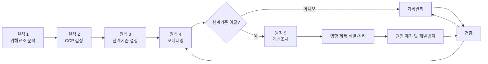
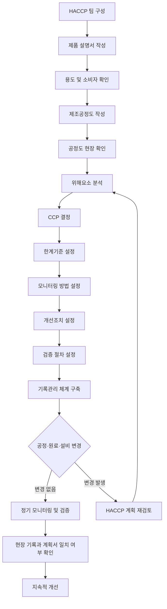
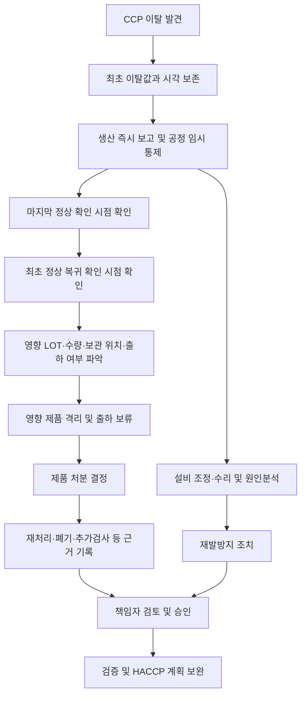

# [QA+ 블로그 생성 결과물] HC006 HACCP 7원칙 개념과효과
생성일시: 2026-08-27 14:41:40
적용모델: gpt-5.6-terra

================================================================================
# 📋 최종 발행용 블로그 패키지

### 1. 메타 데이터 (SEO 설정)

- **최종 포스팅 제목**: HACCP 7원칙 현장 적용법: CCP 결정부터 이탈 제품 격리·개선조치까지
- **메타 디스크립션 (120자 내외 요약)**: HACCP 7원칙을 암기가 아닌 현장 운영 체계로 이해하세요. 위해요소 분석, CCP 결정, 한계기준, 모니터링, 이탈 제품 격리, 검증·기록관리 실무를 정리했습니다.
- **추천 해시태그 (10개)**:  
  #HACCP #HACCP7원칙 #식품안전 #식품품질관리 #CCP #개선조치 #식품제조업 #HACCP심사 #식품위생 #품질관리
- **카테고리**: 식품품질실무 / HACCP가이드

> **검수 메모**  
> - 국내 법적 근거 표기는 「식품위생법」 제48조 및 식품의약품안전처 고시 「식품 및 축산물 안전관리인증기준」으로 정리했습니다.  
> - HACCP 12절차는 Codex Alimentarius의 「CXC 1-1969 General Principles of Food Hygiene」에서 제시하는 5개 예비절차와 7원칙의 연결 구조를 기준으로 했습니다.  
> - 실제 한계기준, 가열조건, 금속검출 감도, 시험주기 등은 품목·설비·공정별 밸리데이션 및 현행 법령·고시·사내 기준으로 최종 확인이 필요합니다.

---

## 2. 네이버 블로그 / 티스토리 복사용 최종 원고 (Markdown)

# HACCP 7원칙 현장 적용법: CCP 결정부터 이탈 제품 격리·개선조치까지

> **20년 실무 선배의 한 줄 요약**  
> HACCP 7원칙은 서류를 채우는 순서가 아니라, 식품의 위해요소를 미리 찾아 막고 문제 발생 시 제품까지 안전하게 통제하는 예방 관리 체계입니다.  
> 오늘부터는 “이 공정이 왜 CCP인가?”, “이탈 제품은 어디까지 격리해야 하는가?”에 답할 수 있도록 12절차와 7원칙을 연결해서 보시면 됩니다.

---

## 1. HACCP 7원칙을 외웠는데도 현장이 어려운 진짜 이유

HACCP 교육을 처음 들으면 보통 위해요소 분석, CCP 결정, 한계기준, 모니터링, 개선조치, 검증, 기록관리 순서로 외우게 됩니다. 그런데 막상 공장에 들어가면 “금속검출기는 왜 CCP인가요?”, “가열온도는 왜 이 숫자로 정했나요?” 같은 질문 앞에서 말문이 막히는 경우가 많습니다. 이는 7원칙을 각각 따로 외웠기 때문이지, 실무자가 부족해서가 아닙니다. HACCP은 항목 7개를 독립적으로 관리하는 제도가 아니라 앞 단계의 판단이 다음 단계의 근거가 되는 연결 구조입니다.

예를 들어 위해요소 분석에서 가열 후 제품에 병원성 미생물 위해가 남을 가능성이 중요하다고 평가했다면, 다음 단계에서는 그 위해를 실질적으로 줄이는 가열공정이 CCP 후보가 됩니다. 가열공정을 CCP로 결정했다면 안전 여부를 가를 수 있는 중심온도와 유지시간이라는 한계기준이 필요합니다. 그리고 그 기준이 지켜지는지 생산 중에 확인하는 활동이 모니터링입니다. 기준을 벗어났다면 해당 제품을 격리하고 원인을 제거하는 것이 개선조치이며, 이 전체 체계가 제대로 작동하는지 다시 확인하는 일이 검증입니다.

현장에서 가장 흔한 오해는 HACCP을 “검사 많이 하는 제도”로 보는 것입니다. 하지만 완제품 미생물검사 성적서가 많다고 해서 HACCP이 잘 운영되는 것은 아닙니다. 완제품 검사는 이미 만들어진 제품 일부를 확인하는 활동이고, HACCP은 위험이 생길 수 있는 공정을 미리 통제하는 활동입니다. 쉽게 말하면 완제품 검사는 시험이 끝난 뒤 채점하는 일이고, HACCP은 시험 중 실수하지 않도록 문제를 미리 관리하는 방식입니다.

또 하나 헷갈리는 부분은 CCP와 선행요건관리(PRP)의 구분입니다. 작업장 청소, 종업원 손 씻기, 방충·방서, 용수 관리, 세척·소독은 모두 매우 중요합니다. 그렇다고 해서 모두 CCP가 되는 것은 아닙니다. **CCP는 중요한 공정이라는 뜻이 아니라, 해당 단계에서 관리하지 못하면 식품안전 위해를 허용 가능한 수준으로 통제하기 어려운 ‘결정적 통제 지점’**이라는 뜻입니다.

> **현장 멘토 팁**  
> HACCP 문서를 볼 때 “이 항목은 뭘 쓰라는 거지?”보다 먼저 “이 위해를 막기 위해 바로 앞 단계에서 어떤 판단을 했지?”를 물어보세요. 이 연결만 잡히면 심사 질문에도 훨씬 단단하게 답할 수 있습니다.


*이미지 설명: 생산라인 전체가 한 방향으로 이어지고, QA 담당자가 장갑 낀 손으로 공정과 점검자료를 대조하는 장면입니다. 문서의 글자는 모두 흐리거나 뒤집어 읽을 수 없게 하여 HACCP 7원칙의 연결성을 장면 자체로 전달합니다.*



이제 왜 HACCP 7원칙이 따로 떨어진 업무가 아닌지 감이 오셨을 겁니다. 다음으로는 이 체계가 어떤 법적·국제적 기준 위에서 운영되는지, 그리고 왜 ‘12절차’까지 함께 봐야 하는지 정리해 보겠습니다.

---

## 2. HACCP의 공식 기준: 7원칙보다 먼저 알아야 할 12절차

국내 HACCP의 법적 근거는 「식품위생법」 제48조, 즉 식품안전관리인증기준에 있습니다. 이 조항은 식품의 원료 관리부터 제조·가공·조리·소분·유통에 이르는 과정에서 위해물질 혼입과 오염을 방지하기 위한 관리체계를 인증할 수 있도록 규정하고 있습니다. 실무 운영의 세부 기준은 식품의약품안전처 고시인 「식품 및 축산물 안전관리인증기준」에서 확인할 수 있습니다. 다만 고시의 세부 별표와 시행일은 개정될 수 있으므로, 심사 준비나 대외 문서 작성 전에는 반드시 국가법령정보센터의 현행 기준을 다시 확인하셔야 합니다.

국제적으로는 Codex Alimentarius의 **CXC 1-1969, General Principles of Food Hygiene**가 HACCP 개념의 기준점입니다. Codex는 HACCP을 7원칙만으로 설명하지 않고, 5개 예비절차를 먼저 수행한 뒤 7원칙을 적용하도록 제시합니다. 그래서 현장에서는 흔히 “HACCP 12절차”라고 부릅니다. 신입 담당자분들이 공정도 검증을 단순한 사전 서류 작업으로 오해하는데, 사실 이 단계가 틀리면 그 뒤 위해요소 분석부터 CCP 선정까지 전부 흔들립니다.

예를 들어 실제 공정에는 냉각 대기 시간이 있는데 공정도에는 빠져 있다고 가정해 보겠습니다. 그러면 냉각 지연에 따른 미생물 증식 가능성을 위해요소 분석에 반영하지 못할 수 있습니다. 또는 금속검출 전 재작업 공정이 추가되었는데 문서에 반영하지 않으면, 이물 위해의 유입 가능성과 관리 위치를 잘못 판단할 수 있습니다. 문서상 공정도와 현장이 일치하는지는 심사에서도 매우 자주 확인하는 부분입니다.

HACCP 팀도 이름만 올려두는 조직이 아닙니다. 제조, 품질, 생산, 시설·공무, 구매 또는 원료관리 담당자의 정보가 모여야 실제 위해요소를 빠뜨리지 않을 수 있습니다. 품질팀 혼자 작성하면 공정의 실제 작업 방식이 빠지고, 생산팀만 작성하면 법적 기준이나 미생물 위해 평가가 약해질 수 있습니다. 쉽게 말하면 HACCP 팀은 서류를 승인하는 회의체가 아니라, 식품안전 사고를 미리 상상하고 막는 실무 협업팀입니다.

| 구분 | 절차 | 현장에서 확인할 핵심 질문 | 대표 산출물 |
|---|---|---|---|
| 예비절차 1 | HACCP 팀 구성 | 제조·품질·설비 관점이 모두 들어갔는가? | 팀 구성표, 역할표 |
| 예비절차 2 | 제품 설명서 작성 | 원료, 보관조건, 포장, 유통기한이 정확한가? | 제품 설명서 |
| 예비절차 3 | 용도 및 소비자 확인 | 영유아, 고령자 등 민감 소비자 섭취 가능성은? | 제품 용도 분석 |
| 예비절차 4 | 제조공정도 작성 | 원료 입고부터 출하까지 빠진 단계가 없는가? | 공정 흐름도 |
| 예비절차 5 | 공정도 현장 확인 | 실제 동선·재작업·대기 공정까지 일치하는가? | 현장 확인 기록 |
| 원칙 1~7 | 위해 분석부터 기록관리 | 위해 통제 논리가 끊기지 않는가? | HACCP 관리계획서 및 기록 |



여기서 꼭 기억하실 점이 있습니다. 원료 변경, 포장재 변경, 신규 설비 도입, 제조실 동선 변경, 생산량 증가에 따른 공정시간 변경이 발생했다면 HACCP 계획도 재검토 대상이 될 수 있습니다. “작년 문서를 올해도 그대로 썼다”는 방식은 편해 보여도 심사와 식품안전 양쪽에서 리스크가 큽니다. 특히 OEM 제품 추가나 재작업 기준 변경은 제품 특성과 공정 흐름을 바꾸므로 반드시 팀 차원의 검토가 필요합니다.

12절차라는 뼈대를 이해했다면 이제 핵심인 HACCP 7원칙을 하나씩 보겠습니다. 다만 외우는 방식이 아니라, 실제로 어떤 질문에 답하기 위한 원칙인지 중심으로 보시면 훨씬 쉽게 정리됩니다.

---

## 3. HACCP 7원칙 한눈에 보기: 각 원칙은 무엇을 증명해야 할까요?

HACCP 7원칙의 출발점은 원칙 1인 위해요소 분석입니다. 위해요소는 크게 생물학적, 화학적, 물리적 위해요소로 나누어 검토합니다. 생물학적 위해요소에는 병원성 미생물, 화학적 위해요소에는 세척제 잔류·알레르겐 교차접촉·잔류농약 등이, 물리적 위해요소에는 금속·유리·경질 플라스틱 조각 등이 포함될 수 있습니다. 제품과 공정에 따라 위해요소의 종류와 중요도는 달라지므로, 다른 회사 양식을 그대로 복사하는 방식은 위험합니다.

원칙 2인 CCP 결정에서는 “중요한 공정인가?”가 아니라 “이 공정에서 반드시 통제해야 식품안전 위해를 예방·제거·감소할 수 있는가?”를 봐야 합니다. 예를 들어 가열공정은 병원성 미생물 저감의 핵심 단계가 될 수 있습니다. 반면 작업장 바닥 청소는 매우 중요하지만, 일반적으로는 위생관리와 세척·소독 같은 선행요건관리로 통제하는 경우가 많습니다. 물론 제품, 공정, 위해요소에 따라 판단은 달라질 수 있으므로 무조건적인 공식처럼 적용하면 안 됩니다.

원칙 3과 원칙 4는 현장 운영의 중심입니다. 한계기준(CL, Critical Limit)은 CCP가 관리 상태인지 아닌지를 가르는 객관적 경계값입니다. “충분히 가열한다”, “금속이 검출되지 않게 한다”는 문구는 좋은 의도일 뿐 한계기준이 될 수 없습니다. 제품 중심온도, 유지시간, 금속검출 감도, pH, 염도처럼 누가 측정해도 같은 판정이 나올 수 있는 수치와 방법이 있어야 합니다.

원칙 5부터 7까지는 문제가 생긴 뒤의 대응력과 증명력을 만듭니다. 개선조치는 이탈 제품의 안전한 통제와 원인 제거를 동시에 해야 합니다. 검증은 매일 기록에 도장 찍는 일이 아니라, 계획과 실행이 실제로 유효한지 확인하는 활동입니다. 마지막 기록관리는 “심사관에게 보여주기 위한 서류”가 아니라, 문제가 생겼을 때 제품 범위와 의사결정 근거를 추적하는 안전장치입니다.

| HACCP 7원칙 | 핵심 질문 | 실무 산출물 예시 | 현장에서 자주 하는 실수 |
|---|---|---|---|
| 1. 위해요소 분석 | 어떤 위해가 어디서 발생·증가할 수 있는가? | 위해요소 분석표, 원료 규격서 | 전년도 문서 복사 후 변경사항 미반영 |
| 2. CCP 결정 | 반드시 통제해야 할 결정적 단계인가? | CCP 결정 근거, 의사결정도 | 중요한 공정을 전부 CCP로 지정 |
| 3. 한계기준 설정 | 안전과 이탈을 가르는 경계값은? | 온도·시간·감도 기준, 근거자료 | “충분히” 같은 모호한 문구 사용 |
| 4. 모니터링 | 누가, 언제, 무엇을 확인할 것인가? | CCP 점검일지, 자동기록 | 사후 작성, 측정방법 불일치 |
| 5. 개선조치 | 이탈 제품과 원인을 어떻게 처리할 것인가? | 격리·처분·원인분석 기록 | 정상 재측정 후 제품 조치 누락 |
| 6. 검증 | 계획이 실제로 유효한가? | 기록검토, 교정, 시험검사 | 서명만 하고 경향분석 미실시 |
| 7. 기록관리 | 실행 사실을 어떻게 증명할 것인가? | 계획서, 일지, 개정이력 | 현장 문서와 최신본 불일치 |

한계기준의 근거는 식품공전의 기준·규격, 공인 가이드라인, 공정 밸리데이션 자료, 설비 제조사 사양, 시험성적서, 학술자료 등으로 확보할 수 있습니다. 단, 식품공전 수치가 있다고 해서 모든 공정 한계기준이 자동으로 정해지는 것은 아닙니다. 예를 들어 가열공정의 온도와 시간은 제품의 점도, 포장 크기, 충전량, 가열 방식에 따라 달라질 수 있습니다. 그래서 우리 제품과 우리 설비에서 그 기준이 유효하다는 근거를 갖추는 것이 중요합니다.

이제 각 원칙을 실제 현장에 심는 방법을 보겠습니다. 여기부터는 신입 담당자분들이 가장 많이 맡는 일지 작성과 이탈 대응까지, 바로 적용 가능한 방식으로 풀어드리겠습니다.

---

## 4. 원칙 1~3 실전 적용: 위해요소 분석, CCP 결정, 한계기준 설정

위해요소 분석표를 작성할 때는 공정명만 보지 말고 원료, 작업자, 설비, 환경, 보관, 재작업, 포장, 출하 단계까지 넓게 보셔야 합니다. 예를 들어 소스 제조공정에서는 원료의 미생물 위해뿐 아니라 알레르겐 원료의 교차접촉, 세척제 잔류, 충전 노즐 파손에 따른 이물 혼입 가능성도 검토 대상이 됩니다. 냉동식품이라면 냉동 자체가 미생물을 죽이는 공정이 아니라 증식을 억제하는 조건이라는 점도 구분해야 합니다. 위해요소를 “없음” 또는 “낮음”으로 평가했다면 왜 그렇게 판단했는지 원료 규격서, 공급업체 관리자료, 공정 조건 등 근거를 남기셔야 합니다.

CCP는 너무 많이 정한다고 안전해지지 않습니다. 오히려 하루에 20개 공정을 CCP로 관리하면 작업자는 기록에 쫓기고, 정말 중요한 가열·금속검출·냉각 같은 핵심 관리점이 묻힐 수 있습니다. CCP는 일반적으로 해당 단계에서 위해를 예방·제거하거나 허용 가능한 수준까지 감소시킬 수 있고, 관리 실패 시 뒤 공정에서 회복하기 어려운 경우에 설정합니다. 쉽게 말하면 “놓치면 나중에 되돌리기 힘든 안전의 마지막 관문인가?”를 보는 것입니다.

한계기준은 현장에서 지키기 편한 숫자가 아니라 안전을 판정할 수 있는 숫자여야 합니다. 가열 CCP라면 단순히 스팀 압력만 볼 것이 아니라, 실제 제품의 가장 차가운 지점이 목표 중심온도와 유지시간을 충족하는지 검토해야 합니다. 금속검출 CCP라면 Fe, Non-Fe, SUS 시편의 규격과 제품 통과 조건, 배출장치 작동 여부를 포함해 기준을 정해야 합니다. 수치 예시는 공장마다 다르지만, 예컨대 중심온도 **75℃ 이상 1분 유지** 같은 조건을 쓰려면 해당 제품의 미생물 위해 저감에 유효하다는 밸리데이션 또는 공인 근거가 있어야 합니다.

한계기준과 내부 관리기준을 구분하는 것도 실무에서 중요합니다. 한계기준은 넘으면 곧바로 이탈로 판정되는 안전 경계선입니다. 반면 내부 경보 기준은 한계기준에 도달하기 전에 이상 경향을 발견해 선제적으로 조치하기 위한 관리목표가 될 수 있습니다. 예를 들어 냉각 CCP의 한계기준보다 더 보수적인 내부 목표를 두면, 설비 성능 저하를 일찍 발견할 수 있습니다.

> **★ 심사 대응 꿀팁**  
> 심사관이 “왜 이 공정이 CCP입니까?”라고 물으면 “원래 그렇게 관리해 왔습니다”라고 답하면 약합니다.  
> **“이 공정에서 ○○ 위해요소를 저감할 수 있고, 이후 공정에서는 같은 수준의 통제가 어려우므로 위해요소 분석과 CCP 결정 근거에 따라 선정했습니다”**라고 설명하시면 됩니다.


*이미지 설명: 세척·위생·보관 같은 선행요건관리 영역과 가열·금속검출 같은 CCP 영역을 실제 장비와 공간 배치로 구분한 식품 제조라인 이미지입니다. 이미지 안에는 PRP나 CCP 같은 글자를 삽입하지 않고 장비의 성격과 배치만으로 차이를 표현합니다.*

여기까지가 HACCP 설계라면, 다음 단계는 설계된 기준을 실제 생산 중에 살아 움직이게 만드는 일입니다. 특히 모니터링과 개선조치는 일지 한 장의 문제가 아니라 제품 안전과 직결되는 영역입니다.

---

## 5. 원칙 4~5 실전 적용: 모니터링과 개선조치는 이렇게 운영합니다

모니터링은 CCP가 지금 이 순간 한계기준 안에서 관리되는지를 확인하는 활동입니다. 따라서 모니터링 계획에는 최소한 **누가(담당자), 언제(주기), 무엇을(측정 항목), 어떻게(측정 방법·기기), 어떤 기준으로(판정 기준), 이상 시 누구에게 보고하는지**가 명확해야 합니다. “매일 확인한다”는 문구만으로는 부족합니다. 예를 들어 가열공정이라면 배치별 확인인지, 2시간마다 확인인지, 연속 자동기록인지가 구체적으로 정리되어야 합니다.

자동기록계를 사용한다고 해서 모니터링 책임이 사라지는 것은 아닙니다. 자동 데이터가 누락되지 않는지, 설정값과 실제값의 차이는 없는지, 경보 발생 시 담당자가 어떻게 조치하는지까지 관리되어야 합니다. 온도기록이 자동 저장되더라도 제품 중심온도 확인이 필요한 공정이라면 별도의 측정 또는 검증 절차가 필요할 수 있습니다. 설비 화면에 정상값이 보인다는 사실과 제품이 안전하다는 사실은 완전히 같은 말이 아닙니다.

CCP 이탈이 발생했을 때 현장에서는 우선 생산을 빨리 정상화하고 싶어 합니다. 하지만 가장 먼저 해야 할 일은 설비 조정보다 **영향 제품의 식별과 격리**입니다. 이탈 시점 이전 마지막 정상 확인 시점부터, 이탈이 확인되고 공정이 정상으로 복귀한 뒤 최초 정상 확인 시점까지의 제품 범위를 정해야 합니다. LOT 번호, 생산시간, 수량, 보관 위치, 출하 여부를 확인해 출하 보류 또는 격리 조치를 하셔야 합니다.

개선조치는 두 갈래로 기록해야 합니다. 첫째는 제품 조치입니다. 해당 제품을 재가열할 수 있는지, 재선별할 수 있는지, 폐기해야 하는지, 추가 시험을 해야 하는지 등 처분 근거를 남겨야 합니다. 둘째는 공정 조치입니다. 온도센서 이상, 스팀 공급 불량, 작업자 설정 오류, 설비 부품 마모처럼 근본 원인을 분석하고 재발방지 조치를 해야 합니다.

| 이탈 발생 직후 순서 | 반드시 할 일 | 기록에 남길 내용 | 빠지기 쉬운 함정 |
|---|---|---|---|
| 1 | 이탈 사실 확인 | 측정값, 시각, 설비 상태 | 재측정만 하고 최초 이탈값 삭제 |
| 2 | 영향 제품 범위 설정 | 마지막 정상~최초 정상 사이 LOT | 이탈 순간의 제품만 격리 |
| 3 | 제품 격리·출하보류 | 수량, 위치, 식별표 부착 | 창고 재고와 출하분 미확인 |
| 4 | 공정 정상화 | 설비 조정·수리 내용 | 정상화 조치만 기록 |
| 5 | 제품 처분 결정 | 재처리·폐기·검사 근거 | “이상 없음”으로 임의 출하 |
| 6 | 원인분석·재발방지 | 5Why, 교육, 부품교체, 절차개정 | “주의한다”로 마무리 |
| 7 | 책임자 검토 | 검토일, 판단 근거, 승인 | 담당자 단독 종결 |



모니터링 일지에서 특히 조심할 부분은 사후 작성입니다. 모든 시간이 똑같거나, 수치가 장기간 지나치게 동일하거나, 수정 흔적이 많은 기록은 심사에서 신뢰성을 의심받기 쉽습니다. 잘못 쓴 기록은 지우거나 수정테이프로 가리지 말고, 회사 절차에 따라 원기록이 보이도록 정정하고 사유·일자·확인자를 남기는 방식으로 관리하셔야 합니다. 기록은 예쁘게 만드는 문서가 아니라 당시 현장에서 실제로 무슨 일이 있었는지 보여주는 증거입니다.

이탈 대응까지 준비했다면 이제 “우리가 만든 체계가 진짜 효과가 있는가?”를 확인해야 합니다. 이 역할을 하는 것이 원칙 6, 검증입니다.

---

## 6. 원칙 6~7 실전 적용: 검증과 기록관리가 심사 대응력을 만듭니다

모니터링과 검증은 비슷해 보이지만 목적과 시점이 다릅니다. 모니터링은 생산 중 또는 직후에 CCP가 한계기준 안에 있는지 보는 활동입니다. 검증은 그 기준 자체가 유효한지, 측정기기가 정확한지, 기록이 신뢰할 만한지, 개선조치가 제대로 끝났는지를 확인하는 활동입니다. 쉽게 말하면 모니터링은 “지금 잘 돌아가나?”를 보는 것이고, 검증은 “이 관리 방법 자체가 맞나?”를 확인하는 일입니다.

가열 CCP를 예로 들면, 매 배치 중심온도를 기록하는 것은 모니터링입니다. 온도계 교정 또는 검증 상태를 확인하고, 기록 누락 여부를 검토하며, 정기 미생물 시험 결과와 가열조건의 유효성을 평가하는 것은 검증입니다. 또 가열설비를 교체했거나 제품 중량이 250g에서 500g으로 변경되었다면 기존 가열조건이 여전히 유효한지 재평가해야 합니다. 이 부분을 놓치면 문서상 HACCP은 유지되지만 실제 제품 안전성은 달라질 수 있습니다.

검증은 심사 전날 몰아서 서명하는 업무가 아닙니다. 월간 기록 검토, 측정기기 교정·검증 일정, 내부검증, 환경 모니터링, 제품 시험검사 결과 분석, 클레임 및 반품 분석을 연간 계획으로 운영하는 편이 좋습니다. 예를 들어 금속검출기 검증시편 확인 결과가 최근 한 달간 자주 재시험으로 이어졌다면, 단순히 “정상”으로 끝내지 말고 컨베이어 진동, 제품 수분 변화, 감도 설정, 배출장치 상태를 검토해야 합니다. 검증의 핵심은 이상 경향을 발견해 사고 전에 개선하는 데 있습니다.

기록관리와 문서화는 HACCP 7원칙의 마지막이지만, 실제로는 전 과정에 걸쳐 있습니다. HACCP 계획서, 위해요소 분석표, CCP 모니터링 일지, 이탈·개선조치서, 검증 기록, 교육 기록, 측정기기 관리대장, 문서 개정이력은 서로 연결되어야 합니다. 공정도는 최신본인데 현장 작업표준서는 구본이거나, 계획서상 모니터링 주기는 2시간인데 일지는 4시간 단위라면 심사에서 바로 불일치로 보입니다. 문서번호, 개정일, 배포처, 폐기된 구본 회수 상태까지 관리해 두시면 이런 문제를 크게 줄일 수 있습니다.

> **기록 검토할 때 꼭 볼 4가지**  
> 1. 빠진 날짜·시간·서명은 없는가  
> 2. 측정값이 비현실적으로 반복되지는 않는가  
> 3. 이탈 발생 시 제품 격리와 처분 근거가 있는가  
> 4. 개선조치가 재발방지와 문서·교육·설비 개선으로 이어졌는가

HACCP의 효과는 인증서가 벽에 붙어 있는 데서 나오지 않습니다. 기록이 현장과 일치하고, 이탈 시 제품을 통제하며, 검증 결과가 개선으로 이어질 때 비로소 HACCP은 비용과 사고를 줄이는 시스템이 됩니다.

---

## 7. 사례 1. 냉동만두 제조공장: 가열 CCP 이탈 후 제품 격리 범위를 바로잡은 사례

냉동만두를 제조하는 한 공장에서 증숙공정의 제품 중심온도를 배치별로 관리하고 있었습니다. 어느 날 오후 생산 중 측정값이 내부 한계기준보다 낮게 확인됐지만, 작업자는 스팀 밸브를 조정한 뒤 다음 측정에서 정상값이 나온 것을 보고 생산을 계속했습니다. 당시 개선조치 기록에는 “스팀 압력 조정 후 정상 확인”이라고만 작성되어 있었습니다. 며칠 뒤 내부점검에서 이탈 시간대에 생산된 만두의 LOT와 수량, 보관 위치, 출하 여부가 전혀 확인되지 않는 문제가 발견됐습니다.

문제의 직접 원인은 스팀 공급 압력 저하였지만, 근본 원인은 이탈 대응 절차가 설비 정상화 중심으로 작성되어 있었다는 점이었습니다. 작업자는 “다음 제품이 정상으로 나왔으니 이전 제품도 괜찮을 것”이라고 생각했습니다. 하지만 가열 이탈 제품은 이미 충분한 살균 조건을 충족하지 못했을 가능성이 있으므로, 설비가 정상으로 돌아온 것만으로 안전성이 보장되지 않습니다. 마지막 정상 중심온도 확인 시점부터 설비 조정 후 최초 정상 확인 시점까지의 생산분을 영향 범위로 보는 원칙이 필요했습니다.

개선조치로 공장은 이탈대응서를 개정했습니다. 이탈 발생 시 작업자는 즉시 현장 반장과 QA에 보고하고, 해당 시간대 제품에 보류표를 부착하도록 절차를 바꿨습니다. QA는 생산일지·급속동결 입고기록·창고재고·출하전표를 대조해 영향 LOT를 확정하도록 했습니다. 또한 제품 처분은 재증숙 가능 여부, 포장 상태, 시간 경과, 미생물 위해 평가를 근거로 HACCP 팀이 결정하도록 역할을 명확히 했습니다.

설비 측면에서는 스팀 압력계 점검주기와 보일러 공급 상태 확인 항목을 추가했습니다. 작업자 교육도 “이탈이 나면 설비를 먼저 고치는 것이 아니라 제품을 먼저 묶는다”는 문장으로 바꿨습니다. 이후 같은 유형의 압력 저하가 한 번 더 발생했을 때 현장에서는 10분 안에 영향 제품을 격리했고, 출하 전 제품까지 신속하게 추적할 수 있었습니다. 결과적으로 대량 회수 가능성을 사전에 차단했고, 자체검증에서도 이탈 대응의 제품 조치와 공정 조치가 모두 확인됐습니다. 이 사례는 개선조치가 단순 설비수리 기록이 아니라는 점을 아주 분명하게 보여줍니다.

이런 경험을 해보면 “CCP 이탈이 없게 만드는 것”만큼 “이탈했을 때 안전하게 통제하는 것”이 중요하다는 사실을 체감하게 됩니다. 다음 사례에서는 CCP를 너무 많이 설정해 오히려 관리가 약해졌던 소스 제조 현장을 보겠습니다.

---

## 8. 사례 2. 액상소스 제조공장: CCP를 줄이고 선행요건관리를 강화한 사례

액상 양념소스를 생산하는 한 제조업체는 HACCP 인증 준비 과정에서 원료 입고, 계량, 혼합, 가열, 충전, 캡핑, 금속검출, 포장까지 총 8개 공정을 CCP로 지정했습니다. 담당자는 중요한 공정을 빠짐없이 CCP로 잡아야 심사에 유리할 것이라고 생각했습니다. 그러나 실제 생산 현장에서는 CCP 기록이 너무 많아 작업자가 동일한 내용을 여러 일지에 반복 기재하고 있었습니다. 특히 원료 계량과 캡핑 공정에서는 측정 가능한 한계기준이 불명확해 “이상 없음”이라는 표현만 반복됐습니다.

내부 사전심사에서 가장 큰 지적은 CCP 선정 논리의 부족이었습니다. 원료 계량 시 알레르겐 교차접촉 위험은 중요했지만, 해당 위해는 원료 보관구역 분리, 전용 도구 사용, 생산순서 관리, 세척·검증 등 선행요건관리로 통제하는 체계가 더 적절했습니다. 캡핑 공정 역시 포장 밀봉 상태가 중요하다는 이유만으로 CCP가 되었지만, 실제 위해요소와 통제수단, 한계기준의 연결이 약했습니다. 반대로 가열공정과 금속검출공정은 미생물 위해 저감 및 금속이물 제거라는 명확한 통제 목적이 있어 CCP로 유지할 근거가 충분했습니다.

HACCP 팀은 공정별 위해요소 분석을 다시 실시했습니다. 발생 가능성, 심각성, 기존 관리수단, 이후 공정의 통제 가능성을 검토하고 CCP 결정 근거를 표준화했습니다. 그 결과 가열과 금속검출을 핵심 CCP로 재정리하고, 알레르겐·세척소독·개인위생·용수·해충관리는 선행요건관리 프로그램에서 관리 책임과 점검 기준을 강화했습니다. CCP 개수는 줄었지만, 각 CCP의 한계기준과 모니터링 방법은 오히려 더 구체적으로 정리됐습니다.

가열공정은 제품 중심온도와 유지시간, 측정 위치, 배치별 측정 원칙을 명확히 했습니다. 금속검출은 생산 시작 전, 품목 전환 시, 일정 시간 간격, 생산 종료 시에 검증시편과 배출장치 작동을 확인하도록 절차를 구체화했습니다. 알레르겐 관리에서는 생산순서표, 세척확인, 라벨 확인, 전용 용기 관리 기록을 선행요건관리 문서에 연결했습니다. 담당자들은 일지 수가 줄어든 것을 단순히 업무가 편해진 것으로 느꼈지만, 실제 핵심은 중요한 위해요소에 집중할 수 있게 된 데 있었습니다.

개선 후 자체평가에서는 기록 누락과 사후 작성 사례가 크게 감소했습니다. 심사 대응 시에도 “왜 이 공정은 CCP가 아니냐”는 질문에 선행요건관리의 통제방법과 점검기준을 근거로 설명할 수 있었습니다. 결과적으로 이 공장은 CCP를 많이 둔 공장이 아니라, 위해요소별로 맞는 관리수단을 선택한 공장으로 평가받게 됐습니다. 이거 현장에서 정말 많이 헷갈리는데요, **CCP를 줄이는 것이 관리 수준을 낮추는 일이 아니라 핵심 위해에 집중하기 위한 정리 작업**일 수 있습니다.

CCP와 PRP의 역할이 정리되면 그다음에는 한계기준의 과학적 근거가 중요해집니다. 세 번째 사례는 설비 설정값과 실제 제품 안전성을 혼동했던 레토르트 제품 현장입니다.

---

## 9. 사례 3. 레토르트 죽 제조공장: 설비 표시온도만 보다가 밸리데이션을 강화한 사례

레토르트 죽을 생산하는 한 공장은 살균기 화면에 표시되는 온도와 압력 기록을 CCP 모니터링의 핵심 자료로 사용하고 있었습니다. 작업자들은 설정 온도에 도달하면 살균이 정상적으로 완료된 것으로 판단했습니다. 그런데 신제품 출시를 위해 파우치 충전량을 기존 280g에서 420g으로 변경하면서 문제가 발생했습니다. 설비의 설정 온도와 시간은 기존 제품과 같았지만, 제품 중심부가 목표 조건에 도달하는 데 걸리는 시간이 달라질 가능성이 생긴 것입니다.

이 공장은 처음에 “설비 온도는 같으니 문제없다”고 판단했습니다. 하지만 HACCP 팀 검토 과정에서 포장 크기와 충전량 변화가 열전달 특성에 영향을 줄 수 있다는 점을 확인했습니다. 특히 점도가 높은 죽 제품은 내용물의 대류가 제한될 수 있어, 가장 차가운 지점의 가열 상태를 별도로 확인할 필요가 있었습니다. 직접 원인은 신제품 변경관리 단계에서 가열조건 재검토가 빠진 것이었고, 근본 원인은 설비 설정값을 제품 안전성의 직접 증거로 받아들인 데 있었습니다.

개선조치로 공장은 신제품 및 중량 변경 시 HACCP 재평가 체크리스트를 도입했습니다. 제품 중량, 점도, 포장재, 충전온도, 적재 방식, 살균 조건 중 하나라도 변경되면 HACCP 팀이 검토하도록 했습니다. 또한 열분포·열침투 관련 검토와 외부 전문기관 또는 적절한 기술 자료를 활용해 공정 밸리데이션을 실시했습니다. 그 결과 기존 조건을 단순 적용하는 대신, 변경 제품에 맞는 안전성 검토 근거를 확보할 수 있었습니다.

모니터링 기록도 개선했습니다. 살균기 자동기록뿐 아니라 배치번호, 제품명, 충전량, 살균 프로그램 번호, 이상 경보 여부를 연결해 추적성을 높였습니다. 검증 단계에서는 온도센서의 교정 상태, 자동기록 데이터 누락 여부, 제품별 프로그램 적용의 적절성을 월간으로 검토했습니다. 기존에는 “살균기 정상 작동” 한 줄로 끝나던 검증 기록이 변경관리와 제품 안전성 평가까지 포함하도록 바뀌었습니다. 심사 시에도 한계기준이 단순히 현장에서 편한 설정값이 아니라 제품 특성에 맞춰 검토된 기준이라는 점을 설명할 수 있었습니다.

이 사례의 핵심은 아주 단순합니다. **설비가 정상이라는 것과 제품이 안전하다는 것은 같은 말이 아닙니다.** 설비 표시값, 제품 중심 조건, 공정 밸리데이션, 측정기기 신뢰성, 변경관리까지 이어져야 한계기준의 근거가 단단해집니다. 특히 레토르트, 가열소스, 냉장 HMR처럼 열처리 조건이 제품 안전에 직접 연결되는 품목은 제품 변경 시 더 꼼꼼하게 보셔야 합니다.

세 사례를 보면 HACCP이 왜 인증용 서류가 아니라 현장 의사결정 체계인지 이해되실 겁니다. 이제 심사와 자체점검에서 특히 자주 나오는 질문을 FAQ 형식으로 정리해 보겠습니다.

---

## 10. HACCP 7원칙 FAQ: 심사 전 꼭 정리해야 할 질문 6가지

### Q1. CCP는 많을수록 좋은가요?

**A. 아닙니다.** CCP는 많고 적음이 아니라 위해요소 통제 필요성과 통제 가능성에 따라 합리적으로 선정해야 합니다. 불필요하게 많은 CCP는 작업자의 기록 부담을 높이고 핵심 관리점에 대한 집중력을 떨어뜨릴 수 있습니다. 반대로 선행요건관리만으로 통제하기 어려운 핵심 위해요소를 빼먹는 것도 위험하므로, 위해요소 분석과 결정 근거를 함께 갖추는 것이 중요합니다.

### Q2. 한계기준(CL)과 내부 관리기준은 같은 뜻인가요?

**A. 구분해서 운영하는 것이 좋습니다.** 한계기준은 벗어나는 순간 CCP 이탈로 판정하고 제품 조치와 개선조치가 시작되는 안전 경계값입니다. 내부 관리기준 또는 경보 기준은 한계기준에 도달하기 전 이상 경향을 발견하기 위한 더 보수적인 목표치가 될 수 있습니다. 두 기준을 함께 쓴다면 계획서와 작업표준서에 용어, 조치 수준, 책임자를 명확히 구분해 두셔야 합니다.

### Q3. 모니터링과 검증은 정확히 어떻게 다른가요?

**A. 모니터링은 공정 중 관리상태 확인이고, 검증은 시스템의 유효성 확인입니다.** 가열온도를 배치마다 확인하는 것은 모니터링이고, 온도계 교정 상태를 확인하거나 월간 기록을 검토하고 미생물 시험 결과를 분석하는 것은 검증입니다. 모니터링은 이탈을 빨리 발견하기 위한 것이고, 검증은 “우리가 이탈을 제대로 발견할 수 있는 방식으로 관리하고 있는가”를 보는 활동입니다.

### Q4. CCP 이탈 후 재측정이 정상이라면 제품을 그냥 출하해도 되나요?

**A. 바로 출하하면 안 됩니다.** 재측정 정상값은 설비 또는 공정이 현재 정상으로 복귀했다는 정보일 뿐, 이탈 시간대에 생산된 제품의 안전성을 보장하지는 않습니다. 마지막 정상 확인 시점부터 최초 정상 복귀 확인 시점 사이의 제품을 식별·격리한 뒤, 재처리·폐기·추가 검사 등 처분을 근거에 따라 판단해야 합니다.

### Q5. CCP 이탈이 한 번도 없으면 HACCP이 잘 운영되는 것인가요?

**A. 이탈이 없다는 사실만으로 충분하지 않습니다.** 측정기기가 정확한지, 모니터링 주기가 위해를 발견하기에 적절한지, 기록이 실시간으로 작성되는지, 모든 수치가 지나치게 동일하지는 않은지 함께 봐야 합니다. 수년 동안 완벽하게 같은 값만 기록된다면 공정이 완벽하다는 뜻일 수도 있지만, 기록 신뢰성을 점검해야 할 신호일 수도 있습니다.

### Q6. 원료나 설비가 바뀌면 HACCP 계획을 무조건 전부 다시 작성해야 하나요?

**A. 무조건 처음부터 전부 작성한다기보다 변경이 위해요소와 관리수단에 미치는 영향을 평가해야 합니다.** 원료의 알레르겐 정보, 미생물 규격, 공급처, 포장재, 충전량, 가열조건, 공정 동선, 설비 성능이 바뀌면 위해요소 분석과 CCP·한계기준의 재검토가 필요할 수 있습니다. 변경관리 기록에 검토 내용, HACCP 팀 판단, 필요한 밸리데이션 또는 교육 결과를 남겨 두시면 심사 대응에도 도움이 됩니다.

FAQ에서 보셨듯 HACCP의 어려운 지점은 결국 문서가 아니라 판단입니다. 그래서 마지막으로 일상적으로 활용할 수 있는 점검표를 정리해 드리겠습니다.

---

## 11. HACCP 7원칙 단계별 자체점검 체크리스트

아래 표는 정기심사 직전에만 보는 체크리스트가 아닙니다. 월간 품질회의, 내부검증, 신규 담당자 교육, 공정 변경 검토 때 활용하시면 좋습니다. 한 번에 모든 항목을 완벽하게 고치려 하기보다, 담당 공정 하나를 골라 빈칸부터 메우는 방식이 현실적입니다. 특히 “근거 없음”, “담당자 불명확”, “이탈 제품 범위 미정”은 우선순위를 높게 두고 보완하셔야 합니다.

| 점검 영역 | 확인 항목 | 권장 확인 주기 | 확인 방법 | 이상 시 조치 |
|---|---|---:|---|---|
| HACCP 팀 | 팀원 역할과 연락체계가 최신인가 | 연 1회 및 인사변동 시 | 조직도·발령 현황 대조 | 팀 구성 및 역할표 개정 |
| 제품 설명서 | 원료·포장·보관·유통기한 정보가 최신인가 | 제품 변경 시 | 규격서·라벨·생산처방 대조 | 제품 설명서 개정 |
| 공정도 | 재작업·대기·검사·보관 단계가 반영됐는가 | 연 1회 및 공정 변경 시 | 현장 동선 실사 | 공정도 및 분석표 수정 |
| 위해요소 분석 | 중요·비중요 판단에 근거가 있는가 | 연 1회 및 변경 시 | 규격서·시험성적서·문헌 검토 | 위해평가 재실시 |
| CCP 결정 | CCP와 PRP 구분 논리가 명확한가 | 연 1회 및 변경 시 | 결정표·회의록 검토 | CCP 재선정 |
| 한계기준 | 수치·측정방법·근거자료가 있는가 | 연 1회 및 변경 시 | 밸리데이션·법령·사양 확인 | 기준 재설정 및 승인 |
| 모니터링 | 담당자·주기·기기·판정이 일치하는가 | 일일 또는 배치별 | 일지와 현장 관찰 | 재교육·절차 보완 |
| 개선조치 | 제품 격리와 원인 제거가 모두 기록됐는가 | 이탈 발생 즉시 | 이탈보고서·재고 대조 | 제품 처분 및 CAPA 실시 |
| 검증 | 기록검토·교정·시험·현장확인이 운영되는가 | 월간·분기·연간 | 검증계획 대비 실적 확인 | 검증계획 보완 |
| 문서관리 | 최신본과 현장 사용본이 일치하는가 | 월 1회 | 문서번호·개정일 확인 | 구본 회수·최신본 배포 |

체크리스트를 운영할 때는 “점검 완료” 표시만 남기지 마세요. 발견된 문제의 내용, 원인, 책임자, 완료기한, 완료 확인까지 이어져야 개선 활동이 됩니다. 예를 들어 온도계 교정성적서가 만료됐다면 단순히 새 성적서를 받는 것에서 끝내지 말고, 만료 기간에 사용한 측정값의 신뢰성 영향도 평가해야 합니다. 이런 판단 기록이 있어야 검증이 실제 유효성 확인으로 인정받습니다.

또한 내부점검은 품질팀 혼자 하는 것보다 생산·공무 담당자와 함께 현장을 걸어보는 방식이 훨씬 효과적입니다. 문서에는 없는 임시 작업대, 변경된 원료 보관 위치, 실제와 다른 재작업 동선은 사무실에서는 잘 보이지 않습니다. 현장 작업자에게 “이탈 나면 제품을 어디에 두나요?”, “이 온도계는 언제 확인했나요?”라고 직접 물어보시면 문서와 실행의 간격이 바로 드러납니다. 이 간격을 줄이는 것이 HACCP 운영의 핵심입니다.

---

## 12. HACCP 7원칙이 만드는 실제 효과: 인증보다 중요한 운영의 힘

HACCP을 제대로 운영하면 첫 번째로 식품안전 사고 예방력이 높아집니다. 위해요소를 사전에 분석하고 가장 중요한 통제 지점을 관리하기 때문에, 문제가 완제품이나 소비자 단계까지 가기 전에 발견할 가능성이 커집니다. 물론 HACCP이 모든 사고를 자동으로 막아주는 만능장치는 아닙니다. 하지만 사고가 날 수 있는 구조를 미리 찾아 관리한다는 점에서 사후 검사 중심 관리와는 큰 차이가 있습니다.

두 번째 효과는 추적성과 대응 속도입니다. CCP 기록, 생산 LOT, 원료 LOT, 보관 위치, 출하 정보가 연결되어 있으면 문제 발생 시 영향 제품 범위를 빠르게 좁힐 수 있습니다. 반대로 기록이 누락되거나 사후 작성되면 불확실한 범위까지 넓게 회수·폐기해야 할 가능성이 커집니다. HACCP 기록은 종이 비용이 아니라, 사고 발생 시 손실 규모를 줄이는 보험에 가깝습니다.

세 번째 효과는 현장 업무의 표준화입니다. 숙련 작업자의 감각에만 의존하던 “이 정도면 됐어”라는 판단이 온도, 시간, 감도, 확인주기, 책임자라는 공통 언어로 정리됩니다. 신규 작업자가 들어와도 같은 기준으로 교육할 수 있고, 생산량이 늘어나거나 교대조가 바뀌어도 관리 수준을 유지하기가 쉬워집니다. 쉽게 말하면 HACCP은 베테랑 한 사람의 경험을 공장 전체가 재현할 수 있는 시스템으로 바꾸는 과정입니다.

마지막 효과는 거래처와 소비자 신뢰입니다. B2B 납품, 유통채널 입점, 고객사 실사에서는 단순히 “우리는 깨끗하게 만듭니다”라는 말보다 위해요소 관리 근거와 추적체계가 있는지가 중요합니다. 다만 인증서만 있다고 신뢰가 완성되지는 않습니다. 현장 일지, 이탈 대응, 개선조치, 검증, 변경관리가 실제로 돌아갈 때 HACCP은 거래처와 소비자가 믿을 수 있는 운영 역량이 됩니다.

---

## 13. 맺음말: HACCP 7원칙은 기록의 7단계가 아니라 식품안전의 사고방식입니다

오늘 내용을 딱 세 줄로 정리하면 이렇습니다.

1. **위해요소 분석부터 기록관리까지는 따로 떨어진 업무가 아니라 하나의 논리로 연결돼야 합니다.**  
2. **CCP는 중요한 공정이 아니라, 식품안전 위해를 결정적으로 통제해야 하는 공정입니다.**  
3. **이탈 시에는 설비 정상화보다 영향 제품 격리가 먼저이고, 검증은 서명이 아니라 유효성 확인입니다.**

HACCP 7원칙은 처음에는 복잡한 문서 체계처럼 보일 수 있습니다. 하지만 결국은 “어떤 위험이 있는지 찾고, 반드시 관리할 곳을 정하고, 기준을 지키며, 문제가 생기면 제품까지 안전하게 통제하고, 그 결과를 증명하는 과정”입니다. 오늘은 거창하게 전 공정을 바꾸려 하지 마시고, 본인이 맡은 CCP 하나만 골라 한계기준의 근거와 이탈 시 제품 격리 방법부터 다시 확인해 보세요.

> 완벽하게 두꺼운 HACCP 파일보다 중요한 것은, 이탈이 발생한 순간 현장 작업자가 망설이지 않고 제품을 격리하고 정확한 기록을 남길 수 있는 시스템입니다.

막히는 부분이 있으면 댓글로 편하게 질문해 보세요. HACCP 심사 준비와 현장 운영 모두에 도움이 되시길 바랍니다.

---

## 3. 워드프레스 / 웹사이트용 HTML 원고

```html
<article class="food-qa-post" lang="ko">
  <header>
    <h1>HACCP 7원칙 현장 적용법: CCP 결정부터 이탈 제품 격리·개선조치까지</h1>
    <p class="lead"><strong>20년 실무 선배의 한 줄 요약:</strong> HACCP 7원칙은 서류를 채우는 순서가 아니라, 식품의 위해요소를 미리 찾아 막고 문제 발생 시 제품까지 안전하게 통제하는 예방 관리 체계입니다.</p>
  </header>

  <section>
    <h2>1. HACCP 7원칙을 외웠는데도 현장이 어려운 진짜 이유</h2>
    <p>HACCP 교육을 처음 들으면 보통 위해요소 분석, CCP 결정, 한계기준, 모니터링, 개선조치, 검증, 기록관리 순서로 외우게 됩니다. 그런데 막상 공장에 들어가면 “금속검출기는 왜 CCP인가요?”, “가열온도는 왜 이 숫자로 정했나요?” 같은 질문 앞에서 말문이 막히는 경우가 많습니다. 이는 7원칙을 각각 따로 외웠기 때문이지, 실무자가 부족해서가 아닙니다. HACCP은 항목 7개를 독립적으로 관리하는 제도가 아니라 앞 단계의 판단이 다음 단계의 근거가 되는 연결 구조입니다.</p>
    <p>예를 들어 위해요소 분석에서 가열 후 제품에 병원성 미생물 위해가 남을 가능성이 중요하다고 평가했다면, 다음 단계에서는 그 위해를 실질적으로 줄이는 가열공정이 CCP 후보가 됩니다. 가열공정을 CCP로 결정했다면 안전 여부를 가를 수 있는 중심온도와 유지시간이라는 한계기준이 필요합니다. 그리고 그 기준이 지켜지는지 생산 중에 확인하는 활동이 모니터링입니다. 기준을 벗어났다면 해당 제품을 격리하고 원인을 제거하는 것이 개선조치이며, 이 전체 체계가 제대로 작동하는지 다시 확인하는 일이 검증입니다.</p>
    <p>현장에서 가장 흔한 오해는 HACCP을 “검사 많이 하는 제도”로 보는 것입니다. 하지만 완제품 미생물검사 성적서가 많다고 해서 HACCP이 잘 운영되는 것은 아닙니다. 완제품 검사는 이미 만들어진 제품 일부를 확인하는 활동이고, HACCP은 위험이 생길 수 있는 공정을 미리 통제하는 활동입니다.</p>
    <p>또 하나 헷갈리는 부분은 CCP와 선행요건관리(PRP)의 구분입니다. 작업장 청소, 종업원 손 씻기, 방충·방서, 용수 관리, 세척·소독은 모두 매우 중요합니다. 그렇다고 해서 모두 CCP가 되는 것은 아닙니다. <strong>CCP는 중요한 공정이라는 뜻이 아니라, 해당 단계에서 관리하지 못하면 식품안전 위해를 허용 가능한 수준으로 통제하기 어려운 결정적 통제 지점이라는 뜻입니다.</strong></p>

    <aside class="tip">
      <p><strong>현장 멘토 팁</strong><br>HACCP 문서를 볼 때 “이 항목은 뭘 쓰라는 거지?”보다 먼저 “이 위해를 막기 위해 바로 앞 단계에서 어떤 판단을 했지?”를 물어보세요. 이 연결만 잡히면 심사 질문에도 훨씬 단단하게 답할 수 있습니다.</p>
    </aside>

    <figure>
      
      <figcaption>생산라인의 연결 구조와 점검기록을 함께 확인하는 QA 담당자 모습</figcaption>
    </figure>

    <div class="mermaid">
flowchart LR
    A[원칙 1<br/>위해요소 분석] --> B[원칙 2<br/>CCP 결정]
    B --> C[원칙 3<br/>한계기준 설정]
    C --> D[원칙 4<br/>모니터링]
    D --> E{한계기준 이탈?}
    E -- 아니오 --> F[기록관리]
    F --> G[검증]
    G --> D
    E -- 예 --> H[원칙 5<br/>개선조치]
    H --> I[영향 제품 식별·격리]
    I --> J[원인 제거 및 재발방지]
    J --> G
    G --> F
    </div>
  </section>

  <section>
    <h2>2. HACCP의 공식 기준: 7원칙보다 먼저 알아야 할 12절차</h2>
    <p>국내 HACCP의 법적 근거는 「식품위생법」 제48조, 즉 식품안전관리인증기준에 있습니다. 이 조항은 식품의 원료 관리부터 제조·가공·조리·소분·유통에 이르는 과정에서 위해물질 혼입과 오염을 방지하기 위한 관리체계를 인증할 수 있도록 규정하고 있습니다. 실무 운영의 세부 기준은 식품의약품안전처 고시인 「식품 및 축산물 안전관리인증기준」에서 확인할 수 있습니다. 다만 고시의 세부 별표와 시행일은 개정될 수 있으므로, 심사 준비나 대외 문서 작성 전에는 반드시 국가법령정보센터의 현행 기준을 다시 확인하셔야 합니다.</p>
    <p>국제적으로는 Codex Alimentarius의 <strong>CXC 1-1969, General Principles of Food Hygiene</strong>가 HACCP 개념의 기준점입니다. Codex는 HACCP을 7원칙만으로 설명하지 않고, 5개 예비절차를 먼저 수행한 뒤 7원칙을 적용하도록 제시합니다. 그래서 현장에서는 흔히 “HACCP 12절차”라고 부릅니다.</p>
    <p>예를 들어 실제 공정에는 냉각 대기 시간이 있는데 공정도에는 빠져 있다고 가정해 보겠습니다. 그러면 냉각 지연에 따른 미생물 증식 가능성을 위해요소 분석에 반영하지 못할 수 있습니다. 또는 금속검출 전 재작업 공정이 추가되었는데 문서에 반영하지 않으면, 이물 위해의 유입 가능성과 관리 위치를 잘못 판단할 수 있습니다.</p>

    <table>
      <thead>
        <tr><th>구분</th><th>절차</th><th>현장에서 확인할 핵심 질문</th><th>대표 산출물</th></tr>
      </thead>
      <tbody>
        <tr><td>예비절차 1</td><td>HACCP 팀 구성</td><td>제조·품질·설비 관점이 모두 들어갔는가?</td><td>팀 구성표, 역할표</td></tr>
        <tr><td>예비절차 2</td><td>제품 설명서 작성</td><td>원료, 보관조건, 포장, 유통기한이 정확한가?</td><td>제품 설명서</td></tr>
        <tr><td>예비절차 3</td><td>용도 및 소비자 확인</td><td>영유아, 고령자 등 민감 소비자 섭취 가능성은?</td><td>제품 용도 분석</td></tr>
        <tr><td>예비절차 4</td><td>제조공정도 작성</td><td>원료 입고부터 출하까지 빠진 단계가 없는가?</td><td>공정 흐름도</td></tr>
        <tr><td>예비절차 5</td><td>공정도 현장 확인</td><td>실제 동선·재작업·대기 공정까지 일치하는가?</td><td>현장 확인 기록</td></tr>
        <tr><td>원칙 1~7</td><td>위해 분석부터 기록관리</td><td>위해 통제 논리가 끊기지 않는가?</td><td>HACCP 관리계획서 및 기록</td></tr>
      </tbody>
    </table>

    <div class="mermaid">
flowchart TD
    A[HACCP 팀 구성] --> B[제품 설명서 작성]
    B --> C[용도 및 소비자 확인]
    C --> D[제조공정도 작성]
    D --> E[공정도 현장 확인]
    E --> F[위해요소 분석]
    F --> G[CCP 결정]
    G --> H[한계기준 설정]
    H --> I[모니터링 방법 설정]
    I --> J[개선조치 설정]
    J --> K[검증 절차 설정]
    K --> L[기록관리 체계 구축]
    L --> M{공정·원료·설비 변경}
    M -- 변경 없음 --> N[정기 모니터링 및 검증]
    M -- 변경 발생 --> O[HACCP 계획 재검토]
    O --> F
    N --> P[현장 기록과 계획서 일치 여부 확인]
    P --> Q[지속적 개선]
    </div>

    <p>원료 변경, 포장재 변경, 신규 설비 도입, 제조실 동선 변경, 생산량 증가에 따른 공정시간 변경이 발생했다면 HACCP 계획도 재검토 대상이 될 수 있습니다. 특히 OEM 제품 추가나 재작업 기준 변경은 제품 특성과 공정 흐름을 바꾸므로 반드시 팀 차원의 검토가 필요합니다.</p>
  </section>

  <section>
    <h2>3. HACCP 7원칙 한눈에 보기: 각 원칙은 무엇을 증명해야 할까요?</h2>
    <p>HACCP 7원칙의 출발점은 원칙 1인 위해요소 분석입니다. 위해요소는 크게 생물학적, 화학적, 물리적 위해요소로 나누어 검토합니다. 생물학적 위해요소에는 병원성 미생물, 화학적 위해요소에는 세척제 잔류·알레르겐 교차접촉·잔류농약 등이, 물리적 위해요소에는 금속·유리·경질 플라스틱 조각 등이 포함될 수 있습니다.</p>
    <p>원칙 2인 CCP 결정에서는 “중요한 공정인가?”가 아니라 “이 공정에서 반드시 통제해야 식품안전 위해를 예방·제거·감소할 수 있는가?”를 봐야 합니다. 원칙 3과 원칙 4는 현장 운영의 중심입니다. 한계기준(CL, Critical Limit)은 CCP가 관리 상태인지 아닌지를 가르는 객관적 경계값입니다.</p>

    <table>
      <thead>
        <tr><th>HACCP 7원칙</th><th>핵심 질문</th><th>실무 산출물 예시</th><th>현장에서 자주 하는 실수</th></tr>
      </thead>
      <tbody>
        <tr><td>1. 위해요소 분석</td><td>어떤 위해가 어디서 발생·증가할 수 있는가?</td><td>위해요소 분석표, 원료 규격서</td><td>전년도 문서 복사 후 변경사항 미반영</td></tr>
        <tr><td>2. CCP 결정</td><td>반드시 통제해야 할 결정적 단계인가?</td><td>CCP 결정 근거, 의사결정도</td><td>중요한 공정을 전부 CCP로 지정</td></tr>
        <tr><td>3. 한계기준 설정</td><td>안전과 이탈을 가르는 경계값은?</td><td>온도·시간·감도 기준, 근거자료</td><td>“충분히” 같은 모호한 문구 사용</td></tr>
        <tr><td>4. 모니터링</td><td>누가, 언제, 무엇을 확인할 것인가?</td><td>CCP 점검일지, 자동기록</td><td>사후 작성, 측정방법 불일치</td></tr>
        <tr><td>5. 개선조치</td><td>이탈 제품과 원인을 어떻게 처리할 것인가?</td><td>격리·처분·원인분석 기록</td><td>정상 재측정 후 제품 조치 누락</td></tr>
        <tr><td>6. 검증</td><td>계획이 실제로 유효한가?</td><td>기록검토, 교정, 시험검사</td><td>서명만 하고 경향분석 미실시</td></tr>
        <tr><td>7. 기록관리</td><td>실행 사실을 어떻게 증명할 것인가?</td><td>계획서, 일지, 개정이력</td><td>현장 문서와 최신본 불일치</td></tr>
      </tbody>
    </table>

    <p>한계기준의 근거는 식품공전의 기준·규격, 공인 가이드라인, 공정 밸리데이션 자료, 설비 제조사 사양, 시험성적서, 학술자료 등으로 확보할 수 있습니다. 다만 식품공전 수치가 있다고 해서 모든 공정 한계기준이 자동으로 정해지는 것은 아닙니다. 우리 제품과 우리 설비에서 그 기준이 유효하다는 근거를 갖추는 것이 중요합니다.</p>
  </section>

  <section>
    <h2>4. 원칙 1~3 실전 적용: 위해요소 분석, CCP 결정, 한계기준 설정</h2>
    <p>위해요소 분석표를 작성할 때는 공정명만 보지 말고 원료, 작업자, 설비, 환경, 보관, 재작업, 포장, 출하 단계까지 넓게 보셔야 합니다. 예를 들어 소스 제조공정에서는 원료의 미생물 위해뿐 아니라 알레르겐 원료의 교차접촉, 세척제 잔류, 충전 노즐 파손에 따른 이물 혼입 가능성도 검토 대상이 됩니다.</p>
    <p>CCP는 너무 많이 정한다고 안전해지지 않습니다. 오히려 하루에 20개 공정을 CCP로 관리하면 작업자는 기록에 쫓기고, 정말 중요한 가열·금속검출·냉각 같은 핵심 관리점이 묻힐 수 있습니다. CCP는 일반적으로 해당 단계에서 위해를 예방·제거하거나 허용 가능한 수준까지 감소시킬 수 있고, 관리 실패 시 뒤 공정에서 회복하기 어려운 경우에 설정합니다.</p>
    <p>한계기준은 현장에서 지키기 편한 숫자가 아니라 안전을 판정할 수 있는 숫자여야 합니다. 가열 CCP라면 단순히 스팀 압력만 볼 것이 아니라 실제 제품의 가장 차가운 지점이 목표 중심온도와 유지시간을 충족하는지 검토해야 합니다. 금속검출 CCP라면 Fe, Non-Fe, SUS 시편의 규격과 제품 통과 조건, 배출장치 작동 여부를 포함해 기준을 정해야 합니다.</p>
    <p>수치 예시는 공장마다 다르지만, 예컨대 중심온도 <strong>75℃ 이상 1분 유지</strong> 같은 조건을 쓰려면 해당 제품의 미생물 위해 저감에 유효하다는 밸리데이션 또는 공인 근거가 있어야 합니다.</p>

    <aside class="tip">
      <p><strong>심사 대응 꿀팁</strong><br>심사관이 “왜 이 공정이 CCP입니까?”라고 물으면 “원래 그렇게 관리해 왔습니다”라고 답하면 약합니다. “이 공정에서 특정 위해요소를 저감할 수 있고, 이후 공정에서는 같은 수준의 통제가 어려우므로 위해요소 분석과 CCP 결정 근거에 따라 선정했습니다”라고 설명하시면 됩니다.</p>
    </aside>

    <figure>
      
      <figcaption>위생·세척·보관 관리와 가열·금속검출 설비가 함께 배치된 식품 제조공정</figcaption>
    </figure>
  </section>

  <section>
    <h2>5. 원칙 4~5 실전 적용: 모니터링과 개선조치는 이렇게 운영합니다</h2>
    <p>모니터링은 CCP가 지금 이 순간 한계기준 안에서 관리되는지를 확인하는 활동입니다. 따라서 모니터링 계획에는 최소한 <strong>누가, 언제, 무엇을, 어떻게, 어떤 기준으로 확인하고 이상 시 누구에게 보고하는지</strong>가 명확해야 합니다.</p>
    <p>자동기록계를 사용한다고 해서 모니터링 책임이 사라지는 것은 아닙니다. 자동 데이터가 누락되지 않는지, 설정값과 실제값의 차이는 없는지, 경보 발생 시 담당자가 어떻게 조치하는지까지 관리되어야 합니다. 설비 화면에 정상값이 보인다는 사실과 제품이 안전하다는 사실은 완전히 같은 말이 아닙니다.</p>
    <p>CCP 이탈이 발생했을 때 가장 먼저 해야 할 일은 설비 조정보다 <strong>영향 제품의 식별과 격리</strong>입니다. 이탈 시점 이전 마지막 정상 확인 시점부터, 이탈이 확인되고 공정이 정상으로 복귀한 뒤 최초 정상 확인 시점까지의 제품 범위를 정해야 합니다.</p>

    <table>
      <thead>
        <tr><th>이탈 발생 직후 순서</th><th>반드시 할 일</th><th>기록에 남길 내용</th><th>빠지기 쉬운 함정</th></tr>
      </thead>
      <tbody>
        <tr><td>1</td><td>이탈 사실 확인</td><td>측정값, 시각, 설비 상태</td><td>재측정만 하고 최초 이탈값 삭제</td></tr>
        <tr><td>2</td><td>영향 제품 범위 설정</td><td>마지막 정상~최초 정상 사이 LOT</td><td>이탈 순간의 제품만 격리</td></tr>
        <tr><td>3</td><td>제품 격리·출하보류</td><td>수량, 위치, 식별표 부착</td><td>창고 재고와 출하분 미확인</td></tr>
        <tr><td>4</td><td>공정 정상화</td><td>설비 조정·수리 내용</td><td>정상화 조치만 기록</td></tr>
        <tr><td>5</td><td>제품 처분 결정</td><td>재처리·폐기·검사 근거</td><td>“이상 없음”으로 임의 출하</td></tr>
        <tr><td>6</td><td>원인분석·재발방지</td><td>5Why, 교육, 부품교체, 절차개정</td><td>“주의한다”로 마무리</td></tr>
        <tr><td>7</td><td>책임자 검토</td><td>검토일, 판단 근거, 승인</td><td>담당자 단독 종결</td></tr>
      </tbody>
    </table>

    <div class="mermaid">
flowchart TD
    A[CCP 이탈 발견] --> B[최초 이탈값과 시각 보존]
    B --> C[생산 즉시 보고 및 공정 임시 통제]
    C --> D[마지막 정상 확인 시점 확인]
    D --> E[최초 정상 복귀 확인 시점 확인]
    E --> F[영향 LOT·수량·보관 위치·출하 여부 파악]
    F --> G[영향 제품 격리 및 출하 보류]
    G --> H[제품 처분 결정]
    H --> I[재처리·폐기·추가검사 등 근거 기록]
    C --> J[설비 조정·수리 및 원인분석]
    J --> K[재발방지 조치]
    I --> L[책임자 검토 및 승인]
    K --> L
    L --> M[검증 및 HACCP 계획 보완]
    </div>

    <p>모니터링 일지에서 특히 조심할 부분은 사후 작성입니다. 모든 시간이 똑같거나, 수치가 장기간 지나치게 동일하거나, 수정 흔적이 많은 기록은 심사에서 신뢰성을 의심받기 쉽습니다. 기록은 예쁘게 만드는 문서가 아니라 당시 현장에서 실제로 무슨 일이 있었는지 보여주는 증거입니다.</p>
  </section>

  <section>
    <h2>6. 원칙 6~7 실전 적용: 검증과 기록관리가 심사 대응력을 만듭니다</h2>
    <p>모니터링과 검증은 비슷해 보이지만 목적과 시점이 다릅니다. 모니터링은 생산 중 또는 직후에 CCP가 한계기준 안에 있는지 보는 활동입니다. 검증은 그 기준 자체가 유효한지, 측정기기가 정확한지, 기록이 신뢰할 만한지, 개선조치가 제대로 끝났는지를 확인하는 활동입니다.</p>
    <p>가열 CCP를 예로 들면, 매 배치 중심온도를 기록하는 것은 모니터링입니다. 온도계 교정 또는 검증 상태를 확인하고, 기록 누락 여부를 검토하며, 정기 미생물 시험 결과와 가열조건의 유효성을 평가하는 것은 검증입니다.</p>
    <p>기록관리와 문서화는 HACCP 7원칙의 마지막이지만 실제로는 전 과정에 걸쳐 있습니다. HACCP 계획서, 위해요소 분석표, CCP 모니터링 일지, 이탈·개선조치서, 검증 기록, 교육 기록, 측정기기 관리대장, 문서 개정이력은 서로 연결되어야 합니다.</p>

    <aside class="tip">
      <p><strong>기록 검토할 때 꼭 볼 4가지</strong></p>
      <ol>
        <li>빠진 날짜·시간·서명은 없는가</li>
        <li>측정값이 비현실적으로 반복되지는 않는가</li>
        <li>이탈 발생 시 제품 격리와 처분 근거가 있는가</li>
        <li>개선조치가 재발방지와 문서·교육·설비 개선으로 이어졌는가</li>
      </ol>
    </aside>
  </section>

  <section>
    <h2>7. 사례 1. 냉동만두 제조공장: 가열 CCP 이탈 후 제품 격리 범위를 바로잡은 사례</h2>
    <p>냉동만두를 제조하는 한 공장에서 증숙공정의 제품 중심온도를 배치별로 관리하고 있었습니다. 어느 날 오후 생산 중 측정값이 내부 한계기준보다 낮게 확인됐지만, 작업자는 스팀 밸브를 조정한 뒤 다음 측정에서 정상값이 나온 것을 보고 생산을 계속했습니다. 당시 개선조치 기록에는 “스팀 압력 조정 후 정상 확인”이라고만 작성되어 있었습니다.</p>
    <p>며칠 뒤 내부점검에서 이탈 시간대에 생산된 만두의 LOT와 수량, 보관 위치, 출하 여부가 전혀 확인되지 않는 문제가 발견됐습니다. 직접 원인은 스팀 공급 압력 저하였지만, 근본 원인은 이탈 대응 절차가 설비 정상화 중심으로 작성되어 있었다는 점이었습니다.</p>
    <p>개선조치로 공장은 이탈대응서를 개정했습니다. 이탈 발생 시 작업자는 즉시 현장 반장과 QA에 보고하고, 해당 시간대 제품에 보류표를 부착하도록 절차를 바꿨습니다. QA는 생산일지·급속동결 입고기록·창고재고·출하전표를 대조해 영향 LOT를 확정하도록 했습니다.</p>
    <p>이후 같은 유형의 압력 저하가 한 번 더 발생했을 때 현장에서는 10분 안에 영향 제품을 격리했고, 출하 전 제품까지 신속하게 추적할 수 있었습니다. 이 사례는 개선조치가 단순 설비수리 기록이 아니라는 점을 보여줍니다.</p>
  </section>

  <section>
    <h2>8. 사례 2. 액상소스 제조공장: CCP를 줄이고 선행요건관리를 강화한 사례</h2>
    <p>액상 양념소스를 생산하는 한 제조업체는 HACCP 인증 준비 과정에서 원료 입고, 계량, 혼합, 가열, 충전, 캡핑, 금속검출, 포장까지 총 8개 공정을 CCP로 지정했습니다. 실제 생산 현장에서는 CCP 기록이 너무 많아 작업자가 동일한 내용을 여러 일지에 반복 기재하고 있었습니다.</p>
    <p>내부 사전심사에서 가장 큰 지적은 CCP 선정 논리의 부족이었습니다. 원료 계량 시 알레르겐 교차접촉 위험은 중요했지만, 해당 위해는 원료 보관구역 분리, 전용 도구 사용, 생산순서 관리, 세척·검증 등 선행요건관리로 통제하는 체계가 더 적절했습니다.</p>
    <p>HACCP 팀은 공정별 위해요소 분석을 다시 실시해 가열과 금속검출을 핵심 CCP로 재정리하고, 알레르겐·세척소독·개인위생·용수·해충관리는 선행요건관리 프로그램에서 관리 책임과 점검 기준을 강화했습니다.</p>
    <p><strong>CCP를 줄이는 것이 관리 수준을 낮추는 일이 아니라 핵심 위해에 집중하기 위한 정리 작업</strong>일 수 있습니다.</p>
  </section>

  <section>
    <h2>9. 사례 3. 레토르트 죽 제조공장: 설비 표시온도만 보다가 밸리데이션을 강화한 사례</h2>
    <p>레토르트 죽을 생산하는 한 공장은 살균기 화면에 표시되는 온도와 압력 기록을 CCP 모니터링의 핵심 자료로 사용하고 있었습니다. 신제품 출시를 위해 파우치 충전량을 기존 280g에서 420g으로 변경하면서, 제품 중심부가 목표 조건에 도달하는 데 걸리는 시간이 달라질 가능성이 생겼습니다.</p>
    <p>HACCP 팀은 포장 크기와 충전량 변화가 열전달 특성에 영향을 줄 수 있다는 점을 확인했습니다. 특히 점도가 높은 죽 제품은 내용물의 대류가 제한될 수 있어, 가장 차가운 지점의 가열 상태를 별도로 확인할 필요가 있었습니다.</p>
    <p>개선조치로 공장은 신제품 및 중량 변경 시 HACCP 재평가 체크리스트를 도입하고, 열분포·열침투 관련 검토와 외부 전문기관 또는 적절한 기술 자료를 활용한 공정 밸리데이션을 실시했습니다.</p>
    <p><strong>설비가 정상이라는 것과 제품이 안전하다는 것은 같은 말이 아닙니다.</strong> 설비 표시값, 제품 중심 조건, 공정 밸리데이션, 측정기기 신뢰성, 변경관리까지 이어져야 한계기준의 근거가 단단해집니다.</p>
  </section>

  <section>
    <h2>10. HACCP 7원칙 FAQ: 심사 전 꼭 정리해야 할 질문 6가지</h2>

    <h3>Q1. CCP는 많을수록 좋은가요?</h3>
    <p><strong>A. 아닙니다.</strong> CCP는 많고 적음이 아니라 위해요소 통제 필요성과 통제 가능성에 따라 합리적으로 선정해야 합니다. 불필요하게 많은 CCP는 작업자의 기록 부담을 높이고 핵심 관리점에 대한 집중력을 떨어뜨릴 수 있습니다.</p>

    <h3>Q2. 한계기준(CL)과 내부 관리기준은 같은 뜻인가요?</h3>
    <p><strong>A. 구분해서 운영하는 것이 좋습니다.</strong> 한계기준은 벗어나는 순간 CCP 이탈로 판정하고 제품 조치와 개선조치가 시작되는 안전 경계값입니다. 내부 관리기준 또는 경보 기준은 한계기준에 도달하기 전 이상 경향을 발견하기 위한 더 보수적인 목표치가 될 수 있습니다.</p>

    <h3>Q3. 모니터링과 검증은 정확히 어떻게 다른가요?</h3>
    <p><strong>A. 모니터링은 공정 중 관리상태 확인이고, 검증은 시스템의 유효성 확인입니다.</strong> 가열온도를 배치마다 확인하는 것은 모니터링이고, 온도계 교정 상태를 확인하거나 월간 기록을 검토하고 미생물 시험 결과를 분석하는 것은 검증입니다.</p>

    <h3>Q4. CCP 이탈 후 재측정이 정상이라면 제품을 그냥 출하해도 되나요?</h3>
    <p><strong>A. 바로 출하하면 안 됩니다.</strong> 재측정 정상값은 설비 또는 공정이 현재 정상으로 복귀했다는 정보일 뿐, 이탈 시간대에 생산된 제품의 안전성을 보장하지는 않습니다. 마지막 정상 확인 시점부터 최초 정상 복귀 확인 시점 사이의 제품을 식별·격리한 뒤 처분을 근거에 따라 판단해야 합니다.</p>

    <h3>Q5. CCP 이탈이 한 번도 없으면 HACCP이 잘 운영되는 것인가요?</h3>
    <p><strong>A. 이탈이 없다는 사실만으로 충분하지 않습니다.</strong> 측정기기가 정확한지, 모니터링 주기가 위해를 발견하기에 적절한지, 기록이 실시간으로 작성되는지, 모든 수치가 지나치게 동일하지는 않은지 함께 봐야 합니다.</p>

    <h3>Q6. 원료나 설비가 바뀌면 HACCP 계획을 무조건 전부 다시 작성해야 하나요?</h3>
    <p><strong>A. 변경이 위해요소와 관리수단에 미치는 영향을 평가해야 합니다.</strong> 원료의 알레르겐 정보, 미생물 규격, 공급처, 포장재, 충전량, 가열조건, 공정 동선, 설비 성능이 바뀌면 위해요소 분석과 CCP·한계기준의 재검토가 필요할 수 있습니다.</p>
  </section>

  <section>
    <h2>11. HACCP 7원칙 단계별 자체점검 체크리스트</h2>
    <p>아래 표는 정기심사 직전에만 보는 체크리스트가 아닙니다. 월간 품질회의, 내부검증, 신규 담당자 교육, 공정 변경 검토 때 활용하시면 좋습니다. 특히 “근거 없음”, “담당자 불명확”, “이탈 제품 범위 미정”은 우선순위를 높게 두고 보완하셔야 합니다.</p>

    <table>
      <thead>
        <tr><th>점검 영역</th><th>확인 항목</th><th>권장 확인 주기</th><th>확인 방법</th><th>이상 시 조치</th></tr>
      </thead>
      <tbody>
        <tr><td>HACCP 팀</td><td>팀원 역할과 연락체계가 최신인가</td><td>연 1회 및 인사변동 시</td><td>조직도·발령 현황 대조</td><td>팀 구성 및 역할표 개정</td></tr>
        <tr><td>제품 설명서</td><td>원료·포장·보관·유통기한 정보가 최신인가</td><td>제품 변경 시</td><td>규격서·라벨·생산처방 대조</td><td>제품 설명서 개정</td></tr>
        <tr><td>공정도</td><td>재작업·대기·검사·보관 단계가 반영됐는가</td><td>연 1회 및 공정 변경 시</td><td>현장 동선 실사</td><td>공정도 및 분석표 수정</td></tr>
        <tr><td>위해요소 분석</td><td>중요·비중요 판단에 근거가 있는가</td><td>연 1회 및 변경 시</td><td>규격서·시험성적서·문헌 검토</td><td>위해평가 재실시</td></tr>
        <tr><td>CCP 결정</td><td>CCP와 PRP 구분 논리가 명확한가</td><td>연 1회 및 변경 시</td><td>결정표·회의록 검토</td><td>CCP 재선정</td></tr>
        <tr><td>한계기준</td><td>수치·측정방법·근거자료가 있는가</td><td>연 1회 및 변경 시</td><td>밸리데이션·법령·사양 확인</td><td>기준 재설정 및 승인</td></tr>
        <tr><td>모니터링</td><td>담당자·주기·기기·판정이 일치하는가</td><td>일일 또는 배치별</td><td>일지와 현장 관찰</td><td>재교육·절차 보완</td></tr>
        <tr><td>개선조치</td><td>제품 격리와 원인 제거가 모두 기록됐는가</td><td>이탈 발생 즉시</td><td>이탈보고서·재고 대조</td><td>제품 처분 및 CAPA 실시</td></tr>
        <tr><td>검증</td><td>기록검토·교정·시험·현장확인이 운영되는가</td><td>월간·분기·연간</td><td>검증계획 대비 실적 확인</td><td>검증계획 보완</td></tr>
        <tr><td>문서관리</td><td>최신본과 현장 사용본이 일치하는가</td><td>월 1회</td><td>문서번호·개정일 확인</td><td>구본 회수·최신본 배포</td></tr>
      </tbody>
    </table>

    <p>체크리스트를 운영할 때는 “점검 완료” 표시만 남기지 마세요. 발견된 문제의 내용, 원인, 책임자, 완료기한, 완료 확인까지 이어져야 개선 활동이 됩니다. 내부점검은 품질팀 혼자 하는 것보다 생산·공무 담당자와 함께 현장을 걸어보는 방식이 훨씬 효과적입니다.</p>
  </section>

  <section>
    <h2>12. HACCP 7원칙이 만드는 실제 효과: 인증보다 중요한 운영의 힘</h2>
    <p>HACCP을 제대로 운영하면 첫 번째로 식품안전 사고 예방력이 높아집니다. 위해요소를 사전에 분석하고 가장 중요한 통제 지점을 관리하기 때문에, 문제가 완제품이나 소비자 단계까지 가기 전에 발견할 가능성이 커집니다.</p>
    <p>두 번째 효과는 추적성과 대응 속도입니다. CCP 기록, 생산 LOT, 원료 LOT, 보관 위치, 출하 정보가 연결되어 있으면 문제 발생 시 영향 제품 범위를 빠르게 좁힐 수 있습니다. HACCP 기록은 종이 비용이 아니라 사고 발생 시 손실 규모를 줄이는 보험에 가깝습니다.</p>
    <p>세 번째 효과는 현장 업무의 표준화입니다. 숙련 작업자의 감각에만 의존하던 판단이 온도, 시간, 감도, 확인주기, 책임자라는 공통 언어로 정리됩니다. 마지막 효과는 거래처와 소비자 신뢰입니다. 인증서만이 아니라 현장 일지, 이탈 대응, 개선조치, 검증, 변경관리가 실제로 돌아갈 때 HACCP은 신뢰할 수 있는 운영 역량이 됩니다.</p>
  </section>

  <section>
    <h2>13. 맺음말: HACCP 7원칙은 기록의 7단계가 아니라 식품안전의 사고방식입니다</h2>
    <ol>
      <li><strong>위해요소 분석부터 기록관리까지는 따로 떨어진 업무가 아니라 하나의 논리로 연결돼야 합니다.</strong></li>
      <li><strong>CCP는 중요한 공정이 아니라, 식품안전 위해를 결정적으로 통제해야 하는 공정입니다.</strong></li>
      <li><strong>이탈 시에는 설비 정상화보다 영향 제품 격리가 먼저이고, 검증은 서명이 아니라 유효성 확인입니다.</strong></li>
    </ol>
    <p>HACCP 7원칙은 처음에는 복잡한 문서 체계처럼 보일 수 있습니다. 하지만 결국은 어떤 위험이 있는지 찾고, 반드시 관리할 곳을 정하고, 기준을 지키며, 문제가 생기면 제품까지 안전하게 통제하고, 그 결과를 증명하는 과정입니다. 오늘은 본인이 맡은 CCP 하나만 골라 한계기준의 근거와 이탈 시 제품 격리 방법부터 다시 확인해 보세요.</p>

    <blockquote>
      <p>완벽하게 두꺼운 HACCP 파일보다 중요한 것은, 이탈이 발생한 순간 현장 작업자가 망설이지 않고 제품을 격리하고 정확한 기록을 남길 수 있는 시스템입니다.</p>
    </blockquote>
  </section>
</article>
```
================================================================================

[부록: 1단계 리서치 원본]
# [리서치 리포트] HC006 HACCP 7원칙 개념과 효과

> **주제 해석:** ‘HC006’은 사내 교육과정·콘텐츠 코드로 사용되는 경우가 많으므로, 본 리포트는 **HACCP 7원칙의 정의, 현장 적용 효과, 심사 대응 포인트**를 중심으로 설계합니다. 실제 교육기관의 HC006 과목명·세부 교안이 별도로 있다면 해당 교육목표와 용어를 최종 대조해야 합니다.

---

### 1. 타겟 독자 및 검색 의도

- **주요 타겟**
  - 식품제조·가공업체 품질관리(QC)·품질보증(QA) 신입 담당자
  - HACCP 팀원으로 처음 지정되어 HACCP 관리계획을 이해해야 하는 실무자
  - HACCP 인증 준비, 정기·연장심사 또는 자체평가를 준비하는 팀장·공장장
  - HACCP 교육 수강 후 “7원칙을 현장에 어떻게 적용하는가”를 정리하려는 독자

- **독자의 핵심 고통(Pain Point)**
  - HACCP 7원칙을 외웠지만, 위해요소 분석부터 CCP 결정까지의 **논리적 연결**이 이해되지 않는다.
  - CCP와 선행요건관리(PRP)를 구분하기 어렵고, 모든 공정을 CCP로 관리해야 하는지 혼란스럽다.
  - 한계기준·모니터링·개선조치·검증을 비슷한 업무로 인식해 기록이 형식화된다.
  - 심사에서 “왜 이 공정을 CCP로 정했는가”, “한계기준의 과학적 근거는 무엇인가”라는 질문에 답하기 어렵다.
  - HACCP 도입이 실제로 어떤 효과를 내는지, 단순 인증 취득과 어떻게 다른지 알고 싶다.

- **검색 의도(Search Intent)**
  - **정보 탐색형:** HACCP 7원칙의 정확한 뜻과 순서, 법적·국제적 근거를 알고 싶다.
  - **실무 적용형:** 각 원칙별로 작성해야 하는 문서·기록, 현장 사례, 주의점을 알고 싶다.
  - **문제 해결형:** CCP 이탈, 기록 누락, 검증 미흡 등 심사 지적을 예방하고 싶다.
  - **교육·인증 준비형:** HACCP 교육 시험, 내부 교육, 인증심사 준비에 필요한 핵심 내용을 빠르게 정리하고 싶다.

- **메인 키워드**
  - **HACCP 7원칙**

- **서브/연관 키워드**
  - HACCP 7원칙 12절차
  - 위해요소분석(Hazard Analysis)
  - 중요관리점(CCP)
  - 한계기준(CL)과 모니터링
  - 개선조치와 검증
  - HACCP 효과
  - HACCP 심사 지적사항
  - 선행요건관리(PRP)

---

### 2. 필수 인용 법령 및 표준 기준

## 2-1. 법적·공식 표준 근거

| 구분 | 공식 근거 | 글에서 활용할 핵심 내용 |
|---|---|---|
| 국내 법률 | **「식품위생법」 제48조(식품안전관리인증기준)** | 식품의약품안전처장이 식품의 원료 관리 및 제조·가공·조리·소분·유통의 모든 과정에서 위해한 물질이 식품에 섞이거나 식품이 오염되는 것을 방지하기 위해 HACCP을 인증할 수 있는 법적 근거입니다. |
| 국내 인증 기준 | **「식품 및 축산물 안전관리인증기준」**(식품의약품안전처 고시) | HACCP 적용업소의 선행요건관리, HACCP 관리, 인증·조사평가 기준의 실무 근거입니다. HACCP 관리계획 수립 시 위해요소 분석, 중요관리점 결정, 한계기준, 모니터링, 개선조치, 검증, 기록관리를 체계적으로 요구합니다. |
| 국제 HACCP 원칙 | **Codex Alimentarius, General Principles of Food Hygiene, CXC 1-1969, Annex: HACCP System and Guidelines for its Application** | HACCP의 국제 기준입니다. 5개 예비절차와 7원칙을 제시하며, 국내 HACCP 체계의 기본 개념을 이해하는 기준점입니다. |
| 식품 기준·규격 | **「식품의 기준 및 규격」(식품공전)** | 미생물, 식품첨가물, 잔류농약, 중금속 등 제품별 위해요소의 법정 기준을 확인하는 근거입니다. 다만 모든 한계기준을 식품공전 수치로만 정할 수 있는 것은 아니며, 공정·제품에 맞는 과학적 근거가 필요합니다. |
| HACCP 공식 기관 자료 | **한국식품안전관리인증원(HACCP인증원) HACCP 자료실·기술지원 자료** | 업종별 HACCP 관리모델, 선행요건관리 가이드, 자체평가 및 현장 적용 교육자료를 보조 근거로 활용할 수 있습니다. |

### 공식 확인 경로
- 국가법령정보센터: 「식품위생법」, 「식품 및 축산물 안전관리인증기준」
- 식품안전나라: 식품공전 및 식품안전 관련 기준·규격
- 한국식품안전관리인증원: HACCP 인증기준, 업종별 기술지원 자료
- Codex Alimentarius: **CXC 1-1969 General Principles of Food Hygiene**

> **작성 시 유의사항:** 고시의 별표·조문 번호는 개정에 따라 달라질 수 있습니다. 실제 게시 원고에는 발행일 기준 국가법령정보센터의 **현행 고시명, 시행일, 별표 내용**을 다시 확인해 링크를 연결하는 것이 안전합니다.

---

## 2-2. HACCP 12절차와 7원칙: 반드시 정확히 구분할 내용

HACCP은 ‘7원칙’만으로 운영되는 제도가 아닙니다. Codex 체계에서는 **5개 예비절차를 수행한 뒤 7원칙을 적용**합니다. 따라서 블로그에서 “HACCP 12절차”를 함께 설명하면 독자의 실무 이해도가 높아집니다.

### HACCP 5개 예비절차

1. HACCP 팀 구성  
2. 제품 설명서 작성  
3. 제품의 용도 및 소비자층 확인  
4. 제조공정도 작성  
5. 제조공정도 현장 확인  

### HACCP 7원칙

| 원칙 | 핵심 질문 | 실무 산출물·기록 예시 |
|---|---|---|
| **원칙 1. 위해요소 분석** | 이 공정에서 어떤 생물학적·화학적·물리적 위해가 발생하거나 증가할 수 있는가? | 위해요소 분석표, 원료 규격서, 위해평가 근거, 발생 가능성·심각성 평가 |
| **원칙 2. 중요관리점(CCP) 결정** | 반드시 관리하지 않으면 허용 가능한 수준으로 예방·제거·감소시킬 수 없는 단계는 어디인가? | CCP 결정표, 의사결정도 적용 근거, 공정별 관리방안 |
| **원칙 3. 한계기준(CL) 설정** | CCP가 관리 상태인지 아닌지를 가르는 객관적 경계값은 무엇인가? | 가열 온도·시간, 냉각 온도, 금속검출 감도, pH, 염도 등 기준 및 설정 근거 |
| **원칙 4. 모니터링 체계 설정** | 누가, 언제, 무엇을, 어떤 방법으로 확인할 것인가? | CCP 점검일지, 자동기록, 측정기기 관리, 담당자·점검주기·판정기준 |
| **원칙 5. 개선조치 설정** | 한계기준 이탈 시 제품과 공정에 대해 즉시 무엇을 할 것인가? | 생산중지 또는 격리, 재처리·폐기 판단, 원인조사, 재발방지, 개선조치 기록 |
| **원칙 6. 검증 절차 설정** | 설계한 HACCP 관리가 실제로 유효하게 작동하는가? | 기록 검토, 내부검증, 미생물 시험, 측정기기 교정·검증, 현장관찰, 계획 재평가 |
| **원칙 7. 기록관리 및 문서화** | HACCP이 실행되었음을 어떻게 증명하고 추적할 것인가? | HACCP 계획서, 위해요소 분석표, CCP 기록, 이탈·개선조치 기록, 검증 기록, 개정 이력 |

---

## 2-3. 현장 실무 팩트 및 반드시 짚어야 할 개념

### ① HACCP의 본질은 ‘검사 강화’가 아니라 ‘예방 관리’다
- 완제품 검사만으로는 이미 생산·출하된 부적합품의 위험을 충분히 통제하기 어렵습니다.
- HACCP은 원료 입고부터 제조·가공, 보관, 출하까지 위해요소가 발생할 수 있는 지점을 사전에 분석하고 통제하는 **예방 중심의 관리체계**입니다.
- 따라서 “검사성적서가 많다”는 사실만으로 HACCP이 잘 운영된다고 볼 수 없습니다. 위해요소 분석과 CCP 관리의 논리가 연결되어야 합니다.

### ② CCP는 ‘중요한 공정’과 같은 말이 아니다
- 공정이 중요하거나 작업자가 신경 써야 한다고 해서 모두 CCP는 아닙니다.
- CCP는 해당 단계에서 관리 실패가 발생하면 식품안전 위해를 허용 가능한 수준으로 통제하기 어렵고, 그 공정에서 예방·제거·감소 조치가 가능한 경우에 설정합니다.
- 예를 들어 작업장 청결, 종업원 위생, 방충·방서, 세척·소독, 용수 관리 등은 일반적으로 선행요건관리로 운영될 수 있습니다. 다만 제품·공정·위해요소에 따라 관리 방식은 달라질 수 있으므로 일률적으로 단정하면 안 됩니다.

### ③ 한계기준은 ‘현장에서 지키기 쉬운 숫자’가 아니라 ‘과학적 근거가 있는 안전 경계값’이다
- 한계기준은 단순한 사내 목표치가 아니라 CCP의 관리 상태를 판정하는 기준입니다.
- 법령·식품공전, 공인 가이드라인, 공정 밸리데이션, 설비 제조사 사양, 시험 결과, 학술자료 등 객관적 근거를 확보해야 합니다.
- 예: 가열공정이라면 목표 미생물 위해를 줄일 수 있는 시간·온도 조건의 근거가 필요하며, 금속검출공정이라면 제품 조건과 검출기 성능을 고려한 감도 기준 및 검증 근거가 필요합니다.

### ④ 모니터링과 검증은 목적·주체·시점이 다르다
- **모니터링:** CCP가 지금 한계기준 내에서 관리되는지 확인하는 활동입니다. 공정 중 또는 공정 직후, 정해진 주기로 수행합니다.
- **검증:** HACCP 계획 자체와 실행 결과가 유효한지 확인하는 활동입니다. 기록 검토, 현장 확인, 시험검사, 측정기기 검증·교정, 내부검증 등이 포함됩니다.
- 심사에서 빈번한 문제는 검증을 단순히 “기록에 서명하는 일”로 축소하는 것입니다. 기록 검토 결과, 이상 경향, 이탈 발생 여부, 후속조치까지 확인해야 합니다.

### ⑤ 개선조치에는 ‘제품 조치’와 ‘원인 제거 조치’가 모두 있어야 한다
- CCP 이탈 시 다음 두 축이 빠지면 개선조치가 불완전해집니다.
  1. **제품 조치:** 이탈 시점과 연관된 제품을 식별·격리하고, 재처리·폐기·출하 보류 등 적절한 처분을 결정합니다.
  2. **공정 조치:** 이탈 원인을 조사하고, 설비 조정·수리, 작업방법 개선, 교육, 기준 재검토 등 재발방지 조치를 실행합니다.
- “재측정 결과 정상이라서 생산을 계속했다”만 기록하고, 이탈 시 생산품의 범위와 처분 근거가 없는 사례는 심사 리스크가 큽니다.

---

### 3. 추천 블로그 목차 (Outline)

## H1. 제목 후보 3개

1. **HACCP 7원칙, 암기보다 중요한 현장 적용법: CCP부터 개선조치까지**
2. **HACCP 7원칙 완벽 정리: 식품회사 신입이 꼭 알아야 할 개념·효과·심사 대응**
3. **HACCP은 왜 7원칙으로 관리할까? 위해요소 분석부터 기록관리까지 실무 가이드**

---

## H2. 서론 (Intro): “HACCP 7원칙을 외웠는데, 왜 현장에서는 어렵게 느껴질까?”

### 도입 문제 제기
- HACCP 교육에서는 7원칙을 순서대로 배우지만, 현장에서는 “이 공정이 왜 CCP인가?”, “한계기준은 어떤 근거로 정했는가?”, “이탈 제품은 어디까지 잡아야 하는가?” 같은 질문을 받게 됩니다.
- 특히 신입 담당자는 CCP 일지를 작성하는 업무부터 맡는 경우가 많아, 기록의 목적과 HACCP 전체 구조를 놓치기 쉽습니다.

### 핵심 결론 선제시
- HACCP 7원칙은 서류를 만들기 위한 절차가 아니라, **식품 위해요소를 사전에 예방하고 통제하기 위한 의사결정 체계**입니다.
- 잘 운영된 HACCP은 식품안전 사고와 회수 위험을 낮추고, 문제 발생 시 신속한 추적·조치를 가능하게 하며, 현장의 관리 기준을 일관되게 만듭니다.
- 핵심은 “7가지 항목을 빠짐없이 채우는 것”이 아니라, **위해요소 분석 → CCP 선정 → 기준 설정 → 실행 → 이탈 대응 → 유효성 확인 → 증빙**의 연결성을 만드는 것입니다.

---

## H2. 본론 1: HACCP 7원칙이란? 12절차 속에서 이해하는 핵심 개념과 공식 기준

### H3. HACCP의 정의: 완제품 검사 중심이 아닌 예방 중심 식품안전관리
- HACCP(Hazard Analysis and Critical Control Points)의 의미 설명
- 식품위생법상 식품안전관리인증의 취지 소개
- 원료부터 출하까지 위해요소를 사전에 관리한다는 관점 강조

### H3. HACCP은 7원칙만이 아니라 ‘5개 예비절차 + 7원칙’이다
- HACCP 팀 구성부터 공정도 현장 확인까지, 예비절차가 필요한 이유
- 공정도가 실제 현장과 다르면 위해요소 분석과 CCP 결정도 흔들린다는 점 설명
- 공정 변경, 원료 변경, 설비 변경 시 재검토가 필요하다는 실무 관점 제시

### H3. HACCP 7원칙 한눈에 보기
- 7원칙을 표로 제시: 목적 / 실무 질문 / 대표 기록
- 초보자가 혼동하는 용어를 짧게 정리
  - 위해요소: 생물학적·화학적·물리적 위해요소
  - CCP: 중요관리점
  - CL: 한계기준
  - 모니터링: 공정 중 관리상태 확인
  - 검증: HACCP 시스템의 유효성 확인

### H3. 원칙별 설명: “무엇을 해야 하는가?”보다 “왜 해야 하는가?”
1. 위해요소 분석: 모든 출발점은 제품·공정별 위험의 파악  
2. CCP 결정: 정말 놓치면 안 되는 통제 지점 선정  
3. 한계기준 설정: 안전과 부적합을 나누는 객관적 경계  
4. 모니터링: 이상을 늦지 않게 발견하는 방법  
5. 개선조치: 이탈 제품과 이탈 원인을 함께 처리하는 절차  
6. 검증: 계획이 종이 위가 아니라 현장에서 작동하는지 확인  
7. 기록관리: 실행 사실과 의사결정 근거를 남기는 증빙  

---

## H2. 본론 2: 20년 선배의 현장 실전 팁 — HACCP 7원칙을 ‘돌아가게’ 만드는 방법

### H3. 팁 1. 위해요소 분석은 ‘위해요소 목록’이 아니라 ‘관리 근거’다
- 원료, 공정, 작업자, 설비, 환경, 보관·유통 단계별로 위해요소를 검토
- “발생 가능성”과 “심각성” 평가 기준을 조직 내에서 일관되게 운영
- 위해요소를 중요하지 않다고 판단했다면, 그 판단의 근거를 남길 것
- 흔한 실패: 전년도 분석표를 제품·공정 변경 없이 그대로 복사하는 방식

### H3. 팁 2. CCP를 너무 많이 만들면 관리가 강해지는 것이 아니라 약해질 수 있다
- 모든 중요 공정을 CCP로 설정하면 현장의 모니터링 부담이 커지고, 핵심 위해요소에 집중하기 어려움
- 선행요건관리와 HACCP 관리의 역할을 구분
- CCP 결정 시 확인할 질문
  - 이 위해요소는 이 단계에서 통제 가능한가?
  - 관리 실패 시 안전한 수준으로 되돌릴 후속 단계가 있는가?
  - 이 단계가 없다면 위해를 예방·제거·감소할 수 있는가?
- 단, CCP 여부는 업종·제품·공정별 위해분석 결과에 따라 결정해야 함을 명시

### H3. 팁 3. 한계기준은 ‘측정 가능한 기준’으로 설계한다
- “충분히 가열한다”, “이물 혼입이 없도록 한다”는 문구는 한계기준이 될 수 없음
- 누가 측정해도 같은 판정이 가능한 수치·조건·판정방법이 필요
- 한계기준 문서에 포함할 항목
  - 기준값
  - 측정 위치·방법
  - 측정기기
  - 측정 주기
  - 근거자료
  - 이탈 시 조치
- 현장 예시 표현  
  - 가열: 제품 중심온도 및 유지시간  
  - 냉각: 정해진 시간 내 목표온도 도달 여부  
  - 금속검출: 검출시편 통과 여부 및 배출장치 정상 작동 여부  
  - 단, 구체 수치는 제품·공정별 밸리데이션 및 법적 기준으로 설정해야 함

### H3. 팁 4. 모니터링 기록은 ‘정상’만 쓰는 일지가 아니다
- 모니터링 기록의 필수 구성: 일시, 대상, 측정값 또는 확인결과, 판정, 확인자
- 자동기록장치를 사용해도 기록의 검토 책임과 이상 발생 시 대응 체계는 필요
- 사후 작성, 동일 필체·동일 시간대 반복 기재, 수정 흔적 관리 미흡은 신뢰성을 떨어뜨리는 대표 사례

### H3. 팁 5. CCP 이탈 시에는 ‘제품 격리’가 가장 먼저다
- 현장 대응 순서 예시
  1. 이탈 사실 확인  
  2. 영향 제품의 생산시간·LOT 범위 식별  
  3. 해당 제품의 출하 보류·격리  
  4. 공정 정상화  
  5. 제품 안전성 평가 및 처분 결정  
  6. 원인분석  
  7. 재발방지 조치  
  8. 기록 및 책임자 검토  
- “설비를 조정하고 정상값이 나왔다”는 것과 “이탈 제품이 안전하다”는 것은 별개의 판단이라는 점 강조

### H3. 팁 6. 검증은 심사 직전에 몰아서 하는 업무가 아니다
- 정기적 기록 검토, 현장 관찰, 측정기기 검증·교정, 시험검사 결과 분석, 내부검증을 연간 계획으로 운영
- 클레임, 반품, 부적합, 설비 변경, 원료 변경, 공정 변경 발생 시 HACCP 계획을 재평가
- 검증 결과가 기준 변경이나 교육·설비개선으로 이어져야 실효성이 있음

---

## H2. 본론 3: HACCP의 효과와 FAQ — 심사관이 자주 보는 부분은 무엇일까?

### H3. HACCP 도입·운영의 실질적 효과 5가지

1. **식품안전 사고 예방력 향상**  
   위해요소를 사전에 분석하고 핵심 공정에서 통제해 사고 가능성을 낮춥니다.

2. **문제 발생 시 신속한 추적과 제품 통제**  
   LOT, 생산시간, CCP 기록, 출하 정보를 통해 영향 범위를 빠르게 판단할 수 있습니다.

3. **현장 업무의 표준화**  
   작업자 개인의 경험에 의존하던 관리가 기준·절차·기록 중심으로 정리됩니다.

4. **고객사와 소비자의 신뢰 확보**  
   B2B 거래처 평가, 유통 입점, 납품 관리에서 식품안전관리 체계의 신뢰 근거가 될 수 있습니다.

5. **비용 손실 예방**  
   부적합품 대량 생산, 회수, 폐기, 클레임, 거래 중단 등 사고 이후 비용을 줄이는 예방적 효과를 기대할 수 있습니다.

> 단, HACCP 인증 자체가 모든 사고를 자동으로 막는 것은 아닙니다. 효과는 인증서 보유 여부보다 **현장 실행, 이탈 대응, 검증과 지속적 개선**의 수준에 의해 결정됩니다.

### H3. FAQ 1. CCP는 많을수록 좋은가요?
- 아닙니다. CCP는 중요성과 통제 필요성에 따라 합리적으로 선정해야 합니다.
- 불필요하게 많은 CCP는 관리 자원을 분산시키고 기록 형식화 위험을 높일 수 있습니다.
- 반대로 선행요건관리만으로 통제하기 어려운 핵심 위해요소를 놓치지 않는 것도 중요합니다.

### H3. FAQ 2. 한계기준과 관리기준은 같은 말인가요?
- 한계기준(CL)은 CCP가 관리 상태인지 여부를 판단하는 경계값입니다.
- 현장에서는 한계기준보다 더 엄격한 내부 관리목표 또는 경보 기준을 별도로 둘 수 있습니다.
- 다만 용어와 기준 간 관계를 HACCP 계획서에 명확히 정의하고, 이탈 판단 및 조치 기준을 혼동하지 않아야 합니다.

### H3. FAQ 3. 모니터링과 검증은 어떻게 다른가요?
- 모니터링은 공정 중 CCP의 관리상태 확인입니다.
- 검증은 HACCP 계획과 운영이 유효한지 확인하는 활동입니다.
- 예를 들어 가열온도를 매 배치 확인하는 것은 모니터링이고, 온도계 정확도 확인, 기록 검토, 미생물 시험, HACCP 계획 재평가는 검증 활동에 해당할 수 있습니다.

### H3. FAQ 4. CCP 이탈이 한 번도 없으면 HACCP이 잘 운영되는 것인가요?
- 이탈이 없다는 사실만으로는 충분하지 않습니다.
- 실제 공정에 맞는 모니터링이 수행되는지, 측정기기가 정확한지, 기록이 신뢰할 수 있는지, 이상 경향을 분석하는지 확인해야 합니다.
- 모든 값이 장기간 동일하거나 비현실적으로 완벽하다면 오히려 기록의 신뢰성 검토가 필요할 수 있습니다.

### H3. HACCP 심사·자체점검에서 자주 지적되는 포인트
- 공정도와 실제 제조현장이 일치하지 않음
- 원료·공정·설비 변경 후 위해요소 분석을 재검토하지 않음
- CCP 선정 또는 CCP 미선정의 근거가 부족함
- 한계기준의 과학적·객관적 설정 근거가 없음
- 모니터링 주기, 담당자, 방법이 계획서와 기록에서 불일치함
- CCP 이탈 기록은 있으나 영향 제품의 식별·격리·처분 근거가 없음
- 개선조치가 “주의한다”, “교육한다” 수준에 머물고 원인분석이 부족함
- 검증이 단순 서명 또는 기록 확인에 그치며, 유효성 평가가 없음
- 측정기기 검증·교정 상태와 CCP 측정 신뢰성의 연결이 부족함
- 문서 개정 이력과 현장 실행 문서가 일치하지 않음

---

## H2. 결론 (Outro): HACCP 7원칙은 ‘기록의 7단계’가 아니라 식품안전을 지키는 사고방식이다

### 실무 체크포인트 요약
- [ ] 제품·원료·공정 변화가 발생했을 때 위해요소 분석을 재검토했는가?
- [ ] CCP는 중요해서가 아니라, 위해요소 통제 필요성과 가능성에 따라 선정했는가?
- [ ] 한계기준마다 법령·시험·밸리데이션·설비사양 등 설정 근거가 있는가?
- [ ] 모니터링 방법·주기·담당자·판정기준이 명확한가?
- [ ] 이탈 시 제품 격리와 공정 원인 제거 절차가 모두 준비되어 있는가?
- [ ] 검증이 단순 서명 확인을 넘어 실제 유효성 확인으로 운영되는가?
- [ ] HACCP 기록이 실제 현장 운영과 일치하며 추적 가능한가?

### 클로징 문구 예시
> HACCP 7원칙은 처음에는 복잡한 문서 체계처럼 보일 수 있습니다. 하지만 하나씩 보면 결국 “어떤 위험이 있는지 찾고, 반드시 관리할 곳을 정하고, 기준을 지키며, 문제가 생기면 즉시 바로잡고, 그 결과를 증명하는 과정”입니다.  
>  
> 완벽한 서류보다 중요한 것은 현장에서 실제로 작동하는 관리입니다. 오늘은 담당 공정 하나를 골라 “이 위해요소는 왜 관리하고 있는가?”, “기준 이탈 시 우리 제품은 안전하게 통제되는가?”를 점검하는 것부터 시작해 보세요.

[부록: 3단계 시각자료 기획 원본]
### 🎨 [시각자료 기획서]

#### 1. 대표 썸네일 (Thumbnail)

- **추천 헤드카피 문구**: **HACCP 7원칙, 현장 적용의 핵심**
- **이미지 비율**: 16:9
- **이미지 스타일**: Photorealistic documentary photography, real Korean food manufacturing facility, QA+ 유튜브 B-roll 마스터 스타일
- **AI 이미지 프롬프트 (DALL-E / Flux용)**:

`Static locked-off camera, photorealistic DSLR photo, wide documentary shot inside a real Korean food manufacturing facility, a QA worker in a light blue one-piece hooded cleanroom coverall, face mask, and hygienic gloves standing beside a stainless steel food production line, face completely obscured by hood, mask, and side angle, the production line visibly includes a heated processing section and a metal detection section in the background, glossy green epoxy-coated concrete floor, bright LED and fluorescent lighting at 5000-5600K and approximately 700 lux, stainless steel equipment showing realistic over-10-year service wear with subtle scratches and water stains rather than showroom shine, beige and blue laminated SOP boards blurred on the distant wall with no readable characters, beige Korean industrial facility interior, people kept as secondary elements while equipment and process dominate the composition, balanced space on the upper left for thumbnail headline overlay, static locked-off camera, photorealistic DSLR photo, documentary photography, high detail, 4K quality, no illustration, no cartoon, no vector, no infographic style, no 3D render, no CGI, no game engine look, no readable text, no numbers, no logos, no watermark, no identifiable face, no glossy showroom, no brand-new factory, no futuristic laboratory, no dramatic shadows, no haze or fog, no fisheye, no dutch angle, no identifiable face, no logos, no watermark, no readable foreground text --ar 16:9`

---

#### 2. 본문 이미지 1 (IMAGE_PLACEHOLDER_1 대체)

- **배치 위치**: 1장 「HACCP 7원칙을 외웠는데도 현장이 어려운 진짜 이유」 후반부
- **기획 의도**: 위해요소 분석부터 기록관리까지의 연결 구조를 실제 현장 흐름으로 보여주는 이미지입니다. 글자 중심의 인포그래픽 대신, QA 담당자가 생산라인의 주요 공정과 점검기록을 순서대로 확인하는 다큐멘터리 사진 구도로 구성합니다.
- **AI 이미지 프롬프트**:

`Static locked-off camera, photorealistic DSLR documentary photograph inside a real Korean food manufacturing facility, medium-wide shot showing a hygienic food production line extending from raw material handling toward heating, cooling, metal detection, packaging, and finished product storage, a QA worker in a light blue one-piece hooded cleanroom coverall, face mask, and gloves standing to the side and checking several blank inspection sheets on a stainless steel table, face fully hidden by hood, mask, and viewing angle, gloved hand pointing along the physical process direction without any readable writing, visible stainless steel equipment with natural scratches, water stains, and realistic decade-of-service wear, glossy green epoxy-coated concrete floor, bright overhead LED and fluorescent lighting 5000-5600K, approximately 700 lux, beige industrial walls, blurred blue-and-white laminated SOP boards in the distant background with all text completely unreadable, process equipment occupying the center of the frame and worker as a secondary element, clear visual sense of hazard analysis, critical control, monitoring, corrective action, verification, and recordkeeping through the connected production stages, no readable labels or symbols, static locked-off camera, photorealistic DSLR photo, documentary photography, high detail, 4K quality, no illustration, no cartoon, no vector, no infographic style, no 3D render, no CGI, no game engine look, no glossy showroom, no brand-new factory, no futuristic laboratory, no dramatic shadows, no haze or fog, no fisheye, no dutch angle, no identifiable face, no logos, no watermark, no readable foreground text`

- **한글 해설**:  
  생산라인 전체가 한 방향으로 이어지고, QA 담당자가 장갑 낀 손으로 공정과 점검자료를 대조하는 장면입니다. 문서의 글자는 모두 흐리거나 뒤집어 읽을 수 없게 하여, 7원칙의 ‘연결성’을 장면 자체로 전달합니다.

---

#### 3. 본문 이미지 2 (IMAGE_PLACEHOLDER_2 대체)

- **배치 위치**: 4장 「원칙 1~3 실전 적용」의 CCP 결정 설명 후반부
- **기획 의도**: 원료 입고부터 출하까지의 제조 흐름 속에서 선행요건관리(PRP)와 핵심관리점(CCP)이 어떻게 구분되는지 보여주는 이미지입니다. 실제 식품공장 라인에 위생·세척·보관 관리와 가열·금속검출 공정이 함께 보이도록 구성합니다.
- **AI 이미지 프롬프트**:

`Static locked-off camera, photorealistic DSLR photo, wide documentary view of a real Korean food manufacturing process line from raw material receiving to finished product dispatch, visible sequence of stainless steel raw material containers, weighing and mixing equipment, a heating vessel, cooling area, metal detector, packaging machine, and palletized finished products, two masked workers in light blue and white one-piece hooded cleanroom coveralls and gloves positioned at the side of the line, faces completely obscured by hoods, masks, and camera angles, workers remain secondary while equipment and process flow dominate the frame, visual distinction between routine hygiene and prerequisite control areas such as handwashing, sanitation, separated storage, and cleaning tools versus critical control equipment such as the heating vessel and metal detector, use subtle non-textual color accents only, no written labels or numbers, glossy green epoxy-coated concrete floor, bright LED and fluorescent lighting 5000-5600K, approximately 700 lux, stainless steel machinery with realistic scratches, water marks, and over-10-year operational wear, Korean factory interior with beige industrial wall surfaces and a blurred blue-and-white laminated SOP board in the background, no readable text anywhere, static locked-off camera, photorealistic DSLR photo, documentary photography, high detail, 4K quality, no illustration, no cartoon, no vector, no infographic style, no 3D render, no CGI, no game engine look, no glossy showroom, no brand-new factory, no futuristic laboratory, no dramatic shadows, no haze or fog, no fisheye, no dutch angle, no identifiable face, no logos, no watermark, no readable foreground text`

- **한글 해설**:  
  공정 전체가 한눈에 보이는 와이드 샷으로, 세척·위생·보관 같은 선행요건관리 영역과 가열·금속검출 같은 CCP 영역을 장비와 공간 배치로 구분합니다. 이미지 안에는 ‘PRP’, ‘CCP’ 등의 글자를 삽입하지 않고, 색상이나 장비의 성격만으로 시각적 차이를 표현합니다.

---

#### 4. 본문 삽입용 Mermaid 프로세스 차트

##### 4-1. HACCP 7원칙 연결 구조


##### 4-2. 12절차와 7원칙의 현장 적용 흐름


##### 4-3. CCP 이탈 시 제품 통제 흐름


