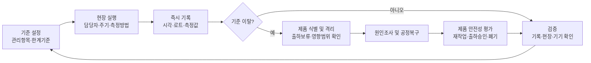
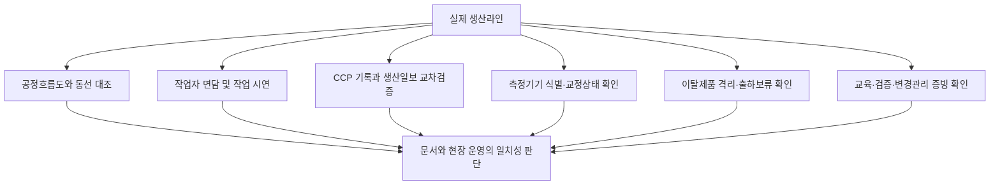

# [QA+ 블로그 생성 결과물] HC007 HACCP 시스템 현장적용
생성일시: 2026-08-29 08:47:19 (KST)
적용모델: gpt-5.6-terra

================================================================================
# 📋 최종 발행용 블로그 패키지

### 1. 메타 데이터 (SEO 설정)

- **최종 포스팅 제목**: HC007 HACCP 시스템 현장적용 가이드: 심사관이 문서보다 먼저 확인하는 7가지
- **메타 디스크립션 (120자 내외 요약)**: HC007 HACCP 시스템 현장적용 심사 대응법을 정리했습니다. CCP 기록, 이탈제품 격리, 작업자 교육, 측정기기 교정, 변경관리까지 현장 실무 중심으로 확인하세요.
- **추천 해시태그 (10개)**:  
  #HACCP #HC007 #HACCP현장적용 #식품품질관리 #식품안전 #CCP관리 #HACCP심사 #식품제조업 #이탈조치 #식품공장
- **카테고리**: HACCP가이드

> **사실관계 검수 메모**  
> - HC007은 법령 조문번호로 단정하지 않고, 적용받는 인증·연장심사·평가표의 항목 코드 또는 관리번호일 수 있음을 명시했습니다.  
> - 금속검출 시험편 기준은 제품·설비·업체 관리기준에 따라 달라질 수 있으므로, 사례의 수치는 특정 업체의 관리기준 예시로 유지했습니다.  
> - 기존 원고의 “비철(SUS)” 표현은 기술적으로 혼동될 수 있어 “SUS 3.0 mm 시험편”으로 교정했습니다. SUS는 통상 스테인리스강 시험편을 뜻하며, 비철 시험편 기준과는 구분해 관리할 필요가 있습니다.

---

## 2. 네이버 블로그 / 티스토리 복사용 최종 원고 (Markdown)

# HC007 HACCP 시스템 현장적용, 심사관은 문서보다 이것을 먼저 봅니다

> **20년 실무 선배의 한 줄 요약**  
> HC007 HACCP 시스템 현장적용의 핵심은 관리기준서를 예쁘게 만드는 일이 아닙니다. **작업자가 기준대로 실행하고, 기록이 실제 생산과 일치하며, 이탈 시 제품을 통제한 흔적이 연결되는지**를 증명하는 일입니다.

---

## 1. HACCP 문서는 있는데 왜 현장적용에서 지적받을까요?

HACCP 인증심사나 연장심사에서 가장 아쉬운 지적은 “문서는 잘 되어 있는데 실제 운영이 확인되지 않습니다”라는 말입니다. 품질팀에서는 밤늦게까지 관리기준서와 기록지를 정리했는데, 정작 현장 작업자가 “제가 관리하는 CCP가 뭔지 잘 모르겠습니다”라고 답하면 심사 분위기가 바로 달라집니다.

심사관은 문서의 완성도보다 **문서가 사람과 설비를 통해 실제로 움직이는지**를 먼저 봅니다.

특히 HC007은 일반적으로 법령 조문 번호라기보다 HACCP 인증·연장심사 또는 실시상황평가에서 쓰이는 평가항목 코드·관리번호로 사용되는 경우가 많습니다. 따라서 업체가 적용받는 업종별 평가표, 심사 유형, 평가표 개정일에 따라 정확한 문구는 달라질 수 있습니다.

식품제조·가공업, 축산물가공업, 식육포장처리업, 집단급식소는 평가 포인트가 조금씩 다를 수 있으니 반드시 최신 평가표 원문을 먼저 확인하셔야 합니다. 다만 실무적으로는 “HACCP 시스템이 실제 현장에서 적용·운영되는가”라는 큰 질문으로 접근하면 거의 틀리지 않습니다.

현장적용이 부족한 업체는 대개 기록 자체가 없는 업체가 아닙니다. 오히려 기록은 빠짐없이 있는데, 생산일보의 생산시간과 CCP 모니터링 시간이 맞지 않거나 금속검출기 감도 확인값이 매일 지나치게 똑같은 경우가 많습니다.

또 한계기준 이탈이 발생했을 때 조치란에 “재측정 후 이상 없음”이라고만 적혀 있고, 그 사이 생산된 제품을 어떻게 격리했는지는 전혀 남아 있지 않은 경우도 있습니다. 쉽게 말하면, **운전일지는 있는데 실제 차가 운행한 흔적이 없는 상태**와 비슷합니다.

현장적용은 아래 다섯 가지가 끊기지 않고 연결되어야 합니다. 하나라도 빠지면 심사에서는 “운영의 신뢰성 부족”으로 볼 가능성이 커집니다.

1. **기준**: 무엇을 관리하고, 허용 한계는 얼마인가  
2. **실행**: 누가, 언제, 어떤 방법과 기기로 확인하는가  
3. **기록**: 결과가 실제 시점에 정확하게 작성되었는가  
4. **조치**: 기준 이탈 시 제품과 공정을 어떻게 통제했는가  
5. **검증**: 해당 시스템이 계속 효과적으로 작동하는지 확인했는가  




이제부터는 “우리 회사는 HACCP 문서가 있습니다” 수준을 넘어서, 심사관 앞에서 “우리 회사는 실제로 관리되고 있습니다”라고 보여주는 방법을 정리해보겠습니다. 먼저 HC007 관점에서 말하는 현장적용의 정확한 의미부터 잡아야 뒤의 기록과 교육도 흔들리지 않습니다.

---

## 2. HC007 HACCP 시스템 현장적용의 핵심 개념부터 잡으세요

HACCP은 Hazard Analysis and Critical Control Point, 즉 위해요소분석과 중요관리점의 약자입니다. 전문 용어라 어렵게 들리지만 쉽게 말하면, 식품을 만들면서 소비자에게 위해를 줄 수 있는 요소를 미리 찾아내고 그중 반드시 관리해야 할 공정을 정해 관리하는 체계입니다.

위해요소에는 미생물, 화학물질, 금속·플라스틱 같은 물리적 이물 등이 포함될 수 있습니다. 중요한 것은 위해요소를 찾는 데서 끝나는 것이 아니라, 실제 생산 중에 관리하고 있다는 사실입니다.

현장적용은 HACCP 관리기준서가 파일함 또는 서버에 존재하는 상태를 말하지 않습니다. 작업자가 본인 공정의 관리 항목을 알고, 정해진 주기에 맞춰 측정하며, 측정값을 즉시 작성하고, 이상이 발생했을 때 보고와 격리 조치를 실제로 수행하는 상태가 현장적용입니다.

예를 들어 가열 CCP의 한계기준이 “제품 중심온도 75℃ 이상, 1분 이상”이라면 담당자는 온도계를 올바르게 사용해야 하고, 그날 생산한 로트와 시간을 연결해 기록해야 합니다. 온도계 교정이 만료되어 있거나 측정 위치가 매번 달라진다면 기록값이 75℃ 이상이어도 관리의 신뢰성은 떨어집니다.

HACCP 시스템은 보통 선행요건관리, 위해요소분석, CCP 결정, 한계기준 설정, 모니터링, 개선조치, 검증, 기록관리로 구성됩니다.

여기서 선행요건관리는 작업장 세척·소독, 개인위생, 방충·방서, 용수관리, 이물관리, 보관관리처럼 HACCP이 제대로 굴러가기 위한 기본 바닥입니다. 쉽게 말하면 CCP가 자동차의 브레이크라면, 선행요건은 도로 상태와 타이어 관리입니다. 바닥 관리가 무너지면 CCP 기록만 잘 써도 식품안전 관리가 안정적으로 유지되기 어렵습니다.

HC007 현장적용을 준비할 때는 “우리 기준서에 무엇이 적혀 있나?”보다 “작업자가 지금 무엇을 하고 있나?”를 먼저 확인하는 편이 빠릅니다.

생산 중인 라인에 들어가서 작업자에게 담당 공정, 확인 항목, 기준, 이상 시 첫 행동을 직접 물어보십시오. 답을 못 하면 개인의 암기력 문제로만 보지 마시고, 현장 게시물·교육 방식·책임자 역할·기록서식이 작업자에게 전달되도록 설계됐는지 점검해야 합니다. 시스템이 사람에게 전달되지 않았다면, 그 시스템은 아직 현장에 적용된 것이 아닙니다.

> **현장 적용의 판단 기준**  
> “기준서가 있다”가 아니라 **“생산 중인 작업자가 그 기준을 실행하고, 결과를 추적 가능하게 남기며, 이상 발생 시 제품을 통제할 수 있다”**가 기준입니다.

이 개념을 잡았다면 다음은 심사관이 실제로 어떤 연결고리를 확인하는지 보셔야 합니다. 심사 대응은 예상 질문을 외우는 것보다, 확인 영역별 증빙을 연결해 두는 것이 훨씬 강합니다.

---

## 3. 심사관이 현장에서 확인하는 7가지 영역

첫 번째는 공정흐름도와 실제 생산라인의 일치입니다. 원료 입고부터 보관, 전처리, 배합, 가열, 냉각, 포장, 금속검출, 출하까지 실제 동선이 공정흐름도에 정확히 반영되어 있어야 합니다.

특히 재작업품 투입, 반제품 이동, 폐기물 반출, 알레르겐 원료 이동, 외주공정은 자주 빠집니다. 설비 위치를 바꾸거나 작업 순서를 변경했는데 공정흐름도를 개정하지 않았다면 위해요소분석의 전제가 흔들립니다.

두 번째는 CCP 모니터링의 실시간 실행 여부입니다. CCP 모니터링은 기록을 채우는 일이 아니라 한계기준 이탈을 제때 발견하는 활동입니다.

예를 들어 금속검출기를 매 2시간마다 점검한다고 정했다면, 해당 2시간 동안 생산된 제품 범위가 명확해야 합니다. 생산속도가 빠르고 2시간에 4,000봉이 생산되는 라인이라면 단순히 “2시간마다”라는 주기가 제품 위험도와 회수 범위 측면에서 적정한지도 다시 검토할 필요가 있습니다.

세 번째는 측정기기 신뢰성입니다. 중심온도계, 적외선온도계, 저울, 염도계, pH 미터, 금속검출기, X-ray 장비는 각각 측정 목적과 관리 방식이 다릅니다. 기기마다 식별번호를 부여하고, 교정 또는 검·교정 상태, 사용 전 점검, 고장 시 대체기기 사용 절차를 운영해야 합니다.

쉽게 말하면 온도계 숫자를 믿으려면 “그 온도계가 맞는 숫자를 보여준다”는 근거가 먼저 있어야 한다는 뜻입니다. 교정 유효기간이 지난 기기로 관리한 기간이 발견되면, 그 기간 생산품에 대한 영향평가까지 요구될 수 있습니다.

네 번째는 이탈조치와 제품 통제입니다. 한계기준 이탈이 발생했을 때 “재측정 후 정상”만 기록하는 것은 부족합니다. 최초 이탈이 진짜였는지, 어느 시점부터 어떤 로트가 영향을 받았는지, 제품은 격리 또는 출하보류됐는지, 설비는 어떻게 정상화했는지, 원인은 무엇인지가 남아야 합니다.

다섯 번째는 교육이고, 여섯 번째는 검증이며, 일곱 번째는 변경관리입니다. 원료 공급처 변경, 제품 배합 변경, 포장재 변경, 설비 교체, 생산량 증가, 보관조건 변경이 발생했다면 HACCP팀이 위해요소분석과 관리기준을 재검토했는지 확인해야 합니다.

| 확인 영역 | 심사관 확인 포인트 | 현장에서 바로 볼 증빙 |
|---|---|---|
| 공정흐름도 | 실제 공정·동선·재작업 반영 여부 | 최신 흐름도, 평면도, 현장 게시본 |
| CCP 관리 | 기준·주기·담당자·방법의 일치 | CCP 기록, 작업자 면담, 현장 시연 |
| 측정기기 | 측정값의 신뢰성 | 기기번호, 교정성적서, 일상점검표 |
| 이탈조치 | 제품 통제와 원인조사 여부 | 격리표지, 출하보류 기록, 개선조치서 |
| 교육훈련 | 교육이 행동으로 연결되는지 | 교육일지, 이해도평가, OJT 기록 |
| 검증 | 기록 검토를 넘어 현장 확인했는지 | 검증계획서, 검증일지, 회의록 |
| 변경관리 | 변경사항을 HACCP에 반영했는지 | 변경신청서, 위해요소 재평가 자료 |




여기까지 보시면 “기록을 잘 쓰면 된다”는 생각이 얼마나 위험한지 감이 오실 겁니다. 다음 단계에서는 이 7개 영역을 실제로 점검하고 보완하는 방법을 순서대로 정리해보겠습니다.

---

## 4. 20년 선배가 권하는 HC007 현장적용 실전 5단계

첫 번째 단계는 **문서 대 현장 대조점검**입니다. 관리기준서, 공정흐름도, 평면도, CCP 관리기준, 현장 게시물을 들고 실제 생산라인을 처음부터 끝까지 걸어보십시오.

이때 품질팀 혼자 보지 말고 생산반장, 설비담당자, 현장 작업자와 함께 확인하는 것이 좋습니다. 문서상에는 냉각공정이 30분이라고 되어 있는데 실제로는 제품 대기 때문에 55분이 걸린다면, 그 순간부터 문서와 현장은 불일치 상태입니다.

두 번째 단계는 **작업자 질문 테스트**입니다. 심사관이 작업자에게 묻는 질문은 생각보다 단순합니다.

- “여기서 무엇을 관리합니까?”
- “기준은 얼마입니까?”
- “언제 측정합니까?”
- “기준을 벗어나면 첫 번째로 무엇을 합니까?”

그런데 이 네 질문에 답하지 못하는 작업자가 많다면 교육 횟수를 늘리는 방식보다, 현장 게시판을 그림 중심으로 바꾸고 작업 전 5분 브리핑을 도입하는 방식이 훨씬 효과적입니다.

세 번째 단계는 **기록의 교차검증**입니다. CCP 모니터링 기록만 따로 보지 말고 생산일보, 설비 운전기록, 원료 투입기록, 세척·소독기록, 출하 및 재고기록과 함께 대조하십시오.

예를 들어 생산일보상 14시부터 15시까지 설비 세척으로 가동이 멈췄는데, CCP 기록에는 14시 30분 정상 생산 중 측정값이 적혀 있다면 사후작성 또는 기록 오류를 의심받을 수 있습니다. 기록은 각각 따로 존재하는 것이 아니라 같은 생산 사실을 여러 각도에서 보여주는 증거여야 합니다.

네 번째 단계는 **실제 이탈사례를 복기하는 것**입니다. 심사 직전에 완벽한 이탈조치 사례를 새로 만들려고 하면 오히려 부자연스럽습니다. 최근 6개월~12개월 이내의 실제 설비 이상, 온도 미달, 금속검출기 시험편 미검출, 기록 누락, 작업자 실수 사례를 꺼내 보십시오.

그 사례에서 제품 격리부터 원인조사, 재발방지, HACCP팀 검토까지 어떤 단계가 빠졌는지 찾아 보완하면 됩니다. 이탈이 한 번도 없었다는 것보다, 이탈이 발생했을 때 제대로 통제했다는 것이 훨씬 신뢰를 줍니다.

다섯 번째 단계는 **검증과 개선 완료 확인**입니다. 검증은 기록에 서명하는 행위가 아닙니다. 월 1회 또는 업체가 정한 주기에 CCP 기록을 검토하고, 현장 관찰을 실시하며, 기기 교정상태와 시험·검사 결과를 검토하고, 반복 이탈 경향을 분석해야 합니다.

검증에서 문제가 발견됐다면 담당자, 완료기한, 확인자를 정해 개선조치가 닫힐 때까지 관리하십시오.

> **★ 심사관 대응 꿀팁**  
> 심사 당일 품질팀장만 모든 답을 하면 오히려 불리할 수 있습니다. 생산팀은 공정과 작업방법을, 품질팀은 기준과 검증을, 공무팀은 설비 이상 및 예방보전을 설명할 수 있어야 “조직이 함께 운영하는 HACCP”으로 보입니다.

실전 점검의 핵심은 문제를 숨기지 않고 시스템 안에서 관리하는 것입니다. 이제 실제 공장에서 어떤 문제가 생겼고, 어떻게 개선했는지 업종별 사례로 보겠습니다.

---

## 5. 실제 현장 사례로 보는 HACCP 현장적용

### 사례 1. 냉동만두 제조공장 금속검출 CCP 기록 불일치 개선

경기도의 한 냉동만두 제조공장은 포장 후 금속검출 공정을 CCP로 관리하고 있었고, 철(Fe) 2.0 mm, SUS 3.0 mm 시험편을 기준으로 감도 확인을 실시했습니다. 해당 수치는 이 업체의 관리기준 예시이며, 실제 적용 기준은 제품 특성·설비 성능·자체 HACCP 계획에 따라 확인해야 합니다.

기록상으로는 매 2시간마다 정상적으로 시험편 검사가 이루어진 것으로 작성되어 있었지만, 심사 전 내부점검에서 생산일보와 시간이 맞지 않는 문제가 발견됐습니다. 생산일보에는 오전 10시 20분부터 11시까지 필름 교체와 포장기 정지시간이 기록되어 있었는데, 금속검출 CCP 기록에는 10시 30분에 정상 생산품을 통과시킨 것으로 적혀 있었습니다.

처음에는 담당자가 단순히 시간을 잘못 적었다고 생각했지만, 최근 3개월 기록을 대조하니 교대시간과 휴게시간에도 동일한 패턴의 기록이 반복됐습니다.

근본 원인은 담당자가 금속검출기 확인을 “품질팀이 해야 하는 서류 업무”로만 이해했고, 생산 중단·재가동 시 추가 점검이 필요하다는 기준을 모르고 있었던 데 있었습니다. 또한 기록지에 생산 로트와 설비 가동상태를 적는 칸이 없어 사후 검토자가 불일치를 발견하기 어려운 구조였습니다.

회사는 기록지에 생산로트, 점검시각, 가동·재가동 여부, 시험편 결과, 이상 시 조치번호를 추가했고, 포장반장과 품질담당자를 정·부 담당자로 지정했습니다.

재가동 시에는 정기 점검시간과 별도로 금속검출기 작동 확인을 의무화하고, 해당 제품은 확인 전까지 출하보류하도록 절차를 개정했습니다.

개선 후 2개월 동안 품질팀이 주 1회 생산일보와 CCP 기록을 교차검증했으며, 기록 불일치는 0건으로 줄었고 작업자 면담에서도 이탈 시 제품 통제 절차를 설명할 수 있게 됐습니다.

### 사례 2. 액상 소스 제조공장 가열 CCP 이탈조치 개선

한 액상 소스 제조공장은 가열공정에서 제품 중심온도 85℃ 이상, 10분 이상을 관리기준으로 운영하고 있었습니다. 어느 날 스팀 압력이 불안정해 가열온도가 82℃까지 떨어졌는데, 현장 담당자는 온도계를 다시 측정해 86℃가 나온 것을 확인하고 기록지에 “재측정 정상”이라고만 작성했습니다.

문제는 82℃가 처음 확인된 시점부터 86℃로 회복된 시점까지 생산된 약 1,200 kg의 소스에 대한 격리·판정 기록이 전혀 없었다는 점입니다.

심층 조사 결과 스팀 트랩의 응축수 배출 불량으로 열전달 효율이 떨어졌고, 담당자는 제품 온도 이탈이 발생하면 배치 전체를 보류해야 한다는 교육을 받은 적이 없었습니다. 더 큰 근본 원인은 이탈조치서에 “원인 확인 및 재측정”이라는 문구만 있고, 영향 제품 식별과 안전성 평가 항목이 빠져 있었던 것입니다.

회사는 배치번호 기준으로 이탈 시작 시점부터 정상 복귀 전까지의 제품을 자동으로 출하보류 목록에 올리도록 생산관리 절차를 변경했습니다.

이탈조치서에는 발생시각, 영향 배치, 격리 위치, 설비 복구 내용, 원인분석, 재가열 가능 여부, 폐기 또는 출하 승인자 항목을 새로 넣었습니다.

공무팀에는 스팀 압력 일일점검과 스팀 트랩 월간 예방보전 항목을 추가했고, 품질팀은 가열온도 그래프와 수기 기록을 매일 비교하도록 했습니다.

이후 유사한 스팀 압력 저하가 한 번 발생했을 때 담당자는 즉시 생산을 멈추고 640 kg을 격리했으며, 재가열 유효성 확인 후 승인 절차를 거쳐 처리했습니다.

이 사례를 HACCP팀 회의에서 공유한 뒤, 이탈조치의 핵심은 “다시 정상값이 나왔는가”가 아니라 “이탈 기간의 제품을 안전하게 통제했는가”라는 인식이 현장에 자리 잡았습니다.

### 사례 3. RTD 음료 제조공장 신규 작업자 교육과 온도계 관리 개선

PET병 음료를 생산하는 한 제조공장에서는 냉각수 온도를 관리공정으로 운영하고 있었고, 작업자가 매 1시간마다 냉각수 온도를 측정해 기록하도록 정해 두었습니다.

연장심사 사전점검 중 입사 2주 차 작업자에게 “온도가 기준을 벗어나면 어떻게 합니까?”라고 질문했더니 “반장님께 말합니다”라고만 답했고, 기준값과 제품 처리 방법은 알지 못했습니다.

해당 작업자는 교육일지에는 서명되어 있었지만, 실제로는 입사 첫날 2시간 동안 여러 교육을 한꺼번에 받았고 공정별 실습은 하지 않은 상태였습니다.

기록을 확인해 보니 이 작업자가 작성한 온도기록에는 온도계 식별번호가 없었고, 사용한 온도계는 교정 유효기간이 10일 지난 상태였습니다.

근본 원인은 신규자 교육을 인사교육 수준으로 처리했고, 배치 전 숙련도 확인과 기기 인수인계 절차가 없었던 데 있었습니다.

회사는 신규자에게 공통 위생교육 후 공정별 OJT를 최소 3회 실시하고, CCP 또는 중요관리 공정 담당 전에는 작업 시연과 구두평가를 통과해야 단독 작업을 하도록 기준을 세웠습니다.

온도계에는 QR코드와 기기번호를 부착해 기록지에서 사용 기기를 선택하도록 했고, 교정 만료 30일 전 자동 알림이 발생하도록 관리대장을 개선했습니다. 또한 교정 만료 기기는 빨간색 “사용금지” 태그를 붙여 현장에서 즉시 분리했습니다.

개선 후 신규 작업자 5명을 대상으로 현장 평가를 진행한 결과, 전원은 기준값·측정주기·이탈 시 보고체계와 제품 보류 절차를 설명할 수 있었습니다. 심사 대비뿐 아니라 작업자 교체가 잦은 현장에서 HACCP 운영 공백을 줄였다는 점이 가장 큰 개선 효과였습니다.

사례를 보시면 세 업체 모두 처음 문제는 기록이나 교육의 작은 빈틈처럼 보였습니다. 하지만 조금만 더 들어가 보니 역할 불명확, 서식 설계 미흡, 변경관리 누락, 제품 통제 절차 부족 같은 시스템 문제로 연결되어 있었습니다.

---

## 6. 한계기준 이탈 시에는 “재측정”보다 제품 통제가 먼저입니다

한계기준 이탈은 HACCP 운영에서 실패가 아닙니다. 오히려 이탈을 발견하고, 영향을 받은 제품을 통제하며, 원인을 제거하고, 재발하지 않게 만드는 과정이 HACCP 시스템의 실력입니다.

문제는 이탈이 발생했을 때 생산을 멈추기 부담스럽다는 이유로 “다시 재보니 정상입니다”라고 처리하는 것입니다. 이 방식은 최초 이탈값과 그 사이 제품의 안전성 문제를 설명하지 못합니다.

이탈 발생 시 첫 번째 조치는 해당 공정과 제품을 식별하는 일입니다. 발생시각이 13시 10분이라면 마지막 정상 확인시각부터 13시 10분, 그리고 공정이 정상으로 회복됐다는 확인 시점까지 생산된 로트를 특정해야 합니다.

해당 제품에는 격리표지를 붙이고, 전산 또는 수기 출하보류 목록에 등록해야 합니다. 쉽게 말하면 “문제가 생겼을 가능성이 있는 제품이 창고와 출하장으로 섞여 나가지 않게 잠금장치를 거는 것”입니다.

두 번째는 공정을 정상 상태로 복구하는 일입니다. 온도 미달이라면 스팀 공급, 가열시간, 제품 투입량, 센서 상태를 확인해야 하고, 금속검출기 이상이라면 시험편 상태, 감도 설정, 컨베이어 작동, 설비 청소상태, 장비 고장 여부를 확인해야 합니다.

단순 작업자 실수인지, 설비 문제인지, 관리기준 자체가 현실과 맞지 않는지 원인을 구분해야 재발방지책도 달라집니다. “작업자 주의”만 쓰는 개선조치는 대부분 재발합니다.

세 번째는 제품 안전성 평가와 처분 결정입니다. 재가열, 재선별, 재검사, 재작업, 폐기 중 어떤 처리가 가능한지는 제품 특성, 이탈 내용, 공정 검증 근거, 회사 절차에 따라 결정해야 합니다.

이때 품질책임자 또는 HACCP팀의 승인 근거가 반드시 남아야 합니다. 제품을 정상으로 판정했다면 왜 정상으로 판단했는지, 폐기했다면 폐기 수량과 방법이 무엇인지 추적 가능해야 합니다.

| 이탈조치 단계 | 반드시 남길 내용 | 흔한 잘못된 대응 | 올바른 대응 |
|---|---|---|---|
| 1. 이탈 확인 | 발생 일시, 측정값, 기준값, 담당자 | “이상 있음”만 작성 | 실제 측정값과 기준값을 함께 기록 |
| 2. 제품 식별 | 마지막 정상시점~정상복귀 시점 로트 | 영향 로트 미확인 | 제조번호·수량·보관장소 특정 |
| 3. 격리·보류 | 격리표지, 출하보류 등록 | 창고에 그대로 보관 | 출하 가능품과 물리적·전산상 분리 |
| 4. 원인조사 | 설비·작업·원료·방법 원인 | “작업자 부주의”로 종료 | 5Why 등으로 근본원인 분석 |
| 5. 재발방지 | 담당자, 기한, 완료확인 | 재교육만 실시 | 설비·서식·주기·교육을 함께 개선 |
| 6. 검증 | 조치 유효성 확인 | 개선 후 확인 없음 | 반복 발생 여부와 효과 검토 |

이탈조치가 제대로 되면 심사관에게도 설명이 쉬워집니다. 다음은 현장적용의 또 다른 약한 고리인 교육과 검증을 어떻게 운영할지 보겠습니다.

---

## 7. 작업자 교육과 검증은 따로 하면 효과가 반감됩니다

교육일지에 교육명, 일시, 참석자 서명이 있다고 해서 교육 효과까지 입증되는 것은 아닙니다. 특히 HACCP 교육은 전 직원에게 같은 자료를 보여주는 방식보다 담당 업무에 맞춰 나누는 방식이 효과적입니다.

금속검출기 담당자에게는 시험편 확인, 이상 시 격리, 재가동 전 확인을 가르쳐야 하고, 세척 담당자에게는 세척·소독 농도와 교차오염 방지 포인트를 가르쳐야 합니다. 교육은 많이 하는 것보다 현장에서 필요한 행동으로 연결하는 것이 중요합니다.

신규 입사자와 배치전환자는 별도 관리가 필요합니다. 신규자가 생산라인에 바로 투입되는 경우에는 최소한 개인위생, 이물관리, 담당 공정의 관리기준, 이상 시 보고체계, 기록 작성법을 교육한 뒤 작업하게 해야 합니다.

가능하면 최초 1~3회는 숙련자와 함께 작업하도록 하고, 반장 또는 품질담당자가 실제 수행 능력을 확인하십시오. “교육 완료”가 아니라 “단독 작업 가능” 여부를 관리해야 합니다.

검증은 시스템이 계획대로 작동하는지를 확인하는 활동입니다. 기록 검토도 검증의 일부이지만 전부는 아닙니다. 월 1회 현장 관찰을 하면서 담당자가 실제로 온도계를 소독하고 올바른 위치에서 측정하는지, 금속검출기 시험편을 정확히 통과시키는지, 세척 담당자가 농도 측정법을 지키는지 봐야 합니다.

여기에 교정성적서, 제품 미생물 검사, 환경검사, 소비자 클레임, 이탈 경향까지 함께 검토해야 실제 유효성 평가가 됩니다.

HACCP팀 회의록도 단순 회의 개최 기록으로 끝내지 마십시오. 예를 들어 최근 3개월간 냉각온도 이탈이 4건 발생했다면, 단순히 “주의한다”가 아니라 냉각기 용량 부족인지, 생산량 증가 때문인지, 냉각시간 기준이 현실과 맞지 않는지 분석해야 합니다.

그리고 담당부서·완료기한·검증방법을 정해 다음 회의에서 완료 여부를 확인해야 합니다. 검증 결과가 개선으로 이어질 때 HACCP 시스템이 살아 움직인다고 볼 수 있습니다.

> **교육 효과 확인 질문 예시**
>
> - 내가 관리하는 항목은 무엇인가요?  
> - 기준은 어디에서 확인할 수 있나요?  
> - 측정은 몇 시간마다, 어떤 기기로 하나요?  
> - 기준 이탈 시 제품에는 어떤 표지를 붙이나요?  
> - 누구에게 보고하고, 재가동은 누가 승인하나요?  

교육과 검증이 연결되면 작업자의 실수가 개인 문제로 남지 않고 시스템 개선의 출발점이 됩니다. 마지막으로 심사 직전에 바로 사용할 수 있는 체크리스트와 FAQ를 정리하겠습니다.

---

## 8. HC007 현장적용 심사 전 최종 체크리스트

심사 전에는 모든 문서를 새로 만들려고 하지 마십시오. 먼저 최근 생산일 기준으로 하루 또는 한 개 로트를 골라 원료 입고부터 출하까지 추적해 보시면 됩니다.

원료 입고기록, 생산일보, CCP 기록, 세척기록, 이탈기록, 검사성적서, 출하전표가 같은 로트번호 또는 날짜 체계로 연결되는지 확인하십시오. 연결이 안 되는 곳이 바로 심사에서 질문이 나올 가능성이 높은 곳입니다.

현장 게시물도 꼭 확인해야 합니다. 관리기준서가 개정됐는데 현장에는 이전 온도기준, 이전 양식, 이전 공정흐름도가 붙어 있는 경우가 생각보다 많습니다.

문서관리에서는 최신본의 개정번호와 시행일, 구본 회수 여부가 중요합니다. 쉽게 말하면 본사 컴퓨터에 최신 매뉴얼이 있어도 현장 벽에 오래된 매뉴얼이 붙어 있으면 현장은 오래된 기준으로 운영될 수 있다는 뜻입니다.

측정기기 점검은 심사 직전에 가장 많이 놓치는 항목입니다. 온도계, 저울, 염도계, pH 미터, 금속검출기 시험편 등의 식별번호와 교정 유효기간을 확인하십시오.

교정 만료가 임박한 기기는 미리 교정 일정을 잡고, 고장 또는 분실 시 사용할 대체기기도 정해 두는 것이 좋습니다. 특히 교정 만료 기기를 사용한 이력이 있다면 숨기기보다 사용 기간, 영향 제품, 평가 결과, 후속조치를 정리하는 편이 안전합니다.

마지막으로 생산·품질·공무·물류 부서의 역할을 다시 맞추십시오. 품질팀만 HACCP을 설명하면 현장 적용성이 약해 보일 수 있습니다. 생산팀은 실제 작업과 기록을, 공무팀은 설비 이상과 예방보전을, 물류팀은 격리·출하보류와 추적성을 설명할 수 있어야 합니다.

HACCP은 품질팀의 서류 업무가 아니라 회사 전체의 식품안전 운영체계입니다.

| 점검 항목 | 확인 기준 | 확인 방법 | 담당 부서 |
|---|---|---|---|
| 공정흐름도 | 실제 라인·동선과 일치 | 생산 중 현장 순회 | 품질·생산 |
| CCP 담당자 | 정·부 담당자 지정 | 업무분장표, 면담 | 생산·품질 |
| 모니터링 기록 | 생산시간·로트와 일치 | 생산일보와 대조 | 품질 |
| 측정기기 | 교정 유효, 식별번호 부착 | 교정대장·현물 확인 | 품질·공무 |
| 이탈조치 | 격리·원인·재발방지 포함 | 최근 이탈 사례 검토 | 품질·생산 |
| 교육훈련 | 담당 공정별 교육·평가 실시 | 교육일지·현장 시연 | 생산·품질 |
| 검증 | 계획 수행 및 개선 완료 | 검증기록·회의록 | HACCP팀 |
| 변경관리 | 변경 시 HACCP 재검토 | 변경신청서·개정이력 | HACCP팀 |
| 출하보류 | 격리 제품 식별·통제 가능 | 격리구역·전산 확인 | 품질·물류 |

---

## 9. HC007 HACCP 현장적용 FAQ

### Q1. HACCP 관리기준서가 잘 작성되어 있으면 현장적용으로 인정되나요?

**A. 아닙니다.** 관리기준서는 출발점일 뿐이고, 작업자의 실행·기록·이탈조치·검증 결과가 기준서 내용과 일치해야 합니다. 심사관은 문서 한 장만 보는 것이 아니라 현장 관찰, 작업자 면담, 기록 교차검증을 통해 실제 운영 여부를 확인합니다.

### Q2. CCP 기록을 생산 종료 후 한꺼번에 정리해도 되나요?

**A. 권장되지 않습니다.** CCP 모니터링은 정해진 주기에 공정 중 실시하고 즉시 기록해야 이탈을 제때 발견할 수 있습니다. 사후 일괄 작성으로 보이면 기록의 신뢰성이 낮아질 수 있으므로, 기록시각과 생산시각이 자연스럽게 연결되도록 관리해야 합니다.

### Q3. 한계기준을 벗어났지만 재측정값이 정상이면 제품을 격리하지 않아도 되나요?

**A. 최초 이탈값이 확인됐다면 영향 제품 범위를 먼저 확인해야 합니다.** 재측정은 공정 상태 확인의 일부일 뿐이며, 마지막 정상 확인 시점부터 정상 복귀 확인 시점까지의 제품은 원칙적으로 식별·보류 후 안전성 평가가 필요합니다. 제품 처리 방식은 업체의 개선조치 절차와 공정 검증 근거에 따라 결정하십시오.

### Q4. 작업자가 한계기준 숫자를 정확히 외우지 못하면 무조건 부적합인가요?

**A. 단순 암기 여부만으로 판단되지는 않습니다.** 다만 담당자가 본인 공정의 관리 목적, 기준 확인 위치, 측정방법, 이상 시 보고와 제품 격리 방법을 전혀 모른다면 현장 적용 미흡으로 판단될 가능성이 큽니다. 숫자를 외우게만 하기보다 현장 게시 기준과 행동 절차를 쉽게 보이게 만드는 것이 좋습니다.

### Q5. 교육일지와 참석자 서명만 있으면 충분한가요?

**A. 교육 실시 사실은 증명할 수 있지만, 교육 효과까지는 부족할 수 있습니다.** 구두 질문, 현장 시연, 작업 관찰, 간단한 이해도 평가, 신규자 OJT 확인표 등을 함께 운영하면 훨씬 강한 증빙이 됩니다. 특히 CCP 담당자는 일반 위생교육과 별도로 공정별 교육이 필요합니다.

### Q6. 공정이 조금 바뀌었는데 HACCP 계획을 꼭 다시 검토해야 하나요?

**A. 위해요소 관리에 영향을 줄 가능성이 있다면 재검토해야 합니다.** 원료, 배합, 설비, 공정순서, 포장재, 보관온도, 생산량, 작업동선이 바뀌면 위해요소분석과 CCP 관리방법에 영향이 생길 수 있습니다. 변경관리 절차에서 HACCP팀 검토 여부를 명확하게 남겨 두시면 됩니다.

### Q7. 기록이 한두 건 누락된 사실을 심사 전에 발견했습니다. 빈칸을 채워 넣어도 될까요?

**A. 임의로 추정해 작성하면 안 됩니다.** 누락 사실, 누락 시간대, 영향 제품, 확인 가능한 보조기록, 제품 안전성 평가, 재발방지 조치를 정해진 절차에 따라 남기십시오. 누락을 숨기는 것보다 누락을 발견하고 통제한 기록이 있는 편이 훨씬 낫습니다.

---

## 10. 맺음말: HC007 대응은 결국 “현장 신뢰”를 만드는 일입니다

오늘 내용을 딱 세 줄로 정리하면 이렇습니다.

첫째, HC007 HACCP 시스템 현장적용은 문서 보유 여부가 아니라 **문서와 실제 작업의 일치성**을 보는 항목입니다.

둘째, CCP 기록은 숫자를 적는 서류가 아니라 이탈을 발견하고 제품을 통제하기 위한 실시간 관리 도구입니다.

셋째, 이탈·교육·검증·변경관리가 연결될 때 심사 대응력도 함께 올라갑니다.

심사를 앞두고 있다면 서류철부터 펴지 마시고, 생산 중인 라인부터 한 바퀴 도십시오. 작업자가 무엇을 측정하는지, 언제 기록하는지, 기준을 벗어나면 무엇을 하는지 직접 확인하면 보완할 항목이 바로 보입니다. 그다음 문서와 기록을 현장에 맞게 정리하면 됩니다.

> **최종 핵심 문장**  
> HC007 HACCP 시스템 현장적용의 본질은 “기준서가 있는가”가 아니라, **현장의 작업자가 기준대로 실행하고 그 결과가 신뢰성 있게 기록되며, 이탈 시 제품과 공정을 실제로 통제할 수 있는가**를 입증하는 데 있습니다.

막히는 부분이 있다면 댓글로 편하게 질문해 보세요. 심사 대응과 현장 운영 개선에 도움이 되길 바랍니다.

---

## 3. 워드프레스 / 웹사이트용 HTML 원고

```html
<article class="food-qa-post">
  <header>
    <h1>HC007 HACCP 시스템 현장적용, 심사관은 문서보다 이것을 먼저 봅니다</h1>
    <blockquote>
      <p><strong>20년 실무 선배의 한 줄 요약</strong>: HC007 HACCP 시스템 현장적용의 핵심은 관리기준서를 예쁘게 만드는 일이 아닙니다. <strong>작업자가 기준대로 실행하고, 기록이 실제 생산과 일치하며, 이탈 시 제품을 통제한 흔적이 연결되는지</strong>를 증명하는 일입니다.</p>
    </blockquote>
  </header>

  <section>
    <h2>1. HACCP 문서는 있는데 왜 현장적용에서 지적받을까요?</h2>

    <p>HACCP 인증심사나 연장심사에서 가장 아쉬운 지적은 “문서는 잘 되어 있는데 실제 운영이 확인되지 않습니다”라는 말입니다. 품질팀에서는 밤늦게까지 관리기준서와 기록지를 정리했는데, 정작 현장 작업자가 “제가 관리하는 CCP가 뭔지 잘 모르겠습니다”라고 답하면 심사 분위기가 바로 달라집니다.</p>

    <p>심사관은 문서의 완성도보다 <strong>문서가 사람과 설비를 통해 실제로 움직이는지</strong>를 먼저 봅니다.</p>

    <p>특히 HC007은 일반적으로 법령 조문 번호라기보다 HACCP 인증·연장심사 또는 실시상황평가에서 쓰이는 평가항목 코드·관리번호로 사용되는 경우가 많습니다. 따라서 업체가 적용받는 업종별 평가표, 심사 유형, 평가표 개정일에 따라 정확한 문구는 달라질 수 있습니다.</p>

    <p>식품제조·가공업, 축산물가공업, 식육포장처리업, 집단급식소는 평가 포인트가 조금씩 다를 수 있으니 반드시 최신 평가표 원문을 먼저 확인하셔야 합니다. 다만 실무적으로는 “HACCP 시스템이 실제 현장에서 적용·운영되는가”라는 큰 질문으로 접근하면 거의 틀리지 않습니다.</p>

    <p>현장적용이 부족한 업체는 대개 기록 자체가 없는 업체가 아닙니다. 오히려 기록은 빠짐없이 있는데, 생산일보의 생산시간과 CCP 모니터링 시간이 맞지 않거나 금속검출기 감도 확인값이 매일 지나치게 똑같은 경우가 많습니다.</p>

    <p>또 한계기준 이탈이 발생했을 때 조치란에 “재측정 후 이상 없음”이라고만 적혀 있고, 그 사이 생산된 제품을 어떻게 격리했는지는 전혀 남아 있지 않은 경우도 있습니다. 쉽게 말하면, <strong>운전일지는 있는데 실제 차가 운행한 흔적이 없는 상태</strong>와 비슷합니다.</p>

    <p>현장적용은 아래 다섯 가지가 끊기지 않고 연결되어야 합니다. 하나라도 빠지면 심사에서는 “운영의 신뢰성 부족”으로 볼 가능성이 커집니다.</p>

    <ol>
      <li><strong>기준</strong>: 무엇을 관리하고, 허용 한계는 얼마인가</li>
      <li><strong>실행</strong>: 누가, 언제, 어떤 방법과 기기로 확인하는가</li>
      <li><strong>기록</strong>: 결과가 실제 시점에 정확하게 작성되었는가</li>
      <li><strong>조치</strong>: 기준 이탈 시 제품과 공정을 어떻게 통제했는가</li>
      <li><strong>검증</strong>: 해당 시스템이 계속 효과적으로 작동하는지 확인했는가</li>
    </ol>

    <figure>
      
      <figcaption>HACCP 현장적용은 기준 설정부터 실행, 기록, 이탈조치, 검증까지 끊기지 않아야 합니다.</figcaption>
    </figure>

    <pre class="mermaid">flowchart LR
    A["기준 설정&lt;br/&gt;관리항목·한계기준"] --&gt; B["현장 실행&lt;br/&gt;담당자·주기·측정방법"]
    B --&gt; C["즉시 기록&lt;br/&gt;시각·로트·측정값"]
    C --&gt; D{"기준 이탈?"}
    D -- "아니오" --&gt; E["검증&lt;br/&gt;기록·현장·기기 확인"]
    E --&gt; A
    D -- "예" --&gt; F["제품 식별 및 격리&lt;br/&gt;출하보류·영향범위 확인"]
    F --&gt; G["원인조사 및 공정복구"]
    G --&gt; H["제품 안전성 평가&lt;br/&gt;재작업·출하승인·폐기"]
    H --&gt; E</pre>

    <p>이제부터는 “우리 회사는 HACCP 문서가 있습니다” 수준을 넘어서, 심사관 앞에서 “우리 회사는 실제로 관리되고 있습니다”라고 보여주는 방법을 정리해보겠습니다. 먼저 HC007 관점에서 말하는 현장적용의 정확한 의미부터 잡아야 뒤의 기록과 교육도 흔들리지 않습니다.</p>
  </section>

  <section>
    <h2>2. HC007 HACCP 시스템 현장적용의 핵심 개념부터 잡으세요</h2>

    <p>HACCP은 Hazard Analysis and Critical Control Point, 즉 위해요소분석과 중요관리점의 약자입니다. 전문 용어라 어렵게 들리지만 쉽게 말하면, 식품을 만들면서 소비자에게 위해를 줄 수 있는 요소를 미리 찾아내고 그중 반드시 관리해야 할 공정을 정해 관리하는 체계입니다.</p>

    <p>위해요소에는 미생물, 화학물질, 금속·플라스틱 같은 물리적 이물 등이 포함될 수 있습니다. 중요한 것은 위해요소를 찾는 데서 끝나는 것이 아니라, 실제 생산 중에 관리하고 있다는 사실입니다.</p>

    <p>현장적용은 HACCP 관리기준서가 파일함 또는 서버에 존재하는 상태를 말하지 않습니다. 작업자가 본인 공정의 관리 항목을 알고, 정해진 주기에 맞춰 측정하며, 측정값을 즉시 작성하고, 이상이 발생했을 때 보고와 격리 조치를 실제로 수행하는 상태가 현장적용입니다.</p>

    <p>예를 들어 가열 CCP의 한계기준이 “제품 중심온도 75℃ 이상, 1분 이상”이라면 담당자는 온도계를 올바르게 사용해야 하고, 그날 생산한 로트와 시간을 연결해 기록해야 합니다. 온도계 교정이 만료되어 있거나 측정 위치가 매번 달라진다면 기록값이 75℃ 이상이어도 관리의 신뢰성은 떨어집니다.</p>

    <p>HACCP 시스템은 보통 선행요건관리, 위해요소분석, CCP 결정, 한계기준 설정, 모니터링, 개선조치, 검증, 기록관리로 구성됩니다.</p>

    <p>여기서 선행요건관리는 작업장 세척·소독, 개인위생, 방충·방서, 용수관리, 이물관리, 보관관리처럼 HACCP이 제대로 굴러가기 위한 기본 바닥입니다. 쉽게 말하면 CCP가 자동차의 브레이크라면, 선행요건은 도로 상태와 타이어 관리입니다. 바닥 관리가 무너지면 CCP 기록만 잘 써도 식품안전 관리가 안정적으로 유지되기 어렵습니다.</p>

    <p>HC007 현장적용을 준비할 때는 “우리 기준서에 무엇이 적혀 있나?”보다 “작업자가 지금 무엇을 하고 있나?”를 먼저 확인하는 편이 빠릅니다.</p>

    <p>생산 중인 라인에 들어가서 작업자에게 담당 공정, 확인 항목, 기준, 이상 시 첫 행동을 직접 물어보십시오. 답을 못 하면 개인의 암기력 문제로만 보지 마시고, 현장 게시물·교육 방식·책임자 역할·기록서식이 작업자에게 전달되도록 설계됐는지 점검해야 합니다. 시스템이 사람에게 전달되지 않았다면, 그 시스템은 아직 현장에 적용된 것이 아닙니다.</p>

    <blockquote>
      <p><strong>현장 적용의 판단 기준</strong><br>“기준서가 있다”가 아니라 <strong>“생산 중인 작업자가 그 기준을 실행하고, 결과를 추적 가능하게 남기며, 이상 발생 시 제품을 통제할 수 있다”</strong>가 기준입니다.</p>
    </blockquote>

    <p>이 개념을 잡았다면 다음은 심사관이 실제로 어떤 연결고리를 확인하는지 보셔야 합니다. 심사 대응은 예상 질문을 외우는 것보다, 확인 영역별 증빙을 연결해 두는 것이 훨씬 강합니다.</p>
  </section>

  <section>
    <h2>3. 심사관이 현장에서 확인하는 7가지 영역</h2>

    <p>첫 번째는 공정흐름도와 실제 생산라인의 일치입니다. 원료 입고부터 보관, 전처리, 배합, 가열, 냉각, 포장, 금속검출, 출하까지 실제 동선이 공정흐름도에 정확히 반영되어 있어야 합니다.</p>

    <p>특히 재작업품 투입, 반제품 이동, 폐기물 반출, 알레르겐 원료 이동, 외주공정은 자주 빠집니다. 설비 위치를 바꾸거나 작업 순서를 변경했는데 공정흐름도를 개정하지 않았다면 위해요소분석의 전제가 흔들립니다.</p>

    <p>두 번째는 CCP 모니터링의 실시간 실행 여부입니다. CCP 모니터링은 기록을 채우는 일이 아니라 한계기준 이탈을 제때 발견하는 활동입니다.</p>

    <p>예를 들어 금속검출기를 매 2시간마다 점검한다고 정했다면, 해당 2시간 동안 생산된 제품 범위가 명확해야 합니다. 생산속도가 빠르고 2시간에 4,000봉이 생산되는 라인이라면 단순히 “2시간마다”라는 주기가 제품 위험도와 회수 범위 측면에서 적정한지도 다시 검토할 필요가 있습니다.</p>

    <p>세 번째는 측정기기 신뢰성입니다. 중심온도계, 적외선온도계, 저울, 염도계, pH 미터, 금속검출기, X-ray 장비는 각각 측정 목적과 관리 방식이 다릅니다. 기기마다 식별번호를 부여하고, 교정 또는 검·교정 상태, 사용 전 점검, 고장 시 대체기기 사용 절차를 운영해야 합니다.</p>

    <p>쉽게 말하면 온도계 숫자를 믿으려면 “그 온도계가 맞는 숫자를 보여준다”는 근거가 먼저 있어야 한다는 뜻입니다. 교정 유효기간이 지난 기기로 관리한 기간이 발견되면, 그 기간 생산품에 대한 영향평가까지 요구될 수 있습니다.</p>

    <p>네 번째는 이탈조치와 제품 통제입니다. 한계기준 이탈이 발생했을 때 “재측정 후 정상”만 기록하는 것은 부족합니다. 최초 이탈이 진짜였는지, 어느 시점부터 어떤 로트가 영향을 받았는지, 제품은 격리 또는 출하보류됐는지, 설비는 어떻게 정상화했는지, 원인은 무엇인지가 남아야 합니다.</p>

    <p>다섯 번째는 교육이고, 여섯 번째는 검증이며, 일곱 번째는 변경관리입니다. 원료 공급처 변경, 제품 배합 변경, 포장재 변경, 설비 교체, 생산량 증가, 보관조건 변경이 발생했다면 HACCP팀이 위해요소분석과 관리기준을 재검토했는지 확인해야 합니다.</p>

    <table>
      <thead>
        <tr>
          <th>확인 영역</th>
          <th>심사관 확인 포인트</th>
          <th>현장에서 바로 볼 증빙</th>
        </tr>
      </thead>
      <tbody>
        <tr><td>공정흐름도</td><td>실제 공정·동선·재작업 반영 여부</td><td>최신 흐름도, 평면도, 현장 게시본</td></tr>
        <tr><td>CCP 관리</td><td>기준·주기·담당자·방법의 일치</td><td>CCP 기록, 작업자 면담, 현장 시연</td></tr>
        <tr><td>측정기기</td><td>측정값의 신뢰성</td><td>기기번호, 교정성적서, 일상점검표</td></tr>
        <tr><td>이탈조치</td><td>제품 통제와 원인조사 여부</td><td>격리표지, 출하보류 기록, 개선조치서</td></tr>
        <tr><td>교육훈련</td><td>교육이 행동으로 연결되는지</td><td>교육일지, 이해도평가, OJT 기록</td></tr>
        <tr><td>검증</td><td>기록 검토를 넘어 현장 확인했는지</td><td>검증계획서, 검증일지, 회의록</td></tr>
        <tr><td>변경관리</td><td>변경사항을 HACCP에 반영했는지</td><td>변경신청서, 위해요소 재평가 자료</td></tr>
      </tbody>
    </table>

    <figure>
      
      <figcaption>심사관은 문서뿐 아니라 사람, 설비, 기록이 실제로 일치하는지를 함께 확인합니다.</figcaption>
    </figure>

    <pre class="mermaid">flowchart TD
    A["실제 생산라인"] --&gt; B["공정흐름도와 동선 대조"]
    A --&gt; C["작업자 면담 및 작업 시연"]
    A --&gt; D["CCP 기록과 생산일보 교차검증"]
    A --&gt; E["측정기기 식별·교정상태 확인"]
    A --&gt; F["이탈제품 격리·출하보류 확인"]
    A --&gt; G["교육·검증·변경관리 증빙 확인"]

    B --&gt; H["문서와 현장 운영의 일치성 판단"]
    C --&gt; H
    D --&gt; H
    E --&gt; H
    F --&gt; H
    G --&gt; H</pre>

    <p>여기까지 보시면 “기록을 잘 쓰면 된다”는 생각이 얼마나 위험한지 감이 오실 겁니다. 다음 단계에서는 이 7개 영역을 실제로 점검하고 보완하는 방법을 순서대로 정리해보겠습니다.</p>
  </section>

  <section>
    <h2>4. 20년 선배가 권하는 HC007 현장적용 실전 5단계</h2>

    <h3>첫 번째 단계: 문서 대 현장 대조점검</h3>
    <p>관리기준서, 공정흐름도, 평면도, CCP 관리기준, 현장 게시물을 들고 실제 생산라인을 처음부터 끝까지 걸어보십시오. 이때 품질팀 혼자 보지 말고 생산반장, 설비담당자, 현장 작업자와 함께 확인하는 것이 좋습니다. 문서상에는 냉각공정이 30분이라고 되어 있는데 실제로는 제품 대기 때문에 55분이 걸린다면, 그 순간부터 문서와 현장은 불일치 상태입니다.</p>

    <h3>두 번째 단계: 작업자 질문 테스트</h3>
    <p>심사관이 작업자에게 묻는 질문은 생각보다 단순합니다. “여기서 무엇을 관리합니까?”, “기준은 얼마입니까?”, “언제 측정합니까?”, “기준을 벗어나면 첫 번째로 무엇을 합니까?” 정도입니다. 그런데 이 네 질문에 답하지 못하는 작업자가 많다면 교육 횟수를 늘리는 방식보다, 현장 게시판을 그림 중심으로 바꾸고 작업 전 5분 브리핑을 도입하는 방식이 훨씬 효과적입니다.</p>

    <h3>세 번째 단계: 기록의 교차검증</h3>
    <p>CCP 모니터링 기록만 따로 보지 말고 생산일보, 설비 운전기록, 원료 투입기록, 세척·소독기록, 출하 및 재고기록과 함께 대조하십시오. 예를 들어 생산일보상 14시부터 15시까지 설비 세척으로 가동이 멈췄는데, CCP 기록에는 14시 30분 정상 생산 중 측정값이 적혀 있다면 사후작성 또는 기록 오류를 의심받을 수 있습니다. 기록은 각각 따로 존재하는 것이 아니라 같은 생산 사실을 여러 각도에서 보여주는 증거여야 합니다.</p>

    <h3>네 번째 단계: 실제 이탈사례 복기</h3>
    <p>심사 직전에 완벽한 이탈조치 사례를 새로 만들려고 하면 오히려 부자연스럽습니다. 최근 6개월~12개월 이내의 실제 설비 이상, 온도 미달, 금속검출기 시험편 미검출, 기록 누락, 작업자 실수 사례를 꺼내 보십시오. 그 사례에서 제품 격리부터 원인조사, 재발방지, HACCP팀 검토까지 어떤 단계가 빠졌는지 찾아 보완하면 됩니다. 이탈이 한 번도 없었다는 것보다, 이탈이 발생했을 때 제대로 통제했다는 것이 훨씬 신뢰를 줍니다.</p>

    <h3>다섯 번째 단계: 검증과 개선 완료 확인</h3>
    <p>검증은 기록에 서명하는 행위가 아닙니다. 월 1회 또는 업체가 정한 주기에 CCP 기록을 검토하고, 현장 관찰을 실시하며, 기기 교정상태와 시험·검사 결과를 검토하고, 반복 이탈 경향을 분석해야 합니다. 검증에서 문제가 발견됐다면 담당자, 완료기한, 확인자를 정해 개선조치가 닫힐 때까지 관리하십시오.</p>

    <blockquote>
      <p><strong>★ 심사관 대응 꿀팁</strong><br>심사 당일 품질팀장만 모든 답을 하면 오히려 불리할 수 있습니다. 생산팀은 공정과 작업방법을, 품질팀은 기준과 검증을, 공무팀은 설비 이상 및 예방보전을 설명할 수 있어야 “조직이 함께 운영하는 HACCP”으로 보입니다.</p>
    </blockquote>

    <p>실전 점검의 핵심은 문제를 숨기지 않고 시스템 안에서 관리하는 것입니다. 이제 실제 공장에서 어떤 문제가 생겼고, 어떻게 개선했는지 업종별 사례로 보겠습니다.</p>
  </section>

  <section>
    <h2>5. 실제 현장 사례로 보는 HACCP 현장적용</h2>

    <h3>사례 1. 냉동만두 제조공장 금속검출 CCP 기록 불일치 개선</h3>
    <p>경기도의 한 냉동만두 제조공장은 포장 후 금속검출 공정을 CCP로 관리하고 있었고, 철(Fe) 2.0 mm, SUS 3.0 mm 시험편을 기준으로 감도 확인을 실시했습니다. 해당 수치는 이 업체의 관리기준 예시이며, 실제 적용 기준은 제품 특성·설비 성능·자체 HACCP 계획에 따라 확인해야 합니다.</p>
    <p>기록상으로는 매 2시간마다 정상적으로 시험편 검사가 이루어진 것으로 작성되어 있었지만, 심사 전 내부점검에서 생산일보와 시간이 맞지 않는 문제가 발견됐습니다. 생산일보에는 오전 10시 20분부터 11시까지 필름 교체와 포장기 정지시간이 기록되어 있었는데, 금속검출 CCP 기록에는 10시 30분에 정상 생산품을 통과시킨 것으로 적혀 있었습니다.</p>
    <p>처음에는 담당자가 단순히 시간을 잘못 적었다고 생각했지만, 최근 3개월 기록을 대조하니 교대시간과 휴게시간에도 동일한 패턴의 기록이 반복됐습니다.</p>
    <p>근본 원인은 담당자가 금속검출기 확인을 “품질팀이 해야 하는 서류 업무”로만 이해했고, 생산 중단·재가동 시 추가 점검이 필요하다는 기준을 모르고 있었던 데 있었습니다. 또한 기록지에 생산 로트와 설비 가동상태를 적는 칸이 없어 사후 검토자가 불일치를 발견하기 어려운 구조였습니다.</p>
    <p>회사는 기록지에 생산로트, 점검시각, 가동·재가동 여부, 시험편 결과, 이상 시 조치번호를 추가했고, 포장반장과 품질담당자를 정·부 담당자로 지정했습니다. 재가동 시에는 정기 점검시간과 별도로 금속검출기 작동 확인을 의무화하고, 해당 제품은 확인 전까지 출하보류하도록 절차를 개정했습니다.</p>
    <p>개선 후 2개월 동안 품질팀이 주 1회 생산일보와 CCP 기록을 교차검증했으며, 기록 불일치는 0건으로 줄었고 작업자 면담에서도 이탈 시 제품 통제 절차를 설명할 수 있게 됐습니다.</p>

    <h3>사례 2. 액상 소스 제조공장 가열 CCP 이탈조치 개선</h3>
    <p>한 액상 소스 제조공장은 가열공정에서 제품 중심온도 85℃ 이상, 10분 이상을 관리기준으로 운영하고 있었습니다. 어느 날 스팀 압력이 불안정해 가열온도가 82℃까지 떨어졌는데, 현장 담당자는 온도계를 다시 측정해 86℃가 나온 것을 확인하고 기록지에 “재측정 정상”이라고만 작성했습니다.</p>
    <p>문제는 82℃가 처음 확인된 시점부터 86℃로 회복된 시점까지 생산된 약 1,200 kg의 소스에 대한 격리·판정 기록이 전혀 없었다는 점입니다.</p>
    <p>심층 조사 결과 스팀 트랩의 응축수 배출 불량으로 열전달 효율이 떨어졌고, 담당자는 제품 온도 이탈이 발생하면 배치 전체를 보류해야 한다는 교육을 받은 적이 없었습니다. 더 큰 근본 원인은 이탈조치서에 “원인 확인 및 재측정”이라는 문구만 있고, 영향 제품 식별과 안전성 평가 항목이 빠져 있었던 것입니다.</p>
    <p>회사는 배치번호 기준으로 이탈 시작 시점부터 정상 복귀 전까지의 제품을 자동으로 출하보류 목록에 올리도록 생산관리 절차를 변경했습니다. 이탈조치서에는 발생시각, 영향 배치, 격리 위치, 설비 복구 내용, 원인분석, 재가열 가능 여부, 폐기 또는 출하 승인자 항목을 새로 넣었습니다.</p>
    <p>공무팀에는 스팀 압력 일일점검과 스팀 트랩 월간 예방보전 항목을 추가했고, 품질팀은 가열온도 그래프와 수기 기록을 매일 비교하도록 했습니다. 이후 유사한 스팀 압력 저하가 한 번 발생했을 때 담당자는 즉시 생산을 멈추고 640 kg을 격리했으며, 재가열 유효성 확인 후 승인 절차를 거쳐 처리했습니다.</p>
    <p>이 사례를 HACCP팀 회의에서 공유한 뒤, 이탈조치의 핵심은 “다시 정상값이 나왔는가”가 아니라 “이탈 기간의 제품을 안전하게 통제했는가”라는 인식이 현장에 자리 잡았습니다.</p>

    <h3>사례 3. RTD 음료 제조공장 신규 작업자 교육과 온도계 관리 개선</h3>
    <p>PET병 음료를 생산하는 한 제조공장에서는 냉각수 온도를 관리공정으로 운영하고 있었고, 작업자가 매 1시간마다 냉각수 온도를 측정해 기록하도록 정해 두었습니다.</p>
    <p>연장심사 사전점검 중 입사 2주 차 작업자에게 “온도가 기준을 벗어나면 어떻게 합니까?”라고 질문했더니 “반장님께 말합니다”라고만 답했고, 기준값과 제품 처리 방법은 알지 못했습니다.</p>
    <p>해당 작업자는 교육일지에는 서명되어 있었지만, 실제로는 입사 첫날 2시간 동안 여러 교육을 한꺼번에 받았고 공정별 실습은 하지 않은 상태였습니다.</p>
    <p>기록을 확인해 보니 이 작업자가 작성한 온도기록에는 온도계 식별번호가 없었고, 사용한 온도계는 교정 유효기간이 10일 지난 상태였습니다.</p>
    <p>근본 원인은 신규자 교육을 인사교육 수준으로 처리했고, 배치 전 숙련도 확인과 기기 인수인계 절차가 없었던 데 있었습니다.</p>
    <p>회사는 신규자에게 공통 위생교육 후 공정별 OJT를 최소 3회 실시하고, CCP 또는 중요관리 공정 담당 전에는 작업 시연과 구두평가를 통과해야 단독 작업을 하도록 기준을 세웠습니다.</p>
    <p>온도계에는 QR코드와 기기번호를 부착해 기록지에서 사용 기기를 선택하도록 했고, 교정 만료 30일 전 자동 알림이 발생하도록 관리대장을 개선했습니다. 또한 교정 만료 기기는 빨간색 “사용금지” 태그를 붙여 현장에서 즉시 분리했습니다.</p>
    <p>개선 후 신규 작업자 5명을 대상으로 현장 평가를 진행한 결과, 전원은 기준값·측정주기·이탈 시 보고체계와 제품 보류 절차를 설명할 수 있었습니다. 심사 대비뿐 아니라 작업자 교체가 잦은 현장에서 HACCP 운영 공백을 줄였다는 점이 가장 큰 개선 효과였습니다.</p>

    <p>사례를 보시면 세 업체 모두 처음 문제는 기록이나 교육의 작은 빈틈처럼 보였습니다. 하지만 조금만 더 들어가 보니 역할 불명확, 서식 설계 미흡, 변경관리 누락, 제품 통제 절차 부족 같은 시스템 문제로 연결되어 있었습니다.</p>
  </section>

  <section>
    <h2>6. 한계기준 이탈 시에는 “재측정”보다 제품 통제가 먼저입니다</h2>

    <p>한계기준 이탈은 HACCP 운영에서 실패가 아닙니다. 오히려 이탈을 발견하고, 영향을 받은 제품을 통제하며, 원인을 제거하고, 재발하지 않게 만드는 과정이 HACCP 시스템의 실력입니다.</p>

    <p>문제는 이탈이 발생했을 때 생산을 멈추기 부담스럽다는 이유로 “다시 재보니 정상입니다”라고 처리하는 것입니다. 이 방식은 최초 이탈값과 그 사이 제품의 안전성 문제를 설명하지 못합니다.</p>

    <p>이탈 발생 시 첫 번째 조치는 해당 공정과 제품을 식별하는 일입니다. 발생시각이 13시 10분이라면 마지막 정상 확인시각부터 13시 10분, 그리고 공정이 정상으로 회복됐다는 확인 시점까지 생산된 로트를 특정해야 합니다.</p>

    <p>해당 제품에는 격리표지를 붙이고, 전산 또는 수기 출하보류 목록에 등록해야 합니다. 쉽게 말하면 “문제가 생겼을 가능성이 있는 제품이 창고와 출하장으로 섞여 나가지 않게 잠금장치를 거는 것”입니다.</p>

    <p>두 번째는 공정을 정상 상태로 복구하는 일입니다. 온도 미달이라면 스팀 공급, 가열시간, 제품 투입량, 센서 상태를 확인해야 하고, 금속검출기 이상이라면 시험편 상태, 감도 설정, 컨베이어 작동, 설비 청소상태, 장비 고장 여부를 확인해야 합니다.</p>

    <p>단순 작업자 실수인지, 설비 문제인지, 관리기준 자체가 현실과 맞지 않는지 원인을 구분해야 재발방지책도 달라집니다. “작업자 주의”만 쓰는 개선조치는 대부분 재발합니다.</p>

    <p>세 번째는 제품 안전성 평가와 처분 결정입니다. 재가열, 재선별, 재검사, 재작업, 폐기 중 어떤 처리가 가능한지는 제품 특성, 이탈 내용, 공정 검증 근거, 회사 절차에 따라 결정해야 합니다.</p>

    <p>이때 품질책임자 또는 HACCP팀의 승인 근거가 반드시 남아야 합니다. 제품을 정상으로 판정했다면 왜 정상으로 판단했는지, 폐기했다면 폐기 수량과 방법이 무엇인지 추적 가능해야 합니다.</p>

    <table>
      <thead>
        <tr>
          <th>이탈조치 단계</th>
          <th>반드시 남길 내용</th>
          <th>흔한 잘못된 대응</th>
          <th>올바른 대응</th>
        </tr>
      </thead>
      <tbody>
        <tr><td>1. 이탈 확인</td><td>발생 일시, 측정값, 기준값, 담당자</td><td>“이상 있음”만 작성</td><td>실제 측정값과 기준값을 함께 기록</td></tr>
        <tr><td>2. 제품 식별</td><td>마지막 정상시점~정상복귀 시점 로트</td><td>영향 로트 미확인</td><td>제조번호·수량·보관장소 특정</td></tr>
        <tr><td>3. 격리·보류</td><td>격리표지, 출하보류 등록</td><td>창고에 그대로 보관</td><td>출하 가능품과 물리적·전산상 분리</td></tr>
        <tr><td>4. 원인조사</td><td>설비·작업·원료·방법 원인</td><td>“작업자 부주의”로 종료</td><td>5Why 등으로 근본원인 분석</td></tr>
        <tr><td>5. 재발방지</td><td>담당자, 기한, 완료확인</td><td>재교육만 실시</td><td>설비·서식·주기·교육을 함께 개선</td></tr>
        <tr><td>6. 검증</td><td>조치 유효성 확인</td><td>개선 후 확인 없음</td><td>반복 발생 여부와 효과 검토</td></tr>
      </tbody>
    </table>

    <p>이탈조치가 제대로 되면 심사관에게도 설명이 쉬워집니다. 다음은 현장적용의 또 다른 약한 고리인 교육과 검증을 어떻게 운영할지 보겠습니다.</p>
  </section>

  <section>
    <h2>7. 작업자 교육과 검증은 따로 하면 효과가 반감됩니다</h2>

    <p>교육일지에 교육명, 일시, 참석자 서명이 있다고 해서 교육 효과까지 입증되는 것은 아닙니다. 특히 HACCP 교육은 전 직원에게 같은 자료를 보여주는 방식보다 담당 업무에 맞춰 나누는 방식이 효과적입니다.</p>

    <p>금속검출기 담당자에게는 시험편 확인, 이상 시 격리, 재가동 전 확인을 가르쳐야 하고, 세척 담당자에게는 세척·소독 농도와 교차오염 방지 포인트를 가르쳐야 합니다. 교육은 많이 하는 것보다 현장에서 필요한 행동으로 연결하는 것이 중요합니다.</p>

    <p>신규 입사자와 배치전환자는 별도 관리가 필요합니다. 신규자가 생산라인에 바로 투입되는 경우에는 최소한 개인위생, 이물관리, 담당 공정의 관리기준, 이상 시 보고체계, 기록 작성법을 교육한 뒤 작업하게 해야 합니다.</p>

    <p>가능하면 최초 1~3회는 숙련자와 함께 작업하도록 하고, 반장 또는 품질담당자가 실제 수행 능력을 확인하십시오. “교육 완료”가 아니라 “단독 작업 가능” 여부를 관리해야 합니다.</p>

    <p>검증은 시스템이 계획대로 작동하는지를 확인하는 활동입니다. 기록 검토도 검증의 일부이지만 전부는 아닙니다. 월 1회 현장 관찰을 하면서 담당자가 실제로 온도계를 소독하고 올바른 위치에서 측정하는지, 금속검출기 시험편을 정확히 통과시키는지, 세척 담당자가 농도 측정법을 지키는지 봐야 합니다.</p>

    <p>여기에 교정성적서, 제품 미생물 검사, 환경검사, 소비자 클레임, 이탈 경향까지 함께 검토해야 실제 유효성 평가가 됩니다.</p>

    <p>HACCP팀 회의록도 단순 회의 개최 기록으로 끝내지 마십시오. 예를 들어 최근 3개월간 냉각온도 이탈이 4건 발생했다면, 단순히 “주의한다”가 아니라 냉각기 용량 부족인지, 생산량 증가 때문인지, 냉각시간 기준이 현실과 맞지 않는지 분석해야 합니다.</p>

    <p>그리고 담당부서·완료기한·검증방법을 정해 다음 회의에서 완료 여부를 확인해야 합니다. 검증 결과가 개선으로 이어질 때 HACCP 시스템이 살아 움직인다고 볼 수 있습니다.</p>

    <blockquote>
      <p><strong>교육 효과 확인 질문 예시</strong></p>
      <ul>
        <li>내가 관리하는 항목은 무엇인가요?</li>
        <li>기준은 어디에서 확인할 수 있나요?</li>
        <li>측정은 몇 시간마다, 어떤 기기로 하나요?</li>
        <li>기준 이탈 시 제품에는 어떤 표지를 붙이나요?</li>
        <li>누구에게 보고하고, 재가동은 누가 승인하나요?</li>
      </ul>
    </blockquote>

    <p>교육과 검증이 연결되면 작업자의 실수가 개인 문제로 남지 않고 시스템 개선의 출발점이 됩니다. 마지막으로 심사 직전에 바로 사용할 수 있는 체크리스트와 FAQ를 정리하겠습니다.</p>
  </section>

  <section>
    <h2>8. HC007 현장적용 심사 전 최종 체크리스트</h2>

    <p>심사 전에는 모든 문서를 새로 만들려고 하지 마십시오. 먼저 최근 생산일 기준으로 하루 또는 한 개 로트를 골라 원료 입고부터 출하까지 추적해 보시면 됩니다.</p>

    <p>원료 입고기록, 생산일보, CCP 기록, 세척기록, 이탈기록, 검사성적서, 출하전표가 같은 로트번호 또는 날짜 체계로 연결되는지 확인하십시오. 연결이 안 되는 곳이 바로 심사에서 질문이 나올 가능성이 높은 곳입니다.</p>

    <p>현장 게시물도 꼭 확인해야 합니다. 관리기준서가 개정됐는데 현장에는 이전 온도기준, 이전 양식, 이전 공정흐름도가 붙어 있는 경우가 생각보다 많습니다.</p>

    <p>문서관리에서는 최신본의 개정번호와 시행일, 구본 회수 여부가 중요합니다. 쉽게 말하면 본사 컴퓨터에 최신 매뉴얼이 있어도 현장 벽에 오래된 매뉴얼이 붙어 있으면 현장은 오래된 기준으로 운영될 수 있다는 뜻입니다.</p>

    <p>측정기기 점검은 심사 직전에 가장 많이 놓치는 항목입니다. 온도계, 저울, 염도계, pH 미터, 금속검출기 시험편 등의 식별번호와 교정 유효기간을 확인하십시오.</p>

    <p>교정 만료가 임박한 기기는 미리 교정 일정을 잡고, 고장 또는 분실 시 사용할 대체기기도 정해 두는 것이 좋습니다. 특히 교정 만료 기기를 사용한 이력이 있다면 숨기기보다 사용 기간, 영향 제품, 평가 결과, 후속조치를 정리하는 편이 안전합니다.</p>

    <p>마지막으로 생산·품질·공무·물류 부서의 역할을 다시 맞추십시오. 품질팀만 HACCP을 설명하면 현장 적용성이 약해 보일 수 있습니다. 생산팀은 실제 작업과 기록을, 공무팀은 설비 이상과 예방보전을, 물류팀은 격리·출하보류와 추적성을 설명할 수 있어야 합니다.</p>

    <p>HACCP은 품질팀의 서류 업무가 아니라 회사 전체의 식품안전 운영체계입니다.</p>

    <table>
      <thead>
        <tr>
          <th>점검 항목</th>
          <th>확인 기준</th>
          <th>확인 방법</th>
          <th>담당 부서</th>
        </tr>
      </thead>
      <tbody>
        <tr><td>공정흐름도</td><td>실제 라인·동선과 일치</td><td>생산 중 현장 순회</td><td>품질·생산</td></tr>
        <tr><td>CCP 담당자</td><td>정·부 담당자 지정</td><td>업무분장표, 면담</td><td>생산·품질</td></tr>
        <tr><td>모니터링 기록</td><td>생산시간·로트와 일치</td><td>생산일보와 대조</td><td>품질</td></tr>
        <tr><td>측정기기</td><td>교정 유효, 식별번호 부착</td><td>교정대장·현물 확인</td><td>품질·공무</td></tr>
        <tr><td>이탈조치</td><td>격리·원인·재발방지 포함</td><td>최근 이탈 사례 검토</td><td>품질·생산</td></tr>
        <tr><td>교육훈련</td><td>담당 공정별 교육·평가 실시</td><td>교육일지·현장 시연</td><td>생산·품질</td></tr>
        <tr><td>검증</td><td>계획 수행 및 개선 완료</td><td>검증기록·회의록</td><td>HACCP팀</td></tr>
        <tr><td>변경관리</td><td>변경 시 HACCP 재검토</td><td>변경신청서·개정이력</td><td>HACCP팀</td></tr>
        <tr><td>출하보류</td><td>격리 제품 식별·통제 가능</td><td>격리구역·전산 확인</td><td>품질·물류</td></tr>
      </tbody>
    </table>
  </section>

  <section>
    <h2>9. HC007 HACCP 현장적용 FAQ</h2>

    <h3>Q1. HACCP 관리기준서가 잘 작성되어 있으면 현장적용으로 인정되나요?</h3>
    <p><strong>A. 아닙니다.</strong> 관리기준서는 출발점일 뿐이고, 작업자의 실행·기록·이탈조치·검증 결과가 기준서 내용과 일치해야 합니다. 심사관은 문서 한 장만 보는 것이 아니라 현장 관찰, 작업자 면담, 기록 교차검증을 통해 실제 운영 여부를 확인합니다.</p>

    <h3>Q2. CCP 기록을 생산 종료 후 한꺼번에 정리해도 되나요?</h3>
    <p><strong>A. 권장되지 않습니다.</strong> CCP 모니터링은 정해진 주기에 공정 중 실시하고 즉시 기록해야 이탈을 제때 발견할 수 있습니다. 사후 일괄 작성으로 보이면 기록의 신뢰성이 낮아질 수 있으므로, 기록시각과 생산시각이 자연스럽게 연결되도록 관리해야 합니다.</p>

    <h3>Q3. 한계기준을 벗어났지만 재측정값이 정상이면 제품을 격리하지 않아도 되나요?</h3>
    <p><strong>A. 최초 이탈값이 확인됐다면 영향 제품 범위를 먼저 확인해야 합니다.</strong> 재측정은 공정 상태 확인의 일부일 뿐이며, 마지막 정상 확인 시점부터 정상 복귀 확인 시점까지의 제품은 원칙적으로 식별·보류 후 안전성 평가가 필요합니다. 제품 처리 방식은 업체의 개선조치 절차와 공정 검증 근거에 따라 결정하십시오.</p>

    <h3>Q4. 작업자가 한계기준 숫자를 정확히 외우지 못하면 무조건 부적합인가요?</h3>
    <p><strong>A. 단순 암기 여부만으로 판단되지는 않습니다.</strong> 다만 담당자가 본인 공정의 관리 목적, 기준 확인 위치, 측정방법, 이상 시 보고와 제품 격리 방법을 전혀 모른다면 현장 적용 미흡으로 판단될 가능성이 큽니다. 숫자를 외우게만 하기보다 현장 게시 기준과 행동 절차를 쉽게 보이게 만드는 것이 좋습니다.</p>

    <h3>Q5. 교육일지와 참석자 서명만 있으면 충분한가요?</h3>
    <p><strong>A. 교육 실시 사실은 증명할 수 있지만, 교육 효과까지는 부족할 수 있습니다.</strong> 구두 질문, 현장 시연, 작업 관찰, 간단한 이해도 평가, 신규자 OJT 확인표 등을 함께 운영하면 훨씬 강한 증빙이 됩니다. 특히 CCP 담당자는 일반 위생교육과 별도로 공정별 교육이 필요합니다.</p>

    <h3>Q6. 공정이 조금 바뀌었는데 HACCP 계획을 꼭 다시 검토해야 하나요?</h3>
    <p><strong>A. 위해요소 관리에 영향을 줄 가능성이 있다면 재검토해야 합니다.</strong> 원료, 배합, 설비, 공정순서, 포장재, 보관온도, 생산량, 작업동선이 바뀌면 위해요소분석과 CCP 관리방법에 영향이 생길 수 있습니다. 변경관리 절차에서 HACCP팀 검토 여부를 명확하게 남겨 두시면 됩니다.</p>

    <h3>Q7. 기록이 한두 건 누락된 사실을 심사 전에 발견했습니다. 빈칸을 채워 넣어도 될까요?</h3>
    <p><strong>A. 임의로 추정해 작성하면 안 됩니다.</strong> 누락 사실, 누락 시간대, 영향 제품, 확인 가능한 보조기록, 제품 안전성 평가, 재발방지 조치를 정해진 절차에 따라 남기십시오. 누락을 숨기는 것보다 누락을 발견하고 통제한 기록이 있는 편이 훨씬 낫습니다.</p>
  </section>

  <section>
    <h2>10. 맺음말: HC007 대응은 결국 “현장 신뢰”를 만드는 일입니다</h2>

    <p>오늘 내용을 딱 세 줄로 정리하면 이렇습니다.</p>

    <ol>
      <li>HC007 HACCP 시스템 현장적용은 문서 보유 여부가 아니라 <strong>문서와 실제 작업의 일치성</strong>을 보는 항목입니다.</li>
      <li>CCP 기록은 숫자를 적는 서류가 아니라 이탈을 발견하고 제품을 통제하기 위한 실시간 관리 도구입니다.</li>
      <li>이탈·교육·검증·변경관리가 연결될 때 심사 대응력도 함께 올라갑니다.</li>
    </ol>

    <p>심사를 앞두고 있다면 서류철부터 펴지 마시고, 생산 중인 라인부터 한 바퀴 도십시오. 작업자가 무엇을 측정하는지, 언제 기록하는지, 기준을 벗어나면 무엇을 하는지 직접 확인하면 보완할 항목이 바로 보입니다. 그다음 문서와 기록을 현장에 맞게 정리하면 됩니다.</p>

    <blockquote>
      <p><strong>최종 핵심 문장</strong><br>HC007 HACCP 시스템 현장적용의 본질은 “기준서가 있는가”가 아니라, <strong>현장의 작업자가 기준대로 실행하고 그 결과가 신뢰성 있게 기록되며, 이탈 시 제품과 공정을 실제로 통제할 수 있는가</strong>를 입증하는 데 있습니다.</p>
    </blockquote>

    <p>막히는 부분이 있다면 댓글로 편하게 질문해 보세요. 심사 대응과 현장 운영 개선에 도움이 되길 바랍니다.</p>
  </section>
</article>
```
================================================================================

[부록: 1단계 리서치 원본]
# [리서치 리포트] HC007 HACCP 시스템 현장적용

> **전제 및 용어 확인**  
> “HC007”은 일반 법령 조문 번호라기보다 HACCP 인증·연장심사에서 사용하는 **평가항목 코드 또는 심사 체크리스트상의 관리번호**로 사용되는 경우가 많습니다. 기관·업종·평가표 버전에 따라 세부 명칭과 판정 기준이 달라질 수 있으므로, 실제 원고 작성 전 적용 대상 평가표의 **정확한 문서명·개정일·평가항목 원문**을 확인해야 합니다.  
> 본 리포트는 “HACCP 시스템이 문서에만 머물지 않고 제조현장에서 실제로 운영·기록·검증되는가”라는 관점에서 설계했습니다.

---

## 1. 타겟 독자 및 검색 의도

- **주요 타겟**
  - HACCP 업무를 처음 맡은 식품회사 품질관리 신입
  - HACCP 선행요건 및 CCP 관리 담당자
  - HACCP 인증·연장심사를 준비하는 품질팀장
  - 제조·생산·공무·물류 부서의 HACCP 실행 담당자
  - 현장평가에서 “실제 운영 미흡” 지적을 받은 업체

- **독자의 핵심 고통(Pain Point)**
  - HACCP 계획서는 잘 작성했지만 현장 작업자들이 내용을 제대로 이해하지 못함
  - CCP 모니터링 기록은 있으나 실제 생산 상황과 기록이 맞지 않음
  - 한계기준 이탈 시 조치와 제품 처리 근거가 부족함
  - 작업자 교육은 실시했지만 교육 효과와 현장 적용 여부를 증명하기 어려움
  - 심사관이 확인하는 “문서와 현장의 일치성”을 어디까지 준비해야 하는지 모호함
  - 모니터링 담당자, 검증 담당자, 개선조치 담당자의 역할이 불명확함
  - 기록은 작성되어 있으나 측정기 교정, 검증, 보관, 추적성이 연결되지 않음

- **검색 의도**
  - 정보 탐색형: HC007이 무엇인지, 평가 시 무엇을 보는지 확인
  - 문제 해결형: HACCP 시스템을 현장에 적용하는 방법 파악
  - 심사 대비형: 현장심사 지적사항과 증빙자료 준비
  - 실무 적용형: 작업자 교육, CCP 기록, 이탈조치, 검증 방법 정리

- **메인 키워드**
  - HC007 HACCP 시스템 현장적용

- **서브/연관 키워드**
  - HACCP 현장 적용
  - HACCP 인증심사 평가항목
  - HACCP 현장심사 준비
  - CCP 모니터링 기록
  - HACCP 이탈조치
  - HACCP 검증 및 유효성 평가
  - HACCP 작업자 교육
  - HACCP 문서와 현장 일치

---

## 2. 필수 인용 법령 및 표준 기준

### 2-1. 우선 확인해야 할 공식 근거

#### ① 식품위생법

- 식품안전관리인증기준, 즉 HACCP의 법적 근거가 되는 기본 법령
- HACCP 적용업소의 인증, 변경, 조사·평가, 사후관리와 관련된 근거 확인 필요
- 원고에서는 구체적인 조문을 인용할 때 반드시 **국가법령정보센터의 현행 조문**을 기준으로 작성해야 합니다.

#### ② 식품 및 축산물 안전관리인증기준

- 식품의약품안전처 고시
- HACCP 적용 원칙, 선행요건관리, HACCP 관리, 교육·훈련, 기록관리, 검증 및 개선조치의 핵심 근거
- HC007의 정확한 평가항목이 이 고시의 별표 또는 실시상황평가표에 포함되어 있다면, 해당 평가표의 다음 내용을 우선 대조해야 합니다.
  - 평가항목명
  - 평가기준
  - 적합·부적합 또는 감점 기준
  - 확인해야 할 객관적 증빙
  - 업종별 적용 차이
  - 인증·연장심사와 조사·평가 시 차이

#### ③ HACCP 실시상황평가표

- 식품·축산물·집단급식소 등 적용 분야별 평가표가 다를 수 있음
- “HC007”이라는 코드가 실제로 어느 평가표에서 사용되는지 확인해야 함
- 다음 자료를 확보한 후 원고의 법적 근거를 확정하는 것이 안전합니다.
  - 식품제조·가공업 실시상황평가표
  - 축산물가공업 실시상황평가표
  - 식육포장처리업 또는 집단급식소 평가표
  - 인증심사와 연장심사에 적용되는 최신 평가기준

#### ④ HACCP 관리기준서 및 적용업소 자체 절차서

현장적용 여부는 법령만으로 판단되지 않고 업체의 자체 문서와 실제 작업이 일치하는지를 함께 확인합니다.

- HACCP 관리기준서
- 선행요건관리기준서
- 제품설명서
- 공정흐름도
- 위해요소분석표
- CCP 결정표
- CCP 모니터링 절차
- 한계기준 이탈 시 개선조치 절차
- 검증계획 및 검증결과
- 교육·훈련계획
- 기록관리 및 문서관리 절차
- 제품 회수·추적관리 절차

---

### 2-2. 현장 적용을 판단하는 핵심 실무 팩트

#### ① 문서와 현장의 일치성

심사에서는 단순히 HACCP 계획서가 존재하는지를 넘어 다음을 비교합니다.

| 확인 영역 | 문서상 확인 | 현장 확인 |
|---|---|---|
| 공정흐름도 | 공정명, 순서, 관리공정 | 실제 생산라인의 공정·설비·동선 |
| CCP | CCP 공정과 관리대상 | 작업자가 실제 CCP를 알고 있는지 |
| 한계기준 | 온도, 시간, 금속검출 감도 등 | 실제 측정값과 관리범위 |
| 모니터링 | 담당자·주기·방법 | 담당자가 정해진 방식으로 측정하는지 |
| 이탈조치 | 조치 절차와 책임자 | 실제 이탈 사례의 처리 및 기록 |
| 검증 | 검증방법·주기 | 검증결과와 후속 개선 |
| 기록 | 서식과 작성방법 | 생산시간·로트·측정값과 일치하는지 |

#### ② CCP 모니터링은 “기록 작성”보다 “실시간 관리”가 중요

현장 적용이 제대로 되었는지 확인하려면 다음을 점검해야 합니다.

- 모니터링 담당자가 지정되어 있는가
- 담당자가 한계기준의 의미를 이해하고 있는가
- 모니터링 주기가 실제 작업속도와 맞는가
- 측정기기 사용방법을 알고 있는가
- 측정 결과를 즉시 기록하는가
- 기록을 사후에 일괄 작성하지 않는가
- 이상 발생 시 누구에게 보고하는지 알고 있는가
- 이탈 제품의 격리·판정·출하보류가 실제로 이루어지는가

#### ③ 한계기준 이탈 시 개선조치의 구체성

“원인 확인 후 조치한다” 정도로 작성된 절차는 현장 적용성을 입증하기 어렵습니다.

개선조치에는 최소한 다음이 포함되어야 합니다.

1. 이탈 발생 시점 확인  
2. 이탈 제품 또는 공정의 식별  
3. 해당 제품의 격리 또는 출하보류  
4. 공정 원상복구  
5. 원인 조사  
6. 재발방지 조치  
7. 제품 안전성 평가  
8. 조치 결과 기록  
9. HACCP팀 검토 및 필요 시 기준 개정

#### ④ 작업자 교육의 실제성

교육일지와 서명만으로는 현장 적용을 입증하기 부족할 수 있습니다.

확인해야 할 항목은 다음과 같습니다.

- 작업자별 담당 공정 및 교육내용의 적합성
- 신규자·배치전환자 교육 여부
- CCP 담당자에 대한 별도 교육
- 개인위생·교차오염 방지·이물관리 교육
- 이탈 발생 시 대응교육
- 교육 후 이해도 확인 또는 현장 관찰
- 교육 미이수자에 대한 작업 제한 또는 보완교육
- 교육내용이 실제 현장 변경사항을 반영하는지

#### ⑤ 검증은 기록 검토에 한정되지 않음

검증은 HACCP 시스템이 계획대로 운영되고 위해요소를 효과적으로 관리하는지 확인하는 활동입니다.

- CCP 모니터링 기록 검토
- 측정기기 교정상태 확인
- 현장 모니터링 직접 관찰
- 제품 및 환경검사 결과 검토
- 이탈·개선조치 기록 검토
- 위해요소분석의 재검토
- 공정·원료·설비 변경 시 재평가
- 검증 결과에 따른 기준 또는 절차 수정

---

## 3. 추천 블로그 목차(Outline)

### H1 제목 후보 3개

1. **HC007 HACCP 시스템 현장적용, 심사관은 문서보다 이것을 먼저 봅니다**
2. **HACCP 현장적용 완벽 정리: HC007 평가에서 지적받지 않는 실무 체크포인트**
3. **HACCP 계획서와 실제 현장이 다르면? HC007 현장적용 대응 가이드**

---

### H2 서론: HACCP 문서는 있는데 왜 현장적용에서 지적받을까?

#### 핵심 메시지

HACCP 현장심사의 핵심은 “관리기준서를 보유하고 있는가”가 아니라, **작성된 기준이 실제 생산현장에서 동일한 방식으로 실행되고 그 결과가 기록·검증되는가**입니다.

#### 제기할 현실적인 문제

- 관리기준서에는 CCP가 3개인데 현장 작업자는 1개만 알고 있음
- 모니터링 기록은 매시간 작성되어 있으나 생산기록과 시간이 맞지 않음
- 이탈조치란에 “재측정”만 반복적으로 기재됨
- 교육일지는 있지만 작업자가 한계기준을 설명하지 못함
- 공정·설비가 변경되었는데 공정흐름도와 위해요소분석은 그대로임

#### 서론에서 제시할 결론

HC007 현장적용 대응은 다음 5가지의 연결성을 입증하는 작업입니다.

1. **기준**: 무엇을 관리하는가  
2. **실행**: 누가, 언제, 어떻게 측정하는가  
3. **기록**: 결과를 정확하게 남겼는가  
4. **조치**: 이탈 시 제품과 공정을 어떻게 관리했는가  
5. **검증**: 시스템이 효과적으로 작동했는가  

---

### H2 본론 1. HC007 HACCP 시스템 현장적용의 핵심 개념

#### 1) 현장적용이란 무엇인가

현장적용은 HACCP 문서의 존재가 아니라 다음 요소가 실제 운영되는 상태를 의미한다고 설명합니다.

- 작업자가 기준을 알고 있음
- 정해진 방법으로 모니터링함
- 결과를 즉시 기록함
- 이상 발생 시 정해진 절차대로 대응함
- 담당자와 검증자가 역할을 수행함
- 기록과 실제 생산이 추적 가능함

#### 2) HACCP 시스템의 구성요소

- 선행요건관리
- 위해요소분석
- CCP 결정
- 한계기준 설정
- 모니터링 방법
- 개선조치
- 검증
- 기록 및 문서관리

#### 3) 현장적용 평가의 기본 구조

다음 흐름으로 설명하면 이해가 쉽습니다.

> **HACCP 계획 수립 → 작업자 실행 → 모니터링 기록 → 이탈 시 개선조치 → 검증 → 지속적 개선**

---

### H2 본론 2. 현장심사에서 확인하는 7가지 핵심 영역

#### 1) 공정흐름도와 실제 생산라인 일치 여부

체크포인트:

- 원료 입고부터 출하까지 공정 누락 여부
- 재작업·반제품·폐기물 동선 반영 여부
- 외주공정 또는 임시공정 반영 여부
- 설비 변경 후 흐름도 개정 여부
- 현장 게시본과 관리기준서의 동일성

#### 2) 작업자의 HACCP 인식 수준

작업자에게 다음과 같은 질문을 할 수 있습니다.

- 본인이 담당하는 CCP 또는 관리공정은 무엇인가?
- 관리하는 위해요소는 무엇인가?
- 한계기준은 얼마인가?
- 측정은 언제, 어떤 기기로 하는가?
- 기준을 벗어나면 누구에게 보고하는가?
- 이탈 제품은 어떻게 처리하는가?

#### 3) CCP 모니터링 실행

실무 체크리스트:

- 담당자 지정
- 모니터링 주기 설정
- 측정방법 표준화
- 측정기기 식별번호 관리
- 기록의 즉시성
- 기록자 서명 또는 전자기록의 추적성
- 생산일지·작업일보·검사성적서와의 일치

#### 4) 모니터링 기기 및 측정 신뢰성

- 온도계·저울·금속검출기 등 기기 식별
- 교정 또는 검·교정 상태
- 사용 전 점검
- 이상 기기 사용 중지 및 대체기기 관리
- 측정값의 단위와 표시방식
- 표준시편 또는 시험방법의 관리
- 기기 고장 시 해당 기간 제품 영향평가

#### 5) 한계기준 이탈 및 개선조치

현장 적용성이 높은 기록은 다음을 구체적으로 보여줍니다.

- 언제 발생했는가
- 어느 로트가 영향을 받았는가
- 제품을 어떻게 통제했는가
- 원인은 무엇이었는가
- 즉시조치와 예방조치는 무엇인가
- 재가동 또는 출하 승인자는 누구인가
- 동일 이탈이 반복되는지 검토했는가

#### 6) 교육·훈련과 현장 행동의 연결

- 교육 전후 작업수행 비교
- 작업자 면담
- 현장 시연
- 신규자 OJT
- 이탈 대응 모의훈련
- 교육 미흡 시 재교육
- 교육 결과를 인사·배치관리와 연결

#### 7) 검증 및 HACCP팀 운영

- 정기 검증 일정 준수
- 현장 관찰 결과
- 기록 검토 결과
- 시험·검사 결과
- 이탈 추세분석
- HACCP팀 회의록
- 변경사항 발생 시 재검토
- 검증에서 발견된 문제의 개선 완료 여부

---

### H2 본론 3. 20년 선배의 현장 실전 팁과 트러블슈팅

#### 실전 팁 1. 심사 전 문서보다 생산 중인 현장을 먼저 점검하라

심사 직전 기록을 정리하는 것보다 실제 생산 중 다음을 확인하는 것이 효과적입니다.

- 작업자가 실제로 측정하는지
- 기록이 측정 직후 작성되는지
- 측정값이 반복적으로 동일하지 않은지
- 이상 발생 시 보고체계가 작동하는지
- 현장 게시 기준과 관리기준서가 같은지

#### 실전 팁 2. “작업자 질문 테스트”를 실시하라

관리자가 대신 설명하는 것이 아니라 작업자 스스로 답변하도록 합니다.

- 무엇을 관리하는가?
- 기준은 얼마인가?
- 측정 주기는 얼마인가?
- 기준 이탈 시 첫 번째 조치는 무엇인가?

작업자가 답변하지 못한다면 교육 문제가 아니라 **시스템 설계와 전달 방식의 문제**일 수 있습니다.

#### 실전 팁 3. 기록의 진위는 다른 기록과 대조하라

다음 기록을 서로 비교하면 사후 작성 여부와 누락을 확인할 수 있습니다.

- CCP 모니터링 기록
- 생산일보
- 작업일보
- 설비 운전기록
- 원료 입고기록
- 출하·재고 기록
- 검사성적서
- 세척·소독 기록

#### 실전 팁 4. 이탈조치 기록은 실제 사례 중심으로 준비하라

심사 대비용으로 이상적인 사례를 새로 만드는 것보다 과거 실제 이탈 사례를 정리하는 것이 좋습니다.

- 단순 재측정으로 끝낸 사례
- 작업자 실수로 발생한 사례
- 설비 이상으로 발생한 사례
- 제품 격리 후 평가한 사례
- 반복 이탈로 기준을 재검토한 사례

#### 트러블슈팅 표

| 현장 문제 | 예상 원인 | 개선 방향 |
|---|---|---|
| 모니터링 기록은 정상이나 작업자가 기준을 모름 | 형식적 교육 | 작업자 구두평가·현장 시연 실시 |
| 이탈조치란에 매번 “재측정”만 기재 | 제품 통제 및 원인조사 절차 미흡 | 격리, 영향평가, 원인·재발방지 항목 추가 |
| 현장 게시 기준과 관리기준서가 다름 | 개정본 배포관리 미흡 | 문서 개정번호·회수대장 관리 |
| CCP 측정값이 지나치게 일정함 | 사후 작성 가능성 | 생산기록·설비기록과 교차검증 |
| 신규 작업자가 CCP를 모름 | 배치 전 교육 미흡 | 작업 투입 전 교육·숙련도 확인 |
| 공정 변경 후 위해요소분석 미개정 | 변경관리 부재 | 변경관리 절차와 HACCP 재평가 연계 |
| 검증은 했지만 문제 개선이 반복되지 않음 | 검증 결과의 후속조치 부족 | 시정조치 담당자·기한·완료확인 지정 |

---

### H2 본론 4. 현장적용을 증명하는 증빙자료 준비법

#### 기본 증빙자료

- 최신 HACCP 관리기준서
- 선행요건관리기준서
- 공정흐름도 및 평면도
- 위해요소분석표
- CCP 결정 근거
- CCP 모니터링 기록
- 이탈 및 개선조치 기록
- 제품 격리·출하보류 기록
- 측정기기 교정·검교정 자료
- 검증계획 및 검증결과
- HACCP팀 회의록
- 교육계획·교육일지·평가자료
- 생산일보·작업일보·출하자료
- 변경관리 및 문서개정 이력

#### 증빙자료의 신뢰성을 높이는 방법

- 기록에는 날짜, 시간, 로트, 담당자, 확인자를 명확히 표시
- 기록 작성 시점이 실제 생산시간과 일치하도록 관리
- 수정 시 임의 삭제 대신 수정 사유와 수정자 확인
- 전자기록은 변경 이력과 접근권한 관리
- 문서 개정번호를 현장 게시본과 일치
- 기록 간 상호 추적이 가능하도록 로트번호 통일

---

### H2 본론 5. 자주 묻는 질문(FAQ) 및 심사관 단골 지적 사항

#### Q1. HACCP 관리기준서가 있으면 현장적용으로 인정되나요?

아닙니다. 기준서의 존재뿐 아니라 작업자의 실행, 모니터링 기록, 이탈조치, 검증 결과가 서로 일치해야 합니다.

#### Q2. CCP 기록을 나중에 정리해서 작성해도 되나요?

권장되지 않습니다. CCP 모니터링은 공정 중 정해진 주기에 실시하고 결과를 즉시 기록해야 합니다. 사후 일괄 작성으로 보이면 기록의 신뢰성이 저하될 수 있습니다.

#### Q3. 한계기준을 벗어나면 재측정만 하면 되나요?

재측정은 원인 확인의 일부일 수 있지만, 이탈 제품 통제와 원인조사, 공정 복구, 재발방지, 제품 안전성 평가까지 검토해야 합니다.

#### Q4. 작업자가 한계기준을 정확히 외우지 못하면 무조건 부적합인가요?

단순 암기 여부보다 담당 작업자가 자신의 업무에서 무엇을 관리하고, 이상 시 어떻게 대응하는지 이해하고 실행하는지가 중요합니다. 다만 작업자가 기준과 대응방법을 전혀 모른다면 현장 적용 미흡으로 판단될 가능성이 큽니다.

#### Q5. 교육일지와 참석자 서명만 있으면 충분한가요?

교육의 실시 사실은 증명할 수 있지만, 교육 효과까지 증명하기는 어렵습니다. 현장 관찰, 질문, 실습, 평가 결과를 함께 관리하는 것이 좋습니다.

#### Q6. 공정이 조금 변경된 경우에도 HACCP 계획을 다시 검토해야 하나요?

공정, 원료, 설비, 제품, 포장, 보관조건 또는 법적 기준이 변경되어 위해요소 관리에 영향을 줄 가능성이 있다면 HACCP 계획의 재검토가 필요합니다.

#### Q7. 기록이 한두 건 누락된 경우 어떻게 해야 하나요?

누락 사실을 숨기거나 임의로 보완해서는 안 됩니다. 누락 원인과 해당 시간대의 제품 영향 여부를 확인하고, 정해진 절차에 따라 조치·기록해야 합니다.

#### 심사관 단골 지적 사항

- 작업자가 CCP와 일반관리공정을 구분하지 못함
- 현장 공정과 공정흐름도가 다름
- 관리기준서 개정 후 현장 게시본 미교체
- 측정기기 교정 만료
- 모니터링 주기와 실제 작업주기가 불일치
- 기록값이 반복적으로 동일하거나 사후 작성 흔적이 있음
- 이탈조치가 재측정으로만 끝남
- 이탈 제품의 격리·판정 근거 부족
- 교육일지는 있으나 교육내용이 담당업무와 무관함
- 검증 결과에서 문제를 발견했지만 후속조치가 없음
- 생산·품질·공무 부서 간 책임과 보고체계가 불명확함
- 변경된 원료·설비·공정이 위해요소분석에 반영되지 않음

---

### H2 결론: HC007 현장적용 최종 체크리스트

#### 심사 전 최종 확인

- [ ] 최신 관리기준서가 현장에 배포되어 있는가
- [ ] 공정흐름도와 실제 라인이 일치하는가
- [ ] 작업자가 담당 CCP와 한계기준을 이해하는가
- [ ] 모니터링 담당자와 대체 담당자가 지정되어 있는가
- [ ] 측정기기가 정상이고 교정상태가 유효한가
- [ ] 기록이 생산시간·로트·설비기록과 일치하는가
- [ ] 이탈 시 제품 격리와 출하보류가 가능한가
- [ ] 이탈조치에 원인조사와 재발방지가 포함되는가
- [ ] 신규자·배치전환자 교육이 이루어졌는가
- [ ] 교육 효과를 확인할 수 있는가
- [ ] 정기 검증이 계획대로 실시되었는가
- [ ] 검증 결과에 따른 개선조치가 완료되었는가
- [ ] 최근 변경사항이 HACCP 계획에 반영되었는가
- [ ] 관련 기록 간 추적성이 확보되는가

#### 핵심 요약 문장

> **HC007 HACCP 시스템 현장적용의 본질은 “문서가 있는가”가 아니라 “현장의 작업자가 기준대로 실행하고, 그 결과가 신뢰성 있게 기록되며, 이탈 시 제품과 공정을 통제할 수 있는가”를 입증하는 데 있습니다.**

#### 마무리 방향

HACCP 심사를 준비할 때 모든 문서를 새로 만드는 것보다 먼저 생산현장을 직접 관찰해야 합니다. 작업자가 실제로 무엇을 하고 있는지, 기록이 그 행동을 정확히 반영하는지, 문제가 생겼을 때 조직이 실제로 대응할 수 있는지를 확인하면 HC007 현장적용 대응의 대부분을 선제적으로 보완할 수 있습니다.

---

## 4. 원고 작성 전 추가 확인이 필요한 사항

정확한 법령·평가기준 인용을 위해 다음 정보를 먼저 확인하는 것이 좋습니다.

1. HC007이 적용되는 업종  
   - 식품제조·가공업인지  
   - 축산물가공업인지  
   - 식육포장처리업인지  
   - 집단급식소인지

2. HC007의 출처  
   - 식품의약품안전처 평가표인지  
   - 한국식품안전관리인증원의 심사 체크리스트인지  
   - 민간 인증 또는 고객사 평가표인지

3. 적용 심사 유형  
   - 최초 인증심사  
   - 연장심사  
   - 정기 조사·평가  
   - 자체 내부심사  
   - 고객사 또는 제3자 심사

4. 적용 기준서의 개정일  
   - 현행 「식품 및 축산물 안전관리인증기준」  
   - 해당 업종별 최신 실시상황평가표  
   - 인증원에서 배포한 최신 심사기준

이 정보가 확정되면 다음 단계에서 HC007의 **정확한 평가문구, 관련 조항, 심사 판정 포인트, 업종별 사례**까지 구체화할 수 있습니다.

[부록: 3단계 시각자료 기획 원본]
### 🎨 [시각자료 기획서]

#### 1. 대표 썸네일 (Thumbnail)

- **추천 헤드카피 문구**: **HC007 현장심사, 심사관은 이것부터 봅니다**
- **이미지 스타일**: Photorealistic documentary photography, real Korean food factory, QA+ 마스터 스타일
- **AI 이미지 프롬프트 (DALL-E / Flux용)**:

`Static locked-off camera, photorealistic DSLR photo, documentary photography, wide horizontal shot inside a real Korean food manufacturing facility during HACCP inspection, a masked Korean food factory worker in a light blue one-piece hooded cleanroom coverall carefully checking a stainless steel production line while a HACCP inspector stands in the background reviewing a clipboard without any readable marks, production equipment and the active work area occupying the center of the frame, glossy green epoxy-coated concrete floor, stainless steel equipment with natural decade-of-service wear including subtle scratches and water stains, bright overhead LED and fluorescent lighting 5000-5600K, 700 lux, beige industrial wall and a blurred blue-and-white laminate A4 SOP notice board in the background, worker’s face completely obscured by mask, hood, and camera angle, no readable text, letters, numbers, logos, or brand names anywhere in the image, realistic Korean factory atmosphere, high detail, 4K quality, no illustration, no cartoon, no vector, no infographic style, no 3D render, no CGI, no game engine look, no glossy showroom, no brand-new factory, no futuristic laboratory, no dramatic shadows, no haze or fog, no fisheye, no dutch angle, no identifiable face, no logos, no watermark, no readable foreground text --ar 16:9`

---

#### 2. 본문 이미지 1 (IMAGE_PLACEHOLDER_1 대체)

- **배치 위치**: 1장 「HACCP 문서는 있는데 왜 현장적용에서 지적받을까요?」 후반부, 5단계 연결 구조 설명 직후
- **기획 의도**: ‘기준 → 실행 → 기록 → 이탈조치 → 검증’이 서로 분리된 서류가 아니라 하나의 현장 운영 흐름으로 연결된다는 점을 보여주는 이미지입니다. 이미지 안에는 글자나 아이콘을 넣지 않고, 작업자·측정기기·기록지·격리 제품·검증 관찰 장면을 실제 생산라인 안에 자연스럽게 배치합니다.
- **AI 이미지 프롬프트 (영문)**:

`Static locked-off camera, photorealistic DSLR photo, documentary photography, wide view of a real Korean food manufacturing production line showing a connected HACCP operation in one continuous scene, foreground left a gloved hand holding a calibrated digital thermometer near a stainless steel food processing vessel, center a masked Korean worker in a light blue one-piece hooded cleanroom coverall immediately recording a measurement on a paper form with no readable writing, background right another masked worker placing an unlabeled plain quarantine tag on a closed food container while a quality supervisor observes the process for verification, clear visual connection from measurement to real-time recording, product control, and verification, glossy green epoxy-coated concrete floor, stainless steel equipment with natural long-term use including scratches and water stains, bright overhead LED and fluorescent lighting 5000-5600K, 700 lux, beige industrial walls, blurred blue-and-white laminate A4 SOP board in the background with completely unreadable content, only gloved hands and fully obscured faces visible, Korean factory setting, people secondary to equipment and workflow, high detail, 4K quality, no readable text, letters, numbers, logos, or brand names, no illustration, no cartoon, no vector, no infographic style, no 3D render, no CGI, no game engine look, no glossy showroom, no brand-new factory, no futuristic laboratory, no dramatic shadows, no haze or fog, no fisheye, no dutch angle, no identifiable face, no logos, no watermark, no readable foreground text --ar 16:9`

- **한글 해설**: 생산라인을 따라 측정, 기록, 격리, 확인이 이어지는 모습을 한 장의 다큐멘터리 사진으로 구성합니다. 실제 인포그래픽처럼 화살표나 단계명을 넣지 않아도 HACCP 현장적용의 연결성을 직관적으로 전달할 수 있습니다.

---

#### 3. 본문 이미지 2 (IMAGE_PLACEHOLDER_2 대체)

- **배치 위치**: 3장 「심사관이 현장에서 확인하는 7가지 영역」의 표 하단
- **기획 의도**: 심사관이 문서만 확인하는 것이 아니라 작업자 면담, CCP 측정 시연, 생산기록 대조, 측정기기 상태 확인을 동시에 수행한다는 점을 보여줍니다. 네 가지 확인 행위를 하나의 실제 현장 장면 안에서 자연스럽게 표현합니다.
- **AI 이미지 프롬프트 (영문)**:

`Static locked-off camera, photorealistic DSLR photo, documentary photography, wide-angle but natural eye-level view inside a real Korean food manufacturing facility during an HACCP audit, foreground a masked Korean production worker in a light blue one-piece hooded cleanroom coverall demonstrating a temperature measurement on a stainless steel processing vessel with a gloved hand, midground a HACCP inspector comparing a production log and a CCP monitoring sheet with all pages turned away or completely unreadable, background a quality staff member examining an identification label and calibration condition of a digital measuring instrument, another worker standing beside the active production line for a brief process interview, four audit activities visibly connected within one realistic factory scene rather than a graphic collage, glossy green epoxy-coated concrete floor, stainless steel equipment with authentic decade-of-service wear, subtle scratches and water stains, bright LED and fluorescent lighting 5000-5600K, 700 lux, beige industrial walls, blurred blue-and-white laminate A4 SOP notice board with no readable content, all workers wearing masks and proper one-piece hooded cleanroom coveralls, faces fully obscured by masks, hoods, and camera angles, no readable text, letters, numbers, logos, or brand names, people secondary to equipment and evidence, high detail, 4K quality, no illustration, no cartoon, no vector, no infographic style, no 3D render, no CGI, no game engine look, no glossy showroom, no brand-new factory, no futuristic laboratory, no dramatic shadows, no haze or fog, no fisheye, no dutch angle, no identifiable face, no logos, no watermark, no readable foreground text --ar 16:9`

- **한글 해설**: 4분할 그래픽 대신 실제 심사 현장에서 여러 확인 행위가 동시에 일어나는 구도로 제작합니다. 작업자 면담과 CCP 측정은 전경, 기록 대조와 기기 교정 확인은 중·후경에 배치해 ‘문서-사람-설비-기록’의 일치 여부를 보여줍니다.

---

#### 4. 본문 삽입용 Mermaid 프로세스 차트


#### 5. 보조 Mermaid 차트: 심사관의 현장 확인 관점


