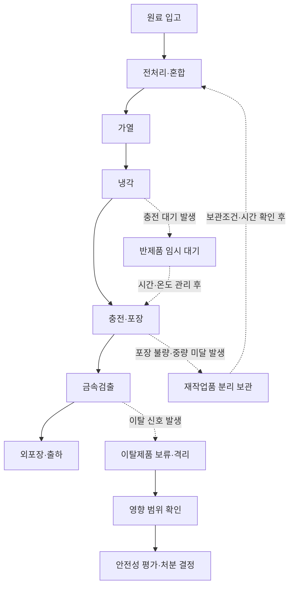
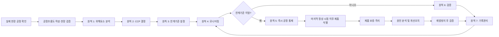

# [QA+ 블로그 생성 결과물] HC008 HACCP 7원칙 현장공정형
생성일시: 2026-08-30 07:21:47 (KST)
적용모델: gpt-5.6-terra

================================================================================
# 📋 최종 발행용 블로그 패키지

### 1. 메타 데이터 (SEO 설정)

- **최종 포스팅 제목**: HACCP 7원칙 현장 적용 가이드: 공정도·CCP·이탈제품 격리까지
- **메타 디스크립션 (120자 내외 요약)**: HACCP 7원칙을 식품공장 실제 공정에 적용하는 방법을 정리했습니다. 공정도 검증, CCP 설정, 한계기준, 이탈제품 격리와 개선조치까지 현장 사례로 확인하세요.
- **추천 해시태그 (10개)**:  
  #HACCP #HACCP7원칙 #식품안전 #식품품질관리 #식품공장 #CCP #위해요소분석 #식품위생 #식품QA #식품안전관리인증기준
- **카테고리**: HACCP 가이드
- **사실관계 검수 메모**:
  - 「식품위생법」 제48조는 식품안전관리인증기준(HACCP)의 법적 근거 조항으로 활용할 수 있습니다.
  - 세부 운영기준은 식품의약품안전처 고시 「식품 및 축산물 안전관리인증기준」의 최신 현행본 확인이 필요합니다.
  - Codex 문서는 `General Principles of Food Hygiene (CXC 1-1969)`이며, HACCP 적용을 위한 준비절차와 7원칙 구조를 제시합니다.
  - 제품별 가열·냉각 기준, 미생물 기준, 금속검출기 성능 기준 등은 제품 특성·검증자료·적용 법령에 따라 달라지므로 특정 숫자를 일반화하지 않은 원고 구성이 적절합니다.

---

## 2. 네이버 블로그 / 티스토리 복사용 최종 원고 (Markdown)

# HACCP 7원칙, 외우지 말고 공정에 꽂아 넣으세요: 식품공장 현장형 적용 가이드

> **20년 실무 선배의 한 줄 요약**  
> HACCP 7원칙의 핵심은 서류를 많이 만드는 일이 아닙니다. 실제 공정도 위에서 위해요소를 찾고, 반드시 관리해야 할 지점을 정한 뒤, 이탈 시 제품을 통제한 사실까지 매일 증명하는 일입니다.

---

## 1. 문서는 완벽한데 왜 심사에서는 “현장과 다릅니다”라고 할까요?

HACCP 심사에서 정말 자주 듣는 지적이 있습니다.

- “공정흐름도에는 없는데, 이 반제품은 어디에서 대기합니까?”
- “재작업품은 언제 투입합니까?”
- “금속검출기 이탈 제품은 실제로 어떻게 분리합니까?”

관리계획서는 잘 작성되어 있어도 현장 동선, 작업 순서, 보관 방식과 다르면 HACCP 체계는 제대로 작동한다고 보기 어렵습니다. HACCP은 문서가 아니라 **현장에서 반복되는 안전한 행동**이기 때문입니다.

특히 QA팀이 사무실에서 위해요소분석표를 작성하고, 생산팀은 별도의 방식으로 작업하는 경우가 많습니다. 예를 들어 문서에는 “가열 후 즉시 냉각”이라고 적혀 있지만, 실제로는 충전기 대기 때문에 반제품이 상온에 30분 이상 머무를 수 있습니다.

또는 공정도에는 원료 입고부터 출하까지 깔끔하게 연결되어 있지만, 실제 현장에는 재작업품 보관통과 반제품 임시 적치구역이 따로 존재합니다. 이 숨은 공정이 빠지면 미생물 증식, 교차오염, 이물 혼입 가능성도 분석에서 빠집니다.

「식품위생법」 제48조는 식품안전관리인증기준(HACCP)의 법적 근거를 두고 있습니다. 세부 운영사항은 식품의약품안전처 고시인 **「식품 및 축산물 안전관리인증기준」** 최신 현행본에서 확인해야 합니다.

쉽게 말하면 HACCP은 문제가 생긴 제품을 나중에 검사해서 걸러내는 방식이 아니라, 문제가 생길 만한 지점을 생산 중에 미리 잡는 예방관리 체계입니다. 최종제품 검사만으로는 이미 출하됐거나 다음 공정으로 넘어간 제품을 되돌리기 어려운 한계가 있기 때문입니다.

그래서 현장공정형 HACCP은 아래 연결고리를 끊기지 않게 만드는 작업입니다.

1. 공정도가 실제와 맞아야 합니다.
2. 공정도 위에서 위해요소를 분석해야 합니다.
3. 분석 결과를 바탕으로 CCP를 결정해야 합니다.
4. 이탈 시 제품을 격리해야 합니다.
5. 검증과 기록으로 운영 사실을 증명해야 합니다.

> **핵심 원칙**  
> 위해요소분석표는 공정도 위에서 만들어집니다.  
> 공정도가 틀리면 위해요소분석이 틀리고, 위해요소분석이 틀리면 CCP도 흔들립니다.


이제부터는 HACCP 7원칙을 교과서식 정의가 아니라, 입고부터 출하까지 실제 공정에 꽂아 넣는 방식으로 정리해 보겠습니다.

---

## 2. HACCP 7원칙과 12절차, 먼저 관계부터 바로잡겠습니다

HACCP 7원칙과 12절차를 서로 다른 제도처럼 이해하는 분들이 많습니다. 하지만 12절차는 HACCP 계획을 만들고 실행하기 위한 전체 순서이고, 그중 핵심 관리 논리가 바로 7원칙입니다.

Codex Alimentarius의 `General Principles of Food Hygiene (CXC 1-1969)`에서도 HACCP 적용을 위한 준비절차와 7원칙의 구조를 제시하고 있습니다.

쉽게 말하면 12절차는 집을 짓는 전체 공정이고, 7원칙은 집이 무너지지 않도록 반드시 갖춰야 하는 구조물이라고 생각하시면 됩니다.

12절차의 1단계부터 5단계까지는 준비 단계입니다.

- HACCP 팀 구성
- 제품설명서 작성
- 소비자와 섭취방법 확인
- 공정흐름도 작성
- 공정흐름도의 현장 확인

이 준비가 부실하면 이후 위해요소분석표를 아무리 잘 작성해도 근거가 약해집니다. 특히 영유아, 고령자, 면역저하자 등이 섭취할 가능성이 있는 제품은 위해요소의 심각도를 평가할 때 더 신중해야 합니다.

6단계부터 12단계는 HACCP 7원칙을 실제로 적용하는 단계입니다.

| HACCP 12절차 | 연결되는 HACCP 7원칙 | 현장에서 해야 할 일 |
|---|---|---|
| 1~5단계: 팀 구성, 제품설명, 용도 확인, 공정도 작성·현장확인 | 7원칙 적용 전 준비 | 실제 작업 순서, 재작업, 보관, 외주공정, 이동 동선 확인 |
| 6단계: 위해요소 분석 | 원칙 1 | 공정별 생물학적·화학적·물리적 위해요소 분석 |
| 7단계: CCP 결정 | 원칙 2 | 반드시 통제해야 하는 지점인지 판단 |
| 8단계: 한계기준 설정 | 원칙 3 | 정상·이탈을 판정할 수 있는 수치 또는 조건 설정 |
| 9단계: 모니터링 설정 | 원칙 4 | 누가, 언제, 무엇을, 어떻게 확인할지 결정 |
| 10단계: 개선조치 설정 | 원칙 5 | 이탈제품 격리·평가·처분·재발방지 절차 설정 |
| 11단계: 검증 절차 설정 | 원칙 6 | 관리계획이 실제로 유효한지 확인 |
| 12단계: 문서화·기록관리 | 원칙 7 | 실행 근거와 결과를 보관·추적 |

공정흐름도는 꼭 현장에서 걸어 다니면서 확인해야 합니다. 원료 입고, 냉장·냉동 보관, 해동, 절단, 혼합, 가열, 냉각, 충전, 내포장, 금속검출, 외포장, 출하만 보면 부족합니다.

다음 항목도 반드시 확인하세요.

- 재작업품 발생과 재투입
- 반제품 대기
- 휴게시간 중 제품 보관
- 야간 생산
- 세척 후 설비 조립
- 폐기물 이동
- 외주 보관 및 외주공정

심사관은 대개 문서에 없는 실제 공정을 작업자에게 직접 질문해서 확인합니다.



---

## 3. 원칙 1: 위해요소분석, “무엇이 있나”보다 “무엇이 유의한가”를 보세요

위해요소분석은 모든 공정에 B·C·P를 무조건 많이 적는 작업이 아닙니다.

- **B(Biological)**: 생물학적 위해요소, 예: 병원성 미생물
- **C(Chemical)**: 화학적 위해요소, 예: 세척제 잔류, 알레르겐, 잔류물질
- **P(Physical)**: 물리적 위해요소, 예: 금속, 플라스틱, 유리, 뼈, 돌

중요한 것은 “위해요소가 존재할 수 있다”와 “우리 제품에서 유의하게 관리해야 한다”를 구분하는 일입니다.

원료 입고 단계에서는 공급업체의 관리 수준과 원료 특성을 봐야 합니다. 냉동 축산원료라면 병원성 미생물 가능성, 뼈 조각이나 포장재 조각 같은 이물 가능성, 알레르겐 원료라면 교차접촉과 표시 오류 가능성을 함께 검토합니다.

향신료나 농산물 원료는 미생물, 잔류농약, 곰팡이독소 등 제품 특성에 맞는 항목을 검토할 수 있습니다. 다만 실제 유의 위해요소 선정은 원료 규격서, 시험성적서, 공급업체 평가, 과거 부적합 이력, 식품공전 기준 등을 근거로 판단해야 합니다.

| 공정 예시 | 검토 가능한 위해요소 | 현장 확인 질문 | 관리 근거 예시 |
|---|---|---|---|
| 원료 입고 | 병원성 미생물, 잔류물질, 뼈·돌·포장재 이물, 알레르겐 | 공급업체 규격과 실제 입고 상태가 일치하는가? | 원료규격서, 시험성적서, 협력업체 평가 |
| 해동·전처리 | 미생물 증식, 교차오염, 세척제 잔류 | 해동 시간·온도와 대기 시간이 관리되는가? | 작업표준, 온도기록, 세척·헹굼 기준 |
| 가열·살균 | 병원성 미생물 생존 | 제품 중심부 조건을 실제로 확인하는가? | 밸리데이션, 공정검증, 설비 성능자료 |
| 냉각 | 미생물 증식 | 냉각 지연 또는 적치가 발생하는가? | 냉각조건 검증자료, 시간·온도 기록 |
| 포장·금속검출 | 재오염, 금속·플라스틱 이물, 포장 불량 | 불량품 배출과 격리가 확실한가? | 성능점검 기록, 이탈제품 관리기록 |
| 출하 | 온도 이탈, 오출고, 표시 오류 | 차량 적재 전 제품과 표시를 확인하는가? | 출하점검표, 차량온도 확인기록 |

위해요소의 유의성은 보통 발생 가능성과 심각도를 종합해 판단합니다. 예를 들어 금속 조각이 제품에 혼입될 가능성은 낮아 보여도, 발생 시 소비자 상해로 이어질 수 있다면 심각도는 높게 평가할 수 있습니다.

반대로 원료 입고 시 미생물 위해가 있어도 후속 가열공정이 검증된 조건으로 충분히 저감한다면, 원료 입고 자체를 CCP로 잡기보다 공급업체 관리와 가열공정 통제로 관리할 수 있습니다.

이 판단 근거가 위해요소분석표에 설명되어 있어야 “왜 유의하다 또는 유의하지 않다고 했습니까?”라는 질문에 답할 수 있습니다.

---

## 4. 원칙 2: CCP 설정, 많이 잡는 것이 아니라 반드시 잡아야 할 곳을 잡습니다

CCP는 Critical Control Point, 우리말로 중요관리점입니다. 식품안전 위해요소를 예방·제거하거나 허용 가능한 수준까지 감소시키기 위해 반드시 통제해야 하는 공정을 말합니다.

쉽게 말하면 이 지점의 관리가 무너지면 뒤 공정에서 회복하기 어려운 핵심 관문입니다. 따라서 “중요해 보인다”는 이유만으로 CCP가 되는 것은 아닙니다.

작업장 청소, 손 세척, 해충방제, 원료 검수, 냉장고 청결, 칼과 도마 세척은 매우 중요합니다. 하지만 많은 경우 이런 항목은 선행요건관리 또는 일반위생관리로 통제합니다.

선행요건관리는 HACCP이 제대로 작동하기 위한 기본 위생 토대입니다. 바닥이 젖어 있고, 손 세척도 안 되고, 세척·소독도 흔들리는데 CCP 기록지만 잘 쓴다고 안전해지는 것은 아닙니다.

CCP 후보를 판단할 때는 최소한 아래 질문을 던져야 합니다.

1. 해당 위해요소를 통제할 수 있는 조치가 있는가?
2. 이 단계에서 통제가 실패하면 식품안전 위해로 직접 이어질 수 있는가?
3. 이후 공정에서 그 위해요소를 제거하거나 줄일 수 있는가?
4. 이 지점의 관리가 제품 안전 확보에 필수적인가?

예를 들어 가열공정은 병원성 미생물을 저감하는 마지막 공정이라면 CCP가 될 가능성이 큽니다. 금속검출공정도 후속 공정에서 금속 이물을 걸러낼 수 없고, 성능 확인과 불량품 격리 체계가 갖춰져 있다면 CCP 후보가 될 수 있습니다.

> **CCP 판단의 핵심 질문**  
> “이 공정을 놓쳐도 뒤에서 회복할 수 있는가?”  
> 회복할 수 없다면 CCP 후보로 검토해야 합니다.

---

## 5. 원칙 3·4: 한계기준과 모니터링, 숫자와 행동으로 관리해야 합니다

한계기준은 CCP가 관리 상태에 있는지 아닌지를 판정하는 기준입니다.

“적당히 뜨겁게”, “충분히 냉각”, “이물 없이” 같은 표현은 한계기준이 될 수 없습니다. 측정 가능해야 하고, 정상과 이탈을 누구나 같은 기준으로 판정할 수 있어야 합니다.

또한 법령, 식품공전, 공식 가이드라인, 제품 및 공정 밸리데이션 결과, 설비 성능자료 등 객관적 근거가 있어야 합니다.

가열공정의 한계기준을 정할 때는 단순히 탱크 표시온도만 보는 방식이 부족할 수 있습니다. 실제 제품 중심부 온도, 유지시간, 제품의 점도와 충전량, 가열 방식, 가장 불리한 위치의 제품 조건 등을 검증해야 합니다.

구체적인 가열온도와 시간은 제품 특성 및 목표 미생물에 따라 달라지므로, 반드시 자사 검증자료와 공식 기준에 근거해 설정해야 합니다.

| 구분 | 의미 | 예시 개념 | 이탈 시 기본 대응 |
|---|---|---|---|
| 관리기준(운영기준) | 한계기준 이탈을 사전에 막기 위한 내부 목표 | 내부 목표 온도, 목표 pH 범위, 주의 알람값 | 설비 조정, 추가 확인, 점검 강화 |
| 한계기준 | 식품안전상 허용·불허를 판정하는 기준 | 검증된 최소 가열조건, 검출기 성능 조건 등 | 공정 통제, 제품 격리, 평가·처분, 원인조사 |

좋은 모니터링 절차에는 다음 다섯 가지가 분명해야 합니다.

- 무엇을 볼 것인가?
- 누가 확인할 것인가?
- 언제 또는 얼마나 자주 확인할 것인가?
- 어떤 기기와 방법으로 측정할 것인가?
- 어디에 기록할 것인가?

예를 들어 “가열온도 매일 확인”은 너무 모호합니다.

> 생산 시작 전·생산 중 제품 전환 시·매 1시간마다 검증된 온도계로 제품 중심부 온도를 측정해 CCP 기록지에 즉시 기록한다.

이처럼 현장에서 바로 실행할 수 있도록 작성해야 합니다.

모니터링 주기는 관행으로 정하면 안 됩니다. 이탈이 발생했을 때 영향을 받는 제품 범위를 얼마나 줄일 수 있는지를 기준으로 정해야 합니다.

시간당 1,200봉을 생산하는 공정에서 4시간마다 확인한다면, 이탈 발생 시 단순 계산으로 최대 4,800봉이 추적·격리 대상이 될 수 있습니다. 제품 특성과 위험도에 따라 더 짧은 주기 또는 연속 모니터링이 필요한지 검토해야 합니다.




한계기준을 잘 정하고 모니터링도 했는데 이탈이 발생했다면, 그때부터는 기록보다 제품 통제가 우선입니다.

---

## 6. 원칙 5: 개선조치, “재측정 정상”으로 끝내면 안 됩니다

한계기준 이탈이 발견되면 첫 번째 행동은 원인 찾기가 아닙니다. 먼저 공정을 통제하고, 영향을 받을 수 있는 제품을 식별·격리해야 합니다.

현장에서는 “온도를 다시 쟀더니 정상입니다”, “금속검출기를 다시 통과시켰습니다”라고 끝나는 경우가 있습니다. 하지만 이탈이 언제부터 시작됐는지와 그 사이에 생산된 제품이 어디에 있는지가 확인되지 않으면 제품 안전성을 증명할 수 없습니다.

개선조치는 보통 다음 순서로 운영하면 흔들리지 않습니다.

1. 이탈 사실 확인 및 즉시 보고
2. 해당 공정 정지 또는 조건 복구
3. 마지막 정상 확인 시점부터 이탈 발견 시점까지 생산품 추적
4. 영향 가능 제품 보류·격리
5. 제품 안전성 평가
6. 재처리 가능 여부, 폐기 또는 기타 처분 결정
7. 책임자 승인 근거 기록
8. 원인 분석 및 재발방지 조치

이탈 원인 분석도 “작업자 실수” 한 줄로 끝내면 재발합니다. 작업표준이 불명확했는지, 교육이 부족했는지, 설비 알람이 작동하지 않았는지, 측정기기의 신뢰성이 떨어졌는지까지 확인해야 합니다.

> **이탈 발생 시 반드시 답해야 할 4가지**  
> 1. 마지막 정상 확인은 언제였습니까?  
> 2. 영향 가능 제품은 어느 로트까지입니까?  
> 3. 해당 제품은 현재 어디에 있습니까?  
> 4. 왜 발생했고, 다시 발생하지 않게 무엇을 바꿨습니까?

---

## 7. 실제 현장 사례로 보는 HACCP 7원칙 적용법

### 사례 1. 냉동만두 제조공장: 재작업품 투입 누락으로 공정도가 흔들린 사례

냉동만두 제조공장에서 정기심사를 준비하던 중, 공정도에는 없는 재작업품 보관통이 현장에서 발견됐습니다. 생산팀은 포장 불량이나 중량 미달 제품을 선별한 뒤, 당일 반죽 또는 속 배합 공정에 일부 재투입하고 있었습니다.

그런데 HACCP 관리계획서에는 재작업품 발생, 보관, 재투입 시점, 최대 보관시간이 전혀 반영되어 있지 않았습니다. 재작업품이 냉장구역이 아닌 작업장 한쪽에 최대 2시간가량 대기한 사실도 확인됐습니다.

위해요소분석에서는 다음 위험을 다시 검토했습니다.

- 시간·온도 관리 미흡에 따른 미생물 증식
- 포장재 조각 혼입
- 알레르겐 제품 간 교차접촉
- 재투입 제품 불명확에 따른 표시사항 오류

개선조치로 재작업품 흐름을 공정도에 별도 화살표로 반영했습니다. 재작업품은 발생 제품명, 발생 시간, 중량, 담당자, 재투입 가능 공정, 보관 조건을 표시하도록 관리표를 만들었습니다.

냉장 관리가 필요한 재작업품은 전용 밀폐용기에 담아 지정 냉장구역에 보관하고, 최대 보관시간은 자사 제품 특성과 검증 결과에 따라 설정했습니다. 알레르겐 함유 제품은 동일 알레르겐 제품군 내에서만 재투입하도록 기준을 정하고, 불가능한 경우 폐기 처리했습니다.

핵심은 재작업품을 숨은 공정으로 두지 않는 것입니다.

---

### 사례 2. 레토르트 소스 제조공장: 가열기록은 있었지만 제품 중심부 검증이 부족했던 사례

레토르트 소스 제조공장에서는 살균설비의 표시온도와 시간이 매 생산마다 기록되고 있었습니다. 기록지만 보면 이탈은 한 건도 없었고, 담당자 서명도 빠짐없이 들어가 있었습니다.

하지만 내부검증 중 점도가 높은 소스 제품에서 용기 위치별 제품 중심부 도달 조건이 충분히 확인되지 않았다는 문제가 발견됐습니다. 설비 표시값은 정상이어도 실제 제품이 목표 살균 조건에 도달하는지에 대한 검증 근거가 부족한 상태였습니다.

근본 원인은 제품의 점도, 충전량, 용기 규격, 적재 방식이 바뀌었는데도 기존 HACCP 계획을 재검토하지 않은 변경관리 미흡이었습니다.

개선조치로 다음 사항을 보완했습니다.

- 제품별 최악 조건 선정
- 열분포 및 제품 중심부 조건 확인
- 충전량·점도·용기 규격별 검증 설계
- 생산 시작·제품 전환·설비 정지 후 재가동 시 확인 절차 보완
- 온도계와 기록계의 교정·성능 확인 주기 연계
- 용기 규격, 배합 점도, 충전량, 설비 속도 변경 시 HACCP 팀 검토 의무화

이 사례는 한계기준이 단순 경험치가 아니라, 제품과 공정의 검증 결과로 뒷받침돼야 한다는 점을 보여줍니다.

---

### 사례 3. 냉장 음료 제조공장: 금속검출기 이탈품을 다시 통과시킨 뒤 출하한 사례

냉장 음료 제조공장에서는 금속검출기 성능점검을 생산 시작 전과 종료 후에만 실시하고 있었습니다. 어느 날 생산 중 금속검출기에서 불량 신호가 발생했지만, 작업자는 제품을 한 번 더 통과시켜 정상 신호가 나오자 그대로 다음 공정으로 보냈습니다.

당시 배출장치 주변에는 여러 제품이 섞여 있었고, 이탈 제품의 로트번호도 별도로 기록되지 않았습니다. 나중에 QA팀이 확인했을 때 어떤 제품이 최초 이탈품인지, 그 전후로 몇 개의 제품이 영향을 받았는지 추적하기 어려운 상황이었습니다.

개선조치로 다음 절차를 적용했습니다.

1. 이탈 발생 시 즉시 라인 정지
2. 마지막 정상 성능점검 시점 이후 생산품 보류
3. 이탈품 전용 잠금 보관함 관리
4. 제품명·로트·시간·이탈 사유·처리 결과 기록
5. 재검사는 원인 확인 및 책임자 승인 후 실시
6. 생산량과 위험도를 반영해 생산 중 성능점검 주기 재설계
7. 배출장치 작동 여부를 정기적으로 확인

이후 이탈 건수는 초기에는 늘어났지만, 이는 숨겨졌던 경미한 이상이 기록되기 시작했다는 긍정적 신호였습니다.

> 이탈 0건만 목표로 하면 문제가 사라지는 것이 아니라, 발견되지 않은 채 남을 수 있습니다.

---

## 8. HACCP이 문서와 현장에서 따로 놀지 않게 만드는 실전 팁

### 1) HACCP 관리계획서를 생산팀 언어로 번역하세요

작업자에게 “CCP 모니터링을 하세요”라고 말하면 실행이 약해질 수 있습니다.

대신 아래 내용을 알려줘야 합니다.

- 이 온도계를 어디에 꽂아야 하는가?
- 몇 분 또는 몇 시간마다 확인하는가?
- 기준 아래로 나오면 제품을 어디에 두는가?
- 누구에게 연락해야 하는가?
- 기록지는 어디에 있고 언제 작성해야 하는가?

CCP별 A4 한 장짜리 작업표준을 만들어 현장에 게시하면 교육 효과가 높아집니다.

### 2) 변경관리를 놓치면 과거의 HACCP은 현재 공정을 보호하지 못합니다

다음과 같은 변경이 생기면 HACCP 팀 검토가 필요합니다.

- 원료 공급업체 변경
- 배합비 변경
- 알레르겐 원료 추가
- 포장재 변경
- 충전량 변경
- 신규 설비 도입
- 설비 위치 변경
- 생산량 증가
- 생산시간 연장
- 재작업 방식 변경
- 유통기한 변경

기존 CCP와 한계기준이 변경된 조건에서도 유효한지 검토하고, 그 기록을 남겨야 합니다.

### 3) 이탈 기록 0건이 항상 좋은 신호는 아닙니다

작업자가 이탈을 기록하면 혼난다고 느끼는 조직에서는 작은 이상도 숨겨질 수 있습니다. 좋은 조직은 이탈을 발견한 사람을 탓하기보다, 제품을 빨리 격리하고 원인을 제거한 팀을 인정합니다.

### 4) CCP보다 먼저 선행요건관리가 흔들리는지 확인하세요

개인위생, 청소·소독, 교차오염 방지, 용수 관리, 해충방제, 냉장·냉동 설비 관리, 이물관리, 알레르겐 관리가 약하면 CCP에 불필요한 부담이 몰립니다.

> **심사관 대응 실무 팁**  
> “기준은 문서 몇 페이지에 있습니다”보다  
> “현장에서는 이렇게 확인하고, 이탈 시 이 기록으로 제품을 격리합니다”라고 실제 흐름으로 설명하는 편이 훨씬 강합니다.

---

## 9. HACCP 7원칙 FAQ: 심사에서 자주 막히는 질문 6가지

### Q1. CCP는 많을수록 좋은가요?

**A. 아닙니다.** CCP는 개수 경쟁이 아니라 해당 지점의 통제가 식품안전에 필수적인지로 결정해야 합니다. 선행요건관리나 일반공정관리로 충분히 통제할 수 있는 항목까지 CCP로 올리면 현장 기록 부담이 커지고, 정작 중요한 관리점의 집중도가 떨어질 수 있습니다.

### Q2. 금속검출기는 무조건 CCP인가요?

**A. 무조건은 아닙니다.** 제품 특성, 전후 공정, 이물 혼입 가능성, 후속 공정에서의 제거 가능성, 검출 실패 시 위해 정도를 분석해 판단해야 합니다. 다만 최종 포장 후 금속 이물을 통제하는 마지막 단계라면 CCP 후보가 될 가능성이 높습니다.

### Q3. 제품 미생물 검사를 하면 CCP 모니터링을 대체할 수 있나요?

**A. 일반적으로 대체할 수 없습니다.** 제품검사는 결과가 나오기까지 시간이 걸리고, 생산 중 이탈을 즉시 발견해 조치하는 활동이 아닙니다. CCP 모니터링은 생산 중 한계기준 이탈을 빠르게 잡고 제품을 통제하기 위한 활동입니다.

### Q4. 한계기준을 이탈했는데 제품검사 결과가 적합하면 출하해도 되나요?

**A. 제품검사 결과만 보고 단순 판단하면 안 됩니다.** 마지막 정상 시점, 이탈 원인, 영향 제품 범위, 한계기준의 안전상 의미, 재처리 가능 여부, 적용 법령 및 사내 승인 절차를 함께 검토해야 합니다.

### Q5. HACCP 기록지는 생산 종료 후 한꺼번에 작성해도 되나요?

**A. 바람직하지 않고 심사 지적 가능성이 높습니다.** 기록은 실제 측정 또는 관찰 시점에 작성해야 신뢰성이 있습니다. 나중에 기억으로 작성하면 측정값의 진위와 제품 영향 범위를 입증하기 어렵습니다.

### Q6. 원료나 포장재만 바뀌었는데 HACCP 계획도 다시 봐야 하나요?

**A. 네, 변경관리 검토가 필요합니다.** 원료 변경은 미생물·알레르겐·이물·화학적 위해요소에 영향을 줄 수 있고, 포장재 변경은 밀봉성·이물·표시사항·유통기한에 영향을 줄 수 있습니다.

---

## 10. 바로 쓰는 HACCP 7원칙 단계별 체크리스트

| 점검 단계 | 확인 항목 | 실무 확인 방법 | 권장 확인 주기 |
|---|---|---|---|
| 공정도 | 재작업, 반제품 대기, 보관, 외주공정, 폐기물 이동이 포함됐는가 | 생산·QA·설비 담당자가 현장을 함께 걸으며 확인 | 연 1회 이상 및 변경 시 |
| 위해요소분석 | 유의·비유의 판단 근거가 남아 있는가 | 원료규격서, 클레임, 검사결과, 법적 기준, 공정 특성 확인 | 연 1회 이상 및 변경 시 |
| CCP 결정 | CCP 선정 또는 제외 근거가 설명 가능한가 | 결정도 적용 또는 질문 방식의 판단 근거 검토 | 계획 개정 시 |
| 한계기준 | 수치·조건이 명확하고 검증 근거가 있는가 | 식품공전, 밸리데이션, 설비자료, 문헌 검토 | 설정 시 및 변경 시 |
| 모니터링 | 대상·방법·주기·담당자·기록지가 명확한가 | 실제 작업자에게 현장에서 질문 | 일상 운영 및 월간 검토 |
| 측정기기 | 온도계, 저울, 금속검출기 등의 신뢰성이 확보됐는가 | 교정성적서, 성능점검, 시험편 관리 확인 | 기기별 관리기준에 따라 |
| 개선조치 | 이탈 시 제품 격리와 영향 범위 확인이 가능한가 | 최근 이탈기록 또는 모의훈련 확인 | 분기 1회 이상 모의점검 권장 |
| 검증 | 기록검토 외 현장관찰·검사·추세분석을 하는가 | 내부검증 계획과 결과보고서 확인 | 월간·분기·연간 계획별 |
| 기록관리 | 수정 이력, 서명, 보관, 전자기록 권한관리가 되는가 | 최근 3개월 기록 샘플 확인 | 월 1회 이상 |
| 변경관리 | 원료·설비·배합·포장·생산량 변경 시 검토했는가 | 변경관리대장과 교육기록 확인 | 변경 발생 즉시 |

전자기록을 운영하는 곳이라면 권한관리도 꼭 확인해야 합니다. 누가 입력했고, 누가 수정했으며, 수정 전 값은 무엇이었는지 추적할 수 있어야 합니다.

백업 주기와 서버 장애 시 비상 기록 방법도 정해 두는 편이 좋습니다. 종이기록이든 전자기록이든 핵심은 동일합니다.

> 실제로 누가 언제 무엇을 확인했고, 이상이 있을 때 어떤 조치를 했는지 추적 가능해야 합니다.

법령과 고시, 식품공전은 개정될 수 있으므로 블로그 내용을 실무에 적용하기 전에는 반드시 최신 현행본을 확인하세요. 국가법령정보센터, 식품의약품안전처, 식품안전나라, 한국식품안전관리인증원 자료를 함께 확인하면 좋습니다.

---

## 11. 맺음말: HACCP 7원칙의 완성은 “잘 만든 서류”가 아니라 “반복되는 안전한 행동”입니다

오늘 내용은 길었지만, 실무에서는 결국 세 가지로 정리됩니다.

1. HACCP은 실제 현장과 일치하는 공정도에서 시작합니다.
2. 위해요소와 CCP는 다른 공장을 복사하는 것이 아니라 우리 원료·제품·설비·작업방식에 맞춰 판단해야 합니다.
3. 이탈이 발생했을 때 제품을 격리하고 원인을 없애며 재발방지까지 연결해야 HACCP이 살아 있습니다.

HACCP 7원칙은 QA팀 혼자 만드는 문서가 아닙니다. 생산팀은 작업표준을 지키고, 설비팀은 측정기기와 설비 성능을 관리하며, 구매팀은 원료와 공급업체를 관리하고, 경영진은 필요한 인력과 설비 개선을 지원해야 합니다.

오늘은 먼저 현장 공정도 한 장을 들고 생산라인을 직접 걸어보세요.

- 재작업품은 어디로 가는가?
- 반제품은 어디서 기다리는가?
- 이탈품은 실제로 어디에 격리되는가?

이 세 가지만 확인해도 개선 포인트가 보일 겁니다. 그 한 장의 정확성이 HACCP 7원칙을 제대로 세우는 가장 단단한 출발점입니다.

> **오늘의 핵심 3줄 요약**  
> - HACCP은 공정도에서 시작하고, 현장에서 완성됩니다.  
> - CCP는 “중요해 보이는 공정”이 아니라 “반드시 통제해야 하는 공정”입니다.  
> - 이탈 시 재측정만 하지 말고, 제품 격리·영향평가·재발방지까지 기록해야 합니다.  

---

## 3. 워드프레스 / 웹사이트용 HTML 원고

```html
<article class="food-qa-post">
  <header>
    <h1>HACCP 7원칙, 외우지 말고 공정에 꽂아 넣으세요: 식품공장 현장형 적용 가이드</h1>
    <p><strong>20년 실무 선배의 한 줄 요약:</strong> HACCP 7원칙의 핵심은 서류를 많이 만드는 일이 아닙니다. 실제 공정도 위에서 위해요소를 찾고, 반드시 관리해야 할 지점을 정한 뒤, 이탈 시 제품을 통제한 사실까지 매일 증명하는 일입니다.</p>
  </header>

  <section>
    <h2>1. 문서는 완벽한데 왜 심사에서는 “현장과 다릅니다”라고 할까요?</h2>
    <p>HACCP 심사에서 자주 듣는 질문은 “공정흐름도에는 없는데 이 반제품은 어디에서 대기합니까?”, “재작업품은 언제 투입합니까?”, “금속검출기 이탈 제품은 실제로 어떻게 분리합니까?”입니다.</p>
    <p>관리계획서는 잘 작성되어 있어도 현장 동선, 작업 순서, 보관 방식과 다르면 HACCP 체계는 제대로 작동한다고 보기 어렵습니다. HACCP은 문서가 아니라 <strong>현장에서 반복되는 안전한 행동</strong>이기 때문입니다.</p>
    <blockquote>
      <p><strong>핵심 원칙</strong><br>위해요소분석표는 공정도 위에서 만들어집니다.<br>공정도가 틀리면 위해요소분석이 틀리고, 위해요소분석이 틀리면 CCP도 흔들립니다.</p>
    </blockquote>
    <figure>
      
      <figcaption>문서상 공정도에서 빠지기 쉬운 재작업품·반제품 대기·이탈제품 격리 흐름을 현장에서 확인해야 합니다.</figcaption>
    </figure>
  </section>

  <section>
    <h2>2. HACCP 7원칙과 12절차의 관계</h2>
    <p>HACCP 12절차는 계획을 만들고 실행하기 위한 전체 순서이며, 그중 핵심 관리 논리가 HACCP 7원칙입니다. Codex Alimentarius의 <em>General Principles of Food Hygiene (CXC 1-1969)</em>도 이러한 구조를 제시합니다.</p>

    <table>
      <thead>
        <tr>
          <th>HACCP 12절차</th>
          <th>연결 원칙</th>
          <th>현장 실행 내용</th>
        </tr>
      </thead>
      <tbody>
        <tr><td>1~5단계</td><td>준비 단계</td><td>팀 구성, 제품설명, 용도 확인, 공정도 작성 및 현장 확인</td></tr>
        <tr><td>6단계</td><td>원칙 1</td><td>공정별 생물학적·화학적·물리적 위해요소 분석</td></tr>
        <tr><td>7단계</td><td>원칙 2</td><td>CCP 결정</td></tr>
        <tr><td>8단계</td><td>원칙 3</td><td>한계기준 설정</td></tr>
        <tr><td>9단계</td><td>원칙 4</td><td>모니터링 절차 설정</td></tr>
        <tr><td>10단계</td><td>원칙 5</td><td>개선조치 및 이탈제품 통제</td></tr>
        <tr><td>11단계</td><td>원칙 6</td><td>검증 절차 설정</td></tr>
        <tr><td>12단계</td><td>원칙 7</td><td>문서화 및 기록관리</td></tr>
      </tbody>
    </table>
  </section>

  <section>
    <h2>3. 원칙 1: 위해요소분석</h2>
    <p>위해요소분석은 모든 공정에 B·C·P를 많이 적는 일이 아닙니다. 위해요소가 존재할 가능성과 우리 제품에서 유의하게 관리해야 하는 위해요소인지를 구분해야 합니다.</p>
    <ul>
      <li><strong>B:</strong> 병원성 미생물 등 생물학적 위해요소</li>
      <li><strong>C:</strong> 세척제 잔류, 알레르겐, 잔류물질 등 화학적 위해요소</li>
      <li><strong>P:</strong> 금속, 플라스틱, 유리, 뼈, 돌 등 물리적 위해요소</li>
    </ul>
    <p>유의성 판단은 원료 규격서, 시험성적서, 공급업체 평가, 과거 부적합 이력, 식품공전 및 제품·공정 특성을 근거로 해야 합니다.</p>
  </section>

  <section>
    <h2>4. 원칙 2: CCP 설정</h2>
    <p>CCP는 식품안전 위해요소를 예방·제거하거나 허용 가능한 수준까지 감소시키기 위해 반드시 통제해야 하는 지점입니다. 중요해 보인다는 이유만으로 CCP가 되는 것은 아닙니다.</p>
    <blockquote>
      <p><strong>CCP 판단의 핵심 질문</strong><br>“이 공정을 놓쳐도 뒤에서 회복할 수 있는가?”<br>회복할 수 없다면 CCP 후보로 검토해야 합니다.</p>
    </blockquote>
    <p>가열공정이나 최종 단계의 금속검출공정은 CCP 후보가 될 수 있으나, 실제 지정 여부는 제품·설비·공정별 위해요소분석 근거에 따라 판단해야 합니다.</p>
  </section>

  <section>
    <h2>5. 원칙 3·4: 한계기준과 모니터링</h2>
    <p>한계기준은 CCP가 관리 상태에 있는지 판정하는 기준입니다. “적당히 뜨겁게”, “충분히 냉각” 같은 표현은 한계기준이 될 수 없습니다.</p>
    <p>한계기준은 법령, 식품공전, 공식 가이드라인, 밸리데이션 결과, 설비 성능자료 등 객관적 근거를 바탕으로 설정해야 합니다.</p>
    <p>모니터링에는 무엇을, 누가, 언제, 어떤 방법과 기기로, 어디에 기록하는지가 분명해야 합니다.</p>

    <figure>
      
      <figcaption>CCP 이탈 시 재측정만으로 끝내지 말고, 먼저 영향 가능 제품을 보류·격리해야 합니다.</figcaption>
    </figure>
  </section>

  <section>
    <h2>6. 원칙 5: 개선조치</h2>
    <p>한계기준 이탈이 발견되면 원인 분석보다 먼저 공정을 통제하고, 마지막 정상 확인 시점 이후 생산된 영향 가능 제품을 식별·격리해야 합니다.</p>
    <ol>
      <li>이탈 확인 및 보고</li>
      <li>공정 정지 또는 조건 복구</li>
      <li>마지막 정상 시점 이후 생산품 추적</li>
      <li>제품 보류·격리</li>
      <li>안전성 평가와 처분 결정</li>
      <li>원인 분석 및 재발방지</li>
      <li>책임자 승인과 기록 보관</li>
    </ol>
  </section>

  <section>
    <h2>7. HACCP 현장 적용 핵심 사례</h2>

    <h3>사례 1. 냉동만두 제조공장 재작업품 누락</h3>
    <p>공정도에 없는 재작업품 보관과 재투입이 확인된 사례입니다. 재작업품은 시간·온도 관리, 포장재 이물, 알레르겐 교차접촉, 표시사항 오류 위험을 함께 검토해야 합니다. 재작업품 흐름을 공정도에 반영하고, 발생 시간·제품명·중량·보관조건·재투입 가능 공정을 기록하는 방식으로 개선할 수 있습니다.</p>

    <h3>사례 2. 레토르트 소스 제조공장 제품 중심부 검증 부족</h3>
    <p>설비 표시온도 기록은 정상이어도 제품 중심부가 목표 살균 조건에 도달하는지 검증되지 않은 사례입니다. 점도, 충전량, 용기 규격, 적재 방식이 변경되면 기존 한계기준의 유효성을 다시 검토해야 합니다.</p>

    <h3>사례 3. 냉장 음료 제조공장 금속검출기 이탈품 재통과</h3>
    <p>이탈품을 단순 재통과시킨 뒤 출하한 사례입니다. 이탈 시 즉시 라인을 멈추고, 마지막 정상 성능점검 시점 이후 생산품을 보류하며, 이탈품의 로트·시간·처리 결과를 기록해야 합니다.</p>
  </section>

  <section>
    <h2>8. HACCP이 문서와 현장에서 따로 놀지 않게 만드는 팁</h2>
    <ul>
      <li>CCP 관리계획서를 작업자 언어로 바꾸세요.</li>
      <li>원료, 배합, 포장재, 설비, 생산량 변경 시 HACCP 변경관리 검토를 하세요.</li>
      <li>이탈 0건만 목표로 하지 말고, 작은 이상도 기록·공유되는 문화를 만드세요.</li>
      <li>개인위생, 세척·소독, 알레르겐, 이물관리 등 선행요건관리를 먼저 점검하세요.</li>
    </ul>
  </section>

  <section>
    <h2>9. HACCP 7원칙 FAQ</h2>
    <h3>Q1. CCP는 많을수록 좋은가요?</h3>
    <p><strong>A.</strong> 아닙니다. CCP는 개수가 아니라 식품안전 확보를 위해 해당 지점의 통제가 필수적인지를 기준으로 결정합니다.</p>

    <h3>Q2. 금속검출기는 무조건 CCP인가요?</h3>
    <p><strong>A.</strong> 무조건은 아닙니다. 제품과 공정의 위해요소분석, 후속 제거 가능성, 위해 정도를 근거로 판단해야 합니다.</p>

    <h3>Q3. 제품 미생물 검사가 CCP 모니터링을 대체할 수 있나요?</h3>
    <p><strong>A.</strong> 일반적으로 대체할 수 없습니다. CCP 모니터링은 생산 중 이탈을 즉시 발견하고 통제하기 위한 활동입니다.</p>

    <h3>Q4. 한계기준 이탈 후 제품검사가 적합하면 출하해도 되나요?</h3>
    <p><strong>A.</strong> 제품검사 결과만으로 단순 판단하면 안 됩니다. 이탈 원인, 영향 범위, 안전상 의미, 재처리 가능 여부, 법령 및 사내 승인 절차를 종합 검토해야 합니다.</p>

    <h3>Q5. HACCP 기록지는 생산 종료 후 한꺼번에 작성해도 되나요?</h3>
    <p><strong>A.</strong> 바람직하지 않습니다. 기록은 실제 측정 또는 관찰 시점에 작성해야 신뢰성을 확보할 수 있습니다.</p>

    <h3>Q6. 원료나 포장재만 바뀌어도 HACCP 계획을 다시 검토해야 하나요?</h3>
    <p><strong>A.</strong> 네. 위해요소, 표시사항, 유통기한, 한계기준, 작업자 교육에 영향을 줄 수 있으므로 변경관리 검토 기록을 남겨야 합니다.</p>
  </section>

  <section>
    <h2>10. HACCP 7원칙 현장 체크리스트</h2>
    <p>공정도, 위해요소분석, CCP, 한계기준, 모니터링, 측정기기, 개선조치, 검증, 기록관리, 변경관리를 정기적으로 확인해야 합니다.</p>
    <p>특히 전자기록을 운영한다면 입력자·수정자·수정 이력·권한관리·백업 및 서버 장애 시 비상기록 절차를 확인해야 합니다.</p>
  </section>

  <footer>
    <h2>11. 맺음말</h2>
    <p>HACCP 7원칙의 완성은 잘 만든 서류가 아니라 반복되는 안전한 행동입니다. 실제 현장과 일치하는 공정도에서 시작해, 우리 공장의 원료·제품·설비·작업방식에 맞는 위해요소와 CCP를 정하고, 이탈 시 제품 격리와 재발방지까지 연결해야 합니다.</p>
    <blockquote>
      <p><strong>오늘의 핵심 3줄 요약</strong><br>
      HACCP은 공정도에서 시작하고 현장에서 완성됩니다.<br>
      CCP는 중요해 보이는 공정이 아니라 반드시 통제해야 하는 공정입니다.<br>
      이탈 시 재측정만 하지 말고 제품 격리·영향평가·재발방지까지 기록해야 합니다.</p>
    </blockquote>
  </footer>
</article>
```
================================================================================

[부록: 1단계 리서치 원본]
# [리서치 리포트] HC008 HACCP 7원칙 현장공정형

> **기획 전제**: ‘현장공정형’은 법령상 별도의 HACCP 유형 명칭이라기보다, HACCP 7원칙을 문서 중심으로 나열하지 않고 **입고부터 출하까지 실제 공정 흐름에 맞춰 적용하는 실무형 콘텐츠 프레임**으로 설정하는 것이 적절합니다.  
> 즉, “원칙 1~7을 외우는 법”이 아니라 “우리 공정에서 위해요소를 어떻게 찾고, CCP를 어떻게 운영·증빙할 것인가”에 답하는 글이어야 합니다.

---

### 1. 타겟 독자 및 검색 의도

- **주요 타겟**
  - 식품공장 품질관리(QC)·품질보증(QA) 신입 및 경력 실무자
  - HACCP 팀원, HACCP 팀장, 생산관리자
  - 신규 HACCP 인증 또는 정기심사·사후관리심사를 준비하는 업소
  - HACCP 관리계획서를 처음 작성하거나 전면 개정해야 하는 담당자
  - 현장에는 공정이 있는데 HACCP 문서와 실제 작업이 따로 노는 문제를 해결하려는 관리자

- **독자의 핵심 고통(Pain Point)**
  - HACCP 7원칙은 교육에서 들었지만, 실제 공정에 어디서부터 적용해야 하는지 모르겠다.
  - 위해요소분석표를 작성했는데, 위해요소를 너무 많이 잡거나 근거 없이 삭제했다는 피드백을 받는다.
  - CCP를 많이 설정해야 안전한 것인지, 적게 설정해야 하는지 판단이 어렵다.
  - 한계기준·모니터링·개선조치가 현실적인 작업 방식과 맞지 않아 현장에서 기록만 형식적으로 작성된다.
  - 심사 시 “공정도와 현장이 다릅니다”, “CCP 모니터링 기록의 신뢰성이 부족합니다”라는 지적을 받는다.
  - 작업자에게 HACCP 원칙을 설명해도 본인의 작업과 연결되지 않아 실행력이 떨어진다.

- **메인 키워드**
  - **HACCP 7원칙**

- **서브/연관 키워드**
  - HACCP 7원칙 12절차
  - HACCP 위해요소분석
  - HACCP CCP 설정
  - HACCP 한계기준 모니터링
  - HACCP 관리계획서 작성
  - HACCP 공정도 작성
  - HACCP 심사 지적사항
  - HACCP 검증 및 기록관리

- **예상 검색 질문 및 검색 의도**
  
  | 독자가 검색할 질문 | 실제 의도 | 글에서 제공할 답 |
  |---|---|---|
  | HACCP 7원칙이 무엇인가요? | 기본 개념 이해 | 7원칙을 정의가 아닌 공정 흐름 중심으로 설명 |
  | HACCP 7원칙과 12절차의 차이는 무엇인가요? | 문서·교육 혼선 해소 | 12절차는 7원칙을 수행하기 위한 준비·실행 절차라는 점 정리 |
  | 위해요소분석은 어떻게 하나요? | 위해요소분석표 작성 | 원료·공정별 생물학적·화학적·물리적 위해요소 도출 방법 제시 |
  | CCP는 몇 개를 잡아야 하나요? | 과다·과소 설정 방지 | CCP는 개수가 아니라 위해 통제의 필수성으로 결정한다는 기준 제시 |
  | CCP와 CP 차이는 무엇인가요? | 현장 관리점 분류 | 식품안전에 결정적 영향을 주는 CCP와 일반 관리항목의 차이 설명 |
  | 한계기준은 누가 어떻게 정하나요? | 기준 설정 근거 확보 | 법령·식품공전·제품 규격·과학적 근거·설비 검증 결과를 연결 |
  | 모니터링 기록은 누가 작성해야 하나요? | 기록 신뢰성 확보 | 실제 확인자가 즉시 기록하고, 이탈 시 개선조치까지 연결하는 구조 제시 |
  | HACCP 심사에서 자주 지적받는 것은 무엇인가요? | 심사 대비 | 공정도 불일치, 형식적 기록, 미흡한 검증, 이탈 후 조치 부재 등 정리 |

---

### 2. 필수 인용 법령 및 표준 기준

## 2-1. 법적·공식 기준

> 블로그 발행 전에는 반드시 국가법령정보센터와 식품의약품안전처 고시의 **최신 현행본·개정 이력**을 재확인해야 합니다. HACCP 적용 대상, 세부 평가 기준, 서식 및 운영 요구사항은 고시 개정에 따라 달라질 수 있습니다.

| 구분 | 공식 근거 | 글에서 활용할 핵심 내용 |
|---|---|---|
| HACCP 법적 근거 | **「식품위생법」 제48조(식품안전관리인증기준)** | 식품안전관리인증기준(HACCP)의 법적 근거 및 식품안전관리인증 제도 이해 |
| 축산물 HACCP 법적 근거 | **「축산물 위생관리법」의 식품안전관리인증 관련 규정** | 축산물가공업·식육포장처리업 등 축산물 영업자가 참고해야 할 근거 |
| HACCP 세부 운영 기준 | **식품의약품안전처 고시 「식품 및 축산물 안전관리인증기준」** | 선행요건관리, HACCP 관리, 인증 및 조사·평가 관련 세부 기준 확인 |
| 국제 HACCP 원칙 | **Codex Alimentarius, General Principles of Food Hygiene, CXC 1-1969** | HACCP 7원칙과 적용 논리의 국제적 기반 |
| 위해요소 기준 확인 | **「식품의 기준 및 규격」(식품공전)** | 미생물, 식품첨가물, 오염물질, 이물, 규격 등 한계기준 또는 위해 분석 근거 확인 |
| 자가품질검사 기준 | **「식품의 기준 및 규격」 및 관련 영업자 준수사항** | 제품검사와 CCP 모니터링을 혼동하지 않도록 설명 |
| 표시·알레르겐 관련 검토 | **「식품 등의 표시·광고에 관한 법률」 및 표시기준** | 알레르겐 교차접촉, 표시 누락 등 화학적 위해요소 검토 시 연결 가능 |

### 공식 확인처

- 국가법령정보센터: <https://www.law.go.kr>
- 식품의약품안전처: <https://www.mfds.go.kr>
- 식품안전나라 HACCP 관련 자료: <https://www.foodsafetykorea.go.kr>
- 한국식품안전관리인증원(HACCP 인증·기술지원 자료): <https://www.haccp.or.kr>
- Codex Alimentarius: <https://www.fao.org/fao-who-codexalimentarius/>

---

## 2-2. HACCP 7원칙: 현장공정형 해석

HACCP은 단순히 CCP 기록지를 만드는 활동이 아닙니다. 제품의 원료 입고부터 보관·전처리·가공·포장·출하까지 공정별 위해요소를 분석하고, 반드시 통제해야 할 지점을 정한 뒤, 이를 지속적으로 입증하는 예방관리 체계입니다.

| HACCP 원칙 | 공식적 의미 | 현장공정형 질문 | 실무 산출물 |
|---|---|---|---|
| **원칙 1. 위해요소 분석** | 식품안전에 위해를 줄 수 있는 생물학적·화학적·물리적 위해요소를 분석 | “이 공정에서 소비자에게 실제로 어떤 위해가 전달될 수 있는가?” | 제품설명서, 용도확인서, 공정도, 위해요소분석표 |
| **원칙 2. 중요관리점(CCP) 결정** | 위해요소를 예방·제거하거나 허용 수준 이하로 감소시키기 위해 필수적으로 관리해야 하는 공정 결정 | “이 단계에서 통제를 놓치면 뒤 공정에서 회복 가능한가?” | CCP 결정 근거, 의사결정도 적용 기록, HACCP 관리계획 |
| **원칙 3. 한계기준 설정** | CCP가 관리 상태인지 판단할 수 있는 허용·불허 기준 설정 | “정상과 이탈을 숫자·조건으로 명확히 구분할 수 있는가?” | 가열온도·시간, 금속검출 감도, pH, 염도 등 CCP별 한계기준 및 근거 |
| **원칙 4. 모니터링 체계 설정** | CCP가 한계기준 내에서 관리되는지 계획적으로 관찰·측정 | “누가, 언제, 무엇을, 어떻게 확인하고 즉시 기록하는가?” | 모니터링 절차서, 기록지, 측정기기 관리 기준 |
| **원칙 5. 개선조치 설정** | 한계기준 이탈 시 제품 및 공정에 대해 취할 조치 수립 | “이탈 제품은 어떻게 격리하고, 원인은 어떻게 제거하며, 재발을 어떻게 막는가?” | 이탈관리 기준, 제품격리·평가·처분 기록, 재발방지조치 |
| **원칙 6. 검증 절차 설정** | HACCP 체계가 계획대로 작동하고 유효한지 확인 | “기록이 있다는 사실이 아니라, 관리 자체가 효과가 있는지 어떻게 확인하는가?” | 현장관찰, 기록검토, 측정기기 교정·검증, 미생물 검사, 내부검증 결과 |
| **원칙 7. 문서화 및 기록관리** | HACCP 운영 근거와 실행 결과를 문서화·보관 | “심사일이 아니라 매일의 관리 사실을 증명할 수 있는가?” | HACCP 관리계획서, CCP 기록, 검증기록, 교육기록, 변경관리 기록 |

---

## 2-3. 반드시 설명해야 할 개념: HACCP 7원칙과 12절차의 관계

독자가 가장 많이 혼동하는 지점이므로 별도 박스 또는 인포그래픽으로 설명하는 것이 좋습니다.

- **HACCP 12절차**: HACCP 계획을 만들고 실행하기 위한 전체 절차
- **HACCP 7원칙**: 그중 위해요소 분석부터 기록관리까지의 핵심 관리 원칙

일반적으로 Codex 체계는 다음 흐름으로 이해할 수 있습니다.

1. HACCP 팀 구성  
2. 제품 설명서 작성  
3. 제품의 용도 및 소비자 확인  
4. 공정흐름도 작성  
5. 현장 공정흐름도 확인  
6. 위해요소 분석 실시  
7. CCP 결정  
8. CCP 한계기준 설정  
9. CCP 모니터링 방법 설정  
10. 개선조치 설정  
11. 검증 절차 설정  
12. 문서화 및 기록관리 설정  

- **1~5단계**: HACCP 7원칙을 제대로 적용하기 위한 사전 준비
- **6~12단계**: HACCP 7원칙의 실행 단계

### 핵심 메시지

> 공정도가 틀리면 위해요소분석도 틀리고, 위해요소분석이 틀리면 CCP도 틀어집니다.  
> 따라서 현장공정형 HACCP의 출발점은 예쁜 관리계획서가 아니라 **실제 현장과 일치하는 공정흐름도**입니다.

---

## 2-4. 현장 실무 팩트 및 주의사항

### ① 공정도는 사무실에서 완성하면 안 된다

- 공정도에는 원료 입고, 보관, 해동, 전처리, 가열·냉각, 내포장, 금속검출, 외포장, 출하 등 실제 흐름이 반영되어야 합니다.
- 재작업품의 발생·투입, 반제품 대기, 보관, 외주공정, 선별, 해동 등 누락되기 쉬운 공정을 확인해야 합니다.
- 작업자 동선, 원료와 완제품의 교차 가능성, 비가동 시간 중 보관 상태도 위해요소 분석에 영향을 줄 수 있습니다.
- 공정도 작성 후에는 HACCP 팀이 현장을 직접 확인하여 문서와 실제가 일치하는지 검토해야 합니다.

### ② 위해요소는 ‘있다/없다’가 아니라 ‘유의한가’를 판단해야 한다

- 모든 공정에 생물학적·화학적·물리적 위해요소를 무조건 많이 적는 방식은 실무적으로 부적절합니다.
- 위해요소는 다음 요소를 종합해 평가해야 합니다.
  - 원료의 특성 및 공급업체 관리 수준
  - 공정 조건과 설비 특성
  - 제품의 섭취 방법 및 소비자 특성
  - 후속 공정에서의 제거 또는 감소 가능성
  - 법적 기준, 식품공전 기준, 과거 부적합·클레임 이력
  - 이물 혼입, 알레르겐 교차접촉, 세척제·윤활유 등 화학적 위해 가능성

### ③ CCP는 ‘중요한 공정’이 아니라 ‘반드시 통제해야 하는 공정’이다

- 모든 중요 공정을 CCP로 정하는 것은 아닙니다.
- 예를 들어 작업장 청소, 손 세척, 해충방제, 냉장고 청결, 원료검수 등은 매우 중요하지만 선행요건관리 또는 일반위생관리로 통제되는 경우가 많습니다.
- 반면 위해요소가 후속 공정에서 제거되지 않고, 해당 지점의 통제가 식품안전 확보에 결정적이라면 CCP 후보가 될 수 있습니다.
- CCP는 업종·제품·공정·설비·원료에 따라 달라지므로, 다른 회사의 HACCP 관리계획을 그대로 복사하는 방식은 위험합니다.

### ④ 한계기준은 ‘현장에서 지킬 수 있는 기준’이면서 ‘안전을 보장하는 기준’이어야 한다

- 한계기준은 단순한 목표값이나 작업자 경험치가 아닙니다.
- 법령·식품공전·공식 가이드라인·공정 검증 결과·설비 제조사 기준·과학적 문헌 등 객관적 근거를 바탕으로 설정해야 합니다.
- 특히 가열, 냉각, 금속검출, pH 관리 등은 제품 특성 및 설비 조건에 따라 설정 근거를 문서로 남겨야 합니다.
- 내부 목표값인 **관리기준(운영기준)** 과 법적·안전상 허용 한계를 뜻하는 **한계기준** 을 혼동하지 않도록 설명합니다.

### ⑤ 모니터링은 ‘기록 작성’이 아니라 ‘이탈을 제때 발견하는 활동’이다

모니터링 절차에는 최소한 다음 5가지가 명확해야 합니다.

- **무엇을 측정·관찰하는가**
- **누가 하는가**
- **언제 또는 얼마나 자주 하는가**
- **어떤 방법·기기로 하는가**
- **어디에 어떻게 기록하는가**

특히 모니터링 주기는 “매일 1회”처럼 관행적으로 정하기보다, 이탈 발생 시 영향을 받는 제품 범위를 최소화할 수 있는 주기인지 검토해야 합니다.

### ⑥ 개선조치는 ‘재측정 후 정상’으로 끝나면 안 된다

한계기준 이탈 시에는 통상 다음 흐름이 필요합니다.

1. 이탈 사실 확인 및 즉시 보고  
2. 해당 공정의 일시 중지 또는 조건 복구  
3. 이탈 시점 이후 생산품 또는 영향 가능 제품의 식별·격리  
4. 제품 안전성 평가 및 출고 가능 여부 판단  
5. 부적합 제품의 처리  
6. 이탈 원인 조사  
7. 재발방지조치 수립 및 효과 확인  
8. 전 과정 기록화  

> “재가열했으니 괜찮다”, “금속검출기를 다시 통과시켰다”는 말만으로는 부족합니다. 영향을 받은 제품의 범위와 안전성 판단 근거가 남아 있어야 합니다.

### ⑦ 검증은 모니터링과 다르다

- **모니터링**: 생산 중 CCP가 한계기준 내에 있는지 확인
- **검증**: HACCP 계획과 실행 결과가 유효하게 작동하는지 독립적으로 확인

검증 활동의 예시는 다음과 같습니다.

- CCP 기록 검토
- 현장 작업 관찰
- 공정도와 현장 일치 여부 재확인
- 온도계·저울·금속검출기 등 측정장비의 교정 또는 성능 확인
- 제품 미생물 검사 또는 환경 모니터링 결과 검토
- 클레임·반품·부적합 데이터 분석
- 원료, 배합, 설비, 포장, 공정 변경 시 HACCP 계획 재검토

---

### 3. 추천 블로그 목차 (Outline)

## H1 제목 후보 3개

1. **HACCP 7원칙, 외우지 말고 공정에 꽂아 넣으세요: 식품공장 현장형 적용 가이드**
2. **HACCP 7원칙 실무 완벽정리: 위해요소분석부터 CCP 기록관리까지**
3. **HACCP 문서와 현장이 따로 논다면? 공정 흐름으로 이해하는 HACCP 7원칙**

---

## H2 서론 (Intro)  
### 문서는 완벽한데 왜 심사에서는 ‘현장과 다릅니다’라는 지적을 받을까?

- 현실 공감형 문제 제기
  - HACCP 관리계획서는 있는데 현장 작업자에게 물으면 CCP가 무엇인지 모르는 상황
  - 공정도에는 없는 재작업·대기·보관 공정이 실제 현장에는 존재하는 상황
  - 기록지는 매일 작성되지만, 한계기준 이탈 시 제품 격리·원인조사가 이루어지지 않는 상황
- 핵심 결론을 먼저 제시
  - HACCP 7원칙의 핵심은 문서 작성이 아니라 **실제 공정의 위해를 예방적으로 통제하고 그 사실을 입증하는 것**
  - 현장공정형 HACCP은 ‘공정도 → 위해요소 → CCP → 모니터링 → 이탈 대응 → 검증 → 기록’의 연결 구조를 만드는 일
- 독자에게 약속할 내용
  - 7원칙의 정의
  - 공정별 적용법
  - CCP 설정 시 판단 기준
  - 심사에서 자주 지적되는 실무 오류
  - 바로 점검할 수 있는 체크리스트

---

## H2 본론 1. HACCP 7원칙과 12절차: 현장 적용의 출발점은 공정도입니다

### H3. HACCP 7원칙을 한 문장으로 이해하기
- HACCP의 목적: 최종제품 검사만으로 안전을 확인하는 방식의 한계를 보완하고, 공정 중 위해요소를 사전에 관리하는 예방관리 체계
- 7원칙 목록을 표로 간결히 제시
- “원칙별 문서”가 아니라 “하나의 연결된 관리 시스템”이라는 점 강조

### H3. HACCP 12절차와 7원칙은 어떻게 연결되는가?
- 12절차 전체 흐름 제시
- 1~5단계는 준비, 6~12단계가 7원칙이라는 구조 설명
- HACCP 팀 구성, 제품설명서, 소비자·섭취방법 확인이 필요한 이유 설명

### H3. 현장공정형 HACCP의 첫 단계: 공정흐름도 현장 확인
- 공정도에 반드시 포함할 항목
  - 원료 입고와 검수
  - 원료·반제품·완제품 보관
  - 해동, 세척, 절단, 혼합, 가열, 냉각, 충전, 포장
  - 금속검출, 선별, 출하
  - 재작업 및 폐기물 이동
  - 외주공정 또는 위탁보관
- 공정도와 현장이 달라지는 대표 사례
  - 재작업품 투입 누락
  - 야간 생산 또는 휴일 보관 조건 누락
  - 반제품 임시 적치 공정 누락
  - 금속검출기 전후 제품 흐름 불일치
- 강조 문구  
  > 위해요소분석표는 공정도 위에서 만들어집니다. 공정도가 틀리면 HACCP 계획 전체가 흔들립니다.

---

## H2 본론 2. HACCP 7원칙을 실제 공정에 적용하는 방법

### H3. 원칙 1: 위해요소 분석 — 공정마다 B·C·P 위해를 찾는 법
- 생물학적 위해요소: 병원성 미생물, 미생물 증식 가능성 등
- 화학적 위해요소: 세척제·소독제 잔류, 알레르겐 교차접촉, 식품첨가물 오류, 유지 산패·윤활유 등 제품별 검토 항목
- 물리적 위해요소: 금속, 플라스틱, 유리, 돌, 목재 등
- 공정별 질문 예시
  - 원료 입고: 원료 자체의 미생물·이물·알레르겐 위해는 무엇인가?
  - 냉장·냉동 보관: 시간·온도 이탈로 미생물이 증식할 가능성이 있는가?
  - 가열: 목표 위해요소를 충분히 저감할 조건이 확보되는가?
  - 포장: 가열 후 재오염 또는 이물 혼입 가능성은 없는가?
  - 출하: 보관·운송 조건 이탈 가능성은 없는가?
- 단, 구체적인 유의 위해요소와 관리 기준은 반드시 제품 특성 및 공식·과학적 근거로 결정해야 한다는 주의 문구 삽입

### H3. 원칙 2: CCP 결정 — 모든 중요 공정을 CCP로 잡으면 안 되는 이유
- CCP 정의
- 선행요건관리, 일반 공정관리, CCP의 역할 구분
- CCP 판단 시 핵심 질문
  1. 해당 위해요소에 대한 예방·제거·감소 조치가 존재하는가?
  2. 이 단계의 관리 실패가 식품안전 위해로 직접 이어질 수 있는가?
  3. 후속 공정에서 해당 위해요소를 제거하거나 허용 수준으로 낮출 수 있는가?
  4. 이 지점의 관리가 제품 안전 확보에 필수적인가?
- 업종별로 흔히 검토되는 공정 예시
  - 가열 또는 살균 공정
  - 냉각 관리 공정
  - 금속검출 또는 X-ray 검사 공정
  - 산도(pH)·수분활성 등 제품 안전성에 직접 영향을 주는 공정  
- 주의: 위 예시는 CCP가 될 수 있는 후보일 뿐이며, 모든 업소에 동일하게 적용되는 것은 아님을 명시

### H3. 원칙 3: 한계기준 설정 — ‘적당히’가 아닌 판정 가능한 기준 만들기
- 한계기준의 조건
  - 측정 가능해야 함
  - 판정 기준이 명확해야 함
  - 안전성 근거가 있어야 함
  - 현장에서 반복적으로 관리 가능해야 함
- 한계기준 근거의 우선순위 예시
  1. 법령 및 식품공전
  2. 공인된 공식 가이드라인
  3. 제품·공정 밸리데이션 결과
  4. 설비 성능 검증자료
  5. 과학적 문헌 및 전문가 검토
- 관리기준과 한계기준을 구분하는 표 제안

| 구분 | 의미 | 이탈 시 대응 |
|---|---|---|
| 관리기준(운영기준) | 한계기준 이탈을 예방하기 위한 내부 목표 | 공정 조정, 주의·점검 강화 |
| 한계기준 | 식품안전상 허용 여부를 판정하는 기준 | 개선조치, 제품 격리·평가 필요 |

### H3. 원칙 4: 모니터링 — 기록지를 채우는 일이 아니라 이탈을 잡는 일
- 모니터링 5요소: 대상·방법·주기·담당자·기록
- 좋은 기록의 조건
  - 실제 확인자가 작성
  - 확인 즉시 기록
  - 수정 시 추적 가능
  - 측정값이 구체적
  - 이상 발생 시 조치 내용이 연결됨
- 현장 운영 팁
  - 모니터링 주기는 “이탈 제품 범위를 얼마나 줄일 수 있는가” 관점에서 설정
  - 담당자 부재 시 대체 담당자를 지정
  - 측정기기 이상 여부도 함께 확인
  - 기록 검토자의 서명만 있고 이탈을 놓치는 일이 없도록 검토 책임 명확화

### H3. 원칙 5: 개선조치 — 이탈 제품을 놓치지 않는 4가지 질문
- 이탈 시 반드시 답해야 할 질문
  1. 언제부터 이탈했는가?
  2. 어떤 제품이 영향을 받았는가?
  3. 해당 제품은 어디에 있는가? 출하되었는가?
  4. 원인은 무엇이며 재발을 어떻게 막을 것인가?
- 개선조치 흐름도 제안  
  **이탈 발견 → 제품·공정 통제 → 영향 범위 확인 → 제품 평가·처리 → 원인 분석 → 재발방지 → 효과 검증 → 기록**
- “이탈 없음” 기록만 관리하고 실제 이탈 사례를 숨기는 조직문화의 위험성 언급

### H3. 원칙 6·7: 검증과 기록관리 — 심사 전날 만드는 자료가 아니라 매일 쌓는 증거
- 검증과 모니터링의 차이 재강조
- 검증 항목 예시
  - 기록지 검토
  - 현장 관찰
  - 공정도 재검토
  - 온도계·측정장비의 신뢰성 확인
  - CCP 관련 검사 결과 검토
  - 변경 발생 시 HACCP 계획 재평가
- 기록관리의 핵심
  - 기록지는 HACCP 체계가 실제로 운영되었다는 객관적 증거
  - 기록 보관기간과 관리 방법은 적용 기준 및 업소 관리기준에 따라 설정
  - 전자기록을 사용한다면 권한관리, 수정 이력, 백업, 데이터 신뢰성도 검토

---

## H2 본론 3. 20년 선배의 현장 실전 팁: HACCP이 문서와 현장에서 따로 노는 것을 막는 법

### H3. 팁 1. HACCP 관리계획서는 생산팀이 이해할 수 있는 언어로 바꾸세요
- QA팀의 전문 용어만으로 작성된 계획서는 현장 실행력이 낮음
- 작업자에게는 다음 질문으로 전달
  - “무엇을 확인해야 하나요?”
  - “정상 기준은 무엇인가요?”
  - “이상이면 누구에게 즉시 알려야 하나요?”
  - “제품은 어떻게 구분해야 하나요?”
- CCP별 1페이지 작업표준 또는 현장 게시용 요약표 활용 제안

### H3. 팁 2. 변경관리를 놓치면 과거의 HACCP은 현재 공정을 보호하지 못합니다
- 변경관리 대상 예시
  - 원료 또는 공급업체 변경
  - 배합비·알레르겐 원료 변경
  - 포장재 변경
  - 생산량·생산시간 변경
  - 신규 설비 도입 또는 설비 위치 변경
  - 세척·소독 방법 변경
  - 재작업 방식 변경
  - 제품 규격·유통기한·보관조건 변경
- 변경 후 확인할 사항
  - 공정도 수정 필요 여부
  - 위해요소분석 재실시 필요 여부
  - CCP·한계기준·모니터링 변경 필요 여부
  - 작업자 교육 및 기록지 개정 여부

### H3. 팁 3. 이탈 기록이 ‘0건’인 공장이 항상 좋은 공장은 아닙니다
- 실제 이탈을 발견해도 기록하지 않는 문화는 더 큰 리스크
- 좋은 조직의 특징
  - 이탈을 즉시 공유할 수 있음
  - 제품 격리가 빠름
  - 원인 분석이 개인 탓으로 끝나지 않음
  - 재발방지조치의 효과를 확인함
- 심사 대응용 기록이 아니라 소비자 안전을 위한 기록이라는 메시지 강조

### H3. 팁 4. CCP보다 먼저 선행요건관리가 흔들리는지 확인하세요
- 선행요건관리가 약하면 CCP에 불필요한 관리 부담이 집중될 수 있음
- 함께 점검할 대표 영역
  - 작업장 위생 및 청소·소독
  - 개인위생
  - 교차오염 방지
  - 용수 관리
  - 해충방제
  - 냉장·냉동 시설 관리
  - 설비 세척·보수
  - 원료 및 협력업체 관리
  - 이물관리
  - 알레르겐 관리

---

## H2 본론 4. 자주 묻는 질문(FAQ) 및 심사관 단골 지적 사항

### FAQ 1. CCP는 많을수록 좋은가요?
- 아닙니다.
- CCP는 개수 경쟁이 아니라 식품안전 위해요소를 필수적으로 통제해야 하는 지점인지에 따라 결정해야 합니다.
- 지나치게 많은 CCP는 현장 모니터링 부담을 키우고, 정말 중요한 관리점의 집중도를 떨어뜨릴 수 있습니다.

### FAQ 2. 금속검출기는 무조건 CCP인가요?
- 금속검출 공정이 CCP인지 여부는 제품 특성, 전후 공정, 이물관리 방법, 검출 실패 시 위해 가능성, 후속 통제 가능성 등을 포함한 위해요소 분석 결과에 따라 판단해야 합니다.
- “다른 공장이 CCP로 하니까”라는 이유만으로 설정해서는 안 됩니다.

### FAQ 3. 제품 미생물 검사를 하면 CCP 모니터링을 대체할 수 있나요?
- 일반적으로 대체할 수 없습니다.
- 제품검사는 결과가 나오기까지 시간이 필요하고, 생산 중 실시간으로 공정을 통제하는 활동이 아닙니다.
- CCP 모니터링은 생산 과정에서 한계기준 이탈을 즉시 발견하고 조치하기 위한 활동입니다.

### FAQ 4. 한계기준을 넘었지만 제품검사 결과가 적합하면 출하해도 되나요?
- 단순히 제품검사 결과만으로 판단할 문제가 아닙니다.
- 적용한계기준의 의미, 이탈 원인, 영향 제품 범위, 제품 안전성 평가, 법적 기준 및 사내 절차에 따라 책임자가 판단해야 합니다.
- 이탈 제품에 대한 평가·처분 근거와 승인 절차를 기록으로 남기는 것이 중요합니다.

### FAQ 5. HACCP 기록지는 나중에 한꺼번에 작성해도 되나요?
- 바람직하지 않습니다.
- 기록은 실제 모니터링 시점에 작성되어야 하며, 사후 일괄 작성은 기록의 신뢰성을 훼손하고 심사 지적의 원인이 될 수 있습니다.

### FAQ 6. 공정이 바뀌었는데 CCP는 그대로 사용해도 되나요?
- 공정, 원료, 설비, 배합, 포장, 보관조건 등이 바뀌었다면 위해요소분석과 HACCP 계획의 재검토가 필요합니다.
- 기존 관리계획이 변경된 공정에서도 유효한지 검증하지 않은 채 사용하는 것은 위험합니다.

### 심사관 단골 지적 사항 체크리스트

- [ ] 공정흐름도와 실제 현장 공정이 일치하지 않는다.
- [ ] 재작업품 발생·투입 공정이 공정도 또는 위해요소분석에서 누락되었다.
- [ ] 원료·반제품·완제품의 보관 및 이동 과정이 분석 대상에서 빠졌다.
- [ ] 위해요소를 삭제하거나 유의하지 않다고 판단한 근거가 부족하다.
- [ ] CCP 선정 근거가 부족하거나, 단순히 타사 문서를 복사한 흔적이 있다.
- [ ] 한계기준의 법적·과학적·검증 근거가 불명확하다.
- [ ] 모니터링 담당자, 주기, 방법, 기록 방식이 구체적이지 않다.
- [ ] 측정기기 교정·성능 확인이 미흡하다.
- [ ] 한계기준 이탈 시 제품 격리 및 영향 범위 확인 기록이 없다.
- [ ] 개선조치가 ‘재측정 후 정상 확인’ 수준에서 끝난다.
- [ ] 검증이 단순 서명 또는 기록지 확인에 머무른다.
- [ ] 설비·원료·배합 변경 후 HACCP 계획을 재검토한 기록이 없다.
- [ ] HACCP 팀 교육 및 현장 작업자 교육의 실효성 근거가 부족하다.

---

## H2 결론 (Outro)  
### HACCP 7원칙의 완성은 ‘잘 만든 서류’가 아니라 ‘현장에서 반복되는 안전한 행동’입니다

- 최종 요약 메시지
  1. HACCP은 공정도에서 시작한다.  
  2. 위해요소는 제품·공정·소비자 특성에 맞게 분석한다.  
  3. CCP는 반드시 통제해야 하는 지점만 선정한다.  
  4. 한계기준과 모니터링은 현장에서 실제로 작동해야 한다.  
  5. 이탈 시 제품 통제와 재발방지까지 해야 한다.  
  6. 검증과 기록은 HACCP이 유효하다는 증거다.  
  7. 공정·원료·설비가 바뀌면 HACCP도 함께 다시 봐야 한다.  

- 따뜻한 클로징 문구 제안

> HACCP은 QA팀 혼자 만드는 문서가 아닙니다.  
> 생산팀의 작업, 설비팀의 관리, 구매팀의 원료관리, 경영진의 지원이 매일 연결될 때 비로소 작동합니다.  
> 처음부터 완벽한 관리계획서를 만들려고 하기보다, 오늘 현장 공정도 한 장이 실제와 같은지부터 확인해 보세요. 그 한 장의 정확성이 HACCP 7원칙의 가장 단단한 출발점이 됩니다.

[부록: 3단계 시각자료 기획 원본]
### 🎨 [시각자료 기획서]

#### 1. 대표 썸네일 (Thumbnail)
- **추천 헤드카피 문구**: HACCP 7원칙, 공정에 꽂아 넣으세요
- **이미지 스타일**: Photorealistic documentary photography, real Korean food factory (QA+ 마스터 스타일)
- **AI 이미지 프롬프트 (DALL-E / Flux용)**:  
  `Static locked-off camera, photorealistic DSLR photo, documentary wide shot inside a real Korean frozen food manufacturing facility, a stainless steel dumpling production line dominates the center of the frame, two workers in light blue one-piece hooded cleanroom coveralls and face masks quietly inspecting the actual production flow beside a stainless steel workbench, faces fully obscured by masks, hoods, and side angles, a sealed translucent rework-product container placed in a clearly separate secondary area, a covered stainless steel cart holding semi-finished products waiting near the line, a metal detector unit visible farther down the production line, glossy green epoxy-coated concrete floor, bright overhead LED and fluorescent lighting 5000-5600K, stainless steel equipment with natural decade-of-service wear, water marks and small scratches, beige roller blinds diffusing daylight, blurred blue-and-white laminate A4 SOP board on distant wall with no legible writing, Korean food factory atmosphere, people are secondary and equipment occupies the center, high detail, 4K quality, no illustration, no cartoon, no vector, no infographic style, no 3D render, no CGI, no game engine look, no readable text, no logos, no watermark --ar 16:9, no glossy showroom, no brand-new factory, no futuristic laboratory, no dramatic shadows, no haze or fog, no fisheye, no dutch angle, no identifiable face, no logos, no watermark, no readable foreground text`

---

#### 2. 본문 이미지 1 (IMAGE_PLACEHOLDER_1 대체)
- **배치 위치**: 「1. 문서는 완벽한데 왜 심사에서는 ‘현장과 다릅니다’라고 할까요?」 핵심 원칙 인용문 하단
- **기획 의도**:  
  원고에서 요청한 “문서상 공정도 vs 실제 현장 공정” 비교 인포그래픽은 마스터 스타일 원칙상 실사 사진으로 전환합니다. 공정도에서 흔히 빠지는 **재작업품 보관·재투입, 반제품 대기, 금속검출 후 이탈품 격리**가 실제 생산라인에 동시에 존재하는 장면을 보여줍니다. 텍스트나 빨간 화살표 대신, 작업 흐름에서 분리된 전용 용기·대기 카트·잠금 격리함이라는 물리적 배치로 ‘숨은 공정’을 직관적으로 전달합니다.
- **AI 이미지 프롬프트**:  
  `Static locked-off camera, photorealistic DSLR photo, documentary medium-wide shot of a real Korean food factory production area showing the hidden steps of an actual HACCP process flow, stainless steel food processing equipment occupies the center, on the left a sealed translucent food-grade rework container with a plain pictogram-only sticker and no writing, in the middle a covered stainless steel trolley holding several sealed semi-finished product tubs waiting temporarily beside the line, on the right a metal detector discharge area with one sealed product bin placed inside a separate locked stainless steel quarantine cabinet, a worker in a white one-piece hooded cleanroom coverall, face mask and gloves checking the equipment from behind, face completely obscured by hood, mask and angle, no exposed hair, glossy green epoxy-coated concrete floor, bright overhead LED and fluorescent lighting 5000-5600K, realistic Korean food manufacturing environment, aged stainless steel machinery with subtle water stains and scratches, blurred blue-and-white Korean SOP notice board on distant wall with illegible content, composition clearly shows separate rework, waiting, and quarantine zones without arrows or readable labels, high detail, 4K quality, no illustration, no cartoon, no vector, no infographic style, no 3D render, no CGI, no game engine look, no readable text, no logos, no watermark --ar 16:9, no glossy showroom, no brand-new factory, no futuristic laboratory, no dramatic shadows, no haze or fog, no fisheye, no dutch angle, no identifiable face, no logos, no watermark, no readable foreground text`

---

#### 3. 본문 이미지 2 (IMAGE_PLACEHOLDER_2 대체)
- **배치 위치**: 「5. 원칙 3·4: 한계기준과 모니터링, 숫자와 행동으로 관리해야 합니다」 모니터링 주기 설명 문단 하단
- **기획 의도**:  
  요청된 CCP 관리 흐름도는 Mermaid 차트로 명확하게 제공하고, 실사 이미지는 그 흐름 중 가장 중요한 현장 행동인 **이탈 발견 직후 제품을 격리하고 원인을 확인하는 모습**으로 구성합니다. ‘재측정 정상’으로 끝내지 않고, 먼저 제품 통제를 해야 한다는 메시지를 시각적으로 강조합니다.
- **AI 이미지 프롬프트**:  
  `Static locked-off camera, photorealistic DSLR photo, documentary medium shot in a real Korean food manufacturing facility at a metal detector CCP station, a stainless steel metal detector conveyor occupies the center, a worker in a light blue one-piece hooded cleanroom coverall wearing a face mask and clean gloves uses gloved hands to place a sealed food package into a dedicated stainless steel quarantine bin with a plain red-colored pictogram-only warning symbol and absolutely no letters or numbers, a second masked worker in a white hooded cleanroom coverall checks a small handheld inspection device beside the conveyor, both faces fully hidden by masks, hoods and side angles, no exposed hair, digital display visible only as small blurred unreadable light shapes, glossy green epoxy-coated concrete floor, bright overhead LED and fluorescent lighting 5000-5600K, used stainless steel equipment with realistic water marks, scuffs and scratches, blurred blue-and-white laminated SOP notice board in the background with no readable content, Korean food factory atmosphere, focus on product isolation action rather than people, high detail, 4K quality, no illustration, no cartoon, no vector, no infographic style, no 3D render, no CGI, no game engine look, no readable text, no logos, no watermark --ar 16:9, no glossy showroom, no brand-new factory, no futuristic laboratory, no dramatic shadows, no haze or fog, no fisheye, no dutch angle, no identifiable face, no logos, no watermark, no readable foreground text`

---

#### 4. 본문 삽입용 Mermaid 프로세스 차트


#### 5. 본문 삽입용 Mermaid 보조 차트: 공정도에서 빠지기 쉬운 숨은 공정


