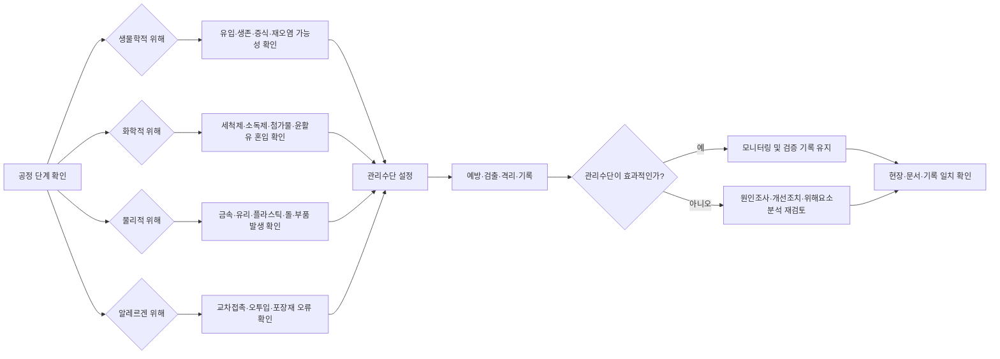

# [QA+ 블로그 생성 결과물] HC009 식품위해요소 4유형 실사형
생성일시: 2026-08-31 07:19:30 (KST)
적용모델: gpt-5.6-terra

================================================================================
# 📋 최종 발행용 블로그 패키지

## 1. 메타 데이터(SEO 설정)

- **최종 포스팅 제목**: HACCP 심사 전 반드시 점검할 위해요소 4유형｜생물·화학·물리·알레르겐 현장 대응법
- **메타 디스크립션**: HACCP 심사 전 위해요소분석표와 실제 작업, 기록지를 점검하는 방법을 알아봅니다. 생물·화학·물리·알레르겐 위해별 관리수단과 현장 사례, 체크리스트를 정리했습니다.
- **메인 키워드**: HACCP 위해요소분석
- **서브 키워드**: HACCP 심사, 생물학적 위해, 화학적 위해, 물리적 위해, 알레르겐 관리, 위해요소분석표
- **추천 해시태그(10개)**:  
  #HACCP #HACCP심사 #HACCP위해요소분석 #식품위해요소 #생물학적위해 #화학적위해 #물리적위해 #알레르겐관리 #식품안전관리 #식품품질관리
- **카테고리**: HACCP 가이드 / 식품품질실무
- **추천 URL 슬러그**: `haccp-hazard-analysis-four-types`

---

## 2. 법령·사실관계 검수 결과

### 반드시 수정할 부분

1. **알레르겐의 법적 분류**
   - 원고의 “위해요소 4유형” 표현은 실무적 분류로는 사용할 수 있습니다.
   - 다만 HACCP의 전통적인 위해요소 분류는 일반적으로 **생물학적·화학적·물리적 위해요소**입니다.
   - 알레르겐은 화학적 위해와 연계해 볼 수 있지만, 교차접촉 및 표시 오류 관리가 중요하므로 실무상 별도 항목으로 관리한다고 설명하는 현재 문장은 적절합니다.
   - 제목과 본문에서 “공식적인 법정 4분류”로 오해하지 않도록 다음과 같이 명확히 하는 것을 권장합니다.

> HACCP의 기본 위해요소 분류는 생물학적·화학적·물리적 위해요소입니다. 다만 알레르겐은 교차접촉과 표시 오류를 별도로 관리할 필요가 있어, 현장에서는 네 번째 관리 항목으로 분리해 점검하는 방식이 실무적으로 유용합니다.

2. **법령 명칭**
   - 「식품위생법」 제48조 및 식품안전관리인증기준에 관한 설명은 유지할 수 있습니다.
   - 다만 세부 기준을 언급할 때는 **「식품 및 축산물 안전관리인증기준」**이라는 명칭을 사용하고, 게시 시점에 따라 최신 개정 고시를 확인해야 합니다.

3. **알레르겐 표시 기준**
   - 알레르겐 표시와 원재료명 관리는 **「식품 등의 표시·광고에 관한 법률」 및 「식품 등의 표시기준」**을 함께 확인한다는 내용이 적절합니다.
   - 알레르겐 표시 대상과 표시 방법은 개정될 수 있으므로, 특정 알레르겐 목록을 법적 확정 목록처럼 단정하지 않는 현재 서술이 안전합니다.

4. **MSDS 표현**
   - “MSDS”는 현장에서 널리 쓰이지만, 최신 산업안전보건 체계에서는 **SDS(물질안전보건자료)**라는 표현도 사용됩니다.
   - 최초 등장 시 다음과 같이 병기하는 것이 좋습니다.

> 세척제 SDS(물질안전보건자료, 현장에서는 MSDS라고도 부름)

5. **금속검출기 감도**
   - Fe, Non-Fe, SUS 시험편에 관한 내용은 일반적인 실무 설명으로 적절합니다.
   - 다만 감도 수치를 제시하지 않았으므로 제품·장비별 기준을 임의로 확대 해석할 가능성이 없습니다.
   - “자사 장비와 위해평가에 근거한 기준”이라는 표현을 유지하는 것이 좋습니다.

6. **냉장온도**
   - “냉장고 기록이 5℃인데 실제 표시온도가 9℃”라는 예시는 교육용 사례로 적절합니다.
   - 다만 모든 식품에 일률적인 온도 기준을 적용하는 표현으로 읽히지 않도록 다음 문장을 덧붙이는 것을 권장합니다.

> 실제 허용 온도와 관리 기준은 제품 특성, 관련 법적 기준, 자사 HACCP 계획에 따라 확인해야 합니다.

---

## 3. 네이버 블로그 / 티스토리 복사용 최종 원고

> 제공하신 원고는 분량과 사례를 유지한 상태로 발행하는 것이 적절합니다. 다만 아래 4개 문구는 법령·용어 정확성을 위해 교체해야 합니다. 나머지 소제목, 표, 사례, FAQ, 체크리스트는 삭제하거나 축약하지 않습니다.

### 제목 교체

```markdown
# HACCP 심사 전 반드시 점검할 위해요소 4유형｜생물·화학·물리·알레르겐 현장 대응법
```

### 2장 중 알레르겐 분류 설명 교체

```markdown
전통적인 HACCP 기본 분류는 생물학적·화학적·물리적 위해요소의 3유형입니다. 알레르겐은 화학적 위해요소와 연계해 볼 수 있지만, 실제 현장에서는 원료 분리, 생산순서, 세척검증, 포장지 관리라는 별도 관리체계가 필요합니다. 따라서 이 글에서는 알레르겐을 공식적인 법정 4분류로 단정하는 것이 아니라, 현장에서 놓치는 부분을 줄이기 위한 네 번째 관리 항목으로 분리해 설명합니다.
```

### 3장 법령 설명 교체

```markdown
HACCP의 법적 큰 틀은 「식품위생법」 제48조와 식품안전관리인증기준에 있습니다. 세부 운영은 「식품 및 축산물 안전관리인증기준」 및 관련 HACCP 관리기준을 중심으로 확인해야 합니다. 해당 기준에는 선행요건관리, 위해요소분석, 중요관리점(CCP) 설정, 한계기준, 모니터링, 개선조치, 검증, 기록관리가 연결되어 있습니다.
```

### 화학적 위해 설명 중 MSDS 교체

```markdown
세척제 SDS(물질안전보건자료, 현장에서는 MSDS라고도 부름)가 파일에 있다고 해서 관리가 끝나는 것은 아닙니다.
```

### 냉장온도 설명 보완

6장 생물학적 위해 단락의 마지막에 다음 문장을 추가합니다.

```markdown
실제 허용 온도와 관리 기준은 제품 특성, 관련 법적 기준, 그리고 자사 HACCP 계획에 따라 확인해야 합니다.
```

### 이미지 삽입 위치

```markdown

```

위 이미지는 1장 마지막 부분, “심사 대응의 핵심 3가지” 인용문 다음에 배치합니다.

```markdown

```

위 이미지는 4장 마지막 부분, “이렇게 위해를 찾았다면…” 문단 다음에 배치합니다.

### Mermaid 차트

제공하신 Mermaid 차트는 내용상 오류가 없으므로 4장 또는 5장 다음에 그대로 삽입합니다.



> 네이버 블로그 스마트에디터는 Mermaid를 직접 렌더링하지 않을 수 있으므로, 네이버 게시용 원고에서는 Mermaid 차트를 이미지로 변환하거나 보조 텍스트형 다이어그램으로 대체하는 것을 권장합니다. 티스토리와 워드프레스는 Mermaid 스크립트 지원 여부를 스킨 또는 플러그인별로 확인해야 합니다.

---

## 4. 워드프레스 / 웹사이트용 HTML 원고

아래 HTML은 원고 전체를 그대로 넣을 수 있는 구조입니다. `[IMAGE_PLACEHOLDER_1]`, `[IMAGE_PLACEHOLDER_2]`는 반드시 `src` 값으로 유지해야 합니다.

```html
<article class="food-qa-post">
  <header>
    <h1>HACCP 심사 전 반드시 점검할 위해요소 4유형｜생물·화학·물리·알레르겐 현장 대응법</h1>

    <p class="lead">
      <strong>20년 실무 선배의 한 줄 요약:</strong>
      위해요소 4유형은 외우는 항목이 아니라, 우리 공정에서 위해가 들어오는 경로를 찾아
      <strong>예방·검출·격리·기록</strong>으로 끊어내는 현장 설계도입니다.
      심사 전에는 위해요소분석표, 실제 작업, 기록지가 같은 말을 하는지부터 확인하세요.
    </p>
  </header>

  <figure class="post-image">
    
    <figcaption>위해요소분석표·현장작업·기록지의 일치 여부를 확인하는 HACCP 실사 준비</figcaption>
  </figure>

  <!-- 제공 원고의 1장부터 11장까지 전체 본문을 이 위치에 순서대로 삽입 -->
  <!-- 모든 h2, h3, 인용문, 표, 사례, FAQ, 체크리스트를 원문 순서대로 유지 -->

  <figure class="post-image">
    
    <figcaption>공정별로 생물·화학·물리·알레르겐 위해를 반복 점검하는 흐름</figcaption>
  </figure>

  <section class="legal-notice">
    <h2>관련 기준 확인 안내</h2>
    <p>
      HACCP 관련 법령과 고시, 알레르겐 표시 대상 및 표시 방법은 개정될 수 있습니다.
      최종 문서 작성과 심사 준비 전에는
      <a href="https://www.law.go.kr" rel="noopener">국가법령정보센터</a>,
      <a href="https://www.mfds.go.kr" rel="noopener">식품의약품안전처</a>,
      <a href="https://www.haccp.or.kr" rel="noopener">한국식품안전관리인증원</a>,
      <a href="https://www.foodsafetykorea.go.kr" rel="noopener">식품안전나라</a>의
      최신 자료를 확인하시기 바랍니다.
    </p>
  </section>
</article>
```

### HTML 변환 시 적용할 규칙

- 원고의 `#` 제목은 `<h1>`, `##` 소제목은 `<h2>`, `###` 소제목은 `<h3>`로 변환합니다.
- 인용문은 `<blockquote>`로 변환합니다.
- 불릿 목록은 `<ul><li>`, 번호 목록은 `<ol><li>`로 변환합니다.
- 표는 `<table>`, `<thead>`, `<tbody>`, `<tr>`, `<th>`, `<td>` 구조로 변환합니다.
- 이미지 태그는 아래처럼 작성합니다.

```html


```

- 실제 이미지 URL, 임의의 파일명, Base64 문자열로 대체하지 않습니다.
- Mermaid는 워드프레스에서 다음처럼 별도 렌더링 영역에 넣을 수 있습니다.

```html
<div class="mermaid">
graph LR
    A[공정 단계 확인] --> B{생물학적 위해}
    A --> C{화학적 위해}
    A --> D{물리적 위해}
    A --> E{알레르겐 위해}
    B --> F[관리수단 설정]
    C --> F
    D --> F
    E --> F
    F --> G[예방·검출·격리·기록]
    G --> H[현장·문서·기록 일치 확인]
</div>
```

## 최종 QA 판정

- **분량 축소 여부**: 원고 전체 유지 필요
- **소제목·사례·FAQ·표**: 모두 포함
- **이미지 플레이스홀더**: 2개 모두 유지
- **SEO 키워드 배치**: 제목, 도입부, 2장, 5장, 맺음말에 자연스럽게 배치
- **법령 표현**: 일부 보완 후 발행 권장
- **알레르겐 4유형 표현**: “실무상 별도 관리 항목”으로 명시 필요
- **발행 전 확인**: 게시일 기준 최신 법령·고시 및 알레르겐 표시 기준 재확인
================================================================================

[부록: 1단계 리서치 원본]
# [리서치 리포트] HC009 식품위해요소 4유형 실사형

> **주제 해석 전제**  
> 현장에서 말하는 ‘식품위해요소 4유형’은 일반적으로 **생물학적 위해, 화학적 위해, 물리적 위해, 알레르겐 위해**를 뜻합니다.  
> 다만 HACCP 위해요소 분류의 전통적·기본 틀은 보통 **생물학적·화학적·물리적 위해요소 3유형**입니다. 알레르겐은 화학적 위해요소의 한 범주로 다뤄질 수 있으나, 최근에는 표시·교차접촉·세척검증 관리의 중요성 때문에 **별도 4번째 유형으로 분리하여 실무 관리**하는 방식이 널리 활용됩니다.  
>
> 따라서 이 글은 “4유형을 외우는 글”이 아니라, **HACCP 현장심사에서 위해요소분석표와 작업 현장을 연결해 설명하는 실사 대응형 콘텐츠**로 설계합니다.

---

### 1. 타겟 독자 및 검색 의도

- **주요 타겟**
  - 식품제조·가공업체 품질관리(QC) 신입 및 HACCP 담당자
  - 정기심사·인증심사·사후평가를 앞둔 HACCP 팀장 및 실무자
  - 위해요소분석(Hazard Analysis) 작성은 했지만, 현장 확인 질문에 자신이 없는 담당자
  - 제조현장 관리자, 생산팀장, 위생관리 책임자

- **독자의 핵심 고통(Pain Point)**
  - “생물·화학·물리·알레르겐 위해요소를 공정별로 어떻게 찾아야 하지?”
  - “위해요소분석표에는 적었는데, 심사원이 현장에서 ‘그래서 어디를 관리합니까?’라고 물으면 답변이 막막하다.”
  - “금속검출기만 관리하면 물리적 위해관리가 끝나는 것인지 모르겠다.”
  - “알레르겐 원료를 쓰는데, 분리보관·세척·표시 중 무엇이 핵심 관리 포인트인지 혼란스럽다.”
  - “위해평가 결과가 전 공정 ‘중(中)’ 또는 ‘고(高)’로 나와서 CCP 선정 근거가 설득력이 없다.”
  - “공정 흐름도와 위해요소분석표, 현장 작업 방식이 서로 일치하지 않는다.”

- **메인 키워드**
  - `식품 위해요소 4유형`

- **서브/연관 키워드**
  - `HACCP 위해요소분석`
  - `생물학적 화학적 물리적 위해요소`
  - `식품 알레르겐 교차접촉 관리`
  - `HACCP 현장심사 대비`
  - `CCP 결정도`
  - `금속검출기 관리기준`
  - `세척 검증 알레르겐`

- **예상 검색 의도(Search Intent)**
  1. 식품 위해요소 4유형의 정의와 차이를 빠르게 이해하려는 **정보 탐색형**
  2. 자사 공정에 위해요소를 적용하는 방법을 찾는 **실무 문제해결형**
  3. HACCP 심사 질문과 지적 사례를 미리 대비하려는 **심사 준비형**
  4. 위해요소분석표·CCP 관리계획서를 보완하려는 **문서 개선형**

---

### 2. 필수 인용 법령 및 표준 기준

## 2-1. 법적·공식 기준

| 구분 | 공식 근거 | 글에서 활용할 핵심 포인트 |
|---|---|---|
| HACCP 제도 법적 근거 | **「식품위생법」 제48조(식품안전관리인증기준)** | 식품안전관리인증(HACCP)의 법적 근거입니다. 식품 제조·가공 단계에서 위해요소를 분석하고 중점 관리하는 체계라는 큰 틀을 설명할 때 인용합니다. |
| HACCP 세부 관리기준 | **「식품 및 축산물 안전관리인증기준」** 및 **[별표 1] 식품안전관리인증기준(HACCP) 관리기준** | 선행요건관리, HACCP 관리, 위해요소분석, 중요관리점(CCP), 한계기준, 모니터링, 개선조치, 검증, 기록관리의 근거입니다. |
| 위해요소분석 기본 원칙 | **식품의약품안전처 식품안전관리인증기준 해설서 / HACCP 관리 해설 자료** | 원료 입고부터 제조·포장·보관·출하까지 공정별 위해요소를 식별하고, 예방·제거 또는 허용수준 이하 감소 수단을 검토해야 한다는 실무 원칙을 설명합니다. |
| 식품 기준·규격 | **「식품위생법」 제7조(식품 또는 식품첨가물에 관한 기준 및 규격)**, **「식품의 기준 및 규격」(식품공전)** | 미생물, 곰팡이독소, 중금속, 잔류농약, 식품첨가물, 이물 등 ‘허용 여부’와 ‘규격 적합성’을 판단할 때 근거로 사용합니다. |
| 식품 알레르겐 표시 | **「식품 등의 표시·광고에 관한 법률」**, **「식품 등의 표시기준」** | 알레르기 유발물질 표시 대상, 원재료명 표시, 혼입 가능성 관리와 연결합니다. 단, 실제 표시 대상과 표시문구는 반드시 게시 시점의 최신 「식품 등의 표시기준」을 확인하도록 안내해야 합니다. |
| 이물 혼입 관리 | **「식품위생법」 제7조**, **「식품의 기준 및 규격」의 이물 관련 기준**, 식약처 이물관리 관련 지침 | 금속, 유리, 플라스틱, 돌, 벌레 등 물리적 위해의 예방·검출·이물보고 대응에 활용합니다. |
| 회수 관리 | **「식품위생법」 제45조(위해식품등의 판매 등 금지), 제45조의2(위해식품등의 회수)** 등 관련 규정 | 알레르겐 미표시, 이물 혼입, 미생물 부적합 등이 발생했을 때 출하 차단·추적·회수 체계가 왜 필요한지 설명합니다. |
| 국제 식품안전 표준 참고 | **Codex General Principles of Food Hygiene, CXC 1-1969 (HACCP System and Guidelines for its Application)** | HACCP의 7원칙과 12단계 접근법의 국제적 기반입니다. 위해요소분석과 CCP 결정의 논리를 설명하는 데 적합합니다. |
| 식품안전경영시스템 참고 | **ISO 22000:2018, Clause 8.5.2 Hazard analysis** | 위해요소의 식별·평가·관리수단 선정을 설명할 때 보조 근거로 활용합니다. 알레르겐은 실무적으로 별도 관리가 필요하다는 맥락을 보강할 수 있습니다. |
| FSSC 인증기업 참고 | **FSSC 22000 Scheme Version 6, Part 2: Requirements for Organizations** | FSSC 운영 사업장은 ISO 22000 기반 위해요소관리뿐 아니라 알레르겐 관리, 식품방어, 식품사기 완화 등 추가 요구사항을 함께 확인해야 합니다. 적용 조항은 인증 범위와 최신 Scheme 문서를 기준으로 확인합니다. |

> **출처 확인 안내**  
> 법령과 고시는 개정될 수 있으므로, 최종 원고 게시 전에는 아래 공식 채널에서 시행 중인 최신본을 확인하는 문구를 넣는 것이 안전합니다.  
> - 국가법령정보센터: `law.go.kr`  
> - 식품의약품안전처: `mfds.go.kr`  
> - 한국식품안전관리인증원(HACCP): `haccp.or.kr`  
> - 식품안전나라: `foodsafetykorea.go.kr`

---

## 2-2. 위해요소 4유형: 실사에서 설명해야 할 실무 팩트

### A. 생물학적 위해요소(Biological Hazards)

- **정의**
  - 식중독을 유발하거나 인체 건강에 위해를 줄 수 있는 미생물 및 그 독소와 관련된 위해요소입니다.
  - 세균, 바이러스, 기생충, 곰팡이 및 일부 미생물 독소 등이 해당할 수 있습니다.

- **대표 사례**
  - 병원성 미생물: 살모넬라, 리스테리아 모노사이토제네스, 장출혈성대장균, 황색포도상구균 등
  - 바이러스: 노로바이러스 등
  - 독소: 황색포도상구균 독소 등
  - 원료·용수·작업자·설비·환경·냉장온도 관리 실패로 인한 오염 및 증식

- **심사 현장 확인 포인트**
  - 냉장·냉동 보관 온도 기록은 실제 온도와 일치하는가?
  - 가열 공정의 시간·온도 한계기준은 제품 특성과 위해요소를 근거로 설정했는가?
  - 가열 후 제품이 비가열 원료, 작업자, 기구, 응축수 등에 의해 재오염될 가능성은 없는가?
  - 세척·소독 기준은 존재하는가, 그리고 실제로 이행·검증되는가?
  - 종업원 손 세척, 위생복, 장갑 교체, 출입 통제가 문서가 아닌 현장에서 작동하는가?

- **핵심 메시지**
  - 생물학적 위해는 “균이 있다/없다”만의 문제가 아닙니다.  
    **유입 → 생존 → 증식 → 재오염**의 경로를 공정별로 끊어내는 것이 위해요소분석의 핵심입니다.

---

### B. 화학적 위해요소(Chemical Hazards)

- **정의**
  - 원료, 제조환경, 세척·소독, 설비, 포장재 또는 제조 과정에서 식품으로 이행·잔류·혼입될 수 있는 화학적 물질에 따른 위해입니다.

- **대표 사례**
  - 잔류농약, 동물용의약품, 중금속, 곰팡이독소
  - 세척제·소독제 잔류
  - 윤활유, 기계유, 냉매 등 비식품용 화학물질
  - 식품첨가물의 사용기준 초과 또는 사용 대상 외 사용
  - 원료의 성분규격 부적합
  - 포장재로부터 이행될 수 있는 유해물질

- **심사 현장 확인 포인트**
  - 세척제·소독제는 식품제조시설에서 사용 가능한 제품인지, 사용농도와 사용방법이 관리되는가?
  - 화학물질은 식품·포장재·원료와 분리하여 보관되는가?
  - 희석용 용기에는 물질명, 농도, 제조일 또는 관리 식별정보가 표시되는가?
  - 식품첨가물은 계량도구, 사용량, 배합기록, 보관 상태까지 추적 가능한가?
  - 설비 윤활유는 식품 접촉 가능 부위와 비접촉 부위를 구분해 관리하는가?
  - 원료 규격서·시험성적서·공급업체 관리 기준에 화학적 위해 관리 항목이 반영되어 있는가?

- **핵심 메시지**
  - 화학적 위해는 검사성적서만으로 끝나지 않습니다.  
    **“공장에서 화학물질이 식품에 닿을 수 있는 모든 순간”**을 추적해야 합니다.

---

### C. 물리적 위해요소(Physical Hazards)

- **정의**
  - 정상적인 식품 구성성분이 아닌 고형 이물질이 혼입되어 소비자에게 상해를 입힐 수 있는 위해입니다.

- **대표 사례**
  - 금속편, 유리조각, 경질 플라스틱, 돌, 뼈, 목재 조각
  - 볼트·너트·와셔 등 설비 부품
  - 칼날, 브러시모, 장갑 조각, 필기구 부품
  - 포장재 절단 조각, 파손된 조명기구 또는 계측기 부품

- **심사 현장 확인 포인트**
  - 금속검출기 또는 X-ray 선별기의 관리 대상·설치 위치가 위해요소분석 결과와 연결되는가?
  - 검출감도 확인용 시험편(Fe, Non-Fe, SUS 등)의 종류와 크기, 시험 주기, 시험 방법이 관리계획서에 정해져 있는가?
  - 시험편 통과 실패 시 생산품 격리, 재검사, 원인조사, 개선조치 절차가 실제로 가능한가?
  - 유리·취성 플라스틱 관리대장에 조명, 창문, 계기판, 보호커버 등이 빠짐없이 등록되어 있는가?
  - 설비 파손·정비 후 이물 발생 여부를 확인하는 절차가 있는가?
  - 칼, 커터칼, 스테이플러, 볼펜 등 이물 유발 가능 물품의 반입·수량·파손 관리가 되는가?

- **핵심 메시지**
  - 물리적 위해 관리의 목적은 “금속검출기 통과”가 아니라,  
    **이물이 생기지 않게 예방하고, 생겼다면 출하 전에 검출·격리하는 것**입니다.

---

### D. 알레르겐 위해요소(Allergen Hazards)

- **정의**
  - 특정 식품 원료에 민감한 소비자에게 알레르기 반응을 유발할 수 있는 단백질 성분 등이 의도치 않게 혼입되거나, 표시되지 않은 상태로 제공되는 위험입니다.
  - HACCP 기본 분류에서는 화학적 위해요소와 연계해 다룰 수 있지만, 현장에서는 원료 분리·생산순서·세척·표시의 관리 포인트가 뚜렷하므로 별도 유형으로 관리하는 것이 효과적입니다.

- **대표 발생 원인**
  - 알레르기 유발 원료의 오입고, 오투입
  - 공용 보관구역에서의 원료 비산·누출
  - 동일 설비를 사용하는 제품 간 교차접촉
  - 생산순서 미준수
  - 세척 불충분 또는 세척 후 검증 미실시
  - 포장지 혼입, 잘못된 포장재 사용
  - 표시사항 변경 시 라벨 검토 누락

- **심사 현장 확인 포인트**
  - 알레르기 유발 원료 목록과 제품별 알레르겐 매트릭스가 있는가?
  - 원료 입고부터 계량·보관·투입·생산·포장까지 혼입 가능 경로를 분석했는가?
  - 알레르겐 원료는 밀폐·표지·구획·전용용기 등의 방식으로 식별·분리되는가?
  - 생산순서는 일반적으로 비알레르겐 제품에서 알레르겐 제품 방향으로 계획되는가?  
    단, 실제 생산순서는 제품·설비·세척능력을 고려해 사업장 기준으로 정해야 합니다.
  - 품목 전환 세척 시 세척 대상, 방법, 확인 기준, 책임자가 명확한가?
  - 포장 전 라벨 대조와 작업 전 포장재 라인 클리어런스(Line Clearance)가 실행되는가?
  - 제품 성분·처방·원료 변경 시 표시사항과 알레르겐 분석을 재검토하는가?

- **핵심 메시지**
  - 알레르겐 사고는 미생물 부적합처럼 눈에 보이지 않을 수 있습니다.  
    그래서 **‘원료 관리’보다 ‘교차접촉 방지와 정확한 표시 관리’가 심사에서 더 자주 확인되는 영역**입니다.

---

## 2-3. 실사형 콘텐츠에서 반드시 짚을 사실관계

1. **위해요소분석표는 서류가 아니라 현장 운영의 설계도다.**
   - 공정도에 있는 모든 단계는 현장에 존재해야 합니다.
   - 공정도에 없는 재작업, 대기, 해동, 보관, 반품, 부산물 처리, 외주공정 등이 실제로 존재한다면 위해요소분석 범위에 반영해야 합니다.

2. **‘위해요소 있음’과 ‘CCP’는 같은 뜻이 아니다.**
   - 위해요소는 여러 공정에서 식별될 수 있습니다.
   - 그중 관리수단이 없거나, 해당 단계에서의 관리 실패가 허용할 수 없는 식품안전 위험으로 이어지고, 해당 단계가 핵심적으로 통제해야 하는 지점일 때 CCP 선정 여부를 검토합니다.
   - 모든 위해요소를 CCP로 지정하면 관리체계가 오히려 약해질 수 있습니다.

3. **선행요건프로그램(PRP)으로 관리되는 위해와 CCP로 관리되는 위해를 구분해야 한다.**
   - 예: 일반적인 위생복 착용, 해충방제, 세척·소독, 원료 승인, 유리관리 등은 선행요건으로 관리될 수 있습니다.
   - 다만 실제 CCP 여부는 제품 특성, 공정, 위해평가, 관리수단의 효과성에 따라 달라지므로 타사 양식을 그대로 복사해서는 안 됩니다.

4. **기록이 있어도 현장과 다르면 부적합 위험이 크다.**
   - 기록상 세척 완료인데 설비에 잔사가 남아 있는 경우
   - 냉장고 온도기록은 적합인데 실제 표시온도가 이탈한 경우
   - 금속검출기 점검기록은 있는데 시험편·불량 배출 장치가 정상 작동하지 않는 경우
   - 알레르겐 분리보관 기준은 있으나 현장에서는 같은 팔레트에 혼재된 경우

---

### 3. 추천 블로그 목차 (Outline)

## H1 제목 후보 3개

1. **HACCP 심사 전 반드시 점검할 식품 위해요소 4유형: 생물·화학·물리·알레르겐 실사 대응법**
2. **“위해요소분석표에는 있는데 현장에는 없나요?” 식품 위해요소 4유형 실사형 가이드**
3. **식품공장 HACCP 위해요소분석 실무: 4유형으로 현장심사 질문에 답하는 법**

---

## H2 서론 (Intro)  
### 위해요소분석표를 잘 썼는데도 심사에서 지적받는 이유

- **현실적 문제 제기**
  - HACCP 서류에는 미생물, 세척제, 금속편, 알레르겐을 모두 적어 두었지만 심사 때 다음 질문에서 막히는 경우가 많다는 상황을 제시합니다.
  - “이 공정에서 살모넬라가 들어오는 경로가 무엇입니까?”
  - “세척제 잔류는 어떤 방법으로 예방합니까?”
  - “금속검출기 불량이 나면 그 사이 생산품은 어떻게 처리합니까?”
  - “알레르겐 제품을 생산한 뒤 다음 제품으로 전환할 때 무엇을 확인합니까?”

- **핵심 결론 먼저 제시**
  - 위해요소 4유형은 단순 암기 항목이 아닙니다.
  - HACCP 현장심사의 핵심은 아래 세 가지가 일치하는지 확인하는 것입니다.
    1. 위해요소분석표에 식별되어 있는가?
    2. 실제 관리방법과 책임자가 정해져 있는가?
    3. 현장과 기록으로 관리 사실을 증명할 수 있는가?

- **독자에게 전달할 한 줄**
  - “심사원은 위해요소를 외웠는지보다, 우리 공장에서 그 위해가 실제로 통제되는지를 봅니다.”

---

## H2 본론 1  
### 식품 위해요소 4유형의 정의: HACCP 위해요소분석은 무엇을 찾는 과정인가

#### H3. HACCP의 출발점은 ‘불량’이 아니라 ‘소비자 건강 위해’이다
- 품질 문제와 식품안전 위해를 구분합니다.
- 예: 색상 편차나 중량 부족은 품질 문제일 수 있지만, 병원성 미생물·세척제 잔류·금속편·미표시 알레르겐은 식품안전 위해와 직결될 수 있습니다.

#### H3. 생물학적 위해요소: 들어오고, 살아남고, 증식하고, 다시 오염되는 경로
- 원료, 작업자, 용수, 설비, 냉각, 보관, 포장 단계별 관점으로 설명합니다.
- 가열공정과 가열 후 재오염 방지를 함께 강조합니다.

#### H3. 화학적 위해요소: 원료 규격부터 세척제·윤활유까지
- 잔류농약·중금속 등 원료 유래 위해와 세척제·소독제·윤활유 등 공정 유래 위해를 구분합니다.
- 첨가물 계량과 사용기준 관리도 포함합니다.

#### H3. 물리적 위해요소: 금속검출기만으로 끝나지 않는 이물관리
- 예방(설비·도구·유리관리) → 검출(금속검출기/X-ray) → 격리·개선조치의 흐름으로 설명합니다.

#### H3. 알레르겐 위해요소: 별도 관리가 필요한 교차접촉과 표시 오류
- HACCP 3유형 분류와 현장 4유형 관리의 관계를 정확히 설명합니다.
- 원료, 생산순서, 세척, 포장재, 표시사항 관리가 하나의 체계여야 함을 강조합니다.

#### H3. 위해요소와 CCP를 혼동하지 않는 법
- “위해요소가 있다 = CCP다”라는 오해를 바로잡습니다.
- 선행요건 관리와 CCP 관리의 차이를 간결한 표로 제시합니다.

**추천 표: 위해요소 4유형 비교표**

| 구분 | 대표 위해 | 주 발생 지점 | 주요 관리수단 | 실사 증빙 |
|---|---|---|---|---|
| 생물학적 | 병원성 미생물, 바이러스 | 원료, 가열 후 공정, 냉장보관 | 가열, 냉각, 세척·소독, 개인위생 | 온도기록, 세척기록, 미생물 검사성적서 |
| 화학적 | 세척제, 잔류농약, 첨가물, 윤활유 | 원료 입고, 세척, 배합, 설비정비 | 공급업체 관리, 농도관리, 분리보관, 계량관리 | 원료규격서, MSDS, 희석기록, 배합기록 |
| 물리적 | 금속, 유리, 플라스틱, 돌 | 원료, 설비, 포장, 정비 | 선별, 유리관리, 금속검출, 설비점검 | 시험기록, 유리관리대장, 정비기록 |
| 알레르겐 | 미표시 알레르기 유발물질 | 보관, 계량, 생산전환, 포장 | 분리보관, 생산순서, 세척, 라벨 검증 | 알레르겐 매트릭스, 세척기록, 포장재 대조기록 |

---

## H2 본론 2  
### 20년 선배의 현장 실전 팁: 공정별 위해요소를 찾고 관리계획으로 연결하는 법

#### H3. Step 1. 먼저 작업장을 걸어 보며 공정도를 검증한다
- 회의실에서 작성한 공정도가 아니라, 실제 현장을 따라가며 확인해야 한다는 점을 강조합니다.
- 반드시 확인할 누락 공정:
  - 원료 검수 대기
  - 냉장·냉동 해동
  - 소분·계량
  - 재작업품 발생 및 투입
  - 반제품 대기
  - 금속검출 불량품 처리
  - 포장재 교체
  - 반품·폐기물 이동
  - 외주 또는 위탁 공정

#### H3. Step 2. 공정마다 ‘4가지 질문’을 던진다
각 공정에서 아래 질문을 반복하는 실무 프레임을 제공합니다.

1. **생물학적 위해:** 미생물이 들어오거나, 살아남거나, 증식하거나, 재오염될 수 있는가?  
2. **화학적 위해:** 세척제·소독제·첨가물·윤활유·원료 유래 화학물질이 들어갈 수 있는가?  
3. **물리적 위해:** 설비·도구·포장재·원료에서 이물이 나올 수 있는가?  
4. **알레르겐 위해:** 의도하지 않은 원료 혼입 또는 표시 오류가 발생할 수 있는가?  

#### H3. Step 3. 위해요소분석표는 ‘원인-관리수단-판정근거’까지 써야 한다
- 단순히 “금속 혼입 가능”이라고 쓰는 수준을 넘어서야 한다는 점을 설명합니다.

**권장 작성 구조 예시**

| 항목 | 작성 예시 구조 |
|---|---|
| 공정 | 금속검출 |
| 위해요소 | 금속성 이물 |
| 발생 원인 | 설비 마모, 원료 유래 금속성 이물, 정비 후 부품 누락 등 |
| 예방·관리수단 | 설비점검, 자석봉 관리, 금속검출기 운영 등 |
| 관리구분 | 선행요건/OPRP/CCP 등 사업장 위해평가 결과에 따른 구분 |
| 모니터링 | 시험편 확인, 주기, 담당자, 기록지 |
| 이탈 시 조치 | 생산중지, 최종 적합 확인시점 이후 제품 격리, 재검사, 원인조사 |
| 검증 | 정기 검교정, 기록 검토, 내부심사, 성능 확인 |

> OPRP 적용 여부와 용어 사용은 사업장이 적용하는 HACCP 체계 및 ISO/FSSC 시스템에 따라 달라질 수 있습니다. 국내 HACCP 운영기준만 적용하는 사업장은 자사 인증기준과 관리계획서 체계에 맞춰 작성해야 합니다.

#### H3. Step 4. 위해유형별 현장 관리 팁

**생물학적 위해 관리 팁**
- 가열 전 구역과 가열 후 구역의 작업자·도구·용기 이동을 확인합니다.
- 냉장고 온도는 기록지 숫자만 확인하지 말고, 실제 온도계 표시와 제품 중심온도 관리 필요성을 함께 검토합니다.
- 세척 후 젖은 상태로 방치되는 설비·배수구 주변·응축수 발생 지점을 점검합니다.

**화학적 위해 관리 팁**
- 세척제 원액과 희석액 모두 식별해야 합니다.
- 분무기에 담긴 세척제가 무표시 상태라면 심사 지적 가능성이 높습니다.
- 식품첨가물은 “식품용 보관함”, 전용 계량스푼, 이중 확인, 배합기록 연결까지 설계합니다.

**물리적 위해 관리 팁**
- 금속검출기 시험은 시작 전·종료 후만이 아니라, 사업장이 정한 중간 점검 주기와 제품 전환 시점의 관리 필요성도 검토합니다.
- 시험편이 검출되지 않았을 때의 조치가 가장 중요합니다. “재시험 후 정상”만으로 끝내지 않고, 마지막 정상점검 이후 생산품의 범위와 처리 절차를 정해야 합니다.
- 취성재질 관리대장은 만들기보다 최신성을 유지하는 것이 중요합니다. 파손 위험 설비가 교체됐는데 대장에 없으면 현장 불일치가 됩니다.

**알레르겐 위해 관리 팁**
- 원료명만 나열하지 말고, `제품 × 알레르겐 원료 × 설비 × 포장재` 매트릭스를 만듭니다.
- 생산순서 변경은 생산팀의 편의가 아니라 알레르겐 위해평가와 세척 능력을 기준으로 승인받도록 합니다.
- 포장재 교체 때 이전 라벨이 라인에 남아 있지 않은지 확인하는 라인 클리어런스 절차를 운영합니다.
- 처방 변경, 원료 공급업체 변경, 포장지 개정은 모두 표시사항 검토 트리거로 관리합니다.

---

## H2 본론 3  
### HACCP 심사관이 자주 묻는 질문과 단골 지적 사항

#### H3. 심사관 단골 질문 10선

1. **“이 제품의 가장 중요한 식품안전 위해요소는 무엇입니까?”**  
   - 위해요소분석 결과와 핵심 관리수단을 제품별로 한 문장으로 답할 수 있어야 합니다.

2. **“이 공정은 왜 CCP가 아닙니까?” 또는 “왜 CCP입니까?”**  
   - 위해평가와 결정도 적용 결과, 기존 관리수단의 효과성으로 설명해야 합니다.

3. **“가열 후 재오염은 어떻게 방지합니까?”**  
   - 구역 구분, 도구 구분, 작업자 동선, 포장 전 위생관리, 세척·소독을 근거로 답합니다.

4. **“금속검출기 감도는 왜 이 기준입니까?”**  
   - 고객 요구사항, 제품 특성, 설비 성능, 위해평가 및 사업장 관리기준의 근거를 제시해야 합니다.

5. **“금속검출기 성능 확인에서 불합격이 나오면 어떤 제품을 격리합니까?”**  
   - 마지막 적합 확인 시점부터 불합격 확인 시점까지의 제품 범위가 명확해야 합니다.

6. **“세척제 희석농도는 누가, 어떻게 확인합니까?”**  
   - 담당자, 희석 방법, 측정도구, 허용 기준, 기록, 이탈조치가 있어야 합니다.

7. **“이 알레르겐 원료가 다른 제품에 섞이지 않는다고 어떻게 보장합니까?”**  
   - 분리보관, 전용도구, 생산순서, 세척, 검증, 라벨 관리의 조합으로 답해야 합니다.

8. **“포장지를 잘못 사용하지 않도록 어떤 장치를 두었습니까?”**  
   - 입고 검수, 보관 구분, 작업 전 대조, 라인 클리어런스, 초품 확인, 잔량 회수 절차를 제시합니다.

9. **“작업자가 바뀌어도 동일하게 관리된다는 증거가 있습니까?”**  
   - 교육기록, 작업표준서, 현장 게시물, OJT, 점검기록, 관리감독자 확인으로 설명합니다.

10. **“위해요소분석표를 마지막으로 언제 재검토했습니까?”**  
   - 원료·처방·공정·설비·포장재·생산량·클레임·부적합 발생 시 재검토하는 변경관리 체계가 필요합니다.

---

#### H3. 심사 단골 지적 사항 8선

1. **공정도와 실제 공정이 다름**
   - 재작업, 임시보관, 해동, 외주공정 등이 공정도에서 빠진 사례

2. **위해요소분석표가 모든 품목·공정에 동일하게 복사됨**
   - 제품 특성, 원료 특성, 공정 차이가 반영되지 않은 사례

3. **위해평가 근거가 없음**
   - 발생가능성·심각성을 평가했지만 판단 근거가 기록되지 않은 사례

4. **CCP 한계기준은 있으나 이탈 시 조치가 불명확함**
   - “재점검한다” 수준으로만 작성되고 제품 격리 범위·처리방법이 없는 사례

5. **금속검출기 점검기록과 실제 성능이 불일치함**
   - 시험편, 자동배출장치, 경보장치가 정상 작동하지 않는 사례

6. **세척·소독 관리가 문서 중심으로만 운영됨**
   - 희석액 무표시, 농도 미확인, 세척도구 혼용, 세척 후 잔사 존재 사례

7. **알레르겐 원료와 포장재 관리가 약함**
   - 원료 혼재, 생산순서 미준수, 이전 포장재 잔류, 표시사항 검토 누락 사례

8. **변경관리와 위해요소분석 재검토가 연결되지 않음**
   - 신규 원료·신규 설비·처방 변경 후에도 기존 위해요소분석표를 그대로 사용하는 사례

---

#### H3. FAQ

**Q1. 알레르겐은 화학적 위해요소인가요, 별도 위해요소인가요?**  
A. HACCP 기본 분류에서는 화학적 위해요소와 연계하여 관리할 수 있습니다. 그러나 알레르겐은 교차접촉, 세척, 생산순서, 포장재 및 표시사항 관리가 핵심이므로 현장에서는 별도 유형으로 구분해 관리하는 방식이 실무적으로 효과적입니다.

**Q2. 금속검출기가 있으면 물리적 위해요소는 CCP로 지정해야 하나요?**  
A. 자동으로 그렇지는 않습니다. 제품 특성, 공정 위치, 선행요건 관리 수준, 검출설비의 역할, 위해평가 및 CCP 결정 절차를 근거로 사업장별로 판단해야 합니다.

**Q3. 세척제는 식품에 직접 넣지 않는데 왜 위해요소분석을 해야 하나요?**  
A. 세척·소독 후 잔류하거나, 보관·희석·사용 중 식품 또는 식품접촉면에 의도치 않게 혼입될 가능성이 있기 때문입니다.

**Q4. 알레르겐 원료를 사용하지 않으면 알레르겐 관리는 필요 없나요?**  
A. 원료, 부원료, 복합원재료, 외주 생산, 공용창고, 공용설비, 포장재 오류 가능성을 먼저 검토해야 합니다. 자사 제조소 내 직접 사용 여부만으로 관리 필요성을 단정해서는 안 됩니다.

**Q5. 위해요소분석표는 언제 다시 검토해야 하나요?**  
A. 원료, 처방, 공급업체, 공정, 설비, 세척방법, 포장재, 생산량, 보관조건 등이 변경되거나 부적합·클레임·회수·심각한 이탈이 발생한 경우 재검토가 필요합니다. 정기 검토 주기도 사업장 절차에 따라 운영해야 합니다.

---

## H2 결론 (Outro)  
### 위해요소 4유형 관리의 완성은 ‘표’가 아니라 ‘현장 일치’입니다

- **마무리 핵심 요약**
  - 생물학적 위해는 **유입·생존·증식·재오염 경로**를 관리합니다.
  - 화학적 위해는 **원료 규격·세척제·첨가물·설비 화학물질**을 관리합니다.
  - 물리적 위해는 **발생 예방·검출·격리**까지 연결해야 합니다.
  - 알레르겐 위해는 **교차접촉 방지와 정확한 표시**가 핵심입니다.
  - HACCP 심사는 위해요소분석표, 관리기준, 작업자 행동, 현장 상태, 기록이 서로 일치하는지를 확인하는 과정입니다.

- **실무 체크포인트 5개**
  1. 공정도에 실제 작업과 예외 공정까지 반영되어 있는가?
  2. 각 공정에서 생물·화학·물리·알레르겐 위해를 검토했는가?
  3. 위해요소마다 예방·검출·이탈조치 방법이 정해져 있는가?
  4. CCP와 선행요건 관리의 구분 근거가 설명 가능한가?
  5. 오늘 현장을 보면 기록지 내용과 동일한가?

- **따뜻한 응원 클로징**
  - HACCP 위해요소분석은 한 번 완성해 파일에 보관하는 문서가 아닙니다. 원료가 바뀌고, 사람이 바뀌고, 설비와 생산량이 바뀔 때마다 다시 현장을 읽는 과정입니다.  
  - 심사를 위한 서류가 아니라 소비자에게 안전한 식품을 제공하기 위한 현장 언어로 위해요소 4유형을 관리한다면, 심사 대응력도 자연스럽게 높아집니다.

[부록: 3단계 시각자료 기획 원본]
### 🎨 [시각자료 기획서]

#### 1. 대표 썸네일 (Thumbnail)

- **추천 헤드카피 문구**: **HACCP 위해요소 4유형, 심사 전 현장점검**
- **이미지 스타일**: Photorealistic documentary photography, real Korean food factory, QA+ 마스터 스타일
- **AI 이미지 프롬프트 (DALL-E / Flux용)**:

`Static locked-off camera, photorealistic DSLR photo, wide documentary shot inside a real Korean food manufacturing facility during HACCP inspection preparation, stainless steel food processing equipment and production line as the main subject, one worker in a light blue one-piece hooded cleanroom coverall and face mask standing beside the line, face completely obscured by hood, mask, and camera angle, gloved hands holding a clipboard with papers but all writing completely blurred and unreadable, glossy green epoxy-coated concrete floor, bright overhead LED and fluorescent lighting 5000-5600K, realistic stainless steel equipment with natural decade-of-service wear, light scratches and water stains, blurred blue-and-white laminate A4 SOP notice board on the distant wall with unreadable content, authentic Korean food factory atmosphere, balanced composition with clear empty space for headline overlay outside the generated image, high detail, 4K quality, no illustration, no cartoon, no vector, no infographic style, no 3D render, no CGI, no game engine look, no readable text, no numbers, no logos --ar 16:9. no glossy showroom, no brand-new factory, no futuristic laboratory, no dramatic shadows, no haze or fog, no fisheye, no dutch angle, no identifiable face, no logos, no watermark, no readable foreground text`

> ※ 헤드카피는 이미지 생성 후 블로그 썸네일 편집 단계에서 별도로 삽입하는 것을 권장합니다.

---

#### 2. 본문 이미지 1 (IMAGE_PLACEHOLDER_1 대체)

- **배치 위치**: 1장 「위해요소분석표를 잘 썼는데도 심사에서 지적받는 이유」 하단
- **기획 의도**: 위해요소분석표, 실제 현장 작업, 기록지가 서로 일치해야 한다는 메시지를 전달합니다. ‘인포그래픽’ 대신 실제 심사 준비 현장에서 서류와 작업을 대조하는 장면으로 표현해 신뢰감을 높입니다.
- **AI 이미지 프롬프트**:

`Static locked-off camera, photorealistic DSLR photo, documentary photography inside a real Korean food manufacturing facility during an HACCP internal inspection, medium-wide shot of a quality assurance staff member and a production supervisor reviewing a clipboard and a paper process checklist beside a stainless steel production line, both wearing light blue or white one-piece hooded cleanroom coveralls, face masks, and gloves, faces fully obscured by masks, hoods, and side angles, the clipboard contains forms with all writing and numbers completely blurred and unreadable, the background visibly connects three real elements: production equipment, inspection documents, and a wall-mounted record board, stainless steel equipment with realistic decade-of-service scratches and water stains, glossy green epoxy-coated concrete floor, bright LED and fluorescent lighting 5000-5600K, blurred blue-and-white laminate A4 SOP board in the background with unreadable content, people positioned as secondary elements while the factory process remains dominant, authentic Korean food manufacturing site, static documentary composition, high detail, 4K quality, no illustration, no cartoon, no vector, no infographic style, no 3D render, no CGI, no game engine look, no readable text, no logos, no identifiable faces. no glossy showroom, no brand-new factory, no futuristic laboratory, no dramatic shadows, no haze or fog, no fisheye, no dutch angle, no identifiable face, no logos, no watermark, no readable foreground text`

- **한글 해설**:  
  서류를 들고 현장 설비와 작업구역을 대조하는 품질 담당자와 생산 담당자를 촬영합니다. 문서의 글자는 모두 흐리게 처리해 읽을 수 없도록 하고, 생산라인·기록판·점검서류가 한 화면에 들어오도록 구성합니다.

---

#### 3. 본문 이미지 2 (IMAGE_PLACEHOLDER_2 대체)

- **배치 위치**: 4장 「공정별 위해요소를 찾는 4가지 질문」 하단
- **기획 의도**: 원료 입고부터 출하까지 각 공정에서 생물·화학·물리·알레르겐 위해를 반복적으로 점검하는 흐름을 보여줍니다. 생성 이미지 자체에는 공정명이나 설명문을 넣지 않고, 실제 생산라인의 연속적인 작업 흐름으로 표현합니다.
- **AI 이미지 프롬프트**:

`Static locked-off camera, photorealistic DSLR photo, documentary wide shot of a real Korean food manufacturing facility showing a continuous food production flow from raw material receiving area through ingredient storage, weighing, heating, cooling, packaging, and dispatch, stainless steel conveyors and processing equipment arranged in a clearly readable left-to-right physical sequence, sealed raw material containers and packaging materials visible but without any readable labels, one or two workers only as secondary elements, wearing light blue or white one-piece hooded cleanroom coveralls, face masks, and gloves, faces fully hidden by masks, hoods, and camera angles, no bare hands or exposed hair, glossy green epoxy-coated concrete floor throughout the production area, bright LED and fluorescent lighting 5000-5600K, 700 lux, stainless steel equipment showing natural decade-of-service use, subtle scratches and water stains rather than showroom shine, visible separation between raw and post-heating areas, blurred blue-and-white laminate A4 SOP notice board on a distant wall with unreadable content, realistic Korean factory layout, static locked-off camera, documentary photography, high detail, 4K quality, no illustration, no cartoon, no vector, no infographic style, no 3D render, no CGI, no game engine look, no readable text, no numbers, no logos, no identifiable faces. no glossy showroom, no brand-new factory, no futuristic laboratory, no dramatic shadows, no haze or fog, no fisheye, no dutch angle, no identifiable face, no logos, no watermark, no readable foreground text`

- **한글 해설**:  
  한 장의 실제 공장 전경 안에서 원료 입고, 보관, 계량, 가열, 냉각, 포장, 출하로 이어지는 물리적 공정 흐름이 보이도록 구성합니다. 작업자는 부수적으로 배치하고, 원료·설비·구역분리·포장라인이 중심이 되게 합니다.

---

#### 4. 본문 삽입용 Mermaid 위해요소 점검 차트


#### 5. 보조 텍스트형 4유형 요약 다이어그램

```text
[공정 하나를 실제로 관찰]
          │
          ▼
┌─────────────────────────────────────────────┐
│ ① 균이 들어오거나 살아남고 증식·재오염되는가? │ → 생물학적 위해
│ ② 약품·기름·첨가물이 혼입될 수 있는가?       │ → 화학적 위해
│ ③ 금속·유리·플라스틱·돌이 발생할 수 있는가?  │ → 물리적 위해
│ ④ 다른 원료 또는 라벨이 섞일 수 있는가?      │ → 알레르겐 위해
└─────────────────────────────────────────────┘
          │
          ▼
[원인] → [관리수단] → [담당자·주기] → [기록] → [이탈 시 격리·개선조치]
          │
          ▼
[위해요소분석표 = 실제 작업 = 현장 기록]
```
