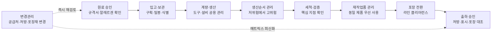
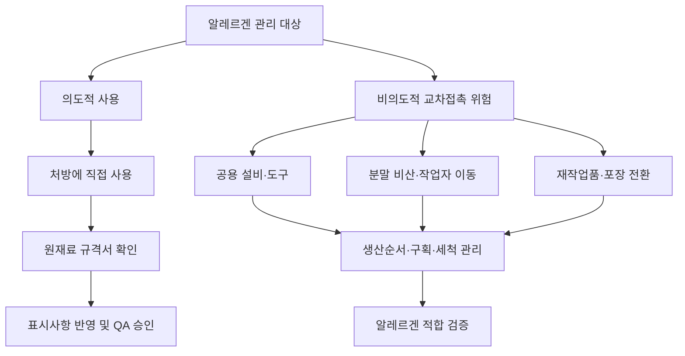

# [QA+ 블로그 생성 결과물] ALL001 한국형 알레르겐관리
생성일시: 2026-09-01 07:23:42 (KST)
적용모델: gpt-5.6-terra

================================================================================
# 📋 최종 발행용 블로그 패키지

### 1. 메타 데이터 (SEO 설정)

- **최종 포스팅 제목**: HACCP 알레르겐 관리 7단계: ALL001 심사 지적을 줄이는 원료·세척·포장 실무 가이드
- **메타 디스크립션 (120자 내외 요약)**: HACCP 알레르겐 관리 실무를 원료 승인, 매트릭스, 생산순서, 세척검증, 재작업품, 포장 전환까지 7단계로 정리했습니다.
- **추천 해시태그 (10개)**: #식품품질관리 #HACCP #알레르겐관리 #식품안전 #식품표시사항 #교차접촉 #세척검증 #재작업품관리 #식품공장 #품질관리실무
- **카테고리**: HACCP가이드

> **편집·사실관계 검수 반영 사항**
>
> - 국내 알레르기 유발물질 표시 대상은 최신 고시 기준으로 일반적으로 **22종**으로 안내됩니다. 기존 원고의 “19종” 표현은 법정 표시 대상의 세부 항목(굴·전복·홍합 등 조개류, 아몬드 등)을 충분히 반영하지 못할 수 있어 수정했습니다.
> - `ALL001`은 법령명이나 국가 공통 HACCP 평가항목 코드로 단정하기 어렵습니다. 본문에서는 특정 기업·인증기관·거래처의 평가표 코드일 수 있다는 점을 유지하고, 반드시 해당 평가표의 발행기관·적용범위·개정번호를 확인하도록 보완했습니다.
> - 교차접촉 우려 문구는 예방조치를 대체하지 않으며, 실제 제품 적용 여부는 최신 「식품등의 표시기준」, 제품 특성 및 사내 법규 검토 절차에 따라 최종 확인해야 합니다.

---

## 2. 네이버 블로그 / 티스토리 복사용 최종 원고 (Markdown)

# HACCP 알레르겐 관리 7단계: ALL001 심사 지적을 줄이는 원료·세척·포장 실무 가이드

> **20년 실무 선배의 한 줄 요약**  
> 알레르겐 관리는 포장지에 문구를 넣는 일이 아니라, 원료 승인부터 생산순서·세척검증·재작업품·포장 전환까지 연결하는 공정관리입니다.  
> `알레르겐 매트릭스 최신화 → 교차접촉 위험평가 → 현장 기록 검증` 이 세 가지만 제대로 잡아도 ALL001형 심사 대응의 절반은 끝납니다.

---

## 1. 알레르겐 표시는 포장 업무가 아니라 공장 관리체계의 결과입니다

“우유와 밀을 사용했으니 포장지에 표시만 하면 되는 것 아닌가요?” 현장에서 정말 많이 듣는 질문입니다. 결론부터 말씀드리면, 표시만 맞아도 부족하고 세척만 해도 부족합니다. 실제 처방, 원료 정보, 제조설비, 생산순서, 재작업품 사용, 포장재가 모두 한 방향으로 맞아야 소비자에게 한 약속을 지킬 수 있습니다.

알레르겐 사고가 어려운 이유는 제품 외관이나 냄새만으로는 확인하기 어렵다는 데 있습니다. 미생물 오염처럼 변질 징후가 보이지 않아도, 민감한 소비자에게는 소량의 비의도적 혼입이 심각한 위해가 될 수 있습니다. 쉽게 말하면, 제품이 멀쩡해 보여도 소비자에게는 “먹으면 안 되는 성분”이 들어갈 수 있다는 뜻입니다.

특히 HACCP 심사나 거래처 실사에서는 “알레르겐 관리 절차서가 있습니까?”라고만 묻지 않습니다. 심사원은 원료창고로 가서 실제 구분보관 상태를 보고, 생산일지에서 순서가 바뀐 이유를 확인하고, 세척기록의 검증방법을 봅니다. 마지막에는 포장 현장으로 가서 이전 제품 포장재가 남아 있지 않은지도 확인합니다.

`ALL001 알레르겐 관리`라는 명칭은 법령 조문명이라기보다 기업, 인증기관, 거래처가 사용하는 평가항목 코드인 경우가 있을 수 있습니다. 따라서 가장 먼저 할 일은 해당 평가표의 발행기관, 적용 범위, 적용 기준, 개정번호를 확인하는 것입니다. 다만 평가표 양식이 달라도 현장에서 봐야 할 핵심은 거의 같습니다. **원료 정보가 정확한가, 교차접촉을 예방하는가, 표시와 실제 제품이 일치하는가**입니다.


*이미지 설명: 원료 입고 → 보관 → 생산 → 세척 → 재작업품 → 포장 → 출하로 이어지는 알레르겐 관리 흐름*

이제부터는 법정 표시 대상과 공정상 교차접촉 위험을 분리해서 보겠습니다. 이 둘을 한 표에 뒤섞으면 표시 검토도 흐려지고, 현장 위해평가도 애매해집니다.



---

## 2. 법적 기준: 의도적 사용과 교차접촉 위험을 반드시 구분하세요

알레르겐 관리의 법적 출발점은 「식품 등의 표시·광고에 관한 법률」과 식품의약품안전처 고시 「식품등의 표시기준」입니다. 제조·가공식품의 표시사항은 실제 사용 원재료와 일치해야 합니다. 따라서 알레르겐 표시는 디자인팀이 포장지에 문구를 넣는 단순 편집 업무가 아니라, QA가 최종 승인해야 하는 법규·소비자안전 관리업무입니다.

여기서 가장 먼저 구분할 것은 **의도적 사용(intentional presence)** 과 **비의도적 교차접촉(unintentional cross-contact)** 입니다. 난백, 유청분말, 간장, 밀가루처럼 처방에 직접 넣는 성분은 의도적 사용입니다. 쉽게 말하면 “원래 넣기로 하고 넣은 알레르겐”이며, 표시사항 검토의 핵심 대상입니다.

반대로 공용라인, 공용 계량스푼, 분말 비산, 작업자 장갑, 재작업품, 포장 전환 과정에서 섞일 수 있는 것은 교차접촉 위험입니다. 이것은 “원래 넣지 않으려 했지만 현장에서 묻어 들어갈 수 있는 알레르겐”입니다. 교차접촉 위험은 단순히 주의문구를 넣는 것으로 끝내면 안 되고, 구분보관·생산순서·세척·검증 같은 예방조치로 관리해야 합니다.

국내 알레르기 유발물질 표시 대상은 최신 「식품등의 표시기준」과 적용 시점에 따라 확인해야 합니다. 일반적으로 현장에서 관리하는 표시 대상은 다음 **22종**으로 안내됩니다.

- 난류
- 우유
- 메밀
- 땅콩
- 대두
- 밀
- 고등어
- 게
- 새우
- 돼지고기
- 복숭아
- 토마토
- 아황산류
- 호두
- 닭고기
- 쇠고기
- 오징어
- 조개류(굴, 전복, 홍합 포함)
- 잣
- 아몬드

숫자만 외우기보다 “우리 공장 원료와 제품에 무엇이 실제로 들어가고, 무엇이 섞일 수 있는가”를 먼저 확인하는 것이 실무적으로 더 중요합니다.

| 구분 | 대표 원료·표현 예시 | 현장 확인 포인트 |
|---|---|---|
| 난류 | 난황, 난백, 전란액, 마요네즈 | 소스, 코팅액, 반제품까지 확인 |
| 우유 | 유청분말, 탈지분유, 버터, 크림 | 향료·유화제의 유래도 확인 |
| 대두 | 간장, 된장, 대두단백, 두부 | 복합조미식품 규격서 확인 |
| 밀 | 밀가루, 글루텐, 빵가루 | 분말 비산, 체·호퍼 공용 여부 |
| 갑각류 | 새우, 게, 새우분말, 추출물 | 해물소스·조미분말 포함 여부 |
| 견과류 | 땅콩, 호두, 잣, 아몬드 | 토핑·소분·혼합공정 위험 |
| 조개류 | 굴, 전복, 홍합 등 | 추출물·농축액·육수베이스 확인 |
| 육류·어류 | 돼지, 닭, 쇠고기, 고등어, 오징어 | 엑기스·육수·분말조미료 확인 |
| 기타 | 메밀, 복숭아, 토마토, 아황산류 | 원료 사용조건 및 최신 고시 확인 |

> **실무 메모**  
> 법정 표시 대상, 표시방법, 아황산류 적용 조건, 조개류·아몬드 등 세부 적용사항은 고시 개정 가능성이 있으므로 제품 출시·포장재 인쇄 전 식품안전나라와 최신 「식품등의 표시기준」으로 재확인하십시오.



법적 기준을 이해했다면, 다음은 문서를 실제 현장 행동으로 바꿔야 합니다. 서류철 안에서만 완벽한 매트릭스는 심사장에서는 아무 힘이 없습니다.

---

## 3. ALL001형 관리체계는 문서 10종이 아니라 ‘연결 구조’가 핵심입니다

ALL001 평가항목에 대응하려면 절차서 한 장만 만들면 안 됩니다. 최소한 원료별 알레르겐 확인서, 원료·반제품·완제품 매트릭스, 생산순서표, 세척표준서, 세척검증기록, 재작업품 대장, 표시사항 검토서, 변경관리대장, 교육기록이 연결되어야 합니다. 자료가 많아 보이지만 사실은 하나의 흐름입니다.

가장 중요한 문서는 **알레르겐 매트릭스**입니다. 원료명만 나열하지 말고 공급업체, 원료 내 함유 알레르겐, 공급업체 제조시설의 혼입 가능성, 사용 제품, 보관 위치, 사용 설비, 세척 필요 여부, 표시 반영 여부, 최종 확인일을 함께 관리하십시오. 쉽게 말하면 “이 원료가 어디서 와서, 어느 제품에 들어가고, 무엇과 섞일 수 있으며, 포장지에는 어떻게 반영되는지”를 한 장에서 추적할 수 있어야 합니다.

매트릭스는 품질팀 혼자 만들면 오래 못 갑니다. 구매팀은 공급업체의 최신 규격서와 변경통보서를 받아야 하고, 연구개발팀은 처방 변경 전 QA에 정보를 공유해야 합니다. 생산팀은 실제로 공용하는 호퍼, 스크루, 체, 계량도구, 이송배관 정보를 제공해야 합니다. QA는 이 정보들을 바탕으로 위험평가와 표시 승인 여부를 결정합니다.

변경관리가 빠지면 잘 만들어 놓은 매트릭스도 금방 틀어집니다. 예를 들어 간장 공급업체가 바뀌었는데 새 규격서에 밀이 추가되어 있다면, 제품 처방은 그대로여도 표시 검토가 다시 필요합니다. 향료, 복합조미식품, 코팅제, 반제품처럼 눈에 잘 안 띄는 원료가 특히 위험합니다. 신규 원료 등록, 공급처 변경, 배합 변경, 재작업품 전용, 포장재 개정 중 하나라도 발생하면 알레르겐 검토를 거치도록 변경관리 양식에 체크칸을 넣으십시오.

| 관리 문서 | 작성·검토 부서 | 반드시 포함할 내용 | 심사 시 확인 포인트 |
|---|---|---|---|
| 원료 알레르겐 확인서 | 구매·QA | 함유 여부, 혼입 가능성, 작성일 | 규격서·입고라벨과 일치하는가 |
| 알레르겐 매트릭스 | QA 주관, 전 부서 협업 | 원료-제품-라인-표시 연결 | 최근 변경사항이 반영됐는가 |
| 생산순서표 | 생산·QA | 제품 순서, 변경 사유, 세척 필요 여부 | 계획과 실제 기록이 같은가 |
| 세척표준서·검증기록 | 생산·QA | 세척 범위, 시간, 검사 위치·방법 | ATP만 사용하지 않았는가 |
| 재작업품 관리대장 | 생산·QA | 원제품, 알레르겐, 사용 가능 제품 | 임의 전용이 없는가 |
| 표시사항 검토서 | R&D·QA | 처방, 원료규격, 포장재 대조 | QA 최종승인이 있는가 |

문서의 연결고리를 만들었다면 이제 공정별 통제로 내려가야 합니다. 여기부터가 실제로 심사에서 지적이 갈리는 구간입니다.

---

## 4. 원료 입고와 보관: “미함유” 한 줄만 믿으면 사고가 납니다

신규 원료를 승인할 때 “알레르겐 미함유”라는 공급업체 문구만 보고 끝내면 안 됩니다. 원료 규격서, 원재료명 및 배합정보, 알레르겐 확인서, 실제 입고 라벨, 제조시설 또는 공용라인 정보까지 같이 확인해야 합니다. 서류 작성일이 2~3년 전인데 최근 공급처나 제조소가 바뀌었다면, 그 서류는 현재 원료를 설명하지 못할 가능성이 큽니다.

입고검사에서는 원료 라벨과 승인된 규격서를 대조하는 절차가 필요합니다. 특히 유청, 난백, 간장, 복합조미식품, 해물엑기스처럼 알레르겐이 원료명 안에 숨어 있는 품목은 주의해야 합니다. 라벨에는 ‘복합조미식품’이라고만 적혀 있고, 규격서에는 대두·밀·우유가 들어 있는 경우도 적지 않습니다.

창고 관리는 색상 스티커만으로 하면 오래 못 갑니다. 색상은 보조수단이고, 핵심은 **명확한 식별, 구획, 밀봉, 위치관리**입니다. 개봉 원료에는 원료명, 알레르겐명, 개봉일, 사용기한, 보관조건을 표시하고, 분말 형태의 밀·우유·난류 원료는 비산 위험을 고려해 일반 원료 위쪽에 올려두지 않는 것이 좋습니다.

계량실도 사각지대입니다. 같은 전자저울, 스쿱, 체를 여러 원료에 공용하면서 “닦아서 썼다”고 말하는 경우가 많습니다. 하지만 분말은 틈새와 주변 작업대에 남기 쉽고, 작업자 앞치마나 장갑을 통해 이동할 수도 있습니다. 전용도구를 우선 적용하고, 전용이 어렵다면 사용순서·세척·보관 위치를 문서화해 통제하십시오.


*이미지 설명: 알레르겐 원료 보관 랙의 올바른 구획 예시와 개봉 원료 라벨 관리 예시*

원료가 안전하게 들어왔다고 해도, 공정에서 섞이면 의미가 없습니다. 그래서 다음 단계는 생산순서와 설비 관리입니다.

---

## 5. 생산순서와 세척검증: ATP 결과만 보고 안심하면 안 됩니다

생산순서는 비용 대비 효과가 가장 좋은 알레르겐 예방수단입니다. 일반적으로는 알레르겐 미사용 또는 저위험 제품부터 시작해 단일 알레르겐 제품, 복합 알레르겐 또는 고위험 제품 순으로 계획합니다. 다만 이것을 기계적으로 적용하면 안 됩니다. 점착성이 강한 치즈소스, 분진이 심한 밀가루, 설비 분해가 어려운 땅콩 페이스트는 알레르겐 종류보다 세척 난이도가 더 큰 변수입니다.

생산순서표에는 단순히 오전·오후 제품명만 적지 마십시오. 제품별 알레르겐 조성, 공용 설비, 세척 필요 여부, 세척 후 검증방법, 계획 변경 시 승인자와 사유를 넣는 것이 좋습니다. 심사원은 “왜 이 순서입니까?”라고 묻습니다. 이때 “원래 이렇게 해왔습니다”가 아니라 “밀 미사용 제품 후 밀 사용 제품을 배치했고, 다음 날 무밀 제품 전환 전 단백질 신속키트로 검증합니다”라고 답할 수 있어야 합니다.

세척에서는 육안확인이 기본이지만, 그것만으로는 부족할 수 있습니다. 호퍼 안쪽, 스크루, 이송관 연결부, 충전노즐, 실링부, 체, 컨베이어 틈, 계량도구 손잡이처럼 분해하지 않으면 보이지 않는 부위가 많습니다. 세척표준서에는 세척제 농도, 세척수 온도, 접촉시간, 헹굼 기준, 분해 범위, 확인 위치를 구체적으로 정해야 합니다.

그리고 꼭 기억하십시오. **ATP 검사는 특정 알레르겐 검사가 아닙니다.** ATP는 유기물 잔류와 일반 위생상태를 보는 보조지표입니다. 쉽게 말하면 “깨끗해 보이는지”를 확인하는 데 도움은 되지만, 우유단백이나 난단백이 남지 않았다는 것을 직접 증명하지는 못합니다. 알레르겐 세척검증이 목적이라면 해당 알레르겐에 적합한 단백질 신속키트, 스왑 검사, 린스 검사, 필요 시 공인시험기관 시험을 조합해야 합니다.

검증에서 부적합이 나오면 재세척 후 재검사만 하고 끝내지 마십시오. 직전 제품과 다음 제품 사이에 어떤 제품이 생산됐는지, 해당 설비를 어느 범위까지 사용했는지, 포장까지 진행됐는지를 확인해야 합니다. 필요하면 제품을 보류하고 표시 적합성 및 교차접촉 영향평가를 실시해야 합니다. 이 대응 흐름이 기록으로 남아 있어야 “검증체계가 작동한다”고 평가받습니다.

---

## 6. 재작업품과 포장 전환: 알레르겐 사고의 마지막 사각지대입니다

재작업품은 현장에서 가장 편리하지만, 가장 위험한 원료이기도 합니다. 특히 제품 외관이나 색상이 비슷하다는 이유로 다른 품목에 임의 투입하면 알레르겐 표시 누락과 추적성 단절이 동시에 발생합니다. 원칙적으로는 **동일 제품 또는 알레르겐 조성이 동일한 제품에만 사용**하는 기준으로 시작하는 것이 가장 안전합니다.

재작업품 용기나 봉투에는 최소한 품명, 제조일 또는 발생일, 발생공정, 알레르겐 정보, 사용 가능 제품, 사용기한, 보관조건, 승인자를 표시해야 합니다. “만두피 자투리”처럼 현장 은어만 적어두면 안 됩니다. 누가 봐도 어떤 제품에서 나왔고 어디에 쓸 수 있는지 알 수 있어야 합니다.

포장 전환 시에는 **라인 클리어런스(Line Clearance)** 가 필수입니다. 이전 제품의 포장지, 라벨, 설명서, 완제품, 팔레트 표찰, 인쇄필름이 남아 있지 않은지 확인하는 절차입니다. 특히 알레르겐 함유 제품에 알레르겐 표시가 없는 이전 포장재를 사용하면, 제품 자체가 안전하게 만들어졌더라도 매우 큰 표시 부적합이 됩니다.

포장 시작 전에는 생산팀 1차 확인, QA 또는 지정검사자 2차 확인을 권장합니다. 작업지시서 품명과 포장재 품명, 원재료명, 알레르겐 표시, 소비기한, 바코드, 로트 인쇄내용을 대조하십시오. 포장 중에도 롤 교체, 자재 추가 투입, 작업자 교대 시 오포장 위험이 커지므로 중간 확인 주기를 정해두는 것이 좋습니다.

이제 문서와 공정 이야기를 실제 사례에 대입해 보겠습니다. 아래 세 가지는 업종은 다르지만, 현장에서 반복되는 근본 원인은 같습니다. “정보가 있어도 연결되지 않았고, 기록이 있어도 검증되지 않았다”는 점입니다.

---

## 7. 실제 현장 사례로 보는 알레르겐 관리 적용법

### 사례 1. 냉동만두 제조공장: 밀 미사용 제품에서 난류 교차접촉 위험이 발견된 경우

냉동만두 제조공장에서 채소만두와 계란 함유 만두를 같은 성형라인에서 생산하고 있었습니다. 채소만두는 난류를 처방에 사용하지 않아 비교적 단순한 제품으로 관리되고 있었습니다. 그런데 거래처 실사에서 채소만두 생산 전 세척기록에는 ‘세척 완료’라고만 적혀 있고, 어떤 부위를 어떻게 확인했는지 없다는 지적을 받았습니다. 현장 확인 결과, 성형기 호퍼와 충전부는 세척했지만 계란 함유 소가 지나간 스크루 이송부의 분해 범위가 작업자마다 달랐습니다.

문제의 근본 원인은 세척작업자가 게을러서가 아니라, 세척표준서에 설비 사진과 분해 기준이 없었던 데 있었습니다. 또 생산순서도 채소만두→계란만두로 계획돼 있었지만, 긴급 주문 때문에 실제로는 계란만두 생산 후 채소만두가 생산된 날이 있었습니다. 변경 사유는 생산일지에 남았지만 QA 승인과 세척검증 연계가 되지 않았습니다. 개선조치로 설비를 12개 세척구간으로 나누고, 스크루 연결부·호퍼 하단·충전노즐을 핵심 검증지점으로 지정했습니다.

이후 계란 함유 제품에서 채소만두로 전환하는 날에는 난단백 신속키트 스왑검사를 실시하도록 기준을 만들었습니다. 생산순서가 바뀔 경우 생산팀장이 사유를 적고 QA가 세척방법과 검증 필요 여부를 승인하도록 변경했습니다. 3개월간의 검증 결과에서 초기 2회는 호퍼 하단부 잔류가 확인되어 분해세척 시간을 기존 15분에서 30분으로 늘렸습니다. 이후에는 세척검증 부적합과 거래처 지적이 줄었고, 무엇보다 작업자가 “왜 이 부위를 닦아야 하는지” 이해하게 됐습니다.

### 사례 2. 소스류 제조공장: 간장 공급처 변경으로 밀 표시 검토가 누락된 경우

소스류 제조공장은 매운 양념소스를 생산하면서 간장을 주요 원료로 사용하고 있었습니다. 기존 간장 공급업체의 규격서에는 대두와 밀이 관리되어 있었고, 제품 포장지에도 관련 표시가 반영돼 있었습니다. 문제는 원가절감 목적으로 구매팀이 간장 공급처를 변경하면서 발생했습니다. 새 간장은 제품명과 사용량이 비슷하다는 이유로 기존 원료코드를 그대로 적용했고, QA에는 단순 공급처 변경으로만 전달됐습니다.

몇 주 후 내부 점검에서 새 규격서의 복합원료 구성과 기존 규격서의 내용이 다르다는 점이 발견됐습니다. 다행히 최종 표시 문구 자체는 큰 차이가 없었지만, 원료 승인 절차를 거치지 않은 상태로 생산이 진행된 것이 문제였습니다. 근본 원인은 구매 변경관리 양식에 알레르겐 확인 항목이 없었고, R&D·QA와 구매팀의 승인 순서가 명확하지 않았던 데 있었습니다. 즉, 담당자 한 명의 실수가 아니라 업무 흐름 자체가 누락을 만들고 있었습니다.

개선 후에는 공급업체 변경, 제조소 변경, 규격 변경, 원재료명 변경을 모두 ‘알레르겐 재검토 트리거’로 지정했습니다. 구매팀이 변경요청서를 등록하면 QA는 2영업일 내 규격서·알레르겐 확인서·입고 라벨을 검토하도록 했습니다. 기존 매트릭스에는 원료명만 적혀 있었지만, 개선 후에는 공급업체명과 최종 확인일, 표시 반영 여부를 추가했습니다. 그 결과 이후 6개월 동안 원료 변경 14건이 모두 표시사항 검토서와 연결됐고, 포장재 개정 누락도 사전에 차단할 수 있었습니다.

### 사례 3. 음료 제조공장: 재작업품 전용으로 우유 표시 누락 위험이 발생한 경우

음료 제조공장에서 우유 함유 라떼 음료와 우유 미사용 과일음료를 같은 충전기에서 생산하고 있었습니다. 생산 중 충전량 미달이나 캡 불량으로 발생한 라떼 음료는 재작업품으로 회수해 냉장 보관하고 있었습니다. 어느 날 생산량 부족을 맞추기 위해 현장 작업자가 라떼 재작업품 일부를 과일음료 배합탱크에 넣으려 했습니다. 다행히 생산반장이 이를 발견해 실제 투입 전 중단됐지만, 재작업품 용기에 ‘음료 재작업’이라고만 적혀 있었고 우유 함유 여부가 표시되지 않았습니다.

문제의 직접 원인은 라벨 미표시였지만, 근본 원인은 재작업품을 ‘손실 절감 대상’으로만 보고 알레르겐 원료로 인식하지 않은 데 있었습니다. 더구나 사용 가능 제품 목록과 QA 승인란이 없어서, 작업자는 비슷한 색상과 당도라면 사용 가능하다고 판단했습니다. 개선조치로 재작업품 라벨에 제품명, 로트, 발생시간, 우유·대두 등 알레르겐 정보, 투입 가능 제품, 보관온도, 사용기한을 의무화했습니다. 재작업품은 원칙적으로 동일 제품에만 사용하고, 다른 제품 전용은 QA의 서면 승인 없이는 금지했습니다.

또한 재작업품 보관 전용 냉장고를 지정하고 제품군별로 칸막이를 설치했습니다. 작업자 교육 때는 “재작업품도 원료다”라는 문장을 반복해서 강조했습니다. 개선 후 월 1회 재작업품 재고와 생산기록을 대조했더니, 초기에는 발생량 대비 사용량 기록이 맞지 않는 사례가 2건 확인됐습니다. 해당 건은 즉시 원인을 조사하고 기록 방식을 단순화했으며, 이후 추적성 점검에서 재작업품 관련 부적합이 발생하지 않았습니다.

---

## 8. 심사관 단골 지적 8가지와 바로잡는 방법

심사에서 자주 나오는 지적은 의외로 거창한 설비 문제가 아닙니다. 대부분은 “있어야 할 정보가 실제 현장에 없거나, 변경됐는데 문서가 따라가지 못한 경우”입니다. 아래 항목은 정기적으로 자가점검해 보시면 좋습니다.

1. **원료 규격서와 실제 입고 라벨의 알레르겐 정보가 다릅니다.**  
   입고 시 전 품목을 매번 전수 대조하기 어렵다면, 신규·변경 원료와 고위험 복합원료를 우선 관리하십시오.

2. **알레르겐 매트릭스가 최근 처방 변경을 반영하지 못합니다.**  
   매트릭스에 최종 개정일만 쓰지 말고, 원료별 최종 확인일을 별도로 관리하면 누락을 찾기 쉬워집니다.

3. **알레르겐 원료와 일반 원료가 혼재 보관됩니다.**  
   전용창고가 없더라도 랙 구획, 밀봉, 하단 적재, 명확한 표찰만으로 위험을 크게 낮출 수 있습니다.

4. **분말 알레르겐 원료의 소분·계량 기준이 없습니다.**  
   소분 시간 분리, 전용 용기, 비산 후 청소범위, 작업복 교체 기준을 정해야 합니다.

5. **생산순서표와 실제 생산기록이 다릅니다.**  
   순서 변경 자체는 가능합니다. 다만 변경 사유, 세척 여부, QA 승인 여부가 기록으로 남아야 합니다.

6. **세척일지는 있지만 알레르겐 검증이 없습니다.**  
   세척자 서명만 있는 기록은 ‘했다’는 증거일 뿐 ‘제거됐다’는 증거가 아닙니다.

7. **재작업품에 알레르겐 정보와 사용 제한이 없습니다.**  
   재작업품은 별도 원료코드처럼 관리해야 하며, 임의 전용을 막는 것이 핵심입니다.

8. **포장재 전환 시 라인 클리어런스 기록이 없습니다.**  
   오포장은 제품 자체의 안전관리와 별개로 매우 큰 표시 부적합이 될 수 있으니, 생산·QA 이중 확인을 권장합니다.

이 지적들을 피하는 가장 좋은 방법은 월 1회 서류를 보는 것이 아니라, 실제 작업시간에 현장을 걷는 것입니다. 창고에서 라벨 하나를 보고, 생산라인에서 도구 하나를 보고, 포장기 옆에서 이전 필름이 남아 있는지 보는 점검이 훨씬 강력합니다.

---

## 9. 자주 묻는 질문(FAQ)

### Q1. 알레르겐 원료를 직접 사용하지 않으면 알레르겐 관리는 안 해도 되나요?

**A. 아닙니다.** 공용 설비, 공용 계량도구, 외주 반제품, 작업자 이동, 재작업품을 통해 교차접촉이 발생할 수 있습니다. 최소한 공장 내에서 사용하는 알레르겐 현황을 파악하고, 우리 제품에 어떤 교차접촉 경로가 있는지 위험평가는 해야 합니다.

### Q2. 세척 후 ATP 값이 기준 이하면 알레르겐도 제거됐다고 봐도 되나요?

**A. 단정하면 안 됩니다.** ATP는 일반적인 유기물 오염 수준을 확인하는 보조수단이며 특정 알레르겐 단백질 잔류를 직접 확인하지는 못합니다. 우유, 난류, 땅콩 등 특정 알레르겐 제거를 검증하려면 해당 목적에 맞는 신속키트나 스왑·린스 검사를 별도로 설계해야 합니다.

### Q3. 같은 공장에서 우유와 견과류를 사용하면 모든 제품에 주의문구를 넣어야 하나요?

**A. 일률적으로 적용할 문제는 아닙니다.** 먼저 공용설비 여부, 생산순서, 세척 가능성, 원료 비산성, 재작업품 관리상태를 평가해야 합니다. 교차접촉 우려 문구는 예방조치를 대신하지 못하므로, 최신 표시기준과 사내 법규검토 절차에 따라 신중하게 결정하십시오.

### Q4. 원료 규격서에 알레르겐 정보가 없으면 구매팀이 알아서 판단해도 되나요?

**A. 안 됩니다.** 공급업체에 최신 알레르겐 확인서 또는 규격서를 요청하고, 정보가 불명확하면 ‘정보 미확정 원료’로 분류해 QA 승인 전 사용하지 않는 기준이 필요합니다. 구매팀은 정보를 확보하고, QA는 표시·위해평가 관점에서 최종 승인하는 역할분담이 가장 안전합니다.

### Q5. 알레르겐이 들어간 재작업품을 다른 제품에 조금만 넣는 것은 괜찮나요?

**A. 현장 판단으로는 절대 진행하지 마십시오.** 실제 배합과 알레르겐 표시가 일치하는지, 품질 기준과 추적성이 유지되는지, 사전 승인기준이 있는지를 QA가 검토해야 합니다. “조금 넣었으니 괜찮다”는 판단이 가장 위험한 사고의 시작입니다.

### Q6. 알레르겐 매트릭스는 얼마나 자주 개정해야 하나요?

**A. 정기점검은 최소 연 1회 하되, 변경이 있을 때 즉시 개정하는 방식이 맞습니다.** 신규 원료, 공급처 변경, 처방 변경, 생산라인 변경, 포장재 개정이 발생하면 정기점검일까지 기다리지 말고 재검토해야 합니다. 실무적으로는 월간 변경관리 회의 때 매트릭스 개정 여부를 함께 확인하면 누락이 줄어듭니다.

---

## 10. 알레르겐 관리 단계별 체크리스트

아래 표는 ALL001형 내부점검이나 HACCP 사전점검 때 바로 활용할 수 있는 최소 체크리스트입니다. 한 번에 100점을 만들려고 하지 마시고, 미흡한 항목부터 담당자와 완료기한을 정해 개선하십시오.

| 단계 | 점검 항목 | 관리 기준 | 확인 방법 |
|---|---|---|---|
| 원료 승인 | 공급업체 알레르겐 정보 확보 | 규격서·확인서 최신본 확보 | 입고라벨과 서류 대조 |
| 매트릭스 | 원료-제품-표시 연결 | 변경 시 즉시 개정 | 최종 확인일 점검 |
| 보관 | 구획·밀봉·식별 | 알레르겐명, 개봉일, 사용기한 표시 | 창고 현장점검 |
| 계량·소분 | 비산 및 도구 공용 관리 | 전용도구 또는 세척기준 운영 | 작업 관찰·기록 확인 |
| 생산순서 | 저위험→고위험 원칙 | 변경 시 사유·승인 기록 | 계획 대비 실적 비교 |
| 세척 | 설비별 세척표준 | 농도·온도·시간·분해범위 명시 | 세척일지 및 현장 확인 |
| 세척검증 | 알레르겐 적합 시험법 | 핵심 지점 스왑·린스 등 적용 | 결과·부적합 조치 확인 |
| 재작업품 | 알레르겐·사용처 표시 | 동일 제품 우선 사용 | 재고와 생산기록 대조 |
| 포장 전환 | 라인 클리어런스 | 이전 자재 제거 및 이중 확인 | 시작 전 체크리스트 |
| 출하 | 표시사항 최종 확인 | 처방·포장재·로트 일치 | QA 출하승인 기록 |
| 교육 | 작업자 이해도 | 연 1회 이상 및 변경 시 교육 | 교육기록·현장 인터뷰 |

> **★ 심사 대응 꿀팁**  
> 심사원이 “알레르겐은 어떻게 관리합니까?”라고 물으면 절차서부터 보여주지 마십시오. 먼저 제품별 알레르겐 매트릭스를 보여주고, 이어 생산순서표·세척검증기록·포장 전 확인기록을 연결해 보여주면 관리체계가 훨씬 명확하게 전달됩니다.

---

## 11. 맺음말: 알레르겐 관리는 소비자와의 약속을 지키는 일입니다

오늘 내용은 세 줄로 정리할 수 있습니다. 첫째, 알레르겐 관리는 원료명 목록이 아니라 **최신 알레르겐 매트릭스**에서 시작합니다. 둘째, 법정 표시 대상과 교차접촉 위험을 분리하고, 생산순서·세척검증·재작업품 관리로 실제 위험을 낮춰야 합니다. 셋째, 원료나 처방이 바뀌면 포장지 검토까지 자동으로 연결되는 변경관리 체계를 만들어야 합니다.

처음부터 전 공정을 완벽하게 바꾸려고 하면 현장이 지칩니다. 이번 주에는 원료 매트릭스의 최종 확인일만 점검해 보셔도 좋습니다. 다음 주에는 재작업품 라벨에 알레르겐 정보와 사용 가능 제품을 넣어보십시오. 작은 개선 하나가 나중에는 표시사고와 회수 리스크를 막아주는 큰 안전망이 됩니다.

알레르겐 관리는 서류를 예쁘게 만드는 일이 아닙니다. 소비자가 제품을 믿고 선택할 수 있게 만드는 공장 운영의 기본입니다. 막히는 부분이 있으면 댓글로 편하게 물어보세요. 후배님들의 심사 통과와 칼퇴를 응원합니다.

---

## 3. 워드프레스 / 웹사이트용 HTML 원고

```html
<article class="food-qa-post">
  <header>
    <h1>HACCP 알레르겐 관리 7단계: ALL001 심사 지적을 줄이는 원료·세척·포장 실무 가이드</h1>
    <blockquote>
      <p><strong>20년 실무 선배의 한 줄 요약</strong><br>
      알레르겐 관리는 포장지에 문구를 넣는 일이 아니라, 원료 승인부터 생산순서·세척검증·재작업품·포장 전환까지 연결하는 공정관리입니다.<br>
      <code>알레르겐 매트릭스 최신화 → 교차접촉 위험평가 → 현장 기록 검증</code> 이 세 가지만 제대로 잡아도 ALL001형 심사 대응의 절반은 끝납니다.</p>
    </blockquote>
  </header>

  <section>
    <h2>1. 알레르겐 표시는 포장 업무가 아니라 공장 관리체계의 결과입니다</h2>

    <p>“우유와 밀을 사용했으니 포장지에 표시만 하면 되는 것 아닌가요?” 현장에서 정말 많이 듣는 질문입니다. 결론부터 말씀드리면, 표시만 맞아도 부족하고 세척만 해도 부족합니다. 실제 처방, 원료 정보, 제조설비, 생산순서, 재작업품 사용, 포장재가 모두 한 방향으로 맞아야 소비자에게 한 약속을 지킬 수 있습니다.</p>

    <p>알레르겐 사고가 어려운 이유는 제품 외관이나 냄새만으로는 확인하기 어렵다는 데 있습니다. 미생물 오염처럼 변질 징후가 보이지 않아도, 민감한 소비자에게는 소량의 비의도적 혼입이 심각한 위해가 될 수 있습니다. 쉽게 말하면, 제품이 멀쩡해 보여도 소비자에게는 “먹으면 안 되는 성분”이 들어갈 수 있다는 뜻입니다.</p>

    <p>특히 HACCP 심사나 거래처 실사에서는 “알레르겐 관리 절차서가 있습니까?”라고만 묻지 않습니다. 심사원은 원료창고로 가서 실제 구분보관 상태를 보고, 생산일지에서 순서가 바뀐 이유를 확인하고, 세척기록의 검증방법을 봅니다. 마지막에는 포장 현장으로 가서 이전 제품 포장재가 남아 있지 않은지도 확인합니다.</p>

    <p><code>ALL001 알레르겐 관리</code>라는 명칭은 법령 조문명이라기보다 기업, 인증기관, 거래처가 사용하는 평가항목 코드인 경우가 있을 수 있습니다. 따라서 가장 먼저 할 일은 해당 평가표의 발행기관, 적용 범위, 적용 기준, 개정번호를 확인하는 것입니다. 다만 평가표 양식이 달라도 현장에서 봐야 할 핵심은 거의 같습니다. <strong>원료 정보가 정확한가, 교차접촉을 예방하는가, 표시와 실제 제품이 일치하는가</strong>입니다.</p>

    <figure>
      
      <figcaption>원료 입고 → 보관 → 생산 → 세척 → 재작업품 → 포장 → 출하로 이어지는 알레르겐 관리 흐름</figcaption>
    </figure>

    <p>이제부터는 법정 표시 대상과 공정상 교차접촉 위험을 분리해서 보겠습니다. 이 둘을 한 표에 뒤섞으면 표시 검토도 흐려지고, 현장 위해평가도 애매해집니다.</p>

    <pre class="mermaid">flowchart LR
    A[원료 승인&lt;br/&gt;규격서·알레르겐 확인] --&gt; B[입고·보관&lt;br/&gt;구획·밀봉·식별]
    B --&gt; C[계량·생산&lt;br/&gt;도구·설비 공용 관리]
    C --&gt; D[생산순서 관리&lt;br/&gt;저위험에서 고위험]
    D --&gt; E[세척·검증&lt;br/&gt;핵심 지점 확인]
    E --&gt; F[재작업품 관리&lt;br/&gt;동일 제품 우선 사용]
    F --&gt; G[포장 전환&lt;br/&gt;라인 클리어런스]
    G --&gt; H[출하 승인&lt;br/&gt;처방·표시·포장 대조]
    I[변경관리&lt;br/&gt;공급처·처방·포장재 변경] -.즉시 재검토.-&gt; A
    I -.매트릭스 최신화.-&gt; H</pre>
  </section>

  <section>
    <h2>2. 법적 기준: 의도적 사용과 교차접촉 위험을 반드시 구분하세요</h2>

    <p>알레르겐 관리의 법적 출발점은 「식품 등의 표시·광고에 관한 법률」과 식품의약품안전처 고시 「식품등의 표시기준」입니다. 제조·가공식품의 표시사항은 실제 사용 원재료와 일치해야 합니다. 따라서 알레르겐 표시는 디자인팀이 포장지에 문구를 넣는 단순 편집 업무가 아니라, QA가 최종 승인해야 하는 법규·소비자안전 관리업무입니다.</p>

    <p>여기서 가장 먼저 구분할 것은 <strong>의도적 사용(intentional presence)</strong>과 <strong>비의도적 교차접촉(unintentional cross-contact)</strong>입니다. 난백, 유청분말, 간장, 밀가루처럼 처방에 직접 넣는 성분은 의도적 사용입니다. 쉽게 말하면 “원래 넣기로 하고 넣은 알레르겐”이며, 표시사항 검토의 핵심 대상입니다.</p>

    <p>반대로 공용라인, 공용 계량스푼, 분말 비산, 작업자 장갑, 재작업품, 포장 전환 과정에서 섞일 수 있는 것은 교차접촉 위험입니다. 이것은 “원래 넣지 않으려 했지만 현장에서 묻어 들어갈 수 있는 알레르겐”입니다. 교차접촉 위험은 단순히 주의문구를 넣는 것으로 끝내면 안 되고, 구분보관·생산순서·세척·검증 같은 예방조치로 관리해야 합니다.</p>

    <p>국내 알레르기 유발물질 표시 대상은 최신 「식품등의 표시기준」과 적용 시점에 따라 확인해야 합니다. 일반적으로 현장에서 관리하는 표시 대상은 난류, 우유, 메밀, 땅콩, 대두, 밀, 고등어, 게, 새우, 돼지고기, 복숭아, 토마토, 아황산류, 호두, 닭고기, 쇠고기, 오징어, 조개류(굴·전복·홍합 포함), 잣, 아몬드 등 22종으로 안내됩니다.</p>

    <table>
      <thead>
        <tr>
          <th>구분</th>
          <th>대표 원료·표현 예시</th>
          <th>현장 확인 포인트</th>
        </tr>
      </thead>
      <tbody>
        <tr><td>난류</td><td>난황, 난백, 전란액, 마요네즈</td><td>소스, 코팅액, 반제품까지 확인</td></tr>
        <tr><td>우유</td><td>유청분말, 탈지분유, 버터, 크림</td><td>향료·유화제의 유래도 확인</td></tr>
        <tr><td>대두</td><td>간장, 된장, 대두단백, 두부</td><td>복합조미식품 규격서 확인</td></tr>
        <tr><td>밀</td><td>밀가루, 글루텐, 빵가루</td><td>분말 비산, 체·호퍼 공용 여부</td></tr>
        <tr><td>갑각류</td><td>새우, 게, 새우분말, 추출물</td><td>해물소스·조미분말 포함 여부</td></tr>
        <tr><td>견과류</td><td>땅콩, 호두, 잣, 아몬드</td><td>토핑·소분·혼합공정 위험</td></tr>
        <tr><td>조개류</td><td>굴, 전복, 홍합 등</td><td>추출물·농축액·육수베이스 확인</td></tr>
        <tr><td>육류·어류</td><td>돼지, 닭, 쇠고기, 고등어, 오징어</td><td>엑기스·육수·분말조미료 확인</td></tr>
        <tr><td>기타</td><td>메밀, 복숭아, 토마토, 아황산류</td><td>원료 사용조건 및 최신 고시 확인</td></tr>
      </tbody>
    </table>

    <blockquote>
      <p><strong>실무 메모</strong><br>
      법정 표시 대상, 표시방법, 아황산류 적용 조건, 조개류·아몬드 등 세부 적용사항은 고시 개정 가능성이 있으므로 제품 출시·포장재 인쇄 전 식품안전나라와 최신 「식품등의 표시기준」으로 재확인하십시오.</p>
    </blockquote>

    <pre class="mermaid">flowchart TD
    A[알레르겐 관리 대상] --&gt; B[의도적 사용]
    A --&gt; C[비의도적 교차접촉 위험]
    B --&gt; B1[처방에 직접 사용]
    B1 --&gt; B2[원재료 규격서 확인]
    B2 --&gt; B3[표시사항 반영 및 QA 승인]
    C --&gt; C1[공용 설비·도구]
    C --&gt; C2[분말 비산·작업자 이동]
    C --&gt; C3[재작업품·포장 전환]
    C1 --&gt; C4[생산순서·구획·세척 관리]
    C2 --&gt; C4
    C3 --&gt; C4
    C4 --&gt; C5[알레르겐 적합 검증]</pre>

    <p>법적 기준을 이해했다면, 다음은 문서를 실제 현장 행동으로 바꿔야 합니다. 서류철 안에서만 완벽한 매트릭스는 심사장에서는 아무 힘이 없습니다.</p>
  </section>

  <section>
    <h2>3. ALL001형 관리체계는 문서 10종이 아니라 ‘연결 구조’가 핵심입니다</h2>

    <p>ALL001 평가항목에 대응하려면 절차서 한 장만 만들면 안 됩니다. 최소한 원료별 알레르겐 확인서, 원료·반제품·완제품 매트릭스, 생산순서표, 세척표준서, 세척검증기록, 재작업품 대장, 표시사항 검토서, 변경관리대장, 교육기록이 연결되어야 합니다. 자료가 많아 보이지만 사실은 하나의 흐름입니다.</p>

    <p>가장 중요한 문서는 <strong>알레르겐 매트릭스</strong>입니다. 원료명만 나열하지 말고 공급업체, 원료 내 함유 알레르겐, 공급업체 제조시설의 혼입 가능성, 사용 제품, 보관 위치, 사용 설비, 세척 필요 여부, 표시 반영 여부, 최종 확인일을 함께 관리하십시오. 쉽게 말하면 “이 원료가 어디서 와서, 어느 제품에 들어가고, 무엇과 섞일 수 있으며, 포장지에는 어떻게 반영되는지”를 한 장에서 추적할 수 있어야 합니다.</p>

    <p>매트릭스는 품질팀 혼자 만들면 오래 못 갑니다. 구매팀은 공급업체의 최신 규격서와 변경통보서를 받아야 하고, 연구개발팀은 처방 변경 전 QA에 정보를 공유해야 합니다. 생산팀은 실제로 공용하는 호퍼, 스크루, 체, 계량도구, 이송배관 정보를 제공해야 합니다. QA는 이 정보들을 바탕으로 위험평가와 표시 승인 여부를 결정합니다.</p>

    <p>변경관리가 빠지면 잘 만들어 놓은 매트릭스도 금방 틀어집니다. 예를 들어 간장 공급업체가 바뀌었는데 새 규격서에 밀이 추가되어 있다면, 제품 처방은 그대로여도 표시 검토가 다시 필요합니다. 향료, 복합조미식품, 코팅제, 반제품처럼 눈에 잘 안 띄는 원료가 특히 위험합니다. 신규 원료 등록, 공급처 변경, 배합 변경, 재작업품 전용, 포장재 개정 중 하나라도 발생하면 알레르겐 검토를 거치도록 변경관리 양식에 체크칸을 넣으십시오.</p>

    <table>
      <thead>
        <tr>
          <th>관리 문서</th>
          <th>작성·검토 부서</th>
          <th>반드시 포함할 내용</th>
          <th>심사 시 확인 포인트</th>
        </tr>
      </thead>
      <tbody>
        <tr><td>원료 알레르겐 확인서</td><td>구매·QA</td><td>함유 여부, 혼입 가능성, 작성일</td><td>규격서·입고라벨과 일치하는가</td></tr>
        <tr><td>알레르겐 매트릭스</td><td>QA 주관, 전 부서 협업</td><td>원료-제품-라인-표시 연결</td><td>최근 변경사항이 반영됐는가</td></tr>
        <tr><td>생산순서표</td><td>생산·QA</td><td>제품 순서, 변경 사유, 세척 필요 여부</td><td>계획과 실제 기록이 같은가</td></tr>
        <tr><td>세척표준서·검증기록</td><td>생산·QA</td><td>세척 범위, 시간, 검사 위치·방법</td><td>ATP만 사용하지 않았는가</td></tr>
        <tr><td>재작업품 관리대장</td><td>생산·QA</td><td>원제품, 알레르겐, 사용 가능 제품</td><td>임의 전용이 없는가</td></tr>
        <tr><td>표시사항 검토서</td><td>R&amp;D·QA</td><td>처방, 원료규격, 포장재 대조</td><td>QA 최종승인이 있는가</td></tr>
      </tbody>
    </table>

    <p>문서의 연결고리를 만들었다면 이제 공정별 통제로 내려가야 합니다. 여기부터가 실제로 심사에서 지적이 갈리는 구간입니다.</p>
  </section>

  <section>
    <h2>4. 원료 입고와 보관: “미함유” 한 줄만 믿으면 사고가 납니다</h2>

    <p>신규 원료를 승인할 때 “알레르겐 미함유”라는 공급업체 문구만 보고 끝내면 안 됩니다. 원료 규격서, 원재료명 및 배합정보, 알레르겐 확인서, 실제 입고 라벨, 제조시설 또는 공용라인 정보까지 같이 확인해야 합니다. 서류 작성일이 2~3년 전인데 최근 공급처나 제조소가 바뀌었다면, 그 서류는 현재 원료를 설명하지 못할 가능성이 큽니다.</p>

    <p>입고검사에서는 원료 라벨과 승인된 규격서를 대조하는 절차가 필요합니다. 특히 유청, 난백, 간장, 복합조미식품, 해물엑기스처럼 알레르겐이 원료명 안에 숨어 있는 품목은 주의해야 합니다. 라벨에는 ‘복합조미식품’이라고만 적혀 있고, 규격서에는 대두·밀·우유가 들어 있는 경우도 적지 않습니다.</p>

    <p>창고 관리는 색상 스티커만으로 하면 오래 못 갑니다. 색상은 보조수단이고, 핵심은 <strong>명확한 식별, 구획, 밀봉, 위치관리</strong>입니다. 개봉 원료에는 원료명, 알레르겐명, 개봉일, 사용기한, 보관조건을 표시하고, 분말 형태의 밀·우유·난류 원료는 비산 위험을 고려해 일반 원료 위쪽에 올려두지 않는 것이 좋습니다.</p>

    <p>계량실도 사각지대입니다. 같은 전자저울, 스쿱, 체를 여러 원료에 공용하면서 “닦아서 썼다”고 말하는 경우가 많습니다. 하지만 분말은 틈새와 주변 작업대에 남기 쉽고, 작업자 앞치마나 장갑을 통해 이동할 수도 있습니다. 전용도구를 우선 적용하고, 전용이 어렵다면 사용순서·세척·보관 위치를 문서화해 통제하십시오.</p>

    <figure>
      
      <figcaption>알레르겐 원료 보관 랙의 올바른 구획 예시와 개봉 원료 라벨 관리 예시</figcaption>
    </figure>

    <p>원료가 안전하게 들어왔다고 해도, 공정에서 섞이면 의미가 없습니다. 그래서 다음 단계는 생산순서와 설비 관리입니다.</p>
  </section>

  <section>
    <h2>5. 생산순서와 세척검증: ATP 결과만 보고 안심하면 안 됩니다</h2>

    <p>생산순서는 비용 대비 효과가 가장 좋은 알레르겐 예방수단입니다. 일반적으로는 알레르겐 미사용 또는 저위험 제품부터 시작해 단일 알레르겐 제품, 복합 알레르겐 또는 고위험 제품 순으로 계획합니다. 다만 이것을 기계적으로 적용하면 안 됩니다. 점착성이 강한 치즈소스, 분진이 심한 밀가루, 설비 분해가 어려운 땅콩 페이스트는 알레르겐 종류보다 세척 난이도가 더 큰 변수입니다.</p>

    <p>생산순서표에는 단순히 오전·오후 제품명만 적지 마십시오. 제품별 알레르겐 조성, 공용 설비, 세척 필요 여부, 세척 후 검증방법, 계획 변경 시 승인자와 사유를 넣는 것이 좋습니다. 심사원은 “왜 이 순서입니까?”라고 묻습니다. 이때 “원래 이렇게 해왔습니다”가 아니라 “밀 미사용 제품 후 밀 사용 제품을 배치했고, 다음 날 무밀 제품 전환 전 단백질 신속키트로 검증합니다”라고 답할 수 있어야 합니다.</p>

    <p>세척에서는 육안확인이 기본이지만, 그것만으로는 부족할 수 있습니다. 호퍼 안쪽, 스크루, 이송관 연결부, 충전노즐, 실링부, 체, 컨베이어 틈, 계량도구 손잡이처럼 분해하지 않으면 보이지 않는 부위가 많습니다. 세척표준서에는 세척제 농도, 세척수 온도, 접촉시간, 헹굼 기준, 분해 범위, 확인 위치를 구체적으로 정해야 합니다.</p>

    <p>그리고 꼭 기억하십시오. <strong>ATP 검사는 특정 알레르겐 검사가 아닙니다.</strong> ATP는 유기물 잔류와 일반 위생상태를 보는 보조지표입니다. 쉽게 말하면 “깨끗해 보이는지”를 확인하는 데 도움은 되지만, 우유단백이나 난단백이 남지 않았다는 것을 직접 증명하지는 못합니다. 알레르겐 세척검증이 목적이라면 해당 알레르겐에 적합한 단백질 신속키트, 스왑 검사, 린스 검사, 필요 시 공인시험기관 시험을 조합해야 합니다.</p>

    <p>검증에서 부적합이 나오면 재세척 후 재검사만 하고 끝내지 마십시오. 직전 제품과 다음 제품 사이에 어떤 제품이 생산됐는지, 해당 설비를 어느 범위까지 사용했는지, 포장까지 진행됐는지를 확인해야 합니다. 필요하면 제품을 보류하고 표시 적합성 및 교차접촉 영향평가를 실시해야 합니다. 이 대응 흐름이 기록으로 남아 있어야 “검증체계가 작동한다”고 평가받습니다.</p>
  </section>

  <section>
    <h2>6. 재작업품과 포장 전환: 알레르겐 사고의 마지막 사각지대입니다</h2>

    <p>재작업품은 현장에서 가장 편리하지만, 가장 위험한 원료이기도 합니다. 특히 제품 외관이나 색상이 비슷하다는 이유로 다른 품목에 임의 투입하면 알레르겐 표시 누락과 추적성 단절이 동시에 발생합니다. 원칙적으로는 <strong>동일 제품 또는 알레르겐 조성이 동일한 제품에만 사용</strong>하는 기준으로 시작하는 것이 가장 안전합니다.</p>

    <p>재작업품 용기나 봉투에는 최소한 품명, 제조일 또는 발생일, 발생공정, 알레르겐 정보, 사용 가능 제품, 사용기한, 보관조건, 승인자를 표시해야 합니다. “만두피 자투리”처럼 현장 은어만 적어두면 안 됩니다. 누가 봐도 어떤 제품에서 나왔고 어디에 쓸 수 있는지 알 수 있어야 합니다.</p>

    <p>포장 전환 시에는 <strong>라인 클리어런스(Line Clearance)</strong>가 필수입니다. 이전 제품의 포장지, 라벨, 설명서, 완제품, 팔레트 표찰, 인쇄필름이 남아 있지 않은지 확인하는 절차입니다. 특히 알레르겐 함유 제품에 알레르겐 표시가 없는 이전 포장재를 사용하면, 제품 자체가 안전하게 만들어졌더라도 매우 큰 표시 부적합이 됩니다.</p>

    <p>포장 시작 전에는 생산팀 1차 확인, QA 또는 지정검사자 2차 확인을 권장합니다. 작업지시서 품명과 포장재 품명, 원재료명, 알레르겐 표시, 소비기한, 바코드, 로트 인쇄내용을 대조하십시오. 포장 중에도 롤 교체, 자재 추가 투입, 작업자 교대 시 오포장 위험이 커지므로 중간 확인 주기를 정해두는 것이 좋습니다.</p>

    <p>이제 문서와 공정 이야기를 실제 사례에 대입해 보겠습니다. 아래 세 가지는 업종은 다르지만, 현장에서 반복되는 근본 원인은 같습니다. “정보가 있어도 연결되지 않았고, 기록이 있어도 검증되지 않았다”는 점입니다.</p>
  </section>

  <section>
    <h2>7. 실제 현장 사례로 보는 알레르겐 관리 적용법</h2>

    <h3>사례 1. 냉동만두 제조공장: 밀 미사용 제품에서 난류 교차접촉 위험이 발견된 경우</h3>
    <p>냉동만두 제조공장에서 채소만두와 계란 함유 만두를 같은 성형라인에서 생산하고 있었습니다. 채소만두는 난류를 처방에 사용하지 않아 비교적 단순한 제품으로 관리되고 있었습니다. 그런데 거래처 실사에서 채소만두 생산 전 세척기록에는 ‘세척 완료’라고만 적혀 있고, 어떤 부위를 어떻게 확인했는지 없다는 지적을 받았습니다. 현장 확인 결과, 성형기 호퍼와 충전부는 세척했지만 계란 함유 소가 지나간 스크루 이송부의 분해 범위가 작업자마다 달랐습니다.</p>
    <p>문제의 근본 원인은 세척작업자가 게을러서가 아니라, 세척표준서에 설비 사진과 분해 기준이 없었던 데 있었습니다. 또 생산순서도 채소만두→계란만두로 계획돼 있었지만, 긴급 주문 때문에 실제로는 계란만두 생산 후 채소만두가 생산된 날이 있었습니다. 변경 사유는 생산일지에 남았지만 QA 승인과 세척검증 연계가 되지 않았습니다. 개선조치로 설비를 12개 세척구간으로 나누고, 스크루 연결부·호퍼 하단·충전노즐을 핵심 검증지점으로 지정했습니다.</p>
    <p>이후 계란 함유 제품에서 채소만두로 전환하는 날에는 난단백 신속키트 스왑검사를 실시하도록 기준을 만들었습니다. 생산순서가 바뀔 경우 생산팀장이 사유를 적고 QA가 세척방법과 검증 필요 여부를 승인하도록 변경했습니다. 3개월간의 검증 결과에서 초기 2회는 호퍼 하단부 잔류가 확인되어 분해세척 시간을 기존 15분에서 30분으로 늘렸습니다. 이후에는 세척검증 부적합과 거래처 지적이 줄었고, 무엇보다 작업자가 “왜 이 부위를 닦아야 하는지” 이해하게 됐습니다.</p>

    <h3>사례 2. 소스류 제조공장: 간장 공급처 변경으로 밀 표시 검토가 누락된 경우</h3>
    <p>소스류 제조공장은 매운 양념소스를 생산하면서 간장을 주요 원료로 사용하고 있었습니다. 기존 간장 공급업체의 규격서에는 대두와 밀이 관리되어 있었고, 제품 포장지에도 관련 표시가 반영돼 있었습니다. 문제는 원가절감 목적으로 구매팀이 간장 공급처를 변경하면서 발생했습니다. 새 간장은 제품명과 사용량이 비슷하다는 이유로 기존 원료코드를 그대로 적용했고, QA에는 단순 공급처 변경으로만 전달됐습니다.</p>
    <p>몇 주 후 내부 점검에서 새 규격서의 복합원료 구성과 기존 규격서의 내용이 다르다는 점이 발견됐습니다. 다행히 최종 표시 문구 자체는 큰 차이가 없었지만, 원료 승인 절차를 거치지 않은 상태로 생산이 진행된 것이 문제였습니다. 근본 원인은 구매 변경관리 양식에 알레르겐 확인 항목이 없었고, R&amp;D·QA와 구매팀의 승인 순서가 명확하지 않았던 데 있었습니다. 즉, 담당자 한 명의 실수가 아니라 업무 흐름 자체가 누락을 만들고 있었습니다.</p>
    <p>개선 후에는 공급업체 변경, 제조소 변경, 규격 변경, 원재료명 변경을 모두 ‘알레르겐 재검토 트리거’로 지정했습니다. 구매팀이 변경요청서를 등록하면 QA는 2영업일 내 규격서·알레르겐 확인서·입고 라벨을 검토하도록 했습니다. 기존 매트릭스에는 원료명만 적혀 있었지만, 개선 후에는 공급업체명과 최종 확인일, 표시 반영 여부를 추가했습니다. 그 결과 이후 6개월 동안 원료 변경 14건이 모두 표시사항 검토서와 연결됐고, 포장재 개정 누락도 사전에 차단할 수 있었습니다.</p>

    <h3>사례 3. 음료 제조공장: 재작업품 전용으로 우유 표시 누락 위험이 발생한 경우</h3>
    <p>음료 제조공장에서 우유 함유 라떼 음료와 우유 미사용 과일음료를 같은 충전기에서 생산하고 있었습니다. 생산 중 충전량 미달이나 캡 불량으로 발생한 라떼 음료는 재작업품으로 회수해 냉장 보관하고 있었습니다. 어느 날 생산량 부족을 맞추기 위해 현장 작업자가 라떼 재작업품 일부를 과일음료 배합탱크에 넣으려 했습니다. 다행히 생산반장이 이를 발견해 실제 투입 전 중단됐지만, 재작업품 용기에 ‘음료 재작업’이라고만 적혀 있었고 우유 함유 여부가 표시되지 않았습니다.</p>
    <p>문제의 직접 원인은 라벨 미표시였지만, 근본 원인은 재작업품을 ‘손실 절감 대상’으로만 보고 알레르겐 원료로 인식하지 않은 데 있었습니다. 더구나 사용 가능 제품 목록과 QA 승인란이 없어서, 작업자는 비슷한 색상과 당도라면 사용 가능하다고 판단했습니다. 개선조치로 재작업품 라벨에 제품명, 로트, 발생시간, 우유·대두 등 알레르겐 정보, 투입 가능 제품, 보관온도, 사용기한을 의무화했습니다. 재작업품은 원칙적으로 동일 제품에만 사용하고, 다른 제품 전용은 QA의 서면 승인 없이는 금지했습니다.</p>
    <p>또한 재작업품 보관 전용 냉장고를 지정하고 제품군별로 칸막이를 설치했습니다. 작업자 교육 때는 “재작업품도 원료다”라는 문장을 반복해서 강조했습니다. 개선 후 월 1회 재작업품 재고와 생산기록을 대조했더니, 초기에는 발생량 대비 사용량 기록이 맞지 않는 사례가 2건 확인됐습니다. 해당 건은 즉시 원인을 조사하고 기록 방식을 단순화했으며, 이후 추적성 점검에서 재작업품 관련 부적합이 발생하지 않았습니다.</p>
  </section>

  <section>
    <h2>8. 심사관 단골 지적 8가지와 바로잡는 방법</h2>

    <p>심사에서 자주 나오는 지적은 의외로 거창한 설비 문제가 아닙니다. 대부분은 “있어야 할 정보가 실제 현장에 없거나, 변경됐는데 문서가 따라가지 못한 경우”입니다. 아래 항목은 정기적으로 자가점검해 보시면 좋습니다.</p>

    <ol>
      <li><strong>원료 규격서와 실제 입고 라벨의 알레르겐 정보가 다릅니다.</strong><br>입고 시 전 품목을 매번 전수 대조하기 어렵다면, 신규·변경 원료와 고위험 복합원료를 우선 관리하십시오.</li>
      <li><strong>알레르겐 매트릭스가 최근 처방 변경을 반영하지 못합니다.</strong><br>매트릭스에 최종 개정일만 쓰지 말고, 원료별 최종 확인일을 별도로 관리하면 누락을 찾기 쉬워집니다.</li>
      <li><strong>알레르겐 원료와 일반 원료가 혼재 보관됩니다.</strong><br>전용창고가 없더라도 랙 구획, 밀봉, 하단 적재, 명확한 표찰만으로 위험을 크게 낮출 수 있습니다.</li>
      <li><strong>분말 알레르겐 원료의 소분·계량 기준이 없습니다.</strong><br>소분 시간 분리, 전용 용기, 비산 후 청소범위, 작업복 교체 기준을 정해야 합니다.</li>
      <li><strong>생산순서표와 실제 생산기록이 다릅니다.</strong><br>순서 변경 자체는 가능합니다. 다만 변경 사유, 세척 여부, QA 승인 여부가 기록으로 남아야 합니다.</li>
      <li><strong>세척일지는 있지만 알레르겐 검증이 없습니다.</strong><br>세척자 서명만 있는 기록은 ‘했다’는 증거일 뿐 ‘제거됐다’는 증거가 아닙니다.</li>
      <li><strong>재작업품에 알레르겐 정보와 사용 제한이 없습니다.</strong><br>재작업품은 별도 원료코드처럼 관리해야 하며, 임의 전용을 막는 것이 핵심입니다.</li>
      <li><strong>포장재 전환 시 라인 클리어런스 기록이 없습니다.</strong><br>오포장은 제품 자체의 안전관리와 별개로 매우 큰 표시 부적합이 될 수 있으니, 생산·QA 이중 확인을 권장합니다.</li>
    </ol>

    <p>이 지적들을 피하는 가장 좋은 방법은 월 1회 서류를 보는 것이 아니라, 실제 작업시간에 현장을 걷는 것입니다. 창고에서 라벨 하나를 보고, 생산라인에서 도구 하나를 보고, 포장기 옆에서 이전 필름이 남아 있는지 보는 점검이 훨씬 강력합니다.</p>
  </section>

  <section>
    <h2>9. 자주 묻는 질문(FAQ)</h2>

    <h3>Q1. 알레르겐 원료를 직접 사용하지 않으면 알레르겐 관리는 안 해도 되나요?</h3>
    <p><strong>A. 아닙니다.</strong> 공용 설비, 공용 계량도구, 외주 반제품, 작업자 이동, 재작업품을 통해 교차접촉이 발생할 수 있습니다. 최소한 공장 내에서 사용하는 알레르겐 현황을 파악하고, 우리 제품에 어떤 교차접촉 경로가 있는지 위험평가는 해야 합니다.</p>

    <h3>Q2. 세척 후 ATP 값이 기준 이하면 알레르겐도 제거됐다고 봐도 되나요?</h3>
    <p><strong>A. 단정하면 안 됩니다.</strong> ATP는 일반적인 유기물 오염 수준을 확인하는 보조수단이며 특정 알레르겐 단백질 잔류를 직접 확인하지는 못합니다. 우유, 난류, 땅콩 등 특정 알레르겐 제거를 검증하려면 해당 목적에 맞는 신속키트나 스왑·린스 검사를 별도로 설계해야 합니다.</p>

    <h3>Q3. 같은 공장에서 우유와 견과류를 사용하면 모든 제품에 주의문구를 넣어야 하나요?</h3>
    <p><strong>A. 일률적으로 적용할 문제는 아닙니다.</strong> 먼저 공용설비 여부, 생산순서, 세척 가능성, 원료 비산성, 재작업품 관리상태를 평가해야 합니다. 교차접촉 우려 문구는 예방조치를 대신하지 못하므로, 최신 표시기준과 사내 법규검토 절차에 따라 신중하게 결정하십시오.</p>

    <h3>Q4. 원료 규격서에 알레르겐 정보가 없으면 구매팀이 알아서 판단해도 되나요?</h3>
    <p><strong>A. 안 됩니다.</strong> 공급업체에 최신 알레르겐 확인서 또는 규격서를 요청하고, 정보가 불명확하면 ‘정보 미확정 원료’로 분류해 QA 승인 전 사용하지 않는 기준이 필요합니다. 구매팀은 정보를 확보하고, QA는 표시·위해평가 관점에서 최종 승인하는 역할분담이 가장 안전합니다.</p>

    <h3>Q5. 알레르겐이 들어간 재작업품을 다른 제품에 조금만 넣는 것은 괜찮나요?</h3>
    <p><strong>A. 현장 판단으로는 절대 진행하지 마십시오.</strong> 실제 배합과 알레르겐 표시가 일치하는지, 품질 기준과 추적성이 유지되는지, 사전 승인기준이 있는지를 QA가 검토해야 합니다. “조금 넣었으니 괜찮다”는 판단이 가장 위험한 사고의 시작입니다.</p>

    <h3>Q6. 알레르겐 매트릭스는 얼마나 자주 개정해야 하나요?</h3>
    <p><strong>A. 정기점검은 최소 연 1회 하되, 변경이 있을 때 즉시 개정하는 방식이 맞습니다.</strong> 신규 원료, 공급처 변경, 처방 변경, 생산라인 변경, 포장재 개정이 발생하면 정기점검일까지 기다리지 말고 재검토해야 합니다. 실무적으로는 월간 변경관리 회의 때 매트릭스 개정 여부를 함께 확인하면 누락이 줄어듭니다.</p>
  </section>

  <section>
    <h2>10. 알레르겐 관리 단계별 체크리스트</h2>

    <p>아래 표는 ALL001형 내부점검이나 HACCP 사전점검 때 바로 활용할 수 있는 최소 체크리스트입니다. 한 번에 100점을 만들려고 하지 마시고, 미흡한 항목부터 담당자와 완료기한을 정해 개선하십시오.</p>

    <table>
      <thead>
        <tr>
          <th>단계</th>
          <th>점검 항목</th>
          <th>관리 기준</th>
          <th>확인 방법</th>
        </tr>
      </thead>
      <tbody>
        <tr><td>원료 승인</td><td>공급업체 알레르겐 정보 확보</td><td>규격서·확인서 최신본 확보</td><td>입고라벨과 서류 대조</td></tr>
        <tr><td>매트릭스</td><td>원료-제품-표시 연결</td><td>변경 시 즉시 개정</td><td>최종 확인일 점검</td></tr>
        <tr><td>보관</td><td>구획·밀봉·식별</td><td>알레르겐명, 개봉일, 사용기한 표시</td><td>창고 현장점검</td></tr>
        <tr><td>계량·소분</td><td>비산 및 도구 공용 관리</td><td>전용도구 또는 세척기준 운영</td><td>작업 관찰·기록 확인</td></tr>
        <tr><td>생산순서</td><td>저위험→고위험 원칙</td><td>변경 시 사유·승인 기록</td><td>계획 대비 실적 비교</td></tr>
        <tr><td>세척</td><td>설비별 세척표준</td><td>농도·온도·시간·분해범위 명시</td><td>세척일지 및 현장 확인</td></tr>
        <tr><td>세척검증</td><td>알레르겐 적합 시험법</td><td>핵심 지점 스왑·린스 등 적용</td><td>결과·부적합 조치 확인</td></tr>
        <tr><td>재작업품</td><td>알레르겐·사용처 표시</td><td>동일 제품 우선 사용</td><td>재고와 생산기록 대조</td></tr>
        <tr><td>포장 전환</td><td>라인 클리어런스</td><td>이전 자재 제거 및 이중 확인</td><td>시작 전 체크리스트</td></tr>
        <tr><td>출하</td><td>표시사항 최종 확인</td><td>처방·포장재·로트 일치</td><td>QA 출하승인 기록</td></tr>
        <tr><td>교육</td><td>작업자 이해도</td><td>연 1회 이상 및 변경 시 교육</td><td>교육기록·현장 인터뷰</td></tr>
      </tbody>
    </table>

    <blockquote>
      <p><strong>★ 심사 대응 꿀팁</strong><br>
      심사원이 “알레르겐은 어떻게 관리합니까?”라고 물으면 절차서부터 보여주지 마십시오. 먼저 제품별 알레르겐 매트릭스를 보여주고, 이어 생산순서표·세척검증기록·포장 전 확인기록을 연결해 보여주면 관리체계가 훨씬 명확하게 전달됩니다.</p>
    </blockquote>
  </section>

  <section>
    <h2>11. 맺음말: 알레르겐 관리는 소비자와의 약속을 지키는 일입니다</h2>

    <p>오늘 내용은 세 줄로 정리할 수 있습니다. 첫째, 알레르겐 관리는 원료명 목록이 아니라 <strong>최신 알레르겐 매트릭스</strong>에서 시작합니다. 둘째, 법정 표시 대상과 교차접촉 위험을 분리하고, 생산순서·세척검증·재작업품 관리로 실제 위험을 낮춰야 합니다. 셋째, 원료나 처방이 바뀌면 포장지 검토까지 자동으로 연결되는 변경관리 체계를 만들어야 합니다.</p>

    <p>처음부터 전 공정을 완벽하게 바꾸려고 하면 현장이 지칩니다. 이번 주에는 원료 매트릭스의 최종 확인일만 점검해 보셔도 좋습니다. 다음 주에는 재작업품 라벨에 알레르겐 정보와 사용 가능 제품을 넣어보십시오. 작은 개선 하나가 나중에는 표시사고와 회수 리스크를 막아주는 큰 안전망이 됩니다.</p>

    <p>알레르겐 관리는 서류를 예쁘게 만드는 일이 아닙니다. 소비자가 제품을 믿고 선택할 수 있게 만드는 공장 운영의 기본입니다. 막히는 부분이 있으면 댓글로 편하게 물어보세요. 후배님들의 심사 통과와 칼퇴를 응원합니다.</p>
  </section>
</article>
```
================================================================================

[부록: 1단계 리서치 원본]
# [리서치 리포트] ALL001 한국형 알레르겐관리

> **용어 확인 메모**  
> `ALL001`은 식품 관련 법령의 조문명이라기보다, 기업·인증기관·컨설팅사의 **알레르겐 관리 평가항목/체크리스트 코드**로 사용되는 경우가 많습니다. 따라서 실제 심사 또는 내부 기준서 작성 목적이라면, 적용하려는 `ALL001`의 **발행기관·개정번호·평가표 원문**을 먼저 확인해야 합니다.  
> 이 리포트에서는 국내 식품 제조현장에 적용할 수 있는 **한국형 알레르겐 관리체계**를 중심으로, 법정 표시와 HACCP 기반 관리의 연결 구조를 설계합니다.

---

### 1. 타겟 독자 및 검색 의도
- **주요 타겟**
  - 식품공장 품질관리(QC)·품질보증(QA) 신입 및 실무자
  - HACCP 팀장, 생산팀장, 구매팀 담당자
  - OEM/ODM 생산을 관리하는 브랜드사 품질 담당자
  - HACCP 정기심사·갱신심사 또는 거래처 실사를 준비하는 담당자
  - 사내 `ALL001 알레르겐 관리` 체크리스트를 처음 구축하거나 개정해야 하는 담당자

- **독자의 핵심 고통(Pain Point)**
  - “알레르기 유발물질 22종만 원료대장에 적으면 관리가 끝나는 것인가?”
  - “같은 라인에서 우유·대두·밀 원료를 사용하면 세척검증은 어디까지 해야 하는가?”
  - “원료에는 알레르겐이 없는데, 협력업체의 ‘혼입 가능’ 문구는 어떻게 판단해야 하는가?”
  - “교차오염 우려 표시를 하면 현장 관리가 부족해도 되는가?”
  - “심사에서 알레르겐 구분보관, 생산순서, 세척검증, 표시사항 중 무엇을 가장 많이 지적받는가?”
  - “제품 배합은 바뀌었는데 포장지 표시사항 검토가 누락되지 않게 하려면 어떻게 해야 하는가?”
  - “ALL001 평가항목을 문서만이 아니라 실제 작업자 행동까지 어떻게 연결해야 하는가?”

- **검색 의도(Search Intent)**
  - **정보 탐색형**: 국내 알레르기 유발물질 표시 대상과 법적 표시 기준을 알고 싶다.
  - **실무 해결형**: 원료 입고부터 생산·세척·포장·출하까지 알레르겐 교차접촉을 관리하는 방법이 필요하다.
  - **심사 준비형**: HACCP/거래처 심사에서 요구하는 알레르겐 관리 증빙자료와 단골 부적합 사례를 확인하고 싶다.
  - **문서 템플릿 탐색형**: 알레르겐 매트릭스, 생산순서표, 세척검증 기록지, 표시사항 검토서를 만들고 싶다.

- **메인 키워드**
  - `한국형 알레르겐관리`

- **서브/연관 키워드**
  - `ALL001 알레르겐 관리`
  - `식품 알레르기 유발물질 22종`
  - `알레르겐 교차오염 관리`
  - `알레르겐 세척검증`
  - `알레르기 유발물질 표시기준`
  - `HACCP 알레르겐 관리`
  - `알레르겐 매트릭스`

---

### 2. 필수 인용 법령 및 표준 기준

## 2-1. 법적·공식 근거

- **「식품 등의 표시·광고에 관한 법률」**
  - 식품 등의 표시사항 관리에 대한 기본 법률입니다.
  - 제조·가공식품의 표시사항은 제품의 실제 원재료, 배합비, 제조공정과 일치해야 하므로, 알레르겐 관리는 단순 위생관리 문제가 아니라 **표시 적합성 및 소비자 안전 문제**입니다.

- **「식품 등의 표시·광고에 관한 법률 시행규칙」 [별표 2]**
  - 식품 등의 표시사항 및 표시방법의 큰 틀을 확인할 때 참고합니다.
  - 최신 시행일 기준으로 반드시 확인해야 하며, 표시 대상과 방식은 고시 개정에 따라 달라질 수 있습니다.

- **식품의약품안전처 고시 「식품등의 표시기준」**
  - 알레르기 유발물질 표시의 실무상 핵심 근거입니다.
  - 원재료명 표시와 알레르기 유발물질 표시의 대상·표시 방법을 확인해야 합니다.
  - 제품 개발, 처방 변경, 원료 공급처 변경, 포장재 개정 시 반드시 연계 검토해야 하는 기준입니다.
  - **실무 원칙**: 포장지의 알레르겐 표시는 디자인팀 또는 구매팀 단독 업무가 아니라, QA 승인 대상입니다.

- **식품의약품안전처 고시 「식품 및 축산물 안전관리인증기준」**
  - HACCP 적용업소는 선행요건관리 및 HACCP 관리계획의 관점에서 원료, 보관, 제조, 세척·소독, 표시, 교육, 검증 체계를 운영해야 합니다.
  - 알레르겐은 미생물 위해요소와 달리 “가열로 제거되지 않을 수 있는 화학적 위해요소”라는 관점에서 관리되어야 합니다.
  - 특히 다음 선행요건과 연계해 설명하면 좋습니다.
    - 원료 및 부자재 관리
    - 보관·운송 관리
    - 제조설비 및 작업장 관리
    - 세척·소독 관리
    - 이물·교차오염 방지 관리
    - 표시사항 및 제품 출하 관리
    - 종업원 위생·교육 관리
    - 회수 관리

- **식품의약품안전처 「식품공전」**
  - 제품군별 기준·규격 및 제조·가공 시 준수사항을 검토하는 기본 기준입니다.
  - 알레르겐 관리는 표시기준만으로 끝나는 것이 아니라, 제품의 원료·성상·기준규격·제조공정과 함께 검토해야 합니다.

- **식품의약품안전처 식품안전나라**
  - 최신 법령, 고시, 식품등의 표시기준 및 식품 표시 관련 자료를 확인할 수 있는 공식 채널입니다.
  - 블로그 원고에는 법령명만 나열하지 말고, 게시 전 최신 고시·시행일을 다시 확인하도록 안내하는 것이 안전합니다.

## 2-2. 국내 알레르기 유발물질 표시 대상: 22종

「식품등의 표시기준」에서 관리하는 알레르기 유발물질 표시 대상은 일반적으로 다음 **22종**으로 안내됩니다.

1. 난류  
2. 우유  
3. 메밀  
4. 땅콩  
5. 대두  
6. 밀  
7. 고등어  
8. 게  
9. 새우  
10. 돼지고기  
11. 복숭아  
12. 토마토  
13. 아황산류  
14. 호두  
15. 닭고기  
16. 쇠고기  
17. 오징어  
18. 조개류(굴, 전복, 홍합 포함)  
19. 잣  

> **작성 시 주의:** 표시 대상의 세부 문구, 아황산류의 적용 조건, 원재료명 표시 방식 등은 고시 개정 여부를 포함해 최신 「식품등의 표시기준」 원문으로 최종 확인해야 합니다.  
> 또한 “대두유”, “유청”, “버터”, “밀가루”, “난백”처럼 원재료명만으로 알레르겐이 드러나는 경우에도, 사내 표시사항 검토표에서는 별도 알레르겐 코드로 관리하는 편이 누락 방지에 유리합니다.

## 2-3. 현장 실무 팩트: ALL001형 알레르겐 관리체계의 핵심

- **알레르겐 관리의 출발점은 ‘원료명’이 아니라 ‘알레르겐 매트릭스’다.**
  - 모든 원료·부원료·식품첨가물·향료·코팅제·토핑·반제품·재작업품을 대상으로 알레르겐 포함 여부를 정리해야 합니다.
  - 원료 공급업체의 규격서, 성적서, 제품설명서, 알레르겐 확인서와 실제 입고 원료 라벨을 함께 확인해야 합니다.
  - “미함유”라는 문구만으로 판단하지 말고, 해당 원료의 제조시설·공용라인·혼입 가능성 관리 정보를 별도로 평가해야 합니다.

- **알레르겐은 ‘원료 자체’와 ‘교차접촉 가능성’을 구분해 관리해야 한다.**
  - 제품 처방상 의도적으로 사용하는 알레르겐: 필수 표시 검토 대상
  - 공용 설비·공용 작업장·공용 도구·재작업품·작업자 이동 등을 통해 비의도적으로 혼입될 수 있는 알레르겐: 교차접촉 위험평가 대상
  - 두 항목을 한 표에 섞어 두면 실제 위해평가와 표시 검토가 모두 불명확해지기 쉽습니다.

- **‘같은 제조시설에서 제조’와 같은 교차접촉 우려 표시는 현장 관리의 면제 사유가 아니다.**
  - 주의문구는 소비자에게 정보를 제공하는 수단일 수 있으나, 세척·생산순서·구분보관·라인 분리 등 예방조치를 대체하지 못합니다.
  - 심사 시에는 “주의문구를 넣었는가”보다 “혼입 위험을 어떻게 평가했고, 무엇으로 통제·검증했는가”가 중요합니다.

- **생산순서는 가장 비용 효율적인 예방관리 수단이다.**
  - 일반적으로 알레르겐 미사용 제품 → 비교적 단순한 알레르겐 제품 → 복합 알레르겐 또는 고위험 제품 순으로 계획합니다.
  - 다만 제품의 점착성, 분말 비산성, 설비 구조, 세척 난이도, 생산량, 재작업품 사용 여부에 따라 순서는 달라져야 합니다.
  - “무알레르겐 제품을 오전에 생산한다”는 식의 관행만으로는 부족하며, 근거가 남아 있는 생산계획서가 필요합니다.

- **세척은 ‘실시’보다 ‘검증’이 핵심이다.**
  - 육안점검만으로는 단백질 잔류 여부를 충분히 설명하기 어렵습니다.
  - 설비 구조와 알레르겐 특성에 따라 다음 방법을 조합합니다.
    - 세척 전후 육안 확인
    - ATP 검사: 일반 위생 상태 확인 보조수단
    - 알레르겐 단백질 신속키트: 특정 알레르겐 잔류 확인
    - 스왑 검사 또는 린스(rinse) 검사
    - 필요 시 공인 시험기관의 정량시험
  - **중요:** ATP 결과가 양성 또는 음성이라는 사실만으로 특정 알레르겐의 잔류 여부를 단정할 수는 없습니다. 알레르겐 검증 목적이라면 해당 알레르겐에 적합한 검증방법을 선정해야 합니다.

- **재작업품(rework)은 알레르겐 교차접촉의 대표적인 사각지대다.**
  - 재작업품에는 제품명, 제조일, 원래 제품의 알레르겐 정보, 투입 가능 제품, 사용기한, 보관 위치를 표시해야 합니다.
  - 원칙적으로 알레르겐 조성이 같은 제품 또는 위해평가를 통해 허용된 제품에만 사용하도록 기준을 정해야 합니다.
  - “색상과 품목이 비슷해서 사용했다”는 관행은 표시 누락과 교차접촉 사고로 이어질 수 있습니다.

- **포장 전환 시 라인 클리어런스(Line Clearance)가 필수다.**
  - 이전 제품의 포장재, 라벨, 설명서, 완제품, 반제품, 팔레트 표찰이 남아 있지 않은지 확인합니다.
  - 실제 알레르겐이 없는 제품에 이전 제품의 알레르겐 표시 포장재를 사용하는 문제도 표시 부적합이지만, 더 치명적인 경우는 알레르겐 함유 제품에 알레르겐 표시가 없는 포장재를 사용하는 경우입니다.
  - 따라서 포장재 확인은 생산팀 단독 확인이 아니라 현장·QA 이중 확인 체계가 바람직합니다.

---

### 3. 추천 블로그 목차 (Outline)

## H1 (제목 후보 3개)

1. **ALL001 한국형 알레르겐관리: HACCP 심사에서 지적받지 않는 7단계 실무 가이드**
2. **식품 알레르겐 관리, 표시만 하면 끝일까? 원료·세척·생산순서까지 한 번에 정리**
3. **식품공장 알레르겐 교차오염 관리법: 22종 표시부터 세척검증·재작업품 관리까지**

---

## H2 서론 (Intro): “알레르겐 표시는 포장 업무가 아니라 공장 관리체계의 결과입니다”

### 도입 문제 제기
- 현장에서 자주 발생하는 오해를 제시합니다.
  - “알레르겐이 들어가면 포장지에 표시만 하면 되는 것 아닌가요?”
  - “같은 라인에서 생산하지만 세척했으니 문제없지 않나요?”
  - “협력사 원료 규격서에 ‘혼입 가능’이라고만 적혀 있는데 어떻게 해야 하죠?”
- 알레르겐 사고는 미생물 사고와 달리 제품의 외관·냄새·맛으로 발견하기 어렵고, 민감 소비자에게 심각한 건강 위해를 줄 수 있음을 설명합니다.

### 핵심 결론 먼저 제시
- 한국형 알레르겐 관리는 다음 5가지가 연결되어야 합니다.
  1. 원료 알레르겐 정보 수집
  2. 제품별 알레르겐 매트릭스 작성
  3. 교차접촉 위험평가와 예방조치
  4. 세척·생산순서·재작업품 관리
  5. 최종 표시사항 검증
- `ALL001`은 문서 한 장을 만드는 업무가 아니라, 이 다섯 단계가 실제 현장에서 작동하는지 확인하는 관리체계라는 메시지로 시작합니다.

---

## H2 본론 1: 한국형 알레르겐관리의 기준 — 22종 표시와 교차접촉 위험을 구분하자

### 1) 알레르겐 관리에서 가장 먼저 구분할 두 가지
- **의도적 사용(Intentional presence)**
  - 처방에 직접 사용하는 난류, 우유, 대두, 밀 등
  - 제품 표시사항 검토의 핵심 대상
- **비의도적 교차접촉(Unintentional cross-contact)**
  - 공용 설비, 원료 비산, 작업도구, 작업자 장갑, 재작업품, 보관 중 혼입 등으로 발생
  - 위해평가와 예방관리의 핵심 대상

### 2) 국내 알레르기 유발물질 22종을 실무 언어로 정리
- 22종 목록을 표 형태로 제시합니다.

| 구분 | 대표 원료·표현 예시 | 현장 확인 포인트 |
|---|---|---|
| 난류 | 난황, 난백, 전란액, 마요네즈 | 소스·코팅액·반제품 포함 여부 |
| 우유 | 유청분말, 탈지분유, 버터, 크림 | 유화제·향료의 유래 확인 |
| 대두 | 대두단백, 간장, 된장, 두부 | 복합조미식품과 소스류 확인 |
| 밀 | 밀가루, 글루텐, 빵가루 | 분말 비산 및 공용 체 관리 |
| 갑각류 | 새우, 게, 새우분말 | 분말·엑기스·해물소스 확인 |
| 견과류 | 땅콩, 호두, 잣 | 소분·토핑·혼합공정 위험 |
| 조개류 | 굴, 전복, 홍합 등 | 해물추출물·농축액 확인 |
| 육류·어류 | 돼지고기, 닭고기, 쇠고기, 고등어, 오징어 등 | 추출물·육수·조미베이스 확인 |

> 표 하단에는 “최종 표시 대상과 표기 방식은 최신 「식품등의 표시기준」을 확인해야 한다”는 주석을 삽입합니다.

### 3) 법정 표시와 자율 주의문구를 혼동하지 말 것
- 법정 표시 대상: 실제 제품에 사용된 원재료에 따른 표시 검토
- 교차접촉 우려: 위험평가와 예방조치 후 필요성을 판단
- 주의문구를 사용하더라도 원료 구분보관, 생산순서, 세척검증 등 관리조치는 유지되어야 함을 강조합니다.

### 4) ALL001형 관리 문서의 최소 구성
- 알레르겐 관리 절차서
- 원료별 알레르겐 확인서 및 규격서
- 원료·반제품·완제품 알레르겐 매트릭스
- 구분보관 및 식별 기준
- 생산순서 관리 기준
- 세척표준서 및 세척검증 기록
- 재작업품 관리대장
- 표시사항 검토·승인 기록
- 변경관리 기록
- 작업자 교육 기록
- 부적합 발생 시 격리·조사·개선 기록

---

## H2 본론 2: 20년 선배의 현장 실전 팁 — 원료 입고부터 출하까지 7단계 관리법

### 1) 원료 승인: “알레르겐 미함유”라는 말만 믿지 말 것
- 신규 원료 승인 시 받을 자료
  - 원료 규격서
  - 원재료명 및 배합 정보
  - 알레르겐 확인서
  - 제조시설 또는 공용라인 관련 정보
  - 변경 발생 시 통보 조건
- 실무 팁: 공급업체 서류의 작성일이 오래되었거나, 원료 라벨과 규격서 정보가 다르면 입고 보류 또는 추가 확인 절차를 둡니다.

### 2) 알레르겐 매트릭스: 품질팀 혼자 만들지 말 것
- 구매팀: 원료의 최신 정보 확보
- 연구개발팀: 처방 및 배합 변경 공유
- 생산팀: 실제 공용설비·공용도구 정보 제공
- QA팀: 위험평가, 표시사항, 승인 관리
- 예시 열 구성:
  - 원료명 / 공급업체 / 알레르겐 함유 여부 / 혼입 가능성 / 사용 제품 / 보관 위치 / 사용 라인 / 세척 필요 여부 / 표시 반영 여부 / 최종 확인일

### 3) 보관: 색깔보다 ‘식별·위치·밀봉’이 우선
- 알레르겐 원료는 전용 구역, 전용 랙 또는 명확한 구획으로 관리합니다.
- 개봉 원료는 밀봉하고, 원료명·알레르겐 정보·개봉일·사용기한을 표시합니다.
- 분말 알레르겐은 비산 위험이 있으므로 상단 적재를 피하고, 일반 원료와 섞이지 않도록 배치합니다.
- 색상 스티커는 보조수단입니다. 스티커 색만 외우게 하는 방식보다 원료명과 알레르겐명을 함께 표기해야 합니다.

### 4) 생산계획: 알레르겐이 적은 제품부터, 단 현장 위험도를 반영할 것
- 기본 원칙: 비알레르겐 또는 저위험 제품 → 단일 알레르겐 제품 → 복합·고위험 제품
- 생산순서 결정 시 평가할 항목:
  - 분말 비산 가능성
  - 점착성이 높은 원료 사용 여부
  - 설비 분해세척 가능 여부
  - 공용 충전기·이송배관 사용 여부
  - 재작업품 사용 여부
  - 다음 생산제품의 알레르겐 특성
- “생산순서표”는 계획만 남기지 말고 실제 생산실적과 다를 경우 변경 사유를 기록합니다.

### 5) 세척검증: ATP 검사만으로 알레르겐 세척을 증명하지 말 것
- 세척 기준에는 다음이 포함되어야 합니다.
  - 세척 대상 설비와 분해 범위
  - 세척제, 농도, 온도, 시간
  - 헹굼 기준
  - 세척 확인 위치
  - 검증 방법과 주기
  - 부적합 시 재세척 및 제품 보류 기준
- 특히 사각지대:
  - 호퍼, 스크루, 이송관, 실링부, 충전노즐, 체, 컨베이어 틈, 계량도구, 작업대 하부
- 검증 결과가 기준을 벗어나면 “재세척 후 재검증”뿐 아니라, 그 사이 생산된 제품의 영향평가 여부까지 판단해야 합니다.

### 6) 재작업품: ‘같은 제품에만 사용’이 가장 안전한 출발점
- 재작업품 라벨에 반드시 넣을 항목:
  - 품명
  - 제조일 또는 발생일
  - 알레르겐 정보
  - 발생공정
  - 사용 가능 제품
  - 사용기한
  - 보관 조건
  - 승인자
- 재작업품을 다른 제품에 전용하려면 알레르겐 조성, 표시사항, 품질 기준, 추적성까지 검토한 QA 승인 절차가 필요합니다.

### 7) 포장과 출하: 최종 방어선은 라벨 확인이다
- 포장 시작 전 확인:
  - 작업지시서와 포장재 품명 일치 여부
  - 원재료명 및 알레르겐 표시사항 일치 여부
  - 이전 포장재 잔류 여부
  - 바코드, 소비기한, 로트 정보 일치 여부
- 출하 전 QA 확인:
  - 실제 처방과 포장지 표시의 일치
  - 변경된 원료 정보의 반영 여부
  - 혼입 가능성 평가 결과와 관련 문구 검토 여부
  - 보관 샘플 및 추적성 정보 확보 여부

---

## H2 본론 3: FAQ 및 심사관 단골 지적 사항

### FAQ 1. 알레르겐 원료를 사용하지 않으면 알레르겐 관리는 필요 없나요?
- 아닙니다. 공용 제조시설, 공용 설비, 공용 도구, 외주 반제품, 재작업품 등을 통해 교차접촉이 발생할 수 있습니다.
- 최소한 공장 내 사용 알레르겐 현황과 제품별 교차접촉 위험평가는 필요합니다.

### FAQ 2. 원료 규격서에 알레르겐 정보가 없으면 어떻게 해야 하나요?
- 공급업체에 알레르겐 확인서 또는 최신 규격서를 요청해야 합니다.
- 회신이 불명확하다면 해당 원료를 “정보 미확정 원료”로 분류하고, 사용 승인 전 추가 확인 절차를 운영하는 것이 바람직합니다.
- 구매부서가 원료를 먼저 발주하고 QA가 나중에 확인하는 구조는 표시 누락 위험을 높입니다.

### FAQ 3. 세척 후 ATP가 기준 이하면 알레르겐도 제거되었다고 볼 수 있나요?
- 단정하기 어렵습니다.
- ATP는 유기물 오염 정도를 확인하는 위생관리 보조지표이며, 특정 알레르겐 단백질의 잔류 여부를 직접적으로 보증하는 시험은 아닙니다.
- 알레르겐 세척검증 목적에 맞는 시험법과 검증계획을 별도로 정해야 합니다.

### FAQ 4. 같은 공장에서 우유와 견과류를 쓰면 모든 제품에 주의문구를 넣어야 하나요?
- 일률적으로 판단할 문제가 아닙니다.
- 우선 공용 여부, 생산순서, 세척방법, 설비 구조, 원료 비산성, 재작업품 관리 등 실제 교차접촉 위험을 평가해야 합니다.
- 주의문구는 예방조치를 대신하는 수단이 아니며, 법정 표시 및 문구 적용은 최신 표시기준과 사내 법규검토 절차에 따라 판단해야 합니다.

### FAQ 5. 알레르겐이 포함된 재작업품을 다른 제품에 넣어도 되나요?
- 원칙적으로 매우 신중해야 합니다.
- 해당 제품의 알레르겐 표시와 실제 배합이 일치하는지, 품질 기준과 추적성이 유지되는지, 사전 승인 기준이 있는지를 검토해야 합니다.
- 현장 편의에 따른 임의 전용은 심사 부적합과 표시 위반으로 이어질 가능성이 높습니다.

### 심사관 단골 지적 사항 8가지
1. **원료 규격서의 알레르겐 정보와 실제 입고 라벨이 불일치함**
2. **알레르겐 매트릭스가 있으나 신규 원료·처방 변경 후 업데이트되지 않음**
3. **알레르겐 원료와 일반 원료가 같은 장소에 혼재 보관됨**
4. **분말 알레르겐 원료의 소분·계량 시 비산 방지 기준이 없음**
5. **생산순서 기준은 있으나 실제 생산기록과 다르고 변경 사유가 없음**
6. **세척일지는 있으나 알레르겐 세척검증 기준·검증 위치·부적합 조치가 없음**
7. **재작업품에 알레르겐 정보 또는 투입 가능 제품 표시가 없음**
8. **포장재 교체 시 라인 클리어런스와 표시사항 이중 확인 기록이 없음**

---

## H2 결론 (Outro): 알레르겐 관리는 ‘표시’가 아니라 ‘약속을 지키는 공정관리’입니다

### 실무 체크포인트 요약
- [ ] 공장 내 모든 원료·반제품·재작업품의 알레르겐 정보를 확보했는가?
- [ ] 제품별 알레르겐 매트릭스가 최신 처방과 일치하는가?
- [ ] 의도적 사용과 교차접촉 위험을 구분해 평가했는가?
- [ ] 알레르겐 원료의 보관·소분·계량·이송 기준이 있는가?
- [ ] 생산순서와 실제 생산기록이 연결되는가?
- [ ] 세척 후 알레르겐 검증 방법과 부적합 조치가 정해져 있는가?
- [ ] 재작업품에 알레르겐 정보와 사용 제한이 표시되는가?
- [ ] 포장 시작 전 라인 클리어런스와 표시사항 확인이 이루어지는가?
- [ ] 원료·처방·공급업체·포장재 변경 시 QA 검토가 작동하는가?
- [ ] 작업자가 “왜 관리하는지” 이해할 수 있도록 교육했는가?

### 클로징 문구 방향
- “알레르겐 관리는 서류를 잘 만드는 일이 아니라, 소비자가 제품을 믿고 선택할 수 있도록 만드는 일입니다.”
- “처음부터 완벽한 체계를 만들기보다, 원료 매트릭스 하나를 최신화하고 재작업품 라벨 하나를 개선하는 것부터 시작해도 좋습니다.”
- “ALL001 관리의 핵심은 ‘관리하고 있다’는 말이 아니라, 변경이 생겨도 누락 없이 작동하는 현장 시스템입니다.”

[부록: 3단계 시각자료 기획 원본]
### 🎨 [시각자료 기획서]

#### 1. 대표 썸네일 (Thumbnail)
- **추천 헤드카피 문구**: `HACCP 알레르겐 관리 7단계`
- **이미지 스타일**: Photorealistic documentary photography, real Korean food factory (QA+ 마스터 스타일)
- **권장 비율**: 16:9  
- **구성 가이드**: 왼쪽에는 구획 보관된 원료 랙, 오른쪽에는 생산 전 확인 중인 작업대를 배치하고, 상단 또는 좌측 여백에 헤드카피를 후편집으로 삽입합니다. 이미지 생성 단계에서는 글자를 넣지 않습니다.
- **AI 이미지 프롬프트 (DALL-E / Flux용)**:  
  `Static locked-off camera, photorealistic DSLR photo, wide horizontal view inside a real Korean food manufacturing facility showing an allergen control scene: organized stainless steel ingredient storage racks on the left with sealed ingredient containers separated by physical dividers, small non-text pictogram stickers only, and a stainless steel production preparation bench on the right. A worker in a light blue one-piece hooded cleanroom coverall, face mask, and gloves is checking a sealed ingredient container against a clipboard with blank unreadable paper, face fully obscured by hood, mask, and side angle. Glossy green epoxy-coated concrete floor, bright overhead LED and fluorescent lighting at 5000-5600K, realistic Korean factory environment, stainless steel equipment with natural decade-of-service wear including subtle scratches and water marks, blurred blue-and-white laminate SOP board on distant wall with no readable writing, beige roller blinds, static locked-off camera, documentary photography, high detail, 4K quality, no illustration, no cartoon, no vector, no infographic style, no 3D render, no CGI, no game engine look, no readable text, no numbers, no logos, no identifiable face --ar 16:9 no glossy showroom, no brand-new factory, no futuristic laboratory, no dramatic shadows, no haze or fog, no fisheye, no dutch angle, no identifiable face, no logos, no watermark, no readable foreground text`

---

#### 2. 본문 이미지 1 (IMAGE_PLACEHOLDER_1 대체)
- **배치 위치**: 섹션 1 「알레르겐 표시는 포장 업무가 아니라 공장 관리체계의 결과입니다」 마지막 문단 뒤
- **기획 의도**:  
  원료 입고부터 보관, 생산, 세척, 재작업품, 포장, 출하까지 알레르겐 관리가 하나의 연결된 공정이라는 점을 보여줍니다. 인포그래픽 대신 실제 한국 식품공장 내부의 작업 동선을 한 장면에 담아, “문서가 아니라 현장 흐름을 관리해야 한다”는 메시지를 전달합니다.
- **한글 장면 해설**:  
  넓은 시야의 식품공장 내부에서 왼쪽부터 원료 보관 랙, 중앙의 생산설비와 세척 준비 구역, 오른쪽의 포장·출하 대기 구역이 자연스럽게 이어져 보이는 장면입니다. 각 구역은 물리적으로 정돈되어 있으나, 읽을 수 있는 표지나 글자는 노출하지 않습니다. 작업자는 화면의 중심 인물이 아니라 공정 규모를 보여주는 보조 요소로 배치합니다.
- **AI 이미지 프롬프트**:  
  `Static locked-off camera, photorealistic DSLR photo, wide documentary overview of a real Korean food factory allergen management workflow in one continuous production space. From left to right: sealed ingredients organized on stainless storage racks with clear physical separation, a central stainless steel mixing and transfer line, a cleaning preparation zone with a hose station and removable equipment parts placed neatly on a drain table, a designated sealed rework ingredient bin area, and a packaging line leading toward finished product staging in the far background. Use only simple non-text color and pictogram markers, no readable labels. Two workers in white and light blue one-piece hooded cleanroom coveralls, face masks, and gloves are small secondary figures, faces fully hidden by masks, hoods, and angle. The main visual focus is the orderly equipment and connected factory flow. Glossy green epoxy-coated concrete floor, bright overhead LED and fluorescent lighting at 5000-5600K, stainless steel equipment with realistic decade-of-service wear, subtle scratches and water marks, blurred blue-and-white laminate SOP board on distant wall with unreadable writing, Korean food manufacturing environment, static locked-off camera, documentary photography, high detail, 4K quality, no illustration, no cartoon, no vector, no infographic style, no 3D render, no CGI, no game engine look, no readable text, no numbers, no logos, no identifiable face --ar 16:9 no glossy showroom, no brand-new factory, no futuristic laboratory, no dramatic shadows, no haze or fog, no fisheye, no dutch angle, no identifiable face, no logos, no watermark, no readable foreground text`

---

#### 3. 본문 이미지 2 (IMAGE_PLACEHOLDER_2 대체)
- **배치 위치**: 섹션 4 「원료 입고와 보관」의 계량실 설명 직전 또는 직후
- **기획 의도**:  
  알레르겐 원료 보관에서 중요한 요소인 **구획, 밀봉, 하단 적재, 개봉 원료 식별, 비산 방지**를 실제 창고 랙 사진처럼 전달합니다. 글자 중심의 라벨 예시 대신, 색상 구분 테두리와 글자 없는 픽토그램 스티커를 활용한 현장형 장면으로 구성합니다.
- **한글 장면 해설**:  
  한국 식품공장 원료창고의 중간 높이 스테인리스 랙을 정면에서 촬영한 구도입니다. 밀가루·유청분말 등 분말 원료로 보이는 밀봉 용기는 하단 선반의 분리된 구획에 보관하고, 일반 원료는 별도 구획에 배치합니다. 개봉 원료는 뚜껑이 단단히 닫힌 식품용 용기에 담겨 있으며, 용기에는 글자 대신 알레르겐 주의 의미의 단순 그림 픽토그램만 흐릿하게 붙어 있습니다.
- **AI 이미지 프롬프트**:  
  `Static locked-off camera, photorealistic DSLR photo, eye-level medium wide shot of an allergen ingredient storage rack inside a real Korean food manufacturing warehouse. Stainless steel racks hold sealed food-grade ingredient containers and tightly closed powder bags. Allergen-containing powder ingredients are stored in physically separated lower rack compartments to reduce falling powder and cross-contact risk; general ingredients are stored in a separate adjacent compartment. Opened ingredients are placed in clean sealed white food-grade containers with blank non-readable labels and simple non-text allergen pictogram stickers only. A gloved hand of a worker in a light pink one-piece hooded cleanroom coverall is checking the lid seal of one container; only the gloved hand and forearm are visible, no face. Glossy green epoxy-coated concrete floor, bright overhead LED and fluorescent lighting at 5000-5600K, realistic Korean food factory warehouse, stainless steel surfaces with natural decade-of-service wear, subtle scratches and water marks, blurred blue-and-white laminate SOP board on distant wall with unreadable writing, static locked-off camera, documentary photography, high detail, 4K quality, no illustration, no cartoon, no vector, no infographic style, no 3D render, no CGI, no game engine look, no readable text, no numbers, no logos, no identifiable face --ar 16:9 no glossy showroom, no brand-new factory, no futuristic laboratory, no dramatic shadows, no haze or fog, no fisheye, no dutch angle, no identifiable face, no logos, no watermark, no readable foreground text`

---

#### 4. 본문 삽입용 Mermaid 프로세스 차트
- **추천 배치 위치**: 섹션 1의 IMAGE_PLACEHOLDER_1 이미지 아래 또는 섹션 3 시작 부분
- **활용 목적**: 알레르겐 관리가 단일 문서가 아닌, 원료 정보부터 포장·출하까지 연결되는 관리체계임을 빠르게 설명합니다.


#### 5. 보조 Mermaid 다이어그램: 의도적 사용과 교차접촉 위험 구분
- **추천 배치 위치**: 섹션 2 「법적 기준」의 의도적 사용·교차접촉 설명 뒤
- **활용 목적**: 표시 검토 대상과 현장 예방관리 대상을 명확히 분리해 독자의 이해를 돕습니다.


