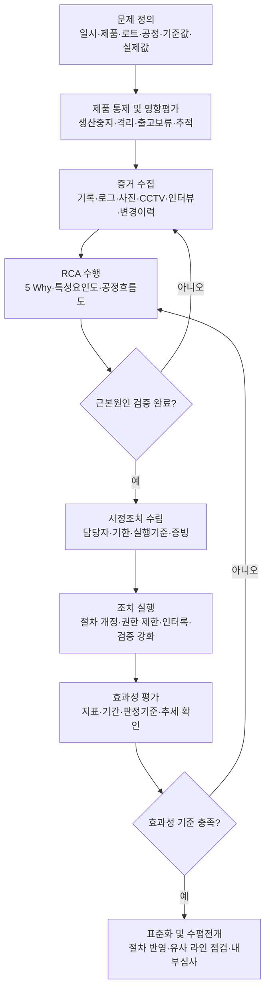

# [QA+ 블로그 생성 결과물] FS003 근본원인분석 RCA
생성일시: 2026-09-02 07:22:45 (KST)
적용모델: gpt-5.6-terra

================================================================================
# 📋 최종 발행용 블로그 패키지

## 1. 메타 데이터 (SEO 설정)

- **최종 포스팅 제목**: FSSC 22000 FS003 RCA 실무 가이드: “작업자 부주의”로 끝내면 심사에서 지적받는 이유
- **메타 디스크립션 (120자 내외 요약)**: FSSC 22000 FS003 RCA와 ISO 22000 시정조치 요구사항을 바탕으로, 작업자 부주의를 시스템 원인으로 분석하고 효과성 평가까지 작성하는 방법을 정리합니다.
- **추천 해시태그 (10개)**:  
  #FSSC22000 #FS003 #근본원인분석 #RCA #시정조치 #식품안전 #HACCP #식품품질관리 #ISO22000 #식품공장
- **카테고리**: 식품품질실무 / FSSC 22000 가이드

### 사실관계·표현 검수 반영 사항

- `FS003`은 FSSC 22000의 RCA 실무 가이드 문서로 소개하되, **문서명·문서번호·버전은 FSSC 공식 Document Library에서 최신본 확인이 필요하다**는 안내를 유지했습니다.
- ISO 22000:2018의 관련 조항은 **10.1 부적합 및 시정조치**가 맞습니다.
- 「식품위생법」 제48조는 HACCP 제도의 법적 근거로 언급 가능합니다. 다만 RCA 또는 5 Why 양식 자체가 법령상 의무라는 의미로 오해되지 않도록 표현을 유지했습니다.
- 금속검출기의 Fe·Sus·Non-Fe 시험편 기준은 설비 사양과 제품 특성에 따라 달라질 수 있으므로, 본문 사례의 `Fe 2.0mm` 및 `3종 시험편`은 **현장 예시이며 자사 HACCP 계획·검증 기준 적용이 필요함**을 추가했습니다.
- 미생물 기준, 효과성 평가 기간, ATP 측정 위치·횟수 역시 현장 예시이므로 자사 제품 특성, 위해평가, 공정 검증 결과에 따라 설정해야 합니다.

---

## 2. 네이버 블로그 / 티스토리 복사용 최종 원고 (Markdown)

# FSSC 22000 FS003 근본원인분석(RCA) 실무 가이드: “작업자 부주의”에서 끝내면 심사에서 지적받는 이유

> **20년 실무 선배의 한 줄 요약**  
> 부적합 제품을 격리하고 작업자를 재교육하는 것은 시작일 뿐입니다. FS003 RCA의 핵심은 “누가 실수했는가”가 아니라 “왜 우리 시스템이 그 실수를 막지 못했는가”를 찾아, 데이터로 재발방지 효과까지 입증하는 데 있습니다.

---

## 1. “교육했습니다”만으로는 재발방지가 되지 않습니다

심사 후 시정조치서를 작성할 때 가장 많이 나오는 문구가 있습니다. 바로 “작업자 재교육 실시”, “주의 조치 완료”, “관리 강화”입니다. 그런데 이런 문구만 적어 제출하면 심사원에게 “근본원인이 아닙니다”, “재발방지 대책이 부족합니다”라는 피드백을 받기 쉽습니다.

교육 자체가 틀린 조치는 아닙니다. 다만 교육만으로는 작업자가 다시 실수하지 않을 구조가 만들어졌다고 보기 어렵습니다.

예를 들어 금속검출기 시험편이 검출되지 않았다고 가정해보겠습니다. 해당 제품을 격리하고 설비를 점검한 뒤 담당자를 교육했습니다. 당장 출고 사고는 막았을 수 있습니다. 하지만 다음 날 다른 작업자가 같은 설정값을 임의로 바꿀 수 있다면 문제의 뿌리는 그대로 남아 있는 것입니다.

이때 근본원인은 “작업자 부주의”가 아니라 **설정 변경 권한, 변경관리 절차, 확인 체계가 없었던 것**일 가능성이 높습니다.

근본원인분석(RCA, Root Cause Analysis)은 책임자를 찾는 활동이 아닙니다. 사고나 부적합을 다시 일으킬 수 있는 절차, 설비, 작업환경, 권한, 검증체계의 빈틈을 찾는 활동입니다.

쉽게 말하면 바닥에 물이 새면 걸레질만 하는 것이 아니라, 어느 배관에서 왜 물이 새는지 찾아 고치는 과정입니다. 걸레질은 수정(Correction)이고, 배관을 수리하고 정기점검 기준을 만드는 것이 시정조치(Corrective Action)입니다.

특히 식품공장은 이물, 미생물, 알레르겐, 표시사항, 냉장온도, CCP 이탈처럼 식품안전과 직접 연결되는 문제가 많습니다. 그래서 “문제 제품을 폐기했으니 끝났다”는 방식으로 접근하면 안 됩니다. 제품 처분은 반드시 필요하지만, 그 제품이 만들어진 공정과 관리체계도 함께 분석해야 합니다.

오늘 글에서는 FS003 RCA의 기본 개념부터 5 Why 작성법, 심사원이 인정하는 시정조치서 구성, 효과성 평가까지 현장 언어로 정리해보겠습니다.


> **이미지 생성 가이드**  
> 교육받는 작업자보다 잠금·승인·검증이 적용된 금속검출기 설비가 화면 중심이 되도록 구성합니다. 교육은 보조 요소로 배치해 “교육은 필요하지만, 시스템 차단 기능이 핵심”이라는 메시지를 전달합니다.

다만 한 가지는 정확히 짚고 가겠습니다. 여기서 말하는 FS003은 일반적으로 FSSC 22000에서 제공하는 **「FS003 Root Cause Analysis (RCA)」 가이드 문서**를 의미합니다.

FSSC 문서는 개정 또는 대체될 수 있으므로, 인증심사 대응이나 절차서 개정 전에는 반드시 FSSC 22000 공식 Document Library에서 최신 문서명, 버전, 발행일을 확인해야 합니다. 문서 번호만 외우는 것보다 최신 요구사항과 실제 운영 증빙을 맞추는 것이 훨씬 중요합니다.

---

## 2. FS003 RCA와 ISO 22000 요구사항, 이렇게 연결하면 됩니다

FSSC 22000은 ISO 22000을 기반으로 식품안전경영시스템(FSMS)을 운영하는 인증체계입니다. 따라서 RCA도 별도의 “보고서 잘 쓰기 기술”이 아니라, 부적합을 관리하고 시스템을 지속적으로 개선하기 위한 핵심 활동으로 이해하면 됩니다.

FSSC의 FS003은 RCA를 수행할 때 참고할 수 있는 실무 가이드 성격의 문서입니다. 즉, 인증 요구사항 자체와 가이드의 역할을 혼동하지 않는 것이 중요합니다.

ISO 22000:2018의 **10.1 부적합 및 시정조치**에서는 부적합이 발생했을 때 조직이 해야 할 흐름을 제시합니다. 조직은 부적합에 대응하고, 결과를 처리하며, 원인을 평가하고, 재발 또는 다른 곳에서 발생하지 않도록 필요한 조치를 결정해야 합니다.

이후 조치를 실행하고, 조치가 실제로 효과가 있었는지 검토해야 합니다. 필요한 경우에는 식품안전경영시스템 자체도 변경해야 합니다.

국내 HACCP 운영도 방향은 같습니다. 「식품위생법」 제48조는 식품 및 축산물 안전관리인증기준(HACCP)의 법적 근거가 되며, HACCP 운영에서는 모니터링, 개선조치, 검증, 기록관리가 서로 연결됩니다.

RCA나 5 Why라는 양식 자체가 법령으로 정해진 것은 아닙니다. 하지만 반복 부적합을 막고 개선조치의 실효성을 설명하려면 RCA 방식으로 접근하는 것이 가장 설득력 있습니다.

> **실무에서 정확한 표현**
>
> “RCA는 법에서 5 Why 작성을 의무화한 제도”라고 쓰면 부정확할 수 있습니다.  
> 더 정확하게는 **“ISO/FSSC 및 HACCP 운영 원칙은 부적합의 원인 확인, 재발방지 조치, 조치 효과성 검토를 요구하며, FS003과 5 Why는 이를 체계적으로 수행하기 위한 실무 방법론”**이라고 이해하면 됩니다.

| 요구 흐름 | ISO 22000/FSSC 관점 | 현장 실행 예시 | 남겨야 할 증빙 |
|---|---|---|---|
| 부적합 통제 | 부적합 제품 및 공정의 즉시 관리 | 생산중지, 로트 격리, 출고보류 | 격리표, 재고현황, 생산일보 |
| 영향평가 | 잠재적으로 안전하지 않은 제품 평가 | 전후 로트 범위 확인, 재검사, 처분 결정 | 영향평가서, 시험성적서, 추적기록 |
| 원인분석 | 발생 원인 및 시스템 결함 확인 | 5 Why, 특성요인도, 현장 인터뷰 | RCA 회의록, 로그, 사진, CCTV |
| 시정조치 | 원인을 제거해 재발 방지 | 절차 개정, 인터록 설치, 권한 제한 | 개정 절차서, 설치 사진, 교육기록 |
| 효과성 확인 | 조치의 유효성 검토 | 3개월 추세 확인, 내부심사 검증 | 모니터링 추세표, 내부심사 결과 |

이 기준을 이해하면 이제 “수정”과 “시정조치”를 왜 구분해야 하는지도 명확해집니다. 이 둘을 섞어 쓰는 순간 시정조치서는 대개 제품 처리 기록으로 끝나버립니다.

---

## 3. 수정·시정조치·예방조치, 시정조치서에서 절대 섞지 마세요

부적합이 발생하면 가장 먼저 해야 할 것은 식품안전 확보입니다. 예를 들어 냉장 보관 온도가 관리한계를 벗어났다면 우선 해당 제품을 격리하고 출고를 보류해야 합니다.

이 단계에서 “원인은 나중에 찾자”가 아닙니다. 제품의 위치, 수량, 생산시간, 전후 로트, 보관 이력부터 확보해야 나중에 영향평가도 정확해집니다.

부적합 제품을 격리하거나 재검사·재포장·폐기하는 활동은 **수정(Correction)** 입니다. 쉽게 말하면 지금 눈앞에 있는 문제를 처리하는 응급조치입니다.

라벨이 잘못 부착된 제품의 출고를 막고 올바른 라벨로 재포장하는 것도 수정입니다. 하지만 라벨을 바꿔 붙였다고 해서 다음 생산 때 라벨 혼입이 사라지는 것은 아닙니다.

**시정조치(Corrective Action)** 는 확인된 원인을 제거해 같은 문제가 다시 발생하지 않도록 하는 조치입니다.

라벨 오류의 원인이 자재 식별 미흡이었다면 자재 보관구역을 분리하고, 품목별 색상관리 또는 바코드 대조를 도입할 수 있습니다. 라인 전환 시 이전 라벨이 남는 것이 문제였다면 라인 클리어런스 체크리스트와 QA 이중확인 절차를 강화해야 합니다.

이 조치가 실제 원인과 직접 연결돼야 심사에서 인정받습니다.

예방조치라는 표현도 많이 쓰지만, 최근 ISO 경영시스템 체계에서는 위험기반 사고와 시정조치 개념 안에서 관리하는 경우가 많습니다. 실무적으로는 “이번 원인을 제거하는 조치”와 “유사 라인이나 유사 제품에 같은 위험이 있는지 확인하는 수평전개”를 구분해 관리하면 좋습니다.

예를 들어 한 라인의 금속검출기 변경관리 미흡이 발견됐다면 다른 3개 라인도 같은 방식으로 설정 변경이 가능한지 점검해야 합니다. 이것이 제대로 된 재발방지이자 예방적 개선입니다.

| 구분 | 질문 | 식품공장 예시 | 심사에서 부족하다고 보는 경우 |
|---|---|---|---|
| 수정(Correction) | 지금 발생한 제품을 어떻게 처리했는가? | 부적합 520kg 격리 후 재검사·폐기 | 제품 폐기만 하고 원인 분석이 없음 |
| 원인분석(RCA) | 왜 이 문제가 발생했는가? | 로그, 세척기록, 변경이력, 인터뷰 분석 | “작업자 부주의”로 종료 |
| 시정조치 | 확인된 원인을 어떻게 제거할 것인가? | 절차 개정, 인터록, 승인권한 설정 | “전 직원 교육”만 실시 |
| 효과성 평가 | 조치가 실제로 재발을 막았는가? | 3개월 이탈 0건, 준수율 100% 확인 | 완료일만 적고 데이터 없음 |
| 수평전개 | 다른 공정에서도 발생할 수 있는가? | 전 라인 라벨·금속검출기 점검 | 해당 라인만 고치고 종료 |

---

## 4. FS003 RCA를 현장에 적용하는 5단계 실전 절차

### 1단계: 문제를 측정 가능하게 정의합니다

“미생물 관리가 안 된다”, “금속검출기가 이상하다”처럼 쓰면 분석 범위가 너무 넓어집니다.

문제는 발생일시, 제품명, 로트, 공정, 기준값, 실제 결과, 발견 경위를 포함해 구체적으로 정의해야 합니다. 그래야 조사 대상 시간대와 관련 작업자를 정확히 좁힐 수 있습니다.

좋은 문제 정의는 다음과 같습니다.

- “2026년 8월 12일 2조 생산한 냉동만두 A제품, 로트 M0812-2의 완제품 일반세균수가 내부 기준 10,000 CFU/g 이하 대비 36,000 CFU/g으로 확인되었다.”
- “14시 금속검출기 감도점검에서 Fe 2.0mm 시험편이 배출되지 않았다.”

기준과 실제값의 차이를 써야 부적합의 중대성과 영향을 판단할 수 있습니다.

> 금속검출기 시험편의 재질·크기 및 검출 기준은 설비 성능, 제품 특성, 포장재, HACCP 계획에 따라 달라질 수 있으므로 자사 관리기준을 적용해야 합니다.

### 2단계: 즉시조치와 제품 영향평가를 먼저 합니다

RCA 회의는 중요하지만 식품안전 이슈가 발생했을 때 제품 안전 확보가 먼저입니다.

해당 로트뿐 아니라 마지막 정상점검 시점부터 이상 발견 시점까지 생산된 제품을 잠정 격리하는 기준을 정해두세요. CCP 또는 OPRP 이탈이면 제품 처분 기준, 재처리 가능 여부, 재검사 방법까지 HACCP 계획과 연결해야 합니다.

출고된 제품이 있다면 추적성 자료를 기반으로 고객 통보와 회수 필요성도 검토해야 합니다.

심사원은 RCA 회의록보다 먼저 다음을 확인합니다.

- 영향 제품은 몇 kg 또는 몇 박스인가?
- 현재 제품은 어디에 있는가?
- 어떤 근거로 안전하다고 판정했는가?
- 출고품이 있다면 추적 및 회수 가능 여부를 검토했는가?

제품 위치와 수량이 불명확하면 가장 큰 지적사항이 됩니다. 따라서 품질팀은 조사 담당과 제품통제 담당을 분리해 동시에 움직이는 편이 안전합니다.

### 3단계: 추측하지 말고 증거를 모읍니다

RCA는 회의에서 “아마 그랬을 것 같다”고 결론 내리는 과정이 아닙니다. 가설을 세우고 기록과 현장 사실로 검증하는 과정입니다.

우선 다음 증빙을 확보하세요.

- CCP·OPRP 모니터링 기록
- 온도·압력·중량·금속검출 로그
- 세척·소독 기록
- 설비 보전 이력
- 작업자 배치표
- 원료 COA
- 변경관리 이력
- CCTV 및 현장 사진
- 작업자 인터뷰 기록

다만 인터뷰 내용만으로 결론을 내리면 안 됩니다. 인터뷰는 조사 단서이며, 최종 결론은 로그·기록·현장 확인 등 객관적 증거로 뒷받침해야 합니다.

특히 변경 이력은 꼭 확인해야 합니다. 설비 수리, 원료 공급업체 변경, 세척제 변경, 생산량 증가, 작업시간 연장, 신규 작업자 투입 등은 부적합 직전의 중요한 단서가 됩니다.

“전에는 문제 없었는데 갑자기 생겼다”는 말이 나오면 대부분 공정 어딘가에 변경이 있었을 가능성이 있습니다. 변경 자체가 나쁜 것은 아니지만, 변경 전 위험평가와 변경 후 검증이 없었다면 시스템 원인이 될 수 있습니다.

### 4단계: 5 Why와 특성요인도로 원인을 좁힙니다

5 Why는 “왜?”를 무조건 다섯 번 묻는 기법이 아닙니다. 세 번만 물어도 관리 가능한 근본원인에 도달할 수 있고, 여섯 번 이상이 필요할 수도 있습니다.

중요한 것은 각 답변이 앞 질문의 원인이 되어 논리적으로 연결되는지입니다. 그리고 각 Why마다 로그, 기록, 사진, 인터뷰, 시험성적서 같은 객관적 증거가 붙어야 합니다.

복합적인 문제라면 특성요인도, 즉 어골도(Fishbone Diagram)를 먼저 쓰면 좋습니다.

사람(Man), 설비(Machine), 원료(Material), 방법(Method), 환경(Environment), 측정(Measurement)의 6M 관점으로 가능한 원인을 넓게 펼쳐봅니다. 그다음 데이터로 가능성이 낮은 항목을 제거하고 영향이 큰 원인을 우선 조사합니다.

어골도는 가능한 원인을 나열하는 데서 끝나면 안 되고, 반드시 검증 단계로 이어져야 합니다.

### 5단계: 원인을 제거하고 효과성을 확인합니다

시정조치는 “무엇을 하겠다”가 아니라 “누가, 언제까지, 어떤 기준으로 실행하겠다”로 작성해야 합니다.

예를 들어 “금속검출기 관리 강화”보다 다음과 같이 작성하는 것이 좋습니다.

> “2026년 9월 15일까지 설비 설정 메뉴를 관리자 비밀번호로 제한하고, 설정 변경 시 QA 승인번호 입력 및 변경 후 자사 기준 시험편 검증을 의무화한다.”

담당 부서와 기한, 검증방법까지 한 문장 안에 들어갑니다.

조치 완료 후에는 반드시 효과성 평가를 합니다. 조치가 완료됐다는 것은 장치를 설치하거나 교육을 했다는 뜻일 뿐입니다. 실제로 이탈이 줄었는지, 절차가 지켜지는지, 다른 라인에도 같은 문제가 없는지 확인해야 합니다.




---

## 5. 5 Why, 어골도, Pareto 분석은 언제 어떻게 써야 할까요?

단일 사건이라면 5 Why가 가장 실용적입니다. 예를 들어 한 번의 금속검출기 감도 불합격, 특정 라벨 오부착, 냉장온도 이탈처럼 사건 시점이 명확한 문제에 적합합니다.

다만 첫 번째 답을 곧바로 “작업자 부주의”라고 쓰면 분석은 거기서 멈춰버립니다. 작업자가 왜 그런 행동을 할 수 있었는지, 왜 확인자가 막지 못했는지까지 이어가야 합니다.

미생물 부적합이나 반복 이물처럼 원인이 여러 개일 수 있는 문제는 특성요인도가 좋습니다. 예를 들어 소스 제조공정에서 일반세균이 반복 검출됐다면 세척 담당자만 볼 것이 아니라 다음 항목을 함께 봐야 합니다.

- CIP 조건
- 배관 데드레그
- 세척제 농도
- 원료 보관
- 결로
- 배수
- 샘플링 위치
- 설비 분해세척 범위

사람 한 명의 실수로 보이는 현상도 실제로는 설비 구조나 작업표준의 결함일 때가 많습니다.

반복되는 클레임이나 불량 유형이 쌓여 있다면 Pareto 분석을 활용하세요. 예를 들어 최근 6개월 클레임 80건 중 포장불량 35건, 이물 20건, 중량부족 15건, 표시불량 10건이라면 우선순위가 보입니다.

다만 단순 발생 건수만 보지 말고 위해도와 법규 위반 가능성도 함께 반영해야 합니다. 건수는 적어도 알레르겐 표시 오류나 금속성 이물은 더 높은 우선순위로 관리해야 합니다.

| 분석 도구 | 가장 적합한 상황 | 현장 적용 포인트 | 주의사항 |
|---|---|---|---|
| 5 Why | 단일 사건, 명확한 이탈 | 인과관계를 단계별로 추적 | 답변마다 증거를 연결 |
| 특성요인도 | 미생물·이물 등 복합 원인 | 6M 관점으로 원인 후보 발굴 | 나열 후 반드시 검증 |
| Pareto 분석 | 반복 클레임·불량 데이터 | 우선 해결 과제 선정 | 건수 외 위해도도 고려 |
| 공정흐름도 검토 | 문서와 실제 작업 불일치 의심 | 현장 동선·임시작업 확인 | HACCP 팀 현장 확인 필요 |
| 변경관리 이력 | 변경 뒤 문제 발생 | 설비·원료·인력·생산량 변화 확인 | 변경 전 위험평가도 점검 |
| FMEA | 재발방지 대책 우선순위화 | 심각도·발생도·검출도 평가 | 점수보다 후속조치가 중요 |

공정흐름도 재검토도 강력한 RCA 도구입니다. 문서상 공정과 실제 현장이 다르면 HACCP 위해요소 분석의 전제부터 흔들립니다.

예를 들어 작업자가 혼합 전 원료를 임시로 통로에 보관하거나, 세척 후 설비를 조립하기 전에 다른 작업이 끼어든다면 문서에 없는 위험이 생길 수 있습니다. 품질팀은 책상에서 기록만 보지 말고 부적합 발생 시간대의 현장을 직접 확인해야 합니다.

---

## 6. 실제 현장 사례로 보는 RCA 적용법

### 사례 1. 냉동만두 제조공장 금속검출기 감도점검 불합격

냉동만두 제조공장의 포장라인에서 14시 정기점검 중 Fe 2.0mm 시험편이 금속검출기에 검출되지 않는 문제가 발생했습니다.

생산팀은 즉시 설비를 정지했고, 마지막 정상점검 시점인 12시부터 14시까지 생산된 완제품 1,240봉을 격리했습니다.

처음 작성된 원인에는 “작업자가 오검출을 줄이기 위해 감도를 낮춤”이라고만 기재되어 있었습니다. 하지만 QA팀이 설비 로그와 CCTV를 확인해보니, 작업자는 생산 중 포장지 주름에 따른 오검출이 반복되자 별도 승인 없이 설정값을 변경한 것으로 확인됐습니다.

여기서 중요한 점은 작업자가 설정을 바꿨다는 사실은 직접원인일 뿐이라는 것입니다.

추가 확인 결과 다음 문제가 발견됐습니다.

- 금속검출기 설정 메뉴에 비밀번호가 없었음
- 누구나 터치패널에서 감도값을 변경할 수 있었음
- 설정 변경 시 기록하거나 QA 승인을 받는 절차가 없었음
- 작업표준서에는 “이상 발생 시 관리자에게 보고한다”라고만 기재돼 있었음

즉 근본원인은 작업자 개인의 판단보다 **설정 변경 권한관리 및 변경 후 검증체계 부재**였습니다.

개선조치로 설비 업체와 협의해 설정 메뉴를 관리자 비밀번호로 잠갔습니다. 설정값 변경이 필요한 경우 생산팀장이 변경요청서를 작성하고, QA 승인 후 자사 기준에 따른 시험편 검증을 실시하도록 절차를 개정했습니다.

추가로 매 작업 전과 2시간마다 설정값 화면을 촬영해 일지에 첨부하도록 했고, 포장지 주름으로 인한 오검출 문제는 필름 장력과 실링 조건을 별도로 개선했습니다.

작업자 교육은 실시했지만, 교육은 핵심 대책이 아니라 변경된 절차를 현장에 정착시키기 위한 보조 조치로 관리했습니다.

효과성 평가는 조치 완료 후 1개월과 3개월에 실시했습니다.

- 감도점검 이탈: 0건
- 설정 변경기록 QA 승인률: 100%
- 금속검출기 점검일지 누락: 0건

3개월 동안 총 1,080회의 감도점검에서 이탈은 발생하지 않았고, 내부심사에서도 비밀번호 관리와 변경기록이 정상 운영되는 것을 확인했습니다.

이 사례는 “재교육 완료”보다 “임의 변경이 불가능한 구조를 만들고 변경 시 검증하게 했다”는 점에서 심사원이 인정하기 쉬운 RCA입니다.

### 사례 2. 액상소스 제조공장 완제품 미생물 부적합 반복

액상소스 제조공장에서는 간장베이스 소스 제품의 일반세균수가 내부 기준을 초과하는 일이 두 달 사이 세 번 발생했습니다.

최초 대응은 완제품 재검사와 해당 로트 폐기, 세척 담당자 재교육이었습니다. 그런데 다음 달 다른 생산일에도 같은 문제가 재발했습니다.

품질팀은 “세척 담당자의 숙련도 부족”이라는 기존 결론을 의심하고 특성요인도로 조사를 다시 시작했습니다.

사람, 설비, 방법, 원료, 환경, 측정 관점에서 원인 후보를 정리한 뒤 다음 자료를 대조했습니다.

- 세척 기록
- CIP 온도 로그
- 세척제 농도 기록
- ATP 측정 결과
- 환경미생물 결과
- 설비 분해세척 범위
- 생산 종료 후 방치시간

그 결과 세척제 농도와 CIP 순환시간은 기준 내였지만, 충전기 노즐 연결부 안쪽은 분해세척 대상에서 제외된 사실이 확인됐습니다.

ATP 검증 위치도 탱크 내부와 배관 외부 중심으로 설정돼 있어 실제 오염 취약부인 노즐 연결부를 확인하지 못했습니다. 생산 종료 후 다음 생산까지 장시간 방치되는 날에는 해당 부위에서 결로가 발생할 가능성도 현장 관찰을 통해 확인했습니다.

근본원인은 “세척 담당자가 제대로 하지 않았다”가 아니라 **설비 위생설계 취약부에 대한 세척 범위와 검증 위치가 위해도 기반으로 설정되지 않은 것**이었습니다.

공장에서는 충전기 노즐 연결부를 분해세척 항목에 포함시키고, 세척 후 조립 전 사진 확인을 의무화했습니다. ATP 측정 위치를 기존 3개소에서 노즐 연결부와 패킹 접촉면을 포함한 6개소로 확대했습니다.

또한 주 1회 환경미생물 검사를 실시하던 것을 초기 8주간은 주 2회로 강화해 개선 효과를 집중 확인했습니다.

효과성 평가 기준은 다음과 같이 설정했습니다.

- 동일 품목 완제품 일반세균 내부 기준 적합률: 100%
- 추가된 ATP 측정 6개소 기준 충족률: 100%
- 분해세척 사진 누락: 0건

조치 후 12주 동안 해당 소스 제품 18개 로트에서 미생물 기준 초과는 발생하지 않았습니다.

다만 이 결과만으로 끝내지 않고, 유사 구조의 드레싱 충전라인 2개에도 같은 세척 검증 방식을 수평전개했습니다.

이 사례에서 핵심은 검사 횟수를 늘린 것이 아니라, **오염을 놓치던 검증 위치 자체를 바로잡은 것**입니다.

### 사례 3. 레토르트 죽 제조공장 알레르겐 표시 라벨 혼입

레토르트 죽 제조공장에서는 우유 성분이 포함된 제품의 외포장에 우유 성분 표시가 없는 다른 품목 라벨이 일부 사용된 사실이 출하 전 점검에서 발견됐습니다.

다행히 출고 전 발견돼 해당 생산분 860박스는 즉시 출고보류 처리됐고, 전수 선별 후 올바른 라벨로 재포장했습니다.

최초 보고서는 “라벨 교체 작업자가 자재를 잘못 가져왔다”는 내용이었습니다. 그러나 알레르겐 표시 오류는 소비자 건강과 법규 위반으로 직결될 수 있으므로 단순 인적 오류로 끝낼 사안이 아니었습니다.

조사팀은 다음 자료를 확인했습니다.

- 자재창고 불출기록
- 라인 전환 체크리스트
- 라벨 승인본
- 생산계획서
- CCTV
- QA 초품 확인기록

그 결과 유사한 디자인의 라벨 두 품목이 같은 선반에 보관돼 있었고, 품목코드는 작게 인쇄돼 현장에서 육안 구분이 어려웠습니다.

더 큰 문제는 라인 전환 시 기존 자재를 완전히 제거했다는 라인 클리어런스 확인란이 있었지만, 실제로는 생산팀 작업자 한 명이 자가 확인하고 서명하는 방식이었다는 점입니다.

QA의 초품 확인도 생산 시작 후 일정 수량이 나온 뒤에 이뤄져, 잘못된 라벨이 사용되더라도 초기 생산분이 발생할 수 있는 구조였습니다.

근본원인은 “작업자 실수”가 아니라 다음 세 가지로 정리됐습니다.

1. 유사 라벨의 식별·보관관리 미흡  
2. 라인 클리어런스 독립 검증 부재  
3. 초품 승인 시점 지연  

개선조치로 알레르겐 함유 제품 라벨은 적색 전용 보관함에 분리하고, 라벨 품목코드를 바코드로 관리했습니다.

생산 시작 전 작업자가 제품코드와 라벨 바코드를 스캔해야만 인쇄가 진행되도록 전산 연동을 추가했습니다.

또한 라인 전환 후에는 생산팀과 QA가 각각 확인하는 이중 서명 방식으로 바꾸고, 첫 10개 제품은 QA 승인 전까지 별도 트레이에 보관하도록 했습니다.

효과성 평가는 3개월간 다음 기준으로 관리했습니다.

- 라벨 바코드 대조율: 100%
- 라인 클리어런스 이중서명 누락: 0건
- 표시사항 관련 내부점검 부적합: 0건

동시에 우유, 대두, 밀, 난류 등 알레르겐 표시 품목 전체에 대해 라벨 식별체계를 수평전개했습니다.

결과적으로 단순히 작업자를 혼내는 방식보다, 잘못된 라벨을 집을 수 없고 승인 전에는 생산품이 다음 공정으로 넘어갈 수 없게 만든 것이 핵심입니다.

식품안전은 사람의 기억력보다 시스템의 차단 기능에 기대야 오래 갑니다.

---

## 7. 효과성 평가는 “조치 완료”가 아니라 “재발하지 않음”을 증명하는 단계입니다

시정조치서에서 가장 아쉬운 부분이 효과성 평가입니다. 많은 회사가 조치 완료일을 적고 사진 한 장을 붙인 뒤 종결합니다.

하지만 설비를 설치했거나 절차서를 개정했다는 사실은 조치의 실행 증거일 뿐입니다. 그 조치가 실제로 원인을 제거했는지는 별도의 데이터로 확인해야 합니다.

효과성 평가를 잘하려면 조치 전에 먼저 판정기준을 정해야 합니다.

“금속검출기 관리 강화 후 효과 확인”은 너무 추상적입니다. 대신 다음처럼 수치화해야 합니다.

> “조치 완료 후 3개월간 감도점검 이탈 0건, 설정 변경 시 QA 승인기록 100%, 월 1회 내부검증 결과 적합”

기간도 문제 특성에 맞춰 정해야 합니다. 생산빈도가 낮은 제품은 3개월 대신 최소 3개 생산로트 또는 10개 생산배치처럼 정할 수 있습니다.

미생물 문제라면 완제품 결과만 보지 마세요. 다음과 같은 선행지표도 함께 확인해야 합니다.

- 세척 검증 ATP 결과
- 환경미생물 추세
- 세척제 농도
- 세척시간 준수율
- 설비 분해세척 사진
- 세척 후 조립 전 확인기록

표시 오류라면 다음 항목을 볼 수 있습니다.

- 라벨 바코드 대조율
- 초품 승인 누락률
- 라인 클리어런스 이행률
- 내부심사 결과

결과지표와 과정지표를 함께 보면 조치가 현장에 정착했는지 훨씬 정확하게 판단할 수 있습니다.

> **효과성 평가 작성 예시**
>
> - **평가 대상**: 금속검출기 설정 변경관리 개선조치  
> - **평가 지표**: 감도점검 이탈 건수, 설정 변경 승인율, 점검기록 누락 건수  
> - **판정 기준**: 3개월간 이탈 0건, 승인율 100%, 기록 누락 0건  
> - **평가 시점**: 조치 완료 1개월 후 및 3개월 후  
> - **평가 책임자**: QA 팀장  
> - **증빙자료**: 감도점검일지, 설정 변경기록, 내부심사 점검표, 설비 로그  

효과성 평가에서 기준 미달이 나오면 “평가 완료”로 종결하면 안 됩니다. 원인분석이 부족했는지, 시정조치가 원인을 제거하지 못했는지, 조치가 현장에서 실행되지 않았는지를 다시 확인해야 합니다.

같은 부적합이 재발했다고 해서 이전 RCA가 무조건 틀린 것은 아니지만, 적어도 재검토가 필요하다는 신호입니다.

RCA는 한 번 작성하고 파일에 넣어두는 문서가 아니라, 데이터에 따라 계속 보완하는 개선 활동입니다.

마지막으로 수평전개를 확인하세요. 같은 설비, 유사 공정, 동일 작업방식을 쓰는 다른 라인에 같은 결함이 없는지 보는 단계입니다.

한 라인에서 발생한 부적합은 다른 라인의 미래 문제를 미리 보여주는 신호일 수 있습니다. 이 관점이 있으면 심사에서도 “위험기반 사고를 하고 있다”는 평가를 받을 가능성이 높습니다.

---

## 8. FSSC·HACCP 심사에서 자주 묻는 질문(FAQ)

### Q1. “작업자 부주의”는 근본원인이 될 수 없나요?

**A.** 작업자의 고의적 위반처럼 매우 제한적인 경우를 제외하면, “작업자 부주의”만으로 RCA를 끝내는 것은 적절하지 않습니다.

작업자가 실수할 수 있었던 작업표준, 교육 적격성, 작업환경, 인력배치, 확인 절차, 설비 인터록의 문제를 더 확인해야 합니다.

사람을 바꾸기 전에 시스템이 같은 실수를 허용하고 있지 않은지 먼저 봐야 합니다.

### Q2. 5 Why는 반드시 다섯 번 해야 하나요?

**A.** 아닙니다. 숫자 5는 절대 기준이 아니라 사고를 깊게 하기 위한 가이드입니다.

세 번의 질문으로 관리 가능한 시스템 원인이 확인될 수도 있고, 복합 문제는 다섯 번 이상 파고들어야 할 수도 있습니다.

중요한 것은 “왜”의 횟수가 아니라, 찾은 원인이 증거로 검증됐고 그 원인을 제거하면 재발 위험이 낮아지는가입니다.

### Q3. 재교육은 시정조치로 인정받지 못하나요?

**A.** 재교육은 필요할 수 있으며, 변경된 절차나 기준을 현장에 정착시키는 데 반드시 필요한 조치입니다.

하지만 원인이 작업표준의 모호함, 설비 접근권한, 확인체계 부재라면 교육만으로는 부족합니다.

교육과 함께 절차 개정, 이중확인, 포카요케, 권한 제한, 검증 강화 같은 구조적 대책을 연결해야 합니다.

### Q4. 같은 부적합이 재발하면 기존 RCA가 틀린 것인가요?

**A.** 반드시 그렇다고 단정할 수는 없지만, 기존 분석과 조치를 재검토해야 합니다.

근본원인을 충분히 찾지 못했거나, 조치가 원인을 제거하지 못했거나, 현장 실행이 안 됐거나, 새로운 변경요인이 생겼을 가능성이 있습니다.

특히 효과성 평가 기간이 너무 짧거나 지표가 부적절했는지도 확인해야 합니다.

### Q5. 고객 클레임도 RCA 대상인가요?

**A.** 네. 특히 이물, 미생물, 알레르겐, 표시 오류, 품질변질, 중량 부족처럼 식품안전·법규·반복 가능성과 연결된 클레임은 체계적인 RCA 대상입니다.

단순 보상이나 사과로 끝내지 말고, 해당 로트 추적, 공정 확인, 원인분석, 시정조치, 효과성 평가까지 연결해야 합니다.

고객 클레임 데이터는 Pareto 분석으로 반복 문제의 우선순위를 정하는 데도 매우 유용합니다.

### Q6. HACCP 부적합과 FSSC 부적합의 RCA 수준은 다른가요?

**A.** 두 체계 모두 부적합 관리와 개선조치가 중요합니다.

다만 FSSC·ISO 기반 시스템 심사에서는 “왜 관리체계가 문제를 예방하지 못했는가”, “조치가 실제로 유효한가”, “다른 공정에도 적용했는가”를 더 깊게 보는 경향이 있습니다.

HACCP 기록을 채우는 수준을 넘어 시스템적 원인과 효과성 증빙까지 준비하면 두 심사 모두 훨씬 수월해집니다.

### Q7. RCA 회의에 누가 참여해야 하나요?

**A.** 최소한 QA 또는 HACCP 팀장, 해당 생산팀 책임자, 설비 관련 문제라면 공무·보전 담당자가 참여하는 것이 좋습니다.

미생물 문제는 미생물 시험 담당자나 세척 담당자, 원료 문제는 구매 또는 원료관리 담당자도 포함해야 사실 확인이 빨라집니다.

다만 참석 인원이 많다고 좋은 분석이 되는 것은 아니며, 각 부서의 기록과 현장 정보를 실제로 가져오는 것이 중요합니다.

---

## 9. 바로 쓰는 RCA 시정조치서 작성 체크리스트

시정조치서는 길게 쓰는 문서가 아닙니다. 대신 읽는 사람이 아래 내용을 한 번에 이해할 수 있어야 합니다.

- 문제가 무엇인지
- 제품은 안전하게 통제됐는지
- 원인은 증거로 확인됐는지
- 조치가 원인을 제거하는지
- 효과를 어떻게 평가할지

아래 체크리스트를 CAR 양식에 그대로 반영해도 좋습니다.

| 단계 | 점검 항목 | 작성 기준 | 확인 방법 |
|---|---|---|---|
| 문제 정의 | 일시·제품·로트·공정·기준·실제값 기재 | “관리 미흡” 같은 포괄 표현 금지 | 시험성적서, 생산일보 대조 |
| 제품 통제 | 격리 범위와 수량 명확화 | 전후 로트 판단 근거 포함 | 격리표, 재고현황, 추적기록 |
| 영향평가 | 안전성 및 출고 영향 평가 | 재검사·선별·폐기·회수 여부 판단 | 평가서, 검사결과, 처분기록 |
| 증거 수집 | 기록·로그·사진·변경이력 확보 | 추측이 아니라 사실 중심 | 원본 또는 사본 첨부 |
| 원인분석 | 직접원인과 근본원인 구분 | 5 Why·어골도 등 활용 | RCA 회의록, 증빙 연결 |
| 시정조치 | 원인 제거 조치 수립 | 담당자·기한·실행기준 명시 | 절차서, 설비개선, 교육기록 |
| 효과성 평가 | 지표·기간·판정기준 설정 | “이상 없음” 대신 수치화 | 추세그래프, 내부심사 결과 |
| 수평전개 | 유사 공정·라인 위험 검토 | 다른 라인 적용 여부 기록 | 전개 점검표, 개선 결과 |

아래 표현은 가능하면 피하는 것이 좋습니다.

| 피해야 할 문구 | 바꿔 쓸 문구 예시 |
|---|---|
| 작업자 부주의 | 라벨 식별 기준이 불명확하고 이중확인 절차가 없어 오부착을 예방하지 못함 |
| 관리 강화 | QA가 매 생산 시작 전 초품 10개를 확인하고 승인 전 제품은 출고 공정으로 이송 금지 |
| 교육 실시 | 개정 작업표준 교육 후 작업자별 실습평가 90점 이상 및 1개월 현장 준수율 확인 |
| 점검 미흡 | 2시간 점검 주기 중 야간조 02시 점검 담당·대체자 지정 기준이 없어 기록이 누락됨 |
| 설비 이상 | 설정값 변경 권한 제한과 변경 후 시험편 검증 절차가 없어 감도 저하를 즉시 차단하지 못함 |

시정조치서의 완성도는 문장력보다 연결성입니다.

문제 정의와 영향평가가 연결되고, 증거와 원인분석이 연결되며, 원인과 시정조치가 연결되고, 마지막으로 시정조치와 효과성 평가가 연결돼야 합니다.

이 연결만 끊기지 않으면 심사원 질문에도 흔들리지 않습니다.

---

## 10. 맺음말: 좋은 RCA는 보고서가 아니라 공장을 바꾸는 활동입니다

오늘 내용은 세 줄로 정리할 수 있습니다.

첫째, 부적합 제품을 격리·처분하는 것은 시작이며, 제품 통제와 시스템 개선은 별개로 관리해야 합니다.

둘째, “작업자 부주의”에서 멈추지 말고 절차·설비·권한·검증·변경관리의 결함까지 확인해야 합니다.

셋째, 조치 완료가 아니라 데이터로 재발방지 효과를 입증해야 RCA가 끝납니다.

부적합이 발생했을 때는 아래 순서를 기억하세요.

> **① 제품 안전 확보 → ② 사실과 증거 확인 → ③ 근본원인 분석 → ④ 원인 제거 조치 → ⑤ 효과성 검증 → ⑥ 표준화 및 수평전개**

처음에는 RCA가 심사원을 위한 어렵고 귀찮은 문서처럼 느껴질 수 있습니다. 하지만 한 건을 제대로 분석해 재발을 막아보면 생각이 달라집니다.

시정조치서는 단순히 심사 부적합을 닫는 문서가 아니라, 공장의 식품안전 수준과 현장 신뢰를 높이는 가장 강력한 개선 도구가 됩니다.

마지막으로 시정조치서를 작성할 때 이 질문 하나만 꼭 추가해보세요.

> **“교육을 받았는데도, 왜 이 작업자는 실수할 수 있었을까?”**

그 답이 절차, 설비, 권한, 검증, 변경관리의 개선으로 이어진다면 여러분의 RCA는 이미 심사 대응을 넘어 진짜 재발방지 활동이 되고 있는 것입니다.

---

## 3. 워드프레스 / 웹사이트용 HTML 원고

```html
<article class="food-qa-post">
  <header>
    <h1>FSSC 22000 FS003 근본원인분석(RCA) 실무 가이드: “작업자 부주의”에서 끝내면 심사에서 지적받는 이유</h1>
    <blockquote>
      <p><strong>20년 실무 선배의 한 줄 요약:</strong> 부적합 제품을 격리하고 작업자를 재교육하는 것은 시작일 뿐입니다. FS003 RCA의 핵심은 “누가 실수했는가”가 아니라 “왜 우리 시스템이 그 실수를 막지 못했는가”를 찾아, 데이터로 재발방지 효과까지 입증하는 데 있습니다.</p>
    </blockquote>
  </header>

  <section>
    <h2>1. “교육했습니다”만으로는 재발방지가 되지 않습니다</h2>
    <p>심사 후 시정조치서를 작성할 때 가장 많이 나오는 문구가 있습니다. 바로 “작업자 재교육 실시”, “주의 조치 완료”, “관리 강화”입니다. 그러나 이런 문구만 적어 제출하면 심사원에게 “근본원인이 아닙니다”, “재발방지 대책이 부족합니다”라는 피드백을 받기 쉽습니다.</p>
    <p>교육 자체가 틀린 조치는 아닙니다. 다만 교육만으로는 작업자가 다시 실수하지 않을 구조가 만들어졌다고 보기 어렵습니다.</p>
    <p>예를 들어 금속검출기 시험편이 검출되지 않았다고 가정해보겠습니다. 해당 제품을 격리하고 설비를 점검한 뒤 담당자를 교육했습니다. 당장 출고 사고는 막았을 수 있습니다. 하지만 다음 날 다른 작업자가 같은 설정값을 임의로 바꿀 수 있다면 문제의 뿌리는 그대로 남아 있는 것입니다.</p>
    <p>이때 근본원인은 “작업자 부주의”가 아니라 <strong>설정 변경 권한, 변경관리 절차, 확인 체계가 없었던 것</strong>일 가능성이 높습니다.</p>
    <p>근본원인분석(RCA, Root Cause Analysis)은 책임자를 찾는 활동이 아닙니다. 사고나 부적합을 다시 일으킬 수 있는 절차, 설비, 작업환경, 권한, 검증체계의 빈틈을 찾는 활동입니다.</p>

    <figure>
      
      <figcaption>교육은 보조 조치이며, 권한 제한·변경관리·검증체계 같은 시스템 차단 기능이 재발방지의 핵심입니다.</figcaption>
    </figure>

    <p>여기서 말하는 FS003은 일반적으로 FSSC 22000에서 제공하는 <strong>「FS003 Root Cause Analysis (RCA)」 가이드 문서</strong>를 의미합니다. FSSC 문서는 개정 또는 대체될 수 있으므로, 인증심사 대응이나 절차서 개정 전에는 FSSC 22000 공식 Document Library에서 최신 문서명, 버전, 발행일을 확인해야 합니다.</p>
  </section>

  <section>
    <h2>2. FS003 RCA와 ISO 22000 요구사항</h2>
    <p>FSSC 22000은 ISO 22000을 기반으로 식품안전경영시스템(FSMS)을 운영하는 인증체계입니다. RCA는 별도의 보고서 작성 기술이 아니라, 부적합을 관리하고 시스템을 지속적으로 개선하기 위한 핵심 활동입니다.</p>
    <p>ISO 22000:2018의 <strong>10.1 부적합 및 시정조치</strong>에서는 부적합에 대응하고, 결과를 처리하며, 원인을 평가하고, 재발 또는 다른 곳에서 발생하지 않도록 필요한 조치를 결정·실행하고, 그 효과성을 검토하도록 요구합니다.</p>

    <blockquote>
      <p><strong>실무에서 정확한 표현:</strong> RCA는 법에서 5 Why 작성을 의무화한 제도가 아닙니다. ISO/FSSC 및 HACCP 운영 원칙은 부적합의 원인 확인, 재발방지 조치, 조치 효과성 검토를 요구하며, FS003과 5 Why는 이를 체계적으로 수행하기 위한 실무 방법론입니다.</p>
    </blockquote>

    <table>
      <thead>
        <tr>
          <th>요구 흐름</th>
          <th>현장 실행 예시</th>
          <th>남겨야 할 증빙</th>
        </tr>
      </thead>
      <tbody>
        <tr><td>부적합 통제</td><td>생산중지, 로트 격리, 출고보류</td><td>격리표, 재고현황, 생산일보</td></tr>
        <tr><td>영향평가</td><td>전후 로트 범위 확인, 재검사, 처분 결정</td><td>영향평가서, 시험성적서, 추적기록</td></tr>
        <tr><td>원인분석</td><td>5 Why, 특성요인도, 현장 인터뷰</td><td>RCA 회의록, 로그, 사진, CCTV</td></tr>
        <tr><td>시정조치</td><td>절차 개정, 인터록 설치, 권한 제한</td><td>개정 절차서, 설치 사진, 교육기록</td></tr>
        <tr><td>효과성 확인</td><td>추세 확인, 내부심사 검증</td><td>모니터링 추세표, 내부심사 결과</td></tr>
      </tbody>
    </table>
  </section>

  <section>
    <h2>3. 수정·시정조치·예방적 개선을 구분하세요</h2>
    <p><strong>수정(Correction)</strong>은 현재 발생한 부적합 제품을 격리, 재검사, 재포장, 폐기하는 응급조치입니다. 반면 <strong>시정조치(Corrective Action)</strong>는 확인된 원인을 제거해 같은 문제가 다시 발생하지 않도록 하는 조치입니다.</p>

    <table>
      <thead>
        <tr>
          <th>구분</th>
          <th>질문</th>
          <th>식품공장 예시</th>
        </tr>
      </thead>
      <tbody>
        <tr><td>수정</td><td>지금 발생한 제품을 어떻게 처리했는가?</td><td>부적합 제품 격리 후 재검사·폐기</td></tr>
        <tr><td>원인분석</td><td>왜 이 문제가 발생했는가?</td><td>로그, 세척기록, 변경이력, 인터뷰 분석</td></tr>
        <tr><td>시정조치</td><td>확인된 원인을 어떻게 제거할 것인가?</td><td>절차 개정, 인터록, 승인권한 설정</td></tr>
        <tr><td>효과성 평가</td><td>조치가 실제로 재발을 막았는가?</td><td>이탈 건수, 준수율, 내부심사 결과 확인</td></tr>
        <tr><td>수평전개</td><td>다른 공정에서도 발생할 수 있는가?</td><td>전 라인 라벨·금속검출기 점검</td></tr>
      </tbody>
    </table>
  </section>

  <section>
    <h2>4. FS003 RCA를 현장에 적용하는 5단계</h2>

    <h3>1단계: 문제를 측정 가능하게 정의합니다</h3>
    <p>문제는 발생일시, 제품명, 로트, 공정, 기준값, 실제 결과, 발견 경위를 포함해 구체적으로 정의해야 합니다. 예를 들어 “2026년 8월 12일 2조 생산한 냉동만두 A제품, 로트 M0812-2의 완제품 일반세균수가 내부 기준 10,000 CFU/g 이하 대비 36,000 CFU/g으로 확인되었다”와 같이 작성합니다.</p>

    <h3>2단계: 즉시조치와 제품 영향평가를 먼저 합니다</h3>
    <p>식품안전 이슈에서는 RCA 회의보다 제품 안전 확보가 우선입니다. 마지막 정상점검 시점부터 이상 발견 시점까지의 제품 격리, 출고보류, 추적성 확인, 재검사 또는 회수 필요성 검토를 우선 수행해야 합니다.</p>

    <h3>3단계: 추측하지 말고 증거를 모읍니다</h3>
    <p>CCP·OPRP 모니터링 기록, 설비 로그, 세척·소독 기록, 보전 이력, 작업자 배치표, 원료 COA, 변경관리 이력, CCTV, 현장 사진을 확보합니다. 인터뷰는 단서로 활용하되 최종 결론은 객관적 증거로 검증해야 합니다.</p>

    <h3>4단계: 5 Why와 특성요인도로 원인을 좁힙니다</h3>
    <p>5 Why는 반드시 다섯 번 질문하는 기법이 아닙니다. 중요한 것은 답변 간 인과관계와 객관적 증거입니다. 복합 원인은 사람, 설비, 원료, 방법, 환경, 측정의 6M 관점에서 특성요인도로 검토합니다.</p>

    <h3>5단계: 원인을 제거하고 효과성을 확인합니다</h3>
    <p>시정조치는 담당자, 완료기한, 실행기준, 검증방법이 명확해야 합니다. 조치 완료 후에는 이탈 건수, 기록 준수율, 승인율, 내부심사 결과 등 데이터로 효과성을 확인해야 합니다.</p>

    <figure>
      
      <figcaption>RCA는 문서 검토만이 아니라 제품 통제, 증거 수집, 현장 확인, 시정조치 및 효과성 평가를 연결하는 활동입니다.</figcaption>
    </figure>
  </section>

  <section>
    <h2>5. 5 Why, 어골도, Pareto 분석은 언제 사용해야 할까요?</h2>
    <table>
      <thead>
        <tr>
          <th>분석 도구</th>
          <th>가장 적합한 상황</th>
          <th>주의사항</th>
        </tr>
      </thead>
      <tbody>
        <tr><td>5 Why</td><td>단일 사건, 명확한 이탈</td><td>답변마다 증거를 연결</td></tr>
        <tr><td>특성요인도</td><td>미생물·이물 등 복합 원인</td><td>나열 후 반드시 검증</td></tr>
        <tr><td>Pareto 분석</td><td>반복 클레임·불량 데이터</td><td>건수 외 위해도도 고려</td></tr>
        <tr><td>공정흐름도 검토</td><td>문서와 실제 작업 불일치 의심</td><td>HACCP 팀 현장 확인 필요</td></tr>
        <tr><td>변경관리 이력</td><td>변경 뒤 문제 발생</td><td>변경 전 위험평가와 후속 검증 점검</td></tr>
        <tr><td>FMEA</td><td>재발방지 대책 우선순위화</td><td>점수보다 후속조치가 중요</td></tr>
      </tbody>
    </table>
  </section>

  <section>
    <h2>6. RCA 사례의 핵심: 직접원인에서 시스템 원인으로</h2>

    <h3>사례 1. 금속검출기 감도점검 불합격</h3>
    <p>작업자가 오검출을 줄이기 위해 설정값을 변경한 사실은 직접원인입니다. 그러나 설정 메뉴에 비밀번호가 없고, 변경 승인·기록·변경 후 검증 절차가 없었다면 근본원인은 <strong>설정 변경 권한관리 및 변경 후 검증체계 부재</strong>입니다.</p>
    <p>시정조치는 관리자 비밀번호 설정, 변경요청서 및 QA 승인, 자사 기준 시험편 검증, 설정값 기록관리로 구성할 수 있습니다.</p>

    <h3>사례 2. 액상소스 완제품 미생물 부적합 반복</h3>
    <p>세척 담당자 재교육만으로 재발했다면 기존 RCA를 재검토해야 합니다. 충전기 노즐 연결부가 분해세척 대상에서 제외됐고 ATP 검증 위치도 취약부를 포함하지 않았다면 근본원인은 <strong>위해도 기반 세척 범위와 검증 위치 설정의 미흡</strong>입니다.</p>

    <h3>사례 3. 알레르겐 표시 라벨 혼입</h3>
    <p>작업자가 잘못된 라벨을 가져온 것은 직접원인입니다. 그러나 유사 라벨이 함께 보관되고, 품목 식별이 어렵고, 라인 클리어런스 독립 검증과 초품 승인 체계가 부족했다면 근본원인은 시스템 결함입니다.</p>
    <p>라벨 분리보관, 바코드 대조, 생산팀·QA 이중 확인, 승인 전 제품 보류가 구조적 대책이 될 수 있습니다.</p>
  </section>

  <section>
    <h2>7. 효과성 평가는 “조치 완료”가 아니라 “재발하지 않음”을 증명하는 단계입니다</h2>
    <p>설비 설치, 절차서 개정, 교육 실시 사진은 조치 실행 증거입니다. 조치가 실제로 원인을 제거했는지는 별도의 데이터로 확인해야 합니다.</p>

    <blockquote>
      <p><strong>효과성 평가 작성 예시</strong></p>
      <ul>
        <li>평가 대상: 금속검출기 설정 변경관리 개선조치</li>
        <li>평가 지표: 감도점검 이탈 건수, 설정 변경 승인율, 점검기록 누락 건수</li>
        <li>판정 기준: 3개월간 이탈 0건, 승인율 100%, 기록 누락 0건</li>
        <li>평가 시점: 조치 완료 1개월 후 및 3개월 후</li>
        <li>평가 책임자: QA 팀장</li>
        <li>증빙자료: 감도점검일지, 설정 변경기록, 내부심사 점검표, 설비 로그</li>
      </ul>
    </blockquote>

    <p>효과성 평가에서 기준 미달이 나오면 종결하지 말고 원인분석, 조치 적합성, 현장 실행 여부, 새로운 변경요인을 다시 검토해야 합니다.</p>
  </section>

  <section>
    <h2>8. FSSC·HACCP 심사 FAQ</h2>

    <h3>“작업자 부주의”는 근본원인이 될 수 없나요?</h3>
    <p>작업자의 고의적 위반처럼 매우 제한적인 경우를 제외하면 작업자 부주의만으로 RCA를 끝내는 것은 적절하지 않습니다. 작업표준, 교육 적격성, 인력배치, 확인 절차, 설비 인터록, 권한관리 문제를 추가로 확인해야 합니다.</p>

    <h3>5 Why는 반드시 다섯 번 해야 하나요?</h3>
    <p>아닙니다. 횟수보다 인과관계, 증거 검증, 재발위험 감소 가능성이 중요합니다.</p>

    <h3>재교육은 시정조치로 인정받지 못하나요?</h3>
    <p>재교육은 변경된 기준을 현장에 정착시키기 위한 필요 조치입니다. 다만 작업표준의 모호함, 권한관리 부재, 확인체계 결함이 원인이라면 교육만으로는 부족합니다.</p>

    <h3>고객 클레임도 RCA 대상인가요?</h3>
    <p>이물, 미생물, 알레르겐, 표시 오류, 품질변질, 중량 부족처럼 식품안전·법규·반복 가능성과 연결된 클레임은 체계적인 RCA 대상으로 관리하는 것이 바람직합니다.</p>
  </section>

  <section>
    <h2>9. RCA 시정조치서 작성 체크리스트</h2>
    <table>
      <thead>
        <tr>
          <th>단계</th>
          <th>작성 기준</th>
          <th>확인 방법</th>
        </tr>
      </thead>
      <tbody>
        <tr><td>문제 정의</td><td>일시·제품·로트·공정·기준·실제값 기재</td><td>시험성적서, 생산일보 대조</td></tr>
        <tr><td>제품 통제</td><td>격리 범위·수량·전후 로트 판단근거 명확화</td><td>격리표, 재고현황, 추적기록</td></tr>
        <tr><td>영향평가</td><td>재검사·선별·폐기·회수 여부 판단</td><td>평가서, 검사결과, 처분기록</td></tr>
        <tr><td>증거 수집</td><td>추측이 아닌 기록과 사실 중심</td><td>원본 또는 사본 첨부</td></tr>
        <tr><td>원인분석</td><td>직접원인과 근본원인 구분</td><td>RCA 회의록, 증빙 연결</td></tr>
        <tr><td>시정조치</td><td>담당자·기한·실행기준 명시</td><td>절차서, 설비개선, 교육기록</td></tr>
        <tr><td>효과성 평가</td><td>지표·기간·판정기준 수치화</td><td>추세그래프, 내부심사 결과</td></tr>
        <tr><td>수평전개</td><td>유사 공정·라인의 적용 여부 검토</td><td>전개 점검표, 개선 결과</td></tr>
      </tbody>
    </table>
  </section>

  <section>
    <h2>10. 맺음말: 좋은 RCA는 보고서가 아니라 공장을 바꾸는 활동입니다</h2>
    <p>부적합 제품을 격리·처분하는 것은 시작이며, 제품 통제와 시스템 개선은 별개로 관리해야 합니다. “작업자 부주의”에서 멈추지 말고 절차·설비·권한·검증·변경관리의 결함까지 확인해야 합니다. 마지막으로 조치 완료가 아니라 데이터로 재발방지 효과를 입증해야 RCA가 끝납니다.</p>

    <blockquote>
      <p><strong>① 제품 안전 확보 → ② 사실과 증거 확인 → ③ 근본원인 분석 → ④ 원인 제거 조치 → ⑤ 효과성 검증 → ⑥ 표준화 및 수평전개</strong></p>
    </blockquote>

    <p>마지막으로 시정조치서를 작성할 때 다음 질문을 추가해보세요.</p>

    <blockquote>
      <p><strong>“교육을 받았는데도, 왜 이 작업자는 실수할 수 있었을까?”</strong></p>
    </blockquote>

    <p>그 답이 절차, 설비, 권한, 검증, 변경관리의 개선으로 이어진다면 여러분의 RCA는 이미 심사 대응을 넘어 진짜 재발방지 활동이 되고 있는 것입니다.</p>
  </section>
</article>
```
================================================================================

[부록: 1단계 리서치 원본]
# [리서치 리포트] FS003 근본원인분석(RCA)

> **주제 범위 안내**  
> 여기서 말하는 **FS003**은 일반적으로 FSSC 22000에서 제공하는 근본원인분석 가이드 문서인 **「FS003 Root Cause Analysis (RCA)」**를 의미합니다.  
> 다만 FSSC 문서는 개정·대체될 수 있으므로, 심사 대응 또는 사내 절차서 제·개정 전에는 반드시 **FSSC 22000 공식 Document Library의 최신 FS003 문서명·버전·발행일**을 재확인해야 합니다.

---

### 1. 타겟 독자 및 검색 의도

- **주요 타겟**
  - FSSC 22000 또는 ISO 22000 인증을 준비하는 식품공장 품질관리(QC)·품질보증(QA) 담당자
  - 부적합 시정조치서(CAR) 작성 경험이 부족한 신입·주니어 실무자
  - FSSC/ISO 사후심사에서 “근본원인이 아니다”, “재발방지 대책이 부족하다”는 지적을 받은 HACCP 팀장 및 공장장
  - 고객 클레임, 이물, 미생물 부적합, CCP 이탈, 표시 오류 등의 반복 문제를 관리해야 하는 실무자

- **독자의 핵심 고통(Pain Point)**
  - 심사원에게 제출할 시정조치서에 “작업자 교육 실시”라고 썼는데, 왜 근본원인으로 인정되지 않는지 모르겠다.
  - 동일한 미생물 부적합·이물 혼입·금속검출기 이탈이 반복되는데, 원인을 어디까지 파고들어야 할지 막막하다.
  - 즉시 조치, 수정(correction), 시정조치(corrective action), 재발방지 조치의 차이를 구분하기 어렵다.
  - 5 Why를 작성했지만 답변이 “작업자 부주의”에서 끝나며, 객관적 증빙과 효과성 검증이 부족하다.
  - FSSC 심사에서 요구하는 RCA 수준과 국내 HACCP 시정조치 관리 수준을 어떻게 연결해야 하는지 궁금하다.

- **메인 키워드**
  - **FS003 근본원인분석 RCA**

- **서브/연관 키워드**
  - FSSC 22000 RCA
  - 근본원인분석 5 Why
  - 시정조치서 작성법
  - 부적합 재발방지대책
  - CAPA와 RCA 차이
  - ISO 22000 부적합 시정조치
  - HACCP 부적합 원인분석

- **예상 검색 의도(Search Intent)**
  1. FS003 문서가 무엇이고 FSSC 심사에서 왜 활용되는지 알고 싶다.
  2. 단순한 현상·인적 실수를 넘어 실제 근본원인을 찾는 방법을 알고 싶다.
  3. 심사원이 인정할 수 있는 시정조치서 작성 예시와 증빙자료가 필요하다.
  4. 5 Why, 특성요인도(어골도), Pareto 분석 등을 식품공장 사례에 적용하고 싶다.
  5. 조치 후 “효과성 평가”를 어떤 데이터로 입증해야 하는지 알고 싶다.

---

### 2. 필수 인용 법령 및 표준 기준

## 2-1. 법적·표준 근거

| 구분 | 인용 근거 | 글에서 설명할 핵심 포인트 |
|---|---|---|
| FSSC 22000 | **FSSC 22000 Scheme Version 6** 및 최신 Scheme 문서 | FSSC 인증체계는 ISO 22000을 기반으로 운영된다. 부적합 발생 시 단순 조치가 아니라 원인 파악, 재발 방지, 조치 효과성 확인이 중요하다. |
| FSSC 가이드 | **FSSC 22000 FS003 Root Cause Analysis (RCA)** 최신본 | FS003은 RCA 수행 시 참고할 수 있는 실무 가이드다. 원인분석 방법, 시정조치 접근법, 효과성 확인의 중요성을 다룬다. 단, 가이드 문서의 적용 범위와 최신 버전은 공식 사이트에서 확인해야 한다. |
| 국제표준 | **ISO 22000:2018, 10.1 부적합 및 시정조치(Nonconformity and corrective action)** | 부적합 발생 시 조직은 부적합에 대응하고, 원인을 평가하며, 재발 또는 다른 곳에서의 발생 방지 조치 필요성을 검토하고, 조치를 실행한 뒤 그 효과성을 검토해야 한다. |
| 국내 법령 | **식품위생법 제48조(식품안전관리인증기준)** | 식품 및 축산물 안전관리인증(HACCP)의 법적 근거다. HACCP 운영은 위해요소 분석 및 중요관리점 관리뿐 아니라 기록, 검증, 개선 활동과 연결된다. |
| 국내 HACCP 고시 | **「식품 및 축산물 안전관리인증기준」(식품의약품안전처 고시, 최신본 확인 필요)** | HACCP 관리계획의 운영, 모니터링, 개선조치, 검증 및 기록관리 체계를 확인한다. RCA라는 특정 기법 자체가 법정 필수 양식인 것은 아니지만, 반복 부적합 방지와 개선조치의 실효성을 설명하는 핵심 도구가 될 수 있다. |
| 식품안전경영시스템 | **ISO 22000:2018, 8.9 잠재적으로 안전하지 않은 제품 및 공정 부적합의 관리**, **9.1 성과평가**, **10 개선** 관련 조항 | CCP/OPRP 이탈, 부적합 제품 발생 시 제품 처분만으로 끝내지 않고 공정·관리체계의 원인을 분석해야 한다. 이후 데이터 기반의 검증 및 개선이 필요하다. |

> **실무상 중요한 표현**  
> - “RCA는 법에서 5 Why 작성까지 의무화한 제도”라고 표현하면 부정확할 수 있습니다.  
> - 더 정확한 표현은 다음과 같습니다.  
> **“법령 및 ISO/FSSC 요구사항은 부적합의 원인 확인, 재발 방지, 조치의 효과성 검토를 요구하며, FS003과 5 Why 등은 이를 체계적으로 수행하기 위한 실무적 방법론이다.”**

---

## 2-2. FS003/RCA 핵심 개념 정리

### ① 현상(Symptom)과 원인(Cause)은 다르다

- **현상**: 눈앞에서 확인된 문제  
  - 예: 금속검출기 검사에서 Fe 시험편 미검출
  - 예: 완제품 미생물 기준 초과
  - 예: 알레르겐 표시 누락
  - 예: 냉장고 온도 한계 이탈

- **직접원인(Immediate Cause)**: 현상을 바로 발생시킨 원인  
  - 예: 금속검출기 감도 설정값 변경
  - 예: 세척 미흡
  - 예: 라벨 교체 작업 중 다른 자재 사용

- **근본원인(Root Cause)**: 문제를 발생시키거나 반복되도록 만든 관리시스템·설계·절차·자원·검증의 결함  
  - 예: 설정 변경 권한과 변경관리 절차가 없음
  - 예: 세척 검증 기준 및 책임자 확인 체계가 없음
  - 예: 라벨 자재 식별·라인 클리어런스·이중확인 절차가 실효성 없이 운영됨

### ② Correction, Corrective Action, Preventive Action 구분

| 구분 | 의미 | 식품공장 예시 |
|---|---|---|
| **즉시조치 / 수정(Correction)** | 현재 발생한 부적합을 바로 처리하는 행위 | 부적합 제품 격리, 재검사, 라벨 재부착, 설비 재가동 전 재점검 |
| **원인분석(RCA)** | 왜 문제가 발생했는지 사실과 데이터로 확인하는 활동 | 설비 로그, 작업기록, CCTV, 교육기록, 세척기록, 변경 이력 분석 |
| **시정조치(Corrective Action)** | 확인된 원인을 제거해 재발을 방지하는 조치 | 변경관리 절차 제정, 인터록 설치, 작업표준 개정, 검증 항목 추가 |
| **효과성 평가(Effectiveness Check)** | 조치가 실제로 재발 방지에 효과가 있었는지 확인하는 활동 | 3개월간 동일 이탈 0건 확인, 내부심사 결과, 검증 데이터 추세 분석 |

> **핵심 메시지:**  
> “교육 실시”는 대개 즉시 보완 또는 보조 조치일 수는 있어도, 작업자 개인의 실수만으로 원인을 단정하면 근본원인으로 인정받기 어렵습니다.  
> 교육이 필요한 이유가 무엇인지, 작업자가 틀릴 수밖에 없는 작업표준·표시·설비·검증체계의 결함은 없었는지를 추가로 확인해야 합니다.

---

## 2-3. 현장 실무 팩트: 심사원이 보는 RCA의 완성도

### 심사에서 자주 부족하다고 판단되는 RCA 사례

| 부족한 작성 방식 | 왜 문제인가 | 보완 방향 |
|---|---|---|
| 원인: “작업자 부주의” | 개인 책임으로 종결되어 시스템 원인이 드러나지 않음 | 작업표준의 명확성, 교육 적격성, 인수인계, 작업환경, 확인체계, 실수 방지장치까지 분석 |
| 대책: “전 직원 재교육” | 재발방지 효과를 보장하지 못함 | 교육과 함께 절차 개정, 확인자 지정, 체크리스트 개선, 포카요케 적용 등 구조적 대책 수립 |
| 원인: “점검 미흡” | 무엇을 누가 어떻게 왜 놓쳤는지 불명확 | 점검기준, 빈도, 측정기기, 책임·권한, 기록양식, 검증방식 분석 |
| 제품 폐기 후 종료 | 부적합 제품은 처리했지만 공정 원인이 남아 있음 | 제품 격리·처분과 별도로 공정 및 관리시스템 RCA 실시 |
| 조치 완료일만 기록 | 조치가 유효한지 확인되지 않음 | 일정 기간의 재발 건수, 모니터링 데이터, 내부심사 결과 등 효과성 평가 기준 설정 |
| 5 Why가 논리적으로 연결되지 않음 | 추측성 분석으로 보일 수 있음 | 각 Why에 기록·사진·로그·인터뷰·시험성적서 등 객관적 증거 연결 |

### RCA에 활용할 수 있는 대표 도구

| 도구 | 적합한 상황 | 주의점 |
|---|---|---|
| **5 Why** | 단일 사건의 인과관계를 간결하게 추적할 때 | “왜?”를 반복하는 것보다 각 답변을 증거로 검증하는 것이 중요 |
| **특성요인도(Fishbone/Ishikawa)** | 사람·설비·원료·방법·환경·측정 등 복합 원인이 예상될 때 | 가능한 원인 나열로 끝내지 말고, 데이터로 우선순위를 좁혀야 함 |
| **Pareto 분석** | 클레임, 이물, 불량 유형 등 데이터가 축적된 반복 문제 | 건수·중대도·위해도 기준을 함께 고려 |
| **공정흐름도 재검토** | HACCP 계획과 실제 작업이 달라졌을 가능성이 있을 때 | 현장 관찰을 통해 문서와 실제 공정의 일치 여부 확인 |
| **변경관리 이력 검토** | 설비, 원료, 공급업체, 작업자, 생산량 변경 이후 문제가 발생했을 때 | “변경이 있었는가”와 “변경 전 위험평가가 적절했는가”를 함께 확인 |
| **FMEA 등 위험평가 도구** | 재발방지 조치의 우선순위 결정 및 예방적 개선이 필요할 때 | 점수 산정 자체보다 평가 기준의 일관성과 후속조치가 중요 |

---

### 3. 추천 블로그 목차 (Outline)

## H1 (제목 후보 3개)

1. **FSSC 22000 FS003 근본원인분석(RCA) 실무 가이드: “작업자 부주의”에서 끝내면 심사에서 지적받는 이유**
2. **식품공장 시정조치서 작성법: FS003 RCA로 부적합 재발을 막는 5단계**
3. **FSSC·HACCP 심사 대응을 위한 근본원인분석(RCA): 5 Why부터 효과성 평가까지**

---

## H2 서론 (Intro): “교육했습니다”만으로는 재발방지가 되지 않습니다

### 도입 상황
- 사후심사 또는 고객사 심사에서 부적합이 발생했다.
- 시정조치서에 “작업자 재교육 실시”, “주의 조치 완료”라고 작성했다.
- 그러나 심사원은 “근본원인이 확인되지 않았다”, “재발방지대책의 효과성을 제시하라”고 요구한다.

### 서론에서 먼저 제시할 결론
- RCA의 목적은 누군가의 잘못을 찾는 것이 아니라, **동일 부적합이 다시 발생하지 않도록 관리시스템의 빈틈을 찾아 제거하는 것**이다.
- 부적합 제품을 폐기하거나 작업자를 재교육하는 것은 필요할 수 있지만, 그것만으로는 근본적인 시정조치가 되기 어렵다.
- FS003은 이러한 RCA를 보다 체계적으로 수행하는 데 참고할 수 있는 FSSC의 실무 가이드다.

### 독자가 이 글에서 얻을 것
1. FS003/RCA의 핵심 개념
2. 수정·시정조치·재발방지의 차이
3. 식품공장 부적합 사례별 RCA 접근법
4. 심사원이 인정하는 효과성 평가 방법
5. 시정조치서 작성 시 피해야 할 문구

---

## H2 본론 1: FS003 근본원인분석(RCA)이란? — FSSC·ISO 22000 요구사항과 연결하기

### H3. FS003은 무엇을 위한 문서인가
- FSSC 22000 운영 과정에서 발생하는 부적합에 대해 체계적인 원인분석과 시정조치를 지원하는 가이드라는 점 설명
- FS003은 인증규격 본문과 가이드의 관계를 혼동하지 않도록 설명
  - 인증 요구사항 충족이 우선
  - FS003은 RCA 수행의 실무적 참고 틀
  - 최신 문서 버전 및 적용 범위는 공식 FSSC 문서 확인 필요

### H3. ISO 22000의 부적합 및 시정조치 원칙
- 부적합 발생 시 필요한 기본 흐름:
  1. 부적합 통제 및 처리
  2. 결과에 대한 대응
  3. 원인 확인
  4. 재발 방지 필요성 평가
  5. 조치 실행
  6. 조치 효과성 검토
  7. 필요 시 FSMS 변경

### H3. Correction과 Corrective Action을 혼동하면 생기는 문제
- 사례: 냉장 온도 이탈
  - **수정**: 제품 격리, 온도 재조정, 영향 제품 평가
  - **시정조치**: 알람 설정, 센서 교정관리, 야간 점검체계, 책임자 통보체계 개선
- 사례: 표시사항 오류
  - **수정**: 출고 보류, 재포장 또는 폐기
  - **시정조치**: 라벨 승인 프로세스, 자재 불출 관리, 라인 클리어런스, 바코드 대조체계 개선

### H3. RCA의 핵심: 현상이 아니라 시스템 원인을 찾는 것
- “금속검출기 미검출”은 현상
- “설비 노후”는 가능 원인 중 하나
- 근본원인은 다음 질문으로 확인:
  - 감도 검증 기준은 적절했는가?
  - 설비 설정값 변경 권한은 관리됐는가?
  - 변경 후 검증이 수행됐는가?
  - 점검 주기와 시험편 관리는 적절했는가?
  - 이상 발생 시 생산품 보류 기준은 명확했는가?

---

## H2 본론 2: 20년 선배의 현장 실전 팁 — RCA 5단계와 식품공장 사례

### H3. 1단계: 문제를 “측정 가능하게” 정의한다
- 나쁜 문제 정의: “미생물 관리가 안 됨”
- 좋은 문제 정의 예시:  
  - “2026년 8월 12일 생산한 A제품에서 내부 기준을 초과한 일반세균이 확인되었다.”
  - “금속검출기 Fe 2.0 mm 시험편이 14시 감도점검에서 배출되지 않았다.”
- 포함해야 할 정보:
  - 발생 일시
  - 제품·품목·로트
  - 공정 및 설비
  - 기준과 실제 결과
  - 영향 범위
  - 최초 발견 경위

### H3. 2단계: 즉시조치와 제품 영향평가를 먼저 수행한다
- 식품안전 이슈는 RCA보다 우선하여 제품 안전 확보가 필요함
- 확인 항목:
  - 생산·출고 중지 필요 여부
  - 해당 로트 및 전후 로트 격리 여부
  - 재검사·선별·폐기·회수 필요성
  - CCP/OPRP 이탈 여부
  - 고객 통보 또는 법적 보고 필요성 검토
- 실무 팁:  
  RCA 회의록보다 먼저 **제품의 위치·수량·판정 근거**가 명확해야 한다.

### H3. 3단계: 사실과 증거를 수집한다
- 수집 대상 예시:
  - CCP/OPRP 모니터링 기록
  - 온도·압력·중량·금속검출 로그
  - 세척·소독 기록과 ATP/미생물 검증 결과
  - 원료 입고검사 및 공급업체 COA
  - 작업자 배치표와 교육·적격성 기록
  - 설비 보전, 교정, 수리, 설정값 변경 이력
  - 생산량 증가, 원료 변경, 공정 변경 이력
  - CCTV, 현장 인터뷰, 사진
- 강조 문구:  
  **RCA는 회의에서 “그랬을 것 같다”고 결정하는 과정이 아니라, 사실을 확인하고 가설을 검증하는 과정이다.**

### H3. 4단계: 5 Why와 특성요인도로 원인을 좁힌다

#### 사례 1. 금속검출기 감도점검 불합격

| Why | 분석 예시 |
|---|---|
| 왜 시험편이 검출되지 않았는가? | 검사기 감도가 기준보다 낮게 설정되어 있었다. |
| 왜 감도가 낮게 설정되었는가? | 생산 중 오검출 감소를 위해 작업자가 설정값을 변경했다. |
| 왜 작업자가 설정값을 변경할 수 있었는가? | 설정 변경 권한이 제한되지 않았고 비밀번호 관리가 없었다. |
| 왜 변경이 기록·승인되지 않았는가? | 금속검출기 설정 변경관리 절차가 없거나 현장에 적용되지 않았다. |
| 왜 절차가 없거나 적용되지 않았는가? | 설비 변경이 식품안전 위험에 미치는 영향을 평가하는 변경관리 체계가 미흡했다. |

- **근본원인 후보**: 설정값 변경에 대한 권한관리 및 변경관리 체계 미흡
- **단순 조치의 한계**: “작업자 주의 교육”만 실시
- **보다 강한 시정조치 예시**
  - 설정값 접근 권한 제한
  - 변경 시 QA 승인 및 기록 의무화
  - 변경 후 시험편 검증 절차 수립
  - 설정값 일일 확인 항목 추가
  - 조치 후 일정 기간 감도점검 데이터 추세 확인

#### 사례 2. 완제품 미생물 부적합 반복

- 분석 범주 예시: 사람(위생), 설비(세척 사각), 방법(세척 조건), 원료, 환경(결로·배수), 측정(샘플링·검사)
- 피해야 할 결론: “세척 담당자가 세척을 잘하지 않았다.”
- 추가 확인 질문:
  - 세척제 농도·온도·접촉시간 기준은 검증됐는가?
  - 분해세척이 필요한 설비 구조인가?
  - 세척 후 ATP 또는 미생물 검증 위치가 오염 취약부를 포함하는가?
  - 세척 완료 판정 권한자는 누구이며, 객관적 기준이 있는가?
  - 생산 종료 후 다음 생산까지의 보관 환경은 적절한가?
  - 원료 및 작업환경 검사 결과에 변화는 없는가?

### H3. 5단계: 시정조치 후 “효과성”을 데이터로 확인한다
- 효과성 확인은 “조치를 완료했다”는 뜻이 아니다.
- 효과성 평가 기준 예시:
  - 동일 유형 부적합이 설정 기간 동안 재발하지 않았는가?
  - CCP/OPRP 모니터링 이탈 건수가 감소했는가?
  - 세척 검증 결과가 관리 기준 내에서 안정적으로 유지되는가?
  - 변경된 절차가 현장에서 실제로 준수되는가?
  - 내부심사에서 동일 결함이 발견되지 않았는가?
- 권장 작성 방식:
  - **평가 지표**: 금속검출기 감도점검 이탈 건수
  - **판정 기준**: 조치 후 3개월간 이탈 0건 및 설정 변경기록 100% 승인 확인
  - **평가 책임자**: QA 팀장
  - **평가 시점**: 조치 완료 1개월 후 및 3개월 후
  - **증빙자료**: 감도점검일지, 변경기록, 내부심사 점검표

---

## H2 본론 3: FAQ 및 FSSC/HACCP 심사 단골 지적 사항

### FAQ 1. “작업자 부주의”는 근본원인이 될 수 없나요?
- 작업자의 고의적 위반 등 매우 제한적 상황을 제외하면, “부주의”만으로 종료하는 것은 적절하지 않다.
- 작업자가 실수할 수 있었던 시스템적 조건을 확인해야 한다.
  - 작업지시가 모호했는가?
  - 교육이 실제 업무와 연결됐는가?
  - 확인 절차가 존재했는가?
  - 인력·시간·조명·동선 등 작업환경 문제가 있었는가?
  - 실수를 방지할 설비적 또는 전산적 통제가 가능했는가?

### FAQ 2. 5 Why는 꼭 5번 해야 하나요?
- 아니다. “5”는 고정된 규칙이 아니다.
- 중요한 것은 질문 횟수가 아니라 **원인이 관리 가능한 수준까지 검증됐는지**, 그리고 **그 원인을 제거하면 재발 가능성이 실제로 낮아지는지**다.

### FAQ 3. 같은 부적합이 재발하면 기존 RCA가 틀린 것인가요?
- 반드시 틀렸다고 단정할 수는 없지만, 다음 중 하나는 재검토해야 한다.
  1. 근본원인을 충분히 찾지 못했다.
  2. 시정조치가 원인을 제거하지 못했다.
  3. 조치는 적절했지만 현장 실행이 되지 않았다.
  4. 효과성 평가 기간·지표가 부적절했다.
  5. 새로운 변경요인 또는 다른 원인이 추가되었다.

### FAQ 4. 고객 클레임도 RCA 대상인가요?
- 그렇다. 특히 이물, 알레르겐, 표시 오류, 품질변질, 미생물, 중량 부족처럼 식품안전·법규·반복 가능성과 연결된 클레임은 체계적 RCA가 필요하다.
- 단순 보상 처리로 끝내지 말고, 로트 추적·공정 확인·원인분석·조치·효과성 평가까지 연결해야 한다.

### FAQ 5. HACCP 부적합과 FSSC 부적합의 RCA 수준은 다른가요?
- 두 체계 모두 부적합의 적절한 관리와 개선이 중요하다.
- 다만 FSSC/ISO 기반 시스템 심사에서는 특히 **시스템적 원인**, **위험기반 사고**, **조치의 효과성 검증**, **문서화된 증거**를 더 깊게 확인하는 경향이 있다.
- 따라서 국내 HACCP 기록만 충족하는 수준을 넘어, “왜 관리체계가 문제를 막지 못했는가?”까지 설명할 수 있어야 한다.

---

### 심사관 단골 지적 사항 체크리스트

- [ ] 부적합 현상과 원인이 구분되어 있는가?
- [ ] 부적합 제품의 격리·처분·영향평가가 먼저 이루어졌는가?
- [ ] “작업자 부주의”, “관리 미흡”, “점검 소홀” 같은 추상적 표현으로 끝나지 않았는가?
- [ ] 원인분석의 각 단계에 객관적 증빙이 있는가?
- [ ] 시정조치가 확인된 원인과 직접 연결되는가?
- [ ] 재교육 외에 절차·설비·권한·검증체계 개선이 검토되었는가?
- [ ] 조치 담당자와 완료기한이 명확한가?
- [ ] 효과성 평가 지표, 평가시점, 판정기준이 정해져 있는가?
- [ ] 조치 결과에 따라 HACCP 계획, 작업표준서, 위해요소 분석, 교육자료 등을 개정할 필요는 없는가?
- [ ] 동일 또는 유사 공정·제품·라인에 수평전개(horizontal deployment)가 필요한가?

---

## H2 결론 (Outro): 좋은 RCA는 “보고서 작성”이 아니라 재발을 막는 시스템 개선이다

### 결론 핵심 요약
- FS003 RCA의 핵심은 문제 발생 후 책임자를 찾는 것이 아니라 **재발 가능한 시스템의 약점을 제거하는 것**이다.
- 부적합이 발생하면 다음 순서를 기억한다.

> **① 제품 안전 확보 → ② 사실 확인 → ③ 원인분석 → ④ 원인 제거 조치 → ⑤ 효과성 검증 → ⑥ 표준화 및 수평전개**

- 시정조치서에 “재교육 실시”만 반복된다면, 다음 질문을 반드시 추가한다.

> **“교육을 받았는데도 왜 이 작업자는 실수할 수 있었을까?”**  
> 이 질문의 답이 절차, 설비, 권한, 검증, 변경관리의 개선으로 이어질 때 RCA는 비로소 완성된다.

### 따뜻한 클로징 문구 제안
> 처음에는 RCA가 심사원을 위한 어려운 문서처럼 느껴질 수 있습니다. 하지만 한 건의 부적합을 제대로 분석해 재발을 막는 경험이 쌓이면, 시정조치서는 단순한 대응 문서가 아니라 공장의 식품안전 수준을 높이는 가장 강력한 개선 도구가 됩니다.  
> “누가 잘못했는가”보다 “우리 시스템이 다음 문제를 어떻게 막을 것인가”에 집중해 보세요.

[부록: 3단계 시각자료 기획 원본]
### 🎨 [시각자료 기획서]

#### 1. 대표 썸네일 (Thumbnail)

- **추천 헤드카피 문구**: **“작업자 부주의가 근본원인일까?”**
- **이미지 스타일**: Photorealistic documentary photography, real Korean food factory, QA+ 마스터 스타일
- **AI 이미지 프롬프트 (DALL-E / Flux용)**:

  `Static locked-off camera, photorealistic DSLR photo, documentary photography, wide horizontal view inside a real Korean food manufacturing facility, a QA manager in a light blue one-piece hooded cleanroom coverall and face mask reviewing a nonconforming product investigation beside a stainless steel metal detector on a packaging line, a gloved hand holding a small plain inspection test piece near the detector, another worker positioned in the background with face fully obscured by hood, mask, and camera angle, glossy green epoxy-coated concrete floor, stainless steel equipment with natural decade-of-service wear including subtle scratches and water stains, bright overhead LED and fluorescent lighting 5000-5600K, approximately 700 lux, beige industrial wall, blurred blue-and-white laminate A4 SOP notice board in the background with all writing completely unreadable, realistic Korean factory atmosphere, subject and equipment centered with clean negative space for headline overlay, no readable text or numbers anywhere in the image, high detail, 4K quality, no illustration, no cartoon, no vector, no infographic style, no 3D render, no CGI, no game engine look, no glossy showroom, no brand-new factory, no futuristic laboratory, no dramatic shadows, no haze or fog, no fisheye, no dutch angle, no identifiable face, no logos, no watermark, no readable foreground text --ar 16:9`

> 헤드카피는 이미지 생성 단계가 아니라 썸네일 편집 단계에서 별도로 삽입하는 것을 권장합니다.

---

#### 2. 본문 이미지 1 (IMAGE_PLACEHOLDER_1 대체)

- **배치 위치**: 1장 「“교육했습니다”만으로는 재발방지가 되지 않습니다」 본문 후반부
- **기획 의도**: ‘작업자 재교육’만으로 끝나는 대응과 권한 제한·변경관리·검증체계까지 개선한 RCA의 차이를 한 장의 실사 장면으로 전달합니다. 인포그래픽 대신, 동일한 생산라인에서 작업자 교육 자료와 시스템적 차단 장치가 함께 보이는 다큐멘터리 사진 구도로 표현합니다.
- **AI 이미지 프롬프트**:

  `Static locked-off camera, photorealistic DSLR photo, documentary photography, medium-wide shot inside a real Korean food factory packaging area, foreground showing a stainless steel metal detector control panel with its access cover closed and a small physical lock or restricted-access indicator without any words, a QA supervisor wearing a light blue one-piece hooded cleanroom coverall, face mask, and gloves checking a plain inspection record sheet on a clipboard, face fully obscured by hood, mask, and side angle, in the background a second masked worker receives practical instruction beside the line while keeping hands gloved, the main visual emphasis on the controlled equipment and verification process rather than the people, glossy green epoxy-coated concrete floor, stainless steel conveyor and packaging equipment with realistic long-term use marks, bright LED and fluorescent lighting 5000-5600K, approximately 700 lux, beige industrial wall and blurred blue-and-white laminate A4 SOP board with unreadable writing, clearly Korean food manufacturing facility, no readable text, letters, numbers, logos, or brand names, static composition, high detail, 4K quality, no illustration, no cartoon, no vector, no infographic style, no 3D render, no CGI, no game engine look, no glossy showroom, no brand-new factory, no futuristic laboratory, no dramatic shadows, no haze or fog, no fisheye, no dutch angle, no identifiable face, no logos, no watermark, no readable foreground text --ar 16:9`

- **한글 해설**:  
  화면 중앙은 교육받는 사람보다 **잠금·승인·검증이 적용된 금속검출기 설비**가 차지하도록 구성합니다. 교육은 보조 요소로 배치해 “교육은 필요하지만, 시스템 차단 기능이 핵심”이라는 메시지를 자연스럽게 보여줍니다.

---

#### 3. 본문 이미지 2 (IMAGE_PLACEHOLDER_2 대체)

- **배치 위치**: 4장 「FS003 RCA를 현장에 적용하는 5단계 실전 절차」 5단계 설명 전 또는 후
- **기획 의도**: 문제 정의부터 제품 격리, 증거 수집, 원인분석, 시정조치, 효과성 평가, 수평전개로 이어지는 RCA의 전체 흐름을 실제 현장 조사 장면으로 보여줍니다. 이미지 안에 글자나 단계 번호를 넣지 않고, 여러 증빙자료와 현장 확인 활동으로 프로세스를 암시합니다.
- **AI 이미지 프롬프트**:

  `Static locked-off camera, photorealistic DSLR photo, documentary photography, wide shot of a real Korean food factory QA investigation in progress, a stainless steel inspection table covered with neatly separated plain sample bags, sealed product trays, a thermometer probe, a metal detector test piece, blank paper forms, and a tablet with its screen intentionally out of focus and unreadable, two or three food safety team members in light blue or white one-piece hooded cleanroom coveralls, face masks, and gloves reviewing evidence and comparing production records, all faces completely hidden by masks, hoods, and camera angles, one person in the background checking the packaging line and another observing a product quarantine area, central composition focused on the evidence table, conveyor, and production equipment rather than people, glossy green epoxy-coated concrete floor, stainless steel machinery with natural scratches, water stains, and realistic decade-of-service wear, bright overhead LED and fluorescent lighting 5000-5600K, approximately 700 lux, beige industrial partitions and a blurred blue-and-white laminate A4 SOP notice board with completely unreadable writing, authentic Korean food factory environment, visual sense of traceability, root cause analysis, corrective action, and effectiveness verification without any infographic elements, no readable text, letters, numbers, logos, or brand names, high detail, 4K quality, no illustration, no cartoon, no vector, no infographic style, no 3D render, no CGI, no game engine look, no glossy showroom, no brand-new factory, no futuristic laboratory, no dramatic shadows, no haze or fog, no fisheye, no dutch angle, no identifiable face, no logos, no watermark, no readable foreground text --ar 16:9`

- **한글 해설**:  
  RCA의 7단계를 문자로 표시하지 않고, 격리된 제품·시험편·측정도구·기록 검토·현장 설비 확인을 한 화면에 담습니다. 태블릿과 서류는 반드시 아웃포커싱 처리해 이미지 안에 읽을 수 있는 숫자나 문서가 생성되지 않도록 합니다.

---

#### 4. 본문 삽입용 Mermaid 프로세스 차트


**Mermaid 활용 팁**: 본문에서는 `수정(Correction)`과 `시정조치(Corrective Action)`를 별도 박스로 구분해 추가하면, 제품 격리·폐기와 근본원인 제거의 차이를 독자가 더 쉽게 이해할 수 있습니다.
