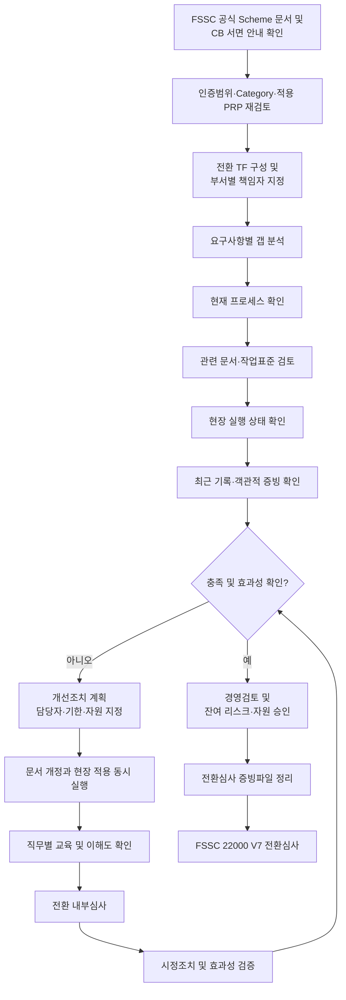
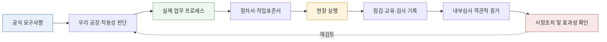

# [QA+ 블로그 생성 결과물] FSC001 FSSC22000 V7 전환준비
생성일시: 2026-09-03 07:23:19 (KST)
적용모델: gpt-5.6-terra

================================================================================
# 📋 FSSC 22000 V7 전환 원고 QA 검수 결과 및 발행 보류 권고

## 1. 사실관계 검수 결론

현재 원고는 전환 준비 방법론과 현장 실무 관점이 매우 충실합니다. 다만 **“FSSC 22000 V7”의 공식 발행 여부, 적용 시작일, 전환 마감일 및 세부 추가요구사항**은 제공된 원고·기획서만으로 검증할 수 없습니다.

따라서 공식 Scheme 문서 및 인증기관(CB) 서면 안내가 첨부되지 않은 상태에서 다음과 같은 표현을 확정적으로 발행하면 안 됩니다.

- `FSSC 22000 V7 전환준비`
- `V7 전환심사`
- `V6 인증조직의 전환 마감일`
- V7에 특정 요구사항이 신규 또는 강화됐다는 취지의 표현

원고 본문은 이를 상당 부분 조건부로 표현하고 있어 방향은 적절합니다. 그러나 **제목과 SEO 메타데이터에서 V7 전환이 이미 확정된 사실처럼 보이지 않도록 수정**해야 합니다.

---

## 2. 발행 전 반드시 확인할 공식 근거

아래 자료가 확보되면 V7 관련 표현을 최종 확정할 수 있습니다.

| 확인 항목 | 필수 근거 |
|---|---|
| Scheme Version 7 공식 발행 여부 | FSSC 22000 공식 홈페이지의 Scheme 문서 및 공지 |
| 공식 발행일 | Scheme Change History 또는 공식 Announcement |
| 인증심사 적용 개시일 | FSSC Transition Arrangement / Transition Plan |
| 기존 V6 인증조직 전환 마감일 | FSSC 공식 전환 규정 |
| 전환심사 가능 시점 및 심사 방식 | 계약 인증기관(CB)의 이메일 또는 공문 |
| 추가 심사시간·제출자료 | CB 심사계획서, 견적서 또는 공식 안내문 |
| 적용 Food Chain Category 및 PRP | 기존 인증서, FSSC Category 기준, CB 확인 |

> **편집 권고:** 공식 문서가 확인되기 전에는 제목을 “FSSC 22000 차기 Scheme 전환 준비” 또는 “FSSC 22000 Scheme 전환 준비”로 운영하는 것이 안전합니다.

---

## 3. 반드시 수정해야 할 핵심 표현

### 3-1. 제목 수정

**기존 제목**

> FSSC 22000 V7 전환준비, 문서부터 고치면 실패합니다: 품질팀이 먼저 해야 할 7가지

**공식 V7 전환 문서 미확보 시 권장 제목**

> FSSC 22000 Scheme 전환 준비, 문서부터 고치면 실패합니다: 품질팀이 먼저 해야 할 7가지

**V7 공식 발행·전환일이 확인된 경우 사용 가능 제목**

> FSSC 22000 V7 전환 준비, 문서부터 고치면 실패합니다: 품질팀이 먼저 해야 할 7가지

---

### 3-2. 알레르겐 세척 검증 표현 수정

원고 사례 1의 다음 표현은 기술적으로 보완하는 것이 좋습니다.

**기존 표현**

> 불가피하게 중간 생산할 경우에는 분해세척과 ATP 확인, 필요 시 알레르겐 단백질 검증을 실시하도록 기준을 정했습니다.

**권장 수정 표현**

> 불가피하게 중간 생산할 경우에는 분해세척과 육안·ATP 기반 위생 상태 확인을 실시하고, 알레르겐 교차접촉 관리가 필요한 경우에는 해당 알레르겐에 적합한 검증 방법과 허용기준을 사전에 검증해 적용하도록 기준을 정했습니다.

**수정 사유**

ATP 검사는 일반적인 유기물 잔류 또는 세척 상태 확인에 활용될 수 있으나, 특정 알레르겐 단백질의 부재를 직접 입증하는 시험으로 단정하기는 어렵습니다. 알레르겐 검증은 제품·공정·세척방법에 맞는 검증 방법을 별도로 정해야 합니다.

---

### 3-3. 현장 사례의 출처 성격 표시

현재 사례 1~3은 실제 기업명과 출처가 제시되지 않았고, 사례 3에는 “약 60% 낮아졌다”는 정량 성과가 포함되어 있습니다. 독자가 실제 사례로 오인하지 않도록 다음 문구를 사례 제목 전에 삽입하는 것을 권장합니다.

> **※ 아래 사례는 식품 제조현장에서 반복적으로 발생하는 점검 포인트를 바탕으로 재구성한 교육용 예시입니다. 실제 공장 데이터·고객사 정보와는 다를 수 있습니다.**

또는 실제 사례라면 다음을 준비해야 합니다.

- 기업 또는 프로젝트의 공개 허가
- 수치 산정 방식
- 비교기간
- 검체 수 및 시험 기준
- 개선활동과 결과의 인과관계 검증 근거

---

### 3-4. “가장 자주 지적되는 부분” 표현 완화

**기존 표현**

> 갭 분석표는 있지만 조치 완료 증빙이 없는 경우가 가장 흔합니다.

**권장 수정 표현**

> 전환 준비 과정에서 자주 발견되는 약점 중 하나는 갭 분석표는 있으나 조치 완료 증빙과 효과성 확인이 충분히 연결되지 않은 경우입니다.

“가장 흔하다”는 표현은 공식 부적합 통계 또는 인증기관 데이터가 없으면 단정하기 어렵습니다.

---

# 📋 [최종 발행용 블로그 패키지]

## 1. 메타 데이터 (SEO 설정)

### 공식 V7 전환 문서가 확인되지 않은 경우

- **최종 포스팅 제목**: FSSC 22000 Scheme 전환 준비, 문서부터 고치면 실패합니다: 품질팀이 먼저 해야 할 7가지
- **메타 디스크립션**: FSSC 22000 Scheme 전환은 문서 개정만으로 끝나지 않습니다. 공식 기준, 인증범위, 갭 분석, 현장 실행, 기록 증빙까지 연결하는 7단계 준비법을 정리했습니다.
- **추천 해시태그 (10개)**:  
  #FSSC22000 #식품품질관리 #식품안전 #식품안전경영시스템 #ISO22000 #HACCP #식품공장 #식품사기 #식품방어 #내부심사
- **카테고리**: FSSC 22000 가이드

### V7 공식 발행 및 전환 조건이 확인된 경우

- **최종 포스팅 제목**: FSSC 22000 V7 전환 준비, 문서부터 고치면 실패합니다: 품질팀이 먼저 해야 할 7가지
- **메타 디스크립션**: FSSC 22000 V7 전환은 매뉴얼 문구 수정이 아닙니다. 공식 요구사항 확인부터 인증범위, 갭 분석, 교육, 내부심사, 기록 증빙까지 실무 7단계를 안내합니다.
- **추천 해시태그 (10개)**:  
  #FSSC22000V7 #FSSC22000 #식품품질관리 #식품안전 #ISO22000 #HACCP #식품안전시스템 #식품사기 #알레르겐관리 #내부심사
- **카테고리**: FSSC 22000 가이드

---

## 2. 네이버 블로그 / 티스토리 복사용 최종 원고 적용 지침

원고의 전체 구조, 소제목, FAQ, 표, 체크리스트, Mermaid 차트 및 이미지 기획은 유지 가능합니다. 다만 아래 4개 편집을 반영한 뒤 발행해야 합니다.

1. 공식 문서 확인 전에는 본문의 모든 `V7` 표현을 `차기 Scheme` 또는 `최신 Scheme`으로 임시 변경합니다.  
2. 사례 1의 ATP·알레르겐 검증 문구를 위 권장 수정 문구로 교체합니다.  
3. 사례 1~3 앞에 “교육용 재구성 사례” 고지문을 추가합니다.  
4. FAQ 5번의 “가장 흔합니다”를 “자주 발견되는 약점 중 하나입니다”로 교체합니다.  

### 이미지 삽입 위치

- 1장 현장 핵심 공식 아래: `IMAGE_PLACEHOLDER_1`
- 4장 갭 분석 예시 표 아래: `IMAGE_PLACEHOLDER_2`

### Mermaid 차트 활용 주의

네이버 블로그 스마트에디터는 Mermaid 코드를 자동 렌더링하지 않는 경우가 많습니다. 따라서 다음 방식이 안정적입니다.

- **네이버 블로그**: Mermaid 차트를 PNG 또는 SVG로 변환하여 이미지 삽입
- **티스토리**: Mermaid 지원 스킨 또는 별도 Mermaid 스크립트 적용 시 코드 삽입
- **워드프레스**: Mermaid 플러그인 또는 Mermaid.js 지원 환경에서 코드 삽입

---

## 3. 워드프레스 / 웹사이트용 HTML 원고 적용 지침

원고를 HTML로 전환할 때는 이미지 태그의 `src` 값을 아래처럼 반드시 유지해야 합니다.

```html
<figure class="wp-block-image">
  
  <figcaption>문서 개정만이 아니라 현장 실행과 기록 증빙까지 연결해야 합니다.</figcaption>
</figure>
```

```html
<figure class="wp-block-image">
  
  <figcaption>갭 분석은 요구사항, 프로세스, 문서, 현장 실행, 객관적 증빙을 함께 확인하는 활동입니다.</figcaption>
</figure>
```

### 권장 HTML 상단 구조

```html
<article class="food-qa-post">
  <header>
    <h1>FSSC 22000 Scheme 전환 준비, 문서부터 고치면 실패합니다: 품질팀이 먼저 해야 할 7가지</h1>
    <p class="lead">
      FSSC 22000 Scheme 전환은 매뉴얼 문구를 바꾸는 업무가 아니라,
      공식 요구사항, 우리 공장 적용범위, 현장 실행, 기록 증빙을 연결하는 프로젝트입니다.
    </p>
  </header>

  <section class="editorial-note">
    <p>
      <strong>발행 전 확인:</strong>
      Scheme 버전, 적용일, 전환 마감일, 심사 방식은 반드시 FSSC 22000 공식 문서와
      계약 인증기관(CB)의 서면 안내를 기준으로 확정해야 합니다.
    </p>
  </section>

  <!-- 본문 전체 삽입 -->
</article>
```

---

## 최종 편집 판정

| 검수 항목 | 판정 | 비고 |
|---|---|---|
| 원고 구조 및 가독성 | 통과 | 도입부, 소제목, 표, FAQ, 체크리스트 구성이 우수함 |
| SEO 키워드 구성 | 통과 | FSSC 22000, 전환, 갭 분석, 내부심사 키워드 흐름이 자연스러움 |
| 플랫폼용 이미지 기획 | 통과 | 이미지 프롬프트 및 배치 위치가 명확함 |
| 법령·국내 기준 구분 | 통과 | FSSC와 국내 HACCP·식품 관련 법규가 다름을 적절히 안내함 |
| V7 공식 전환 사실 | 확인 필요 | 공식 Scheme 문서와 CB 서면 근거 확보 전 확정 발행 보류 권고 |
| 알레르겐 세척 검증 기술 표현 | 수정 필요 | ATP와 알레르겐 단백질 검증을 구분해야 함 |
| 실제 사례·정량성과 표현 | 수정 필요 | 교육용 재구성 사례 고지 또는 출처·근거 제시 필요 |

> **최종 권고:**  
> 공식 FSSC Scheme 문서의 버전·발행일·전환조건과 인증기관(CB) 안내문을 확보한 뒤, 위 4개 수정사항을 반영하면 발행 가능한 원고입니다.  
> 특히 V7 공식 전환 근거가 확인되기 전에는 제목과 메타데이터를 `FSSC 22000 Scheme 전환 준비`로 운영하는 것이 가장 안전합니다.
================================================================================

[부록: 1단계 리서치 원본]
# [리서치 리포트] FSC001 / FSSC 22000 V7 전환준비

> **사전 확인 사항**  
> - 입력된 `FSC001`은 일반적으로 사용되는 식품안전경영시스템 명칭인 **FSSC 22000**의 오기이거나, 회사 내부 문서·프로젝트 코드일 가능성이 있습니다. 본 리포트는 **FSSC 22000 전환 준비**를 기준으로 설계했습니다.  
> - FSSC 22000의 적용 버전, V7 공식 발행 여부, 전환 유예기간 및 심사 적용일은 반드시 **FSSC 공식 웹사이트의 최신 Scheme 문서 및 전환 가이드(Transition Plan)**, 그리고 계약 인증기관(CB)의 공지를 통해 확인해야 합니다.  
> - 전환 일정은 인증기관 또는 컨설팅사의 구두 안내만으로 확정하지 말고, 공식 문서의 **발행일·적용일·전환 마감일**을 근거로 관리해야 합니다.

---

### 1. 타겟 독자 및 검색 의도
- **주요 타겟**
  - FSSC 22000 인증을 유지 중인 식품·축산물·포장재 제조업체의 품질관리(QA), 품질보증(QC), HACCP 담당자
  - FSSC 22000 갱신심사 또는 사후심사를 앞둔 품질팀장·공장장
  - FSSC 22000 신규 인증 또는 ISO 22000/HACCP에서 FSSC 22000으로 확장을 검토하는 실무자
  - 본사 방침에 따라 “V7 전환 TF” 또는 “갭 분석(Gap Analysis)”을 맡은 담당자

- **독자의 핵심 고통(Pain Point)**
  - “FSSC 22000 V7이 실제로 언제부터 적용되는가? 우리 회사의 다음 심사는 어느 버전으로 받아야 하는가?”
  - “기존 V6 시스템을 전부 다시 만들어야 하는가, 변경된 요구사항만 보완하면 되는가?”
  - “인증기관이 요청한 전환계획서, 갭 분석표, 교육 기록은 어느 수준까지 준비해야 하는가?”
  - “문서 개정은 했는데 현장 실행과 증빙이 부족해 심사 부적합이 날까 걱정된다.”
  - “ISO 22000, PRP, FSSC 추가요구사항 중 무엇이 바뀌었는지, 어떤 문서와 기록에 영향이 있는지 판단하기 어렵다.”
  - “식품방어·식품사기·알레르겐·환경모니터링·품질문화 등 추가요구사항을 형식적으로 운영했다가 심사에서 지적받을까 우려된다.”

- **메인 키워드**
  - `FSSC 22000 V7 전환준비`

- **서브/연관 키워드**
  - `FSSC 22000 버전 전환`
  - `FSSC 22000 갭 분석`
  - `FSSC 22000 전환심사`
  - `FSSC 22000 추가요구사항`
  - `FSSC 22000 심사 준비 체크리스트`
  - `FSSC 22000 V6 V7 차이`

- **핵심 검색 의도 분류**
  1. **정보 탐색형**: V7 발행 및 적용 일정, V6와 V7의 차이 확인
  2. **실행 방법 탐색형**: 전환 TF 구성, 갭 분석, 문서 개정, 교육, 내부심사 실행법
  3. **문제 해결형**: 심사 직전 준비 부족, 현장 증빙 미비, 인증기관 요구 대응
  4. **검증형**: “우리 회사가 들은 전환 일정과 요구사항이 공식 기준과 일치하는가?” 확인

---

### 2. 필수 인용 법령 및 표준 기준

## 2-1. 가장 먼저 확인할 공식 문서

- **FSSC 22000 Scheme 공식 문서**
  - FSSC 22000 공식 홈페이지에서 제공하는 최신 **Scheme Version**, **Scheme Documents**, **Transition Arrangement/Transition Plan**을 최우선 근거로 사용합니다.
  - V7이 공식 발행되었다면, 블로그에서는 반드시 다음 4가지를 원문 기준으로 제시해야 합니다.
    1. 공식 발행일
    2. 인증심사 적용 개시일
    3. 기존 V6 인증 조직의 전환 마감일
    4. 전환심사 방식 및 인증서 발급 관련 조건
  - **주의:** 전환 마감일이나 필수 적용 시점은 추정하거나 이전 버전의 전환 사례를 그대로 적용하면 안 됩니다.

- **FSSC 22000 Scheme Version 6**
  - V7 공식 문서가 아직 확정·공개되지 않았거나, 해당 조직의 인증기관이 V6 적용을 유지하고 있다면 기준선(Baseline)은 **FSSC 22000 Scheme Version 6**입니다.
  - FSSC 인증은 단순히 ISO 22000만 충족하는 구조가 아니라 아래 요소를 함께 충족해야 합니다.
    1. **ISO 22000:2018** 식품안전경영시스템 요구사항
    2. 적용 업종별 **PRP(선행요건프로그램) 기술규격**
    3. **FSSC 22000 Additional Requirements(추가요구사항)**
    4. 인증 범주별 적용 요구사항

- **ISO 22000:2018, Food safety management systems — Requirements for any organization in the food chain**
  - 조직 상황 및 이해관계자 요구사항: 제4장
  - 리더십 및 식품안전방침: 제5장
  - 위험 및 기회 대응, 목표, 변경 계획: 제6장
  - 자원, 역량, 인식, 의사소통, 문서화된 정보: 제7장
  - 운영, PRP, 추적성, 비상대응, 위해요소 관리: 제8장
  - 모니터링·측정·분석·평가·내부심사·경영검토: 제9장
  - 부적합 및 시정조치, 지속적 개선: 제10장

- **ISO/TS 22002 시리즈 및 적용 PRP**
  - 제조업은 일반적으로 **ISO/TS 22002-1:2009 (Food manufacturing)** 적용 여부를 확인합니다.
  - 포장재 제조, 사료 제조, 운송·보관, 케이터링, 소매 등은 인증 범주에 따라 적용 PRP 문서가 달라질 수 있습니다.
  - 따라서 “우리 공장은 제조업이므로 ISO/TS 22002-1만 보면 된다”라고 단정하기보다, 인증서의 **FSSC Scope 및 Food Chain Category**를 기준으로 적용 문서를 확인해야 합니다.

- **ISO 19011:2018, Guidelines for auditing management systems**
  - 전환 준비 과정에서 실시하는 내부심사, 심사원 역량, 심사계획 수립, 객관적 증거 수집의 실무적 기준으로 활용할 수 있습니다.

- **ISO 22003-1:2022**
  - 식품안전경영시스템 인증심사 및 인증기관 운영과 관련된 국제표준입니다.
  - 조직 입장에서는 인증기관 심사일수, 심사 범위, 심사 방식 등을 임의로 정할 수 없다는 점을 이해하는 참고 근거가 됩니다.

---

## 2-2. 국내 법적 기준: FSSC와 HACCP 법정 의무를 혼동하지 않기

FSSC 22000은 국제 민간 인증 스킴이며, 국내 HACCP 의무·식품위생 법규를 대체하지 않습니다. 블로그에서는 “FSSC 인증 취득 = 국내 법규 완전 충족”으로 표현하면 안 됩니다.

- **「식품위생법」**
  - 식품 등의 위생적 취급, 영업자 준수사항, 식품 등의 기준·규격, 자가품질검사 등 식품 제조·가공업 운영의 기본 법적 근거입니다.
  - FSSC 전환 시에도 법정 위생관리, 표시, 자가품질검사, 회수 의무 등은 별도로 유지·검토해야 합니다.

- **「축산물 위생관리법」**
  - 축산물가공업 등 해당 업종의 경우 적용 법령과 HACCP 관련 의무사항을 별도로 확인해야 합니다.

- **「식품 및 축산물 안전관리인증기준」**
  - 국내 HACCP 운영 및 인증과 관련된 기준입니다.
  - FSSC 22000의 HACCP 기반 시스템과 공통 영역은 많지만, 인증체계·평가 기준·법적 효력은 다르므로 문서 체계와 심사 대응을 분리하여 설명해야 합니다.

- **「식품의 기준 및 규격(식품공전)」**
  - 제품 규격, 미생물 기준, 식품첨가물, 제조·가공 기준 등 제품 및 공정의 법정 기준을 확인하는 근거입니다.
  - FSSC 전환 과정에서 제품 규격서, 위해요소 분석, 검증계획을 개정할 때 식품공전 기준과의 정합성을 함께 점검해야 합니다.

- **「식품 등의 표시·광고에 관한 법률」 및 「식품 등의 표시기준」**
  - 제품 라벨링, 알레르겐 표시, 원재료명 및 소비자 정보와 연계됩니다.
  - FSSC의 제품 라벨링, 알레르겐 관리 요구사항과 함께 검토할 실무 법령입니다.

---

## 2-3. 전환 준비 시 반드시 점검할 현장 실무 팩트

- **팩트 1: “문서 개정”만으로 전환 준비가 끝나지 않는다.**
  - 심사에서는 개정된 매뉴얼보다 실제 운영 증거를 확인합니다.
  - 예: 개정된 알레르겐 관리절차서가 있다면, 실제 원료 입고·보관·생산순서·세척·검증·표시 검토 기록까지 연결되어야 합니다.

- **팩트 2: 전환의 출발점은 ‘조항별 갭 분석’이 아니라 ‘요구사항-프로세스-증빙’ 연결이다.**
  - 권장 관리 방식:
    - 신규·변경 요구사항
    - 현재 운영 프로세스
    - 현행 문서
    - 현장 실행 상태
    - 객관적 증빙 기록
    - 미흡사항
    - 조치 담당자
    - 완료 목표일
  - 이 구조로 관리해야 전환심사 직전에 “문서는 있는데 기록이 없다”는 문제가 줄어듭니다.

- **팩트 3: 인증 범위(Scope)와 식품사슬 범주(Category)를 먼저 확정해야 한다.**
  - 제품군, 공정, 외주공정, 창고, 물류, 포장재, 본사 기능 등이 인증 범위에 포함되는지에 따라 적용 PRP와 심사 범위가 달라질 수 있습니다.
  - 전환 준비 전 인증서, 계약서, 심사계획서의 범위부터 재확인해야 합니다.

- **팩트 4: FSSC 추가요구사항은 ‘별도 문서 한 장’으로 끝내기 어렵다.**
  - 식품방어(Food Defense), 식품사기 완화(Food Fraud Mitigation), 알레르겐 관리, 환경모니터링, 품질관리, 식품안전·품질문화 등은 구매·생산·품질·인사·경영진 활동에 걸쳐 운영됩니다.
  - 예를 들어 식품사기 평가는 구매팀의 공급업체 평가, 원료 위험도 평가, 시험성적서 검토, 변경관리와 연결되어야 합니다.

- **팩트 5: 내부심사는 인증심사 직전 ‘모의심사’가 아니라 전환 효과성 검증 절차다.**
  - 전환 대상 요구사항을 내부심사 체크리스트에 반영하고, 발견된 부적합은 시정조치 후 효과성까지 확인해야 합니다.
  - 내부심사에서 지적된 사항이 경영검토의 입력정보로 연결되어야 시스템 운영의 완결성이 생깁니다.

- **팩트 6: 교육은 참석자 서명만으로 충분하지 않다.**
  - 심사에서는 담당자가 바뀐 요구사항을 이해하고 현장에서 적용하는지를 확인할 수 있습니다.
  - 따라서 교육기록에는 교육 대상, 교육 내용, 강사, 평가 또는 이해도 확인, 필요 시 재교육 조치까지 남기는 것이 안전합니다.

- **팩트 7: 전환심사 일정은 인증기관과 서면으로 확인해야 한다.**
  - “다음 사후심사 때 같이 보면 된다”는 식의 비공식 판단은 위험합니다.
  - 인증기관이 안내한 적용 버전, 심사 유형, 추가 심사시간, 제출자료, 전환 완료기한을 이메일 또는 공식 안내문으로 확보해야 합니다.

---

### 3. 추천 블로그 목차 (Outline)

## H1 (제목 후보 3개)

1. **FSSC 22000 V7 전환준비, 문서부터 고치면 실패합니다: 품질팀이 먼저 해야 할 7가지**
2. **FSSC 22000 V7 전환심사 준비 가이드: 갭 분석부터 내부심사·경영검토까지**
3. **FSSC 22000 V6에서 V7로 전환할 때 심사관이 보는 핵심 증빙 체크리스트**

---

## H2 서론 (Intro): “V7 전환, 매뉴얼 개정부터 하면 왜 위험할까?”

- 현실적인 문제 제기
  - “인증기관에서 새 버전 전환을 준비하라고 하는데 무엇부터 해야 할지 모르겠다.”
  - “담당자는 절차서를 개정했지만, 생산현장과 구매팀은 변경 내용을 모른다.”
  - “심사 직전에 교육기록, 갭 분석표, 내부심사 기록을 급하게 만들게 될까 걱정된다.”

- 핵심 결론 먼저 제시
  - FSSC 전환의 핵심은 인증 매뉴얼을 새로 만드는 일이 아니라, **공식 변경 요구사항을 확인하고 현재 시스템과의 차이를 분석한 뒤, 현장 실행 증거까지 연결하는 일**이다.
  - 특히 V7 적용일과 전환기한은 FSSC 공식 문서 및 인증기관 공지로 확인해야 하며, 인터넷 검색 결과나 타사의 일정만으로 판단하면 안 된다.

- 도입부에 제시할 간단한 전환 공식
  - `공식 전환기준 확인 → 인증범위 확인 → 갭 분석 → 실행계획 → 문서·현장 반영 → 교육 → 내부심사 → 경영검토 → 전환심사`

---

## H2 본론 1: FSSC 22000 V7 전환 전, 공식 기준부터 정확히 확인하는 방법

### H3. FSSC 22000은 무엇으로 구성되는가?
- ISO 22000:2018
- 업종별 PRP 기술규격
- FSSC Additional Requirements
- 인증 범주별 적용 요구사항
- “ISO 22000 인증을 이미 보유했으니 FSSC 전환은 간단하다”는 오해 바로잡기

### H3. V7 전환 준비 전 확인해야 할 5개 공식 정보
1. FSSC 공식 Scheme 문서의 최신 버전
2. V7의 공식 발행일
3. 심사 적용 시작일
4. 기존 인증조직 전환 마감일
5. 인증기관의 심사 방식 및 제출 요구자료

### H3. 우리 회사에 적용되는 인증 범위부터 다시 확인하기
- 인증서의 Scope 확인
- 식품사슬 범주(Category) 확인
- 제품, 공정, 창고, 외주공정, 물류 범위 확인
- 본사 기능 및 중앙관리 기능 포함 여부 확인
- 인증범위와 실제 운영이 불일치할 때 발생하는 심사 리스크

### H3. V6 대비 V7 차이점은 어떻게 분석해야 하는가?
- 공식 전환표 또는 변경 이력(Change History)을 기준으로 비교
- “신규”, “강화”, “표현 변경”, “적용범위 변경”으로 구분
- 변경조항별로 문서 개정 필요 여부와 현장 실행 변경 필요 여부를 나누어 판단
- 블로그 내 주의 문구:
  - “V7의 구체적 변경사항은 반드시 발행된 공식 Scheme 문서 기준으로 최종 확인해야 합니다.”

---

## H2 본론 2: 20년 선배의 현장 실전 팁 — 전환 준비는 이렇게 진행하세요

### H3. 1단계: 전환 TF와 책임자를 정한다
- 총괄책임자: 식품안전팀장 또는 품질책임자
- 참여 부서: 품질, 생산, 구매, 물류, 설비, 인사, 연구개발, 영업 또는 고객대응
- 경영진 역할: 자원 승인, 우선순위 결정, 경영검토 참여
- 실무 팁:
  - 품질팀 혼자 문서를 만들면 실행이 안 된다.
  - 구매·생산·설비 담당자가 갭 분석 및 조치계획에 직접 참여해야 한다.

### H3. 2단계: 조항별 갭 분석표를 만든다
- 추천 열 구성
  | 구분 | 관리 내용 |
  |---|---|
  | 요구사항 번호 | 최신 FSSC 문서 기준 조항 |
  | 요구사항 요약 | 조직이 이해할 수 있는 표현 |
  | 현재 운영 수준 | 충족 / 부분 충족 / 미충족 |
  | 관련 문서 | 절차서, 지침서, 기준서 |
  | 현장 증빙 | 점검일지, 교육기록, 검증기록 등 |
  | 조치계획 | 보완 활동 |
  | 담당자·기한 | 책임 및 완료 예정일 |
  | 효과성 확인 | 내부심사 또는 검증 결과 |

- 실무 팁:
  - “충족” 판정은 문서가 있다는 뜻이 아니라, 최근 기록과 현장 인터뷰로 입증 가능한 상태를 의미한다.

### H3. 3단계: 영향이 큰 프로세스부터 우선순위를 정한다
- 우선 확인 권장 영역
  - 공급업체 승인 및 원료 구매관리
  - 식품사기 취약성 평가 및 완화계획
  - 식품방어 위협평가 및 출입통제
  - 알레르겐 관리 및 라벨 검토
  - 환경모니터링 및 위생검증
  - 이물·교차오염 방지
  - 설비 예방보전 및 파손관리
  - 회수·비상대응·추적성 모의훈련
  - 변경관리
  - 내부심사, 시정조치, 경영검토
  - 식품안전 및 품질문화 활동

### H3. 4단계: 문서 개정과 현장 적용을 동시에 진행한다
- 문서 개정 대상 예시
  - 식품안전매뉴얼
  - 위해요소 분석 관련 문서
  - PRP 운영절차서
  - 공급업체 평가절차서
  - 식품방어 및 식품사기 절차서
  - 알레르겐 관리절차서
  - 라벨 승인절차서
  - 변경관리절차서
  - 내부심사 및 시정조치 절차서
  - 교육훈련 절차서
  - 비상대응 및 회수 절차서

- 현장 적용 대상 예시
  - 출입구·CCTV·방문자 관리
  - 원료 보관구역 및 알레르겐 구획
  - 세척·교차오염 방지 확인
  - 금속검출기·X-ray 등 중요 관리장비 점검
  - 설비 파손 점검 및 임시보수 관리
  - 라벨 교체 및 초도품 확인
  - 생산 전·후 위생점검
  - 환경검체 채취 및 결과 경향분석

### H3. 5단계: 교육은 ‘전사 공지’와 ‘직무별 심화교육’으로 나눈다
- 전 직원 대상
  - 버전 전환 배경
  - 식품안전 및 품질문화
  - 기본 위생·이물·알레르겐·식품방어 인식
- 직무별 대상
  - 구매팀: 공급업체 관리, 식품사기, 원료 변경관리
  - 생산팀: 교차오염 방지, 공정기록, 이상 발생 보고
  - 품질팀: 검증, 내부심사, 부적합 시정조치
  - 설비팀: 예방보전, 파손·윤활유·이물 리스크 관리
  - 연구개발팀: 제품 개발, 라벨 검토, 변경관리
- 교육 효과성 확인 예시
  - 간단한 평가
  - 현장 인터뷰
  - 작업 관찰
  - 교육 후 오류·이탈 감소 여부 확인

### H3. 6단계: 전환 내부심사는 ‘증빙 중심’으로 실시한다
- 내부심사 질문 예시
  - 변경된 요구사항을 담당자는 알고 있는가?
  - 절차서와 실제 작업이 일치하는가?
  - 최근 3개월 또는 최근 운영기간의 기록이 존재하는가?
  - 이상 발생 시 보고·격리·원인분석·시정조치가 연결되는가?
  - 조치 후 재발 방지 효과를 확인했는가?

- 실무 팁
  - 내부심사 체크리스트를 조항 나열형으로 끝내지 말고, “무엇을 보고 어떤 증거를 확인할 것인가”까지 작성한다.

### H3. 7단계: 경영검토에서 전환 완료를 공식 의사결정한다
- 경영검토 입력사항 예시
  - 갭 분석 결과 및 잔여 리스크
  - 내부심사 결과
  - 부적합 및 시정조치 현황
  - 교육·역량 확보 현황
  - 인력, 예산, 시설 투자 필요사항
  - 고객 불만, 회수, 식품안전 사고 관련 정보
  - 전환심사 일정과 준비상태
- 심사 대응 포인트
  - 경영진이 전환 준비 상태와 필요한 자원을 알고 승인했다는 객관적 증거가 필요하다.

---

## H2 본론 3: 자주 묻는 질문(FAQ) 및 심사관 단골 지적 사항

### H3. FAQ 1. FSSC 22000 V7 전환은 갱신심사 때만 가능한가?
- 전환심사의 시기와 방식은 FSSC의 공식 전환규정 및 계약 인증기관의 안내에 따라 달라질 수 있습니다.
- 따라서 다음 심사 유형이 사후심사인지, 갱신심사인지와 무관하게 인증기관에 적용 버전과 전환 조건을 서면으로 확인해야 합니다.

### H3. FAQ 2. V6 문서를 전부 폐기하고 새로 만들어야 하나?
- 일반적으로 버전 전환은 전체 문서의 전면 재작성보다, 변경 요구사항에 대한 갭 분석 후 필요한 문서와 운영체계를 개정하는 방식이 효율적입니다.
- 다만 문서 체계가 ISO 22000, PRP, FSSC 추가요구사항을 제대로 반영하지 못하고 있다면 부분 개정만으로는 부족할 수 있습니다.

### H3. FAQ 3. 갭 분석은 컨설팅사가 해야 하나?
- 외부 전문가의 도움을 받을 수는 있지만, 실제 운영 책임은 인증 조직에 있습니다.
- 심사에서는 컨설팅 보고서 자체보다 조직이 요구사항을 이해하고 현장에 적용했는지를 봅니다.

### H3. FAQ 4. 전환 교육은 몇 시간 해야 하나?
- FSSC 요구사항 또는 인증기관이 별도의 시간을 명시한 경우를 제외하고, 단순히 “몇 시간 교육”을 채우는 것보다 직무별 필요 역량과 교육 효과성을 입증하는 것이 중요합니다.
- 최신 Scheme 및 인증기관 요구사항을 우선 확인해야 합니다.

### H3. FAQ 5. 전환심사에서 가장 많이 지적되는 부분은?
- 대표적인 단골 지적 사항
  1. 갭 분석표는 있으나 실제 조치 완료 증빙이 없음
  2. 개정 절차서와 현장 작업 방식이 다름
  3. 식품사기 평가가 매년 같은 내용으로 복사되어 있고 원료 변경·시장 이슈가 반영되지 않음
  4. 식품방어 평가가 출입통제 수준에만 머물고 위협요소별 대응계획이 부족함
  5. 알레르겐 라벨 검토와 생산·세척 관리가 연결되지 않음
  6. 환경모니터링 결과를 단순 보관만 하고 경향분석 및 개선조치가 없음
  7. 시정조치가 “재교육 실시”로만 끝나고 근본원인 분석과 효과성 검증이 부족함
  8. 내부심사가 모든 부서를 실제로 검증하지 못하고 체크리스트 서명으로 끝남
  9. 경영검토에 전환 리스크와 자원 필요사항이 반영되지 않음
  10. 인증범위와 실제 생산·보관·외주 운영 범위가 다름

### H3. 심사관이 좋아하는 증빙, 실제로는 이런 것이다
- 최신화된 법규 및 고객 요구사항 검토 기록
- 공급업체 평가와 식품사기 평가가 연결된 기록
- 원료·공정·설비·라벨 변경관리 기록
- 알레르겐 세척 검증 및 라벨 확인 기록
- 환경모니터링 결과의 추세 분석 자료
- 부적합 원인분석, 시정조치, 효과성 검증 자료
- 전환 요구사항을 포함한 내부심사 보고서
- 전환 준비 현황이 반영된 경영검토 회의록
- 부서별 교육 및 이해도 확인 기록

---

## H2 결론 (Outro): FSSC V7 전환의 마지막 체크포인트

- 전환 준비 핵심 요약
  1. **공식 FSSC 문서와 인증기관 공지로 적용 일정부터 확인한다.**
  2. **인증범위와 적용 PRP를 다시 점검한다.**
  3. **변경 요구사항별 갭 분석을 실시한다.**
  4. **문서, 현장 실행, 기록을 하나의 흐름으로 연결한다.**
  5. **품질팀 단독 업무가 아닌 전사 TF 활동으로 운영한다.**
  6. **전환 내부심사와 경영검토로 준비 상태를 검증한다.**
  7. **심사 직전 급조한 기록보다, 일정 기간 누적된 실행 증거를 만든다.**

- 마무리 멘트 방향
  - FSSC 전환은 인증서 버전만 바꾸는 업무가 아니라, 우리 공장의 식품안전 시스템이 실제 위험에 대응할 수 있는지를 다시 점검하는 기회입니다.
  - 처음부터 완벽하게 모든 문서를 바꾸려 하기보다, 공식 기준 확인 → 갭 분석 → 우선순위 조치 → 현장 정착의 순서로 차근차근 진행하면 전환심사 부담을 크게 줄일 수 있습니다.
  - 특히 일정과 세부 변경사항은 반드시 최신 FSSC 공식 Scheme 문서와 인증기관 안내를 기준으로 최종 판단해야 합니다.

[부록: 3단계 시각자료 기획 원본]
### 🎨 [시각자료 기획서]

#### 1. 대표 썸네일 (Thumbnail)
- **추천 헤드카피 문구**: 문서부터 고치면 실패합니다
- **서브카피 선택안**: FSSC 22000 V7 전환, 현장·기록까지 연결하는 법
- **권장 비율**: 16:9 가로형  
- **이미지 스타일**: Photorealistic documentary photography, real Korean food factory (QA+ 마스터 스타일)
- **기획 의도**: 단순한 문서 더미가 아니라, 실제 한국 식품공장의 생산현장·점검·기록 관리가 함께 작동하는 모습을 보여줍니다. 썸네일 문구는 이미지 생성 후 별도 편집으로 삽입하고, 생성 이미지 내부에는 글자를 넣지 않습니다.
- **AI 이미지 프롬프트 (DALL-E / Flux용)**:  
  `Static locked-off camera, photorealistic DSLR photo, documentary photography, wide horizontal shot inside a real Korean food manufacturing facility, stainless steel food production equipment occupying the center of the frame, realistic decade-of-service wear including subtle water marks and scratches, a QA supervisor in a light blue one-piece hooded cleanroom coverall and face mask standing to the side while reviewing a blank-looking clipboard with no readable writing, another masked worker in white hooded cleanroom coverall checking the production line in the background, faces fully obscured by masks, hoods, and camera angle, workers are secondary elements, glossy green epoxy-coated concrete floor, bright overhead LED and fluorescent lighting at 5000-5600K, beige and gray industrial wall finishes, softly blurred blue-and-white laminated A4 SOP notice board on a distant wall with all text unreadable, realistic Korean food factory atmosphere, clean but actively used facility, generous empty space in the upper left for later headline overlay, high detail, 4K quality, no illustration, no cartoon, no vector, no infographic style, no 3D render, no CGI, no game engine look, no readable text, no logos, no watermark, no glossy showroom, no brand-new factory, no futuristic laboratory, no dramatic shadows, no haze or fog, no fisheye, no dutch angle, no identifiable face, no logos, no watermark, no readable foreground text`

---

#### 2. 본문 이미지 1 (IMAGE_PLACEHOLDER_1 대체)
- **배치 위치**: `## 1. V7 전환, 매뉴얼 개정부터 하면 왜 위험할까요?`의 현장 핵심 공식 바로 아래
- **기획 의도**: “문서만 개정한 상태”와 “문서-현장-기록이 연결된 상태”의 차이를 실사 현장 사진 한 장 안에서 대비시킵니다. 일러스트형 인포그래픽 대신, 실제 공장 운영 상태가 어떻게 달라지는지를 보여주는 다큐멘터리식 비교 구도입니다.
- **한글 구도 해설**:  
  화면을 자연스럽게 좌우로 나눈 구도입니다. 왼쪽에는 사용감 있는 서류철과 미작성처럼 보이는 점검 클립보드가 작업대 위에 놓여 있고, 현장 설비는 배경에 흐릿하게 처리합니다. 오른쪽에는 장갑 낀 작업자가 실제 설비 점검을 수행하고, 옆 작업대에는 체크 표시나 문자가 읽히지 않는 기록지가 놓여 있습니다. “문서만 존재”하는 상황과 “현장 실행 및 기록”까지 이어진 상태를 글자 없이 시각적으로 비교합니다.
- **AI 이미지 프롬프트**:  
  `Static locked-off camera, photorealistic DSLR photo, documentary photography, medium-wide split-composition scene inside a real Korean food manufacturing facility, visual comparison without any written labels: on the left side, an aged gray clipboard and closed paper procedure binder resting unused on a stainless steel side table, all pages blank-looking or fully unreadable, slightly neglected but hygienic; on the right side, gloved hands of a worker actively inspecting a stainless steel processing machine and holding a blank-looking inspection clipboard, demonstrating real execution and record keeping, no face visible, worker wearing a light blue one-piece hooded cleanroom coverall and face mask, face fully obscured by hood, mask, and angle, stainless steel equipment with natural decade-of-service water marks and scratches dominates the center, glossy green epoxy-coated concrete floor, bright overhead LED and fluorescent lighting 5000-5600K, distant blurred blue-and-white laminated A4 SOP notice board with unreadable text, Korean food factory setting, practical and realistic operational atmosphere, high detail, 4K quality, no illustration, no cartoon, no vector, no infographic style, no 3D render, no CGI, no game engine look, no readable text, no numbers, no logos, no watermark, no glossy showroom, no brand-new factory, no futuristic laboratory, no dramatic shadows, no haze or fog, no fisheye, no dutch angle, no identifiable face, no logos, no watermark, no readable foreground text`

---

#### 3. 본문 이미지 2 (IMAGE_PLACEHOLDER_2 대체)
- **배치 위치**: `## 4. 갭 분석은 ‘조항-문서-현장-증빙’으로 만드세요`의 갭 분석 예시 표 아래
- **기획 의도**: 갭 분석이 단순 체크리스트가 아니라, 요구사항이 실제 업무 프로세스·문서·현장 점검·기록 검증으로 이어지는 관리 활동임을 보여줍니다.
- **한글 구도 해설**:  
  한국 식품공장 QA 회의 또는 현장 점검 장면입니다. 화면 중심에는 설비와 작업 공간이 있고, 화면 한쪽의 스테인리스 작업대 위에는 글자가 전혀 읽히지 않는 색상 탭 문서철, 빈 양식처럼 보이는 클립보드, 사진 없는 태블릿 화면이 놓입니다. 작업자는 장갑 낀 손으로 설비의 위생·상태를 확인합니다. 문서와 현장, 확인 기록이 연결되는 분위기를 실제 사진처럼 구성합니다.
- **AI 이미지 프롬프트**:  
  `Static locked-off camera, photorealistic DSLR photo, documentary photography, medium shot in a real Korean food factory showing a practical FSSC transition gap-analysis review in action, central focus on an actively used stainless steel processing line with realistic decade-of-service wear, subtle scratches and water marks, a QA worker in a pale pink one-piece hooded cleanroom coverall, face mask, and clean gloves examining a machine access panel and pointing toward a hygienic inspection point, face fully obscured by hood, mask, and side angle, a stainless steel table in the foreground holds organized blank-looking folders with simple non-text pictogram color tabs, an unreadable checklist clipboard, and a tablet with a deliberately blurred non-readable screen, no readable letters, numbers, brand names, or logos, another masked worker is softly out of focus in the background, workers remain secondary while equipment and the inspection scene dominate, glossy green epoxy-coated concrete floor, bright overhead LED and fluorescent lighting 5000-5600K, blurred blue-and-white laminated A4 SOP board on distant wall with all text unreadable, authentic Korean food manufacturing environment, high detail, 4K quality, no illustration, no cartoon, no vector, no infographic style, no 3D render, no CGI, no game engine look, no readable text, no logos, no watermark, no glossy showroom, no brand-new factory, no futuristic laboratory, no dramatic shadows, no haze or fog, no fisheye, no dutch angle, no identifiable face, no logos, no watermark, no readable foreground text`

---

#### 4. 본문 삽입용 Mermaid 프로세스 차트
- **권장 배치 위치**: 1장 현장 핵심 공식 아래 또는 5장 ‘7단계 실행법’ 도입부
- **활용 목적**: V7 전환을 문서 개정 업무가 아닌, 공식 기준 확인부터 전환심사까지 이어지는 전사 프로젝트 흐름으로 정리합니다.



#### 5. 보조 Mermaid 다이어그램: 갭 분석의 증빙 연결 구조
- **권장 배치 위치**: 4장 `[IMAGE_PLACEHOLDER_2]` 이미지 아래
- **활용 목적**: “절차서가 있다”는 사실만으로 충족 판정을 내리면 안 되며, 현장과 기록·효과성까지 연결해야 한다는 메시지를 보강합니다.


