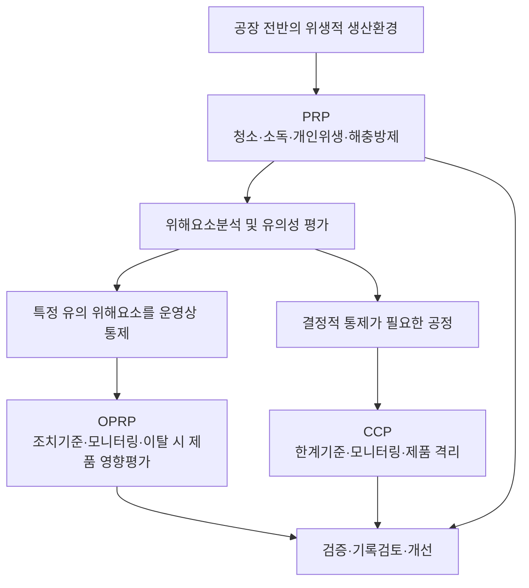
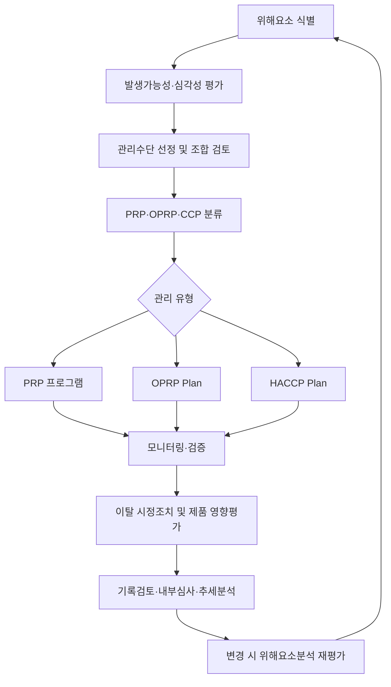
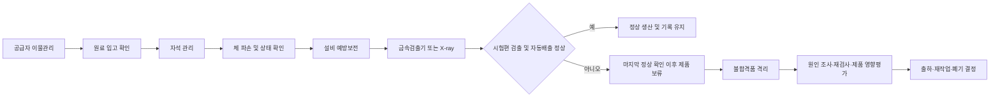

# [QA+ 블로그 생성 결과물] FSC002 PRP OPRP CCP 구분
생성일시: 2026-09-04 07:24:00 (KST)
적용모델: gpt-5.6-terra

================================================================================
# 📋 최종 발행용 블로그 패키지

### 1. 메타 데이터 (SEO 설정)

- **최종 포스팅 제목**: PRP·OPRP·CCP 차이 완벽 정리: FSSC 22000 심사에서 헷갈리지 않는 구분법
- **메타 디스크립션 (120자 내외 요약)**: PRP·OPRP·CCP 차이와 분류 기준을 FSSC 22000 관점에서 정리했습니다. 금속검출기, 알레르겐 세척, 가열공정 사례와 심사 체크리스트까지 확인하세요.
- **추천 해시태그 (10개)**:  
  #식품품질관리 #FSSC22000 #ISO22000 #HACCP #PRP #OPRP #CCP #식품안전 #식품제조업 #품질관리실무
- **카테고리**: 식품품질실무 / FSSC 22000 가이드

> **QA·사실관계 검수 반영 사항**
>
> - ISO 22000:2018의 PRP(3.9), CCP(3.11), OPRP(3.30) 용어 체계를 기준으로 표현을 정리했습니다.
> - OPRP는 단순히 “CCP보다 약한 관리”가 아니라, 유의한 식품안전 위해요소를 예방하거나 허용 가능한 수준으로 감소시키기 위해 선정되는 관리수단 또는 관리수단 조합이라는 점을 보완했습니다.
> - FSSC 22000 적용 시 식품제조업의 PRP 기술규격은 인증 범위와 적용 시점에 따라 확인해야 하므로, 심사 준비 시 적용 중인 FSSC 22000 Scheme 버전 및 해당 분야 PRP 요구사항을 함께 확인하는 문구를 반영했습니다.
> - CCP 모니터링은 “고빈도”가 아니라, 설정한 한계기준 이탈을 적시에 발견할 수 있도록 설계된 모니터링이라는 취지로 표현을 다듬었습니다.
> - 레토르트 공정의 시간·온도·압력 조건은 제품 및 설비별 검증자료에 따라 결정해야 하므로, 압력을 일률적 CCP 한계기준으로 단정하지 않도록 정리했습니다.

---

## 2. 네이버 블로그 / 티스토리 복사용 최종 원고 (Markdown)

# PRP·OPRP·CCP 차이, FSSC 22000 심사에서 헷갈리지 않게 구분하는 법

> **20년 실무 선배의 한 줄 요약**: PRP·OPRP·CCP는 중요도 순위가 아닙니다. **우리 공정의 특정 위해요소를 어떤 관리수단으로, 어느 수준까지, 이탈 시 어떻게 통제하는지**를 기준으로 분류하시면 됩니다.

---

## 1. “금속검출기는 무조건 CCP 아닌가요?” 현장에서 혼란이 시작되는 지점

FSSC 22000 전환을 시작하면 가장 많이 받는 질문이 있습니다. “금속검출기는 무조건 CCP 아닌가요?”, “알레르겐 세척은 청소니까 PRP 아닌가요?”, “OPRP는 CCP보다 약한 관리 아닌가요?” 같은 질문입니다. 결론부터 말씀드리면, **관리활동의 이름만 보고 PRP·OPRP·CCP를 정하면 거의 반드시 문서와 현장이 꼬입니다.**

예를 들어 금속검출기는 어떤 공장에서는 CCP가 될 수 있고, 다른 공장에서는 OPRP가 될 수 있습니다. 최종 포장 직전에 설치되어 있고, 검출 불량품이 자동으로 확실하게 배제되며, 그 이후에 이물을 제거하거나 검출할 방법이 전혀 없다면 CCP 판단 가능성이 높습니다. 반대로 자석, 체, 설비 예방보전, X-ray 등 여러 관리수단이 함께 작동하고 있다면 금속검출기를 OPRP로 분류할 여지도 있습니다.

PRP도 절대 “덜 중요한 관리”가 아닙니다. 청소·소독, 작업자 손 세척, 해충방제, 시설 보수, 폐기물 관리 같은 PRP가 무너지면 가열 CCP 하나를 잘 관리해도 식품안전 시스템 전체가 흔들립니다. 쉽게 말하면 PRP는 공장 바닥과 기초공사이고, OPRP와 CCP는 그 위에 세우는 안전장치입니다.

특히 국내 HACCP만 운영하다가 ISO 22000 또는 FSSC 22000으로 전환하는 현장에서는 OPRP가 낯설게 느껴집니다. 국내 HACCP의 일반위생관리 항목을 전부 PRP로, 중요관리점을 전부 CCP로 옮겨 적는 방식은 위험합니다. **위해요소분석을 다시 수행하고, 각 관리수단이 특정 유의 위해요소와 어떻게 연결되는지부터 확인해야 합니다.**


이제 용어를 정확히 잡아야 실무 판단도 흔들리지 않습니다. 정의를 외우는 데서 멈추지 말고, “우리 공정에서는 이 관리수단이 무슨 위해를 막고 있는가”까지 연결해서 보시면 됩니다.

---

## 2. PRP·OPRP·CCP 정의: 이름보다 역할을 이해해야 합니다

ISO 22000:2018 제3항은 PRP, OPRP, CCP를 각각 정의하고 있습니다. 실무에서 중요한 것은 정의 문장을 그대로 암기하는 것이 아니라, 그 정의가 요구하는 관리 방식의 차이를 이해하는 것입니다. 이 차이를 알아야 위해요소분석표, OPRP Plan, HACCP Plan, 작업표준서가 한 방향으로 움직입니다.

**PRP(Prerequisite Programme, 선행요건프로그램)**는 ISO 22000:2018 제3.9항에서 식품안전에 필요한 위생적 환경을 유지하기 위한 기본 조건과 활동으로 설명합니다. 쉽게 말하면, 식품을 안전하게 만들 수 있는 공장 환경을 평소에 유지하는 기본 운영관리입니다. 청소·소독, 개인위생, 해충방제, 용수관리, 시설관리, 폐기물관리, 교차오염 방지 등이 대표적입니다.

**OPRP(Operational Prerequisite Programme, 운영선행요건프로그램)**는 ISO 22000:2018 제3.30항에서 위해요소분석을 통해 유의한 식품안전 위해요소를 예방하거나 허용 가능한 수준으로 감소시키기 위해 필수적이라고 결정된 관리수단 또는 관리수단 조합으로 정의합니다. OPRP는 조치기준과 관찰 또는 측정을 통해 효과적으로 관리되어야 합니다. 쉽게 말하면, 일반 위생관리보다 한 단계 더 구체적으로 특정 위해요소를 통제해야 하는 운영관리입니다. OPRP에는 반드시 관리 대상 위해요소, 조치기준(Action criteria), 모니터링 방법, 이탈 시 조치, 제품평가 방법이 연결되어야 합니다.

**CCP(Critical Control Point, 중요관리점)**는 ISO 22000:2018 제3.11항에서 유의한 식품안전 위해요소를 예방·제거하거나 허용 가능한 수준으로 감소시키기 위해 관리조치를 적용하는 단계로 정의합니다. 쉽게 말하면, 이 단계가 무너지면 안전하지 않을 수 있는 제품이 만들어지거나 출하될 위험이 직접 생기는 결정적 통제점입니다. 대표적으로 병원성 미생물을 저감하는 가열·살균 공정이 CCP가 되는 경우가 많습니다.

아래 표를 팀원 교육자료로 활용하셔도 좋습니다. 다만 표의 예시는 절대 공식이 아니며, 반드시 각 공장의 위해요소분석 결과로 최종 확정해야 합니다.

| 구분 | PRP | OPRP | CCP |
|---|---|---|---|
| 핵심 목적 | 위생적 생산환경 유지 | 유의한 위해요소의 운영상 통제 | 유의한 위해요소의 결정적 통제 |
| 위해요소 연결 | 특정 위해요소와 1:1 연결이 아닐 수 있음 | 특정 위해요소와 직접 연결 | 특정 유의 위해요소와 직접·결정적으로 연결 |
| 기준 성격 | 절차, 주기, 점검기준 | 조치기준(Action criteria) | 한계기준(Critical limits) |
| 모니터링 | 계획된 점검·확인 | 계획적 관찰·측정 | 한계기준 이탈을 적시에 발견할 수 있는 모니터링 |
| 이탈 시 | 위생시스템 보완 및 영향평가 | 공정 조정, 원인확인, 제품 영향평가 | 즉시 통제, 제품 격리, 부적합 처리 |
| 예시 | 청소·소독, 해충방제, 손 세척 | 알레르겐 전환 세척, 고위험 원료 입고온도 | 가열·살균, 최종 이물 차단 단계 |

여기서 꼭 기억할 한 가지가 있습니다. **OPRP는 CCP가 아닌 나머지를 모아 둔 분류가 아닙니다.** 위해요소분석 결과 유의한 위해요소를 통제하기 위해 반드시 운영되어야 하는 관리수단이라는 점이 핵심입니다.



---

## 3. ISO 22000·FSSC 22000에서 심사원이 보는 연결 구조

FSSC 22000은 단순히 ISO 22000 인증서에 PRP 항목을 더한 구조가 아닙니다. 일반적으로 ISO 22000:2018, 인증 범위에 적용되는 PRP 기술규격, FSSC 22000 Additional Requirements가 결합된 식품안전경영시스템입니다. 식품제조업은 적용 중인 FSSC 22000 Scheme 버전과 인증 범위에 따라 요구되는 PRP 기술규격을 확인해야 합니다.

심사원은 “금속검출기를 CCP로 했습니까, OPRP로 했습니까?”라는 결과만 보지 않습니다. 더 중요한 질문은 “왜 그렇게 분류했습니까?”, “위해요소분석표의 유의성 평가와 어떻게 연결됩니까?”, “기준 이탈 시 실제 제품을 어떻게 처리합니까?”입니다. 즉, 분류의 정답보다 **분류 근거와 실행 증거**가 더 중요합니다.

ISO 22000:2018 제8.5항은 이 연결을 실무적으로 요구합니다. 제8.5.2에서는 위해요소 식별과 평가를, 제8.5.4.2에서는 관리수단 조합의 선정 및 분류를, 제8.5.4.3에서는 관리수단의 타당성 확인(Validation)을, 제8.5.4.4에서는 위해요소관리계획 수립을 다룹니다. 이 조항들을 순서대로 따라가면 문서의 뼈대가 자연스럽게 잡힙니다.

> **심사 대응 핵심**
>
> 위해요소 식별 → 유의성 평가 → 관리수단 선정 → PRP/OPRP/CCP 분류 → OPRP Plan 또는 HACCP Plan 반영 → 모니터링·시정·검증 → 개선
>
> 이 흐름이 끊기지 않아야 합니다.

FSSC 심사에서 자주 나오는 부적합은 양식 자체의 부족보다 연결성 부족입니다. 위해요소분석표에는 “알레르겐 교차접촉”을 유의하다고 적어 놓았는데, OPRP Plan에는 알레르겐 관리가 빠져 있는 경우가 있습니다. 또는 HACCP Plan에 금속검출 CCP를 넣어 놓고, 현장 작업자는 시험편 점검 주기나 불합격품 격리 방법을 설명하지 못하는 경우도 많습니다.

그렇다면 실제 분류는 어떤 순서로 해야 할까요? 다음 섹션의 위해요소분석 절차대로 가시면 “누가 봐도 납득할 수 있는 근거”를 만들 수 있습니다.



---

## 4. PRP·OPRP·CCP 구분의 출발점: 위해요소분석 5단계

첫 번째 단계는 위해요소를 충분히 식별하는 것입니다. 생물학적 위해요소만 보면 안 됩니다. 병원성 미생물, 바이러스, 곰팡이독소 같은 생물학적 위해요소와 세척제 잔류, 알레르겐, 농약, 윤활유 같은 화학적 위해요소, 금속·유리·플라스틱·돌 같은 물리적 위해요소를 원료부터 출하까지 살펴야 합니다.

두 번째는 유의성 평가입니다. 보통 발생 가능성(Likelihood)과 심각성(Severity)을 점수화하지만, 숫자만 있다고 충분하지는 않습니다. 과거 클레임, 리콜 가능성, 법적 기준, 고객 요구사항, 소비자 특성, 제품의 섭취방법, 냉장·냉동 유통 여부를 함께 고려해야 합니다. 예를 들어 바로 섭취하는 샐러드와 충분히 가열 후 섭취하는 냉동만두는 동일한 미생물 위해요소라도 평가 결과가 달라질 수 있습니다.

세 번째는 관리수단을 하나가 아니라 **조합으로 선정**하는 것입니다. 금속 이물 위해를 예로 들면 공급자 이물관리, 설비 예방보전, 체, 자석, 금속검출기, X-ray, 작업자 육안선별이 함께 작동할 수 있습니다. 이 중 어느 하나만 떼어 “이게 CCP다”라고 보기보다, 전체 통제망에서 해당 관리수단이 맡는 역할을 봐야 합니다.

네 번째는 선정한 관리수단을 PRP, OPRP, CCP로 분류하는 일입니다. ISO 22000은 고정된 결정도(Decision tree) 하나만을 강제하지 않습니다. 대신 해당 관리수단의 영향력, 실패 가능성, 실패 결과의 심각성, 후속 통제수단 유무, 즉시 모니터링 가능성, 측정 가능한 한계기준 설정 가능성 등을 고려하도록 요구합니다.

다섯 번째는 분류 결과를 계획서와 현장 표준에 반영하는 것입니다. OPRP로 결정했다면 OPRP Plan에 조치기준과 제품 영향평가 절차가 있어야 합니다. CCP라면 한계기준, 신속한 모니터링, 즉각적인 격리와 처분 절차가 HACCP Plan에 명확해야 합니다. 분류표만 만들고 실행 문서가 없으면 심사에서는 “분류는 했지만 관리가 안 된다”고 판단할 수 있습니다.

아래의 6개 질문은 위해요소분석 회의 때 그대로 사용해 보세요. 팀장, 생산, 공무, 품질 담당자가 같은 기준으로 토론하는 데 상당히 도움이 됩니다.

| 판단 질문 | “예”일 때 검토 방향 |
|---|---|
| 특정 유의 식품안전 위해요소를 직접 통제하는가? | OPRP 또는 CCP 가능성 검토 |
| 이 관리수단이 실패하면 허용수준 초과 가능성이 큰가? | OPRP 또는 CCP 가능성 상승 |
| 후속 공정에서 해당 위해를 제거·저감할 수 있는가? | 있다면 CCP보다는 OPRP 가능성 검토 |
| 시간·온도·검출감도 등 측정 가능한 한계기준이 있는가? | CCP 가능성 검토 |
| 이탈을 즉시 발견하고 해당 제품을 격리할 수 있는가? | CCP 운영 가능성 검토 |
| 시설 전반의 위생환경 유지를 위한 일반 관리인가? | PRP 가능성 검토 |

---

## 5. OPRP의 조치기준과 CCP 한계기준, 여기서 가장 많이 틀립니다

OPRP와 CCP 모두 기준을 정하고 모니터링한다는 점 때문에 현장에서 혼동이 많습니다. 하지만 기준의 성격이 다릅니다. OPRP는 **조치기준(Action criteria)**, CCP는 **한계기준(Critical limits)**이라는 용어를 구분해서 사용해야 합니다.

조치기준은 관리가 계획대로 작동하지 않을 가능성을 알려주는 운영상 기준입니다. 기준을 벗어났다고 해서 무조건 제품이 안전하지 않다고 단정할 수는 없지만, 원인 확인과 공정 조정, 필요 시 제품 영향평가가 즉시 필요합니다. 예를 들어 냉장 원료 입고온도가 내부 조치기준을 초과했다면 해당 원료를 보류하고 운송시간, 실제 중심온도, 포장 상태, 미생물 위해 가능성을 평가해야 합니다.

반면 한계기준은 허용 가능한 제품과 허용할 수 없는 제품을 가르는 결정적 기준입니다. 대표적인 예가 가열공정의 시간과 온도입니다. 설정된 살균온도나 유지시간이 미달되면 해당 시간대의 제품은 안전성이 확보되지 않았을 가능성이 있으므로, 원칙적으로 즉시 생산을 통제하고 영향 제품을 식별·격리해야 합니다.

“이상 시 적절히 조치한다”는 문구는 OPRP와 CCP 어느 곳에서도 좋은 문장이 아닙니다. 누가, 언제, 무엇을, 어떤 기준으로 처리할지가 없기 때문입니다. 심사원도 이 표현을 보면 실제 이탈이 발생했을 때 제품이 통제될 수 있는지 의심하게 됩니다.

아래처럼 작성하면 현장에서 훨씬 실행하기 편합니다.

| 구분 | 좋지 않은 표현 | 개선된 표현 예시 |
|---|---|---|
| OPRP 입고온도 | 온도 이상 시 확인한다 | 원료 표면온도가 내부 조치기준 초과 시 ‘입고보류’ 표지를 부착하고, 품질팀이 운송기록·중심온도·원료 특성을 평가하여 반송, 조건부 사용 또는 폐기를 결정한다 |
| OPRP 알레르겐 세척 | 세척 불량 시 재세척한다 | 알레르겐 스왑 결과가 내부 기준 초과 시 재세척 후 재검증하며, 전환 후 생산품은 결과 확인 전까지 출하보류한다 |
| CCP 가열 | 온도 미달 시 조치한다 | 한계기준 미달 발생 시 즉시 생산을 중지하고, 직전 정상 확인시점부터 정상 복구 확인시점까지의 제품을 격리한다. 재가열 가능 여부는 검증된 절차에 따라 품질책임자가 결정한다 |

여기서 하나 더 짚고 가겠습니다. **OPRP 이탈이라고 제품평가를 생략하면 안 됩니다.** OPRP도 유의한 위해요소 통제를 위해 선정된 관리수단이기 때문입니다. 이탈 범위, 제품 상태, 후속 관리수단, 위해요소의 특성을 근거로 제품 영향을 평가해야 합니다.

---

## 6. 사례 1. 냉동만두 제조공장 금속검출기를 OPRP로 재분류한 사례

한 냉동만두 제조공장은 완제품 금속검출기를 오랫동안 CCP로 운영하고 있었습니다. 생산팀은 2시간마다 철·비철·스테인리스 시험편을 통과시켜 감도를 확인했고, 기록도 빠짐없이 작성했습니다. 그런데 내부심사에서 “금속검출기가 정말 유일하고 결정적인 통제수단인가?”라는 질문이 나왔습니다. 공정을 다시 살펴보니 원료 입고 단계의 공급자 이물관리, 배합 전 자석, 원료 체, 성형설비 예방보전, 포장 전 금속검출까지 여러 관리수단이 존재했습니다.

문제는 기존 위해요소분석표가 “금속 이물 발생 가능”이라고만 작성되어 있고, 각 관리수단이 어떤 역할을 하는지 전혀 설명하지 못했다는 점이었습니다. 또한 금속검출기에서 불합격품이 발생했을 때 자동배출품을 별도 잠금 용기에 보관하지 않아, 재투입 여부와 재검사 이력이 명확하지 않았습니다. 즉, CCP라는 이름은 붙어 있었지만 실제 이탈품 통제는 오히려 약했습니다. 근본 원인은 국내 HACCP 문서의 CCP 항목을 FSSC 문서에 그대로 옮기면서, 관리수단 조합에 대한 재평가를 하지 않은 것이었습니다.

개선조치로 팀은 금속 이물 위해요소를 다시 평가했습니다. 자석의 청소·점검, 체 파손 여부 확인, 설비 볼트 이탈 예방점검, 금속검출기 성능확인을 하나의 통제 조합으로 정리했습니다. 최종 금속검출기는 유의한 위해요소를 통제하는 핵심 수단이지만 복수 통제망 중 하나이며, 제품 특성상 후속 X-ray 검사도 존재한다는 점을 근거로 OPRP로 분류했습니다.

OPRP Plan에는 철 2.0 mm, 비철 2.5 mm, 스테인리스 3.0 mm 시험편 기준을 예시로 설정하고, 생산 시작 전·2시간마다·품목 전환 시·종료 시 성능점검을 하도록 했습니다. 시험편 불검출 또는 자동배출 불량이 발생하면 마지막 정상 확인시점 이후 생산품을 보류하고, 재검사 및 품질평가를 거치도록 절차를 바꿨습니다. 이후 심사에서는 “왜 OPRP인지”를 설명할 수 있었고, 무엇보다 불합격품 추적성과 재검사 기록이 개선되어 현장 관리 수준이 실제로 높아졌습니다.

이 사례의 포인트는 금속검출기를 반드시 OPRP로 하라는 뜻이 아닙니다. **최종 유일 차단 단계인지, 후속 통제가 있는지, 검출과 배제 체계가 얼마나 결정적인지**를 근거로 판단해야 한다는 뜻입니다.




---

## 7. 사례 2. 소스류 공장 알레르겐 전환세척을 OPRP로 관리한 사례

마요네즈 베이스와 난류 미사용 드레싱을 함께 생산하는 소스류 제조공장이 있었습니다. 이 공장은 처음에 알레르겐 관리를 모두 PRP의 청소·소독 항목 안에서 관리했습니다. 작업 종료 후 세척을 하고, 작업자가 육안으로 설비 내부를 확인한 뒤 “세척 완료”라고 점검표에 서명하는 방식이었습니다. 하지만 난류 원료가 들어간 제품 생산 후 난류 미사용 제품으로 전환되는 날에는 단순 육안확인만으로 교차접촉 위험을 설명하기 어려웠습니다.

문제는 고객사 정기심사에서 발생했습니다. 심사원이 “난류 미표시 제품으로 전환할 때, 세척 효과가 충분하다는 것을 어떻게 입증합니까?”라고 질문했는데 품질팀은 청소일지만 제시했습니다. 더 큰 문제는 세척 불량이 확인됐을 때 이미 생산된 다음 제품을 어떻게 보류하고 평가할지 기준이 없었다는 점입니다. 근본 원인은 알레르겐을 일반 위생문제로만 보고, 특정 제품의 표시 오류 및 교차접촉 위해와 직접 연결하지 않은 데 있었습니다.

개선 과정에서 공장은 알레르겐 원료 보관구획, 전용 용기 색상구분, 생산순서 관리 같은 기본 활동은 PRP로 유지했습니다. 대신 난류 함유 제품에서 난류 미사용 제품으로 전환하는 세척, 알레르겐 신속검사, 라벨 및 포장재 대조는 특정 위해요소를 직접 통제하는 OPRP로 설정했습니다. OPRP 조치기준은 단순히 “음성”이라고 쓰지 않고, 사용 중인 검사키트의 검출한계와 내부 검증 결과를 근거로 정했습니다.

세척 후 스왑 결과가 기준을 벗어나면 재세척과 재검증을 실시하도록 했고, 기준 충족 전까지 다음 제품을 생산하지 못하도록 생산표준서를 수정했습니다. 이미 생산된 제품이 있다면 생산 시작시점, 설비 세척상태, 검사결과, 라벨 표시사항을 근거로 품질팀이 출하보류·재작업·폐기 여부를 판단하게 했습니다. 이후에는 알레르겐 사고 가능성이 높은 전환공정이 명확히 관리되었고, 고객 심사에서도 PRP와 OPRP의 역할이 구분되어 있다는 좋은 평가를 받았습니다.

알레르겐은 가열한다고 사라지는 위해요소가 아닙니다. 그래서 “가열공정이 있으니 괜찮다”는 접근은 통하지 않습니다. 제품·원료·생산순서에 따라 알레르겐 전환세척과 라벨 검증이 OPRP가 될 수 있다는 점을 꼭 기억해 두세요.

---

## 8. 사례 3. 레토르트 소스 공장 가열공정을 CCP로 바로잡은 사례

레토르트 카레소스를 생산하는 한 공장은 살균기를 운영하면서도 가열공정을 OPRP로 분류하고 있었습니다. 이유는 “설비가 자동제어되고 온도기록도 남으니 OPRP로 충분하다”는 판단이었습니다. 하지만 레토르트 제품은 밀봉 후 상온 유통되는 특성이 있어, 상업적 무균성 확보 실패가 소비자 안전에 직접적인 영향을 줄 수 있습니다. 이 제품에서 열처리는 단순한 운영관리보다 훨씬 결정적인 통제 단계였습니다.

현장 조사 결과, 살균기 표시온도는 기록되고 있었지만 실제 제품의 냉점(Cold spot) 기준이 충분히 검증되어 있지 않았습니다. 또한 온도계 교정은 연 1회 실시했지만, 교정 결과와 살균 한계기준의 관계를 검토한 기록이 없었습니다. 살균온도 일시 저하가 발생했을 때도 작업자는 설비를 재가동했을 뿐, 직전 정상시점부터 복구시점까지의 제품을 별도로 격리하지 않았습니다. 근본 원인은 자동기록이 있다는 사실과 식품안전 통제가 검증됐다는 사실을 혼동한 것이었습니다.

개선조치로 공장은 제품 규격, 충전량, 점도, 용기 크기, 냉점 시험결과를 바탕으로 시간·온도 조건을 재검증했습니다. 이 조건은 내부 임의 기준이 아니라 제품별 열침투 시험, 외부 전문기관 검토자료, 설비 조건을 근거로 설정했습니다. 압력은 설비 및 공정 특성에 따라 관리가 필요할 수 있으나, CCP 한계기준 여부는 제품별 검증 결과에 따라 결정해야 합니다. 이후 가열공정은 병원성 미생물 및 부패미생물 위해를 결정적으로 통제하는 CCP로 재분류했습니다.

HACCP Plan에는 살균온도와 유지시간을 한계기준으로 명시하고, 자동기록의 연속 모니터링과 작업자의 배치별 확인을 병행했습니다. 한계기준 미달이 발생하면 즉시 생산을 중지하고, 마지막 정상기록부터 정상 복구까지의 모든 해당 로트를 격리하도록 했습니다. 재살균 가능 여부는 검증된 재처리 절차와 관련 법규·고객 요구사항이 허용하는 경우에만 검토하고, 그렇지 않으면 폐기 또는 다른 용도 전환 여부를 품질책임자가 결정하게 했습니다.

개선 후 가장 달라진 점은 기록지가 깔끔해진 것이 아니라, 이탈이 발생했을 때 제품을 놓치지 않는 체계가 생긴 것입니다. CCP는 “중요하니까 붙이는 이름표”가 아니라, **한계기준 이탈 시 안전성 미확보 가능성이 있는 제품을 즉시 잡아내는 결정적 통제점**이라는 점을 현장 전체가 이해하게 됐습니다.

---

## 9. 문서와 현장이 따로 놀지 않게 만드는 실전 운영법

첫째, CCP를 많이 잡는다고 식품안전 수준이 자동으로 높아지지 않습니다. CCP가 7개, 8개로 늘어나면 현장 작업자는 모든 항목을 중요하게 느끼지 못하고 기록이 형식화될 가능성이 큽니다. 정말 결정적인 통제 단계만 CCP로 남기고, 나머지 유의 위해요소는 OPRP와 PRP로 촘촘하게 관리하는 편이 훨씬 실효적입니다.

둘째, PRP는 청소점검표 한 장이 아닙니다. 청소·소독 프로그램이라면 청소 대상, 세제·소독제 종류와 농도, 접촉시간, 작업책임자, 확인방법, 이탈 시 조치, 검증방법까지 있어야 합니다. 육안점검만으로 충분한지, ATP 측정이 필요한지, 미생물검사가 필요한지, 알레르겐 스왑 검사가 필요한지는 제품과 위해요소 특성에 따라 정해야 합니다.

셋째, Validation과 Verification을 구분해야 합니다. **Validation(타당성 확인)**은 “우리가 설정한 기준과 관리수단이 실제로 위해요소를 통제할 수 있는가?”를 사전에 입증하는 활동입니다. 반면 **Verification(검증)**은 “우리가 계획한 대로 지금도 계속 운영되고 있는가?”를 확인하는 활동입니다. 쉽게 말하면 Validation은 시험공부 전에 교재가 맞는지 확인하는 것이고, Verification은 시험공부를 실제로 매일 했는지 확인하는 것입니다.

넷째, 기준의 근거를 파일로 묶어 두세요. 가열조건은 열침투 시험, 공인 연구자료, 법적 기준, 제품 특성 자료로 근거화하고, 금속검출 감도는 고객 요구사항·설비 성능·위해평가 결과와 연결하십시오. “예전부터 이렇게 해왔습니다”는 심사에서 근거가 되기 어렵습니다.

다섯째, 이탈 기록은 불리한 자료가 아닙니다. 오히려 이탈이 발생했을 때 제품을 격리하고, 원인을 분석하고, 재발방지 조치를 한 기록은 시스템이 실제로 살아 있다는 증거입니다. 이탈이 매년 한 번도 없고 모든 기록이 똑같은 시간과 글씨체로 작성되어 있다면, 심사원은 오히려 현장 운영의 진정성을 의심할 수 있습니다.

---

## 10. FSSC 22000 심사 전, PRP·OPRP·CCP 단계별 체크리스트

심사 직전에 서류만 정리하지 마시고, 아래 표를 가지고 생산현장과 문서를 함께 대조해 보세요. 특히 위해요소분석표, OPRP Plan, HACCP Plan, 작업표준서, 실제 기록의 문구가 같은지 확인하는 것이 중요합니다.

| 점검 단계 | 확인 항목 | 실무 확인 방법 | 권장 주기 |
|---|---|---|---|
| 위해요소 식별 | 원료·공정·환경·작업자·알레르겐 위해요소가 반영됐는가 | 공정흐름도 현장 검증, 원료규격서 대조 | 연 1회 및 변경 시 |
| 유의성 평가 | 발생가능성·심각성 판단근거가 있는가 | 클레임, 법규, 고객기준, 과거 부적합 확인 | 연 1회 및 변경 시 |
| PRP | 청소, 해충, 개인위생, 시설관리 기준이 있는가 | 현장점검표와 작업표준서 대조 | 일일~월간 |
| OPRP | 위해요소·조치기준·모니터링·이탈조치가 있는가 | OPRP Plan과 기록지 대조 | 공정별 설정 |
| CCP | 한계기준·모니터링·격리 절차가 명확한가 | HACCP Plan, 자동기록, 현장 인터뷰 | 연속 또는 공정별 설정 주기 |
| 이탈관리 | 영향 로트 추적과 제품평가가 가능한가 | 최근 이탈 1건을 역추적 | 이탈 발생 시 |
| 검증 | 기록검토·교정·내부심사·추세분석이 수행되는가 | 월간 품질회의 자료 확인 | 월간~연간 |
| 변경관리 | 원료·설비·공정 변경 시 재평가했는가 | 변경관리대장과 위해요소분석표 대조 | 변경 발생 시 |

현장에서 특히 효과적인 방법은 “작업자 인터뷰 3분 점검”입니다. CCP 담당자에게는 “한계기준이 무엇입니까?”, “이탈하면 어느 시점부터 제품을 격리합니까?”를 물어보세요. OPRP 담당자에게는 “조치기준을 벗어나면 누가 제품 영향평가를 합니까?”를 물어보면 문서와 현장의 간격이 바로 보입니다.

또 하나, 점검표의 체크 표시만 보지 마십시오. 예를 들어 금속검출기 성능점검은 ‘정상’이라고 체크되어 있어도 시험편 종류, 시험 위치, 자동배출 확인 여부, 불합격품 처리 기록까지 봐야 합니다. 세척점검도 ‘완료’ 표시보다 세척 전후 사진, ATP 또는 스왑 결과, 재세척 이력까지 보는 습관이 필요합니다.

이렇게 관리하면 심사 대응용 문서가 아니라 실제 공장을 지키는 문서가 됩니다. 품질팀 혼자 하는 일이 아니라 생산·공무·물류·구매가 함께 이해할 수 있도록 기준을 현장 언어로 풀어 쓰는 것도 중요합니다.

---

## 11. 자주 묻는 질문(FAQ): 심사관 단골 질문까지 정리합니다

### Q1. OPRP는 CCP보다 덜 중요한 관리인가요?

**A. 아닙니다.** OPRP와 CCP 모두 유의한 식품안전 위해요소를 통제하는 수단이 될 수 있습니다. 차이는 중요도의 높낮이가 아니라 통제 방식, 기준의 성격, 이탈 시 제품 처리 구조에 있습니다. OPRP도 이탈 시 제품 영향평가와 시정조치가 반드시 필요합니다.

### Q2. 금속검출기는 무조건 CCP로 해야 하나요?

**A. 무조건은 아닙니다.** 금속검출기가 최종 유일 차단 단계인지, 후속 관리수단이 있는지, 시험편 검증과 자동배출 시스템이 신뢰성 있게 운영되는지, 위해요소분석 결과가 어떤지를 종합해 OPRP 또는 CCP로 결정해야 합니다. “다른 공장이 CCP니까 우리도 CCP”는 가장 위험한 판단 방식입니다.

### Q3. 국내 HACCP의 일반위생관리 항목을 전부 PRP로 옮기면 되나요?

**A. 단순 이관은 권장하지 않습니다.** 국내 HACCP의 선행요건관리 체계는 FSSC의 PRP 구축에 좋은 출발점이 될 수 있지만, ISO 22000 관점에서는 특정 유의 위해요소를 직접 통제하는 항목이 OPRP가 될 수 있습니다. 기존 문서를 활용하되, 위해요소분석을 다시 해 분류 근거를 세우셔야 합니다.

### Q4. PRP 이탈이면 제품을 폐기하지 않아도 되나요?

**A. 일률적으로 판단할 수 없습니다.** PRP 이탈이 특정 제품의 안전성에 영향을 주었는지 평가해야 합니다. 예를 들어 세척제 오사용, 해충 흔적, 유리 파손, 심각한 청소 불량은 PRP 이탈이라도 해당 제품 보류와 영향평가가 필요할 수 있습니다.

### Q5. OPRP에도 검증이 필요한가요?

**A. 반드시 필요합니다.** 모니터링 기록 검토, 현장관찰, 측정기기 관리, 내부심사, 제품검사, 추세분석 등을 통해 OPRP가 계획대로 작동하는지 확인해야 합니다. 조치기준 이탈이 반복된다면 단순 재교육보다 기준 자체, 설비 상태, 작업방법의 적절성을 재검토해야 합니다.

### Q6. CCP 한계기준은 법적 기준만 사용하면 되나요?

**A. 법적 기준만으로 부족할 수 있습니다.** 제품 특성, 설비 성능, 공정조건, 고객 요구사항, 열침투 시험이나 챌린지 테스트 같은 검증자료를 함께 검토해야 합니다. 특히 표시온도와 실제 제품 중심온도가 다를 수 있으므로, 설비 숫자만 보고 한계기준을 정하면 안 됩니다.

### Q7. OPRP 조치기준을 초과했는데 생산을 계속해도 되나요?

**A. 위해요소와 사전에 정한 절차에 따라 판단해야 합니다.** 단순 공정조정 후 계속 생산할 수 있는 경우도 있지만, 알레르겐 전환세척이나 고위험 원료 온도처럼 제품 영향이 우려되는 항목은 보류가 우선입니다. 중요한 것은 “현장 판단”이 아니라 문서화된 영향평가 기준과 권한자 결정입니다.

---

## 12. 맺음말: 좋은 식품안전 시스템은 CCP 개수가 아니라 연결성으로 판단됩니다

오늘 내용은 아래 세 줄로 정리하시면 됩니다.

1. **PRP는 식품안전의 바닥을 만드는 기본 위생관리입니다.**  
2. **OPRP는 위해요소분석으로 선정된, 특정 유의 위해요소의 운영상 필수 관리수단입니다.**  
3. **CCP는 한계기준을 통해 유의 위해요소를 결정적으로 통제하고, 이탈 시 제품을 즉시 격리해야 하는 단계입니다.**

FSSC 22000 심사에서 정말 중요한 것은 PRP·OPRP·CCP를 완벽하게 외우는 일이 아닙니다. 우리 공정의 위해요소가 어디에서 발생할 수 있고, 어떤 기준으로 통제되며, 기준을 벗어났을 때 제품을 어떻게 막는지 설명할 수 있어야 합니다. 위해요소분석표부터 OPRP Plan, HACCP Plan, 현장 기록까지 한 줄로 연결되면 심사 대응도 훨씬 편해집니다.

처음 OPRP를 적용할 때는 문서가 하나 더 늘어난 느낌이 들어 부담스럽습니다. 하지만 제대로 설계해 두면 애매했던 관리항목의 책임과 기준이 명확해지고, 실제 사고 예방에도 훨씬 강해집니다. 막히는 부분 있으면 언제든 댓글로 편하게 물어보세요. 후배님들의 심사 통과와 칼퇴를 응원합니다.

---

## 3. 워드프레스 / 웹사이트용 HTML 원고

```html
<article class="food-qa-post">
  <header>
    <h1>PRP·OPRP·CCP 차이, FSSC 22000 심사에서 헷갈리지 않게 구분하는 법</h1>
    <p><strong>20년 실무 선배의 한 줄 요약:</strong> PRP·OPRP·CCP는 중요도 순위가 아닙니다. <strong>우리 공정의 특정 위해요소를 어떤 관리수단으로, 어느 수준까지, 이탈 시 어떻게 통제하는지</strong>를 기준으로 분류하시면 됩니다.</p>
  </header>

  <section>
    <h2>1. “금속검출기는 무조건 CCP 아닌가요?” 현장에서 혼란이 시작되는 지점</h2>
    <p>FSSC 22000 전환을 시작하면 가장 많이 받는 질문이 있습니다. “금속검출기는 무조건 CCP 아닌가요?”, “알레르겐 세척은 청소니까 PRP 아닌가요?”, “OPRP는 CCP보다 약한 관리 아닌가요?” 같은 질문입니다. 결론부터 말씀드리면, <strong>관리활동의 이름만 보고 PRP·OPRP·CCP를 정하면 거의 반드시 문서와 현장이 꼬입니다.</strong></p>
    <p>예를 들어 금속검출기는 어떤 공장에서는 CCP가 될 수 있고, 다른 공장에서는 OPRP가 될 수 있습니다. 최종 포장 직전에 설치되어 있고, 검출 불량품이 자동으로 확실하게 배제되며, 그 이후에 이물을 제거하거나 검출할 방법이 전혀 없다면 CCP 판단 가능성이 높습니다. 반대로 자석, 체, 설비 예방보전, X-ray 등 여러 관리수단이 함께 작동하고 있다면 금속검출기를 OPRP로 분류할 여지도 있습니다.</p>
    <p>PRP도 절대 “덜 중요한 관리”가 아닙니다. 청소·소독, 작업자 손 세척, 해충방제, 시설 보수, 폐기물 관리 같은 PRP가 무너지면 가열 CCP 하나를 잘 관리해도 식품안전 시스템 전체가 흔들립니다. 쉽게 말하면 PRP는 공장 바닥과 기초공사이고, OPRP와 CCP는 그 위에 세우는 안전장치입니다.</p>
    <p>특히 국내 HACCP만 운영하다가 ISO 22000 또는 FSSC 22000으로 전환하는 현장에서는 OPRP가 낯설게 느껴집니다. 국내 HACCP의 일반위생관리 항목을 전부 PRP로, 중요관리점을 전부 CCP로 옮겨 적는 방식은 위험합니다. <strong>위해요소분석을 다시 수행하고, 각 관리수단이 특정 유의 위해요소와 어떻게 연결되는지부터 확인해야 합니다.</strong></p>

    <figure>
      
      <figcaption>PRP는 위생 기반, OPRP는 특정 위해요소의 운영상 통제, CCP는 결정적 통제를 의미합니다.</figcaption>
    </figure>

    <p>이제 용어를 정확히 잡아야 실무 판단도 흔들리지 않습니다. 정의를 외우는 데서 멈추지 말고, “우리 공정에서는 이 관리수단이 무슨 위해를 막고 있는가”까지 연결해서 보시면 됩니다.</p>
  </section>

  <section>
    <h2>2. PRP·OPRP·CCP 정의: 이름보다 역할을 이해해야 합니다</h2>
    <p>ISO 22000:2018 제3항은 PRP, OPRP, CCP를 각각 정의하고 있습니다. 실무에서 중요한 것은 정의 문장을 그대로 암기하는 것이 아니라, 그 정의가 요구하는 관리 방식의 차이를 이해하는 것입니다. 이 차이를 알아야 위해요소분석표, OPRP Plan, HACCP Plan, 작업표준서가 한 방향으로 움직입니다.</p>
    <p><strong>PRP(Prerequisite Programme, 선행요건프로그램)</strong>는 ISO 22000:2018 제3.9항에서 식품안전에 필요한 위생적 환경을 유지하기 위한 기본 조건과 활동으로 설명합니다. 쉽게 말하면, 식품을 안전하게 만들 수 있는 공장 환경을 평소에 유지하는 기본 운영관리입니다. 청소·소독, 개인위생, 해충방제, 용수관리, 시설관리, 폐기물관리, 교차오염 방지 등이 대표적입니다.</p>
    <p><strong>OPRP(Operational Prerequisite Programme, 운영선행요건프로그램)</strong>는 ISO 22000:2018 제3.30항에서 위해요소분석을 통해 유의한 식품안전 위해요소를 예방하거나 허용 가능한 수준으로 감소시키기 위해 필수적이라고 결정된 관리수단 또는 관리수단 조합으로 정의합니다. OPRP는 조치기준과 관찰 또는 측정을 통해 효과적으로 관리되어야 합니다. 쉽게 말하면, 일반 위생관리보다 한 단계 더 구체적으로 특정 위해요소를 통제해야 하는 운영관리입니다. OPRP에는 반드시 관리 대상 위해요소, 조치기준(Action criteria), 모니터링 방법, 이탈 시 조치, 제품평가 방법이 연결되어야 합니다.</p>
    <p><strong>CCP(Critical Control Point, 중요관리점)</strong>는 ISO 22000:2018 제3.11항에서 유의한 식품안전 위해요소를 예방·제거하거나 허용 가능한 수준으로 감소시키기 위해 관리조치를 적용하는 단계로 정의합니다. 쉽게 말하면, 이 단계가 무너지면 안전하지 않을 수 있는 제품이 만들어지거나 출하될 위험이 직접 생기는 결정적 통제점입니다. 대표적으로 병원성 미생물을 저감하는 가열·살균 공정이 CCP가 되는 경우가 많습니다.</p>

    <table>
      <thead>
        <tr><th>구분</th><th>PRP</th><th>OPRP</th><th>CCP</th></tr>
      </thead>
      <tbody>
        <tr><td>핵심 목적</td><td>위생적 생산환경 유지</td><td>유의한 위해요소의 운영상 통제</td><td>유의한 위해요소의 결정적 통제</td></tr>
        <tr><td>위해요소 연결</td><td>특정 위해요소와 1:1 연결이 아닐 수 있음</td><td>특정 위해요소와 직접 연결</td><td>특정 유의 위해요소와 직접·결정적으로 연결</td></tr>
        <tr><td>기준 성격</td><td>절차, 주기, 점검기준</td><td>조치기준(Action criteria)</td><td>한계기준(Critical limits)</td></tr>
        <tr><td>모니터링</td><td>계획된 점검·확인</td><td>계획적 관찰·측정</td><td>한계기준 이탈을 적시에 발견할 수 있는 모니터링</td></tr>
        <tr><td>이탈 시</td><td>위생시스템 보완 및 영향평가</td><td>공정 조정, 원인확인, 제품 영향평가</td><td>즉시 통제, 제품 격리, 부적합 처리</td></tr>
        <tr><td>예시</td><td>청소·소독, 해충방제, 손 세척</td><td>알레르겐 전환 세척, 고위험 원료 입고온도</td><td>가열·살균, 최종 이물 차단 단계</td></tr>
      </tbody>
    </table>

    <p><strong>OPRP는 CCP가 아닌 나머지를 모아 둔 분류가 아닙니다.</strong> 위해요소분석 결과 유의한 위해요소를 통제하기 위해 반드시 운영되어야 하는 관리수단이라는 점이 핵심입니다.</p>

    <pre class="mermaid">
graph TD
    A[공장 전반의 위생적 생산환경] --> B[PRP<br/>청소·소독·개인위생·해충방제]
    B --> C[위해요소분석 및 유의성 평가]
    C --> D[특정 유의 위해요소를 운영상 통제]
    D --> E[OPRP<br/>조치기준·모니터링·이탈 시 제품 영향평가]
    C --> F[결정적 통제가 필요한 공정]
    F --> G[CCP<br/>한계기준·모니터링·제품 격리]
    E --> H[검증·기록검토·개선]
    G --> H
    B --> H
    </pre>
  </section>

  <section>
    <h2>3. ISO 22000·FSSC 22000에서 심사원이 보는 연결 구조</h2>
    <p>FSSC 22000은 단순히 ISO 22000 인증서에 PRP 항목을 더한 구조가 아닙니다. 일반적으로 ISO 22000:2018, 인증 범위에 적용되는 PRP 기술규격, FSSC 22000 Additional Requirements가 결합된 식품안전경영시스템입니다. 식품제조업은 적용 중인 FSSC 22000 Scheme 버전과 인증 범위에 따라 요구되는 PRP 기술규격을 확인해야 합니다.</p>
    <p>심사원은 “금속검출기를 CCP로 했습니까, OPRP로 했습니까?”라는 결과만 보지 않습니다. 더 중요한 질문은 “왜 그렇게 분류했습니까?”, “위해요소분석표의 유의성 평가와 어떻게 연결됩니까?”, “기준 이탈 시 실제 제품을 어떻게 처리합니까?”입니다. 즉, 분류의 정답보다 <strong>분류 근거와 실행 증거</strong>가 더 중요합니다.</p>
    <p>ISO 22000:2018 제8.5항은 이 연결을 실무적으로 요구합니다. 제8.5.2에서는 위해요소 식별과 평가를, 제8.5.4.2에서는 관리수단 조합의 선정 및 분류를, 제8.5.4.3에서는 관리수단의 타당성 확인(Validation)을, 제8.5.4.4에서는 위해요소관리계획 수립을 다룹니다. 이 조항들을 순서대로 따라가면 문서의 뼈대가 자연스럽게 잡힙니다.</p>

    <blockquote>
      <p><strong>심사 대응 핵심</strong></p>
      <p>위해요소 식별 → 유의성 평가 → 관리수단 선정 → PRP/OPRP/CCP 분류 → OPRP Plan 또는 HACCP Plan 반영 → 모니터링·시정·검증 → 개선</p>
      <p>이 흐름이 끊기지 않아야 합니다.</p>
    </blockquote>

    <p>FSSC 심사에서 자주 나오는 부적합은 양식 자체의 부족보다 연결성 부족입니다. 위해요소분석표에는 “알레르겐 교차접촉”을 유의하다고 적어 놓았는데, OPRP Plan에는 알레르겐 관리가 빠져 있는 경우가 있습니다. 또는 HACCP Plan에 금속검출 CCP를 넣어 놓고, 현장 작업자는 시험편 점검 주기나 불합격품 격리 방법을 설명하지 못하는 경우도 많습니다.</p>
    <p>그렇다면 실제 분류는 어떤 순서로 해야 할까요? 다음 섹션의 위해요소분석 절차대로 가시면 “누가 봐도 납득할 수 있는 근거”를 만들 수 있습니다.</p>

    <pre class="mermaid">
graph TD
    A[위해요소 식별] --> B[발생가능성·심각성 평가]
    B --> C[관리수단 선정 및 조합 검토]
    C --> D[PRP·OPRP·CCP 분류]
    D --> E{관리 유형}
    E --> F[PRP 프로그램]
    E --> G[OPRP Plan]
    E --> H[HACCP Plan]
    F --> I[모니터링·검증]
    G --> I
    H --> I
    I --> J[이탈 시정조치 및 제품 영향평가]
    J --> K[기록검토·내부심사·추세분석]
    K --> L[변경 시 위해요소분석 재평가]
    L --> A
    </pre>
  </section>

  <section>
    <h2>4. PRP·OPRP·CCP 구분의 출발점: 위해요소분석 5단계</h2>
    <p>첫 번째 단계는 위해요소를 충분히 식별하는 것입니다. 생물학적 위해요소만 보면 안 됩니다. 병원성 미생물, 바이러스, 곰팡이독소 같은 생물학적 위해요소와 세척제 잔류, 알레르겐, 농약, 윤활유 같은 화학적 위해요소, 금속·유리·플라스틱·돌 같은 물리적 위해요소를 원료부터 출하까지 살펴야 합니다.</p>
    <p>두 번째는 유의성 평가입니다. 보통 발생 가능성(Likelihood)과 심각성(Severity)을 점수화하지만, 숫자만 있다고 충분하지는 않습니다. 과거 클레임, 리콜 가능성, 법적 기준, 고객 요구사항, 소비자 특성, 제품의 섭취방법, 냉장·냉동 유통 여부를 함께 고려해야 합니다. 예를 들어 바로 섭취하는 샐러드와 충분히 가열 후 섭취하는 냉동만두는 동일한 미생물 위해요소라도 평가 결과가 달라질 수 있습니다.</p>
    <p>세 번째는 관리수단을 하나가 아니라 <strong>조합으로 선정</strong>하는 것입니다. 금속 이물 위해를 예로 들면 공급자 이물관리, 설비 예방보전, 체, 자석, 금속검출기, X-ray, 작업자 육안선별이 함께 작동할 수 있습니다. 이 중 어느 하나만 떼어 “이게 CCP다”라고 보기보다, 전체 통제망에서 해당 관리수단이 맡는 역할을 봐야 합니다.</p>
    <p>네 번째는 선정한 관리수단을 PRP, OPRP, CCP로 분류하는 일입니다. ISO 22000은 고정된 결정도(Decision tree) 하나만을 강제하지 않습니다. 대신 해당 관리수단의 영향력, 실패 가능성, 실패 결과의 심각성, 후속 통제수단 유무, 즉시 모니터링 가능성, 측정 가능한 한계기준 설정 가능성 등을 고려하도록 요구합니다.</p>
    <p>다섯 번째는 분류 결과를 계획서와 현장 표준에 반영하는 것입니다. OPRP로 결정했다면 OPRP Plan에 조치기준과 제품 영향평가 절차가 있어야 합니다. CCP라면 한계기준, 신속한 모니터링, 즉각적인 격리와 처분 절차가 HACCP Plan에 명확해야 합니다. 분류표만 만들고 실행 문서가 없으면 심사에서는 “분류는 했지만 관리가 안 된다”고 판단할 수 있습니다.</p>

    <table>
      <thead><tr><th>판단 질문</th><th>“예”일 때 검토 방향</th></tr></thead>
      <tbody>
        <tr><td>특정 유의 식품안전 위해요소를 직접 통제하는가?</td><td>OPRP 또는 CCP 가능성 검토</td></tr>
        <tr><td>이 관리수단이 실패하면 허용수준 초과 가능성이 큰가?</td><td>OPRP 또는 CCP 가능성 상승</td></tr>
        <tr><td>후속 공정에서 해당 위해를 제거·저감할 수 있는가?</td><td>있다면 CCP보다는 OPRP 가능성 검토</td></tr>
        <tr><td>시간·온도·검출감도 등 측정 가능한 한계기준이 있는가?</td><td>CCP 가능성 검토</td></tr>
        <tr><td>이탈을 즉시 발견하고 해당 제품을 격리할 수 있는가?</td><td>CCP 운영 가능성 검토</td></tr>
        <tr><td>시설 전반의 위생환경 유지를 위한 일반 관리인가?</td><td>PRP 가능성 검토</td></tr>
      </tbody>
    </table>
  </section>

  <section>
    <h2>5. OPRP의 조치기준과 CCP 한계기준, 여기서 가장 많이 틀립니다</h2>
    <p>OPRP와 CCP 모두 기준을 정하고 모니터링한다는 점 때문에 현장에서 혼동이 많습니다. 하지만 기준의 성격이 다릅니다. OPRP는 <strong>조치기준(Action criteria)</strong>, CCP는 <strong>한계기준(Critical limits)</strong>이라는 용어를 구분해서 사용해야 합니다.</p>
    <p>조치기준은 관리가 계획대로 작동하지 않을 가능성을 알려주는 운영상 기준입니다. 기준을 벗어났다고 해서 무조건 제품이 안전하지 않다고 단정할 수는 없지만, 원인 확인과 공정 조정, 필요 시 제품 영향평가가 즉시 필요합니다. 예를 들어 냉장 원료 입고온도가 내부 조치기준을 초과했다면 해당 원료를 보류하고 운송시간, 실제 중심온도, 포장 상태, 미생물 위해 가능성을 평가해야 합니다.</p>
    <p>반면 한계기준은 허용 가능한 제품과 허용할 수 없는 제품을 가르는 결정적 기준입니다. 대표적인 예가 가열공정의 시간과 온도입니다. 설정된 살균온도나 유지시간이 미달되면 해당 시간대의 제품은 안전성이 확보되지 않았을 가능성이 있으므로, 원칙적으로 즉시 생산을 통제하고 영향 제품을 식별·격리해야 합니다.</p>
    <p>“이상 시 적절히 조치한다”는 문구는 OPRP와 CCP 어느 곳에서도 좋은 문장이 아닙니다. 누가, 언제, 무엇을, 어떤 기준으로 처리할지가 없기 때문입니다. 심사원도 이 표현을 보면 실제 이탈이 발생했을 때 제품이 통제될 수 있는지 의심하게 됩니다.</p>

    <table>
      <thead><tr><th>구분</th><th>좋지 않은 표현</th><th>개선된 표현 예시</th></tr></thead>
      <tbody>
        <tr><td>OPRP 입고온도</td><td>온도 이상 시 확인한다</td><td>원료 표면온도가 내부 조치기준 초과 시 ‘입고보류’ 표지를 부착하고, 품질팀이 운송기록·중심온도·원료 특성을 평가하여 반송, 조건부 사용 또는 폐기를 결정한다</td></tr>
        <tr><td>OPRP 알레르겐 세척</td><td>세척 불량 시 재세척한다</td><td>알레르겐 스왑 결과가 내부 기준 초과 시 재세척 후 재검증하며, 전환 후 생산품은 결과 확인 전까지 출하보류한다</td></tr>
        <tr><td>CCP 가열</td><td>온도 미달 시 조치한다</td><td>한계기준 미달 발생 시 즉시 생산을 중지하고, 직전 정상 확인시점부터 정상 복구 확인시점까지의 제품을 격리한다. 재가열 가능 여부는 검증된 절차에 따라 품질책임자가 결정한다</td></tr>
      </tbody>
    </table>

    <p><strong>OPRP 이탈이라고 제품평가를 생략하면 안 됩니다.</strong> OPRP도 유의한 위해요소 통제를 위해 선정된 관리수단이기 때문입니다. 이탈 범위, 제품 상태, 후속 관리수단, 위해요소의 특성을 근거로 제품 영향을 평가해야 합니다.</p>
  </section>

  <section>
    <h2>6. 사례 1. 냉동만두 제조공장 금속검출기를 OPRP로 재분류한 사례</h2>
    <p>한 냉동만두 제조공장은 완제품 금속검출기를 오랫동안 CCP로 운영하고 있었습니다. 생산팀은 2시간마다 철·비철·스테인리스 시험편을 통과시켜 감도를 확인했고, 기록도 빠짐없이 작성했습니다. 그런데 내부심사에서 “금속검출기가 정말 유일하고 결정적인 통제수단인가?”라는 질문이 나왔습니다. 공정을 다시 살펴보니 원료 입고 단계의 공급자 이물관리, 배합 전 자석, 원료 체, 성형설비 예방보전, 포장 전 금속검출까지 여러 관리수단이 존재했습니다.</p>
    <p>문제는 기존 위해요소분석표가 “금속 이물 발생 가능”이라고만 작성되어 있고, 각 관리수단이 어떤 역할을 하는지 전혀 설명하지 못했다는 점이었습니다. 또한 금속검출기에서 불합격품이 발생했을 때 자동배출품을 별도 잠금 용기에 보관하지 않아, 재투입 여부와 재검사 이력이 명확하지 않았습니다. 즉, CCP라는 이름은 붙어 있었지만 실제 이탈품 통제는 오히려 약했습니다. 근본 원인은 국내 HACCP 문서의 CCP 항목을 FSSC 문서에 그대로 옮기면서, 관리수단 조합에 대한 재평가를 하지 않은 것이었습니다.</p>
    <p>개선조치로 팀은 금속 이물 위해요소를 다시 평가했습니다. 자석의 청소·점검, 체 파손 여부 확인, 설비 볼트 이탈 예방점검, 금속검출기 성능확인을 하나의 통제 조합으로 정리했습니다. 최종 금속검출기는 유의한 위해요소를 통제하는 핵심 수단이지만 복수 통제망 중 하나이며, 제품 특성상 후속 X-ray 검사도 존재한다는 점을 근거로 OPRP로 분류했습니다.</p>
    <p>OPRP Plan에는 철 2.0 mm, 비철 2.5 mm, 스테인리스 3.0 mm 시험편 기준을 예시로 설정하고, 생산 시작 전·2시간마다·품목 전환 시·종료 시 성능점검을 하도록 했습니다. 시험편 불검출 또는 자동배출 불량이 발생하면 마지막 정상 확인시점 이후 생산품을 보류하고, 재검사 및 품질평가를 거치도록 절차를 바꿨습니다. 이후 심사에서는 “왜 OPRP인지”를 설명할 수 있었고, 무엇보다 불합격품 추적성과 재검사 기록이 개선되어 현장 관리 수준이 실제로 높아졌습니다.</p>
    <p>이 사례의 포인트는 금속검출기를 반드시 OPRP로 하라는 뜻이 아닙니다. <strong>최종 유일 차단 단계인지, 후속 통제가 있는지, 검출과 배제 체계가 얼마나 결정적인지</strong>를 근거로 판단해야 한다는 뜻입니다.</p>

    <figure>
      
      <figcaption>금속 이물 관리는 공급자 관리, 자석, 체, 설비 예방보전, 금속검출 또는 X-ray, 이탈품 격리 등 관리수단 조합으로 운영될 수 있습니다.</figcaption>
    </figure>

    <pre class="mermaid">
flowchart LR
    A[공급자 이물관리] --> B[원료 입고 확인]
    B --> C[자석 관리]
    C --> D[체 파손 및 상태 확인]
    D --> E[설비 예방보전]
    E --> F[금속검출기 또는 X-ray]
    F --> G{시험편 검출 및 자동배출 정상}
    G -- 예 --> H[정상 생산 및 기록 유지]
    G -- 아니오 --> I[마지막 정상 확인 이후 제품 보류]
    I --> J[불합격품 격리]
    J --> K[원인 조사·재검사·제품 영향평가]
    K --> L[출하·재작업·폐기 결정]
    </pre>
  </section>

  <section>
    <h2>7. 사례 2. 소스류 공장 알레르겐 전환세척을 OPRP로 관리한 사례</h2>
    <p>마요네즈 베이스와 난류 미사용 드레싱을 함께 생산하는 소스류 제조공장이 있었습니다. 이 공장은 처음에 알레르겐 관리를 모두 PRP의 청소·소독 항목 안에서 관리했습니다. 작업 종료 후 세척을 하고, 작업자가 육안으로 설비 내부를 확인한 뒤 “세척 완료”라고 점검표에 서명하는 방식이었습니다. 하지만 난류 원료가 들어간 제품 생산 후 난류 미사용 제품으로 전환되는 날에는 단순 육안확인만으로 교차접촉 위험을 설명하기 어려웠습니다.</p>
    <p>문제는 고객사 정기심사에서 발생했습니다. 심사원이 “난류 미표시 제품으로 전환할 때, 세척 효과가 충분하다는 것을 어떻게 입증합니까?”라고 질문했는데 품질팀은 청소일지만 제시했습니다. 더 큰 문제는 세척 불량이 확인됐을 때 이미 생산된 다음 제품을 어떻게 보류하고 평가할지 기준이 없었다는 점입니다. 근본 원인은 알레르겐을 일반 위생문제로만 보고, 특정 제품의 표시 오류 및 교차접촉 위해와 직접 연결하지 않은 데 있었습니다.</p>
    <p>개선 과정에서 공장은 알레르겐 원료 보관구획, 전용 용기 색상구분, 생산순서 관리 같은 기본 활동은 PRP로 유지했습니다. 대신 난류 함유 제품에서 난류 미사용 제품으로 전환하는 세척, 알레르겐 신속검사, 라벨 및 포장재 대조는 특정 위해요소를 직접 통제하는 OPRP로 설정했습니다. OPRP 조치기준은 단순히 “음성”이라고 쓰지 않고, 사용 중인 검사키트의 검출한계와 내부 검증 결과를 근거로 정했습니다.</p>
    <p>세척 후 스왑 결과가 기준을 벗어나면 재세척과 재검증을 실시하도록 했고, 기준 충족 전까지 다음 제품을 생산하지 못하도록 생산표준서를 수정했습니다. 이미 생산된 제품이 있다면 생산 시작시점, 설비 세척상태, 검사결과, 라벨 표시사항을 근거로 품질팀이 출하보류·재작업·폐기 여부를 판단하게 했습니다. 이후에는 알레르겐 사고 가능성이 높은 전환공정이 명확히 관리되었고, 고객 심사에서도 PRP와 OPRP의 역할이 구분되어 있다는 좋은 평가를 받았습니다.</p>
    <p>알레르겐은 가열한다고 사라지는 위해요소가 아닙니다. 그래서 “가열공정이 있으니 괜찮다”는 접근은 통하지 않습니다. 제품·원료·생산순서에 따라 알레르겐 전환세척과 라벨 검증이 OPRP가 될 수 있다는 점을 꼭 기억해 두세요.</p>
  </section>

  <section>
    <h2>8. 사례 3. 레토르트 소스 공장 가열공정을 CCP로 바로잡은 사례</h2>
    <p>레토르트 카레소스를 생산하는 한 공장은 살균기를 운영하면서도 가열공정을 OPRP로 분류하고 있었습니다. 이유는 “설비가 자동제어되고 온도기록도 남으니 OPRP로 충분하다”는 판단이었습니다. 하지만 레토르트 제품은 밀봉 후 상온 유통되는 특성이 있어, 상업적 무균성 확보 실패가 소비자 안전에 직접적인 영향을 줄 수 있습니다. 이 제품에서 열처리는 단순한 운영관리보다 훨씬 결정적인 통제 단계였습니다.</p>
    <p>현장 조사 결과, 살균기 표시온도는 기록되고 있었지만 실제 제품의 냉점(Cold spot) 기준이 충분히 검증되어 있지 않았습니다. 또한 온도계 교정은 연 1회 실시했지만, 교정 결과와 살균 한계기준의 관계를 검토한 기록이 없었습니다. 살균온도 일시 저하가 발생했을 때도 작업자는 설비를 재가동했을 뿐, 직전 정상시점부터 복구시점까지의 제품을 별도로 격리하지 않았습니다. 근본 원인은 자동기록이 있다는 사실과 식품안전 통제가 검증됐다는 사실을 혼동한 것이었습니다.</p>
    <p>개선조치로 공장은 제품 규격, 충전량, 점도, 용기 크기, 냉점 시험결과를 바탕으로 시간·온도 조건을 재검증했습니다. 이 조건은 내부 임의 기준이 아니라 제품별 열침투 시험, 외부 전문기관 검토자료, 설비 조건을 근거로 설정했습니다. 압력은 설비 및 공정 특성에 따라 관리가 필요할 수 있으나, CCP 한계기준 여부는 제품별 검증 결과에 따라 결정해야 합니다. 이후 가열공정은 병원성 미생물 및 부패미생물 위해를 결정적으로 통제하는 CCP로 재분류했습니다.</p>
    <p>HACCP Plan에는 살균온도와 유지시간을 한계기준으로 명시하고, 자동기록의 연속 모니터링과 작업자의 배치별 확인을 병행했습니다. 한계기준 미달이 발생하면 즉시 생산을 중지하고, 마지막 정상기록부터 정상 복구까지의 모든 해당 로트를 격리하도록 했습니다. 재살균 가능 여부는 검증된 재처리 절차와 관련 법규·고객 요구사항이 허용하는 경우에만 검토하고, 그렇지 않으면 폐기 또는 다른 용도 전환 여부를 품질책임자가 결정하게 했습니다.</p>
    <p>개선 후 가장 달라진 점은 기록지가 깔끔해진 것이 아니라, 이탈이 발생했을 때 제품을 놓치지 않는 체계가 생긴 것입니다. CCP는 “중요하니까 붙이는 이름표”가 아니라, <strong>한계기준 이탈 시 안전성 미확보 가능성이 있는 제품을 즉시 잡아내는 결정적 통제점</strong>이라는 점을 현장 전체가 이해하게 됐습니다.</p>
  </section>

  <section>
    <h2>9. 문서와 현장이 따로 놀지 않게 만드는 실전 운영법</h2>
    <ol>
      <li><strong>CCP를 많이 잡는다고 식품안전 수준이 자동으로 높아지지 않습니다.</strong> CCP가 7개, 8개로 늘어나면 현장 작업자는 모든 항목을 중요하게 느끼지 못하고 기록이 형식화될 가능성이 큽니다. 정말 결정적인 통제 단계만 CCP로 남기고, 나머지 유의 위해요소는 OPRP와 PRP로 촘촘하게 관리하는 편이 훨씬 실효적입니다.</li>
      <li><strong>PRP는 청소점검표 한 장이 아닙니다.</strong> 청소·소독 프로그램이라면 청소 대상, 세제·소독제 종류와 농도, 접촉시간, 작업책임자, 확인방법, 이탈 시 조치, 검증방법까지 있어야 합니다. 육안점검만으로 충분한지, ATP 측정이 필요한지, 미생물검사가 필요한지, 알레르겐 스왑 검사가 필요한지는 제품과 위해요소 특성에 따라 정해야 합니다.</li>
      <li><strong>Validation과 Verification을 구분해야 합니다.</strong> <strong>Validation(타당성 확인)</strong>은 “우리가 설정한 기준과 관리수단이 실제로 위해요소를 통제할 수 있는가?”를 사전에 입증하는 활동입니다. 반면 <strong>Verification(검증)</strong>은 “우리가 계획한 대로 지금도 계속 운영되고 있는가?”를 확인하는 활동입니다.</li>
      <li><strong>기준의 근거를 파일로 묶어 두세요.</strong> 가열조건은 열침투 시험, 공인 연구자료, 법적 기준, 제품 특성 자료로 근거화하고, 금속검출 감도는 고객 요구사항·설비 성능·위해평가 결과와 연결하십시오. “예전부터 이렇게 해왔습니다”는 심사에서 근거가 되기 어렵습니다.</li>
      <li><strong>이탈 기록은 불리한 자료가 아닙니다.</strong> 이탈이 발생했을 때 제품을 격리하고, 원인을 분석하고, 재발방지 조치를 한 기록은 시스템이 실제로 살아 있다는 증거입니다. 이탈이 매년 한 번도 없고 모든 기록이 똑같은 시간과 글씨체로 작성되어 있다면, 심사원은 오히려 현장 운영의 진정성을 의심할 수 있습니다.</li>
    </ol>
  </section>

  <section>
    <h2>10. FSSC 22000 심사 전, PRP·OPRP·CCP 단계별 체크리스트</h2>
    <p>심사 직전에 서류만 정리하지 마시고, 아래 표를 가지고 생산현장과 문서를 함께 대조해 보세요. 특히 위해요소분석표, OPRP Plan, HACCP Plan, 작업표준서, 실제 기록의 문구가 같은지 확인하는 것이 중요합니다.</p>

    <table>
      <thead><tr><th>점검 단계</th><th>확인 항목</th><th>실무 확인 방법</th><th>권장 주기</th></tr></thead>
      <tbody>
        <tr><td>위해요소 식별</td><td>원료·공정·환경·작업자·알레르겐 위해요소가 반영됐는가</td><td>공정흐름도 현장 검증, 원료규격서 대조</td><td>연 1회 및 변경 시</td></tr>
        <tr><td>유의성 평가</td><td>발생가능성·심각성 판단근거가 있는가</td><td>클레임, 법규, 고객기준, 과거 부적합 확인</td><td>연 1회 및 변경 시</td></tr>
        <tr><td>PRP</td><td>청소, 해충, 개인위생, 시설관리 기준이 있는가</td><td>현장점검표와 작업표준서 대조</td><td>일일~월간</td></tr>
        <tr><td>OPRP</td><td>위해요소·조치기준·모니터링·이탈조치가 있는가</td><td>OPRP Plan과 기록지 대조</td><td>공정별 설정</td></tr>
        <tr><td>CCP</td><td>한계기준·모니터링·격리 절차가 명확한가</td><td>HACCP Plan, 자동기록, 현장 인터뷰</td><td>연속 또는 공정별 설정 주기</td></tr>
        <tr><td>이탈관리</td><td>영향 로트 추적과 제품평가가 가능한가</td><td>최근 이탈 1건을 역추적</td><td>이탈 발생 시</td></tr>
        <tr><td>검증</td><td>기록검토·교정·내부심사·추세분석이 수행되는가</td><td>월간 품질회의 자료 확인</td><td>월간~연간</td></tr>
        <tr><td>변경관리</td><td>원료·설비·공정 변경 시 재평가했는가</td><td>변경관리대장과 위해요소분석표 대조</td><td>변경 발생 시</td></tr>
      </tbody>
    </table>

    <p>현장에서 특히 효과적인 방법은 “작업자 인터뷰 3분 점검”입니다. CCP 담당자에게는 “한계기준이 무엇입니까?”, “이탈하면 어느 시점부터 제품을 격리합니까?”를 물어보세요. OPRP 담당자에게는 “조치기준을 벗어나면 누가 제품 영향평가를 합니까?”를 물어보면 문서와 현장의 간격이 바로 보입니다.</p>
    <p>또 하나, 점검표의 체크 표시만 보지 마십시오. 예를 들어 금속검출기 성능점검은 ‘정상’이라고 체크되어 있어도 시험편 종류, 시험 위치, 자동배출 확인 여부, 불합격품 처리 기록까지 봐야 합니다. 세척점검도 ‘완료’ 표시보다 세척 전후 사진, ATP 또는 스왑 결과, 재세척 이력까지 보는 습관이 필요합니다.</p>
    <p>이렇게 관리하면 심사 대응용 문서가 아니라 실제 공장을 지키는 문서가 됩니다. 품질팀 혼자 하는 일이 아니라 생산·공무·물류·구매가 함께 이해할 수 있도록 기준을 현장 언어로 풀어 쓰는 것도 중요합니다.</p>
  </section>

  <section>
    <h2>11. 자주 묻는 질문(FAQ): 심사관 단골 질문까지 정리합니다</h2>

    <h3>Q1. OPRP는 CCP보다 덜 중요한 관리인가요?</h3>
    <p><strong>A. 아닙니다.</strong> OPRP와 CCP 모두 유의한 식품안전 위해요소를 통제하는 수단이 될 수 있습니다. 차이는 중요도의 높낮이가 아니라 통제 방식, 기준의 성격, 이탈 시 제품 처리 구조에 있습니다. OPRP도 이탈 시 제품 영향평가와 시정조치가 반드시 필요합니다.</p>

    <h3>Q2. 금속검출기는 무조건 CCP로 해야 하나요?</h3>
    <p><strong>A. 무조건은 아닙니다.</strong> 금속검출기가 최종 유일 차단 단계인지, 후속 관리수단이 있는지, 시험편 검증과 자동배출 시스템이 신뢰성 있게 운영되는지, 위해요소분석 결과가 어떤지를 종합해 OPRP 또는 CCP로 결정해야 합니다. “다른 공장이 CCP니까 우리도 CCP”는 가장 위험한 판단 방식입니다.</p>

    <h3>Q3. 국내 HACCP의 일반위생관리 항목을 전부 PRP로 옮기면 되나요?</h3>
    <p><strong>A. 단순 이관은 권장하지 않습니다.</strong> 국내 HACCP의 선행요건관리 체계는 FSSC의 PRP 구축에 좋은 출발점이 될 수 있지만, ISO 22000 관점에서는 특정 유의 위해요소를 직접 통제하는 항목이 OPRP가 될 수 있습니다. 기존 문서를 활용하되, 위해요소분석을 다시 해 분류 근거를 세우셔야 합니다.</p>

    <h3>Q4. PRP 이탈이면 제품을 폐기하지 않아도 되나요?</h3>
    <p><strong>A. 일률적으로 판단할 수 없습니다.</strong> PRP 이탈이 특정 제품의 안전성에 영향을 주었는지 평가해야 합니다. 예를 들어 세척제 오사용, 해충 흔적, 유리 파손, 심각한 청소 불량은 PRP 이탈이라도 해당 제품 보류와 영향평가가 필요할 수 있습니다.</p>

    <h3>Q5. OPRP에도 검증이 필요한가요?</h3>
    <p><strong>A. 반드시 필요합니다.</strong> 모니터링 기록 검토, 현장관찰, 측정기기 관리, 내부심사, 제품검사, 추세분석 등을 통해 OPRP가 계획대로 작동하는지 확인해야 합니다. 조치기준 이탈이 반복된다면 단순 재교육보다 기준 자체, 설비 상태, 작업방법의 적절성을 재검토해야 합니다.</p>

    <h3>Q6. CCP 한계기준은 법적 기준만 사용하면 되나요?</h3>
    <p><strong>A. 법적 기준만으로 부족할 수 있습니다.</strong> 제품 특성, 설비 성능, 공정조건, 고객 요구사항, 열침투 시험이나 챌린지 테스트 같은 검증자료를 함께 검토해야 합니다. 특히 표시온도와 실제 제품 중심온도가 다를 수 있으므로, 설비 숫자만 보고 한계기준을 정하면 안 됩니다.</p>

    <h3>Q7. OPRP 조치기준을 초과했는데 생산을 계속해도 되나요?</h3>
    <p><strong>A. 위해요소와 사전에 정한 절차에 따라 판단해야 합니다.</strong> 단순 공정조정 후 계속 생산할 수 있는 경우도 있지만, 알레르겐 전환세척이나 고위험 원료 온도처럼 제품 영향이 우려되는 항목은 보류가 우선입니다. 중요한 것은 “현장 판단”이 아니라 문서화된 영향평가 기준과 권한자 결정입니다.</p>
  </section>

  <section>
    <h2>12. 맺음말: 좋은 식품안전 시스템은 CCP 개수가 아니라 연결성으로 판단됩니다</h2>
    <p>오늘 내용은 아래 세 줄로 정리하시면 됩니다.</p>
    <ol>
      <li><strong>PRP는 식품안전의 바닥을 만드는 기본 위생관리입니다.</strong></li>
      <li><strong>OPRP는 위해요소분석으로 선정된, 특정 유의 위해요소의 운영상 필수 관리수단입니다.</strong></li>
      <li><strong>CCP는 한계기준을 통해 유의 위해요소를 결정적으로 통제하고, 이탈 시 제품을 즉시 격리해야 하는 단계입니다.</strong></li>
    </ol>
    <p>FSSC 22000 심사에서 정말 중요한 것은 PRP·OPRP·CCP를 완벽하게 외우는 일이 아닙니다. 우리 공정의 위해요소가 어디에서 발생할 수 있고, 어떤 기준으로 통제되며, 기준을 벗어났을 때 제품을 어떻게 막는지 설명할 수 있어야 합니다. 위해요소분석표부터 OPRP Plan, HACCP Plan, 현장 기록까지 한 줄로 연결되면 심사 대응도 훨씬 편해집니다.</p>
    <p>처음 OPRP를 적용할 때는 문서가 하나 더 늘어난 느낌이 들어 부담스럽습니다. 하지만 제대로 설계해 두면 애매했던 관리항목의 책임과 기준이 명확해지고, 실제 사고 예방에도 훨씬 강해집니다. 막히는 부분 있으면 언제든 댓글로 편하게 물어보세요. 후배님들의 심사 통과와 칼퇴를 응원합니다.</p>
  </section>
</article>
```
================================================================================

[부록: 1단계 리서치 원본]
# [리서치 리포트] FSC002 PRP·OPRP·CCP 구분  
> **용어 확인:** 현장에서 말하는 “FSC002”는 대체로 **FSSC 22000**(Food Safety System Certification 22000)을 의미하는 것으로 보입니다. 아래 내용은 **ISO 22000:2018 및 FSSC 22000 Scheme Version 6** 관점에서 PRP, OPRP, CCP를 구분하는 실무 리포트입니다.  
> ※ 한국 식품 HACCP 제도에서는 주로 CCP 중심으로 관리하므로, ISO/FSSC의 OPRP 개념을 국내 HACCP 기준과 1:1로 동일시하면 안 됩니다.

---

### 1. 타겟 독자 및 검색 의도

- **주요 타겟**
  - FSSC 22000 신규 구축 또는 전환을 맡은 식품공장 품질관리(QA/QC) 담당자
  - ISO 22000/FSSC 22000 내부심사원 및 인증심사 준비 팀장
  - HACCP만 운영하다가 PRP·OPRP 개념을 처음 적용하는 실무자
  - 위해요소분석(Hazard Analysis) 및 HACCP Plan 작성 담당자

- **독자의 핵심 고통(Pain Point)**
  - “청소·소독, 금속검출, 알레르겐 관리는 PRP인가요, OPRP인가요, CCP인가요?”
  - “OPRP와 CCP 모두 모니터링하는데 정확히 무엇이 다른가요?”
  - “CCP를 너무 많이 잡으면 안 된다고 하는데, 어느 기준으로 줄여야 하나요?”
  - “FSSC 심사에서 PRP와 OPRP의 연결성이 부족하다는 지적을 받았습니다. 무엇을 보완해야 하나요?”
  - “국내 HACCP 관리점과 FSSC 22000의 OPRP를 어떻게 연결해 설명해야 하나요?”

- **메인 키워드**
  - **PRP OPRP CCP 차이**

- **서브/연관 키워드**
  - FSSC 22000 OPRP
  - ISO 22000 위해요소분석
  - PRP OPRP CCP 구분 기준
  - OPRP action criteria 조치기준
  - CCP critical limit 한계기준
  - FSSC 22000 HACCP Plan 작성
  - PRP OPRP CCP 예시

- **검색 의도 분류**
  - **정보 탐색형:** 세 용어의 정의와 차이를 알고 싶음
  - **실무 적용형:** 공정별 관리수단을 어느 범주에 넣을지 결정하고 싶음
  - **심사 대응형:** 위해요소분석표, OPRP Plan, HACCP Plan을 심사 기준에 맞게 만들고 싶음
  - **문제 해결형:** “왜 이 관리수단은 CCP가 아닌가?”라는 심사 질문에 답하고 싶음

---

### 2. 필수 인용 법령 및 표준 기준

## 2-1. 가장 먼저 잡아야 할 핵심 원칙

PRP·OPRP·CCP는 중요도 순위가 아니라, **식품안전 위해요소를 어떤 방식으로 통제할 것인가에 대한 관리체계 분류**입니다.

| 구분 | 핵심 역할 | 위해요소와의 연결 | 관리 방식 | 기준 이탈 시 의미 |
|---|---|---|---|---|
| **PRP** | 위생적인 생산환경과 운영 여건을 만드는 기본 프로그램 | 특정 공정의 특정 위해요소와 직접 1:1 연결되지 않을 수 있음 | 절차·주기·점검기준 중심 | 위생관리 시스템의 약화, 잠재적 위해 증가 |
| **OPRP** | 위해요소분석 결과, 유의한 식품안전 위해요소를 통제하는 운영 프로그램 | 특정 위해요소 및 관리수단과 연결됨 | **조치기준(Action criteria)**, 모니터링, 시정 중심 | 제품 또는 공정에 대한 통제 상실 가능성 |
| **CCP** | 식품안전 위해요소를 예방·제거하거나 허용 가능한 수준으로 감소시키는 결정적 단계 | 유의한 위해요소에 직접적·결정적으로 연결 | **한계기준(Critical limits)**, 연속 또는 빈번한 모니터링, 즉각 조치 | 안전하지 않은 제품 생산 가능성 또는 출하 위험 |

### 실무 한 줄 정리

- **PRP:** “안전한 식품을 만들 수 있는 위생적 환경을 유지하는 기본 관리”
- **OPRP:** “유의한 위해요소를 통제하지만, CCP의 한계기준 방식으로 관리하지는 않는 운영 관리”
- **CCP:** “이 단계가 무너지면 제품 안전성이 직접적으로 위협받는 결정적 관리점”

---

## 2-2. ISO 22000:2018 공식 기준

ISO 22000은 국제표준 저작권 문서이므로 원문 전체를 인용하기보다, 실무자가 확인해야 할 **조항 번호와 적용 취지**를 정확히 제시하는 방식이 적절합니다.

### ① 용어 정의: ISO 22000:2018 제3항

- **PRP(Prerequisite Programme): 제3.9항**
  - 식품안전 관리에 필요한 위생적 환경을 유지하기 위한 기본 조건 및 활동입니다.
  - 조직의 위치, 제품, 공정, 운영 형태에 따라 적용 내용이 달라질 수 있습니다.

- **CCP(Critical Control Point): 제3.11항**
  - 관리조치를 적용하여 유의한 식품안전 위해요소를 예방·제거하거나 허용 가능한 수준으로 감소시키는 단계입니다.

- **OPRP(Operational Prerequisite Programme): 제3.30항**
  - 위해요소분석을 통해 식품안전 위해요소의 유입, 오염 또는 증식을 방지하기 위해 필수적이라고 결정된 관리조치 또는 관리조치 조합입니다.

### ② 위해요소분석 및 관리수단 분류: ISO 22000:2018 제8.5항

| ISO 22000 조항 | 실무상 확인할 사항 |
|---|---|
| **8.5.2 위해요소분석** | 원료, 공정, 작업환경, 최종제품, 예상 사용방법을 고려하여 위해요소를 식별하고 평가했는가 |
| **8.5.2.4 위해요소 평가** | 식별된 위해요소 중 ‘유의한 식품안전 위해요소’를 선정한 근거가 있는가 |
| **8.5.4.2 관리수단의 조합 선정 및 분류** | 각 관리수단을 PRP·OPRP·CCP 중 어디에 둘 것인지 체계적으로 결정했는가 |
| **8.5.4.3 관리수단 및 조합의 타당성 확인(Validation)** | 설정한 살균조건, 금속검출 감도, 세척조건 등이 실제로 위해요소를 통제할 수 있음을 입증했는가 |
| **8.5.4.4 위해요소관리계획** | OPRP Plan 및 HACCP Plan에 모니터링, 책임, 조치, 기록, 검증이 포함되어 있는가 |

### ③ OPRP와 CCP 분류 시 ISO가 요구하는 판단 요소

ISO 22000:2018은 “이 항목은 무조건 CCP”처럼 고정된 목록을 제시하지 않습니다. 조직은 위해요소분석 결과를 바탕으로 관리수단을 분류해야 하며, 특히 아래 요소를 고려해야 합니다.

1. 해당 관리수단이 **유의한 식품안전 위해요소에 미치는 영향**
2. 관리수단을 **적용하지 못했을 가능성**
3. 관리수단이 실패했을 때 발생하는 결과의 **심각성**
4. 관리수단이 해당 위해요소를 통제하도록 **특별히 수립·적용되었는지**
5. 관리수단이 다른 관리수단과 함께 작동하는지, 또는 **단독으로 결정적 통제를 하는지**
6. 모니터링 결과에 대해 **즉시 조치가 가능한지**
7. 측정 가능한 **한계기준(Critical limit)** 설정이 가능한지

> **심사 대응 핵심:** CCP와 OPRP의 분류 결과보다 더 중요한 것은 “왜 그렇게 분류했는지”를 위해요소분석표와 의사결정 근거로 설명할 수 있는가입니다.

---

## 2-3. FSSC 22000 Version 6 관련 기준

FSSC 22000 인증은 일반적으로 아래 세 축으로 구성됩니다.

1. **ISO 22000:2018**: 식품안전경영시스템(FSMS) 요구사항  
2. **분야별 PRP 기술규격**: ISO/TS 22002 시리즈 또는 해당 FSSC 인정 PRP 규격  
3. **FSSC 22000 Additional Requirements(추가 요구사항)**

### FSSC에서 특히 주의할 실무 포인트

- FSSC는 ISO 22000의 위해요소분석 논리를 기반으로 **PRP, OPRP, CCP가 서로 연결된 시스템**인지 확인합니다.
- 단순히 문서 양식에 PRP/OPRP/CCP 표시만 하는 방식은 부족합니다.
- 특히 다음 연결을 심사 시 확인받기 쉽습니다.

```text
위해요소 식별
→ 위해요소 평가(유의성 판단)
→ 관리수단 선정
→ PRP / OPRP / CCP 분류 근거
→ OPRP Plan 또는 HACCP Plan 반영
→ 모니터링·시정·검증 기록
→ 검증 결과에 따른 개선
```

- PRP는 FSSC에서 단순한 청소점검표를 의미하지 않습니다. 제조 분야에 맞는 PRP 기술규격에 따라 다음 사항이 체계화되어야 합니다.
  - 건물 및 작업장 위생
  - 설비 배치 및 유지보수
  - 청소·소독
  - 해충방제
  - 개인위생
  - 교차오염 방지
  - 이물관리
  - 알레르겐 관리
  - 공급자 및 입고 원료 관리
  - 폐기물 관리
  - 보관·운송 관리 등

### 참고할 FSSC 공식 문서

- **FSSC 22000 Scheme Version 6, Part 2: Requirements for Organizations to be Audited**
- **FSSC 22000 Scheme Version 6, Part 3: Requirements for the Certification Process**
- 해당 식품 분야의 **ISO/TS 22002 시리즈** 또는 FSSC가 인정하는 PRP 기술규격  
  - 예: 식품제조업의 경우 통상 **ISO/TS 22002-1** 기반 PRP 요구사항을 확인

> 작성 시점의 최신 Scheme 문서와 Interpretation 자료는 반드시 FSSC 22000 공식 홈페이지에서 재확인하는 것이 안전합니다. 인증심사 시에는 적용받는 인증범주와 계약 시점의 Scheme 버전이 우선합니다.

---

## 2-4. 국내 식품 HACCP 법적 근거 및 연결 시 유의점

### 주요 법령·고시

- **「식품위생법」 제48조(식품안전관리인증기준)**
  - 식품안전관리인증(HACCP)의 법적 근거입니다.
- **「식품 및 축산물 안전관리인증기준」**  
  - 식품의약품안전처 고시
  - HACCP 적용업소의 선행요건관리, HACCP 관리계획, 중요관리점, 한계기준, 모니터링, 개선조치 및 검증 등의 운영 기준을 확인해야 합니다.
- **식품의약품안전처 및 한국식품안전관리인증원(HACCP인증원) HACCP 관련 해설서·평가 매뉴얼**
  - 업종 및 품목별 적용 해석, 평가 항목 확인에 유용합니다.

### 국내 HACCP와 FSSC 22000을 함께 운영할 때의 주의점

- 국내 HACCP는 일반적으로 **선행요건관리 + HACCP 관리계획(CCP 중심)** 구조로 설명됩니다.
- 반면 ISO 22000/FSSC 22000은 유의한 위해요소의 관리수단을 **OPRP 또는 CCP**로 나누는 구조를 갖습니다.
- 따라서 다음과 같은 단순 등식은 피해야 합니다.

```text
국내 HACCP 선행요건 = ISO PRP = 항상 동일하다 → 주의 필요
국내 HACCP 일반관리 항목 = 무조건 OPRP → 틀린 접근
금속검출기 = 무조건 CCP → 위해요소분석 결과에 따라 달라질 수 있음
```

- 올바른 접근은 각 관리수단별로 다음을 판단하는 것입니다.

```text
이 관리수단은 어떤 위해요소를 통제하는가?
→ 그 위해요소는 유의한가?
→ 관리수단 실패 시 제품 안전에 직접적 영향이 있는가?
→ 측정 가능한 한계기준으로 즉시 통제 가능한가?
→ OPRP인가, CCP인가?
```

---

## 2-5. 현장 실무 팩트: PRP·OPRP·CCP 예시

아래 예시는 절대적인 분류표가 아닙니다. 동일한 관리활동도 제품 특성, 공정, 위해요소 평가 결과, 후속 공정 유무에 따라 달라질 수 있습니다.

| 관리 활동 | 일반적인 분류 가능성 | 판단 포인트 |
|---|---|---|
| 작업장 청소·소독 | PRP | 전반적인 위생 환경 유지 목적이며, 특정 제품·특정 위해요소를 직접 통제하는 단일 공정 관리점이 아닌 경우 |
| 손 세척, 위생복, 출입 관리 | PRP | 작업자 유래 오염 예방을 위한 기본 위생 조건 |
| 해충방제 | PRP | 시설 전반의 오염 예방 프로그램 |
| 원료 입고 시 냉장온도 확인 | PRP 또는 OPRP | 냉장 원료의 미생물 증식 통제가 유의한 위해요소와 직접 연결되고, 이탈 시 명확한 조치가 필요하다면 OPRP 가능 |
| 알레르겐 원료 보관 구획, 라벨 확인 | PRP 또는 OPRP | 특정 알레르겐 교차접촉·표시 오류 위해를 직접 통제하는 핵심 수단이라면 OPRP 가능 |
| 세척 후 ATP 측정 | PRP 또는 OPRP | 단순 위생검증이면 PRP 검증 활동일 수 있으나, 특정 알레르겐/병원성 미생물 위해 통제를 위한 필수 운영기준이면 OPRP 검토 |
| 열처리(가열·살균) | CCP인 경우가 많음 | 시간·온도 등 측정 가능한 한계기준으로 병원성 미생물을 직접 저감하고, 후속 공정이 없는 경우 |
| 금속검출 | OPRP 또는 CCP | 금속 위해 통제의 최종성, 검출기 성능, 이탈 제품 격리·배제 체계, 후속 공정 유무에 따라 판단 |
| 체(sieve)·자석 관리 | PRP 또는 OPRP | 이물 위해요소의 유의성, 망 파손 탐지·교체 기준, 후단 금속검출 등 복수 관리수단 존재 여부 확인 |
| 냉각 공정 | OPRP 또는 CCP | 병원성 미생물 증식을 막기 위한 시간·온도 통제가 결정적이고 한계기준이 명확하면 CCP 가능 |
| 제품 X-ray 검사 | OPRP 또는 CCP | 이물 위해요소에 대한 최종 차단 단계인지, 이탈품 자동배제와 검증 체계가 충분한지 검토 |

---

## 2-6. 실무자가 반드시 구분해야 할 용어: Action Criteria vs Critical Limits

| 항목 | OPRP | CCP |
|---|---|---|
| 관리기준 용어 | **조치기준(Action criteria)** | **한계기준(Critical limits)** |
| 기준의 의미 | 관리가 계획대로 작동하지 않을 가능성을 알려주는 기준 | 안전한 제품과 안전하지 않을 수 있는 제품을 구분하는 결정적 기준 |
| 이탈 시 조치 | 공정 조정, 원인 확인, 필요 시 제품 평가 및 시정 | 즉각적인 통제, 영향 제품 격리·평가, 부적합 제품 처리 및 재발방지 |
| 모니터링 방식 | 공정 특성에 맞춘 계획적 관찰·측정 | 통제 상실을 신속하게 발견할 수 있도록 연속적 또는 높은 빈도의 측정 |
| 예시 표현 | “원료 입고 온도 기준 초과 시 입고 보류 및 품질팀 평가” | “살균온도가 한계기준 미달이면 해당 시간대 생산품 격리 및 공정 중지” |

> **중요:** OPRP 이탈이라고 해서 제품 안전성 평가가 불필요한 것은 아닙니다. OPRP 이탈 시에도 이탈 범위, 위해요소 특성, 후속 통제수단, 제품 상태를 근거로 제품 영향을 평가해야 합니다.

---

### 3. 추천 블로그 목차 (Outline)

## H1 제목 후보 3개

1. **PRP·OPRP·CCP 차이, FSSC 22000 심사에서 헷갈리지 않게 구분하는 법**
2. **“이건 CCP인가요?” FSSC 22000 위해요소분석으로 PRP·OPRP·CCP 나누는 실무 가이드**
3. **HACCP 담당자가 꼭 알아야 할 PRP·OPRP·CCP 구분 기준과 현장 사례**

---

## H2 서론 (Intro)  
### “금속검출기는 무조건 CCP 아닌가요?”에서 시작되는 혼란

- 식품공장 현장에서 가장 자주 나오는 질문으로 시작
  - “청소는 PRP인데, 알레르겐 세척도 PRP인가요?”
  - “금속검출기는 CCP로 해야 하나요?”
  - “OPRP는 CCP보다 약한 관리인가요?”
- 먼저 제시할 핵심 결론
  - PRP, OPRP, CCP는 중요도 서열이 아니다.
  - 특정 관리수단의 이름만으로 분류할 수 없다.
  - **위해요소분석 결과와 관리수단의 통제 방식**이 분류를 결정한다.
- 독자에게 글의 범위 안내
  - FSSC 22000/ISO 22000 기준
  - 국내 HACCP와의 차이
  - 공정 사례와 심사 대응 방법까지 다룬다는 점 제시

---

## H2 본론 1. PRP·OPRP·CCP란 무엇인가: 정의부터 바로잡기

### H3. PRP: 안전한 식품 생산을 위한 위생 환경의 기본값

- PRP의 정의: 위생적인 생산환경을 위한 기본 조건과 활동
- 대표 항목
  - 세척·소독
  - 개인위생
  - 해충방제
  - 시설·설비 관리
  - 폐기물 관리
  - 교차오염 방지
- “PRP는 덜 중요하다”는 오해 바로잡기
  - PRP가 무너지면 CCP가 있어도 전체 식품안전 시스템이 약해짐

### H3. OPRP: 위해요소분석으로 선택된 ‘운영상 필수 관리’

- OPRP의 정의와 등장 배경
  - ISO 22000/FSSC 22000에서 PRP와 CCP 사이의 관리 공백을 줄이기 위한 구조가 아니라, 위해요소 기반의 관리수단 분류라는 점 설명
- OPRP의 특징
  - 유의한 위해요소와 연결
  - 조치기준 설정
  - 모니터링과 시정 필요
  - OPRP Plan 관리 필요
- OPRP는 “CCP가 아닌 나머지”가 아니라는 점 강조

### H3. CCP: 제품 안전성을 결정하는 마지막 또는 결정적 통제 단계

- CCP의 정의
- 한계기준, 모니터링, 이탈조치, 제품격리의 중요성
- 대표적인 CCP 가능 사례
  - 가열·살균
  - 냉각
  - 이물 검출
- 단, 공정 이름만으로 CCP를 정하면 안 된다는 단서 제시

### H3. 한눈에 보는 PRP·OPRP·CCP 비교표

- 목적
- 위해요소 연계성
- 기준 유형
- 모니터링
- 이탈 시 조치
- 기록
- 예시를 표로 정리

---

## H2 본론 2. PRP·OPRP·CCP는 어떻게 결정하는가: 위해요소분석 실무 절차

### H3. 1단계: 먼저 위해요소를 정확히 식별한다

- 생물학적, 화학적, 물리적 위해요소
- 알레르겐을 별도 관점에서 검토해야 하는 이유
- 원료, 공정, 설비, 작업자, 보관, 유통 단계까지 검토
- 단순히 과거 HACCP 문서를 복사하는 방식의 위험성

### H3. 2단계: 유의한 식품안전 위해요소인지 평가한다

- 발생 가능성과 심각성 평가
- 법규, 고객 요구사항, 클레임, 과거 부적합, 리콜 가능성 반영
- 유의성 평가표의 일관성 확보
- 심사원이 확인하는 포인트
  - 위험도 점수만 있고 판단 근거가 없는 문제
  - 위해요소는 유의하다고 했는데 관리수단이 불명확한 문제

### H3. 3단계: 관리수단을 선정하고 조합으로 본다

- 하나의 위해요소가 하나의 관리수단으로만 통제되지 않을 수 있음
- 예시: 금속 이물 관리
  - 공급자 관리
  - 설비 예방보전
  - 자석
  - 체
  - 금속검출기 또는 X-ray
- “최종 제품 검사 하나만으로 모든 위해를 막는다”는 식의 단순화 경계

### H3. 4단계: PRP·OPRP·CCP 분류 질문 6가지

실무용 판단 질문을 제시합니다.

1. 이 관리수단은 특정한 **유의한 식품안전 위해요소**를 통제하는가?
2. 이 관리수단이 실패하면 위해요소가 허용 수준을 넘을 가능성이 있는가?
3. 이 단계 뒤에 위해요소를 제거하거나 감소시키는 **후속 관리수단**이 있는가?
4. 시간·온도·검출감도처럼 명확하고 측정 가능한 **한계기준**을 설정할 수 있는가?
5. 기준 이탈을 즉시 발견하고 제품을 격리할 수 있도록 충분한 **모니터링 빈도**를 정할 수 있는가?
6. 해당 관리수단은 위생환경 유지 목적의 일반 프로그램인가, 아니면 특정 위해요소 통제에 필수적인가?

### H3. 5단계: OPRP Plan과 HACCP Plan으로 연결한다

- OPRP Plan에 포함할 기본 항목
  - 관리 대상 위해요소
  - 관리수단
  - 조치기준
  - 모니터링 방법·주기·책임자
  - 이탈 시 시정 및 제품 처리 기준
  - 검증 방법
  - 기록 양식
- HACCP Plan에 포함할 기본 항목
  - CCP
  - 한계기준
  - 모니터링 방법·주기
  - 한계기준 이탈 시 즉시 조치
  - 영향 제품 격리 및 처분
  - 검증 및 기록

---

## H2 본론 3. 현장 사례로 보는 분류: 금속검출·알레르겐·가열공정

### H3. 사례 1. 금속검출기는 OPRP인가, CCP인가?

- 무조건 CCP로 지정하면 안 되는 이유
- 다음 사항을 검토해야 함
  - 금속 위해요소의 유의성
  - 검출기가 최종 차단 단계인지
  - 후단 공정 또는 출하 전 추가 통제수단 존재 여부
  - 시험편 검증 주기와 감도 기준
  - 불합격품 자동배제 및 격리 신뢰성
  - 배제품 재검사·재작업 절차
- 실무 문장 예시
  - “금속검출 공정은 최종 제품 내 금속성 이물 위해요소를 통제하기 위한 관리수단이며, 위해요소분석 및 관리수단 분류 결과에 따라 OPRP 또는 CCP로 관리한다.”

### H3. 사례 2. 알레르겐 관리는 왜 PRP만으로 끝나지 않을 수 있는가?

- 일반적인 알레르겐 구획관리·보관관리: PRP 성격 가능
- 특정 제품 전환 세척, 라벨 대조, 라벨러 설정 확인: OPRP 검토 가능
- 알레르겐 위해는 미생물 위해와 달리 “가열로 제거되지 않는다”는 특성 강조
- 실무 관리 포인트
  - 원료 식별
  - 보관구역 및 도구 구분
  - 생산순서 관리
  - 세척검증
  - 라벨 및 포장재 대조
  - 재작업품 투입 통제

### H3. 사례 3. 가열·살균은 왜 대표적인 CCP가 되는가?

- 병원성 미생물 저감이라는 명확한 목적
- 시간·온도 등 객관적인 한계기준 설정 가능
- 한계기준 이탈 시 제품 안전성에 직접 영향
- 반드시 확인할 사항
  - 한계기준의 과학적 근거
  - 설비 온도계 교정
  - 냉점(Cold spot) 확인
  - 실제 제품 중심온도와 설비 표시온도의 차이
  - 재가열 또는 폐기 기준

### H3. 사례 4. 냉장 원료 입고 온도는 PRP인가 OPRP인가?

- 단순 온도 확인표로 운영되는 문제점
- 고위험 냉장 원료, 장시간 보관, 바로 섭취하는 식품 여부 등에 따라 유의성 판단
- 입고온도 이탈 시 “조건부 입고”가 가능한지, 폐기 또는 반송해야 하는지에 대한 제품 평가 기준 필요
- OPRP로 관리할 경우 조치기준과 제품평가 절차를 명확히 해야 함

---

## H2 본론 4. 20년 선배의 현장 실전 팁: 문서와 현장이 따로 놀지 않게 만드는 법

### H3. 팁 1. CCP를 많이 잡는 것이 안전한 시스템은 아니다

- CCP가 과도하면 모니터링·기록·이탈조치가 형식화될 위험
- 정말 결정적인 단계만 CCP로 선정
- 나머지 유의한 위해요소 통제는 OPRP와 PRP를 통해 빈틈없이 관리

### H3. 팁 2. PRP는 청소점검표 하나가 아니다

- PRP별 관리기준, 책임자, 점검방법, 이탈조치, 검증이 필요
- 청소 후 확인 없이 “청소 완료”만 기록하는 방식의 한계
- 세척·소독 효과 검증 방법 예시
  - 육안점검
  - ATP 검사
  - 미생물 검사
  - 알레르겐 스왑 검사  
  ※ 제품과 위해요소 특성에 따라 적절한 방법을 선정

### H3. 팁 3. OPRP 조치기준은 ‘애매한 관리기준’이 되면 안 된다

- 피해야 할 표현
  - “이상 시 적절히 조치한다”
  - “온도가 높으면 확인한다”
- 개선 표현
  - “입고온도가 내부 조치기준을 초과하면 해당 원료를 식별·보류하고, 품질부서가 운송시간·제품온도·미생물 위해 가능성을 평가하여 반송, 조건부 사용 또는 폐기를 결정한다.”

### H3. 팁 4. 한계기준과 조치기준에는 과학적 근거가 필요하다

- 법적 기준, 식품공전, 고객 기준, 설비 제조사 기준, 공인 연구자료, Challenge Test, Validation 결과 등을 근거로 활용
- “전부터 이렇게 해왔다”는 심사 대응 근거가 될 수 없음을 강조
- 기준 설정 근거와 검증 결과를 연결해 보관

### H3. 팁 5. 기록보다 중요한 것은 이탈 발생 시의 실제 행동이다

- 심사원은 기록의 완벽함보다 다음을 확인함
  - 이탈품을 실제로 격리했는가
  - 영향 범위를 추적했는가
  - 원인을 분석했는가
  - 재발방지 조치를 했는가
  - 조치 효과를 검증했는가

---

## H2 본론 5. 자주 묻는 질문(FAQ) 및 심사관 단골 지적 사항

### FAQ 1. OPRP는 CCP보다 덜 중요한 관리인가요?

- 아니다.
- 둘 다 유의한 식품안전 위해요소 통제와 관련될 수 있다.
- 차이는 위해요소 통제 방식, 기준의 성격, 모니터링 및 이탈 대응의 구조에 있다.

### FAQ 2. 금속검출은 무조건 CCP로 해야 하나요?

- 아니다.
- 최종 통제 여부, 위해요소분석 결과, 후속 관리수단 존재 여부, 검출 및 배제 체계의 신뢰성을 종합해 OPRP 또는 CCP로 결정해야 한다.

### FAQ 3. PRP 이탈은 제품 폐기까지 할 필요가 없나요?

- 일률적으로 판단할 수 없다.
- PRP 이탈이 특정 제품의 안전성에 영향을 미쳤는지 평가해야 한다.
- 예를 들어 해충 흔적, 세척 불량, 화학물질 오사용 등은 제품 보류 및 영향평가가 필요할 수 있다.

### FAQ 4. OPRP에도 검증(Verification)이 필요한가요?

- 필요하다.
- 모니터링 기록 검토, 현장 관찰, 측정기기 관리, 내부심사, 제품시험, 추세분석 등을 통해 OPRP가 계획대로 작동하는지 검증해야 한다.

### FAQ 5. 국내 HACCP의 일반위생관리 기준을 모두 PRP로 옮기면 되나요?

- 단순 이관은 위험하다.
- 국내 HACCP 문서를 기반으로 하되, ISO 22000 방식의 위해요소분석을 다시 수행하여 PRP·OPRP·CCP 분류 근거를 수립해야 한다.

### 심사관 단골 지적 사항 체크리스트

- [ ] 위해요소분석표에는 유의한 위해요소라고 썼지만 관리수단이 누락되어 있다.
- [ ] OPRP와 CCP의 분류 근거가 문서화되어 있지 않다.
- [ ] OPRP에 조치기준이 없거나 “이상 시 조치”처럼 모호하다.
- [ ] CCP 한계기준의 과학적·법적 근거가 없다.
- [ ] 금속검출기 시험편 점검은 하지만 불합격품 처리 및 재검사 절차가 불명확하다.
- [ ] 알레르겐 세척검증은 하지만 기준 초과 시 제품 영향평가 기준이 없다.
- [ ] PRP 점검표는 많지만 점검 결과의 경향분석과 개선조치가 없다.
- [ ] 위해요소분석표, OPRP Plan, HACCP Plan, 현장 작업표준서의 내용이 서로 다르다.
- [ ] 담당자는 CCP라고 설명하지만 현장 작업자는 해당 공정의 한계기준과 이탈조치를 모른다.
- [ ] Validation과 Verification을 구분하지 못한다.

---

## H2 결론 (Outro)  
### 좋은 식품안전 시스템은 CCP 개수가 아니라 연결성으로 판단됩니다

- 핵심 체크포인트 요약
  1. **PRP는 식품안전의 바닥을 만드는 기본 위생관리다.**
  2. **OPRP는 위해요소분석으로 선택된 운영상 필수 관리수단이다.**
  3. **CCP는 한계기준을 통해 유의한 위해요소를 결정적으로 통제하는 단계다.**
  4. **공정 이름이 아니라 위해요소분석과 통제 방식으로 분류해야 한다.**
  5. **분류 결과보다 중요한 것은 분류 근거, 현장 실행, 이탈 시 제품 처리 체계다.**

- 마무리 멘트 제안  
  “PRP·OPRP·CCP를 완벽하게 외우는 것보다 더 중요한 것은 우리 공정의 위해요소가 어디에서, 어떤 기준으로, 실제로 통제되고 있는지를 설명할 수 있는 것입니다. 처음에는 OPRP가 낯설 수 있지만, 위해요소분석표부터 현장 기록까지 한 줄로 연결해 보면 FSSC 22000 심사 대응도 훨씬 명확해집니다.”

[부록: 3단계 시각자료 기획 원본]
### 🎨 [시각자료 기획서]

#### 1. 대표 썸네일 (Thumbnail)

- **추천 헤드카피 문구**: **PRP·OPRP·CCP, 현장에서 이렇게 구분하세요**
- **이미지 비율**: 16:9
- **이미지 스타일**: Photorealistic documentary photography, real Korean food factory, QA+ 마스터 스타일
- **기획 의도**: PRP·OPRP·CCP를 단순한 문서 용어가 아니라 실제 생산현장에서 각각 다른 방식으로 관리하는 모습을 한 장면에 담습니다. 화면 중앙에는 품질 담당자가 공정관리 문서를 검토하고, 주변에 위생관리·금속검출·가열설비가 함께 보이도록 구성해 세 관리수단의 연결성을 직관적으로 표현합니다.
- **AI 이미지 프롬프트 (DALL-E / Flux용)**:

```text
Static locked-off camera, photorealistic DSLR photo, wide documentary shot inside a real Korean food manufacturing facility showing three connected food safety control activities in one continuous production area: foreground a gloved quality-control worker checking a clipboard beside a clean handwashing and sanitation station, middle ground a stainless steel metal detector on a packaging line with a reject bin, background a used stainless steel heating vessel with temperature probes and pipes, workers wearing light blue one-piece hooded cleanroom coveralls and face masks, all faces fully obscured by masks, hoods, and camera angles, glossy green epoxy-coated concrete floor, bright LED and fluorescent lighting 5000-5600K, realistic stainless steel equipment with natural decade-of-service wear, scratches and water marks, beige and gray industrial wall surfaces, blurred blue-and-white Korean SOP notice board in the background with no readable characters, balanced composition with clear visual separation between general hygiene foundation, operational control, and critical process control, documentary photography, high detail, 4K quality, no illustration, no cartoon, no vector, no infographic style, no 3D render, no CGI, no game engine look, no readable text, no numbers, no logos, no brand names, no identifiable faces, no glossy showroom, no brand-new factory, no futuristic laboratory, no dramatic shadows, no haze or fog, no fisheye, no dutch angle, no identifiable face, no logos, no watermark, no readable foreground text --ar 16:9
```

---

#### 2. 본문 이미지 1 (IMAGE_PLACEHOLDER_1 대체)

- **배치 위치**: 1장 하단, PRP·OPRP·CCP의 3단 구조 설명 직후
- **기획 의도**: 원고의 “PRP는 공장 위생 기반, OPRP는 특정 위해요소 운영 통제, CCP는 결정적 안전 통제”라는 설명을 실제 한국 식품공장의 연속된 작업 장면으로 보여줍니다. 인포그래픽 대신, 한 프레임 안에 위생 기반·운영상 통제·결정적 통제의 기능이 자연스럽게 드러나도록 구성합니다.
- **AI 이미지 프롬프트 (영문)**:

```text
Static locked-off camera, photorealistic DSLR documentary photograph inside a real Korean food factory, medium-wide shot across a production area showing a visual hierarchy of food safety management through real operations: in the foreground only gloved hands disinfecting a stainless steel food-contact surface at a sanitation station, in the middle ground a masked worker in a light blue one-piece hooded cleanroom coverall checking an allergen changeover swab beside a production line, in the background a stainless steel thermal processing vessel with a temperature probe and control panel, no readable display values, workers are secondary elements and faces completely hidden by masks, hoods, and viewing angles, glossy green epoxy-coated concrete floor, bright LED and fluorescent lighting 5000-5600K, realistic ten-year-used stainless steel equipment with scratches, water marks, and practical factory wear, gray and beige industrial surfaces, blurred blue-and-white Korean SOP board on the wall with unreadable text, clean but operational Korean food manufacturing environment, strong sense of foundation, operating control, and decisive control without graphic overlays or labels, documentary photography, high detail, 4K quality, no illustration, no cartoon, no vector, no infographic style, no 3D render, no CGI, no game engine look, no readable text, no numbers, no logos, no brand names, no identifiable faces, no glossy showroom, no brand-new factory, no futuristic laboratory, no dramatic shadows, no haze or fog, no fisheye, no dutch angle, no identifiable face, no logos, no watermark, no readable foreground text --ar 16:9
```

- **한글 해설**:  
  전경의 장갑 낀 손과 세척 설비는 PRP, 중경의 알레르겐 전환세척 확인은 OPRP, 배경의 열처리 설비는 CCP를 상징합니다. 단, 이미지 안에 PRP·OPRP·CCP 문구나 숫자를 직접 삽입하지 않고 실제 현장 운영만으로 의미를 전달합니다.

---

#### 3. 본문 이미지 2 (IMAGE_PLACEHOLDER_2 대체)

- **배치 위치**: 6장 하단, 냉동만두 제조공장의 금속검출기 OPRP 재분류 사례 직후
- **기획 의도**: 금속 이물 관리가 단일 장비가 아니라 여러 관리수단의 조합으로 작동한다는 점을 보여줍니다. 공급자 관리부터 자석·체·예방보전·금속검출 및 이탈품 격리까지의 흐름을 실제 생산라인의 깊이감으로 표현합니다.
- **AI 이미지 프롬프트 (영문)**:

```text
Static locked-off camera, photorealistic DSLR documentary photograph of a real Korean frozen dumpling manufacturing facility, wide side-angle view along a continuous production line showing multiple physical metal-contamination controls in sequence: foreground a stainless steel raw-material receiving and inspection table with sealed ingredient containers and a gloved quality worker checking them, middle ground a magnetic separator and stainless steel sieve integrated into the processing line, further along a used stainless steel forming machine with a maintenance inspection point, background a packaging conveyor with a metal detector and an enclosed reject container, a masked worker in a light blue one-piece hooded cleanroom coverall observing the detector, face fully obscured and not identifiable, no exposed hair, glossy green epoxy-coated concrete floor, bright LED and fluorescent lighting 5000-5600K, stainless steel equipment showing realistic long-term use, scratches, water marks, and minor wear, blurred blue-and-white Korean SOP notice board in the distant background with no readable text, practical Korean factory layout, composition clearly suggesting sequential control and product hold for rejected items without arrows, labels, diagrams, or text overlays, documentary photography, high detail, 4K quality, no illustration, no cartoon, no vector, no infographic style, no 3D render, no CGI, no game engine look, no readable text, no numbers, no logos, no brand names, no identifiable faces, no glossy showroom, no brand-new factory, no futuristic laboratory, no dramatic shadows, no haze or fog, no fisheye, no dutch angle, no identifiable face, no logos, no watermark, no readable foreground text --ar 16:9
```

- **한글 해설**:  
  생산라인의 앞쪽에는 원료 및 공급자 관리, 중간에는 자석과 체, 뒤쪽에는 설비 예방보전과 금속검출기를 배치합니다. 최종 배출부에는 격리용 용기를 두어 금속검출기 불합격품이 재투입되지 않고 보류·재검사되는 흐름을 시각적으로 암시합니다.

---

#### 4. 본문 삽입용 Mermaid 프로세스 차트

##### 4-1. PRP·OPRP·CCP 3단 구조


##### 4-2. 금속 이물 관리수단 조합 흐름


##### 4-3. FSSC 22000 심사 대응 연결 구조


