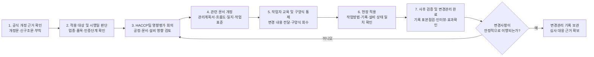
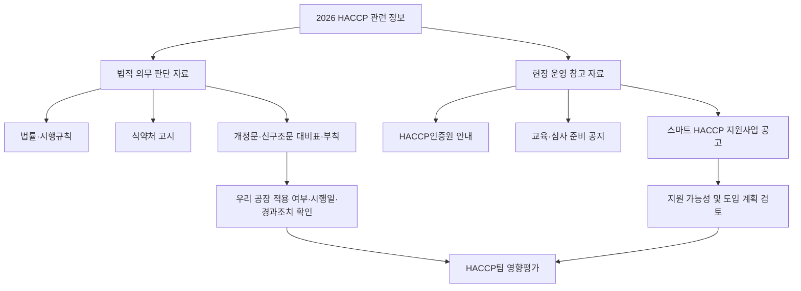

# [QA+ 블로그 생성 결과물] HC001 2026년 HACCP 제도변경
생성일시: 2026-09-04 08:40:20 (KST)
적용모델: gpt-5.6-terra

================================================================================
# 📋 최종 발행용 블로그 패키지

### 1. 메타 데이터 (SEO 설정)

- **최종 포스팅 제목**: 2026 HACCP 제도변경, 우리 공장은 무엇을 바꿔야 할까? 실무자 확인 5가지
- **메타 디스크립션 (120자 내외 요약)**: 2026 HACCP 제도변경 대응은 양식 교체보다 공식 개정 근거·시행일·부칙·경과조치 확인이 우선입니다. 영향평가부터 문서·현장·교육까지 점검하세요.
- **추천 해시태그 (10개)**:  
  #HACCP #2026HACCP #식품품질관리 #식품안전 #HACCP심사 #식품제조업 #스마트HACCP #변경관리 #식품공장QA #식품위생법
- **카테고리**: HACCP 가이드 / 식품품질실무

> **법령·사실관계 검수 메모**  
> - 「식품위생법」 제48조 및 「축산물 위생관리법」 제9조를 HACCP의 주요 법적 근거로 제시한 방향은 적절합니다.  
> - 다만 실제 적용 대상, 시행일, 경과조치는 게시 직전 반드시 국가법령정보센터의 현행본·연혁본 및 식품의약품안전처 개정 고시 원문으로 재확인해야 합니다.  
> - “2026년 스마트 HACCP 전면 의무화”와 같은 단정적 표현은 공식 법령·고시 근거 없이 사용하지 않도록 원고의 신중한 표현을 유지했습니다.  
> - “최소 1개월”, “1~2주” 등은 법정 기한이 아니라 내부 변경관리·검증을 위한 **권장 운영기간**임을 본문에서 명확히 했습니다.

---

## 2. 네이버 블로그 / 티스토리 복사용 최종 원고 (Markdown)

# 2026 HACCP 제도변경, 우리 공장은 무엇을 바꿔야 할까? 실무자가 먼저 확인할 5가지

> **20년 실무 선배의 한 줄 요약**  
> 2026 HACCP 대응은 “양식부터 바꾸는 일”이 아니라, **공식 개정 근거·시행일·경과조치부터 확인한 뒤 우리 공장 영향만 정확히 반영하는 일**입니다. 법령, 고시, 인증원 안내, 스마트 HACCP 지원사업을 한데 섞어 판단하면 심사 직전에 가장 크게 꼬입니다.

---

## 1. “2026년 HACCP이 바뀐다는데” 우리 공장에도 적용될까요?

심사를 앞둔 품질팀에서 가장 많이 듣는 말이 있습니다.

“컨설팅사에서 기준이 바뀐다고 하던데요?”  
“거래처가 스마트 HACCP을 해야 한다는데 의무인가요?”  
“기존 기준서를 전부 개정해야 하나요?”

현장에서 정말 많이 헷갈리는 부분입니다. 결론부터 말씀드리면, **‘2026년 HACCP 제도변경’이라는 말 하나만으로 우리 공장의 의무가 확정되지는 않습니다.**

HACCP 관련 변화는 크게 다음과 같이 나눠 볼 수 있습니다.

- 법률·시행규칙 개정
- 식품의약품안전처 고시 개정
- 의무적용 대상 조정
- 인증심사·정기평가 운영 변경
- 스마트 HACCP 지원사업 공고

예를 들어 식약처 고시가 개정되었다면 현장의 선행요건관리나 기록관리 방식에 영향을 줄 수 있습니다. 반면 HACCP인증원의 교육 일정 변경이나 지원사업 모집 공고는 실무적으로 중요해도 곧바로 법적 의무가 되는 것은 아닙니다.

특히 “2026년부터 스마트 HACCP이 전면 의무화된다”거나 “기존 인증업체도 당장 모든 문서를 교체해야 한다”는 표현은 공식 근거 없이 받아들이면 위험합니다. 개정 고시의 **부칙**, 즉 시행일과 경과조치를 확인하지 않으면 이미 적용 중인 업체인지, 신규 인증 신청 업체부터 적용되는지조차 판단할 수 없습니다.

쉽게 말하면 다음과 같습니다.

- **고시 개정일**: 규칙이 발표된 날
- **시행일**: 현장에서 실제로 적용해야 하는 날
- **경과조치**: 기존 업체나 기존 시설에 유예기간·병행 적용 등을 정한 내용

품질팀은 소문을 빨리 듣는 부서가 아니라, **공식 근거를 정확히 해석해 회사가 움직이게 하는 부서**여야 합니다.

국가법령정보센터의 현행본과 연혁본, 식품의약품안전처의 고시 개정문, 신·구조문 대비표, 부칙을 확인하는 습관이 필요합니다. 이 네 가지를 확인하면 “무엇이, 누구에게, 언제부터 적용되는가”의 대부분이 정리됩니다.


이제 막연한 불안을 줄이기 위해 HACCP 제도가 어떤 구조로 운영되는지부터 차근차근 잡아보겠습니다. 구조를 이해하면 공지 하나를 봐도 “이건 법적 의무인지, 운영 안내인지”가 바로 보입니다.

---

## 2. HACCP 제도는 법률·고시·인증원 안내를 나눠서 봐야 합니다

식품 HACCP의 기본 법적 근거는 **「식품위생법」 제48조**입니다. 해당 조항은 식품안전관리인증기준, 즉 HACCP 적용과 인증의 큰 틀을 정하고 있습니다.

식품제조·가공업소라면 이 법을 중심으로 시행규칙과 식약처 고시를 함께 봐야 합니다. 쉽게 말하면 법률은 “HACCP이라는 제도가 왜 존재하는가”를 정한 큰 뼈대라고 이해하시면 됩니다.

축산물가공업, 식육포장처리업 등 축산물 영업자는 **「축산물 위생관리법」 제9조**도 함께 검토해야 합니다. 식품과 축산물은 통합된 HACCP 고시를 활용하는 부분이 많지만, 영업의 법적 근거와 적용 대상 판단은 서로 다를 수 있습니다.

따라서 우리 회사가 다음 중 어디에 해당하는지부터 정확히 정리해야 합니다.

- 식품제조·가공업
- 축산물가공업
- 식육포장처리업
- 식품과 축산물 영역을 함께 운영하는 사업장
- 복수 영업등록 또는 복수 인증범위를 가진 사업장

현장 실무에서 가장 자주 보는 기준은 식품의약품안전처 고시인 **「식품 및 축산물 안전관리인증기준」**입니다. 이 고시에는 다음과 같은 세부 기준이 담겨 있습니다.

- 선행요건관리
- 위해요소분석
- 중요관리점(CCP)
- 모니터링
- 한계기준 이탈 시 개선조치
- 검증
- 기록관리
- 인증 및 정기평가 관련 세부 기준

쉽게 말하면 법률이 “안전운전을 해야 한다”는 원칙이라면, 고시는 “어떤 점검표로, 어떤 주기로, 어떤 증빙을 남겨야 하는가”에 가까운 현장 매뉴얼입니다.

한국식품안전관리인증원(HACCP인증원)의 공지와 안내자료도 꼭 봐야 합니다. 다만 인증원 자료는 인증 신청 방법, 교육, 심사 준비사항, 지원사업, 운영 일정 등 실무 안내 성격이 강한 경우가 있습니다.

따라서 심사 준비에는 매우 유용하지만, 법적 의무 여부를 판단할 때는 반드시 상위 법령과 고시 원문으로 다시 확인해야 합니다.

| 구분 | 대표 공식 근거 | 주로 확인할 내용 | 실무자의 첫 행동 |
|---|---|---|---|
| 법률 | 「식품위생법」 제48조 | HACCP 제도의 기본 근거, 적용 원칙 | 국가법령정보센터에서 현행본·연혁 확인 |
| 축산물 법률 | 「축산물 위생관리법」 제9조 | 축산물 영업자의 HACCP 적용 근거 | 업종 및 영업등록 상태 확인 |
| 시행규칙 | 식품위생법 시행규칙 등 | 인증 신청·절차·세부 행정사항 | 신청 또는 인증유지 단계 확인 |
| 식약처 고시 | 「식품 및 축산물 안전관리인증기준」 | 현장 관리·기록·평가 세부기준 | 개정문·신·구조문·부칙 확인 |
| 인증원 안내 | HACCP인증원 공지 | 심사, 교육, 신청, 지원사업 실무 | 최신 공지일과 적용 범위 확인 |
| 지원사업 공고 | 식약처·지자체·인증원 공고 | 스마트 HACCP 지원조건, 접수기간 | 의무 여부와 분리하여 검토 |


이제 기준의 층위를 구분했다면, 다음은 “2026년 변경”이라는 말을 들었을 때 어떤 문서를 봐야 하는지 정리할 차례입니다. 여기서 서두르면 불필요한 문서 개정이 시작되고, 나중에는 문서와 현장이 서로 달라집니다.

---

## 3. 2026년 변경사항 확인은 고시 전문보다 ‘개정문·부칙’부터 보세요

고시가 개정되었다는 정보를 접하면 많은 분이 현행 고시 전문부터 처음 페이지로 돌아가 읽습니다. 물론 최종적으로는 전문 확인이 필요합니다. 하지만 시간에 쫓기는 실무자라면 먼저 **고시 개정문, 신·구조문 대비표, 부칙**을 확인하는 편이 훨씬 효율적입니다.

바뀐 부분을 먼저 찾아야 우리 공장 영향평가도 정확해집니다.

첫 번째로 볼 것은 개정 고시의 제목, 고시번호, 공포일, 시행일입니다.

- **공포일**: 고시가 외부에 발표된 날짜
- **시행일**: 실제 의무가 적용되기 시작하는 날짜

두 날짜가 같을 수도 있지만, 일정 기간을 두고 시행되는 경우도 있습니다. 그래서 “지난달에 고시가 개정됐으니 이번 주 안에 전부 바꿔야 한다”는 식의 대응은 섣부를 수 있습니다.

두 번째는 신·구조문 대비표입니다. 여기서 다음 사항을 확인합니다.

- 삭제
- 신설
- 문구 변경
- 대상 확대 또는 축소
- 기록주기 변경
- 평가 기준 변경

단어 하나가 바뀌어도 현장 영향은 클 수 있습니다. 예를 들어 ‘관리한다’가 ‘기록하여 보관한다’로 바뀌면, 실제 관리 행위뿐 아니라 기록 양식, 보관 방식, 책임자 확인 방식까지 검토해야 할 수 있습니다.

세 번째는 부칙과 경과조치입니다. 이 부분을 빼먹으면 기존 인증업체와 신규 인증업체의 적용 시점이 달라질 수 있다는 핵심을 놓치게 됩니다.

경과조치가 있다면 다음을 확인해야 합니다.

- 기존 기준서와 신규 양식의 일정 기간 병행 가능 여부
- 기존 시설의 보완 기간
- 신규 인증 신청 업체부터 적용되는지 여부
- 정기평가 또는 인증연장 시점부터 적용되는지 여부
- 기존 인증업체의 전환 관리기한

> **실무 핵심**  
> 고시가 개정되었다고 해서 무조건 “전 문서 즉시 폐기·재작성”이 정답은 아닙니다.  
> 먼저 **적용 대상 → 시행일 → 경과조치 → 우리 공정 영향 → 변경관리 계획** 순서로 판단해야 합니다.

아래 표는 실제 품질팀에서 사용할 수 있는 ‘2026 HACCP 개정사항 검토표’입니다. 빈칸으로 두는 것이 부실한 것이 아니라, 공식 개정 고시가 확인되기 전까지 추측을 넣지 않는 것이 오히려 올바른 품질관리입니다.

| 확인 항목 | 공식 근거 및 조문 | 개정 전 내용 | 2026년 변경 내용 | 시행일·경과조치 | 우리 공장 영향 | 담당 부서 |
|---|---|---|---|---|---|---|
| 인증 적용 대상 | 법령·시행규칙·고시 | 확인 필요 | 공식 개정문 입력 | 부칙 확인 | 대상 여부 판단 | QA |
| 선행요건관리 | HACCP 고시 | 확인 필요 | 공식 개정문 입력 | 부칙 확인 | 문서·현장 점검 | QA·생산 |
| HACCP 관리계획 | HACCP 고시 | 확인 필요 | 공식 개정문 입력 | 부칙 확인 | 위해요소분석 검토 | HACCP팀 |
| CCP 모니터링 | HACCP 고시 | 확인 필요 | 공식 개정문 입력 | 부칙 확인 | 일지·기준 변경 여부 | QA·생산 |
| 정기평가·인증연장 | 고시·인증원 안내 | 확인 필요 | 공식 안내 입력 | 적용 시점 확인 | 심사 준비 일정 | QA |
| 스마트 HACCP | 공고·등록 기준 | 확인 필요 | 해당 연도 공고 입력 | 공고별 확인 | 투자·지원 판단 | 경영·QA |

이 표를 채웠다면 바로 양식을 수정하지 말고, 영향평가 회의를 먼저 여셔야 합니다. 다음 단계가 제대로 잡히면 심사 직전 야근의 절반은 줄어듭니다.

---

## 4. 기준이 바뀌면 문서부터 고치지 말고 ‘영향평가’부터 하세요

현장에서 가장 흔한 실수는 고시 개정 소식을 듣자마자 기준서 파일을 열고 개정번호부터 올리는 것입니다.

그런데 문서만 먼저 수정하면 다음과 같은 문제가 생깁니다.

- 구양식이 현장에 남아 있음
- 작업자가 변경 사실을 모름
- 실제 공정은 예전 방식대로 운영됨
- 문서와 현장이 서로 불일치함
- 심사 시 변경 근거와 검증기록을 설명하지 못함

심사관 입장에서는 이 상태가 가장 명확한 “문서와 현장 불일치”로 보입니다.

영향평가의 첫 질문은 단순합니다.

> **“이 변경이 우리 회사에 적용되는가?”**

식품인지 축산물인지, 영업등록 업종은 무엇인지, 생산 품목은 무엇인지, 소규모 기준에 해당하는지, 신규 인증인지 정기평가인지 인증연장인지 확인합니다.

같은 고시 개정이라도 냉동식품 제조업체와 소스류 제조업체의 영향은 다를 수 있습니다.

두 번째 질문은 다음입니다.

> **“무엇이 달라져야 하는가?”**

문서만 바꾸면 되는지, 공정흐름도 및 평면도를 수정해야 하는지, CCP 한계기준이나 모니터링 주기를 조정해야 하는지 구분해야 합니다.

필요에 따라 다음 항목도 검토해야 합니다.

- 측정기기 추가 또는 교체
- 자동기록 장비 도입
- 작업자 재교육
- 외부 시험성적서 확보
- 밸리데이션 또는 검증 활동
- 공급업체 관리기준 변경
- 제품보류·회수 절차 변경

세 번째 질문은 다음입니다.

> **“언제까지, 누가, 어떻게 검증할 것인가?”**

QA팀이 기준서를 고쳤다면 생산팀장은 현장 게시물과 작업표준을 바꾸고, 생산반장은 작업자 교육을 해야 합니다.

변경 후에는 내부에서 정한 검증기간 동안 이행 상태를 확인하고, 누락·혼선이 없는지 HACCP팀에서 검증하는 흐름이 좋습니다. 예를 들어 변경 후 1개월간 또는 사업장 내부 기준에 따른 검증기간 동안 기록과 현장 운영을 점검할 수 있습니다.

권장하는 방식은 HACCP팀 회의록에서 출발하는 것입니다. 회의록에는 다음 내용을 남기십시오.

- 개정 근거
- 검토일
- 적용 대상 판단
- 담당자
- 완료기한
- 교육계획
- 사후 검증계획
- 변경 후 유효성 확인 결과

심사 때 “왜 이 양식을 바꿨나요?”라는 질문을 받으면 단순히 “고시가 바뀌어서요”가 아니라 다음과 같이 답할 수 있어야 합니다.

> “개정 고시의 관련 조항과 부칙을 검토했고, 당사 ○○공정에 영향을 준다고 판단해 이렇게 관리했습니다.”

> **회의록 문구 예시**  
> “식품의약품안전처 고시 「식품 및 축산물 안전관리인증기준」의 최신 개정사항 및 부칙을 검토한 결과, 당사 ○○제품 제조공정의 △△ 관리기준과 관련 기록에 영향이 있는 것으로 판단하였다. 이에 HACCP 관리계획서, 점검일지, 작업자 교육자료를 개정하며, 시행 후 1개월간 이행상태 및 기록 적정성을 검증한다.”

이제 영향평가가 끝났다면, 실제로 어떤 문서와 현장을 연결해 바꿔야 하는지 보겠습니다. HACCP은 종이 한 장의 완성도가 아니라 연결성의 완성도에서 평가가 갈립니다.

---

## 5. HACCP 문서·현장·교육은 반드시 한 묶음으로 바꾸세요

HACCP 관리계획서만 최신화했다고 해서 시스템이 최신화된 것은 아닙니다.

다음 자료와 활동이 서로 맞물려야 합니다.

- 위해요소분석서
- 공정흐름도
- 평면도
- 선행요건관리기준서
- CCP 모니터링 일지
- 개선조치보고서
- 검증일지
- 교육자료
- 작업표준서
- 현장 게시물
- 구양식 회수 및 문서통제 기록

쉽게 말하면 기준서는 설계도이고, 현장은 실제 건물이며, 기록은 그 건물이 설계도대로 운영됐다는 증거입니다.

공정이 바뀌면 가장 먼저 확인할 것은 공정흐름도입니다. 예를 들어 냉각공정이 추가되었거나 금속검출기 위치가 바뀌었는데 공정흐름도가 예전 상태라면, 위해요소분석서도 신뢰하기 어렵습니다.

심사관은 종종 현장을 걸으면서 공정흐름도 순서와 실제 설비 배치를 대조합니다. 여기서 다르면 뒤에 있는 CCP 설정과 검증계획까지 연쇄적으로 질문이 들어옵니다.

CCP 관련 변경은 특히 조심해야 합니다. 다음 항목 중 하나라도 바뀌면 관련 일지와 작업자 교육을 함께 확인해야 합니다.

- 한계기준
- 모니터링 방법
- 측정 주기
- 책임자
- 이탈 시 조치
- 검증 방법
- 기록 보관 방식

예를 들어 가열 CCP를 30분마다 확인하도록 관리하고 있다면, 실제 생산시간 중 30분 간격의 기록이 논리적으로 이어지는지, 누락 시 어떻게 처리하는지까지 보여줄 수 있어야 합니다.

변경 후에는 구양식 통제가 중요합니다. 새 양식을 배포했는데 생산 현장 서랍이나 클립보드에 이전 버전이 남아 있으면 작업자는 당연히 익숙한 양식을 씁니다.

구양식은 다음 사항을 관리하는 것이 좋습니다.

- 회수일
- 폐기 여부
- 보관 위치
- 재사용 금지 여부
- 전자문서 접근 권한
- 파일명 및 버전 통제

문서번호, 개정번호, 시행일, 페이지 번호는 현장에서 작은 것 같아도 심사에서는 큰 차이를 만듭니다.

| 흔한 실수 | 왜 문제가 될까요? | 올바른 대응 |
|---|---|---|
| 기준서만 개정하고 일지는 그대로 사용 | 관리기준과 증빙 기록이 불일치 | 기준서·일지·작업표준을 동시 개정 |
| 공정 변경 후 흐름도 미수정 | 위해요소분석의 전제가 무너짐 | 현장 확인 후 흐름도·평면도·분석서 연동 수정 |
| 교육일지만 작성 | 작업자가 실제 변경 내용을 모를 수 있음 | 교육 후 질의·작업 관찰로 이해도 확인 |
| 구양식이 현장에 남음 | 기록 혼재 및 문서통제 미흡 지적 가능 | 회수대장 운영, 폐기 또는 별도 보관 |
| CCP 이탈 조치가 “재작업” 한 줄 | 원인분석과 재발방지가 없음 | 제품조치·원인분석·재발방지·효과확인 기록 |
| 변경 근거가 없음 | 임의 변경처럼 보일 수 있음 | 고시·회의록·영향평가서로 근거 확보 |




문서와 현장을 맞췄다면 다음으로는 작업자가 정말 바뀐 방식대로 움직이는지 확인해야 합니다. 이 단계에서 스마트 HACCP을 검토하는 업체도 많지만, 장비 설치가 해답은 아니라는 점을 꼭 기억하셔야 합니다.

---

## 6. 스마트 HACCP은 자동기록 장비가 아니라 ‘데이터 관리 체계’입니다

스마트 HACCP을 도입하면 수기 기록의 누락과 시간 역전 작성 문제를 줄이는 데 도움이 될 수 있습니다. 온도, 시간, 압력, 금속검출 결과 같은 데이터를 자동으로 수집하고 이탈 알림을 설정할 수 있기 때문입니다.

하지만 자동기록 장비를 설치했다고 HACCP 관리가 자동으로 완성되는 것은 아닙니다. 오히려 데이터가 많아졌는데 관리 책임이 불명확하면 심사 대응이 더 어려워질 수도 있습니다.

가장 먼저 정할 것은 다음입니다.

> **“어떤 관리항목을 자동화할 것인가?”**

모든 공정을 한 번에 시스템화하려고 하면 비용과 현장 저항이 커집니다. 먼저 다음처럼 기록 빈도가 높고 누락 위험이 큰 항목부터 검토하는 것이 현실적입니다.

- 가열온도
- 냉각온도
- 금속검출
- 냉동고 온도
- 냉장 원료보관실 온도
- 압력
- 시간
- 세척·살균 관련 관리값

우리 공정의 위해요소와 CCP, 인력 운영 수준을 기준으로 우선순위를 잡으셔야 합니다.

두 번째는 데이터 신뢰성입니다. 자동센서가 기록한 값도 다음 관리가 되지 않으면 신뢰할 수 없습니다.

- 측정기기 검교정
- 센서 위치 적정성
- 통신상태 점검
- 권한관리
- 수정 이력 관리
- 서버 및 데이터 백업
- 설비 점검·보전
- 기준 이탈 알림 설정값 검토

예를 들어 냉각실 온도센서가 출입문 바로 옆에 설치되어 있다면 제품 중심부 온도나 실제 보관 상태를 대표하지 못할 수 있습니다. 데이터가 나온다는 사실보다 그 데이터가 **관리 기준을 판단하기에 적절한 데이터인가**를 먼저 검토해야 합니다.

세 번째는 이탈 대응입니다. 온도 이탈 알람이 울렸을 때 다음 내용이 절차에 있어야 합니다.

- 담당자는 누구인가?
- 몇 분 이내에 확인할 것인가?
- 제품을 어떻게 식별하고 격리할 것인가?
- 장비 이상과 실제 제품 이상을 어떻게 구분할 것인가?
- QA 책임자에게 언제 보고할 것인가?
- 정전·통신장애·서버 오류·센서 고장 시 어떻게 수기 기록으로 전환할 것인가?

심사에서는 시스템 화면보다 “이탈 발생 시 실제로 어떻게 조치했는가”를 더 깊게 볼 수 있습니다.

스마트 HACCP 관련 지원사업은 매년 예산, 모집기간, 지원비율, 대상 업종, 자부담 조건이 달라질 수 있습니다. 따라서 지원 공고를 보고 “우리 회사도 의무 도입 대상”이라고 해석하면 안 됩니다.

> **법령상 의무와 정부의 도입 지원정책은 전혀 다른 이야기입니다.**

발행일 기준 최신 공고는 식품의약품안전처와 HACCP인증원 홈페이지에서 반드시 재확인하십시오.

이론은 이해했는데 실제 현장에서 어떻게 적용되는지 궁금하실 겁니다. 아래 세 사례는 업종과 공정은 다르지만, 결국 핵심은 모두 “변경을 문서 한 장으로 끝내지 않았다”는 데 있습니다.

---

## 7. 실제 현장 사례로 보는 2026 HACCP 변경 대응법

### 사례 1. 냉동만두 제조공장: 금속검출 공정 변경 후 흐름도를 놓친 사례

한 냉동만두 제조공장에서는 생산성 향상을 위해 포장라인 끝단의 금속검출기 위치를 변경했습니다. 기존에는 개별 포장 후 금속검출을 하고 외포장으로 넘어갔지만, 설비 배치 조정 뒤에는 외포장 직전 위치로 이동했습니다.

생산팀은 설비를 옮겼고 QA팀은 금속검출기 작동 확인 기록을 계속 작성했기 때문에 큰 문제는 없다고 판단했습니다. 그러나 정기평가 사전점검에서 HACCP 관리계획서의 공정흐름도와 실제 라인 순서가 다르다는 사실이 발견됐습니다.

문제는 단순히 도면 한 장이 오래된 것이 아니었습니다. 위해요소분석서에는 금속검출 후 제품 보관 및 부적합품 격리 동선이 예전 위치 기준으로 작성되어 있었습니다.

불합격품 배출함도 설비 이동 후 생산자재 통로 가까이에 놓여 있어, 양품과 부적합품의 구분 관리가 약해질 가능성이 있었습니다.

근본 원인은 설비 변경을 생산부서의 작업으로만 보고, HACCP팀의 변경관리 대상으로 올리지 않았던 것입니다. 즉, “설비를 옮겼다”는 정보가 HACCP팀 회의로 연결되지 않았습니다.

개선조치로 회사는 설비 변경관리 절차를 만들고, 금속검출기 위치 변경을 HACCP팀 안건으로 등록했습니다.

현장 확인을 거쳐 다음을 실시했습니다.

- 공정흐름도 개정
- 평면도 개정
- 위해요소분석서의 공정별 위해요소 및 관리수단 재검토
- 부적합품 배출함 위치 변경
- 양품 이동 동선과 부적합품 동선 분리
- 작업 시작 전 시험편 확인 절차 명확화
- 작업 중 확인주기 작업표준서 반영
- 불합격품 발생 시 격리·재검사·폐기·재작업 승인 절차 교육

작업자에게는 불합격품 발생 시 격리, 재검사, 폐기 또는 재작업 승인 절차를 40분 교육으로 실시했습니다. 이후 4주간 QA팀이 현장 라운딩과 기록 검토를 실시한 결과, 구양식 사용과 부적합품 동선 혼선이 없어졌습니다.

---

### 사례 2. 파우치 소스 제조공장: 가열기록은 있었지만 이탈조치가 없었던 사례

파우치 소스를 제조하는 한 업체는 가열공정의 온도와 시간을 수기로 관리하고 있었습니다. 작업자는 30분 간격으로 표시온도를 기록했고, 일지의 숫자만 보면 대부분 기준 범위 안에 있었습니다.

그런데 내부감사 중 특정 날짜에 가열기 온도가 관리기준 아래로 약 7분간 떨어진 흔적이 설비 화면 이력에서 확인됐습니다.

수기 일지에는 해당 시간대 기록이 정상으로 작성돼 있었고, 이탈에 대한 개선조치 기록도 없었습니다.

조사 결과 작업자는 설비 표시온도가 잠시 흔들리는 현상을 알고 있었지만, “곧 회복되니 제품에는 문제없을 것”이라고 판단했습니다. 현장 반장은 구두로만 상황을 들었고, 제품 보류 여부나 재가열 여부를 지시하지 않았습니다.

근본 원인은 한계기준 이탈 시 제품처리 기준과 보고체계가 작업자에게 구체적으로 교육되지 않았다는 점이었습니다. 개선조치란에 ‘재가열’이라고 적는 수준의 기존 양식도 원인분석과 재발방지 확인을 유도하지 못했습니다.

회사는 HACCP팀 검토를 통해 가열 CCP 이탈 시 대응 절차를 네 단계로 나눴습니다.

1. 이탈 시점부터 정상 복귀 시점까지 제조된 제품과 반제품을 즉시 식별·보류했습니다.  
2. 생산팀장과 QA 책임자에게 즉시 보고하고, 제품의 재가열 가능 여부는 검증된 조건과 품질 영향평가를 거쳐 결정하도록 했습니다.  
3. 설비 온도센서와 제어밸브를 점검해 반복되는 온도 흔들림의 원인을 제거했습니다.  
4. 개선조치보고서에 제품조치, 발생원인, 재발방지조치, 효과확인란을 분리해 기록하도록 했습니다.  

이후 실제 모의 이탈훈련을 실시하자 작업자들이 “온도만 다시 올리면 끝”이 아니라 “이탈 구간의 제품을 먼저 잡아야 한다”는 점을 이해하게 됐습니다.

---

### 사례 3. 과채음료 제조공장: 스마트 온도기록 도입 후 알람 대응이 비어 있던 사례

과채음료 제조업체는 냉장 원료보관실 온도를 자동기록하는 시스템을 도입했습니다. 담당자는 스마트 HACCP 시스템이 설치됐으니 수기 점검보다 훨씬 안전해졌다고 생각했습니다.

실제로 시스템은 5분 간격으로 온도를 저장했고, 설정온도를 벗어나면 담당자 휴대전화로 알림도 보냈습니다.

하지만 주말 새벽에 냉장실 온도가 상승했을 때 다음 내용은 정해져 있지 않았습니다.

- 알림을 받은 담당자는 누구인가?
- 제품을 누가 격리할 것인가?
- 출근 전까지 어떤 임시조치를 할 것인가?
- QA 책임자에게 어떤 기준으로 보고할 것인가?

월요일 아침 QA팀이 데이터를 확인했지만, 온도 이탈 구간에 보관된 농축액 원료의 품질 영향평가가 남아 있지 않았습니다.

더 큰 문제는 센서가 냉장실 출입문 가까이에 있어 문 열림에 따른 일시적 온도 변화와 실제 보관온도 상승을 구분하기 어려웠다는 점입니다.

근본 원인은 자동기록 시스템을 ‘기록 편의 장비’로만 보고, 비상대응과 데이터 검증 체계까지 HACCP 관리계획에 연결하지 않았기 때문입니다. 장비 설치 프로젝트에 IT 담당자와 시설팀은 참여했지만 HACCP팀의 검토가 충분하지 않았습니다.

개선조치로 회사는 다음을 실시했습니다.

- 원료 특성과 보관기준을 고려한 센서 위치 재검토
- 필요 위치에 보조 온도계 설치
- 자동기록값과 보조 측정값 비교 검증
- 주간·야간·휴일 알람 수신자 지정
- 15분 이내 확인, 30분 이내 1차 조치 기준 설정
- QA 책임자 보고 기준 절차서 반영
- 정전·통신장애 시 휴대용 검교정 온도계로 2시간 간격 수기 확인
- 원료 로트번호, 이탈시간, 최대온도, 제품 영향평가, 출고 가능 여부를 하나의 보고서로 관리

그 결과 자동기록 데이터가 단순 그래프가 아니라 실제 원료 안전관리의 증빙으로 기능하기 시작했습니다.

세 사례를 보시면 공통점이 보이실 겁니다. 설비를 바꾸든, 기준을 바꾸든, 시스템을 도입하든 반드시 HACCP팀의 영향평가와 작업자 이행 확인까지 이어져야 합니다.

다음은 심사 한 달 전 실제로 돌려볼 수 있는 일정입니다.

---

## 8. 심사 4주 전부터는 이렇게 준비하면 덜 흔들립니다

심사 준비는 전날 대청소나 기록 몰아쓰기에서 결정되지 않습니다. 심사 4주 전부터 주 단위로 할 일을 나누면, 변경사항 반영 여부와 기록 누락을 훨씬 안정적으로 잡을 수 있습니다.

특히 최신 고시·인증원 안내 확인은 심사 직전이 아니라 첫 주에 시작해야 합니다.

심사 4주 전에는 국가법령정보센터와 식약처 홈페이지에서 현행 법령, 고시 연혁, 개정문, 시행일을 확인하십시오. HACCP인증원의 정기평가·인증연장 관련 최신 안내도 함께 봅니다.

그리고 우리 사업장의 다음 정보를 한 장으로 정리합니다.

- 인증 범위
- 품목
- 최근 공정변경
- 설비변경
- 원료변경
- 클레임 이력
- 최근 개선조치 이력
- 교육 및 내부점검 이력

이 자료가 HACCP팀 회의의 출발점이 됩니다.

심사 3주 전에는 문서와 현장의 일치성을 집중 점검합니다. 공정흐름도 순서대로 현장을 실제로 걸어보면서 다음 사항이 문서와 맞는지 확인하세요.

- 설비명
- 작업순서
- CCP 위치
- 세척도구
- 부적합품 보관장소
- 현장 게시물
- 작업표준서
- 기록지 비치 상태

품질팀 혼자 보지 말고 생산팀장이나 현장반장과 함께 보는 것이 좋습니다. 현장 담당자는 문서에 없는 실제 작업 관행을 가장 잘 알고 있기 때문입니다.

심사 2주 전에는 기록을 봐야 합니다. 다음 자료는 “있다”보다 “논리적으로 이어진다”가 중요합니다.

- CCP 기록
- 선행요건 점검일지
- 검교정 성적서
- 개선조치보고서
- 교육일지
- 방충방서 관리기록
- 용수 관련 관리기록 및 검사성적서
- 원료 입고검사 기록
- 이물관리 및 클레임 기록

날짜 누락, 서명 누락, 시간 역전, 수정흔적, 이탈 발생 후 조치 미흡을 집중적으로 확인하십시오.

심사 1주 전에는 작업자 인터뷰와 구양식 회수 상태를 확인합니다.

작업자에게 “이 공정의 위해요소는 무엇인가요?”처럼 어려운 시험 문제를 낼 필요는 없습니다. 대신 다음처럼 실제 업무 질문을 해보면 교육이 현장에 살아 있는지 바로 보입니다.

- “온도가 기준에서 벗어나면 누구에게 알리나요?”
- “금속검출기 불합격품은 어디에 두나요?”
- “이 일지는 언제 작성하나요?”
- “구양식을 발견하면 어떻게 하나요?”
- “측정기기가 이상하면 누구에게 보고하나요?”

| 시점 | 권장 조치 | 확인 증빙 |
|---|---|---|
| 심사 4주 전 | 최신 법령·고시·인증원 공지 확인, 영향평가 | 개정문, 부칙, 영향평가서 |
| 심사 3주 전 | HACCP팀 회의, 문서-현장 일치성 점검 | 회의록, 공정흐름도, 현장점검표 |
| 심사 2주 전 | CCP·검증·개선조치 기록 집중 점검 | 모니터링 일지, 개선조치보고서 |
| 심사 1주 전 | 현장 라운딩, 인터뷰, 구양식 회수 | 교육일지, 구양식 회수대장 |
| 심사 전일 | 누락기록·측정기기·위생상태 최종 확인 | 검교정 상태, 청소상태, 문서목록 |

여기까지 준비했어도 마지막으로 헷갈리는 질문들이 남습니다. 특히 기존 인증의 효력, 구양식 처리, 스마트 HACCP 의무 여부는 심사 직전에 가장 많이 묻는 항목입니다.

---

## 9. 2026 HACCP 제도변경 FAQ: 심사에서 자주 헷갈리는 질문 6가지

### Q1. 2026년 HACCP 변경사항은 모든 인증업체에 똑같이 적용되나요?

**A. 아닙니다.** 식품과 축산물 구분, 영업등록 업종, 생산 품목, 사업장 규모, 신규 인증 또는 기존 인증 여부, 개정 고시의 부칙과 경과조치에 따라 적용 범위와 시점이 달라질 수 있습니다.

“다른 업체가 바꿨다”는 사실만으로 우리 회사의 의무를 판단하지 말고, 우리 인증 범위와 개정 근거를 대조해야 합니다.

### Q2. 고시가 개정되면 기존 HACCP 인증이 자동으로 취소되나요?

**A. 일반적으로 고시 개정 자체가 기존 인증의 자동 취소를 뜻하지는 않습니다.** 다만 개정 기준의 시행일 이후에는 정기평가나 인증연장 과정에서 변경된 기준의 이행 여부가 확인될 수 있습니다.

따라서 자동 취소를 걱정하기보다, 적용 시점과 경과조치를 확인하고 변경관리 계획을 남기는 것이 맞습니다.

### Q3. 개정사항이 있으면 예전 양식으로 작성한 기록을 전부 다시 써야 하나요?

**A. 원칙적으로 과거 기록을 소급해 다시 쓰는 방식은 권장되지 않습니다.** 기록은 당시의 실제 운영 사실을 보여주는 증빙이므로, 임의 재작성은 오히려 신뢰성 문제를 만들 수 있습니다.

시행일 이후 기록부터 개정 기준에 맞게 관리하되, 구양식 사용 종료일과 신양식 시행일을 변경관리 기록으로 명확히 남기십시오.

### Q4. HACCP 관리계획서만 수정하면 심사 대응이 끝나나요?

**A. 아닙니다. 심사는 문서와 현장의 일치성을 확인하는 과정입니다.** 관리계획서가 바뀌었다면 점검일지, 작업표준서, 현장 게시물, 교육자료, 작업자 행동, 검증기록까지 연결되어야 합니다.

문서는 최신인데 현장 클립보드에 이전 양식이 걸려 있으면 바로 지적 가능성이 생깁니다.

### Q5. 스마트 HACCP은 2026년부터 무조건 의무인가요?

**A. 스마트 HACCP의 의무 여부는 법령 또는 고시상 명시 근거가 있을 때만 판단할 수 있습니다.** 지원사업 공고, 정책 설명회, 장비업체 홍보자료는 도입 판단에 참고할 수 있지만 모든 사업장의 법적 의무를 의미하지는 않습니다.

반드시 해당 연도 공식 공고와 적용 대상, 등록 기준을 확인하십시오.

### Q6. 심사에서 변경관리와 관련해 가장 많이 지적받는 부분은 무엇인가요?

**A. 가장 흔한 지적은 ‘변경 사실은 있는데 HACCP팀 검토 기록이 없는 경우’입니다.** 설비, 원료, 포장재, 공정, 관리기준이 달라졌다면 위해요소분석과 관련 문서에 미치는 영향을 검토한 기록이 있어야 합니다.

변경 후 교육과 유효성 검증까지 남기면 심사 대응력이 훨씬 높아집니다.

FAQ까지 확인하셨다면 이제 마지막으로, 실제 점검에 바로 쓸 수 있는 체크리스트를 돌려보시면 됩니다. 이 표는 품질팀만 보는 용도가 아니라 생산·시설·구매 담당자와 함께 보는 용도로 활용하시면 좋습니다.

---

## 10. 2026 HACCP 제도변경 대응 체크리스트

제도변경 대응은 복잡해 보이지만, 점검 항목을 쪼개면 의외로 명확합니다. 아래 체크리스트에서 “아니오” 또는 “확인 불가”가 나온 항목부터 우선순위를 잡으시면 됩니다.

한 번에 완벽하게 바꾸려 하지 말고, 위험도가 큰 항목부터 조치하십시오.

첫째, 공식 근거 확인이 되어야 합니다. 출처가 불분명한 파일이나 단체 채팅방의 캡처본을 기준으로 문서를 바꾸면 안 됩니다.

다음 자료를 확보하고 검토자와 검토일을 남기십시오.

- 고시번호
- 공포일
- 시행일
- 부칙
- 신·구조문 대비표
- 관련 공문 또는 공식 안내문

이 자료는 다음 정기평가 때도 유용한 근거가 됩니다.

둘째, 영향평가와 변경관리 기록이 있어야 합니다. 변경사항이 우리 공장과 무관하다고 판단한 경우도 그 판단 근거를 남기는 편이 좋습니다.

심사관이 “최신 개정사항을 검토했습니까?”라고 물었을 때, ‘해당 없음’이라는 결론보다 ‘왜 해당 없는지’의 근거가 더 중요합니다.

셋째, 문서와 현장을 함께 봐야 합니다. 특히 공정변경, 설비이동, 원료변경, 포장재변경, 기준 변경이 있었던 업체는 공정흐름도와 위해요소분석서를 우선 대조하십시오.

여기서 빠진 것이 있으면 CCP 기록을 아무리 잘 작성해도 시스템 전체의 신뢰성이 떨어집니다.

넷째, 변경 후 검증까지 마무리해야 합니다. 교육을 실시했다면 작업자가 실제로 수행하는지 확인하고, 일지를 바꿨다면 1~2주 기록을 표본 검토해 누락이나 오기입이 없는지 봐야 합니다.

이는 법정 기한이 아니라 사업장 내부 변경관리의 **권장 검증 방식**입니다.

변경관리의 끝은 ‘개정 완료’가 아니라 ‘현장에서 안정적으로 작동함을 확인한 시점’입니다.

| 점검 항목 | 확인 기준 | 확인 방법 | 완료 |
|---|---|---|---|
| 최신 법령·고시 확인 | 현행본, 연혁본, 개정문 확보 | 국가법령정보센터·식약처 검색 | □ |
| 시행일·경과조치 확인 | 공포일과 시행일 구분 | 고시 부칙 검토 | □ |
| 우리 공장 적용 여부 판단 | 업종·품목·규모·인증단계 반영 | 영향평가서 작성 | □ |
| HACCP팀 회의 실시 | 근거·담당자·기한 기록 | 회의록 확인 | □ |
| 문서 개정 | 기준서·일지·흐름도 연동 | 개정이력 대조 | □ |
| 현장 반영 | 게시물·작업방법·설비 상태 일치 | 현장 라운딩 | □ |
| 작업자 교육 | 변경 이유와 행동요령 전달 | 교육일지·인터뷰 | □ |
| 구양식 통제 | 회수·폐기·보관 구분 | 문서관리대장 | □ |
| 변경 후 검증 | 최소 1회 이상 유효성 확인 | 검증기록·내부점검표 | □ |
| 스마트 HACCP 비상대응 | 통신·정전·센서 이상 대응 | 비상절차 및 모의훈련 | □ |

---

## 11. 맺음말: 2026 HACCP 대응의 핵심은 ‘빨리’가 아니라 ‘정확히’입니다

2026년 HACCP 제도변경 대응에서 가장 위험한 방법은 “다른 회사도 바꾼다니까 우리도 일단 양식부터 바꾸자”는 접근입니다.

그렇게 시작하면 적용 대상이 아닌 내용을 불필요하게 반영하거나, 문서만 바뀌고 현장이 따라가지 못하는 문제가 생깁니다.

HACCP은 서류 작업이 아니라 위해요소를 실제로 통제하는 시스템이라는 점을 놓치면 안 됩니다.

오늘 내용은 아래 세 줄로 정리하시면 됩니다.

1. **법령·고시·인증원 안내·지원사업은 서로 다른 성격이므로 반드시 구분합니다.**  
2. **개정사항은 고시번호, 신·구조문 대비표, 시행일, 부칙과 경과조치로 판단합니다.**  
3. **영향평가 후 문서·현장·교육·기록·검증을 한 묶음으로 바꿔야 심사에서 흔들리지 않습니다.**

마지막으로 공식 확인처는 즐겨찾기에 넣어두시는 것을 권합니다.

- [국가법령정보센터](https://www.law.go.kr)
- [식품의약품안전처 법령·고시·훈령 정보](https://www.mfds.go.kr)
- [한국식품안전관리인증원(HACCP인증원)](https://www.haccp.or.kr)

작은 변경도 근거와 기록으로 남기는 습관이 결국 가장 강한 HACCP 시스템을 만듭니다. 막히는 부분이 있으면 언제든 댓글로 편하게 물어보세요. 후배님들의 심사 통과와 칼퇴를 응원합니다.

---

## 3. 워드프레스 / 웹사이트용 HTML 원고

```html
<article class="food-qa-post">
  <header>
    <h1>2026 HACCP 제도변경, 우리 공장은 무엇을 바꿔야 할까? 실무자가 먼저 확인할 5가지</h1>
    <p><strong>20년 실무 선배의 한 줄 요약:</strong> 2026 HACCP 대응은 “양식부터 바꾸는 일”이 아니라, <strong>공식 개정 근거·시행일·경과조치부터 확인한 뒤 우리 공장 영향만 정확히 반영하는 일</strong>입니다.</p>
  </header>

  <section>
    <h2>1. “2026년 HACCP이 바뀐다는데” 우리 공장에도 적용될까요?</h2>
    <p>‘2026년 HACCP 제도변경’이라는 말 하나만으로 우리 공장의 의무가 확정되지는 않습니다. HACCP 관련 변화는 법률·시행규칙 개정, 식품의약품안전처 고시 개정, 의무적용 대상 조정, 인증심사·정기평가 운영 변경, 스마트 HACCP 지원사업 등으로 나눠서 판단해야 합니다.</p>
    <p>특히 “스마트 HACCP이 전면 의무화된다”거나 “기존 인증업체도 모든 문서를 즉시 교체해야 한다”는 표현은 공식 근거 없이 받아들이면 위험합니다. 반드시 개정 고시의 부칙, 시행일 및 경과조치를 확인해야 합니다.</p>

    <figure>
      
      <figcaption>2026 HACCP 관련 정보는 법령·고시·인증원 안내·지원사업으로 구분해 검토해야 합니다.</figcaption>
    </figure>
  </section>

  <section>
    <h2>2. HACCP 제도는 법률·고시·인증원 안내를 나눠서 봐야 합니다</h2>
    <p>식품 HACCP의 주요 법적 근거는 <strong>「식품위생법」 제48조</strong>입니다. 축산물가공업 또는 식육포장처리업 등 축산물 영업자는 <strong>「축산물 위생관리법」 제9조</strong>도 함께 검토해야 합니다.</p>
    <p>현장 실무에서 가장 자주 보는 기준은 식품의약품안전처 고시인 <strong>「식품 및 축산물 안전관리인증기준」</strong>입니다. HACCP인증원의 공지와 안내자료는 심사·교육·신청·지원사업 준비에 유용하지만, 법적 의무 여부는 반드시 법령과 고시 원문으로 다시 확인해야 합니다.</p>

    <table>
      <thead>
        <tr>
          <th>구분</th>
          <th>대표 공식 근거</th>
          <th>주로 확인할 내용</th>
          <th>실무자의 첫 행동</th>
        </tr>
      </thead>
      <tbody>
        <tr>
          <td>법률</td>
          <td>「식품위생법」 제48조</td>
          <td>HACCP 제도의 기본 근거, 적용 원칙</td>
          <td>국가법령정보센터에서 현행본·연혁 확인</td>
        </tr>
        <tr>
          <td>축산물 법률</td>
          <td>「축산물 위생관리법」 제9조</td>
          <td>축산물 영업자의 HACCP 적용 근거</td>
          <td>업종 및 영업등록 상태 확인</td>
        </tr>
        <tr>
          <td>식약처 고시</td>
          <td>「식품 및 축산물 안전관리인증기준」</td>
          <td>현장 관리·기록·평가 세부기준</td>
          <td>개정문·신·구조문·부칙 확인</td>
        </tr>
        <tr>
          <td>인증원 안내</td>
          <td>HACCP인증원 공지</td>
          <td>심사, 교육, 신청, 지원사업 실무</td>
          <td>최신 공지일과 적용 범위 확인</td>
        </tr>
      </tbody>
    </table>
  </section>

  <section>
    <h2>3. 2026년 변경사항 확인은 고시 전문보다 ‘개정문·부칙’부터 보세요</h2>
    <p>고시가 개정되었다는 정보를 접했다면 현행 고시 전문만 처음부터 읽기보다, 먼저 <strong>고시 개정문, 신·구조문 대비표, 부칙</strong>을 확인하는 편이 효율적입니다.</p>
    <ol>
      <li>고시 제목, 고시번호, 공포일, 시행일 확인</li>
      <li>신·구조문 대비표에서 삭제·신설·문구·대상·기록주기 변경 확인</li>
      <li>부칙과 경과조치에서 기존 인증업체·신규 인증업체의 적용 시점 확인</li>
      <li>우리 공장의 업종·품목·공정·인증 단계에 미치는 영향 평가</li>
      <li>문서·현장·교육·검증을 포함한 변경관리 계획 수립</li>
    </ol>

    <blockquote>
      <p><strong>실무 핵심:</strong> 고시가 개정되었다고 해서 무조건 전 문서를 즉시 폐기·재작성하는 것이 정답은 아닙니다. 적용 대상 → 시행일 → 경과조치 → 우리 공정 영향 → 변경관리 계획 순서로 판단해야 합니다.</p>
    </blockquote>
  </section>

  <section>
    <h2>4. 기준이 바뀌면 문서부터 고치지 말고 ‘영향평가’부터 하세요</h2>
    <p>문서만 먼저 수정하면 구양식이 현장에 남고, 작업자가 변경 사실을 모르며, 실제 공정은 예전 방식대로 운영되는 일이 생깁니다. 심사에서는 이것이 대표적인 문서와 현장 불일치로 판단될 수 있습니다.</p>
    <p>영향평가에서는 다음 세 가지를 확인해야 합니다.</p>
    <ul>
      <li><strong>이 변경이 우리 회사에 적용되는가?</strong></li>
      <li><strong>무엇이 달라져야 하는가?</strong></li>
      <li><strong>언제까지, 누가, 어떻게 검증할 것인가?</strong></li>
    </ul>

    <blockquote>
      <p>“식품의약품안전처 고시 「식품 및 축산물 안전관리인증기준」의 최신 개정사항 및 부칙을 검토한 결과, 당사 ○○제품 제조공정의 △△ 관리기준과 관련 기록에 영향이 있는 것으로 판단하였다. 이에 HACCP 관리계획서, 점검일지, 작업자 교육자료를 개정하며, 시행 후 1개월간 이행상태 및 기록 적정성을 검증한다.”</p>
    </blockquote>
  </section>

  <section>
    <h2>5. HACCP 문서·현장·교육은 반드시 한 묶음으로 바꾸세요</h2>
    <p>HACCP 관리계획서만 최신화했다고 해서 시스템이 최신화된 것은 아닙니다. 위해요소분석서, 공정흐름도, 평면도, 선행요건관리기준서, CCP 모니터링 일지, 개선조치보고서, 검증일지, 교육자료가 서로 맞물려야 합니다.</p>

    <table>
      <thead>
        <tr>
          <th>흔한 실수</th>
          <th>왜 문제가 될까요?</th>
          <th>올바른 대응</th>
        </tr>
      </thead>
      <tbody>
        <tr>
          <td>기준서만 개정하고 일지는 그대로 사용</td>
          <td>관리기준과 증빙 기록이 불일치</td>
          <td>기준서·일지·작업표준을 동시 개정</td>
        </tr>
        <tr>
          <td>공정 변경 후 흐름도 미수정</td>
          <td>위해요소분석의 전제가 무너짐</td>
          <td>현장 확인 후 흐름도·평면도·분석서 연동 수정</td>
        </tr>
        <tr>
          <td>교육일지만 작성</td>
          <td>작업자가 실제 변경 내용을 모를 수 있음</td>
          <td>교육 후 질의·작업 관찰로 이해도 확인</td>
        </tr>
        <tr>
          <td>구양식이 현장에 남음</td>
          <td>기록 혼재 및 문서통제 미흡 지적 가능</td>
          <td>회수대장 운영, 폐기 또는 별도 보관</td>
        </tr>
      </tbody>
    </table>

    <figure>
      
      <figcaption>고시 개정부터 영향평가, 문서 개정, 교육, 현장 적용, 검증까지 연결해야 합니다.</figcaption>
    </figure>
  </section>

  <section>
    <h2>6. 스마트 HACCP은 자동기록 장비가 아니라 ‘데이터 관리 체계’입니다</h2>
    <p>스마트 HACCP은 온도, 시간, 압력, 금속검출 결과 등을 자동 수집하고 이탈 알림을 설정하는 데 도움이 될 수 있습니다. 그러나 장비 설치만으로 HACCP 관리가 자동 완성되는 것은 아닙니다.</p>
    <p>자동기록 데이터를 신뢰하려면 측정기기 검교정, 센서 위치, 통신상태, 권한관리, 수정 이력, 이탈 대응, 정전·통신장애 시 비상절차까지 함께 관리해야 합니다.</p>
    <p><strong>법령상 의무와 정부의 도입 지원정책은 다릅니다.</strong> 스마트 HACCP 지원사업 공고만으로 모든 사업장의 의무 여부를 판단해서는 안 되며, 해당 연도 공식 공고와 적용 대상을 확인해야 합니다.</p>
  </section>

  <section>
    <h2>7. 실제 현장 사례로 보는 2026 HACCP 변경 대응법</h2>

    <h3>사례 1. 냉동만두 제조공장: 금속검출 공정 변경 후 흐름도를 놓친 사례</h3>
    <p>금속검출기 위치를 변경했지만 공정흐름도와 위해요소분석서가 기존 상태로 남아 있던 사례입니다. 개선조치로 설비 변경을 HACCP팀 안건으로 등록하고, 공정흐름도·평면도·위해요소분석서·작업표준서를 연동 개정했습니다. 부적합품 동선도 양품 동선과 분리하고 작업자 교육 및 4주간 현장 검증을 실시했습니다.</p>

    <h3>사례 2. 파우치 소스 제조공장: 가열기록은 있었지만 이탈조치가 없었던 사례</h3>
    <p>가열온도가 관리기준 아래로 떨어진 설비 이력이 있었지만 수기 일지는 정상으로 작성돼 있었고, 제품 보류나 개선조치 기록도 없던 사례입니다. 회사는 이탈 제품 식별·보류, 생산팀장 및 QA 책임자 보고, 설비 원인 점검, 제품조치·원인분석·재발방지·효과확인 항목 분리 기록을 실시했습니다.</p>

    <h3>사례 3. 과채음료 제조공장: 스마트 온도기록 도입 후 알람 대응이 비어 있던 사례</h3>
    <p>자동 온도기록과 알람은 있었지만 주말·야간 알람 수신자, 제품 격리, 임시조치, 품질 영향평가 절차가 없던 사례입니다. 센서 위치를 재검토하고 보조 온도계를 설치했으며, 알람 확인 및 보고 기준, 정전·통신장애 시 수기 기록 전환 절차를 마련했습니다.</p>
  </section>

  <section>
    <h2>8. 심사 4주 전부터는 이렇게 준비하면 덜 흔들립니다</h2>
    <table>
      <thead>
        <tr>
          <th>시점</th>
          <th>권장 조치</th>
          <th>확인 증빙</th>
        </tr>
      </thead>
      <tbody>
        <tr>
          <td>심사 4주 전</td>
          <td>최신 법령·고시·인증원 공지 확인, 영향평가</td>
          <td>개정문, 부칙, 영향평가서</td>
        </tr>
        <tr>
          <td>심사 3주 전</td>
          <td>HACCP팀 회의, 문서-현장 일치성 점검</td>
          <td>회의록, 공정흐름도, 현장점검표</td>
        </tr>
        <tr>
          <td>심사 2주 전</td>
          <td>CCP·검증·개선조치 기록 집중 점검</td>
          <td>모니터링 일지, 개선조치보고서</td>
        </tr>
        <tr>
          <td>심사 1주 전</td>
          <td>현장 라운딩, 인터뷰, 구양식 회수</td>
          <td>교육일지, 구양식 회수대장</td>
        </tr>
        <tr>
          <td>심사 전일</td>
          <td>누락기록·측정기기·위생상태 최종 확인</td>
          <td>검교정 상태, 청소상태, 문서목록</td>
        </tr>
      </tbody>
    </table>
  </section>

  <section>
    <h2>9. 2026 HACCP 제도변경 FAQ</h2>

    <h3>Q1. 2026년 HACCP 변경사항은 모든 인증업체에 똑같이 적용되나요?</h3>
    <p><strong>A.</strong> 아닙니다. 식품과 축산물 구분, 영업등록 업종, 생산 품목, 사업장 규모, 신규 인증 또는 기존 인증 여부, 개정 고시의 부칙과 경과조치에 따라 적용 범위와 시점이 달라질 수 있습니다.</p>

    <h3>Q2. 고시가 개정되면 기존 HACCP 인증이 자동으로 취소되나요?</h3>
    <p><strong>A.</strong> 일반적으로 고시 개정 자체가 기존 인증의 자동 취소를 뜻하지는 않습니다. 다만 개정 기준의 시행일 이후 정기평가나 인증연장 과정에서 변경 기준의 이행 여부가 확인될 수 있으므로 적용 시점과 경과조치를 확인해야 합니다.</p>

    <h3>Q3. 개정사항이 있으면 예전 양식으로 작성한 기록을 전부 다시 써야 하나요?</h3>
    <p><strong>A.</strong> 원칙적으로 과거 기록을 소급해 다시 쓰는 방식은 권장되지 않습니다. 시행일 이후 기록부터 개정 기준에 맞게 관리하되, 구양식 사용 종료일과 신양식 시행일을 변경관리 기록으로 남기십시오.</p>

    <h3>Q4. HACCP 관리계획서만 수정하면 심사 대응이 끝나나요?</h3>
    <p><strong>A.</strong> 아닙니다. 관리계획서가 바뀌었다면 점검일지, 작업표준서, 현장 게시물, 교육자료, 작업자 행동, 검증기록까지 연결되어야 합니다.</p>

    <h3>Q5. 스마트 HACCP은 2026년부터 무조건 의무인가요?</h3>
    <p><strong>A.</strong> 의무 여부는 법령 또는 고시상 명시 근거가 있을 때 판단할 수 있습니다. 지원사업 공고나 장비업체 홍보자료만으로 모든 사업장의 법적 의무를 판단해서는 안 됩니다.</p>

    <h3>Q6. 심사에서 변경관리와 관련해 가장 많이 지적받는 부분은 무엇인가요?</h3>
    <p><strong>A.</strong> 변경 사실은 있는데 HACCP팀 검토 기록이 없는 경우입니다. 설비, 원료, 포장재, 공정, 관리기준이 달라졌다면 위해요소분석과 관련 문서에 미치는 영향을 검토한 기록이 있어야 합니다.</p>
  </section>

  <section>
    <h2>10. 2026 HACCP 제도변경 대응 체크리스트</h2>
    <table>
      <thead>
        <tr>
          <th>점검 항목</th>
          <th>확인 기준</th>
          <th>확인 방법</th>
          <th>완료</th>
        </tr>
      </thead>
      <tbody>
        <tr>
          <td>최신 법령·고시 확인</td>
          <td>현행본, 연혁본, 개정문 확보</td>
          <td>국가법령정보센터·식약처 검색</td>
          <td>□</td>
        </tr>
        <tr>
          <td>시행일·경과조치 확인</td>
          <td>공포일과 시행일 구분</td>
          <td>고시 부칙 검토</td>
          <td>□</td>
        </tr>
        <tr>
          <td>우리 공장 적용 여부 판단</td>
          <td>업종·품목·규모·인증단계 반영</td>
          <td>영향평가서 작성</td>
          <td>□</td>
        </tr>
        <tr>
          <td>HACCP팀 회의 실시</td>
          <td>근거·담당자·기한 기록</td>
          <td>회의록 확인</td>
          <td>□</td>
        </tr>
        <tr>
          <td>문서 개정</td>
          <td>기준서·일지·흐름도 연동</td>
          <td>개정이력 대조</td>
          <td>□</td>
        </tr>
        <tr>
          <td>현장 반영</td>
          <td>게시물·작업방법·설비 상태 일치</td>
          <td>현장 라운딩</td>
          <td>□</td>
        </tr>
        <tr>
          <td>작업자 교육</td>
          <td>변경 이유와 행동요령 전달</td>
          <td>교육일지·인터뷰</td>
          <td>□</td>
        </tr>
        <tr>
          <td>구양식 통제</td>
          <td>회수·폐기·보관 구분</td>
          <td>문서관리대장</td>
          <td>□</td>
        </tr>
        <tr>
          <td>변경 후 검증</td>
          <td>최소 1회 이상 유효성 확인</td>
          <td>검증기록·내부점검표</td>
          <td>□</td>
        </tr>
        <tr>
          <td>스마트 HACCP 비상대응</td>
          <td>통신·정전·센서 이상 대응</td>
          <td>비상절차 및 모의훈련</td>
          <td>□</td>
        </tr>
      </tbody>
    </table>
  </section>

  <footer>
    <h2>11. 맺음말: 2026 HACCP 대응의 핵심은 ‘빨리’가 아니라 ‘정확히’입니다</h2>
    <p>2026년 HACCP 제도변경 대응에서 가장 위험한 방법은 “다른 회사도 바꾼다니까 우리도 일단 양식부터 바꾸자”는 접근입니다. HACCP은 서류 작업이 아니라 위해요소를 실제로 통제하는 시스템입니다.</p>
    <ol>
      <li><strong>법령·고시·인증원 안내·지원사업은 서로 다른 성격이므로 반드시 구분합니다.</strong></li>
      <li><strong>개정사항은 고시번호, 신·구조문 대비표, 시행일, 부칙과 경과조치로 판단합니다.</strong></li>
      <li><strong>영향평가 후 문서·현장·교육·기록·검증을 한 묶음으로 바꿔야 심사에서 흔들리지 않습니다.</strong></li>
    </ol>

    <ul>
      <li><a href="https://www.law.go.kr" target="_blank" rel="noopener">국가법령정보센터</a></li>
      <li><a href="https://www.mfds.go.kr" target="_blank" rel="noopener">식품의약품안전처 법령·고시·훈령 정보</a></li>
      <li><a href="https://www.haccp.or.kr" target="_blank" rel="noopener">한국식품안전관리인증원(HACCP인증원)</a></li>
    </ul>

    <p>작은 변경도 근거와 기록으로 남기는 습관이 결국 가장 강한 HACCP 시스템을 만듭니다.</p>
  </footer>
</article>
```
================================================================================

[부록: 1단계 리서치 원본]
# [리서치 리포트] HC001 2026년 HACCP 제도변경

> **리서치 전제**  
> ‘2026년 HACCP 제도변경’은 단순히 HACCP 인증기준 고시만이 아니라 ▲식품위생법·축산물 위생관리법 하위규정 ▲「식품 및 축산물 안전관리인증기준」 고시 ▲의무적용 대상·유예 ▲정기평가·인증연장 ▲스마트 HACCP 지원·등록 기준 등으로 나누어 확인해야 합니다.  
>   
> 특히 블로그 발행 전에는 반드시 **국가법령정보센터의 현행본·연혁본**과 **식품의약품안전처 고시 개정문(신·구조문 대비표)**을 대조해야 합니다. 보도자료나 설명회 자료는 정책 방향일 수 있으나, 그 자체가 사업장 의무사항은 아닙니다.

---

### 1. 타겟 독자 및 검색 의도

- **주요 타겟**
  - 식품공장 품질관리(QC)·품질보증(QA) 신입 및 실무자
  - HACCP 팀장, 공장장, 생산관리 책임자
  - 2026년 인증심사·정기평가·인증연장을 앞둔 식품제조·가공업소
  - 소규모 HACCP 의무적용 대상 또는 신규 인증 준비 업체
  - 스마트 HACCP 도입 여부를 검토하는 경영진 및 실무 담당자

- **독자의 핵심 고통(Pain Point)**
  - “2026년에 HACCP 기준이 정말 바뀌는 것인지, 우리 공장에 적용되는 변경인지 모르겠다.”
  - “뉴스나 컨설팅사 안내에서 들은 제도변경이 법적 의무인지, 지원사업인지 구분하기 어렵다.”
  - “심사 일정은 잡혀 있는데 고시 개정사항을 문서·현장에 어디까지 반영해야 하는지 막막하다.”
  - “기존 HACCP 관리계획서, 선행요건관리기준서, 점검일지 양식을 전부 개정해야 하는지 판단이 어렵다.”
  - “스마트 HACCP, 의무적용, 인증연장, 정기평가가 서로 어떤 관계인지 혼동된다.”

- **메인 키워드**
  - `2026 HACCP 제도변경`

- **서브/연관 키워드**
  - `HACCP 인증기준 개정`
  - `식품 및 축산물 안전관리인증기준`
  - `HACCP 정기평가 인증연장`
  - `HACCP 의무적용 대상`
  - `스마트 HACCP 2026`
  - `HACCP 심사 준비 체크리스트`

- **핵심 검색 의도 분류**
  1. **정보 확인형**: “2026 HACCP 바뀌는 내용이 무엇인가?”
  2. **적용 판단형**: “우리 업종·품목·매출 규모에도 적용되는가?”
  3. **실행형**: “기준서와 점검표를 무엇부터 고쳐야 하는가?”
  4. **심사 대응형**: “개정 고시 미반영 시 심사에서 지적받는가?”
  5. **투자 판단형**: “스마트 HACCP 도입이 의무인가, 지원사업인가?”

---

### 2. 필수 인용 법령 및 표준 기준

## 2-1. 반드시 확인·인용할 공식 근거

| 구분 | 공식 근거 | 글에서 다뤄야 할 내용 |
|---|---|---|
| HACCP 제도의 법적 근거 | **「식품위생법」 제48조** | 식품안전관리인증기준(HACCP)의 적용·인증에 관한 기본 근거 |
| 식품 HACCP 세부 운영 기준 | **「식품위생법 시행규칙」** | 인증 신청, 절차, 대상 및 세부 운영사항 확인 |
| 축산물 HACCP 근거 | **「축산물 위생관리법」 제9조** | 축산물가공업·식육포장처리업 등 축산물 영업자의 HACCP 적용 근거 |
| 통합 HACCP 실무기준 | **식품의약품안전처 고시 「식품 및 축산물 안전관리인증기준」** | 선행요건, HACCP 관리, 인증·정기평가·인증연장, 평가 항목의 핵심 근거 |
| 고시 개정의 실제 적용일 | **식약처 고시 개정문 및 부칙** | “언제부터 무엇을 적용하는지” 판단하는 가장 중요한 자료 |
| 의무적용 여부 | 식약처 고시·법령 및 **한국식품안전관리인증원(HACCP인증원) 안내** | 업종·품목·규모별 의무 적용 대상 및 유예 여부 확인 |
| 스마트 HACCP | 식약처·HACCP인증원 공고, 사업 안내, 등록 기준 | 법적 의무와 지원·등록 제도를 구분하여 설명 |

### 공식 확인처

- **국가법령정보센터**: https://www.law.go.kr  
  - 현행 법령뿐 아니라 반드시 **연혁(개정 전·후)** 및 **시행일**을 확인
- **식품의약품안전처(MFDS) 법령·고시·훈령 검색**: https://www.mfds.go.kr  
  - 고시 개정문, 행정예고, 신·구조문 대비표 확인
- **한국식품안전관리인증원(HACCP인증원)**: https://www.haccp.or.kr  
  - 인증 신청, 정기평가, 인증연장, 교육, 스마트 HACCP, 지원사업 실무 안내 확인

---

## 2-2. 2026년 제도변경 글에서 반드시 구분할 5가지

2026년 변경사항을 다룰 때는 “바뀐다”는 표현만 쓰지 말고, 아래 다섯 범주 중 어디에 해당하는지 구분해야 합니다.

### ① 법률·시행령·시행규칙 개정
- 법적 의무의 근거가 바뀌는 경우입니다.
- 적용 대상, 행정처분, 인증 절차 등에 직접적인 영향이 있을 수 있습니다.
- 반드시 **공포일·시행일·경과조치**를 함께 적어야 합니다.

### ② 「식품 및 축산물 안전관리인증기준」 고시 개정
- 현장 HACCP 운영에 가장 직접적인 영향을 줄 수 있는 변경입니다.
- 선행요건관리, 위해요소분석, 중요관리점(CCP), 모니터링, 개선조치, 검증, 기록관리, 평가항목 등의 기준 변경 여부를 확인해야 합니다.
- 실무자는 고시 본문보다도 **신·구조문 대비표와 부칙**을 우선 읽는 것이 효율적입니다.

### ③ 의무적용 대상 및 유예 관련 변경
- 업종, 품목, 매출액, 종업원 수, 생산규모 등에 따라 적용 여부가 달라질 수 있습니다.
- “모든 식품제조업체에 새 기준이 즉시 적용된다”는 식의 과도한 일반화는 피해야 합니다.
- 우리 회사의 영업등록 업종, 생산 품목, 규모 기준을 대입하여 판단해야 합니다.

### ④ 인증심사·정기평가·인증연장 운영 변경
- 심사 방식, 제출서류, 평가 시점, 현장 확인 범위 등이 변경될 수 있는 영역입니다.
- 단, 인증원의 안내문·운영지침은 법령 개정과 성격이 다를 수 있으므로 출처를 명확히 표시해야 합니다.
- “인증 유지”와 “정기평가 준비” 관점에서 독자가 가장 실무적으로 궁금해하는 부분입니다.

### ⑤ 스마트 HACCP 및 정부 지원사업
- 스마트 HACCP은 일반 HACCP 인증과 동일한 개념이 아니며, 자동기록·데이터 수집·모니터링 체계와 관련된 별도 제도·지원 영역입니다.
- 지원사업 공고는 매년 예산·접수기간·지원조건이 달라질 수 있습니다.
- 따라서 “스마트 HACCP이 2026년부터 의무”라는 표현은 **법령상 의무 근거가 확인된 경우에만** 사용해야 합니다.

---

## 2-3. 현장 실무 팩트: 제도변경 발생 시 반드시 점검할 항목

고시나 심사 운영기준이 개정되었다면, 현장에서는 아래 순서로 영향평가를 해야 합니다.

1. **우리 공장의 적용 대상 여부 확인**
   - 식품/축산물 여부
   - 영업등록 업종
   - 생산 품목
   - HACCP 인증 유형
   - 소규모 기준 해당 여부
   - 신규 인증, 정기평가, 인증연장 중 어느 단계인지

2. **개정사항 분류**
   - 문서만 수정하면 되는 사항
   - 현장 시설·설비 변경이 필요한 사항
   - 모니터링 주기·한계기준 변경이 필요한 사항
   - 교육 및 작업자 훈련이 필요한 사항
   - 외부 시험·검증 또는 밸리데이션이 필요한 사항

3. **HACCP 문서 영향평가**
   - HACCP 관리계획서
   - 위해요소분석서
   - 공정흐름도 및 평면도
   - 선행요건관리기준서
   - CCP 모니터링 일지
   - 개선조치 보고서
   - 검증·점검 계획 및 결과서
   - 협력업체 관리 기준
   - 회수관리계획 및 모의회수 기록
   - 교육훈련 계획 및 교육일지

4. **변경관리(Change Control) 기록**
   - “고시가 개정되었으니 양식을 바꿨다”로 끝내면 부족합니다.
   - 개정 근거, 영향평가일, 변경 내용, 시행일, 담당자 교육 여부, 변경 후 검증 결과를 남겨야 심사 시 설명이 가능합니다.

5. **경과조치 확인**
   - 개정일과 시행일이 다를 수 있습니다.
   - 기존 인증업체에 유예기간이 있는지, 신규 인증업체부터 우선 적용하는지 확인해야 합니다.
   - 경과조치가 있다면 “지금 당장 전체 문서를 바꿔야 하는가?”의 답이 달라집니다.

---

### 3. 추천 블로그 목차 (Outline)

## H1 제목 후보 3개

1. **2026년 HACCP 제도변경, 우리 공장은 무엇을 바꿔야 할까? 실무자가 먼저 확인할 5가지**
2. **2026 HACCP 기준 개정 완벽 정리: 인증·정기평가·스마트 HACCP까지 헷갈리지 않는 법**
3. **HACCP 심사 전에 꼭 보세요｜2026년 제도변경 확인법과 문서·현장 대응 체크리스트**

---

## H2 서론 (Intro)  
### “2026년 HACCP이 바뀐다는데, 정말 우리 공장에도 적용될까요?”

- 현장 공감형 문제 제기
  - “거래처나 컨설팅사에서 HACCP 기준이 바뀐다고 들었는데 정확한 근거를 못 찾겠다.”
  - “심사가 다가오는데 기준서 전체를 개정해야 하는지 모르겠다.”
  - “스마트 HACCP까지 의무라는 말이 있어 비용 투자부터 해야 할지 고민된다.”

- **핵심 결론 먼저 제시**
  - 2026년 HACCP 관련 변화는 모두 같은 성격이 아니다.
  - 법령 개정, 고시 개정, 인증원 운영 안내, 지원사업은 구분해서 봐야 한다.
  - 사업장이 해야 할 첫 번째 일은 “우리 공장에 적용되는 공식 개정사항과 시행일”을 확인하는 것이다.
  - 뉴스·카페·컨설팅 자료가 아니라 **식약처 고시와 국가법령정보센터 연혁**으로 판단해야 한다.

- 독자 안내
  - 이 글에서는 제도변경을 확인하는 방법, 현장 문서 반영 순서, 심사 전 체크포인트를 설명한다.
  - 실제 발행 시에는 해당 연도 고시의 **고시번호·공포일·시행일·신구조문 대비표 링크**를 본문 상단에 삽입하도록 설계한다.

---

## H2 본론 1  
### 2026년 HACCP 제도변경은 무엇을 기준으로 확인해야 하나?

#### 1. HACCP의 법적 구조부터 이해하기
- 「식품위생법」 제48조를 중심으로 식품 HACCP 제도의 법적 근거 설명
- 축산물 영업자는 「축산물 위생관리법」 제9조도 함께 확인해야 함
- 세부 현장 운영기준은 식약처 고시 「식품 및 축산물 안전관리인증기준」에서 확인한다는 점 설명

#### 2. “법 개정”과 “고시 개정”은 다르다
- 법률: 제도의 큰 틀과 의무 근거
- 시행규칙: 절차·세부 행정사항
- 고시: 현장 적용 기준과 평가 관련 세부사항
- 인증원 공지: 신청·교육·사업 운영 등 실무 안내
- 정부 지원사업 공고: 예산사업 조건이며 법적 의무와 구별 필요

#### 3. 변경사항 확인 시 꼭 봐야 할 4개 문서
- 현행 고시 전문
- 고시 개정문
- 신·구조문 대비표
- 부칙 및 경과조치

#### 4. 2026년 개정사항 정리표 삽입 권장
실제 원고 작성 시 아래 표를 “공식 고시 확인 후” 채워 넣는 방식이 가장 신뢰도 높습니다.

| 확인 항목 | 개정 전 | 2026년 변경 내용 | 시행일 | 우리 공장 영향 | 조치 담당부서 |
|---|---|---|---|---|---|
| 인증 적용 대상 |  |  |  |  |  |
| 선행요건관리 |  |  |  |  |  |
| HACCP 관리계획 |  |  |  |  |  |
| CCP 모니터링·기록 |  |  |  |  |  |
| 정기평가·인증연장 |  |  |  |  |  |
| 스마트 HACCP·지원 |  |  |  |  |  |

> **작성 원칙:** “변경 내용”은 반드시 고시 조문 또는 공식 공고 문구를 인용해 작성하고, 추측성 표현은 제외합니다.

---

## H2 본론 2  
### 20년 선배의 현장 실전 팁: 기준이 바뀌면 문서부터 고치지 마세요

#### 1. 가장 먼저 해야 할 일은 ‘영향평가’다
- 기준 변경을 확인했다고 곧바로 모든 문서를 수정하면 누락과 불일치가 생길 수 있음
- 먼저 다음 세 가지를 판단
  1. 우리 회사에 적용되는가?
  2. 언제부터 적용되는가?
  3. 문서·현장·교육·설비 중 무엇이 바뀌어야 하는가?

#### 2. 문서 개정은 HACCP 팀 회의록으로 시작한다
- HACCP 팀 회의 개최
- 개정 근거 공유
- 적용 범위 및 담당자 지정
- 조치 기한 설정
- 개정 후 유효성 검증 계획 수립

**권장 회의록 문구 예시**
> “식품의약품안전처 고시 「식품 및 축산물 안전관리인증기준」 개정사항을 검토한 결과, 당사 ○○제품 제조공정의 △△ 관리기준 및 관련 점검기록에 영향을 미치는 것으로 판단하였다. 이에 따라 관리기준서, 점검일지 및 작업자 교육자료를 개정하고, 시행 후 1개월간 이행상태를 검증한다.”

#### 3. 현장에서 가장 자주 빠지는 5가지
- 기준서만 바꾸고 **현장 점검일지 양식**은 예전 것을 사용하는 경우
- CCP 기준은 수정했지만 **작업자 교육**을 하지 않은 경우
- 공정 변경 후 **공정흐름도와 위해요소분석서**가 일치하지 않는 경우
- 변경 후에도 기존 재고 문서·구양식을 통제하지 않는 경우
- 변경의 근거와 검토 기록이 없어 심사 시 설명하지 못하는 경우

#### 4. 스마트 HACCP은 ‘도입’보다 ‘운영 가능성’부터 검토한다
- 자동기록 장비를 설치했다고 HACCP 관리가 자동으로 완성되는 것은 아님
- 데이터의 신뢰성, 측정기기 검교정, 권한관리, 데이터 보관, 이상 발생 시 개선조치 체계가 함께 운영되어야 함
- 도입 전 확인 항목
  - 어떤 CCP 또는 관리항목을 자동 기록할 것인가?
  - 수기 기록 대비 오류·누락 위험이 실제로 줄어드는가?
  - 데이터 이탈 시 알림과 조치가 연결되는가?
  - 정전·통신오류·장비고장 시 비상 대응이 있는가?
  - 지원사업 요건과 우리 공장의 투자 여력이 맞는가?

#### 5. 심사 1개월 전 추천 일정
| 시점 | 권장 조치 |
|---|---|
| 심사 4주 전 | 최신 법령·고시·인증원 공지 확인, 개정사항 영향평가 |
| 심사 3주 전 | HACCP 팀 회의, 문서-현장 일치성 점검 |
| 심사 2주 전 | CCP 기록, 검증 기록, 개선조치 기록 집중 점검 |
| 심사 1주 전 | 현장 라운딩, 작업자 인터뷰 대비, 구양식 회수 |
| 심사 전일 | 기록 누락 여부, 측정기기 상태, 위생상태, 변경관리 증빙 최종 확인 |

---

## H2 본론 3  
### 자주 묻는 질문(FAQ) 및 심사관 단골 지적 사항

#### FAQ 1. 2026년 HACCP 변경사항은 모든 인증업체에 동일하게 적용되나요?
- 아닙니다. 식품·축산물 구분, 업종, 품목, 사업장 규모, 인증 유형, 고시의 경과조치에 따라 적용 범위와 시점이 달라질 수 있습니다.
- 반드시 개정 고시의 부칙과 적용례를 확인해야 합니다.

#### FAQ 2. 고시가 개정되면 기존 HACCP 인증은 자동으로 취소되나요?
- 일반적으로 고시 개정 자체가 기존 인증의 자동 취소를 의미하지는 않습니다.
- 다만 개정된 기준이 적용되는 시점부터는 인증 유지, 정기평가, 인증연장 과정에서 해당 기준의 이행 여부가 확인될 수 있으므로 대응이 필요합니다.
- 구체적인 적용 시점은 해당 개정 고시의 경과조치를 확인해야 합니다.

#### FAQ 3. 기준서만 수정하면 심사 대응이 끝나나요?
- 아닙니다. 심사에서는 문서와 현장의 일치 여부를 봅니다.
- 기준서, 점검일지, 작업자 교육, 현장 게시물, 실제 작업방법, 검증기록이 모두 연결되어야 합니다.

#### FAQ 4. 스마트 HACCP은 2026년부터 무조건 의무인가요?
- 스마트 HACCP의 의무 여부는 법령 또는 고시상 근거, 업종·품목별 적용 기준이 확인되어야 판단할 수 있습니다.
- 지원사업 공고 또는 정책 홍보자료만으로 전체 사업장 의무라고 판단해서는 안 됩니다.

#### FAQ 5. 개정 전 양식으로 기록한 문서는 모두 다시 작성해야 하나요?
- 원칙적으로 소급 재작성보다 중요하게 봐야 할 것은 **개정 기준 시행일 이후의 적정한 이행**입니다.
- 다만 시행일, 경과조치, 심사 일정에 따라 구양식 사용 가능 여부가 달라질 수 있으므로 HACCP 팀 검토와 변경관리 기록을 남겨야 합니다.

#### 심사관 단골 지적 사항
1. 최신 고시 개정사항을 모르거나, 회사가 검토한 증빙이 없는 경우  
2. HACCP 관리계획서와 현장 공정이 다른 경우  
3. CCP 모니터링 기록의 누락, 서명 누락, 시간 역전 기록  
4. 한계기준 이탈 시 개선조치가 구체적이지 않은 경우  
5. 개선조치를 했지만 원인분석과 재발방지 조치가 없는 경우  
6. 검교정 대상 측정기기의 목록·주기·성적서 관리가 불명확한 경우  
7. 작업자 교육은 했지만 교육 효과 확인 또는 현장 이행이 없는 경우  
8. 변경된 공정·원료·설비를 위해요소분석에 반영하지 않은 경우  
9. 구양식과 신양식이 혼재되어 문서관리 상태가 불명확한 경우  
10. 스마트 기록 시스템을 사용하지만 데이터 이탈 대응 절차가 없는 경우  

---

## H2 결론 (Outro)  
### 2026년 HACCP 대응의 핵심은 “빨리 고치는 것”이 아니라 “정확하게 적용하는 것”입니다

- HACCP 제도변경 대응은 아래 순서로 정리할 수 있습니다.

#### 실무 체크포인트 5가지
- [ ] 국가법령정보센터와 식약처 고시에서 **현행본·연혁본·시행일**을 확인했다.  
- [ ] 법령, 고시, 인증원 안내, 지원사업 공고를 구분했다.  
- [ ] 우리 공장의 업종·품목·규모·인증 단계에 따른 적용 여부를 판단했다.  
- [ ] HACCP 팀 회의와 변경관리 기록으로 영향평가를 남겼다.  
- [ ] 기준서, 현장, 기록, 교육, 검증 결과가 서로 일치하는지 확인했다.  

- **마무리 멘트 제안**
  > HACCP 기준이 바뀔 때 가장 위험한 대응은 “다른 회사도 바꾼다니 우리도 일단 양식부터 바꾸자”는 방식입니다.  
  > 우리 공장에 적용되는 공식 근거와 시행일을 먼저 확인하고, HACCP 팀의 영향평가를 거쳐 문서와 현장을 함께 바꾸면 심사 대응도 훨씬 안정적입니다.  
  > 작은 변경이라도 기록으로 남기는 습관이 결국 가장 강한 HACCP 시스템을 만듭니다.

---

## Writer Agent 작성 시 주의사항

1. **2026년 실제 변경 내용을 단정하기 전**, 식약처 고시번호·개정일·시행일을 확인해 본문 표에 입력합니다.  
2. “의무화”, “전면 적용”, “모든 업체” 같은 표현은 법령·고시상 명확한 근거가 있을 때만 사용합니다.  
3. 스마트 HACCP 지원사업은 매년 공고 조건이 변동될 수 있으므로, 발행일 기준 최신 공고 링크와 접수기간을 별도 표기합니다.  
4. 식품 HACCP과 축산물 HACCP의 적용 근거가 다를 수 있으므로 독자의 업종을 기준으로 구분 설명합니다.  
5. 글 하단에는 다음 공식 출처를 링크로 고정 배치합니다.  
   - 국가법령정보센터  
   - 식품의약품안전처 고시·법령정보  
   - 한국식품안전관리인증원(HACCP인증원)

[부록: 3단계 시각자료 기획 원본]
### 🎨 [시각자료 기획서]

#### 1. 대표 썸네일 (Thumbnail)

- **추천 헤드카피 문구**: **2026 HACCP, 우리 공장은 무엇을 바꿔야 할까?**
- **이미지 스타일**: Photorealistic documentary photography, real Korean food factory, QA+ 마스터 스타일
- **권장 비율**: 16:9
- **구도 의도**: 한국 식품공장의 QA 담당자가 생산 현장과 변경관리 자료를 동시에 확인하는 장면. 화면 한쪽에는 실제 설비와 작업자가, 다른 한쪽에는 문서 검토 공간이 보이도록 구성해 “제도 변경을 현장 영향평가로 연결한다”는 주제를 직관적으로 전달합니다. 썸네일 헤드카피는 이미지 생성 후 별도 편집으로 삽입하며, 이미지 안에는 읽을 수 있는 글자를 넣지 않습니다.
- **AI 이미지 프롬프트 (DALL-E / Flux용)**:

`Static locked-off camera, photorealistic DSLR photo, documentary photography, wide horizontal composition inside a real Korean food manufacturing facility, a quality assurance manager seen from behind reviewing several blurred official paper documents and a checklist on a stainless steel worktable in the foreground, production line and stainless steel processing equipment visible in the background, one secondary worker wearing a light blue one-piece hooded cleanroom coverall and face mask, face fully obscured by hood, mask, and viewing angle, glossy green epoxy-coated concrete floor, bright overhead LED and fluorescent lighting 5000-5600K, approximately 700 lux, realistic stainless steel equipment with natural decade-of-service wear, subtle water stains and scratches, beige and gray industrial details, blurred blue-and-white laminate A4 SOP notice board on the distant wall with no readable characters, clear Korean food factory atmosphere, balanced composition with clean negative space for headline overlay, high detail, 4K quality, no illustration, no cartoon, no vector, no infographic style, no 3D render, no CGI, no game engine look, no readable text, no readable numbers, no logos, no brand names, no watermark, no identifiable face, no bare hands, all visible hands wearing clean protective gloves, no exposed hair, no glossy showroom, no brand-new factory, no futuristic laboratory, no dramatic shadows, no haze or fog, no fisheye, no dutch angle, no identifiable face, no logos, no watermark, no readable foreground text --ar 16:9`

---

#### 2. 본문 이미지 1 (`IMAGE_PLACEHOLDER_1` 대체)

- **배치 위치**: 소제목 1 하단
- **기획 의도**: ‘2026 HACCP 제도변경’ 관련 정보를 법률·고시·인증원 안내·지원사업으로 구분하는 장면을 표현합니다. 실제 인포그래픽 대신, 네 종류의 자료 묶음을 색상과 형태가 다른 물리적 폴더로 배치해 실무자가 공식 근거의 성격을 구분하는 모습을 보여줍니다. 문서에는 글자나 숫자가 읽히지 않도록 합니다.
- **AI 이미지 프롬프트 (영문)**:

`Static locked-off camera, photorealistic DSLR photo, documentary photography, top-down three-quarter view of a real Korean food factory quality assurance desk, four clearly separated groups of blurred official documents and folders arranged in a practical four-section layout, one dark blue folder representing law, one white and blue folder representing regulatory notice, one gray folder representing certification institute guidance, and one green folder representing a government support program, gloved hands of a QA worker sorting the documents into separate groups, no face visible, gray and beige fabric office cubicle partitions at chest height with metal top rails in the background, gray and beige vinyl tile floor, exposed fluorescent ceiling lights 4500-5500K, beige roller blinds with diffused daylight, realistic used office furniture, neutral Korean workplace atmosphere, documents intentionally out of focus with no readable characters, no readable numbers, no logos, no brand names, no infographic graphics, natural documentary composition, high detail, 4K quality, no illustration, no cartoon, no vector, no infographic style, no 3D render, no CGI, no game engine look, no bare hands, no exposed hair, no identifiable face, no glossy showroom, no brand-new factory, no futuristic laboratory, no dramatic shadows, no haze or fog, no fisheye, no dutch angle, no identifiable face, no logos, no watermark, no readable foreground text --ar 16:9`

- **한글 해설**:  
  한국 식품공장 품질팀 사무공간의 책상 위에 네 종류의 공식 자료를 서로 다른 폴더로 분류하는 장면입니다. 법령·고시·인증원 안내·지원사업을 상징적으로 구분하되, 실제 문서 내용은 흐리게 처리해 잘못된 법령 정보나 가상의 문구가 생성되지 않도록 합니다.

---

#### 3. 본문 이미지 2 (`IMAGE_PLACEHOLDER_2` 대체)

- **배치 위치**: 소제목 5 하단
- **기획 의도**: 고시 개정부터 현장 검증까지 이어지는 7단계 변경관리 프로세스를 보여줍니다. 실제 공장 회의실과 생산라인을 한 장면에 연결해, 문서 개정만으로 끝나는 것이 아니라 교육·현장 적용·검증까지 이어져야 한다는 메시지를 전달합니다.
- **AI 이미지 프롬프트 (영문)**:

`Static locked-off camera, photorealistic DSLR photo, documentary photography, wide shot inside a real Korean food manufacturing facility showing a quality assurance change-management meeting in the foreground and the production line visible through an open interior window in the background, three staff members seated around a practical meeting table reviewing blurred process documents and pointing at a wall-mounted flow chart made of blank colored cards, all visible people shown from behind or in profile with faces fully obscured, one worker in a light blue one-piece hooded cleanroom coverall and face mask visible in the production area, stainless steel equipment occupying the center and background, glossy green epoxy-coated concrete floor, bright LED and fluorescent lighting 5000-5600K, approximately 700 lux, stainless steel equipment with realistic decade-of-service wear including subtle scratches and water stains, a gloved worker conducting a field verification with a handheld instrument near the production line, no readable display values, blurred blue-and-white laminate A4 SOP board on the distant wall with no readable writing, visual impression of sequential review, meeting, document revision, training, application, and verification without graphic arrows or infographic elements, Korean food factory setting, high detail, 4K quality, no illustration, no cartoon, no vector, no infographic style, no 3D render, no CGI, no game engine look, no bare hands, no exposed hair, no identifiable face, no readable text, no readable numbers, no logos, no brand names, no glossy showroom, no brand-new factory, no futuristic laboratory, no dramatic shadows, no haze or fog, no fisheye, no dutch angle, no identifiable face, no logos, no watermark, no readable foreground text --ar 16:9`

- **한글 해설**:  
  회의실에서 개정 근거와 영향평가 자료를 검토하는 장면과, 배경 생산라인에서 작업자 교육 및 현장 검증이 진행되는 모습을 함께 담습니다. 화살표나 도식은 이미지에 직접 넣지 않고, 본문 아래 Mermaid 차트로 7단계를 명확하게 표시하는 구성이 적합합니다.

---

#### 4. 본문 삽입용 Mermaid 프로세스 차트


##### 보조 Mermaid 차트: 공식 자료의 성격 구분



> **시각자료 제작 주의사항**: 이미지 생성 단계에서는 법령명, 고시번호, 연도, 문서번호, 로고가 실제처럼 읽히지 않도록 해야 합니다. 정확한 문구와 공식 링크는 이미지가 아니라 블로그 본문 텍스트와 표에서 제공하는 구성이 안전합니다.
