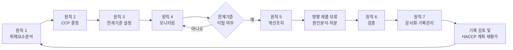
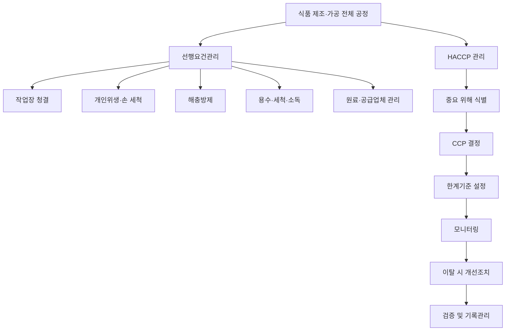

# [QA+ 블로그 생성 결과물] HC003 HACCP 7원칙 완전이해
생성일시: 2026-09-05 07:21:06 (KST)
적용모델: gpt-5.6-terra

================================================================================
# 📋 최종 발행용 블로그 패키지

### 1. 메타 데이터 (SEO 설정)

- **최종 포스팅 제목**: HACCP 7원칙 쉽게 이해하기｜CCP·한계기준·개선조치까지 연결하는 현장 실무 가이드
- **메타 디스크립션 (120자 내외 요약)**: HACCP 7원칙을 위해요소분석, CCP 결정, 한계기준, 모니터링, 개선조치, 검증, 기록관리의 연결 흐름으로 이해하는 식품 제조 현장 실무 가이드입니다.
- **추천 해시태그 (10개)**:  
  #HACCP #HACCP7원칙 #식품안전 #식품품질관리 #CCP #한계기준 #개선조치 #식품제조업 #식품위생 #HACCP심사
- **카테고리**: HACCP가이드

> **QA 검수 반영 사항**
> - 「식품 및 축산물 안전관리인증기준」, 「식품위생법」, 「축산물 위생관리법」 및 Codex CXC 1-1969 언급은 원고의 취지에 맞게 유지했습니다.
> - 법령·고시·식품공전은 개정 가능성이 있으므로, 인증 신청·심사 대응용 기준값에는 반드시 게시일 기준 원문 확인이 필요합니다.
> - 원고 마지막의 `HC003`은 본문에서 과정명 또는 교육기관이 특정되지 않았으므로, 독자가 특정 공식 과정으로 오인하지 않도록 “해당 교육기관 또는 공식 교재 확인” 문구를 유지했습니다.
> - 본문 사례의 온도·시간·생산량 등은 특정 공장에 그대로 적용할 수 있는 법정 기준이 아닌 실무 판단 구조 예시임을 유지했습니다.

---

## 2. 네이버 블로그 / 티스토리 복사용 최종 원고 (Markdown)

# HACCP 7원칙, 외우지 말고 연결해서 이해하기｜CCP·한계기준·개선조치 현장 실무 가이드

> **20년 실무 선배의 한 줄 요약**  
> HACCP 7원칙은 “위해를 찾고 → 반드시 관리할 공정을 고르고 → 기준을 정해 감시하고 → 이탈하면 제품과 공정을 함께 조치한 뒤 → 효과를 검증하고 증거를 남기는 관리 흐름”입니다.  
> 계획서부터 먼저 쓰지 말고, 우리 공장의 실제 공정흐름도 위에 7원칙을 하나씩 대입해 보시면 훨씬 빠르게 정리됩니다.

---

## 1. HACCP 7원칙은 암기 과목이 아니라 ‘관리 흐름’입니다

HACCP 교육을 처음 들으면 위해요소분석, CCP 결정, 한계기준, 모니터링, 개선조치, 검증, 기록관리라는 단어를 순서대로 외우게 됩니다. 그런데 막상 현장에 돌아와 HACCP 계획서를 펼치면 “위해요소는 찾았는데 왜 이 공정이 CCP지?”, “기준을 벗어나면 재측정만 하면 되는 것 아닌가?”에서 막히는 경우가 많습니다.

결론부터 말씀드리면 HACCP 7원칙은 각각 따로 노는 문서 항목이 아니라, 앞 단계의 판단이 다음 단계의 근거가 되는 하나의 연결된 관리체계입니다.

쉽게 말하면 HACCP는 식품 사고가 나기 전에 위험한 구간을 미리 찾아 집중적으로 지키는 방법입니다. 원칙 1에서 위해요소를 분석했다면, 원칙 2에서는 그 위해를 반드시 잡아야 하는 핵심 공정인 CCP를 결정합니다. 원칙 3과 4에서는 그 CCP가 제대로 관리되고 있는지 판단할 수 있는 한계기준과 확인 방법을 만듭니다. 그리고 기준에서 벗어나면 원칙 5에 따라 제품을 보류하고 원인을 제거하며, 원칙 6과 7에서 이 관리체계가 실제로 작동한다는 사실을 검증하고 기록으로 증명합니다.



여기서 선행요건관리와 HACCP를 구분하셔야 합니다. 선행요건관리란 작업장 청결, 손 세척, 해충방제, 용수관리, 세척·소독, 개인위생, 원료 입고관리처럼 공장 전체의 기본 위생 환경을 유지하는 활동입니다. 반면 HACCP는 특정 제품과 특정 공정에서 발생할 수 있는 중요한 위해를 찾아 집중적으로 관리하는 체계입니다.

쉽게 말하면 선행요건은 “공장 바닥과 환경을 전체적으로 튼튼하게 만드는 일”이고, HACCP는 “사고가 날 수 있는 핵심 문을 이중으로 잠그는 일”입니다.

그래서 모든 위생관리 항목을 CCP로 만들면 오히려 HACCP가 약해집니다. CCP가 10개, 15개로 늘어나면 작업자는 무엇이 정말 중요한지 놓치기 쉽고, 기록도 형식적으로 흐를 가능성이 높습니다. 심사관도 “이 항목을 왜 CCP로 정했습니까?”라고 물었을 때 관리 논리가 있는지를 봅니다.

결국 좋은 HACCP는 CCP 개수가 많은 공장이 아니라, 중요한 위해를 정확한 공정에서 확실하게 관리하는 공장입니다.


이제 큰 흐름을 잡으셨다면, 다음은 “무엇을 근거로 이 체계를 만들어야 하는가”를 확인할 차례입니다. 현장 경험이 아무리 많아도 법적 기준과 과학적 근거 없이 작성한 HACCP 계획서는 심사에서 흔들릴 수 있습니다.

---

## 2. HACCP 7원칙의 공식 기준과 법적 근거를 먼저 잡으세요

국내 HACCP 운영의 기본 기준은 식품의약품안전처 고시인 **「식품 및 축산물 안전관리인증기준」**입니다. 식품 제조·가공업소와 축산물 관련 영업장은 업종과 적용 범위에 따라 세부 기준을 확인해야 하며, 식품 분야와 축산물 분야는 적용 법령과 요구사항을 혼동하지 않도록 주의해야 합니다.

제도적 근거는 식품 분야의 경우 「식품위생법」, 축산물 분야의 경우 「축산물 위생관리법」과 연계됩니다. 다만 고시 내용과 별표, 적용 대상은 개정될 수 있으므로 실제 인증 준비나 심사 대응 전에는 반드시 국가법령정보센터와 식약처 최신 고시를 재확인하셔야 합니다.

국제적으로는 Codex Alimentarius Commission의 **CXC 1-1969, General Principles of Food Hygiene**가 HACCP 7원칙의 기본 틀을 제시합니다. 국내 HACCP도 이 국제적 원칙을 바탕으로 운영되지만, 국내 인증과 심사에서는 우리나라 고시와 식품공전 기준을 우선 근거로 보셔야 합니다.

예를 들어 어떤 제품의 가열 기준, 미생물 기준, 보관온도 기준은 일반적인 HACCP 교재의 예시보다 해당 제품의 식품공전 기준과 제조 유효성 자료가 더 중요할 수 있습니다. “다른 공장에서 85℃로 관리하더라”는 말은 참고는 될 수 있어도, 우리 제품의 한계기준 근거가 되지는 않습니다.

HACCP 7원칙의 산출물을 간단히 정리하면 아래와 같습니다. 이 표를 보시면 계획서가 왜 이렇게 많은 서식으로 구성되는지 이해가 빨라집니다. 서식이 많아서 HACCP가 복잡한 것이 아니라, 위해를 관리했다는 판단 근거를 단계별로 남겨야 하기 때문에 필요한 것입니다.

즉, 표 한 장 한 장이 심사 제출용 종이가 아니라 식품안전 사고를 예방하기 위한 논리의 연결고리입니다.

| HACCP 7원칙 | 핵심 질문 | 현장에서 남겨야 할 산출물 |
|---|---|---|
| 원칙 1. 위해요소분석 | 어떤 위해가 어디서 발생할 수 있는가? | 공정별 위해요소분석표, 근거자료 |
| 원칙 2. CCP 결정 | 반드시 관리해야 할 핵심 단계는 어디인가? | CCP 결정도, CCP 결정 사유 |
| 원칙 3. 한계기준 설정 | 안전하다고 판정할 경계값은 무엇인가? | 온도·시간·pH·감도 등 기준서 |
| 원칙 4. 모니터링 | 누가, 무엇을, 얼마나 자주 확인할 것인가? | 모니터링 절차서, 기록지 |
| 원칙 5. 개선조치 | 기준 이탈 시 제품과 공정을 어떻게 처리할 것인가? | 이탈조치 기준, 제품 보류·처분 기록 |
| 원칙 6. 검증 | 이 체계가 실제로 효과 있게 작동하는가? | 검증계획서, 검증결과서, 내부심사 결과 |
| 원칙 7. 문서화·기록관리 | 관리 사실을 어떻게 증명하고 보존할 것인가? | HACCP 계획서, 기록물 관리대장 |

실무에서는 특히 한계기준과 관리기준을 구분해 두시면 좋습니다.

**한계기준(Critical Limit)**은 이탈하면 제품 안전성에 영향을 줄 수 있어 즉시 조치가 필요한 경계값입니다. 반면 관리기준 또는 작업기준은 공정이 안정적으로 운영되도록 한계기준보다 여유 있게 내부에서 관리하는 값일 수 있습니다.

쉽게 말하면 한계기준은 “절대 넘으면 안 되는 안전선”이고, 관리기준은 “안전선에 가까워지기 전에 미리 브레이크를 밟는 경고선”입니다.

공식 기준을 이해했다면 이제 가장 중요한 출발점인 위해요소분석으로 들어가 보겠습니다. HACCP 문서의 품질은 대부분 이 첫 단추를 얼마나 현실적으로 끼우느냐에서 결정됩니다.

---

## 3. 원칙 1·2: 위해요소분석과 CCP 결정, 여기서 HACCP의 절반이 결정됩니다

원칙 1인 위해요소분석은 원료 입고부터 출하까지 각 공정에서 어떤 위험이 생길 수 있는지 찾는 작업입니다. 위해요소는 일반적으로 **생물학적 위해, 화학적 위해, 물리적 위해**로 나누어 검토합니다.

- **생물학적 위해**: 병원성 미생물, 바이러스, 기생충 등
- **화학적 위해**: 잔류농약, 세척제, 알레르겐 교차접촉, 동물용의약품 등
- **물리적 위해**: 금속, 유리, 플라스틱, 돌, 경질 이물 등 소비자에게 상해를 줄 수 있는 이물

이때 흔한 실수는 위해요소를 인터넷 예시 그대로 복사해 오는 것입니다. 위해요소분석표에는 “병원성 미생물”, “금속 이물”을 적어 놓았는데, 실제로 어떤 원료에서 어떤 조건으로 발생하고, 현재 어떤 관리수단이 있는지 설명하지 못하는 공장이 의외로 많습니다.

위해요소는 반드시 **발생 가능성, 심각성, 예방·제거·감소 가능성, 기존 관리수단의 적절성**까지 함께 분석해야 합니다. 예를 들어 냉동 채소 원료의 미생물 위해는 입고검사와 공급업체 관리만으로 충분한지, 아니면 후속 가열공정에서 제거되는지까지 연결해서 판단해야 합니다.

원칙 2인 CCP 결정은 이렇게 분석한 위해 중에서 “이 공정을 놓치면 안전을 확보하기 어려운가?”를 판단하는 단계입니다. CCP는 Critical Control Point, 즉 **중요관리점**입니다.

쉽게 말하면 제품 안전에 직접 영향을 주는 위해를 예방·제거하거나 허용 가능한 수준까지 줄이기 위해 반드시 관리해야 하는 공정입니다. 가열·살균, 금속검출, 냉각, 산도 조절, 밀봉 상태 확인 등이 대표적인 후보가 될 수 있지만, 모든 공장에서 같은 공정이 CCP가 되는 것은 아닙니다.

CCP 결정도는 판단을 돕는 도구이지 자동 판정기가 아닙니다. 예를 들어 작업자 손 세척은 매우 중요하지만, 대부분의 경우 전 공정에 적용되는 개인위생 선행요건으로 관리하는 것이 맞습니다. 반대로 레토르트 식품의 열처리는 병원성 미생물 위해를 줄이는 최종 핵심 수단이므로 CCP가 될 가능성이 높습니다.

심사관이 “왜 이것은 CCP이고 저것은 선행요건입니까?”라고 물으면, 위해요소와 관리수단의 연결 논리로 답하시면 됩니다.

> **현장 판단 공식**  
> “위해가 있다” = 무조건 CCP가 아닙니다.  
> “이 단계에서 관리하지 못하면 뒤 공정에서 안전성을 회복하기 어렵다” = CCP 후보입니다.



위해요소와 CCP를 정했다면, 이제는 막연한 “잘 관리한다”를 숫자와 판정 기준으로 바꾸어야 합니다. 그 역할을 하는 것이 원칙 3의 한계기준입니다.

---

## 4. 원칙 3·4: 한계기준과 모니터링은 ‘측정 가능한 언어’로 작성해야 합니다

한계기준은 CCP가 안전하게 관리되고 있는지를 판정하는 **측정 가능하거나 관찰 가능한 기준**입니다. 가열 CCP라면 온도와 시간, 금속검출 CCP라면 시험편 감도 확인, 산도 관리라면 pH, 냉각 공정이라면 제품 중심온도와 냉각시간이 한계기준이 될 수 있습니다.

여기서 핵심은 “좋은 상태”, “충분히 가열”, “이상 없음” 같은 표현을 쓰지 않는 것입니다. 작업자 두 명이 같은 결과를 판단할 수 있을 정도로 명확해야 합니다.

한계기준은 작업자가 편한 값이 아니라 안전성을 확보하는 근거 있는 값이어야 합니다. 근거는 식품공전 또는 관련 법령 기준, 제품 특성, 미생물 사멸 자료, 설비 제조사 매뉴얼, 시험성적서, 외부 연구자료, 내부 유효성 평가 결과 등에서 가져올 수 있습니다.

예를 들어 “중심온도 75℃ 이상, 1분 이상” 같은 값은 제품의 두께와 조성, 가열방식, 목표 미생물, 실제 설비 성능에 따라 달라질 수 있습니다. 따라서 블로그나 타사 사례의 숫자를 그대로 복사하지 말고, 우리 제품과 설비 조건에서 검증된 자료를 파일로 연결해 두셔야 합니다.

모니터링은 정한 한계기준을 실제로 지키고 있는지 확인하는 활동입니다. 모니터링 절차에는 적어도 다음 다섯 가지가 들어가야 합니다.

1. **무엇을 확인할 것인가**
2. **어떤 방법과 장비로 확인할 것인가**
3. **누가 확인할 것인가**
4. **언제 또는 얼마나 자주 확인할 것인가**
5. **어디에 기록할 것인가**

“매 2시간마다 가열온도 확인”이라고만 적으면 부족할 수 있습니다. 제품 중심온도를 측정하는지, 가열조 표시온도를 확인하는지, 어느 위치에서 측정하는지, 사용하는 온도계의 검·교정 상태는 어떤지까지 명확해야 현장에서 같은 결과가 나옵니다.

기록지는 현장 작업자가 10초 안에 이해할 수 있게 만들어야 합니다. 지나치게 많은 칸을 넣으면 작업자는 나중에 몰아서 쓰게 되고, 너무 단순하면 이탈 상황을 남길 자리가 없어집니다.

날짜·시간·로트번호·측정값·판정·작업자 서명·확인자·이탈 시 조치란을 기본 구조로 잡고, 측정 위치나 시험편 규격은 기록지 상단에 표시해 두시면 좋습니다.

한 달 동안 온도가 모두 85.0℃처럼 똑같이 기록되어 있다면 “공정이 매우 안정적”이라고 보기보다 실제 측정 여부부터 확인해야 합니다.


이제 기준을 정하고 확인하는 방법까지 만들었습니다. 하지만 HACCP의 진짜 실력은 기준을 벗어났을 때 드러납니다. 다음 원칙인 개선조치는 단순히 “다시 측정해서 정상”으로 끝내면 안 됩니다.

---

## 5. 원칙 5: 한계기준 이탈 시에는 제품과 공정을 동시에 잡아야 합니다

한계기준 이탈은 “측정값이 기준 밖으로 나왔다”는 의미이지만, 현장에서는 그보다 훨씬 큰 질문이 따라옵니다.

- 언제부터 이탈했는가?
- 그 시간 동안 생산된 제품은 어디에 있는가?
- 이미 출하됐는가?
- 재처리가 가능한가?

그래서 개선조치는 공정 복구만이 아니라 **제품 안전성 확보와 재발방지**까지 포함해야 합니다. 재측정 결과가 정상으로 돌아왔다고 해서 이탈 전 생산품의 안전성이 자동으로 보장되는 것은 아닙니다.

개선조치의 기본 순서는 다음처럼 잡으시면 됩니다.

```text
[한계기준 이탈]
        │
        ▼
[이탈 시점 및 마지막 정상 확인 시점 파악]
        │
        ▼
[영향 가능 로트 식별·보류]
        │
        ├──────────────┐
        ▼              ▼
[공정 원인 조사]    [제품 안전성 평가]
        │              │
        ▼              ▼
[설비·센서·작업·   [재처리·재검사·
 원료·조건 확인]    선별·폐기·출하보류]
        └──────┬───────┘
               ▼
       [공정 복구 및 재발방지]
               │
               ▼
       [개선조치·검증·기록]
```

먼저 이탈 사실을 확인하고, 해당 시간대 및 전후 영향 가능 생산품을 로트 단위로 식별해 보류합니다. 그다음 설비 이상, 작업자 조작 오류, 원료 상태, 센서 오차, 전력·스팀 공급 문제 등 원인을 조사하고 공정을 정상화합니다.

이후 제품은 재가열·재검사·재선별·폐기·출하보류 등 사전에 정한 기준과 안전성 평가 결과에 따라 처분하며, 모든 판단 근거를 기록해야 합니다.

특히 제품 보류 범위를 정하는 기준이 중요합니다. 예를 들어 금속검출기 성능점검에서 불합격이 발생했다면 “불합격을 발견한 시점”만 보면 안 됩니다. 마지막 정상 점검 이후부터 불합격 발견 시점까지 통과한 제품이 영향 가능 범위가 될 수 있으므로, 해당 시간대 생산 로트를 추적해야 합니다.

가열공정도 마찬가지로 마지막 정상 확인 시점, 설비 트렌드 데이터, 실제 가열 시간, 제품 위치 등을 종합해서 영향 범위를 설정해야 합니다.

개선조치 기록에는 최소한 다음 내용이 들어가야 합니다.

- 이탈 내용
- 발생 일시
- 영향 로트
- 즉시조치
- 제품 처분
- 원인분석
- 공정 복구 결과
- 재발방지 대책
- 책임자 확인

“주의함”, “재측정 정상”, “작업자 교육”만 적어 놓으면 심사관 입장에서는 제품을 어떻게 안전하게 통제했는지 판단하기 어렵습니다. 작업자 교육이 필요할 수는 있지만, 왜 작업자가 실수했는지, 절차서가 모호했는지, 설비 표시가 잘못됐는지까지 근본 원인을 봐야 합니다.

같은 이탈이 한 달에 3회 반복된다면 개인 부주의가 아니라 시스템 문제일 가능성이 높습니다.

| 현장 문제 | 잘못된 대응 | 권장 대응 |
|---|---|---|
| 가열온도 한계기준 미달 | 재측정 후 정상값만 기록 | 영향 로트 보류, 설비·센서 원인 확인, 제품 안전성 평가 후 처분 |
| 금속검출기 시험편 불합격 | 설비 재조정 후 생산 재개 | 마지막 정상점검 이후 생산품 격리, 재검사·재선별 범위 결정 |
| 냉장 보관온도 초과 | 문을 닫고 온도 하강만 확인 | 초과 시간·제품온도·영향 로트 평가, 필요 시 출하보류 및 검사 |
| CCP 기록값이 반복적으로 동일 | 정상 기록으로 간주 | 실제 측정 여부, 장비 상태, 기록 방식, 교육 필요성 점검 |
| 개선조치가 반복됨 | 담당자 주의 조치 | 5Why 등으로 근본 원인 분석, 절차·설비·교육 체계 개선 |
| 공정 변경 후 기존 기준 유지 | 문서 개정 없이 운영 | 위해요소분석 재검토, 한계기준 유효성 평가, 계획서 개정 |

이탈조치를 잘했다면 그다음 질문은 “우리 시스템이 계속 잘 작동하고 있나?”입니다. 이 질문에 답하는 원칙이 바로 검증이며, 모니터링과는 목적이 다릅니다.

---

## 6. 원칙 6·7: 검증과 기록관리는 심사 서류가 아니라 ‘관리 증거’입니다

모니터링과 검증은 비슷해 보여도 역할이 다릅니다.

- **모니터링**: 생산 중 CCP가 한계기준 안에 있는지 일상적으로 확인하는 활동
- **검증**: HACCP 계획이 제대로 설계되어 있고, 현장에서도 계획대로 효과 있게 작동하는지 독립적으로 확인하는 활동

쉽게 말하면 모니터링은 운전 중 계기판을 보는 것이고, 검증은 계기판과 차량 자체가 정확히 작동하는지 정비하는 일에 가깝습니다.

검증 활동에는 모니터링 기록 검토, 현장 관찰, 내부심사, 측정기기 검·교정 확인, 제품 미생물 검사, 이화학 검사, CCP 담당자 인터뷰, 공정 데이터 분석 등이 포함될 수 있습니다.

예를 들어 가열 CCP의 검증은 기록지에 팀장이 서명하는 것만으로 충분하지 않습니다. 실제 가열설비의 온도 분포가 적절한지, 온도계가 정확한지, 작업자가 중심온도 측정 위치를 알고 있는지, 제품 시험 결과가 안정적인지 함께 확인해야 합니다.

검증 주기는 제품 위험도, 생산 빈도, 과거 이탈 이력, 공정 변동성에 맞춰 정하되, 계획서에 명확히 정해 두셔야 합니다.

또 하나 꼭 구분할 것이 **유효성 평가(Validation)**입니다.

검증이 “정한 계획이 현장에서 잘 지켜지는가”를 확인하는 것이라면, 유효성 평가는 “처음 설정한 한계기준과 관리방법 자체가 위해를 충분히 제어할 수 있는가”를 과학적으로 확인하는 활동입니다.

예를 들어 신제품이 출시되거나, 기존 소스의 점도가 바뀌거나, 가열설비를 교체했다면 기존 가열시간과 온도가 여전히 유효한지 다시 평가해야 합니다. 원료 공급처 변경, 포장재 변경, 생산량 급증, 공정 순서 변경, 법령·식품공전 기준 개정도 HACCP 계획 재평가의 신호가 될 수 있습니다.

원칙 7의 문서화와 기록관리는 HACCP 운영의 마지막 단계이면서 동시에 모든 단계의 증거입니다.

HACCP 팀 구성, 제품설명서, 용도 및 소비자, 공정흐름도, 현장확인 기록, 위해요소분석표, CCP 결정 근거, 한계기준 근거, 모니터링 기록, 이탈조치 기록, 검증 결과가 서로 연결되어야 합니다.

기록은 나중에 보기 좋게 작성하는 보고서가 아니라, 그 시점에 실제 관리가 수행됐다는 객관적 증거입니다. 빈칸이 많거나, 수정 흔적이 부적절하거나, 서명이 빠져 있거나, 모든 값이 지나치게 동일하면 기록의 신뢰성이 떨어질 수 있습니다.

기록 수정이 필요할 때는 원래 내용을 지워버리기보다 회사의 기록관리 절차에 따라 원기록이 식별되도록 수정하고, 수정자와 수정일자, 필요 시 수정 사유를 남기는 방식이 안전합니다.

전자기록을 운영한다면 권한관리, 수정 이력, 백업, 출력 및 보존 가능 여부도 점검해야 합니다. 보존기간은 업종·품목·관련 기준 및 자체 절차에 따라 달라질 수 있으므로, 법정 보존 요구사항과 사내 기준을 함께 확인하세요.

기록은 많이 쌓는 것보다, 실제 현장과 정확히 일치하고 추적 가능한 방식으로 관리하는 것이 훨씬 중요합니다.

문서와 기록의 기본을 잡았다면, 이제 실제 제조 현장에서 7원칙이 어떻게 적용되는지 보겠습니다. 아래 사례는 특정 공장의 정답이 아니라, 판단 구조를 익히기 위한 실무형 예시입니다.

---

## 7. 실제 현장 사례로 보는 HACCP 7원칙 적용법

### 사례 1. 냉동만두 제조공장 가열 CCP 온도 이탈

냉동만두 제조공장에서 증숙 후 냉각하는 공정의 가열 CCP를 운영하고 있었습니다. 한계기준은 제품 특성과 유효성 평가자료를 바탕으로 설정되어 있었고, 작업자는 배치별 중심온도를 측정해 기록했습니다.

어느 날 오후 생산 중 중심온도가 내부 한계기준보다 낮게 측정됐지만, 현장 담당자는 설비 표시온도가 정상이라는 이유로 바로 재측정만 하려 했습니다. 품질팀은 마지막 정상 측정 시점부터 이탈 발견 시점까지 생산한 만두 약 1,200kg을 우선 보류했습니다.

원인 조사 결과 증숙기 온도 표시센서는 정상처럼 보였지만, 실제 제품이 지나가는 컨베이어 속도가 작업량 증가로 평소보다 빨라져 체류시간이 부족했던 것이 확인됐습니다. 즉, 온도만 보고 시간을 놓친 것이 근본 원인이었습니다.

이후 해당 제품은 재증숙 가능 여부를 유효성 기준에 따라 검토하고, 일부는 재처리했으며 재처리가 부적절한 범위는 폐기 처리했습니다. 개선조치로 컨베이어 속도 상한을 작업표준서에 명시하고, 가열 CCP 모니터링 항목에 중심온도뿐 아니라 설비 속도와 증기압 확인 항목을 추가했습니다.

그 결과 이후 3개월 동안 동일 유형의 이탈은 발생하지 않았고, 내부검증에서 작업자도 온도·시간·체류량의 관계를 설명할 수 있게 됐습니다.

### 사례 2. 액상 소스 제조공장 금속검출기 성능 불합격

액상 소스를 파우치에 충전하는 제조공장에서는 포장 후 금속검출기를 CCP로 관리하고 있었습니다. 생산 시작 전, 중간, 종료 시 표준시험편으로 감도를 확인하도록 되어 있었는데, 중간 점검에서 비철 금속 시험편이 검출되지 않았습니다.

현장에서는 금속검출기 감도를 조정한 뒤 시험편이 다시 검출되자 바로 생산을 이어가려 했습니다. 하지만 품질팀은 마지막 정상 점검 이후 약 2시간 동안 생산된 4개 로트를 모두 출하보류했습니다.

설비를 점검한 결과 감도 설정값 자체의 문제가 아니라, 파우치 제품이 컨베이어 중앙이 아닌 한쪽으로 치우쳐 통과하면서 검출 성능이 불안정해진 것으로 확인됐습니다. 근본 원인은 교대조 작업자가 제품 가이드 폭을 교체 후 원래 위치로 복원하지 않은 것이었고, 교체 확인 절차도 없었습니다.

보류 제품은 전량 재검출하고, 필요 구간은 선별 조건을 강화해 처리했으며, 재검출 결과와 로트 추적 결과를 개선조치서에 남겼습니다. 이후 가이드 위치 확인을 금속검출기 일상점검 항목에 추가하고, 교체 작업 후 최초품 확인을 품질팀 확인사항으로 지정했습니다.

그 뒤에는 시험편 불합격 발생 시 단순 재가동이 아니라 영향 제품 범위를 먼저 설정하는 문화가 자리 잡았습니다.

### 사례 3. 레토르트 죽 제조공장 공정 변경 후 한계기준 재평가

레토르트 죽 제조공장은 기존에 사용하던 쌀 원료 대신 입자 크기가 더 큰 원료로 공급처를 변경했습니다. 구매팀은 원료 규격서상 성분 차이가 크지 않다고 판단했고, 생산팀도 기존 레토르트 조건으로 시험 생산을 진행했습니다.

초기 생산 기록은 모두 한계기준을 만족하는 것처럼 보였지만, 품질팀은 점도가 높아지고 고형물 입자가 커진 점에 주목했습니다. 같은 설비 조건이라도 열이 제품 중심부까지 도달하는 양상이 달라질 수 있기 때문입니다.

HACCP 팀은 원료 변경을 단순 구매 변경이 아니라 공정 유효성에 영향을 줄 수 있는 변경사항으로 분류했습니다. 이후 열침투 관련 데이터와 제품 물성을 확인하고, 필요 시험을 통해 기존 살균 조건이 목표 안전성을 충족하는지 재평가했습니다.

평가 과정에서 일부 충전량 조건에서 여유가 부족할 가능성이 확인되어, 충전 중량 관리범위를 조정하고 제품별 공정조건을 세분화했습니다. 또한 원료 공급처 변경 시 HACCP 팀 사전 검토를 거치도록 변경관리 절차를 개정했습니다.

이 사례의 핵심은 기록상 기준을 지켰더라도, 기준 자체가 변경된 제품에 여전히 유효한지 별도로 확인해야 한다는 점입니다.

세 사례를 보면 업종과 공정은 달라도 공통점이 있습니다. 이탈이 발생했을 때는 제품을 먼저 통제했고, 원인은 작업자 개인에게만 돌리지 않았으며, 설비·절차·변경관리까지 개선했습니다.

바로 이 연결이 원칙 1부터 7까지를 실제로 운영하는 방법입니다.

---

## 8. 심사 전에 꼭 확인할 단계별 자가점검 체크리스트

심사 준비에서 가장 효과적인 방법은 품질팀이 문서를 혼자 정리하는 것이 아니라, 생산·공무·구매 담당자와 함께 현장을 한 바퀴 도는 것입니다.

공정흐름도를 들고 실제 작업장을 따라가 보면 문서에 없는 대기시간, 임시 보관, 재작업, 인력 이동, 원료 이동이 발견되는 경우가 많습니다. 특히 생산량이 많아지는 시간대, 교대 시간, 설비 세척 후 재가동 시점은 평소와 다른 변수가 생기기 쉬우므로 집중적으로 보셔야 합니다.

공정흐름도와 현장이 다르면 위해요소분석부터 다시 흔들립니다.

CCP 담당자에게는 어려운 질문보다 기본 질문을 해보시면 됩니다.

- “여기 한계기준이 무엇인가요?”
- “기준을 벗어나면 첫 번째로 무엇을 하나요?”
- “마지막 정상 확인 시점은 어디서 찾나요?”

이 정도면 충분합니다. 담당자가 답을 못 한다면 개인을 탓하기보다 기록지, 작업표준서, 현장 게시물, 교육 방법이 실제 작업자 눈높이에 맞는지 먼저 점검해야 합니다.

현장에서 바로 답할 수 있는 체계가 심사에서도 강합니다.

| 점검 단계 | 확인 항목 | 실무 확인 방법 | 권장 주기 |
|---|---|---|---|
| 제품·공정 확인 | 제품설명서와 실제 제품이 일치하는가 | 배합, 포장규격, 보관·유통조건 대조 | 변경 시 즉시 |
| 공정흐름도 | 실제 공정과 문서가 동일한가 | 현장 워크스루, 작업자 인터뷰 | 연 1회 이상 및 변경 시 |
| 위해요소분석 | 생물·화학·물리적 위해와 근거가 있는가 | 클레임, 검사성적서, 원료규격서 검토 | 연 1회 이상 및 변경 시 |
| CCP 결정 | 선행요건과 CCP가 구분되는가 | CCP 결정 사유와 관리수단 확인 | 계획 재평가 시 |
| 한계기준 | 측정 가능하고 과학적 근거가 있는가 | 법령, 유효성 자료, 설비 데이터 대조 | 설정·변경 시 |
| 모니터링 | 담당자·방법·주기·기록이 명확한가 | 현장 시연, 기록지와 설비값 비교 | 일상 및 월간 검토 |
| 개선조치 | 제품 보류와 처분 기준이 있는가 | 최근 이탈조치서 추적 확인 | 이탈 발생 시 |
| 검증 | 서명 외의 검증활동이 있는가 | 내부심사, 시험, 검·교정, 현장확인 검토 | 월간·분기·연간 계획별 |
| 기록관리 | 누락·동일값 반복·부적절 수정이 없는가 | 표본 기록 추적, 원기록 확인 | 주간 또는 월간 |

심사관은 완벽하게 문제 없는 공장만 찾는 것이 아닙니다. 문제가 발생했을 때 발견할 수 있는지, 제품을 통제했는지, 원인을 분석했는지, 재발방지까지 했는지를 봅니다.

따라서 작은 이탈을 숨기기보다 투명하게 기록하고 개선한 이력이 오히려 관리체계의 신뢰도를 높일 수 있습니다. 단, 그 기록이 실제 현장과 맞아야 한다는 전제가 반드시 붙습니다.

체크리스트까지 점검했다면 마지막으로 자주 나오는 질문을 정리해 보겠습니다. 교육 시험을 준비하는 분도, 인증 심사를 준비하는 분도 아래 질문만 정확히 설명할 수 있으면 기본 골격은 잡힌 것입니다.

---

## 9. HACCP 7원칙 FAQ｜심사관이 자주 묻는 질문

### Q1. HACCP 7원칙과 HACCP 12절차는 같은 개념인가요?

**A.** 같지 않지만 서로 연결된 개념입니다. 7원칙은 위해요소분석부터 기록관리까지 HACCP 관리의 핵심 원칙이고, 12절차는 HACCP 팀 구성, 제품설명서 작성, 공정흐름도 작성·현장확인 등을 거쳐 7원칙을 적용하는 전체 구축 절차입니다.

쉽게 말하면 12절차는 HACCP를 만드는 길이고, 7원칙은 그 안에서 반드시 작동해야 하는 핵심 엔진입니다.

### Q2. 위해요소가 발견되면 전부 CCP로 지정해야 하나요?

**A.** 아닙니다. 위해요소가 존재한다는 사실과 CCP라는 판단은 다릅니다. 공급업체 관리, 입고검사, 세척·소독, 개인위생, 해충방제 등 선행요건으로 충분히 관리할 수 있는 항목은 CCP가 아닐 수 있습니다.

해당 단계에서 관리하지 못하면 이후 공정에서 위해를 제거하거나 허용 수준까지 낮추기 어려운지를 중심으로 판단하셔야 합니다.

### Q3. 한계기준은 법령에 적힌 숫자만 사용해야 하나요?

**A.** 법령이나 식품공전에 명확한 기준이 있다면 우선적으로 반영해야 합니다. 다만 모든 공정의 CCP 한계기준이 법령에 숫자로 정해져 있는 것은 아니므로, 제품 안전성 자료, 과학 문헌, 설비 성능, 유효성 평가, 내부 공정 데이터 등을 활용해 설정할 수 있습니다.

중요한 것은 숫자 자체가 아니라 “왜 이 숫자가 안전성을 보장하는가”를 설명할 근거 파일이 있다는 점입니다.

### Q4. 모니터링과 검증의 차이를 한 문장으로 설명하면 무엇인가요?

**A.** 모니터링은 생산 중 CCP가 기준 안에 있는지 확인하는 활동이고, 검증은 HACCP 시스템 전체가 계획대로 효과 있게 작동하는지 확인하는 활동입니다.

예를 들어 작업자가 2시간마다 온도를 기록하는 것은 모니터링이고, 품질팀이 온도계 검·교정 상태와 기록의 적정성, 실제 현장 측정을 확인하는 것은 검증입니다. 둘 중 하나만 잘해도 HACCP가 완성되는 것은 아닙니다.

### Q5. CCP 한계기준을 이탈한 제품은 반드시 폐기해야 하나요?

**A.** 무조건 폐기라고 단정할 수는 없습니다. 이탈 범위, 제품 특성, 위해 수준, 재처리 가능성, 재검사 결과, 관련 법적 기준 등을 검토해 재처리·재선별·출하보류·폐기 등 적절한 처분을 결정해야 합니다.

다만 제품을 계속 출하하려면 그 제품이 안전하다는 객관적 근거가 있어야 하며, 처분 과정과 판단 근거는 반드시 기록으로 남겨야 합니다.

### Q6. 측정기기 검·교정만 잘하면 검증이 충분한가요?

**A.** 검·교정은 측정값의 신뢰성을 확보하는 매우 중요한 활동이지만, HACCP 전체 검증의 일부일 뿐입니다. 온도계가 정확해도 작업자가 잘못된 위치에서 측정하거나, 모니터링 주기가 부적절하거나, 이탈조치가 작동하지 않으면 시스템은 실패할 수 있습니다.

검증은 기기, 기록, 작업자, 공정, 제품시험 결과를 종합적으로 보는 활동이어야 합니다.

### Q7. 기록을 빠짐없이 작성하면 HACCP 운영이 잘되고 있다고 봐도 되나요?

**A.** 기록이 완벽해 보여도 실제 공정과 다르면 좋은 HACCP라고 할 수 없습니다. 심사에서는 기록값과 설비 표시값이 일치하는지, 작업자가 본인 기록의 의미를 아는지, 이탈이 발생했을 때 실제로 제품을 보류했는지 등을 함께 확인합니다.

기록은 잘 쓰는 것이 목적이 아니라, 실제 관리가 이뤄졌다는 증거가 되어야 합니다.

---

## 10. 맺음말｜우리 공정흐름도 위에 7원칙을 직접 올려보세요

오늘 내용은 길어 보이지만 핵심은 세 줄입니다.

1. 위해요소를 현실적으로 분석하고 선행요건과 CCP를 구분해야 합니다.  
2. CCP에는 근거 있는 한계기준과 실제로 실행 가능한 모니터링·개선조치가 붙어야 합니다.  
3. 검증과 기록관리는 서류 작업이 아니라 우리 제품이 안전하게 관리됐다는 증거를 만드는 일입니다.  

처음 HACCP를 맡으면 위해요소분석표, CCP 결정도, 기록지, 검증계획서가 각각 별개 문서처럼 느껴집니다. 하지만 공정흐름도를 가운데 놓고 보면 연결이 보입니다.

“이 공정에서 어떤 위해가 생기지? → 어디서 잡지? → 뭘로 판단하지? → 벗어나면 제품을 어떻게 막지?”

이 질문을 순서대로 던지시면 됩니다.

오늘 바로 해볼 실무 과제는 간단합니다. 우리 공장의 실제 공정흐름도를 출력해서, 각 공정 옆에 생물학적·화학적·물리적 위해를 적고 현재 관리수단을 표시해 보세요.

그중 “여기서 놓치면 뒤에서 회복하기 어렵다”는 공정만 골라 CCP 후보로 검토하면 HACCP 7원칙이 암기가 아니라 현장 언어로 바뀝니다.

> **발행 전 확인사항**  
> HC003의 정확한 과정명·교육 범위·평가 기준은 해당 교육기관 또는 공식 교재를 통해 별도 확인하시고, 인증·심사 대응에 사용하는 법령 및 고시 내용은 반드시 게시일 기준 최신 식약처 고시와 국가법령정보센터 원문으로 재확인하시기 바랍니다.

막히는 부분이 있으면 댓글로 편하게 물어보세요. 후배님들의 심사 통과와 칼퇴를 응원합니다.

---

## 3. 워드프레스 / 웹사이트용 HTML 원고

```html
<article class="food-qa-post">
  <header>
    <h1>HACCP 7원칙, 외우지 말고 연결해서 이해하기｜CCP·한계기준·개선조치 현장 실무 가이드</h1>
    <blockquote>
      <p><strong>20년 실무 선배의 한 줄 요약</strong><br>
      HACCP 7원칙은 “위해를 찾고 → 반드시 관리할 공정을 고르고 → 기준을 정해 감시하고 → 이탈하면 제품과 공정을 함께 조치한 뒤 → 효과를 검증하고 증거를 남기는 관리 흐름”입니다.<br>
      계획서부터 먼저 쓰지 말고, 우리 공장의 실제 공정흐름도 위에 7원칙을 하나씩 대입해 보시면 훨씬 빠르게 정리됩니다.</p>
    </blockquote>
  </header>

  <section>
    <h2>1. HACCP 7원칙은 암기 과목이 아니라 ‘관리 흐름’입니다</h2>

    <p>HACCP 교육을 처음 들으면 위해요소분석, CCP 결정, 한계기준, 모니터링, 개선조치, 검증, 기록관리라는 단어를 순서대로 외우게 됩니다. 그런데 막상 현장에 돌아와 HACCP 계획서를 펼치면 “위해요소는 찾았는데 왜 이 공정이 CCP지?”, “기준을 벗어나면 재측정만 하면 되는 것 아닌가?”에서 막히는 경우가 많습니다.</p>

    <p>결론부터 말씀드리면 HACCP 7원칙은 각각 따로 노는 문서 항목이 아니라, 앞 단계의 판단이 다음 단계의 근거가 되는 하나의 연결된 관리체계입니다.</p>

    <p>쉽게 말하면 HACCP는 식품 사고가 나기 전에 위험한 구간을 미리 찾아 집중적으로 지키는 방법입니다. 원칙 1에서 위해요소를 분석했다면, 원칙 2에서는 그 위해를 반드시 잡아야 하는 핵심 공정인 CCP를 결정합니다. 원칙 3과 4에서는 그 CCP가 제대로 관리되고 있는지 판단할 수 있는 한계기준과 확인 방법을 만듭니다. 그리고 기준에서 벗어나면 원칙 5에 따라 제품을 보류하고 원인을 제거하며, 원칙 6과 7에서 이 관리체계가 실제로 작동한다는 사실을 검증하고 기록으로 증명합니다.</p>

    <div class="mermaid">
flowchart LR
    A["원칙 1<br/>위해요소분석"] --> B["원칙 2<br/>CCP 결정"]
    B --> C["원칙 3<br/>한계기준 설정"]
    C --> D["원칙 4<br/>모니터링"]
    D --> E{"한계기준<br/>이탈 여부"}
    E -- "아니오" --> D
    E -- "예" --> F["원칙 5<br/>개선조치"]
    F --> G["영향 제품 보류<br/>원인분석·처분"]
    G --> H["원칙 6<br/>검증"]
    H --> I["원칙 7<br/>문서화·기록관리"]
    I --> J["기록 검토 및<br/>HACCP 계획 재평가"]
    J --> A
    </div>

    <p>여기서 선행요건관리와 HACCP를 구분하셔야 합니다. 선행요건관리란 작업장 청결, 손 세척, 해충방제, 용수관리, 세척·소독, 개인위생, 원료 입고관리처럼 공장 전체의 기본 위생 환경을 유지하는 활동입니다. 반면 HACCP는 특정 제품과 특정 공정에서 발생할 수 있는 중요한 위해를 찾아 집중적으로 관리하는 체계입니다.</p>

    <p>쉽게 말하면 선행요건은 “공장 바닥과 환경을 전체적으로 튼튼하게 만드는 일”이고, HACCP는 “사고가 날 수 있는 핵심 문을 이중으로 잠그는 일”입니다.</p>

    <p>그래서 모든 위생관리 항목을 CCP로 만들면 오히려 HACCP가 약해집니다. CCP가 10개, 15개로 늘어나면 작업자는 무엇이 정말 중요한지 놓치기 쉽고, 기록도 형식적으로 흐를 가능성이 높습니다. 심사관도 “이 항목을 왜 CCP로 정했습니까?”라고 물었을 때 관리 논리가 있는지를 봅니다.</p>

    <p>결국 좋은 HACCP는 CCP 개수가 많은 공장이 아니라, 중요한 위해를 정확한 공정에서 확실하게 관리하는 공장입니다.</p>

    <figure>
      
      <figcaption>위해요소분석부터 CCP 결정, 한계기준, 모니터링, 개선조치, 검증, 기록관리로 이어지는 HACCP 관리 흐름</figcaption>
    </figure>

    <p>이제 큰 흐름을 잡으셨다면, 다음은 “무엇을 근거로 이 체계를 만들어야 하는가”를 확인할 차례입니다. 현장 경험이 아무리 많아도 법적 기준과 과학적 근거 없이 작성한 HACCP 계획서는 심사에서 흔들릴 수 있습니다.</p>
  </section>

  <section>
    <h2>2. HACCP 7원칙의 공식 기준과 법적 근거를 먼저 잡으세요</h2>

    <p>국내 HACCP 운영의 기본 기준은 식품의약품안전처 고시인 <strong>「식품 및 축산물 안전관리인증기준」</strong>입니다. 식품 제조·가공업소와 축산물 관련 영업장은 업종과 적용 범위에 따라 세부 기준을 확인해야 하며, 식품 분야와 축산물 분야는 적용 법령과 요구사항을 혼동하지 않도록 주의해야 합니다.</p>

    <p>제도적 근거는 식품 분야의 경우 「식품위생법」, 축산물 분야의 경우 「축산물 위생관리법」과 연계됩니다. 다만 고시 내용과 별표, 적용 대상은 개정될 수 있으므로 실제 인증 준비나 심사 대응 전에는 반드시 국가법령정보센터와 식약처 최신 고시를 재확인하셔야 합니다.</p>

    <p>국제적으로는 Codex Alimentarius Commission의 <strong>CXC 1-1969, General Principles of Food Hygiene</strong>가 HACCP 7원칙의 기본 틀을 제시합니다. 국내 HACCP도 이 국제적 원칙을 바탕으로 운영되지만, 국내 인증과 심사에서는 우리나라 고시와 식품공전 기준을 우선 근거로 보셔야 합니다.</p>

    <p>예를 들어 어떤 제품의 가열 기준, 미생물 기준, 보관온도 기준은 일반적인 HACCP 교재의 예시보다 해당 제품의 식품공전 기준과 제조 유효성 자료가 더 중요할 수 있습니다. “다른 공장에서 85℃로 관리하더라”는 말은 참고는 될 수 있어도, 우리 제품의 한계기준 근거가 되지는 않습니다.</p>

    <table>
      <thead>
        <tr>
          <th>HACCP 7원칙</th>
          <th>핵심 질문</th>
          <th>현장에서 남겨야 할 산출물</th>
        </tr>
      </thead>
      <tbody>
        <tr><td>원칙 1. 위해요소분석</td><td>어떤 위해가 어디서 발생할 수 있는가?</td><td>공정별 위해요소분석표, 근거자료</td></tr>
        <tr><td>원칙 2. CCP 결정</td><td>반드시 관리해야 할 핵심 단계는 어디인가?</td><td>CCP 결정도, CCP 결정 사유</td></tr>
        <tr><td>원칙 3. 한계기준 설정</td><td>안전하다고 판정할 경계값은 무엇인가?</td><td>온도·시간·pH·감도 등 기준서</td></tr>
        <tr><td>원칙 4. 모니터링</td><td>누가, 무엇을, 얼마나 자주 확인할 것인가?</td><td>모니터링 절차서, 기록지</td></tr>
        <tr><td>원칙 5. 개선조치</td><td>기준 이탈 시 제품과 공정을 어떻게 처리할 것인가?</td><td>이탈조치 기준, 제품 보류·처분 기록</td></tr>
        <tr><td>원칙 6. 검증</td><td>이 체계가 실제로 효과 있게 작동하는가?</td><td>검증계획서, 검증결과서, 내부심사 결과</td></tr>
        <tr><td>원칙 7. 문서화·기록관리</td><td>관리 사실을 어떻게 증명하고 보존할 것인가?</td><td>HACCP 계획서, 기록물 관리대장</td></tr>
      </tbody>
    </table>

    <p>실무에서는 특히 한계기준과 관리기준을 구분해 두시면 좋습니다. <strong>한계기준(Critical Limit)</strong>은 이탈하면 제품 안전성에 영향을 줄 수 있어 즉시 조치가 필요한 경계값입니다. 반면 관리기준 또는 작업기준은 공정이 안정적으로 운영되도록 한계기준보다 여유 있게 내부에서 관리하는 값일 수 있습니다.</p>

    <p>쉽게 말하면 한계기준은 “절대 넘으면 안 되는 안전선”이고, 관리기준은 “안전선에 가까워지기 전에 미리 브레이크를 밟는 경고선”입니다.</p>
  </section>

  <section>
    <h2>3. 원칙 1·2: 위해요소분석과 CCP 결정, 여기서 HACCP의 절반이 결정됩니다</h2>

    <p>원칙 1인 위해요소분석은 원료 입고부터 출하까지 각 공정에서 어떤 위험이 생길 수 있는지 찾는 작업입니다. 위해요소는 일반적으로 <strong>생물학적 위해, 화학적 위해, 물리적 위해</strong>로 나누어 검토합니다.</p>

    <ul>
      <li><strong>생물학적 위해</strong>: 병원성 미생물, 바이러스, 기생충 등</li>
      <li><strong>화학적 위해</strong>: 잔류농약, 세척제, 알레르겐 교차접촉, 동물용의약품 등</li>
      <li><strong>물리적 위해</strong>: 금속, 유리, 플라스틱, 돌, 경질 이물 등</li>
    </ul>

    <p>이때 흔한 실수는 위해요소를 인터넷 예시 그대로 복사해 오는 것입니다. 위해요소분석표에는 “병원성 미생물”, “금속 이물”을 적어 놓았는데, 실제로 어떤 원료에서 어떤 조건으로 발생하고, 현재 어떤 관리수단이 있는지 설명하지 못하는 공장이 의외로 많습니다.</p>

    <p>위해요소는 반드시 <strong>발생 가능성, 심각성, 예방·제거·감소 가능성, 기존 관리수단의 적절성</strong>까지 함께 분석해야 합니다. 예를 들어 냉동 채소 원료의 미생물 위해는 입고검사와 공급업체 관리만으로 충분한지, 아니면 후속 가열공정에서 제거되는지까지 연결해서 판단해야 합니다.</p>

    <p>원칙 2인 CCP 결정은 이렇게 분석한 위해 중에서 “이 공정을 놓치면 안전을 확보하기 어려운가?”를 판단하는 단계입니다. CCP는 Critical Control Point, 즉 <strong>중요관리점</strong>입니다.</p>

    <p>쉽게 말하면 제품 안전에 직접 영향을 주는 위해를 예방·제거하거나 허용 가능한 수준까지 줄이기 위해 반드시 관리해야 하는 공정입니다. 가열·살균, 금속검출, 냉각, 산도 조절, 밀봉 상태 확인 등이 대표적인 후보가 될 수 있지만, 모든 공장에서 같은 공정이 CCP가 되는 것은 아닙니다.</p>

    <blockquote>
      <p><strong>현장 판단 공식</strong><br>
      “위해가 있다” = 무조건 CCP가 아닙니다.<br>
      “이 단계에서 관리하지 못하면 뒤 공정에서 안전성을 회복하기 어렵다” = CCP 후보입니다.</p>
    </blockquote>

    <div class="mermaid">
flowchart TD
    A["식품 제조·가공 전체 공정"] --> B["선행요건관리"]
    A --> C["HACCP 관리"]
    B --> B1["작업장 청결"]
    B --> B2["개인위생·손 세척"]
    B --> B3["해충방제"]
    B --> B4["용수·세척·소독"]
    B --> B5["원료·공급업체 관리"]
    C --> C1["중요 위해 식별"]
    C1 --> C2["CCP 결정"]
    C2 --> C3["한계기준 설정"]
    C3 --> C4["모니터링"]
    C4 --> C5["이탈 시 개선조치"]
    C5 --> C6["검증 및 기록관리"]
    </div>
  </section>

  <section>
    <h2>4. 원칙 3·4: 한계기준과 모니터링은 ‘측정 가능한 언어’로 작성해야 합니다</h2>

    <p>한계기준은 CCP가 안전하게 관리되고 있는지를 판정하는 <strong>측정 가능하거나 관찰 가능한 기준</strong>입니다. 가열 CCP라면 온도와 시간, 금속검출 CCP라면 시험편 감도 확인, 산도 관리라면 pH, 냉각 공정이라면 제품 중심온도와 냉각시간이 한계기준이 될 수 있습니다.</p>

    <p>여기서 핵심은 “좋은 상태”, “충분히 가열”, “이상 없음” 같은 표현을 쓰지 않는 것입니다. 작업자 두 명이 같은 결과를 판단할 수 있을 정도로 명확해야 합니다.</p>

    <p>한계기준은 작업자가 편한 값이 아니라 안전성을 확보하는 근거 있는 값이어야 합니다. 근거는 식품공전 또는 관련 법령 기준, 제품 특성, 미생물 사멸 자료, 설비 제조사 매뉴얼, 시험성적서, 외부 연구자료, 내부 유효성 평가 결과 등에서 가져올 수 있습니다.</p>

    <p>예를 들어 “중심온도 75℃ 이상, 1분 이상” 같은 값은 제품의 두께와 조성, 가열방식, 목표 미생물, 실제 설비 성능에 따라 달라질 수 있습니다. 따라서 블로그나 타사 사례의 숫자를 그대로 복사하지 말고, 우리 제품과 설비 조건에서 검증된 자료를 파일로 연결해 두셔야 합니다.</p>

    <p>모니터링은 정한 한계기준을 실제로 지키고 있는지 확인하는 활동입니다. 모니터링 절차에는 적어도 <strong>무엇을, 어떤 방법과 장비로, 누가, 언제 또는 얼마나 자주, 어디에 기록할지</strong>가 들어가야 합니다.</p>

    <p>“매 2시간마다 가열온도 확인”이라고만 적으면 부족할 수 있습니다. 제품 중심온도를 측정하는지, 가열조 표시온도를 확인하는지, 어느 위치에서 측정하는지, 사용하는 온도계의 검·교정 상태는 어떤지까지 명확해야 현장에서 같은 결과가 나옵니다.</p>

    <p>기록지는 현장 작업자가 10초 안에 이해할 수 있게 만들어야 합니다. 날짜·시간·로트번호·측정값·판정·작업자 서명·확인자·이탈 시 조치란을 기본 구조로 잡고, 측정 위치나 시험편 규격은 기록지 상단에 표시해 두시면 좋습니다.</p>

    <figure>
      
      <figcaption>가열 CCP 모니터링: 무엇을, 어떤 방법으로, 누가, 얼마나 자주, 어디에 기록할지 명확히 설정해야 합니다.</figcaption>
    </figure>

    <p>한 달 동안 온도가 모두 85.0℃처럼 똑같이 기록되어 있다면 “공정이 매우 안정적”이라고 보기보다 실제 측정 여부부터 확인해야 합니다.</p>
  </section>

  <section>
    <h2>5. 원칙 5: 한계기준 이탈 시에는 제품과 공정을 동시에 잡아야 합니다</h2>

    <p>한계기준 이탈은 “측정값이 기준 밖으로 나왔다”는 의미이지만, 현장에서는 그보다 훨씬 큰 질문이 따라옵니다. 언제부터 이탈했는지, 그 시간 동안 생산된 제품이 어디에 있는지, 이미 출하됐는지, 재처리가 가능한지 판단해야 합니다.</p>

    <p>그래서 개선조치는 공정 복구만이 아니라 <strong>제품 안전성 확보와 재발방지</strong>까지 포함해야 합니다. 재측정 결과가 정상으로 돌아왔다고 해서 이탈 전 생산품의 안전성이 자동으로 보장되는 것은 아닙니다.</p>

    <pre><code>[한계기준 이탈]
        │
        ▼
[이탈 시점 및 마지막 정상 확인 시점 파악]
        │
        ▼
[영향 가능 로트 식별·보류]
        │
        ├──────────────┐
        ▼              ▼
[공정 원인 조사]    [제품 안전성 평가]
        │              │
        ▼              ▼
[설비·센서·작업·   [재처리·재검사·
 원료·조건 확인]    선별·폐기·출하보류]
        └──────┬───────┘
               ▼
       [공정 복구 및 재발방지]
               │
               ▼
       [개선조치·검증·기록]</code></pre>

    <p>먼저 이탈 사실을 확인하고, 해당 시간대 및 전후 영향 가능 생산품을 로트 단위로 식별해 보류합니다. 그다음 설비 이상, 작업자 조작 오류, 원료 상태, 센서 오차, 전력·스팀 공급 문제 등 원인을 조사하고 공정을 정상화합니다.</p>

    <p>이후 제품은 재가열·재검사·재선별·폐기·출하보류 등 사전에 정한 기준과 안전성 평가 결과에 따라 처분하며, 모든 판단 근거를 기록해야 합니다.</p>

    <table>
      <thead>
        <tr>
          <th>현장 문제</th>
          <th>잘못된 대응</th>
          <th>권장 대응</th>
        </tr>
      </thead>
      <tbody>
        <tr><td>가열온도 한계기준 미달</td><td>재측정 후 정상값만 기록</td><td>영향 로트 보류, 설비·센서 원인 확인, 제품 안전성 평가 후 처분</td></tr>
        <tr><td>금속검출기 시험편 불합격</td><td>설비 재조정 후 생산 재개</td><td>마지막 정상점검 이후 생산품 격리, 재검사·재선별 범위 결정</td></tr>
        <tr><td>냉장 보관온도 초과</td><td>문을 닫고 온도 하강만 확인</td><td>초과 시간·제품온도·영향 로트 평가, 필요 시 출하보류 및 검사</td></tr>
        <tr><td>CCP 기록값이 반복적으로 동일</td><td>정상 기록으로 간주</td><td>실제 측정 여부, 장비 상태, 기록 방식, 교육 필요성 점검</td></tr>
        <tr><td>개선조치가 반복됨</td><td>담당자 주의 조치</td><td>5Why 등으로 근본 원인 분석, 절차·설비·교육 체계 개선</td></tr>
        <tr><td>공정 변경 후 기존 기준 유지</td><td>문서 개정 없이 운영</td><td>위해요소분석 재검토, 한계기준 유효성 평가, 계획서 개정</td></tr>
      </tbody>
    </table>
  </section>

  <section>
    <h2>6. 원칙 6·7: 검증과 기록관리는 심사 서류가 아니라 ‘관리 증거’입니다</h2>

    <p>모니터링과 검증은 비슷해 보여도 역할이 다릅니다. 모니터링은 생산 중에 CCP가 한계기준 안에 있는지 일상적으로 확인하는 활동입니다. 검증은 HACCP 계획이 제대로 설계되어 있고, 현장에서도 계획대로 효과 있게 작동하는지 독립적으로 확인하는 활동입니다.</p>

    <p>쉽게 말하면 모니터링은 운전 중 계기판을 보는 것이고, 검증은 계기판과 차량 자체가 정확히 작동하는지 정비하는 일에 가깝습니다.</p>

    <p>검증 활동에는 모니터링 기록 검토, 현장 관찰, 내부심사, 측정기기 검·교정 확인, 제품 미생물 검사, 이화학 검사, CCP 담당자 인터뷰, 공정 데이터 분석 등이 포함될 수 있습니다.</p>

    <p>또 하나 꼭 구분할 것이 <strong>유효성 평가(Validation)</strong>입니다. 검증이 “정한 계획이 현장에서 잘 지켜지는가”를 확인하는 것이라면, 유효성 평가는 “처음 설정한 한계기준과 관리방법 자체가 위해를 충분히 제어할 수 있는가”를 과학적으로 확인하는 활동입니다.</p>

    <p>원료 공급처 변경, 포장재 변경, 생산량 급증, 공정 순서 변경, 법령·식품공전 기준 개정은 HACCP 계획 재평가의 신호가 될 수 있습니다.</p>

    <p>원칙 7의 문서화와 기록관리는 HACCP 운영의 마지막 단계이면서 동시에 모든 단계의 증거입니다. HACCP 팀 구성, 제품설명서, 용도 및 소비자, 공정흐름도, 현장확인 기록, 위해요소분석표, CCP 결정 근거, 한계기준 근거, 모니터링 기록, 이탈조치 기록, 검증 결과가 서로 연결되어야 합니다.</p>

    <p>기록은 나중에 보기 좋게 작성하는 보고서가 아니라, 그 시점에 실제 관리가 수행됐다는 객관적 증거입니다. 빈칸이 많거나, 수정 흔적이 부적절하거나, 서명이 빠져 있거나, 모든 값이 지나치게 동일하면 기록의 신뢰성이 떨어질 수 있습니다.</p>

    <p>기록 수정이 필요할 때는 원래 내용을 지워버리기보다 회사의 기록관리 절차에 따라 원기록이 식별되도록 수정하고, 수정자와 수정일자, 필요 시 수정 사유를 남기는 방식이 안전합니다. 전자기록을 운영한다면 권한관리, 수정 이력, 백업, 출력 및 보존 가능 여부도 점검해야 합니다.</p>
  </section>

  <section>
    <h2>7. 실제 현장 사례로 보는 HACCP 7원칙 적용법</h2>

    <h3>사례 1. 냉동만두 제조공장 가열 CCP 온도 이탈</h3>
    <p>냉동만두 제조공장에서 증숙 후 냉각하는 공정의 가열 CCP를 운영하고 있었습니다. 한계기준은 제품 특성과 유효성 평가자료를 바탕으로 설정되어 있었고, 작업자는 배치별 중심온도를 측정해 기록했습니다.</p>
    <p>어느 날 오후 생산 중 중심온도가 내부 한계기준보다 낮게 측정됐지만, 현장 담당자는 설비 표시온도가 정상이라는 이유로 바로 재측정만 하려 했습니다. 품질팀은 마지막 정상 측정 시점부터 이탈 발견 시점까지 생산한 만두 약 1,200kg을 우선 보류했습니다.</p>
    <p>원인 조사 결과 증숙기 온도 표시센서는 정상처럼 보였지만, 실제 제품이 지나가는 컨베이어 속도가 작업량 증가로 평소보다 빨라져 체류시간이 부족했던 것이 확인됐습니다. 즉, 온도만 보고 시간을 놓친 것이 근본 원인이었습니다.</p>
    <p>이후 해당 제품은 재증숙 가능 여부를 유효성 기준에 따라 검토하고, 일부는 재처리했으며 재처리가 부적절한 범위는 폐기 처리했습니다. 개선조치로 컨베이어 속도 상한을 작업표준서에 명시하고, 가열 CCP 모니터링 항목에 중심온도뿐 아니라 설비 속도와 증기압 확인 항목을 추가했습니다.</p>

    <h3>사례 2. 액상 소스 제조공장 금속검출기 성능 불합격</h3>
    <p>액상 소스를 파우치에 충전하는 제조공장에서는 포장 후 금속검출기를 CCP로 관리하고 있었습니다. 생산 시작 전, 중간, 종료 시 표준시험편으로 감도를 확인하도록 되어 있었는데, 중간 점검에서 비철 금속 시험편이 검출되지 않았습니다.</p>
    <p>현장에서는 금속검출기 감도를 조정한 뒤 시험편이 다시 검출되자 바로 생산을 이어가려 했습니다. 하지만 품질팀은 마지막 정상 점검 이후 약 2시간 동안 생산된 4개 로트를 모두 출하보류했습니다.</p>
    <p>설비를 점검한 결과 감도 설정값 자체의 문제가 아니라, 파우치 제품이 컨베이어 중앙이 아닌 한쪽으로 치우쳐 통과하면서 검출 성능이 불안정해진 것으로 확인됐습니다. 근본 원인은 교대조 작업자가 제품 가이드 폭을 교체 후 원래 위치로 복원하지 않은 것이었고, 교체 확인 절차도 없었습니다.</p>

    <h3>사례 3. 레토르트 죽 제조공장 공정 변경 후 한계기준 재평가</h3>
    <p>레토르트 죽 제조공장은 기존에 사용하던 쌀 원료 대신 입자 크기가 더 큰 원료로 공급처를 변경했습니다. 구매팀은 원료 규격서상 성분 차이가 크지 않다고 판단했고, 생산팀도 기존 레토르트 조건으로 시험 생산을 진행했습니다.</p>
    <p>초기 생산 기록은 모두 한계기준을 만족하는 것처럼 보였지만, 품질팀은 점도가 높아지고 고형물 입자가 커진 점에 주목했습니다. 같은 설비 조건이라도 열이 제품 중심부까지 도달하는 양상이 달라질 수 있기 때문입니다.</p>
    <p>HACCP 팀은 원료 변경을 단순 구매 변경이 아니라 공정 유효성에 영향을 줄 수 있는 변경사항으로 분류했습니다. 이후 열침투 관련 데이터와 제품 물성을 확인하고, 필요 시험을 통해 기존 살균 조건이 목표 안전성을 충족하는지 재평가했습니다.</p>

    <p>세 사례를 보면 업종과 공정은 달라도 공통점이 있습니다. 이탈이 발생했을 때는 제품을 먼저 통제했고, 원인은 작업자 개인에게만 돌리지 않았으며, 설비·절차·변경관리까지 개선했습니다. 바로 이 연결이 원칙 1부터 7까지를 실제로 운영하는 방법입니다.</p>
  </section>

  <section>
    <h2>8. 심사 전에 꼭 확인할 단계별 자가점검 체크리스트</h2>

    <p>심사 준비에서 가장 효과적인 방법은 품질팀이 문서를 혼자 정리하는 것이 아니라, 생산·공무·구매 담당자와 함께 현장을 한 바퀴 도는 것입니다. 공정흐름도를 들고 실제 작업장을 따라가 보면 문서에 없는 대기시간, 임시 보관, 재작업, 인력 이동, 원료 이동이 발견되는 경우가 많습니다.</p>

    <p>특히 생산량이 많아지는 시간대, 교대 시간, 설비 세척 후 재가동 시점은 평소와 다른 변수가 생기기 쉬우므로 집중적으로 보셔야 합니다. 공정흐름도와 현장이 다르면 위해요소분석부터 다시 흔들립니다.</p>

    <table>
      <thead>
        <tr>
          <th>점검 단계</th>
          <th>확인 항목</th>
          <th>실무 확인 방법</th>
          <th>권장 주기</th>
        </tr>
      </thead>
      <tbody>
        <tr><td>제품·공정 확인</td><td>제품설명서와 실제 제품이 일치하는가</td><td>배합, 포장규격, 보관·유통조건 대조</td><td>변경 시 즉시</td></tr>
        <tr><td>공정흐름도</td><td>실제 공정과 문서가 동일한가</td><td>현장 워크스루, 작업자 인터뷰</td><td>연 1회 이상 및 변경 시</td></tr>
        <tr><td>위해요소분석</td><td>생물·화학·물리적 위해와 근거가 있는가</td><td>클레임, 검사성적서, 원료규격서 검토</td><td>연 1회 이상 및 변경 시</td></tr>
        <tr><td>CCP 결정</td><td>선행요건과 CCP가 구분되는가</td><td>CCP 결정 사유와 관리수단 확인</td><td>계획 재평가 시</td></tr>
        <tr><td>한계기준</td><td>측정 가능하고 과학적 근거가 있는가</td><td>법령, 유효성 자료, 설비 데이터 대조</td><td>설정·변경 시</td></tr>
        <tr><td>모니터링</td><td>담당자·방법·주기·기록이 명확한가</td><td>현장 시연, 기록지와 설비값 비교</td><td>일상 및 월간 검토</td></tr>
        <tr><td>개선조치</td><td>제품 보류와 처분 기준이 있는가</td><td>최근 이탈조치서 추적 확인</td><td>이탈 발생 시</td></tr>
        <tr><td>검증</td><td>서명 외의 검증활동이 있는가</td><td>내부심사, 시험, 검·교정, 현장확인 검토</td><td>월간·분기·연간 계획별</td></tr>
        <tr><td>기록관리</td><td>누락·동일값 반복·부적절 수정이 없는가</td><td>표본 기록 추적, 원기록 확인</td><td>주간 또는 월간</td></tr>
      </tbody>
    </table>

    <p>심사관은 완벽하게 문제 없는 공장만 찾는 것이 아닙니다. 문제가 발생했을 때 발견할 수 있는지, 제품을 통제했는지, 원인을 분석했는지, 재발방지까지 했는지를 봅니다.</p>

    <p>따라서 작은 이탈을 숨기기보다 투명하게 기록하고 개선한 이력이 오히려 관리체계의 신뢰도를 높일 수 있습니다. 단, 그 기록이 실제 현장과 맞아야 한다는 전제가 반드시 붙습니다.</p>
  </section>

  <section>
    <h2>9. HACCP 7원칙 FAQ｜심사관이 자주 묻는 질문</h2>

    <h3>Q1. HACCP 7원칙과 HACCP 12절차는 같은 개념인가요?</h3>
    <p><strong>A.</strong> 같지 않지만 서로 연결된 개념입니다. 7원칙은 위해요소분석부터 기록관리까지 HACCP 관리의 핵심 원칙이고, 12절차는 HACCP 팀 구성, 제품설명서 작성, 공정흐름도 작성·현장확인 등을 거쳐 7원칙을 적용하는 전체 구축 절차입니다. 쉽게 말하면 12절차는 HACCP를 만드는 길이고, 7원칙은 그 안에서 반드시 작동해야 하는 핵심 엔진입니다.</p>

    <h3>Q2. 위해요소가 발견되면 전부 CCP로 지정해야 하나요?</h3>
    <p><strong>A.</strong> 아닙니다. 위해요소가 존재한다는 사실과 CCP라는 판단은 다릅니다. 공급업체 관리, 입고검사, 세척·소독, 개인위생, 해충방제 등 선행요건으로 충분히 관리할 수 있는 항목은 CCP가 아닐 수 있습니다. 해당 단계에서 관리하지 못하면 이후 공정에서 위해를 제거하거나 허용 수준까지 낮추기 어려운지를 중심으로 판단하셔야 합니다.</p>

    <h3>Q3. 한계기준은 법령에 적힌 숫자만 사용해야 하나요?</h3>
    <p><strong>A.</strong> 법령이나 식품공전에 명확한 기준이 있다면 우선적으로 반영해야 합니다. 다만 모든 공정의 CCP 한계기준이 법령에 숫자로 정해져 있는 것은 아니므로, 제품 안전성 자료, 과학 문헌, 설비 성능, 유효성 평가, 내부 공정 데이터 등을 활용해 설정할 수 있습니다. 중요한 것은 숫자 자체가 아니라 “왜 이 숫자가 안전성을 보장하는가”를 설명할 근거 파일이 있다는 점입니다.</p>

    <h3>Q4. 모니터링과 검증의 차이를 한 문장으로 설명하면 무엇인가요?</h3>
    <p><strong>A.</strong> 모니터링은 생산 중 CCP가 기준 안에 있는지 확인하는 활동이고, 검증은 HACCP 시스템 전체가 계획대로 효과 있게 작동하는지 확인하는 활동입니다. 예를 들어 작업자가 2시간마다 온도를 기록하는 것은 모니터링이고, 품질팀이 온도계 검·교정 상태와 기록의 적정성, 실제 현장 측정을 확인하는 것은 검증입니다.</p>

    <h3>Q5. CCP 한계기준을 이탈한 제품은 반드시 폐기해야 하나요?</h3>
    <p><strong>A.</strong> 무조건 폐기라고 단정할 수는 없습니다. 이탈 범위, 제품 특성, 위해 수준, 재처리 가능성, 재검사 결과, 관련 법적 기준 등을 검토해 재처리·재선별·출하보류·폐기 등 적절한 처분을 결정해야 합니다. 다만 제품을 계속 출하하려면 그 제품이 안전하다는 객관적 근거가 있어야 하며, 처분 과정과 판단 근거는 반드시 기록으로 남겨야 합니다.</p>

    <h3>Q6. 측정기기 검·교정만 잘하면 검증이 충분한가요?</h3>
    <p><strong>A.</strong> 검·교정은 측정값의 신뢰성을 확보하는 매우 중요한 활동이지만, HACCP 전체 검증의 일부일 뿐입니다. 온도계가 정확해도 작업자가 잘못된 위치에서 측정하거나, 모니터링 주기가 부적절하거나, 이탈조치가 작동하지 않으면 시스템은 실패할 수 있습니다. 검증은 기기, 기록, 작업자, 공정, 제품시험 결과를 종합적으로 보는 활동이어야 합니다.</p>

    <h3>Q7. 기록을 빠짐없이 작성하면 HACCP 운영이 잘되고 있다고 봐도 되나요?</h3>
    <p><strong>A.</strong> 기록이 완벽해 보여도 실제 공정과 다르면 좋은 HACCP라고 할 수 없습니다. 심사에서는 기록값과 설비 표시값이 일치하는지, 작업자가 본인 기록의 의미를 아는지, 이탈이 발생했을 때 실제로 제품을 보류했는지 등을 함께 확인합니다. 기록은 잘 쓰는 것이 목적이 아니라, 실제 관리가 이뤄졌다는 증거가 되어야 합니다.</p>
  </section>

  <section>
    <h2>10. 맺음말｜우리 공정흐름도 위에 7원칙을 직접 올려보세요</h2>

    <p>오늘 내용은 길어 보이지만 핵심은 세 줄입니다.</p>

    <ol>
      <li>위해요소를 현실적으로 분석하고 선행요건과 CCP를 구분해야 합니다.</li>
      <li>CCP에는 근거 있는 한계기준과 실제로 실행 가능한 모니터링·개선조치가 붙어야 합니다.</li>
      <li>검증과 기록관리는 서류 작업이 아니라 우리 제품이 안전하게 관리됐다는 증거를 만드는 일입니다.</li>
    </ol>

    <p>처음 HACCP를 맡으면 위해요소분석표, CCP 결정도, 기록지, 검증계획서가 각각 별개 문서처럼 느껴집니다. 하지만 공정흐름도를 가운데 놓고 보면 연결이 보입니다.</p>

    <p>“이 공정에서 어떤 위해가 생기지? → 어디서 잡지? → 뭘로 판단하지? → 벗어나면 제품을 어떻게 막지?” 이 질문을 순서대로 던지시면 됩니다.</p>

    <p>오늘 바로 해볼 실무 과제는 간단합니다. 우리 공장의 실제 공정흐름도를 출력해서, 각 공정 옆에 생물학적·화학적·물리적 위해를 적고 현재 관리수단을 표시해 보세요. 그중 “여기서 놓치면 뒤에서 회복하기 어렵다”는 공정만 골라 CCP 후보로 검토하면 HACCP 7원칙이 암기가 아니라 현장 언어로 바뀝니다.</p>

    <blockquote>
      <p><strong>발행 전 확인사항</strong><br>
      HC003의 정확한 과정명·교육 범위·평가 기준은 해당 교육기관 또는 공식 교재를 통해 별도 확인하시고, 인증·심사 대응에 사용하는 법령 및 고시 내용은 반드시 게시일 기준 최신 식약처 고시와 국가법령정보센터 원문으로 재확인하시기 바랍니다.</p>
    </blockquote>

    <p>막히는 부분이 있으면 댓글로 편하게 물어보세요. 후배님들의 심사 통과와 칼퇴를 응원합니다.</p>
  </section>
</article>
```
================================================================================

[부록: 1단계 리서치 원본]
# [리서치 리포트] HC003 HACCP 7원칙 완전이해

> **리서치 전제**  
> ‘HC003’은 HACCP 교육·평가·과정 운영에서 사용하는 과정 코드 또는 콘텐츠 식별 코드로 활용될 수 있으므로, 최종 게시 전 해당 코드가 적용되는 **교육기관·공고·교재의 공식 정의**를 확인해야 합니다. 본 리포트는 HC003의 핵심 주제로 추정되는 **HACCP 7원칙의 법적·실무적 이해**에 초점을 맞춥니다.

---

## 1. 타겟 독자 및 검색 의도

- **주요 타겟**
  - HACCP 팀원 및 식품공장 품질관리 담당자
  - HACCP 인증을 처음 준비하는 식품업체 실무자
  - HACCP 교육·시험을 준비하는 수강생
  - CCP 설정, 한계기준, 모니터링 기록 작성에 어려움을 겪는 담당자
  - HACCP 평가·심사를 앞둔 팀장 및 관리자

- **독자의 핵심 고통(Pain Point)**
  - HACCP 7원칙을 외우기는 했지만 각 원칙이 현장 업무와 어떻게 연결되는지 모름
  - 위해요소분석 결과가 CCP 결정으로 이어지는 논리가 부족함
  - 중요관리점, 한계기준, 모니터링, 개선조치의 차이를 혼동함
  - 한계기준을 법적 기준과 동일하게 이해하거나 임의로 설정함
  - 기록은 작성하지만 검증·유효성 평가와 연결하지 못함
  - 심사 시 “왜 이 공정이 CCP인가?”, “이 한계기준의 근거는 무엇인가?”라는 질문에 답하기 어려움
  - 일반위생관리와 HACCP 관리의 경계가 불분명함

- **검색 의도**
  - HACCP 7원칙의 개념과 순서를 이해하려는 정보 탐색
  - HACCP 계획서 작성 방법 확인
  - CCP와 한계기준 설정 방법 검색
  - HACCP 심사 지적사항을 예방하기 위한 실무 가이드 탐색
  - HC003 교육 또는 시험 대비를 위한 핵심 내용 정리

- **메인 키워드**
  - HACCP 7원칙

- **서브·연관 키워드**
  - HACCP 원칙 1 위해요소분석
  - HACCP CCP 결정
  - HACCP 한계기준 설정
  - HACCP 모니터링 및 개선조치
  - HACCP 검증과 기록관리

---

## 2. 필수 인용 법령 및 표준 기준

### 2-1. 핵심 공식 근거

- **식품 및 축산물 안전관리인증기준**
  - 식품의약품안전처 고시
  - HACCP 적용 원칙, 선행요건관리, HACCP 관리체계, 기록관리 및 검증과 관련된 국내 공식 기준
  - 최종 원고에서는 게시일 기준 최신 고시의 조문과 별표를 반드시 재확인해야 함

- **식품위생법**
  - 식품안전관리인증기준 적용 및 식품안전관리 제도의 법적 근거 확인에 활용
  - 업종·품목별 HACCP 의무적용 여부를 설명할 때 관련 조항과 시행령·시행규칙을 함께 확인해야 함

- **축산물 위생관리법**
  - 축산물 HACCP 적용 업체 및 축산물 제조·가공업 관련 내용을 다룰 경우 적용
  - 식품 분야와 축산물 분야는 적용 법령과 세부 기준이 다를 수 있으므로 구분 필요

- **Codex Alimentarius Commission, CXC 1-1969**
  - *General Principles of Food Hygiene*
  - HACCP 체계의 국제적 기본 원칙과 7원칙 제시
  - HACCP 7원칙의 국제적 출발점으로 인용 가능

- **FAO/WHO HACCP 관련 지침**
  - HACCP 원칙의 해설과 적용 방법을 보완하는 국제 참고자료
  - 다만 국내 인증·심사 기준을 설명할 때는 국내 고시를 우선 근거로 제시해야 함

### 2-2. HACCP 7원칙 공식 구조

| 원칙 | 핵심 내용 | 현장 산출물 |
|---|---|---|
| **원칙 1** | 위해요소 분석 실시 | 공정별 위해요소분석표 |
| **원칙 2** | 중요관리점(CCP) 결정 | CCP 결정도, CCP 목록 |
| **원칙 3** | 각 CCP에 대한 한계기준 설정 | CCP별 한계기준 |
| **원칙 4** | 각 CCP에 대한 모니터링 방법 설정 | 모니터링 절차·기록지 |
| **원칙 5** | 모니터링 결과 한계기준 이탈 시 개선조치 설정 | 이탈 조치 기준·처리기록 |
| **원칙 6** | HACCP 시스템의 검증 절차 설정 | 검증계획·검증결과 |
| **원칙 7** | 문서화 및 기록 유지 절차 설정 | HACCP 계획서·기록물 |

---

### 2-3. 원칙별 현장 실무 팩트

#### 원칙 1. 위해요소분석

- 공정별로 발생 가능한 위해요소를 **생물학적·화학적·물리적 위해**로 구분합니다.
- 원료 입고부터 보관, 전처리, 제조, 가열, 냉각, 충전, 포장, 출하까지 공정 흐름에 따라 분석합니다.
- 위해요소는 단순히 나열하는 것이 아니라 다음을 함께 검토해야 합니다.
  - 위해 발생 가능성
  - 위해 발생 시 심각성
  - 예방·제거·감소 가능 여부
  - 기존 관리수단의 적절성
- 원료의 위해요소는 공급업체 관리, 시험성적서, 입고검사, 보관조건 등과 연결해 분석해야 합니다.

#### 원칙 2. CCP 결정

- 모든 관리공정이 CCP가 되는 것은 아닙니다.
- CCP는 해당 단계에서 위해를 예방·제거하거나 허용 가능한 수준까지 감소시키는 데 **필수적인 관리단계**입니다.
- CCP 결정도는 보조도구이며, 결정 결과에는 현장 공정 특성 및 과학적 근거가 함께 제시되어야 합니다.
- 선행요건프로그램으로 충분히 관리되는 항목을 무리하게 CCP로 지정하면 관리체계가 복잡해지고 기록의 신뢰성이 떨어질 수 있습니다.

#### 원칙 3. 한계기준 설정

- 한계기준은 CCP가 관리되고 있는지 판단하는 **측정 가능한 기준 또는 관찰 가능한 기준**입니다.
- 예시:
  - 가열온도와 가열시간
  - 냉각 후 제품온도
  - 금속검출기 감도
  - pH 또는 수분활성
  - 살균제 농도
  - 밀봉 상태
- 한계기준은 다음과 같은 근거에 기반해야 합니다.
  - 식품공전 또는 관련 법적 기준
  - 제품별 안전성 자료
  - 과학적 연구자료
  - 제조공정의 유효성 평가
  - 설비 성능 및 실제 공정 데이터
- 단순히 “작업자가 관리하기 편한 값”으로 설정해서는 안 됩니다.

#### 원칙 4. 모니터링 방법 설정

모니터링에는 최소한 다음 항목이 포함되어야 합니다.

- 무엇을 측정 또는 확인하는가
- 어떤 장비와 방법을 사용하는가
- 누가 실시하는가
- 언제, 얼마나 자주 실시하는가
- 결과를 어디에 기록하는가
- 이상 발생 시 누구에게 보고하는가

예를 들어 가열 CCP라면 “온도 확인”만으로는 부족하며, 측정 위치·측정기기·측정 시점·측정 빈도·기록 양식까지 구체화해야 합니다.

#### 원칙 5. 개선조치

- 한계기준 이탈 시에는 제품과 공정을 동시에 관리해야 합니다.
- 기본적인 개선조치 흐름은 다음과 같습니다.

1. 이탈 사실 확인  
2. 해당 제품 식별 및 보류  
3. 원인 조사  
4. 공정 정상화  
5. 제품의 재처리·폐기·출하보류·검사 등 처분 결정  
6. 조치 결과 기록  
7. 재발방지 대책 수립  

- “재측정 후 정상”만 기록하는 것은 충분한 개선조치가 아닐 수 있습니다.
- 이탈 전후 생산제품의 범위를 추적하고, 제품 안전성에 미친 영향을 평가해야 합니다.

#### 원칙 6. 검증

- 검증은 HACCP 계획이 제대로 설계되었고 실제로 효과적으로 운영되는지 확인하는 활동입니다.
- 검증의 예:
  - 모니터링 기록 검토
  - 담당자 및 기록의 적정성 확인
  - 측정기기 검·교정 상태 확인
  - CCP 현장 확인
  - 제품 또는 공정 시험
  - 미생물·이화학 검사
  - 내부심사
  - 위해요소분석 및 HACCP 계획 재평가
- **모니터링과 검증은 다릅니다.**
  - 모니터링: CCP를 실시간 또는 정해진 주기로 관리
  - 검증: HACCP 관리체계가 계획대로 작동하는지 독립적으로 확인

#### 원칙 7. 문서화 및 기록 유지

- HACCP 문서에는 일반적으로 다음 내용이 포함됩니다.
  - HACCP 팀 구성 및 역할
  - 제품설명서
  - 용도 및 소비자 확인
  - 공정흐름도
  - 현장 확인 결과
  - 위해요소분석표
  - CCP 결정 근거
  - 한계기준
  - 모니터링 방법
  - 개선조치
  - 검증 절차
  - 기록관리 절차
- 기록은 나중에 작성하는 보고서가 아니라, 실제 관리가 이루어졌다는 객관적 증거입니다.
- 빈칸, 수정 흔적, 서명 누락, 측정값의 반복적 동일성, 이탈조치 미기재는 심사 시 주요 확인 대상이 될 수 있습니다.

---

## 3. 추천 블로그 목차(Outline)

### H1 제목 후보 3개

1. **HC003 HACCP 7원칙 완전이해｜위해요소분석부터 기록관리까지 현장 실무로 정리**
2. **HACCP 7원칙, 외우지 말고 연결해서 이해하기｜CCP·한계기준·개선조치 실무 가이드**
3. **식품공장 품질관리자를 위한 HACCP 7원칙 총정리｜심사관 질문에 답하는 방법**

---

### H2 서론: HACCP 7원칙은 암기 과목이 아니라 관리 흐름이다

#### 전개 방향

- HACCP 교육에서 7원칙의 명칭과 순서는 외웠지만 실제 계획서 작성에서 막히는 상황 제시
- “위해요소분석을 했는데 왜 CCP가 되는가?”, “한계기준 이탈 시 무엇을 해야 하는가?”와 같은 현장 질문 제시
- 핵심 결론 선제시:
  - HACCP 7원칙은 **위해를 찾고 → 핵심 공정을 정하고 → 기준을 세우고 → 감시하고 → 이탈을 조치하고 → 효과를 확인하고 → 증거를 남기는 흐름**
- 7원칙과 선행요건관리의 관계를 간단히 설명
  - 선행요건: 작업장·위생·용수·해충·세척소독 등 기본 환경관리
  - HACCP 7원칙: 특정 제품·공정의 주요 위해를 집중 관리하는 체계

---

### H2 본론 1: HACCP 7원칙의 핵심 개념과 공식 기준

#### H3 1. 원칙 1: 위해요소분석

- 생물학적·화학적·물리적 위해의 구분
- 원료와 공정별 위해요소를 분석하는 방법
- 발생 가능성과 심각성을 고려하는 이유
- 위해요소분석표의 기본 구성
- 실무 예시:
  - 원료 입고: 병원성 미생물, 잔류농약, 이물
  - 가열공정: 가열 부족에 따른 미생물 생존
  - 포장공정: 금속 이물 또는 밀봉 불량

#### H3 2. 원칙 2: CCP 결정

- CCP의 정의
- 일반관리점과 중요관리점의 차이
- CCP 결정도 활용법
- CCP를 과다 지정하거나 누락할 때 발생하는 문제
- “위해가 있다는 이유만으로 CCP인가?”에 대한 설명

#### H3 3. 원칙 3: 한계기준 설정

- 한계기준과 관리기준의 차이
- 한계기준은 왜 측정 가능해야 하는가
- 법적 기준, 과학적 근거, 공정 유효성 자료의 활용
- 한계기준 설정 시 확인할 항목
  - 측정 가능성
  - 판정 명확성
  - 제품 안전성 확보
  - 설비·공정 적용 가능성
  - 이탈 시 조치 가능성

#### H3 4. 원칙 4: 모니터링

- 모니터링 5요소
  - 대상
  - 방법
  - 담당자
  - 주기
  - 기록
- 연속 모니터링과 비연속 모니터링
- 측정기기 상태와 측정 위치의 중요성
- 모니터링 기록의 적합·부적합 판정 사례

#### H3 5. 원칙 5: 개선조치

- 한계기준 이탈과 단순 작업 오류의 구분
- 제품 보류와 공정 복구의 우선순위
- 원인 제거와 재발방지의 차이
- 개선조치 기록에 반드시 포함할 내용
- 예시:
  - 가열온도 미달
  - 금속검출기 시험 불합격
  - 냉장제품 보관온도 초과
  - 밀봉 불량 발견

#### H3 6. 원칙 6: 검증

- 모니터링, 검증, 유효성 평가의 차이
- 정기 검증과 일상적 검토
- 검·교정과 검증의 관계
- 검증 결과에 따른 HACCP 계획 개정 사례
- 공정·원료·설비·법령 변경 시 재평가 필요성

#### H3 7. 원칙 7: 문서화 및 기록관리

- HACCP 계획서와 현장 기록의 차이
- 기록의 신뢰성을 떨어뜨리는 대표 사례
- 기록 수정 시 유의사항
- 보존기간과 관리책임 확인
- 기록을 “작성”하는 것이 아니라 “관리의 증거”로 남기는 방법

---

### H2 본론 2: 20년 선배의 현장 실전 팁 & 트러블슈팅 가이드

#### H3 실전 팁 1. 위해요소분석은 과거 자료와 현장 관찰을 함께 보라

- 과거 부적합, 고객 클레임, 회수 사례, 검사 결과 확인
- 공정흐름도와 실제 작업이 일치하는지 현장 확인
- 작업자 인터뷰를 통해 문서에 없는 변동요인 파악

#### H3 실전 팁 2. CCP는 “중요해 보이는 공정”이 아니라 “필수 관리단계”로 결정하라

- 가열·살균·금속검출·냉각 등 대표 CCP 사례
- 세척, 작업자 위생, 원료검수 등이 항상 CCP는 아닌 이유
- 선행요건으로 충분히 관리되는 항목과 CCP 항목 구분

#### H3 실전 팁 3. 한계기준에는 반드시 근거 파일을 연결하라

- 법령 기준
- 제조사 매뉴얼
- 시험성적서
- 유효성 평가자료
- 내부 공정 데이터
- 연구자료 및 전문가 검토자료

#### H3 실전 팁 4. 기록지는 작업자가 실제로 작성할 수 있어야 한다

- 지나치게 많은 항목을 넣지 않기
- 측정 위치와 판정기준을 명확히 표시
- 부적합 발생 시 조치란을 별도로 구성
- 서명과 확인자 역할을 구분
- 기록지와 실제 설비 표시값의 일치 여부 확인

#### H3 실전 팁 5. 이탈조치는 제품 처분보다 원인분석이 핵심이다

- 센서 오류인지, 설비 이상인지, 작업자 실수인지 구분
- 동일 시간대 생산품과 전후 생산품 범위 설정
- 반복 이탈 시 일회성 조치가 아닌 예방조치 실시

#### H3 실전 트러블슈팅 표

| 현장 문제 | 잘못된 대응 | 권장 대응 |
|---|---|---|
| CCP 기록이 한 달간 모두 동일함 | 정상으로 간주 | 실제 측정 여부와 기록 신뢰성 조사 |
| 한계기준 이탈 후 재측정만 실시 | 정상값만 기록 | 제품 보류, 원인조사, 처분, 재발방지 기록 |
| CCP가 10개 이상 지정됨 | 중요해 보이는 공정 모두 지정 | 위해요소와 관리수단을 재검토 |
| 모니터링 담당자가 기준을 모름 | 교육 완료로 판단 | 인터뷰·현장 시연으로 이해도 확인 |
| 검증이 기록 서명에 그침 | 형식적 검토 | 현장 확인·시험·데이터 분석을 포함 |
| 공정 변경 후 기존 HACCP 유지 | 문서만 보관 | 위해요소분석 및 HACCP 계획 재평가 |

---

### H2 본론 3: 자주 묻는 질문(FAQ) 및 심사관 단골 지적 사항

#### FAQ

**Q1. HACCP 7원칙과 12절차는 같은 개념인가요?**  
- 7원칙은 HACCP 관리의 핵심 원칙이고, 12절차는 HACCP 팀 구성부터 현장 확인, 7원칙 적용까지의 전체 구축 절차를 말합니다.

**Q2. 위해요소가 있으면 모두 CCP로 지정해야 하나요?**  
- 아닙니다. 선행요건이나 다른 관리수단으로 충분히 관리되는 위해는 CCP가 아닐 수 있습니다.

**Q3. 한계기준은 법령에 있는 값만 사용해야 하나요?**  
- 법적 기준이 있는 경우 우선 적용하되, 공정 특성에 따라 과학적 근거와 유효성 평가자료를 활용할 수 있습니다.

**Q4. 모니터링과 검증은 어떻게 다른가요?**  
- 모니터링은 CCP를 관리하는 일상적 확인이고, 검증은 HACCP 체계가 효과적으로 운영되는지 확인하는 활동입니다.

**Q5. CCP 한계기준이 이탈하면 제품을 반드시 폐기해야 하나요?**  
- 일률적으로 폐기하는 것이 아니라 제품 안전성, 이탈 범위, 재처리 가능성, 검사 결과 등을 평가해 적절히 처분해야 합니다. 단, 처분 근거와 결과를 기록해야 합니다.

**Q6. 측정기기 검·교정은 검증인가요?**  
- 검·교정은 측정값의 신뢰성을 확보하기 위한 관리수단입니다. 검증의 한 요소로 활용될 수 있지만, HACCP 전체 검증을 의미하지는 않습니다.

**Q7. 기록을 잘 작성하면 HACCP 운영이 잘된 것으로 볼 수 있나요?**  
- 아닙니다. 기록은 실제 관리활동의 증거여야 하며, 현장 운영·작업자 이해도·이탈조치·검증 결과가 함께 확인되어야 합니다.

#### 심사관 단골 지적 사항

- 공정흐름도와 실제 공정 불일치
- 위해요소분석 근거 부족
- CCP 결정 사유가 문서에 없음
- 한계기준의 과학적·법적 근거 미흡
- 모니터링 주기가 공정 변동성을 반영하지 못함
- 측정기기 검·교정 또는 점검 미흡
- 한계기준 이탈 시 제품 처리기준 불명확
- 개선조치가 “재측정” 또는 “주의”로만 끝남
- 검증 결과가 단순 서명에 그침
- HACCP 팀 회의 및 교육 기록 부족
- 변경된 원료·설비·공정이 HACCP 계획에 반영되지 않음
- 기록 누락, 허위 기재 의심, 수정방법 부적절
- 작업자가 CCP 한계기준과 이탈조치를 설명하지 못함

---

### H2 결론: HACCP 7원칙 실무 체크포인트

#### 최종 체크리스트

- [ ] 제품설명서와 실제 제품이 일치하는가
- [ ] 공정흐름도를 현장에서 확인했는가
- [ ] 원료·공정별 생물학적·화학적·물리적 위해를 분석했는가
- [ ] 위해요소별 관리수단과 CCP 결정 근거가 있는가
- [ ] 각 CCP의 한계기준이 측정 가능하고 근거가 있는가
- [ ] 모니터링 담당자·방법·주기·기록이 명확한가
- [ ] 이탈 시 제품 보류와 처분 절차가 정해져 있는가
- [ ] 개선조치가 원인분석과 재발방지까지 포함하는가
- [ ] 검증이 서류 확인에만 머물지 않는가
- [ ] HACCP 계획 변경 및 재평가 절차가 작동하는가
- [ ] 현장 작업자가 본인의 CCP 관리 방법을 설명할 수 있는가
- [ ] 모든 기록이 실제 작업을 객관적으로 증명하는가

#### 마무리 메시지

- HACCP 7원칙은 시험을 위한 단순 암기 항목이 아니라 식품안전을 관리하는 사고방식입니다.
- 핵심은 “위해를 찾는 것”에서 끝나지 않고, **어디서 반드시 관리해야 하는지 결정하고, 기준을 정하고, 이탈에 대응하며, 그 결과를 검증하는 것**입니다.
- 처음에는 표와 기록이 복잡해 보이지만, 각 원칙을 하나의 관리 흐름으로 연결하면 HACCP 계획서와 현장 기록을 훨씬 명확하게 이해할 수 있습니다.
- 최종 원고에는 “우리 공장의 공정흐름도를 직접 펼쳐 놓고 7원칙을 대입해 보라”는 실무형 과제를 넣으면 독자의 활용도가 높습니다.

---

## 4. 권장 시각자료 및 콘텐츠 요소

- HACCP 7원칙 한눈에 보기 인포그래픽
- 위해요소분석 → CCP 결정 → 한계기준 → 모니터링 → 개선조치 → 검증 → 기록관리 흐름도
- CCP와 일반관리점 비교표
- 모니터링·검증·유효성 평가 비교표
- 한계기준 이탈 시 조치 프로세스
- 심사 전 자가점검 체크리스트
- 가열공정 또는 금속검출공정을 활용한 실제 작성 예시

---

## 5. 최종 원고 작성 시 주의사항

- ‘HC003’의 정확한 과정명·교육 범위·시험 출제기준은 해당 공식 교육자료를 확인한 뒤 명시합니다.
- 국내 법적 의무나 평가기준을 설명할 때는 반드시 **게시일 기준 최신 식약처 고시**를 확인합니다.
- 금속검출기 감도, 가열온도·시간 등 수치는 모든 제품에 일괄 적용되는 값처럼 제시하지 말고, 제품 특성·설비·유효성 평가에 따라 달라질 수 있음을 밝혀야 합니다.
- HACCP 7원칙과 선행요건관리, 식품공전의 개별 기준을 서로 혼동하지 않도록 구분합니다.
- 법령 원문을 인용할 때는 조문 번호가 개정으로 변경될 수 있으므로 최종 발행 직전에 국가법령정보센터 및 식품의약품안전처 최신 고시를 재확인해야 합니다.

[부록: 3단계 시각자료 기획 원본]
### 🎨 [시각자료 기획서]

#### 1. 대표 썸네일 (Thumbnail)

- **추천 헤드카피 문구**: **HACCP 7원칙, 연결해서 이해하기**
- **권장 비율**: 가로형 16:9
- **이미지 스타일**: Photorealistic documentary photography, real Korean food factory, QA+ 마스터 스타일
- **기획 의도**: 특정 원칙 하나보다 HACCP 전체 관리체계가 하나의 흐름으로 연결된다는 인상을 전달합니다. 생산설비와 품질관리 기록을 함께 배치하되, 이미지 안에는 실제로 읽을 수 있는 문자를 넣지 않습니다.
- **AI 이미지 프롬프트 (DALL-E / Flux용)**:

```text
Static locked-off camera, photorealistic DSLR photo, documentary photography, wide establishing shot inside a real Korean food manufacturing facility, stainless steel food-processing equipment and a quality control worktable arranged to suggest a connected HACCP management workflow, several blank paper forms and a digital thermometer placed on the worktable with all text and numbers too small and blurred to read, one worker in a light blue one-piece hooded cleanroom dustproof coverall and face mask standing beside the equipment, face completely obscured by mask, hood and viewing angle, worker as a secondary element with the equipment and workflow occupying the center of the frame, glossy green epoxy-coated concrete floor, bright LED and fluorescent lighting 5000-5600K, approximately 700 lux, stainless steel equipment showing realistic decade-of-service wear including subtle water stains and scratches, beige and blue laminate SOP notice board blurred in the background with unreadable text, authentic Korean factory layout, no readable text, no letters, no numbers, no logos, no brand names, high detail, 4K quality, no illustration, no cartoon, no vector, no infographic style, no 3D render, no CGI, no game engine look, no glossy showroom, no brand-new factory, no futuristic laboratory, no dramatic shadows, no haze or fog, no fisheye, no dutch angle, no identifiable face, no logos, no watermark, no readable foreground text --ar 16:9
```

---

#### 2. 본문 이미지 1 (IMAGE_PLACEHOLDER_1 대체)

- **배치 위치**: 소제목 1 하단
- **기획 의도**: 위해요소분석에서 CCP 결정, 한계기준, 모니터링, 개선조치, 검증, 기록관리로 이어지는 ‘연결된 관리 흐름’을 현장 장면으로 표현합니다. 이미지 생성 모델이 글자를 인포그래픽처럼 삽입하지 않도록, 실제 작업대 위의 흐릿한 서류와 생산라인을 활용합니다.
- **AI 이미지 프롬프트 — English**:

```text
Static locked-off camera, photorealistic DSLR photo, documentary photography, medium-wide shot inside a real Korean food manufacturing facility, a quality assurance worktable in the foreground with several blank workflow sheets, a handheld temperature probe, a clipboard, and color-coded blank tags arranged in a left-to-right sequence suggesting hazard analysis, critical control point selection, critical limit setting, monitoring, corrective action, verification and record keeping, all papers completely blank or too shallow in depth of field to read, no letters or numbers visible, stainless steel production line extending into the background, worker’s gloved hands only, wearing clean protective gloves, no bare-hand operation, light blue one-piece hooded cleanroom coverall partially visible, glossy green epoxy-coated concrete floor, bright LED and fluorescent lighting 5000-5600K, approximately 700 lux, stainless steel equipment with natural decade-of-service wear, water stains and fine scratches, blurred blue-and-white laminate SOP notice board in the background, Korean factory environment clearly recognizable, documentary realism, high detail, 4K quality, no illustration, no cartoon, no vector, no infographic style, no 3D render, no CGI, no game engine look, no readable text, no logos, no brand names, no glossy showroom, no brand-new factory, no futuristic laboratory, no dramatic shadows, no haze or fog, no fisheye, no dutch angle, no identifiable face, no logos, no watermark, no readable foreground text --ar 16:9
```

- **한글 해설**:  
  생산라인과 QA 작업대를 한 화면에 담아, HACCP 7원칙이 각각 분리된 서류가 아니라 실제 공정 위에서 이어지는 관리 흐름이라는 점을 보여주는 사진입니다. 서류는 비어 있거나 아웃포커싱 처리해 이미지 안에 읽을 수 있는 글자나 숫자가 나타나지 않도록 합니다. 사람은 얼굴 없이 장갑 낀 손과 보호복 일부만 등장시킵니다.

---

#### 3. 본문 이미지 2 (IMAGE_PLACEHOLDER_2 대체)

- **배치 위치**: 소제목 4 하단
- **기획 의도**: 가열 CCP 모니터링에서 필요한 ‘무엇·방법·담당자·주기·기록’의 5요소를 실제 측정 장면으로 표현합니다. 기록지 자체의 내용보다는 제품 중심온도를 측정하고 기록하는 행동에 초점을 둡니다.
- **AI 이미지 프롬프트 — English**:

```text
Static locked-off camera, photorealistic DSLR photo, documentary photography, close-up documentary shot at the exit of a real Korean food factory heating process, only gloved hands visible, one gloved hand carefully inserting a sanitized temperature probe into the center of a cooked food product on a stainless steel inspection table, the other gloved hand holding a blank clipboard monitoring form with fields visible only as indistinct blurred lines and no readable letters or numbers, a small digital thermometer display present but out of focus and unreadable, stainless steel heating equipment in the background with realistic decade-of-service wear, subtle scratches and water stains, glossy green epoxy-coated concrete floor, bright LED and fluorescent lighting 5000-5600K, approximately 700 lux, worker wearing a light blue one-piece hooded cleanroom dustproof coverall and face mask, body partly visible and face fully outside the frame, hygienic operation, no bare hands, no exposed hair, blurred blue-and-white laminate SOP board in the distant background with unreadable text, authentic Korean food manufacturing environment, documentary photography, high detail, 4K quality, no illustration, no cartoon, no vector, no infographic style, no 3D render, no CGI, no game engine look, no readable text, no readable numbers, no logos, no brand names, no glossy showroom, no brand-new factory, no futuristic laboratory, no dramatic shadows, no haze or fog, no fisheye, no dutch angle, no identifiable face, no logos, no watermark, no readable foreground text --ar 16:9
```

- **한글 해설**:  
  가열공정 출구에서 장갑 낀 손이 제품 중심온도를 측정하고, 다른 손이 기록지에 확인 내용을 남기는 장면입니다. ‘무엇을 측정하는가’는 온도 프로브로, ‘방법’은 제품 중심부 측정으로, ‘기록’은 클립보드로 시각화합니다. 담당자와 측정 주기는 이미지에 글자로 넣지 않고, 본문 설명이나 별도 Mermaid 차트로 보완하는 구성이 적합합니다.

---

#### 4. 본문 삽입용 Mermaid 프로세스 차트


#### 5. 보조 Mermaid 차트 — 선행요건관리와 CCP 구분


#### 6. 본문용 텍스트 다이어그램 — 이탈 발생 시 제품·공정 동시 관리

```text
[한계기준 이탈]
        │
        ▼
[이탈 시점 및 마지막 정상 확인 시점 파악]
        │
        ▼
[영향 가능 로트 식별·보류]
        │
        ├──────────────┐
        ▼              ▼
[공정 원인 조사]    [제품 안전성 평가]
        │              │
        ▼              ▼
[설비·센서·작업·   [재처리·재검사·
 원료·조건 확인]    선별·폐기·출하보류]
        └──────┬───────┘
               ▼
       [공정 복구 및 재발방지]
               │
               ▼
       [개선조치·검증·기록]
```
