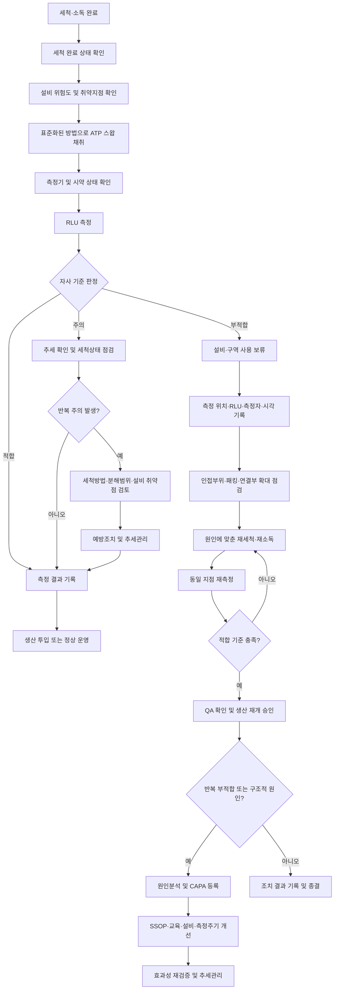

# [QA+ 블로그 생성 결과물] LAB002 ATP 위생검증
생성일시: 2026-09-05 08:24:33 (KST)
적용모델: gpt-5.6-terra

================================================================================
# 📋 [최종 발행용 블로그 패키지]

### 1. 메타 데이터 (SEO 설정)

- **최종 포스팅 제목**: 식품공장 ATP 위생검증 완벽 가이드｜RLU 기준 설정부터 부적합 CAPA까지
- **메타 디스크립션 (120자 내외 요약)**: 식품공장 ATP 위생검증의 RLU 기준 설정, 스왑 채취 표준화, HACCP·PRP 위치, 부적합 재세척 및 CAPA 대응 절차를 정리했습니다.
- **추천 해시태그 (10개)**:  
  #식품품질관리 #ATP위생검증 #RLU기준 #HACCP #식품안전 #세척소독검증 #PRP #식품공장QA #위생관리 #CAPA
- **카테고리**: 식품품질실무 / HACCP가이드 / 위생관리

> **사실관계 검수 메모**  
> - ATP 검사는 일반적으로 세척·소독 효과를 신속하게 확인하는 내부 위생검증 수단으로 운영되며, 특정 병원성 미생물의 존재 여부를 직접 판정하는 시험은 아닙니다.  
> - ATP 검사를 모든 식품제조업소에 일률적으로 의무화하는 단일 규정으로 표현하지 않도록 문구를 정리했습니다.  
> - 「식품 및 축산물 안전관리인증기준」, ISO 22000, FSSC 22000 적용 시에는 인증 범위·심사기준·개정판에 따라 요구사항이 달라질 수 있으므로, 대외 제출 문서는 발행 전 국가법령정보센터 및 적용 인증스킴의 최신 원문을 확인해야 합니다.  
> - ISO/TS 22002-1:2009은 기존 현장에서 널리 인용되는 PRP 기술규격입니다. 실제 적용 시에는 조직의 인증 범위와 최신 적용 표준을 확인하는 것이 필요합니다.

---

## 2. 네이버 블로그 / 티스토리 복사용 최종 원고 (Markdown)

# 식품공장 ATP 위생검증 완벽 가이드: RLU 기준 설정부터 부적합 조치까지

> **20년 실무 선배의 한 줄 요약**  
> ATP 위생검증은 “RLU 숫자를 낮추는 검사”가 아니라, 세척·소독이 실제로 효과 있었는지 생산 투입 전에 확인하고 반복 불량을 개선하는 관리체계입니다.  
> 장비 제조사 권장값을 출발점으로 삼되, **자사 설비·제품·위험도·기초 데이터에 맞춘 기준과 부적합 조치 절차**를 만들어야 심사에서도 흔들리지 않습니다.

---

## 1. 세척했는데도 왜 ATP 수치가 높게 나올까요?

야간 세척은 끝났고, 생산팀에서는 설비가 눈으로 보기에도 깨끗하다고 합니다. 그런데 생산 전 ATP 스왑 검사에서 기준 초과가 나오면 현장은 바로 바빠집니다. 생산팀은 “한 번 더 닦고 돌리면 되지 않느냐”고 하고, QA 담당자는 생산 투입 보류 여부를 판단해야 합니다. 현장에서 정말 많이 부딪히는 장면인데요. 결론부터 말씀드리면 **재세척만 반복하면 문제를 해결한 것이 아닙니다.**

ATP 수치가 높다는 것은 해당 표면에 유기물 잔사 또는 세척 불량과 연관된 신호가 남아 있을 가능성을 보여줍니다. 쉽게 말하면 설비가 겉으로는 반짝반짝해도 제품 찌꺼기나 세척 사각지대의 잔사가 남아 있을 수 있다는 뜻입니다. 특히 충전노즐 내부, 컨베이어 벨트 이음부, 믹서 축 주변, 패킹과 가스켓 틈은 눈으로 확인하기 어려운 대표적인 취약부위입니다. “닦아 보이는 곳”보다 “오염이 숨기 쉬운 곳”을 검사해야 하는 이유가 바로 여기 있습니다.

또 하나 놓치기 쉬운 부분은 ATP 검사 결과가 작업자마다 달라질 수 있다는 점입니다. 같은 설비를 검사해도 스왑 압력, 문지르는 횟수, 채취 면적, 채취 위치가 다르면 결과가 달라질 수 있습니다. 그래서 ATP는 측정기만 구매한다고 끝나는 시험이 아닙니다. **채취 위치·면적·방법·판정기준·부적합 조치까지 표준화해야 비로소 검증도구가 됩니다.**

ATP가 높게 나오는 원인은 꼭 세척작업자의 실수 하나로만 보시면 안 됩니다. 세제 농도나 온도, 접촉시간 부족, 불충분한 헹굼, 분해세척 누락, 세척도구 교차사용, 설비 구조상 사각지대, 세척 후 재오염까지 함께 봐야 합니다. 특히 같은 지점에서 반복적으로 부적합이 나오면 “사람이 덜 닦았다”보다 “원래 잘 안 닦이는 구조인가?”를 먼저 의심하는 것이 맞습니다. 현장을 보면 반복 불량의 상당수는 개인 문제가 아니라 **표준과 설비의 문제**입니다.


*이미지 설명: 육안으로는 깨끗해 보이는 설비라도 노즐 내부, 패킹, 연결부 등 숨은 취약부위는 ATP 위생검증이 필요합니다.*

이제 ATP가 무엇을 알려주고, 반대로 무엇까지는 알려주지 못하는지 정확히 구분해 보겠습니다. 이 구분이 되어야 HACCP 심사 대응에서도 과장 없이, 그러나 자신 있게 설명할 수 있습니다.

---

## 2. ATP 위생검증이란 무엇이며 무엇을 측정하나요?

ATP는 Adenosine Triphosphate, 즉 아데노신삼인산의 약자입니다. 생물체와 식품 유래 유기물에 존재할 수 있는 물질이며, ATP 위생측정기는 표면에서 채취한 시료의 발광 반응을 읽어 수치로 보여줍니다. 이때 표시되는 단위가 보통 **RLU(Relative Light Unit, 상대발광단위)**입니다.

쉽게 말하면 스왑봉으로 설비 표면을 닦아낸 뒤, 장비가 “얼마나 강한 빛 반응이 나왔는지”를 숫자로 바꾸는 방식입니다.

일반적으로 RLU가 낮을수록 해당 지점에서 검출된 ATP 신호가 낮다는 의미입니다. 다만 여기서 가장 조심하셔야 할 표현이 있습니다.

> **RLU가 낮다고 해서 특정 병원성 미생물이 없다고 단정할 수는 없습니다.**

ATP 검사는 세척 상태와 유기물 잔사의 이상 여부를 빠르게 확인하는 데 강점이 있지만, 살모넬라, 리스테리아, 대장균군 같은 특정 미생물의 검출 여부를 직접 판정하는 검사는 아닙니다.

ATP 검사의 최대 장점은 속도입니다. 일반적인 미생물 배양검사는 결과 확인에 수일이 걸릴 수 있지만, ATP는 현장에서 짧은 시간 안에 결과를 확인하고 재세척 여부를 판단할 수 있습니다. 생산 시작 전 “이 설비를 지금 투입해도 되는가?”를 판단해야 하는 상황에서는 정말 실용적인 도구입니다. 다만 빠른 검사라는 장점 때문에 미생물 검사까지 대체한다고 오해하면 안 됩니다.

또한 장비 제조사마다 시약 종류, 측정 원리, 권장 판정구간이 다릅니다. 그래서 A사 장비에서 RLU 100이 나온 결과와 B사 장비에서 RLU 100이 나온 결과를 같은 수준으로 단순 비교하면 위험합니다. 같은 공장 안에서도 장비 모델이나 시약이 바뀌면 기준을 그대로 승계하기보다 비교 검증을 해야 합니다. 기준 수치는 장비와 방법에 묶여 있다는 사실을 꼭 기억해 두시면 좋겠습니다.

> **실무 핵심**  
> ATP는 “미생물 검사 대체품”이 아니라 “세척·소독 직후 이상 신호를 빠르게 잡아내는 현장 검증도구”입니다.  
> ATP 적합 = 미생물학적 완전 안전이라는 등식은 성립하지 않습니다.

ATP의 역할을 명확히 알았다면, 다음은 HACCP과 법적 기준에서 이 검사를 어떤 위치로 설명해야 하는지 정리할 차례입니다.

---

## 3. HACCP과 법적 기준에서 ATP 검사는 어디에 위치할까요?

국내 법령에서 모든 식품제조업소에 ATP 검사를 일률적으로 실시하라고 직접 규정하고 있는 것으로 단정하기는 어렵습니다. 이 부분은 심사나 내부 교육에서 정확히 표현해야 합니다. “법에서 ATP를 반드시 하라고 한다”라고 말하면 오히려 근거 확인 과정에서 곤란해질 수 있습니다.

더 정확한 표현은 다음과 같습니다.

> **ATP는 위생관리와 세척·소독의 효과성을 확인하기 위한 내부 검증수단으로 활용할 수 있습니다.**

「식품위생법」은 식품 등의 위생적 취급과 안전관리에 관한 기본적인 법적 근거를 제공합니다. 또한 식품 제조·가공업소는 제조공정, 시설, 설비, 종업원 위생 등을 위생적으로 관리해야 합니다. 다만 실제 적용 조문과 최신 내용은 개정될 수 있으므로, 문서 작성이나 대외 제출 전에는 반드시 국가법령정보센터의 현행 법령을 확인하셔야 합니다. 법령 제목만 복사해 넣는 것보다, 우리 공장의 위생관리 절차와 연결해 설명하는 것이 훨씬 중요합니다.

「식품 및 축산물 안전관리인증기준」에서는 HACCP 적용업소가 영업장·작업장·시설·설비의 위생관리, 세척 및 소독 관리, 검증, 개선조치, 기록관리를 체계적으로 운영하도록 요구합니다. ATP는 일반적으로 CCP 모니터링 항목이라기보다 **선행요건관리 프로그램(PRP)의 세척·소독 효과 검증 활동**으로 설계하는 것이 자연스럽습니다.

쉽게 말하면 CCP가 위해를 직접 관리하는 핵심 방어선이라면, ATP는 그 방어선이 더럽혀지지 않도록 작업장을 관리하는 점검도구에 가깝습니다.

ISO 22000과 적용 PRP 표준, FSSC 22000 인증스킴에서도 PRP가 계획대로 운영되는지와 관리수단이 실제로 효과적인지를 검증해야 한다는 취지의 요구사항이 있습니다. 세척·소독 프로그램에는 대상 설비, 세척 방법, 사용 세제, 농도, 온도, 빈도, 책임자, 확인 방법, 부적합 조치가 포함되어야 합니다.

ATP 결과는 이 체계의 한 부분으로 활용할 수 있으며, 미생물 검사·육안점검·알레르겐 검사·세척제 잔류 확인과 조합할 때 더 강한 위생검증 체계가 됩니다. 단일 검사 하나로 모든 위생 위해를 관리했다고 설명하는 것은 피하셔야 합니다.

| 구분 | ATP 위생검사 | 미생물 검사 | 알레르겐/세척제 잔류 검사 |
|---|---|---|---|
| 주된 목적 | 세척 상태와 유기물 잔사 이상 신호 확인 | 미생물학적 위생상태 확인 | 교차접촉 및 화학적 잔류 위해 확인 |
| 결과 확인 | 현장에서 신속 확인 가능 | 배양법은 수일 소요 가능 | 시험법에 따라 다름 |
| 결과 단위 예시 | RLU | CFU, 검출/불검출 | ppm, 정성·정량값 |
| 강점 | 생산 전 즉시 판단에 유리 | 특정 미생물 위해 평가에 직접적 | 특정 위해요인 관리에 적합 |
| 한계 | 병원성 미생물 존재 여부 직접 판정 불가 | 즉시 재세척 판단에는 느릴 수 있음 | ATP나 일반 미생물 검사를 대체하지 않음 |
| 권장 활용 | 일상 세척검증 | 정기 환경모니터링·제품검사 | 알레르겐 품목 전환·화학관리 필요 시 |

여기까지 이해하셨다면, 이제 실무에서 가장 많이 받는 질문으로 들어가 보겠습니다.

> “그래서 우리 공장은 RLU를 몇으로 정해야 합니까?”

---

## 4. ATP 측정 RLU 기준, 이렇게 설정해야 합니다

RLU 기준에는 업계 전체가 공통으로 쓰는 단 하나의 정답이 없습니다. 장비 제조사의 권장 기준은 분명히 중요한 출발점이지만, 그대로 복사해서 우리 공장 기준으로 쓰면 안 되는 경우가 많습니다.

냉동만두 공장의 벨트 이음부와 음료 공장의 충전노즐, 건식 분말공장의 호퍼 내부는 오염 형태와 세척 방식이 다릅니다. 따라서 동일한 숫자로 일괄 관리하는 것은 편할 수는 있어도 위험기반 관리라고 보기 어렵습니다.

먼저 측정 대상을 세 그룹 정도로 나누시는 것을 권합니다.

1. 제품과 직접 닿는 **식품 접촉면**
2. 제품과 직접 닿지 않지만 오염 확산 우려가 큰 **고위험 비접촉면**
3. 일반 작업환경 표면

예를 들어 충전노즐 토출부와 믹서 날개는 식품 접촉면으로, 조작 패널이나 손잡이는 고위험 비접촉면으로, 창틀이나 벽면은 일반 환경표면으로 분류할 수 있습니다. 이렇게 분류해야 측정주기와 판정기준을 합리적으로 다르게 적용할 수 있습니다.

기준을 만들 때는 정상 세척이 이루어졌다고 판단되는 조건에서 기초 데이터를 충분히 모으셔야 합니다. 가능하면 설비별·지점별로 최소 10회 이상, 서로 다른 작업자와 작업조를 포함해 반복 측정해 보십시오. 이때 평균값만 보면 안 되고, 최대값, 최소값, 변동 폭, 부적합 발생 여부를 함께 확인해야 합니다.

현장 여건이 된다면 약 20~30회 수준의 기초 데이터를 확보하면 작업조 간 편차와 설비 특성이 조금 더 명확하게 보입니다.

기준은 보통 적합(Pass), 주의(Caution), 부적합(Fail)의 세 구간으로 운영하면 관리가 편합니다. 주의구간은 아직 부적합은 아니지만 세척 상태가 나빠지는 추세를 잡기 위한 구간입니다.

예를 들어 최근 3회 연속 주의구간이 나왔다면, 생산 중단까지 가지 않더라도 세척방법과 분해 범위를 선제적으로 점검할 수 있습니다. 좋은 품질관리는 부적합을 처리하는 능력보다, 부적합이 되기 전 이상징후를 잡는 능력에서 차이가 납니다.

| 기준 설정 단계 | 해야 할 일 | 권장 산출물 | 실무 주의사항 |
|---|---|---|---|
| 1단계: 설비 분류 | 식품 접촉면·고위험 비접촉면·일반 환경면 분류 | 설비별 위험도 목록 | 모든 지점을 같은 기준으로 묶지 않기 |
| 2단계: 취약지점 선정 | 틈새, 패킹, 벨트 이음부, 노즐, 밸브 등 선정 | 설비 사진 및 채취 위치도 | 닦기 쉬운 평면만 고르지 않기 |
| 3단계: 기초 데이터 수집 | 정상 세척 후 반복 측정 | 지점별 RLU 원시데이터 | 작업자·작업조별 편차 확인 |
| 4단계: 판정구간 설정 | 적합·주의·부적합 기준 결정 | ATP 관리기준서 | 제조사 권장값은 출발점으로 활용 |
| 5단계: 상관성 확인 | 육안, 미생물, 클레임, 재세척 결과와 비교 | 기준 설정 근거서 | ATP 하나만으로 안전성 단정 금지 |
| 6단계: 정기 재검토 | 설비·세제·품목 변경 시 기준 검토 | 연간 검토기록 | 장비·시약 변경 시 재검증 필요 |

기준을 세웠다면 그다음은 “어디를, 누가, 어떻게 닦아서 검사할 것인가”입니다. 이 부분이 흔들리면 아무리 좋은 기준도 의미가 없습니다.

---

## 5. ATP 스왑 채취 방법을 표준화하는 실전 요령

ATP 결과의 신뢰성은 채취 단계에서 거의 결정된다고 봐도 과언이 아닙니다. 같은 설비라도 오늘은 노즐 입구를 닦고 내일은 노즐 안쪽을 닦으면 데이터 비교가 되지 않습니다.

기록지에 단순히 “충전기 ATP 검사”라고 적어 놓으면 심사 때 거의 반드시 질문을 받습니다. 어느 충전기의 어느 위치를, 몇 ㎠ 면적으로, 어떤 방식으로 채취했는지까지 보여줄 수 있어야 합니다.

평평한 표면은 가능하면 일정 면적의 템플릿을 활용하는 것이 좋습니다. 예를 들어 사내 절차에서 10 cm × 10 cm, 즉 100 cm²를 기본 채취 면적으로 정했다면 해당 기준을 꾸준히 지켜야 합니다.

곡면이나 틈새처럼 면적 설정이 어려운 부위는 설비 사진에 채취 시작점과 종료점을 표시하십시오. “혼합기 축 패킹 주변 1회전”, “충전노즐 토출구 내부 및 외부 접점”처럼 현장에서 재현 가능한 언어로 적는 것이 좋습니다.

스왑은 한 방향으로만 살짝 문지르는 방식보다 가로·세로 방향을 교차해 일정한 압력으로 채취하는 것이 일반적입니다. 다만 정확한 횟수, 압력, 활성화 방법, 측정 대기시간은 반드시 사용 중인 장비 제조사의 사용설명서를 우선해야 합니다.

시약을 임의로 흔들거나, 정해진 반응시간보다 늦게 측정하거나, 사용기한이 지난 스왑을 쓰면 결과 신뢰성이 떨어질 수 있습니다. 이 부분은 작업자 교육 시 말로만 설명하지 말고 실제 설비에서 반복 실습을 시켜야 합니다.

세척제·소독제·수분 잔류도 확인이 필요합니다. 세척 직후 표면에 물이 흥건하거나 세제가 남은 상태에서 채취하면 장비와 시약의 특성에 따라 결과에 영향을 줄 가능성이 있습니다.

그러므로 사내 SSOP에는 다음 순서를 구체적으로 정해 두는 것이 좋습니다.

1. 세척 완료  
2. 헹굼 완료  
3. 필요 시 건조 또는 배수 상태 확인  
4. ATP 채취  
5. 측정 및 판정  
6. 기록과 승인

생산 중 ATP 검사를 할 때는 생산 전 검사와 목적이 다르므로, 같은 기준을 그대로 적용할지 별도의 추세관리 기준을 둘지도 사전에 결정해야 합니다.


*이미지 설명: 채취 위치 고정 → 일정 면적 채취 → 가로·세로 교차 스왑 → 제조사 지침에 따라 활성화 및 측정*

> **★ 심사관 대응 꿀팁**  
> ATP 기록지 한 장보다 강한 자료는 “설비 사진이 포함된 채취 위치도”입니다.  
> 사진에 설비명, 채취 위치, 면적, 채취 방향, 기준값, 측정주기까지 표시해 두면 측정의 재현성을 매우 쉽게 설명할 수 있습니다.

채취가 표준화되었다면, 이제 가장 긴급한 상황인 부적합 발생 시의 판단 흐름을 잡아보겠습니다.

---

## 6. ATP 부적합 발생 시 재세척만 하지 말고 이렇게 대응하세요

ATP 결과가 부적합이면 가장 먼저 해당 설비나 구역의 생산 투입을 보류해야 합니다. 특히 제품과 직접 접촉하는 부위에서 기준을 초과했다면 “일단 생산하고 나중에 확인하자”는 접근은 위험합니다.

부적합 결과, 측정 시각, 측정자, 설비명, 측정 위치, RLU 값, 세척 상태를 즉시 기록하십시오. 기록은 사후 보고용이 아니라, 원인을 찾기 위한 첫 번째 증거입니다.

그다음에는 해당 지점만 닦고 끝내지 말고 관련 부위를 함께 살펴야 합니다. 예를 들어 충전노즐에서 부적합이 나왔다면 노즐 외부만의 문제가 아니라 토출구 내부, 연결 가스켓, 호스 연결부, 분해세척 여부까지 확인해야 합니다.

컨베이어 벨트 이음부에서 부적합이 나왔다면 벨트 하부, 롤러 주변, 프레임 접합부도 확대 점검 대상이 됩니다. 오염은 한 점에만 존재하기보다 구조적으로 연결되어 있는 경우가 많습니다.

재세척과 재소독 후에는 동일 지점을 다시 측정해야 합니다. 필요하면 인접한 고위험 지점까지 확대 검증하고, 적합 기준을 충족한 뒤 QA 승인 절차에 따라 생산을 재개합니다.

여기서 중요한 것은 “두 번째 검사에서 적합이 나왔으니 끝”이 아니라, 최초 부적합의 원인이 무엇이었는지를 기록하는 것입니다. 1회성이라도 세척 누락인지, 작업자 숙련도 문제인지, 설비 구조 문제인지 구분해야 다음 불량을 막을 수 있습니다.

반복 부적합이라면 반드시 원인분석과 시정·예방조치(CAPA)로 이어져야 합니다. 세척시간이 부족했는지, 세제 농도나 온도가 표준에서 벗어났는지, 분해세척 대상이 누락됐는지, 세척도구가 구역 간 교차사용됐는지, 세척 후 조립 과정에서 재오염이 있었는지 확인하십시오.

필요하면 ATP 측정주기를 일시적으로 매일 또는 매 생산 전으로 강화하고, 미생물 검사도 병행할 수 있습니다. 반복 불량을 재세척 한 줄로 종결하면 심사에서는 “검증은 했지만 개선관리가 없다”는 평가를 받기 쉽습니다.

### ATP 부적합 대응 7단계

1. **부적합 확인**: 측정 위치, RLU 값, 측정자, 설비 상태를 기록합니다.  
2. **사용 보류**: 해당 설비 또는 구역의 생산 투입을 잠시 중단합니다.  
3. **확대 점검**: 인접 부위, 틈새, 패킹, 연결부까지 확인합니다.  
4. **재세척·재소독**: 원인 가설에 맞춰 단순 닦기가 아닌 적절한 세척을 실시합니다.  
5. **재검증**: 동일 지점과 필요 시 주변 고위험 지점을 다시 측정합니다.  
6. **생산 재개 승인**: 사내 적합기준 충족 및 QA 승인 후 생산을 시작합니다.  
7. **CAPA 등록**: 반복 발생 시 세척표준, 교육, 설비 구조, 세척도구 관리까지 개선합니다.  

### ATP 부적합 대응 프로세스



부적합 프로세스를 만들었다면, 현장에서 실제로 어떤 문제가 어떻게 개선되었는지 사례로 보시면 훨씬 이해가 빠릅니다.

---

## 7. 실제 현장 사례로 보는 ATP 위생검증 적용법

### 사례 1. 냉동만두 제조공장 컨베이어 벨트 이음부 반복 부적합

냉동만두 제조공장의 포장 전 이송 컨베이어에서 생산 전 ATP 검사를 실시했는데, 벨트 상부는 적합이었지만 이음부에서 반복적으로 기준 초과가 발생했습니다. 처음에는 야간 세척 담당자가 벨트 상부를 충분히 세척하지 않았다고 판단해 재교육만 실시했습니다.

하지만 재교육 후에도 특정 작업조에서만이 아니라 모든 작업조에서 비슷한 문제가 반복됐습니다. QA팀은 벨트 이음부를 분리해 확인했고, 만두피와 육즙 성분이 벨트 하부 연결부와 롤러 주변에 끼어 있는 것을 발견했습니다.

근본 원인은 세척작업자의 태만이 아니라 SSOP에 벨트 이음부와 하부 롤러의 세척 방법이 구체적으로 정의되어 있지 않은 것이었습니다. 기존 절차서에는 “컨베이어 세척”이라고만 적혀 있었고, 분해 범위와 세척도구, 세척시간이 지정되어 있지 않았습니다.

개선조치로 벨트를 들어 올리는 작업 순서를 추가하고, 전용 브러시를 배치했으며, 이음부와 하부 롤러를 별도 ATP 관리지점으로 등록했습니다. 또한 세척 후 조립 전에 이음부를 육안으로 확인하는 체크항목을 신설했습니다.

개선 후 첫 2주간은 해당 지점을 매일 생산 전 측정했고, 이후 4주 동안 부적합 발생 여부를 추적했습니다. 반복 부적합은 크게 줄었고, 작업자별 RLU 편차도 안정화됐습니다.

이 사례의 핵심은 “벨트 상부가 깨끗하니 컨베이어 전체가 깨끗하다”는 판단이 틀렸다는 점입니다. 설비의 실제 위해지점은 사람이 잘 보는 곳이 아니라, 제품 잔사가 쌓이고 세척수가 닿기 어려운 곳에 있었습니다.

---

### 사례 2. 소스류 제조공장 충전노즐과 가스켓 세척 불량

소스류 제조공장에서는 고추장 베이스 소스를 생산한 뒤 충전기를 세척하고 ATP 검사를 실시했습니다. 외부 노즐 표면은 적합이었지만, 일부 노즐의 토출부에서만 간헐적으로 높은 RLU가 나왔습니다.

현장에서는 매번 재세척 후 적합이 나왔기 때문에 심각하게 보지 않았습니다. 하지만 월간 데이터를 정리해 보니 동일한 3개 노즐에서 2개월 동안 총 7회의 부적합이 반복되고 있었습니다.

QA팀이 충전노즐을 분해해 보니 가스켓의 미세한 틈과 연결부 안쪽에 점도가 높은 소스 잔사가 남아 있었습니다. 세척수 온도와 세제 농도는 기준에 맞았지만, 노즐 분해세척 주기가 너무 길었고 가스켓 탈거 여부도 작업자마다 달랐습니다.

다시 말해 세척 조건은 맞았지만, **세척 대상 범위가 부족했던 것**입니다. 특히 점도가 높은 제품은 유동성이 낮아 연결부에 잔사가 남기 쉬운데, 기존 절차서가 이 제품 특성을 반영하지 못했습니다.

개선조치로 품목 전환과 일일 종료 세척 시 가스켓 탈거를 의무화하고, 조립 전 가스켓 상태를 확인하는 항목을 만들었습니다. 노즐별 번호를 부여해 ATP 결과를 개별 관리했고, 반복 부적합 노즐은 예비부품으로 교체했습니다.

또한 고점도 소스 생산일에는 충전부 ATP 측정주기를 주 1회에서 생산일마다로 한 달간 강화했습니다. 이후 동일 노즐에서의 반복 부적합은 사라졌고, 설비별 데이터 관리가 필요하다는 인식도 현장에 자리 잡았습니다.

이 사례에서 배울 점은 평균값만 보면 반복 불량을 놓칠 수 있다는 것입니다. 충전기 전체 평균은 양호해도 특정 노즐 하나가 계속 문제라면, 그 노즐은 별도 설비처럼 관리해야 합니다. ATP 데이터는 단순히 “오늘 적합인가”만 보는 기록이 아니라, 설비 취약점을 찾아내는 개선자료입니다.

---

### 사례 3. 레토르트 죽 제조공장 CIP 후 밸브 데드레그 문제

레토르트 죽 제조공장에서는 배합탱크와 이송배관에 CIP 세척을 적용하고 있었습니다. CIP 완료 후 외관 점검과 세척기록은 모두 양호했지만, 배관 말단의 샘플밸브 주변 ATP 결과가 가끔 기준을 초과했습니다.

처음에는 스왑 채취자가 밸브 내부를 제대로 채취하지 못했을 가능성을 의심했습니다. 그러나 숙련도 평가를 거친 두 명의 측정자가 번갈아 검사해도 동일한 경향이 나타났습니다.

원인조사 과정에서 배관 도면과 실제 설비를 비교한 결과, 샘플밸브 연결부에 세척액 순환이 충분하지 않은 데드레그 우려 구간이 있었습니다. 쉽게 말하면 CIP 세척액은 잘 흐르는 주 배관은 깨끗하게 씻었지만, 흐름이 약한 가지 배관과 밸브 연결부에는 세척 효과가 충분히 전달되지 않았던 것입니다.

게다가 밸브 분해점검 주기가 분기 1회로 설정되어 있어 초기 오염 축적을 발견하기 어려웠습니다. 세척제의 농도와 온도만 관리하고 실제 취약부의 세척 도달성을 검증하지 못한 사례였습니다.

공장은 우선 해당 밸브를 분해세척하고, CIP 프로그램의 유량·순환시간·회수 조건을 엔지니어링 부서와 함께 재검토했습니다. 이후 밸브 연결부의 구조를 개선하고, 월 1회 분해점검과 ATP 검증을 추가했습니다.

CIP 세척 후에는 주요 배관의 일반 항목뿐 아니라 고위험 밸브 지점을 별도 관리하는 방식으로 측정계획을 바꿨습니다. 필요 시 미생물 환경검사도 병행해 ATP 결과와의 상관성을 확인했습니다.

개선 후 해당 지점의 ATP 변동 폭이 낮아졌고, 불필요한 긴급 재세척도 줄었습니다. 이 사례는 CIP가 자동이라는 이유만으로 “세척이 자동으로 보증된다”고 생각하면 안 된다는 점을 보여줍니다.

CIP 세척 검증에서는 시간·온도·농도·유량뿐 아니라, 실제 세척액이 취약부까지 제대로 도달하는지를 확인해야 합니다. 자동화 설비일수록 데이터와 현장 분해점검을 함께 보셔야 합니다.

사례를 보셨다면 이제 ATP 데이터를 어떻게 기록 이상으로 활용할지 정리해 보겠습니다. 이 단계부터 ATP는 검사 업무가 아니라 개선 업무가 됩니다.

---

## 8. ATP 데이터를 세척공정 개선자료로 만드는 방법

ATP 측정값을 기록지에 적고 파일에 보관하는 것만으로는 충분하지 않습니다. 설비별, 측정지점별, 작업조별, 세척 담당자별로 데이터를 분류하면 반복되는 패턴이 보이기 시작합니다.

예를 들어 매주 월요일에만 결과가 높다면 주말 생산 후 잔사량이 많았는지, 세척 인력이 바뀌었는지, 세척 시간이 줄었는지를 확인할 수 있습니다. 특정 품목 생산 후에만 수치가 높다면 제품 점도, 당도, 유지 함량, 알레르겐 원료 특성도 함께 검토해야 합니다.

평균 RLU만 보지 말고 최대값과 부적합률을 꼭 보십시오. 평균은 낮아도 한 달에 한 번씩 매우 높은 값이 나오면 실제로는 관리가 불안정한 설비일 수 있습니다.

특히 주의구간 결과가 연속으로 늘어나는 경우는 부적합 직전의 신호일 수 있습니다. 현장에서는 이런 신호를 놓치지 않고 선제적으로 브러시 교체, 분해세척 강화, 교육 실시로 연결하는 것이 훨씬 효율적입니다.

월 1회 또는 분기 1회 HACCP 팀 회의에서 ATP 결과를 안건으로 올리는 것을 권합니다. 이때 “검사 건수 몇 건, 적합률 몇 %”만 보고하지 말고, 반복 부적합 상위 3개 지점과 개선조치 결과를 함께 공유하십시오.

예를 들어 다음과 같이 전후 데이터를 보여줄 수 있습니다.

> “충전노즐 4번에서 3회 부적합 발생, 가스켓 교체 후 4주간 정상”

이처럼 조치 전후 데이터를 보여주면 회의가 훨씬 실질적으로 바뀝니다. 생산팀도 ATP를 QA의 귀찮은 검사로 보지 않고, 설비 정지와 재세척을 줄이는 도구로 받아들이게 됩니다.

설비 변경, 세제 변경, 품목 변경, 생산량 증가, 신규 작업자 투입이 있을 때는 기존 기준이 여전히 적절한지도 검토해야 합니다. 측정기 교체나 시약 로트 변경 시에도 제조사 지침에 따라 성능 확인과 비교 검토가 필요할 수 있습니다.

ATP 관리기준은 한 번 정해 놓고 영원히 쓰는 숫자가 아닙니다. 공정이 변하면 위험도와 검증체계도 함께 업데이트되어야 합니다.

---

## 9. ATP 위생검증 FAQ: 심사에서 자주 묻는 질문 6가지

### Q1. ATP RLU는 몇 이하면 적합인가요?

**A.** 정답은 “사용 장비와 자사 검증 기준에 따라 다릅니다”입니다. 제조사 권장값을 참고할 수는 있지만, 모든 식품공장과 모든 설비에 동일한 숫자를 적용할 수는 없습니다.

식품 접촉면, 고위험 비접촉면, 일반 환경표면을 구분하고 기초 데이터와 위험평가를 근거로 자사 기준을 설정하셔야 합니다.

---

### Q2. ATP가 적합이면 미생물 검사는 하지 않아도 되나요?

**A.** 아닙니다. ATP는 특정 병원성 미생물의 존재 여부를 직접 확인하는 시험이 아니므로, ATP 적합만으로 미생물학적 안전성을 단정할 수 없습니다.

제품과 공정의 위해특성에 따라 일반세균수, 대장균군, 리스테리아 모노사이토제네스 등 환경모니터링이나 제품 미생물 검사를 별도로 운영해야 할 수 있습니다.

---

### Q3. 모든 설비를 매일 ATP 검사해야 하나요?

**A.** 모든 설비를 동일 주기로 검사할 필요는 없지만, 위험기반 측정계획은 반드시 필요합니다.

제품과 직접 접촉하는 고위험 부위, 세척이 어려운 설비, 반복 부적합 이력이 있는 지점은 생산 전 또는 매일 측정하는 방식이 적합할 수 있습니다. 반면 일반 환경표면은 주간·월간 단위의 확인으로 운영할 수 있으나, 이는 반드시 자사 위험평가 결과에 근거해야 합니다.

---

### Q4. ATP 부적합인데 재세척 후 적합이면 끝인가요?

**A.** 재세척 후 적합이 나왔다면 생산 투입 판단에는 도움이 되지만, 최초 부적합 원인까지 사라진 것은 아닙니다.

최소한 최초 결과, 재세척 내용, 재검 결과, 원인 추정은 기록하셔야 합니다. 동일 위치에서 반복되면 세척 절차, 세척시간, 분해 범위, 세척도구, 설비 구조까지 포함한 CAPA가 필요합니다.

---

### Q5. 세척제나 소독제 잔류가 ATP 결과에 영향을 줄 수 있나요?

**A.** 사용 장비와 시약의 특성, 표면의 수분 상태, 세척제·소독제 잔류 등에 따라 결과에 영향을 줄 가능성을 검토해야 합니다.

따라서 제조사 사용설명서에 규정된 보관 조건, 스왑 활성화 방법, 측정 시간, 채취 주의사항을 준수해야 합니다. 도입 초기에는 실제 세척 조건에서 내부 적합성 확인을 해 두면 나중에 불필요한 논쟁을 줄일 수 있습니다.

---

### Q6. HACCP 심사에서 ATP 기록으로 가장 많이 지적받는 부분은 무엇인가요?

**A.** 가장 흔한 지적은 기준 설정 근거가 없다는 것입니다. “RLU 100 이하”라고 적혀 있는데 왜 100인지 설명하지 못하면 기준의 타당성이 약해 보입니다.

그다음으로는 측정 위치가 불명확한 기록, 반복 부적합을 재세척 한 줄로 끝낸 기록, 장비·시약 유효기간 및 보관 관리기록 누락이 많이 지적됩니다.

> **심사관 단골 질문에 대한 답변 구조**  
> “제조사 권장 기준을 출발점으로 삼았고, 식품 접촉 여부와 설비 위험도를 분류했습니다. 이후 정상 세척 조건에서 지점별 기초 데이터를 축적하고, 미생물·육안점검·부적합 이력을 비교하여 현재 기준을 설정했습니다.”  
> 이 정도 구조로 설명할 수 있으면 기준의 논리가 명확해집니다.

FAQ까지 정리했다면 마지막으로 현장에서 바로 사용할 수 있는 점검표를 드리겠습니다.

---

## 10. ATP 위생검증 단계별 체크리스트

| 점검 단계 | 점검 항목 | 확인 기준 | 확인 방법 | 담당 |
|---|---|---|---|---|
| 측정계획 수립 | 측정 대상 분류 | 식품 접촉면·고위험 비접촉면·일반 환경면 구분 | 위험평가서 및 설비 목록 확인 | QA/HACCP팀 |
| 측정지점 선정 | 취약부위 지정 | 벨트 이음부, 노즐, 패킹, 밸브, 호퍼 사각지대 포함 | 설비 사진·도면 표시 | QA/생산/공무 |
| 채취방법 표준화 | 면적·방향·횟수 설정 | 동일 지점에서 재현 가능해야 함 | 작업표준서 및 실습평가 | QA |
| 세척 완료 확인 | 잔사·세제·수분 상태 확인 | 사내 SSOP 및 장비 지침 충족 | 육안점검, 필요 시 잔류 확인 | 세척책임자 |
| ATP 측정 | 장비·시약 상태 확인 | 유효기간, 보관조건, 기능점검 이상 없음 | 장비점검일지·시약관리대장 | QA |
| 결과 판정 | 적합·주의·부적합 판정 | 설비별 사내 기준 충족 | ATP 측정기록서 | QA |
| 부적합 조치 | 사용 보류 및 재세척 | 적합 확인 전 생산 투입 금지 | 부적합 보고서 | 생산/QA |
| 재검증 | 동일 및 인접 지점 재측정 | 재세척 후 기준 충족 | 재검 결과 기록 | QA |
| 반복 분석 | 반복 부적합 원인분석 | 동일 지점·설비·작업조 패턴 확인 | 월간 추세 그래프 | HACCP팀 |
| 개선조치 | SSOP·교육·설비 개선 | 조치 후 효과성 확인 | CAPA 기록 및 후속 ATP 결과 | QA/생산/공무 |

아래 항목은 월간 위생회의 전에 한 번씩 체크해 보시면 좋습니다.

- [ ] ATP 측정 지점이 실제 오염 취약부위를 반영하고 있는가?  
- [ ] 식품 접촉면과 일반 환경표면을 같은 기준으로 관리하고 있지는 않은가?  
- [ ] 장비 제조사 지침과 사내 채취 방법이 일치하는가?  
- [ ] 스왑 시약의 유효기간, 보관 상태, 입출고 기록이 관리되는가?  
- [ ] 부적합 발생 시 재세척뿐 아니라 원인분석이 기록되는가?  
- [ ] 반복 부적합 설비를 월별 추세로 분석하고 있는가?  
- [ ] ATP 결과를 미생물 검사, 육안점검, 세척기록과 함께 검토하는가?  
- [ ] 설비·세제·품목·장비 변경 시 관리기준을 재검토하는가?  

---

## ATP 검증체계의 위치

```text
위생관리 체계
│
├─ 선행요건관리(PRP)
│  ├─ 세척·소독 절차
│  ├─ 작업자 위생
│  ├─ 설비·도구 관리
│  └─ ATP 위생검증
│      ├─ RLU 측정
│      ├─ 육안점검과 비교
│      ├─ 미생물 검사와 보완
│      └─ 부적합 시 CAPA
│
└─ HACCP 검증체계
   ├─ CCP 모니터링·검증
   ├─ 세척·소독 효과성 확인
   ├─ 기록관리
   └─ 정기적 기준 재검토
```

---

## 11. 맺음말: ATP 위생검증에서 숫자보다 중요한 것은 판단 체계입니다

ATP 위생검증은 단순히 “RLU 몇 이하”를 관리하는 일이 아닙니다. 세척이 정말 효과적으로 이루어졌는지 빠르게 확인하고, 작은 이상 신호를 놓치지 않으며, 반복되는 설비 문제를 개선하는 활동입니다.

ATP가 높게 나왔을 때 누군가의 실수로만 끝내지 않고 세척표준과 설비 구조까지 보는 공장이 결국 위생 수준을 높입니다. 이게 현장에서 진짜 차이를 만듭니다.

오늘 내용은 세 줄로 정리할 수 있습니다.

1. ATP는 세척 상태를 신속하게 확인하는 검증도구이지 미생물 검사를 대체하는 시험은 아닙니다.  
2. RLU 기준은 장비 제조사 권장값, 설비 위험도, 채취방법, 기초 데이터, 미생물 및 부적합 이력을 근거로 자사화해야 합니다.  
3. 부적합은 재세척으로 끝내지 말고 원인분석과 재발방지 조치까지 연결해야 합니다.  

처음 ATP 체계를 만들 때는 기준 설정, 사진 작업표준서, 기록지 개정, 작업자 교육까지 할 일이 많아 보일 수 있습니다. 하지만 측정 지점부터 제대로 표준화해 두면 나중에는 재세척 시간도 줄고, 생산과 QA 사이의 불필요한 논쟁도 크게 줄어듭니다.

무엇보다 심사 때 “왜 이 지점을, 이 기준으로, 이 주기로 검사합니까?”라는 질문에 흔들리지 않게 됩니다.

막히는 부분이 있으면 언제든 댓글로 편하게 물어보세요. 후배님들의 불필요한 재세척과 야근이 줄어들도록, 그리고 칼퇴가 조금 더 가까워지도록 응원하겠습니다.

---

## 3. 워드프레스 / 웹사이트용 HTML 원고

```html
<article class="food-qa-post">
  <header>
    <h1>식품공장 ATP 위생검증 완벽 가이드: RLU 기준 설정부터 부적합 조치까지</h1>
    <blockquote>
      <p><strong>20년 실무 선배의 한 줄 요약</strong>: ATP 위생검증은 “RLU 숫자를 낮추는 검사”가 아니라, 세척·소독이 실제로 효과 있었는지 생산 투입 전에 확인하고 반복 불량을 개선하는 관리체계입니다.<br>
      장비 제조사 권장값을 출발점으로 삼되, <strong>자사 설비·제품·위험도·기초 데이터에 맞춘 기준과 부적합 조치 절차</strong>를 만들어야 심사에서도 흔들리지 않습니다.</p>
    </blockquote>
  </header>

  <section>
    <h2>1. 세척했는데도 왜 ATP 수치가 높게 나올까요?</h2>

    <p>야간 세척은 끝났고, 생산팀에서는 설비가 눈으로 보기에도 깨끗하다고 합니다. 그런데 생산 전 ATP 스왑 검사에서 기준 초과가 나오면 현장은 바로 바빠집니다. 생산팀은 “한 번 더 닦고 돌리면 되지 않느냐”고 하고, QA 담당자는 생산 투입 보류 여부를 판단해야 합니다. 현장에서 정말 많이 부딪히는 장면인데요. 결론부터 말씀드리면 <strong>재세척만 반복하면 문제를 해결한 것이 아닙니다.</strong></p>

    <p>ATP 수치가 높다는 것은 해당 표면에 유기물 잔사 또는 세척 불량과 연관된 신호가 남아 있을 가능성을 보여줍니다. 쉽게 말하면 설비가 겉으로는 반짝반짝해도 제품 찌꺼기나 세척 사각지대의 잔사가 남아 있을 수 있다는 뜻입니다. 특히 충전노즐 내부, 컨베이어 벨트 이음부, 믹서 축 주변, 패킹과 가스켓 틈은 눈으로 확인하기 어려운 대표적인 취약부위입니다. “닦아 보이는 곳”보다 “오염이 숨기 쉬운 곳”을 검사해야 하는 이유가 바로 여기 있습니다.</p>

    <p>또 하나 놓치기 쉬운 부분은 ATP 검사 결과가 작업자마다 달라질 수 있다는 점입니다. 같은 설비를 검사해도 스왑 압력, 문지르는 횟수, 채취 면적, 채취 위치가 다르면 결과가 달라질 수 있습니다. 그래서 ATP는 측정기만 구매한다고 끝나는 시험이 아닙니다. <strong>채취 위치·면적·방법·판정기준·부적합 조치까지 표준화해야 비로소 검증도구가 됩니다.</strong></p>

    <p>ATP가 높게 나오는 원인은 꼭 세척작업자의 실수 하나로만 보시면 안 됩니다. 세제 농도나 온도, 접촉시간 부족, 불충분한 헹굼, 분해세척 누락, 세척도구 교차사용, 설비 구조상 사각지대, 세척 후 재오염까지 함께 봐야 합니다. 특히 같은 지점에서 반복적으로 부적합이 나오면 “사람이 덜 닦았다”보다 “원래 잘 안 닦이는 구조인가?”를 먼저 의심하는 것이 맞습니다. 현장을 보면 반복 불량의 상당수는 개인 문제가 아니라 <strong>표준과 설비의 문제</strong>입니다.</p>

    <figure>
      
      <figcaption>육안으로는 깨끗해 보이는 설비라도 노즐 내부, 패킹, 연결부 등 숨은 취약부위는 ATP 위생검증이 필요합니다.</figcaption>
    </figure>

    <p>이제 ATP가 무엇을 알려주고, 반대로 무엇까지는 알려주지 못하는지 정확히 구분해 보겠습니다. 이 구분이 되어야 HACCP 심사 대응에서도 과장 없이, 그러나 자신 있게 설명할 수 있습니다.</p>
  </section>

  <section>
    <h2>2. ATP 위생검증이란 무엇이며 무엇을 측정하나요?</h2>

    <p>ATP는 Adenosine Triphosphate, 즉 아데노신삼인산의 약자입니다. 생물체와 식품 유래 유기물에 존재할 수 있는 물질이며, ATP 위생측정기는 표면에서 채취한 시료의 발광 반응을 읽어 수치로 보여줍니다. 이때 표시되는 단위가 보통 <strong>RLU(Relative Light Unit, 상대발광단위)</strong>입니다.</p>

    <p>쉽게 말하면 스왑봉으로 설비 표면을 닦아낸 뒤, 장비가 “얼마나 강한 빛 반응이 나왔는지”를 숫자로 바꾸는 방식입니다.</p>

    <p>일반적으로 RLU가 낮을수록 해당 지점에서 검출된 ATP 신호가 낮다는 의미입니다. 다만 여기서 가장 조심하셔야 할 표현이 있습니다.</p>

    <blockquote>
      <p><strong>RLU가 낮다고 해서 특정 병원성 미생물이 없다고 단정할 수는 없습니다.</strong></p>
    </blockquote>

    <p>ATP 검사는 세척 상태와 유기물 잔사의 이상 여부를 빠르게 확인하는 데 강점이 있지만, 살모넬라, 리스테리아, 대장균군 같은 특정 미생물의 검출 여부를 직접 판정하는 검사는 아닙니다.</p>

    <p>ATP 검사의 최대 장점은 속도입니다. 일반적인 미생물 배양검사는 결과 확인에 수일이 걸릴 수 있지만, ATP는 현장에서 짧은 시간 안에 결과를 확인하고 재세척 여부를 판단할 수 있습니다. 생산 시작 전 “이 설비를 지금 투입해도 되는가?”를 판단해야 하는 상황에서는 정말 실용적인 도구입니다. 다만 빠른 검사라는 장점 때문에 미생물 검사까지 대체한다고 오해하면 안 됩니다.</p>

    <p>또한 장비 제조사마다 시약 종류, 측정 원리, 권장 판정구간이 다릅니다. 그래서 A사 장비에서 RLU 100이 나온 결과와 B사 장비에서 RLU 100이 나온 결과를 같은 수준으로 단순 비교하면 위험합니다. 같은 공장 안에서도 장비 모델이나 시약이 바뀌면 기준을 그대로 승계하기보다 비교 검증을 해야 합니다. 기준 수치는 장비와 방법에 묶여 있다는 사실을 꼭 기억해 두시면 좋겠습니다.</p>

    <aside>
      <p><strong>실무 핵심</strong><br>
      ATP는 “미생물 검사 대체품”이 아니라 “세척·소독 직후 이상 신호를 빠르게 잡아내는 현장 검증도구”입니다.<br>
      ATP 적합 = 미생물학적 완전 안전이라는 등식은 성립하지 않습니다.</p>
    </aside>

    <p>ATP의 역할을 명확히 알았다면, 다음은 HACCP과 법적 기준에서 이 검사를 어떤 위치로 설명해야 하는지 정리할 차례입니다.</p>
  </section>

  <section>
    <h2>3. HACCP과 법적 기준에서 ATP 검사는 어디에 위치할까요?</h2>

    <p>국내 법령에서 모든 식품제조업소에 ATP 검사를 일률적으로 실시하라고 직접 규정하고 있는 것으로 단정하기는 어렵습니다. 이 부분은 심사나 내부 교육에서 정확히 표현해야 합니다. “법에서 ATP를 반드시 하라고 한다”라고 말하면 오히려 근거 확인 과정에서 곤란해질 수 있습니다.</p>

    <blockquote>
      <p><strong>ATP는 위생관리와 세척·소독의 효과성을 확인하기 위한 내부 검증수단으로 활용할 수 있습니다.</strong></p>
    </blockquote>

    <p>「식품위생법」은 식품 등의 위생적 취급과 안전관리에 관한 기본적인 법적 근거를 제공합니다. 또한 식품 제조·가공업소는 제조공정, 시설, 설비, 종업원 위생 등을 위생적으로 관리해야 합니다. 다만 실제 적용 조문과 최신 내용은 개정될 수 있으므로, 문서 작성이나 대외 제출 전에는 반드시 국가법령정보센터의 현행 법령을 확인하셔야 합니다. 법령 제목만 복사해 넣는 것보다, 우리 공장의 위생관리 절차와 연결해 설명하는 것이 훨씬 중요합니다.</p>

    <p>「식품 및 축산물 안전관리인증기준」에서는 HACCP 적용업소가 영업장·작업장·시설·설비의 위생관리, 세척 및 소독 관리, 검증, 개선조치, 기록관리를 체계적으로 운영하도록 요구합니다. ATP는 일반적으로 CCP 모니터링 항목이라기보다 <strong>선행요건관리 프로그램(PRP)의 세척·소독 효과 검증 활동</strong>으로 설계하는 것이 자연스럽습니다.</p>

    <p>쉽게 말하면 CCP가 위해를 직접 관리하는 핵심 방어선이라면, ATP는 그 방어선이 더럽혀지지 않도록 작업장을 관리하는 점검도구에 가깝습니다.</p>

    <p>ISO 22000과 적용 PRP 표준, FSSC 22000 인증스킴에서도 PRP가 계획대로 운영되는지와 관리수단이 실제로 효과적인지를 검증해야 한다는 취지의 요구사항이 있습니다. 세척·소독 프로그램에는 대상 설비, 세척 방법, 사용 세제, 농도, 온도, 빈도, 책임자, 확인 방법, 부적합 조치가 포함되어야 합니다.</p>

    <p>ATP 결과는 이 체계의 한 부분으로 활용할 수 있으며, 미생물 검사·육안점검·알레르겐 검사·세척제 잔류 확인과 조합할 때 더 강한 위생검증 체계가 됩니다. 단일 검사 하나로 모든 위생 위해를 관리했다고 설명하는 것은 피하셔야 합니다.</p>

    <table>
      <thead>
        <tr>
          <th>구분</th>
          <th>ATP 위생검사</th>
          <th>미생물 검사</th>
          <th>알레르겐/세척제 잔류 검사</th>
        </tr>
      </thead>
      <tbody>
        <tr>
          <td>주된 목적</td>
          <td>세척 상태와 유기물 잔사 이상 신호 확인</td>
          <td>미생물학적 위생상태 확인</td>
          <td>교차접촉 및 화학적 잔류 위해 확인</td>
        </tr>
        <tr>
          <td>결과 확인</td>
          <td>현장에서 신속 확인 가능</td>
          <td>배양법은 수일 소요 가능</td>
          <td>시험법에 따라 다름</td>
        </tr>
        <tr>
          <td>결과 단위 예시</td>
          <td>RLU</td>
          <td>CFU, 검출/불검출</td>
          <td>ppm, 정성·정량값</td>
        </tr>
        <tr>
          <td>강점</td>
          <td>생산 전 즉시 판단에 유리</td>
          <td>특정 미생물 위해 평가에 직접적</td>
          <td>특정 위해요인 관리에 적합</td>
        </tr>
        <tr>
          <td>한계</td>
          <td>병원성 미생물 존재 여부 직접 판정 불가</td>
          <td>즉시 재세척 판단에는 느릴 수 있음</td>
          <td>ATP나 일반 미생물 검사를 대체하지 않음</td>
        </tr>
        <tr>
          <td>권장 활용</td>
          <td>일상 세척검증</td>
          <td>정기 환경모니터링·제품검사</td>
          <td>알레르겐 품목 전환·화학관리 필요 시</td>
        </tr>
      </tbody>
    </table>
  </section>

  <section>
    <h2>4. ATP 측정 RLU 기준, 이렇게 설정해야 합니다</h2>

    <p>RLU 기준에는 업계 전체가 공통으로 쓰는 단 하나의 정답이 없습니다. 장비 제조사의 권장 기준은 분명히 중요한 출발점이지만, 그대로 복사해서 우리 공장 기준으로 쓰면 안 되는 경우가 많습니다.</p>

    <p>냉동만두 공장의 벨트 이음부와 음료 공장의 충전노즐, 건식 분말공장의 호퍼 내부는 오염 형태와 세척 방식이 다릅니다. 따라서 동일한 숫자로 일괄 관리하는 것은 편할 수는 있어도 위험기반 관리라고 보기 어렵습니다.</p>

    <p>먼저 측정 대상을 세 그룹 정도로 나누시는 것을 권합니다.</p>

    <ol>
      <li>제품과 직접 닿는 <strong>식품 접촉면</strong></li>
      <li>제품과 직접 닿지 않지만 오염 확산 우려가 큰 <strong>고위험 비접촉면</strong></li>
      <li>일반 작업환경 표면</li>
    </ol>

    <p>예를 들어 충전노즐 토출부와 믹서 날개는 식품 접촉면으로, 조작 패널이나 손잡이는 고위험 비접촉면으로, 창틀이나 벽면은 일반 환경표면으로 분류할 수 있습니다. 이렇게 분류해야 측정주기와 판정기준을 합리적으로 다르게 적용할 수 있습니다.</p>

    <p>기준을 만들 때는 정상 세척이 이루어졌다고 판단되는 조건에서 기초 데이터를 충분히 모으셔야 합니다. 가능하면 설비별·지점별로 최소 10회 이상, 서로 다른 작업자와 작업조를 포함해 반복 측정해 보십시오. 이때 평균값만 보면 안 되고, 최대값, 최소값, 변동 폭, 부적합 발생 여부를 함께 확인해야 합니다.</p>

    <p>현장 여건이 된다면 약 20~30회 수준의 기초 데이터를 확보하면 작업조 간 편차와 설비 특성이 조금 더 명확하게 보입니다.</p>

    <p>기준은 보통 적합(Pass), 주의(Caution), 부적합(Fail)의 세 구간으로 운영하면 관리가 편합니다. 주의구간은 아직 부적합은 아니지만 세척 상태가 나빠지는 추세를 잡기 위한 구간입니다.</p>

    <p>예를 들어 최근 3회 연속 주의구간이 나왔다면, 생산 중단까지 가지 않더라도 세척방법과 분해 범위를 선제적으로 점검할 수 있습니다. 좋은 품질관리는 부적합을 처리하는 능력보다, 부적합이 되기 전 이상징후를 잡는 능력에서 차이가 납니다.</p>

    <table>
      <thead>
        <tr>
          <th>기준 설정 단계</th>
          <th>해야 할 일</th>
          <th>권장 산출물</th>
          <th>실무 주의사항</th>
        </tr>
      </thead>
      <tbody>
        <tr>
          <td>1단계: 설비 분류</td>
          <td>식품 접촉면·고위험 비접촉면·일반 환경면 분류</td>
          <td>설비별 위험도 목록</td>
          <td>모든 지점을 같은 기준으로 묶지 않기</td>
        </tr>
        <tr>
          <td>2단계: 취약지점 선정</td>
          <td>틈새, 패킹, 벨트 이음부, 노즐, 밸브 등 선정</td>
          <td>설비 사진 및 채취 위치도</td>
          <td>닦기 쉬운 평면만 고르지 않기</td>
        </tr>
        <tr>
          <td>3단계: 기초 데이터 수집</td>
          <td>정상 세척 후 반복 측정</td>
          <td>지점별 RLU 원시데이터</td>
          <td>작업자·작업조별 편차 확인</td>
        </tr>
        <tr>
          <td>4단계: 판정구간 설정</td>
          <td>적합·주의·부적합 기준 결정</td>
          <td>ATP 관리기준서</td>
          <td>제조사 권장값은 출발점으로 활용</td>
        </tr>
        <tr>
          <td>5단계: 상관성 확인</td>
          <td>육안, 미생물, 클레임, 재세척 결과와 비교</td>
          <td>기준 설정 근거서</td>
          <td>ATP 하나만으로 안전성 단정 금지</td>
        </tr>
        <tr>
          <td>6단계: 정기 재검토</td>
          <td>설비·세제·품목 변경 시 기준 검토</td>
          <td>연간 검토기록</td>
          <td>장비·시약 변경 시 재검증 필요</td>
        </tr>
      </tbody>
    </table>
  </section>

  <section>
    <h2>5. ATP 스왑 채취 방법을 표준화하는 실전 요령</h2>

    <p>ATP 결과의 신뢰성은 채취 단계에서 거의 결정된다고 봐도 과언이 아닙니다. 같은 설비라도 오늘은 노즐 입구를 닦고 내일은 노즐 안쪽을 닦으면 데이터 비교가 되지 않습니다.</p>

    <p>기록지에 단순히 “충전기 ATP 검사”라고 적어 놓으면 심사 때 거의 반드시 질문을 받습니다. 어느 충전기의 어느 위치를, 몇 ㎠ 면적으로, 어떤 방식으로 채취했는지까지 보여줄 수 있어야 합니다.</p>

    <p>평평한 표면은 가능하면 일정 면적의 템플릿을 활용하는 것이 좋습니다. 예를 들어 사내 절차에서 10 cm × 10 cm, 즉 100 cm²를 기본 채취 면적으로 정했다면 해당 기준을 꾸준히 지켜야 합니다.</p>

    <p>곡면이나 틈새처럼 면적 설정이 어려운 부위는 설비 사진에 채취 시작점과 종료점을 표시하십시오. “혼합기 축 패킹 주변 1회전”, “충전노즐 토출구 내부 및 외부 접점”처럼 현장에서 재현 가능한 언어로 적는 것이 좋습니다.</p>

    <p>스왑은 한 방향으로만 살짝 문지르는 방식보다 가로·세로 방향을 교차해 일정한 압력으로 채취하는 것이 일반적입니다. 다만 정확한 횟수, 압력, 활성화 방법, 측정 대기시간은 반드시 사용 중인 장비 제조사의 사용설명서를 우선해야 합니다.</p>

    <p>시약을 임의로 흔들거나, 정해진 반응시간보다 늦게 측정하거나, 사용기한이 지난 스왑을 쓰면 결과 신뢰성이 떨어질 수 있습니다. 이 부분은 작업자 교육 시 말로만 설명하지 말고 실제 설비에서 반복 실습을 시켜야 합니다.</p>

    <p>세척제·소독제·수분 잔류도 확인이 필요합니다. 세척 직후 표면에 물이 흥건하거나 세제가 남은 상태에서 채취하면 장비와 시약의 특성에 따라 결과에 영향을 줄 가능성이 있습니다.</p>

    <p>그러므로 사내 SSOP에는 세척 완료, 헹굼, 필요 시 건조 또는 배수 확인, ATP 채취 순서를 구체적으로 정해 두는 것이 좋습니다. 생산 중 ATP 검사를 할 때는 생산 전 검사와 목적이 다르므로, 같은 기준을 그대로 적용할지 별도의 추세관리 기준을 둘지도 사전에 결정해야 합니다.</p>

    <figure>
      
      <figcaption>채취 위치 고정 → 일정 면적 채취 → 가로·세로 교차 스왑 → 제조사 지침에 따라 활성화 및 측정</figcaption>
    </figure>

    <aside>
      <p><strong>★ 심사관 대응 꿀팁</strong><br>
      ATP 기록지 한 장보다 강한 자료는 “설비 사진이 포함된 채취 위치도”입니다.<br>
      사진에 설비명, 채취 위치, 면적, 채취 방향, 기준값, 측정주기까지 표시해 두면 측정의 재현성을 매우 쉽게 설명할 수 있습니다.</p>
    </aside>
  </section>

  <section>
    <h2>6. ATP 부적합 발생 시 재세척만 하지 말고 이렇게 대응하세요</h2>

    <p>ATP 결과가 부적합이면 가장 먼저 해당 설비나 구역의 생산 투입을 보류해야 합니다. 특히 제품과 직접 접촉하는 부위에서 기준을 초과했다면 “일단 생산하고 나중에 확인하자”는 접근은 위험합니다. 부적합 결과, 측정 시각, 측정자, 설비명, 측정 위치, RLU 값, 세척 상태를 즉시 기록하십시오. 기록은 사후 보고용이 아니라, 원인을 찾기 위한 첫 번째 증거입니다.</p>

    <p>그다음에는 해당 지점만 닦고 끝내지 말고 관련 부위를 함께 살펴야 합니다. 예를 들어 충전노즐에서 부적합이 나왔다면 노즐 외부만의 문제가 아니라 토출구 내부, 연결 가스켓, 호스 연결부, 분해세척 여부까지 확인해야 합니다. 컨베이어 벨트 이음부에서 부적합이 나왔다면 벨트 하부, 롤러 주변, 프레임 접합부도 확대 점검 대상이 됩니다. 오염은 한 점에만 존재하기보다 구조적으로 연결되어 있는 경우가 많습니다.</p>

    <p>재세척과 재소독 후에는 동일 지점을 다시 측정해야 합니다. 필요하면 인접한 고위험 지점까지 확대 검증하고, 적합 기준을 충족한 뒤 QA 승인 절차에 따라 생산을 재개합니다. 여기서 중요한 것은 “두 번째 검사에서 적합이 나왔으니 끝”이 아니라, 최초 부적합의 원인이 무엇이었는지를 기록하는 것입니다. 1회성이라도 세척 누락인지, 작업자 숙련도 문제인지, 설비 구조 문제인지 구분해야 다음 불량을 막을 수 있습니다.</p>

    <p>반복 부적합이라면 반드시 원인분석과 시정·예방조치(CAPA)로 이어져야 합니다. 세척시간이 부족했는지, 세제 농도나 온도가 표준에서 벗어났는지, 분해세척 대상이 누락됐는지, 세척도구가 구역 간 교차사용됐는지, 세척 후 조립 과정에서 재오염이 있었는지 확인하십시오. 필요하면 ATP 측정주기를 일시적으로 매일 또는 매 생산 전으로 강화하고, 미생물 검사도 병행할 수 있습니다. 반복 불량을 재세척 한 줄로 종결하면 심사에서는 “검증은 했지만 개선관리가 없다”는 평가를 받기 쉽습니다.</p>

    <h3>ATP 부적합 대응 7단계</h3>
    <ol>
      <li><strong>부적합 확인</strong>: 측정 위치, RLU 값, 측정자, 설비 상태를 기록합니다.</li>
      <li><strong>사용 보류</strong>: 해당 설비 또는 구역의 생산 투입을 잠시 중단합니다.</li>
      <li><strong>확대 점검</strong>: 인접 부위, 틈새, 패킹, 연결부까지 확인합니다.</li>
      <li><strong>재세척·재소독</strong>: 원인 가설에 맞춰 단순 닦기가 아닌 적절한 세척을 실시합니다.</li>
      <li><strong>재검증</strong>: 동일 지점과 필요 시 주변 고위험 지점을 다시 측정합니다.</li>
      <li><strong>생산 재개 승인</strong>: 사내 적합기준 충족 및 QA 승인 후 생산을 시작합니다.</li>
      <li><strong>CAPA 등록</strong>: 반복 발생 시 세척표준, 교육, 설비 구조, 세척도구 관리까지 개선합니다.</li>
    </ol>

    <h3>ATP 부적합 대응 프로세스</h3>
    <pre><code>세척·소독 완료
  ↓
세척 완료 상태 및 취약지점 확인
  ↓
표준화된 방법으로 ATP 스왑 채취
  ↓
RLU 측정 및 자사 기준 판정
  ├─ 적합 → 결과 기록 → 생산 투입 또는 정상 운영
  ├─ 주의 → 추세·세척상태 점검 → 반복 시 예방조치 및 추세관리
  └─ 부적합 → 설비·구역 사용 보류
                 ↓
              측정 위치·RLU·측정자·시각 기록
                 ↓
              인접부위·패킹·연결부 확대 점검
                 ↓
              원인에 맞춘 재세척·재소독
                 ↓
              동일 지점 재측정
                 ├─ 부적합 → 재세척·재소독 반복
                 └─ 적합 → QA 확인 및 생산 재개 승인
                              ↓
                         반복 부적합 또는 구조적 원인 확인
                              ├─ 예 → 원인분석 및 CAPA 등록
                              │        ↓
                              │      SSOP·교육·설비·측정주기 개선
                              │        ↓
                              │      효과성 재검증 및 추세관리
                              └─ 아니오 → 조치 결과 기록 및 종결</code></pre>
  </section>

  <section>
    <h2>7. 실제 현장 사례로 보는 ATP 위생검증 적용법</h2>

    <h3>사례 1. 냉동만두 제조공장 컨베이어 벨트 이음부 반복 부적합</h3>
    <p>냉동만두 제조공장의 포장 전 이송 컨베이어에서 생산 전 ATP 검사를 실시했는데, 벨트 상부는 적합이었지만 이음부에서 반복적으로 기준 초과가 발생했습니다. 처음에는 야간 세척 담당자가 벨트 상부를 충분히 세척하지 않았다고 판단해 재교육만 실시했습니다. 하지만 재교육 후에도 특정 작업조에서만이 아니라 모든 작업조에서 비슷한 문제가 반복됐습니다. QA팀은 벨트 이음부를 분리해 확인했고, 만두피와 육즙 성분이 벨트 하부 연결부와 롤러 주변에 끼어 있는 것을 발견했습니다.</p>

    <p>근본 원인은 세척작업자의 태만이 아니라 SSOP에 벨트 이음부와 하부 롤러의 세척 방법이 구체적으로 정의되어 있지 않은 것이었습니다. 기존 절차서에는 “컨베이어 세척”이라고만 적혀 있었고, 분해 범위와 세척도구, 세척시간이 지정되어 있지 않았습니다. 개선조치로 벨트를 들어 올리는 작업 순서를 추가하고, 전용 브러시를 배치했으며, 이음부와 하부 롤러를 별도 ATP 관리지점으로 등록했습니다. 또한 세척 후 조립 전에 이음부를 육안으로 확인하는 체크항목을 신설했습니다.</p>

    <p>개선 후 첫 2주간은 해당 지점을 매일 생산 전 측정했고, 이후 4주 동안 부적합 발생 여부를 추적했습니다. 반복 부적합은 크게 줄었고, 작업자별 RLU 편차도 안정화됐습니다. 이 사례의 핵심은 “벨트 상부가 깨끗하니 컨베이어 전체가 깨끗하다”는 판단이 틀렸다는 점입니다. 설비의 실제 위해지점은 사람이 잘 보는 곳이 아니라, 제품 잔사가 쌓이고 세척수가 닿기 어려운 곳에 있었습니다.</p>

    <h3>사례 2. 소스류 제조공장 충전노즐과 가스켓 세척 불량</h3>
    <p>소스류 제조공장에서는 고추장 베이스 소스를 생산한 뒤 충전기를 세척하고 ATP 검사를 실시했습니다. 외부 노즐 표면은 적합이었지만, 일부 노즐의 토출부에서만 간헐적으로 높은 RLU가 나왔습니다. 현장에서는 매번 재세척 후 적합이 나왔기 때문에 심각하게 보지 않았습니다. 하지만 월간 데이터를 정리해 보니 동일한 3개 노즐에서 2개월 동안 총 7회의 부적합이 반복되고 있었습니다.</p>

    <p>QA팀이 충전노즐을 분해해 보니 가스켓의 미세한 틈과 연결부 안쪽에 점도가 높은 소스 잔사가 남아 있었습니다. 세척수 온도와 세제 농도는 기준에 맞았지만, 노즐 분해세척 주기가 너무 길었고 가스켓 탈거 여부도 작업자마다 달랐습니다. 다시 말해 세척 조건은 맞았지만, <strong>세척 대상 범위가 부족했던 것</strong>입니다. 특히 점도가 높은 제품은 유동성이 낮아 연결부에 잔사가 남기 쉬운데, 기존 절차서가 이 제품 특성을 반영하지 못했습니다.</p>

    <p>개선조치로 품목 전환과 일일 종료 세척 시 가스켓 탈거를 의무화하고, 조립 전 가스켓 상태를 확인하는 항목을 만들었습니다. 노즐별 번호를 부여해 ATP 결과를 개별 관리했고, 반복 부적합 노즐은 예비부품으로 교체했습니다. 또한 고점도 소스 생산일에는 충전부 ATP 측정주기를 주 1회에서 생산일마다로 한 달간 강화했습니다. 이후 동일 노즐에서의 반복 부적합은 사라졌고, 설비별 데이터 관리가 필요하다는 인식도 현장에 자리 잡았습니다.</p>

    <p>이 사례에서 배울 점은 평균값만 보면 반복 불량을 놓칠 수 있다는 것입니다. 충전기 전체 평균은 양호해도 특정 노즐 하나가 계속 문제라면, 그 노즐은 별도 설비처럼 관리해야 합니다. ATP 데이터는 단순히 “오늘 적합인가”만 보는 기록이 아니라, 설비 취약점을 찾아내는 개선자료입니다.</p>

    <h3>사례 3. 레토르트 죽 제조공장 CIP 후 밸브 데드레그 문제</h3>
    <p>레토르트 죽 제조공장에서는 배합탱크와 이송배관에 CIP 세척을 적용하고 있었습니다. CIP 완료 후 외관 점검과 세척기록은 모두 양호했지만, 배관 말단의 샘플밸브 주변 ATP 결과가 가끔 기준을 초과했습니다. 처음에는 스왑 채취자가 밸브 내부를 제대로 채취하지 못했을 가능성을 의심했습니다. 그러나 숙련도 평가를 거친 두 명의 측정자가 번갈아 검사해도 동일한 경향이 나타났습니다.</p>

    <p>원인조사 과정에서 배관 도면과 실제 설비를 비교한 결과, 샘플밸브 연결부에 세척액 순환이 충분하지 않은 데드레그 우려 구간이 있었습니다. 쉽게 말하면 CIP 세척액은 잘 흐르는 주 배관은 깨끗하게 씻었지만, 흐름이 약한 가지 배관과 밸브 연결부에는 세척 효과가 충분히 전달되지 않았던 것입니다. 게다가 밸브 분해점검 주기가 분기 1회로 설정되어 있어 초기 오염 축적을 발견하기 어려웠습니다. 세척제의 농도와 온도만 관리하고 실제 취약부의 세척 도달성을 검증하지 못한 사례였습니다.</p>

    <p>공장은 우선 해당 밸브를 분해세척하고, CIP 프로그램의 유량·순환시간·회수 조건을 엔지니어링 부서와 함께 재검토했습니다. 이후 밸브 연결부의 구조를 개선하고, 월 1회 분해점검과 ATP 검증을 추가했습니다. CIP 세척 후에는 주요 배관의 일반 항목뿐 아니라 고위험 밸브 지점을 별도 관리하는 방식으로 측정계획을 바꿨습니다. 필요 시 미생물 환경검사도 병행해 ATP 결과와의 상관성을 확인했습니다.</p>

    <p>개선 후 해당 지점의 ATP 변동 폭이 낮아졌고, 불필요한 긴급 재세척도 줄었습니다. 이 사례는 CIP가 자동이라는 이유만으로 “세척이 자동으로 보증된다”고 생각하면 안 된다는 점을 보여줍니다. CIP 세척 검증에서는 시간·온도·농도·유량뿐 아니라, 실제 세척액이 취약부까지 제대로 도달하는지를 확인해야 합니다. 자동화 설비일수록 데이터와 현장 분해점검을 함께 보셔야 합니다.</p>
  </section>

  <section>
    <h2>8. ATP 데이터를 세척공정 개선자료로 만드는 방법</h2>

    <p>ATP 측정값을 기록지에 적고 파일에 보관하는 것만으로는 충분하지 않습니다. 설비별, 측정지점별, 작업조별, 세척 담당자별로 데이터를 분류하면 반복되는 패턴이 보이기 시작합니다. 예를 들어 매주 월요일에만 결과가 높다면 주말 생산 후 잔사량이 많았는지, 세척 인력이 바뀌었는지, 세척 시간이 줄었는지를 확인할 수 있습니다. 특정 품목 생산 후에만 수치가 높다면 제품 점도, 당도, 유지 함량, 알레르겐 원료 특성도 함께 검토해야 합니다.</p>

    <p>평균 RLU만 보지 말고 최대값과 부적합률을 꼭 보십시오. 평균은 낮아도 한 달에 한 번씩 매우 높은 값이 나오면 실제로는 관리가 불안정한 설비일 수 있습니다. 특히 주의구간 결과가 연속으로 늘어나는 경우는 부적합 직전의 신호일 수 있습니다. 현장에서는 이런 신호를 놓치지 않고 선제적으로 브러시 교체, 분해세척 강화, 교육 실시로 연결하는 것이 훨씬 효율적입니다.</p>

    <p>월 1회 또는 분기 1회 HACCP 팀 회의에서 ATP 결과를 안건으로 올리는 것을 권합니다. 이때 “검사 건수 몇 건, 적합률 몇 %”만 보고하지 말고, 반복 부적합 상위 3개 지점과 개선조치 결과를 함께 공유하십시오. 예를 들어 “충전노즐 4번에서 3회 부적합 발생, 가스켓 교체 후 4주간 정상”처럼 전후 데이터를 보여주면 회의가 훨씬 실질적으로 바뀝니다. 생산팀도 ATP를 QA의 귀찮은 검사로 보지 않고, 설비 정지와 재세척을 줄이는 도구로 받아들이게 됩니다.</p>

    <p>설비 변경, 세제 변경, 품목 변경, 생산량 증가, 신규 작업자 투입이 있을 때는 기존 기준이 여전히 적절한지도 검토해야 합니다. 측정기 교체나 시약 로트 변경 시에도 제조사 지침에 따라 성능 확인과 비교 검토가 필요할 수 있습니다. ATP 관리기준은 한 번 정해 놓고 영원히 쓰는 숫자가 아닙니다. 공정이 변하면 위험도와 검증체계도 함께 업데이트되어야 합니다.</p>
  </section>

  <section>
    <h2>9. ATP 위생검증 FAQ: 심사에서 자주 묻는 질문 6가지</h2>

    <h3>Q1. ATP RLU는 몇 이하면 적합인가요?</h3>
    <p><strong>A.</strong> 정답은 “사용 장비와 자사 검증 기준에 따라 다릅니다”입니다. 제조사 권장값을 참고할 수는 있지만, 모든 식품공장과 모든 설비에 동일한 숫자를 적용할 수는 없습니다. 식품 접촉면, 고위험 비접촉면, 일반 환경표면을 구분하고 기초 데이터와 위험평가를 근거로 자사 기준을 설정하셔야 합니다.</p>

    <h3>Q2. ATP가 적합이면 미생물 검사는 하지 않아도 되나요?</h3>
    <p><strong>A.</strong> 아닙니다. ATP는 특정 병원성 미생물의 존재 여부를 직접 확인하는 시험이 아니므로, ATP 적합만으로 미생물학적 안전성을 단정할 수 없습니다. 제품과 공정의 위해특성에 따라 일반세균수, 대장균군, 리스테리아 모노사이토제네스 등 환경모니터링이나 제품 미생물 검사를 별도로 운영해야 할 수 있습니다.</p>

    <h3>Q3. 모든 설비를 매일 ATP 검사해야 하나요?</h3>
    <p><strong>A.</strong> 모든 설비를 동일 주기로 검사할 필요는 없지만, 위험기반 측정계획은 반드시 필요합니다. 제품과 직접 접촉하는 고위험 부위, 세척이 어려운 설비, 반복 부적합 이력이 있는 지점은 생산 전 또는 매일 측정하는 방식이 적합할 수 있습니다. 반면 일반 환경표면은 주간·월간 단위의 확인으로 운영할 수 있으나, 이는 반드시 자사 위험평가 결과에 근거해야 합니다.</p>

    <h3>Q4. ATP 부적합인데 재세척 후 적합이면 끝인가요?</h3>
    <p><strong>A.</strong> 재세척 후 적합이 나왔다면 생산 투입 판단에는 도움이 되지만, 최초 부적합 원인까지 사라진 것은 아닙니다. 최소한 최초 결과, 재세척 내용, 재검 결과, 원인 추정은 기록하셔야 합니다. 동일 위치에서 반복되면 세척 절차, 세척시간, 분해 범위, 세척도구, 설비 구조까지 포함한 CAPA가 필요합니다.</p>

    <h3>Q5. 세척제나 소독제 잔류가 ATP 결과에 영향을 줄 수 있나요?</h3>
    <p><strong>A.</strong> 사용 장비와 시약의 특성, 표면의 수분 상태, 세척제·소독제 잔류 등에 따라 결과에 영향을 줄 가능성을 검토해야 합니다. 따라서 제조사 사용설명서에 규정된 보관 조건, 스왑 활성화 방법, 측정 시간, 채취 주의사항을 준수해야 합니다. 도입 초기에는 실제 세척 조건에서 내부 적합성 확인을 해 두면 나중에 불필요한 논쟁을 줄일 수 있습니다.</p>

    <h3>Q6. HACCP 심사에서 ATP 기록으로 가장 많이 지적받는 부분은 무엇인가요?</h3>
    <p><strong>A.</strong> 가장 흔한 지적은 기준 설정 근거가 없다는 것입니다. “RLU 100 이하”라고 적혀 있는데 왜 100인지 설명하지 못하면 기준의 타당성이 약해 보입니다. 그다음으로는 측정 위치가 불명확한 기록, 반복 부적합을 재세척 한 줄로 끝낸 기록, 장비·시약 유효기간 및 보관 관리기록 누락이 많이 지적됩니다.</p>

    <blockquote>
      <p><strong>심사관 단골 질문에 대한 답변 구조</strong><br>
      “제조사 권장 기준을 출발점으로 삼았고, 식품 접촉 여부와 설비 위험도를 분류했습니다. 이후 정상 세척 조건에서 지점별 기초 데이터를 축적하고, 미생물·육안점검·부적합 이력을 비교하여 현재 기준을 설정했습니다.”<br>
      이 정도 구조로 설명할 수 있으면 기준의 논리가 명확해집니다.</p>
    </blockquote>
  </section>

  <section>
    <h2>10. ATP 위생검증 단계별 체크리스트</h2>

    <table>
      <thead>
        <tr>
          <th>점검 단계</th>
          <th>점검 항목</th>
          <th>확인 기준</th>
          <th>확인 방법</th>
          <th>담당</th>
        </tr>
      </thead>
      <tbody>
        <tr>
          <td>측정계획 수립</td>
          <td>측정 대상 분류</td>
          <td>식품 접촉면·고위험 비접촉면·일반 환경면 구분</td>
          <td>위험평가서 및 설비 목록 확인</td>
          <td>QA/HACCP팀</td>
        </tr>
        <tr>
          <td>측정지점 선정</td>
          <td>취약부위 지정</td>
          <td>벨트 이음부, 노즐, 패킹, 밸브, 호퍼 사각지대 포함</td>
          <td>설비 사진·도면 표시</td>
          <td>QA/생산/공무</td>
        </tr>
        <tr>
          <td>채취방법 표준화</td>
          <td>면적·방향·횟수 설정</td>
          <td>동일 지점에서 재현 가능해야 함</td>
          <td>작업표준서 및 실습평가</td>
          <td>QA</td>
        </tr>
        <tr>
          <td>세척 완료 확인</td>
          <td>잔사·세제·수분 상태 확인</td>
          <td>사내 SSOP 및 장비 지침 충족</td>
          <td>육안점검, 필요 시 잔류 확인</td>
          <td>세척책임자</td>
        </tr>
        <tr>
          <td>ATP 측정</td>
          <td>장비·시약 상태 확인</td>
          <td>유효기간, 보관조건, 기능점검 이상 없음</td>
          <td>장비점검일지·시약관리대장</td>
          <td>QA</td>
        </tr>
        <tr>
          <td>결과 판정</td>
          <td>적합·주의·부적합 판정</td>
          <td>설비별 사내 기준 충족</td>
          <td>ATP 측정기록서</td>
          <td>QA</td>
        </tr>
        <tr>
          <td>부적합 조치</td>
          <td>사용 보류 및 재세척</td>
          <td>적합 확인 전 생산 투입 금지</td>
          <td>부적합 보고서</td>
          <td>생산/QA</td>
        </tr>
        <tr>
          <td>재검증</td>
          <td>동일 및 인접 지점 재측정</td>
          <td>재세척 후 기준 충족</td>
          <td>재검 결과 기록</td>
          <td>QA</td>
        </tr>
        <tr>
          <td>반복 분석</td>
          <td>반복 부적합 원인분석</td>
          <td>동일 지점·설비·작업조 패턴 확인</td>
          <td>월간 추세 그래프</td>
          <td>HACCP팀</td>
        </tr>
        <tr>
          <td>개선조치</td>
          <td>SSOP·교육·설비 개선</td>
          <td>조치 후 효과성 확인</td>
          <td>CAPA 기록 및 후속 ATP 결과</td>
          <td>QA/생산/공무</td>
        </tr>
      </tbody>
    </table>

    <p>아래 항목은 월간 위생회의 전에 한 번씩 체크해 보시면 좋습니다.</p>

    <ul>
      <li>ATP 측정 지점이 실제 오염 취약부위를 반영하고 있는가?</li>
      <li>식품 접촉면과 일반 환경표면을 같은 기준으로 관리하고 있지는 않은가?</li>
      <li>장비 제조사 지침과 사내 채취 방법이 일치하는가?</li>
      <li>스왑 시약의 유효기간, 보관 상태, 입출고 기록이 관리되는가?</li>
      <li>부적합 발생 시 재세척뿐 아니라 원인분석이 기록되는가?</li>
      <li>반복 부적합 설비를 월별 추세로 분석하고 있는가?</li>
      <li>ATP 결과를 미생물 검사, 육안점검, 세척기록과 함께 검토하는가?</li>
      <li>설비·세제·품목·장비 변경 시 관리기준을 재검토하는가?</li>
    </ul>

    <h3>ATP 검증체계의 위치</h3>
    <pre><code>위생관리 체계
│
├─ 선행요건관리(PRP)
│  ├─ 세척·소독 절차
│  ├─ 작업자 위생
│  ├─ 설비·도구 관리
│  └─ ATP 위생검증
│      ├─ RLU 측정
│      ├─ 육안점검과 비교
│      ├─ 미생물 검사와 보완
│      └─ 부적합 시 CAPA
│
└─ HACCP 검증체계
   ├─ CCP 모니터링·검증
   ├─ 세척·소독 효과성 확인
   ├─ 기록관리
   └─ 정기적 기준 재검토</code></pre>
  </section>

  <section>
    <h2>11. 맺음말: ATP 위생검증에서 숫자보다 중요한 것은 판단 체계입니다</h2>

    <p>ATP 위생검증은 단순히 “RLU 몇 이하”를 관리하는 일이 아닙니다. 세척이 정말 효과적으로 이루어졌는지 빠르게 확인하고, 작은 이상 신호를 놓치지 않으며, 반복되는 설비 문제를 개선하는 활동입니다. ATP가 높게 나왔을 때 누군가의 실수로만 끝내지 않고 세척표준과 설비 구조까지 보는 공장이 결국 위생 수준을 높입니다. 이게 현장에서 진짜 차이를 만듭니다.</p>

    <p>오늘 내용은 세 줄로 정리할 수 있습니다.</p>

    <ol>
      <li>ATP는 세척 상태를 신속하게 확인하는 검증도구이지 미생물 검사를 대체하는 시험은 아닙니다.</li>
      <li>RLU 기준은 장비 제조사 권장값, 설비 위험도, 채취방법, 기초 데이터, 미생물 및 부적합 이력을 근거로 자사화해야 합니다.</li>
      <li>부적합은 재세척으로 끝내지 말고 원인분석과 재발방지 조치까지 연결해야 합니다.</li>
    </ol>

    <p>처음 ATP 체계를 만들 때는 기준 설정, 사진 작업표준서, 기록지 개정, 작업자 교육까지 할 일이 많아 보일 수 있습니다. 하지만 측정 지점부터 제대로 표준화해 두면 나중에는 재세척 시간도 줄고, 생산과 QA 사이의 불필요한 논쟁도 크게 줄어듭니다.</p>

    <p>무엇보다 심사 때 “왜 이 지점을, 이 기준으로, 이 주기로 검사합니까?”라는 질문에 흔들리지 않게 됩니다.</p>

    <p>막히는 부분이 있으면 언제든 댓글로 편하게 물어보세요. 후배님들의 불필요한 재세척과 야근이 줄어들도록, 그리고 칼퇴가 조금 더 가까워지도록 응원하겠습니다.</p>
  </section>
</article>
```
================================================================================

[부록: 1단계 리서치 원본]
# [리서치 리포트] LAB002 ATP 위생검증

> **주제 해석:** `LAB002`는 사내 교육과정·콘텐츠·시험항목 등의 관리 코드로 보이며, 본 리포트는 **ATP 측정기를 활용한 세척·소독 후 위생검증(ATP Hygiene Verification)** 실무를 주제로 설계합니다.

### 1. 타겟 독자 및 검색 의도
- **주요 타겟**
  - 식품공장 품질관리(QC)·품질보증(QA) 신입 및 실무자
  - HACCP 선행요건관리(CCP 외 위생관리) 담당자
  - 생산팀장, 세척(CIP/COP) 관리책임자
  - HACCP 정기심사 또는 FSSC 22000 심사를 준비하는 공장 관리자

- **독자의 핵심 고통(Pain Point)**
  - “ATP 측정값(RLU)이 몇 이하면 적합인가요?”
  - “ATP 결과가 높게 나왔을 때 재세척만 하면 되는지, 원인조사는 어디까지 해야 하는지 모르겠다.”
  - “ATP 검사를 미생물 검사처럼 운영해도 되는가?”
  - “HACCP 심사에서 ATP 위생검증 기록에 무엇을 요구하는가?”
  - “설비 부위별로 서로 다른 기준을 설정해야 하는지, 측정 주기는 어떻게 정해야 하는지 막막하다.”
  - “세척 직후에는 양호한데 생산 중 또는 다음날 재검 시 결과가 나쁜 원인을 찾기 어렵다.”

- **메인 키워드**
  - ATP 위생검증

- **서브/연관 키워드**
  - ATP 측정 RLU 기준
  - ATP 스왑 검사
  - 식품공장 세척검증
  - HACCP 위생검증
  - ATP 검사 부적합 조치
  - ATP와 미생물검사 차이
  - CIP 세척 검증

- **핵심 검색 의도 정리**
  1. ATP 측정의 원리와 한계를 이해하고 싶다.
  2. 자사 공장에 맞는 RLU 허용기준을 설정하고 싶다.
  3. ATP 부적합 발생 시 재세척·재검·원인분석 절차를 만들고 싶다.
  4. HACCP 또는 FSSC 22000 심사에서 설명 가능한 위생검증 체계를 구축하고 싶다.
  5. ATP 결과를 단순 기록이 아니라 세척공정 개선 데이터로 활용하고 싶다.

---

### 2. 필수 인용 법령 및 표준 기준

## 2-1. 법적/표준 근거

> **중요 전제:** 국내 식품 관련 법령·HACCP 기준은 일반적으로 “ATP 검사” 자체를 모든 업소의 의무 시험법으로 직접 지정하지 않습니다.  
> ATP는 세척·소독 상태를 신속하게 확인하기 위한 **위생검증 도구**이며, 사업장은 위해분석 결과, 제품 특성, 공정 및 설비 위험도에 근거하여 검증방법·기준·주기·부적합 조치를 설정해야 합니다.

- **「식품위생법」**
  - 식품 등의 위생적 취급 및 안전관리의 기본 법적 근거입니다.
  - 제조·가공 과정에서 위생적으로 관리해야 할 사업자의 기본 의무를 설명하는 도입부 근거로 활용합니다.
  - 글 작성 시에는 인용 시점의 국가법령정보센터 현행 조문을 확인하여 조문번호를 확정해야 합니다.

- **「식품 및 축산물 안전관리인증기준」**
  - 식품의약품안전처 고시이며, HACCP 적용업소의 선행요건관리와 HACCP 관리체계 운영의 핵심 기준입니다.
  - 특히 다음 항목을 중심으로 인용합니다.
    - 영업장·작업장·시설·설비의 위생관리
    - 세척 및 소독 관리
    - 검교정, 검사 또는 검증 관리
    - 개선조치 및 기록관리
    - HACCP 관리계획의 검증
  - ATP 측정은 이 기준에서 요구하는 위생관리 및 검증 활동을 뒷받침하는 실무 수단으로 설명하는 것이 적절합니다.
  - **공식 확인처:** 식품안전나라 → 법령·고시, 국가법령정보센터

- **식품의약품안전처 「식품안전관리인증기준(HACCP) 해설서」 및 선행요건관리 관련 자료**
  - HACCP의 선행요건관리 프로그램은 작업장 청결, 세척·소독, 종업원 위생, 시설·설비 관리 등을 체계적으로 운영하도록 요구합니다.
  - ATP 측정 결과는 세척·소독 효과를 확인하는 내부 검증자료로 활용할 수 있습니다.
  - 단, 해설서의 표현·서식·적용 범위는 개정될 수 있으므로 게시된 최신판 기준으로 확인합니다.
  - **공식 확인처:** 한국식품안전관리인증원(HACCP인증원) 자료실, 식품안전나라

- **ISO 22000:2018**
  - 식품안전경영시스템(FSMS)의 국제표준입니다.
  - PRP(선행요건프로그램)가 계획대로 운영되는지, 관리수단이 효과적인지를 **검증 활동**을 통해 확인하도록 요구합니다.
  - ATP 측정은 PRP, 특히 세척·소독 관리의 효과성을 확인하는 검증활동 중 하나로 설계할 수 있습니다.
  - 관련 핵심 개념: 모니터링, 검증, 부적합 및 시정조치, 성과평가, 문서화된 정보.

- **ISO/TS 22002-1:2009**
  - 식품 제조 분야의 PRP 요구사항을 다루는 기술규격입니다.
  - 세척·소독 프로그램은 대상, 방법, 빈도, 책임자, 검증 방식 등을 포함하여 수립·운영되어야 합니다.
  - ATP 위생검증은 세척·소독 프로그램의 검증수단으로 연결할 수 있습니다.
  - 단, 조직의 인증범위와 적용 PRP 표준은 업종 및 FSSC 스킴 요구사항에 따라 달라질 수 있습니다.

- **FSSC 22000 Scheme Version 6**
  - ISO 22000, 해당 PRP 표준, FSSC 추가요구사항을 통합한 인증스킴입니다.
  - 세척·소독, 환경위생, 모니터링·측정, 내부심사, 시정조치 및 지속적 개선 관점에서 ATP 데이터를 활용할 수 있습니다.
  - ATP 측정만으로 모든 위생 위해를 검증했다고 주장해서는 안 되며, 위험평가에 따라 미생물 검사, 알레르겐 검증, 육안점검, 화학적 잔류 확인 등을 조합해야 합니다.
  - **공식 확인처:** FSSC 22000 공식 홈페이지의 Scheme Version 6 및 Interpretation 문서

---

## 2-2. 현장 실무 팩트

- **ATP는 무엇을 측정하는가**
  - ATP(Adenosine Triphosphate)는 생물체 및 식품 잔사 등 유기물과 관련된 물질입니다.
  - ATP 위생측정기는 스왑으로 채취한 시료의 발광량을 측정하고, 이를 보통 **RLU(Relative Light Unit)** 로 표시합니다.
  - 일반적으로 RLU가 낮을수록 해당 측정 지점에서 검출된 ATP 신호가 낮다는 의미입니다.

- **ATP 결과는 미생물 수와 동일하지 않다**
  - ATP 결과를 일반세균수(CFU), 대장균군, 리스테리아 등의 미생물 시험 결과와 동일하게 해석하면 안 됩니다.
  - ATP는 유기물 잔사 또는 세척 불량을 빠르게 탐지하는 데 유용하지만, 특정 병원성 미생물의 존재·부재를 판정하는 시험은 아닙니다.
  - 따라서 “ATP 적합 = 미생물학적으로 완전 안전”이라는 표현은 피해야 합니다.

- **RLU 허용기준에는 업계 공통의 단일 정답이 없다**
  - ATP 장비 제조사마다 시약, 측정방식, 결과 단위 및 권장 해석구간이 다를 수 있습니다.
  - 같은 RLU 수치라도 장비가 다르면 직접 비교하기 어렵습니다.
  - 자사 기준은 다음을 근거로 설정해야 합니다.
    1. 장비 제조사의 사용설명서 및 권장 기준
    2. 설비별 기초 데이터(Baseline) 축적 결과
    3. 식품 접촉면/비접촉면 여부
    4. 제품 위험도 및 공정 특성
    5. 습식·건식 공정 여부
    6. 알레르겐 및 미생물학적 위해 가능성
    7. 과거 부적합·클레임·환경모니터링 결과

- **측정 지점은 ‘닦기 쉬운 곳’이 아니라 ‘오염이 남기 쉬운 곳’으로 선정한다**
  - 예시:
    - 컨베이어 벨트 이음부 및 하부
    - 충전노즐 내부 또는 토출부
    - 혼합기 날개·축·패킹 주변
    - 호퍼 내벽과 사각지대
    - 슬라이서, 절단기, 가이드 레일
    - 배관 연결부, 밸브, 가스켓, 데드레그 우려 부위
    - 작업자 손이 자주 닿는 조작 패널·손잡이  
  - 단, 식품 접촉면과 비접촉면은 위험도 및 관리목적이 다르므로 동일 기준으로 묶지 않는 것이 바람직합니다.

- **측정 시점이 결과의 신뢰성을 좌우한다**
  - 일반적인 목적은 “세척·소독 후, 생산 투입 전”의 청결 상태 확인입니다.
  - 세척제·소독제·수분이 남아 있으면 장비 또는 시약 반응에 영향을 줄 수 있으므로, 제조사 지침과 사내 절차에 따라 충분한 건조 또는 헹굼 상태를 고려해야 합니다.
  - 생산 중 점검은 교차오염 가능성, 장시간 가동에 따른 오염 축적 등을 확인하는 별도 목적의 모니터링으로 설계할 수 있습니다.

- **ATP 부적합 시 ‘재검만 반복’하면 안 된다**
  - 기본 조치 흐름 예시:
    1. 해당 설비 또는 구역 사용 보류
    2. 재세척·재소독 실시
    3. 동일 지점 및 필요 시 인접 고위험 지점 재측정
    4. 적합 확인 후 생산 투입 또는 재개
    5. 반복 발생 시 원인분석 실시
    6. 세척방법, 분해세척 범위, 세척도구, 세척시간, 세제농도, 작업자 교육, 설비 구조를 개선
    7. 조치 및 검증결과 기록
  - 반복 부적합은 단순 작업자 실수로 종결하지 말고, 설비 위생설계·세척 표준·인력 숙련도·세척도구 교차사용 등을 함께 확인해야 합니다.

- **ATP 검증과 미생물 검증을 구분하여 운영한다**
  - ATP: 일상적이고 신속한 세척 상태 확인에 적합
  - 미생물 검사: 위생지표균 또는 특정 위해미생물 관점의 검증에 적합
  - 알레르겐 검사: 알레르겐 교차접촉 관리의 검증에 필요할 수 있음
  - 세척제 잔류 확인: 화학적 위해 관리가 필요한 경우 별도 확인 필요
  - 즉, ATP는 다층 위생검증 체계의 하나이지 모든 검증을 대체하는 수단이 아닙니다.

---

### 3. 추천 블로그 목차 (Outline)

## H1 (제목 후보 3개)
1. **식품공장 ATP 위생검증 완벽 가이드: RLU 기준 설정부터 부적합 조치까지**
2. **ATP 검사 수치가 높다면? HACCP 실무자가 알아야 할 세척검증의 원칙**
3. **ATP 위생검증, 미생물검사와 무엇이 다를까? 식품공장 현장 운영법**

---

## H2 서론 (Intro): “세척했는데도 왜 ATP가 높게 나올까?”

### 도입 상황
- 야간 세척은 완료됐고 육안상 설비도 깨끗해 보인다.
- 그런데 생산 전 ATP 스왑 결과가 기준을 초과한다.
- 생산팀은 “한 번 더 닦으면 되지 않느냐”고 하지만, QA 담당자는 생산 투입 승인 여부와 재발방지 조치를 판단해야 한다.

### 서론에서 먼저 제시할 핵심 결론
- ATP 검사는 세척 상태를 빠르게 확인하는 매우 유용한 도구다.
- 그러나 ATP 수치만으로 미생물 안전성을 단정할 수는 없다.
- 성공적인 ATP 위생검증의 핵심은 장비 제조사 기준을 그대로 복사하는 것이 아니라, **자사 설비·공정·위험도에 맞는 측정 지점, 허용기준, 부적합 조치 절차를 검증하여 운영하는 것**이다.

### 독자 공감 문장 예시
- “ATP는 측정기만 구매하면 끝나는 시험이 아닙니다. 기준을 잘못 세우면 현장에는 불필요한 재세척이 늘고, 반대로 기준이 너무 느슨하면 실제 세척 불량을 놓칠 수 있습니다.”

---

## H2 본론 1: ATP 위생검증의 원리와 HACCP 관점의 공식 기준

### H3. ATP 위생검증이란 무엇인가?
- ATP의 기본 개념
- 스왑 채취 → 시약 반응 → 발광량 측정 → RLU 결과 확인 과정
- ATP 검사가 확인하는 것: 유기물 잔사 및 세척 상태의 이상 신호
- ATP 검사가 직접 판정하지 못하는 것: 특정 병원성 미생물의 존재 여부

### H3. ATP 검사와 미생물 검사의 차이
| 구분 | ATP 위생검사 | 미생물 검사 |
|---|---|---|
| 주된 목적 | 세척 상태의 신속 확인 | 미생물학적 위생상태 확인 |
| 결과 확인 시간 | 일반적으로 현장 즉시 확인 가능 | 배양법 기준 수일 소요 가능 |
| 결과 단위 예시 | RLU | CFU, 정성(검출/불검출) |
| 장점 | 빠른 현장 의사결정 | 미생물 위해 평가에 직접적 |
| 한계 | 특정 미생물 판정 불가 | 즉시 조치가 어려울 수 있음 |

### H3. HACCP에서 ATP 검사는 어디에 위치하는가?
- ATP는 일반적으로 CCP 모니터링 자체라기보다 세척·소독 선행요건관리의 검증수단으로 설계된다.
- HACCP 관리체계는 위생관리 활동이 계획대로 수행되고 효과적인지 검증할 것을 요구한다.
- ATP 결과는 다음 자료와 연계해 관리할 수 있다.
  - 세척·소독 점검일지
  - 설비별 ATP 측정기록
  - 부적합 및 재세척 기록
  - 시정조치 보고서
  - 미생물 환경모니터링 결과
  - 내부심사 결과 및 경영검토 자료

### H3. 반드시 짚어야 할 법적 표현
- “법에서 ATP 검사를 반드시 하라고 정했다”는 식의 단정은 피한다.
- 대신 다음처럼 표현한다.
  - “HACCP 위생관리의 효과성을 입증하기 위한 검증방법으로 ATP 측정을 활용할 수 있습니다.”
  - “사업장은 자사 위해분석 및 위생관리계획에 따라 검증방법과 관리기준을 설정해야 합니다.”

---

## H2 본론 2: 20년 선배의 현장 실전 팁 — ATP 기준 설정부터 부적합 대응까지

### H3. 실전 1: RLU 기준은 어떻게 설정해야 하나?
- 장비 제조사의 권장 기준은 출발점이지, 모든 공장에 적용되는 절대기준은 아니다.
- 다음과 같이 단계적으로 설정한다.

#### 권장 절차
1. **측정 대상 분류**
   - 식품 접촉면
   - 식품 비접촉이지만 오염 확산 우려가 있는 부위
   - 일반 환경표면
2. **고위험 지점 선정**
   - 분해가 어려운 설비
   - 제품 잔사가 쉽게 끼는 연결부
   - 습기가 남기 쉬운 부위
   - 작업자 접촉 빈도가 높은 부위
3. **기초 데이터 확보**
   - 세척이 정상적으로 완료됐다고 판단되는 조건에서 반복 측정
   - 작업조, 세척 담당자, 설비별 편차를 함께 확인
4. **내부 판정구간 설정**
   - 적합(Pass)
   - 주의(Caution) 또는 추세관리 구간
   - 부적합(Fail)
5. **기준의 적절성 검토**
   - ATP 결과와 육안점검, 미생물 검사, 제품 이상, 고객 불만 데이터를 비교
   - 반복적인 오판정 또는 부적합이 발생하면 기준과 세척표준을 재검토

### H3. 실전 2: ATP 스왑 채취는 이렇게 표준화한다
- 측정 면적을 사전에 정한다.
  - 평면부는 가능하면 일정 면적의 템플릿을 사용한다.
  - 곡면·틈새 부위는 사진 또는 도면으로 채취 위치를 명확히 지정한다.
- 스왑 압력과 횟수, 방향을 표준화한다.
- 작업자마다 결과 편차가 발생하지 않도록 실습 교육 및 숙련도 확인을 실시한다.
- 같은 지점을 매번 다른 위치에서 채취하지 않도록 설비 사진에 채취 지점을 표시한다.
- 스왑 유효기간, 보관조건, 장비 점검상태를 관리한다.
- 측정기와 시약은 반드시 해당 제조사의 사용설명서에 따라 사용한다.

### H3. 실전 3: ATP 부적합 발생 시 판단 흐름
#### 현장 의사결정 플로우 예시
1. **부적합 확인**
   - 채취지점, 측정자, 결과값, 설비 상태를 기록한다.
2. **즉시 조치**
   - 해당 설비 또는 구역의 생산 투입을 보류한다.
   - 재세척·재소독을 실시한다.
3. **재검증**
   - 동일 지점을 재측정한다.
   - 필요 시 주변의 연관 부위까지 확대 측정한다.
4. **생산 재개 판단**
   - 사내 적합기준 충족 여부를 확인한다.
   - 필요 시 QA 승인 절차를 적용한다.
5. **반복 부적합 원인분석**
   - 세척 미실시 또는 누락
   - 세척시간 부족
   - 세제 농도·온도·유량 문제
   - 설비 분해 범위 부족
   - 세척도구의 오염 또는 교차사용
   - 사각지대·패킹·가스켓 등 위생설계 문제
   - 세척 후 재오염
6. **시정 및 예방조치(CAPA)**
   - SSOP 개정
   - 세척작업자 재교육
   - 설비 개선
   - 세척도구 색상구분 및 구역분리
   - ATP 측정주기 임시 강화
   - 미생물 검사 병행 등

### H3. 실전 4: ATP 수치가 갑자기 높아질 때 보는 7가지
1. 세척 전 제품 잔사를 충분히 제거했는가?
2. 분해세척 대상 부위를 누락하지 않았는가?
3. 세제의 농도·온도·접촉시간이 표준과 일치하는가?
4. 헹굼이 불충분하거나 세척제가 남아 있지는 않은가?
5. 소독 후 과도한 수분 또는 재오염 요인이 있는가?
6. 스왑 채취 방법이 표준화되어 있는가?
7. 장비 점검, 시약 보관, 시약 유효기간에 이상은 없는가?

### H3. 실전 5: ATP 데이터를 ‘기록’이 아니라 ‘개선자료’로 만드는 법
- 설비별·지점별·작업조별 추세 그래프를 작성한다.
- 평균값만 보지 말고 최대값, 부적합률, 반복 부적합 지점을 본다.
- 특정 요일, 특정 세척조, 특정 품목 생산 후 결과가 악화되는 패턴을 확인한다.
- 기준 초과 직전의 주의구간 증가도 개선 신호로 활용한다.
- 월간 위생회의 또는 HACCP 팀 회의에서 주요 결과와 개선조치를 검토한다.

---

## H2 본론 3: 자주 묻는 질문(FAQ) 및 심사관 단골 지적 사항

### H3. FAQ 1. ATP RLU는 몇 이하면 적합인가요?
- 정답은 “사용 장비와 자사 검증 기준에 따라 다르다”입니다.
- 제조사 권장값을 참고할 수는 있지만, 설비·식품유형·위험도·채취방법이 다른 공장에 동일 숫자를 일괄 적용하는 것은 주의가 필요합니다.
- 최소한 식품 접촉면과 일반 환경표면은 구분하여 기준을 검토하는 것이 바람직합니다.

### H3. FAQ 2. ATP가 적합이면 미생물 검사는 하지 않아도 되나요?
- 아닙니다.
- ATP는 특정 미생물의 존재 여부를 직접 확인하는 방법이 아닙니다.
- 제품 및 공정의 위해특성에 따라 일반세균, 대장균군, 리스테리아 모노사이토제네스 등 환경모니터링 또는 제품 미생물 검사를 별도로 계획해야 할 수 있습니다.

### H3. FAQ 3. 매일 모든 설비를 ATP 검사해야 하나요?
- 모든 설비를 동일 주기로 검사할 필요는 없지만, 위험기반으로 측정계획을 세워야 합니다.
- 고위험 식품 접촉면, 세척 난이도가 높은 설비, 과거 부적합 이력이 있는 지점은 측정 빈도를 높게 설정할 수 있습니다.
- 신규 설비 도입, 세척방법 변경, 반복 부적합 발생 시에는 일시적으로 강화 모니터링을 적용하는 방식이 효과적입니다.

### H3. FAQ 4. ATP 부적합인데 재세척 후 적합이면 끝인가요?
- 1회성 부적합이라도 원인과 조치내용은 기록해야 합니다.
- 특히 동일 지점에서 반복되면 단순 재세척으로 종결하지 말고 세척절차 또는 설비 구조의 문제를 조사해야 합니다.
- 반복 부적합은 HACCP 심사에서 “검증은 했지만 개선으로 연결되지 않았다”고 평가받을 수 있는 대표 사례입니다.

### H3. FAQ 5. 세척제나 소독제가 ATP 결과에 영향을 줄 수 있나요?
- 사용 장비와 시약의 특성, 잔류물, 수분 상태 등에 따라 결과에 영향을 줄 가능성을 검토해야 합니다.
- 따라서 제조사 사용설명서에 규정된 채취 조건과 주의사항을 준수해야 하며, 사내 도입 초기에는 실제 세척공정 조건에서 적합성을 확인하는 것이 필요합니다.

### H3. 심사관 단골 지적 사항 1: 기준 설정 근거가 없다
- **문제 사례:** “RLU 100 이하”라고 정했지만, 왜 100인지 설명하지 못함.
- **개선 포인트:** 장비 제조사 자료, 초기 기초 데이터, 위험평가, 미생물 결과와의 비교 등 기준 설정 근거를 문서화한다.

### H3. 심사관 단골 지적 사항 2: 측정 위치가 불명확하다
- **문제 사례:** 기록지에는 ‘충전기 ATP 검사’라고만 적혀 있고, 실제 채취부위가 매번 다름.
- **개선 포인트:** 설비 사진 또는 도면에 측정 위치·면적·채취방법을 표시한다.

### H3. 심사관 단골 지적 사항 3: 부적합 조치가 ‘재세척’ 한 줄로 끝난다
- **문제 사례:** 반복 부적합이 발생하는데 모두 재세척으로만 종결됨.
- **개선 포인트:** 반복 여부를 분석하고, 세척표준·설비 구조·작업자 교육까지 포함한 원인분석과 예방조치를 남긴다.

### H3. 심사관 단골 지적 사항 4: ATP와 미생물 검증을 혼동한다
- **문제 사례:** ATP 적합 결과만으로 병원성 미생물 위해가 없다고 설명함.
- **개선 포인트:** ATP, 미생물, 알레르겐, 육안점검 등 각 검증수단의 목적과 한계를 구분한 위생검증계획을 수립한다.

### H3. 심사관 단골 지적 사항 5: 장비·시약 관리기록이 없다
- **문제 사례:** 측정기는 사용하지만 기능점검, 시약 유효기간, 보관상태 관리가 없음.
- **개선 포인트:** 장비 제조사 지침에 따른 점검·관리 기준과 시약 입고·보관·사용 기록을 운영한다.

---

## H2 결론 (Outro): ATP 위생검증, 숫자보다 중요한 것은 ‘판단 체계’입니다

### 마무리 핵심 체크포인트
- [ ] ATP는 세척 상태를 빠르게 확인하는 위생검증 도구로 활용한다.
- [ ] ATP 결과를 미생물 검사 결과와 동일하게 해석하지 않는다.
- [ ] RLU 기준은 장비, 설비, 식품 접촉 여부, 위해도 및 기초 데이터에 따라 설정한다.
- [ ] 측정 위치·면적·방법·주기를 표준화한다.
- [ ] 부적합 시 재세척뿐 아니라 원인분석과 재발방지 조치를 실시한다.
- [ ] ATP 결과를 미생물 검사, 육안점검, 세척기록과 함께 분석한다.
- [ ] 반복 부적합 지점은 설비 위생설계와 세척표준 개선의 우선순위로 관리한다.

### 클로징 문구 예시
“ATP 위생검증은 단순히 RLU 숫자를 관리하는 업무가 아닙니다. 세척이 정말 효과적으로 이루어졌는지 확인하고, 작은 이상 신호를 놓치지 않으며, 현장의 위생 수준을 한 단계씩 높여가는 관리 활동입니다. 처음에는 기준 설정과 기록 관리가 복잡하게 느껴질 수 있지만, 측정 지점을 표준화하고 부적합 데이터를 꾸준히 분석하면 ATP는 가장 실용적인 현장 개선 도구가 될 수 있습니다.”

[부록: 3단계 시각자료 기획 원본]
### 🎨 [시각자료 기획서]

#### 1. 대표 썸네일 (Thumbnail)

- **추천 헤드카피 문구**: **ATP 위생검증, RLU 기준부터 부적합 조치까지**
- **이미지 비율**: 가로형 16:9
- **이미지 스타일**: Photorealistic documentary photography, real Korean food factory, QA+ 마스터 스타일
- **기획 의도**: 세척이 완료된 식품 제조설비에서 QA 담당자가 ATP 측정을 수행하는 순간을 보여주어, ‘눈으로는 깨끗해 보여도 수치로 검증해야 한다’는 주제를 직관적으로 전달합니다. 썸네일 문구는 이미지 생성 후 별도 편집으로 삽입하며, 사진 자체에는 어떠한 글자도 넣지 않습니다.
- **AI 이미지 프롬프트 (DALL-E / Flux용)**:

`Static locked-off camera, photorealistic DSLR photo, documentary photography, wide horizontal shot inside a real Korean food manufacturing facility during pre-production hygiene verification, stainless steel filling equipment and conveyor line occupying the center of the frame, a QA worker shown only from the side and slightly from behind, wearing a light blue one-piece hooded cleanroom coverall, face mask, hood fully covering the head and face, gloved hands holding an ATP swab and a small handheld luminometer near a filling nozzle, worker is a secondary element and the equipment dominates the composition, glossy green epoxy-coated concrete floor, bright overhead LED and exposed fluorescent lighting at 5000-5600K and approximately 700 lux, stainless steel equipment with realistic decade-of-service wear, water marks and fine scratches, not showroom-new, gray and beige industrial surroundings, blurred blue-and-white laminate A4 SOP board in the distant background with completely unreadable content, natural Korean food factory atmosphere, balanced exposure, clear practical composition with open darker space on the left for separately added thumbnail headline, high detail, 4K quality, no readable text or numbers in the image, no illustration, no cartoon, no vector, no infographic style, no 3D render, no CGI, no game engine look, no glossy showroom, no brand-new factory, no futuristic laboratory, no dramatic shadows, no haze or fog, no fisheye, no dutch angle, no identifiable face, no logos, no watermark, no readable foreground text --ar 16:9`

---

#### 2. 본문 이미지 1 (`IMAGE_PLACEHOLDER_1` 대체)

- **배치 위치**: 1장. 세척했는데도 왜 ATP 수치가 높게 나올까요? 하단
- **기획 의도**: 육안으로는 깨끗해 보이는 충전설비와, 실제로는 취약부위에서 ATP 검증이 필요한 상황을 표현합니다. 한 장의 사진 안에서 스왑 채취 장면과 측정기를 함께 보여주되, 측정기 화면의 숫자나 글자는 식별되지 않도록 구성합니다. ‘반짝이는 표면’보다 노즐 내부, 패킹, 연결부 같은 숨은 오염 지점이 중요하다는 메시지를 전달합니다.
- **AI 이미지 프롬프트 (영문)**:

`Static locked-off camera, photorealistic DSLR photo, documentary photography, medium close-up of a real Korean food factory filling machine after visual cleaning, clean-looking stainless steel filling nozzle and conveyor surface in the foreground, gloved hands only using an ATP swab to sample the narrow joint around the nozzle gasket and connection point, no face or body visible, a small handheld luminometer placed beside the equipment with its display turned slightly away and heavily out of focus so no numbers, letters, symbols, or results are readable, composition emphasizes the hidden crevice rather than a shiny flat surface, stainless steel with realistic long-term use including subtle scratches and water stains, glossy green epoxy-coated concrete floor visible below, bright LED and exposed fluorescent lighting at 5000-5600K and approximately 700 lux, gray and beige Korean factory interior, blurred blue-and-white laminate A4 SOP board on the background wall with unreadable content, hygienic gloves, no bare hands, no exposed hair, realistic pre-production sanitation verification scene, static camera, high detail, 4K quality, no illustration, no cartoon, no vector, no infographic style, no 3D render, no CGI, no game engine look, no readable text, no readable numbers, no logos, no glossy showroom, no brand-new factory, no futuristic laboratory, no dramatic shadows, no haze or fog, no fisheye, no dutch angle, no identifiable face, no logos, no watermark, no readable foreground text --ar 16:9`

- **한글 해설**:  
  실제 세척이 끝난 충전설비의 노즐과 패킹 연결부를 중심으로 촬영한 실사 사진입니다. 장갑 낀 손만 등장하며, ATP 측정기는 결과 화면이 보이지 않게 배치합니다. 이미지 안에 ‘부적합’, ‘RLU’, 숫자 등 판독 가능한 정보는 넣지 않고, 필요하면 블로그 편집 단계에서 설명 캡션이나 별도 표를 추가합니다.

---

#### 3. 본문 이미지 2 (`IMAGE_PLACEHOLDER_2` 대체)

- **배치 위치**: 5장. ATP 스왑 채취 방법을 표준화하는 실전 요령 하단
- **기획 의도**: 설비 사진 기반 작업표준서의 개념을 실사로 보여줍니다. 충전노즐과 가스켓 주변의 실제 채취 위치, 일정 면적 채취, 교차 방향 스왑, 측정 순서를 시각적으로 전달하되 이미지 안에 화살표·문자·숫자·라벨은 생성하지 않습니다. 방향과 순서는 본문 캡션 또는 별도 Mermaid 차트로 설명하는 구성이 적합합니다.
- **AI 이미지 프롬프트 (영문)**:

`Static locked-off camera, photorealistic DSLR photo, documentary photography, top-down three-quarter view of a real Korean food factory sanitation verification workstation, stainless steel filling nozzle assembly with gasket, hose connection, and a small flat stainless steel surface arranged clearly on a worktable, gloved hands only demonstrating an ATP swab sampling procedure across a defined square sampling area, one hand holding the swab and the other stabilizing the equipment, several unused sterile swabs and a handheld luminometer placed neatly nearby, no face visible, no body identity, practical field-documentation composition resembling a photographed work instruction reference, green epoxy-coated concrete floor visible around the worktable, bright LED and exposed fluorescent lighting at 5000-5600K and approximately 700 lux, stainless steel surfaces showing natural decade-of-service wear, fine scratches and mild water marks, gray and beige Korean food factory environment, a blurred blue-and-white laminate A4 SOP board in the distant background with no readable content, clean protective gloves, no bare hands, no exposed hair, no arrows, no callout boxes, no diagrams, no labels, no letters, no numbers, no logos, no readable text anywhere in the image, static camera, photorealistic documentary photography, high detail, 4K quality, no illustration, no cartoon, no vector, no infographic style, no 3D render, no CGI, no game engine look, no glossy showroom, no brand-new factory, no futuristic laboratory, no dramatic shadows, no haze or fog, no fisheye, no dutch angle, no identifiable face, no logos, no watermark, no readable foreground text --ar 16:9`

- **한글 해설**:  
  실제 작업표준서에 활용할 수 있는 현장 기록 사진 콘셉트입니다. 노즐, 가스켓, 호스 연결부와 평평한 표면을 한 화면에 배치하고, 장갑 낀 손이 ATP 스왑을 수행하도록 합니다. 이미지 생성 모델이 화살표나 글자를 왜곡해 넣는 것을 방지하기 위해, 위치 표시와 채취 방향은 이미지 생성 후 블로그 편집기에서 별도로 표시하는 것을 권장합니다.

- **편집 시 추가할 캡션 예시**:  
  `채취 위치 고정 → 일정 면적 채취 → 가로·세로 교차 스왑 → 제조사 지침에 따라 활성화 및 측정`

---

#### 4. 본문 삽입용 Mermaid 프로세스 차트


#### 5. 보조 텍스트형 구조도: ATP 검증체계의 위치

```text
위생관리 체계
│
├─ 선행요건관리(PRP)
│  ├─ 세척·소독 절차
│  ├─ 작업자 위생
│  ├─ 설비·도구 관리
│  └─ ATP 위생검증
│      ├─ RLU 측정
│      ├─ 육안점검과 비교
│      ├─ 미생물 검사와 보완
│      └─ 부적합 시 CAPA
│
└─ HACCP 검증체계
   ├─ CCP 모니터링·검증
   ├─ 세척·소독 효과성 확인
   ├─ 기록관리
   └─ 정기적 기준 재검토
```

> **디자인 유의사항**: Mermaid 차트와 표에는 본문 정보 전달을 위해 텍스트를 사용하지만, AI로 생성하는 실사 이미지 안에는 RLU 수치, 판정 문구, SOP 글자, 브랜드명, 로고를 넣지 않는 것을 권장합니다.
