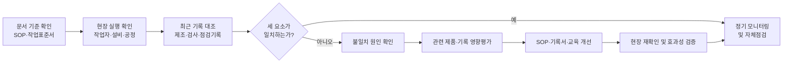
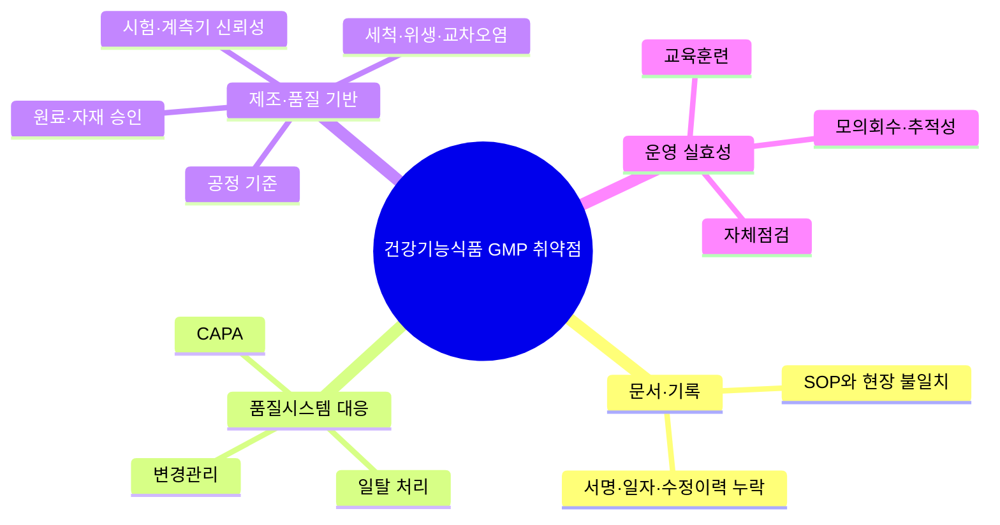

# [QA+ 블로그 생성 결과물] PR002 GMP 상위10대 취약점
생성일시: 2026-09-06 07:22:57 (KST)
적용모델: gpt-5.6-terra

================================================================================
# 📋 건강기능식품 GMP 심사 대비 최종 발행용 블로그 패키지

### 1. 메타 데이터 (SEO 설정)

- **최종 포스팅 제목**: 건강기능식품 GMP 심사 전 꼭 점검할 10대 취약점｜서류보다 먼저 봐야 할 현장·기록 관리
- **메타 디스크립션 (120자 내외 요약)**: 건강기능식품 GMP 심사 전 SOP와 현장 불일치, 기록 누락, 일탈·CAPA·변경관리, 원료·세척·계측기·회수 체계까지 10대 취약점을 실무 사례와 점검표로 확인하세요.
- **추천 해시태그 (10개)**:  
  #건강기능식품GMP #건기식GMP #GMP심사 #건강기능식품제조 #식품품질관리 #식품안전 #HACCP #일탈관리 #CAPA #변경관리
- **카테고리**: 건강기능식품 품질관리 / GMP 가이드

> **QA 검수 반영 사항**
> - 「건강기능식품에 관한 법률」 및 「우수건강기능식품제조기준」을 건강기능식품 GMP의 우선 확인 기준으로 안내했습니다.
> - CAPA, OOS, 밸리데이션 등은 건강기능식품 GMP에서 반드시 동일한 의약품 GMP 용어·절차로 운영해야 한다는 의미가 아니므로, 본문에서 “운영 원리로 참고할 수 있는 방식”으로 명확히 구분했습니다.
> - 모의회수 연 1회, 금속검출기 2시간 주기 등은 법정 일률 기준이 아닌 회사·제품·공정별 관리 예시임을 유지했습니다.
> - 오탈자 및 문장 표현을 교정했습니다. 예: “원료·자재 관리은” → “원료·자재 관리는”, “pH meter” → “pH 미터”.

---

## 2. 네이버 블로그 / 티스토리 복사용 최종 원고 (Markdown)

# 건강기능식품 GMP 심사 전 꼭 점검할 상위 10대 취약점: 서류보다 먼저 봐야 할 것

> **20년 실무 선배의 한 줄 요약**  
> 건강기능식품 GMP 심사에서 중요한 것은 “서류가 있느냐”가 아니라 **기준대로 현장이 움직이고, 그 사실이 기록으로 연결되며, 문제가 재발하지 않도록 관리되는가**입니다.  
> 오늘 소개하는 10개 항목을 `문서 1장 → 현장 1곳 → 최근 기록 1건`으로 묶어 점검하시면 심사 직전의 불안이 훨씬 줄어듭니다.

---

## 1. 심사 직전 서류 정리만으로는 해결되지 않는 이유

GMP 심사를 앞두고 가장 먼저 하는 일이 문서철 정리, 현장 청소, 누락 서명 확인인 경우가 많습니다. 물론 이것도 필요합니다. 그런데 심사에서 실제로 더 크게 보이는 문제는 서류철의 두께가 아니라, **문서·현장·기록이 서로 맞물려 돌아가는지**입니다.

예를 들어 SOP에는 혼합시간이 20분이라고 쓰여 있는데 현장 작업자는 “보통 15분쯤 돌립니다”라고 말한다면, 그 순간부터 품질시스템의 신뢰성이 흔들릴 수 있습니다.

현장에서 특히 많이 헷갈리는 부분이 있습니다. “우리는 다 하고 있습니다”라는 말만으로는 부족합니다. GMP에서는 제조, 점검, 시험, 출하 활동을 나중에 객관적으로 확인할 수 있어야 합니다. 쉽게 말하면 운전을 잘했다고 주장하는 것보다 블랙박스 기록이 남아 있어야 하는 것과 같습니다.

특히 건강기능식품은 원료의 특성, 기능성 원료의 관리, 혼합 균질성, 표시사항, 포장 상태 등에 따라 제품 품질이 달라질 수 있습니다. 그래서 단순히 위생적인 공장을 만드는 데서 끝나면 안 됩니다. 원료가 입고된 순간부터 사용승인, 제조, 시험·검사, 출하, 반품 및 회수까지 하나의 흐름으로 추적되어야 합니다.

현장에서는 GMP 취약점이 대체로 세 가지 형태로 나타납니다.

1. 기준 자체가 모호합니다.  
2. 실제로 했더라도 기록으로 증명되지 않습니다.  
3. 문제는 발견됐지만 원인을 제거하지 못해 다시 반복됩니다.  

이 세 가지를 잡으면 아래 10대 취약점도 훨씬 쉽게 정리됩니다.


다만 시작하기 전에 적용 기준부터 정확히 구분해야 합니다. GMP라는 단어는 업종마다 기준과 평가 방식이 다르기 때문에, 의약품 GMP 자료를 건강기능식품 제조소에 그대로 적용하면 오히려 혼선이 생길 수 있습니다.



---

## 2. 건강기능식품 GMP와 HACCP, 어디까지 다를까요?

본 글은 **건강기능식품 제조업의 GMP 운영**을 중심으로 설명합니다. 법적 근거로는 「건강기능식품에 관한 법률」 제22조 및 식품의약품안전처 고시 「우수건강기능식품제조기준」을 우선 확인하셔야 합니다. 해당 기준은 제조소와 시설·설비, 조직과 인력, 위생, 제조, 품질, 문서·기록, 보관·출하, 회수·사후관리, 자체점검 및 교육훈련 전반을 다룹니다.

일반 식품 제조업이라면 「식품위생법」 제48조와 「식품 및 축산물 안전관리인증기준」에 따른 HACCP 체계도 함께 확인해야 합니다. HACCP은 위해요소를 분석하고 중요관리점(CCP)을 중심으로 위해를 예방하는 체계입니다. 반면 GMP는 제품을 일관되게 제조하고 품질을 보증하기 위한 제조·품질관리의 전체 시스템입니다.

쉽게 말하면 HACCP이 “위험한 사고가 나지 않도록 핵심 위험지점을 집중 관리하는 체계”라면, GMP는 “좋은 제품을 계속 같은 품질로 만들기 위해 사람·시설·문서·원료·공정을 모두 관리하는 체계”입니다.

둘은 경쟁 관계가 아니라 연결해서 운영해야 합니다. 예를 들어 금속검출기는 HACCP의 중요관리와 연결될 수 있지만, GMP에서는 점검기준서, 표준시편 관리, 점검자 교육, 기록 수정관리, 고장 시 일탈처리까지 같이 봅니다.

의약품 제조업은 「의약품 등의 안전에 관한 규칙」 별표 1 및 「의약품 제조 및 품질관리에 관한 규정」 등 별도 GMP 체계를 적용받습니다. 따라서 건강기능식품 공장에 의약품 GMP의 모든 밸리데이션 또는 OOS 절차를 법적 의무처럼 적용해서는 안 됩니다. 다만 일탈조사, 변경관리, CAPA 같은 운영 원리는 건강기능식품 GMP 실무에서도 참고할 가치가 있습니다.

| 제조업 유형 | 우선 확인할 기준 | 실무상 핵심 포인트 |
|---|---|---|
| 건강기능식품 제조업 | 「건강기능식품에 관한 법률」, 「우수건강기능식품제조기준」 | 본문 주 적용 대상, 제조·품질·문서·출하 전반 관리 |
| 일반 식품 제조업 | 「식품위생법」, 「식품 및 축산물 안전관리인증기준」 | HACCP 위해요소·CCP 관리와 GMP성 관리체계 연계 |
| 의약품 제조업 | 「의약품 등의 안전에 관한 규칙」 별표 1, 의약품 GMP 관련 규정 | 건강기능식품 GMP와 별도 체계로 판단 |
| 화장품 제조업 | 「화장품법」, 우수화장품 제조 및 품질관리기준 | 시설·품질관리 원칙은 유사해도 세부 기준은 다름 |

> 법령과 고시는 개정될 수 있습니다. 실제 심사 준비 또는 절차서 제·개정 전에는 반드시 국가법령정보센터와 식품안전나라에서 최신 법령명, 고시명, 개정일 및 별표 내용을 다시 확인해 주세요.

이 기본 구분을 해두면, 이제부터 보는 취약점 10개도 훨씬 정확하게 적용하실 수 있습니다.

---

## 3. GMP 상위 10대 취약점, 먼저 전체 지도를 잡으세요

여기서 말하는 “상위 10대 취약점”은 식품의약품안전처가 모든 업종에 공통으로 공식 순위를 발표했다는 뜻은 아닙니다. 건강기능식품 GMP의 기본 요구사항 가운데, 하나의 문제가 연쇄적으로 여러 부적합으로 번지기 쉬운 **우선 진단 영역 10개**를 정리한 것입니다.

즉, 심사 대응용 암기 목록이 아니라 공장 운영의 위험지도라고 생각하시면 됩니다.

첫 번째와 두 번째는 문서와 기록입니다. 문서와 현장이 다르면 작업 표준이 무너지고, 기록이 부실하면 실제로 무엇을 했는지 증명할 수 없습니다.

세 번째부터 다섯 번째인 일탈, CAPA, 변경관리는 문제가 생겼을 때 또는 바꾸기 전에 품질 리스크를 통제하는 장치입니다.

여섯 번째부터 아홉 번째는 원료·공정·위생·시험의 신뢰성 영역입니다. 원료가 제대로 승인되지 않았거나, 제조조건이 불명확하거나, 세척 확인이 안 되거나, 계측기 신뢰성이 떨어지면 완제품 시험성적서 한 장만으로는 품질을 보증하기 어렵습니다.

마지막 교육·자체점검·회수 체계는 평소에 조직이 실제로 작동하는지를 보여주는 영역입니다.

| 우선순위 | 취약 관리영역 | 대표적인 현장 문제 | 심사관이 확인하는 질문 |
|---:|---|---|---|
| 1 | 문서와 현장의 불일치 | SOP와 실제 작업방법이 다름 | 최신 절차가 현장에 실행되고 있는가? |
| 2 | 문서·기록 관리 부실 | 서명·일자 누락, 수정이력 불명확 | 누가 언제 무엇을 했는지 추적되는가? |
| 3 | 일탈 처리 미흡 | 기준 이탈을 구두로만 해결 | 제품 영향평가와 처분 근거가 있는가? |
| 4 | CAPA 형식 운영 | 재교육만 반복 | 근본원인이 실제로 제거됐는가? |
| 5 | 변경관리 누락 | 공급처·설비·배합 변경 후 기록 없음 | 변경 전 영향평가와 승인 절차가 있는가? |
| 6 | 원료·자재 관리 부족 | 승인 전 원료 사용, 보류품 혼재 | 부적합 원료 투입을 차단하는가? |
| 7 | 제조·공정관리 모호 | 시간·온도·중량 기준 또는 조치 미흡 | 공정기준과 이탈 시 조치가 명확한가? |
| 8 | 세척·위생·교차오염 취약 | 알레르겐·분진·세척 잔류 관리 부족 | 다음 제품에 영향을 줄 오염을 통제하는가? |
| 9 | 시험·계측기 관리 미흡 | 저울·온도계·금속검출기 점검 누락 | 측정값과 시험결과를 신뢰할 수 있는가? |
| 10 | 교육·자체점검·회수 실효성 부족 | 참석서명만 있고 모의회수 미실시 | 비상 시 제품을 신속히 추적·격리할 수 있는가? |

아래 표를 보실 때 “우리 회사는 해당 없음”이라고 빨리 넘기지 마세요. 한 항목이라도 최근 3개월 기록을 즉시 꺼내 보여주기 어렵다면, 그 부분은 실제 취약점일 가능성이 높습니다. 특히 OEM·ODM 업체는 고객사 요구사항과 자사 GMP 절차가 충돌하지 않는지도 함께 확인해야 합니다.



---

## 4. 취약점 1~2: SOP와 기록이 현장을 따라가지 못할 때

첫 번째 취약점은 **문서와 현장의 불일치**입니다. SOP, 작업표준서, 제조기록서, 교육자료의 내용이 서로 다르거나 실제 작업자 행동과 다르면 문제가 됩니다.

예를 들어 SOP에는 “혼합기 가동 전 회전방향 확인 후 확인자 서명”이 있는데 제조기록서에는 해당 항목이 없고, 작업자는 회전방향 확인 자체를 모른다면 문서가 현장을 통제하지 못하는 상태입니다.

SOP는 심사 때 보여주기 위해 보관하는 문서가 아닙니다. 쉽게 말하면 작업자에게 주는 “현장용 내비게이션”입니다. 내비게이션이 3년 전 도로를 안내하면 운전자는 길을 잃습니다.

절차가 바뀌었다면 다음 항목이 한 묶음으로 움직여야 합니다.

- SOP 개정
- 현장 최신본 배포
- 구본 회수
- 관련 작업자 교육
- 제조기록서 반영
- 현장 실행 여부 확인

두 번째 취약점은 **문서·기록 관리 부실**입니다. 서명 하나가 빠졌다고 무조건 중대 부적합이 되는 것은 아니지만, 그 기록이 출하판정·시험·중요공정 관리와 관련돼 있고 누락이 반복된다면 신뢰성 문제로 커집니다.

날짜가 역전되어 있거나, 수정액으로 지워져 있거나, 누가 왜 고쳤는지 알 수 없는 기록도 마찬가지입니다.

기록 수정은 “깨끗하게 다시 쓰는 것”이 목적이 아닙니다. 원래 기록이 무엇이었고, 왜 수정했으며, 누가 언제 수정했는지 남겨야 합니다. 전자기록을 운영한다면 사용자 권한, 수정이력, 백업, 승인 절차도 관리해야 합니다.

“기록이 없으면 수행하지 않은 것으로 볼 수 있다”는 표현은 법조문 자체라기보다, 품질시스템에서 매우 중요한 실무 원칙으로 이해하시면 됩니다.

> **★ 현장 실무 꿀팁**  
> 심사관이 “금속검출기 관리는 어떻게 하십니까?”라고 물으면 “매일 하고 있습니다”라고 답하지 마세요.  
> **① SOP 제시 → ② 현장 표준시편·격리함 확인 → ③ 최근 1개월 기록 제시 → ④ 이탈 발생 시 조치기록 제시** 순서로 보여드리면 됩니다.


문서와 기록의 연결이 잡혔다면, 다음은 “문제가 생겼을 때 어떻게 처리하느냐”입니다. 여기서 많은 제조소가 일탈과 CAPA를 같은 것으로 생각해 놓치는 부분이 생깁니다.

---

## 5. 취약점 3~5: 일탈·CAPA·변경관리는 따로, 그러나 연결해서 관리하세요

일탈(Deviation)은 정해진 기준, 절차, 제조조건에서 벗어난 사건을 확인하고 평가하는 과정입니다.

예를 들어 혼합시간 기준이 `20±2분`인데 실제 25분 혼합했다면, 단순히 “조금 더 돌았으니 괜찮다”로 끝내면 안 됩니다. 해당 로트, 같은 시간대의 생산품, 혼합 균질성, 원료 특성, 후속 공정에 미친 영향을 확인해야 합니다.

일탈이 발생하면 기본 흐름은 비교적 명확합니다.

1. 제품과 관련 자재를 식별합니다.  
2. 필요하면 보류 또는 격리합니다.  
3. 영향 범위를 정합니다.  
4. 사실관계를 조사합니다.  
5. 제품 처분 또는 출하 가능 여부를 회사의 품질관리 권한 체계에 따라 결정합니다.  
6. 재발 방지를 위한 CAPA를 수립합니다.  
7. 일정 기간 후 효과성까지 확인합니다.  

CAPA는 Corrective and Preventive Action, 즉 시정 및 예방조치입니다. 쉽게 말하면 일탈이 “무슨 일이 벌어졌는지 조사하는 과정”이라면, CAPA는 “왜 벌어졌는지 없애고 다시 안 생기게 만드는 조치”입니다.

그런데 현장에서는 원인 분석 없이 “작업자 재교육 실시” 한 줄로 종결하는 경우가 많습니다.

재교육이 필요할 때도 분명 있습니다. 다만 반복되는 오류가 있다면 작업자 개인의 기억력 문제가 아니라 다음 항목까지 봐야 합니다.

- SOP가 지나치게 복잡하지 않은가?
- 작업 위치나 동선이 불편하지 않은가?
- 라벨·원료·자재의 식별성이 낮지 않은가?
- 설비 인터록 또는 오류방지 장치가 필요한가?
- 확인자가 실제로 검토하고 있는가?

5Why 기법을 쓰더라도 마지막 답이 늘 “작업자 부주의”로 끝난다면, 근본원인 분석이 덜 된 것입니다.

변경관리도 빼놓을 수 없습니다. 원료 공급처, 배합비, 포장재, 제조시간, 세척제, 설비, 시험법, 외주업체가 바뀌면 제품에 영향을 줄 가능성이 있습니다.

변경 후 문제가 생겼을 때 기록하는 것보다 **변경 전에 영향평가하고 승인받는 것**이 훨씬 중요합니다.

권장 흐름은 다음과 같습니다.

`변경 요청 → 품질·안전 영향평가 → 관련부서 검토 → 승인 → 필요 시 시험·검증 → SOP·기록서 개정 → 교육 → 변경 후 효과 확인`

---

## 6. 취약점 6~9: 원료부터 계측기까지, 품질의 출발점을 놓치지 마세요

### 원료·자재 관리

원료·자재 관리는 완제품 품질의 출발점입니다. 승인된 공급업체 목록이 있고, 입고 시 원료명·로트·유통기한·보관조건·성적서·사용승인 상태가 확인되어야 합니다.

성적서를 받았다는 사실만으로 끝내면 안 됩니다. 해당 성적서가 입고 원료와 연결되는지, 규격 적합 여부를 누가 검토했는지, 보류 상태 원료가 실수로 투입되지 않도록 관리되는지가 중요합니다.

특히 부적합품, 반품품, 보류품은 정상 원료와 물리적으로 또는 전산상으로 명확하게 구분되어야 합니다. “잠깐 옆에 둔 것”이 가장 위험합니다.

현장에서는 다음과 같은 방법을 함께 운영하면 실수 가능성을 줄일 수 있습니다.

- 노란색 보류표지
- 빨간색 부적합표지
- 격리구역 운영
- 전산 사용불가 상태 적용
- 입고·사용승인 상태 라벨 관리

재고관리는 FIFO보다 유통기한 중심의 FEFO(선기한선출)가 더 적절한 품목도 많으니, 제품 특성에 맞춰 정하세요.

### 제조·공정관리

제조·공정관리에서는 혼합시간, 온도, 중량, 충전량, 체가름, 금속검출 감도 같은 기준이 명확해야 합니다.

기준만 적어두고 허용범위나 이탈 시 조치가 없으면 작업자는 판단하지 못합니다. 예를 들어 충전량 기준이 500g이라면 다음 항목을 절차에 담아야 합니다.

- 관리 허용범위
- 점검주기
- 샘플 수
- 기준 이탈 시 생산중지 여부
- 이전 생산분의 확인 범위
- 격리 및 처분 절차
- QA 또는 품질관리부서 보고 기준

### 세척·위생·교차오염 관리

세척·위생·교차오염 관리는 “청소했습니다”라는 기록 한 줄로 끝나지 않습니다.

알레르겐 원료, 분진이 많은 식이섬유 원료, 색소·향료, 유지류를 사용하는 공정은 이전 품목의 잔류가 다음 제품에 영향을 줄 수 있습니다.

다음 항목을 함께 관리하세요.

- 세척 순서
- 세척도구의 구분
- 세척 후 확인방법
- 작업 전 라인클리어런스
- 청소기구 보관상태
- 잔류 가능성이 높은 원료의 전용 또는 구분 관리
- 세척 불충분 시 재세척 및 기록 절차

### 시험·검사 및 계측기 관리

시험·검사 및 계측기 관리는 결과의 신뢰성을 만드는 영역입니다. 저울, 온도계, pH 미터, 금속검출기, 수분측정기 등은 점검·교정·검증 상태가 명확해야 합니다.

시험결과가 이상할 때 무조건 재시험만 반복하지 마세요. 시료 채취 오류인지, 시험자 오류인지, 장비 이상인지, 실제 제조 문제인지를 구분해 조사해야 올바른 처분 결정을 할 수 있습니다.

---

## 7. 사례 1. 건강기능식품 분말 스틱 제조업체의 혼합시간 일탈 개선

한 건강기능식품 분말 스틱 제조업체는 비타민·미네랄 혼합분말을 생산하고 있었습니다. 해당 제품의 혼합 기준은 20분이었지만, 제조기록서에는 단순히 “혼합 완료”라고만 기록하도록 되어 있었습니다.

정기 내부점검에서 작업자마다 실제 혼합시간이 15분에서 28분까지 다르다는 사실이 확인됐습니다. 처음에는 생산팀이 “최종 시험결과가 적합했으니 큰 문제는 아니다”라고 판단했습니다.

그러나 QA가 최근 10개 로트의 제조기록과 작업자 면담을 비교해 보니, 혼합시간 기준을 작업자가 정확히 모르고 있었습니다.

SOP에는 20분이라고 되어 있었지만, 현장에는 오래된 작업표준서가 붙어 있었고 거기에는 15분으로 적혀 있었습니다. 또한 혼합기 타이머는 수동으로 설정해야 했는데, 시작·종료시간을 기록하는 칸도 없었습니다.

근본원인은 작업자 부주의가 아니라 **SOP 개정 후 구본 회수와 교육, 제조기록서 개정이 연결되지 않은 문서관리 실패**였습니다.

회사는 즉시 관련 로트를 보류하고, 혼합 균질성 시험자료와 공정기록을 검토해 제품 영향평가를 실시했습니다.

이후 다음과 같이 개선했습니다.

- 현장 구본 전량 회수
- 최신 SOP에 혼합시간 `20±2분` 명확화
- 타이머 설정방법 반영
- 제조기록서에 시작시간·종료시간·타이머 확인란 추가
- 작업자 및 확인자 서명란 추가
- 혼합기 제어반에 기준시간 라벨 부착
- 2주간 현장 수행평가 실시

그 결과 다음 3개월 동안 혼합시간 기록 누락은 0건이었고, 작업자 인터뷰에서도 기준과 이탈 시 보고 절차를 모두 설명할 수 있었습니다.

이 사례에서 핵심은 “기록 칸 하나를 추가했다”는 데 있지 않습니다. 기준서, 현장 표준, 교육, 설비 사용방법, 제조기록서가 하나로 연결돼야 한다는 점입니다. 심사관 입장에서도 이런 개선은 단순 지적 조치보다 훨씬 신뢰 있게 보입니다.

---

## 8. 사례 2. 액상 건강기능식품 제조업체의 원료 공급처 변경관리 누락

두 번째 사례는 홍삼 혼합액 기반의 액상 건강기능식품을 제조하는 업체입니다. 기존 원료 공급업체의 납기 문제가 생기면서 구매팀이 동일 규격의 부원료 공급처를 새로 찾았습니다.

새 공급업체가 제출한 시험성적서상 규격은 기존 원료와 같았고, 구매팀은 생산 차질을 막기 위해 빠르게 입고를 진행했습니다. 하지만 변경관리 문서는 작성되지 않았고, QA의 사전 검토도 없었습니다.

새 원료를 사용한 뒤 충전공정에서 점도 변동이 커지고, 일부 로트에서 충전량 편차가 증가했습니다. 생산팀은 충전기 노즐 문제라고 판단해 설비를 세척하고 재가동했습니다.

그러나 품질팀이 원료 입고기록, 제조기록, 점도 측정값을 비교한 결과, 이상은 새 공급처 원료를 사용한 시점부터 시작됐습니다.

조사 결과 새 원료는 규격상 수분 기준은 적합했지만, 입도 분포와 보관 중 응집 특성이 기존 원료와 달랐습니다.

회사는 즉시 해당 원료 사용 로트를 식별해 보류하고, 충전량 기록과 완제품 시험결과를 바탕으로 영향 범위를 평가했습니다.

이후 변경관리 절차를 개정해 공급업체 변경 시 구매팀 단독으로 진행할 수 없도록 했습니다. 원료 공급처 변경은 QA, 생산, 연구 또는 기술부서가 함께 점도·혼합성·충전성·관능·보관조건 영향을 검토하도록 개선했습니다.

변경 전 소규모 시험제조 또는 확인시험이 필요한 경우도 사전에 정했습니다.

또한 승인공급업체 목록에는 다음 정보를 관리하도록 개선했습니다.

- 공급업체별 평가일
- 재평가 주기
- 주요 품질특성
- 특이사항
- 변경 이력
- 공급업체 평가 결과

개선 후에는 새 공급처 원료를 도입하기 전 시험제조 2회와 연속 생산 3로트의 데이터를 확인하는 절차를 운영했습니다.

그 결과 구매팀도 “규격서가 같으면 같은 원료”라는 생각에서 벗어났습니다. 원료 변경은 종이 한 장의 문제가 아니라 제품 품질과 공정 안정성에 직접 연결되는 리스크라는 점을 현장이 체감하게 된 사례입니다.

---

## 9. 사례 3. 젤리형 건강기능식품 제조업체의 금속검출기 일탈과 CAPA

세 번째 사례는 젤리형 건강기능식품을 생산하는 제조업체입니다. 생산 중 금속검출기 감도점검에서 철(Fe) 표준시편이 한 차례 검출되지 않는 일이 발생했습니다.

당시 현장 담당자는 재점검에서 정상 검출되자 “일시적 오류”로 보고 생산을 계속했습니다. 기록에는 재점검 결과만 남았고, 최초 불검출 시점과 해당 시간대 제품의 처리 내용은 명확하지 않았습니다.

며칠 뒤 자체점검에서 QA가 이 기록을 발견했습니다. 금속검출기 불검출은 단순 장비 이상 여부를 넘어, 그 직전과 직후 생산품의 금속이물 관리 신뢰성과 연결될 수 있는 문제였습니다.

조사 결과 담당자는 설비 이상 발생 시 생산중지·제품격리 기준을 충분히 교육받지 못했고, SOP에도 “재점검 후 정상일 경우 조치”만 간단히 적혀 있었습니다.

또한 다음 기준이 없었습니다.

- 불검출 발생 시 어느 시점까지 제품을 보류해야 하는가
- 표준시편 재확인 횟수는 몇 회인가
- QA 보고 기준은 무엇인가
- 설비 점검 및 재가동 승인 절차는 무엇인가
- 영향 제품의 범위는 어떻게 설정하는가

회사는 최초 불검출 전 마지막 정상점검 시점부터 재검증 완료 시점까지 생산된 제품을 모두 추적해 보류했습니다.

설비 점검 결과 컨베이어 진동으로 인해 특정 위치에서 표준시편 통과 방향이 흔들리는 문제가 확인됐습니다.

즉시조치로는 컨베이어 가이드와 센서 위치를 조정하고, 표준시편 점검방법을 작업자별로 동일하게 표준화했습니다.

CAPA로는 금속검출 SOP에 다음 절차를 반영했습니다.

1. 불검출 발생 시 생산중지  
2. 해당 시간대 제품 격리  
3. 마지막 정상점검 이후 제품의 범위 설정  
4. 설비점검 실시  
5. QA 승인 전 재가동 금지  
6. 재가동 후 감도 재확인 및 기록  
7. 영향평가 및 제품 처분 근거 문서화  

또한 회사의 위험평가와 공정 특성에 따라 매 교대 시작 전, 생산 중 정해진 주기, 제품 종료 시점에 표준시편 감도점검을 하는 방식으로 점검주기를 재정비했습니다.

교육은 단순 참석서명이 아니라 실제 표준시편을 사용해 조치 시나리오를 수행하도록 평가했습니다.

한 달 뒤 모의 일탈훈련에서 작업자들은 10분 이내에 해당 제품을 보류하고 QA에 보고할 수 있었습니다.

이 사례의 포인트는 재교육만 한 것이 아니라, 설비·절차·기록·훈련 방식을 함께 바꿔 CAPA의 효과성을 확인했다는 데 있습니다.

---

## 10. 교육·자체점검·회수 체계, “있다”가 아니라 “작동한다”를 보여주세요

교육은 참석자 명단에 서명만 받는다고 끝나지 않습니다. 작업자가 본인의 공정에서 무엇을 확인해야 하는지, 기준 이탈 시 누구에게 어떻게 보고해야 하는지 설명할 수 있어야 합니다.

다음 교육을 구분해 운영하는 것이 좋습니다.

- 신규 입사자 교육
- 정기교육
- SOP 개정교육
- 특정 일탈 발생 후 보완교육
- 직무별 심화교육
- 현장 수행평가

필요하면 구두 질문이나 현장 수행평가로 이해도를 확인하세요.

자체점검도 심사 직전 대청소와 서류 확인으로 끝내면 효과가 약합니다. 자체점검에서 “지적사항 없음”만 반복되면 오히려 점검의 깊이가 의심받을 수 있습니다.

문제를 발견하는 것은 부끄러운 일이 아닙니다. 문제를 발견하고, 위험도를 정하고, 책임자와 완료기한을 부여하고, 조치 후 효과성까지 확인하는 것이 제대로 된 자체점검입니다.

회수 체계는 특히 실제 추적이 되는지가 중요합니다. 완제품 로트번호 하나를 임의로 선택했을 때, 다음 정보를 신속히 확인할 수 있어야 합니다.

- 사용 원료 로트
- 제조일
- 생산량
- 재고량
- 출하처
- 출하수량
- 반품 또는 회수 수량
- 미확인 수량 및 확인 계획

모의회수는 문서를 읽는 훈련이 아니라 실제로 제품을 찾고 연락망이 작동하는지 확인하는 훈련입니다.

현장에서는 연 1회 이상 모의회수를 계획하는 곳이 많지만, 회사 규모와 출하 구조에 따라 더 자주 점검할 필요도 있습니다. 예를 들어 다수의 온라인 판매처, 물류대행사, 해외 수출 거래처가 있다면 추적 경로가 복잡해집니다.

최소한 모의회수 결과에 다음 항목은 남기세요.

- 소요시간
- 확인된 재고수량
- 미확인 수량
- 연락 실패 여부
- 추적 경로상 문제점
- 개선사항
- 개선조치 완료 여부
- 재검증 결과

아래 체크리스트는 PR002 같은 사내 자율점검 절차서에 바로 옮겨 활용할 수 있는 기본형입니다. 다만 점검주기와 허용기준은 제품 특성, 제조방식, 사내 승인 절차에 맞게 조정하셔야 합니다.

| 점검 항목 | 확인 기준 | 권장 확인 방법 | 주기 예시 |
|---|---|---|---|
| 최신 SOP 관리 | 최신본 비치, 구본 회수, 개정교육 완료 | 문서대장·현장 문서·교육기록 대조 | 월 1회 |
| 제조기록서 | 시간·서명·확인·수정이력 누락 없음 | 최근 3개 로트 샘플링 검토 | 주 1회 |
| 일탈관리 | 격리·영향평가·처분·CAPA 연결 | 최근 일탈 1건 역추적 | 월 1회 |
| 변경관리 | 변경 전 영향평가·승인 완료 | 원료·설비·포장재 변경 목록 대조 | 월 1회 |
| 원료관리 | 승인공급업체, 사용승인, 보류구역 구분 | 입고기록·성적서·현장 라벨 확인 | 주 1회 |
| 공정관리 | 시간·온도·중량 등 기준과 이탈조치 명확 | 제조기록과 현장 인터뷰 | 주 1회 |
| 세척·위생 | 세척기준, 도구구분, 라인클리어런스 | 세척기록·현장 청결상태 확인 | 일일/주간 |
| 계측기·검사장비 | 점검·교정·표준시편 상태 적합 | 장비대장·점검기록·현장 확인 | 장비별 |
| 교육훈련 | 직무별 교육 및 이해도 확인 | 교육대장·평가결과·인터뷰 | 분기/반기 |
| 모의회수 | 로트 추적 및 연락체계 검증 | 모의회수 보고서 확인 | 연 1회 이상 |

---

## 11. 자주 묻는 질문(FAQ): 심사에서 특히 헷갈리는 부분

### Q1. GMP와 HACCP은 같은 것인가요?

**A. 아닙니다.** HACCP은 식품안전 위해요소를 분석하고 중요관리점을 중심으로 위해를 예방하는 체계입니다. GMP는 사람, 시설, 위생, 원료, 제조, 품질, 문서, 출하, 회수까지 포함해 제품 품질을 일관되게 보증하는 제조·품질관리 체계입니다.

다만 현장에서는 두 체계를 따로 놀게 하지 말고, 공정점검과 기록을 연결해서 운영하는 것이 좋습니다.

### Q2. 제조기록서에 서명 하나가 빠졌는데 바로 부적합인가요?

**A. 누락 하나만으로 중대성 여부가 무조건 결정되는 것은 아닙니다.** 하지만 해당 서명이 중요한 공정 확인, 시험, 출하판정의 증빙이라면 문제가 커질 수 있습니다.

누락을 발견했을 때는 임의로 덮어쓰거나 다른 사람이 대신 서명하지 말고, 사내 문서수정 절차에 따라 수정자·수정일·수정사유를 남기고 필요 시 사실관계를 확인해야 합니다.

### Q3. 일탈이 발생하면 해당 제품은 반드시 폐기해야 하나요?

**A. 일탈 발생만으로 자동 폐기가 결정되는 것은 아닙니다.** 제품 품질과 안전성 영향, 이탈 범위, 관련 시험결과, 공정기록, 추적 가능성을 근거로 보류·재처리·폐기·출하 여부를 판단해야 합니다.

다만 영향평가 없이 “괜찮아 보인다”는 이유로 출하하는 것은 절대 피하셔야 합니다.

### Q4. 원료 공급처가 바뀌었지만 시험성적서 규격이 같으면 변경관리 없이 사용해도 되나요?

**A. 권장되지 않습니다.** 규격서가 같아도 원료의 제조공정, 입도, 수분, 불순물 특성, 미생물학적 특성, 포장·운송 조건이 달라질 수 있습니다.

변경 전에 품질·안전성·공정성 영향평가를 하고, 필요 시 시험제조나 추가 확인시험을 거친 뒤 승인하는 체계가 안전합니다.

### Q5. 자체점검에서 문제를 많이 찾으면 심사에 오히려 불리하지 않나요?

**A. 문제를 찾았다는 사실보다 그 뒤의 조치가 훨씬 중요합니다.** 자체점검에서 발견한 사항에 대해 위험도를 평가하고, 책임자·완료기한·시정조치·효과성 확인까지 남겨두면 오히려 시스템이 살아 있다는 증거가 됩니다.

반대로 매번 “이상 없음”만 나오는 점검표는 실효성에 의문을 줄 수 있습니다.

### Q6. CAPA를 할 때 재교육만 해도 괜찮은 경우가 있나요?

**A. 작업자가 절차를 몰랐고, 절차 자체와 설비·환경에는 문제가 없었다는 근거가 있다면 재교육이 일부 조치가 될 수 있습니다.** 하지만 같은 유형의 실수가 반복되거나 여러 작업자에게서 발생한다면 재교육만으로는 부족합니다.

SOP의 실행 가능성, 라벨 식별성, 설비 인터록, 작업 동선, 확인자 검토방식까지 함께 검토해야 합니다.

---

## 12. 맺음말: GMP는 심사용 서류가 아니라 문제를 미리 막는 운영체계입니다

오늘 내용은 결국 다섯 가지 질문으로 정리됩니다.

> **기준이 있는가, 현장에서 실행되는가, 기록으로 증명되는가, 문제가 발생했을 때 통제되는가, 같은 문제가 다시 발생하지 않는가**

이 다섯 가지에 자신 있게 답할 수 있다면 GMP 심사 준비의 방향은 맞습니다.

첫째, SOP와 제조기록서는 반드시 현장 작업과 일치해야 합니다.  
둘째, 일탈·변경·CAPA는 발생 후 서류를 만드는 일이 아니라 품질 리스크를 관리하는 과정입니다.  
셋째, 원료부터 출하·회수까지 로트 추적이 가능해야 진짜 품질시스템이라고 할 수 있습니다.

처음부터 10개를 한꺼번에 완벽하게 고치려고 하면 지칩니다. 이번 주에는 가장 최근 제조기록서 1건을 들고 현장에 가보세요.

그 기록의 기준이 SOP에 있는지, 작업자가 알고 있는지, 이탈이 생기면 어떻게 처리하는지까지 확인해 보시면 됩니다.

GMP 심사는 완벽한 문서철을 평가하는 자리가 아닙니다. 기준을 세우고, 현장에서 지키고, 기록으로 증명하고, 문제가 생기면 재발하지 않게 개선하는 체계가 실제로 작동하는지 확인하는 과정입니다.

막히는 부분이 있으면 댓글로 편하게 물어보세요. 건강기능식품 GMP 심사 준비과 현장 품질관리 업무를 응원합니다.

---

## 3. 워드프레스 / 웹사이트용 HTML 원고

```html
<article class="food-qa-post">
  <header>
    <h1>건강기능식품 GMP 심사 전 꼭 점검할 상위 10대 취약점: 서류보다 먼저 봐야 할 것</h1>
    <blockquote>
      <p><strong>20년 실무 선배의 한 줄 요약</strong>: 건강기능식품 GMP 심사에서 중요한 것은 “서류가 있느냐”가 아니라 <strong>기준대로 현장이 움직이고, 그 사실이 기록으로 연결되며, 문제가 재발하지 않도록 관리되는가</strong>입니다.</p>
      <p>오늘 소개하는 10개 항목을 <code>문서 1장 → 현장 1곳 → 최근 기록 1건</code>으로 묶어 점검하시면 심사 직전의 불안이 훨씬 줄어듭니다.</p>
    </blockquote>
  </header>

  <section>
    <h2>1. 심사 직전 서류 정리만으로는 해결되지 않는 이유</h2>

    <p>GMP 심사를 앞두고 가장 먼저 하는 일이 문서철 정리, 현장 청소, 누락 서명 확인인 경우가 많습니다. 물론 이것도 필요합니다. 그런데 심사에서 실제로 더 크게 보이는 문제는 서류철의 두께가 아니라, <strong>문서·현장·기록이 서로 맞물려 돌아가는지</strong>입니다.</p>

    <p>예를 들어 SOP에는 혼합시간이 20분이라고 쓰여 있는데 현장 작업자는 “보통 15분쯤 돌립니다”라고 말한다면, 그 순간부터 품질시스템의 신뢰성이 흔들릴 수 있습니다.</p>

    <p>현장에서 특히 많이 헷갈리는 부분이 있습니다. “우리는 다 하고 있습니다”라는 말만으로는 부족합니다. GMP에서는 제조, 점검, 시험, 출하 활동을 나중에 객관적으로 확인할 수 있어야 합니다. 쉽게 말하면 운전을 잘했다고 주장하는 것보다 블랙박스 기록이 남아 있어야 하는 것과 같습니다.</p>

    <p>특히 건강기능식품은 원료의 특성, 기능성 원료의 관리, 혼합 균질성, 표시사항, 포장 상태 등에 따라 제품 품질이 달라질 수 있습니다. 그래서 단순히 위생적인 공장을 만드는 데서 끝나면 안 됩니다. 원료가 입고된 순간부터 사용승인, 제조, 시험·검사, 출하, 반품 및 회수까지 하나의 흐름으로 추적되어야 합니다.</p>

    <p>현장에서는 GMP 취약점이 대체로 세 가지 형태로 나타납니다.</p>
    <ol>
      <li>기준 자체가 모호합니다.</li>
      <li>실제로 했더라도 기록으로 증명되지 않습니다.</li>
      <li>문제는 발견됐지만 원인을 제거하지 못해 다시 반복됩니다.</li>
    </ol>

    <p>이 세 가지를 잡으면 아래 10대 취약점도 훨씬 쉽게 정리됩니다.</p>

    <figure>
      
      <figcaption>건강기능식품 GMP는 SOP, 현장 실행, 제조·검사기록이 하나의 흐름으로 연결되어야 합니다.</figcaption>
    </figure>

    <p>다만 시작하기 전에 적용 기준부터 정확히 구분해야 합니다. GMP라는 단어는 업종마다 기준과 평가 방식이 다르기 때문에, 의약품 GMP 자료를 건강기능식품 제조소에 그대로 적용하면 오히려 혼선이 생길 수 있습니다.</p>

    <pre class="mermaid">
flowchart LR
    A["문서 기준 확인&lt;br/&gt;SOP·작업표준서"] --&gt; B["현장 실행 확인&lt;br/&gt;작업자·설비·공정"]
    B --&gt; C["최근 기록 대조&lt;br/&gt;제조·검사·점검기록"]
    C --&gt; D{"세 요소가&lt;br/&gt;일치하는가?"}
    D -- "예" --&gt; E["정기 모니터링&lt;br/&gt;및 자체점검"]
    D -- "아니오" --&gt; F["불일치 원인 확인"]
    F --&gt; G["관련 제품·기록 영향평가"]
    G --&gt; H["SOP·기록서·교육 개선"]
    H --&gt; I["현장 재확인 및 효과성 검증"]
    I --&gt; E
    </pre>
  </section>

  <section>
    <h2>2. 건강기능식품 GMP와 HACCP, 어디까지 다를까요?</h2>

    <p>본 글은 <strong>건강기능식품 제조업의 GMP 운영</strong>을 중심으로 설명합니다. 법적 근거로는 「건강기능식품에 관한 법률」 제22조 및 식품의약품안전처 고시 「우수건강기능식품제조기준」을 우선 확인하셔야 합니다. 해당 기준은 제조소와 시설·설비, 조직과 인력, 위생, 제조, 품질, 문서·기록, 보관·출하, 회수·사후관리, 자체점검 및 교육훈련 전반을 다룹니다.</p>

    <p>일반 식품 제조업이라면 「식품위생법」 제48조와 「식품 및 축산물 안전관리인증기준」에 따른 HACCP 체계도 함께 확인해야 합니다. HACCP은 위해요소를 분석하고 중요관리점(CCP)을 중심으로 위해를 예방하는 체계입니다. 반면 GMP는 제품을 일관되게 제조하고 품질을 보증하기 위한 제조·품질관리의 전체 시스템입니다.</p>

    <p>쉽게 말하면 HACCP이 “위험한 사고가 나지 않도록 핵심 위험지점을 집중 관리하는 체계”라면, GMP는 “좋은 제품을 계속 같은 품질로 만들기 위해 사람·시설·문서·원료·공정을 모두 관리하는 체계”입니다.</p>

    <p>둘은 경쟁 관계가 아니라 연결해서 운영해야 합니다. 예를 들어 금속검출기는 HACCP의 중요관리와 연결될 수 있지만, GMP에서는 점검기준서, 표준시편 관리, 점검자 교육, 기록 수정관리, 고장 시 일탈처리까지 같이 봅니다.</p>

    <p>의약품 제조업은 「의약품 등의 안전에 관한 규칙」 별표 1 및 「의약품 제조 및 품질관리에 관한 규정」 등 별도 GMP 체계를 적용받습니다. 따라서 건강기능식품 공장에 의약품 GMP의 모든 밸리데이션 또는 OOS 절차를 법적 의무처럼 적용해서는 안 됩니다. 다만 일탈조사, 변경관리, CAPA 같은 운영 원리는 건강기능식품 GMP 실무에서도 참고할 가치가 있습니다.</p>

    <table>
      <thead>
        <tr>
          <th>제조업 유형</th>
          <th>우선 확인할 기준</th>
          <th>실무상 핵심 포인트</th>
        </tr>
      </thead>
      <tbody>
        <tr>
          <td>건강기능식품 제조업</td>
          <td>「건강기능식품에 관한 법률」, 「우수건강기능식품제조기준」</td>
          <td>본문 주 적용 대상, 제조·품질·문서·출하 전반 관리</td>
        </tr>
        <tr>
          <td>일반 식품 제조업</td>
          <td>「식품위생법」, 「식품 및 축산물 안전관리인증기준」</td>
          <td>HACCP 위해요소·CCP 관리와 GMP성 관리체계 연계</td>
        </tr>
        <tr>
          <td>의약품 제조업</td>
          <td>「의약품 등의 안전에 관한 규칙」 별표 1, 의약품 GMP 관련 규정</td>
          <td>건강기능식품 GMP와 별도 체계로 판단</td>
        </tr>
        <tr>
          <td>화장품 제조업</td>
          <td>「화장품법」, 우수화장품 제조 및 품질관리기준</td>
          <td>시설·품질관리 원칙은 유사해도 세부 기준은 다름</td>
        </tr>
      </tbody>
    </table>

    <aside>
      <p><strong>확인 안내:</strong> 법령과 고시는 개정될 수 있습니다. 실제 심사 준비 또는 절차서 제·개정 전에는 국가법령정보센터와 식품안전나라에서 최신 법령명, 고시명, 개정일 및 별표 내용을 다시 확인해 주세요.</p>
    </aside>
  </section>

  <section>
    <h2>3. GMP 상위 10대 취약점, 먼저 전체 지도를 잡으세요</h2>

    <p>여기서 말하는 “상위 10대 취약점”은 식품의약품안전처가 모든 업종에 공통으로 공식 순위를 발표했다는 뜻은 아닙니다. 건강기능식품 GMP의 기본 요구사항 가운데, 하나의 문제가 연쇄적으로 여러 부적합으로 번지기 쉬운 <strong>우선 진단 영역 10개</strong>를 정리한 것입니다.</p>

    <p>즉, 심사 대응용 암기 목록이 아니라 공장 운영의 위험지도라고 생각하시면 됩니다.</p>

    <table>
      <thead>
        <tr>
          <th>우선순위</th>
          <th>취약 관리영역</th>
          <th>대표적인 현장 문제</th>
          <th>심사관이 확인하는 질문</th>
        </tr>
      </thead>
      <tbody>
        <tr><td>1</td><td>문서와 현장의 불일치</td><td>SOP와 실제 작업방법이 다름</td><td>최신 절차가 현장에 실행되고 있는가?</td></tr>
        <tr><td>2</td><td>문서·기록 관리 부실</td><td>서명·일자 누락, 수정이력 불명확</td><td>누가 언제 무엇을 했는지 추적되는가?</td></tr>
        <tr><td>3</td><td>일탈 처리 미흡</td><td>기준 이탈을 구두로만 해결</td><td>제품 영향평가와 처분 근거가 있는가?</td></tr>
        <tr><td>4</td><td>CAPA 형식 운영</td><td>재교육만 반복</td><td>근본원인이 실제로 제거됐는가?</td></tr>
        <tr><td>5</td><td>변경관리 누락</td><td>공급처·설비·배합 변경 후 기록 없음</td><td>변경 전 영향평가와 승인 절차가 있는가?</td></tr>
        <tr><td>6</td><td>원료·자재 관리 부족</td><td>승인 전 원료 사용, 보류품 혼재</td><td>부적합 원료 투입을 차단하는가?</td></tr>
        <tr><td>7</td><td>제조·공정관리 모호</td><td>시간·온도·중량 기준 또는 조치 미흡</td><td>공정기준과 이탈 시 조치가 명확한가?</td></tr>
        <tr><td>8</td><td>세척·위생·교차오염 취약</td><td>알레르겐·분진·세척 잔류 관리 부족</td><td>다음 제품에 영향을 줄 오염을 통제하는가?</td></tr>
        <tr><td>9</td><td>시험·계측기 관리 미흡</td><td>저울·온도계·금속검출기 점검 누락</td><td>측정값과 시험결과를 신뢰할 수 있는가?</td></tr>
        <tr><td>10</td><td>교육·자체점검·회수 실효성 부족</td><td>참석서명만 있고 모의회수 미실시</td><td>비상 시 제품을 신속히 추적·격리할 수 있는가?</td></tr>
      </tbody>
    </table>

    <p>아래 표를 보실 때 “우리 회사는 해당 없음”이라고 빨리 넘기지 마세요. 한 항목이라도 최근 3개월 기록을 즉시 꺼내 보여주기 어렵다면, 그 부분은 실제 취약점일 가능성이 높습니다. 특히 OEM·ODM 업체는 고객사 요구사항과 자사 GMP 절차가 충돌하지 않는지도 함께 확인해야 합니다.</p>
  </section>

  <section>
    <h2>4. 취약점 1~2: SOP와 기록이 현장을 따라가지 못할 때</h2>

    <p>첫 번째 취약점은 <strong>문서와 현장의 불일치</strong>입니다. SOP, 작업표준서, 제조기록서, 교육자료의 내용이 서로 다르거나 실제 작업자 행동과 다르면 문제가 됩니다.</p>

    <p>예를 들어 SOP에는 “혼합기 가동 전 회전방향 확인 후 확인자 서명”이 있는데 제조기록서에는 해당 항목이 없고, 작업자는 회전방향 확인 자체를 모른다면 문서가 현장을 통제하지 못하는 상태입니다.</p>

    <p>SOP는 심사 때 보여주기 위해 보관하는 문서가 아닙니다. 쉽게 말하면 작업자에게 주는 “현장용 내비게이션”입니다. 내비게이션이 3년 전 도로를 안내하면 운전자는 길을 잃습니다.</p>

    <ul>
      <li>SOP 개정</li>
      <li>현장 최신본 배포</li>
      <li>구본 회수</li>
      <li>관련 작업자 교육</li>
      <li>제조기록서 반영</li>
      <li>현장 실행 여부 확인</li>
    </ul>

    <p>두 번째 취약점은 <strong>문서·기록 관리 부실</strong>입니다. 서명 하나가 빠졌다고 무조건 중대 부적합이 되는 것은 아니지만, 그 기록이 출하판정·시험·중요공정 관리와 관련돼 있고 누락이 반복된다면 신뢰성 문제로 커집니다.</p>

    <p>날짜가 역전되어 있거나, 수정액으로 지워져 있거나, 누가 왜 고쳤는지 알 수 없는 기록도 마찬가지입니다.</p>

    <p>기록 수정은 “깨끗하게 다시 쓰는 것”이 목적이 아닙니다. 원래 기록이 무엇이었고, 왜 수정했으며, 누가 언제 수정했는지 남겨야 합니다. 전자기록을 운영한다면 사용자 권한, 수정이력, 백업, 승인 절차도 관리해야 합니다.</p>

    <blockquote>
      <p><strong>현장 실무 꿀팁</strong></p>
      <p>심사관이 “금속검출기 관리는 어떻게 하십니까?”라고 물으면 “매일 하고 있습니다”라고 답하지 마세요.</p>
      <p><strong>① SOP 제시 → ② 현장 표준시편·격리함 확인 → ③ 최근 1개월 기록 제시 → ④ 이탈 발생 시 조치기록 제시</strong> 순서로 보여드리면 됩니다.</p>
    </blockquote>

    <figure>
      
      <figcaption>SOP 개정은 파일 교체가 아니라 현장 배포, 구본 회수, 교육, 기록서 반영까지 연결되는 운영 변경입니다.</figcaption>
    </figure>
  </section>

  <section>
    <h2>5. 취약점 3~5: 일탈·CAPA·변경관리는 따로, 그러나 연결해서 관리하세요</h2>

    <p>일탈(Deviation)은 정해진 기준, 절차, 제조조건에서 벗어난 사건을 확인하고 평가하는 과정입니다.</p>

    <p>예를 들어 혼합시간 기준이 <code>20±2분</code>인데 실제 25분 혼합했다면, 단순히 “조금 더 돌았으니 괜찮다”로 끝내면 안 됩니다. 해당 로트, 같은 시간대의 생산품, 혼합 균질성, 원료 특성, 후속 공정에 미친 영향을 확인해야 합니다.</p>

    <ol>
      <li>제품과 관련 자재를 식별합니다.</li>
      <li>필요하면 보류 또는 격리합니다.</li>
      <li>영향 범위를 정합니다.</li>
      <li>사실관계를 조사합니다.</li>
      <li>제품 처분 또는 출하 가능 여부를 회사의 품질관리 권한 체계에 따라 결정합니다.</li>
      <li>재발 방지를 위한 CAPA를 수립합니다.</li>
      <li>일정 기간 후 효과성까지 확인합니다.</li>
    </ol>

    <p>CAPA는 Corrective and Preventive Action, 즉 시정 및 예방조치입니다. 일탈이 “무슨 일이 벌어졌는지 조사하는 과정”이라면, CAPA는 “왜 벌어졌는지 없애고 다시 안 생기게 만드는 조치”입니다.</p>

    <p>반복되는 오류가 있다면 작업자 개인의 기억력 문제가 아니라 SOP가 복잡한지, 작업 위치가 불편한지, 라벨이 비슷한지, 설비 인터록이 없는지, 확인자가 실제로 검토하는지까지 봐야 합니다.</p>

    <p>변경관리도 빼놓을 수 없습니다. 원료 공급처, 배합비, 포장재, 제조시간, 세척제, 설비, 시험법, 외주업체가 바뀌면 제품에 영향을 줄 가능성이 있습니다.</p>

    <p>변경 후에 문제가 생겼을 때 기록하는 것보다 <strong>변경 전에 영향평가하고 승인받는 것</strong>이 훨씬 중요합니다.</p>

    <p><code>변경 요청 → 품질·안전 영향평가 → 관련부서 검토 → 승인 → 필요 시 시험·검증 → SOP·기록서 개정 → 교육 → 변경 후 효과 확인</code></p>
  </section>

  <section>
    <h2>6. 취약점 6~9: 원료부터 계측기까지, 품질의 출발점을 놓치지 마세요</h2>

    <h3>원료·자재 관리</h3>
    <p>원료·자재 관리는 완제품 품질의 출발점입니다. 승인된 공급업체 목록이 있고, 입고 시 원료명·로트·유통기한·보관조건·성적서·사용승인 상태가 확인되어야 합니다.</p>
    <p>성적서를 받았다는 사실만으로 끝내면 안 됩니다. 해당 성적서가 입고 원료와 연결되는지, 규격 적합 여부를 누가 검토했는지, 보류 상태 원료가 실수로 투입되지 않도록 관리되는지가 중요합니다.</p>

    <h3>제조·공정관리</h3>
    <p>제조·공정관리에서는 혼합시간, 온도, 중량, 충전량, 체가름, 금속검출 감도 같은 기준이 명확해야 합니다. 기준만 적어두고 허용범위나 이탈 시 조치가 없으면 작업자는 판단하지 못합니다.</p>

    <h3>세척·위생·교차오염 관리</h3>
    <p>세척·위생·교차오염 관리는 “청소했습니다”라는 기록 한 줄로 끝나지 않습니다. 알레르겐 원료, 분진이 많은 식이섬유 원료, 색소·향료, 유지류를 사용하는 공정은 이전 품목의 잔류가 다음 제품에 영향을 줄 수 있습니다.</p>

    <h3>시험·검사 및 계측기 관리</h3>
    <p>시험·검사 및 계측기 관리는 결과의 신뢰성을 만드는 영역입니다. 저울, 온도계, pH 미터, 금속검출기, 수분측정기 등은 점검·교정·검증 상태가 명확해야 합니다.</p>
    <p>시험결과가 이상할 때 무조건 재시험만 반복하지 마세요. 시료 채취 오류인지, 시험자 오류인지, 장비 이상인지, 실제 제조 문제인지를 구분해 조사해야 올바른 처분 결정을 할 수 있습니다.</p>
  </section>

  <section>
    <h2>7. 사례 1. 건강기능식품 분말 스틱 제조업체의 혼합시간 일탈 개선</h2>

    <p>한 건강기능식품 분말 스틱 제조업체는 비타민·미네랄 혼합분말을 생산하고 있었습니다. 해당 제품의 혼합 기준은 20분이었지만, 제조기록서에는 단순히 “혼합 완료”라고만 기록하도록 되어 있었습니다.</p>

    <p>정기 내부점검에서 작업자마다 실제 혼합시간이 15분에서 28분까지 다르다는 사실이 확인됐습니다. 처음에는 생산팀이 “최종 시험결과가 적합했으니 큰 문제는 아니다”라고 판단했습니다.</p>

    <p>그러나 QA가 최근 10개 로트의 제조기록과 작업자 면담을 비교해 보니, 혼합시간 기준을 작업자가 정확히 모르고 있었습니다. SOP에는 20분이라고 되어 있었지만, 현장에는 오래된 작업표준서가 붙어 있었고 거기에는 15분으로 적혀 있었습니다.</p>

    <p>근본원인은 작업자 부주의가 아니라 <strong>SOP 개정 후 구본 회수와 교육, 제조기록서 개정이 연결되지 않은 문서관리 실패</strong>였습니다.</p>

    <p>회사는 즉시 관련 로트를 보류하고, 혼합 균질성 시험자료와 공정기록을 검토해 제품 영향평가를 실시했습니다. 이후 현장 구본을 전량 회수하고, 최신 SOP에 혼합시간 20±2분과 타이머 설정방법을 명확히 반영했습니다.</p>

    <p>제조기록서에는 시작시간, 종료시간, 타이머 확인, 작업자 및 확인자 서명란을 추가했습니다. 추가로 혼합기 제어반에 기준시간을 라벨로 표시하고, 2주간 현장 수행평가를 실시했습니다.</p>

    <p>그 결과 다음 3개월 동안 혼합시간 기록 누락은 0건이었고, 작업자 인터뷰에서도 기준과 이탈 시 보고 절차를 모두 설명할 수 있었습니다.</p>
  </section>

  <section>
    <h2>8. 사례 2. 액상 건강기능식품 제조업체의 원료 공급처 변경관리 누락</h2>

    <p>두 번째 사례는 홍삼 혼합액 기반의 액상 건강기능식품을 제조하는 업체입니다. 기존 원료 공급업체의 납기 문제가 생기면서 구매팀이 동일 규격의 부원료 공급처를 새로 찾았습니다.</p>

    <p>새 공급업체가 제출한 시험성적서상 규격은 기존 원료와 같았고, 구매팀은 생산 차질을 막기 위해 빠르게 입고를 진행했습니다. 하지만 변경관리 문서는 작성되지 않았고, QA의 사전 검토도 없었습니다.</p>

    <p>새 원료를 사용한 뒤 충전공정에서 점도 변동이 커지고, 일부 로트에서 충전량 편차가 증가했습니다. 품질팀이 원료 입고기록, 제조기록, 점도 측정값을 비교한 결과, 이상은 새 공급처 원료를 사용한 시점부터 시작됐습니다.</p>

    <p>조사 결과 새 원료는 규격상 수분 기준은 적합했지만, 입도 분포와 보관 중 응집 특성이 기존 원료와 달랐습니다.</p>

    <p>회사는 즉시 해당 원료 사용 로트를 식별해 보류하고, 충전량 기록과 완제품 시험결과를 바탕으로 영향 범위를 평가했습니다. 이후 변경관리 절차를 개정해 공급업체 변경 시 구매팀 단독으로 진행할 수 없도록 했습니다.</p>

    <p>개선 후에는 새 공급처 원료를 도입하기 전 시험제조 2회와 연속 생산 3로트의 데이터를 확인하는 절차를 운영했습니다. 원료 변경은 종이 한 장의 문제가 아니라 제품 품질과 공정 안정성에 직접 연결되는 리스크라는 점을 현장이 체감하게 된 사례입니다.</p>
  </section>

  <section>
    <h2>9. 사례 3. 젤리형 건강기능식품 제조업체의 금속검출기 일탈과 CAPA</h2>

    <p>세 번째 사례는 젤리형 건강기능식품을 생산하는 제조업체입니다. 생산 중 금속검출기 감도점검에서 철(Fe) 표준시편이 한 차례 검출되지 않는 일이 발생했습니다.</p>

    <p>당시 현장 담당자는 재점검에서 정상 검출되자 “일시적 오류”로 보고 생산을 계속했습니다. 기록에는 재점검 결과만 남았고, 최초 불검출 시점과 해당 시간대 제품의 처리 내용은 명확하지 않았습니다.</p>

    <p>조사 결과 담당자는 설비 이상 발생 시 생산중지·제품격리 기준을 충분히 교육받지 못했고, SOP에도 “재점검 후 정상일 경우 조치”만 간단히 적혀 있었습니다.</p>

    <p>회사는 최초 불검출 전 마지막 정상점검 시점부터 재검증 완료 시점까지 생산된 제품을 모두 추적해 보류했습니다. 설비 점검 결과 컨베이어 진동으로 인해 특정 위치에서 표준시편 통과 방향이 흔들리는 문제가 확인됐습니다.</p>

    <p>CAPA로는 금속검출 SOP에 불검출 발생 시 생산중지, 제품 격리, 마지막 정상점검 이후 제품의 범위 설정, 설비점검, QA 승인 전 재가동 금지 절차를 넣었습니다.</p>

    <p>교육은 단순 참석서명이 아니라 실제 표준시편을 사용해 조치 시나리오를 수행하도록 평가했습니다. 한 달 뒤 모의 일탈훈련에서 작업자들은 10분 이내에 해당 제품을 보류하고 QA에 보고할 수 있었습니다.</p>
  </section>

  <section>
    <h2>10. 교육·자체점검·회수 체계, “있다”가 아니라 “작동한다”를 보여주세요</h2>

    <p>교육은 참석자 명단에 서명만 받는다고 끝나지 않습니다. 작업자가 본인의 공정에서 무엇을 확인해야 하는지, 기준 이탈 시 누구에게 어떻게 보고해야 하는지 설명할 수 있어야 합니다.</p>

    <p>자체점검도 심사 직전 대청소와 서류 확인으로 끝내면 효과가 약합니다. 문제를 발견하고, 위험도를 정하고, 책임자와 완료기한을 부여하고, 조치 후 효과성까지 확인하는 것이 제대로 된 자체점검입니다.</p>

    <p>회수 체계는 특히 실제 추적이 되는지가 중요합니다. 완제품 로트번호 하나를 임의로 선택했을 때, 사용 원료 로트, 제조일, 생산량, 재고량, 출하처, 출하수량을 신속히 확인할 수 있어야 합니다.</p>

    <table>
      <thead>
        <tr>
          <th>점검 항목</th>
          <th>확인 기준</th>
          <th>권장 확인 방법</th>
          <th>주기 예시</th>
        </tr>
      </thead>
      <tbody>
        <tr><td>최신 SOP 관리</td><td>최신본 비치, 구본 회수, 개정교육 완료</td><td>문서대장·현장 문서·교육기록 대조</td><td>월 1회</td></tr>
        <tr><td>제조기록서</td><td>시간·서명·확인·수정이력 누락 없음</td><td>최근 3개 로트 샘플링 검토</td><td>주 1회</td></tr>
        <tr><td>일탈관리</td><td>격리·영향평가·처분·CAPA 연결</td><td>최근 일탈 1건 역추적</td><td>월 1회</td></tr>
        <tr><td>변경관리</td><td>변경 전 영향평가·승인 완료</td><td>원료·설비·포장재 변경 목록 대조</td><td>월 1회</td></tr>
        <tr><td>원료관리</td><td>승인공급업체, 사용승인, 보류구역 구분</td><td>입고기록·성적서·현장 라벨 확인</td><td>주 1회</td></tr>
        <tr><td>공정관리</td><td>시간·온도·중량 등 기준과 이탈조치 명확</td><td>제조기록과 현장 인터뷰</td><td>주 1회</td></tr>
        <tr><td>세척·위생</td><td>세척기준, 도구구분, 라인클리어런스</td><td>세척기록·현장 청결상태 확인</td><td>일일/주간</td></tr>
        <tr><td>계측기·검사장비</td><td>점검·교정·표준시편 상태 적합</td><td>장비대장·점검기록·현장 확인</td><td>장비별</td></tr>
        <tr><td>교육훈련</td><td>직무별 교육 및 이해도 확인</td><td>교육대장·평가결과·인터뷰</td><td>분기/반기</td></tr>
        <tr><td>모의회수</td><td>로트 추적 및 연락체계 검증</td><td>모의회수 보고서 확인</td><td>연 1회 이상</td></tr>
      </tbody>
    </table>
  </section>

  <section>
    <h2>11. 자주 묻는 질문(FAQ): 심사에서 특히 헷갈리는 부분</h2>

    <h3>Q1. GMP와 HACCP은 같은 것인가요?</h3>
    <p><strong>A. 아닙니다.</strong> HACCP은 식품안전 위해요소를 분석하고 중요관리점을 중심으로 위해를 예방하는 체계입니다. GMP는 사람, 시설, 위생, 원료, 제조, 품질, 문서, 출하, 회수까지 포함해 제품 품질을 일관되게 보증하는 제조·품질관리 체계입니다.</p>

    <h3>Q2. 제조기록서에 서명 하나가 빠졌는데 바로 부적합인가요?</h3>
    <p><strong>A. 누락 하나만으로 중대성 여부가 무조건 결정되는 것은 아닙니다.</strong> 하지만 해당 서명이 중요한 공정 확인, 시험, 출하판정의 증빙이라면 문제가 커질 수 있습니다.</p>

    <h3>Q3. 일탈이 발생하면 해당 제품은 반드시 폐기해야 하나요?</h3>
    <p><strong>A. 일탈 발생만으로 자동 폐기가 결정되는 것은 아닙니다.</strong> 제품 품질과 안전성 영향, 이탈 범위, 관련 시험결과, 공정기록, 추적 가능성을 근거로 보류·재처리·폐기·출하 여부를 판단해야 합니다.</p>

    <h3>Q4. 원료 공급처가 바뀌었지만 시험성적서 규격이 같으면 변경관리 없이 사용해도 되나요?</h3>
    <p><strong>A. 권장되지 않습니다.</strong> 규격서가 같아도 원료의 제조공정, 입도, 수분, 불순물 특성, 미생물학적 특성, 포장·운송 조건이 달라질 수 있습니다.</p>

    <h3>Q5. 자체점검에서 문제를 많이 찾으면 심사에 오히려 불리하지 않나요?</h3>
    <p><strong>A. 문제를 찾았다는 사실보다 그 뒤의 조치가 훨씬 중요합니다.</strong> 자체점검에서 발견한 사항에 대해 위험도를 평가하고, 책임자·완료기한·시정조치·효과성 확인까지 남겨두면 오히려 시스템이 살아 있다는 증거가 됩니다.</p>

    <h3>Q6. CAPA를 할 때 재교육만 해도 괜찮은 경우가 있나요?</h3>
    <p><strong>A. 작업자가 절차를 몰랐고, 절차 자체와 설비·환경에는 문제가 없었다는 근거가 있다면 재교육이 일부 조치가 될 수 있습니다.</strong> 하지만 같은 유형의 실수가 반복되거나 여러 작업자에게서 발생한다면 재교육만으로는 부족합니다.</p>
  </section>

  <section>
    <h2>12. 맺음말: GMP는 심사용 서류가 아니라 문제를 미리 막는 운영체계입니다</h2>

    <p>오늘 내용은 결국 다섯 가지 질문으로 정리됩니다.</p>

    <blockquote>
      <p><strong>기준이 있는가, 현장에서 실행되는가, 기록으로 증명되는가, 문제가 발생했을 때 통제되는가, 같은 문제가 다시 발생하지 않는가</strong></p>
    </blockquote>

    <p>이 다섯 가지에 자신 있게 답할 수 있다면 GMP 심사 준비의 방향은 맞습니다.</p>

    <ol>
      <li>SOP와 제조기록서는 반드시 현장 작업과 일치해야 합니다.</li>
      <li>일탈·변경·CAPA는 발생 후 서류를 만드는 일이 아니라 품질 리스크를 관리하는 과정입니다.</li>
      <li>원료부터 출하·회수까지 로트 추적이 가능해야 진짜 품질시스템이라고 할 수 있습니다.</li>
    </ol>

    <p>처음부터 10개를 한꺼번에 완벽하게 고치려고 하면 지칩니다. 이번 주에는 가장 최근 제조기록서 1건을 들고 현장에 가보세요. 그 기록의 기준이 SOP에 있는지, 작업자가 알고 있는지, 이탈이 생기면 어떻게 처리하는지까지 확인해 보시면 됩니다.</p>

    <p>GMP 심사는 완벽한 문서철을 평가하는 자리가 아닙니다. 기준을 세우고, 현장에서 지키고, 기록으로 증명하고, 문제가 생기면 재발하지 않게 개선하는 체계가 실제로 작동하는지 확인하는 과정입니다.</p>

    <p>막히는 부분이 있으면 댓글로 편하게 물어보세요. 건강기능식품 GMP 심사 준비과 현장 품질관리 업무를 응원합니다.</p>
  </section>
</article>
```
================================================================================

[부록: 1단계 리서치 원본]
# [리서치 리포트] PR002 GMP 상위 10대 취약점

> **범위 확인 전제**  
> `PR002`는 식품·건강기능식품·의약품 GMP 분야에서 공통적으로 통용되는 법령 또는 고시 번호는 아닙니다. 따라서 본 리포트에서는 **사내 절차서/교육과정/프로젝트 코드명(PR002)** 으로 보고 설계했습니다.  
> 또한 “GMP 상위 10대 취약점”은 식품의약품안전처가 모든 업종에 공통으로 공식 순위를 발표한 표현으로 단정하면 안 됩니다. 본 글에서는 **공식 GMP 요구사항을 기준으로 심사·현장점검에서 중대 부적합으로 발전하기 쉬운 10개 관리영역**을 제시하는 방식이 안전합니다.  
>
> 본문은 식품 분야 독자를 고려해 **건강기능식품 GMP 중심**으로 구성하되, 의약품 GMP와 혼동되지 않도록 적용 기준을 명확히 구분해야 합니다.

---

### 1. 타겟 독자 및 검색 의도

- **주요 타겟**
  - 건강기능식품 제조업체의 품질관리(QC)·품질보증(QA) 담당자
  - GMP 신규 인증 또는 정기평가를 준비하는 제조팀장·공장장
  - OEM/ODM 제조업체의 협력업체 관리 담당자
  - 식품회사에서 GMP·HACCP 업무를 처음 맡은 신입 실무자
  - 사내 절차서 `PR002`에 따라 GMP 취약점 진단표를 만들려는 담당자

- **독자의 핵심 고통(Pain Point)**
  - “우리 공장이 심사에서 실제로 가장 먼저 지적받을 부분은 무엇일까?”
  - “서류는 있는데 현장과 맞지 않는다. 이것도 부적합인가?”
  - “일탈, 반품, 클레임이 생겼을 때 어느 수준까지 조사·기록해야 하나?”
  - “설비 교체나 원료 공급처 변경을 했는데, 변경관리 기록이 꼭 필요한가?”
  - “GMP와 HACCP의 관리 범위가 겹치는데 무엇을 다르게 준비해야 하나?”
  - “심사 직전에 ‘정리’하는 방식이 아니라, 평소에 유지되는 체계를 만들고 싶다.”

- **메인 키워드**
  - `GMP 취약점`

- **서브/연관 키워드**
  - `건강기능식품 GMP 심사`
  - `GMP 주요 지적사항`
  - `GMP 문서관리`
  - `GMP 일탈 CAPA`
  - `GMP 변경관리`
  - `GMP 자율점검 체크리스트`
  - `GMP HACCP 차이`

- **핵심 검색 의도**
  - 정보 탐색형: GMP 심사에서 보는 핵심 관리항목과 취약점 이해
  - 문제 해결형: 현재 운영 중인 GMP 시스템의 부적합 위험 진단
  - 실무 서식 탐색형: 자율점검표, 일탈보고서, CAPA 관리대장, 변경관리대장 구성
  - 인증 준비형: 신규·갱신·정기평가 전 우선 보완 항목 확인

---

### 2. 필수 인용 법령 및 표준 기준

## 2-1. 적용 기준을 먼저 구분할 것

블로그 첫 부분에서 독자가 자신의 업종에 맞는 기준을 찾도록 아래처럼 구분하는 것이 좋습니다.

| 제조업 유형 | 우선 확인할 공식 기준 | 글에서의 적용 방식 |
|---|---|---|
| 건강기능식품 제조업 | 「건강기능식품에 관한 법률」 및 식품의약품안전처 고시 「우수건강기능식품제조기준」 | **본 글의 주 적용 기준** |
| 일반 식품 제조업 | 「식품위생법」, 「식품 및 축산물 안전관리인증기준」 | HACCP 운영과 연계해 설명 |
| 의약품 제조업 | 「의약품 등의 안전에 관한 규칙」 별표 1, 식품의약품안전처 고시 「의약품 제조 및 품질관리에 관한 규정」 | 별도 GMP 체계이므로 혼용 금지 |
| 화장품 제조업 | 「화장품법」 및 식품의약품안전처 고시 「우수화장품 제조 및 품질관리기준」 | 건강기능식품 GMP와 평가기준이 다름 |

> **작성 유의사항:** “GMP”라는 단어만으로는 업종별 법적 기준이 동일하지 않습니다. 따라서 제목 또는 서론에 반드시 **‘건강기능식품 GMP 기준’**, **‘의약품 GMP 기준’**처럼 적용 범위를 표시해야 합니다.

---

## 2-2. 법적·표준 근거

- **「건강기능식품에 관한 법률」 제22조**
  - 우수건강기능식품제조기준(GMP)의 적용 및 지정 근거를 확인할 수 있는 핵심 법률 근거입니다.
  - 제조업체의 시설·관리 수준을 단순 위생관리 수준이 아니라, 제품 품질과 안전성을 지속적으로 보증하는 시스템으로 관리해야 한다는 출발점입니다.

- **식품의약품안전처 고시 「우수건강기능식품제조기준」**
  - 건강기능식품 GMP의 직접적인 운영 기준입니다.
  - 블로그에서는 최신 고시 원문 및 별표를 기준으로 다음 영역을 인용·설명해야 합니다.
    - 제조소 및 시설·설비 관리
    - 조직 및 인력 관리
    - 위생관리
    - 제조관리
    - 품질관리
    - 문서 및 기록관리
    - 제품의 보관·출하·회수·사후관리
    - 자체점검 및 교육훈련

- **「식품위생법」 제48조 및 「식품 및 축산물 안전관리인증기준」**
  - HACCP 적용업소이거나 HACCP 운영체계를 함께 설명할 때 인용합니다.
  - GMP는 제조 전반의 품질보증 체계이고, HACCP은 위해요소 분석 및 중요관리점 중심의 식품안전관리 체계라는 점을 구분하는 근거로 활용할 수 있습니다.

- **식품의약품안전처 식품안전나라**
  - 건강기능식품 GMP 지정업소, 관련 법령·고시, 교육·정책자료의 최신본 확인 경로입니다.
  - 블로그 발행 전 반드시 국가법령정보센터 및 식품안전나라에서 **고시명·개정일·별표 내용**을 재확인해야 합니다.

- **의약품 업종으로 확장 설명할 경우**
  - 「의약품 등의 안전에 관한 규칙」 별표 1 「의약품 제조 및 품질관리기준」
  - 식품의약품안전처 고시 「의약품 제조 및 품질관리에 관한 규정」
  - 단, 건강기능식품 GMP 글에 의약품 GMP의 밸리데이션, 제조기록서, 일탈·OOS 체계를 그대로 법적 의무처럼 가져오면 안 됩니다. **참고 운영사례**와 **법적 요구사항**을 구분해 써야 합니다.

---

## 2-3. 현장 실무 팩트: GMP 상위 10대 취약 관리영역

아래 10개는 “전국 공식 지적 순위”가 아니라, GMP의 기본 요건 중 **하나의 문제가 여러 부적합으로 연결되기 쉬운 우선 진단 영역**입니다. 블로그에서는 이를 “상위 10대 취약점”으로 정의하고, 독자에게 자율점검 기준을 제공하는 구성이 적절합니다.

| 우선순위 | 취약 관리영역 | 현장에서 자주 발생하는 문제 | 심사·점검 관점의 핵심 질문 |
|---|---|---|---|
| 1 | 문서와 현장의 불일치 | SOP에는 있지만 실제 작업자는 다른 방식으로 작업함 | “작업자가 현재 승인된 절차대로 수행했음을 증명할 수 있는가?” |
| 2 | 문서·기록 관리 부실 | 서명 누락, 날짜 역전, 수정 흔적 불명확, 기록 사후작성 의심 | “언제, 누가, 무엇을 했는지 추적 가능한가?” |
| 3 | 일탈·부적합 처리 미흡 | 기준 이탈을 구두로만 처리하고 원인조사·영향평가가 없음 | “이탈 제품의 품질·안전성 영향은 평가됐는가?” |
| 4 | CAPA의 형식적 운영 | ‘재교육 실시’만 반복하고 근본원인이 제거되지 않음 | “재발방지 조치가 원인을 실제로 제거했는가?” |
| 5 | 변경관리 누락 | 원료 공급처, 배합비, 설비, 세척방법, 검사기준 변경 후 검토 기록 없음 | “변경 전에 품질·안전성 영향을 평가하고 승인했는가?” |
| 6 | 원료·자재 공급업체 관리 부족 | 공급업체 평가 없이 성적서만 수령하거나, 입고검사가 일관되지 않음 | “부적합 원료가 제조에 투입되지 않도록 통제되는가?” |
| 7 | 제조·공정관리 기준 불명확 | 혼합시간, 온도, 중량, 금속검출 등 관리기준은 있으나 기록·이탈조치가 불명확 | “공정조건과 허용기준, 이탈 시 조치가 정해져 있는가?” |
| 8 | 세척·위생 및 교차오염 관리 취약 | 세척 기준은 있으나 확인 기록이 없고, 알레르겐·분진·이물 혼입 위험이 관리되지 않음 | “다음 제품에 영향을 줄 수 있는 잔류·오염을 통제하는가?” |
| 9 | 시험·검사 및 계측기 관리 미흡 | 시험법 변경 미검토, 검체 보관 부실, 저울·온도계·금속검출기 점검 누락 | “시험결과와 공정 측정값의 신뢰성을 보장하는가?” |
| 10 | 교육·자체점검·회수 체계의 실효성 부족 | 교육 참석 서명만 있고 이해도 평가 없음, 모의회수 미실시 또는 추적 불가 | “문제 발생 시 제품을 신속히 추적·격리·회수할 수 있는가?” |

### 현장 실무에서 반드시 강조할 팩트

- **“기록이 없으면 수행하지 않은 것으로 볼 수 있다”는 원칙**
  - GMP에서 기록은 단순 행정서류가 아니라 제조·검사·출하 활동의 객관적 증빙입니다.
  - 다만 블로그에서는 이 문구를 법조문처럼 인용하지 말고, **품질시스템 운영의 실무 원칙**으로 설명하는 것이 적절합니다.

- **SOP는 ‘보관용 문서’가 아니라 현장 실행 기준**
  - 현장의 실제 작업방법, 교육내용, 제조기록서 항목이 SOP와 일치해야 합니다.
  - 절차가 바뀌었는데 SOP 개정이 늦거나, SOP 개정은 됐는데 작업자 교육이 안 된 경우가 대표적인 취약점입니다.

- **일탈과 CAPA는 구분해야 함**
  - 일탈(Deviation): 정해진 기준·절차·조건에서 벗어난 사건을 확인하고 평가하는 과정
  - CAPA(Corrective and Preventive Action): 원인을 제거하고 재발을 방지하기 위한 시정·예방조치
  - “재교육”은 때로 필요한 조치이지만, 설비·절차·작업환경·원료·감독체계 문제를 배제한 채 반복하면 CAPA의 실효성이 약해집니다.

- **변경은 ‘변경 후 기록’보다 ‘변경 전 평가’가 중요**
  - 원료 공급처, 포장재, 배합비, 제조시간, 설비, 검사기준, 세척방법 등의 변경은 제품 품질과 안전성에 영향을 줄 수 있습니다.
  - 변경 전 영향평가 → 관련 부서 검토 → 승인 → 필요 시 시험/검증 → 문서 개정 및 교육 → 변경 후 확인의 흐름으로 관리하는 것이 바람직합니다.

- **자체점검은 심사 직전 대청소가 아니라 정기 시스템 점검**
  - 자체점검 결과에서 발견된 문제는 개선 완료 여부와 효과성까지 확인해야 합니다.
  - “지적사항 없음”만 반복되는 자체점검표는 오히려 점검의 실효성에 의문을 줄 수 있습니다.

---

### 3. 추천 블로그 목차 (Outline)

## H1 제목 후보 3개

1. **건강기능식품 GMP 심사 전 꼭 점검할 상위 10대 취약점: 서류보다 먼저 봐야 할 것**
2. **GMP에서 반복 지적되는 10가지 문제, 문서·일탈·변경관리가 핵심입니다**
3. **PR002 GMP 자율점검 가이드: 심사관이 확인하는 취약 관리영역 10가지**

> 추천 제목:  
> 검색성과 실무성을 고려하면 **“건강기능식품 GMP 심사 전 꼭 점검할 상위 10대 취약점”**이 가장 명확합니다.  
> 단, 실제 적용 대상이 의약품·화장품이라면 반드시 업종명을 교체해야 합니다.

---

## H2 서론 (Intro): “심사 직전 서류 정리”만으로는 해결되지 않는 이유

### 도입 문제 제기

- GMP 심사를 앞두고 가장 흔히 하는 준비는 문서철 정리, 현장 청소, 누락 서명 확인입니다.
- 그러나 실제 취약점은 ‘서류가 있느냐’보다 **문서·기록·현장 작업이 하나의 체계로 연결되는가**에서 드러납니다.
- 예를 들어 제조기록서에 서명은 모두 있어도, 작업자가 최신 SOP를 모르거나 원료 변경에 대한 승인기록이 없다면 시스템의 신뢰성은 낮아질 수 있습니다.

### 핵심 결론 먼저 제시

- GMP 취약점은 대체로 다음 세 축으로 압축됩니다.
  1. **기준이 명확하지 않다**: SOP, 기준서, 허용한계, 책임자가 불분명함
  2. **기록으로 증명되지 않는다**: 누락, 사후작성 의심, 추적 불가
  3. **문제가 재발한다**: 일탈·변경·CAPA가 형식적으로 끝남
- 따라서 이 글은 단순히 “심사 지적사항”을 나열하지 않고, 현장에서 바로 적용할 수 있는 **GMP 상위 10대 취약점 자율진단 프레임**을 제공합니다.

### 독자에게 안내할 주의문

- 본문은 건강기능식품 GMP 관점의 일반 실무 가이드입니다.
- 업종별 GMP 고시와 개별 제조소의 허가·인증 조건이 다를 수 있으므로, 최종 판단은 최신 법령·고시와 제조소의 승인 문서에 따라 해야 합니다.

---

## H2 본론 1: GMP 상위 10대 취약점과 공식 기준의 연결

### 1. 문서와 현장이 다르다: SOP가 실제로 작동하지 않는 문제

- SOP, 작업표준서, 제조기록서, 교육자료 간 내용 불일치 사례
- 개정된 SOP가 현장에 배포되지 않았거나 구본이 남아 있는 경우
- **점검 질문**
  - 현장에 최신본만 비치되어 있는가?
  - 작업자가 절차의 핵심 관리사항을 설명할 수 있는가?
  - 제조기록서 항목이 SOP 요구사항을 빠짐없이 반영하는가?

### 2. 기록관리 부실: 했다는 사실을 증명하지 못하는 문제

- 서명·일자·확인자 누락
- 수정 시 수정자, 수정일, 수정사유가 불명확한 문제
- 한꺼번에 작성한 듯한 동일 필체·동일 시간대 기록의 위험
- 전자기록을 사용할 경우 권한관리·수정이력·백업의 중요성

### 3. 일탈을 ‘현장 해결’로 끝내는 문제

- 규격 이탈, 제조조건 이탈, 설비 이상, 검사 이상 발생 시의 기본 흐름 제시
  1. 즉시 식별 및 필요 시 격리
  2. 관련 제품·공정 영향 범위 확인
  3. 원인조사
  4. 제품처분 또는 후속조치 결정
  5. CAPA 수립
  6. 효과성 확인
- “생산에 지장이 없어 보여 그냥 진행했다”는 판단이 위험한 이유 설명

### 4. CAPA가 재교육으로 끝나는 문제

- 인적 오류인지, 절차 문제인지, 설비·환경 문제인지 구분해야 함
- 근본원인 분석 시 활용 가능한 질문
  - 왜 작업자가 실수했는가?
  - 작업자가 실수해도 제품 이상으로 이어지지 않도록 설계되어 있는가?
  - SOP가 실제 작업환경에서 실행 가능한가?
- CAPA 완료 기준은 ‘조치 실시’가 아니라 **재발 위험 감소의 확인**임을 강조

### 5. 변경관리가 없는 문제

- 변경관리 대상 예시
  - 원료 및 공급업체
  - 제조처방·배합비
  - 포장재 및 표시사항
  - 제조설비·측정기기
  - 세척제·세척방법
  - 제조조건·검사방법·규격
  - 외주업체
- 변경 후 문제가 생겼을 때 “누가 언제 어떤 근거로 승인했는지” 추적할 수 있어야 함

### 6. 원료·자재 관리이력이 끊기는 문제

- 승인된 공급업체 목록 관리
- 원료 입고 시 식별, 보관상태, 시험성적서, 필요 검사, 사용승인 상태 확인
- 부적합 원료·반품 원료가 정상 원료와 혼재되지 않도록 구획·표시 관리
- 선입선출(FIFO), 선기한선출(FEFO) 기준의 실질적 운영 여부

### 7. 제조공정 관리기준이 모호한 문제

- 중요 공정조건의 설정 근거와 기록
- 혼합시간, 온도, 중량, 충전량, 체가름, 금속검출 등 공정별 관리 예시
- 기준 이탈 시 생산팀 단독 판단이 아니라 품질부서와 연계해야 하는 상황 설명
- HACCP 관리사항과 GMP 제조관리사항을 중복 기록이 아닌 **연결된 체계**로 운영하는 팁

### 8. 세척·위생·교차오염 관리가 약한 문제

- 제조 전·후 청소 기준, 청소도구 관리, 청소 확인 기록
- 작업자 개인위생과 위생복 관리
- 알레르겐 원료, 분진 발생 원료, 색소·향료 등 교차오염 가능 원료의 관리
- 해충방제, 배수·환기·결로·파손 등 시설 위생점검의 중요성

### 9. 시험·검사와 계측기 관리의 신뢰성이 부족한 문제

- 시험검사 기준서와 실제 시험의 일치 여부
- 시료 채취·보관·식별·폐기 기준
- 저울, 온도계, pH meter, 금속검출기 등 측정·검사장비의 점검 및 교정·검증 관리
- 이상 결과 발생 시 재시험만 반복하지 말고, 시험오류·시료문제·제조문제를 구분해 조사해야 함

### 10. 교육·자체점검·회수 체계가 ‘서류상’으로만 존재하는 문제

- 교육은 참석자 서명만이 아니라 업무 이해도와 현장 적용 여부까지 확인
- 자체점검은 독립성, 발견사항, 시정조치, 완료기한, 효과성 확인까지 남겨야 함
- 회수 절차는 실제 제품 추적이 가능한지 모의훈련으로 검증
- 거래처·물류·재고·출하정보를 통해 신속히 제품 범위를 특정할 수 있어야 함

---

## H2 본론 2: 20년 선배의 현장 실전 팁 & 트러블슈팅 가이드

### 실전 팁 1. “문서 1장, 현장 1곳, 기록 1건”을 묶어 점검하라

자체점검 시 다음 3가지를 한 묶음으로 확인하면 형식적인 점검을 줄일 수 있습니다.

- **문서:** 현재 승인된 SOP 또는 관리기준서
- **현장:** 실제 작업자의 작업 방식과 설비 상태
- **기록:** 최근 제조기록서·점검일지·시험성적서

예시:
- 금속검출 관리 SOP 확인
- 현장에서 표준시편, 점검 위치, 불량품 격리함 확인
- 최근 1개월의 감도점검 기록, 이탈기록, 조치결과 확인

### 실전 팁 2. 심사 전 1주일보다 평소 3개월 기록이 중요하다

- 심사 직전 문서만 정리하면 기록의 연속성과 일관성이 부족해 보일 수 있습니다.
- 최소 최근 3개월 또는 제조 주기 단위로 다음 기록의 연결성을 확인합니다.
  - 원료 입고 및 사용승인
  - 제조기록
  - 공정점검
  - 시험·검사
  - 출하승인
  - 일탈·불만·반품·회수 기록

### 실전 팁 3. ‘미흡’보다 ‘영향평가 없음’이 더 위험할 수 있다

- 설비 고장, 온도 이탈, 금속검출기 불합격, 원료 라벨 오류 등 문제가 발생했을 때 가장 먼저 해야 할 일은 “수리”만이 아닙니다.
- 해당 사건이 어느 제품, 어느 로트, 어느 시간대에 영향을 주었는지를 평가해야 합니다.
- 영향 범위를 특정하지 못하면 제품 격리·출하판정·회수 판단도 근거 없이 진행될 수 있습니다.

### 실전 팁 4. CAPA에는 반드시 완료기한과 효과성 확인일을 넣어라

권장 CAPA 관리대장 항목:

| 항목 | 작성 내용 |
|---|---|
| 발생일 및 발견경로 | 자체점검, 클레임, 공정점검, 심사 지적 등 |
| 문제 내용 | 사실 중심으로 작성 |
| 즉시조치 | 격리, 생산중지, 재점검 등 |
| 원인조사 | 인력·설비·원료·방법·환경 측면 검토 |
| 시정조치 | 이미 발생한 문제의 해결 |
| 예방조치 | 재발방지 시스템 개선 |
| 책임부서·담당자 | 실행 주체 명확화 |
| 완료기한 | 지연 방지 |
| 효과성 확인 | 일정 기간 후 재발 여부 및 현장 적용 확인 |
| 품질부서 승인 | 종료 적정성 검토 |

### 실전 팁 5. 심사관 질문에는 “있습니다”가 아니라 “보여드리겠습니다”로 답하라

좋은 답변 흐름:

1. 기준서 또는 SOP를 제시한다.
2. 현장의 실제 관리상태를 보여준다.
3. 가장 최근의 기록을 제시한다.
4. 이탈이 있었을 경우 조치와 재발방지 결과까지 보여준다.

예시 답변:
> “원료 공급업체는 연 1회 정기평가하고 있습니다. 승인공급업체 목록은 이 문서이며, 해당 원료의 최근 입고기록과 시험성적서, 사용승인 기록을 함께 보여드리겠습니다.”

---

## H2 본론 3: 자주 묻는 질문(FAQ) 및 심사관 단골 지적 사항

### FAQ 1. GMP와 HACCP은 같은 것인가요?

- 아닙니다.
- HACCP은 위해요소를 분석하고 중요관리점을 중심으로 식품안전 위해를 예방하는 체계입니다.
- GMP는 제조환경, 인력, 위생, 시설, 제조, 품질, 문서, 출하, 사후관리 등 제품 품질을 일관되게 보증하기 위한 제조·품질관리 체계입니다.
- 두 체계는 분리 운영보다 상호 연계가 중요하지만, 목적과 관리방식은 구분해야 합니다.

### FAQ 2. 서명 하나가 누락됐다고 부적합이 될 수 있나요?

- 단순 누락 하나만으로 부적합의 중대성이 항상 결정되는 것은 아닙니다.
- 다만 해당 기록이 중요한 공정·시험·출하판정의 증빙이고, 누락이 반복되거나 사후 보완의 정당성이 없다면 시스템 신뢰성 문제로 확대될 수 있습니다.
- 누락을 발견했을 때는 임의로 덮어쓰기보다, 사내 문서수정 절차에 따라 수정자·수정일·수정사유를 남기는 방식이 필요합니다.

### FAQ 3. 일탈이 발생하면 반드시 제품을 폐기해야 하나요?

- 아닙니다.
- 일탈 발생 사실만으로 자동 폐기가 결정되는 것은 아니며, 제품 품질·안전성에 미친 영향, 이탈 범위, 시험결과, 추적성 등을 근거로 판단해야 합니다.
- 다만 영향평가 없이 정상 출하하는 것은 매우 위험합니다. 제품 처분과 출하 여부는 승인권한과 절차에 따라 결정해야 합니다.

### FAQ 4. 원료 공급업체가 바뀌었는데 성적서가 같으면 변경관리 없이 사용해도 되나요?

- 권장되지 않습니다.
- 공급업체 변경은 원료의 규격서가 같더라도 제조공정, 불순물, 미생물학적 특성, 포장·운송 조건, 안정성 등에 영향을 줄 가능성이 있습니다.
- 사내 변경관리 절차에 따라 사전 평가와 승인 여부를 확인해야 합니다.

### FAQ 5. 자체점검에서 문제를 많이 발견하면 오히려 심사에 불리한가요?

- 자체점검에서 문제를 발견했다는 사실 자체보다 중요한 것은 **발견 후 적절하게 개선했고, 재발을 방지했는가**입니다.
- 문제를 전혀 발견하지 못하는 체계보다, 실질적인 자체점검과 개선활동이 운영되는 체계가 더 신뢰할 수 있습니다.

### 심사관 단골 확인 포인트

- 최신 SOP와 구 SOP가 현장에 혼재되어 있지 않은가?
- 제조기록서의 시간, 서명, 확인자, 수정 이력이 자연스럽고 추적 가능한가?
- 최근 일탈 1건을 선택했을 때, 조사부터 CAPA 효과성 확인까지 연결되는가?
- 원료 입고부터 완제품 출하까지 로트 추적이 가능한가?
- 계측기·검사장비의 점검 또는 교정 상태가 관리되는가?
- 부적합품, 반품품, 보류품이 정상 제품과 명확히 구분되는가?
- 최근 변경된 원료·설비·포장재·공정조건에 대한 변경관리 기록이 있는가?
- 교육이 직무별로 이루어지고, 실제 작업 수행능력으로 확인되는가?
- 회수 절차가 문서에만 있지 않고 모의훈련 또는 실제 검증기록으로 입증되는가?
- 자체점검 지적사항이 기한 내 조치되고 효과성이 평가되었는가?

---

## H2 결론 (Outro): GMP는 심사용 서류가 아니라 ‘문제 발생 전 막는 운영체계’입니다

### 실무 체크포인트 요약

GMP 상위 10대 취약점은 결국 아래 5가지 질문으로 정리됩니다.

1. **기준이 있는가?**  
   SOP, 규격, 책임과 권한, 허용기준이 명확한가?

2. **현장에서 실행되는가?**  
   작업자가 알고 있고, 설비·환경이 절차를 뒷받침하는가?

3. **기록으로 증명되는가?**  
   제조·검사·출하 이력이 빠짐없이 연결되는가?

4. **문제가 발생했을 때 통제되는가?**  
   일탈 제품을 식별·격리하고 영향평가할 수 있는가?

5. **같은 문제가 반복되지 않는가?**  
   CAPA와 변경관리, 자체점검이 실제 개선으로 이어지는가?

### 마무리 문구 제안

> GMP 심사는 완벽한 서류철을 평가하는 자리가 아닙니다.  
> 기준을 세우고, 현장에서 지키고, 기록으로 증명하며, 문제가 생겼을 때 다시 발생하지 않도록 개선하는 체계가 실제로 작동하는지를 확인하는 과정입니다.  
>
> 오늘은 10개 항목을 모두 고치려 하기보다, 가장 취약한 한 항목부터 문서·현장·기록을 함께 점검해 보세요. 작은 개선이 쌓이면 심사 대응을 넘어 제품 품질에 대한 자신감으로 이어집니다.

[부록: 3단계 시각자료 기획 원본]
### 🎨 [시각자료 기획서]

#### 1. 대표 썸네일 (Thumbnail)

- **추천 헤드카피 문구**:  
  **건기식 GMP 심사 전, 현장부터 점검하세요**

- **이미지 스타일**:  
  Photorealistic documentary photography, real Korean health functional food manufacturing facility, QA+ 유튜브 B-roll 마스터 스타일

- **AI 이미지 프롬프트 (DALL-E / Flux용)**:  
  `Static locked-off camera, photorealistic DSLR photo, documentary photography, wide horizontal view inside a real Korean health functional food manufacturing facility during a GMP pre-audit inspection, a quality assurance worker in a light blue one-piece hooded cleanroom coverall, face mask, and gloves reviewing a manufacturing record beside a stainless steel powder blending and packaging line, face fully obscured by the mask, hood, and camera angle, the equipment and production area occupying most of the frame, glossy green epoxy-coated concrete floor, bright LED and fluorescent lighting 5000-5600K, realistic stainless steel equipment with natural decade-of-service wear, subtle scratches and water stains, gray and beige industrial partitions, blurred blue-and-white Korean SOP notice board in the background with no readable writing, documentary workplace atmosphere, balanced composition with clear negative space for headline text outside the generated image, high detail, 4K quality, no illustration, no cartoon, no vector, no infographic style, no 3D render, no CGI, no game engine look, no readable text, no numbers, no logos, no identifiable face, no watermark, no glossy showroom, no brand-new factory, no futuristic laboratory, no dramatic shadows, no haze or fog, no fisheye, no dutch angle, no identifiable face, no logos, no watermark, no readable foreground text --ar 16:9`

---

#### 2. 본문 이미지 1 (IMAGE_PLACEHOLDER_1 대체)

- **배치 위치**:  
  1장 「심사 직전 서류 정리만으로는 해결되지 않는 이유」 중 문서·현장·기록의 연결성을 설명한 문단 하단

- **기획 의도**:  
  ‘문서-SOP, 현장작업, 제조·검사기록’이 따로 존재하는 것이 아니라 하나의 품질시스템으로 연결되어야 한다는 점을 보여주는 이미지입니다. 인포그래픽 대신 실제 한국 제조현장에서 QA 담당자가 최신 SOP, 작업 현장, 최근 제조기록을 동시에 대조하는 다큐멘터리 사진 구도로 구성합니다.

- **AI 이미지 프롬프트**:  
  `Static locked-off camera, photorealistic DSLR photo, documentary photography, medium-wide shot inside a real Korean health functional food production facility, a gloved quality assurance worker in a light blue one-piece hooded cleanroom coverall and face mask standing beside a stainless steel powder mixing machine, one hand holding an open blank manufacturing record folder and the other hand comparing a blank SOP sheet on a clipboard with the actual operating control panel, the worker's face completely hidden by hood, mask, and side angle, no readable writing on the papers or equipment, production machinery and the physical work area clearly more prominent than the person, glossy green epoxy-coated concrete floor, bright overhead LED and fluorescent lighting 5000-5600K, gray and beige fabric partition panels with metal upper rails, gray-beige vinyl tile flooring in the office-side background, beige roller blinds with diffused daylight, a blurred blue-and-white Korean SOP notice board on the distant wall with text fully unreadable, realistic stainless steel surfaces showing natural scratches and water stains from long-term use, visual sense of document, execution, and record being checked as one connected workflow, high detail, 4K quality, no illustration, no cartoon, no vector, no infographic style, no 3D render, no CGI, no game engine look, no readable text, no numbers, no logos, no watermark, no identifiable face, no glossy showroom, no brand-new factory, no futuristic laboratory, no dramatic shadows, no haze or fog, no fisheye, no dutch angle, no identifiable face, no logos, no watermark, no readable foreground text --ar 16:9`

- **한글 해설**:  
  실제 작업자가 문서를 들고 있는 장면보다, QA 담당자가 **문서 내용과 설비 상태, 기록 양식을 동시에 대조하는 모습**이 핵심입니다. 이미지 안의 문서에는 생성 모델이 임의의 글자를 넣지 않도록 ‘blank document’, ‘no readable writing’을 명시합니다.

---

#### 3. 본문 이미지 2 (IMAGE_PLACEHOLDER_2 대체)

- **배치 위치**:  
  4장 「취약점 1~2: SOP와 기록이 현장을 따라가지 못할 때」의 문서관리 프로세스 설명 직후

- **기획 의도**:  
  SOP 개정 이후 현장 배포, 구본 회수, 교육, 제조기록서 반영이 연속적으로 이루어져야 한다는 점을 보여줍니다. 여러 단계를 한 장의 실제 현장 사진 안에 자연스럽게 담아, 문서 개정이 단순한 파일 교체가 아니라 운영 변경임을 전달합니다.

- **AI 이미지 프롬프트**:  
  `Static locked-off camera, photorealistic DSLR photo, documentary photography, wide shot in a real Korean health functional food manufacturing facility showing a GMP document-control and operator-training scene, foreground with gloved hands placing a revised blank SOP document into a controlled document tray and removing an older blank copy into a separate collection tray, middle ground with another gloved worker in a light blue one-piece hooded cleanroom coverall and face mask receiving a clipboard-based training briefing beside a stainless steel blending and filling machine, background showing the production line and a wall-mounted blue-and-white SOP board heavily out of focus with no readable text, all faces fully hidden by hood, mask, and camera angle, people positioned as secondary elements while the facility and equipment dominate the composition, glossy green epoxy-coated concrete floor, bright LED and fluorescent lighting 5000-5600K, stainless steel equipment with realistic long-term use marks, scratches and mild water stains, Korean factory environment, clear visual progression from revised document to controlled distribution, old-copy retrieval, operator training, and updated manufacturing record without any arrows, icons, diagrams, or written labels, high detail, 4K quality, no illustration, no cartoon, no vector, no infographic style, no 3D render, no CGI, no game engine look, no readable text, no numbers, no logos, no watermark, no identifiable face, no glossy showroom, no brand-new factory, no futuristic laboratory, no dramatic shadows, no haze or fog, no fisheye, no dutch angle, no identifiable face, no logos, no watermark, no readable foreground text --ar 16:9`

- **한글 해설**:  
  이미지 생성 모델이 실제 프로세스를 문자나 화살표로 표현하지 않도록, 문서관리 단계를 **전경의 손동작과 중경의 교육 장면**으로 표현합니다. 구본과 개정본은 글자가 아닌 종이의 위치와 구분된 트레이로만 식별되게 구성합니다.

---

#### 4. 본문 삽입용 Mermaid 프로세스 차트


#### 5. 보조 Mermaid 차트: GMP 취약점 전체 지도


