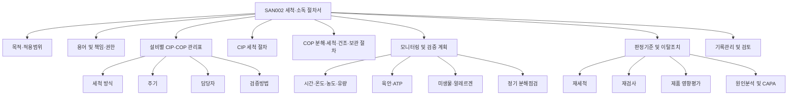

# [QA+ 블로그 생성 결과물] SAN002 CIP COP 비교
생성일시: 2026-09-06 08:21:23 (KST)
적용모델: gpt-5.6-terra

================================================================================
# 📋 최종 발행용 블로그 패키지

### 1. 메타 데이터 (SEO 설정)

- **최종 포스팅 제목**: CIP와 COP 차이 완벽 정리: 식품공장 세척·소독 관리와 SAN002 작성 실무
- **메타 디스크립션 (120자 내외 요약)**: 식품공장 CIP와 COP의 차이, 세척 조건 관리, ATP·미생물 검증, HACCP·FSSC 22000 관점과 SAN002 작성 핵심을 정리합니다.
- **추천 해시태그 (10개)**:  
  #식품품질관리 #식품안전 #HACCP #FSSC22000 #CIP #COP #세척소독관리 #SAN002 #SSOP #식품공장
- **카테고리**: 식품품질실무 / HACCP가이드 / FSSC22000

> **법령·기준서 검수 메모**
>
> - 「식품위생법」 제3조의 위생적 취급 원칙, 「식품위생법 시행규칙」 별표 14의 업종별 시설기준, 「식품 및 축산물 안전관리인증기준」의 선행요건관리 관점은 본문 취지와 부합합니다.
> - CIP·COP의 시간·온도·농도 기준은 법령상 단일 수치로 일률 지정되지 않으므로, 반드시 제품 특성·설비 구조·세제 제조사 사용기준·자사 밸리데이션 결과로 설정해야 합니다.
> - ISO/TS 22002-1:2009는 식품 제조 PRP의 세척·소독 관리 요구사항을 다루는 기준서입니다. 실제 인증 적용 시에는 발행 시점의 FSSC 22000 Scheme, 적용 PRP 규격 및 고객 요구사항의 최신본을 확인해야 합니다.
> - SAN002는 법령상 공통 문서번호가 아니라 회사 내부 문서체계의 절차서 번호일 수 있으므로, 자사 문서관리 규정에 맞춰 적용해야 합니다.

---

## 2. 네이버 블로그 / 티스토리 복사용 최종 원고

# CIP와 COP, 무엇이 다를까? 식품공장 세척·소독 관리와 SAN002 작성 실무 가이드

> **20년 실무 선배의 한 줄 요약**  
> CIP는 “설비 안에서 조건을 관리하며 씻는 방식”, COP는 “분해한 부품을 눈으로 확인하며 씻는 방식”입니다. 정답은 둘 중 하나를 고르는 것이 아니라, 설비별 사각지대를 찾아 **CIP + COP + 검증**으로 연결하는 것입니다.

---

## 1. CIP를 했는데도 왜 세척 불량이 생길까요?

“어제 CIP 정상으로 돌렸는데, 오늘 충전 노즐 ATP가 왜 높게 나왔지?”

이 상황은 음료, 소스, 유가공, 액상 조미식품처럼 배관과 탱크를 많이 사용하는 식품공장에서 자주 발생합니다. 자동 CIP 설비가 정상적으로 운전됐다는 사실과, 모든 식품 접촉면이 실제로 깨끗해졌다는 사실은 같지 않습니다. 심사에서도 바로 이 지점을 확인합니다.

CIP 기록지에 세척 시작·종료 시간만 기록되고 실제 리턴 온도, 세제 농도, 유량이 빠져 있다면 관리 근거가 약해집니다. 예를 들어 설정 화면에는 알칼리 세척 온도가 70℃로 표시되더라도, 가장 먼 배관 끝단이나 리턴 측 온도가 55℃라면 세척 조건이 충분히 전달됐다고 보기 어렵습니다.

설정값보다 중요한 것은 **실제 설비가 달성한 값**입니다.

또한 CIP 세척액이 충분히 닿지 않는 부위도 있습니다. 밸브 시트, O-ring, 가스켓, 충전 노즐, 필터 하우징, 샘플링 밸브, 호스 연결부는 구조에 따라 세척액 흐름이 부족하거나 제품 잔류물이 끼기 쉽습니다. 배관 본체가 깨끗해도 이런 부품 하나에서 미생물이나 제품 잔사가 검출되면 완제품 전체의 위생 리스크로 이어질 수 있습니다.

반대로 COP는 부품을 분해해 직접 세척하므로 사각지대를 확인하기 좋습니다. 다만 분해, 세척, 헹굼, 건조, 보관, 재조립 과정에서 작업자 편차와 재오염 위험이 생길 수 있습니다.

결국 CIP와 COP 모두 “방식” 자체보다 **관리 조건과 검증 체계**가 성패를 가릅니다.


여기서부터는 용어를 정확히 정리하겠습니다. 용어가 정리돼야 절차서도 흔들리지 않고, 생산팀과 품질팀의 대화도 빨라집니다.

---

## 2. CIP와 COP 차이, 한 번에 구분하기

**CIP(Cleaning In Place)**는 설비를 제자리에서 세척하는 방식입니다. 배관, 탱크, 열교환기, 액상 이송라인처럼 매번 분해하기 어려운 설비 내부에 세척액을 순환하거나 분사해 오염물을 제거합니다. 자동화가 가능하고 작업자 간 편차를 줄이기 좋다는 장점이 있습니다.

**COP(Cleaning Out of Place)**는 설비에서 부품을 떼어낸 뒤 별도의 세척 장소에서 세척하는 방식입니다. 충전 노즐, 밸브 부품, 가스켓, O-ring, 필터 하우징, 호스, 소형 기구 등이 대표 대상입니다. 오염을 직접 눈으로 확인할 수 있다는 점이 큰 강점입니다.

다만 CIP가 항상 더 위생적인 방식이라는 생각은 위험합니다. 유속이 부족하거나 데드레그(dead leg)가 있으면 세척액이 닿더라도 물리적 세척력이 부족할 수 있습니다. 반대로 COP도 사람이 직접 닦는다고 해서 무조건 불안정한 방식은 아닙니다. 사진 기준서, 부품 목록, 세척·건조 기준, 조립 확인 체계를 갖추면 매우 강력한 관리수단이 됩니다.

실무에서는 대개 두 방식을 함께 사용합니다. 탱크와 주배관은 CIP로 관리하고, 충전 노즐과 밸브 내부 부품은 정기적으로 COP 또는 분해점검하는 방식입니다.

| 구분 | CIP (Cleaning In Place) | COP (Cleaning Out of Place) |
|---|---|---|
| 세척 위치 | 설비 설치 상태에서 내부 세척 | 부품 분리 후 별도 세척구역에서 세척 |
| 대표 대상 | 탱크, 배관, 열교환기, 액상 이송라인 | 노즐, 밸브 부품, 가스켓, 필터, 호스 |
| 핵심 관리변수 | 시간, 온도, 농도, 유량·유속, 압력, 순서 | 분해, 침지, 브러싱, 헹굼, 건조, 보관, 재조립 |
| 강점 | 자동화, 반복성, 밀폐계 세척, 작업 안전성 | 사각부 직접 확인, 오염 부품 집중 세척 |
| 주요 위험 | 데드레그, 저유속, 농도·온도 미달, 밸브 내부 잔류 | 작업자 편차, 재오염, 부품 누락, 오조립 |
| 대표 검증 | CIP 데이터, ATP, 미생물·알레르겐 스와브, 분해점검 | 육안, ATP, 미생물·알레르겐 스와브, 조립 상태 확인 |

---

## 3. HACCP·FSSC 22000 관점에서 보는 세척·소독 관리

「식품위생법」 제3조는 식품 등을 위생적으로 취급해야 한다는 기본 원칙을 두고 있습니다. 법령에서 CIP나 COP라는 용어를 세척 방식으로 직접 지정하지는 않지만, 제조설비와 식품 접촉면을 위생적으로 관리해야 한다는 큰 방향의 근거가 됩니다.

핵심은 “어떤 방식으로 씻었는가”보다 **위생적으로 관리했고, 그 결과를 설명할 수 있는가**입니다.

「식품위생법 시행규칙」 별표 14의 업종별 시설기준은 제조시설·설비와 기구·용기를 위생적으로 관리할 수 있는 구조를 요구합니다. 세척이 어려운 구조, 물이 고이는 구조, 오염물이 축적되는 틈새, 세척 후 배수와 건조가 어려운 구조는 반복적인 위생 문제를 유발할 수 있습니다.

「식품 및 축산물 안전관리인증기준」의 HACCP 운영에서는 세척·소독 관리가 일반적으로 선행요건프로그램(PRP)에 포함됩니다. CCP가 마지막 방어선이라면, 세척·소독은 오염이 그 방어선까지 오지 않게 하는 기본 관리체계입니다.

또한 ISO/TS 22002-1:2009의 세척·소독 관련 요구사항과 FSSC 22000의 PRP 관리 관점에서는 세척·소독 프로그램의 대상, 방법, 책임, 빈도, 모니터링, 검증 및 이탈조치가 연결돼야 합니다.

> **심사 대응 핵심**
>
> “CIP를 실시합니다”라고만 쓰면 부족합니다.  
> **대상 설비 / 세척 조건 / 담당자 / 주기 / 확인 방법 / 검증 방법 / 이탈 시 조치**까지 연결돼야 실제 관리체계로 인정받기 쉽습니다.

---

## 4. CIP 세척 관리기준: 시간·온도·농도·기계적 작용을 함께 보세요

CIP 세척 성능은 일반적으로 다음 네 요소의 조합으로 관리합니다.

- 시간(Time)
- 온도(Temperature)
- 화학작용(Chemical action)
- 기계적 작용(Mechanical action)

네 조건 중 하나가 부족하면 나머지 조건이 좋아도 기대한 세척 효과가 나오지 않을 수 있습니다. 고온 알칼리 세척을 하더라도 유속이 낮아 배관 벽면의 잔사를 밀어내지 못하면 문제가 남습니다.

시간은 세척액이 오염물과 실제로 접촉하는 시간입니다. CIP 프로그램 총 운전시간과 각 구간의 유효 접촉시간은 다를 수 있으므로, 전세척·알칼리 세척·중간 헹굼·산 세척·최종 헹굼 등 단계별 시간과 목적을 구분해야 합니다.

온도는 설정 화면이 아니라 실제 도달 온도로 관리해야 합니다. 특히 리턴 측이나 최장 배관 말단처럼 세척이 어려운 지점에서 목표 온도가 확보되는지 확인해야 합니다.

세제 농도는 단순한 약품 투입량 기록만으로 관리하면 안 됩니다. 세제 공급업체의 사용기준과 자사 검증 결과에 따라 전도도, 적정, pH 등 적합한 방법으로 실제 농도를 확인해야 합니다.

| CIP 관리요소 | 현장에서 확인할 내용 | 흔한 실수 | 권장 관리 방식 |
|---|---|---|---|
| 시간 | 단계별 순환·접촉 시간, 시작·종료 시각 | 전체 프로그램 시간만 기록 | 전세척·알칼리·헹굼 등 단계별 기록 |
| 온도 | 공급·리턴 또는 최악지점 실제 온도 | 설정온도만 확인 | 측정 위치를 정하고 실제 달성값 확인 |
| 농도 | 전도도, 적정, pH 등 검증된 방법 | 약품 투입량만 기록 | 세제별 관리법과 허용범위 설정 |
| 유량·유속 | 펌프 성능, 압력, 순환 상태 | 펌프 ON만 확인 | 유량계·압력계 또는 검증된 대체지표 관리 |
| 세척 순서 | 전세척→알칼리→헹굼→산 세척 등 | 제품 특성 무시한 일률 운전 | 오염특성·설비재질·검증결과로 설정 |
| 최종 헹굼 | 세제 잔류 및 배수 상태 | 헹굼 후 장시간 방치 | 헹굼 확인, 배수, 생산 전 상태점검 |

---

## 5. CIP만으로 부족한 부위와 COP 절차의 핵심

CIP 설비라도 밸브 시트, 클램프 결합부, 가스켓, O-ring, 필터 교체부, 충전 노즐, 샘플링 포트는 별도 관리 대상으로 검토해야 합니다.

특히 점도가 높은 소스, 단백질·지방이 많은 유가공품, 색소가 강한 음료는 잔류 오염이 눈에 띄지 않게 남을 수 있습니다. “배관 CIP 완료”와 “분해 부품 청결 확인”은 별개로 관리하는 편이 안전합니다.

COP의 첫 단계는 **분해 자체를 표준화하는 것**입니다.

- 설비별 분해 대상 부품 목록
- 분해 순서
- 부품 사진
- 정상·불량 예시 사진
- 분해 전·후 부품 수량 확인
- 조립 후 확인자 서명

세척 단계에서는 세척조, 브러시, 전용 트레이도 관리 대상입니다. 세척 전 부품과 세척 완료 부품의 동선을 물리적으로 분리하고, 색상 구분 용기나 전용 랙을 사용하면 혼입과 재오염 위험을 줄일 수 있습니다.

COP에서 가장 놓치기 쉬운 단계는 세척 후 관리입니다. 최종 헹굼이 끝난 부품은 충분히 배수·건조한 뒤 덮개가 있는 청결 보관함이나 전용 용기에 보관해야 합니다. 재조립 직전에는 부품 손상, 이물, 누락, 조립 방향, 누수 가능성까지 확인해야 합니다.


---

## 6. 모니터링·검증·밸리데이션, 이 세 가지를 구분해야 합니다

세척 관리에서 가장 많이 혼동하는 용어가 모니터링, 검증(Verification), 밸리데이션(Validation)입니다.

### 모니터링

모니터링은 “계획한 세척 조건대로 작업했는가?”를 확인하는 활동입니다.

- CIP: 시간, 온도, 농도, 유량, 압력, 세척 순서 기록
- COP: 분해 여부, 세척액 농도, 침지 시간, 브러싱, 헹굼, 건조, 조립 확인

### 검증

검증은 “세척 결과가 실제로 유효한가?”를 확인하는 활동입니다.

- 육안검사
- ATP 측정
- 미생물 스와브 검사
- 알레르겐 스와브 검사
- 정기 분해점검

ATP는 유기물 잔류를 빠르게 확인하는 데 유용하지만, 특정 병원성 미생물의 부재를 직접 증명하는 시험은 아닙니다. 또한 알레르겐 교차접촉 관리가 필요한 경우 ATP만으로 충분하지 않을 수 있습니다.

### 밸리데이션

밸리데이션은 “우리가 정한 세척 조건 자체가 목적에 맞는가?”를 입증하는 활동입니다.

신설 설비 도입, 제품 변경, 세제 변경, 배관 개조, 반복적인 ATP·미생물 부적합 발생 시에는 밸리데이션 또는 재밸리데이션이 필요합니다.

| 구분 | 확인하려는 질문 | 대표 방법 | 실시 시점 | 부적합 시 조치 |
|---|---|---|---|---|
| 모니터링 | 세척 조건대로 했는가? | 온도·시간·농도·유량 기록, COP 체크리스트 | 매 세척 또는 정해진 주기 | 재세척, 설비 상태 확인, 기록 이탈 처리 |
| 검증 | 실제로 깨끗해졌는가? | 육안, ATP, 미생물, 알레르겐 검사, 분해점검 | 주기별·위해도별 | 재세척·재검사, 원인분석, 주기 조정 |
| 밸리데이션 | 설정한 절차가 적합한가? | 최악조건 시험, 반복 시험, 세척 전후 비교 | 최초 설정·변경·이상 발생 시 | 절차·조건 재설계 및 재입증 |

세척 검증은 숫자가 나왔다고 끝나면 안 됩니다. 사전에 판정기준, 재세척 기준, 재검사 기준, 생산 보류 여부, 원인분석 책임자를 정해 두어야 합니다.

---

## 7. 실제 현장 사례로 보는 CIP·COP 적용법

### 사례 1. 액상 소스 제조공장의 충전 노즐 ATP 반복 부적합

한 액상 소스 제조공장은 매일 생산 종료 후 탱크와 이송배관에 자동 CIP를 실시했습니다. CIP 기록상 알칼리 세척 시간, 온도, 세제 투입량은 기준 범위로 보였지만, 특정 충전기 노즐 2개에서만 ATP 수치가 반복적으로 높게 나왔습니다.

초기에는 노즐 외부 세척 미흡으로 판단해 표면 닦기 교육만 강화했습니다. 그러나 부적합이 반복돼 해당 노즐을 분해한 결과, 내부 실링 부위와 가스켓 홈에 점도 높은 소스 잔사가 남아 있었습니다.

근본 원인은 CIP 프로그램 자체가 아니라 “충전 노즐은 CIP만으로 충분하다”는 잘못된 관리 범위 설정이었습니다.

개선조치로 해당 노즐을 **매일 COP 대상**으로 전환하고, 가스켓 분리·브러싱·헹굼·건조·재조립 사진 확인을 절차서에 반영했습니다. 또한 노즐별 ATP 검증을 주 1회에서 초기 4주간 매일로 강화했습니다.

### 사례 2. 냉장 음료 공장의 CIP 온도 기록 정상, 미생물 검증 부적합

냉장 과채음료 공장은 야간에 배관과 혼합탱크를 CIP로 세척했습니다. 자동기록지에는 알칼리 세척 설정온도 70℃, 설정시간 20분이 정상으로 표시됐습니다.

그러나 주간 미생물 스와브 검사에서 배관 리턴 부근과 밸브 매니폴드 인접부의 결과가 연속으로 좋지 않게 나왔습니다. 조사 결과 온도센서가 공급 측에만 설치돼 있었고, 리턴 측 실제 온도는 목표값에 도달하지 못하고 있었습니다.

배관 연장 공사 후 배관 용적과 열손실이 바뀌었는데도 기존 CIP 프로그램을 그대로 사용한 것이 근본 원인이었습니다.

공장은 예열 단계와 알칼리 순환 시간을 조정하고, 리턴 온도 확인 기준을 추가했습니다. 밸브 매니폴드 분해점검도 월 1회에서 주 1회로 한시 강화했으며, 설비 개조 시 CIP 재밸리데이션을 실시하는 변경관리 절차를 만들었습니다.

### 사례 3. 냉동만두 제조공장의 COP 부품 재오염 문제

냉동만두 제조공장은 성형기와 충전기 일부 부품을 생산 종료 후 분해해 COP로 세척하고 있었습니다. 세척 자체는 성실하게 수행됐지만, 완제품 구역 환경검사에서 간헐적으로 미생물 수치가 상승했습니다.

현장 관찰 결과 세척 완료 부품과 미세척 부품이 같은 스테인리스 작업대 위에 놓여 있었고, 세척이 끝난 부품은 물기가 남은 상태로 개방된 선반에 보관되고 있었습니다.

문제는 세척력 부족이 아니라 세척 후 건조·보관·재조립 관리가 빠진 것이었습니다.

공장은 세척 전 부품, 세척 중 부품, 세척 완료 부품 구역을 색상별로 분리하고, 바닥 접촉 금지 전용 랙과 덮개형 청결 보관함을 설치했습니다. 부품별 완전 배수 여부, 외관 이상 유무, 보관함 투입 시간, 조립 확인자 서명을 포함한 체크리스트도 만들었습니다.

---

## 8. SAN002·SSOP 문서에 반드시 넣어야 할 항목

**SAN002는 법령이나 HACCP 고시에서 공통으로 사용하는 조항번호가 아닐 수 있습니다.** 많은 회사에서 세척·소독 SOP 또는 SSOP의 내부 문서번호로 사용합니다. 따라서 자사 문서체계에서 SAN002가 무엇을 의미하는지 먼저 확인해야 합니다.

문서에는 다음 항목이 포함돼야 합니다.

| 문서 항목 | 반드시 포함할 내용 | 실무 작성 팁 |
|---|---|---|
| 목적·범위 | 세척 대상, 구역, 설비, 기구, 재오염 방지 | “전체 설비” 대신 설비명·라인명 명시 |
| 용어 정의 | CIP, COP, 세척, 소독, 헹굼, 검증 | 현장 작업자가 이해할 수 있는 표현 병기 |
| 설비별 관리표 | 세척 방식, 주기, 담당자, 검증법 | CIP 범위와 COP 범위를 분리 작성 |
| CIP 절차 | 순서, 시간, 온도, 농도, 유량, 확인 방법 | 설정값과 실제 측정값 구분 |
| COP 절차 | 분해, 세척, 헹굼, 건조, 보관, 조립 | 사진 기준서·부품 수량표 첨부 |
| 검증 계획 | ATP, 미생물, 알레르겐, 분해점검 | 검체 위치·주기·판정기준 명시 |
| 이탈 조치 | 재세척, 재검사, 원인분석, 제품 영향평가 | “누가, 언제, 무엇을” 할지 구체화 |
| 기록 보존 | 기록명, 보존기간, 검토자 | 자사 HACCP 문서관리 기준과 연계 |

특히 설비별 구분표에는 다음처럼 구체적으로 작성하는 것이 좋습니다.

- 탱크 본체: CIP
- 이송배관: CIP
- 충전 노즐: CIP 후 매일 COP
- 밸브 내부: 주 1회 COP 또는 분해점검
- 필터 하우징: 교체·세척 주기별 COP
- 가스켓 및 O-ring: 분해점검 주기 및 교체기준 연계

이탈 기준도 “재세척한다”로 끝내면 부족합니다. 재세척 후 재검사 여부, 해당 설비 사용 보류, 생산품 영향평가, 원인분석, 시정조치 및 재발방지 확인까지 연결해야 합니다.

---

## 9. 자주 묻는 질문(FAQ)

### Q1. CIP와 COP 중 어떤 방식이 더 좋은가요?

**A.** 어느 하나가 무조건 더 좋다고 말할 수는 없습니다. 긴 배관, 밀폐형 탱크, 열교환기처럼 분해가 어렵고 반복 세척이 필요한 설비는 CIP가 유리합니다. 노즐·가스켓·밸브 내부처럼 직접 확인이 필요한 부품은 COP 또는 정기 분해점검이 유리합니다. 대부분의 식품공장은 두 방식을 조합하는 것이 현실적인 답입니다.

### Q2. CIP 온도·시간·세제 농도는 법에서 정해주나요?

**A.** 모든 식품공장에 공통 적용되는 단일 수치가 법령에 일률적으로 정해져 있다고 보면 안 됩니다. 제품의 지방·단백질·당·색소 특성, 설비 재질과 구조, 세제 제조사 사용기준, 자사 세척 밸리데이션 결과를 근거로 설정해야 합니다.

### Q3. ATP 검사만 하면 세척 검증이 충분한가요?

**A.** ATP는 유기물 잔류를 빠르게 확인하는 데 유용하지만, 특정 병원성 미생물의 부재를 직접 증명하지는 않습니다. 알레르겐 교차접촉 위험이 있는 공장에서는 ATP가 낮다고 해서 알레르겐까지 제거됐다고 단정하기 어렵습니다. 위해도에 따라 육안검사, ATP, 미생물 검사, 알레르겐 검사, 분해점검을 조합해야 합니다.

### Q4. CIP 설비도 매번 분해해야 하나요?

**A.** 모든 CIP 설비를 매일 전부 분해해야 한다고 일반화할 수는 없습니다. 다만 밸브, 가스켓, 노즐, 필터, 샘플링 포트처럼 사각지대가 생기기 쉬운 부위는 위해도와 검증 결과를 근거로 분해점검 주기를 정해야 합니다.

### Q5. COP 세척 후 부품은 바로 조립해도 되나요?

**A.** 가능한 경우도 있지만 핵심은 세척 후 재오염되지 않은 상태로 조립하는 것입니다. 최종 헹굼 후 물기가 과도하게 남아 있으면 미생물 증식과 외부 오염 가능성이 커질 수 있으므로, 자사 기준에 따라 충분히 배수·건조하고 청결하게 보관해야 합니다.

### Q6. 세척 후 잔류 세제나 소독제는 어떻게 관리하나요?

**A.** 세제와 소독제는 제조사 사용기준과 자사 절차에 따라 희석농도, 사용방법, 최종 헹굼 방법을 관리해야 합니다. 라벨 없는 용기 소분, 제조일·사용기한 미표시, 식품 원료와의 혼재 보관은 대표적인 위험요인입니다.

### Q7. 심사에서 세척 기록은 있는데 검증자료가 없다고 지적받았습니다. 무엇부터 보완해야 하나요?

**A.** 설비별 위해도에 따라 검증 대상과 주기를 정리하세요. 예를 들어 고위험 접촉면은 ATP와 미생물 스와브를 병행하고, 알레르겐 전환 공정은 별도 알레르겐 검증을 추가할 수 있습니다. 판정기준, 부적합 시 재세척·재검사·원인분석·기록 검토 흐름까지 문서화해야 합니다.

---

## 10. 현장에서 바로 쓰는 CIP·COP 단계별 체크리스트

| 점검 단계 | 점검 항목 | 확인 방법 | 기준 이탈 시 조치 |
|---|---|---|---|
| 생산 종료 전 | 제품 잔량·배관 잔류물 제거 | 배출 상태 확인, 전세척 준비 | 잔류물 과다 시 물리적 제거 후 세척 |
| CIP 전 | 밸브 라인업·배관 연결 상태 | 밸브 맵, 현장 육안 확인 | 오배관 수정 후 재확인 |
| CIP 중 | 시간·온도·농도·유량·압력 | 자동기록 또는 수기 기록 | 즉시 중단·원인 확인·재세척 |
| CIP 후 | 최종 헹굼·배수 상태 | 리턴 상태, 필요 시 pH·전도도 등 | 헹굼 연장 또는 절차 재검토 |
| COP 분해 | 부품 수량·손상 여부 | 부품 목록, 사진 기준서 | 누락·손상 부품 격리 및 교체 |
| COP 세척 | 세척조·브러시·침지·브러싱 | 작업자 체크리스트, 현장 확인 | 재세척, 세척도구 세척·교체 |
| COP 후 | 건조·청결 보관·구역 분리 | 전용 랙·덮개형 보관함 확인 | 재세척 또는 재건조 |
| 재조립 | 부품 누락·방향·누수 여부 | 조립 체크리스트, 시험운전 | 재조립, 설비팀 확인 |
| 검증 | ATP·미생물·알레르겐 검사 | 계획된 스와브 위치와 주기 | 재세척·재검사·원인분석 |
| 기록 검토 | 기록 누락·이탈·조치 완료 여부 | QA 검토 및 서명 | 기록 보완, 교육, CAPA 실시 |

심사 직전에는 기록을 보기 좋게 정리하는 데만 시간을 쓰지 마세요. 기록 한 장을 들고 현장으로 가서 다음을 확인하는 것이 더 효과적입니다.

- 이 값은 실제로 어디에서 측정되는가?
- 이 부품은 실제로 누가 분해하는가?
- 부적합이 발생했을 때 어제 어떤 조치를 했는가?
- 문서와 현장 작업은 같은가?
- 기록, 현장 상태, 검증 결과가 서로 연결되는가?

---

## 11. 맺음말: CIP와 COP의 정답은 ‘선택’이 아니라 ‘검증된 조합’입니다

오늘 내용은 세 줄로 정리할 수 있습니다.

1. **CIP는 시간·온도·농도·유량 등 실제 세척 조건을 관리해야 합니다.**
2. **COP는 분해세척뿐 아니라 헹굼·건조·보관·재조립까지 관리해야 합니다.**
3. **기록만 남기지 말고 ATP·미생물·알레르겐·분해점검 등 위해도에 맞는 검증으로 효과를 입증해야 합니다.**

CIP 설비를 갖췄다고 세척 문제가 자동으로 사라지지는 않습니다. 반대로 COP 작업이 많다고 해서 반드시 불안정한 것도 아닙니다.

설비 구조와 제품 특성을 이해하고, CIP가 닿는 곳과 닿지 않는 곳을 구분하고, 필요한 부품은 COP 또는 정기 분해점검으로 보완하면 됩니다. 이 흐름이 잡히면 SAN002는 심사 때만 꺼내는 서류가 아니라 실제 품질사고를 막는 현장 기준이 됩니다.

처음부터 완벽한 기준을 만들려고 하기보다, 가장 문제가 자주 나는 라인 하나, ATP가 자주 높게 나오는 노즐 하나, 세척 후 방치가 잦은 부품 하나부터 개선해 보세요. 그 한 곳의 CIP 조건과 COP 절차, 검증 결과를 연결해 보면 공장 전체 기준을 만드는 방향이 보입니다.

---

### CIP·COP 세척 관리 프로세스

```mermaid
flowchart LR
    A[설비·부품별 세척 대상 구분] --> B{세척 방식 결정}

    B -->|탱크·주배관·열교환기| C[CIP]
    B -->|노즐·밸브 부품·가스켓·필터| D[COP]

    C --> C1[전세척]
    C1 --> C2[알칼리 세척]
    C2 --> C3[중간 헹굼]
    C3 --> C4[산 세척 또는 필요 단계]
    C4 --> C5[최종 헹굼·배수]

    D --> D1[분해·부품 수량 확인]
    D1 --> D2[침지·브러싱 세척]
    D2 --> D3[헹굼]
    D3 --> D4[배수·건조]
    D4 --> D5[청결 보관·재조립 확인]

    C5 --> E[모니터링]
    D5 --> E

    E --> E1[시간·온도·농도·유량·압력 기록]
    E1 --> F[세척 효과 검증]
    F --> F1[육안검사·ATP·미생물·알레르겐·분해점검]

    F1 --> G{판정}
    G -->|적합| H[생산 및 기록 검토]
    G -->|부적합| I[설비 사용 보류·재세척·재검사]
    I --> J[원인분석·시정조치·재발방지]
    J --> K[필요 시 재밸리데이션]
```



### SAN002 세척·소독 절차서 구성



---

## 3. 워드프레스 / 웹사이트용 HTML 원고

```html
<article class="food-qa-post">
  <header>
    <h1>CIP와 COP, 무엇이 다를까? 식품공장 세척·소독 관리와 SAN002 작성 실무 가이드</h1>
    <p><strong>20년 실무 선배의 한 줄 요약:</strong> CIP는 설비 안에서 조건을 관리하며 씻는 방식이고, COP는 분해한 부품을 눈으로 확인하며 씻는 방식입니다. 핵심은 설비별 사각지대를 찾아 <strong>CIP + COP + 검증</strong>으로 연결하는 것입니다.</p>
  </header>

  <section>
    <h2>1. CIP를 했는데도 왜 세척 불량이 생길까요?</h2>
    <p>자동 CIP 설비가 정상적으로 운전됐다는 사실과 모든 식품 접촉면이 실제로 깨끗해졌다는 사실은 같지 않습니다. 설정값보다 중요한 것은 실제 설비가 달성한 온도, 농도, 유량, 접촉시간입니다.</p>
    <p>밸브 시트, O-ring, 가스켓, 충전 노즐, 필터 하우징, 샘플링 밸브, 호스 연결부 등은 CIP 세척액이 충분히 닿지 않거나 제품 잔류물이 끼기 쉬운 부위입니다.</p>
    
  </section>

  <section>
    <h2>2. CIP와 COP 차이, 한 번에 구분하기</h2>
    <p><strong>CIP(Cleaning In Place)</strong>는 설비를 분해하지 않고 제자리에서 내부를 순환 세척하거나 분사 세척하는 방식입니다.</p>
    <p><strong>COP(Cleaning Out of Place)</strong>는 노즐, 밸브 부품, 가스켓, O-ring, 필터 하우징 등을 분리해 별도 세척구역에서 세척하는 방식입니다.</p>

    <table>
      <thead>
        <tr>
          <th>구분</th>
          <th>CIP</th>
          <th>COP</th>
        </tr>
      </thead>
      <tbody>
        <tr><td>세척 위치</td><td>설비 설치 상태에서 내부 세척</td><td>부품 분리 후 별도 세척구역 세척</td></tr>
        <tr><td>대표 대상</td><td>탱크, 배관, 열교환기, 액상 이송라인</td><td>노즐, 밸브 부품, 가스켓, 필터, 호스</td></tr>
        <tr><td>핵심 관리변수</td><td>시간, 온도, 농도, 유량·유속, 압력, 순서</td><td>분해, 침지, 브러싱, 헹굼, 건조, 보관, 재조립</td></tr>
        <tr><td>주요 위험</td><td>데드레그, 저유속, 농도·온도 미달</td><td>작업자 편차, 재오염, 부품 누락, 오조립</td></tr>
      </tbody>
    </table>
  </section>

  <section>
    <h2>3. HACCP·FSSC 22000 관점에서 보는 세척·소독 관리</h2>
    <p>세척·소독 관리는 HACCP 선행요건프로그램(PRP)의 핵심입니다. 절차서에는 대상 설비, 세척 조건, 담당자, 주기, 확인 방법, 검증 방법, 이탈 시 조치를 연결해 작성해야 합니다.</p>
    <blockquote>
      <p><strong>심사 대응 핵심:</strong> “CIP를 실시합니다”라는 문장만으로는 부족합니다. 실제 조건, 기록, 검증 결과, 부적합 시 조치가 현장과 연결돼야 합니다.</p>
    </blockquote>
  </section>

  <section>
    <h2>4. CIP 세척 관리기준: 시간·온도·농도·기계적 작용</h2>
    <ul>
      <li><strong>시간:</strong> 단계별 유효 접촉시간을 관리합니다.</li>
      <li><strong>온도:</strong> 설정값이 아닌 리턴 측 또는 최악지점의 실제 온도를 확인합니다.</li>
      <li><strong>농도:</strong> 전도도, 적정, pH 등 검증된 방법으로 실제 농도를 확인합니다.</li>
      <li><strong>기계적 작용:</strong> 유량·유속·압력과 순환 상태를 관리합니다.</li>
    </ul>
  </section>

  <section>
    <h2>5. CIP만으로 부족한 부위와 COP 절차의 핵심</h2>
    <p>CIP 설비라도 밸브 시트, 클램프 결합부, 가스켓, O-ring, 필터 교체부, 충전 노즐, 샘플링 포트는 별도 관리 대상으로 검토해야 합니다.</p>
    <p>COP는 분해, 부품 수량 확인, 세척, 헹굼, 배수·건조, 청결 보관, 재조립 확인까지 표준화해야 합니다.</p>
    
  </section>

  <section>
    <h2>6. 모니터링·검증·밸리데이션 구분</h2>
    <table>
      <thead>
        <tr>
          <th>구분</th>
          <th>핵심 질문</th>
          <th>대표 방법</th>
        </tr>
      </thead>
      <tbody>
        <tr><td>모니터링</td><td>세척 조건대로 했는가?</td><td>시간·온도·농도·유량 기록, COP 체크리스트</td></tr>
        <tr><td>검증</td><td>실제로 깨끗해졌는가?</td><td>육안, ATP, 미생물, 알레르겐 검사, 분해점검</td></tr>
        <tr><td>밸리데이션</td><td>설정한 절차가 적합한가?</td><td>최악조건 시험, 반복 시험, 세척 전후 비교</td></tr>
      </tbody>
    </table>
    <p>ATP는 유기물 잔류 확인에 유용하지만 병원성 미생물 부재나 알레르겐 제거를 단독으로 증명하는 방법은 아닙니다.</p>
  </section>

  <section>
    <h2>7. 실제 현장 사례</h2>

    <h3>사례 1. 액상 소스 제조공장의 충전 노즐 ATP 반복 부적합</h3>
    <p>배관과 탱크의 CIP 기록은 정상이었지만 특정 충전 노즐에서 ATP 부적합이 반복됐습니다. 노즐을 분해한 결과 가스켓 홈과 실링 부위에 소스 잔류물이 남아 있었고, 해당 노즐은 매일 COP 관리 대상으로 전환됐습니다.</p>

    <h3>사례 2. 냉장 음료 공장의 CIP 온도 기록 정상, 미생물 검증 부적합</h3>
    <p>공급 측 설정온도는 정상이었지만 리턴 측 실제 온도가 충분히 도달하지 못했습니다. 배관 연장 후 열손실이 바뀌었는데 기존 프로그램을 사용한 것이 원인이었으며, 예열 단계와 순환시간 조정 및 리턴 온도 기준 추가로 개선했습니다.</p>

    <h3>사례 3. 냉동만두 제조공장의 COP 부품 재오염 문제</h3>
    <p>세척 완료 부품과 미세척 부품이 같은 작업대에 놓이고, 젖은 부품이 개방 선반에 보관되면서 재오염이 발생했습니다. 색상별 구역 분리, 전용 랙, 덮개형 보관함, 조립 체크리스트로 개선했습니다.</p>
  </section>

  <section>
    <h2>8. SAN002·SSOP 문서에 반드시 넣어야 할 항목</h2>
    <ul>
      <li>목적 및 적용범위</li>
      <li>용어 정의</li>
      <li>책임과 권한</li>
      <li>설비별 CIP·COP 관리표</li>
      <li>CIP 세척 절차와 실제 측정값 관리</li>
      <li>COP 분해·세척·헹굼·건조·보관·재조립 절차</li>
      <li>ATP·미생물·알레르겐·분해점검 검증계획</li>
      <li>판정기준, 이탈조치, 제품 영향평가, CAPA</li>
      <li>기록보존 및 검토 기준</li>
    </ul>
  </section>

  <section>
    <h2>9. 자주 묻는 질문</h2>

    <h3>Q1. CIP와 COP 중 어떤 방식이 더 좋은가요?</h3>
    <p>설비 구조와 위해도에 따라 다릅니다. 대부분의 공장은 CIP와 COP를 조합해 운영하는 것이 현실적입니다.</p>

    <h3>Q2. CIP 온도·시간·세제 농도는 법에서 정해주나요?</h3>
    <p>모든 공장에 적용되는 단일 수치가 일률적으로 정해진 것은 아닙니다. 제품 특성, 설비 구조, 세제 제조사 기준, 자사 밸리데이션 결과를 근거로 설정해야 합니다.</p>

    <h3>Q3. ATP 검사만 하면 충분한가요?</h3>
    <p>ATP는 유기물 잔류 확인에 유용하지만, 미생물과 알레르겐 위험을 단독으로 증명하지는 못합니다.</p>

    <h3>Q4. CIP 설비도 매번 분해해야 하나요?</h3>
    <p>모든 설비를 매일 분해할 필요는 없지만, 밸브·노즐·가스켓·필터 등 사각지대 부위는 위해도와 검증 결과를 근거로 분해점검 주기를 정해야 합니다.</p>
  </section>

  <section>
    <h2>10. 현장 점검 체크리스트</h2>
    <ol>
      <li>생산 종료 후 제품 잔량과 배관 잔류물을 제거한다.</li>
      <li>CIP 전 밸브 라인업과 배관 연결 상태를 확인한다.</li>
      <li>CIP 중 시간·온도·농도·유량·압력을 기록한다.</li>
      <li>CIP 후 최종 헹굼과 배수 상태를 확인한다.</li>
      <li>COP 부품은 수량·손상·분해 상태를 확인한다.</li>
      <li>세척 전·후 부품 구역과 세척도구를 분리한다.</li>
      <li>건조 및 청결 보관 상태를 확인한다.</li>
      <li>재조립 시 부품 누락, 방향, 누수 가능성을 확인한다.</li>
      <li>ATP·미생물·알레르겐 검증 결과를 검토한다.</li>
      <li>기록 누락과 이탈조치 완료 여부를 QA가 확인한다.</li>
    </ol>
  </section>

  <section>
    <h2>11. 맺음말: CIP와 COP의 정답은 ‘선택’이 아니라 ‘검증된 조합’입니다</h2>
    <p><strong>CIP는 실제 세척 조건을 관리해야 하고, COP는 분해 후 건조·보관·재조립까지 관리해야 합니다.</strong> 여기에 ATP, 미생물, 알레르겐, 분해점검 등 위해도 기반 검증이 더해져야 세척·소독 관리체계가 완성됩니다.</p>
    <p>SAN002를 심사용 문서에 그치게 하지 말고, 실제 품질사고를 예방하는 현장 기준으로 운영해 보세요.</p>
  </section>
</article>
```
================================================================================

[부록: 1단계 리서치 원본]
# [리서치 리포트] SAN002 CIP·COP 비교

> **사전 확인 사항**: `SAN002`는 식품위생법, 식품공전, HACCP 고시 또는 FSSC 22000에서 공통으로 사용하는 법령·표준 조항번호는 아닙니다. 일반적으로는 기업 내부의 **세척·소독(Sanitation) SOP/SSOP 문서번호** 또는 교육과정 코드로 사용될 가능성이 높습니다.  
> 따라서 블로그 글에서는 “SAN002” 자체를 법적 기준으로 설명하기보다, 해당 문서의 핵심 주제일 가능성이 높은 **CIP(Cleaning In Place)와 COP(Cleaning Out of Place)의 차이, 관리 기준, 검증 방법**을 중심으로 다루고, 최종 적용 시에는 자사 SAN002 문서의 정의·대상 설비·주기와 대조하도록 안내하는 구성이 안전합니다.

---

### 1. 타겟 독자 및 검색 의도

- **주요 타겟**
  - 식품공장 품질관리(QC)·품질보증(QA) 신입 및 경력 실무자
  - HACCP 선행요건관리(영업장 관리) 담당자
  - 음료, 유가공, 소스, 액상 조미식품, 식용유 등 배관·탱크 설비를 운영하는 생산팀 관리자
  - HACCP 또는 FSSC 22000 심사 준비 중인 공장장·품질팀장
  - 사내 위생관리 절차서(SAN002 등)를 제·개정해야 하는 문서관리 담당자

- **독자의 핵심 고통(Pain Point)**
  - “CIP와 COP의 차이는 배관을 분해하느냐의 문제인가, 아니면 세척 검증 방식까지 달라지는가?”
  - “탱크와 배관은 CIP를 했는데 밸브, 가스켓, 필터, 노즐까지 정말 깨끗하다고 어떻게 입증하지?”
  - “CIP 세척 시간·온도·농도·유속 중 무엇을 한계 또는 관리기준으로 잡아야 하지?”
  - “COP 대상 부품을 작업자가 세척했을 때, 세척 완료 여부와 재조립 전 위생 상태를 어떻게 관리해야 하지?”
  - “심사에서 세척·소독 기록은 있는데, 세척효과 검증 자료가 없다는 지적을 받았다.”
  - “CIP와 COP를 혼용하는 설비의 세척 밸리데이션을 어떻게 설계해야 하나?”

- **메인 키워드**
  - **CIP COP 차이**

- **서브/연관 키워드**
  - CIP 세척 관리기준
  - COP 세척 절차
  - 식품공장 세척 밸리데이션
  - HACCP 세척 소독 관리
  - ATP 측정 세척 검증
  - CIP 세척 4대 요소
  - 배관 세척 검증
  - SSOP 세척·소독 절차서

- **예상 검색 의도(Search Intent)**
  1. **정보 탐색형**: CIP와 COP의 정의·차이·적용 설비를 빠르게 이해하려는 검색
  2. **실무 해결형**: CIP 조건 설정, COP 세척 기록, 검증 방법, 이상 발생 시 조치 기준을 찾는 검색
  3. **심사 대비형**: HACCP/FSSC 심사에서 요구하는 세척·소독 관리 및 증빙자료를 준비하려는 검색
  4. **문서 작성형**: 사내 SAN002, SSOP, 세척·소독 관리기준서에 포함해야 할 내용을 찾는 검색

---

### 2. 필수 인용 법령 및 표준 기준

## 2-1. 법적·표준 근거

- **「식품위생법」 제3조(식품 등의 취급)**
  - 식품 등을 취급하는 과정에서 위생적으로 관리해야 한다는 기본 원칙의 근거입니다.
  - CIP·COP라는 용어 자체를 직접 규정하지는 않지만, 설비·기구의 세척 및 위생관리 체계가 식품 위생관리의 핵심이라는 법적 기반으로 활용할 수 있습니다.

- **「식품위생법 시행규칙」 별표 14 업종별 시설기준**
  - 식품 제조·가공 시설은 작업장, 제조시설·설비, 기구·용기 등을 위생적으로 관리할 수 있는 구조와 설비를 갖춰야 합니다.
  - 세척이 불가능한 구조, 오염물 축적 가능 구조, 세척 후 배수·건조 관리가 어려운 구조는 현장 위생관리 문제 및 심사 지적의 출발점이 될 수 있습니다.
  - 적용 업종별 세부 시설기준은 반드시 최신 법령본 및 업종을 확인해야 합니다.

- **「식품 및 축산물 안전관리인증기준」**
  - HACCP 적용업소는 위해요소분석과 중요관리점 관리뿐 아니라, **선행요건관리**를 운영해야 합니다.
  - 선행요건관리에는 영업장 관리, 위생관리, 세척·소독 관리, 제조시설·설비 관리, 용수관리, 보관·운송관리 등 식품안전을 뒷받침하는 관리체계가 포함됩니다.
  - CIP와 COP는 대체로 중요관리점(CCP) 자체라기보다 **세척·소독 및 제조시설·설비 관리 선행요건프로그램(PRP)**의 핵심 실행수단으로 설계됩니다.
  - 단, 알레르겐 교차접촉 또는 특정 미생물 위해 저감을 위해 공정별로 더 엄격한 관리가 필요할 경우에는 HACCP 계획과 연계해 별도 관리 기준을 설정할 수 있습니다.

- **식품의약품안전처 「식품안전관리인증기준(HACCP) 해설서」 및 선행요건관리 관련 해설자료**
  - 세척·소독 대상, 방법, 주기, 책임자, 사용 세제·소독제, 농도, 확인 방법, 기록 및 이탈 시 조치 등을 문서화하고 운영하는 방향의 실무 근거로 활용할 수 있습니다.
  - 블로그 발행 전 최신 해설서의 명칭·판본·세부 항목을 확인하여 링크 또는 각주를 삽입하는 것이 좋습니다.

- **ISO/TS 22002-1:2009, Prerequisite programmes on food safety — Part 1: Food manufacturing**
  - 식품제조 PRP의 대표적 국제 기준입니다.
  - **Clause 11, Cleaning and sanitizing**은 세척·소독 프로그램이 위험 수준에 적합하게 수립되어야 하며, 대상 구역·설비, 책임, 방법, 빈도, 모니터링·검증 요구사항 등을 다룹니다.
  - CIP/COP 방식이 국제표준에서 의무적으로 지정되는 것은 아니나, 선택한 방식이 설비와 제품 위해도에 적합하고 검증 가능해야 한다는 관점에서 활용할 수 있습니다.

- **FSSC 22000 Scheme Version 6**
  - 식품제조 부문에서는 ISO 22000과 해당 PRP 기술규격(대표적으로 ISO/TS 22002-1)을 기반으로 식품안전경영시스템을 운영합니다.
  - 세척·소독은 PRP 운영의 일부이며, 심사에서는 “절차서 존재”뿐 아니라 **현장 실행, 기록의 일관성, 검증 결과, 부적합 시 시정조치**의 연결성을 확인할 가능성이 높습니다.
  - FSSC 22000의 적용 범위 및 세부 요구사항은 인증 카테고리, 적용 PRP 규격, 계약 인증기관의 해석에 따라 확인이 필요합니다.

## 2-2. CIP·COP의 공식적·실무적 정의

| 구분 | CIP (Cleaning In Place) | COP (Cleaning Out of Place) |
|---|---|---|
| 기본 의미 | 설비를 분해하지 않거나 최소 분해한 상태에서, 내부에 세척액을 순환·분사하여 세척하는 방식 | 부품 또는 기구를 설비에서 분리한 뒤, 별도 세척 구역·세척조에서 세척하는 방식 |
| 대표 적용 대상 | 탱크, 배관, 열교환기, 충전라인, 액상 원료 이송라인, 밸브 매니폴드 | 가스켓, 밸브 부품, 필터 하우징 부품, 충전 노즐, 호스, 소형 기구, 분해 가능한 부품 |
| 주요 관리변수 | 세척액 농도, 온도, 순환 시간, 유량·유속, 압력, 세척 순서, 최종 헹굼 상태 | 세척액 농도·온도, 침지 시간, 브러싱 등 물리적 마찰, 세척조 청결, 헹굼, 건조, 보관 및 재조립 |
| 강점 | 작업자 편차 감소, 밀폐계 세척 가능, 대형·복잡 배관에 유리, 작업 안전성 향상 가능 | 사각지대와 분해 부품을 직접 육안 확인 가능, 오염이 심한 부품에 유리 |
| 주요 위험 | 데드레그, 낮은 유속, 불완전한 난류 형성, 세척액 농도·온도 저하, 밸브 시트·가스켓 미세 오염 | 분해·조립 과정의 교차오염, 세척 후 방치, 불완전 건조, 부품 누락·오조립, 작업자별 편차 |
| 핵심 검증 | CIP 리턴액, 전도도·pH·온도·시간·유량 기록, ATP/미생물/알레르겐 검사, 분해점검 | 육안검사, ATP/미생물/알레르겐 검사, 세척조 관리, 건조·보관 상태, 조립 후 확인 |

> **핵심 메시지**: CIP는 “자동 세척이므로 항상 더 위생적”이라는 뜻이 아니고, COP는 “사람이 닦으므로 무조건 불안정하다”는 뜻도 아닙니다. 두 방식 모두 제품 특성, 설비 구조, 오염 유형, 세척제, 검증 결과에 따라 적합성을 입증해야 합니다.

## 2-3. 현장 실무 팩트: 반드시 다뤄야 할 관리 포인트

### ① CIP의 세척 성능은 단순히 “시간”만으로 결정되지 않는다

CIP는 일반적으로 다음 요소의 조합으로 관리합니다.

- **시간(Time)**: 세척액 접촉 시간, 순환 시간, 헹굼 시간
- **온도(Temperature)**: 세척액 및 헹굼수의 실제 도달 온도
- **화학작용(Chemical action)**: 알칼리·산성 세제·살균제의 종류 및 농도
- **기계적 작용(Mechanical action)**: 유량, 유속, 난류, 분사 압력 등

현장에서는 흔히 이를 세척의 주요 작용 요소로 설명합니다. 다만 특정 온도·시간·농도 수치를 모든 공장에 일률 적용해서는 안 됩니다. 제품의 지방·단백질·당·무기질 오염 특성, 설비 재질, 세제 제조사 사용기준, 공정 조건, 검증 결과에 따라 개별적으로 설정해야 합니다.

### ② CIP 관리기준은 “설정값”이 아니라 “실제 달성값”으로 확인해야 한다

- 프로그램에 70℃가 설정되어 있어도, 가장 세척이 어려운 지점 또는 리턴(return) 측에서 실제로 해당 온도가 확보되지 않으면 세척 효과를 보장하기 어렵습니다.
- 세제 농도는 약품 투입량만으로 판단하지 말고, 공장 관리방식에 따라 **전도도, 적정, pH 등 검증된 방법**으로 관리할 수 있습니다.
- 순환펌프 운전 여부만 기록하는 방식보다, 실제 유량·압력·시간·온도·농도 등 공정별 핵심 변수를 자동 또는 수기 기록으로 남기는 체계가 필요합니다.
- CIP 리턴액의 탁도, 색, pH, 전도도 등은 보조적 확인 정보가 될 수 있으나, 이것만으로 표면의 미생물학적 청결을 단정해서는 안 됩니다.

### ③ CIP만으로 커버되지 않는 부위는 COP 또는 분해점검 계획이 필요하다

다음 부위는 CIP 적용 설비라도 별도 분해점검 또는 COP 관리 대상으로 검토할 필요가 있습니다.

- 가스켓, O-ring, 클램프 결합부
- 밸브 시트 및 밸브 내부
- 충전 노즐, 충전기 접액부
- 필터 하우징 및 필터 교체부
- 샘플링 밸브
- 호스, 데드레그 우려 구간
- 탱크 맨홀, 교반기 축 주변, 스프레이볼 세척 사각부

여기서 중요한 것은 “모든 부품을 매일 분해한다”가 아니라, **위해도와 설비 구조에 따라 분해주기·점검주기·검증 방법을 문서화하고 근거를 확보하는 것**입니다.

### ④ COP는 세척 작업보다 ‘세척 후 관리’에서 자주 실패한다

COP에서는 세척 완료 후 다음 단계가 특히 중요합니다.

- 세척 완료 부품과 미세척 부품의 물리적 구분
- 세척조·브러시·세척도구 자체의 위생관리
- 최종 헹굼 후 잔류 세제·소독제 관리
- 건조 전 재오염 방지
- 청결한 전용 용기 또는 덮개를 이용한 보관
- 재조립 전 외관·부품 누락·손상 확인
- 조립 후 누수, 이물, 위생 상태 확인

### ⑤ 세척 검증은 최소한 세 단계로 설계한다

| 구분 | 목적 | 예시 |
|---|---|---|
| 모니터링 | 매 작업 또는 정해진 주기에 세척 조건이 계획대로 수행됐는지 확인 | CIP 온도·시간·농도·유량 기록, COP 작업자 체크리스트 |
| 검증(Verification) | 세척 결과가 실제로 유효한지 정기적으로 확인 | 육안검사, ATP 측정, 미생물 검사, 알레르겐 스와브 검사 |
| 밸리데이션(Validation) | 설정한 세척 절차·조건 자체가 목적에 적합한지 입증 | 최악조건 선정, 반복 시험, 세척 전후 비교, 공정·제품 변경 시 재평가 |

> **실무상 주의**: ATP는 유기물 오염의 신속 확인 도구로 유용하지만, 특정 병원성 미생물의 부재를 직접 증명하는 시험은 아닙니다. 또한 알레르겐 관리가 필요한 공장에서는 ATP 결과만으로 알레르겐 교차접촉 위험이 제거되었다고 판단하기 어렵습니다. 필요 시 해당 알레르겐에 적합한 별도 검증법을 검토해야 합니다.

---

### 3. 추천 블로그 목차 (Outline)

## H1 (제목 후보 3개)

1. **CIP와 COP, 무엇이 다를까? 식품공장 세척·소독 관리의 핵심 비교**
2. **CIP만 믿었다가 심사에서 지적받는 이유: COP와 세척 검증까지 한 번에 정리**
3. **식품공장 SAN002 작성 가이드: CIP·COP 차이와 세척 밸리데이션 실무**

---

## H2 서론 (Intro): “CIP를 했는데도 왜 세척 불량이 생길까?”

### 도입 문제 제기
- 액상 제품 공장에서는 “CIP를 돌렸으니 설비는 깨끗하다”고 생각하기 쉽습니다.
- 그러나 실제 현장에서는 탱크는 세척됐지만 충전 노즐, 밸브 시트, 가스켓, 필터 하우징 등에서 오염이 발견되거나, CIP 조건 기록은 있어도 세척효과를 입증하지 못하는 문제가 발생합니다.
- 반대로 COP는 분해세척이 가능하다는 장점이 있지만, 작업자 편차와 재조립·보관 과정의 재오염 위험이 큽니다.

### 핵심 결론 먼저 제시
- **CIP는 설비 내부를 제자리에서 세척하는 방식, COP는 분해한 부품을 별도 장소에서 세척하는 방식**입니다.
- 어느 하나가 절대적으로 우수한 것이 아니라, 설비 구조와 오염 위험에 맞춰 **CIP와 COP를 조합**해야 합니다.
- HACCP/FSSC 심사에서 중요한 것은 “CIP 또는 COP를 한다”는 선언이 아니라, **세척 조건이 관리되고, 실제 세척효과가 검증되며, 이탈 시 조치가 이루어지는지**입니다.

### SAN002 문서와의 연결 문구
- 사내 문서번호가 SAN002라면, 문서에는 최소한 대상 설비, 세척 방식(CIP/COP), 세척 조건, 담당자, 주기, 확인 방법, 검증 방법, 이상 시 조치를 명확히 넣어야 합니다.
- 단, SAN002라는 문서번호의 의미와 적용 범위는 회사마다 다르므로 자사 문서체계에 따라 확인해야 합니다.

---

## H2 본론 1: CIP와 COP의 정의 및 법적·공식 관리 관점

### H3. CIP와 COP, 한 문장으로 구분하기
- **CIP(Cleaning In Place)**: 배관·탱크·충전라인 등을 분해하지 않거나 최소 분해한 상태에서 세척액을 순환 또는 분사하여 세척하는 방식
- **COP(Cleaning Out of Place)**: 밸브·가스켓·노즐·필터 등 분리 가능한 부품을 떼어 별도 세척조 또는 세척구역에서 세척하는 방식

### H3. 비교표: CIP와 COP의 차이

| 항목 | CIP | COP |
|---|---|---|
| 세척 위치 | 설비 내부, 설치 상태 | 분리 후 별도 세척구역 |
| 주 대상 | 배관, 탱크, 열교환기, 액상라인 | 노즐, 밸브 부품, 가스켓, 필터, 호스 |
| 핵심 관리 | 온도·시간·농도·유량·압력 | 분해·침지·브러싱·헹굼·건조·보관 |
| 장점 | 자동화, 작업 효율, 밀폐계 세척 | 사각지대 직접 확인, 오염 부품 집중 세척 |
| 주요 리스크 | 데드레그, 유속 부족, 세척액 미도달 | 작업자 편차, 재오염, 부품 누락·오조립 |
| 대표 검증 | CIP 데이터 + 표면 스와브 검사 | 육안 + ATP/스와브 + 보관·조립 상태 확인 |

### H3. HACCP와 FSSC 22000에서 보는 세척·소독
- CIP·COP는 일반적으로 선행요건관리(PRP)의 세척·소독 프로그램에서 관리합니다.
- 관리절차에는 다음 내용이 포함되어야 합니다.
  - 세척 대상 설비·기구
  - CIP 또는 COP 적용 구분
  - 세척 및 소독 방법
  - 세제·소독제의 종류와 사용 방법
  - 세척 주기와 실시 시점
  - 책임자와 확인자
  - 모니터링 기록
  - 검증 방법과 주기
  - 이상 발생 시 재세척, 생산 보류, 원인 분석 등 조치 기준

### H3. “CIP를 하면 COP는 필요 없다”는 오해
- CIP 설비에도 분해점검 또는 COP 대상 부품이 존재할 수 있습니다.
- 특히 밸브, 가스켓, 충전 노즐, 필터, 샘플링 포트 등은 CIP 효율을 별도로 확인해야 합니다.
- 따라서 문서상 설비별로 “CIP 대상”이라고만 적지 말고, **CIP 적용 범위와 COP/분해점검 범위**를 구체적으로 구분해야 합니다.

---

## H2 본론 2: 20년 선배의 현장 실전 팁 & 트러블슈팅 가이드

### H3. CIP 조건 설정은 ‘표준값 복사’가 아니라 ‘설비별 검증’이다
- 다른 공장의 세척 온도·시간·농도를 그대로 가져오면 안 되는 이유 설명
  - 제품 특성 차이: 지방, 단백질, 당, 점도, 색소, 무기질
  - 설비 차이: 배관 길이, 관경, 밸브 구조, 열교환기, 데드레그
  - 세제 차이: 세제 성분 및 제조사 권장 조건
- 자사 조건 설정 시 확인할 항목
  - 전세척 여부
  - 알칼리 세척 조건
  - 산 세척 필요성 및 주기
  - 중간 헹굼·최종 헹굼 조건
  - 소독 단계의 적용 여부 및 방법
  - 생산 시작 전 배수 상태와 잔류수 관리

### H3. CIP에서 자주 발생하는 문제와 조치

| 현상 | 우선 확인할 원인 | 실무 조치 방향 |
|---|---|---|
| ATP 수치가 반복적으로 높음 | 세척액 농도 저하, 온도 미달, 순환 불량, 사각지대 | CIP 데이터 확인 → 의심 지점 분해점검 → 조건 재설정 및 재검증 |
| 특정 충전 노즐만 오염 | 노즐 구조, 분사 불량, 분해세척 주기 부족 | 해당 노즐 COP 전환 또는 분해주기 강화, 조립상태 확인 |
| 세척 후 잔류 냄새·색 발생 | 불충분한 헹굼, 제품 잔류, 세제 잔류 | 헹굼 단계 검토, 리턴 상태 확인, 필요 시 세척 순서 재설계 |
| 배관은 깨끗하나 밸브에서 문제 발생 | 밸브 시트·가스켓·씰 부위 미세척 | 밸브 분해점검 계획 수립, COP 대상 지정 |
| CIP 기록은 정상인데 검사 부적합 | 기록값과 실제 세척성의 불일치, 측정기 교정 문제 | 온도·전도도·유량계 점검, 측정 위치 검토, 밸리데이션 재수행 |

### H3. COP에서 자주 발생하는 문제와 조치

| 현상 | 우선 확인할 원인 | 실무 조치 방향 |
|---|---|---|
| 세척 완료 부품에서 이물 발견 | 세척조 오염, 브러시 노후, 헹굼 부족 | 세척도구 관리기준 수립, 세척조 교체·세척 주기 강화 |
| 세척 후 부품에서 미생물 검출 | 건조 불량, 젖은 상태 보관, 재오염 | 완전 배수·건조 기준 설정, 청결 보관함·덮개 사용 |
| 부품 누락·오조립 발생 | 분해·조립 체크리스트 부재 | 설비별 부품 목록 및 사진 기준서, 조립 후 확인 단계 운영 |
| 작업자마다 세척 품질 차이 | 작업 방법 표준화 부족 | 사진·동영상 기반 작업표준, 교육 및 작업자별 확인 강화 |
| 세척부품이 바닥·작업대에 접촉 | 청결구역 미설정 | 세척 전·후 구역 분리, 전용 랙·트레이 사용 |

### H3. 심사관이 자주 보는 세척·소독 관리 포인트
- 세척·소독 절차서와 실제 현장 작업 방식이 일치하는가?
- CIP 기록에 시간·온도·농도 등 핵심 관리값이 누락되지 않았는가?
- 세제·소독제의 보관, 희석, 표시, 유효기간 관리가 되는가?
- CIP가 닿지 않는 부위의 분해점검 또는 COP 관리계획이 있는가?
- 세척 후 설비를 장시간 방치할 때 재오염 방지 기준이 있는가?
- ATP, 미생물, 알레르겐 등 검증 결과에 대한 판정기준과 부적합 조치가 있는가?
- 세척 불량 발생 시 재세척만 하고 끝내지 않고, 원인 분석 및 재발방지까지 했는가?
- 온도계, 전도도계, 유량계 등 CIP 관리에 쓰는 측정장비의 점검·교정 이력이 있는가?

### H3. SAN002/SSOP에 넣기 좋은 문서 구성 예시
1. 목적  
2. 적용 범위  
3. 용어 정의: CIP, COP, 세척, 소독, 헹굼, 검증  
4. 책임과 권한  
5. 설비별 세척 방식 구분표  
6. CIP 표준작업 절차  
7. COP 표준작업 절차  
8. 세제·소독제 관리기준  
9. 세척 후 조립·보관 기준  
10. 모니터링 항목 및 기록 양식  
11. 검증 계획: ATP, 미생물, 알레르겐, 분해점검 등  
12. 부적합 및 이탈 시 조치  
13. 교육 및 기록 보존 기준  

---

## H2 본론 3: 자주 묻는 질문(FAQ) 및 심사관 단골 지적 사항

### FAQ 1. CIP와 COP 중 어떤 방식이 더 좋은가요?
- 정답은 “설비와 위해도에 따라 다르다”입니다.
- 긴 배관, 밀폐형 탱크, 열교환기처럼 분해가 어렵고 반복 세척이 필요한 설비는 CIP가 적합할 수 있습니다.
- 가스켓, 밸브 내부, 노즐, 필터 등 분해 후 상태 확인이 필요한 부품은 COP 또는 정기 분해점검이 적합할 수 있습니다.
- 현장에서는 대개 둘 중 하나를 선택하기보다 **CIP + COP + 정기 분해점검**을 조합합니다.

### FAQ 2. CIP 온도·시간·세제 농도는 법에서 정해주나요?
- 모든 식품공장에 공통 적용되는 단일 수치가 법령에 정해져 있는 것은 아닙니다.
- 세제 제조사의 사용기준, 설비 재질, 제품 오염 특성, 공정 조건, 자사 검증 결과를 근거로 설정해야 합니다.
- 중요한 것은 기준값을 정한 뒤 실제로 그 조건이 달성되는지 기록하고, 세척 효과를 검증하는 것입니다.

### FAQ 3. ATP 검사만 하면 세척 검증이 충분한가요?
- ATP는 빠른 현장 확인 수단으로 유용하지만, 미생물 또는 알레르겐 위험을 단독으로 완전히 대변하지는 않습니다.
- 위해도에 따라 육안검사, ATP, 미생물 검사, 알레르겐 스와브 검사, 분해점검 등을 조합하는 방식이 바람직합니다.

### FAQ 4. CIP 설비도 매번 분해해야 하나요?
- 매번 모든 설비를 분해해야 한다고 일반화할 수는 없습니다.
- 다만 CIP로 세척 효과가 충분히 확보되는지 밸리데이션하고, 세척 사각 가능 부위는 위해도에 따라 정기 분해점검 주기를 설정해야 합니다.
- 설비 변경, 제품 변경, 세척 불량, 미생물 부적합 등 이상 징후가 있으면 분해점검과 재검증이 필요할 수 있습니다.

### FAQ 5. 세척 후 잔류 세제는 어떻게 관리해야 하나요?
- 세제·소독제의 종류와 사용 방법은 제조사 기준 및 자사 절차에 따라 관리해야 합니다.
- 최종 헹굼 단계, 헹굼수 상태 확인, 필요 시 적절한 잔류 확인 방법을 설정해야 하며, 식품 접촉면에 세제·소독제가 부적절하게 잔류하지 않도록 해야 합니다.
- 세제의 무단 희석, 라벨 없는 용기 사용, 식품 원료와 혼재 보관은 대표적인 현장 위험요인입니다.

### 심사관 단골 지적 사항 체크리스트
- [ ] 절차서에는 CIP라고 되어 있지만, 실제 현장에서는 일부 부품을 수작업으로 세척하고 있다.
- [ ] CIP 기록에 시작·종료 시간만 있고 온도·농도·유량 등 핵심 조건이 없다.
- [ ] CIP 자동기록의 이상 알람 또는 이탈 발생 시 조치 기준이 없다.
- [ ] 세척 완료 부품과 미세척 부품이 같은 작업대 또는 용기에 놓여 있다.
- [ ] COP 세척 후 부품이 젖은 상태로 방치되거나 개방된 공간에 보관된다.
- [ ] ATP 검사 기준은 있으나, 부적합 발생 시 재세척·재검사·원인분석 기록이 없다.
- [ ] CIP 사각부, 밸브, 가스켓, 충전 노즐의 분해점검 주기가 없다.
- [ ] 세척제·소독제의 희석 농도, 제조일, 사용기한, 보관 상태가 관리되지 않는다.
- [ ] 세척 작업자 교육은 했지만 실제 작업표준과 교육내용이 연결되지 않는다.

---

## H2 결론 (Outro): CIP와 COP의 정답은 ‘선택’이 아니라 ‘검증된 조합’

### 실무 체크포인트 요약
- **CIP**는 설비를 제자리에서 세척하는 방식이며, 온도·시간·농도·유량 등 세척 조건의 관리가 핵심입니다.
- **COP**는 부품을 분해해 외부에서 세척하는 방식이며, 분해·세척·헹굼·건조·보관·재조립 전 과정의 관리가 핵심입니다.
- CIP 설비라도 밸브, 가스켓, 노즐, 필터 등은 COP 또는 정기 분해점검이 필요할 수 있습니다.
- 기록만으로는 부족하며, 육안검사·ATP·미생물·알레르겐 검사 등 위험도에 맞는 검증 체계가 필요합니다.
- SAN002 또는 SSOP에는 대상 설비, 세척 조건, 주기, 책임자, 기록, 검증, 이탈 조치를 구체적으로 작성해야 합니다.
- 법령과 표준은 “CIP를 하라” 또는 “COP를 하라”고 단순 지시하기보다, 식품 접촉면과 제조설비가 위생적으로 관리되고 그 효과가 입증되도록 요구한다는 관점으로 이해해야 합니다.

### 따뜻한 응원 클로징
세척·소독 관리는 눈에 잘 보이지 않지만, 제품 안전과 소비자 신뢰를 지키는 가장 기본적인 공정입니다. 처음에는 CIP 데이터, COP 체크리스트, ATP 결과가 각각 따로 노는 것처럼 느껴질 수 있습니다. 하지만 설비별 위험을 정리하고, 세척 조건과 검증 결과를 하나씩 연결해 나가면 SAN002 같은 위생관리 문서는 단순한 심사 서류가 아니라 현장을 지키는 실질적인 기준이 됩니다.

[부록: 3단계 시각자료 기획 원본]
### 🎨 [시각자료 기획서]

#### 1. 대표 썸네일 (Thumbnail)

- **추천 헤드카피 문구**: **CIP와 COP, 세척관리의 핵심 차이**
- **이미지 스타일**: Photorealistic documentary photography, real Korean food factory, QA+ 마스터 스타일
- **AI 이미지 프롬프트 (DALL-E / Flux용)**:

`Static locked-off camera, photorealistic DSLR photo, wide 16:9 documentary scene inside a real Korean liquid food manufacturing facility, visually divided into two connected areas without any graphic overlay: on the left, stainless steel CIP piping, tank and circulation equipment being cleaned in place with hoses and valves, on the right, gloved hands disassembling a filling nozzle, gasket and valve components for COP cleaning on a stainless steel worktable, worker wearing a light blue one-piece hooded cleanroom coverall and face mask, face fully obscured by hood, mask and camera angle, no exposed hair, glossy green epoxy-coated concrete floor, bright overhead LED and fluorescent lighting at 5000-5600K, stainless steel equipment with realistic decade-of-service wear, subtle water marks and scratches, Korean food factory environment clearly visible, blurred blue-and-white laminate SOP notice board in the background with unreadable content, composition leaves clean negative space for headline text added later, static locked-off camera, photorealistic DSLR photo, documentary photography, high detail, 4K quality, no illustration, no cartoon, no vector, no infographic style, no 3D render, no CGI, no game engine look, no readable text, no numbers, no logos, no brand names, no identifiable face, no glossy showroom, no brand-new factory, no futuristic laboratory, no dramatic shadows, no haze or fog, no fisheye, no dutch angle, no identifiable face, no logos, no watermark, no readable foreground text --ar 16:9`

> **연출 의도**: CIP와 COP의 차이를 한 장에서 직관적으로 보여주되, 이미지 자체에는 글자를 넣지 않고 후편집으로 헤드카피를 배치합니다. 화면 중앙에는 작업자보다 배관·탱크·분해 부품이 중심이 되도록 구성합니다.

---

#### 2. 본문 이미지 1 (IMAGE_PLACEHOLDER_1 대체)

- **배치 위치**: 1장 「CIP를 했는데도 왜 세척 불량이 생길까요?」 후단
- **기획 의도**: CIP와 COP를 좌우 비교하는 장면입니다. CIP는 설비 내부를 분해하지 않고 순환 세척하는 방식, COP는 노즐·가스켓·밸브 부품을 분리해 직접 확인하는 방식이라는 차이를 실사 현장 사진으로 전달합니다. 인포그래픽처럼 보이지 않도록 실제 작업공간을 두 구역으로 나누어 촬영합니다.
- **AI 이미지 프롬프트**:

`Static locked-off camera, photorealistic DSLR documentary photograph inside a real Korean food processing factory, wide horizontal composition showing two adjacent hygienic cleaning operations in one realistic facility: left side shows a stainless steel process tank and connected stainless steel piping undergoing CIP circulation cleaning in place, with cleaning hoses and valves visibly connected but no readable controls; right side shows gloved hands performing COP cleaning on a disassembled filling nozzle, valve seat, gasket, O-ring and small stainless steel parts arranged in separate clean and unclean trays on a stainless steel worktable, workers wearing light blue or white one-piece hooded cleanroom coveralls and face masks, faces fully hidden and not identifiable, no exposed hair, glossy green epoxy-coated concrete floor, bright LED and fluorescent lighting 5000-5600K, stainless steel surfaces showing natural scratches, water marks and more than ten years of realistic use, blurred blue-and-white laminate SOP board on the distant wall with unreadable text, equipment and components occupy the visual center, documentary realism, static locked-off camera, photorealistic DSLR photo, high detail, 4K quality, no illustration, no cartoon, no vector, no infographic style, no 3D render, no CGI, no game engine look, no readable text, no numbers, no logos, no brand names, no identifiable face, no glossy showroom, no brand-new factory, no futuristic laboratory, no dramatic shadows, no haze or fog, no fisheye, no dutch angle, no identifiable face, no logos, no watermark, no readable foreground text --ar 16:9`

- **한글 해설**:  
  실제 식품공장 세척구역에서 CIP 설비와 COP 부품 세척을 동시에 보여주는 비교 구도입니다. 작업자의 얼굴이나 브랜드는 드러내지 않고, CIP 배관과 COP 대상 부품이 명확히 보이도록 설계합니다.

---

#### 3. 본문 이미지 2 (IMAGE_PLACEHOLDER_2 대체)

- **배치 위치**: 5장 「CIP만으로 부족한 부위와 COP 절차의 핵심」 후단
- **기획 의도**: COP 작업장의 오염구역과 청결구역 분리, 세척·헹굼·건조·보관·재조립의 흐름을 표현합니다. 글자가 있는 표지판 대신 색상별 트레이와 물리적 동선으로 구역을 구분해 재오염 방지 원칙을 보여줍니다.
- **AI 이미지 프롬프트**:

`Static locked-off camera, photorealistic DSLR documentary photograph of a real Korean food factory COP cleaning room, wide shot showing a clearly separated one-way workflow from left to right: on the left, a designated dirty parts area with disassembled stainless steel valve parts, filling nozzles, gaskets and O-rings in a dark-colored tray; in the center, a stainless steel wash sink with gloved hands brushing a component under controlled water, followed by a separate rinse area; on the right, a raised drying rack with fully drained parts and a covered clean storage container for sanitized components, clean and dirty trays visibly separated by color and distance, no cross-contamination, workers wearing light blue one-piece hooded cleanroom coveralls and face masks, faces completely obscured, no exposed hair, glossy green epoxy-coated concrete floor, bright overhead LED and fluorescent lighting 5000-5600K, stainless steel sinks and racks showing realistic long-term use, water spots and minor scratches, blurred blue-and-white laminate SOP board in the background with unreadable content, no readable labels or signage, equipment and gloved hands as secondary elements, static locked-off camera, photorealistic DSLR photo, documentary photography, high detail, 4K quality, no illustration, no cartoon, no vector, no infographic style, no 3D render, no CGI, no game engine look, no readable text, no numbers, no logos, no brand names, no identifiable face, no glossy showroom, no brand-new factory, no futuristic laboratory, no dramatic shadows, no haze or fog, no fisheye, no dutch angle, no identifiable face, no logos, no watermark, no readable foreground text --ar 16:9`

- **한글 해설**:  
  왼쪽의 세척 전 부품, 중앙의 세척·헹굼 구역, 오른쪽의 건조·청결 보관 구역을 실제 작업동선처럼 배치합니다. 색상별 트레이와 덮개형 보관함을 활용해 세척 완료 부품의 재오염 방지 개념을 시각적으로 전달합니다.

---

#### 4. 본문 삽입용 Mermaid 프로세스 차트


---

#### 5. 보조 Mermaid 차트: SAN002 문서 구성


