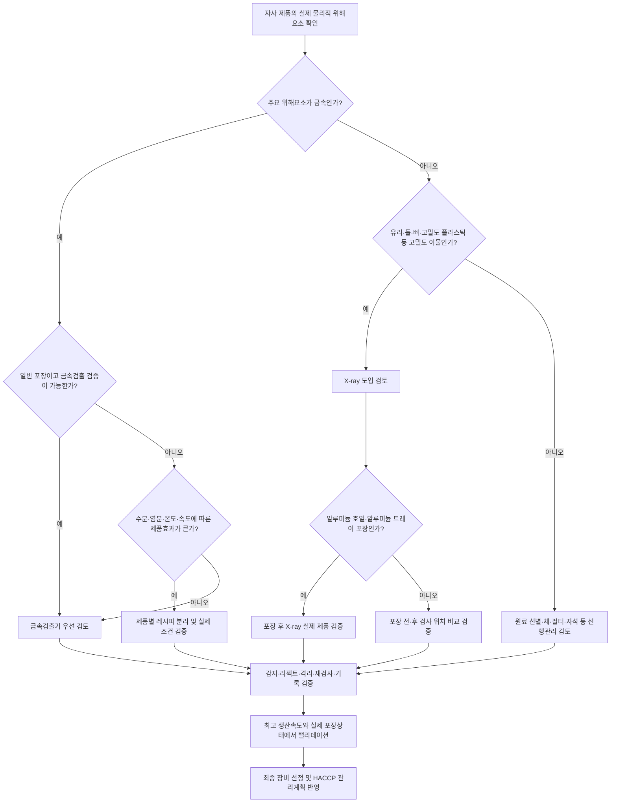
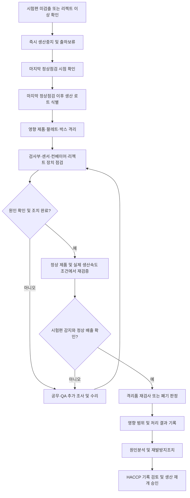
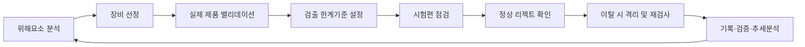

# [QA+ 블로그 생성 결과물] EQ001 금속검출기 Xray 비교
생성일시: 2026-09-07 08:13:12 (KST)
적용모델: gpt-5.6-terra

================================================================================
# 📋 최종 발행용 블로그 패키지

### 1. 메타 데이터 (SEO 설정)

- **최종 포스팅 제목**: EQ001 이물검사기 선정 가이드｜금속검출기 vs X-ray, HACCP에 맞는 장비 선택법
- **메타 디스크립션 (120자 내외 요약)**: 금속검출기와 X-ray 검사기의 검출 원리, 적용 이물, 알루미늄 포장 대응, HACCP 검증·리젝트·이탈조치 기준을 실무 중심으로 정리합니다.
- **추천 해시태그 (10개)**: #식품품질관리 #HACCP #식품안전 #금속검출기 #Xray검사기 #이물관리 #CCP관리 #식품공장 #FSSC22000 #품질관리실무
- **카테고리**: 식품품질실무 / HACCP가이드 / 이물관리

> **QA·사실관계 검수 반영 사항**
> - 「식품위생법」 제48조의 식품안전관리인증기준(HACCP) 취지와 「식품 및 축산물 안전관리인증기준」의 위해요소 분석·관리계획 체계를 기준으로 표현을 정리했습니다.
> - 특정 식품·품목·인증유형별 요구사항은 별도로 적용될 수 있으므로, “모든 식품제조업체에 일률적으로 설치 의무가 있다”는 식의 표현은 피했습니다.
> - X-ray 검사기는 식품을 방사성 물질로 만드는 방식이 아니라는 설명은 유지하되, 장비 도입 시 적용 법령, 차폐·인터록, 제조사 매뉴얼 및 안전관리 요구사항을 확인하도록 보완했습니다.
> - 시험편 크기는 모든 식품에 공통으로 적용되는 단일 법정 mm 기준이 아니라는 점을 명확히 유지했습니다.

---

## 2. 네이버 블로그 / 티스토리 복사용 최종 원고 (Markdown)

# EQ001 이물검사기 선정 가이드: 금속검출기 vs X-ray, 우리 제품에는 무엇이 맞을까?

> **20년 실무 선배의 한 줄 요약**  
> 금속검출기와 X-ray 검사기 중 “더 좋은 장비”를 고르는 것이 아닙니다. 우리 제품에서 실제 발생 가능한 이물을, 실제 생산조건에서, 안정적으로 검출하고 배출할 수 있는 설비를 고르는 것이 정답입니다.

---

## 1. “X-ray가 더 비싸고 많이 잡는다는데 바꿔야 할까요?”

이물 클레임이 발생했거나 고객사 실사를 앞두면 “금속검출기 대신 X-ray를 넣어야 하나요?”라는 질문이 바로 나옵니다. 특히 신규 라인을 증설하거나 EQ001처럼 내부 설비번호로 관리하는 이물검사 설비를 교체할 때는 장비 사양서와 영업자료만 보고 판단하기 쉽습니다.

하지만 결론부터 말씀드리면, **X-ray가 금속검출기의 무조건적인 상위 장비는 아닙니다.**

금속 이물이 가장 큰 위해요소이고 일반 비금속 포장 제품을 생산한다면 금속검출기가 더 효율적인 선택일 수 있습니다. 반대로 유리, 돌, 뼈, 고밀도 플라스틱, 고무 조각처럼 금속이 아닌 고밀도 이물까지 관리해야 하거나 알루미늄 호일 파우치·알루미늄 트레이를 사용하는 제품이라면 X-ray의 도입 타당성이 높아집니다.

다만 X-ray라고 해서 비닐 조각, 머리카락, 작은 목재 조각, 얇은 필름, 곤충 조각까지 모두 찾아주는 것은 아닙니다. X-ray는 이물의 존재를 주로 **밀도 및 두께 차이**로 판정하는 장비이기 때문입니다.

현장에서는 장비 구매를 논의하기 전에 먼저 아래 질문부터 정리해야 합니다.

- 우리 공정에서 실제로 떨어질 수 있는 이물은 무엇인가?
- 그 이물은 어느 크기 수준까지 관리해야 하는가?
- 포장 후 검사해야 하는가, 포장 전 검사로 충분한가?
- 실제 최고 생산속도와 실제 포장상태에서도 검출·배출이 가능한가?

이 답이 없는 상태에서 장비를 고르면 비싼 장비를 들여놓고도 HACCP 심사에서 검출한계 검증자료가 없다는 지적을 받을 수 있습니다.

또 하나 기억해야 할 점이 있습니다. 검사기가 이물을 감지했다고 해서 식품안전 관리가 끝나는 것은 아닙니다. 리젝트 장치가 불량품을 제대로 배출했는지, 배출품이 다시 정상품과 섞이지 않는지, 시험편 미검출 시 어느 생산분까지 격리할 것인지까지 관리되어야 합니다.

즉, 검사부만 잘 돌아가도 반쪽짜리입니다.

> **완전한 이물관리 시스템**  
> 감지 → 배출 → 격리 → 재검사 또는 폐기 → 기록 → 원인분석 및 재발방지


### 금속검출기 vs X-ray 선택 의사결정 흐름도



이제부터는 “어떤 장비가 좋으냐”라는 막연한 질문을 끝내고, 검출 원리와 실제 운전 조건을 기준으로 하나씩 비교해 보겠습니다.

---

## 2. 금속검출기와 X-ray, 검출 원리부터 다릅니다

금속검출기는 금속의 전기적·자기적 특성 변화를 감지하는 장비입니다. 일반적으로 식품공장에서는 철 계열인 **Fe**, 비철금속 계열인 **Non-Fe**, 스테인리스 계열인 **SUS** 시험편을 사용해 성능을 확인합니다.

Fe는 상대적으로 검출이 쉬운 편이며, Non-Fe와 SUS는 제품 특성 및 장비 조건에 따라 더 큰 시험편으로 관리되는 경우가 많습니다. 특히 SUS는 같은 지름이라도 재질 등급과 자성 특성에 따라 검출성이 달라질 수 있어 주의해야 합니다.

금속검출기는 제품 속에 금속성 신호가 들어왔는지를 보는 장비입니다. 따라서 철 조각, 절단날 파손편, 볼트·너트 조각, 설비 마모에 의한 금속편 관리에 효과적입니다.

반면 유리 조각, 돌, 뼈, 플라스틱, 고무, 목재처럼 금속이 아닌 이물은 금속검출기로 검출 대상으로 보기 어렵습니다. 금속검출기 하나만 설치했다고 모든 물리적 이물 위해요소가 통제되는 것은 아닙니다.

X-ray 검사기는 제품을 통과한 X선의 투과량 차이를 영상으로 분석합니다. 일반적으로 제품보다 밀도가 높거나 두께 차이가 큰 이물이 있으면 영상에서 차이가 나타나고, 이를 기준으로 불량품을 판정합니다.

따라서 금속뿐 아니라 유리, 돌, 뼈, 일부 고밀도 플라스틱 및 고밀도 고무 조각도 검출 가능성을 검토할 수 있습니다. 다만 제품 자체가 두껍거나, 내용물이 겹치거나, 제품 밀도 편차가 큰 경우에는 목표 이물이 있어도 영상상 구분이 어려울 수 있습니다.

> **X-ray 도입 시 가장 위험한 착각**  
> “비금속 이물도 다 잡는다”는 표현입니다.

얇은 비닐 조각, 머리카락, 목재, 작은 곤충 조각, 저밀도 플라스틱은 제품과 밀도 차이가 작거나 너무 얇아서 검출이 어려울 수 있습니다. 냉동만두 속 작은 뼈 조각도 만두의 겹침 정도와 검사 방향에 따라 결과가 달라질 수 있습니다.

따라서 X-ray 업체에는 “무엇을 찾을 수 있나요?”보다 아래 질문을 먼저 해야 합니다.

> “우리 제품에서 무엇을 놓칠 수 있나요?”

| 구분 | 금속검출기 | X-ray 검사기 |
|---|---|---|
| 기본 원리 | 금속의 전기적·자기적 특성 변화 감지 | X선 투과량 차이와 밀도·두께 차이 분석 |
| 주요 검출 대상 | Fe, Non-Fe, SUS 등 금속 이물 | 금속, 유리, 돌, 뼈, 일부 고밀도 플라스틱·고무 |
| 비금속 이물 검출 | 원칙적으로 어려움 | 제품과 충분한 밀도 차이가 있을 때 가능 |
| 알루미늄 포장 적용 | 일반 방식은 적용 제약이 큼 | 적용 검토 가능, 실제 제품 검증 필수 |
| 수분·염분 영향 | 제품효과로 감도 저하·오검출 가능 | 제품효과 영향은 상대적으로 적으나 밀도 편차 영향 존재 |
| 장점 | 운영이 비교적 단순하고 금속 관리에 효율적 | 검사범위 확대, 포장 내부 검사, 영상 확인 가능 |
| 주요 한계 | 비금속 이물 검출이 어려움 | 저밀도 이물 한계, 투자·유지관리 부담 |

여기까지 보면 장비 선택의 출발점은 명확합니다. 금속검출기는 금속에 강하고, X-ray는 밀도 차이가 있는 이물의 검사범위를 넓힐 수 있습니다.

---

## 3. 법적 기준의 핵심은 장비 설치가 아니라 위해요소 통제입니다

국내 식품 관련 법령이 모든 식품제조업체와 모든 품목에 금속검출기 또는 X-ray 검사기 설치를 일률적으로 요구하는 것은 아닙니다. 다만 제품 유형, 인증 유형, 고객사 요구사항 및 개별 기준에 따라 별도 요구사항이 적용될 수 있으므로 반드시 확인해야 합니다.

「식품위생법」 제48조에 따른 식품안전관리인증기준, 즉 HACCP의 기본 취지는 원료부터 제조·가공·유통에 이르는 과정에서 위해요소의 혼입과 오염을 방지하는 것입니다. 금속, 유리, 돌, 플라스틱 등은 대표적인 물리적 위해요소에 해당합니다.

따라서 사업장은 자사 원료, 설비, 공정, 포장 특성에 맞춰 필요한 관리수단을 정하고 이를 입증해야 합니다.

「식품 및 축산물 안전관리인증기준」의 HACCP 관리계획에서는 아래 요소가 연결되어야 합니다.

- 위해요소 분석
- 중요관리점(CCP) 결정 또는 관리수단 분류
- 한계기준 또는 관리기준 설정
- 모니터링
- 개선조치
- 검증
- 기록관리

즉, “금속검출기를 설치했다”는 한 줄로는 부족합니다.

- 왜 금속 이물이 발생할 수 있는가?
- 왜 이 검사기가 필요한가?
- 어느 크기의 시험편을 어떤 조건에서 검출해야 하는가?
- 리젝트 장치는 정상 작동하는가?
- 이상 발생 시 어느 생산분을 어떻게 처리하는가?

이 내용이 문서와 현장 운영으로 연결되어야 합니다.

「식품위생법」 제46조는 식품 등의 이물 발견보고와 관련된 사항을 규정하고 있습니다. 공장 안에서 반복적으로 금속 이물이 검출된다면 단순히 리젝트품을 폐기하는 것으로 끝내면 안 됩니다.

절단날 마모, 체 파손, 볼트 풀림, 컨베이어 부품 마모, 원료 선별 불량 등 혼입원을 추적해야 합니다. 검사기에서 잡힌 이물은 장비가 작동했다는 결과이기도 하지만, 동시에 선행공정 관리 실패의 신호일 수 있습니다.

ISO 22000:2018 및 FSSC 22000 Version 6 관점에서도 금속검출기나 X-ray 검사기를 반드시 CCP로 운영해야 한다고 일률적으로 정해져 있는 것은 아닙니다. 위해요소 분석 결과와 관리수단 분류 논리에 따라 CCP 또는 OPRP(운영선행요건프로그램)로 설정할 수 있습니다.

다만 최종 포장 후 출하 직전 검사 단계처럼 해당 설비가 사실상 마지막 방어선이라면 CCP로 운영하는 공장이 많습니다.

> **실무 포인트**  
> CCP인지 OPRP인지보다 중요한 것은 “이 단계가 실패하면 위해요소가 소비자에게 갈 수 있는가”입니다. 분류 논리, 관리기준, 이탈조치, 검증기록이 서로 맞아야 심사에서 흔들리지 않습니다.

법령과 인증기준은 개정될 수 있으므로 HACCP 계획서를 수정하거나 심사를 준비할 때는 국가법령정보센터의 현행 「식품위생법」 및 「식품 및 축산물 안전관리인증기준」을 확인해야 합니다. 식품공전의 이물 관련 기준도 식품안전나라 현행본을 기준으로 검토하는 것이 안전합니다.

---

## 4. EQ001 선정 전 반드시 확인할 7가지

### 1) 목표 이물을 구체적으로 정합니다

위해요소 분석표에 단순히 ‘금속’이라고만 적으면 장비 선정 근거가 약해집니다.

예를 들어 아래처럼 발생원과 이물 종류를 구체적으로 작성해야 합니다.

- 절단기 칼날 파손에 따른 SUS 조각
- 원료 선별 미흡에 따른 돌·사석
- 유리병 취급 중 파손에 따른 유리 조각
- 축산 원료 유래 뼈 조각
- 체 또는 필터 파손에 따른 금속편
- 설비 볼트·너트 풀림에 따른 금속 이물

그래야 금속검출기만으로 가능한지, X-ray가 필요한지 판단할 수 있습니다.

### 2) 카탈로그 감도와 자사 제품 검증 감도를 구분합니다

장비 카탈로그 수치는 특정 조건에서의 참고 성능일 가능성이 높습니다. 실제 생산에서는 제품 온도, 수분, 염분, 중량, 통과 속도, 포장재, 벨트 진동, 주변 전기 노이즈가 모두 영향을 줍니다.

특히 수분과 염분이 많은 제품은 금속이 없어도 금속검출기에 신호 변화를 일으키는 **제품효과(Product Effect)** 가 발생할 수 있습니다.

### 3) 실제 생산조건에서 밸리데이션합니다

정상 제품 1개를 천천히 흘려보는 수준으로 검증을 끝내면 안 됩니다.

다음 조건을 포함해야 합니다.

- 최소 중량 제품
- 표준 중량 제품
- 최대 중량 제품
- 온도가 다른 제품
- 포장 전 제품 및 포장 후 제품
- 실제 최고 생산속도
- 좌측·중앙·우측 통과 위치
- 제품 방향 변경 조건
- 제품 간격 변화 조건

특히 컨베이어 폭이 넓은 장비는 통과 위치에 따라 감도가 달라질 수 있으므로 가장자리 검증을 빼먹으면 안 됩니다.

### 4) 알루미늄 포장은 검사 위치부터 검토합니다

알루미늄 호일 파우치나 알루미늄 트레이를 사용하는 경우에는 “금속검출기를 설치할 수 있는가”보다 “어느 단계에서 검사할 것인가”를 먼저 검토해야 합니다.

알루미늄 포장재 자체가 일반 금속검출 방식에 큰 영향을 줄 수 있기 때문입니다.

검토 항목은 다음과 같습니다.

- 포장 전 금속검출로 관리할 수 있는가?
- 포장 후 검사까지 필요한가?
- 포장 후 X-ray가 목표 이물을 실제로 검출할 수 있는가?
- 포장 주름, 내용물 편차, 제품 겹침이 검사결과에 어떤 영향을 주는가?

### 5) 한계기준은 안정적으로 반복 관리 가능한 값으로 설정합니다

한계기준은 장비가 순간적으로 낼 수 있는 최고 성능이 아니라, 실제 생산조건에서 안정적으로 반복 관리할 수 있는 수치로 정해야 합니다.

예시는 아래와 같습니다.

> 제품 A 100 g, 냉장 상태, 분당 60개 생산조건에서 Fe·Non-Fe·SUS 시험편을 설정된 크기 이상으로 검출하고 자동 배출한다.

테스트피스 크기는 모든 식품에 공통 적용되는 단일 법정 수치가 아닙니다. 자사 제품의 위해도, 장비 성능, 고객사 요구사항, 밸리데이션 결과를 근거로 정해야 합니다.

### 6) 리젝트 장치도 검사 시스템의 일부입니다

시험편을 감지해도 에어 분사 압력이 부족하거나, 푸셔 타이밍이 어긋나거나, 리젝트 박스가 가득 차 있으면 불량품이 정상 라인에 남을 수 있습니다.

확인해야 할 항목은 다음과 같습니다.

- 리젝트 타이밍 정확성
- 에어 압력 또는 푸셔 작동 상태
- 리젝트 미배출 알람
- 리젝트 박스 만재 알람
- 리젝트 박스 잠금장치
- 배출품 회수 및 재혼입 방지
- 회수품 시간·로트·수량·처리결과 기록

### 7) 시험편 미검출 상황을 가정한 모의훈련이 필요합니다

생산 중 점검에서 시험편이 검출되지 않았다면 즉시 해당 라인 생산을 멈추거나 출하를 보류하고, 마지막 정상 점검 시점 이후 생산품을 식별·격리해야 합니다.

수리 또는 설정 조정 후에는 재검증을 실시해야 하며, 격리품은 재검사 또는 폐기 기준에 따라 처리해야 합니다.


### 시험편 미검출 및 CCP 이탈 조치 흐름도



---

## 5. 금속검출기·X-ray CCP 운영, 이렇게 잡으면 흔들리지 않습니다

### 제품별 검사 조건을 분리합니다

제품 중량, 수분·염분 수준, 포장재가 다른데도 하나의 레시피와 하나의 감도 설정값으로 운영하면 오검출 또는 미검출 위험이 커집니다.

품목별로 아래 항목을 관리표에 연결해 두는 것이 좋습니다.

- 제품명
- 중량
- 포장 형태
- 생산속도
- 검사기 레시피 번호
- 적용 시험편 기준
- 리젝트 조건
- 점검 주기

### 시험편 점검 방법을 표준화합니다

생산 전, 생산 중, 품목 전환 시, 작업 종료 시 등 점검 시점을 정하고 HACCP 계획서와 작업표준서에 일치시켜야 합니다.

생산 중 점검 주기는 제품 위해도, 생산시간, 자동기록 가능 여부, 라인 특성에 따라 정하되, 정한 주기를 실제로 지키는 것이 핵심입니다.

예를 들어 2시간마다 점검하기로 했다면 단순 감지 여부뿐 아니라 Fe·Non-Fe·SUS 각각의 시험편이 감지되고 정상적으로 리젝트되었는지 확인해야 합니다.

### 이탈 범위를 명확히 정합니다

시험편이 미검출된 시각이 오후 2시라면 오후 2시 생산분만 격리하는 것이 아니라, 마지막 정상 점검 시점부터 이탈 확인 시점까지의 생산분을 추적해야 합니다.

예를 들어 오후 12시 정상점검 후 오후 2시에 미검출이 확인됐다면 원칙적으로 오후 12시 이후 생산 로트가 영향 범위가 될 수 있습니다.

생산일보, 포장기록, 박스 라벨, 팔레트 번호가 서로 연결되도록 설계해야 합니다.

### 설비 변경 후에는 재검증합니다

다음과 같은 변경이 있었다면 기존 검증값을 그대로 믿으면 안 됩니다.

- 벨트 교체
- 리젝트 에어압 조정
- 센서 수리
- 프로그램 업데이트
- 제품 레시피 변경
- 생산속도 변경
- 포장재 변경
- 제품 중량 변경

검출부뿐 아니라 배출 타이밍, 컨베이어 속도, 제품 간격이 바뀌면 결과가 달라질 수 있기 때문입니다.

> **★ 심사 대응 꿀팁**  
> 심사관이 “이 시험편 기준은 왜 이렇게 정했습니까?”라고 물으면 “업체 권장값입니다”만으로는 부족합니다.  
> “자사 제품의 최대 중량·최고 속도·포장 완료 상태에서 좌·중·우 위치로 반복 검증했고, 해당 조건에서 안정적으로 검출·배출됨을 확인해 설정했습니다”라고 답할 수 있어야 합니다.

### 기록을 검토하고 추세를 분석합니다

일지에 체크만 되어 있다고 끝이 아닙니다. QA 담당자는 정한 주기에 따라 아래 항목을 분석해야 합니다.

- 시험편 점검 누락
- 리젝트 발생 건수
- 동일 설비의 반복 이물 검출
- 특정 시간대 오검출
- 수리 이력
- 품목별 감도 변경 이력
- 리젝트 박스 관리 이력

반복 패턴이 보이면 설비 보전, 원료관리, 작업자 취급, 선별공정 개선조치로 연결해야 합니다.

---

## 6. 실제 현장 사례로 보는 금속검출기와 X-ray 적용법

### 사례 1. 냉동만두 제조공장: SUS 칼날 파손 위험과 X-ray 전환 검토

냉동만두 제조공장에서 만두피 절단기와 충전기 후단에 금속검출기를 운영하고 있었습니다. 해당 공장은 냉동 포장 완료 제품을 분당 약 45봉 수준으로 생산했고, 제품은 수분과 염분을 포함한 냉동 만두 420 g 제품이었습니다.

생산 중 SUS 시험편에서 간헐적인 오검출과 감도 저하가 발생하자 현장에서는 금속검출기 자체를 X-ray로 전면 교체하자는 의견이 나왔습니다.

하지만 위해요소 분석을 다시 해보니 가장 우려되는 이물은 다음과 같았습니다.

- 충전기 스크루와 절단날의 SUS 파손편
- 원료 유래의 작은 뼈 조각
- 채소 원료 유래의 사석

문제는 기존 금속검출기의 감도 설정이 냉동 전 제품과 냉동 후 제품에 동일하게 적용되고 있었다는 점이었습니다. 제품 온도와 제품 간 간격이 달라지면서 제품효과와 벨트 진동 영향이 커졌고, 작업자는 오검출을 줄이기 위해 감도를 임의로 낮춘 적도 있었습니다.

근본 원인은 장비 성능 부족 하나가 아니라 아래와 같았습니다.

- 품목별 레시피 미분리
- 생산속도 변경 후 재검증 미실시
- 시험편 위치 표준화 부재
- 작업자 임의 감도 조정

이에 따라 우선 금속검출기 레시피를 제품별로 분리하고, 냉동 완료 상태·최고 속도·좌중우 위치에서 Fe·Non-Fe·SUS 반복 검증을 실시했습니다.

동시에 뼈와 사석 위험을 관리하기 위해 X-ray 장비 데모를 진행했습니다. 만두가 봉지 안에서 겹치는 조건과 겹치지 않는 조건을 나누어 뼈 조각 및 사석 모사 이물을 테스트한 결과, 특정 크기 이하 또는 제품 중첩이 큰 상태에서는 검출률이 낮아지는 구간이 확인됐습니다.

공장은 금속검출기를 폐기하지 않고 포장 전 금속검출을 유지하면서 포장 후 X-ray를 추가 검토하는 방향으로 위험관리를 재설계했습니다.

최종적으로는 아래와 같은 다중 방어체계를 구축했습니다.

- 원료 선별 강화
- 자석봉 관리
- 절단날 교체주기 단축
- 포장 전 금속검출
- 포장 후 X-ray 검증
- 제품별 레시피 및 재검증 관리

그 결과 시험편 미검출 이탈은 줄었고, 무엇보다 “X-ray를 넣었으니 모든 이물이 해결된다”는 잘못된 기대를 막을 수 있었습니다.

### 사례 2. 레토르트 소스 제조공장: 알루미늄 파우치와 포장 후 검사 문제

레토르트 소스 제조공장은 알루미늄 증착 또는 알루미늄 호일 계열 파우치 제품을 생산하고 있었습니다. 기존에는 충전 전 단계에서 금속검출기를 운영했지만, 고객사는 포장 후 최종제품 검사 강화를 요구했습니다.

생산팀은 금속검출기를 포장 후에도 추가 설치하자고 제안했지만 포장재 자체의 금속성 영향으로 일반 금속검출 적용에 제약이 있었습니다. 그래서 X-ray 도입 검토가 시작됐습니다.

처음 업체 데모에서는 유리, 금속, 사석 시험편이 잘 검출되는 것처럼 보였습니다. 하지만 실제 제품은 소스 점도가 다르고, 파우치 내부에 내용물이 한쪽으로 쏠리는 경우가 있었으며, 포장 주름도 일정하지 않았습니다.

특히 고형물이 많은 소스 제품은 내용물 밀도 편차가 커서 특정 위치의 작은 이물에서 오검출과 미검출 가능성이 함께 나타났습니다.

근본 원인은 아래와 같았습니다.

- “파우치 제품에는 X-ray면 충분하다”는 전제
- 실제 충전량 편차 미반영
- 제품 형상 편차 미반영
- 포장 주름 조건 미반영
- 실제 최고 생산속도 밸리데이션 미실시

개선조치로 공장은 최소 충전량·표준 충전량·최대 충전량 조건을 모두 포함해 X-ray 검증을 실시했습니다.

파우치의 중앙, 가장자리, 밀봉부 인접 구간에 목표 시험편을 위치시키고 실제 최고 생산속도로 반복 통과시험을 했습니다.

검증 결과를 바탕으로 X-ray의 관리 대상은 특정 크기 이상의 금속·유리·사석으로 명확히 설정했고, 검출이 어려운 저밀도 이물은 원료 선별, 필터, 체, 설비 파손관리로 별도 관리했습니다.

리젝트 박스에는 잠금장치와 만재 확인 절차를 추가했으며, 불량품 회수대장을 통해 재혼입을 방지했습니다.

### 사례 3. 음료 제조공장: 유리병 파손 위험과 리젝트 관리 실패

유리병 음료를 생산하는 공장은 충전·캡핑 후 외관검사와 X-ray 검사기를 운영하고 있었습니다. 공장에서는 유리병 파손 가능성이 있어 X-ray가 최종 방어선 역할을 해야 했습니다.

그런데 내부 점검 중 시험편은 감지되지만 리젝트 푸셔가 간헐적으로 정상품 또는 다음 제품을 밀어내는 현상이 발견됐습니다. 검사기 화면에는 불량 판정 기록이 남아 있어 현장에서는 장비가 정상이라고 생각하고 있었습니다.

문제 발생 당시 컨베이어 속도는 증산을 위해 기존보다 높아져 있었지만 리젝트 타이밍 설정은 변경되지 않았습니다. 또한 제품 간 간격이 일정하지 않아 불량품이 아닌 인접 정상품이 배출될 위험도 있었습니다.

근본 원인은 검사부의 검출 성능만 확인하고, 실제 불량품이 리젝트 박스로 정확히 들어가는지 검증하지 않은 데 있었습니다.

더 큰 문제는 리젝트 박스 안의 제품을 작업자가 수시로 비우면서도 수량과 로트를 기록하지 않아 실제 불량품의 최종 처리 여부를 추적하기 어려웠다는 점입니다.

공장은 즉시 최고 속도 조건에서 리젝트 위치 검증을 다시 실시했습니다.

- 시험편 삽입 제품에 식별 라벨 부착
- 정상품과 불량품의 배출 위치 육안 확인
- 제품 간격 조건별 푸셔 타이밍 재설정
- 리젝트 박스 잠금장치 적용
- 접근 권한 설정
- 회수품 시간·로트·수량·처리방법 기록
- QA 승인 후 재검사 또는 폐기
- 점검표에 ‘검출 여부’와 ‘정상 리젝트 여부’를 분리 기록

사례에서 보셨듯 장비의 종류보다 중요한 것은 목표 이물, 제품 조건, 리젝트 시스템, 이탈 대응입니다.

---

## 7. HACCP 심사에서 자주 나오는 질문과 FAQ

### Q1. 금속검출기와 X-ray를 둘 다 설치해야 하나요?

**A. 반드시 둘 다 설치해야 하는 것은 아닙니다.** 금속 이물이 주된 위해요소이고 포장재·제품 특성상 금속검출기 검증이 충분하다면 금속검출기 단독 운영도 가능합니다. 다만 유리·돌·뼈 등 고밀도 비금속 이물의 위험이 높거나, 알루미늄 포장 때문에 금속검출기 적용이 어려운 경우에는 X-ray 추가 또는 전환을 검토할 수 있습니다.

### Q2. X-ray를 설치하면 금속검출기는 필요 없나요?

**A. 단순히 “대체”라고 판단하면 안 됩니다.** X-ray는 금속도 검출할 수 있지만 제품 두께, 밀도 편차, 제품 중첩, 검사 속도에 따라 실제 검출 한계가 달라집니다. 특정 공정에서는 금속검출기가 금속 이물 관리에 더 경제적이고 안정적인 경우도 있으므로, 단독 운영·병행 운영·공정 전후 분리 운영을 실증 결과로 정해야 합니다.

### Q3. Fe, Non-Fe, SUS 테스트피스 크기는 법으로 정해져 있나요?

**A. 모든 식품공장에 공통으로 적용되는 단일 법정 mm 기준이 있는 것은 아닙니다.** 제품 특성, 위해요소 크기, 장비 성능, 고객사 기준, 자사 밸리데이션 결과를 근거로 설정해야 합니다. 중요한 것은 정한 기준이 HACCP 계획서, 작업표준서, 모니터링 일지, 검증기록에서 일관되게 운영되는 것입니다.

### Q4. 검사기를 CCP가 아니라 OPRP로 운영해도 되나요?

**A. 가능 여부는 위해요소 분석과 관리수단 분류 논리에 따라 결정됩니다.** 최종제품 단계에서 출하 전 이물을 통제하는 마지막 기회라면 CCP로 설정하는 사례가 많습니다. 다만 명칭보다 중요한 것은 해당 관리 실패 시 위해요소가 허용 가능한 수준으로 통제되는지, 이탈 시 제품 격리와 재검사가 가능한지입니다.

### Q5. 금속검출기에서 제품효과란 정확히 무엇인가요?

**A. 수분, 염분, 온도, 제품 크기 등 제품 자체 특성 때문에 금속이 없어도 장비 신호가 변하는 현상입니다.** 특히 냉장 반찬, 육가공품, 수산가공품, 소스류처럼 수분과 염분이 높은 제품에서 문제가 될 수 있습니다. 오검출이 많다고 무조건 감도를 낮추지 말고 제품별 레시피 분리, 온도 안정화, 벨트 진동 점검, 제품 간격 조정부터 확인해야 합니다.

### Q6. X-ray 검사는 방사선 때문에 식품이 위험하지 않나요?

**A. 식품용 X-ray 검사기는 제품을 비파괴적으로 검사하는 장비이며, 검사 후 식품이 방사성 물질이 되는 방식은 아닙니다.** 다만 장비의 차폐 상태, 인터록, 경고장치, 정기점검 및 제조사 매뉴얼 준수는 필수입니다. 도입 전에는 장비 공급업체의 안전성 자료와 사업장에 적용되는 관련 안전관리 요구사항을 함께 확인해야 합니다.

### Q7. 시험편이 한 번 미검출됐는데 해당 제품만 다시 검사하면 되나요?

**A. 보통은 그렇게 처리하면 부족합니다.** 마지막 정상 점검 시점부터 미검출이 발견된 시점까지 생산된 제품이 영향 범위가 될 수 있으므로 해당 구간의 로트를 식별·격리해야 합니다. 설비 수리 후 재검증하고, 격리품은 재검사 또는 폐기 기준에 따라 처리한 뒤 결과를 기록해야 합니다.

---

## 8. 금속검출기·X-ray 검사기 운영 체크리스트

| 점검 영역 | 확인 항목 | 권장 확인 방법 | 미흡 시 조치 |
|---|---|---|---|
| 위해요소 분석 | 금속·유리·돌·뼈 등 발생원을 구체적으로 작성했는가 | 공정별 설비·원료·작업 분석표 검토 | 발생원과 예방수단 재작성 |
| 장비 선정 | 목표 이물이 장비에서 실제 검출되는가 | 자사 제품 조건 밸리데이션 | 금속검출기/X-ray/선행관리 재검토 |
| 시험편 | Fe·Non-Fe·SUS 또는 목표 이물 시험편이 적절한가 | 시험편 목록 및 검증결과 확인 | 위해도·검증결과 기반으로 기준 재설정 |
| 통과 조건 | 좌·중·우 위치, 제품 방향, 최고 속도를 반영했는가 | 반복 통과시험 기록 확인 | 위치·속도 조건 추가 검증 |
| 제품효과 | 수분·염분·온도 변화가 감도에 미치는 영향을 확인했는가 | 품목별 레시피·오검출 이력 검토 | 레시피 분리, 조건 안정화 |
| 리젝트 | 감지품이 실제로 정확히 배출되는가 | 식별 시험편 제품으로 배출 위치 확인 | 타이밍·에어압·벨트 속도 조정 |
| 리젝트 박스 | 잠금, 만재 알람, 회수품 관리가 되는가 | 현장 확인 및 회수대장 검토 | 잠금장치·관리대장·권한 설정 |
| 모니터링 | 생산 전·중·품목전환·종료 시 점검하는가 | HACCP 일지와 생산일보 대조 | 점검 주기 및 책임자 재교육 |
| 이탈조치 | 마지막 정상점검 이후 생산품 격리 기준이 있는가 | 개선조치서·모의훈련 기록 확인 | 격리 범위·재검사 기준 명문화 |
| 변경관리 | 수리·벨트교체·속도변경 후 재검증하는가 | 정비이력과 검증기록 비교 | 변경 후 재검증 절차 추가 |
| 검증 | 반복 검출·오검출 추세를 분석하는가 | 월간 QA 검토자료 확인 | 원인분석 및 예방조치 실시 |

체크리스트를 운영할 때는 항목을 많이 만드는 것보다 책임자와 주기가 분명한 것이 중요합니다.

예를 들어 다음과 같이 역할을 나누면 누락이 줄어듭니다.

- 생산팀: 작업 전·중 시험편 점검 및 리젝트 확인
- QA팀: 기록 검토, 이탈조치 승인, 월간 추세분석
- 공무팀: 정비 후 재검증 요청 및 설비 상태 관리
- 관리책임자: 변경관리 및 재발방지조치 확인

특히 리젝트 관련 항목은 생산팀과 QA가 서로 확인하는 이중 점검 구조가 효과적입니다.

문서와 현장도 같아야 합니다. 작업표준서에는 2시간마다 점검이라고 되어 있는데 실제 현장에서는 생산 시작 전에만 점검한다면, 장비 성능이 좋아도 심사에서는 관리 미흡으로 판단될 수 있습니다.

---

## 9. 심사관이 실제로 보는 10가지 지적 포인트

1. **위해요소 분석표가 추상적인 경우**  
   ‘금속 혼입 가능’이라고만 쓰지 말고 절단기, 체, 믹서, 충전기, 볼트·너트, 원료 선별 등 구체적인 발생원을 적어야 합니다.

2. **시험편 기준 설정 근거가 없는 경우**  
   다른 공장의 기준을 그대로 적용하기보다 자사 제품의 중량, 포장 상태, 생산속도, 검사 위치에서 검출·배출 검증을 실시한 자료가 필요합니다.

3. **시험편을 중앙에만 통과시키는 경우**  
   실제 이물은 제품 중앙에만 존재하지 않습니다. 좌·중·우 위치와 제품 방향을 고려해야 합니다.

4. **리젝트품 관리가 부실한 경우**  
   리젝트 박스가 잠겨 있지 않거나, 회수품 처리기록이 없거나, 리젝트품이 정상품 구역 근처에 방치되어 있으면 지적 대상이 됩니다.

5. **이상 발생 시 영향 범위를 정하지 못하는 경우**  
   마지막 정상점검 이후의 생산 로트, 팔레트, 박스 수량을 즉시 추적할 수 있어야 합니다.

6. **정비 후 재검증이 누락된 경우**  
   벨트 교체, 센서 수리, 리젝트 조정 뒤에는 검출과 배출을 다시 검증해야 합니다.

7. **품목 전환 시 레시피를 변경하지 않는 경우**  
   제품 중량, 수분, 염분, 포장재가 달라졌다면 기존 설정값이 적절한지 확인해야 합니다.

8. **X-ray 목표 이물별 밸리데이션이 없는 경우**  
   유리·돌·뼈·금속 등 목표 이물별로 실제 제품조건에서 검증한 자료가 있어야 합니다.

9. **반복 이물 검출에 대한 원인분석이 없는 경우**  
   리젝트품 폐기로 끝내지 말고 설비, 원료, 작업방법, 선행공정 문제를 분석해야 합니다.

10. **QA 기록 검토가 형식적인 경우**  
   점검표 서명만 확인하지 말고 누락, 오검출, 반복 리젝트, 설비 이상 패턴을 분석해야 합니다.

---

## 10. 맺음말: 비싼 장비보다 “우리 위해요소를 실제로 잡는가”가 먼저입니다

오늘 내용은 세 줄로 정리할 수 있습니다.

1. **금속검출기는 금속 이물 관리에 강하고, X-ray는 유리·돌·뼈 등 일부 고밀도 비금속 이물까지 검사범위를 넓힐 수 있습니다.**  
2. **X-ray는 만능 장비가 아니며, 금속검출기도 제품 수분·염분·포장·속도에 따라 실제 감도가 달라집니다.**  
3. **HACCP에서 중요한 것은 장비 이름이 아니라 자사 제품 조건에서의 검증, 리젝트 관리, 이탈 시 격리와 기록입니다.**

EQ001이 금속검출기이든 X-ray 검사기이든 설치하는 순간 이물관리가 완성되는 것은 아닙니다.

매일 시험편을 정확한 조건으로 점검하고, 리젝트가 제대로 되는지 확인하고, 이상이 생기면 생산품을 단호하게 격리하는 과정이 쌓여야 비로소 최종 방어선이 됩니다.

> **마지막 현장 점검 질문**  
> “우리 제품에서 가장 위험한 이물은 무엇이며, EQ001은 그 이물을 실제 생산속도와 실제 포장 상태에서 확실히 잡아내는가?”

이 질문에 데이터로 답할 수 있다면 심사 대응도 고객사 대응도 훨씬 편해집니다.

---

## 3. 워드프레스 / 웹사이트용 HTML 원고

```html
<article class="food-qa-post">
  <header>
    <h1>EQ001 이물검사기 선정 가이드: 금속검출기 vs X-ray, 우리 제품에는 무엇이 맞을까?</h1>
    <blockquote>
      <p><strong>20년 실무 선배의 한 줄 요약:</strong> 금속검출기와 X-ray 검사기 중 “더 좋은 장비”를 고르는 것이 아닙니다. 우리 제품에서 실제 발생 가능한 이물을, 실제 생산조건에서, 안정적으로 검출하고 배출할 수 있는 설비를 고르는 것이 정답입니다.</p>
    </blockquote>
  </header>

  <section>
    <h2>1. “X-ray가 더 비싸고 많이 잡는다는데 바꿔야 할까요?”</h2>
    <p>이물 클레임이 발생했거나 고객사 실사를 앞두면 “금속검출기 대신 X-ray를 넣어야 하나요?”라는 질문이 바로 나옵니다. 특히 신규 라인을 증설하거나 EQ001처럼 내부 설비번호로 관리하는 이물검사 설비를 교체할 때는 장비 사양서와 영업자료만 보고 판단하기 쉽습니다.</p>
    <p>하지만 결론부터 말씀드리면, <strong>X-ray가 금속검출기의 무조건적인 상위 장비는 아닙니다.</strong></p>
    <p>금속 이물이 가장 큰 위해요소이고 일반 비금속 포장 제품을 생산한다면 금속검출기가 더 효율적인 선택일 수 있습니다. 반대로 유리, 돌, 뼈, 고밀도 플라스틱, 고무 조각처럼 금속이 아닌 고밀도 이물까지 관리해야 하거나 알루미늄 호일 파우치·알루미늄 트레이를 사용하는 제품이라면 X-ray의 도입 타당성이 높아집니다.</p>
    <p>다만 X-ray라고 해서 비닐 조각, 머리카락, 작은 목재 조각, 얇은 필름, 곤충 조각까지 모두 찾아주는 것은 아닙니다. X-ray는 이물의 존재를 주로 밀도 및 두께 차이로 판정하는 장비이기 때문입니다.</p>

    <ul>
      <li>우리 공정에서 실제로 떨어질 수 있는 이물은 무엇인가?</li>
      <li>그 이물은 어느 크기 수준까지 관리해야 하는가?</li>
      <li>포장 후 검사해야 하는가, 포장 전 검사로 충분한가?</li>
      <li>실제 최고 생산속도와 실제 포장상태에서도 검출·배출이 가능한가?</li>
    </ul>

    <p>검사기가 이물을 감지했다고 해서 식품안전 관리가 끝나는 것은 아닙니다. 리젝트 장치가 불량품을 제대로 배출했는지, 배출품이 다시 정상품과 섞이지 않는지, 시험편 미검출 시 어느 생산분까지 격리할 것인지까지 관리되어야 합니다.</p>

    <blockquote>
      <p><strong>완전한 이물관리 시스템:</strong> 감지 → 배출 → 격리 → 재검사 또는 폐기 → 기록 → 원인분석 및 재발방지</p>
    </blockquote>

    <figure>
      
      <figcaption>금속 이물과 일반 포장 제품에는 금속검출기를 우선 검토하고, 고밀도 비금속 이물 또는 알루미늄 포장 제품에는 X-ray 검증을 검토합니다.</figcaption>
    </figure>

    <h3>금속검출기 vs X-ray 선택 의사결정 흐름도</h3>
    <pre class="mermaid">flowchart TD
    A[자사 제품의 실제 물리적 위해요소 확인] --&gt; B{주요 위해요소가 금속인가?}
    B --&gt;|예| C{일반 포장이고 금속검출 검증이 가능한가?}
    C --&gt;|예| D[금속검출기 우선 검토]
    C --&gt;|아니오| E{수분·염분·온도·속도에 따른 제품효과가 큰가?}
    E --&gt;|예| F[제품별 레시피 분리 및 실제 조건 검증]
    E --&gt;|아니오| D
    B --&gt;|아니오| G{유리·돌·뼈·고밀도 플라스틱 등 고밀도 이물인가?}
    G --&gt;|예| H[X-ray 도입 검토]
    G --&gt;|아니오| I[원료 선별·체·필터·자석 등 선행관리 검토]
    H --&gt; J{알루미늄 호일·알루미늄 트레이 포장인가?}
    J --&gt;|예| K[포장 후 X-ray 실제 제품 검증]
    J --&gt;|아니오| L[포장 전·후 검사 위치 비교 검증]
    D --&gt; M[감지·리젝트·격리·재검사·기록 검증]
    K --&gt; M
    L --&gt; M
    F --&gt; M
    I --&gt; M
    M --&gt; N[최고 생산속도와 실제 포장상태에서 밸리데이션]
    N --&gt; O[최종 장비 선정 및 HACCP 관리계획 반영]</pre>
  </section>

  <section>
    <h2>2. 금속검출기와 X-ray, 검출 원리부터 다릅니다</h2>
    <p>금속검출기는 금속의 전기적·자기적 특성 변화를 감지하는 장비입니다. 일반적으로 식품공장에서는 철 계열인 <strong>Fe</strong>, 비철금속 계열인 <strong>Non-Fe</strong>, 스테인리스 계열인 <strong>SUS</strong> 시험편을 사용해 성능을 확인합니다.</p>
    <p>Fe는 상대적으로 검출이 쉬운 편이며, Non-Fe와 SUS는 제품 특성 및 장비 조건에 따라 더 큰 시험편으로 관리되는 경우가 많습니다. 특히 SUS는 같은 지름이라도 재질 등급과 자성 특성에 따라 검출성이 달라질 수 있어 주의해야 합니다.</p>
    <p>금속검출기는 철 조각, 절단날 파손편, 볼트·너트 조각, 설비 마모에 의한 금속편 관리에 효과적입니다. 반면 유리, 돌, 뼈, 플라스틱, 고무, 목재처럼 금속이 아닌 이물은 금속검출기로 검출 대상으로 보기 어렵습니다.</p>
    <p>X-ray 검사기는 제품을 통과한 X선의 투과량 차이를 영상으로 분석합니다. 금속뿐 아니라 유리, 돌, 뼈, 일부 고밀도 플라스틱 및 고무 조각도 검출 가능성을 검토할 수 있습니다. 다만 제품 자체가 두껍거나, 내용물이 겹치거나, 제품 밀도 편차가 큰 경우에는 목표 이물이 있어도 영상상 구분이 어려울 수 있습니다.</p>

    <blockquote>
      <p><strong>X-ray 도입 시 가장 위험한 착각:</strong> “비금속 이물도 다 잡는다”는 표현입니다.</p>
    </blockquote>

    <p>얇은 비닐 조각, 머리카락, 목재, 작은 곤충 조각, 저밀도 플라스틱은 제품과 밀도 차이가 작거나 너무 얇아서 검출이 어려울 수 있습니다. 따라서 X-ray 장비 업체에는 “무엇을 찾을 수 있나요?”보다 “우리 제품에서 무엇을 놓칠 수 있나요?”를 먼저 물어봐야 합니다.</p>

    <table>
      <thead>
        <tr>
          <th>구분</th>
          <th>금속검출기</th>
          <th>X-ray 검사기</th>
        </tr>
      </thead>
      <tbody>
        <tr>
          <td>기본 원리</td>
          <td>금속의 전기적·자기적 특성 변화 감지</td>
          <td>X선 투과량 차이와 밀도·두께 차이 분석</td>
        </tr>
        <tr>
          <td>주요 검출 대상</td>
          <td>Fe, Non-Fe, SUS 등 금속 이물</td>
          <td>금속, 유리, 돌, 뼈, 일부 고밀도 플라스틱·고무</td>
        </tr>
        <tr>
          <td>비금속 이물 검출</td>
          <td>원칙적으로 어려움</td>
          <td>제품과 충분한 밀도 차이가 있을 때 가능</td>
        </tr>
        <tr>
          <td>알루미늄 포장 적용</td>
          <td>일반 방식은 적용 제약이 큼</td>
          <td>적용 검토 가능, 실제 제품 검증 필수</td>
        </tr>
        <tr>
          <td>수분·염분 영향</td>
          <td>제품효과로 감도 저하·오검출 가능</td>
          <td>제품효과 영향은 상대적으로 적으나 밀도 편차 영향 존재</td>
        </tr>
        <tr>
          <td>장점</td>
          <td>운영이 비교적 단순하고 금속 관리에 효율적</td>
          <td>검사범위 확대, 포장 내부 검사, 영상 확인 가능</td>
        </tr>
        <tr>
          <td>주요 한계</td>
          <td>비금속 이물 검출이 어려움</td>
          <td>저밀도 이물 한계, 투자·유지관리 부담</td>
        </tr>
      </tbody>
    </table>
  </section>

  <section>
    <h2>3. 법적 기준의 핵심은 장비 설치가 아니라 위해요소 통제입니다</h2>
    <p>국내 식품 관련 법령이 모든 식품제조업체와 모든 품목에 금속검출기 또는 X-ray 검사기 설치를 일률적으로 요구하는 것은 아닙니다. 다만 제품 유형, 인증 유형, 고객사 요구사항 및 개별 기준에 따라 별도 요구사항이 적용될 수 있으므로 반드시 확인해야 합니다.</p>
    <p>「식품위생법」 제48조에 따른 식품안전관리인증기준, 즉 HACCP의 기본 취지는 원료부터 제조·가공·유통에 이르는 과정에서 위해요소의 혼입과 오염을 방지하는 것입니다. 금속, 유리, 돌, 플라스틱 등은 대표적인 물리적 위해요소에 해당합니다.</p>
    <p>따라서 사업장은 자사 원료, 설비, 공정, 포장 특성에 맞춰 필요한 관리수단을 정하고 이를 입증해야 합니다.</p>

    <ul>
      <li>위해요소 분석</li>
      <li>중요관리점(CCP) 결정 또는 관리수단 분류</li>
      <li>한계기준 또는 관리기준 설정</li>
      <li>모니터링</li>
      <li>개선조치</li>
      <li>검증</li>
      <li>기록관리</li>
    </ul>

    <p>「식품위생법」 제46조는 식품 등의 이물 발견보고와 관련된 사항을 규정하고 있습니다. 공장 안에서 반복적으로 금속 이물이 검출된다면 리젝트품 폐기로 끝내지 말고 절단날 마모, 체 파손, 볼트 풀림, 컨베이어 부품 마모, 원료 선별 불량 등의 혼입원을 추적해야 합니다.</p>
    <p>ISO 22000:2018 및 FSSC 22000 Version 6 관점에서도 금속검출기나 X-ray 검사기를 반드시 CCP로 운영해야 한다고 일률적으로 정해져 있는 것은 아닙니다. 위해요소 분석 결과와 관리수단 분류 논리에 따라 CCP 또는 OPRP로 설정할 수 있습니다.</p>

    <blockquote>
      <p><strong>실무 포인트:</strong> CCP인지 OPRP인지보다 중요한 것은 “이 단계가 실패하면 위해요소가 소비자에게 갈 수 있는가”입니다. 분류 논리, 관리기준, 이탈조치, 검증기록이 서로 맞아야 심사에서 흔들리지 않습니다.</p>
    </blockquote>
  </section>

  <section>
    <h2>4. EQ001 선정 전 반드시 확인할 7가지</h2>

    <h3>1) 목표 이물을 구체적으로 정합니다</h3>
    <p>위해요소 분석표에 단순히 ‘금속’이라고만 적으면 장비 선정 근거가 약해집니다. 절단기 칼날 파손에 따른 SUS 조각, 원료 선별 미흡에 따른 돌·사석, 유리병 취급 중 파손에 따른 유리 조각, 축산 원료 유래 뼈 조각처럼 발생원과 종류를 명확히 적어야 합니다.</p>

    <h3>2) 카탈로그 감도와 자사 제품 검증 감도를 구분합니다</h3>
    <p>실제 생산에서는 제품 온도, 수분, 염분, 중량, 통과 속도, 포장재, 벨트 진동, 주변 전기 노이즈가 모두 영향을 줍니다. 특히 수분과 염분이 많은 제품은 금속이 없어도 금속검출기에 신호 변화를 일으키는 <strong>제품효과(Product Effect)</strong>가 발생할 수 있습니다.</p>

    <h3>3) 실제 생산조건에서 밸리데이션합니다</h3>
    <p>최소·표준·최대 중량 제품, 온도가 다른 제품, 포장 전·후 제품, 실제 최고 생산속도, 좌·중·우 통과 위치, 제품 방향 및 제품 간격 변화 조건을 포함해야 합니다.</p>

    <h3>4) 알루미늄 포장은 검사 위치부터 검토합니다</h3>
    <p>알루미늄 호일 파우치나 알루미늄 트레이를 사용하는 경우에는 포장 전 금속검출로 관리할 수 있는지, 포장 후 검사까지 필요한지, 포장 후 X-ray가 목표 이물을 실제로 검출할 수 있는지를 검토해야 합니다.</p>

    <h3>5) 한계기준은 안정적으로 반복 관리 가능한 값으로 설정합니다</h3>
    <p>한계기준은 장비가 순간적으로 낼 수 있는 최고 성능이 아니라 실제 생산조건에서 안정적으로 반복 관리할 수 있는 수치로 정해야 합니다. 테스트피스 크기는 모든 식품에 공통 적용되는 단일 법정 수치가 아니며, 자사 제품의 위해도, 장비 성능, 고객사 요구사항, 밸리데이션 결과를 근거로 설정해야 합니다.</p>

    <h3>6) 리젝트 장치도 검사 시스템의 일부입니다</h3>
    <p>에어 분사 압력, 푸셔 타이밍, 리젝트 박스 만재 여부, 미배출 알람, 잠금장치, 회수품 재혼입 방지 및 처리기록을 함께 관리해야 합니다.</p>

    <h3>7) 시험편 미검출 상황을 가정한 모의훈련이 필요합니다</h3>
    <p>시험편 미검출 시 즉시 생산중지 또는 출하보류를 실시하고, 마지막 정상 점검 시점 이후 생산품을 식별·격리해야 합니다. 수리 또는 설정 조정 후에는 재검증을 실시하고, 격리품은 재검사 또는 폐기 기준에 따라 처리해야 합니다.</p>

    <figure>
      
      <figcaption>시험편 미검출 또는 리젝트 이상 발생 시에는 생산중지, 영향 로트 격리, 설비 점검, 재검증, 처리기록까지 이어져야 합니다.</figcaption>
    </figure>

    <h3>시험편 미검출 및 CCP 이탈 조치 흐름도</h3>
    <pre class="mermaid">flowchart TD
    A[시험편 미검출 또는 리젝트 이상 확인] --&gt; B[즉시 생산중지 및 출하보류]
    B --&gt; C[마지막 정상점검 시점 확인]
    C --&gt; D[마지막 정상점검 이후 생산 로트 식별]
    D --&gt; E[영향 제품·팔레트·박스 격리]
    E --&gt; F[검사부·센서·컨베이어·리젝트 장치 점검]
    F --&gt; G{원인 확인 및 조치 완료?}
    G --&gt;|아니오| H[공무·QA 추가 조사 및 수리]
    H --&gt; F
    G --&gt;|예| I[정상 제품 및 실제 생산속도 조건에서 재검증]
    I --&gt; J{시험편 감지와 정상 배출 확인?}
    J --&gt;|아니오| H
    J --&gt;|예| K[격리품 재검사 또는 폐기 판정]
    K --&gt; L[영향 범위 및 처리 결과 기록]
    L --&gt; M[원인분석 및 재발방지조치]
    M --&gt; N[HACCP 기록 검토 및 생산 재개 승인]</pre>
  </section>

  <section>
    <h2>5. 금속검출기·X-ray CCP 운영, 이렇게 잡으면 흔들리지 않습니다</h2>
    <p>제품 중량, 수분·염분 수준, 포장재가 다른데도 하나의 레시피와 하나의 감도 설정값으로 운영하면 오검출 또는 미검출 위험이 커집니다. 품목별로 제품명, 중량, 포장 형태, 생산속도, 검사기 레시피 번호, 적용 시험편 기준을 관리표에 연결해야 합니다.</p>
    <p>생산 전, 생산 중, 품목 전환 시, 작업 종료 시 등 점검 시점을 정하고 HACCP 계획서와 작업표준서에 일치시켜야 합니다. 예를 들어 2시간마다 점검하기로 했다면 Fe·Non-Fe·SUS 각각의 시험편이 감지되고 정상적으로 리젝트되었는지 확인해야 합니다.</p>
    <p>시험편 미검출이 오후 2시에 확인됐다면 오후 2시 생산분만 격리하는 것이 아니라, 마지막 정상 점검 시점부터 이탈 확인 시점까지의 생산분을 추적해야 합니다.</p>
    <p>벨트 교체, 리젝트 에어압 조정, 센서 수리, 프로그램 업데이트, 제품 레시피 변경, 생산속도 변경, 포장재 변경 뒤에는 재검증이 필요합니다.</p>

    <blockquote>
      <p><strong>★ 심사 대응 꿀팁</strong><br>심사관이 “이 시험편 기준은 왜 이렇게 정했습니까?”라고 물으면 “업체 권장값입니다”만으로는 부족합니다. “자사 제품의 최대 중량·최고 속도·포장 완료 상태에서 좌·중·우 위치로 반복 검증했고, 해당 조건에서 안정적으로 검출·배출됨을 확인해 설정했습니다”라고 답할 수 있어야 합니다.</p>
    </blockquote>

    <p>QA 담당자는 정한 주기에 따라 시험편 점검 누락, 리젝트 발생 건수, 동일 설비의 반복 이물 검출, 특정 시간대 오검출, 수리 이력 등을 분석해야 합니다.</p>
  </section>

  <section>
    <h2>6. 실제 현장 사례로 보는 금속검출기와 X-ray 적용법</h2>

    <h3>사례 1. 냉동만두 제조공장: SUS 칼날 파손 위험과 X-ray 전환 검토</h3>
    <p>냉동만두 제조공장에서 냉동 포장 완료 420 g 제품을 분당 약 45봉 생산하고 있었습니다. 생산 중 SUS 시험편에서 간헐적인 오검출과 감도 저하가 발생하자 금속검출기를 X-ray로 전면 교체하자는 의견이 나왔습니다.</p>
    <p>하지만 위해요소 분석 결과 주요 위험은 충전기 스크루와 절단날의 SUS 파손편, 원료 유래 작은 뼈 조각, 채소 원료 유래 사석이었습니다. 근본 원인은 장비 성능 부족보다 냉동 전·후 제품의 동일 레시피 적용, 생산속도 변경 후 재검증 미실시, 시험편 위치 표준화 부재, 작업자의 임의 감도 조정이었습니다.</p>
    <p>공장은 금속검출기 레시피를 제품별로 분리하고 냉동 완료 상태·최고 속도·좌중우 위치에서 Fe·Non-Fe·SUS 반복 검증을 실시했습니다. X-ray 데모에서는 제품 중첩이 큰 상태에서 특정 크기 이하 뼈 조각과 사석의 검출률이 낮아지는 구간이 확인됐습니다.</p>
    <p>최종적으로 원료 선별 강화, 자석봉 관리, 절단날 교체주기 단축, 포장 전 금속검출, 포장 후 X-ray 검증을 포함한 다중 방어체계를 구축했습니다.</p>

    <h3>사례 2. 레토르트 소스 제조공장: 알루미늄 파우치와 포장 후 검사 문제</h3>
    <p>레토르트 소스 제조공장은 알루미늄 증착 또는 알루미늄 호일 계열 파우치를 사용했습니다. 충전 전 금속검출은 운영 중이었지만 고객사가 포장 후 최종제품 검사 강화를 요구하면서 X-ray 도입 검토가 시작됐습니다.</p>
    <p>업체 데모에서는 유리, 금속, 사석 시험편이 잘 검출되는 것처럼 보였으나 실제 제품은 소스 점도, 충전량, 내용물 쏠림, 포장 주름이 일정하지 않았습니다. 고형물이 많은 소스는 밀도 편차가 커 특정 위치의 작은 이물에서 오검출과 미검출 가능성이 함께 나타났습니다.</p>
    <p>공장은 최소·표준·최대 충전량 조건에서 중앙, 가장자리, 밀봉부 인접 구간에 목표 시험편을 위치시키고 실제 최고 생산속도로 반복 검증했습니다. 검증 결과 X-ray 관리 대상을 특정 크기 이상의 금속·유리·사석으로 명확히 했고, 저밀도 이물은 원료 선별, 필터, 체, 설비 파손관리로 별도 관리했습니다.</p>

    <h3>사례 3. 음료 제조공장: 유리병 파손 위험과 리젝트 관리 실패</h3>
    <p>유리병 음료 공장은 충전·캡핑 후 외관검사와 X-ray 검사기를 운영하고 있었습니다. 내부 점검 중 시험편은 감지됐지만 리젝트 푸셔가 간헐적으로 정상품 또는 다음 제품을 밀어내는 현상이 발견됐습니다.</p>
    <p>컨베이어 속도는 증산을 위해 높아졌지만 리젝트 타이밍 설정은 변경되지 않았고, 제품 간격도 일정하지 않았습니다. 근본 원인은 검사부의 검출 성능만 확인하고 실제 불량품이 리젝트 박스로 정확히 들어가는지를 검증하지 않은 것이었습니다.</p>
    <p>공장은 최고 속도 조건에서 리젝트 위치 검증을 실시하고, 시험편 삽입 제품에 식별 라벨을 부착해 정상품과 불량품 배출 위치를 확인했습니다. 또한 푸셔 타이밍 재설정, 리젝트 박스 잠금장치, 접근 권한, 회수품 처리기록, QA 승인 절차를 도입했습니다.</p>
  </section>

  <section>
    <h2>7. HACCP 심사에서 자주 나오는 질문과 FAQ</h2>

    <h3>Q1. 금속검출기와 X-ray를 둘 다 설치해야 하나요?</h3>
    <p><strong>A.</strong> 반드시 둘 다 설치해야 하는 것은 아닙니다. 금속 이물이 주된 위해요소이고 포장재·제품 특성상 금속검출기 검증이 충분하다면 단독 운영도 가능합니다. 다만 유리·돌·뼈 등 고밀도 비금속 이물의 위험이 높거나 알루미늄 포장 때문에 금속검출기 적용이 어려운 경우에는 X-ray 추가 또는 전환을 검토할 수 있습니다.</p>

    <h3>Q2. X-ray를 설치하면 금속검출기는 필요 없나요?</h3>
    <p><strong>A.</strong> 단순히 “대체”라고 판단하면 안 됩니다. X-ray는 금속도 검출할 수 있지만 제품 두께, 밀도 편차, 제품 중첩, 검사 속도에 따라 실제 검출 한계가 달라집니다.</p>

    <h3>Q3. Fe, Non-Fe, SUS 테스트피스 크기는 법으로 정해져 있나요?</h3>
    <p><strong>A.</strong> 모든 식품공장에 공통으로 적용되는 단일 법정 mm 기준이 있는 것은 아닙니다. 제품 특성, 위해요소 크기, 장비 성능, 고객사 기준, 자사 밸리데이션 결과를 근거로 설정해야 합니다.</p>

    <h3>Q4. 검사기를 CCP가 아니라 OPRP로 운영해도 되나요?</h3>
    <p><strong>A.</strong> 가능 여부는 위해요소 분석과 관리수단 분류 논리에 따라 결정됩니다. 최종제품 단계에서 출하 전 이물을 통제하는 마지막 기회라면 CCP로 설정하는 사례가 많습니다.</p>

    <h3>Q5. 금속검출기에서 제품효과란 정확히 무엇인가요?</h3>
    <p><strong>A.</strong> 수분, 염분, 온도, 제품 크기 등 제품 자체 특성 때문에 금속이 없어도 장비 신호가 변하는 현상입니다. 오검출이 많다고 무조건 감도를 낮추지 말고 제품별 레시피 분리, 온도 안정화, 벨트 진동 점검, 제품 간격 조정부터 확인해야 합니다.</p>

    <h3>Q6. X-ray 검사는 방사선 때문에 식품이 위험하지 않나요?</h3>
    <p><strong>A.</strong> 식품용 X-ray 검사기는 제품을 비파괴적으로 검사하는 장비이며, 검사 후 식품이 방사성 물질이 되는 방식은 아닙니다. 다만 차폐 상태, 인터록, 경고장치, 정기점검, 제조사 매뉴얼 준수 및 적용 안전관리 요구사항 확인은 필수입니다.</p>

    <h3>Q7. 시험편이 한 번 미검출됐는데 해당 제품만 다시 검사하면 되나요?</h3>
    <p><strong>A.</strong> 보통은 그렇게 처리하면 부족합니다. 마지막 정상 점검 시점부터 미검출이 발견된 시점까지 생산된 제품이 영향 범위가 될 수 있으므로 해당 구간의 로트를 식별·격리해야 합니다.</p>
  </section>

  <section>
    <h2>8. 금속검출기·X-ray 검사기 운영 체크리스트</h2>
    <table>
      <thead>
        <tr>
          <th>점검 영역</th>
          <th>확인 항목</th>
          <th>권장 확인 방법</th>
          <th>미흡 시 조치</th>
        </tr>
      </thead>
      <tbody>
        <tr><td>위해요소 분석</td><td>금속·유리·돌·뼈 등 발생원을 구체적으로 작성했는가</td><td>공정별 설비·원료·작업 분석표 검토</td><td>발생원과 예방수단 재작성</td></tr>
        <tr><td>장비 선정</td><td>목표 이물이 장비에서 실제 검출되는가</td><td>자사 제품 조건 밸리데이션</td><td>금속검출기/X-ray/선행관리 재검토</td></tr>
        <tr><td>시험편</td><td>Fe·Non-Fe·SUS 또는 목표 이물 시험편이 적절한가</td><td>시험편 목록 및 검증결과 확인</td><td>위해도·검증결과 기반 기준 재설정</td></tr>
        <tr><td>통과 조건</td><td>좌·중·우 위치, 제품 방향, 최고 속도를 반영했는가</td><td>반복 통과시험 기록 확인</td><td>위치·속도 조건 추가 검증</td></tr>
        <tr><td>제품효과</td><td>수분·염분·온도 변화 영향을 확인했는가</td><td>품목별 레시피·오검출 이력 검토</td><td>레시피 분리, 조건 안정화</td></tr>
        <tr><td>리젝트</td><td>감지품이 실제로 정확히 배출되는가</td><td>식별 시험편 제품으로 배출 위치 확인</td><td>타이밍·에어압·벨트 속도 조정</td></tr>
        <tr><td>리젝트 박스</td><td>잠금, 만재 알람, 회수품 관리가 되는가</td><td>현장 확인 및 회수대장 검토</td><td>잠금장치·관리대장·권한 설정</td></tr>
        <tr><td>모니터링</td><td>생산 전·중·품목전환·종료 시 점검하는가</td><td>HACCP 일지와 생산일보 대조</td><td>점검 주기 및 책임자 재교육</td></tr>
        <tr><td>이탈조치</td><td>마지막 정상점검 이후 생산품 격리 기준이 있는가</td><td>개선조치서·모의훈련 기록 확인</td><td>격리 범위·재검사 기준 명문화</td></tr>
        <tr><td>변경관리</td><td>수리·벨트교체·속도변경 후 재검증하는가</td><td>정비이력과 검증기록 비교</td><td>변경 후 재검증 절차 추가</td></tr>
        <tr><td>검증</td><td>반복 검출·오검출 추세를 분석하는가</td><td>월간 QA 검토자료 확인</td><td>원인분석 및 예방조치 실시</td></tr>
      </tbody>
    </table>
  </section>

  <section>
    <h2>9. 심사관이 실제로 보는 10가지 지적 포인트</h2>
    <ol>
      <li>위해요소 분석표가 지나치게 추상적인 경우</li>
      <li>시험편 기준 설정 근거가 없는 경우</li>
      <li>시험편을 항상 중앙에만 통과시키는 경우</li>
      <li>리젝트품 관리가 부실한 경우</li>
      <li>이상 발생 시 영향 범위를 정하지 못하는 경우</li>
      <li>정비 후 재검증이 누락된 경우</li>
      <li>품목 전환 시 레시피를 변경하지 않는 경우</li>
      <li>X-ray 목표 이물별 밸리데이션이 없는 경우</li>
      <li>반복 이물 검출에 대한 원인분석이 없는 경우</li>
      <li>QA 기록 검토가 형식적인 경우</li>
    </ol>
    <p>이 항목들은 장비 구매만으로 해결되지 않습니다. 일지 한 장, 교육 한 번, 정비 이력 한 건이 HACCP 체계 안에서 연결되어야 해결됩니다.</p>
  </section>

  <section>
    <h2>10. 맺음말: 비싼 장비보다 “우리 위해요소를 실제로 잡는가”가 먼저입니다</h2>
    <ol>
      <li><strong>금속검출기는 금속 이물 관리에 강하고, X-ray는 유리·돌·뼈 등 일부 고밀도 비금속 이물까지 검사범위를 넓힐 수 있습니다.</strong></li>
      <li><strong>X-ray는 만능 장비가 아니며, 금속검출기도 제품 수분·염분·포장·속도에 따라 실제 감도가 달라집니다.</strong></li>
      <li><strong>HACCP에서 중요한 것은 장비 이름이 아니라 자사 제품 조건에서의 검증, 리젝트 관리, 이탈 시 격리와 기록입니다.</strong></li>
    </ol>

    <p>EQ001이 금속검출기이든 X-ray 검사기이든 설치하는 순간 이물관리가 완성되는 것은 아닙니다. 매일 시험편을 정확한 조건으로 점검하고, 리젝트가 제대로 되는지 확인하고, 이상이 생기면 생산품을 단호하게 격리하는 과정이 쌓여야 비로소 최종 방어선이 됩니다.</p>

    <blockquote>
      <p><strong>마지막 현장 점검 질문</strong><br>“우리 제품에서 가장 위험한 이물은 무엇이며, EQ001은 그 이물을 실제 생산속도와 실제 포장 상태에서 확실히 잡아내는가?”</p>
    </blockquote>

    <p>이 질문에 데이터로 답할 수 있다면 심사 대응도 고객사 대응도 훨씬 편해집니다.</p>
  </section>
</article>
```
================================================================================

[부록: 1단계 리서치 원본]
# [리서치 리포트] EQ001 금속검출기(Metal Detector)와 X-ray 검사기 비교

> **용어 확인:** ‘EQ001’은 식품안전 법령이나 HACCP 국제표준에서 통용되는 공식 설비명은 아닙니다. 현장에서는 보통 설비관리대장·HACCP 평면도·CCP 목록에서 사용하는 **내부 설비번호**로 쓰입니다.  
> 따라서 본 글은 “EQ001로 관리되는 이물검사 설비를 금속검출기로 할 것인가, X-ray 검사기로 할 것인가”라는 실무 의사결정 관점으로 설계합니다.

---

### 1. 타겟 독자 및 검색 의도

- **주요 타겟**
  - 식품제조업체 품질관리(QC)·품질보증(QA) 신입 및 실무 담당자
  - HACCP 팀장, 생산팀장, 설비 구매·증설 담당자
  - 금속검출기 CCP 운영 중 X-ray 전환 또는 추가 도입을 검토하는 담당자
  - HACCP 정기심사·갱신심사를 앞두고 이물관리 체계를 재정비하는 공장

- **독자의 핵심 고통(Pain Point)**
  - “금속검출기만 있으면 HACCP 이물관리가 충분한가?”
  - “X-ray 검사기가 금속검출기보다 무조건 성능이 좋은가?”
  - “알루미늄 포장 제품은 금속검출이 어려운데 X-ray로 바꿔야 하나?”
  - “Fe, Non-Fe, SUS 테스트피스 기준은 어떻게 정하고, 왜 제품마다 검출감도가 다른가?”
  - “검사기를 CCP로 잡아야 하나, OPRP/일반관리 항목으로 운영해도 되나?”
  - “심사에서 설비 자체보다 검증·조치기록 때문에 지적받는 이유는 무엇인가?”
  - “X-ray가 유리한 제품인데, 비용·오검출·작업성까지 고려하면 실제로 도입할 가치가 있는가?”

- **메인 키워드**
  - `금속검출기 X-ray 비교`

- **서브/연관 키워드**
  - `식품 이물검사기`
  - `금속검출기 원리`
  - `X-ray 이물검사기 원리`
  - `금속검출기 한계기준`
  - `HACCP 이물관리 CCP`
  - `금속검출기 감도 테스트`
  - `알루미늄 포장 금속검출`

- **검색 의도 분석**
  1. **정보 탐색형:** 두 검사 장비의 검출 원리와 검출 가능 이물 차이를 알고 싶다.
  2. **구매·도입 검토형:** 우리 제품·포장·생산환경에 더 적합한 장비를 선택하고 싶다.
  3. **HACCP 실무 해결형:** CCP 한계기준, 모니터링, 검증, 부적합품 처리 기준을 세우고 싶다.
  4. **심사 대응형:** 이물 혼입 위해요소 분석과 설비 검증 근거를 어떻게 문서화해야 하는지 알고 싶다.

---

### 2. 필수 인용 법령 및 표준 기준

## 2-1. 법적·인증 기준의 핵심 결론

가장 먼저 글에서 분명히 해야 할 사실은 다음입니다.

> **국내 식품 법령이나 HACCP 기준이 모든 식품공장에 금속검출기 또는 X-ray 검사기의 설치를 일률적으로 의무화하는 것은 아닙니다.**  
> 다만 사업자는 원료·공정·설비·포장 특성에 따라 발생 가능한 위해요소를 분석하고, 필요한 관리수단을 설정·검증해야 합니다.

즉, “금속검출기냐 X-ray냐”는 장비 자체의 우열 문제가 아니라 다음 질문으로 결정해야 합니다.

- 우리 공정에서 현실적으로 발생할 수 있는 이물은 무엇인가?
- 그 이물이 제품과 포장을 통과한 뒤 해당 장비로 검출 가능한가?
- 해당 검사공정이 최종 방어선인가?
- 검출 실패 시 소비자 위해와 법적·브랜드 리스크는 어느 정도인가?
- 설정한 검출한계와 조치체계를 데이터로 입증할 수 있는가?

---

## 2-2. 국내 법령·고시 근거

### ① 「식품위생법」 제48조: 식품안전관리인증기준(HACCP)

- **핵심 취지:** 식품제조·가공업자는 식품의 원료관리, 제조·가공·조리·유통 전 과정에서 위해한 물질이 식품에 혼입되거나 오염되는 것을 방지하기 위한 위생관리체계를 적용할 수 있으며, 인증 기준에 따라 관리해야 합니다.
- **글에서 활용할 포인트**
  - 이물은 대표적인 물리적 위해요소입니다.
  - 금속검출기와 X-ray 검사기는 이물 위해요소를 예방·감소 또는 검출하기 위한 관리수단이 될 수 있습니다.
  - 다만 장비 도입만으로 HACCP 관리가 완료되는 것이 아니라, 위해요소 분석과 관리계획이 선행되어야 합니다.

- **공식 확인처:** 국가법령정보센터, 「식품위생법」 제48조  
  - https://www.law.go.kr

---

### ② 「식품 및 축산물 안전관리인증기준」: HACCP 관리계획 수립·운영 기준

- **핵심 취지**
  - HACCP 운영업소는 위해요소 분석을 수행하고,
  - 중요관리점(CCP)을 결정하며,
  - 한계기준, 모니터링 방법, 개선조치, 검증 및 기록관리 방법을 설정해야 합니다.

- **금속검출기·X-ray 검사기 적용 시 문서화해야 할 항목**
  1. **위해요소 분석:** 금속편, 유리, 돌, 고밀도 플라스틱 등 발생 가능 이물의 종류와 유입경로
  2. **관리수단:** 선별, 체, 자석봉·마그네트, 금속검출기, X-ray, 육안검사 등 복수 수단
  3. **CCP 결정 근거:** 해당 검사 단계가 위해를 허용 가능한 수준으로 제거·감소시키는 최종 또는 핵심 단계인지 여부
  4. **한계기준:** 제품별·포장별·방향별로 검증된 테스트피스 검출 기준
  5. **모니터링:** 생산 전, 생산 중, 품목 전환 시, 작업 종료 시 등 점검 주기 및 방법
  6. **개선조치:** 시험편 미검출, 리젝트 불량, 설비 이상 발생 시 생산중지·격리·재검사·원인조사·재가동 승인 기준
  7. **검증:** 정기 성능검증, 기록 검토, 내부심사, 교정·점검, 이물 클레임 추세분석

- **공식 확인처**
  - 국가법령정보센터 → 행정규칙 → 「식품 및 축산물 안전관리인증기준」
  - 한국식품안전관리인증원(HACCP) → 법령·고시·기준 및 HACCP 교육자료  
  - https://www.haccp.or.kr

> **작성 주의:** 고시의 별표 번호·조문은 개정될 수 있으므로, 실제 게시 시점에는 반드시 국가법령정보센터의 현행본 기준으로 조문 번호를 재확인해야 합니다.

---

### ③ 「식품위생법」 제46조: 식품 등의 이물 발견보고

- **핵심 취지:** 식품제조·가공업자 등은 제조·가공·조리·유통 과정에서 인체에 직접적인 위해나 손상을 줄 수 있는 이물을 발견한 경우, 관련 기준에 따라 보고해야 합니다.
- **글에서 활용할 포인트**
  - 이물검사기는 단순한 “품질 향상 장비”가 아니라 소비자 안전과 이물 사고 예방의 최종 방어수단이 될 수 있습니다.
  - 설비에서 이물이 검출되었을 때 단순 폐기만 하지 말고, 이물의 종류·발생공정·혼입원·영향 생산분을 분석해야 합니다.
  - 특히 반복 검출되는 금속 이물은 설비 마모, 파손, 볼트·너트 탈락, 절단날 파손, 체·필터 손상 등의 선행관리 실패 신호일 수 있습니다.

- **공식 확인처:** 국가법령정보센터, 「식품위생법」 제46조

---

### ④ 「식품의 기준 및 규격」(식품공전): 식품의 이물 관련 기준

- **핵심 취지:** 식품공전은 식품 중 이물 관리, 이물의 정의 및 식품으로 인정되지 않는 물질 등에 대한 기준을 제공합니다.
- **글에서 활용할 포인트**
  - 금속, 유리, 플라스틱, 돌, 곤충, 목재 등은 소비자 클레임과 행정 리스크로 연결될 수 있는 대표 이물입니다.
  - 하지만 “X-ray로 모든 이물을 찾을 수 있다”는 표현은 부정확합니다. X-ray는 일반적으로 **제품과 이물 간 밀도 차이**를 활용하므로, 저밀도 이물이나 제품과 밀도가 유사한 이물은 검출이 어려울 수 있습니다.
- **공식 확인처**
  - 식품안전나라 → 식품공전  
  - https://various.foodsafetykorea.go.kr/fsd/#/ext/Document/FC

---

## 2-3. 국제 표준 및 고객사 심사 대응 기준

### ⑤ ISO 22000:2018

- **연관 핵심 항목**
  - 위해요소 분석
  - 관리수단의 선정 및 분류
  - CCP 및 OPRP(운영선행요건프로그램) 설정
  - 한계기준·조치기준 설정
  - 모니터링, 시정조치, 검증 및 문서화

- **실무 적용 포인트**
  - 금속검출기 또는 X-ray가 반드시 CCP여야 하는 것은 아닙니다.
  - 위해요소 분석 결과와 의사결정 논리에 따라 CCP 또는 OPRP로 분류할 수 있습니다.
  - 다만 최종제품 단계의 이물검사기이고, 해당 단계가 위해요소를 통제하는 사실상 마지막 기회라면 CCP로 설정하는 사례가 많습니다.
  - 어떤 분류를 선택하든 핵심은 **분류 논리와 검증 자료의 일관성**입니다.

---

### ⑥ FSSC 22000 Version 6

- **핵심 적용 방향**
  - FSSC 22000은 ISO 22000 기반의 식품안전경영시스템 인증스킴입니다.
  - 이물오염 방지는 위해요소 분석, PRP(선행요건프로그램), 설비관리, 유지보수, 이물 통제, 제품 방출 관리와 연결해 관리해야 합니다.
  - 설비를 설치했다는 사실보다, 설비가 의도한 성능을 지속적으로 내는지와 부적합 제품이 출하되지 않도록 통제하는지가 중요합니다.

- **심사 관점의 실무 질문**
  - 검사기 설정값은 어떤 근거로 정했는가?
  - 제품·포장·온도·염분·수분 변화에 따라 감도가 달라지는지 검증했는가?
  - 리젝트 장치는 실제로 불량품을 완전히 분리하는가?
  - 리젝트 박스 접근 통제와 회수품 관리가 되는가?
  - 시험편 불검출 시 마지막 정상 점검 이후 생산품의 범위를 어떻게 결정하는가?
  - 정비 후 또는 레시피 변경 후 재검증하는가?

> **주의:** ISO 및 FSSC 표준 원문은 저작권 문서이므로, 블로그에서는 표준 문구를 장문으로 전재하기보다 공식 표준명·요구 취지를 인용하고, 계약·인증 범위에 맞춰 최신 원문을 확인하도록 안내하는 방식이 적절합니다.

---

## 2-4. 금속검출기와 X-ray의 현장 실무 팩트

| 구분 | 금속검출기 | X-ray 검사기 |
|---|---|---|
| 기본 검출 원리 | 금속의 전기적·자기적 특성 변화 감지 | X선 투과량 차이, 즉 밀도·두께 차이 영상화 |
| 주 검출 대상 | 철(Fe), 비철금속(Non-Fe), 스테인리스(SUS) | 금속, 유리, 돌, 뼈, 일부 고밀도 플라스틱·고무 등 |
| 비금속 이물 검출 | 원칙적으로 어려움 | 제품과 충분한 밀도 차이가 있을 경우 가능 |
| 알루미늄 포장 적용성 | 일반적인 금속검출 방식은 적용에 제약이 큼 | 적용 검토 가능. 단, 포장·제품 특성별 실증 필요 |
| 수분·염분 영향 | 높음. 습한 제품, 염분이 높은 제품은 제품효과(Product Effect)로 감도 저하·오검출 가능 | 금속검출기보다 제품효과 영향은 상대적으로 작을 수 있으나, 제품 밀도 편차·중첩·형상 영향은 존재 |
| 검출감도 결정요인 | 금속 종류, 크기, 형상, 제품 효과, 포장, 통과 위치·방향 | 이물과 제품의 밀도 차이, 이물 크기·두께, 제품 두께·중첩, 검사 방향, 해상도 |
| 장점 | 비교적 단순한 운영, 금속 이물 관리에 효율적, 일반적으로 투자·유지 부담이 낮음 | 검출 대상 범위 확대, 포장 내부 검사 가능, 이미지 기반 확인 가능 |
| 한계 | 비금속 이물 검출 불가, 알루미늄 포장 제약, 제품효과 영향 | 초기 투자·유지관리 부담, 저밀도 이물 한계, 방사선 안전·차폐·점검 관리 필요 |
| 적합한 대표 상황 | 비알루미늄 포장, 금속 이물이 핵심 위해요소인 공정 | 유리·돌·뼈 등 비금속 고밀도 이물까지 관리해야 하는 제품, 알루미늄 포장 제품, 내부 충전물 검사 필요 제품 |

### 반드시 강조할 실무 팩트 5가지

1. **X-ray는 금속검출기의 상위호환 장비가 아닙니다.**  
   X-ray는 밀도 차이를 이용합니다. 따라서 얇은 필름 조각, 머리카락, 곤충 조각, 목재, 저밀도 플라스틱처럼 밀도 차이가 작거나 매우 얇은 이물은 검출이 어려울 수 있습니다.

2. **금속검출기의 감도는 ‘장비 사양’만으로 결정되지 않습니다.**  
   제품의 수분·염분·온도·크기·포장재·통과 방향·벨트 진동·전기적 노이즈에 따라 실제 운전 감도는 달라집니다.

3. **SUS는 같은 크기라도 Fe보다 검출이 어렵습니다.**  
   스테인리스는 재질 등급과 자성 특성에 따라 검출성이 달라질 수 있습니다. 따라서 “SUS 몇 mm 검출”은 장비 카탈로그 수치가 아니라 **자사 제품 조건에서 검증한 결과**로 설정해야 합니다.

4. **리젝트 장치까지 포함해야 ‘검사 시스템’입니다.**  
   검사부에서 이물을 감지해도 불량품이 실제로 배출되지 않거나, 배출품이 다시 정상 라인에 섞이면 관리 실패입니다. 리젝트 확인, 리젝트 박스 잠금, 만재 알람, 배출품 격리 절차가 필요합니다.

5. **테스트피스 점검은 장비점검이 아니라 CCP 검증의 일부입니다.**  
   시험편을 통과시켜 감지·배출 여부를 확인할 때는 단순 감지음뿐 아니라, 제품이 정상적으로 배출되었는지, 기록이 남았는지, 이상 시 조치가 작동하는지까지 확인해야 합니다.

---

### 3. 추천 블로그 목차 (Outline)

## H1 (제목 후보 3개)

1. **금속검출기 vs X-ray 검사기, 식품공장 이물관리 장비는 무엇을 선택해야 할까?**
2. **HACCP 담당자가 알아야 할 금속검출기와 X-ray 차이: 비싼 장비가 정답은 아닙니다**
3. **EQ001 이물검사기 선정 가이드: 금속검출기와 X-ray, 우리 제품에는 무엇이 맞을까?**

---

## H2 서론 (Intro)  
### “X-ray가 더 비싸고 더 많이 잡는다는데, 금속검출기를 바꿔야 할까요?”

#### 도입 상황 제시
- HACCP 현장에서는 이물 클레임, 고객사 점검, 설비 노후화, 알루미늄 포장 적용, 신규 제품 출시 등을 계기로 검사장비 교체 논의가 시작되는 경우가 많음.
- 이때 흔히 나오는 결론은 “X-ray가 더 고급 장비니까 바꾸자”임.
- 그러나 이는 위험한 접근임. 장비 가격이나 홍보자료가 아니라 **우리 제품에서 어떤 이물을 어떤 수준까지 검출해야 하는지**가 기준이 되어야 함.

#### 서론에서 먼저 제시할 핵심 결론
- 금속 이물이 주된 위해요소이고 일반 포장 제품이라면 금속검출기가 효율적인 해법일 수 있음.
- 유리·돌·뼈 등 고밀도 비금속 이물까지 관리해야 하거나, 알루미늄 포장 제품을 검사해야 한다면 X-ray 도입을 검토할 근거가 커짐.
- 단, 어떤 장비를 선택해도 HACCP 관점에서는 **한계기준 설정, 성능검증, 리젝트 관리, 부적합품 격리, 기록관리**가 갖춰지지 않으면 효과적인 관리수단이 될 수 없음.

#### 독자 공감 문장 예시
> 검사기를 설치하는 일보다 어려운 것은 “이 장비가 우리 제품에서 정말 이물을 잡을 수 있다”는 사실을 입증하는 일입니다. 심사관도 고객사도 장비 모델명보다 그 입증 자료를 봅니다.

---

## H2 본론 1  
### 금속검출기와 X-ray, 검출 원리부터 다릅니다

### H3. 금속검출기: 금속에 반응하는 장비
- 금속검출기는 금속이 만들어내는 전기적·자기적 특성 변화를 감지하는 방식임.
- 일반적으로 관리하는 테스트피스 구분:
  - **Fe:** 철 계열 금속
  - **Non-Fe:** 비철금속 계열
  - **SUS:** 스테인리스 계열
- 금속 이물 검출에는 매우 효과적이지만, 유리·돌·뼈·고밀도 플라스틱처럼 금속이 아닌 이물은 검출 대상으로 보기 어려움.

### H3. X-ray 검사기: 제품과 이물의 밀도 차이를 보는 장비
- X-ray는 제품 내부를 투과한 X선의 차이를 영상으로 분석하는 방식임.
- 금속뿐 아니라 제품보다 밀도가 높은 이물이면 검출 가능성을 검토할 수 있음.
- 다만 “비금속이면 모두 검출된다”는 의미는 아님.
  - 이물이 작을수록
  - 제품이 두껍거나 겹칠수록
  - 이물과 제품의 밀도 차이가 작을수록
  - 제품의 형상 편차가 클수록  
  검출 난도가 높아질 수 있음.

### H3. 한눈에 보는 선택 기준 표 제안

| 우리 공정의 질문 | 금속검출기 검토 | X-ray 검사기 검토 |
|---|---|---|
| 핵심 이물이 금속인가? | 우선 검토 | 보완 검토 |
| 유리·돌·뼈 이물도 중요한가? | 단독 운영 한계 검토 | 우선 검토 |
| 알루미늄 호일·알루미늄 트레이 포장인가? | 일반 방식 적용 제약 확인 | 우선 검토 |
| 수분·염분이 높은 제품인가? | 제품효과 실증 필수 | 비교 검증 필요 |
| 제품이 겹치거나 두께 편차가 큰가? | 상대적으로 단순 | 검출성 검증 필수 |
| 투자비보다 검출범위 확대가 우선인가? | 경제성 우수 가능 | 도입 타당성 높음 |

### H3. 법령상 핵심은 장비 이름이 아니라 위해요소 통제 능력
- 「식품위생법」 제48조 및 「식품 및 축산물 안전관리인증기준」의 핵심은 위해요소 분석과 관리임.
- 따라서 “다른 공장이 X-ray를 쓰니까 우리도 도입한다”는 논리는 HACCP 근거가 될 수 없음.
- 위해요소 분석표에는 다음의 연결고리가 보여야 함.

> 위해요소 발생 가능성 → 예방관리 수단 → 검사장비 선정 근거 → 관리기준 → 모니터링 → 이탈 시 조치 → 검증 자료

---

## H2 본론 2  
### 20년 선배의 현장 실전 팁: 장비 선정 전 반드시 확인할 7가지

### H3. 1) 먼저 ‘잡고 싶은 이물’을 정량적으로 정의하라
- “금속 이물 관리”처럼 두루뭉술하게 작성하지 않음.
- 예시:
  - 절단날 파손에 따른 SUS 조각
  - 설비 마모에 따른 철 분말·금속편
  - 원료 유래 돌·사석
  - 유리병 또는 조명 파손 유래 유리 조각
  - 축산·수산 원료 유래 뼈 조각
- 이물 종류별로 발생 공정, 크기 범위, 혼입 가능성, 소비자 위해도를 분석함.

### H3. 2) 장비 업체의 데모 수치와 자사 제품 검증 수치를 구분하라
- 장비 카탈로그에 표시된 감도는 특정 조건에서의 참고 사양일 수 있음.
- 실제 도입 전에는 반드시 자사 제품으로 테스트해야 함.
- 권장 검증 조건:
  - 최소·최대 중량 제품
  - 수분·염분이 높은 제품과 낮은 제품
  - 제품 온도 차이
  - 포장 전·후 조건
  - 제품 중앙 및 좌·우 가장자리 통과 조건
  - 제품 방향 변경 조건
  - 실제 생산 속도 조건
  - 연속 제품 투입 조건

### H3. 3) 금속검출기라면 ‘제품효과’를 이해해야 한다
- 수분과 염분이 높은 제품은 금속이 없어도 신호 변화를 만들 수 있음.
- 이 경우 감도를 무리하게 높이면 오검출 증가, 생산성 저하, 정상품 과다 폐기 문제가 생길 수 있음.
- 반대로 오검출을 줄이겠다고 감도를 낮추면 실제 금속 이물을 놓칠 위험이 있음.
- 해결 방향:
  - 품목별 레시피 분리
  - 제품 온도 안정화
  - 제품 간 간격 확보
  - 벨트 진동 및 주변 전기 노이즈 점검
  - 적정 감도 재검증
  - 필요 시 X-ray 등 대체·보완 수단 검토

### H3. 4) 알루미늄 포장은 “금속검출기 설치 여부”보다 “적용 방식”을 먼저 검토하라
- 알루미늄 포장재 자체가 일반 금속검출 방식의 검사에 제약을 줄 수 있음.
- 따라서 알루미늄 호일 파우치, 알루미늄 트레이, 금속성 포장재 제품은 다음을 확인해야 함.
  - 포장 전 검사로 관리 가능한가?
  - 포장 후 이물검사가 반드시 필요한가?
  - X-ray 검사에서 목표 이물이 실제로 검출되는가?
  - 포장 형상과 제품 겹침이 판독에 영향을 주는가?

### H3. 5) X-ray 도입 전에는 ‘검출 불가 이물’을 먼저 질문하라
- 업체에 “무엇을 검출할 수 있나요?”만 묻지 말고 아래처럼 질문해야 함.
  - 우리 제품에서 **검출이 어려운 이물은 무엇인가?**
  - 제품 두께가 가장 두꺼운 구간에서도 목표 이물이 검출되는가?
  - 제품이 겹치거나 위치가 흔들리면 검출률은 어떻게 달라지는가?
  - 수분 변화·내용물 편차·포장 주름이 오검출에 미치는 영향은 무엇인가?
  - 실제 생산 속도에서 성능검증이 가능한가?

### H3. 6) CCP 한계기준은 ‘장비 최대 성능’이 아니라 ‘안정적으로 관리 가능한 성능’으로 정하라
- 한계기준은 가장 이상적인 실험실 조건의 수치가 아니라, 실제 생산 조건에서 반복적으로 충족 가능한 기준이어야 함.
- 예시 표현 방식:
  - “제품 A, 100 g 파우치, 생산속도 ○○개/분 조건에서 Fe·Non-Fe·SUS 시험편을 각각 설정된 크기 이상으로 검출하고 리젝트한다.”
- 단, 테스트피스의 구체적 크기는 법에서 일괄 지정하는 값이 아니라 제품 위해도와 자사 검증 결과를 바탕으로 정해야 함.
- “타사에서 SUS 2.0 mm로 한다”는 이유만으로 그대로 적용하면 안 됨.

### H3. 7) 시험편 검출보다 더 중요한 것은 이탈 발생 시 생산품 추적이다
- 다음 상황을 가정한 모의훈련이 필요함.
  - 생산 중 시험편이 검출되지 않음
  - 리젝트 불량품이 배출되지 않음
  - 리젝트 박스가 가득 찼는데 알람이 작동하지 않음
  - 전원 차단·정비 후 설정값이 변경됨
- 이탈 발생 시 기본 조치 흐름:
  1. 즉시 생산 또는 해당 라인 출하 보류
  2. 마지막 정상 점검 시점 이후 생산분 식별 및 격리
  3. 검사기·리젝트 장치 이상 여부 확인
  4. 수리·조정 후 재검증
  5. 격리품의 재검사 또는 폐기 기준 적용
  6. 원인분석 및 재발방지 조치
  7. 조치 결과 기록 및 책임자 검토

---

## H2 본론 3  
### FAQ 및 HACCP 심사관 단골 지적 사항

### H3. FAQ 1. 금속검출기와 X-ray를 둘 다 설치해야 하나요?
- 반드시 둘 다 설치해야 하는 것은 아님.
- 제품 위해요소와 포장 형태, 공정상 이물 유입 가능성, 고객사 요구사항, 검증 결과에 따라 결정해야 함.
- 다만 금속 이물 외에 유리·돌·뼈 등 고밀도 비금속 이물의 위험이 높다면 X-ray 추가 또는 전환의 타당성을 검토할 수 있음.

### H3. FAQ 2. X-ray면 금속검출기는 필요 없나요?
- 단순히 대체 가능 여부로 판단하면 안 됨.
- X-ray도 제품 특성에 따라 검출 한계가 있으며, 금속검출기가 특정 금속 이물 관리에서 더 경제적이고 안정적인 경우도 있음.
- 위험 분석과 실증 테스트를 통해 단독 운영·병행 운영·공정 전후 분리 운영을 결정해야 함.

### H3. FAQ 3. 금속검출기 테스트피스 크기는 법으로 정해져 있나요?
- 모든 식품과 공정에 공통 적용되는 단일 법정 수치가 있는 방식으로 이해하면 안 됨.
- 제품 특성, 이물 위해도, 장비 성능, 고객 요구사항, 자사 밸리데이션 결과를 근거로 관리기준을 설정해야 함.
- 정한 기준은 HACCP 계획서, 모니터링 일지, 검증기록에서 일관되게 운영되어야 함.

### H3. FAQ 4. 검사기를 CCP가 아니라 OPRP로 운영해도 되나요?
- 가능 여부는 위해요소 분석과 관리수단 분류 논리에 달려 있음.
- 단, 최종제품 단계에서 소비자에게 출하되기 전 이물을 관리하는 핵심 단계라면 CCP로 운영하는 경우가 많음.
- 중요한 것은 명칭이 아니라, 해당 공정이 실패했을 때 위해요소가 허용 수준으로 통제되는지와 이탈 시 관리 체계가 적절한지임.

### H3. FAQ 5. X-ray는 방사선 때문에 식품이 위험하지 않나요?
- 식품용 X-ray 검사기는 제품을 비파괴적으로 검사하기 위한 장비이며, 식품 자체가 방사성 물질이 되는 방식은 아님.
- 다만 사업장은 장비의 안전장치, 차폐 상태, 정기점검, 제조사 매뉴얼 준수 및 관련 안전관리 요구사항을 갖춰야 함.
- 블로그에서는 과도한 단정 대신, 도입 시 장비 공급업체의 안전성 자료와 관계 법령 적용 여부를 확인하도록 안내하는 것이 안전함.

---

### 심사관 단골 지적 사항 체크리스트

- [ ] 위해요소 분석표에 금속·유리·돌 등 이물의 발생원과 관리수단이 구체적으로 작성되지 않음
- [ ] “금속검출기 운영”이라고만 되어 있고, 제품별 검출한계 설정 근거가 없음
- [ ] Fe, Non-Fe, SUS 시험편은 보유하지만 점검 위치·방향·방법이 표준화되지 않음
- [ ] 생산 시작 전 점검만 하고, 생산 중 또는 품목 전환 시 검증이 없음
- [ ] 시험편은 감지되지만 실제 리젝트 장치의 배출 성공 여부를 확인하지 않음
- [ ] 리젝트품 보관함이 잠기지 않거나, 정상품과 혼입될 가능성이 있음
- [ ] 시험편 미검출 시 마지막 정상 점검 이후 생산품을 어떻게 처리하는지 기준이 없음
- [ ] 설비 수리·벨트 교체·프로그램 변경 후 성능 재검증 기록이 없음
- [ ] 이물 검출 이력이 반복되는데, 단순 폐기만 하고 혼입원 개선조치가 없음
- [ ] X-ray를 설치했지만 목표 이물별 검출성 밸리데이션 자료가 없음

---

## H2 결론 (Outro)  
### 장비의 가격보다 중요한 것은 “우리 위해요소를 실제로 잡는가”입니다

#### 결론 핵심 메시지
- 금속검출기는 금속 이물 관리에 강점이 있고, X-ray는 금속뿐 아니라 일부 고밀도 비금속 이물까지 검사 범위를 넓힐 수 있음.
- 그러나 X-ray가 모든 이물을 검출하는 만능 장비는 아니며, 금속검출기 역시 모든 제품에서 동일한 감도를 보장하지 않음.
- HACCP 실무에서 정답은 “더 비싼 설비”가 아니라 다음을 충족하는 설비임.

#### 실무 체크포인트 요약
- [ ] 우리 제품의 핵심 이물 위해요소를 구체적으로 정의했는가?
- [ ] 포장 형태와 제품 특성상 금속검출기 적용에 제한은 없는가?
- [ ] X-ray 도입 시 목표 이물이 실제 제품 조건에서 검출되는가?
- [ ] 검사 위치가 최종 방어선으로 적절한가?
- [ ] 한계기준이 자사 제품 검증 데이터에 근거하는가?
- [ ] 시험편 감지뿐 아니라 리젝트 성공까지 확인하는가?
- [ ] 이탈 시 생산품 격리·재검사·출하보류 절차가 문서화되어 있는가?
- [ ] 설비 점검·검증·개선조치 기록이 HACCP 문서와 연결되는가?

#### 따뜻한 응원 클로징 문장 예시
> 이물검사기는 설치 순간 완성되는 설비가 아니라, 매일의 점검과 기록, 그리고 이상 발생 시의 단호한 조치로 완성되는 관리체계입니다. EQ001이 금속검출기이든 X-ray이든, 우리 제품의 위해요소를 정확히 이해하고 검증하는 것부터 시작해 보세요.

[부록: 3단계 시각자료 기획 원본]
### 🎨 [시각자료 기획서]

#### 1. 대표 썸네일 (Thumbnail)

- **추천 헤드카피 문구**:  
  **금속검출기 vs X-ray, 무엇이 맞을까?**

- **이미지 스타일**:  
  Photorealistic documentary photography, real Korean food factory, static locked-off DSLR composition. 검사기 비교가 직관적으로 보이도록 금속검출기 컨베이어와 X-ray 검사기를 한 화면에 배치하되, 실제 공장 설비처럼 자연스럽게 표현합니다. 썸네일 문구는 이미지 생성 후 별도 편집으로 삽입하는 것을 권장합니다.

- **AI 이미지 프롬프트 (DALL-E / Flux용)**:

```text
Static locked-off camera, photorealistic DSLR photo, wide documentary shot inside a real Korean food manufacturing facility, two food inspection stations visible in one continuous production line, a stainless steel metal detector conveyor on the left and an enclosed stainless steel X-ray inspection conveyor on the right, packaged Korean food products moving through the line, worker in a light blue one-piece hooded cleanroom coverall and face mask checking the equipment from the side, face fully obscured by mask, hood and camera angle, person is a secondary element, equipment and production line dominate the frame, glossy green epoxy-coated concrete floor, bright overhead LED and fluorescent lighting 5000-5600K, approximately 700 lux, stainless steel equipment with realistic decade-of-service wear, subtle scratches and water marks, beige and gray industrial wall surfaces, blurred blue-and-white laminated SOP notice board in the background with completely unreadable text, realistic Korean food factory atmosphere, balanced composition with clean negative space for a headline, documentary photography, high detail, 4K quality, no readable text inside the image, no numbers, no logos, no brand names, no illustration, no cartoon, no vector, no infographic style, no 3D render, no CGI, no game engine look, no glossy showroom, no brand-new factory, no futuristic laboratory, no dramatic shadows, no haze or fog, no fisheye, no dutch angle, no identifiable face, no logos, no watermark, no readable foreground text --ar 16:9
```

---

#### 2. 본문 이미지 1 (IMAGE_PLACEHOLDER_1 대체)

- **배치 위치**: 소제목 1 하단

- **기획 의도**:  
  금속검출기와 X-ray의 선택 기준을 한눈에 보여주는 비교형 현장 사진입니다. 이미지 안에 실제 글자나 표를 넣지 않고, 왼쪽에는 일반 포장 제품과 금속검출기, 오른쪽에는 알루미늄 파우치·고밀도 이물 검사를 연상시키는 X-ray 검사기를 배치합니다. 블로그 본문에서는 이미지 아래에 별도의 Mermaid 의사결정 흐름도를 함께 삽입하면 이해도가 높아집니다.

- **한글 해설**:  
  금속 이물이 주된 위해요소이고 일반 포장이라면 금속검출기를 우선 검토하고, 유리·돌·뼈·고밀도 플라스틱 또는 알루미늄 포장이라면 X-ray를 검토하는 상황을 실제 생산라인의 비교 구도로 표현합니다.

- **AI 이미지 프롬프트**:

```text
Static locked-off camera, photorealistic DSLR photo, documentary comparison scene inside a real Korean food manufacturing facility, a continuous stainless steel conveyor line divided visually into two inspection sections, left section showing a conventional metal detector tunnel inspecting ordinary sealed food packages, right section showing an enclosed X-ray inspection system inspecting silver aluminum pouches and dense packaged food products, no readable labels or text on any equipment or package, a pair of gloved hands placing a sample package onto the conveyor, only gloved hands visible, no face, worker in the distant background wearing a light blue one-piece hooded cleanroom coverall and face mask with head and face fully obscured, glossy green epoxy-coated concrete floor, bright LED and fluorescent lighting 5000-5600K, approximately 700 lux, stainless steel equipment with natural decade-of-service wear, light scratches and water marks, blurred blue-and-white laminated SOP board on the background wall with unreadable writing, realistic Korean food factory setting, clear visual contrast between ordinary packaging and aluminum pouch inspection, documentary photography, high detail, 4K quality, no illustration, no cartoon, no vector, no infographic style, no 3D render, no CGI, no game engine look, no readable text, no numbers, no logos, no brand names, no glossy showroom, no brand-new factory, no futuristic laboratory, no dramatic shadows, no haze or fog, no fisheye, no dutch angle, no identifiable face, no logos, no watermark, no readable foreground text --ar 16:9
```

---

#### 3. 본문 이미지 2 (IMAGE_PLACEHOLDER_2 대체)

- **배치 위치**: 소제목 4 하단

- **기획 의도**:  
  시험편 미검출이 발생했을 때 단순히 장비를 재가동하는 것이 아니라 생산중지, 영향 로트 격리, 설비 및 리젝트 점검, 재검증, 격리품 처리, 원인분석까지 이어지는 현장 대응 체계를 보여줍니다. 사람보다 검사기, 리젝트 박스, 격리 구역과 기록 흐름이 중심이 되도록 구성합니다.

- **한글 해설**:  
  검사기 앞에서 시험편 점검이 이루어지고, 옆에는 잠금장치가 있는 리젝트 박스와 격리 팔레트가 배치된 모습입니다. 작업자는 방진복과 마스크를 착용하며, 얼굴은 식별되지 않게 표현합니다. 이미지 안에 화살표나 글자를 넣기보다는 아래 Mermaid 차트로 절차를 설명합니다.

- **AI 이미지 프롬프트**:

```text
Static locked-off camera, photorealistic DSLR photo, documentary wide shot of a real Korean food factory during a foreign-material inspection deviation response, stainless steel inspection conveyor stopped, a gloved operator holding a small generic test piece near the inspection tunnel, only gloved hands and partially visible body, worker wearing a light blue one-piece hooded cleanroom coverall and face mask, face completely obscured by hood, mask and camera angle, no identifiable person, a locked stainless steel reject bin beside the conveyor, several sealed food cartons on a clearly separated quarantine pallet area with no readable markings, QA personnel in the background reviewing a clipboard with the writing completely out of focus and unreadable, inspection equipment and separation of normal and quarantined products are the visual focus, glossy green epoxy-coated concrete floor, bright overhead LED and fluorescent lighting 5000-5600K, approximately 700 lux, stainless steel machinery with realistic decade-of-service wear, subtle scratches and water marks, blurred blue-and-white laminated SOP notice board on distant wall with unreadable text, authentic Korean food manufacturing environment, documentary photography, high detail, 4K quality, no illustration, no cartoon, no vector, no infographic style, no 3D render, no CGI, no game engine look, no readable text, no numbers, no logos, no brand names, no glossy showroom, no brand-new factory, no futuristic laboratory, no dramatic shadows, no haze or fog, no fisheye, no dutch angle, no identifiable face, no logos, no watermark, no readable foreground text --ar 16:9
```

---

#### 4. 본문 삽입용 Mermaid 프로세스 차트

##### 4-1. 금속검출기 vs X-ray 선택 의사결정 흐름도


##### 4-2. 시험편 미검출 및 CCP 이탈 조치 흐름도


##### 4-3. 검사 시스템 운영 구조 요약


