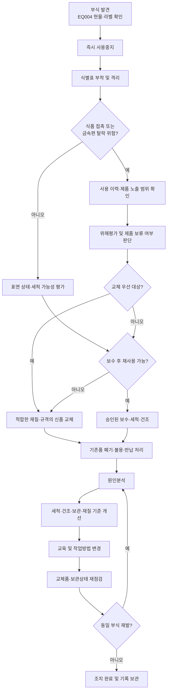

# [QA+ 블로그 생성 결과물] EQ004 부식도구 점검교체
생성일시: 2026-09-07 10:02:44 (KST)
적용모델: gpt-5.6-terra

================================================================================
# 📋 최종 발행용 블로그 패키지

### 1. 메타 데이터 (SEO 설정)

- **최종 포스팅 제목**: EQ004 부식도구 점검·교체 기록 관리법: HACCP 심사 지적을 예방하는 5단계
- **메타 디스크립션 (120자 내외 요약)**: EQ004 부식도구에서 녹·점부식·박리를 발견했을 때 사용중지, 격리, 위해평가, 교체, 재발방지까지 HACCP 심사 대응 기록관리 방법을 정리했습니다.
- **추천 해시태그 (10개)**:  
  #식품품질관리 #HACCP #식품안전 #이물관리 #설비점검 #도구관리 #부식관리 #위생관리 #FSSC22000 #식품공장
- **카테고리**: 식품품질실무 / HACCP 가이드 / 시설·도구 위생관리

> **사실관계 검수 반영 사항**
>
> - EQ004는 법령상 공통 코드가 아니라 사업장 내부 관리번호라는 점을 명확히 유지했습니다.
> - 「식품위생법」 제3조는 위해한 식품 등의 판매 금지 및 위해 방지와 관련된 조항이므로, 시설·기구의 위생관리 근거는 「식품위생법」 및 관련 시행규칙의 영업시설 기준, HACCP 인증기준, 사업장 자체 위생관리 기준을 함께 확인하는 방식으로 표현을 보완했습니다.
> - “식품공전의 기구·용기·포장 관련 기준”은 정확히 「기구 및 용기·포장의 기준 및 규격」을 의미하도록 수정했습니다.
> - ISO 22000:2018 8.2항의 PRP 관련 설명은 유지하되, 인증규격 적용 사업장은 최신 개정본 및 인증스킴 요구사항을 함께 확인하도록 보완했습니다.

---

## 2. 네이버 블로그 / 티스토리 복사용 최종 원고 (Markdown)

# EQ004 부식도구 점검부터 교체 기록까지: HACCP 심사에서 지적받지 않는 관리법

> **20년 실무 선배의 한 줄 요약**  
> EQ004에서 녹·점부식·박리 등을 발견했다면 “닦아서 쓸까?”부터 고민하지 마세요.  
> **사용중지 → 식별·격리 → 위해평가 → 교체 또는 승인된 보수 → 원인분석·재발방지 → 재검증** 순서로 움직이면 현장도 안전하고 심사 대응도 됩니다.

---

## 1. 녹슨 도구 하나가 왜 식품안전 문제가 될까요?

생산 전 점검 중 스패튤러, 집게, 칼, 이동식 용기, 공구함 안의 렌치에서 작은 녹 자국을 발견하는 일은 생각보다 흔합니다. 이때 현장에서는 “이 정도는 세척하면 괜찮다”는 의견과 “새것으로 바꾸자”는 의견이 부딪히곤 합니다.

그런데 HACCP 관점에서는 녹의 면적만 보는 것이 아니라, **그 도구가 어디에 쓰였고 식품과 접촉했는지, 금속편이 떨어질 가능성이 있는지, 정상 세척이 가능한지**를 함께 봐야 합니다.

부식은 단순한 외관상 노후 문제가 아닙니다. 녹이나 코팅 조각이 제품에 떨어지면 금속 이물이라는 물리적 위해로 이어질 수 있고, 표면이 거칠어진 틈에는 원료 찌꺼기와 수분이 남아 세척·소독 효과가 떨어질 수 있습니다.

쉽게 말하면 멀쩡한 스테인리스 표면은 매끈한 유리판에 가깝지만, 부식된 표면은 작은 구멍이 많은 스펀지처럼 오염물이 숨어들기 쉬워집니다.

특히 식품 직접 접촉 도구는 보수적으로 판단해야 합니다. 식품 접촉면의 점부식, 용접부 녹, 손잡이 연결부의 박리, 칼날의 균열은 작은 이상이라도 사용중지 대상으로 보는 것이 안전합니다.

반면 식품 비접촉 구역의 공구라고 해도 개방 제품 위쪽에서 사용하거나 작업자가 식품 접촉 도구와 함께 보관한다면 이물 혼입 가능성이 생기므로 단순히 “비접촉 공구니까 괜찮다”고 끝낼 수 없습니다.

EQ004는 법령에 정해진 공통 설비번호가 아니라, 대체로 사업장 내부의 설비·도구 관리번호입니다. 따라서 가장 먼저 할 일은 “EQ004가 정확히 무엇인지”를 관리대장, 현물 라벨, 사용 부서, 사용 공정과 맞춰 보는 것입니다.

심사에서 의외로 자주 나오는 지적이 **관리대장에는 EQ004가 스테인리스 국자로 되어 있는데, 현장에는 다른 도구가 걸려 있거나 라벨 자체가 없는 경우**입니다.

> ## 현장 판단 원칙
>
> 녹의 크기가 작다고 위해도까지 작은 것은 아닙니다.  
> **식품 접촉 여부, 표면 손상, 탈락 가능성, 세척 가능성, 반복 발생 여부**를 기준으로 판단하세요.


이제 “무조건 폐기해야 하나요?”라는 질문이 나옵니다.

결론부터 말씀드리면 모든 부식 도구를 법적으로 일률 폐기하라는 문구가 있는 것은 아닙니다. 하지만 식품 직접 접촉면에서 부식이나 박리가 확인되었다면, 현장 자체 기준상 **즉시 격리와 교체 우선 검토**로 관리하는 것이 가장 안전한 실무 방식입니다.

---

## 2. EQ004는 법정 코드가 아닙니다: 먼저 관리 대상부터 확정하세요

EQ004라는 번호만 보고 특정 도구라고 단정하면 안 됩니다. 어떤 공장은 EQ가 설비(Equipment) 번호이고, 어떤 공장은 이동식 기구·공구까지 EQ 번호로 관리합니다.

같은 EQ004라도 한 사업장에서는 반죽기 부속 스크래퍼일 수 있고, 다른 사업장에서는 세척용 이동 대차 또는 제품 이송 집게일 수 있습니다.

그래서 부식 발견 보고를 받을 때는 “EQ004 녹 발생” 한 줄로 끝내면 안 됩니다. 도구명, 사진, 재질, 규격, 사용 공정, 식품 접촉 여부를 붙여야 나중에 누가 보더라도 같은 대상을 추적할 수 있습니다.

쉽게 말하면 관리번호는 주민등록번호처럼 식별의 시작일 뿐이고, 실제 사람의 얼굴과 주소를 확인해야 혼동이 없습니다.

식품 직접 접촉 도구인지 여부는 가장 중요한 분기점입니다. 제품을 직접 젓는 스패튤러, 충전 노즐 분해용 핀셋, 원료 투입용 국자, 성형용 칼은 직접 접촉 도구로 분류해 엄격하게 봐야 합니다.

제품에 직접 닿지는 않지만 개방 제품 상부에서 사용하는 설비 조정 공구나 클램프도, 파편이 떨어질 경우 제품으로 유입될 수 있으므로 이물 위해 관점의 평가가 필요합니다.

현물 라벨도 꼭 확인하십시오. 세척을 반복하면서 라벨이 떨어졌거나, 교체 후 이전 EQ004 라벨을 새 도구에 부착하지 않은 상태가 생각보다 많습니다.

이런 상태에서는 점검자가 무엇을 점검했는지, 교체품이 정말 동일 관리 대상인지, 불용품이 다시 반입되지 않았는지 증명하기 어려워집니다.

| 확인 항목 | 반드시 확인할 내용 | 실무상 위험 |
|---|---|---|
| 관리번호 | EQ004 라벨과 관리대장 번호 일치 여부 | 다른 도구를 잘못 점검하거나 교체 이력 단절 |
| 도구명·규격 | 예: 스패튤러, 집게, 이송 대차, 렌치 등 | 교체품이 기존 용도에 부적합할 수 있음 |
| 재질 | SUS 304, SUS 316, 코팅 철재 등 실제 재질 | 세척제·염분 환경과 재질 부적합 |
| 사용 공정 | 원료, 가열 전, 충전, 포장, 세척 구역 등 | 제품 노출도와 위해도 판단 오류 |
| 식품 접촉 여부 | 직접 접촉·간접 접촉·비접촉 구분 | 교체 기준과 점검주기 설정 오류 |
| 세척·보관 방법 | 세척제, 농도, 건조 여부, 보관 위치 | 동일 부식의 반복 발생 |

관리 대상을 확정했다면 다음은 근거를 잡을 차례입니다. 법령과 HACCP 기준은 “녹슨 도구는 무조건 폐기” 같은 단순 답을 주기보다, 사업장이 위해를 예방할 수 있는 관리체계를 갖췄는지 봅니다.

그래서 자체 기준을 명확히 만드는 일이 중요합니다.

---

## 3. 법적 기준과 HACCP 관점: 핵심은 ‘교체’보다 ‘관리체계’입니다

식품을 취급하는 영업장은 관련 법령, 영업시설 기준 및 자체 위생관리 기준에 따라 시설·설비·기구를 청결하게 관리하고, 식품에 위해를 줄 우려가 있는 상태를 예방해야 합니다.

부식된 도구는 금속 이물, 세척 불량, 미생물 잔류 가능성과 연결될 수 있으므로 단순한 외관 문제가 아니라 식품안전 관리 대상입니다.

또한 「식품 및 축산물 안전관리인증기준」은 HACCP 적용업소가 영업장·시설·설비·기구 등을 위생적으로 관리하고, 위해요소 예방을 위한 모니터링, 개선조치, 검증 및 기록관리를 운영하도록 요구합니다.

여기서 심사관이 보는 것은 “신품으로 교체했는가” 하나만이 아닙니다.

**발견 기준이 있었는지, 누가 언제 판단했는지, 즉시조치가 되었는지, 동일 문제가 재발하지 않게 했는지**를 봅니다.

「기구 및 용기·포장의 기준 및 규격」 역시 식품과 접촉하는 기구가 식품에 유해한 영향을 줄 우려가 없어야 한다는 방향을 제시합니다.

부식이나 표면 박리로 금속편이 떨어질 우려가 있는 도구라면 식품 접촉 상황에서 이물 혼입 문제로 이어질 수 있습니다. 따라서 신품으로 바꿀 때도 단순히 “비슷하게 생긴 제품”을 구매할 것이 아니라 식품 접촉 적합성, 세척성, 내식성, 표면 마감 상태를 확인해야 합니다.

FSSC 22000 또는 ISO 22000을 운영하는 사업장이라면 PRP, 즉 선행요건프로그램 관점도 함께 봐야 합니다. ISO 22000:2018의 8.2항은 시설·설비·세척·유지보수 등 식품안전 위해를 예방하기 위한 PRP 운영을 요구합니다.

즉, HACCP CCP만 잘 관리한다고 끝나는 것이 아니라 녹슬지 않는 보관과 세척, 적절한 재질 선정 같은 기본 위생관리가 받쳐줘야 한다는 뜻입니다.

| 관리 구분 | 즉시 사용중지·격리 우선 | 평가 후 제한적 보수·재사용 검토 가능 |
|---|---|---|
| 식품 직접 접촉면 | 녹, 점부식, 박리, 균열, 금속 가루 발생 | 원칙적으로 매우 보수적으로 판단 |
| 용접부·나사부·연결부 | 부식 진행, 흔들림, 탈락·파손 우려 | 표면 손상 없이 보수 가능하고 QA 승인 시 |
| 비접촉 공구 | 개방 제품 상부 사용, 금속편 탈락 우려 | 경미한 표면 변색, 제품 노출 가능성 없음 |
| 세척 후 상태 | 붉은 녹물·가루·거친 표면 잔존 | 표면 복원 및 세척성 확인 완료 시 |
| 반복 발생 | 동일 위치·동일 재질에서 재발 | 원인 제거와 재점검 계획 수립 시 |

다만 위 표의 기준은 법령에 정해진 허용 면적이나 의무 교체주기가 아닙니다. 각 사업장의 HACCP 관리계획서, SSOP, 이물관리 절차서, 시설·도구 점검기준을 우선 적용해야 합니다.

게시 또는 문서 개정 전에는 국가법령정보센터와 식품안전나라에서 현행 법령과 최신 고시 내용을 반드시 확인하세요.

- 국가법령정보센터: https://www.law.go.kr
- 식품안전나라: https://www.foodsafetykorea.go.kr

---

## 4. 부식 발견부터 교체까지: 현장에서 바로 쓰는 5단계



### 1단계. 발견 즉시 사용중지·식별·격리합니다

부식이 의심되는 EQ004는 현장에 그대로 두면 안 됩니다. 작업자가 “조금 닦아 보고 다시 쓰자”고 판단할 여지를 주기 때문입니다.

**사용금지, 부적합품, 교체대기** 등의 식별표를 부착하고, 지정된 부적합품 보관함 또는 격리구역으로 옮기세요.

생산이 바쁜 시간에는 대체 도구를 함께 지급해야 합니다. 대체품이 없으면 작업자는 어쩔 수 없이 기존 도구를 다시 쓰게 되고, 좋은 절차서도 현장에서 작동하지 않습니다.

### 2단계. 제품 위해 범위를 확인합니다

도구가 언제 마지막으로 사용됐는지, 어느 제품에 사용됐는지, 개방 공정이었는지를 확인합니다.

금속 가루나 박리가 실제로 발생했거나 이물 혼입 정황이 있으면, 해당 시간대 생산품의 보류·선별·금속검출기 확인 등은 사업장 이물관리 절차에 따라 판단해야 합니다.

단순 녹 발견만으로 모든 제품을 무조건 폐기한다는 뜻은 아니지만, 영향평가 없이 넘기는 것도 위험합니다.

사진은 최소 두 장을 남기면 좋습니다.

- EQ004 라벨과 도구 전체가 함께 보이는 사진
- 녹·점부식·박리 부위를 근접 촬영한 사진

사진 파일명에는 날짜와 관리번호를 넣어 두면 심사나 클레임 조사 때 찾기가 편합니다.

### 3단계. ‘세척 후 재사용’과 ‘교체’를 판정합니다

식품 접촉면에서 녹, 점부식, 표면 벗겨짐, 균열, 금속 가루 발생이 확인되면 교체를 우선 검토하십시오.

특히 용접부와 절단면은 겉으로 작은 점처럼 보여도 내부로 진행될 수 있어 주의해야 합니다. 세척 후에도 표면이 거칠거나 변색이 반복된다면 위생적으로 관리 가능한 상태라고 보기 어렵습니다.

비접촉 공구의 경미한 부식은 적절한 표면 보수 후 제한적으로 재사용을 검토할 수 있습니다. 단, 공업용 녹 제거제를 임의로 사용해서는 안 됩니다.

화학물질 잔류 가능성, 표면 추가 손상, 식품구역 반입 부적합 문제가 생길 수 있으므로 QA 또는 지정 책임자의 승인과 확인이 필요합니다.

### 4단계. 교체 이력은 ‘교체함’이 아니라 ‘왜·어떻게’로 씁니다

좋지 않은 기록은 아래와 같습니다.

> “EQ004 녹 발생, 교체함.”

이 기록만으로는 식품에 닿았는지, 언제 사용을 멈췄는지, 기존품이 폐기됐는지, 재발 원인이 무엇인지 알 수 없습니다.

좋은 기록은 사실에 근거하여 구체적으로 작성합니다.

> **기록 예시**  
> “2026. 9. 7. 생산 전 점검 중 EQ004(스테인리스 스패튤러)의 식품 접촉면 용접부에서 점부식과 갈색 변색을 확인하였다. 금속 이물 혼입 및 세척 불량 가능성을 고려하여 08:40 즉시 사용중지 후 부적합품 보관함에 격리하였다. 동일 규격의 신품으로 교체하고 기존품은 불용 처리하였다. 조사 결과 세척 후 물기 제거 없이 적재한 사실을 확인하여 건조대 보관 기준을 재교육하였다. 1주 후 QA가 교체품 상태와 보관 상태를 재점검하기로 하였다.”

단, 예시 문구를 실제 사실 확인 없이 복사해 기록하면 안 됩니다. 날짜, 이상 위치, 조치 시간, 원인, 확인자는 실제 현장 상황과 일치해야 합니다.

HACCP 기록은 잘 쓰는 글이 아니라, 실제 관리가 일어났다는 증거입니다.

### 5단계. 재발 원인을 제거하고 검증합니다

부식은 대개 도구 하나만의 문제가 아닙니다.

- 세척 후 젖은 상태로 포개어 둔 보관 방식
- 고농도 염소계 세척·소독제
- 철 수세미 사용
- 염분 또는 산성 원료와의 장시간 접촉
- 바닥 가까운 습윤 보관
- 공정 환경과 맞지 않는 재질 선정

개선 후에는 최소 1주일 또는 해당 도구의 사용 빈도에 맞춘 재점검 일정을 정하세요.

매일 사용하는 직접 접촉 스패튤러라면 작업 전·후 육안점검을 지속하고, 1주 후 QA가 보관 상태와 재발 여부를 별도로 검증할 수 있습니다.

“교육 실시”로 끝내지 말고 실제로 물기 제거와 건조 보관이 지켜지는지 확인해야 개선조치가 완성됩니다.


---

## 5. 실제 현장 사례로 보는 적용법

### 사례 1. 냉동만두 제조공장의 성형 공정 스테인리스 스패튤러

냉동만두 제조공장의 성형라인에서 작업 전 점검 중 EQ004로 관리하던 스테인리스 스패튤러 손잡이 연결 용접부에 갈색 점부식이 발견되었습니다.

작업자는 식품이 닿는 날 부분은 멀쩡하다며 세척 후 사용을 요청했지만, 해당 도구는 만두소와 피를 정리하는 과정에서 손잡이 연결부까지 원료가 묻는 구조였습니다.

QA는 즉시 사용중지 표찰을 부착하고 대체 스패튤러를 지급한 뒤 기존 도구를 격리했습니다. 표면을 마른 흰 천으로 문지르자 미세한 갈색 가루가 확인되어 단순 변색이 아닌 실제 부식 가능성이 높다고 판단했습니다.

원인 분석 결과, 야간 세척 후 스패튤러를 여러 개 포개어 물받이 통에 넣어 두었고 아침까지 용접부에 수분이 고여 있었습니다.

또한 일부 작업자가 철 수세미로 만두소 잔류물을 제거하면서 표면에 미세한 흠집을 만든 사실도 확인되었습니다.

공장은 기존품을 폐기하고 신품 교체와 함께 개별 걸이형 건조대를 설치했습니다. 철 수세미는 식품 접촉 도구 세척구역에서 제거하고 전용 비금속 브러시로 교체했습니다.

이후 2주간 작업 전·후 점검 결과 동일 부위의 부식 재발은 없었고, 월간 시설·도구 점검표에 “건조 상태” 항목을 추가해 관리했습니다.

### 사례 2. 액상 소스 제조공장의 염분 원료 투입용 국자

액상 소스 제조공장에서는 고염도 간장 베이스 원료를 계량할 때 스테인리스 국자를 사용하고 있었습니다.

작업 후 국자를 세척했지만 한 달 사이에 국자 가장자리와 손잡이 리벳 부위에서 반복적으로 갈색 변색이 발생했습니다. 처음에는 세척 불량으로 보고 세척 횟수만 늘렸지만 며칠 후 다시 같은 부위에 점부식이 나타났습니다.

스테인리스도 염분 환경과 장시간 습윤 상태에서는 부식될 수 있습니다.

조사 결과 작업자들이 소스 원료 투입 후 국자를 물에 담가 두었다가 세척 종료 시점에 한꺼번에 세척하고 있었습니다.

염분이 묻은 상태로 수분에 장시간 노출된 것이 주된 원인이었고, 세척 후에도 건조하지 않은 채 밀폐 용기에 넣은 점이 문제를 키웠습니다.

QA는 해당 국자를 식품 직접 접촉 도구 부적합으로 분류해 교체하고, 원료 투입 직후 1차 헹굼을 하도록 작업순서를 바꿨습니다.

또한 공정 환경과 사용 목적을 검토해 내식성이 더 적합한 재질 사양을 구매부서와 협의했습니다.

변경 후에는 “사용 후 방치시간 30분 이내 1차 세척”과 “완전 건조 후 보관” 기준을 세웠고, 4주간 재점검에서 점부식 재발이 크게 줄었습니다.

### 사례 3. 레토르트 식품 공장의 충전기 주변 정비 공구

레토르트 죽 제품을 생산하는 공장에서는 충전기 주변에 일반 철재 육각렌치가 비치되어 있었습니다.

이 공구는 원칙상 식품 비접촉 공구였지만 개방된 충전 호퍼 주변에서 긴급 조정할 때 사용되고 있었습니다.

정기점검 중 렌치 표면의 도장이 벗겨지고 붉은 녹이 넓게 퍼진 상태가 발견되었습니다. 현장에서는 “제품에 직접 닿지 않는다”며 계속 사용하려 했지만, 도장 조각이나 녹 조각이 개방 제품 구역으로 떨어질 위험을 무시할 수 없었습니다.

QA는 렌치를 즉시 회수하고 해당 시간대 작업 중 제품 상부에서 공구 사용이 있었는지 확인했습니다.

다행히 도구 파손이나 조각 탈락 정황은 없었지만 공구 반입·반출 기록이 없어 정확한 사용 시점을 확인하는 데 어려움이 있었습니다.

근본 원인은 습도가 높은 충전실 안에 일반 철재 공구를 상시 보관한 것과 식품구역 반입 공구 기준이 없었던 것이었습니다.

공장은 부식 공구를 폐기하고 식품구역 전용 스테인리스 공구 세트와 공구 그림자 보드(Shadow Board)를 설치했습니다.

이후 공구별 반입·반출 점검표와 월 1회 상태점검을 운영했고, 개방 제품 구역에서는 공구 수량 확인까지 하도록 절차를 강화했습니다.

이 조치 이후 심사에서도 단순 교체가 아니라 이물 예방체계를 갖춘 개선사례로 설명할 수 있었습니다.

---

## 6. HACCP 심사관이 보는 것은 ‘현장과 기록의 일치’입니다

심사 전날 점검표를 정리하면서 매일 “이상 없음”으로 작성된 기록을 발견하는 경우가 있습니다.

그런데 현장에는 녹슨 집게가 있고 작업자는 “지난주부터 그랬다”고 말한다면 기록 신뢰성 문제가 생깁니다.

심사관 입장에서는 부식 자체보다도 **이상이 있었는데 발견하지 못했거나, 발견하고도 기록하지 않았을 가능성**을 더 크게 볼 수 있습니다.

부적합이 발생했을 때는 최소한 아래 내용을 남기세요.

- 발견일시
- 발견자
- 관리번호 및 도구명
- 이상 부위와 이상 유형
- 식품 접촉 여부
- 즉시조치 및 격리 위치
- 위해평가 결과
- 판정자
- 최종 처리 결과
- 대체품 지급 여부
- 불용품 폐기·반납·용도전환 결과
- 원인분석과 재발방지 조치
- 효과검증 결과

심사 때는 길게 설명하기보다 흐름이 명확해야 합니다.

> ## 심사 대응 한마디 예시
>
> “EQ004는 식품 접촉 스패튤러입니다. 작업 전 점검에서 용접부 점부식을 발견해 즉시 격리했고, 신품 교체 후 습윤 보관을 원인으로 확인했습니다. 현재는 개별 건조대와 작업 전·후 점검으로 관리하며, QA가 교체 후 재발 여부를 검증했습니다.”

---

## 7. 자주 묻는 질문(FAQ)

### Q1. 녹이 아주 작은 점 하나인데도 교체해야 하나요?

**A.** 녹의 크기만으로 결정하면 안 됩니다. 식품 직접 접촉면인지, 닦을 때 가루가 묻어나는지, 표면이 거칠어졌는지, 용접부·절단면처럼 진행성 부식이 우려되는 부위인지 함께 판단해야 합니다.

특히 식품 직접 접촉면의 점부식은 재발 가능성과 세척성 저하를 고려해 교체 우선으로 보는 것이 안전합니다.

### Q2. 녹 제거제를 사용하고 다시 써도 되나요?

**A.** 임의의 공업용 녹 제거제 사용은 권장하지 않습니다. 해당 제품이 식품제조시설 사용 환경에 적합한지, 충분한 헹굼과 건조가 가능한지, 표면 손상이 남지 않는지를 사전에 확인해야 합니다.

식품 직접 접촉 도구라면 녹 제거 후 재사용보다 신품 교체가 더 적절한 경우가 많습니다.

### Q3. 스테인리스 도구도 정말 녹이 슬 수 있나요?

**A.** 네, 가능합니다. 염소계 약품의 과다 사용, 염분·산성 원료 접촉, 철 수세미 사용에 따른 스크래치, 철분 오염, 장시간 습윤 보관 환경에서는 점부식이나 변색이 발생할 수 있습니다.

“스테인리스니까 절대 녹슬지 않는다”는 생각보다 공정 환경에 맞게 세척·건조·보관하는 것이 중요합니다.

### Q4. 점검 주기는 무조건 매일 해야 하나요?

**A.** 법령이 모든 도구에 동일한 일일 점검주기를 정하는 것은 아닙니다. 다만 식품 직접 접촉 도구는 작업 전·후 육안점검을 기본으로 두고, 사용 빈도가 낮은 비접촉 공구는 주간 또는 월간 점검을 추가하는 식으로 위험도에 맞춰 정하는 것이 실무적입니다.

과거 부식 이력이 있다면 일정 기간 점검주기를 강화하는 방법도 좋습니다.

### Q5. 교체한 기존 도구는 창고에 보관해도 되나요?

**A.** 그냥 보관하면 안 됩니다. 현장에서 다시 꺼내 쓸 가능성이 있으므로 폐기, 불용 처리, 반납 또는 식품구역 외 용도전환 중 하나를 명확히 하고 기록을 남겨야 합니다.

식품 접촉 도구로 부적합 판정을 받았다면 다시 식품 접촉 구역으로 반입되지 않도록 물리적으로 분리하는 것이 기본입니다.

### Q6. 교체품은 같은 모양이면 아무 제품이나 구매해도 되나요?

**A.** 아닙니다. 기존 도구의 규격뿐 아니라 식품 접촉 적합성, 재질, 표면 마감, 세척 가능성, 공정의 염분·산성 조건을 확인해야 합니다.

특히 부식이 반복된 경우라면 동일 사양을 반복 구매하기보다 재질 또는 구조 변경 필요성을 검토해야 합니다.

### Q7. 부식이 발견된 도구가 사용된 제품은 전부 폐기해야 하나요?

**A.** 무조건 전량 폐기라고 단정할 수는 없으며, 사업장 이물관리 및 부적합품 관리절차에 따라 위해평가해야 합니다.

금속편 탈락 여부, 실제 사용 시점, 제품 노출 여부, 금속검출기 관리 상태, 선별 가능성 등을 근거로 보류·검사·출고판정을 결정해야 합니다.

중요한 것은 “문제가 없었을 것”이라고 추정하지 말고 판단 근거를 기록으로 남기는 것입니다.

---

## 8. EQ004 부식도구 점검·교체 체크리스트

아래 표는 식품 직접 접촉 도구를 기준으로 비교적 보수적으로 구성한 예시입니다. 실제 적용 시에는 귀사의 제품 특성, 공정 위험도, 자체 HACCP 관리기준에 맞춰 점검주기와 승인권자를 조정하세요.

| 단계 | 점검·조치 항목 | 권장 기준 및 확인 방법 | 기록 책임자 |
|---|---|---|---|
| 관리대상 확인 | EQ004 현물·라벨·대장 일치 | 관리번호, 도구명, 재질, 사용공정, 사진 확인 | QA / 현장관리자 |
| 작업 전 점검 | 녹, 점부식, 박리, 균열, 변형 확인 | 전체 외관 및 용접부·나사부·절단면 육안점검 | 작업자 |
| 작업 후 점검 | 세척 상태와 표면 손상 확인 | 잔류물, 거친 표면, 붉은 녹물·가루 확인 | 작업자 |
| 부적합 발견 | 사용중지 및 격리 | 사용금지 표찰 부착, 부적합품 보관함 이동 | 발견자 / 반장 |
| 위해평가 | 식품 접촉·이물 위험·사용 이력 확인 | 사용 시점, 제품 노출, 금속편 탈락 가능성 검토 | QA |
| 조치 판정 | 교체·보수·폐기 여부 결정 | 직접 접촉면 부식·박리·균열은 교체 우선 검토 | QA / 승인권자 |
| 교체품 확인 | 재질·규격·세척성 확인 | 신품 외관, 라벨 부착, 식품 접촉 적합성 확인 | QA / 구매 |
| 원인분석 | 세척·보관·재질·환경 조사 | 습윤 보관, 세척제 농도, 철 수세미, 염분 노출 확인 | QA / 생산 |
| 재발방지 | 교육·설비·보관기준 개선 | 건조대 설치, 세척도구 변경, 재질 변경 등 | 생산 / QA |
| 효과검증 | 교체 후 재점검 | 1주 또는 위험도에 맞춘 기간 후 재발 여부 확인 | QA |

점검표에는 단순히 “양호/불량”만 두기보다 이상 유형을 선택할 수 있게 만들면 좋습니다.

`녹 / 점부식 / 박리 / 균열 / 변형 / 세척불량 / 라벨누락`

같은 “불량”이라도 원인이 다르면 개선책도 달라지기 때문입니다.

> ## 월간 검토 때 꼭 볼 숫자
>
> - EQ004 포함 도구별 부식 발생 건수  
> - 동일 부위 반복 발생 건수  
> - 세척·보관 관련 원인 비율  
> - 교체 후 1개월 내 재발 건수  
> - 작업자 교육 후 점검 부적합 감소 여부  

---

## 9. 재발을 막는 교육과 보관 관리: 녹은 세척실에서 시작되는 경우가 많습니다

부식 예방의 첫 번째는 세척 후 건조입니다. 물기가 남은 도구를 포개어 쌓거나, 물받이 통에 담아 두거나, 바닥 가까운 습한 공간에 보관하면 부식 가능성이 높아집니다.

도구는 가능하면 서로 닿지 않게 걸어서 건조하고, 바닥에서 일정 높이 이상 띄운 전용 보관대에 두는 것이 좋습니다.

두 번째는 세척도구의 구분입니다. 철 수세미, 일반 금속 브러시, 심하게 마모된 연마재는 스테인리스 표면에 흠집을 내고 철분을 남길 수 있습니다.

식품 접촉 도구에는 전용 비금속 브러시나 관리된 세척도구를 사용하고, 세척도구 자체도 정기적으로 교체해야 합니다.

세 번째는 세척·소독제 관리입니다. 염소계 세척·소독제를 사용하는 사업장은 농도, 접촉시간, 헹굼 기준을 내부 절차에 따라 관리해야 합니다.

농도가 높거나 접촉시간이 길다고 무조건 더 깨끗해지는 것이 아니라 재질 손상과 부식 위험을 높일 수 있습니다. 약품 제조사 사용설명서와 사업장 SSOP 기준을 함께 확인하는 습관이 필요합니다.

마지막은 작업자가 이상을 숨기지 않도록 만드는 분위기입니다.

녹을 발견한 작업자에게 “왜 이제 발견했느냐”고 먼저 질책하면 다음에는 발견해도 보고하지 않게 됩니다.

“잘 발견했다, 이제 격리하고 대체품 받자”라는 문화가 잡혀야 작은 이상이 제품 문제로 커지기 전에 멈출 수 있습니다.

---

## 10. 맺음말: EQ004 관리의 핵심은 발견-격리-판정-교체-재발방지입니다

오늘 내용은 아래 세 줄로 기억하시면 됩니다.

1. **EQ004가 무엇인지, 식품과 직접 접촉하는지부터 정확히 확인합니다.**
2. **부식을 발견하면 현장에 두지 말고 즉시 사용중지·식별·격리합니다.**
3. **교체했다는 기록에서 끝내지 말고, 발생 원인과 재발방지·검증 결과까지 남깁니다.**

도구 하나의 작은 녹 자국은 사소해 보일 수 있습니다. 하지만 식품공장에서는 그 작은 이상을 발견하고 멈추는 사람이 소비자 안전과 공장의 신뢰를 지킵니다.

EQ004 교체 기록 한 줄도 원인과 검증까지 남기면 단순 서류가 아니라 현장을 지키는 HACCP 관리의 증거가 됩니다.

---

## 3. 워드프레스 / 웹사이트용 HTML 원고

```html
<article class="food-qa-post">
  <header>
    <h1>EQ004 부식도구 점검부터 교체 기록까지: HACCP 심사에서 지적받지 않는 관리법</h1>
    <p><strong>20년 실무 선배의 한 줄 요약:</strong> EQ004에서 녹·점부식·박리 등을 발견했다면 “닦아서 쓸까?”부터 고민하지 마세요. <strong>사용중지 → 식별·격리 → 위해평가 → 교체 또는 승인된 보수 → 원인분석·재발방지 → 재검증</strong> 순서로 움직이면 현장도 안전하고 심사 대응도 됩니다.</p>
  </header>

  <section>
    <h2>1. 녹슨 도구 하나가 왜 식품안전 문제가 될까요?</h2>
    <p>생산 전 점검 중 스패튤러, 집게, 칼, 이동식 용기, 공구함 안의 렌치에서 작은 녹 자국을 발견하는 일은 생각보다 흔합니다. HACCP 관점에서는 녹의 면적만 보는 것이 아니라, <strong>도구의 사용 위치, 식품 접촉 여부, 금속편 탈락 가능성, 정상 세척 가능 여부</strong>를 함께 판단해야 합니다.</p>
    <p>부식은 단순한 외관상 노후 문제가 아닙니다. 녹이나 코팅 조각이 제품에 떨어지면 금속 이물이라는 물리적 위해로 이어질 수 있고, 표면이 거칠어진 틈에는 원료 찌꺼기와 수분이 남아 세척·소독 효과가 떨어질 수 있습니다.</p>
    <blockquote>
      <p><strong>현장 판단 원칙</strong><br>녹의 크기가 작다고 위해도까지 작은 것은 아닙니다. <strong>식품 접촉 여부, 표면 손상, 탈락 가능성, 세척 가능성, 반복 발생 여부</strong>를 기준으로 판단하세요.</p>
    </blockquote>
    <figure>
      
      <figcaption>부식된 표면은 금속 이물 탈락과 세척 사각지대 발생 가능성을 함께 평가해야 합니다.</figcaption>
    </figure>
    <p>EQ004는 법령상 공통 설비번호가 아니라 사업장 내부의 설비·도구 관리번호입니다. 관리대장, 현물 라벨, 사용 부서, 사용 공정을 대조해 정확한 관리 대상을 먼저 확정해야 합니다.</p>
  </section>

  <section>
    <h2>2. EQ004는 법정 코드가 아닙니다: 먼저 관리 대상부터 확정하세요</h2>
    <p>EQ004라는 번호만 보고 특정 도구라고 단정하면 안 됩니다. 사업장에 따라 설비번호일 수도 있고, 이동식 기구·공구 관리번호일 수도 있습니다.</p>
    <table>
      <thead>
        <tr>
          <th>확인 항목</th>
          <th>반드시 확인할 내용</th>
          <th>실무상 위험</th>
        </tr>
      </thead>
      <tbody>
        <tr><td>관리번호</td><td>EQ004 라벨과 관리대장 번호 일치 여부</td><td>다른 도구를 잘못 점검하거나 교체 이력 단절</td></tr>
        <tr><td>도구명·규격</td><td>스패튤러, 집게, 이송 대차, 렌치 등</td><td>교체품이 기존 용도에 부적합할 수 있음</td></tr>
        <tr><td>재질</td><td>SUS 304, SUS 316, 코팅 철재 등 실제 재질</td><td>세척제·염분 환경과 재질 부적합</td></tr>
        <tr><td>사용 공정</td><td>원료, 가열 전, 충전, 포장, 세척 구역 등</td><td>제품 노출도와 위해도 판단 오류</td></tr>
        <tr><td>식품 접촉 여부</td><td>직접 접촉·간접 접촉·비접촉 구분</td><td>교체 기준과 점검주기 설정 오류</td></tr>
        <tr><td>세척·보관 방법</td><td>세척제, 농도, 건조 여부, 보관 위치</td><td>동일 부식의 반복 발생</td></tr>
      </tbody>
    </table>
  </section>

  <section>
    <h2>3. 법적 기준과 HACCP 관점: 핵심은 ‘교체’보다 ‘관리체계’입니다</h2>
    <p>식품 취급 영업장은 관련 법령, 영업시설 기준 및 자체 위생관리 기준에 따라 시설·설비·기구를 청결하게 관리하고 식품에 위해를 줄 우려가 있는 상태를 예방해야 합니다.</p>
    <p>「식품 및 축산물 안전관리인증기준」의 관점에서 심사관이 보는 것은 단순히 신품으로 교체했는지가 아닙니다. <strong>발견 기준, 즉시조치, 판단 근거, 재발방지, 검증 및 기록의 일치 여부</strong>를 확인합니다.</p>
    <p>식품과 접촉하는 기구는 「기구 및 용기·포장의 기준 및 규격」과 사업장 기준에 따라 식품에 유해한 영향을 줄 우려가 없도록 관리해야 합니다. 부식이나 박리로 금속편이 떨어질 우려가 있다면 식품 접촉 적합성, 세척성, 내식성, 표면 마감 상태를 확인해야 합니다.</p>
  </section>

  <section>
    <h2>4. 부식 발견부터 교체까지: 현장에서 바로 쓰는 5단계</h2>
    <figure>
      
      <figcaption>부식 발견 후에는 사용중지, 격리, 위해평가, 교체·보수 판정, 원인분석 및 재검증까지 연결해야 합니다.</figcaption>
    </figure>

    <h3>1단계. 발견 즉시 사용중지·식별·격리합니다</h3>
    <p>부식이 의심되는 EQ004는 현장에 그대로 두지 말고 사용금지, 부적합품, 교체대기 등의 식별표를 부착한 뒤 지정된 격리구역으로 옮깁니다. 생산 중에는 대체 도구 지급 여부까지 확인해야 합니다.</p>

    <h3>2단계. 제품 위해 범위를 확인합니다</h3>
    <p>도구의 마지막 사용 시점, 사용 제품, 개방 공정 여부, 금속 가루 또는 박리 발생 정황을 확인합니다. 필요 시 사업장 이물관리 절차에 따라 제품 보류, 선별, 금속검출기 확인 등을 판단합니다.</p>

    <h3>3단계. 세척 후 재사용과 교체를 판정합니다</h3>
    <p>식품 접촉면에서 녹, 점부식, 표면 벗겨짐, 균열, 금속 가루가 확인되면 교체를 우선 검토합니다. 비접촉 공구의 경미한 부식도 임의 보수하지 말고 QA 또는 지정 책임자의 승인 후 제한적으로 판단해야 합니다.</p>

    <h3>4단계. 교체 이력은 ‘왜·어떻게’로 기록합니다</h3>
    <blockquote>
      <p><strong>기록 예시</strong><br>“2026. 9. 7. 생산 전 점검 중 EQ004(스테인리스 스패튤러)의 식품 접촉면 용접부에서 점부식과 갈색 변색을 확인하였다. 금속 이물 혼입 및 세척 불량 가능성을 고려하여 08:40 즉시 사용중지 후 부적합품 보관함에 격리하였다. 동일 규격의 신품으로 교체하고 기존품은 불용 처리하였다. 조사 결과 세척 후 물기 제거 없이 적재한 사실을 확인하여 건조대 보관 기준을 재교육하였다. 1주 후 QA가 교체품 상태와 보관 상태를 재점검하기로 하였다.”</p>
    </blockquote>

    <h3>5단계. 재발 원인을 제거하고 검증합니다</h3>
    <p>습윤 보관, 철 수세미 사용, 고농도 염소계 약품, 염분·산성 원료 장시간 접촉, 재질 부적합 여부를 조사합니다. 개선 후에는 1주 또는 위험도에 맞춘 주기로 교체품과 보관 상태를 재점검해야 합니다.</p>
  </section>

  <section>
    <h2>5. 실제 현장 사례로 보는 적용법</h2>
    <h3>사례 1. 냉동만두 제조공장의 성형 공정 스테인리스 스패튤러</h3>
    <p>손잡이 연결 용접부에서 갈색 점부식이 발견된 EQ004 스패튤러를 즉시 격리하고 대체품을 지급했습니다. 조사 결과 야간 세척 후 도구를 포개어 물받이 통에 보관해 용접부에 수분이 고였고, 철 수세미 사용으로 미세한 표면 손상이 발생한 사실을 확인했습니다. 기존품 폐기, 개별 걸이형 건조대 설치, 비금속 브러시 교체 후 2주간 재발 여부를 확인했습니다.</p>

    <h3>사례 2. 액상 소스 제조공장의 염분 원료 투입용 국자</h3>
    <p>고염도 원료 투입용 국자의 가장자리와 리벳 부위에서 반복 점부식이 발생했습니다. 원료 투입 후 국자를 물에 장시간 담가 두고, 세척 후 미건조 상태로 밀폐 보관한 것이 원인이었습니다. 국자를 교체하고 사용 후 30분 이내 1차 세척, 완전 건조 후 보관 기준을 적용했습니다.</p>

    <h3>사례 3. 레토르트 식품 공장의 충전기 주변 정비 공구</h3>
    <p>개방 호퍼 주변에 보관된 일반 철재 육각렌치에서 도장 박리와 광범위한 녹이 확인되었습니다. 식품 비접촉 공구였지만 제품 상부 사용 가능성이 있어 이물 위해로 평가했습니다. 이후 식품구역 전용 스테인리스 공구 세트, 그림자 보드, 공구 반입·반출 기록 및 수량 확인 절차를 도입했습니다.</p>
  </section>

  <section>
    <h2>6. HACCP 심사관이 보는 것은 ‘현장과 기록의 일치’입니다</h2>
    <p>점검표에는 매일 이상 없음으로 기록되어 있는데 현장에 녹슨 도구가 있다면 부식 자체보다 기록 신뢰성 문제가 더 크게 지적될 수 있습니다.</p>
    <p>부적합 기록에는 발견일시, 발견자, 이상 부위, 식품 접촉 여부, 즉시조치, 위해평가, 판정자, 최종 처리 결과, 원인분석, 재발방지 및 효과검증 결과를 남기세요.</p>
    <blockquote>
      <p><strong>심사 대응 한마디 예시</strong><br>“EQ004는 식품 접촉 스패튤러입니다. 작업 전 점검에서 용접부 점부식을 발견해 즉시 격리했고, 신품 교체 후 습윤 보관을 원인으로 확인했습니다. 현재는 개별 건조대와 작업 전·후 점검으로 관리하며, QA가 교체 후 재발 여부를 검증했습니다.”</p>
    </blockquote>
  </section>

  <section>
    <h2>7. 자주 묻는 질문(FAQ)</h2>
    <h3>Q1. 녹이 아주 작은 점 하나인데도 교체해야 하나요?</h3>
    <p><strong>A.</strong> 녹의 크기만으로 결정하면 안 됩니다. 식품 직접 접촉면인지, 가루가 묻어나는지, 표면이 거친지, 용접부·절단면인지, 반복 발생하는지 함께 판단해야 합니다.</p>

    <h3>Q2. 녹 제거제를 사용하고 다시 써도 되나요?</h3>
    <p><strong>A.</strong> 임의의 공업용 녹 제거제 사용은 권장하지 않습니다. 식품제조시설 사용 적합성, 헹굼·건조 가능성, 표면 손상 여부를 확인해야 하며, 식품 직접 접촉 도구는 신품 교체가 더 적절한 경우가 많습니다.</p>

    <h3>Q3. 스테인리스 도구도 녹이 슬 수 있나요?</h3>
    <p><strong>A.</strong> 가능합니다. 염소계 약품 과다 사용, 염분·산성 원료 접촉, 철 수세미 사용, 철분 오염, 장시간 습윤 보관 환경에서는 점부식이나 변색이 발생할 수 있습니다.</p>

    <h3>Q4. 점검 주기는 무조건 매일 해야 하나요?</h3>
    <p><strong>A.</strong> 모든 도구에 같은 법정 일일 점검주기가 적용되는 것은 아닙니다. 식품 직접 접촉 도구는 작업 전·후 육안점검을 기본으로 하고, 비접촉 공구는 위험도에 따라 주간 또는 월간 점검을 설정할 수 있습니다.</p>

    <h3>Q5. 교체한 기존 도구는 창고에 보관해도 되나요?</h3>
    <p><strong>A.</strong> 무단 보관하면 재사용될 수 있습니다. 폐기, 불용 처리, 반납 또는 식품구역 외 용도전환 중 하나를 명확히 하고 기록해야 합니다.</p>

    <h3>Q6. 교체품은 같은 모양이면 아무 제품이나 구매해도 되나요?</h3>
    <p><strong>A.</strong> 아닙니다. 규격뿐 아니라 식품 접촉 적합성, 재질, 표면 마감, 세척 가능성, 염분·산성 환경 적합성을 확인해야 합니다.</p>

    <h3>Q7. 부식이 발견된 도구가 사용된 제품은 전부 폐기해야 하나요?</h3>
    <p><strong>A.</strong> 무조건 전량 폐기라고 단정할 수는 없습니다. 금속편 탈락 여부, 사용 시점, 제품 노출 여부, 금속검출기 관리 상태, 선별 가능성 등을 근거로 사업장 절차에 따라 보류·검사·출고판정을 결정해야 합니다.</p>
  </section>

  <section>
    <h2>8. EQ004 부식도구 점검·교체 체크리스트</h2>
    <table>
      <thead>
        <tr>
          <th>단계</th>
          <th>점검·조치 항목</th>
          <th>권장 기준 및 확인 방법</th>
          <th>기록 책임자</th>
        </tr>
      </thead>
      <tbody>
        <tr><td>관리대상 확인</td><td>EQ004 현물·라벨·대장 일치</td><td>관리번호, 도구명, 재질, 사용공정, 사진 확인</td><td>QA / 현장관리자</td></tr>
        <tr><td>작업 전 점검</td><td>녹, 점부식, 박리, 균열, 변형 확인</td><td>전체 외관 및 용접부·나사부·절단면 육안점검</td><td>작업자</td></tr>
        <tr><td>작업 후 점검</td><td>세척 상태와 표면 손상 확인</td><td>잔류물, 거친 표면, 붉은 녹물·가루 확인</td><td>작업자</td></tr>
        <tr><td>부적합 발견</td><td>사용중지 및 격리</td><td>사용금지 표찰 부착, 부적합품 보관함 이동</td><td>발견자 / 반장</td></tr>
        <tr><td>위해평가</td><td>식품 접촉·이물 위험·사용 이력 확인</td><td>사용 시점, 제품 노출, 금속편 탈락 가능성 검토</td><td>QA</td></tr>
        <tr><td>조치 판정</td><td>교체·보수·폐기 여부 결정</td><td>직접 접촉면 부식·박리·균열은 교체 우선 검토</td><td>QA / 승인권자</td></tr>
        <tr><td>교체품 확인</td><td>재질·규격·세척성 확인</td><td>신품 외관, 라벨 부착, 식품 접촉 적합성 확인</td><td>QA / 구매</td></tr>
        <tr><td>원인분석</td><td>세척·보관·재질·환경 조사</td><td>습윤 보관, 세척제 농도, 철 수세미, 염분 노출 확인</td><td>QA / 생산</td></tr>
        <tr><td>재발방지</td><td>교육·설비·보관기준 개선</td><td>건조대 설치, 세척도구 변경, 재질 변경 등</td><td>생산 / QA</td></tr>
        <tr><td>효과검증</td><td>교체 후 재점검</td><td>1주 또는 위험도에 맞춘 기간 후 재발 여부 확인</td><td>QA</td></tr>
      </tbody>
    </table>
  </section>

  <section>
    <h2>9. 재발을 막는 교육과 보관 관리</h2>
    <p>부식 예방의 첫 번째는 세척 후 건조입니다. 물기가 남은 도구를 포개어 쌓거나 물받이 통에 담아 두면 부식 가능성이 높아집니다. 도구는 서로 닿지 않게 걸어서 건조하고 바닥에서 띄운 전용 보관대에 보관하는 것이 좋습니다.</p>
    <p>철 수세미와 일반 금속 브러시는 스테인리스 표면에 흠집과 철분 오염을 남길 수 있습니다. 식품 접촉 도구에는 전용 비금속 브러시를 사용하고 세척도구 자체도 정기적으로 교체해야 합니다.</p>
    <p>염소계 세척·소독제를 사용하는 경우에는 사업장 SSOP, 약품 제조사 사용설명서, 농도·접촉시간·헹굼 기준을 함께 관리해야 합니다.</p>
  </section>

  <footer>
    <h2>10. 맺음말: EQ004 관리의 핵심은 발견-격리-판정-교체-재발방지입니다</h2>
    <ol>
      <li><strong>EQ004가 무엇인지, 식품과 직접 접촉하는지부터 정확히 확인합니다.</strong></li>
      <li><strong>부식을 발견하면 현장에 두지 말고 즉시 사용중지·식별·격리합니다.</strong></li>
      <li><strong>교체했다는 기록에서 끝내지 말고 원인, 재발방지 및 검증 결과까지 남깁니다.</strong></li>
    </ol>
    <p>도구 하나의 작은 녹 자국은 사소해 보일 수 있습니다. 그러나 식품공장에서는 작은 이상을 발견하고 멈추는 사람이 소비자 안전과 공장의 신뢰를 지킵니다.</p>
  </footer>
</article>
```
================================================================================

[부록: 1단계 리서치 원본]
# [리서치 리포트] EQ004 부식도구 점검·교체

> **전제 확인:** `EQ004`는 식품 관련 법령이나 HACCP 고시에 공통으로 정해진 설비번호가 아니라, 일반적으로 **사업장 내부 설비·도구 관리대장상의 식별번호**입니다.  
> 따라서 이 글은 “EQ004로 관리되는 부식(녹) 발생 도구의 점검 및 교체”를 주제로 설계합니다. 실제 작성 시에는 해당 도구의 명칭, 사용 공정, 재질, 식품 직접 접촉 여부, 현재 관리기준을 반드시 내부 문서와 대조해야 합니다.

---

### 1. 타겟 독자 및 검색 의도

- **주요 타겟**
  - 식품공장 품질관리(QC)·품질보증(QA) 신입 및 담당자
  - HACCP 시설·설비 관리대장 및 일상점검일지를 관리하는 현장관리자
  - HACCP 정기심사·사후심사를 앞두고 설비 보수·교체 이력을 정비하는 팀장
  - 생산 현장에서 녹슨 칼, 스패튤러, 집게, 공구, 이동식 용기 등을 발견한 작업자

- **독자의 핵심 고통(Pain Point)**
  - 점검 중 녹이나 도장 벗겨짐을 발견했는데, **“닦아서 계속 써도 되는지, 즉시 폐기·교체해야 하는지”** 판단하기 어렵다.
  - 도구를 교체했지만 심사에서 **교체 사유, 조치 시점, 검증 기록**이 부족하다는 지적을 받을 수 있다.
  - “부식 발견”을 단순 시설 문제로 볼지, **금속 이물·미생물 오염·세척 불량 위험**으로 확대해 조치해야 할지 애매하다.
  - 설비번호 EQ004의 점검표에 “이상 없음”만 반복 기재되어 있고, **판정기준과 교체기준이 문서화되지 않은 상태**다.
  - 부식 도구를 교체한 후에도 동일 문제가 반복되어, 보관환경·세척방법·재질 선정까지 개선해야 하는 상황이다.

- **메인 키워드**
  - HACCP 부식 도구 점검 교체

- **서브/연관 키워드**
  - 식품공장 녹슨 도구 관리
  - HACCP 시설 설비 점검표
  - 식품 이물관리 금속 이물
  - 식품용 기구 부식 관리
  - HACCP 개선조치 기록
  - 식품공장 공구 관리대장

- **예상 검색 의도**
  1. 녹슨 도구를 발견했을 때 즉시 취해야 할 조치를 알고 싶다.
  2. “세척 후 재사용”과 “폐기·교체”의 판단 기준을 만들고 싶다.
  3. HACCP 심사에서 인정받을 수 있는 점검·개선조치 기록 방법이 궁금하다.
  4. 부식 재발을 막기 위한 보관, 세척, 재질 관리 방법을 찾고 있다.

---

### 2. 필수 인용 법령 및 표준 기준

## 2-1. 법적·공식 기준

### ① 「식품위생법」 제3조(식품 등의 취급)
- 식품 등을 취급하는 시설에서는 청결하게 관리하고 위해가 발생하지 않도록 취급해야 한다는 기본 원칙의 근거입니다.
- 부식된 도구는 단순히 외관 불량이 아니라, 다음과 같은 식품안전 위해 가능성과 연결됩니다.
  - 녹 조각 또는 금속편의 탈락에 따른 **물리적 위해(금속 이물)**
  - 표면 손상부에 잔류물·수분이 남는 데 따른 **미생물 오염 가능성**
  - 세척·소독이 어려워지는 데 따른 **위생관리 미흡**

> 글 작성 시에는 국가법령정보센터의 현행 「식품위생법」 조문을 링크 또는 출처로 제시하는 것이 좋습니다.

---

### ② 「식품 및 축산물 안전관리인증기준」  
- 소관: 식품의약품안전처 고시
- HACCP 적용업소는 영업장, 시설·설비, 기구·용기 등을 위생적으로 관리하고, 위해요소를 예방·관리할 수 있는 기준과 기록 체계를 운영해야 합니다.
- 부식 도구 관리는 특히 다음 HACCP 관리 영역과 연관됩니다.
  - **영업장 및 제조·가공시설 관리**
  - **기계·기구 등의 위생관리**
  - **세척·소독 관리**
  - **이물관리**
  - **모니터링 및 개선조치**
  - **검증 및 기록관리**

**실무상 해석 포인트**
- 고시가 “부식이 발생한 모든 도구는 무조건 즉시 폐기”라는 단일 기준을 직접 제시하는 것은 아닙니다.
- 대신 업소는 도구의 사용 목적과 위해 가능성에 따라 **점검기준, 허용·불허 기준, 조치방법, 책임자, 기록방법**을 정하고 실제로 이행해야 합니다.
- 즉, EQ004의 부식관리 기준은 현장에 맞는 자체 기준으로 설정하되, 식품안전을 우선하는 보수적 기준이 필요합니다.

---

### ③ 「식품공전」의 기구·용기·포장 관련 기준
- 식품과 직접 접촉하는 기구·용기는 식품에 유해한 영향을 줄 우려가 없어야 하며, 용출·이행 등 안전성 기준을 충족해야 합니다.
- 부식으로 표면이 벗겨지거나 금속편이 탈락할 가능성이 있는 도구는, 식품 접촉 상황에서 이물 혼입 또는 안전성 문제로 연결될 수 있습니다.

**주의할 점**
- 모든 스테인리스 재질이 모든 환경에서 부식되지 않는 것은 아닙니다.
- 염소계 세척·소독제의 과다 사용, 고농도 약품, 염분이 많은 원료, 장시간 습윤 상태, 철 수세미 사용 등은 스테인리스 표면 손상·부식 위험을 높일 수 있습니다.
- 따라서 교체만 기록하지 말고, **왜 부식이 생겼는지 원인 분석**까지 남겨야 재발방지조치로 인정받기 좋습니다.

---

### ④ FSSC 22000 Version 6 / ISO 22000:2018 적용 사업장 참고
FSSC 22000 인증 사업장이라면 다음 요구사항도 함께 검토할 수 있습니다.

- **ISO 22000:2018 8.2항 PRP(선행요건프로그램)**
  - 조직은 식품안전 위해를 예방·감소시키기 위한 선행요건프로그램을 수립·운영·갱신해야 합니다.
  - 시설, 설비, 청소·소독, 교차오염 방지, 유지보수 등은 PRP 관리 대상입니다.

- **ISO/TS 22002-1(식품제조 PRP)**
  - 건물 및 작업장 배치, 설비 적합성, 세척·소독, 유지보수, 이물 오염 방지 등을 다룹니다.
  - 부식된 도구는 설비·도구의 위생적 설계 및 유지보수, 이물 방지 관점에서 관리할 수 있습니다.

- **FSSC 22000 V6 추가요구사항: 설비관리(Equipment Management)**
  - 식품안전에 영향을 줄 수 있는 설비의 구매, 변경, 유지보수 시 위해를 평가하고 관리하는 접근이 필요합니다.
  - 단순 교체가 아니라, 교체 재질·사양이 세척성·내식성·식품접촉 적합성에 적절한지 확인하는 방향으로 연결할 수 있습니다.

> FSSC 문서는 계약·인증 범위에 따라 적용 해석이 달라질 수 있으므로, 인증조직의 최신 Scheme Version과 적용 PRP 기술규격을 기준으로 확인해야 합니다.

---

## 2-2. 현장 실무 팩트: 부식 발견 시 판단 기준

### A. 원칙적으로 즉시 사용중지 후 격리해야 하는 경우
다음 중 하나라도 해당하면 EQ004 도구는 **즉시 사용중지 → 식별·격리 → 교체 또는 적합성 평가** 순으로 관리하는 것이 안전합니다.

- 식품과 직접 접촉하는 면에 녹, 벗겨짐, 균열, 찌그러짐, 박리 등이 있다.
- 문지르거나 세척했을 때 붉은 녹물, 금속 가루, 도장·코팅 조각이 나온다.
- 표면이 거칠어져 세척이 어렵거나 오염물 잔류가 우려된다.
- 용접부, 연결부, 나사부 등에서 부식이 진행되어 파손 또는 금속편 탈락 우려가 있다.
- 이물 혼입 클레임, 금속검출 이력, 세척 불량 이력과 연계될 가능성이 있다.
- 세척·소독 후에도 변색, 점부식, 녹 발생이 반복된다.

### B. 평가 후 제한적으로 재사용을 검토할 수 있는 경우
- 식품 비접촉 구역의 공구이며, 표면 부식이 경미하고 금속편 탈락 위험이 없다.
- 적절한 방법으로 녹 제거·표면 복원 후, 표면 손상 여부와 세척 가능성을 확인했다.
- 조치 후 QA 또는 지정 책임자가 재사용 적합 여부를 확인·승인했다.
- 재발방지조치(건조보관, 세척제 변경, 공구 재질 변경 등)가 함께 수립됐다.

> 단, “녹 제거 후 재사용”은 비용 절감보다 식품안전 위험을 우선해 결정해야 합니다. 식품 직접 접촉 도구라면 현장 자체 기준을 더욱 엄격하게 설정하는 편이 바람직합니다.

---

## 2-3. EQ004 점검·교체 관리대장에 포함할 항목

| 구분 | 권장 기록 항목 |
|---|---|
| 기본정보 | 관리번호(EQ004), 도구명, 사진, 재질, 규격, 사용부서, 사용공정 |
| 위험평가 정보 | 식품 직접 접촉 여부, 사용 제품군, 이물 위해 가능성, 세척·소독 방법 |
| 점검기준 | 녹·변색·점부식, 균열, 박리, 날카로운 모서리, 용접부 이상, 세척 상태 |
| 점검주기 | 작업 전·후, 일일, 주간, 월간 중 현장 위험도에 맞게 설정 |
| 점검결과 | 적합/부적합, 이상 위치, 이상 유형, 사진 |
| 즉시조치 | 사용중지, 격리, 세척, 보수, 폐기, 대체품 지급 여부 |
| 개선조치 | 교체일, 교체 사유, 교체품 사양, 재질 변경 여부, 담당자·확인자 |
| 원인 및 예방 | 습윤 보관, 세척제 농도, 철 수세미 사용, 염분 노출, 보관 장소 등 |
| 검증 | 교체 후 현장 확인, 세척성 확인, 작업자 교육, 재발 여부 확인 |

---

### 3. 추천 블로그 목차 (Outline)

## H1 제목 후보 3개

1. **식품공장 녹슨 도구, 닦아서 써도 될까? HACCP 부식도구 점검·교체 실무 가이드**
2. **EQ004 부식도구 점검부터 교체 기록까지: HACCP 심사에서 지적받지 않는 관리법**
3. **“녹이 조금인데 교체해야 하나요?” 식품공장 부식 도구 판단 기준과 개선조치 작성법**

---

## H2 서론 (Intro)  
### 녹슨 도구 하나가 ‘시설 문제’가 아니라 ‘식품안전 문제’가 되는 순간

**도입 상황 예시**
- 생산 전 점검 중 스패튤러, 집게, 칼, 공구함 내부 도구에서 작은 녹 자국을 발견했다.
- 현장에서는 “세척하면 괜찮다”는 의견과 “바로 교체해야 한다”는 의견이 엇갈린다.
- 그러나 HACCP 관점에서는 녹의 크기만 볼 것이 아니라, 해당 도구가 식품에 접촉하는지, 금속편이 탈락할 가능성이 있는지, 세척이 가능한 상태인지를 함께 판단해야 한다.

**핵심 결론 먼저 제시**
- 부식 도구는 발견 즉시 사용을 멈추고, 식품 접촉 여부와 이물 위해 가능성을 기준으로 적합성을 평가해야 한다.
- 특히 식품 직접 접촉 도구에서 녹·박리·균열이 확인되면, 원칙적으로 **격리 및 교체를 우선 검토**해야 한다.
- EQ004와 같은 내부 관리번호는 단순 자산번호가 아니라, 점검부터 조치·검증까지 추적 가능한 HACCP 관리의 출발점이어야 한다.

---

## H2 본론 1  
### 부식도구 관리는 왜 HACCP 관리 항목인가: 법적 근거와 위해요소 이해하기

#### H3. EQ004는 무엇을 의미하는가?
- EQ004는 법정 코드가 아닌 내부 설비·도구 관리번호일 가능성이 높음
- 관리번호, 도구명, 사용공정, 재질, 식품접촉 여부를 먼저 명확히 할 것
- 관리대장과 현물 라벨이 일치하지 않으면 심사 시 추적성 문제로 이어질 수 있음

#### H3. 녹은 왜 문제가 되는가?
- 물리적 위해: 녹 조각·금속편·코팅 조각 탈락
- 생물학적 위해: 표면 손상부의 세척 불량 및 미생물 잔류 가능성
- 화학적 위해: 부적절한 세척·녹 제거제 사용 시 화학물질 잔류 가능성
- 품질 문제: 제품 외관, 이물 클레임, 소비자 신뢰 하락

#### H3. HACCP 기준에서 요구하는 핵심은 ‘교체’보다 ‘관리체계’
- 점검기준이 있는가
- 점검주기와 책임자가 정해져 있는가
- 부적합 발생 시 즉시조치 기준이 있는가
- 교체 후 원인분석과 재발방지조치를 하는가
- 기록이 실제 현장 상태와 일치하는가

#### H3. 식품 직접 접촉 도구와 비접촉 공구는 기준을 구분해야 한다
- 직접 접촉 도구: 엄격한 교체 기준 적용
- 제품 상부·개방 공정 주변 공구: 탈락 이물 위험 중심 평가
- 비접촉 설비 외부 공구: 제품 노출 가능성, 작업구역 위치, 공구 반입관리까지 평가

---

## H2 본론 2  
### 20년 선배의 현장 실전 팁: 부식 발견부터 교체 완료까지 5단계

#### H3. 1단계: 발견 즉시 ‘사용중지·식별·격리’
- 현장에 그대로 두지 말 것
- “사용금지”, “부적합”, “교체대기” 등 식별표 부착
- 대체 도구 지급으로 생산현장의 임의 재사용 방지
- 필요 시 해당 도구가 사용된 시간대와 제품 범위를 확인

#### H3. 2단계: 식품안전 위해도를 평가한다
**현장 판단 질문**
1. 식품 또는 식품 접촉면에 직접 닿는 도구인가?
2. 녹이 단순 변색인가, 실제 표면 부식·박리인가?
3. 닦았을 때 가루나 조각이 떨어지는가?
4. 세척·소독 후에도 표면을 정상적으로 유지할 수 있는가?
5. 최근 이물·금속검출·세척 불량 이력과 연관되는가?

**실무 팁**
- “녹 면적이 작다”는 이유만으로 적합 판정하지 않는다.
- 특히 용접부, 절단면, 나사부, 손잡이 연결부는 육안으로 작아 보여도 부식이 진행되기 쉬운 부위다.
- 사진은 전체 사진 1장, 이상부 확대 사진 1장 이상을 남기면 사후 설명이 쉬워진다.

#### H3. 3단계: 세척 후 재사용과 교체의 기준을 문서화한다
**즉시 교체 권장 사례**
- 식품 접촉면의 녹 또는 점부식
- 도장·코팅 벗겨짐
- 균열 및 금속편 탈락 우려
- 반복 부식
- 세척해도 거칠기가 남아 위생관리가 어려운 경우

**조건부 보수 검토 사례**
- 식품 비접촉 부위의 경미한 표면 부식
- 보수 후 식품안전 및 세척성에 문제가 없음을 확인할 수 있는 경우
- QA 승인 및 재점검 계획이 있는 경우

#### H3. 4단계: 교체 기록은 ‘교체했다’에서 끝내지 않는다
**좋지 않은 기록 예시**
- “EQ004 녹 발생, 교체함.”

**심사 대응력이 있는 기록 예시**
- “2026.○.○. 생산 전 점검 중 EQ004(스테인리스 스패튤러) 식품 접촉면 용접부에 점부식 및 녹 발생 확인. 금속 이물 혼입 및 세척 불량 우려로 즉시 사용중지·격리함. 동일 규격의 신품으로 교체하였으며, 기존 도구는 폐기함. 세척 후 습윤 상태로 보관된 원인을 확인하여 건조대 보관 기준을 작업자에게 재교육함. 1주 후 재점검 예정.”

> 날짜, 제품명, 조치결과는 실제 사실에 근거해 작성해야 하며, 예시 문구를 그대로 복사해 허위 기록으로 사용해서는 안 됩니다.

#### H3. 5단계: 재발 원인을 잡아야 진짜 개선조치다
- 세척 후 물기 제거 없이 적재했는지
- 염소계 세척·소독제 농도 또는 접촉시간이 과도했는지
- 철 수세미·금속 브러시로 표면을 손상시켰는지
- 염분 또는 산성 원료와 장시간 접촉했는지
- 스테인리스 등급 또는 도구 재질이 공정환경에 부적합한지
- 세척도구와 식품접촉 도구를 혼용했는지
- 젖은 바닥, 스팀, 냉각수 주변에 보관했는지

---

## H2 본론 3  
### 자주 묻는 질문(FAQ) 및 HACCP 심사관 단골 지적 사항

#### FAQ 1. 녹이 아주 작은 점 하나인데도 교체해야 하나요?
- 식품 접촉 여부, 표면 손상 정도, 탈락 가능성, 세척 가능성을 기준으로 판단해야 합니다.
- 다만 식품 직접 접촉면의 점부식은 재발 가능성이 있고 세척성도 저하될 수 있으므로, 보수적 판단이 필요합니다.

#### FAQ 2. 녹 제거제를 사용해 세척한 뒤 다시 사용해도 되나요?
- 사용하려는 제품이 식품제조시설의 해당 용도에 적합한지, 사용 후 충분히 헹굼·건조가 가능한지, 표면 손상이 남지 않는지를 확인해야 합니다.
- 임의의 공업용 녹 제거제 사용은 화학물질 잔류 위험을 만들 수 있으므로 주의해야 합니다.
- 식품 직접 접촉 도구는 녹 제거 후 재사용보다 교체가 더 적절한 경우가 많습니다.

#### FAQ 3. 스테인리스 도구도 녹이 슬 수 있나요?
- 가능합니다.
- 특히 염소계 약품, 염분, 산성 환경, 철분 오염, 장시간 습윤 보관, 표면 스크래치 등의 조건에서 점부식이나 변색이 발생할 수 있습니다.

#### FAQ 4. 점검 주기는 매일 해야 하나요?
- 제품 특성, 식품 접촉 여부, 사용 빈도, 공정환경, 과거 부적합 이력에 따라 정해야 합니다.
- 식품 직접 접촉 도구는 작업 전·후 육안점검을 기본으로 두고, 월간 단위의 관리대장 검토를 병행하는 방식이 실무적으로 유용합니다.

#### FAQ 5. 교체한 기존 도구는 어떻게 처리해야 하나요?
- 재사용되지 않도록 폐기 또는 명확한 용도 전환 조치가 필요합니다.
- 단순히 창고에 보관하면 현장에 다시 반입될 수 있으므로, 폐기 기록 또는 불용 처리 기록을 남기는 것이 좋습니다.

---

### 심사관 단골 지적 사항 체크리스트

- [ ] 관리대장에는 EQ004가 있는데 현장에는 라벨이 없거나 다른 도구가 걸려 있다.
- [ ] 점검표에 매일 “이상 없음”만 기재되어 있고, 실제 부식 도구가 발견된다.
- [ ] 부식 발견 후 교체했지만, 사용중지·격리 시점이 기록되어 있지 않다.
- [ ] 교체 사유가 “노후”로만 적혀 있고, 식품안전 위해 평가가 없다.
- [ ] 동일한 녹 문제가 반복되지만 원인분석과 예방조치가 없다.
- [ ] 세척제 농도, 세척방법, 건조보관 기준이 부식관리와 연계되어 있지 않다.
- [ ] 식품 접촉 도구와 청소용 공구의 보관 구역이 구분되지 않는다.
- [ ] 신품 교체 후에도 재질, 규격, 식품접촉 적합성을 확인한 기록이 없다.

---

## H2 결론 (Outro)  
### EQ004 부식도구 관리의 핵심은 “발견-격리-판정-교체-재발방지”입니다

**마무리 체크포인트**
1. EQ004가 어떤 도구인지, 식품과 접촉하는지부터 명확히 한다.  
2. 부식을 발견하면 현장 판단에 맡기지 말고 즉시 사용중지·격리한다.  
3. 녹의 크기보다 금속편 탈락 가능성, 세척성, 반복성으로 위험을 판단한다.  
4. 교체 시에는 교체 사실뿐 아니라 부식 원인과 재발방지조치를 기록한다.  
5. 점검표의 “이상 없음”보다 중요한 것은 현장 상태와 기록의 일치다.  

**클로징 문구 방향**
- “도구 하나의 작은 녹 자국은 사소해 보일 수 있습니다. 하지만 식품공장에서는 그 작은 이상을 발견하고 멈추는 사람이 결국 소비자 안전과 공장의 신뢰를 지킵니다. EQ004의 교체 기록 한 줄도, 원인까지 남긴다면 단순한 서류가 아니라 현장을 지키는 HACCP 관리의 증거가 됩니다.”

---

## Writer Agent 작성 시 반드시 반영할 주의사항

- EQ004의 실제 도구명과 관리기준을 확인하지 않은 상태에서 특정 도구로 단정하지 말 것.
- 법령에 없는 구체적 교체주기나 부식 허용면적을 “법적 기준”처럼 표현하지 말 것.
- “모든 녹슨 도구는 법적으로 즉시 폐기해야 한다”는 식의 과장 표현을 피할 것.
- 사업장 자체 HACCP 관리계획서, SSOP, 설비·도구 점검표, 이물관리 절차서의 기준이 최우선임을 안내할 것.
- 법령·고시 인용 시 게시 전 반드시 국가법령정보센터 및 식품안전나라에서 **현행본·최신 고시번호**를 재확인할 것.

[부록: 3단계 시각자료 기획 원본]
### 🎨 [시각자료 기획서]

#### 1. 대표 썸네일 (Thumbnail)

- **추천 헤드카피 문구**:  
  **“녹슨 도구, 그냥 쓰면 HACCP 지적?”**

- **이미지 스타일**:  
  Photorealistic documentary photography, real Korean food factory, static locked-off DSLR camera, 현장 중심의 다큐멘터리 사진 스타일

- **AI 이미지 프롬프트 (DALL-E / Flux용)**:

```text
Static locked-off camera, photorealistic DSLR photo, wide horizontal documentary shot inside a real Korean food manufacturing facility, a stainless steel food-contact spatula with visible small reddish-brown corrosion and slight surface pitting placed on a stainless steel inspection table in the foreground, a gloved hand carefully holding the tool without touching the corroded area, a blurred light-blue one-piece hooded cleanroom worker in the background with face fully obscured by mask, hood, and camera angle, glossy green epoxy-coated concrete floor, bright overhead LED and fluorescent lighting 5000-5600K, stainless steel equipment with realistic decade-of-service wear, natural scratches and water stains, Korean food factory atmosphere, blurred blue-and-white laminate SOP notice board on the distant wall with unreadable content, clear visual contrast between the corroded tool and the clean production environment, documentary photography, high detail, 4K quality, no readable text, no numbers, no logos, no illustration, no cartoon, no vector, no infographic style, no 3D render, no CGI, no game engine look, no glossy showroom, no brand-new factory, no futuristic laboratory, no dramatic shadows, no haze or fog, no fisheye, no dutch angle, no identifiable face, no logos, no watermark, no readable foreground text --ar 16:9
```

---

#### 2. 본문 이미지 1 (IMAGE_PLACEHOLDER_1 대체)

- **배치 위치**:  
  1장 「녹슨 도구 하나가 왜 식품안전 문제가 될까요?」의 현장 판단 원칙 하단

- **기획 의도**:  
  녹슨 식품 접촉 도구를 단순한 외관 문제로 보지 않고, **부식 표면 → 금속 가루 탈락 → 세척 불량·수분 잔류 → 미생물 잔류 가능성 → 제품 위해평가**로 연결되는 위험을 한 장의 실사 장면으로 전달합니다.  
  인포그래픽처럼 아이콘이나 글자를 넣지 않고, 부식 부위·잔류물·세척 사각지대가 실제로 보이는 근접 다큐멘터리 사진 구도로 구성합니다.

- **AI 이미지 프롬프트**:

```text
Static locked-off camera, photorealistic DSLR macro documentary photograph of a corroded stainless steel food-contact spatula resting on a clean stainless steel inspection surface inside a real Korean food factory, close-up view showing reddish-brown pitting corrosion around a welded joint and rough damaged metal surface, a small amount of dry residue visibly trapped in the uneven surface, a pair of blue nitrile-gloved hands carefully examining the tool with a clean white inspection cloth, no face visible, shallow but natural depth of field, background showing blurred stainless steel processing equipment and glossy green epoxy-coated concrete floor, bright LED and fluorescent lighting 5000-5600K, realistic decade-of-service wear on equipment, natural water stains and scratches, blurred blue-and-white laminate SOP board in the background with completely unreadable content, visual emphasis on metal particle shedding risk, difficult-to-clean rough surface, and hygiene concern, real Korean food manufacturing environment, Static locked-off camera, photorealistic DSLR photo, documentary photography, high detail, 4K quality, no illustration, no cartoon, no vector, no infographic style, no 3D render, no CGI, no game engine look, no readable text, no numbers, no logos, no identifiable face, no bare hands, no exposed hair, no glossy showroom, no brand-new factory, no futuristic laboratory, no dramatic shadows, no haze or fog, no fisheye, no dutch angle, no identifiable face, no logos, no watermark, no readable foreground text --ar 4:3
```

- **한글 해설**:  
  식품 접촉 도구의 용접부에 생긴 점부식과 거친 표면을 화면 중심에 배치합니다. 장갑 낀 손과 흰색 검사 천을 함께 보여 주어 실제 점검 상황임을 드러내며, 부식 틈에 잔류물이 남을 수 있다는 점을 시각적으로 표현합니다. 이미지 내부에는 설명 문구나 화살표를 넣지 않습니다.

---

#### 3. 본문 이미지 2 (IMAGE_PLACEHOLDER_2 대체)

- **배치 위치**:  
  4장 「부식 발견부터 교체까지: 현장에서 바로 쓰는 5단계」 소제목 하단

- **기획 의도**:  
  부식 발견 이후의 표준 대응인 **사용중지 → 식별·격리 → 위해평가 → 교체 또는 승인된 보수 → 원인분석·재발방지 → 재검증**의 흐름을 실제 작업 현장에서 보여 줍니다.  
  여러 단계가 한눈에 이해되도록 생산라인과 격리구역, 점검·기록 장면을 넓은 구도로 구성하되, 문자나 번호가 읽히는 표찰은 배제합니다.

- **AI 이미지 프롬프트**:

```text
Static locked-off camera, photorealistic DSLR wide documentary photograph inside a real Korean food manufacturing facility, a clear staged workflow scene showing a corroded stainless steel food-contact tool placed in a designated physical quarantine tray on a stainless steel table, a plain red and white prohibition symbol label with no readable words attached to the tray, one light-blue one-piece hooded cleanroom worker wearing a face mask and blue protective gloves carefully documenting the tool with a clipboard, face fully obscured by hood, mask, and side angle, another gloved hand presenting a clean replacement stainless steel tool in the background, a separate dry storage rack and inspection area visible farther behind, visual narrative of stop-use, quarantine, risk assessment, replacement, root-cause review, and verification, glossy green epoxy-coated concrete floor, bright LED and fluorescent lighting 5000-5600K, stainless steel machinery with realistic decade-of-service scratches, water stains, and natural use marks, Korean food factory setting, blurred blue-and-white laminate SOP board on the distant wall with unreadable content, people secondary to the equipment and workflow, no readable documents or labels, no visible face, no exposed hair, no bare hands, Static locked-off camera, photorealistic DSLR photo, documentary photography, high detail, 4K quality, no illustration, no cartoon, no vector, no infographic style, no 3D render, no CGI, no game engine look, no readable text, no numbers, no logos, no glossy showroom, no brand-new factory, no futuristic laboratory, no dramatic shadows, no haze or fog, no fisheye, no dutch angle, no identifiable face, no logos, no watermark, no readable foreground text --ar 16:9
```

- **한글 해설**:  
  화면 앞쪽에는 부식 도구가 격리 트레이에 놓여 있고, 중간에는 마스크와 후드를 착용한 작업자가 기록과 확인을 진행하며, 뒤쪽에는 교체용 도구와 건조 보관대가 보이도록 구성합니다. 실제 이미지 안에 “사용중지”, “교체”, “원인분석” 등의 글자를 삽입하지 않고, 격리 트레이·기록 행동·교체품·건조 보관대의 배치만으로 절차 흐름을 전달합니다.

---

#### 4. 본문 삽입용 Mermaid 프로세스 차트


> **Mermaid 사용 팁**: 블로그 본문에서는 `식품 접촉 여부`, `교체 판정`, `원인분석`, `재발 검증` 단계가 잘 보이도록 각 분기 노드를 강조하면 EQ004 관리 절차를 직관적으로 설명할 수 있습니다.
