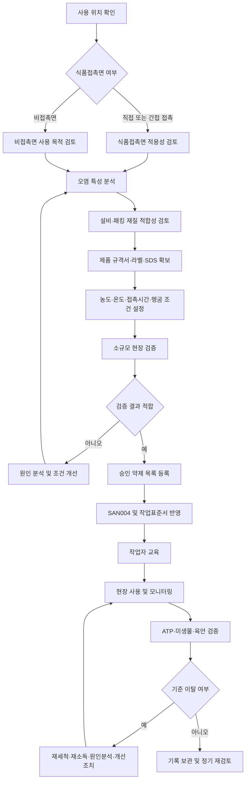
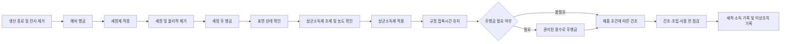
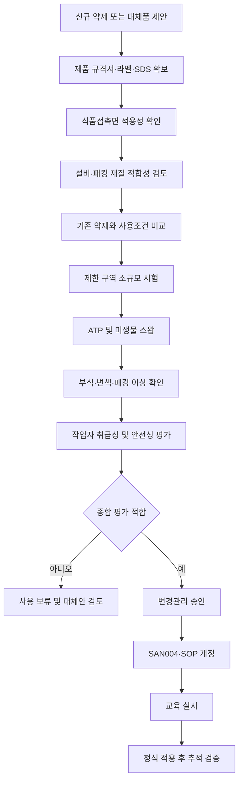
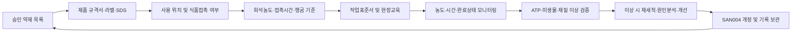

# [QA+ 블로그 생성 결과물] SAN004 세정제 살균소독제 선택
생성일시: 2026-09-07 07:23:17 (KST)
적용모델: gpt-5.6-terra

================================================================================
# 📋 [최종 발행용 블로그 패키지]

## 1. QA 검수 결과 및 발행 전 필수 보정사항

### 사실관계·표현 검수 결과

원고의 실무 흐름, HACCP 관리 관점, 세정과 살균소독의 구분, 변경관리 필요성은 전반적으로 적절합니다. 다만 법령·제품 적용성·현장 사례 표현은 아래 기준으로 보정 후 발행하는 것이 안전합니다.

1. **법령 조항번호는 본문에 확정적으로 기재하지 않는 방식이 적절합니다.**  
   원고에 이미 “최신 국가법령정보센터와 식품의약품안전처 고시를 재확인”하라는 문구가 있어 안전합니다. 발행 직전에는 다음 자료의 최신본을 확인해야 합니다.
   - 「식품위생법」
   - 「식품위생법 시행규칙」
   - 「식품 및 축산물 안전관리인증기준」
   - 「식품첨가물의 기준 및 규격」
   - 「위생용품 관리법」
   - 제품별 라벨, 규격서, SDS 및 제조사 사용설명서

2. **“식품공장용” 표기는 식품접촉면 사용 적합성을 의미하지 않는다는 설명은 적절합니다.**  
   다만 실제 승인 시에는 공급업체의 홍보자료가 아닌, 해당 제품의 공식 표시사항·규격서·적용 가능 범위·사용 조건을 확보해야 합니다.

3. **본문 사례 1~3은 실제 특정 사업장의 검증된 사례로 오인될 수 있습니다.**  
   공개 가능한 실사례가 아니라면 각 사례 제목 아래에 다음 문구를 넣는 것을 권장합니다.  
   > ※ 아래 사례는 식품 제조현장에서 발생할 수 있는 대표적 관리 실패 유형을 바탕으로 구성한 교육용 예시입니다. 실제 공정 조건과 검증 결과는 사업장별로 다를 수 있습니다.

4. **“그 결과 8주간 반복 부적합이 발생하지 않았다”와 같은 수치는 실제 검증기록이 없는 경우 삭제 또는 완화해야 합니다.**  
   아래처럼 바꾸는 것이 안전합니다.  
   - 수정 전: “그 결과 8주간의 추적 검사에서 동일 지점의 반복 부적합이 발생하지 않았고…”  
   - 수정 후: “개선 후에는 동일 지점의 ATP·미생물 스왑 결과를 추적 검토하여 개선 효과와 재발 여부를 확인하도록 관리했습니다.”

5. **“후헹굼 불필요”는 제품별·사용 조건별 판단 사항입니다.**  
   원고도 이를 올바르게 설명하고 있으므로, 실제 발행 시 특정 제품이나 특정 유효성분에 일반화하지 않는 현재의 표현을 유지합니다.

6. **ATP와 미생물 스왑의 관계에 대한 설명은 적절합니다.**  
   ATP는 세정 상태와 유기물 잔류 확인에 유용하지만, 특정 미생물 또는 미생물학적 안전성을 직접 대체하는 시험으로 단정할 수 없다는 현재 표현을 유지합니다.

---

## 2. 메타 데이터 (SEO 설정)

- **최종 포스팅 제목**: SAN004 세정·살균소독제 관리 가이드: 식품접촉면 약제 선정부터 HACCP 검증까지
- **메타 디스크립션 (120자 내외 요약)**: SAN004 세정·살균소독제 관리 실무를 정리했습니다. 식품접촉면 약제 선정, 희석농도·접촉시간·헹굼 기준, HACCP 검증과 변경관리 방법을 확인하세요.
- **추천 해시태그 (10개)**:  
  #식품품질관리 #HACCP #식품안전 #세정제관리 #살균소독제 #SAN004 #식품공장위생관리 #SSOP #식품접촉면 #HACCP심사
- **카테고리**: 식품품질실무 > HACCP 위생관리
- **추천 URL 슬러그**: `san004-cleaning-sanitizer-management-haccp`
- **대표 이미지 ALT 문구**: 식품공장 세정제·살균소독제 관리와 농도 확인 작업 현장
- **본문 이미지 1 ALT 문구**: 식품공장 설비별 세정제와 살균소독제 선정 검토 현장
- **본문 이미지 2 ALT 문구**: 식품접촉면 약제 선정 시 재질과 안전성을 점검하는 식품공장 현장

---

## 3. 네이버 블로그 / 티스토리 복사용 최종 원고 (Markdown)

> **편집 적용 원칙**  
> 아래 원고는 제공 원고의 구조·소제목·표·사례·FAQ를 유지하는 기준으로 구성했습니다.  
> 발행 전 사례 1~3에는 “교육용 예시” 고지문을 삽입하고, 실제 제품명·농도·법령 조항을 추가할 경우에는 반드시 최신 공식 자료로 재검증하십시오.

# SAN004 세정·살균소독제 관리: 식품접촉면 약제 선택부터 HACCP 검증까지

> **20년 실무 선배의 한 줄 요약**  
> 세정제·살균소독제는 “유명한 제품”을 고르는 일이 아니라, **사용 위치·오염 특성·식품접촉 여부·사용조건·검증기록**을 연결하는 일입니다. SAN004에는 제품명보다 “왜 이 약제를 이 조건으로 쓰는가”가 남아 있어야 심사와 현장에서 모두 흔들리지 않습니다.

---

## 1. “좋은 소독제”보다 “우리 공정에 맞는 약제”가 먼저입니다

식품공장에서 세정제나 살균소독제를 바꾸는 계기는 대개 비슷합니다. 기존 제품의 세척력이 아쉽거나, 미생물 검사에서 반복 부적합이 나오거나, 납품업체가 더 저렴한 제품을 제안했을 때입니다.

그런데 이때 제품 카탈로그의 “강력한 살균력”, “식품공장용”, “친환경” 같은 문구만 보고 결정하면 나중에 문제가 생길 수 있습니다. 식품접촉면에 사용 가능한지, 후헹굼이 필요한지, 설비 재질에 손상을 주지는 않는지까지 별도로 확인해야 하기 때문입니다.

현장에서 HACCP 심사관이 실제로 묻는 질문도 단순하지 않습니다.

- 농도 기록이 있습니까?
- 왜 이 제품을 선정했습니까?
- 충전노즐에도 사용 가능한 제품입니까?
- 접촉시간은 어떤 근거로 정했습니까?

이 질문에 담당자가 제품명과 희석비만 답하면 관리체계가 약하다고 평가받기 쉽습니다. 반대로 선정 근거와 현장 검증 자료가 정리되어 있으면 제품이 아주 비싸지 않아도 충분히 신뢰를 얻을 수 있습니다.

특히 `SAN004`가 귀사의 세정·소독 관리 표준서, 위생관리 절차서 또는 점검표 코드라면 문서의 역할을 다시 잡아야 합니다. SAN004는 “A 소독제를 200배 희석해 사용한다”는 목록이 아니라, 약제를 승인하고 안전하게 사용하며 효과를 확인하는 운영 기준이어야 합니다.

쉽게 말하면 약품 보관대에 붙이는 안내문이 아니라, 현장 직원과 품질팀이 같은 방식으로 움직이게 하는 약속입니다. 문서 제목, 개정번호, 적용 구역, 적용 제품군은 회사별로 다를 수 있으므로 먼저 내부 문서의 실제 적용 범위를 확인해 주세요.

세정·소독 관리는 눈에 잘 띄지 않지만 식품안전의 바닥 공사와 같습니다. 바닥 공사가 약하면 위에 HACCP 기록을 아무리 잘 쌓아도 흔들립니다. 제품을 바꾸기 전에 “어디에, 무엇을, 왜, 어떤 조건으로 쓸 것인가”를 정리하는 습관부터 만드시면 됩니다.




다음 단계에서는 가장 많이 혼동하는 세정제와 살균소독제의 역할부터 확실히 나누겠습니다. 이 구분이 안 되면 어떤 좋은 약제를 써도 효과가 반감됩니다.

---

## 2. 세정제와 살균소독제의 차이: 순서를 바꾸면 효과도 무너집니다

세정은 표면에 붙은 유지, 단백질, 전분, 당류, 탄화물, 무기질 스케일 같은 오염물을 제거하는 작업입니다. 반면 살균소독은 세정 이후에도 남아 있을 수 있는 미생물을 일정 수준까지 줄이는 작업입니다.

둘 다 위생관리라는 큰 범주에 들어가지만, 목적과 관리해야 할 변수가 다릅니다. 쉽게 말하면 세정은 먼지와 기름때를 닦아내는 일이고, 살균소독은 깨끗해진 표면에 남은 미생물 위험을 낮추는 일입니다.

가장 흔한 실수는 식품 잔사나 기름때가 남은 설비에 소독제만 분사하는 방식입니다. 유기물이 남아 있으면 일부 살균소독제의 효과가 떨어질 수 있고, 표면의 틈이나 바이오필름 아래쪽까지 약제가 충분히 닿지 않을 수 있습니다.

그래서 기본 순서는 다음과 같이 설정하는 것이 안전합니다.

> **잔사 제거 → 예비 헹굼 → 세정 → 헹굼 → 살균소독 → 필요 시 후헹굼 → 건조 및 조립**

| 구분 | 세정제 | 살균소독제 |
|---|---|---|
| 주된 목적 | 유지·단백질·전분·스케일 등 오염물 제거 | 세척 후 잔존 미생물 감소 |
| 핵심 관리변수 | 종류, 농도, 온도, 시간, 물리력 | 유효성분, 농도, 접촉시간, 온도, 헹굼 여부 |
| 일반적 사용 순서 | 잔사 제거 후 세정·헹굼 단계 | 세정 완료 후 적용 |
| 대표적인 실패 | 세정력이 약한 약제를 임의 고농도로 사용 | 오염물 위에 뿌리고 바로 닦아냄 |
| 확인해야 할 자료 | 제품 규격서, SDS, 재질 적합성 | 식품접촉면 적용성, 사용조건, 헹굼 조건 |



---

## 3. 법적 기준과 공식 가이드라인: 식품접촉면은 더 엄격하게 봐야 합니다

식품 제조현장의 세척·소독은 단순한 청소 활동이 아닙니다. 「식품위생법」과 「식품위생법 시행규칙」의 영업자 준수사항은 식품 제조시설과 설비를 위생적으로 관리할 의무의 기본 근거가 됩니다.

HACCP 적용업소라면 「식품 및 축산물 안전관리인증기준」에 따른 선행요건관리 관점에서 접근해야 합니다. 세척·소독은 영업장 관리, 위생관리, 제조시설·설비 관리, 용수관리, 교육훈련, 검교정, 화학물질 관리와 연결됩니다.

즉, 약제를 구매했다는 사실 하나만으로 관리가 완료되는 것이 아닙니다.

> **선정 → 기준 설정 → 교육 → 사용 → 모니터링 → 검증 → 이상 시 개선 → 기록 보관**

식품과 직접 접촉하는 충전노즐, 탱크, 배관, 컨베이어 벨트, 성형틀, 칼, 작업도구 등에 사용하는 살균소독제는 더욱 신중하게 확인해야 합니다. 「식품첨가물의 기준 및 규격」에서 다루는 기구등의 살균소독제 관련 기준과 제품의 표시사항, 사용방법, 사용 후 조치를 검토해야 합니다.

> **실무 메모**  
> 법적 적합성 확인은 “인증서 한 장”으로 끝나는 일이 아닙니다. 제품 라벨, 규격서, SDS, 식품접촉면 사용 확인서, 희석농도·접촉시간·헹굼 조건 자료를 한 묶음으로 확보해야 실제 심사 대응이 됩니다.

---

## 4. 약제 선택의 첫 단계: 제품명보다 사용 위치부터 분류하십시오

세정제·살균소독제 선정표의 첫 열은 제품명이 아니라 **사용 장소와 설비명**이어야 합니다.

- 충전기 노즐
- 반죽기 내부
- CIP 탱크 및 배관
- 작업대
- 바닥
- 배수로
- 장화 세척조
- 손 세정대

식품접촉면은 식품이 직접 닿거나, 세척 후 잔류물이 식품으로 이동할 가능성이 있는 표면입니다. 충전노즐, 호퍼, 믹서, 배관, 탱크, 칼날, 성형기, 트레이, 컨베이어, 계량용기, 작업도구 등이 대표적입니다.

| 사용 위치 | 식품접촉 여부 | 선정 시 우선 확인할 사항 | 관리 예시 |
|---|---|---|---|
| 충전노즐·탱크·배관 내부 | 직접 접촉 | 기구등의 살균소독제 적용성, 헹굼 조건, 재질 적합성 | CIP 조건표, 후헹굼 확인 |
| 작업대·칼·성형틀 | 직접 또는 간접 접촉 | 침지·분무 가능 여부, 접촉시간, 건조 방법 | 작업 전·후 점검표 |
| 컨베이어 벨트 | 직접 접촉 가능 | 벨트 재질, 잔류 위험, 분사 범위 | 구간별 세척 확인 |
| 바닥·벽·배수로 | 비접촉 | 배수 영향, 냄새, 작업자 보호구 | 구역별 청소·소독 기록 |
| 장화 세척조 | 비접촉이나 교차오염 관련 | 약액 교체주기, 오염도, 농도 확인 | 교대별 농도 점검 |
| 손 세정·소독 구역 | 인체 적용 | 피부 자극성, 제품 용도, 사용법 | 비치·교체·교육 기록 |

---

## 5. 오염 특성·설비 재질·작업자 안전까지 함께 검토하는 7가지 기준

1. **오염물의 종류를 확인합니다.**  
   유지, 단백질, 전분, 당류, 무기질 스케일 등 실제 설비에 남는 잔사를 사진과 점검 결과로 확인합니다.

2. **설비 재질 적합성을 확인합니다.**  
   스테인리스강, 알루미늄, 동, 고무 패킹, 실리콘, 플라스틱 등은 약제와 사용 조건에 따라 반응이 다를 수 있습니다.

3. **현장에서 실현 가능한 사용조건인지 검토합니다.**  
   제조사의 권장 농도·온도·접촉시간이 실제 생산 일정과 작업 동선에서 실행 가능한지 확인합니다.

4. **헹굼 조건과 건조 방법을 명확히 합니다.**  
   후헹굼이 필요한 제품이라면 헹굼수, 시간, 횟수, 잔류 확인 방법을 SOP에 구체적으로 기재합니다.

5. **작업자 안전성을 검토합니다.**  
   SDS를 기준으로 보호구, 환기, 보관, 혼합금지 물질, 응급조치 방법을 관리합니다.

6. **희석액의 사용 가능 시간과 교체 주기를 관리합니다.**  
   조제 시간, 농도 확인 시점, 기준 이탈 시 폐기·재조제 조건을 정해야 합니다.

7. **구매 편의성과 공급 안정성을 함께 봅니다.**  
   약제 단가뿐 아니라 계량장치, 시험지 수급, 교육 난이도, 납기 안정성까지 검토합니다.


---

## 6. HACCP 심사에서 통하는 승인 문서와 SAN004 파일 구성법

세정제·살균소독제 관리에서 가장 실용적인 문서는 **승인 약제 목록(Approved Chemical List)** 입니다.

승인 약제 목록에는 다음 항목을 포함하는 것이 좋습니다.

- 제품명
- 제조·판매사
- 사용 구역
- 식품접촉 여부
- 사용 목적
- 희석 기준
- 접촉시간
- 헹굼 여부
- 보관 위치
- 관련 문서 번호

약제별로 기본 확보가 필요한 자료는 다음과 같습니다.

1. 제품 규격서  
2. 라벨 및 사용설명서  
3. SDS/MSDS  
4. 식품접촉면 적용 가능 여부 확인 자료  
5. 제조사 권장 희석농도·접촉시간·헹굼 조건 자료  
6. 설비 재질 적합성 자료  

신규 약제를 도입하거나 기존 제품을 변경할 때는 변경관리(Change Control)를 적용해야 합니다.



> **심사관 대응 실무 팁**  
> “해당 제품은 충전노즐 및 작업도구용 식품접촉면 적용 조건을 확인했고, 제조사 권장 희석농도와 접촉시간을 기준으로 소규모 검증을 실시했습니다. ATP 및 미생물 스왑 결과와 설비 재질 이상 유무를 확인한 뒤 SAN004 개정번호 ○○에 반영해 관리하고 있습니다.”

---

## 7. 희석농도·접촉시간·헹굼 기준을 작업표준서에 쓰는 방법

작업표준서에 “소독제를 적정 농도로 희석하여 사용한다”라고만 쓰면 현장에서는 기준이 없는 것과 같습니다.

실제 작업 단위로 다음과 같이 작성해야 합니다.

- 원액 투입량
- 희석수량
- 조제 순서
- 계량도구
- 농도 측정법
- 조제 시간
- 사용 가능 시간
- 접촉시간
- 후헹굼 여부
- 이상 시 조치

| 관리 항목 | 작업표준서 기재 예시 | 확인 방법 | 이상 시 조치 |
|---|---|---|---|
| 사용 위치 | 충전노즐, 호퍼 내부, 작업도구 | 설비별 작업표와 대조 | 적용 위치 재교육 |
| 희석 방법 | 제조사 기준에 따른 원액량과 물량을 계량해 조제 | 전용 계량컵·자동 희석기 | 폐기 후 재조제 |
| 농도 확인 | 조제 직후 및 작업 중 정해진 시점에 측정 | 전용 시험지 또는 측정기 | 기준 미달 시 재조제 |
| 접촉시간 | 표면 또는 침지 상태에서 기준 시간 유지 | 타이머, 작업자 확인 | 재소독 실시 |
| 후헹굼 | 제품 지침에 따른 헹굼 실시 여부 명시 | 작업 완료 점검 | 미흡 시 재헹굼 |
| 약액 교체 | 교대별 또는 오염·기준 이탈 시 교체 | 조제·교체 기록 | 즉시 폐기 및 교체 |
| 기록 | 일자, 시간, 담당자, 측정값, 특이사항 | 일일점검표 | 누락 시 원인 확인·교육 |

---

## 8. 실제 현장 사례로 보는 세정·소독제 적용과 개선

> ※ 아래 사례는 식품 제조현장에서 발생할 수 있는 대표적 관리 실패 유형을 바탕으로 구성한 교육용 예시입니다. 실제 공정 조건과 검증 결과는 사업장별로 다를 수 있습니다.

### 사례 1. 냉동만두 제조공장 성형기·컨베이어 미생물 반복 부적합

성형기 출구와 냉각 전 컨베이어 벨트의 표면 미생물 결과가 간헐적으로 기준을 벗어나는 경우, 소독제 농도만 높이는 방식으로 대응하면 설비 변색·냄새·부식 위험이 커질 수 있습니다.

이런 경우에는 다음을 먼저 확인해야 합니다.

- 만두피 가루와 육즙 잔사의 잔존 여부
- 벨트 연결부와 성형기 하부의 사각지대
- 분해세척 범위
- 세정 단계의 충분성
- 소독제 접촉시간 준수 여부

개선조치로 벨트 연결부와 성형기 하부를 분해세척 대상에 포함하고, 잔사 제거용 브러시와 세정 단계를 추가할 수 있습니다. 또한 소독 후 타이머로 접촉시간을 관리하고, ATP 및 미생물 스왑 결과를 정기적으로 추적 검토하도록 SAN004를 개정합니다.

### 사례 2. 소스류 레토르트 공장 CIP 배관의 냄새 잔류와 패킹 열화

세정제, 산성 세정제, 염소계 약제가 같은 보관 구역에 혼재되어 있고 작업자별 CIP 순서가 다르면 약품 냄새 잔류, 패킹 경화, 미세 균열, 세정액 정체 등의 문제가 발생할 수 있습니다.

개선 방향은 다음과 같습니다.

- 약제별 보관장 분리
- 색상 라벨과 혼합금지 표시 부착
- 예비 헹굼, 알칼리 세정, 중간 헹굼, 산성 세정, 최종 헹굼, 살균 단계의 표준화
- 패킹 재질 적합성 확인
- 예방보전표에 패킹 교체 주기 및 누수 점검 항목 반영
- SDS 및 혼합금지 교육 강화

### 사례 3. 음료 제조공장 충전노즐 소독제 변경 후 설비 부식 발생

“식품공장용”이라는 공급업체 설명과 단가만으로 신규 약제를 충전노즐에 적용하면, 식품접촉면 적용 조건, 금속·고무 재질 적합성, 접촉시간, 헹굼 조건을 놓칠 수 있습니다.

개선조치는 다음과 같습니다.

- 신규 약제 사용 즉시 보류
- 영향을 받은 노즐·패킹 점검 및 필요 시 교체
- 잔류 및 설비 이상 여부 확인
- 품질·생산·설비팀 공동 승인 절차 운영
- 제한 구역 소규모 시험 실시
- ATP, 미생물 스왑, 재질 이상, 작업자 취급성 평가 후 정식 승인

---

## 9. HACCP 심사에서 자주 지적되는 7가지와 예방 방법

1. 제품명만 있고 용도별 선정 근거가 없음  
2. 희석 기준은 있으나 실제 희석 방법이 불명확함  
3. 접촉시간 관리 기준이 없음  
4. 약제 변경 후 변경관리와 재검증 기록이 없음  
5. SDS, 라벨, 보관, 혼합금지 관리가 미흡함  
6. 세척·소독 효과 검증이 없음  
7. 기준 이탈 시 원인분석과 개선조치 기록이 없음  

이상 시 조치는 “재소독함”으로 끝내지 말고 다음 원인을 확인해야 합니다.

- 세정 불충분
- 사각지대 존재
- 희석 오류
- 접촉시간 부족
- 설비 손상
- 작업자 교육 부족
- 제품 또는 사용 조건의 부적합

---

## 10. 자주 묻는 질문(FAQ)

### Q1. 식품공장용 세정제면 식품접촉 설비에 모두 사용할 수 있나요?

**A. 아닙니다.** “식품공장용”이라는 판매 문구가 충전노즐, 탱크, 배관, 작업도구 같은 식품접촉면 사용 적합성을 자동으로 뜻하지는 않습니다. 라벨, 규격서, 식품접촉면 사용 가능 여부 확인 자료, 권장 희석농도, 접촉시간, 후헹굼 필요 여부를 문서로 확인해야 합니다.

### Q2. 소독제 농도는 높을수록 더 좋은 것 아닌가요?

**A. 그렇지 않습니다.** 과농도는 설비 부식, 패킹 열화, 잔류, 냄새, 작업자 자극, 비용 증가를 만들 수 있습니다. 농도는 제조사의 공식 사용기준과 현장 검증 결과를 바탕으로 정해야 합니다.

### Q3. 소독 후에는 반드시 헹궈야 하나요?

**A. 일률적으로 답할 수 없습니다.** 제품의 사용 목적, 식품접촉 여부, 표시사항, 제조사 사용설명서, 관련 기준에 따라 판단해야 합니다. 후헹굼 필요 여부와 실제 작업 방법의 근거 문서를 함께 관리하십시오.

### Q4. 농도 측정 기록만 있으면 HACCP 심사에 충분한가요?

**A. 충분하지 않을 수 있습니다.** 심사에서는 약제 선정 근거, 식품접촉면 적용성, SOP, 실제 사용 상태, 농도·접촉시간 모니터링, 효과 검증, 이상 시 개선조치의 연결성을 봅니다.

### Q5. 염소계 약제와 산성 세정제는 왜 분리 보관해야 하나요?

**A. 혼합 시 유해하거나 자극성 가스가 발생할 위험이 있기 때문입니다.** 보관장 분리, 색상 라벨, 혼합금지 표지, 전용 용기 사용, 중간 헹굼 기준이 필요합니다.

### Q6. ATP 검사 결과가 좋으면 미생물 스왑 검사는 하지 않아도 되나요?

**A. ATP와 미생물 검사는 보는 대상이 다르므로 완전히 대체 관계라고 보기 어렵습니다.** 공정 위험도와 제품 특성에 따라 ATP 일상 확인, 정기 미생물 스왑, 필요 시 환경모니터링을 조합해야 합니다.

---

## 11. SAN004 개정 전·후에 쓰는 단계별 체크리스트

| 단계 | 점검 항목 | 확인 기준 | 주기 | 담당 | 기록/조치 |
|---|---|---|---|---|---|
| 1 | 사용 위치 분류 | 식품접촉면·비접촉면·CIP 구분 완료 | 약제 도입·변경 시 | 품질/생산 | 승인 약제 목록 |
| 2 | 제품 문서 확보 | 규격서, 라벨, SDS, 사용조건 자료 확보 | 입고 전·연 1회 검토 | 품질 | 약제별 파일 |
| 3 | 재질 적합성 검토 | 설비·패킹 재질과 적합성 확인 | 신규 도입·설비 변경 시 | 설비/품질 | 검토서 |
| 4 | 희석액 조제 | 계량도구 사용, 조제 기준 준수 | 조제 시마다 | 생산 | 희석 기록 |
| 5 | 농도 확인 | 승인 범위 내 측정값 확인 | 조제 직후 및 정한 시점 | 생산/품질 | 농도 점검표 |
| 6 | 접촉시간 관리 | 제품·SOP 기준 시간 확보 | 작업 시마다 | 생산 | 세척·소독 기록 |
| 7 | 후헹굼·건조 | 제품 지침에 따른 헹굼·건조 확인 | 작업 시마다 | 생산 | 완료 점검 |
| 8 | 효과 검증 | ATP·스왑·육안점검 등 계획대로 실시 | 위험도별 설정 | 품질 | 검증 결과 |
| 9 | 이상 조치 | 기준 이탈 시 재세척·원인분석·개선 | 발생 시 | 품질/생산 | 일탈·개선 기록 |
| 10 | 교육 및 변경관리 | 신규 인원·제품 변경 시 교육 완료 | 입사·변경 시 | 품질/안전 | 교육일지 |



---

## 12. 맺음말: 세정·소독제 관리는 제품이 아니라 관리체계입니다

오늘 내용의 핵심은 세 줄입니다.

> **세정제는 오염물을 제거하고, 살균소독제는 미생물을 줄입니다.**  
> **약제는 식품접촉 여부와 사용 위치부터 구분해 선정합니다.**  
> **농도뿐 아니라 시간·온도·헹굼·건조·검증기록까지 함께 관리합니다.**

SAN004에는 “무슨 제품을 쓴다”보다 “왜 이 제품을 이 구역에 쓰는가”가 담겨야 합니다. 제품 규격서와 SDS를 확보하고, 사용조건을 정하고, 소규모 검증 후 작업표준서에 반영하고, 실제 현장에서 지켜지는지 확인하십시오.

세정·소독 관리는 생산이 끝난 뒤 하는 뒷정리가 아니라, 다음 날 안전한 생산을 시작하게 만드는 가장 중요한 준비 작업입니다.

---

## 4. 워드프레스 / 웹사이트용 HTML 원고

```html
<article class="food-qa-post">
  <header>
    <h1>SAN004 세정·살균소독제 관리: 식품접촉면 약제 선택부터 HACCP 검증까지</h1>
    <blockquote>
      <p><strong>20년 실무 선배의 한 줄 요약:</strong> 세정제·살균소독제는 “유명한 제품”을 고르는 일이 아니라, <strong>사용 위치·오염 특성·식품접촉 여부·사용조건·검증기록</strong>을 연결하는 일입니다.</p>
    </blockquote>
  </header>

  <section>
    <h2>1. “좋은 소독제”보다 “우리 공정에 맞는 약제”가 먼저입니다</h2>
    <p>세정제·살균소독제 선정은 제품의 홍보 문구만 보고 결정할 일이 아닙니다. 식품접촉면 사용 가능 여부, 후헹굼 조건, 설비 재질 적합성, 작업자 안전성, 검증기록까지 함께 확인해야 합니다.</p>
    
    <p>SAN004는 단순한 제품 목록이 아니라 약제를 승인하고 안전하게 사용하며 효과를 확인하는 운영 기준이어야 합니다.</p>
  </section>

  <section>
    <h2>2. 세정제와 살균소독제의 차이</h2>
    <p>세정은 유지, 단백질, 전분, 당류, 무기질 스케일 등 오염물을 제거하는 작업입니다. 살균소독은 세정 후 표면에 남아 있을 수 있는 미생물 위험을 낮추는 작업입니다.</p>

    <table>
      <thead>
        <tr>
          <th>구분</th>
          <th>세정제</th>
          <th>살균소독제</th>
        </tr>
      </thead>
      <tbody>
        <tr>
          <td>주된 목적</td>
          <td>오염물 제거</td>
          <td>세척 후 잔존 미생물 감소</td>
        </tr>
        <tr>
          <td>핵심 관리변수</td>
          <td>종류, 농도, 온도, 시간, 물리력</td>
          <td>유효성분, 농도, 접촉시간, 온도, 헹굼 여부</td>
        </tr>
        <tr>
          <td>일반적 사용 순서</td>
          <td>잔사 제거 후 세정·헹굼</td>
          <td>세정 완료 후 적용</td>
        </tr>
      </tbody>
    </table>

    <p><strong>기본 순서:</strong> 잔사 제거 → 예비 헹굼 → 세정 → 헹굼 → 살균소독 → 필요 시 후헹굼 → 건조 및 조립</p>
  </section>

  <section>
    <h2>3. 법적 기준과 공식 가이드라인</h2>
    <p>식품 제조현장의 세척·소독은 「식품위생법」, 「식품위생법 시행규칙」, 「식품 및 축산물 안전관리인증기준」 등과 연결되는 위생관리 활동입니다.</p>
    <p>식품과 직접 접촉하는 충전노즐, 탱크, 배관, 컨베이어, 칼, 작업도구 등에 사용하는 제품은 제품 표시사항, 규격서, SDS, 식품접촉면 적용 가능 여부, 희석농도·접촉시간·헹굼 조건을 함께 확인해야 합니다.</p>

    <aside>
      <p><strong>실무 메모:</strong> 법적 적합성 확인은 인증서 한 장으로 끝나는 일이 아닙니다. 라벨, 규격서, SDS, 식품접촉면 사용 확인서, 사용조건 자료를 한 묶음으로 확보해야 합니다.</p>
    </aside>
  </section>

  <section>
    <h2>4. 약제 선택의 첫 단계: 사용 위치 분류</h2>
    <p>선정표의 첫 열은 제품명이 아니라 사용 장소와 설비명이어야 합니다. 충전기 노즐, 반죽기 내부, CIP 배관, 작업대, 바닥, 배수로, 장화 세척조 등으로 시작해야 식품접촉면과 비접촉면을 구분할 수 있습니다.</p>

    <table>
      <thead>
        <tr>
          <th>사용 위치</th>
          <th>식품접촉 여부</th>
          <th>우선 확인 사항</th>
        </tr>
      </thead>
      <tbody>
        <tr>
          <td>충전노즐·탱크·배관 내부</td>
          <td>직접 접촉</td>
          <td>식품접촉면 적용성, 헹굼 조건, 재질 적합성</td>
        </tr>
        <tr>
          <td>작업대·칼·성형틀</td>
          <td>직접 또는 간접 접촉</td>
          <td>분무·침지 가능 여부, 접촉시간, 건조 방법</td>
        </tr>
        <tr>
          <td>바닥·벽·배수로</td>
          <td>비접촉</td>
          <td>배수 영향, 냄새, 작업자 보호구</td>
        </tr>
      </tbody>
    </table>
  </section>

  <section>
    <h2>5. 약제 선정 시 함께 검토할 7가지 기준</h2>
    <ol>
      <li>오염물의 종류</li>
      <li>설비·패킹 재질 적합성</li>
      <li>현장에서 실현 가능한 사용조건</li>
      <li>헹굼 조건과 건조 방법</li>
      <li>작업자 안전성 및 SDS 기준</li>
      <li>희석액 사용 가능 시간과 교체 주기</li>
      <li>구매 편의성 및 공급 안정성</li>
    </ol>
    
  </section>

  <section>
    <h2>6. HACCP 심사에서 통하는 승인 문서와 SAN004 파일 구성</h2>
    <p>승인 약제 목록에는 제품명, 제조·판매사, 사용 구역, 식품접촉 여부, 사용 목적, 희석 기준, 접촉시간, 헹굼 여부, 보관 위치, 관련 문서 번호를 포함합니다.</p>
    <ul>
      <li>제품 규격서</li>
      <li>라벨 및 사용설명서</li>
      <li>SDS/MSDS</li>
      <li>식품접촉면 적용 가능 여부 확인 자료</li>
      <li>희석농도·접촉시간·헹굼 조건 자료</li>
      <li>설비 재질 적합성 자료</li>
    </ul>
  </section>

  <section>
    <h2>7. 희석농도·접촉시간·헹굼 기준 작성 방법</h2>
    <p>“적정 농도로 희석하여 사용한다”는 문구만으로는 현장 기준이 될 수 없습니다. 원액량, 희석수량, 계량도구, 조제 순서, 농도 측정법, 접촉시간, 후헹굼 여부, 이상 시 조치를 구체적으로 정해야 합니다.</p>
  </section>

  <section>
    <h2>8. 현장 사례로 보는 적용과 개선</h2>
    <p><em>※ 아래 사례는 식품 제조현장에서 발생할 수 있는 대표적 관리 실패 유형을 바탕으로 구성한 교육용 예시입니다.</em></p>

    <h3>사례 1. 성형기·컨베이어 미생물 반복 부적합</h3>
    <p>소독제 농도만 높이기보다 유기물 잔존, 분해세척 범위, 사각지대, 접촉시간 준수 여부를 확인해야 합니다.</p>

    <h3>사례 2. CIP 배관의 냄새 잔류와 패킹 열화</h3>
    <p>약제 보관 분리, 중간 헹굼, 단계별 CIP 표준화, 패킹 재질 적합성 검토가 필요합니다.</p>

    <h3>사례 3. 충전노즐 소독제 변경 후 설비 부식</h3>
    <p>신규 약제는 가격만으로 도입하지 말고 식품접촉면 적용성, 재질 적합성, 헹굼 조건, 소규모 검증 결과를 확인해야 합니다.</p>
  </section>

  <section>
    <h2>9. HACCP 심사에서 자주 지적되는 7가지</h2>
    <ol>
      <li>용도별 선정 근거 부재</li>
      <li>실제 희석 방법 불명확</li>
      <li>접촉시간 관리 누락</li>
      <li>약제 변경 후 재검증 기록 부재</li>
      <li>화학물질 안전관리 미흡</li>
      <li>효과 검증 부재</li>
      <li>이상 시 조치 및 원인분석 기록 누락</li>
    </ol>
  </section>

  <section>
    <h2>10. 자주 묻는 질문</h2>

    <h3>식품공장용 세정제면 식품접촉 설비에 모두 사용할 수 있나요?</h3>
    <p><strong>아닙니다.</strong> 식품접촉면 사용 가능 여부와 사용 조건은 제품별 공식 자료로 확인해야 합니다.</p>

    <h3>소독제 농도는 높을수록 더 좋은가요?</h3>
    <p><strong>그렇지 않습니다.</strong> 과농도는 부식, 패킹 열화, 잔류, 작업자 자극, 비용 증가를 유발할 수 있습니다.</p>

    <h3>소독 후에는 반드시 헹궈야 하나요?</h3>
    <p><strong>일률적으로 답할 수 없습니다.</strong> 제품 표시사항과 제조사 사용조건, 식품접촉 여부를 기준으로 판단해야 합니다.</p>

    <h3>농도 측정 기록만 있으면 HACCP 심사에 충분한가요?</h3>
    <p><strong>충분하지 않을 수 있습니다.</strong> 선정 근거부터 현장 사용, 검증, 개선조치까지 연결되어야 합니다.</p>

    <h3>염소계 약제와 산성 세정제는 왜 분리 보관해야 하나요?</h3>
    <p><strong>혼합 시 유해하거나 자극성 가스가 발생할 위험이 있기 때문입니다.</strong></p>

    <h3>ATP 결과가 좋으면 미생물 스왑 검사는 하지 않아도 되나요?</h3>
    <p><strong>완전히 대체할 수 없습니다.</strong> ATP와 미생물 검사는 확인 대상이 다르므로 공정 위험도에 따라 함께 운영해야 합니다.</p>
  </section>

  <section>
    <h2>11. SAN004 개정 전·후 체크리스트</h2>
    <table>
      <thead>
        <tr>
          <th>단계</th>
          <th>점검 항목</th>
          <th>주기</th>
          <th>담당</th>
        </tr>
      </thead>
      <tbody>
        <tr><td>1</td><td>사용 위치 분류</td><td>약제 도입·변경 시</td><td>품질/생산</td></tr>
        <tr><td>2</td><td>제품 문서 확보</td><td>입고 전·연 1회</td><td>품질</td></tr>
        <tr><td>3</td><td>재질 적합성 검토</td><td>신규 도입·설비 변경 시</td><td>설비/품질</td></tr>
        <tr><td>4</td><td>희석액 조제 및 농도 확인</td><td>조제 시마다</td><td>생산/품질</td></tr>
        <tr><td>5</td><td>접촉시간·후헹굼·건조 확인</td><td>작업 시마다</td><td>생산</td></tr>
        <tr><td>6</td><td>효과 검증 및 이상 조치</td><td>위험도별 설정</td><td>품질/생산</td></tr>
      </tbody>
    </table>
  </section>

  <footer>
    <h2>12. 맺음말: 세정·소독제 관리는 제품이 아니라 관리체계입니다</h2>
    <p><strong>세정제는 오염물을 제거하고, 살균소독제는 미생물을 줄입니다. 약제는 식품접촉 여부와 사용 위치부터 구분해 선정해야 하며, 농도뿐 아니라 시간·온도·헹굼·건조·검증기록까지 함께 관리해야 합니다.</strong></p>
    <p>SAN004에는 “무슨 제품을 쓴다”보다 “왜 이 제품을 이 구역에 쓰는가”가 남아 있어야 합니다.</p>
  </footer>
</article>
```
================================================================================

[부록: 1단계 리서치 원본]
# [리서치 리포트] SAN004 세정제·살균소독제 선택

> **사전 확인 사항**  
> `SAN004`는 법령상 공통 용어라기보다 회사의 위생관리 표준서(SOP), 점검표 또는 HACCP 문서 코드로 쓰일 가능성이 높습니다. 따라서 실제 원고 작성 전에는 **해당 사업장의 SAN004 문서 제목·개정번호·적용 범위**를 확인해야 합니다.  
> 아래 리서치는 일반적으로 식품 제조현장에서 사용하는 “세정제 및 기구등의 살균소독제 선정·검증·관리” 기준을 중심으로 설계했습니다.

---

### 1. 타겟 독자 및 검색 의도

- **주요 타겟**
  - 식품제조·가공업체 품질관리(QC) 신입 및 HACCP 담당자
  - 세정·소독 표준작업절차서(SOP)를 처음 제정하거나 개정해야 하는 실무자
  - HACCP 정기심사, 자체평가, 거래처 위생점검을 준비하는 품질팀장·생산팀장
  - CIP 설비, 작업장 바닥·배수로, 식품접촉 표면의 세정·소독제를 교체하려는 구매·생산 담당자

- **독자의 핵심 고통(Pain Point)**
  - “식품공장용”이라고 판매하는 제품이면 모두 사용해도 되는지 불확실하다.
  - 세정제와 살균소독제를 혼동해 하나의 제품으로 세척과 살균을 모두 해결하려 한다.
  - 식품과 직접 접촉하는 설비에 사용하는 약제가 **식품용 기구등의 살균소독제**인지 확인하는 방법을 모른다.
  - 약제의 유효성분, 희석농도, 접촉시간, 헹굼 필요 여부를 근거 없이 정하고 있다.
  - 신규 약제 도입 시 어떤 서류를 받아야 하는지, 현장 테스트는 어떻게 해야 하는지 막막하다.
  - HACCP 심사에서 “소독제 농도 측정 기록은 있는데, 왜 이 제품과 기준을 선택했는가?”라는 질문에 답하기 어렵다.
  - 산성 세정제·알칼리 세정제·염소계 소독제 등을 혼합해 유해가스 또는 설비 부식 위험을 만들지 걱정된다.

- **메인 키워드**
  - `식품공장 세정제 살균소독제 선택`

- **서브/연관 키워드**
  - `식품용 기구등의 살균소독제`
  - `HACCP 세정소독 관리`
  - `세정제 소독제 차이`
  - `소독제 희석농도 접촉시간`
  - `세정제 MSDS 확인`
  - `식품접촉면 소독제 헹굼`

- **독자가 기대하는 핵심 답변**
  1. 세정제와 살균소독제는 어떤 목적과 기준으로 구분해야 하는가?
  2. 식품접촉면에 사용할 수 있는 살균소독제인지 어디서 확인하는가?
  3. 약제 선정 시 반드시 확인할 서류와 항목은 무엇인가?
  4. 농도·온도·접촉시간·헹굼 기준을 어떻게 작업표준서에 반영하는가?
  5. 심사에서 인정받을 수 있는 선정 근거와 검증 기록은 무엇인가?

---

### 2. 필수 인용 법령 및 표준 기준

## 2-1. 법적·공식 기준

- **「식품위생법」**
  - 식품, 식품첨가물, 기구 및 용기·포장 등의 위생적 취급과 안전관리의 기본 법률입니다.
  - 식품 제조현장에서 사용하는 약제가 식품 또는 식품접촉 기구에 영향을 줄 수 있으므로, 해당 제품의 법적 분류와 사용 적합성을 확인하는 출발점으로 인용합니다.

- **「식품위생법 시행규칙」 별표 14 영업자의 준수사항**
  - 식품제조·가공업 영업자가 시설·설비 등을 위생적으로 관리해야 하는 기본 준수사항을 확인합니다.
  - 세척·소독은 단순한 청소 업무가 아니라 영업자의 위생관리 의무와 연결된 관리활동이라는 점을 설명하는 근거로 활용할 수 있습니다.
  - 단, 업종·시설 형태에 따라 적용 항목이 다를 수 있으므로 사업장 업종에 맞는 별표 조항을 원문으로 재확인해야 합니다.

- **「식품 및 축산물 안전관리인증기준」(식품의약품안전처 고시)**
  - HACCP 적용업소의 선행요건관리 및 HACCP 관리체계 운영 근거입니다.
  - 세척·소독은 일반적으로 **영업장 관리, 위생관리, 용수관리, 제조시설·설비 관리, 검교정 및 교육훈련** 등 선행요건관리와 연결해 관리합니다.
  - 글에서는 “약제를 구매했다”는 사실만으로는 충분하지 않으며, 선정 → 사용기준 설정 → 교육 → 실행 → 모니터링 → 개선조치 → 기록보관의 체계가 필요하다는 점을 강조합니다.
  - 인용 시에는 사업장 유형(식품, 축산물, 즉석판매제조가공업 등)에 맞는 최신 고시의 별표·평가항목을 확인해야 합니다.

- **식품의약품안전처 고시 「식품첨가물의 기준 및 규격」**
  - 식품접촉 기구·용기·포장 등에 사용하는 제품은 특히 **‘기구등의 살균소독제’** 관련 기준 및 규격을 확인해야 합니다.
  - 제품의 유효성분, 사용 대상, 사용 방법, 사용량 또는 희석 조건, 사용 후 조치(헹굼 필요성 등)는 제품 라벨과 제조사 자료만이 아니라 관련 기준에 부합하는지 검토해야 합니다.
  - 실무 글에서는 “식품공장 납품 제품” 또는 “친환경 제품”이라는 홍보 문구가 곧 식품접촉면 사용 적합성을 의미하지는 않는다는 점을 분명히 안내합니다.

- **「위생용품 관리법」 및 「위생용품의 기준 및 규격」**
  - 세척제는 용도와 제품 분류에 따라 위생용품 관리체계의 적용을 받을 수 있습니다.
  - 식기·조리기구·식품제조 설비의 세척에 사용하는 제품을 선정할 때에는 해당 제품의 품목 분류, 표시사항, 사용상 주의사항을 확인해야 합니다.
  - 특히 일반 공업용 세정제를 식품접촉 설비에 임의로 전용하지 않도록 주의해야 합니다.

- **산업안전보건법령 및 물질안전보건자료(MSDS/SDS) 관련 규정**
  - 세정·소독 약제는 화학제품이므로 세척 효과와 별개로 작업자 안전관리가 필요합니다.
  - 사업장은 공급자로부터 **물질안전보건자료(SDS)**를 확보하고, 유해성·위험성, 보호구, 누출 시 조치, 보관 조건, 혼합금지 물질, 응급조치 등을 현장에 적용해야 합니다.
  - 차아염소산나트륨 등 염소계 약제와 산성 약제의 혼합으로 유해가스가 발생할 수 있으므로, 혼합 금지와 보관 분리 기준은 작업표준서에 명확히 반영해야 합니다.

- **ISO/TS 22002-1:2009, Prerequisite programmes on food safety — Part 1: Food manufacturing**
  - 식품제조 선행요건프로그램(PRP)의 국제 참고기준입니다.
  - 세척·소독 프로그램은 대상 구역·설비, 책임자, 방법, 빈도, 화학물질, 농도, 접촉시간, 검증방법 및 기록을 포함해야 한다는 구조를 설계하는 데 활용할 수 있습니다.
  - FSSC 22000 인증 사업장이라면 적용 중인 인증 버전과 함께 ISO 22000 및 ISO/TS 22002-1의 적용 조항을 자체 인증 범위에 맞춰 확인해야 합니다.

---

## 2-2. 현장 실무 팩트: 선정 전 반드시 확인할 항목

### A. 세정제와 살균소독제의 역할을 먼저 구분

| 구분 | 세정제 | 살균소독제 |
|---|---|---|
| 주된 목적 | 유지, 단백질, 탄수화물, 무기질(스케일) 등 오염물 제거 | 세척 후 남아 있을 수 있는 미생물 감소 |
| 핵심 관리변수 | 약제 종류, 농도, 온도, 시간, 물리력 | 유효성분, 농도, 접촉시간, 대상 미생물, 헹굼 여부 |
| 일반적 순서 | 선세척 → 세정 → 헹굼 | 필요 시 살균소독 → 후헹굼 또는 건조 |
| 대표 실패 사례 | 오염물 위에 소독제만 분사함 | 농도는 맞지만 접촉시간 전에 닦아냄 |

- **핵심 메시지:** 오염물 제거가 충분하지 않은 상태에서 하는 소독은 효과가 제한될 수 있습니다. 따라서 “세정”과 “살균소독”을 같은 작업으로 뭉뚱그리지 말고, 공정별 목적과 기준을 분리해 설정해야 합니다.

### B. 약제 선정 체크리스트

1. **사용 위치**
   - 식품과 직접 접촉하는 표면인가?
   - 식품 비접촉 설비 외부, 바닥, 벽, 배수로인가?
   - CIP 설비 내부인가?
   - 손·장갑·장화·작업도구에 사용하는 제품인가?

2. **오염 특성**
   - 유지 오염이 많은가?
   - 단백질·전분·당류 오염이 많은가?
   - 무기질 스케일 또는 수석(scale)이 문제인가?
   - 바이오필름 또는 반복적인 미생물 불량이 의심되는가?

3. **설비 재질 적합성**
   - 스테인리스강, 알루미늄, 동, 고무 패킹, 플라스틱, 실리콘 등 설비 재질과의 적합성을 확인합니다.
   - 산성·알칼리성·산화성 약제는 재질에 따라 부식, 변색, 균열, 패킹 열화를 유발할 수 있으므로 공급업체의 재질 적합성 자료를 받아야 합니다.

4. **사용 조건**
   - 권장 희석농도
   - 사용 온도
   - 접촉시간
   - 세척 방식(침지, 분무, 폼, 순환, CIP 등)
   - 헹굼 필요 여부와 헹굼수 기준
   - 교체 주기 및 조제 후 사용 가능 시간

5. **법적 적합성과 제품 문서**
   - 제품 라벨 및 표시사항
   - 제품 규격서(Product Specification)
   - SDS/MSDS
   - 시험성적서 또는 유효성 자료
   - 식품접촉면 사용 여부 및 사용 조건에 관한 제조·판매사 확인서
   - 필요 시 관련 제품의 품목 신고·등록 또는 기준 적합성 확인 자료

6. **작업자 안전성**
   - 보호구 필요 여부
   - 희석 시 비산 위험
   - 환기 요구사항
   - 혼합금지 약제
   - 눈·피부 접촉 및 흡입 시 응급조치
   - 잠금장치가 있는 화학물질 보관 장소 및 라벨링 기준

---

## 2-3. 심사 대응용 “선정 근거” 파일 구성 예시

HACCP 심사나 거래처 점검에서 약제 선정의 타당성을 설명하려면 아래 자료를 한 묶음으로 관리하는 것이 효과적입니다.

- 세정제·살균소독제 **승인 목록(Approved Chemical List)**
- 약제별 제품 규격서 및 SDS/MSDS
- 식품접촉면/비접촉면 적용 구분표
- 제조사 권장 희석농도·온도·접촉시간 자료
- 설비 재질 적합성 확인 자료
- 약제 수입검사 또는 입고 확인 기록
- 희석액 제조 기준서 및 농도 확인 기록
- 세척·소독 작업표준서(SSOP)
- 세척 전·후 점검 기록
- ATP 측정, 미생물 스왑, 일반세균 등 검증 기록
- 미흡 발생 시 재세척·재소독 및 원인개선 기록
- 작업자 교육 기록
- 약제 변경 시 변경관리(Change Control) 및 재검증 기록

---

### 3. 추천 블로그 목차 (Outline)

## H1 (제목 후보 3개)

1. **식품공장 세정제·살균소독제 선택법: HACCP 담당자가 반드시 확인할 7가지**
2. **“소독제만 뿌리면 끝?” HACCP 심사에서 지적받지 않는 세정·소독제 선정 가이드**
3. **SAN004 세정제·살균소독제 관리: 식품접촉면 약제 선택부터 농도 검증까지**

---

## H2 서론 (Intro): “좋은 소독제”보다 “우리 공정에 맞는 소독제”가 중요합니다

### 도입 문제 제기
- 현장에서는 세정제와 소독제를 구매팀 추천, 납품업체 제안, 기존 관행에 따라 선택하는 경우가 많습니다.
- 그러나 HACCP 심사나 미생물 부적합 상황에서는 다음 질문을 받게 됩니다.
  - 왜 이 약제를 선택했습니까?
  - 식품접촉면에 사용 가능한 제품입니까?
  - 희석농도와 접촉시간은 어떤 근거로 정했습니까?
  - 효과가 있다는 것을 어떻게 검증했습니까?

### 핵심 결론 선제시
- 세정제·살균소독제 선택은 제품 브랜드 비교가 아니라 다음 다섯 가지를 확인하는 업무입니다.
  1. **사용 장소와 식품접촉 여부**
  2. **오염물과 목표 미생물**
  3. **제품의 법적·기술적 적합성**
  4. **농도·시간·온도·헹굼 조건**
  5. **현장 검증과 기록관리**

### SAN004와 연결할 메시지
- SAN004가 사업장의 세정·소독 관리 기준서라면, 이 문서는 단순히 “어떤 약제를 쓸지” 정하는 문서가 아니라 **약제를 안전하고 일관되게 선택·사용·검증하는 기준**이 되어야 합니다.

---

## H2 본론 1: 세정제와 살균소독제, 먼저 역할부터 구분해야 합니다

### H3. 세정은 오염물을 제거하는 공정, 소독은 미생물을 줄이는 공정
- 유지·단백질·전분·스케일 등 오염물 제거 없이 소독부터 하는 방식의 한계 설명
- 일반적인 작업 흐름 예시
  - 잔사 제거
  - 예비 헹굼
  - 세정
  - 헹굼
  - 살균소독
  - 필요 시 후헹굼
  - 건조 및 조립

### H3. 식품접촉면과 비접촉면은 같은 기준으로 선정하면 안 됩니다
- 식품접촉면: 충전노즐, 컨베이어, 탱크, 배관, 작업도구, 성형틀, 칼, 도마 등
- 비접촉면: 바닥, 벽, 배수로 외부, 설비 외장, 폐기물 보관구역 등
- 식품접촉면에 사용하는 살균소독제는 특히 관련 식품첨가물 기준 및 제품 사용조건을 확인해야 함
- “식품공장용”이라는 판매 문구만으로 식품접촉면 사용 적합성을 판단하지 말 것

### H3. 공식 기준은 무엇을 요구하는가
- 「식품위생법 시행규칙」상 위생적 시설·설비 관리 의무
- 「식품 및 축산물 안전관리인증기준」상 선행요건관리 및 위생관리 체계
- 「식품첨가물의 기준 및 규격」의 기구등의 살균소독제 관련 기준 확인 필요
- 세정제는 적용 제품 분류에 따라 「위생용품 관리법」 및 「위생용품의 기준 및 규격」 확인 필요
- 화학약제 취급 시 SDS/MSDS에 따른 작업자 안전관리 필요

> **작성 주의:** 실제 게시 시에는 사업장 업종과 적용 제품에 맞는 최신 고시 원문 링크를 삽입하고, 특정 조항 번호는 개정 여부를 확인한 뒤 기재합니다.

---

## H2 본론 2: 20년 선배의 현장 실전 팁 — 약제는 이렇게 고르고 검증합니다

### H3. Step 1. “어디에 쓸 것인가”를 먼저 정합니다
- 약제 선정표의 첫 열은 제품명이 아니라 **사용 장소·설비명·식품접촉 여부**로 시작
- 예시 분류
  - 탱크·배관 CIP용
  - 충전기·컨베이어 식품접촉면용
  - 작업대·도구 침지용
  - 바닥·배수로용
  - 손 소독용
  - 장화·이동장비용

### H3. Step 2. 오염 유형에 맞춰 세정제의 성격을 정합니다
- 유지 오염, 단백질 오염, 무기질 스케일은 제거 방식이 다를 수 있음
- 알칼리성·산성 세정제 등의 선택은 반드시 설비 재질과 공급업체 권장 사용조건을 함께 검토
- “세척력”만 보고 선택하면 부식, 패킹 손상, 잔류, 작업자 자극 문제가 발생할 수 있음

### H3. Step 3. 살균소독제는 유효성분보다 ‘사용 조건’을 함께 봅니다
- 확인해야 할 4대 변수
  - 농도
  - 접촉시간
  - 온도
  - 유기물 잔존 여부
- 같은 유효성분이라도 희석수의 상태, 온도, 오염도, 접촉시간에 따라 현장 효과가 달라질 수 있음을 설명
- 제품 라벨·규격서에 없는 임의 농도나 임의 접촉시간을 설정하지 않도록 안내

### H3. Step 4. 반드시 받아야 할 문서 6종
1. 제품 규격서
2. SDS/MSDS
3. 라벨 및 사용설명서
4. 식품접촉면 적용 가능 여부 확인 자료
5. 권장 희석농도·접촉시간·헹굼 조건 자료
6. 설비 재질 적합성 및 보관상 주의사항 자료

### H3. Step 5. 도입 전 현장 검증은 작게, 그러나 기록은 명확하게
- 신규 약제 도입 시 권장 절차
  1. 서류 적합성 검토
  2. 소규모 시험 적용
  3. 세척 후 육안점검
  4. 필요 시 ATP 측정 또는 미생물 스왑
  5. 설비 재질 이상 여부 점검
  6. 작업자 취급성 및 희석 편의성 확인
  7. 표준조건 확정 및 작업자 교육
- 검증 결과가 좋지 않으면 단순히 약제를 더 진하게 쓰기보다 세정 순서, 물리적 세척, 분사 범위, 접촉시간, 헹굼 상태를 함께 검토

### H3. 현장에서 자주 발생하는 트러블과 해결 방향

| 현장 문제 | 흔한 원인 | 우선 확인할 사항 |
|---|---|---|
| 소독 후에도 미생물 결과가 반복 부적합 | 세정 불충분, 접촉시간 부족, 사각지대 존재 | 세정 전처리, 분해세척 범위, 스왑 위치, 접촉시간 |
| 농도 기록은 정상인데 효과가 없음 | 시험지·측정기 관리 미흡, 희석 오류, 유기물 간섭 | 희석 방법, 측정도구 유효성, 조제 시간, 약액 교체 주기 |
| 설비 표면이 변색되거나 부식됨 | 재질 부적합, 과농도, 장시간 접촉 | 설비 재질, 제조사 권장 농도·시간, 헹굼 여부 |
| 작업자 눈·피부 자극 발생 | 보호구 미착용, 환기 부족, 희석 중 비산 | SDS, 보호구, 희석 장소, 비상세안 설비 |
| 약품 냄새가 제품에 남음 | 후헹굼 미흡, 건조 부족, 보관·사용 구역 혼재 | 헹굼 기준, 건조 시간, 식품과 약제 분리관리 |
| 염소 냄새 또는 자극성 가스 발생 | 산성 약제와 염소계 약제 혼합 | 혼합금지 교육, 보관 분리, 용기 라벨 |

---

## H2 본론 3: FAQ 및 HACCP 심사관 단골 지적 사항

### H3. FAQ 1. 식품공장용 세정제면 식품접촉 설비에 모두 사용할 수 있나요?
- 아닙니다. 제품이 사용되는 위치와 사용 후 조치에 따라 확인 기준이 달라집니다.
- 특히 식품접촉면에 사용하는 살균소독제는 제품의 용도·사용방법과 관련 기준 적합성을 별도로 확인해야 합니다.
- 공급업체에 “식품공장 납품 여부”만 묻지 말고, **식품접촉면 사용 가능 여부, 희석 조건, 접촉시간, 헹굼 필요 여부**를 문서로 요청해야 합니다.

### H3. FAQ 2. 소독제 농도는 높을수록 좋은가요?
- 아닙니다. 과농도는 잔류, 설비 부식, 작업자 안전문제, 비용 증가로 이어질 수 있습니다.
- 농도는 제품 제조사의 사용기준과 사업장 검증 결과를 바탕으로 관리해야 하며, 임의로 높여서는 안 됩니다.

### H3. FAQ 3. 소독 후에는 반드시 헹궈야 하나요?
- 일률적으로 답할 수 없습니다.
- 제품의 사용 목적, 식품접촉 여부, 제품 표시사항, 관련 기준 및 제조사 사용설명서에 따라 판단해야 합니다.
- 따라서 작업표준서에는 “후헹굼 실시” 또는 “후헹굼 불필요”만 쓰지 말고, **그 판단 근거와 실제 작업방법**을 명시해야 합니다.

### H3. FAQ 4. 농도 측정 기록만 있으면 HACCP 심사에 충분한가요?
- 충분하지 않을 수 있습니다.
- 심사에서는 보통 다음 연결성을 확인합니다.
  - 선정 근거가 있는가?
  - 제품의 사용기준이 있는가?
  - 작업자가 기준대로 희석·사용하는가?
  - 농도와 접촉시간을 모니터링하는가?
  - 세척·소독 효과를 검증하는가?
  - 이상 시 재세척·재소독 및 개선조치를 하는가?

### H3. HACCP 심사관 단골 지적 사항 7가지
1. 세정제와 소독제의 제품명만 있고, 용도별 선정 근거가 없음
2. 식품접촉면과 바닥·배수로용 약제를 구분하지 않음
3. 제품 라벨, 규격서, SDS/MSDS를 확보하지 않음
4. 희석 기준은 있으나 실제 희석 방법과 농도 확인 방법이 불명확함
5. 접촉시간 기준이 작업표준서에 없음
6. 약제 변경 후 검증이나 변경관리 기록이 없음
7. 염소계·산성 약제 등의 보관 분리, 혼합금지, 보호구 관리가 미흡함

---

## H2 결론 (Outro): 세정·소독제 관리의 핵심은 “제품”이 아니라 “관리체계”입니다

### 실무 체크포인트 요약
- 세정제는 오염물을 제거하고, 살균소독제는 미생물을 줄이는 목적이 다릅니다.
- 약제는 반드시 **사용 장소와 식품접촉 여부**부터 구분해 선정합니다.
- 제품 선정 시에는 라벨, 제품 규격서, SDS/MSDS, 사용조건, 재질 적합성 자료를 확보합니다.
- 농도만 관리하지 말고 **농도·온도·접촉시간·헹굼·건조**를 하나의 기준으로 관리합니다.
- 신규 약제 도입 또는 변경 시에는 서류 검토와 현장 검증, 작업자 교육, 변경관리 기록을 남깁니다.
- SAN004 문서에는 “무슨 약제를 쓴다”가 아니라 **왜 선택했고, 어떻게 사용하며, 어떻게 효과를 확인하는지**가 담겨야 합니다.

### 따뜻한 마무리 문구
- 세정·소독 관리는 눈에 잘 띄지 않지만, 제품 안전과 HACCP 운영의 기초를 지키는 가장 중요한 일입니다. 처음부터 완벽한 약제를 찾기보다, 우리 공정에 맞는 기준을 세우고 기록으로 검증하는 습관부터 만들어 보세요.

[부록: 3단계 시각자료 기획 원본]
### 🎨 [시각자료 기획서]

#### 1. 대표 썸네일 (Thumbnail)

- **추천 헤드카피 문구**: **SAN004 세정·소독제 관리 핵심**
- **이미지 스타일**: Photorealistic documentary photography, real Korean food factory, QA+ 마스터 스타일
- **AI 이미지 프롬프트 (DALL-E / Flux용)**:

```text
Static locked-off camera, photorealistic DSLR photo, wide documentary shot inside a real Korean food manufacturing facility sanitation area, stainless steel cleaning station with several unbranded chemical containers, measuring cup, concentration test strips, spray hose, and protective gloves arranged in an orderly but naturally used work area, a secondary worker wearing a light blue one-piece hooded cleanroom coverall, face mask, and gloves checking the sanitation preparation area, face fully obscured by mask, hood, and camera angle, person positioned as a supporting element while the sanitation equipment and chemical management setup occupy the center of the frame, glossy green epoxy-coated concrete floor, bright overhead LED and fluorescent lighting 5000-5600K, approximately 700 lux, stainless steel equipment with realistic scratches, water marks, and more than ten years of natural service wear, Korean food factory environment clearly visible, beige and gray industrial walls, blurred blue-and-white laminate A4 SOP notice board in the distant background with completely unreadable text, no visible labels or readable markings on containers, static locked-off camera, photorealistic DSLR photo, documentary photography, high detail, 4K quality, no illustration, no cartoon, no vector, no infographic style, no 3D render, no CGI, no game engine look, no readable text, no numbers, no logos, no brand names, horizontal composition with clean negative space for headline overlay, 16:9 aspect ratio, no glossy showroom, no brand-new factory, no futuristic laboratory, no dramatic shadows, no haze or fog, no fisheye, no dutch angle, no identifiable face, no logos, no watermark, no readable foreground text
```

- **한글 해설**:  
  약제 자체보다 **승인·계량·농도 확인·보호구 착용이 연결된 관리체계**를 직관적으로 보여주는 썸네일입니다. 이미지 속 용기에는 글자나 로고를 넣지 않고, 블로그 편집 단계에서 헤드카피를 별도로 배치하는 구성이 적합합니다.

---

#### 2. 본문 이미지 1 (`IMAGE_PLACEHOLDER_1` 대체)

- **배치 위치**: 1장 하단, “우리 공정에 맞는 약제 선정” 설명 직후
- **기획 의도**:  
  사용 위치와 오염 특성을 먼저 파악한 뒤 약제를 검토하고, 현장 검증과 SOP 등록으로 연결되는 **약제 선정의 전체 흐름**을 표현합니다. 실제 공장 내 여러 관리 요소가 한 화면에 자연스럽게 보이도록 구성합니다.
- **AI 이미지 프롬프트**:

```text
Static locked-off camera, photorealistic DSLR photo, documentary-style wide shot of a real Korean food factory sanitation planning area beside a production line, stainless steel food-processing equipment in the background including a small tank, conveyor section, work tools, and pipe connections, gloved hands in the foreground reviewing several blank, unreadable sanitation planning sheets and pointing toward different equipment areas, no visible face, no readable text, no numbers, no logos, no brand names, a light blue one-piece hooded cleanroom coverall sleeve and protective gloves visible, all workers wearing masks and hair fully covered if present, glossy green epoxy-coated concrete floor, bright LED and fluorescent lighting 5000-5600K, approximately 700 lux, stainless steel surfaces showing realistic scratches, water marks, and more than ten years of natural use, blurred blue-and-white laminate A4 SOP notice board on the distant wall with unreadable writing, composition suggesting the sequence of location identification, contamination assessment, legal and technical suitability review, field validation, SOP registration, and monitoring without using any graphic overlays or infographic elements, static locked-off camera, photorealistic DSLR photo, documentary photography, high detail, 4K quality, no illustration, no cartoon, no vector, no infographic style, no 3D render, no CGI, no game engine look, no readable foreground text, no readable background text, no glossy showroom, no brand-new factory, no futuristic laboratory, no dramatic shadows, no haze or fog, no fisheye, no dutch angle, no identifiable face, no logos, no watermark, no readable foreground text
```

- **한글 해설**:  
  인포그래픽을 직접 생성하지 않고, 실제 현장에서 품질 담당자가 **충전노즐·탱크·컨베이어·작업도구 등 사용 위치를 확인하는 장면**으로 연출합니다. 흐름도는 본문 Mermaid로 보완하고, 사진은 “제품명보다 사용 위치가 먼저”라는 메시지를 전달합니다.

---

#### 3. 본문 이미지 2 (`IMAGE_PLACEHOLDER_2` 대체)

- **배치 위치**: 5장 하단, “오염 특성·설비 재질·작업자 안전까지 함께 검토하는 7가지 기준” 설명 직후
- **기획 의도**:  
  약제 선정 시 확인해야 할 **사용 위치, 오염물, 식품접촉 여부, 설비 재질, 사용조건, 작업자 안전, 검증·기록**을 실제 현장 점검 장면으로 보여줍니다.
- **AI 이미지 프롬프트**:

```text
Static locked-off camera, photorealistic DSLR photo, medium-wide documentary photograph inside a real Korean food manufacturing facility during a sanitation suitability inspection, stainless steel processing equipment, food-contact conveyor belt, pipe fittings, rubber gasket samples, unbranded chemical measuring tools, concentration test kit with no readable markings, protective goggles, waterproof gloves, and blank inspection folders arranged across a worn stainless steel worktable, only gloved hands visible as a quality inspector compares equipment materials and sanitation tools, no face, no exposed hair, no bare hands, no readable text or numbers, glossy green epoxy-coated concrete floor, bright LED and fluorescent lighting 5000-5600K, approximately 700 lux, stainless steel equipment with realistic decade-of-service scratches, water marks, dull areas, and natural wear rather than showroom shine, blurred blue-and-white laminate A4 SOP board in the distant background with unreadable text, Korean food factory setting clearly identifiable, visual emphasis on contamination type, food-contact surface assessment, material compatibility, concentration, contact time, rinsing, worker safety, verification, and recordkeeping, but without any infographic labels or graphic icons, static locked-off camera, photorealistic DSLR photo, documentary photography, high detail, 4K quality, no illustration, no cartoon, no vector, no infographic style, no 3D render, no CGI, no game engine look, no glossy showroom, no brand-new factory, no futuristic laboratory, no dramatic shadows, no haze or fog, no fisheye, no dutch angle, no identifiable face, no logos, no watermark, no readable foreground text
```

- **한글 해설**:  
  7가지 기준을 한 장의 현장 사진에 압축해 보여주는 구성입니다. 계량도구, 시험도구, 보호구, 패킹과 설비 재질을 함께 배치하여 약제 선정이 단순한 살균력 비교가 아니라 **재질·안전·사용조건·검증을 포함한 종합 판단**임을 전달합니다.

---

#### 4. 본문 삽입용 Mermaid 프로세스 차트

##### 4-1. 세정제·살균소독제 선정 및 SAN004 등록 흐름


##### 4-2. 현장 세정·살균소독 기본 순서


##### 4-3. 약제 변경 시 검증 및 승인 흐름


##### 4-4. SAN004 관리체계 연결 구조


