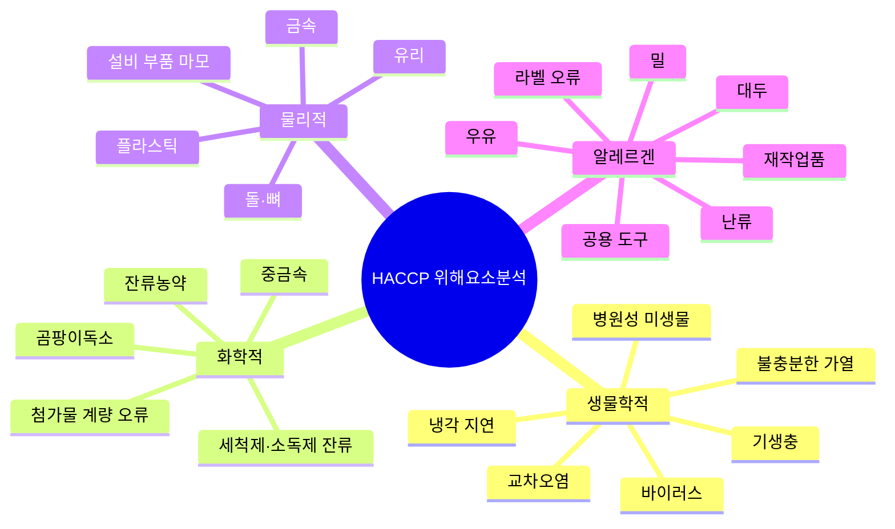
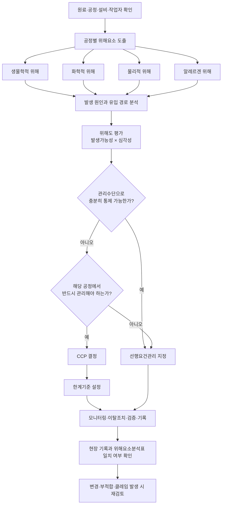

# [QA+ 블로그 생성 결과물] HC002 식품위해요소 4유형
생성일시: 2026-09-10 06:52:47 (KST)
적용모델: gpt-5.6-terra

================================================================================
# 📋 최종 발행용 블로그 패키지

### 1. 메타 데이터 (SEO 설정)

- **최종 포스팅 제목**: HACCP 식품위해요소 4유형 완벽 정리｜생물학적·화학적·물리적·알레르겐 공정별 분석법
- **메타 디스크립션 (120자 내외 요약)**: HACCP 위해요소분석표 작성법을 생물학적·화학적·물리적·알레르겐 4유형으로 정리했습니다. 공정별 작성 예시, CCP 구분, 알레르겐 교차접촉 관리까지 확인하세요.
- **추천 해시태그 (10개)**: #HACCP #식품위해요소 #위해요소분석 #식품안전 #식품품질관리 #알레르겐관리 #CCP #선행요건관리 #식품공장 #HACCP심사
- **카테고리**: HACCP가이드 / 식품품질실무

> **편집·사실관계 검수 메모**  
> - 「식품위생법」 제48조는 식품 및 축산물 안전관리인증기준(HACCP)의 법적 근거 조항입니다.  
> - HACCP의 세부 운영기준은 「식품 및 축산물 안전관리인증기준」 고시 및 업종별 적용기준을 최신본으로 확인해야 합니다.  
> - 알레르기 유발물질 표시 관련 기준은 「식품 등의 표시·광고에 관한 법률」 및 「식품 등의 표시기준」을 확인해야 합니다.  
> - 알레르겐은 전통적인 HACCP 3유형 분류에서는 화학적 위해요소와 연계될 수 있으나, 현장 관리상 별도 범주로 구분하는 설명은 실무적으로 적절합니다.

---

## 2. 네이버 블로그 / 티스토리 복사용 최종 원고 (Markdown)

# HACCP 식품위해요소 4유형 완벽 정리: 생물학적·화학적·물리적·알레르겐을 공정별로 분석하는 법

> **20년 실무 선배의 한 줄 요약**  
> 위해요소분석표는 “미생물·이물·세척제”를 반복해 적는 문서가 아닙니다. 우리 공장의 **원료·공정·설비·작업자·보관·표시**를 따라가며, 생물학적·화학적·물리적·알레르겐 위해요소가 **왜 발생하고 어떻게 막히는지** 논리적으로 연결한 식품안전 지도입니다.

---

## 1. 위해요소분석표를 써도 심사에서 지적받는 진짜 이유

위해요소분석표를 작성할 때마다 “미생물”, “이물”, “화학물질”만 반복해서 적고 계시지는 않으신가요? 현장에서 정말 많이 보이는 패턴입니다. 틀린 말은 아니지만, 심사관 입장에서는 “그래서 이 제품의 어느 공정에서, 어떤 원인으로, 어떤 미생물이 문제라는 건가요?”라는 질문이 바로 나옵니다. 위해요소분석은 단어를 많이 적는 업무가 아니라 실제 위험을 찾아내는 업무이기 때문입니다.

예를 들어 냉동만두의 증숙공정이라면 핵심은 단순히 “미생물”이 아닙니다. **“증숙 온도 또는 시간이 부족하여 병원성 미생물이 생존할 가능성”**처럼 공정 조건과 연결해야 합니다. 반대로 포장공정에서는 “이물”이 아니라 **“포장기 부품 마모·이탈에 따른 금속성 이물 혼입 가능성”**이라고 적어야 예방관리 방법이 자연스럽게 따라옵니다.

알레르겐은 특히 헷갈리기 쉬운 항목입니다. 우유나 난류, 대두, 밀을 함유한 제품을 생산하면서 표시사항만 맞으면 된다고 생각하는 경우가 많습니다. 하지만 HACCP 관점에서는 알레르겐 원료가 같은 창고에 보관되는지, 같은 계량스푼을 쓰는지, 품목 전환 세척이 검증되는지, 재작업품이 다른 제품에 들어가는지까지 봐야 합니다.

> **핵심 결론**
> - 식품위해요소 4유형은 실무상 **생물학적·화학적·물리적·알레르겐**으로 구분하면 가장 이해하기 쉽습니다.
> - 중요한 것은 분류 암기가 아니라 **발생 원인과 관리수단을 공정별로 연결하는 것**입니다.
> - 알레르겐은 표시관리와 별개로 **비의도적 교차접촉(cross-contact)** 가능성을 분석해야 합니다.


그렇다면 HACCP에서 말하는 위해요소는 정확히 어디까지일까요? 먼저 법적 근거와 기본 개념을 단단히 잡고 가겠습니다.

---

## 2. HACCP에서 말하는 위해요소와 법적 기준의 출발점

「식품위생법」 제48조는 식품의 원료관리부터 제조·가공·조리·유통까지 전 과정에서 위해한 물질의 혼입 또는 오염을 방지하기 위한 식품안전관리인증기준, 즉 HACCP의 법적 근거를 두고 있습니다. 쉽게 말하면, 문제가 생긴 뒤 제품을 회수하는 방식이 아니라 **문제가 생기기 전에 위험한 지점을 찾아 차단하자**는 제도입니다. 그래서 HACCP 문서는 사무실에서 만드는 서류가 아니라 현장을 설명하는 문서여야 합니다. 현장과 문서가 다르면 심사 때는 물론이고 실제 사고가 났을 때도 방어가 어렵습니다.

「식품 및 축산물 안전관리인증기준」에 따른 HACCP 운영은 선행요건관리, HACCP 관리, 검증 및 기록관리 체계로 이루어집니다. 이 가운데 위해요소분석은 원료 입고부터 출하까지의 모든 단계를 확인하고, 각 단계에서 유입되거나 증식하거나 잔존할 수 있는 위해요소를 분석하는 핵심 활동입니다. 분석한 뒤에는 해당 위해요소를 선행요건관리로 통제할지, CCP로 관리할지 결정해야 합니다. 다만 고시의 세부 별표와 문구는 개정될 수 있으므로, 인증·갱신심사 준비 시에는 반드시 식품의약품안전처의 최신 고시와 업종별 기준을 재확인하셔야 합니다.

개별 위해요소의 기준과 규격은 「식품의 기준 및 규격」, 흔히 말하는 식품공전에서 확인합니다. 미생물 규격, 잔류농약, 중금속, 곰팡이독소, 식품첨가물, 이물 관련 사항은 제품 특성에 맞는 식품공전 기준을 검토해야 합니다. 여기서 많이 하는 오해가 하나 있습니다. 식품공전에 기준이 있다는 이유만으로 그 항목이 무조건 CCP가 되는 것은 아닙니다.

알레르기 유발물질 표시 대상과 방법은 「식품 등의 표시·광고에 관한 법률」 및 「식품 등의 표시기준」을 기준으로 확인해야 합니다. 그런데 표시가 정확하다고 해서 알레르겐 관리가 끝나는 것은 아닙니다. 표시관리는 소비자에게 제품 정보를 정확히 제공하는 관리이고, 교차접촉 방지는 의도하지 않은 알레르겐 혼입 자체를 예방하는 관리입니다. 둘 중 하나만 잘해서는 부족합니다.

이제 법적 출발점을 잡았으니, 현장에서 바로 써먹을 수 있도록 4유형을 한눈에 정리해 보겠습니다.

---

## 3. 식품위해요소 4유형, 헷갈리지 않게 한 번에 정리

전통적인 HACCP 분류는 생물학적·화학적·물리적 위해요소 3유형을 기본으로 합니다. 다만 최근 식품안전 실무와 교육에서는 알레르겐 관리의 중요성이 커졌기 때문에, 알레르겐을 독립적인 관리 범주로 구분해 **식품위해요소 4유형**으로 설명하는 방식이 널리 사용됩니다. 알레르겐은 넓게 보면 화학적 위해요소와 연결해 볼 수 있습니다. 그러나 발생 경로와 관리 방법이 매우 다르므로 현장에서는 별도 칸으로 분리하는 편이 훨씬 효과적입니다.

생물학적 위해요소는 병원성 미생물, 바이러스, 기생충처럼 살아 있는 생물 또는 생물 유래 오염으로 인해 건강상 위해를 일으키는 요소입니다. 살모넬라, 리스테리아 모노사이토제네스, 장출혈성 대장균, 황색포도상구균, 바실러스 세레우스, 노로바이러스, 아니사키스 등이 대표적입니다. 특히 가열 후 냉각이 늦어지거나, 가열 제품이 비가열 구역에서 다시 오염되는 경우가 실무에서 자주 문제 됩니다. 쉽게 말하면 “원료에 있던 균을 못 죽였거나, 죽인 뒤 다시 묻힌 경우”라고 이해하시면 됩니다.

화학적 위해요소는 세척제·소독제 잔류, 잔류농약, 동물용의약품, 중금속, 식품첨가물 과량 사용, 곰팡이독소, 히스타민, 윤활유 같은 비식품용 화학물질을 포함합니다. 곰팡이독소가 미생물과 관련 있는데도 화학적 위해요소로 분류되는 이유가 바로 여기 있습니다. 곰팡이 자체가 아니라 곰팡이가 생성한 **독성 화학물질**이 위해의 직접 원인이기 때문입니다. 즉, “곰팡이가 보인다”는 생물학적 관점과 “곰팡이가 만든 독소가 남아 있다”는 화학적 관점은 구분해서 보셔야 합니다.

물리적 위해요소는 금속, 유리, 플라스틱, 돌, 나무 조각, 뼈, 나사·볼트, 포장재 조각처럼 식품에 섞여 소비자에게 상해를 줄 수 있는 이물입니다. 알레르겐 위해요소는 우유·난류·대두·밀 등 알레르기 유발물질이 원료 오사용, 공용 설비, 도구, 작업복, 재작업품, 잘못된 라벨을 통해 의도하지 않게 노출되는 위험입니다. 물리적 이물은 눈에 보이거나 검출기로 잡히는 경우가 많지만, 알레르겐은 눈에 보이지 않는다는 점이 다릅니다. 그래서 알레르겐은 “보이지 않는 이물”처럼 더 꼼꼼한 동선 관리가 필요합니다.

| 구분 | 대표 위해요소 | 주요 유입·발생 원인 | 대표 관리수단 |
|---|---|---|---|
| 생물학적 | 살모넬라, 리스테리아, 노로바이러스, 바실러스 세레우스 | 원료 오염, 불충분한 가열, 냉각 지연, 교차오염 | 원료 규격, 가열·냉각 관리, 세척·소독, 개인위생 |
| 화학적 | 세척제, 잔류농약, 중금속, 곰팡이독소, 첨가물 | 원료 오염, 헹굼 불량, 계량 오류, 비식품용 화학물질 혼입 | 공급업체 관리, CoA 확인, 세척농도·헹굼 관리, 이중계량 |
| 물리적 | 금속, 유리, 플라스틱, 돌, 나사, 뼈 | 설비 마모·파손, 원료 혼입, 포장재 손상 | 선별, 체·필터, 자석, 금속검출기, X-ray, 설비점검 |
| 알레르겐 | 우유, 난류, 대두, 밀 등 알레르기 유발물질 | 원료 오사용, 공용 도구·설비, 재작업품 오투입, 라벨 오류 | 매트릭스, 분리보관, 생산순서, 세척검증, 라벨 대조 |



이제부터는 이 4유형을 실제 위해요소분석표 문장으로 어떻게 바꾸는지 알아보겠습니다. 이 부분만 잡으셔도 “복사한 문서 같다”는 심사 지적은 크게 줄어듭니다.

---

## 4. 위해요소분석표는 ‘공정명 + 위해요소 + 발생 원인’으로 작성하세요

좋은 위해요소분석표의 기본 공식은 간단합니다. **공정명 + 구체적 위해요소 + 발생 원인 + 예방관리 방법**입니다. “포장공정 / 이물”이라고만 쓰면 무엇을 점검해야 하는지 알 수 없습니다. 반면 “포장공정 / 포장설비 마모 또는 부품 이탈에 따른 금속성 이물 혼입 가능성”이라고 쓰면 설비 일상점검, 부품관리, 금속검출기 관리로 자연스럽게 이어집니다.

생물학적 위해요소는 제품의 수분활성도, pH, 가열 여부, 냉장·냉동 유통 여부를 반영해야 합니다. 예를 들어 비가열 소스의 충진공정은 “충진노즐 및 작업자 접촉에 따른 병원성 미생물 재오염 가능성”으로 작성할 수 있습니다. 증숙 만두 공정은 “증숙 중심부 온도 미달에 따른 병원성 미생물 생존 가능성”이 더 적절합니다. 같은 미생물 위해라도 공정이 다르면 원인과 통제 방법도 달라집니다.

화학적 위해요소는 ‘무엇이 식품에 들어올 수 있는가’와 ‘왜 남을 수 있는가’를 같이 봐야 합니다. 예를 들어 세척공정에서는 “세척제 희석농도 과다 또는 헹굼 불충분에 따른 세척제 잔류 가능성”으로 작성합니다. 배합공정에서는 “식품첨가물 계량 오류에 따른 사용기준 초과 가능성”으로 구체화할 수 있습니다. “세척제”와 “알레르겐”은 모두 눈에 잘 안 보인다는 점은 비슷하지만, 세척제는 화학물질 잔류이고 알레르겐은 특정 단백질의 비의도적 혼입이라는 점에서 관리기록이 달라집니다.

알레르겐은 “알레르겐 있음”이라고 적는 방식보다 교차접촉 경로를 적는 방식이 좋습니다. 예를 들어 “배합공정 / 대두 함유 원료와 비함유 원료의 공용 계량도구 사용에 따른 알레르겐 교차접촉 가능성”처럼 작성해 보세요. 그러면 전용 도구, 색상 구분, 세척 기준, 생산순서, 작업자 교육, 육안 확인 기록이 관리수단으로 따라옵니다. 심사관도 바로 “현장 특성을 반영해 분석했구나”라고 판단합니다.

| 작성 구분 | 지적받기 쉬운 표현 | 실무형 개선 표현 | 연결할 관리 근거 |
|---|---|---|---|
| 증숙공정 | 미생물 | 증숙 중심부 온도·시간 미달에 따른 병원성 미생물 생존 가능성 | 가열 한계기준, 중심온도 기록, 검증자료 |
| 배합공정 | 알레르겐 | 공용 계량도구 사용에 따른 대두 알레르겐 교차접촉 가능성 | 알레르겐 매트릭스, 도구 구분표, 세척기록 |
| 세척공정 | 화학물질 | 세척제 농도 과다 및 헹굼 불충분에 따른 세척제 잔류 가능성 | 희석농도 기록, 헹굼 절차, 교육기록 |
| 금속검출공정 | 이물 | 설비 마모 또는 전공정 유입에 따른 금속성 이물 잔존 가능성 | 감도점검 기록, 부적합품 격리·재검 기록 |
| 라벨부착공정 | 표시 | 원료 변경 또는 라벨 혼입에 따른 알레르기 표시 누락 가능성 | 라벨 승인서, 초·중·종 대조기록 |

문장을 제대로 만들었다면 다음은 평가입니다. 위해도가 높다고 무조건 CCP는 아니고, 발생 가능성이 낮다고 아무 근거 없이 제외해서도 안 됩니다.

---

## 5. CCP와 선행요건관리, 이렇게 구분하면 흔들리지 않습니다

HACCP에서 가장 중요한 질문 중 하나는 “이 위해요소를 어디에서, 어떤 수단으로 통제할 것인가?”입니다. 이때 많은 분이 위해요소분석표에 적힌 항목은 전부 CCP가 되어야 한다고 오해합니다. 아닙니다. 위해요소를 먼저 빠짐없이 분석한 뒤, 기존의 선행요건관리로 충분히 통제되는지와 해당 공정에서 한계기준을 두고 관리해야 하는지를 판단해야 합니다.

가열, 냉각, 금속검출처럼 특정 한계기준을 설정하고 모니터링할 수 있는 단계는 CCP 후보가 될 수 있습니다. 예를 들어 제품 특성상 검증된 가열 조건이 필요하고, 가열 실패 시 후속 단계에서 위해를 제거할 수 없다면 가열공정은 중요한 CCP 후보입니다. 금속검출공정도 검출 감도, 시험편 통과 여부, 부적합품 처리 기준을 정하고 관리한다면 CCP로 운영되는 경우가 많습니다. 단, CCP 결정은 제품과 공정별 위해요소분석 결과 및 의사결정 절차에 따라야 합니다.

반면 개인위생, 방충·방서, 작업장 청소, 화학물질 보관, 유리·취성플라스틱 관리, 알레르겐 구획관리는 대체로 선행요건관리로 운영됩니다. 쉽게 말하면 특정 제품 한 개를 잡는 장치라기보다, 공장 전체의 위생 바닥을 만드는 활동입니다. 그렇다고 “선행요건이니까 위해요소분석에서 빼도 된다”는 뜻은 절대 아닙니다. 위해요소분석에서 발생 가능성을 검토한 뒤, 그 통제수단으로 선행요건관리를 지정하는 것이 올바른 순서입니다.

> **심사 대응 꿀팁**  
> 관리수단과 기록의 일치가 중요합니다. 위해요소분석표에는 “알레르겐 전용도구 사용”이라고 적혀 있는데 현장에는 전용도구가 없거나, “생산순서 관리”라고 적혀 있는데 실제 생산계획서에 순서가 표시되지 않으면 바로 지적 대상이 됩니다. 문서를 멋지게 만드는 것보다 현장에서 실제로 할 수 있는 관리 방법을 정하세요. 그리고 그 관리가 되었다는 증빙을 남기면 됩니다.




그럼 이론이 실제 현장에서 어떻게 적용되는지, 서로 다른 업종의 사례로 보겠습니다. 아래 사례는 특정 업체가 아닌 현장 교육과 개선 과정에서 자주 만나는 상황을 재구성한 예시입니다.

---

## 6. 실제 현장 사례 1: 냉동만두 증숙·냉각공정의 생물학적 위해 관리

### 사례 1. 냉동만두 제조업체의 증숙 중심온도 관리 개선

한 냉동만두 제조업체는 위해요소분석표의 증숙공정에 단순히 “미생물”이라고만 작성해 두고 있었습니다. 정기심사 준비 중 현장 점검을 해 보니 증숙기 설정온도는 기록하고 있었지만, 만두 중심부 온도는 정기적으로 확인하지 않고 있었습니다. 특히 만두 중량이 변경되거나 속재료 수분이 달라진 날에도 동일한 증숙시간을 적용하고 있었습니다. 문제는 증숙기 내부의 설정온도가 높아도 제품 중심부까지 필요한 열이 충분히 전달된다는 보장은 없다는 점입니다.

또한 증숙 후 냉각구간에서 제품이 한꺼번에 적체되는 날에는 냉각시간이 평소보다 길어졌습니다. 작업자는 “이미 익힌 제품이라 괜찮다”고 생각했지만, 가열 후 제품은 냉각이 지연되거나 작업자·설비와 접촉하면 다시 오염될 수 있습니다. 근본 원인은 제품 규격 변경 시 가열 조건을 재검증하는 절차가 없었던 것과, 냉각공정의 실제 제품 온도 관리 기준이 없었던 데 있었습니다. 즉, 기록은 있었지만 위해요소를 통제한다는 관점의 기록은 아니었던 것입니다.

개선 조치로 업체는 제품 중량별 대표 샘플을 선정해 증숙 종료 시 중심온도와 유지시간을 검증했습니다. 이후 생산 시에는 시작·중간·종료 시점에 정해진 샘플의 중심온도를 측정하고, 기준 미달 시 제품을 격리하도록 절차를 만들었습니다. 냉각공정에는 적체 허용량, 냉각 종료 목표온도, 냉각시간 확인 항목을 추가했습니다. 가열 후 구역과 비가열 작업구역의 작업자 이동도 분리하고, 냉각 컨베이어 세척주기와 확인기록을 강화했습니다.

그 결과 위해요소분석표는 “증숙 불충분에 따른 병원성 미생물 생존 가능성”, “냉각 지연 및 가열 후 교차오염에 따른 미생물 증식·오염 가능성”으로 구체화됐습니다. CCP 또는 선행요건관리의 결정 근거도 훨씬 명확해졌습니다. 무엇보다 생산팀도 왜 온도를 재는지 이해하게 되어 기록 누락이 줄었습니다. 좋은 HACCP은 품질팀만 아는 문서가 아니라 생산팀이 납득하고 움직이는 기준이라는 것을 보여 준 사례였습니다.

---

## 7. 실제 현장 사례 2: 소스류 공장의 알레르겐 교차접촉과 라벨 관리

### 사례 2. 대두·밀 함유 소스와 비함유 소스를 함께 생산한 배합공정

소스류를 생산하는 한 업체는 간장과 밀 함유 조미원료를 사용하는 제품, 그리고 해당 원료를 사용하지 않는 제품을 같은 배합실에서 생산하고 있었습니다. 위해요소분석표에는 “알레르겐 표시 확인”만 있었고, 공용 배합탱크와 호스에서 발생할 수 있는 교차접촉은 분석하지 않았습니다. 생산현장을 따라가 보니 작업자가 대두 함유 원료를 계량한 스쿱을 세척 없이 다음 제품 계량에 사용하는 경우도 있었습니다. 재작업품 용기에는 제품명만 적혀 있고 알레르겐 정보는 표시되지 않았습니다.

문제는 표시가 정확한 비함유 제품이라도 대두나 밀이 비의도적으로 혼입되면 민감 소비자에게 위해를 줄 수 있다는 점입니다. 특히 재작업품이 잘못 투입되면 소량 혼입이라도 발생 원인을 추적하기 어렵습니다. 근본 원인은 알레르겐을 단순 표시사항으로만 본 것이었습니다. 원료, 반제품, 설비, 도구, 작업자, 재작업품, 라벨을 하나의 흐름으로 관리해야 하는데 각 부서가 따로 움직이고 있었습니다.

개선 조치로 가장 먼저 원료와 제품의 알레르겐 정보를 정리한 **알레르겐 매트릭스**를 만들었습니다. 대두·밀·우유·난류 등 업체 취급 원료를 세로축에, 제품을 가로축에 놓아 어떤 제품에 어떤 알레르겐이 들어가는지 한눈에 보이도록 했습니다. 계량스쿱, 호스, 반제품 용기는 색상으로 구분하고, 전용 사용이 어려운 품목은 세척 후 확인 절차를 만들었습니다. 생산순서는 원칙적으로 알레르겐 비함유 또는 상대적으로 단순한 제품부터 알레르겐 함유 제품 순으로 배치했습니다.

품목 전환 시에는 세척 전·후 사진, 세척 담당자, 세척 확인자, 사용 가능 판정자를 기록하도록 했습니다. 재작업품에는 제품명뿐 아니라 제조일, 로트, 알레르겐 정보, 투입 가능 제품을 명확히 표시했습니다. 라벨은 자재 입고 시, 작업 시작 시, 품목 전환 시, 작업 종료 시에 대조하는 초·중·종 확인 체계로 강화했습니다. 그 결과 심사 전 모의점검에서 “알레르겐 관리를 표시와 교차접촉 관점으로 구분해 운영하고 있다”는 평가를 받았고, 현장 혼입 가능성도 눈에 띄게 줄었습니다.

---

## 8. 실제 현장 사례 3: 레토르트 식품의 물리적·화학적 위해요소 개선

### 사례 3. 레토르트 카레 제조업체의 금속성 이물과 세척제 잔류 예방

레토르트 카레를 생산하는 한 업체는 금속검출기를 운영하고 있었기 때문에 물리적 위해요소 관리는 충분하다고 생각했습니다. 하지만 이물 클레임 분석 결과, 금속이 아닌 작은 플라스틱 조각과 포장재 절단편 관련 문의가 반복적으로 발생했습니다. 금속검출기는 말 그대로 금속성 이물에 대한 관리수단일 뿐, 플라스틱이나 유리, 돌까지 모두 잡아주는 장비는 아닙니다. 그럼에도 위해요소분석표에는 “금속검출기 관리로 이물 제거”라고만 적혀 있었습니다.

현장을 확인해 보니 파우치 공급부 주변의 플라스틱 가이드가 마모되고 있었고, 교체주기가 정해져 있지 않았습니다. 또한 세척 후 헹굼 관리도 담당자 경험에 의존하고 있었으며, 세척제 희석농도는 작업자가 눈대중으로 맞추는 날도 있었습니다. 근본 원인은 이물 위해요소를 금속으로만 한정한 점과, 세척제 잔류 가능성을 세척작업의 품질 문제로만 보고 화학적 위해요소로 분석하지 않은 점이었습니다. 즉, 검출 장비 하나에 지나치게 의존한 것이 문제였습니다.

개선 조치로 업체는 금속성 이물, 플라스틱·포장재 이물, 세척제 잔류를 각각 분리해 위해요소분석표에 작성했습니다. 플라스틱 가이드, 커버, 스크레이퍼 등 취성플라스틱 설비의 목록을 만들고 월 1회 정기점검과 파손 시 즉시 보고 절차를 운영했습니다. 포장기 주변 부품은 일상점검 항목에 포함했고, 파손·마모 발견 시 해당 시간대 제품의 격리 범위를 정했습니다. 금속검출기는 정해진 시험편을 사용해 작업 시작 전, 작업 중, 작업 종료 후 감도를 확인하고 부적합품의 격리·재검·처리 절차를 명문화했습니다.

세척제는 지정 농도에 맞춰 계량컵 또는 자동희석장치를 사용하도록 바꾸고, 농도 확인과 헹굼 완료 확인자를 분리했습니다. 세척 직후 설비를 바로 가동하지 않고, 육안 확인과 필요 시 내부 기준에 따른 검증을 거친 후 사용승인을 하도록 했습니다. 그 결과 이물 클레임의 원인 추적 시간이 줄었고, 설비 마모를 조기에 발견하는 사례가 늘었습니다. 무엇보다 “금속검출기가 있으니 이물은 끝”이라는 잘못된 인식이 사라진 것이 가장 큰 개선 효과였습니다.

세 사례를 보시면 공통점이 하나 보이실 겁니다. 위해요소는 제품명이 아니라 **발생 원인**을 따라가야 제대로 관리됩니다.

---

## 9. 식품위해요소 4유형별 현장 점검 질문과 증빙자료

생물학적 위해요소를 점검할 때는 “균이 있느냐”보다 “균이 들어오고, 살아남고, 늘어나고, 다시 묻을 가능성이 있느냐”를 순서대로 보시면 됩니다. 원료 입고 시 규격서와 시험성적서(CoA)를 확인하는지, 가열 조건이 제품 중심부 기준으로 검증됐는지, 냉각시간과 냉각온도를 관리하는지 확인하세요. 가열 후 구역에서 비가열 원료나 오염된 도구가 접촉할 가능성도 놓치기 쉽습니다. 종업원 손 위생과 장갑 교체 기준도 생물학적 위해 관리의 중요한 증빙입니다.

화학적 위해요소는 승인된 원료 구매와 작업장 내 화학물질 관리가 중심입니다. 원료 규격서, 공급업체 평가서, 잔류농약·중금속·곰팡이독소 관련 시험성적서가 위해도 평가의 근거가 됩니다. 세척제와 소독제는 식품용 또는 용도에 적합한 제품인지, 원액과 희석액이 구분 보관되는지, 라벨이 붙어 있는지, 희석농도와 헹굼이 확인되는지를 보셔야 합니다. 첨가물은 품목별 사용기준뿐 아니라 계량자와 확인자를 분리하는 이중확인 체계까지 갖추면 좋습니다.

물리적 위해요소는 설비와 현장의 “깨질 수 있는 것, 빠질 수 있는 것, 섞일 수 있는 것”을 찾는 작업입니다. 원료 선별, 체·필터·자석, 금속검출기, X-ray는 모두 좋은 관리수단이지만 제품과 위해요소에 맞아야 합니다. 예를 들어 금속검출기로 유리나 돌을 관리한다고 쓰면 안 됩니다. 유리·취성플라스틱 관리대장, 공구 관리대장, 설비 예방보전 기록, 이물 클레임 분석서는 매우 중요한 근거자료입니다.

알레르겐은 원료명세서, 알레르겐 매트릭스, 보관 위치도, 생산순서표, 전용도구 관리표, 세척기록, 재작업품 관리대장, 라벨 승인·대조기록을 묶어서 봐야 합니다. 특히 원료 변경이 있을 때 구매팀만 알고 품질팀이 모르면 표시 누락 사고가 발생할 수 있습니다. 원료 변경 승인 절차에 품질부서의 알레르겐·표시 검토 단계를 반드시 넣으세요. “원료는 바뀌었는데 라벨은 예전 것”이 가장 위험하고도 자주 발생하는 실수입니다.

---

## 10. 자주 묻는 질문(FAQ)과 심사관 단골 지적사항

### Q1. 알레르겐은 화학적 위해요소인가요, 별도 위해요소인가요?

**A.** 전통적인 HACCP 분류에서는 알레르겐을 화학적 위해요소 범주와 연계해 볼 수 있습니다. 다만 실제 제조현장에서는 교차접촉, 재작업품, 생산순서, 라벨 오류처럼 관리 포인트가 독립적이므로 별도 유형으로 관리하는 것이 훨씬 실용적입니다. 위해요소분석표에서도 알레르겐 칸을 별도로 두거나, 최소한 화학적 위해요소와 명확히 구분해 작성하시는 것을 권합니다.

### Q2. 모든 위해요소를 CCP로 지정해야 하나요?

**A.** 아닙니다. 위해요소를 분석한 뒤 선행요건관리로 충분히 예방 가능한지, 해당 단계에서 반드시 관리하지 않으면 위해를 통제할 수 없는지를 검토해야 합니다. 가열·냉각·금속검출은 CCP가 될 수 있지만, 개인위생·해충방제·알레르겐 구획관리는 일반적으로 선행요건관리로 운영되는 경우가 많습니다. 핵심은 “CCP가 몇 개냐”가 아니라 위해요소가 실제로 통제되느냐입니다.

### Q3. 금속검출기가 있으면 물리적 위해요소는 모두 관리되는 것 아닌가요?

**A.** 아닙니다. 금속검출기는 금속성 이물에 대한 검출수단입니다. 유리, 돌, 플라스틱, 나무, 뼈, 해충 사체, 포장재 조각은 제품 특성에 따라 원료 선별, 취성플라스틱 관리, 설비점검, X-ray 등 다른 예방·검출수단이 필요할 수 있습니다. 금속검출기 점검기록만 있고 부적합품 격리 및 재검 절차가 없다면 심사 지적 가능성도 높습니다.

### Q4. 알레르겐 표기만 정확하면 교차접촉 관리는 하지 않아도 되나요?

**A.** 아닙니다. 표시 정확성은 법적 표시관리의 핵심이고, 교차접촉 방지는 HACCP 관점의 식품안전 관리입니다. 알레르겐 함유 원료를 취급하는 설비·도구·작업복·보관구역·재작업품을 통해 비의도적 혼입이 발생할 수 있으므로 별도 관리가 필요합니다. 특히 비함유 제품을 생산하는 경우라면 생산순서와 세척 검증은 반드시 확인하셔야 합니다.

### Q5. 원료의 시험성적서가 없으면 위해도 평가를 ‘낮음’으로 하면 안 되나요?

**A.** 단순히 시험성적서가 없다는 이유만으로 무조건 높음으로 평가해야 하는 것은 아닙니다. 다만 공급업체 평가, 원료 규격서, 법적 기준, 과거 검사결과, 클레임 이력, 공정 특성 등 객관적 근거 없이 “낮음”이라고 적으면 심사에서 설득력이 없습니다. 위해도 평가는 감이 아니라 근거자료로 설명할 수 있어야 합니다.

### Q6. 재작업품은 같은 제품에만 넣으면 괜찮지 않나요?

**A.** 원칙적으로 동일 제품 또는 알레르겐 조성과 안전성이 동등한 제품에만, 정해진 기준 안에서 투입하도록 관리해야 합니다. 제품명만 같아도 원료 배합이나 라벨 표시가 변경됐다면 문제가 될 수 있습니다. 재작업품 용기에는 제품명, 제조일, 로트, 알레르겐 정보, 사용기한 또는 사용 가능 기준을 분명히 표시하세요.

심사관이 자주 보는 지적사항도 정리해 보겠습니다.

- 모든 제품과 공정의 위해요소분석표가 복사·붙여넣기 형태로 동일합니다.
- 위해요소는 적혀 있지만 발생 원인과 예방관리 방법이 연결되지 않습니다.
- 원료 규격서·시험성적서·공급업체 평가서 없이 위해도를 낮게 평가합니다.
- 알레르겐 원료가 있는데도 매트릭스, 생산순서, 전용도구 또는 세척 기준이 없습니다.
- 금속검출기 감도점검은 하지만 부적합 제품의 격리, 재검, 폐기 또는 재처리 절차가 불명확합니다.

이제 마지막으로, 실제 문서를 검토할 때 사용할 수 있는 체크리스트를 드리겠습니다. 심사 전날 한 번 훑어보셔도 빠진 부분이 꽤 잘 보입니다.

---

## 11. 위해요소분석표 작성·검토 체크리스트

| 점검 단계 | 확인 항목 | 실무 기준 예시 | 확인 방법·증빙 |
|---|---|---|---|
| 원료 입고 | 원료별 생물학적·화학적·알레르겐 위험 확인 | 축산물·농산물·수산물·분말원료 특성별 관리 | 원료 규격서, CoA, 공급업체 평가서 |
| 보관 | 냉장·냉동 온도 및 알레르겐 분리관리 | 냉장·냉동 기준은 품목별 자체 기준 및 법적 기준 확인 | 온도기록, 창고 배치도, 구획 표지 |
| 배합 | 첨가물 계량 오류 및 알레르겐 교차접촉 | 계량자-확인자 이중확인, 색상 도구 구분 | 배합기록, 도구관리표, 교육기록 |
| 가열 | 병원성 미생물 사멸 조건 검증 | 제품 중심온도·시간 기준을 검증자료로 설정 | 가열기록, 중심온도 측정, 검증보고서 |
| 냉각 | 냉각 지연에 따른 미생물 증식 방지 | 적체량·냉각시간·종료온도 관리 | 냉각기록, 현장점검표 |
| 포장 | 라벨 오류 및 포장재 이물 확인 | 작업 전·중·후 라벨 대조, 포장재 상태 확인 | 라벨 대조기록, 자재 불출기록 |
| 금속검출 | 금속성 이물 검출 및 부적합품 처리 | 작업 전·중·후 시험편 점검, 부적합품 격리 | 감도점검 기록, 격리·재검 기록 |
| 세척·소독 | 세척제 잔류와 알레르겐 잔존 예방 | 희석농도, 헹굼, 품목전환 세척 확인 | 세척일지, 농도기록, 세척검증 자료 |
| 재작업품 | 오투입·알레르겐 혼입 방지 | 제품·로트·알레르겐·투입 가능 품목 표시 | 재작업품 관리대장, 라벨 |
| 출하 | 표시사항 및 로트 추적성 최종 확인 | 출하 전 제품명·표시·로트 대조 | 출하검사 기록, 로트추적 기록 |

체크리스트를 볼 때는 “기록이 있는가?”만 보지 마시고 “기록이 실제 위해를 막는가?”를 같이 보셔야 합니다. 예를 들어 냉장고 온도기록이 매일 정상이어도 온도계 교정이 안 되어 있다면 신뢰성이 떨어집니다. 세척일지가 있어도 알레르겐 품목 전환 시 세척이 실제로 수행됐는지 확인할 방법이 없다면 부족합니다. 기록은 종이가 아니라 관리가 수행됐다는 증거여야 합니다.

위해요소분석표는 한 번 만들고 끝나는 문서도 아닙니다. 원료 공급처가 바뀌었을 때, 배합비가 변경됐을 때, 설비를 교체했을 때, 신제품을 추가했을 때, 소비자 클레임이나 부적합이 발생했을 때는 반드시 재검토해야 합니다. 특히 알레르겐 관련 원료 변경과 라벨 변경은 동시에 검토하는 습관을 들이세요. 이 한 가지 습관만으로도 큰 표시사고를 상당수 예방할 수 있습니다.

---

## 12. 맺음말: 좋은 HACCP 문서는 현장을 안전하게 움직입니다

오늘 내용은 세 줄로 정리할 수 있습니다.

첫째, 식품위해요소 4유형은 **생물학적·화학적·물리적·알레르겐**으로 구분해 보면 현장 적용이 쉽습니다.  
둘째, 위해요소분석표는 포괄적인 단어가 아니라 **공정과 발생 원인**을 연결해 작성해야 합니다.  
셋째, 알레르겐은 표시 확인만으로 끝내지 말고 원료·도구·설비·생산순서·세척·재작업품·라벨까지 관리해야 합니다.

좋은 HACCP 문서는 위해요소를 많이 적은 문서가 아닙니다. 우리 공장에서 실제로 일어날 수 있는 위험을 정확히 찾아내고, 누가 봐도 납득할 수 있는 방법으로 통제하는 문서입니다. 처음부터 완벽하게 만들려고 너무 부담 갖지 마세요. 원료 입고부터 출하까지 한 공정씩 걸어 보면서 “여기서 무엇이 들어올 수 있지?”, “왜 발생하지?”, “지금 관리로 충분한가?”를 묻다 보면 답이 나옵니다.

마지막으로 위해요소분석표를 제출하기 전에는 꼭 이것만 확인해 보세요.

> **우리 제품 특성이 반영됐는가? 발생 원인이 구체적인가? 관리방법과 현장 기록이 일치하는가? 알레르겐 교차접촉을 빠뜨리지 않았는가? 평가 근거를 제시할 수 있는가?**

이 다섯 가지에 자신 있게 “예”라고 답할 수 있다면 심사 대응력도 훨씬 단단해집니다.

> “위해요소분석표는 심사 서류가 아니라 우리 공장의 식품안전 지도입니다. 현장을 제대로 담은 지도 한 장이 있으면, 신입사원도 생산팀도 같은 방향으로 움직일 수 있습니다.”

막히는 부분이 있으면 언제든 댓글로 편하게 물어보세요. 후배님들의 심사 통과와 칼퇴를 진심으로 응원합니다.

---

## 3. 워드프레스 / 웹사이트용 HTML 원고

```html
<article class="food-qa-post">
  <header>
    <h1>HACCP 식품위해요소 4유형 완벽 정리: 생물학적·화학적·물리적·알레르겐을 공정별로 분석하는 법</h1>
    <blockquote>
      <p><strong>20년 실무 선배의 한 줄 요약</strong>: 위해요소분석표는 “미생물·이물·세척제”를 반복해 적는 문서가 아닙니다. 우리 공장의 <strong>원료·공정·설비·작업자·보관·표시</strong>를 따라가며, 생물학적·화학적·물리적·알레르겐 위해요소가 <strong>왜 발생하고 어떻게 막히는지</strong> 논리적으로 연결한 식품안전 지도입니다.</p>
    </blockquote>
  </header>

  <section>
    <h2>1. 위해요소분석표를 써도 심사에서 지적받는 진짜 이유</h2>
    <p>위해요소분석표를 작성할 때마다 “미생물”, “이물”, “화학물질”만 반복해서 적고 계시지는 않으신가요? 현장에서 정말 많이 보이는 패턴입니다. 틀린 말은 아니지만, 심사관 입장에서는 “그래서 이 제품의 어느 공정에서, 어떤 원인으로, 어떤 미생물이 문제라는 건가요?”라는 질문이 바로 나옵니다. 위해요소분석은 단어를 많이 적는 업무가 아니라 실제 위험을 찾아내는 업무이기 때문입니다.</p>
    <p>예를 들어 냉동만두의 증숙공정이라면 핵심은 단순히 “미생물”이 아닙니다. <strong>“증숙 온도 또는 시간이 부족하여 병원성 미생물이 생존할 가능성”</strong>처럼 공정 조건과 연결해야 합니다. 반대로 포장공정에서는 “이물”이 아니라 <strong>“포장기 부품 마모·이탈에 따른 금속성 이물 혼입 가능성”</strong>이라고 적어야 예방관리 방법이 자연스럽게 따라옵니다.</p>
    <p>알레르겐은 특히 헷갈리기 쉬운 항목입니다. 우유나 난류, 대두, 밀을 함유한 제품을 생산하면서 표시사항만 맞으면 된다고 생각하는 경우가 많습니다. 하지만 HACCP 관점에서는 알레르겐 원료가 같은 창고에 보관되는지, 같은 계량스푼을 쓰는지, 품목 전환 세척이 검증되는지, 재작업품이 다른 제품에 들어가는지까지 봐야 합니다.</p>

    <aside>
      <h3>핵심 결론</h3>
      <ul>
        <li>식품위해요소 4유형은 실무상 <strong>생물학적·화학적·물리적·알레르겐</strong>으로 구분하면 가장 이해하기 쉽습니다.</li>
        <li>중요한 것은 분류 암기가 아니라 <strong>발생 원인과 관리수단을 공정별로 연결하는 것</strong>입니다.</li>
        <li>알레르겐은 표시관리와 별개로 <strong>비의도적 교차접촉(cross-contact)</strong> 가능성을 분석해야 합니다.</li>
      </ul>
    </aside>

    <figure>
      
      <figcaption>원료 입고부터 출하까지 공정 흐름에 따라 위해요소를 분석해야 합니다.</figcaption>
    </figure>

    <p>그렇다면 HACCP에서 말하는 위해요소는 정확히 어디까지일까요? 먼저 법적 근거와 기본 개념을 단단히 잡고 가겠습니다.</p>
  </section>

  <section>
    <h2>2. HACCP에서 말하는 위해요소와 법적 기준의 출발점</h2>
    <p>「식품위생법」 제48조는 식품의 원료관리부터 제조·가공·조리·유통까지 전 과정에서 위해한 물질의 혼입 또는 오염을 방지하기 위한 식품안전관리인증기준, 즉 HACCP의 법적 근거를 두고 있습니다. 쉽게 말하면, 문제가 생긴 뒤 제품을 회수하는 방식이 아니라 <strong>문제가 생기기 전에 위험한 지점을 찾아 차단하자</strong>는 제도입니다. 그래서 HACCP 문서는 사무실에서 만드는 서류가 아니라 현장을 설명하는 문서여야 합니다.</p>
    <p>「식품 및 축산물 안전관리인증기준」에 따른 HACCP 운영은 선행요건관리, HACCP 관리, 검증 및 기록관리 체계로 이루어집니다. 이 가운데 위해요소분석은 원료 입고부터 출하까지의 모든 단계를 확인하고, 각 단계에서 유입되거나 증식하거나 잔존할 수 있는 위해요소를 분석하는 핵심 활동입니다. 분석한 뒤에는 해당 위해요소를 선행요건관리로 통제할지, CCP로 관리할지 결정해야 합니다. 다만 고시의 세부 별표와 문구는 개정될 수 있으므로, 인증·갱신심사 준비 시에는 반드시 식품의약품안전처의 최신 고시와 업종별 기준을 재확인하셔야 합니다.</p>
    <p>개별 위해요소의 기준과 규격은 「식품의 기준 및 규격」, 흔히 말하는 식품공전에서 확인합니다. 미생물 규격, 잔류농약, 중금속, 곰팡이독소, 식품첨가물, 이물 관련 사항은 제품 특성에 맞는 식품공전 기준을 검토해야 합니다. 식품공전에 기준이 있다는 이유만으로 그 항목이 무조건 CCP가 되는 것은 아닙니다.</p>
    <p>알레르기 유발물질 표시 대상과 방법은 「식품 등의 표시·광고에 관한 법률」 및 「식품 등의 표시기준」을 기준으로 확인해야 합니다. 표시가 정확하다고 해서 알레르겐 관리가 끝나는 것은 아닙니다. 표시관리는 소비자에게 제품 정보를 정확히 제공하는 관리이고, 교차접촉 방지는 의도하지 않은 알레르겐 혼입 자체를 예방하는 관리입니다.</p>
  </section>

  <section>
    <h2>3. 식품위해요소 4유형, 헷갈리지 않게 한 번에 정리</h2>
    <p>전통적인 HACCP 분류는 생물학적·화학적·물리적 위해요소 3유형을 기본으로 합니다. 다만 현장에서는 알레르겐의 발생 경로와 관리 방법이 다르므로, 별도 관리 범주로 구분해 <strong>식품위해요소 4유형</strong>으로 설명하면 훨씬 효과적입니다.</p>

    <table>
      <thead>
        <tr>
          <th>구분</th>
          <th>대표 위해요소</th>
          <th>주요 유입·발생 원인</th>
          <th>대표 관리수단</th>
        </tr>
      </thead>
      <tbody>
        <tr>
          <td>생물학적</td>
          <td>살모넬라, 리스테리아, 노로바이러스, 바실러스 세레우스</td>
          <td>원료 오염, 불충분한 가열, 냉각 지연, 교차오염</td>
          <td>원료 규격, 가열·냉각 관리, 세척·소독, 개인위생</td>
        </tr>
        <tr>
          <td>화학적</td>
          <td>세척제, 잔류농약, 중금속, 곰팡이독소, 첨가물</td>
          <td>원료 오염, 헹굼 불량, 계량 오류, 비식품용 화학물질 혼입</td>
          <td>공급업체 관리, CoA 확인, 세척농도·헹굼 관리, 이중계량</td>
        </tr>
        <tr>
          <td>물리적</td>
          <td>금속, 유리, 플라스틱, 돌, 나사, 뼈</td>
          <td>설비 마모·파손, 원료 혼입, 포장재 손상</td>
          <td>선별, 체·필터, 자석, 금속검출기, X-ray, 설비점검</td>
        </tr>
        <tr>
          <td>알레르겐</td>
          <td>우유, 난류, 대두, 밀 등 알레르기 유발물질</td>
          <td>원료 오사용, 공용 도구·설비, 재작업품 오투입, 라벨 오류</td>
          <td>매트릭스, 분리보관, 생산순서, 세척검증, 라벨 대조</td>
        </tr>
      </tbody>
    </table>

    <div class="mermaid">
mindmap
  root((HACCP 위해요소분석))
    생물학적
      병원성 미생물
      바이러스
      기생충
      불충분한 가열
      냉각 지연
      교차오염
    화학적
      세척제·소독제 잔류
      잔류농약
      중금속
      곰팡이독소
      첨가물 계량 오류
    물리적
      금속
      유리
      플라스틱
      돌·뼈
      설비 부품 마모
    알레르겐
      우유
      난류
      대두
      밀
      공용 도구
      재작업품
      라벨 오류
    </div>
  </section>

  <section>
    <h2>4. 위해요소분석표는 ‘공정명 + 위해요소 + 발생 원인’으로 작성하세요</h2>
    <p>좋은 위해요소분석표의 기본 공식은 간단합니다. <strong>공정명 + 구체적 위해요소 + 발생 원인 + 예방관리 방법</strong>입니다. “포장공정 / 이물”이라고만 쓰면 무엇을 점검해야 하는지 알 수 없습니다. 반면 “포장공정 / 포장설비 마모 또는 부품 이탈에 따른 금속성 이물 혼입 가능성”이라고 쓰면 설비 일상점검, 부품관리, 금속검출기 관리로 자연스럽게 이어집니다.</p>

    <table>
      <thead>
        <tr>
          <th>작성 구분</th>
          <th>지적받기 쉬운 표현</th>
          <th>실무형 개선 표현</th>
          <th>연결할 관리 근거</th>
        </tr>
      </thead>
      <tbody>
        <tr>
          <td>증숙공정</td>
          <td>미생물</td>
          <td>증숙 중심부 온도·시간 미달에 따른 병원성 미생물 생존 가능성</td>
          <td>가열 한계기준, 중심온도 기록, 검증자료</td>
        </tr>
        <tr>
          <td>배합공정</td>
          <td>알레르겐</td>
          <td>공용 계량도구 사용에 따른 대두 알레르겐 교차접촉 가능성</td>
          <td>알레르겐 매트릭스, 도구 구분표, 세척기록</td>
        </tr>
        <tr>
          <td>세척공정</td>
          <td>화학물질</td>
          <td>세척제 농도 과다 및 헹굼 불충분에 따른 세척제 잔류 가능성</td>
          <td>희석농도 기록, 헹굼 절차, 교육기록</td>
        </tr>
        <tr>
          <td>금속검출공정</td>
          <td>이물</td>
          <td>설비 마모 또는 전공정 유입에 따른 금속성 이물 잔존 가능성</td>
          <td>감도점검 기록, 부적합품 격리·재검 기록</td>
        </tr>
        <tr>
          <td>라벨부착공정</td>
          <td>표시</td>
          <td>원료 변경 또는 라벨 혼입에 따른 알레르기 표시 누락 가능성</td>
          <td>라벨 승인서, 초·중·종 대조기록</td>
        </tr>
      </tbody>
    </table>
  </section>

  <section>
    <h2>5. CCP와 선행요건관리, 이렇게 구분하면 흔들리지 않습니다</h2>
    <p>HACCP에서 가장 중요한 질문 중 하나는 “이 위해요소를 어디에서, 어떤 수단으로 통제할 것인가?”입니다. 위해요소분석표에 적힌 항목이 전부 CCP가 되어야 하는 것은 아닙니다. 위해요소를 빠짐없이 분석한 뒤, 기존 선행요건관리로 충분히 통제되는지와 해당 공정에서 한계기준을 두고 관리해야 하는지를 판단해야 합니다.</p>
    <p>가열, 냉각, 금속검출처럼 특정 한계기준을 설정하고 모니터링할 수 있는 단계는 CCP 후보가 될 수 있습니다. 제품 특성상 검증된 가열 조건이 필요하고, 가열 실패 시 후속 단계에서 위해를 제거할 수 없다면 가열공정은 중요한 CCP 후보입니다. 단, CCP 결정은 제품과 공정별 위해요소분석 결과 및 의사결정 절차에 따라야 합니다.</p>
    <p>개인위생, 방충·방서, 작업장 청소, 화학물질 보관, 유리·취성플라스틱 관리, 알레르겐 구획관리는 대체로 선행요건관리로 운영됩니다. 그렇다고 선행요건이므로 위해요소분석에서 제외해도 된다는 뜻은 아닙니다. 위해요소분석에서 발생 가능성을 검토한 뒤, 그 통제수단으로 선행요건관리를 지정하는 것이 올바른 순서입니다.</p>

    <figure>
      
      <figcaption>위해요소 분석, 위해도 평가, 관리수단 결정, 모니터링·기록은 하나의 흐름으로 관리해야 합니다.</figcaption>
    </figure>

    <div class="mermaid">
flowchart TD
    A[원료·공정·설비·작업자 확인] --> B[공정별 위해요소 도출]
    B --> B1[생물학적 위해]
    B --> B2[화학적 위해]
    B --> B3[물리적 위해]
    B --> B4[알레르겐 위해]
    B1 --> C[발생 원인과 유입 경로 분석]
    B2 --> C
    B3 --> C
    B4 --> C
    C --> D[위해도 평가<br/>발생가능성 × 심각성]
    D --> E{관리수단으로<br/>충분히 통제 가능한가?}
    E -->|예| F[선행요건관리 지정]
    E -->|아니오| G{해당 공정에서<br/>반드시 관리해야 하는가?}
    G -->|예| H[CCP 결정]
    G -->|아니오| F
    H --> I[한계기준 설정]
    I --> J[모니터링·이탈조치·검증·기록]
    F --> J
    J --> K[현장 기록과 위해요소분석표 일치 여부 확인]
    K --> L[변경·부적합·클레임 발생 시 재검토]
    </div>
  </section>

  <section>
    <h2>6. 실제 현장 사례 1: 냉동만두 증숙·냉각공정의 생물학적 위해 관리</h2>
    <h3>사례 1. 냉동만두 제조업체의 증숙 중심온도 관리 개선</h3>
    <p>한 냉동만두 제조업체는 위해요소분석표의 증숙공정에 단순히 “미생물”이라고만 작성해 두고 있었습니다. 정기심사 준비 중 현장 점검을 해 보니 증숙기 설정온도는 기록하고 있었지만, 만두 중심부 온도는 정기적으로 확인하지 않고 있었습니다. 특히 만두 중량이 변경되거나 속재료 수분이 달라진 날에도 동일한 증숙시간을 적용하고 있었습니다.</p>
    <p>개선 조치로 업체는 제품 중량별 대표 샘플을 선정해 증숙 종료 시 중심온도와 유지시간을 검증했습니다. 생산 시에는 시작·중간·종료 시점에 정해진 샘플의 중심온도를 측정하고, 기준 미달 시 제품을 격리하도록 절차를 만들었습니다. 냉각공정에는 적체 허용량, 냉각 종료 목표온도, 냉각시간 확인 항목을 추가했습니다.</p>
    <p>그 결과 위해요소분석표는 “증숙 불충분에 따른 병원성 미생물 생존 가능성”, “냉각 지연 및 가열 후 교차오염에 따른 미생물 증식·오염 가능성”으로 구체화됐습니다. 좋은 HACCP은 품질팀만 아는 문서가 아니라 생산팀이 납득하고 움직이는 기준이라는 것을 보여 준 사례였습니다.</p>
  </section>

  <section>
    <h2>7. 실제 현장 사례 2: 소스류 공장의 알레르겐 교차접촉과 라벨 관리</h2>
    <h3>사례 2. 대두·밀 함유 소스와 비함유 소스를 함께 생산한 배합공정</h3>
    <p>소스류를 생산하는 한 업체는 간장과 밀 함유 조미원료를 사용하는 제품, 그리고 해당 원료를 사용하지 않는 제품을 같은 배합실에서 생산하고 있었습니다. 위해요소분석표에는 “알레르겐 표시 확인”만 있었고, 공용 배합탱크와 호스에서 발생할 수 있는 교차접촉은 분석하지 않았습니다. 재작업품 용기에는 제품명만 적혀 있고 알레르겐 정보는 표시되지 않았습니다.</p>
    <p>개선 조치로 원료와 제품의 알레르겐 정보를 정리한 <strong>알레르겐 매트릭스</strong>를 만들었습니다. 계량스쿱, 호스, 반제품 용기는 색상으로 구분하고, 전용 사용이 어려운 품목은 세척 후 확인 절차를 만들었습니다. 생산순서는 원칙적으로 알레르겐 비함유 또는 상대적으로 단순한 제품부터 알레르겐 함유 제품 순으로 배치했습니다.</p>
    <p>재작업품에는 제품명뿐 아니라 제조일, 로트, 알레르겐 정보, 투입 가능 제품을 명확히 표시했습니다. 라벨은 자재 입고 시, 작업 시작 시, 품목 전환 시, 작업 종료 시에 대조하는 초·중·종 확인 체계로 강화했습니다.</p>
  </section>

  <section>
    <h2>8. 실제 현장 사례 3: 레토르트 식품의 물리적·화학적 위해요소 개선</h2>
    <h3>사례 3. 레토르트 카레 제조업체의 금속성 이물과 세척제 잔류 예방</h3>
    <p>레토르트 카레를 생산하는 한 업체는 금속검출기를 운영하고 있었기 때문에 물리적 위해요소 관리는 충분하다고 생각했습니다. 하지만 이물 클레임 분석 결과, 금속이 아닌 작은 플라스틱 조각과 포장재 절단편 관련 문의가 반복적으로 발생했습니다. 금속검출기는 금속성 이물에 대한 관리수단일 뿐, 플라스틱이나 유리, 돌까지 모두 잡아주는 장비는 아닙니다.</p>
    <p>업체는 금속성 이물, 플라스틱·포장재 이물, 세척제 잔류를 각각 분리해 위해요소분석표에 작성했습니다. 플라스틱 가이드, 커버, 스크레이퍼 등 취성플라스틱 설비의 목록을 만들고 정기점검과 파손 시 즉시 보고 절차를 운영했습니다. 세척제는 지정 농도에 맞춰 계량컵 또는 자동희석장치를 사용하도록 바꾸고, 농도 확인과 헹굼 완료 확인자를 분리했습니다.</p>
    <p>무엇보다 “금속검출기가 있으니 이물은 끝”이라는 잘못된 인식이 사라진 것이 가장 큰 개선 효과였습니다.</p>
  </section>

  <section>
    <h2>9. 식품위해요소 4유형별 현장 점검 질문과 증빙자료</h2>
    <p><strong>생물학적 위해요소</strong>는 균이 들어오고, 살아남고, 늘어나고, 다시 묻을 가능성을 순서대로 확인해야 합니다. 원료 규격서, CoA, 가열·냉각 기록, 종업원 위생기록 등이 주요 증빙입니다.</p>
    <p><strong>화학적 위해요소</strong>는 승인된 원료 구매와 화학물질 관리가 중심입니다. 공급업체 평가서, 원료 규격서, 잔류농약·중금속·곰팡이독소 시험성적서, 세척제 희석농도 및 헹굼 기록을 확인합니다.</p>
    <p><strong>물리적 위해요소</strong>는 깨질 수 있는 것, 빠질 수 있는 것, 섞일 수 있는 것을 찾는 작업입니다. 유리·취성플라스틱 관리대장, 공구 관리대장, 설비 예방보전 기록, 이물 클레임 분석서가 중요합니다.</p>
    <p><strong>알레르겐</strong>은 원료명세서, 알레르겐 매트릭스, 보관 위치도, 생산순서표, 전용도구 관리표, 세척기록, 재작업품 관리대장, 라벨 승인·대조기록을 묶어서 확인해야 합니다.</p>
  </section>

  <section>
    <h2>10. 자주 묻는 질문(FAQ)과 심사관 단골 지적사항</h2>
    <h3>Q1. 알레르겐은 화학적 위해요소인가요, 별도 위해요소인가요?</h3>
    <p><strong>A.</strong> 전통적인 HACCP 분류에서는 알레르겐을 화학적 위해요소 범주와 연계해 볼 수 있습니다. 다만 실제 제조현장에서는 교차접촉, 재작업품, 생산순서, 라벨 오류처럼 관리 포인트가 독립적이므로 별도 유형으로 관리하는 것이 훨씬 실용적입니다.</p>

    <h3>Q2. 모든 위해요소를 CCP로 지정해야 하나요?</h3>
    <p><strong>A.</strong> 아닙니다. 위해요소를 분석한 뒤 선행요건관리로 충분히 예방 가능한지, 해당 단계에서 반드시 관리하지 않으면 위해를 통제할 수 없는지를 검토해야 합니다. 핵심은 CCP 개수가 아니라 위해요소가 실제로 통제되느냐입니다.</p>

    <h3>Q3. 금속검출기가 있으면 물리적 위해요소는 모두 관리되는 것 아닌가요?</h3>
    <p><strong>A.</strong> 아닙니다. 금속검출기는 금속성 이물에 대한 검출수단입니다. 유리, 돌, 플라스틱, 나무, 뼈, 해충 사체, 포장재 조각은 제품 특성에 따라 다른 예방·검출수단이 필요할 수 있습니다.</p>

    <h3>Q4. 알레르겐 표기만 정확하면 교차접촉 관리는 하지 않아도 되나요?</h3>
    <p><strong>A.</strong> 아닙니다. 표시 정확성은 법적 표시관리의 핵심이고, 교차접촉 방지는 HACCP 관점의 식품안전 관리입니다. 알레르겐 함유 원료를 취급하는 설비·도구·작업복·보관구역·재작업품을 통한 비의도적 혼입을 별도로 관리해야 합니다.</p>

    <h3>Q5. 원료의 시험성적서가 없으면 위해도 평가를 ‘낮음’으로 하면 안 되나요?</h3>
    <p><strong>A.</strong> 시험성적서가 없다는 이유만으로 무조건 높음으로 평가해야 하는 것은 아닙니다. 다만 공급업체 평가, 원료 규격서, 법적 기준, 과거 검사결과, 클레임 이력, 공정 특성 등 객관적 근거 없이 “낮음”이라고 적으면 심사에서 설득력이 없습니다.</p>

    <h3>Q6. 재작업품은 같은 제품에만 넣으면 괜찮지 않나요?</h3>
    <p><strong>A.</strong> 원칙적으로 동일 제품 또는 알레르겐 조성과 안전성이 동등한 제품에만, 정해진 기준 안에서 투입하도록 관리해야 합니다. 재작업품 용기에는 제품명, 제조일, 로트, 알레르겐 정보, 사용기한 또는 사용 가능 기준을 분명히 표시하세요.</p>

    <h3>심사관 단골 지적사항</h3>
    <ul>
      <li>모든 제품과 공정의 위해요소분석표가 복사·붙여넣기 형태로 동일합니다.</li>
      <li>위해요소는 적혀 있지만 발생 원인과 예방관리 방법이 연결되지 않습니다.</li>
      <li>원료 규격서·시험성적서·공급업체 평가서 없이 위해도를 낮게 평가합니다.</li>
      <li>알레르겐 원료가 있는데도 매트릭스, 생산순서, 전용도구 또는 세척 기준이 없습니다.</li>
      <li>금속검출기 감도점검은 하지만 부적합 제품의 격리, 재검, 폐기 또는 재처리 절차가 불명확합니다.</li>
    </ul>
  </section>

  <section>
    <h2>11. 위해요소분석표 작성·검토 체크리스트</h2>
    <table>
      <thead>
        <tr>
          <th>점검 단계</th>
          <th>확인 항목</th>
          <th>실무 기준 예시</th>
          <th>확인 방법·증빙</th>
        </tr>
      </thead>
      <tbody>
        <tr><td>원료 입고</td><td>원료별 생물학적·화학적·알레르겐 위험 확인</td><td>원료 특성별 관리</td><td>원료 규격서, CoA, 공급업체 평가서</td></tr>
        <tr><td>보관</td><td>냉장·냉동 온도 및 알레르겐 분리관리</td><td>품목별 자체 기준 및 법적 기준 확인</td><td>온도기록, 창고 배치도, 구획 표지</td></tr>
        <tr><td>배합</td><td>첨가물 계량 오류 및 알레르겐 교차접촉</td><td>계량자-확인자 이중확인, 색상 도구 구분</td><td>배합기록, 도구관리표, 교육기록</td></tr>
        <tr><td>가열</td><td>병원성 미생물 사멸 조건 검증</td><td>제품 중심온도·시간 기준을 검증자료로 설정</td><td>가열기록, 중심온도 측정, 검증보고서</td></tr>
        <tr><td>냉각</td><td>냉각 지연에 따른 미생물 증식 방지</td><td>적체량·냉각시간·종료온도 관리</td><td>냉각기록, 현장점검표</td></tr>
        <tr><td>포장</td><td>라벨 오류 및 포장재 이물 확인</td><td>작업 전·중·후 라벨 대조</td><td>라벨 대조기록, 자재 불출기록</td></tr>
        <tr><td>금속검출</td><td>금속성 이물 검출 및 부적합품 처리</td><td>작업 전·중·후 시험편 점검, 부적합품 격리</td><td>감도점검 기록, 격리·재검 기록</td></tr>
        <tr><td>세척·소독</td><td>세척제 잔류와 알레르겐 잔존 예방</td><td>희석농도, 헹굼, 품목전환 세척 확인</td><td>세척일지, 농도기록, 세척검증 자료</td></tr>
        <tr><td>재작업품</td><td>오투입·알레르겐 혼입 방지</td><td>제품·로트·알레르겐·투입 가능 품목 표시</td><td>재작업품 관리대장, 라벨</td></tr>
        <tr><td>출하</td><td>표시사항 및 로트 추적성 최종 확인</td><td>출하 전 제품명·표시·로트 대조</td><td>출하검사 기록, 로트추적 기록</td></tr>
      </tbody>
    </table>

    <p>체크리스트를 볼 때는 “기록이 있는가?”만 보지 마시고 “기록이 실제 위해를 막는가?”를 같이 보셔야 합니다. 기록은 종이가 아니라 관리가 수행됐다는 증거여야 합니다.</p>
    <p>원료 공급처 변경, 배합비 변경, 설비 교체, 신제품 추가, 소비자 클레임 또는 부적합 발생 시에는 위해요소분석표를 반드시 재검토해야 합니다. 특히 알레르겐 관련 원료 변경과 라벨 변경은 동시에 검토하는 습관을 들이세요.</p>
  </section>

  <section>
    <h2>12. 맺음말: 좋은 HACCP 문서는 현장을 안전하게 움직입니다</h2>
    <p>오늘 내용은 세 줄로 정리할 수 있습니다. 첫째, 식품위해요소 4유형은 <strong>생물학적·화학적·물리적·알레르겐</strong>으로 구분해 보면 현장 적용이 쉽습니다. 둘째, 위해요소분석표는 포괄적인 단어가 아니라 <strong>공정과 발생 원인</strong>을 연결해 작성해야 합니다. 셋째, 알레르겐은 표시 확인만으로 끝내지 말고 원료·도구·설비·생산순서·세척·재작업품·라벨까지 관리해야 합니다.</p>

    <p>좋은 HACCP 문서는 위해요소를 많이 적은 문서가 아닙니다. 우리 공장에서 실제로 일어날 수 있는 위험을 정확히 찾아내고, 누가 봐도 납득할 수 있는 방법으로 통제하는 문서입니다.</p>

    <blockquote>
      <p>“위해요소분석표는 심사 서류가 아니라 우리 공장의 식품안전 지도입니다. 현장을 제대로 담은 지도 한 장이 있으면, 신입사원도 생산팀도 같은 방향으로 움직일 수 있습니다.”</p>
    </blockquote>

    <p>막히는 부분이 있으면 언제든 댓글로 편하게 물어보세요. 후배님들의 심사 통과와 칼퇴를 진심으로 응원합니다.</p>
  </section>
</article>
```
================================================================================

[부록: 1단계 리서치 원본]
# [리서치 리포트] HC002 식품위해요소 4유형

### 1. 타겟 독자 및 검색 의도
- **주요 타겟**: 식품제조·가공업체 품질관리(QC) 신입사원, HACCP 팀원, 위해요소분석(Hazard Analysis) 작성 담당자, HACCP 정기심사·갱신심사를 준비하는 팀장
- **독자의 핵심 고통(Pain Point)**:  
  - HACCP 위해요소분석표에 생물학적·화학적·물리적 위해요소는 적었는데, **알레르겐을 별도 위해요소로 어떻게 분석하고 관리해야 하는지** 어렵다.  
  - “미생물은 생물학적 위해요소인데, 곰팡이독소는 왜 화학적 위해요소인가?”, “세척제 잔류와 알레르겐 교차접촉은 어떻게 구분하는가?”처럼 분류 기준이 혼란스럽다.  
  - 공정별 위해요소를 너무 포괄적으로 작성하여 심사에서 “제품·원료·공정 특성이 반영되지 않았다”는 지적을 받을까 걱정된다.  
  - HC002 교육 또는 HACCP 기본과정에서 배운 **식품위해요소 4유형**을 현장 위해요소분석표와 연결하지 못한다.
- **메인 키워드**: 식품위해요소 4유형
- **서브/연관 키워드**: HACCP 위해요소분석, 생물학적 위해요소, 화학적 위해요소, 물리적 위해요소, 알레르겐 교차접촉, HACCP 위해요소분석표

> **검색 의도 요약**:  
> 독자는 단순 정의보다 “우리 공정에서 무엇을 위해요소로 적어야 하는가”, “알레르겐은 어디에 넣고 어떤 관리증빙을 준비해야 하는가”, “심사에서 지적받지 않는 위해요소분석표는 무엇이 다른가”를 알고 싶어 합니다.

---

### 2. 필수 인용 법령 및 표준 기준

- **법적/표준 근거**
  1. **「식품위생법」 제48조(식품안전관리인증기준)**  
     - 식품의약품안전처장이 식품의 원료관리, 제조·가공·조리·유통 등 전 과정에서 위해한 물질이 식품에 혼입되거나 식품이 오염되는 것을 방지하기 위한 식품안전관리인증기준(HACCP)을 정하고 적용할 수 있는 근거입니다.  
     - 블로그에서는 HACCP이 단순 서류 작성이 아니라, **식품안전 위해요소를 사전에 분석하고 관리하는 제도**라는 출발점으로 활용하면 좋습니다.

  2. **「식품 및 축산물 안전관리인증기준」(식품의약품안전처 고시) 및 해당 별표의 HACCP 관리기준**  
     - HACCP 적용업소는 선행요건관리, HACCP 관리, 검증 및 기록관리 체계를 운영해야 합니다.  
     - 위해요소분석은 원료 입고부터 제조·가공, 보관, 출하까지 각 단계에서 발생하거나 유입될 수 있는 위해요소를 확인하고, 예방·제어 방법을 정하는 핵심 활동입니다.  
     - 글 작성 시에는 고시의 최신 개정본과 업종별 적용 기준을 반드시 재확인해야 합니다. 고시 개정에 따라 별표 번호나 세부 문구가 달라질 수 있습니다.

  3. **「식품의 기준 및 규격」(식품공전)**  
     - 미생물, 중금속, 곰팡이독소, 잔류농약, 식품첨가물, 이물 등 개별 위해요소의 기준·규격을 확인하는 공식 근거입니다.  
     - 예를 들어, 미생물 위해는 식품공전의 미생물 규격, 곰팡이독소는 해당 독소 기준, 금속성 이물은 이물 관리 및 제품 특성 관련 기준을 함께 검토해야 합니다.  
     - 중요한 점은 **식품공전에 개별 기준이 있다고 해서 모든 항목이 반드시 CCP가 되는 것은 아니라는 것**입니다. 위해도와 발생 가능성, 기존 관리수단의 유효성을 분석해야 합니다.

  4. **「식품 등의 표시·광고에 관한 법률」 및 「식품 등의 표시기준」**  
     - 알레르기 유발물질 표시 대상 및 표시 방법을 확인하는 근거입니다.  
     - 알레르겐은 표시 누락 자체도 중요하지만, HACCP 관점에서는 원료·반제품·설비·작업자·도구·보관구역을 통한 **비의도적 교차접촉(cross-contact)** 가능성을 분석해야 합니다.  
     - 표시관리와 교차접촉 방지는 별개의 관리 영역이므로, 블로그에서 반드시 구분하여 설명해야 합니다.

  5. **Codex Alimentarius, General Principles of Food Hygiene (CXC 1-1969, HACCP System and Guidelines for its Application)**  
     - 국제 HACCP 원칙의 기본 문서입니다. 위해요소를 생물학적, 화학적, 물리적 위해요소로 분석하고, 최근 국제 식품안전 실무에서는 식품 알레르겐을 독립적으로 중요 관리 대상으로 다루는 흐름이 강화되고 있습니다.  
     - 국내 HACCP 실무에서도 알레르겐은 단순 표시사항이 아니라 위해요소분석 및 선행요건관리에서 별도 확인할 필요성이 높은 항목입니다.

- **현장 실무 팩트**
  1. **식품위해요소 4유형은 “생물학적·화학적·물리적·알레르겐”으로 설명하면 이해가 가장 쉽습니다.**  
     - 전통적인 HACCP 분류는 생물학적·화학적·물리적 위해요소 3유형을 기본으로 합니다.  
     - 다만 알레르겐 교차접촉과 표시 오류의 중요성이 커지면서, 교육 및 실무에서는 알레르겐을 별도 범주로 구분하여 “4유형”으로 교육·관리하는 경우가 많습니다.  
     - 따라서 글에서는 “알레르겐은 넓게 보면 화학적 위해요소 범주와 연결될 수 있으나, 현장 관리상 별도 유형으로 분리하는 것이 효과적”이라고 설명하는 것이 안전합니다.

  2. **생물학적 위해요소 예시**
     - 병원성 미생물: 살모넬라, 리스테리아 모노사이토제네스, 장출혈성 대장균, 황색포도상구균, 바실러스 세레우스 등  
     - 바이러스: 노로바이러스, A형간염바이러스 등  
     - 기생충: 아니사키스 등  
     - 관리 포인트: 원료 규격, 입고검사, 가열·냉각 조건, 종업원 위생, 세척·소독, 교차오염 방지, 냉장·냉동 온도관리

  3. **화학적 위해요소 예시**
     - 세척제·소독제 등 화학물질 잔류  
     - 잔류농약, 동물용의약품, 중금속  
     - 식품첨가물의 과량 사용 또는 사용기준 위반  
     - 곰팡이독소, 히스타민 등 자연유래 독성물질  
     - 윤활유, 잉크, 공업용 화학물질 등 비식품용 물질 혼입  
     - 관리 포인트: 승인된 원료 구매, 시험성적서(CoA) 또는 규격서 확인, 세척 후 헹굼·농도 관리, 첨가물 계량 관리, 화학물질 보관구획화 및 라벨링

  4. **물리적 위해요소 예시**
     - 금속, 유리, 플라스틱, 돌, 나무 조각, 뼈, 해충 사체, 포장재 조각, 나사·볼트 등  
     - 관리 포인트: 원료 선별, 체·필터·자석·금속검출기·X-ray 운영, 설비 파손 점검, 유리·취성플라스틱 관리, 공구 관리, 이물 클레임 분석

  5. **알레르겐 위해요소 예시**
     - 알레르기 유발물질이 포함된 원료의 오사용  
     - 동일 설비·도구·작업복·작업자 손을 통한 교차접촉  
     - 재작업품(rework)의 잘못된 투입  
     - 원료 변경 후 표시사항 미개정  
     - 알레르겐 함유 제품과 비함유 제품의 보관·생산 순서 미관리  
     - 관리 포인트: 원료명세서 확인, 알레르겐 매트릭스 작성, 구획·용기·도구 구분, 생산순서 관리, 세척 검증, 재작업품 식별관리, 라벨 대조 및 출시 전 표시 검증

  6. **위해요소분석표에는 ‘모든 위험 단어’를 나열하지 말아야 합니다.**  
     - “미생물”, “이물”, “화학물질”처럼 포괄적으로만 작성하면 공정별 특성이 보이지 않습니다.  
     - 예: 냉동 만두의 증숙공정이라면 “병원성 미생물 생존”이 핵심이고, 금속검출공정이라면 “설비 마모 등에 따른 금속성 이물 잔존”처럼 공정과 발생원인을 연결해야 합니다.  
     - 위해요소별로 **발생 원인 → 예방관리 방법 → 위해도/발생가능성 평가 → 중요관리 여부 → 관리 근거자료**가 논리적으로 이어져야 합니다.

  7. **CCP와 선행요건관리의 구분이 심사 대응의 핵심입니다.**  
     - 금속검출, 가열, 냉각처럼 특정 한계기준을 설정하고 모니터링할 수 있는 단계는 CCP 후보가 될 수 있습니다.  
     - 반면 작업장 청소, 개인위생, 해충방제, 알레르겐 구획관리 등은 많은 경우 선행요건관리로 운영됩니다.  
     - 그러나 “대부분 선행요건이니 위해요소분석에서 제외한다”는 접근은 잘못입니다. 먼저 위해요소를 분석한 뒤, 해당 위해를 어떤 관리수단으로 통제할지 결정해야 합니다.

---

### 3. 추천 블로그 목차 (Outline)

- **H1 (제목 후보 3개)**:
  1. **HACCP 식품위해요소 4유형 완벽 정리: 생물학적·화학적·물리적·알레르겐을 공정별로 분석하는 법**
  2. **HACCP 위해요소분석표, 무엇을 써야 할까? 식품위해요소 4유형 실무 가이드**
  3. **심사에서 지적받지 않는 위해요소분석: 식품위해요소 4유형과 현장 관리 포인트**

- **H2 서론 (Intro)**: 현장 실무자가 겪는 현실적인 문제 제기 + 핵심 결론 먼저 제시
  - “위해요소분석표를 작성할 때마다 미생물, 이물, 세척제만 반복해서 적고 있지는 않으신가요?”
  - HACCP 위해요소분석의 목적은 서류를 채우는 것이 아니라, 우리 제품과 공정에서 실제로 소비자에게 위해를 줄 수 있는 요인을 찾아 사전에 차단하는 데 있음을 설명합니다.
  - 핵심 결론을 먼저 제시합니다.  
    - 식품위해요소는 실무상 **생물학적·화학적·물리적·알레르겐** 4유형으로 이해하면 된다.  
    - 중요한 것은 유형을 외우는 일이 아니라, **원료-공정-설비-작업자-보관-표시 단계별 발생 가능성**을 연결하는 일이다.  
    - 알레르겐은 표시만 확인해서 끝나는 항목이 아니라, 교차접촉까지 분석해야 한다.

- **H2 본론 1**: 핵심 개념 및 법적/공식 기준 (쉽고 명확한 정의)
  - **H3. HACCP에서 말하는 ‘위해요소’란 무엇인가**
    - 인체 건강에 해를 끼칠 가능성이 있는 생물학적, 화학적, 물리적 요인이라는 기본 개념 설명
    - 「식품위생법」 제48조와 「식품 및 축산물 안전관리인증기준」을 근거로 HACCP의 예방관리 목적 소개
  - **H3. 식품위해요소 4유형 한눈에 보기**
    - 표 형식 추천

    | 구분 | 대표 사례 | 주된 유입·발생 원인 | 대표 관리수단 |
    |---|---|---|---|
    | 생물학적 | 살모넬라, 리스테리아, 노로바이러스 | 원료 오염, 불충분한 가열, 교차오염 | 가열, 냉각, 위생관리, 온도관리 |
    | 화학적 | 세척제, 잔류농약, 중금속, 곰팡이독소 | 원료 오염, 세척 불량, 첨가물 오사용 | 공급업체 관리, 세척관리, 계량관리 |
    | 물리적 | 금속, 유리, 플라스틱, 돌 | 설비 파손, 원료 혼입, 포장재 손상 | 선별, 자석, 금속검출, 시설점검 |
    | 알레르겐 | 우유, 난류, 대두, 밀 등 알레르기 유발물질 | 원료 오사용, 교차접촉, 표시 오류 | 분리보관, 생산순서, 세척검증, 라벨검증 |

  - **H3. 알레르겐을 별도로 관리해야 하는 이유**
    - 전통적인 3유형 분류와 현장 실무상 4유형 분류의 차이를 설명
    - 알레르겐은 소량의 비의도적 혼입도 민감 소비자에게 위해가 될 수 있다는 점 강조
    - 표시관리와 교차접촉 방지 관리는 별도로 확인해야 한다는 실무 포인트 제시

- **H2 본론 2**: 20년 선배의 현장 실전 팁 & 트러블슈팅 가이드
  - **H3. 위해요소분석표는 ‘공정명 + 위해요소 + 발생 원인’으로 작성한다**
    - 나쁜 예: “포장공정 / 이물”
    - 좋은 예: “포장공정 / 포장설비 마모 또는 부품 이탈에 따른 금속성 이물 혼입 가능성”
    - 나쁜 예: “배합공정 / 알레르겐”
    - 좋은 예: “배합공정 / 알레르겐 함유 원료와 비함유 원료의 공용 도구 사용에 따른 교차접촉 가능성”
  - **H3. 4유형별 현장 점검 질문**
    - 생물학적 위해요소: “가열 후 제품이 다시 오염될 가능성은 없는가?”, “냉각시간·냉각온도는 검증되었는가?”
    - 화학적 위해요소: “세척제 희석농도와 헹굼 관리는 누가, 어떻게 확인하는가?”, “첨가물 계량 오류를 막는 이중확인 체계가 있는가?”
    - 물리적 위해요소: “금속검출기 전·후단 제품 격리와 재검 절차가 명확한가?”, “깨지기 쉬운 플라스틱·유리 목록이 최신인가?”
    - 알레르겐 위해요소: “생산순서는 저알레르겐 또는 비함유 제품부터 시작하는가?”, “재작업품이 다른 알레르겐 조성 제품에 들어갈 가능성은 없는가?”
  - **H3. 알레르겐 교차접촉을 줄이는 5가지 실무 방법**
    1. 알레르겐 원료 및 제품의 목록·매트릭스 관리  
    2. 전용 또는 색상 구분 도구·용기 사용  
    3. 알레르겐 비함유 제품부터 생산하는 생산순서 운영  
    4. 품목 전환 시 세척절차 및 세척 유효성 검증  
    5. 원료 변경·라벨 변경 시 품질부서의 표시사항 사전 검토  
  - **H3. 위해요소분석의 근거자료는 무엇을 준비해야 하나**
    - 원료 규격서, 시험성적서, 공급업체 평가서
    - 공정도 및 현장확인 기록
    - 가열·냉각 검증자료
    - 금속검출기 감도 확인 기록
    - 세척·소독 관리기록 및 필요 시 세척검증 자료
    - 알레르겐 원료 목록, 생산순서표, 라벨 승인·대조 기록
    - 소비자 클레임, 부적합·이물 발생 분석 및 개선조치 자료

- **H2 본론 3**: 자주 묻는 질문(FAQ) 및 심사관 단골 지적 사항
  - **H3. FAQ 1. 알레르겐은 화학적 위해요소인가요, 별도 위해요소인가요?**
    - HACCP의 전통적 분류상 화학적 위해요소와 연계해 볼 수 있으나, 실제 식품 제조현장에서는 교차접촉·표시 오류 관리의 중요성 때문에 별도 유형으로 관리하는 것이 일반적으로 더 효과적이라고 답변합니다.
  - **H3. FAQ 2. 모든 위해요소를 CCP로 지정해야 하나요?**
    - 아닙니다. 위해요소분석 후 선행요건관리로 통제 가능한지, 공정 단계에서 필수적으로 관리해야 하는지 등을 검토하여 CCP 여부를 결정해야 합니다.
  - **H3. FAQ 3. 금속검출기가 있으면 물리적 위해요소는 모두 관리되는 것 아닌가요?**
    - 아닙니다. 금속검출기는 금속성 이물에 대한 관리수단일 뿐입니다. 유리, 돌, 플라스틱, 뼈 등은 제품 특성에 따라 별도의 예방관리 또는 검출수단이 필요할 수 있습니다.
  - **H3. FAQ 4. 알레르겐 표시만 정확하면 교차접촉 관리는 안 해도 되나요?**
    - 아닙니다. 표시 정확성은 필수이지만, 비의도적 혼입을 예방하기 위한 원료·설비·도구·작업자·재작업품 관리도 별도로 운영해야 합니다.
  - **H3. 심사관 단골 지적 사항 5가지**
    1. 위해요소분석표가 모든 제품과 공정에 동일하게 복사되어 있음  
    2. 위해요소의 발생 원인과 예방관리 방법이 연결되지 않음  
    3. 원료 규격서 또는 시험성적서 없이 위해요소를 “낮음”으로 평가함  
    4. 알레르겐 함유 원료는 있으나 알레르겐 매트릭스·생산순서·세척관리 기준이 없음  
    5. 금속검출기 점검기록은 있으나 부적합 제품의 격리·재검·처리 절차가 불명확함  

- **H2 결론 (Outro)**: 실무 체크포인트 요약 + 따뜻한 응원 클로징
  - 식품위해요소 4유형을 다음과 같이 한 번 더 요약합니다.  
    - 생물학적: 미생물·바이러스·기생충  
    - 화학적: 세척제·잔류농약·중금속·독소·첨가물  
    - 물리적: 금속·유리·플라스틱·돌 등 이물  
    - 알레르겐: 원료 오사용, 교차접촉, 표시 오류
  - 위해요소분석표 작성 전 최종 체크리스트를 제시합니다.  
    - 우리 제품의 원료와 공정 특성이 반영되었는가?  
    - 위해요소별 발생 원인이 구체적으로 작성되었는가?  
    - 예방관리 방법과 관리기록이 실제 현장 운영과 일치하는가?  
    - 알레르겐의 원료·보관·생산순서·세척·재작업품·표시를 모두 점검했는가?  
    - 위해도 평가의 근거자료를 제시할 수 있는가?
  - 마무리 문구 제안:  
    > “좋은 HACCP 문서는 위해요소를 많이 적은 문서가 아니라, 우리 공장에서 실제로 일어날 수 있는 위험을 정확히 찾아내고 관리하는 문서입니다. 처음부터 완벽할 필요는 없습니다. 현장을 한 공정씩 확인하고, 발생 원인과 관리 방법을 연결해 나가면 위해요소분석표는 가장 든든한 식품안전 지도(地圖)가 됩니다.”

[부록: 3단계 시각자료 기획 원본]
### 🎨 [시각자료 기획서]

#### 1. 대표 썸네일 (Thumbnail)

- **추천 헤드카피 문구**: **HACCP 위해요소 4유형, 공정별로 한눈에**
- **이미지 스타일**: Photorealistic documentary photography, real Korean food manufacturing facility, QA+ 마스터 스타일
- **AI 이미지 프롬프트 (DALL-E / Flux용)**:

`Static locked-off camera, photorealistic DSLR photo, wide documentary shot inside a real Korean food manufacturing facility, stainless steel production line and inspection workstation representing HACCP hazard analysis from raw material receiving to packaging, four separate trays of safe food-factory inspection samples subtly arranged on a stainless steel table to suggest biological, chemical, physical, and allergen hazard categories without any text or symbols, worker in a light blue one-piece hooded cleanroom coverall, face mask, gloves, face completely obscured by hood, mask, and camera angle, glossy green epoxy-coated concrete floor, bright overhead LED and fluorescent lighting 5000-5600K, stainless steel equipment with realistic decade-of-service wear, natural scratches and water stains, blurred blue-and-white laminate SOP notice board in the background with unreadable content, Korean food factory atmosphere, people secondary, equipment and inspection scene dominant, balanced composition with clean negative space for headline overlay, high detail, 4K quality, no illustration, no cartoon, no vector, no infographic style, no 3D render, no CGI, no game engine look, no readable text, no numbers, no logos, no brand names, no identifiable face, no visible hair, no bare hands, no glossy showroom, no brand-new factory, no futuristic laboratory, no dramatic shadows, no haze or fog, no fisheye, no dutch angle, no identifiable face, no logos, no watermark, no readable foreground text --ar 16:9`

- **연출 해설**:  
  네 가지 위해요소를 문자나 아이콘으로 표현하지 않고, 원료·검사 샘플·생산설비·작업자의 위생적인 검사 장면으로 전달합니다. 썸네일용 헤드카피는 이미지 생성 후 별도 편집 단계에서 삽입하는 것을 권장합니다.

---

#### 2. 본문 이미지 1 (`IMAGE_PLACEHOLDER_1` 대체)

- **배치 위치**: 1장 하단, “핵심 결론” 다음
- **기획 의도**: 원료 입고부터 출하까지의 전체 공정에서 위해요소가 발생하고 관리되는 지점을 보여주는 실사형 공정 장면입니다. 인포그래픽 대신 실제 식품공장의 여러 공정 구역을 한 프레임 안에 담아, 위해요소 분석이 단순한 항목 나열이 아니라 공정 흐름을 따라 수행된다는 점을 시각화합니다.
- **AI 이미지 프롬프트**:

`Static locked-off camera, photorealistic DSLR documentary photograph, elevated wide-angle view from a fixed position inside a real Korean food manufacturing facility, visible sequence of raw material receiving area, stainless steel mixing equipment, steam cooking chamber, cooling conveyor, metal detection station, and final packaging area arranged in a clear left-to-right production flow, several small groups of workers in light blue or white one-piece hooded cleanroom coveralls, face masks and gloves, every face fully hidden by masks, hoods, and camera angles, people secondary and equipment dominant, glossy green epoxy-coated concrete floor throughout the production area, bright LED and fluorescent lighting 5000-5600K, stainless steel equipment showing realistic long-term use with scratches, water stains, and minor wear, separate sealed ingredient containers and inspection trays placed at appropriate stations, no written labels, no hazard icons, no colored infographic overlays, blurred blue-and-white laminate SOP board on the distant wall with unreadable content, authentic Korean food factory layout, documentary realism, high detail, 4K quality, no illustration, no cartoon, no vector, no infographic style, no 3D render, no CGI, no game engine look, no readable text, no numbers, no logos, no brand names, no bare hands, no exposed hair, no identifiable face, no glossy showroom, no brand-new factory, no futuristic laboratory, no dramatic shadows, no haze or fog, no fisheye, no dutch angle, no identifiable face, no logos, no watermark, no readable foreground text --ar 16:9`

- **한글 해설**:  
  실제 생산라인을 넓게 보여주되, 각 위해요소를 글자나 아이콘으로 표시하지 않습니다. 대신 입고 원료, 가열·냉각 설비, 금속검출기, 포장 설비를 한눈에 배치해 생물학적·화학적·물리적·알레르겐 위해요소가 공정별로 분석되어야 한다는 메시지를 전달합니다. 이미지 위에 별도의 설명 라벨을 넣을 경우에도 생성 이미지가 아닌 블로그 편집 단계에서 추가해야 합니다.

---

#### 3. 본문 이미지 2 (`IMAGE_PLACEHOLDER_2` 대체)

- **배치 위치**: 5장 하단, “심사 대응 꿀팁” 다음
- **기획 의도**: 위해요소를 분석한 뒤 위해도 평가, 선행요건관리 또는 CCP 결정, 모니터링과 기록으로 연결하는 HACCP 의사결정 구조를 보여줍니다. 다이어그램과 함께 배치할 수 있도록 중앙에 작업 테이블과 검토 문서를 둔 실사 장면으로 구성합니다.
- **AI 이미지 프롬프트**:

`Static locked-off camera, photorealistic DSLR documentary photograph, fixed overhead three-quarter view of a Korean food factory QA review workstation, gloved hands of two workers arranging several blank process cards and blank inspection sheets in a logical left-to-right sequence on a stainless steel table, one set of cards representing hazard analysis, another representing risk evaluation, another representing preventive control or critical control decision, and another representing monitoring and records through visual arrangement only, no writing, no letters, no numbers, no icons, no symbols, no readable markings, a stainless steel food production line softly visible in the background, workers wearing light blue one-piece hooded cleanroom coveralls and masks with faces completely outside the frame, clean disposable gloves, beige and gray factory partition panels, gray-beige vinyl tile flooring in the office-like QA area, exposed fluorescent ceiling lights 4500-5500K, diffused daylight through beige roller blinds, authentic Korean food factory QA office atmosphere, documentary photography, high detail, 4K quality, no illustration, no cartoon, no vector, no infographic style, no 3D render, no CGI, no game engine look, no readable text, no logos, no brand names, no identifiable face, no bare hands, no exposed hair, no glossy showroom, no brand-new factory, no futuristic laboratory, no dramatic shadows, no haze or fog, no fisheye, no dutch angle, no identifiable face, no logos, no watermark, no readable foreground text --ar 16:9`

- **한글 해설**:  
  이미지 생성 모델이 문서 안에 가짜 글자를 만들지 않도록 모든 카드와 기록지는 공란으로 설정합니다. 실제 사진에서는 장갑 낀 손과 문서 배열만 보여주고, “분석 → 평가 → 관리수단 결정 → 모니터링·기록”의 구체적인 명칭은 아래 Mermaid 차트로 보완합니다.

---

#### 4. 본문 삽입용 Mermaid 프로세스 차트


#### 5. 4유형 요약용 Mermaid 보조 차트


