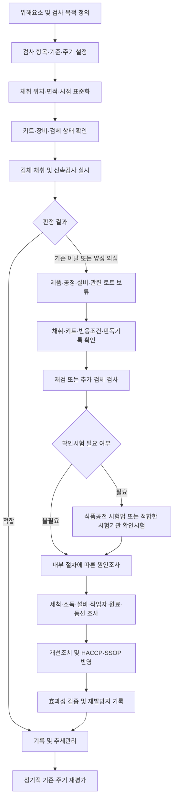

# [QA+ 블로그 생성 결과물] LAB003 현장신속검사 10종
생성일시: 2026-09-12 06:49:42 (KST)
적용모델: gpt-5.6-terra

================================================================================
# 📋 최종 발행용 블로그 패키지

### 1. 메타 데이터 (SEO 설정)

- **최종 포스팅 제목**: LAB003 현장신속검사 10종 총정리｜식품공장 QC의 검사 목적·판정·양성 대응 가이드
- **메타 디스크립션 (120자 내외 요약)**: 식품공장 QC를 위한 LAB003 현장신속검사 10종 운영 가이드입니다. 채취, 판정, 제품 보류, 확인시험, HACCP 기록관리까지 정리했습니다.
- **추천 해시태그 (10개)**:  
  #현장신속검사 #식품품질관리 #식품공장QC #HACCP #식품안전 #ATP검사 #미생물검사 #리스테리아관리 #식품공전 #SSOP
- **카테고리**: 식품품질실무 / HACCP가이드 / 식품안전관리

> **편집·사실관계 검수 메모**  
> - `LAB003`은 식품공전 또는 HACCP 고시의 공통 법정 용어로 확인되지 않는 내부 코드·교육 코드일 가능성이 있으므로, 본문에 해당 한계를 명시했습니다.  
> - 신속검사 양성은 원칙적으로 “확정 부적합”과 동일하지 않으며, 제품 보류·검사과정 검토·확인시험·원인조사 절차가 필요하다는 방향으로 표현을 정리했습니다.  
> - 제품의 법적 기준, 시험법, 검체량, 증균조건, 확인시험 방법은 식품 유형 및 검사 목적에 따라 달라질 수 있으므로 실제 적용 전 최신 「식품 등의 기준 및 규격」 및 사내 기준서를 확인해야 합니다.

---

## 2. 네이버 블로그 / 티스토리 복사용 최종 원고 (Markdown)

# LAB003 현장신속검사 10종 총정리｜식품공장 QC가 검사 목적부터 판정·양성조치까지 알아야 할 것

> **20년 실무 선배의 한 줄 요약**  
> 현장신속검사는 키트 10개를 외우는 업무가 아닙니다.  
> **검사 목적–채취–판정–보류–확인시험–재발방지**를 하나의 운영체계로 연결해야 HACCP 심사와 실제 식품안전 관리에서 힘을 발휘합니다.

> **먼저 확인하세요**  
> LAB003은 식품공전이나 HACCP 고시에서 공통으로 쓰는 법정 용어가 아닐 수 있습니다. 이 글은 식품 제조현장에서 많이 운영하는 10개 신속검사 항목을 기준으로 설명합니다. 실제 적용 전에는 반드시 귀사 LAB003 원문, 교육자료, 검사표의 정확한 항목을 대조해야 합니다.

---

## 1. 신속검사는 “빨리 검사하는 도구”가 아니라 “빨리 결정하는 도구”입니다

현장에서 신속검사를 도입하고도 효과를 제대로 보지 못하는 공장이 생각보다 많습니다. ATP 측정기를 샀는데 청소 후 수치만 적고, 미생물 배지는 배양만 해놓은 뒤 결과가 나오면 “다음부터 조심하겠습니다”로 끝나는 경우가 대표적입니다.

이렇게 운영하면 검사기록은 남지만 위해요소를 줄이는 데에는 거의 도움이 되지 않습니다. 신속검사의 진짜 목적은 문제가 커지기 전에 공정 이상을 발견하고, 제품과 설비를 빠르게 통제하는 데 있습니다.

식품공장의 현장신속검사는 보통 다음 세 가지 의사결정을 돕습니다.

1. **세척·소독 후 작업을 시작해도 되는지 확인하는 위생 검증**
2. **원료·작업환경·반제품·완제품의 오염 가능성을 선별하는 미생물 모니터링**
3. **pH·수분활성도·염도처럼 제품 안전성과 저장성에 영향을 주는 공정조건의 현장 확인**

여기서 가장 많이 헷갈리는 부분이 있습니다.

**현장신속검사 결과와 식품공전상 공식 시험 결과는 같은 의미가 아닙니다.**

쉽게 말하면 신속검사는 공장 안에서 빨리 위험 신호를 잡는 **“화재경보기”**에 가깝고, 식품공전 일반시험법에 따른 시험은 행정·법적 판단 또는 최종 확정에 활용되는 **“정밀 화재감식”**에 가깝습니다.

경보기가 울렸다고 무조건 건물이 전소한 것은 아닙니다. 그렇다고 경보를 무시하고 문을 열어두면 큰 사고로 이어질 수 있습니다.

특히 병원성미생물 신속검사에서 양성이 나왔을 때 “키트가 틀렸겠지”라고 넘기는 순간이 가장 위험합니다. 반대로 재검도 하지 않고 무조건 전량 폐기부터 하는 것도 체계적인 품질관리는 아닙니다.

제품·공정·설비를 우선 보류하고, 검사과정과 검체를 확인한 뒤 필요하면 공식 확인시험으로 이어가는 순서가 맞습니다. 이 원칙만 잡아도 신속검사의 절반은 제대로 운영하게 됩니다.




> **차트 활용 팁**  
> 본문에서는 `적합` 경로를 초록색, `기준 이탈 또는 양성 의심` 경로를 주황색 또는 빨간색으로 표시하면 보류와 확인시험의 의미를 더 직관적으로 전달할 수 있습니다.

---

## 2. LAB003 현장신속검사 10종, 무엇을 확인하는 검사일까요?

LAB003의 실제 검사 목록이 공개되지 않은 상태이므로, 현장에서 가장 일반적으로 구성하는 10종을 기준으로 정리해보겠습니다.

구성은 업체의 제품군과 위해분석 결과에 따라 달라질 수 있습니다. 예를 들어 냉동만두 공장은 살모넬라와 황색포도상구균 관리 비중이 높을 수 있고, 샐러드·즉석섭취식품 공장은 리스테리아 환경 모니터링이 더 중요할 수 있습니다.

따라서 아래 표는 그대로 복사하기보다 귀사 위험평가에 맞게 수정해서 사용해야 합니다.

| 구분 | 검사 항목 | 주된 확인 목적 | 대표 적용 시점 | 결과 활용 |
|---|---|---|---|---|
| 위생지표 | ATP | 표면 유기물·세척 상태 확인 | 세척 후, 작업 전 | 세척 재실시 여부 판단 |
| 위생지표 | 표면 단백질 | 알레르겐 포함 잔류 단백질 가능성 확인 | 품목 전환 세척 후 | 세척 검증, 교차오염 예방 |
| 미생물 | 일반세균수 | 전반적인 위생 수준 확인 | 환경·반제품·완제품 | 위생관리 추세 분석 |
| 미생물 | 대장균군 | 위생관리 상태 및 오염 가능성 확인 | 원료·제품·환경 | 세척·가열 후 위생 검증 |
| 미생물 | 대장균 | 분변계 오염 가능성 확인 | 원료·제품·용수 주변 | 원료·작업자 위생 점검 |
| 병원성미생물 | 황색포도상구균 | 작업자·원료 유래 오염 위험 확인 | 비가열 공정, 충전 공정 | 개인위생·공정관리 검증 |
| 병원성미생물 | 살모넬라 | 육류·난류 등 원료 유래 위해 확인 | 원료·제품·환경 | 보류 및 확인시험 판단 |
| 병원성미생물 | 리스테리아 모노사이토제네스 | 냉장·즉석섭취식품 환경 위해 확인 | 배수로·바닥·설비 틈새 | 환경 모니터링 강화 |
| 이화학 | pH | 산도 및 미생물 증식 억제 조건 확인 | 배합·발효·가열 전후 | 배합 이상·공정조건 판단 |
| 이화학 | 수분활성도(Aw) | 미생물 증식 가능성·저장성 확인 | 건조·냉각·포장 후 | 건조조건·제품 안정성 확인 |

ATP 검사는 미생물을 직접 세는 검사가 아닙니다. ATP는 생물체에 존재하는 에너지 물질을 측정하는 방식이므로, 식품 찌꺼기나 유기물 잔류 여부를 빠르게 확인하는 데 강점이 있습니다.

쉽게 말하면 “설비가 눈으로 보기에는 깨끗한데 실제로는 닦이지 않은 양념이나 단백질이 남아 있는지”를 보는 검사입니다.

따라서 ATP가 낮다고 해서 살모넬라나 리스테리아가 없다고 단정하면 안 됩니다.

일반세균, 대장균군, 대장균 검사는 위생관리 수준을 보는 지표로 많이 사용합니다. 다만 일반세균수가 높다고 반드시 병원성미생물이 존재하는 것은 아니고, 반대로 일반세균수가 낮다고 병원성미생물이 절대 없다는 뜻도 아닙니다.

이 검사는 설비 세척 상태, 작업자 손 위생, 원료 관리, 냉각·포장 공정의 위생수준이 흔들리는지를 추세로 확인하는 데 유용합니다. 그래서 단일 결과 하나보다 주간·월간 경향을 보는 것이 훨씬 중요합니다.

살모넬라, 리스테리아 모노사이토제네스, 황색포도상구균 같은 항목은 위해도가 높아 대응 방식이 달라집니다. 특히 병원성미생물 신속검사는 대부분 선별검사, 즉 스크리닝 검사로 활용됩니다.

제조사 매뉴얼상 양성 판정이 나왔다면 제품과 관련 공정을 우선 통제하고, 필요 시 식품공전 시험법 또는 해당 목적에 적합한 확인시험으로 확정 여부를 확인해야 합니다.

**“신속검사 양성 = 확정 부적합”도 아니고, “신속검사 양성 = 키트 오류”도 아닙니다.** 이 사이의 관리를 어떻게 하느냐가 품질팀의 실력입니다.

---

## 3. 법적 기준과 HACCP 문서에서 반드시 구분해야 할 핵심

신속검사를 운영할 때 기본적으로 검토해야 할 근거는 다음과 같습니다.

- 「식품위생법」
- 「식품 등의 기준 및 규격」, 즉 식품공전
- 「식품 및 축산물 안전관리인증기준」
- 귀사 HACCP 계획서
- 선행요건관리기준 및 SSOP
- 고객사 요구사항 및 내부 품질기준

식품공전에는 식품 유형별 미생물 기준·규격과 일반시험법이 제시되어 있습니다. HACCP 적용업소는 위해요소를 관리하고, 모니터링·검증·개선조치·기록관리를 체계적으로 운영해야 합니다.

신속검사는 이 체계 안에서 선행요건관리, 검증활동 또는 내부 공정관리 수단으로 설계되는 경우가 많습니다.

가장 중요한 것은 **CCP 모니터링과 신속검사 검증을 섞어 쓰지 않는 것**입니다.

예를 들어 레토르트 공정의 중심온도나 살균조건은 CCP 모니터링일 수 있습니다. 반면 살균 후 작업장 환경의 일반세균 검사나 ATP 검사는 보통 세척·소독 관리의 검증 활동입니다.

쉽게 말하면 CCP는 “사고를 막는 운전 중 계기판”이고, 신속검사는 “계기판과 관리체계가 제대로 작동하는지 확인하는 정기점검”에 더 가깝습니다.

또 하나는 검출한계와 법적 기준을 구분하는 일입니다.

검사 키트가 특정 미생물을 일정 농도 이상에서 검출할 수 있다고 해도, 그 키트의 검출한계가 제품의 법적 기준과 정확히 일치하는 것은 아닙니다. 제품 유형에 따라 식품공전 기준은 정성 기준일 수도 있고 정량 기준일 수도 있으며, 검체량·증균조건·판정법도 달라질 수 있습니다.

따라서 다음과 같이 일괄적으로 표현하면 심사나 분쟁 상황에서 문제가 될 수 있습니다.

> “키트에서 음성이니까 식품공전 기준에 적합하다.”

심사관은 키트 이름보다 운영 논리를 먼저 봅니다.

- 왜 이 항목을 검사하는가?
- 왜 그 위치에서 채취하는가?
- 왜 주 1회 또는 매일 검사하는가?
- 기준 이탈 시 누가 어떤 조치를 하는가?
- 최초 기록은 보존되는가?
- 개선 후 효과성 검증을 했는가?

기준서에는 “검사 실시” 한 줄만 쓰지 말고, 검사 목적부터 이탈조치까지 연결해서 작성해야 합니다.

> **실무 핵심**  
> 신속검사는 법적 확정시험의 단순 대체품이 아닙니다.  
> **현장 위험을 조기에 선별하고, 필요한 경우 공식시험으로 연결하는 관리도구**로 문서화해야 합니다.

---

## 4. 검사 전 준비와 검체 채취, 여기서 결과 신뢰도가 갈립니다

검사 결과가 이상하게 반복될 때 많은 분들이 키트부터 의심합니다. 그러나 실제 현장에서는 키트 불량보다 검체 채취 오류가 더 흔합니다.

같은 설비를 검사하면서 어떤 사람은 배수구 가까운 틈새를 닦고, 다른 사람은 물이 잘 닿는 매끈한 표면을 닦으면 결과 비교 자체가 불가능합니다.

검체 채취는 검사 업무의 부속 작업이 아니라 결과를 결정하는 핵심 공정입니다.

먼저 채취 위치를 번호로 표준화해야 합니다.

예를 들면 다음과 같습니다.

- 충전기 노즐 1번
- 컨베이어 벨트 하부 2번
- 냉각실 배수로 3번
- 포장기 투입 가이드 4번

이처럼 설비도면과 사진에 표시하는 방식이 좋습니다.

표면 미생물 검사나 ATP 검사는 가능한 한 일정한 면적을 정해 관리해야 합니다. 흔히 `10 cm × 10 cm`, 즉 `100 cm²` 면적을 활용합니다.

다만 굴곡진 노즐이나 작은 부품처럼 동일 면적 적용이 어려운 곳은 채취 횟수와 닦는 방향을 표준화해야 합니다.

채취 시점도 분리해야 합니다.

| 채취 시점 | 주요 확인 목적 |
|---|---|
| 세척 직후 | 세척·소독 효과 확인 |
| 생산 중 | 작업 중 오염 누적 확인 |
| 생산 종료 후 | 오염원 잔존 여부 및 취약지점 확인 |

이 세 가지 결과를 한 장의 기록지에 섞어버리면 기준값을 해석할 수 없습니다. 반드시 검사 목적과 시점을 분리해서 관리해야 합니다.

제품 검체는 균질화와 보관이 중요합니다. 고형식품은 표면만 조금 떼는지, 여러 지점에서 일정량을 채취해 혼합하는지에 따라 결과가 달라질 수 있습니다.

냉장 검체를 상온에 오래 두면 원래 상태와 다른 결과가 나올 수 있고, 냉동 검체를 무계획적으로 해동하면 미생물 분포가 달라질 수도 있습니다.

검체명, 제품명, 제조일시, 로트번호, 채취자, 채취시간, 공정상태를 빠짐없이 기록해야 나중에 원인을 추적할 수 있습니다.


---

## 5. 20년 선배가 권하는 현장신속검사 운영 Step by Step

첫 단계는 검사 항목을 정하는 것이 아니라 **위해요소와 검사 목적을 정하는 것**입니다.

예를 들어 냉동만두 공장에서 포장실 ATP 검사를 한다면 목적은 다음 중 무엇인지 명확해야 합니다.

- 포장설비 세척상태 확인
- 작업 중 오염 누적 확인
- 품목 전환 세척 검증
- 특정 이탈 발생 후 개선조치 효과성 확인

목적이 다르면 채취시점도, 기준도, 이탈 시 조치도 달라집니다.

목적 없이 “다른 공장도 하니까” 도입한 검사는 몇 달 뒤 형식적인 기록으로 변할 가능성이 높습니다.

두 번째 단계는 내부 관리기준을 설정하는 일입니다.

ATP의 RLU 기준, pH 허용범위, 수분활성도 목표값, 일반세균 경보수준 등은 제조사 설명서만 그대로 옮겨 적으면 안 됩니다.

다음 요소를 함께 검토해야 합니다.

- 설비 재질
- 제품 특성
- 세척방법
- 과거 검사 데이터
- 식품공전 기준
- 고객사 요구사항
- 사내 위해분석 결과

처음에는 2주에서 4주 정도 기초 데이터를 모아 정상 범위를 확인하고, 이후 주의 수준과 조치 수준을 나누어 설정하는 방법이 실무적으로 안정적입니다.

세 번째 단계는 양성·이탈 시 조치를 사전에 결정하는 것입니다.

예를 들어 ATP가 내부 조치기준을 초과하면 다음과 같이 정할 수 있습니다.

> 재세척 → 재측정 → 적합 확인 후 작업 개시

반면 병원성미생물 신속검사 양성은 다음처럼 더 엄격한 절차가 필요합니다.

> 해당 로트 및 관련 시간대 생산품 보류 → 검사과정 검토 → 재검 또는 확인시험 → 원인 범위 확대 → 최종 처분

담당자 개인이 그때그때 판단하게 두면 야간 생산이나 담당자 휴무 시 대응이 흔들립니다.

네 번째 단계는 결과를 개선활동으로 연결하는 것입니다.

매주 검사표만 출력해서 파일에 꽂는다면 검사비만 쓰는 셈입니다. 월 1회라도 항목별 추세를 그래프로 확인해 보세요.

특정 요일, 특정 작업조, 특정 설비에서 수치가 반복적으로 높아지면 세척방법·분해조립 방식·작업자 교육·생산순서 중 어디가 문제인지 보이기 시작합니다.

| 단계 | 반드시 할 일 | 기록 예시 | 놓치기 쉬운 실수 |
|---|---|---|---|
| 1단계 | 검사 목적 정의 | 세척검증, 환경모니터링, 출하 전 선별 | “검사 실시”만 기재 |
| 2단계 | 채취 위치·시점 표준화 | 설비번호, 사진, 작업 전·중·후 | 담당자마다 위치 변경 |
| 3단계 | 키트·장비 확인 | 키트 로트, 유효기간, 보관온도 | 냉장보관 조건 미확인 |
| 4단계 | 검사·판독 조건 준수 | 반응시간, 배양온도, 판독시각 | 시간을 임의로 단축·연장 |
| 5단계 | 기준 이탈 시 즉시 통제 | 보류번호, 재세척, 재검 | 최초 양성 기록 삭제 |
| 6단계 | 확인시험·원인조사 | 외부 의뢰서, 5Why 분석 | 재검 음성만 보고 종료 |
| 7단계 | 효과성 검증 | 개선 전후 데이터 비교 | 조치 후 검증 미실시 |

> **★ 심사 대응 꿀팁**  
> 심사관이 “왜 주 1회 검사합니까?”라고 물을 때 “원래 그렇게 했습니다”라고 답하면 곤란합니다.  
>  
> “최근 12개월 부적합 이력, 제품 특성, 세척 빈도, 공정 위해도 분석을 근거로 주 1회 운영하며, 성수기·품목 전환 시에는 추가 검사한다”처럼 근거를 설명할 수 있어야 합니다.

---

## 6. 양성 또는 기준 이탈이 나왔을 때, 폐기보다 먼저 해야 할 일

신속검사 양성 결과가 나오면 제일 먼저 해야 할 일은 **제품과 공정의 범위를 식별하고 보류하는 것**입니다.

여기서 보류는 폐기와 다릅니다.

보류란 출하·이동·혼입을 막기 위해 해당 제품을 격리하고, 보류표시 또는 전산 상태로 관리하는 조치입니다. 위해 가능성이 있는 제품이 다른 정상 제품과 섞이는 것을 막는 것이 첫 번째 목표입니다.

그다음에는 검사 자체의 신뢰성을 확인해야 합니다.

다음 사항을 확인하십시오.

- 검사자의 채취 위치가 기준서와 일치했는가?
- 키트 유효기간과 보관조건은 적합했는가?
- 반응시간·배양시간·배양온도를 지켰는가?
- 판독시간과 판독기준을 준수했는가?
- 양성대조·음성대조가 필요한 검사에서 적절히 운영되었는가?
- 검사구역 분리와 교차오염 방지 상태는 적절했는가?

특히 병원성미생물 검사에서는 양성 검체 취급 과정에서 교차오염이 발생할 수 있으므로, 음성대조·양성대조 운영 여부와 검사구역 분리 상태도 살펴봐야 합니다.

이 단계는 결과를 무효로 만들기 위한 절차가 아니라, 올바른 후속 판단을 위한 필수 확인입니다.

재검은 신중하게 해야 합니다.

최초 양성 결과가 나왔다고 같은 검체 하나를 무한정 반복 검사해서 음성이 나올 때까지 찾는 방식은 절대 안 됩니다.

재검의 목적, 재검 검체, 채취 위치, 검사 방법, 판정 기준을 정해두고 최초 결과와 함께 모두 남겨야 합니다.

필요하면 보관 검체, 동일 로트의 추가 검체, 전·후 공정 검체, 환경 검체로 조사 범위를 넓혀야 합니다.

확인시험이 필요하다고 판단되면 식품공전 일반시험법 또는 해당 목적에 적합한 시험기관의 방법으로 의뢰합니다.

최종 처분은 제품 유형, 위해도, 확인시험 결과, 내부 규정, 관할 기준 등을 종합해서 결정해야 합니다.

살모넬라나 리스테리아처럼 위해도가 높은 항목은 관련 제품·원료·환경에 대한 범위 확대 조사를 더 엄격하게 해야 합니다.

단순히 설비를 한 번 닦고 끝내지 말고, 왜 오염이 발생했는지 근본 원인을 찾아야 재발을 막을 수 있습니다.

### 양성·이탈 발생 표준 대응 순서

1. 해당 제품, 설비, 생산시간대, 로트를 즉시 식별합니다.  
2. 관련 제품을 출하·이동 금지 상태로 보류합니다.  
3. 검체 채취, 키트, 반응·배양 조건, 검사기록을 확인합니다.  
4. 내부 절차에 따라 재검 또는 추가 검체 검사를 실시합니다.  
5. 필요 시 외부 시험기관에 확인시험을 의뢰합니다.  
6. 원료·설비·작업자·용수·환경으로 조사 범위를 확대합니다.  
7. 세척·소독, 설비 분해, 작업자 재교육, 공정개선 조치를 실시합니다.  
8. 개선 후 재검사로 효과성을 검증합니다.  
9. 최종 출하·폐기·회수 여부를 내부 승인 절차에 따라 결정합니다.  
10. HACCP 계획, SSOP, 검사주기, 교육계획을 재검토합니다.  

---

## 7. 실제 현장 사례로 보는 적용법

### 사례 1. 냉동만두 제조공장 포장실 ATP 기준 이탈

냉동만두를 생산하는 한 공장에서 야간 세척 후 포장기 투입 컨베이어의 ATP 수치가 반복적으로 내부 조치기준을 초과했습니다.

처음에는 작업자들이 세척이 부족했다고 생각하고 세제를 더 많이 사용했습니다. 그런데 재세척 뒤에도 특정 부위의 수치만 계속 높게 나왔고, 다른 평면 부위는 정상 범위였습니다.

품질팀이 설비를 분해해 보니 컨베이어 가이드 레일 아래쪽 틈에 만두피와 육즙 성분이 굳어 남아 있었습니다.

근본 원인은 작업자가 게을러서가 아니라, 세척표준서에 해당 틈새의 분해·세척 방법이 빠져 있었던 것이었습니다.

기존 ATP 채취 위치도 넓은 컨베이어 상부만 지정되어 있어 실제 오염 취약지점을 제대로 보고 있지 못했습니다.

공장은 가이드 레일 하부를 신규 채취 포인트로 추가하고, 매일 세척이 아닌 주 2회 분해세척 항목으로 SSOP를 개정했습니다.

또한 세척 담당자에게 사진 기준의 작업표준서를 배포하고, 작업 완료 후 생산반장과 품질팀이 이중 확인하도록 했습니다.

개선 후 4주간 ATP 데이터를 비교한 결과 해당 부위의 기준 이탈 건수는 주 3~4건에서 0건으로 감소했습니다.

이 사례의 핵심은 ATP 수치가 높았다는 사실보다, 수치가 반복된 위치를 통해 세척표준서의 빈틈을 찾아냈다는 점입니다.

### 사례 2. 레토르트 소스 제조공장 pH 편차 발생

토마토 베이스 레토르트 소스를 생산하는 공장에서 동일 배합표를 사용했는데도 일부 로트의 pH가 내부 관리범위를 벗어나는 일이 발생했습니다.

작업자는 산미가 조금 다를 뿐 살균공정이 있으니 큰 문제는 아니라고 판단했습니다.

그러나 품질팀은 pH가 제품의 맛뿐 아니라 제품 특성에 따라 미생물 증식 억제 조건과 공정 안정성에 영향을 줄 수 있다고 보고 즉시 해당 로트를 보류했습니다.

조사 결과 pH 측정기가 오래된 표준액으로 교정되고 있었으며, 점검기록에는 교정 실시 여부만 있고 표준액의 개봉일과 유효기간이 기록되어 있지 않았습니다.

추가로 확인해 보니 배합 탱크 상부와 하부의 혼합 균질화 시간이 부족해 검체 채취 위치에 따라 pH 편차도 발생하고 있었습니다.

즉, 하나의 원인이 아니라 측정기 관리 미흡과 혼합공정 관리 미흡이 동시에 있었던 것입니다.

공장은 pH 4.00, 7.00 표준액의 개봉일·사용기한 관리표를 만들고, 매 작업 전 2점 교정을 실시하도록 절차를 개정했습니다.

배합 후에는 탱크 상·중·하부에서 검체를 채취해 편차를 확인하고, 기준 범위에 들어올 때까지 10분 단위로 추가 교반하도록 정했습니다.

이후 3개월 동안 pH 이탈 로트는 발생하지 않았고, 배합 이상을 충전 전에 발견하는 비율도 높아졌습니다.

이 사례는 숫자를 측정했다는 것만으로는 부족하며, **측정값의 신뢰성과 검체 대표성**을 함께 관리해야 한다는 교훈을 줍니다.

### 사례 3. 냉장 샐러드 공장 리스테리아 환경 스크리닝 양성

냉장 샐러드와 즉석섭취식품을 생산하는 공장에서 정기 환경 모니터링 중 포장실 배수로 인근에서 리스테리아 신속검사 양성 의심 결과가 나왔습니다.

현장에서는 완제품이 아닌 바닥 검체이므로 큰 문제가 아니라고 판단하려는 분위기도 있었습니다.

하지만 냉장 즉석섭취식품은 생산 후 별도 가열 공정이 없기 때문에 환경 오염이 제품으로 전이될 가능성을 가볍게 볼 수 없었습니다.

품질팀은 즉시 해당 시간대 생산품과 포장실 작업 중 제품을 보류하고, 동일 구역의 배수로·바닥·바퀴·작업화·포장기 하부로 검체 범위를 확대했습니다.

원인조사 결과 배수로 세척용 브러시를 포장실과 전처리실이 공동으로 사용하고 있었고, 세척 후 건조·보관 기준도 없었습니다.

또한 배수로 청소를 마친 작업자가 장갑 교체 없이 포장실 주변 설비를 만지는 작업 동선 문제가 확인되었습니다.

공장은 구역별 청소도구를 색상으로 분리하고, 배수로 청소는 생산 종료 후 최종 작업으로 배치했으며, 청소 후 장갑·앞치마 교체를 의무화했습니다.

배수로 주변은 주 1회 환경검사에서 주 3회로 한 달간 강화 모니터링했고, 외부 확인시험 결과와 후속 환경검사에서 이상이 없음을 확인한 뒤 주기를 정상화했습니다.

이 사례는 환경검체 양성을 단순한 청소 문제로 보지 않고, 사람·도구·배수·동선이라는 오염 경로 전체를 본 것이 해결의 핵심이었습니다.

특히 리스테리아 관리는 완제품 검사만으로 충분하지 않으며, 환경 모니터링 체계가 반드시 같이 가야 합니다.

---

## 8. 심사에서 지적받지 않는 신속검사 기록관리 방법

신속검사 기록은 결과칸만 채우는 문서가 아닙니다.

심사관 입장에서는 그 기록을 보고 “이 업체가 이상을 발견했을 때 실제로 통제할 수 있는가”를 판단합니다.

검사일자와 결과만 있고 제품 로트나 채취 위치가 없다면, 나중에 문제가 생겼을 때 어떤 제품과 연결되는지 알 수 없습니다.

기록의 목적은 보고용이 아니라 추적성과 의사결정 근거 확보입니다.

기록지에는 최소한 다음 항목을 포함하는 것이 좋습니다.

- 검사일시
- 공정명
- 제품명
- 로트번호
- 채취 위치
- 채취자
- 검사자
- 키트명
- 키트 로트번호
- 유효기간
- 결과값
- 판정
- 검토자
- 이탈조치 내용

ATP라면 RLU 실제 수치를 남겨야 추세분석이 가능합니다.

미생물 검사라면 단순히 “음성”만 적지 말고 사용한 배지·카드, 배양조건, 판독일시를 남기는 습관이 필요합니다.

병원성미생물 의심 양성은 최초 결과와 재검 결과를 모두 보존해야 합니다.

키트와 장비 관리도 문서화해야 합니다.

냉장 보관 키트라면 보관온도 확인기록이 있어야 하고, 입고 시 유효기간과 외관 이상 여부를 확인해야 합니다.

pH 측정기는 표준액 교정 기록, 전극 세척·보관 기록, 이상 발생 시 점검기록이 필요합니다.

ATP 측정기도 제조사 권장사항에 따라 작동점검 또는 성능 확인을 실시하고, 신규 기기나 신규 키트 로트 도입 시 비교 확인을 해두면 좋습니다.

마지막으로 최초 부적합 기록을 삭제하지 마십시오.

가끔 재검에서 음성이 나오면 최초 양성 기록지를 찢어버리거나 전산에서 지우는 경우가 있습니다.

하지만 심사에서는 이런 행동을 결과 조작 또는 관리체계 미흡으로 볼 수 있습니다.

**“최초 양성 → 재검 → 확인시험 → 원인조사 → 최종판정”의 전 과정이 남아 있어야 오히려 신뢰를 얻습니다.**

---

## 9. 현장에서 바로 쓰는 단계별 체크리스트

아래 표는 신입 QC 담당자 교육, 월간 자체점검, HACCP 검증자료 검토에 바로 활용할 수 있도록 만든 기본 체크리스트입니다.

모든 항목을 매일 확인할 필요는 없지만, 각 항목의 주기와 책임자를 귀사 기준서에 분명히 정해두어야 합니다.

특히 병원성미생물 항목은 제품 특성 및 위해도에 따라 별도의 강화 기준이 필요할 수 있습니다.

기준값은 반드시 식품공전, 제조사 매뉴얼, 자체 검증 데이터, 고객 요구사항을 종합해 설정하십시오.

| 점검 영역 | 점검 항목 | 확인 기준 | 권장 확인 주기 | 기록 또는 조치 |
|---|---|---|---|---|
| 검사계획 | 검사 목적이 정의되어 있는가 | 세척검증·환경검사·제품 선별 구분 | 연 1회 이상 재평가 | HACCP 계획서·검사계획서 |
| 검체채취 | 채취 위치가 사진·도면으로 표준화되었는가 | 설비번호, 면적, 방향, 시점 명확화 | 변경 시 즉시 | 채취 위치도 |
| 키트관리 | 유효기간과 보관조건을 확인하는가 | 입고·사용 전 확인 | 사용 전 매회 | 키트 관리대장 |
| 장비관리 | pH계·ATP측정기 점검이 되는가 | 제조사 권장 교정·점검 준수 | 일상점검 및 정기점검 | 장비 점검기록 |
| 검사운영 | 반응·배양·판독 시간을 지키는가 | 제조사 매뉴얼과 일치 | 검사 매회 | 검사기록지 |
| 판정기준 | 내부 기준과 제조사 기준이 일치하는가 | 기준 출처와 적용범위 명확화 | 분기 1회 검토 | 기준서 개정이력 |
| 이탈조치 | 양성 시 제품 보류 절차가 있는가 | 보류, 재검, 확인시험 순서 명확 | 이탈 발생 시 | 부적합 보고서 |
| 교육관리 | 검사자 숙련도 교육을 하는가 | 신규·변경 시 교육, 정기평가 | 연 1회 이상 | 교육대장·평가표 |
| 추세관리 | 결과를 월별로 분석하는가 | 반복 이탈 위치·공정 파악 | 월 1회 | 그래프·회의록 |
| 효과성검증 | 개선 후 재검사를 하는가 | 조치 전후 비교 | 개선조치 후 | 효과성 평가서 |

이 체크리스트에서 특히 중요한 항목은 **추세관리**입니다.

검사 한 번에서 음성이 나왔다고 안심하고, 양성이 한 번 나왔다고 공장 전체가 실패한 것도 아닙니다.

같은 위치·같은 조건에서 누적된 데이터를 봐야 설비 노후화, 세척 편차, 특정 작업조 문제, 계절별 위험 증가가 보입니다.

품질팀이 단순 검사부서가 아니라 공정 개선부서로 인정받는 지점도 바로 여기입니다.

---

## 10. 자주 묻는 질문(FAQ)과 심사관 단골 지적

### Q1. 현장신속검사 결과만으로 제품을 출하해도 되나요?

**A.** 제품 특성, 검사 항목, 내부 출하 기준, 고객사 요구사항에 따라 다르게 판단해야 합니다.

신속검사는 내부 공정관리와 선별 목적으로 활용할 수 있지만, 법적 확정판정이나 행정 대응이 필요한 상황에서는 식품공전 시험법 또는 적합한 확인시험이 요구될 수 있습니다.

출하판정에 활용한다면 적용 범위와 한계를 사내 기준서에 명확히 적어두어야 합니다.

### Q2. 병원성미생물 신속검사에서 양성이 나오면 무조건 전량 폐기해야 하나요?

**A.** 무조건 즉시 폐기라고 단정하기보다, 우선 관련 제품과 공정을 보류하는 것이 원칙입니다.

검사과정 오류 가능성, 교차오염, 키트 상태를 확인하고 재검 또는 확인시험을 실시한 뒤 최종 처분을 결정해야 합니다.

다만 위해 가능성이 높고 내부 규정이나 고객 기준상 즉시 격리가 필요한 경우에는 확산 차단을 먼저 해야 합니다.

### Q3. ATP 수치가 낮으면 미생물도 없다고 봐도 되나요?

**A.** 아닙니다.

ATP 검사는 표면의 유기물 또는 세척 상태를 빠르게 보는 데 유용하지만, 특정 병원성미생물의 존재 여부를 직접 확인하는 검사는 아닙니다.

ATP는 세척검증 도구로, 미생물 검사는 별도의 목적과 방법을 가진 도구로 구분해서 운영해야 합니다.

### Q4. 모든 신속검사 항목을 매일 해야 하나요?

**A.** 꼭 그렇지는 않습니다.

검사 주기는 원료 위험도, 비가열 공정 유무, 제품의 섭취 방식, 과거 부적합 이력, 생산량, 계절적 요인 등을 반영해 정해야 합니다.

중요한 것은 “매일 했느냐”가 아니라 “왜 이 주기로 운영하는지 근거가 있느냐”입니다.

### Q5. 키트 제조사의 판정 기준을 그대로 내부 기준으로 사용하면 되나요?

**A.** 제조사 기준은 중요한 출발점이지만, 그 자체가 귀사 공정의 최종 관리기준이 되지는 않습니다.

설비 재질, 제품 특성, 세척 방식, 정상 데이터, 고객 요구사항을 반영해 내부 주의기준과 조치기준을 설정할 필요가 있습니다.

기준을 바꾸거나 설정했다면 근거자료와 승인 이력을 반드시 남기십시오.

### Q6. 검사 결과가 애매하거나 판독선이 흐리면 음성으로 기록해도 되나요?

**A.** 절대 안 됩니다.

애매한 결과는 판정불가 또는 의심 결과로 관리하고, 정해진 절차에 따라 재검 또는 확인시험으로 이어가야 합니다.

애매한 결과를 음성으로 처리하는 습관은 실제 위해를 놓치는 가장 위험한 원인 중 하나입니다.

### Q7. 심사관이 가장 자주 보는 신속검사 지적사항은 무엇인가요?

**A.** 검사 주기 설정 근거 부재, 키트 유효기간·보관온도 기록 누락, 검사자 교육기록 미비, 채취 위치 비표준화가 매우 흔합니다.

또 최초 양성 결과를 삭제하거나, 양성 후 조치기록 없이 재검 음성만 남긴 사례도 자주 지적됩니다.

결과값보다 관리체계의 일관성을 먼저 점검하면 됩니다.

---

## 11. 마무리｜신속검사의 품질은 키트가 아니라 운영체계에서 결정됩니다

현장신속검사 10종을 잘 운영하는 공장은 검사 항목이 많은 공장이 아닙니다.

각 검사가 어떤 위해요소를 확인하는지, 어느 공정에서 어떤 결정을 하기 위해 쓰는지를 명확히 아는 공장입니다.

그리고 채취 위치와 방법이 표준화되어 있고, 양성이나 이탈이 발생했을 때 담당자가 망설이지 않고 움직일 수 있는 공장입니다.

오늘 내용은 아래 세 줄로 기억하시면 됩니다.

1. **신속검사는 공식 확정시험과 목적이 다르며, 공정관리와 위험 선별에 강합니다.**
2. **검사 결과의 신뢰도는 키트보다 검체 채취·판독조건·기록관리에서 결정됩니다.**
3. **양성 결과는 삭제하거나 방치하지 말고, 보류–재검–확인시험–원인분석–효과성 검증까지 연결해야 합니다.**

LAB003의 실제 10개 검사 항목이 확인되면, 그때는 항목별로 검사 원리·검체 채취 위치·권장 주기·기록지 예시·양성 시 조치 흐름까지 더 정확하게 맞춤형으로 설계할 수 있습니다.

처음부터 완벽한 체계를 만들려고 부담 갖지 마시고, 우선 가장 위험한 공정 1곳과 가장 자주 흔들리는 검사 1개부터 표준화해 보세요.

막히는 부분이 있으면 언제든 댓글로 편하게 물어보세요. 후배님들의 칼퇴와 안전한 생산을 응원합니다.

---

## 3. 워드프레스 / 웹사이트용 HTML 원고

```html
<article class="food-qa-post">
  <header>
    <h1>LAB003 현장신속검사 10종 총정리｜식품공장 QC가 검사 목적부터 판정·양성조치까지 알아야 할 것</h1>

    <blockquote>
      <p><strong>20년 실무 선배의 한 줄 요약</strong>: 현장신속검사는 키트 10개를 외우는 업무가 아닙니다. <strong>검사 목적–채취–판정–보류–확인시험–재발방지</strong>를 하나의 운영체계로 연결해야 HACCP 심사와 실제 식품안전 관리에서 힘을 발휘합니다.</p>
    </blockquote>

    <aside class="notice">
      <p><strong>먼저 확인하세요</strong></p>
      <p>LAB003은 식품공전이나 HACCP 고시에서 공통으로 쓰는 법정 용어가 아닐 수 있습니다. 이 글은 식품 제조현장에서 많이 운영하는 10개 신속검사 항목을 기준으로 설명합니다. 실제 적용 전에는 반드시 귀사 LAB003 원문, 교육자료, 검사표의 정확한 항목을 대조해야 합니다.</p>
    </aside>
  </header>

  <section>
    <h2>1. 신속검사는 “빨리 검사하는 도구”가 아니라 “빨리 결정하는 도구”입니다</h2>

    <p>현장에서 신속검사를 도입하고도 효과를 제대로 보지 못하는 공장이 생각보다 많습니다. ATP 측정기를 샀는데 청소 후 수치만 적고, 미생물 배지는 배양만 해놓은 뒤 결과가 나오면 “다음부터 조심하겠습니다”로 끝나는 경우가 대표적입니다.</p>

    <p>이렇게 운영하면 검사기록은 남지만 위해요소를 줄이는 데에는 거의 도움이 되지 않습니다. 신속검사의 진짜 목적은 문제가 커지기 전에 공정 이상을 발견하고, 제품과 설비를 빠르게 통제하는 데 있습니다.</p>

    <p>식품공장의 현장신속검사는 보통 다음 세 가지 의사결정을 돕습니다.</p>
    <ol>
      <li>세척·소독 후 작업을 시작해도 되는지 확인하는 위생 검증</li>
      <li>원료·작업환경·반제품·완제품의 오염 가능성을 선별하는 미생물 모니터링</li>
      <li>pH·수분활성도·염도처럼 제품 안전성과 저장성에 영향을 주는 공정조건의 현장 확인</li>
    </ol>

    <p><strong>현장신속검사 결과와 식품공전상 공식 시험 결과는 같은 의미가 아닙니다.</strong></p>

    <p>신속검사는 공장 안에서 빨리 위험 신호를 잡는 “화재경보기”에 가깝고, 식품공전 일반시험법에 따른 시험은 행정·법적 판단 또는 최종 확정에 활용되는 “정밀 화재감식”에 가깝습니다.</p>

    <p>특히 병원성미생물 신속검사에서 양성이 나왔을 때 “키트가 틀렸겠지”라고 넘기는 순간이 가장 위험합니다. 반대로 재검도 하지 않고 무조건 전량 폐기부터 하는 것도 체계적인 품질관리는 아닙니다.</p>

    <p>제품·공정·설비를 우선 보류하고, 검사과정과 검체를 확인한 뒤 필요하면 공식 확인시험으로 이어가는 순서가 맞습니다.</p>

    <figure>
      
      <figcaption>검사 목적 설정부터 검체 채취, 판정, 제품 보류, 확인시험, 재발방지까지 연결되는 현장신속검사 운영체계</figcaption>
    </figure>

    <div class="mermaid">
flowchart TD
    A[위해요소 및 검사 목적 정의] --> B[검사 항목·기준·주기 설정]
    B --> C[채취 위치·면적·시점 표준화]
    C --> D[키트·장비·검체 상태 확인]
    D --> E[검체 채취 및 신속검사 실시]
    E --> F{판정 결과}
    F -->|적합| G[기록 및 추세관리]
    G --> H[정기적 기준·주기 재평가]
    F -->|기준 이탈 또는 양성 의심| I[제품·공정·설비·관련 로트 보류]
    I --> J[채취·키트·반응조건·판독기록 확인]
    J --> K[재검 또는 추가 검체 검사]
    K --> L{확인시험 필요 여부}
    L -->|필요| M[식품공전 시험법 또는 적합한 시험기관 확인시험]
    L -->|불필요| N[내부 절차에 따른 원인조사]
    M --> N
    N --> O[세척·소독·설비·작업자·원료·동선 조사]
    O --> P[개선조치 및 HACCP·SSOP 반영]
    P --> Q[효과성 검증 및 재발방지 기록]
    Q --> G
    </div>
  </section>

  <section>
    <h2>2. LAB003 현장신속검사 10종, 무엇을 확인하는 검사일까요?</h2>

    <p>LAB003의 실제 검사 목록이 공개되지 않은 상태이므로, 현장에서 가장 일반적으로 구성하는 10종을 기준으로 정리합니다. 구성은 업체의 제품군과 위해분석 결과에 따라 달라질 수 있으므로 아래 표는 귀사 위험평가에 맞게 수정해서 사용해야 합니다.</p>

    <div class="table-responsive">
      <table>
        <thead>
          <tr>
            <th>구분</th>
            <th>검사 항목</th>
            <th>주된 확인 목적</th>
            <th>대표 적용 시점</th>
            <th>결과 활용</th>
          </tr>
        </thead>
        <tbody>
          <tr><td>위생지표</td><td>ATP</td><td>표면 유기물·세척 상태 확인</td><td>세척 후, 작업 전</td><td>세척 재실시 여부 판단</td></tr>
          <tr><td>위생지표</td><td>표면 단백질</td><td>알레르겐 포함 잔류 단백질 가능성 확인</td><td>품목 전환 세척 후</td><td>세척 검증, 교차오염 예방</td></tr>
          <tr><td>미생물</td><td>일반세균수</td><td>전반적인 위생 수준 확인</td><td>환경·반제품·완제품</td><td>위생관리 추세 분석</td></tr>
          <tr><td>미생물</td><td>대장균군</td><td>위생관리 상태 및 오염 가능성 확인</td><td>원료·제품·환경</td><td>세척·가열 후 위생 검증</td></tr>
          <tr><td>미생물</td><td>대장균</td><td>분변계 오염 가능성 확인</td><td>원료·제품·용수 주변</td><td>원료·작업자 위생 점검</td></tr>
          <tr><td>병원성미생물</td><td>황색포도상구균</td><td>작업자·원료 유래 오염 위험 확인</td><td>비가열 공정, 충전 공정</td><td>개인위생·공정관리 검증</td></tr>
          <tr><td>병원성미생물</td><td>살모넬라</td><td>육류·난류 등 원료 유래 위해 확인</td><td>원료·제품·환경</td><td>보류 및 확인시험 판단</td></tr>
          <tr><td>병원성미생물</td><td>리스테리아 모노사이토제네스</td><td>냉장·즉석섭취식품 환경 위해 확인</td><td>배수로·바닥·설비 틈새</td><td>환경 모니터링 강화</td></tr>
          <tr><td>이화학</td><td>pH</td><td>산도 및 미생물 증식 억제 조건 확인</td><td>배합·발효·가열 전후</td><td>배합 이상·공정조건 판단</td></tr>
          <tr><td>이화학</td><td>수분활성도(Aw)</td><td>미생물 증식 가능성·저장성 확인</td><td>건조·냉각·포장 후</td><td>건조조건·제품 안정성 확인</td></tr>
        </tbody>
      </table>
    </div>

    <p>ATP 검사는 미생물을 직접 세는 검사가 아닙니다. ATP는 생물체에 존재하는 에너지 물질을 측정하는 방식이므로 식품 찌꺼기나 유기물 잔류 여부를 빠르게 확인하는 데 강점이 있습니다. 따라서 ATP가 낮다고 해서 살모넬라나 리스테리아가 없다고 단정하면 안 됩니다.</p>

    <p>일반세균, 대장균군, 대장균 검사는 위생관리 수준을 보는 지표로 많이 사용합니다. 단일 결과 하나보다 주간·월간 경향을 보는 것이 중요합니다.</p>

    <p>병원성미생물 신속검사는 대부분 선별검사, 즉 스크리닝 검사로 활용됩니다. 제조사 매뉴얼상 양성 판정이 나왔다면 제품과 관련 공정을 우선 통제하고, 필요 시 식품공전 시험법 또는 해당 목적에 적합한 확인시험으로 확정 여부를 확인해야 합니다.</p>
  </section>

  <section>
    <h2>3. 법적 기준과 HACCP 문서에서 반드시 구분해야 할 핵심</h2>

    <p>신속검사 운영 시에는 「식품위생법」, 「식품 등의 기준 및 규격」, 「식품 및 축산물 안전관리인증기준」, HACCP 계획서 및 사내 기준서를 함께 검토해야 합니다.</p>

    <p>가장 중요한 것은 <strong>CCP 모니터링과 신속검사 검증을 섞어 쓰지 않는 것</strong>입니다. 레토르트 공정의 중심온도나 살균조건은 CCP 모니터링일 수 있지만, 살균 후 작업장 환경의 일반세균 검사나 ATP 검사는 일반적으로 세척·소독 관리의 검증활동입니다.</p>

    <p>또한 키트의 검출한계와 제품의 법적 기준은 동일하지 않을 수 있습니다. 제품 유형에 따라 식품공전 기준은 정성 또는 정량 기준일 수 있고, 검체량·증균조건·판정법도 달라질 수 있습니다.</p>

    <blockquote>
      <p><strong>실무 핵심</strong><br>신속검사는 법적 확정시험의 단순 대체품이 아닙니다. <strong>현장 위험을 조기에 선별하고, 필요한 경우 공식시험으로 연결하는 관리도구</strong>로 문서화해야 합니다.</p>
    </blockquote>
  </section>

  <section>
    <h2>4. 검사 전 준비와 검체 채취, 여기서 결과 신뢰도가 갈립니다</h2>

    <p>실제 현장에서는 키트 불량보다 검체 채취 오류가 더 흔합니다. 같은 설비를 검사하면서 채취 위치와 방법이 다르면 결과 비교 자체가 불가능합니다.</p>

    <p>채취 위치는 “충전기 노즐 1번”, “컨베이어 벨트 하부 2번”, “냉각실 배수로 3번”, “포장기 투입 가이드 4번”처럼 설비도면과 사진에 표시해 표준화하는 방식이 좋습니다.</p>

    <p>표면 미생물 검사나 ATP 검사는 가능한 한 일정한 면적을 정해 관리해야 합니다. 흔히 10 cm × 10 cm, 즉 100 cm² 면적을 활용합니다. 동일 면적 적용이 어려운 곳은 채취 횟수와 닦는 방향을 표준화해야 합니다.</p>

    <p>세척 직후 검사는 세척 효과를, 생산 중 검사는 작업 중 오염 누적을, 생산 종료 후 검사는 오염원의 잔존 여부를 확인하는 데 활용합니다. 서로 다른 채취 시점의 결과는 반드시 분리해 관리해야 합니다.</p>

    <figure>
      
      <figcaption>설비 틈새와 가이드 레일 하부 등 오염 취약지점의 채취 위치·면적·방향 표준화 예시</figcaption>
    </figure>
  </section>

  <section>
    <h2>5. 20년 선배가 권하는 현장신속검사 운영 Step by Step</h2>

    <p>첫 단계는 검사 항목을 정하는 것이 아니라 <strong>위해요소와 검사 목적을 정하는 것</strong>입니다. 목적이 다르면 채취시점, 기준, 이탈 시 조치도 달라집니다.</p>

    <p>내부 관리기준은 제조사 설명서만 그대로 옮겨 적어서는 안 됩니다. 설비 재질, 제품 특성, 세척방법, 과거 데이터, 식품공전 기준, 고객사 요구사항을 함께 검토해야 합니다.</p>

    <div class="table-responsive">
      <table>
        <thead>
          <tr>
            <th>단계</th>
            <th>반드시 할 일</th>
            <th>기록 예시</th>
            <th>놓치기 쉬운 실수</th>
          </tr>
        </thead>
        <tbody>
          <tr><td>1단계</td><td>검사 목적 정의</td><td>세척검증, 환경모니터링, 출하 전 선별</td><td>“검사 실시”만 기재</td></tr>
          <tr><td>2단계</td><td>채취 위치·시점 표준화</td><td>설비번호, 사진, 작업 전·중·후</td><td>담당자마다 위치 변경</td></tr>
          <tr><td>3단계</td><td>키트·장비 확인</td><td>키트 로트, 유효기간, 보관온도</td><td>냉장보관 조건 미확인</td></tr>
          <tr><td>4단계</td><td>검사·판독 조건 준수</td><td>반응시간, 배양온도, 판독시각</td><td>시간을 임의로 단축·연장</td></tr>
          <tr><td>5단계</td><td>기준 이탈 시 즉시 통제</td><td>보류번호, 재세척, 재검</td><td>최초 양성 기록 삭제</td></tr>
          <tr><td>6단계</td><td>확인시험·원인조사</td><td>외부 의뢰서, 5Why 분석</td><td>재검 음성만 보고 종료</td></tr>
          <tr><td>7단계</td><td>효과성 검증</td><td>개선 전후 데이터 비교</td><td>조치 후 검증 미실시</td></tr>
        </tbody>
      </table>
    </div>

    <blockquote>
      <p><strong>★ 심사 대응 꿀팁</strong><br>“왜 주 1회 검사합니까?”라는 질문에 “원래 그렇게 했습니다”라고 답하면 곤란합니다. 최근 부적합 이력, 제품 특성, 세척 빈도, 공정 위해도 분석을 근거로 검사주기를 설명할 수 있어야 합니다.</p>
    </blockquote>
  </section>

  <section>
    <h2>6. 양성 또는 기준 이탈이 나왔을 때, 폐기보다 먼저 해야 할 일</h2>

    <p>신속검사 양성 결과가 나오면 가장 먼저 해야 할 일은 <strong>제품과 공정의 범위를 식별하고 보류하는 것</strong>입니다. 보류는 폐기와 다릅니다. 출하·이동·혼입을 막기 위해 해당 제품을 격리하고 보류표시 또는 전산 상태로 관리하는 조치입니다.</p>

    <h3>양성·이탈 발생 표준 대응 순서</h3>
    <ol>
      <li>해당 제품, 설비, 생산시간대, 로트를 즉시 식별합니다.</li>
      <li>관련 제품을 출하·이동 금지 상태로 보류합니다.</li>
      <li>검체 채취, 키트, 반응·배양 조건, 검사기록을 확인합니다.</li>
      <li>내부 절차에 따라 재검 또는 추가 검체 검사를 실시합니다.</li>
      <li>필요 시 외부 시험기관에 확인시험을 의뢰합니다.</li>
      <li>원료·설비·작업자·용수·환경으로 조사 범위를 확대합니다.</li>
      <li>세척·소독, 설비 분해, 작업자 재교육, 공정개선 조치를 실시합니다.</li>
      <li>개선 후 재검사로 효과성을 검증합니다.</li>
      <li>최종 출하·폐기·회수 여부를 내부 승인 절차에 따라 결정합니다.</li>
      <li>HACCP 계획, SSOP, 검사주기, 교육계획을 재검토합니다.</li>
    </ol>
  </section>

  <section>
    <h2>7. 실제 현장 사례로 보는 적용법</h2>

    <h3>사례 1. 냉동만두 제조공장 포장실 ATP 기준 이탈</h3>
    <p>야간 세척 후 포장기 투입 컨베이어의 ATP 수치가 반복적으로 내부 조치기준을 초과했습니다. 설비를 분해해 보니 컨베이어 가이드 레일 아래쪽 틈에 만두피와 육즙 성분이 굳어 남아 있었습니다.</p>
    <p>근본 원인은 세척표준서에 해당 틈새의 분해·세척 방법이 빠져 있었던 것이었습니다. 공장은 가이드 레일 하부를 신규 채취 포인트로 추가하고, 주 2회 분해세척 항목으로 SSOP를 개정했습니다. 개선 후 4주간 해당 부위의 기준 이탈 건수는 주 3~4건에서 0건으로 감소했습니다.</p>

    <h3>사례 2. 레토르트 소스 제조공장 pH 편차 발생</h3>
    <p>일부 로트의 pH가 내부 관리범위를 벗어났고, 조사 결과 오래된 표준액을 사용한 pH 측정기 교정과 배합 탱크 내 혼합 균질화 부족이 동시에 확인되었습니다.</p>
    <p>공장은 pH 4.00, 7.00 표준액의 개봉일·사용기한 관리표를 만들고 매 작업 전 2점 교정을 실시하도록 했습니다. 또한 탱크 상·중·하부의 검체를 확인하고 필요 시 10분 단위로 추가 교반하도록 절차를 개정했습니다.</p>

    <h3>사례 3. 냉장 샐러드 공장 리스테리아 환경 스크리닝 양성</h3>
    <p>포장실 배수로 인근 환경검체에서 리스테리아 신속검사 양성 의심 결과가 발생했습니다. 품질팀은 해당 시간대 생산품과 포장실 작업 중 제품을 보류하고, 배수로·바닥·바퀴·작업화·포장기 하부로 조사 범위를 확대했습니다.</p>
    <p>원인조사 결과 포장실과 전처리실이 배수로 세척용 브러시를 공동 사용하고 있었고, 청소 후 장갑 교체 없이 주변 설비를 만지는 작업 동선 문제가 확인되었습니다. 청소도구 색상 분리, 생산 종료 후 배수로 청소, 장갑·앞치마 교체 의무화, 한 달간 강화 환경 모니터링을 통해 개선했습니다.</p>
  </section>

  <section>
    <h2>8. 심사에서 지적받지 않는 신속검사 기록관리 방법</h2>

    <p>신속검사 기록은 결과칸만 채우는 문서가 아닙니다. 기록의 목적은 보고용이 아니라 추적성과 의사결정 근거 확보입니다.</p>

    <p>기록지에는 검사일시, 공정명, 제품명, 로트번호, 채취 위치, 채취자, 검사자, 키트명, 키트 로트번호, 유효기간, 결과값, 판정, 검토자, 이탈조치 내용을 포함하는 것이 좋습니다.</p>

    <p>ATP라면 RLU 실제 수치를 남겨야 추세분석이 가능하고, 미생물 검사라면 사용한 배지·카드, 배양조건, 판독일시를 남겨야 합니다. 병원성미생물 의심 양성은 최초 결과와 재검 결과를 모두 보존해야 합니다.</p>

    <p><strong>최초 양성 → 재검 → 확인시험 → 원인조사 → 최종판정</strong>의 전 과정이 남아 있어야 관리체계의 신뢰를 얻을 수 있습니다.</p>
  </section>

  <section>
    <h2>9. 현장에서 바로 쓰는 단계별 체크리스트</h2>

    <div class="table-responsive">
      <table>
        <thead>
          <tr>
            <th>점검 영역</th>
            <th>점검 항목</th>
            <th>확인 기준</th>
            <th>권장 확인 주기</th>
            <th>기록 또는 조치</th>
          </tr>
        </thead>
        <tbody>
          <tr><td>검사계획</td><td>검사 목적이 정의되어 있는가</td><td>세척검증·환경검사·제품 선별 구분</td><td>연 1회 이상 재평가</td><td>HACCP 계획서·검사계획서</td></tr>
          <tr><td>검체채취</td><td>채취 위치가 사진·도면으로 표준화되었는가</td><td>설비번호, 면적, 방향, 시점 명확화</td><td>변경 시 즉시</td><td>채취 위치도</td></tr>
          <tr><td>키트관리</td><td>유효기간과 보관조건을 확인하는가</td><td>입고·사용 전 확인</td><td>사용 전 매회</td><td>키트 관리대장</td></tr>
          <tr><td>장비관리</td><td>pH계·ATP측정기 점검이 되는가</td><td>제조사 권장 교정·점검 준수</td><td>일상점검 및 정기점검</td><td>장비 점검기록</td></tr>
          <tr><td>검사운영</td><td>반응·배양·판독 시간을 지키는가</td><td>제조사 매뉴얼과 일치</td><td>검사 매회</td><td>검사기록지</td></tr>
          <tr><td>판정기준</td><td>내부 기준과 제조사 기준이 일치하는가</td><td>기준 출처와 적용범위 명확화</td><td>분기 1회 검토</td><td>기준서 개정이력</td></tr>
          <tr><td>이탈조치</td><td>양성 시 제품 보류 절차가 있는가</td><td>보류, 재검, 확인시험 순서 명확</td><td>이탈 발생 시</td><td>부적합 보고서</td></tr>
          <tr><td>교육관리</td><td>검사자 숙련도 교육을 하는가</td><td>신규·변경 시 교육, 정기평가</td><td>연 1회 이상</td><td>교육대장·평가표</td></tr>
          <tr><td>추세관리</td><td>결과를 월별로 분석하는가</td><td>반복 이탈 위치·공정 파악</td><td>월 1회</td><td>그래프·회의록</td></tr>
          <tr><td>효과성검증</td><td>개선 후 재검사를 하는가</td><td>조치 전후 비교</td><td>개선조치 후</td><td>효과성 평가서</td></tr>
        </tbody>
      </table>
    </div>
  </section>

  <section>
    <h2>10. 자주 묻는 질문(FAQ)과 심사관 단골 지적</h2>

    <h3>Q1. 현장신속검사 결과만으로 제품을 출하해도 되나요?</h3>
    <p><strong>A.</strong> 제품 특성, 검사 항목, 내부 출하 기준, 고객사 요구사항에 따라 다르게 판단해야 합니다. 신속검사는 내부 공정관리와 선별 목적으로 활용할 수 있지만, 법적 확정판정이나 행정 대응이 필요한 상황에서는 식품공전 시험법 또는 적합한 확인시험이 요구될 수 있습니다.</p>

    <h3>Q2. 병원성미생물 신속검사에서 양성이 나오면 무조건 전량 폐기해야 하나요?</h3>
    <p><strong>A.</strong> 우선 관련 제품과 공정을 보류하는 것이 원칙입니다. 검사과정 오류 가능성, 교차오염, 키트 상태를 확인하고 재검 또는 확인시험을 실시한 뒤 최종 처분을 결정해야 합니다.</p>

    <h3>Q3. ATP 수치가 낮으면 미생물도 없다고 봐도 되나요?</h3>
    <p><strong>A.</strong> 아닙니다. ATP 검사는 표면의 유기물 또는 세척 상태를 빠르게 보는 데 유용하지만, 특정 병원성미생물의 존재 여부를 직접 확인하는 검사는 아닙니다.</p>

    <h3>Q4. 모든 신속검사 항목을 매일 해야 하나요?</h3>
    <p><strong>A.</strong> 꼭 그렇지는 않습니다. 검사 주기는 원료 위험도, 비가열 공정 유무, 제품의 섭취 방식, 과거 부적합 이력, 생산량, 계절적 요인 등을 반영해 정해야 합니다.</p>

    <h3>Q5. 키트 제조사의 판정 기준을 그대로 내부 기준으로 사용하면 되나요?</h3>
    <p><strong>A.</strong> 제조사 기준은 중요한 출발점이지만, 그 자체가 귀사 공정의 최종 관리기준이 되지는 않습니다. 설비 재질, 제품 특성, 세척 방식, 정상 데이터, 고객 요구사항을 반영해 내부 주의기준과 조치기준을 설정할 필요가 있습니다.</p>

    <h3>Q6. 검사 결과가 애매하거나 판독선이 흐리면 음성으로 기록해도 되나요?</h3>
    <p><strong>A.</strong> 절대 안 됩니다. 애매한 결과는 판정불가 또는 의심 결과로 관리하고, 정해진 절차에 따라 재검 또는 확인시험으로 이어가야 합니다.</p>

    <h3>Q7. 심사관이 가장 자주 보는 신속검사 지적사항은 무엇인가요?</h3>
    <p><strong>A.</strong> 검사 주기 설정 근거 부재, 키트 유효기간·보관온도 기록 누락, 검사자 교육기록 미비, 채취 위치 비표준화가 매우 흔합니다. 최초 양성 결과를 삭제하거나 양성 후 조치기록 없이 재검 음성만 남긴 사례도 자주 지적됩니다.</p>
  </section>

  <footer>
    <h2>11. 마무리｜신속검사의 품질은 키트가 아니라 운영체계에서 결정됩니다</h2>

    <p>현장신속검사 10종을 잘 운영하는 공장은 검사 항목이 많은 공장이 아닙니다. 각 검사가 어떤 위해요소를 확인하는지, 어느 공정에서 어떤 결정을 하기 위해 쓰는지를 명확히 아는 공장입니다.</p>

    <ol>
      <li><strong>신속검사는 공식 확정시험과 목적이 다르며, 공정관리와 위험 선별에 강합니다.</strong></li>
      <li><strong>검사 결과의 신뢰도는 키트보다 검체 채취·판독조건·기록관리에서 결정됩니다.</strong></li>
      <li><strong>양성 결과는 삭제하거나 방치하지 말고, 보류–재검–확인시험–원인분석–효과성 검증까지 연결해야 합니다.</strong></li>
    </ol>

    <p>LAB003의 실제 10개 검사 항목이 확인되면, 항목별 검사 원리·검체 채취 위치·권장 주기·기록지 예시·양성 시 조치 흐름까지 더 정확하게 맞춤형으로 설계할 수 있습니다.</p>

    <p>처음부터 완벽한 체계를 만들려고 부담 갖지 마시고, 우선 가장 위험한 공정 1곳과 가장 자주 흔들리는 검사 1개부터 표준화해 보세요.</p>
  </footer>
</article>
```
================================================================================

[부록: 1단계 리서치 원본]
# [리서치 리포트] LAB003 현장신속검사 10종

> **사전 확인사항**  
> “LAB003”은 식품위생법·식품공전·HACCP 고시에서 공통적으로 사용하는 공식 법정 용어라기보다, 특정 교육과정·사내 표준서·점검표·검사 패널의 코드일 가능성이 높습니다.  
> 또한 “현장신속검사 10종”의 구체적인 검사 항목이 공개되어 있지 않으므로, 아래 리서치는 **식품 제조현장에서 활용되는 신속검사 10개 항목을 설명하는 블로그**를 기획한다는 전제로 설계했습니다. 실제 원고 작성 전에는 LAB003의 원문 또는 10종 검사 목록을 반드시 대조해야 합니다.

---

### 1. 타겟 독자 및 검색 의도

- **주요 타겟**
  - 식품공장 품질관리(QC) 신입 및 실무자
  - 미생물·이화학 현장검사를 처음 담당하는 생산관리자
  - HACCP 검증 및 선행요건관리 담당자
  - 외부 심사·정기평가를 준비하는 품질팀장
  - 신속검사 키트 도입을 검토하는 중소 식품업체

- **독자의 핵심 고통(Pain Point)**
  - 현장신속검사와 공인시험기관 검사의 차이를 이해하기 어려움
  - 10종 검사 항목별로 무엇을 언제 검사해야 하는지 불명확함
  - 신속검사 결과를 출하판정이나 CCP 검증에 어디까지 활용할 수 있는지 모호함
  - 검사 키트의 양성·음성 결과를 판정하는 기준이 제조사마다 다름
  - 검체 채취, 희석, 배양·반응시간, 판독 과정에서 오류가 자주 발생함
  - 양성 결과 발생 시 재검, 보류, 폐기, 외부 의뢰 절차가 정리되어 있지 않음
  - 심사에서 요구하는 검증자료·교육자료·장비점검기록을 어떻게 남겨야 할지 막막함
  - 키트의 유효기간, 보관조건, 로트별 성능 확인 방법을 모름

- **검색 의도**
  - “현장신속검사 10종이 무엇인지” 확인하려는 정보 탐색
  - 각 검사 항목의 목적·원리·소요시간 비교
  - 현장에서 실제로 검사하는 방법과 판정 기준 확인
  - HACCP 문서에 신속검사를 반영하는 방법 확인
  - 신속검사 양성 시 조치 및 심사 대응 방법 확인

- **메인 키워드**
  - 현장신속검사 10종

- **서브/연관 키워드**
  - 식품 신속검사
  - HACCP 신속검사
  - 현장 미생물 검사
  - ATP 측정
  - 병원성미생물 신속검사
  - 신속검사 키트 판정
  - 식품공전 미생물 시험법
  - 신속검사 양성 조치

---

### 2. 필수 인용 법령 및 표준 기준

#### 2-1. 법적·공식 근거

- **「식품위생법」**
  - 식품의 기준 및 규격 준수
  - 식품 등의 위생적인 취급 및 검사 관련 기본 근거
  - 검사 결과 부적합 시 행정·품질관리 조치의 상위 법적 배경

- **「식품 등의 기준 및 규격」**
  - 식품공전에서 정한 미생물·이화학적 기준
  - 식품 유형별 기준·규격
  - 일반시험법 및 미생물 시험법
  - 대장균군, 대장균, 일반세균, 황색포도상구균, 살모넬라, 리스테리아 모노사이토제네스 등 해당 항목의 공식 시험법 확인 근거

- **「식품 및 축산물 안전관리인증기준」**
  - HACCP 적용업소의 자체검사 및 검증체계
  - CCP 모니터링 및 검증
  - 기록관리, 이탈 발생 시 개선조치
  - 검사방법·주기·판정기준을 자체 기준서에 명확히 설정해야 한다는 실무 근거

- **「식품위생 분야 종사자의 건강진단 규칙」**
  - 종사자 보균·감염 관리와 관련된 검사 범위를 설명할 경우 참고
  - 다만 종사자 건강진단과 제품·환경 신속검사는 목적이 다르므로 혼동하지 않도록 구분

- **식품의약품안전처 「식품공전」 및 식품안전나라**
  - 최신 식품 유형별 기준·규격
  - 공식 시험법
  - 식품별 위해 미생물 기준
  - 시험검사 관련 고시 및 안내자료 확인

#### 2-2. 국제·민간 표준 참고

- **Codex HACCP General Principles of Food Hygiene**
  - 위해요소 분석, CCP 관리, 모니터링, 검증 및 기록관리의 기본 원칙

- **ISO 22000**
  - 식품안전경영시스템의 모니터링·측정·검증 체계 참고
  - 신속검사를 식품안전 관리 프로세스에 반영할 때 활용 가능

- **FSSC 22000 Version 6**
  - 시험·분석관리, 장비 및 측정기기 관리, 검증·검사 결과 관리 측면에서 참고
  - 단, FSSC 요구사항은 업체 인증 범위와 적용 문서에 따라 확인 필요

- **AOAC INTERNATIONAL, ISO, AFNOR 인증**
  - 상용 신속검사 키트의 성능 검증 여부를 확인할 때 참고
  - 제품별로 인증 범위가 다르므로 “공인 키트”라는 표현을 일반화하지 않도록 주의

#### 2-3. 현장 실무 팩트

현장신속검사는 검사 대상에 따라 다음과 같이 분류하는 것이 이해하기 쉽습니다.

1. **위생상태 확인용 검사**
   - ATP 측정
   - 표면 단백질 검사
   - 알레르겐 잔류 검사
   - 청소·세척 효과 확인

2. **미생물 오염 확인용 검사**
   - 일반세균
   - 대장균군
   - 대장균
   - 황색포도상구균
   - 살모넬라
   - 리스테리아 모노사이토제네스

3. **원료·제품 진위 및 이화학 확인용 검사**
   - pH
   - 수분활성도
   - 염도·당도
   - 잔류 염소
   - 알레르겐 또는 특정 성분 확인

> 위 항목은 “현장신속검사 10종”의 예시 구성입니다. LAB003의 실제 10개 항목이 이와 다르면 해당 목록에 맞춰 제목과 목차를 수정해야 합니다.

#### 2-4. 반드시 구분해야 할 개념

- **신속검사 결과 = 공인시험 결과**는 아님
  - 현장신속검사는 공정관리·위생상태 확인·선별 목적으로 활용할 수 있음
  - 법적 분쟁, 행정처분, 최종 확정판정에는 식품공전의 공식 시험법 또는 인정된 시험방법이 요구될 수 있음

- **검출한계와 법적 기준은 다름**
  - 키트가 검출할 수 있는 최소 농도와 식품공전 기준이 일치하지 않을 수 있음
  - “불검출”이 항상 위해요소가 전혀 없다는 의미는 아님

- **검사 주기와 검사량은 업체별 위해분석에 따라 설정**
  - 모든 항목을 매일 검사하는 방식이 정답은 아님
  - 원료 특성, 공정 위험도, 제품 섭취 방식, 과거 부적합 이력 등을 반영해야 함

- **양성 결과는 즉시 출하정지 또는 폐기로 단정하지 않음**
  - 우선 제품·공정 보류
  - 검체 및 검사과정 확인
  - 재검 또는 공식시험 의뢰
  - 원인조사와 시정조치
  - 최종 판정 및 출하 여부 결정의 순서로 관리

---

### 3. 추천 블로그 목차(Outline)

## H1 제목 후보 3개

1. **LAB003 현장신속검사 10종 총정리｜식품공장 QC가 검사 목적부터 판정까지 알아야 할 것**
2. **현장신속검사 10종, 무엇을 언제 검사할까?｜HACCP 실무자를 위한 검사 기준과 양성 조치**
3. **식품공장 신속검사 제대로 하는 법｜10종 검사 항목·검체 채취·판정·심사 대응 가이드**

---

## H2 서론: 신속검사는 빠르게 하는 검사가 아니라, 올바르게 의사결정하는 도구입니다

### 도입 내용

- 식품공장에서 신속검사를 도입하는 이유
  - 결과를 빨리 확인해 공정 이상을 조기에 발견
  - 세척·소독 효과 확인
  - 원료·완제품의 위험도 선별
  - 부적합 제품의 확산 방지

- 현장에서 흔히 발생하는 문제
  - 키트는 사용하지만 검사 목적이 문서에 없음
  - 검체 채취 위치와 방법이 담당자마다 다름
  - 결과 판독시간을 임의로 변경
  - 양성 결과를 재검 없이 삭제하거나 출하
  - 키트 보관온도·유효기간을 관리하지 않음

### 핵심 결론 선제 제시

> 현장신속검사는 “검사했다”는 기록보다 **왜 검사했는지, 어떤 기준으로 판정했는지, 이상 결과에 어떻게 대응했는지**가 더 중요합니다.

---

## H2 본론 1. LAB003 현장신속검사 10종의 개념과 검사 목적

### H3 1) 현장신속검사의 정의

- 시험실 정밀검사와 현장신속검사의 차이
- 결과 확인시간, 장비, 검체 전처리, 사용 목적 비교
- 공정관리용 검사와 법적 확정검사의 구분

### H3 2) 10종 검사를 목적별로 분류

표 형식으로 구성하는 것이 좋습니다.

| 구분 | 검사 항목 | 주요 목적 | 일반적인 활용 시점 |
|---|---|---|---|
| 위생지표 | ATP | 표면 세척·소독 상태 확인 | 세척 후, 작업 전 |
| 위생지표 | 표면 단백질 | 잔류 유기물 확인 | 세척 검증 |
| 미생물 | 일반세균 | 전반적 위생수준 확인 | 환경·제품 모니터링 |
| 미생물 | 대장균군 | 위생관리 상태 확인 | 원료·제품·환경 |
| 미생물 | 대장균 | 분변 오염 가능성 확인 | 식품·환경 |
| 병원성 | 황색포도상구균 | 병원성 미생물 관리 | 원료·제품 |
| 병원성 | 살모넬라 | 병원성 미생물 확인 | 육류·알류 등 |
| 병원성 | 리스테리아 | 환경 및 제품 관리 | 냉장·즉석섭취식품 |
| 이화학 | pH | 산도 및 공정조건 확인 | 배합·발효·제품 |
| 이화학 | 수분활성도 | 미생물 증식 가능성 관리 | 건조·저수분 제품 |

> 실제 LAB003의 10종 항목이 확인되면 위 표를 실제 목록으로 교체해야 합니다.

### H3 3) 검사 항목별 설명에 포함할 내용

각 항목마다 다음 6가지를 동일한 형식으로 설명하면 독자가 이해하기 쉽습니다.

1. 무엇을 확인하는 검사인가
2. 어느 공정 또는 제품에 적합한가
3. 검체는 어디서 채취하는가
4. 결과는 얼마나 빨리 확인되는가
5. 어떤 경우에 주의해야 하는가
6. 양성 또는 기준 이탈 시 어떤 조치를 하는가

---

## H2 본론 2. 현장신속검사 10종별 실무 적용법

### H3 1) 검사 전 공통 준비사항

- 검사 담당자 교육 및 자격 부여
- 검사 키트의 제품명·로트·유효기간 확인
- 보관온도와 보관장소 확인
- 검사실 및 현장 오염 방지
- 검체 채취도구의 멸균·청결 상태 확인
- 검체 식별번호 부여
- 검사 전·후 기록 양식 준비

### H3 2) 검체 채취 실무

- 검체 채취 위치를 도면 또는 사진으로 표준화
- 생산 시작 전, 세척 후, 생산 중, 생산 종료 후를 구분
- 표면검체와 제품검체의 채취방법 구분
- 대표성을 확보할 수 있는 채취량과 채취면적 설정
- 검체 채취 시 2차 오염 방지
- 채취자·채취시간·공정상태 기록

### H3 3) 검사 및 판독 시 주의사항

- 제조사가 지정한 반응시간 준수
- 임의로 반응시간을 늘리거나 줄이지 않기
- 색 변화·발광 수치·시험선 유무 등 판독 기준 사전 정의
- 음성 결과라도 검체 채취가 부적절하면 신뢰할 수 없음
- 키트별 검출한계와 간섭물질 확인
- 결과가 애매하면 “음성”으로 처리하지 말고 재검 또는 외부시험 의뢰

### H3 4) 검사 항목별 실전 트러블슈팅

#### ATP 검사

- ATP 수치가 높을 때 확인할 사항
  - 세척 불충분
  - 유기물 잔류
  - 검체 채취 위치 불일치
  - 표면 재질 차이
  - 측정기 교정·점검 상태

#### 미생물 배지·카드형 검사

- 배양온도와 배양시간 확인
- 배지 건조·오염 여부 확인
- 과도한 검체량으로 인한 위양성 가능성
- 집락 판독 기준 통일
- 의심 집락 발생 시 확인시험 필요 여부 검토

#### 병원성미생물 신속검사

- 1차 스크리닝과 확정시험 구분
- 양성 결과 발생 시 제품 및 동일 로트 보류
- 검사실 교차오염 가능성 조사
- 공식 시험법에 따른 확인시험 의뢰
- 원료·공정·환경 검체로 범위 확대

#### pH·수분활성도 검사

- 기기 교정 및 표준액 관리
- 검체 온도 통일
- 검체 균질화
- 측정 전후 세척 및 건조
- 제품의 기준값과 공정관리 기준값을 별도 설정

---

## H2 본론 3. 검사 결과를 HACCP 및 품질문서에 반영하는 방법

### H3 1) HACCP 문서에 포함할 항목

- 검사 목적
- 검사 대상
- 검사 위치 또는 검체
- 검사 방법
- 검사 주기
- 담당자
- 판정 기준
- 기록 양식
- 부적합 시 조치
- 검증 방법
- 재평가 주기

### H3 2) 신속검사와 CCP의 관계

- 신속검사가 CCP 모니터링인지, 검증활동인지, 선행요건관리인지 구분
- 모든 신속검사를 CCP로 설정하면 안 되는 이유
- CCP 한계기준과 신속검사 관리기준을 혼동하지 않기
- 신속검사 결과가 공정관리 의사결정에 어떻게 연결되는지 설명

### H3 3) 검사기록의 필수 항목

- 검사일시
- 제품명·공정명·로트
- 검체 채취 위치
- 검사 항목
- 키트명·로트번호·유효기간
- 검사자
- 결과값 또는 판정
- 기준 이탈 여부
- 재검 및 확인시험 결과
- 조치내용
- 검토자 서명

---

## H2 본론 4. 양성·부적합 결과 발생 시 대응 프로세스

### H3 표준 대응 흐름

1. 해당 제품·공정·설비 즉시 식별
2. 관련 제품 출하 및 이동 보류
3. 검체·키트·검사기록 확인
4. 검사자와 검사과정 점검
5. 필요 시 동일 검체 또는 신규 검체 재검
6. 공인시험기관 또는 적합한 시험기관에 확인시험 의뢰
7. 원료·설비·작업자·환경 범위 확대 조사
8. 세척·소독 및 공정 개선
9. 부적합 제품 처리 결정
10. 원인분석 및 재발방지 조치
11. 효과성 검증
12. HACCP 계획 및 검사주기 재검토

### H3 위양성·위음성 가능성

- 위양성 가능 원인
  - 교차오염
  - 시약 오염
  - 판독시간 오류
  - 간섭물질
  - 키트 불량

- 위음성 가능 원인
  - 검체량 부족
  - 부적절한 채취 위치
  - 검체 보관시간 초과
  - 미생물 분포의 불균일
  - 키트의 검출한계 미만
  - 배양 또는 반응조건 미준수

---

## H2 본론 5. 20년 선배의 현장 실전 팁

### 실무 팁 1. 검사 항목보다 검체 채취 표준화가 먼저입니다

- 담당자마다 채취 위치가 다르면 결과 비교가 불가능
- 설비별 채취 포인트를 번호화
- 사진과 도면으로 채취 위치 관리
- 채취면적과 도구를 통일

### 실무 팁 2. “검사 횟수”보다 “의사결정 기준”을 먼저 정합니다

- 결과가 기준을 벗어나면 무엇을 할 것인지 사전에 작성
- 생산 중지, 세척 재실시, 제품 보류, 외부시험 의뢰 기준을 명확히 함
- 담당자의 개인 판단에 의존하지 않도록 표준화

### 실무 팁 3. 키트와 장비의 성능을 정기적으로 확인합니다

- 유효기간 및 보관온도 점검
- 측정기 교정·점검
- 신규 로트 도입 시 기존 로트와 비교
- 의심 결과 발생 시 양성·음성 대조군 또는 확인시험 활용

### 실무 팁 4. 신속검사를 공인시험의 대체품으로 과장하지 않습니다

- 신속검사는 빠른 공정 의사결정에 강점
- 법적 확정판정이나 분쟁 대응에는 별도의 공식시험이 필요할 수 있음
- 검사방법의 인정범위와 적용목적을 문서에 명시

### 실무 팁 5. 심사에서는 결과보다 “관리체계”를 봅니다

- 왜 이 검사를 하는가
- 검사 주기는 근거가 있는가
- 담당자는 교육받았는가
- 부적합 시 조치가 실제로 이루어졌는가
- 기록과 현장 상태가 일치하는가
- 검사 결과가 HACCP 재평가에 반영되는가

---

## H2 본론 6. 자주 묻는 질문(FAQ) 및 심사관 단골 지적 사항

### FAQ

#### Q1. 현장신속검사 결과만으로 제품을 출하해도 되나요?

- 제품 및 검사 항목에 따라 다름
- 사내 공정관리 기준으로 활용할 수 있지만, 법적 확정판정이 필요한 경우 공식 시험법 또는 적합한 확인시험이 필요함
- 출하판정에 사용할 경우 사내 기준서에 적용범위를 명확히 기재

#### Q2. 신속검사에서 양성이 나오면 바로 폐기해야 하나요?

- 즉시 폐기하기보다 우선 보류
- 검사과정 확인, 재검 및 확인시험, 원인조사 후 최종 처분 결정
- 단, 위해 가능성이 높고 내부 규정상 즉시 격리가 필요한 경우 제품 확산을 먼저 차단

#### Q3. 모든 항목을 매일 검사해야 하나요?

- 반드시 그렇지는 않음
- 위해분석, 제품 특성, 공정 위험도, 과거 부적합 이력에 따라 주기 설정
- 주기 설정의 근거를 문서로 남겨야 함

#### Q4. ATP 수치가 낮으면 미생물도 없다고 볼 수 있나요?

- 그렇지 않음
- ATP는 위생상태 또는 잔류 유기물 확인에 유용하지만 특정 병원성미생물의 부재를 직접 증명하지 않음

#### Q5. 키트 제조사의 기준값을 그대로 사용하면 되나요?

- 제조사 기준은 출발점일 뿐
- 제품·설비·공정 특성에 맞는 내부 관리기준을 설정하고 검증할 필요가 있음
- 기준값의 출처와 설정 근거를 기록

#### Q6. 검사 결과가 애매하면 음성으로 기록해도 되나요?

- 안 됨
- 판정불가, 재검, 확인시험 의뢰 등의 절차를 적용해야 함

### 심사관 단골 지적 사항

- 검사 주기 설정 근거가 없음
- 현장신속검사와 식품공전 공식시험법을 구분하지 않음
- 검사 키트 유효기간 및 보관상태 기록 누락
- 검사자 교육기록이 없음
- 검체 채취 위치가 담당자마다 다름
- 양성 결과 후속조치 기록이 없음
- 재검 결과만 남고 최초 양성 결과가 삭제됨
- 기준값이 제조사 설명서와 내부 기준서에서 서로 다름
- 검사 결과가 HACCP 검증자료에 반영되지 않음
- 측정기 교정 또는 성능점검 기록이 없음
- 검사 결과와 생산·출하 기록의 시간관계가 맞지 않음

---

## H2 결론: 신속검사의 품질은 키트가 아니라 운영체계에서 결정됩니다

### 실무 체크포인트 요약

- [ ] LAB003의 실제 10개 검사 항목을 원문으로 확인했는가
- [ ] 각 검사의 목적과 적용 범위를 정의했는가
- [ ] 식품공전 공식시험법과 현장신속검사를 구분했는가
- [ ] 검체 채취 위치와 방법을 표준화했는가
- [ ] 검사 키트의 유효기간·보관조건을 관리하는가
- [ ] 판정 기준과 결과 기록 양식이 일치하는가
- [ ] 양성·부적합 시 보류·재검·확인시험 절차가 있는가
- [ ] 검사자의 교육 및 숙련도 기록이 있는가
- [ ] 장비 교정·점검 및 키트 성능 확인을 실시하는가
- [ ] 검사 결과를 HACCP 검증 및 개선활동에 반영하는가

### 클로징 방향

> 처음에는 10종의 검사 항목을 외우는 것보다, 각 검사가 **어떤 위해를 예방하고 어떤 의사결정을 돕는지** 이해하는 것이 중요합니다. 검사 목적, 검체 채취, 판정기준, 이상 시 조치까지 하나의 흐름으로 연결해 관리하면 신속검사는 단순한 기록 업무가 아니라 식품안전을 지키는 강력한 현장 도구가 됩니다.

---

## 4. 원고 작성 전 추가 확인이 필요한 정보

정확한 “LAB003” 맞춤형 원고를 작성하려면 다음 자료가 필요합니다.

1. LAB003이 교육과정명인지, 사내 문서번호인지, 검사 키트 패널명인지
2. 현장신속검사 10종의 정확한 항목명
3. 적용 업종 및 제품군
4. 검사 목적이 제품검사인지, 환경검사인지, 세척검증인지
5. 각 검사의 내부 기준값과 검사 주기
6. 해당 검사가 HACCP 문서상 CCP 모니터링인지, 검증인지, 선행요건관리인지
7. 사용 중인 키트 및 장비 제조사
8. 글의 독자가 신입 실무자인지, 심사 대응 담당자인지

이 정보가 확인되면 검사 항목별 **검사 원리·검체 채취법·소요시간·판정기준·부적합 조치·공식 근거**까지 항목별로 정확하게 확장할 수 있습니다.

[부록: 3단계 시각자료 기획 원본]
### 🎨 [시각자료 기획서]

#### 1. 대표 썸네일 (Thumbnail)

- **추천 헤드카피 문구**: **현장신속검사 10종, 양성 시 이렇게 대응하세요**
- **이미지 스타일**: Photorealistic documentary photography, real Korean food factory, QA+ 마스터 스타일
- **AI 이미지 프롬프트 (DALL-E / Flux용)**:

`Static locked-off camera, photorealistic DSLR photo, documentary photography, wide horizontal shot inside a real Korean food manufacturing facility quality control area, a gloved QC worker in a light blue one-piece hooded cleanroom coverall and face mask reviewing several unlabeled rapid food safety test devices and sample containers on a stainless steel worktable, face fully obscured by hood, mask, and camera angle, the equipment and test samples occupying the center of the frame, gray and beige fabric partition cubicles with chest-high metal top rails in the background, gray and beige vinyl tile floor, exposed fluorescent ceiling lights at 4500-5500K and 500-700 lux, beige roller blinds diffusing daylight, a blurred blue-and-white laminate A4 SOP notice board on the distant wall with no readable writing, realistic Korean factory QA environment, natural decade-of-service wear on stainless steel surfaces, restrained neutral composition with empty space for headline overlay, high detail, 4K quality, no illustration, no cartoon, no vector, no infographic style, no 3D render, no CGI, no game engine look, no readable text, no numbers, no logos, no brand names, no identifiable face, no glossy showroom, no brand-new factory, no futuristic laboratory, no dramatic shadows, no haze or fog, no fisheye, no dutch angle, no identifiable face, no logos, no watermark, no readable foreground text --ar 16:9`

> **디자인 메모**: 헤드카피는 이미지 생성 단계에서 넣지 말고, 썸네일 편집 단계에서 좌측 또는 상단 여백에 별도 삽입하는 것을 권장합니다. 이미지 안에는 검사명, 숫자, 브랜드, 로고가 생성되지 않도록 합니다.

---

#### 2. 본문 이미지 1 (`IMAGE_PLACEHOLDER_1` 대체)

- **배치 위치**: 소제목 1 하단
- **기획 의도**: 신속검사를 단순한 키트 사용이 아니라 `검사 목적 설정 → 검체 채취 → 판정 → 보류·조치 → 확인시험 → 재발방지`로 이어지는 운영체계로 보여주는 장면입니다. 실제 다이어그램 대신, 품질관리자가 검사 결과와 보류 샘플을 검토하는 현장 사진으로 구성해 본문의 핵심 메시지를 전달합니다.

- **AI 이미지 프롬프트**:

`Static locked-off camera, photorealistic DSLR photo, documentary photography, medium-wide shot of a real Korean food factory quality control station, a gloved QC worker in a light blue one-piece hooded cleanroom coverall and face mask standing beside a stainless steel inspection table, face completely hidden by hood, mask, and side angle, the worker is arranging unlabeled sample containers, rapid test cassettes, swab packages, a small portable ATP reader, and a separate quarantine tray in a clear left-to-right operational sequence, no readable markings on any item, another gloved hand in the background placing a sample into a physically separated hold container, gray and beige fabric partition cubicles with chest-high metal top rails, gray and beige vinyl tile floor, exposed fluorescent lighting 4500-5500K, 500-700 lux, beige roller blinds with diffused daylight, blurred blue-and-white laminate A4 SOP board in the background with unreadable text, real Korean food factory QA environment, documentary realism, equipment and table centered rather than the person, natural used condition, high detail, 4K quality, no illustration, no cartoon, no vector, no infographic style, no 3D render, no CGI, no game engine look, no readable text, no numbers, no logos, no brand names, no identifiable face, no glossy showroom, no brand-new factory, no futuristic laboratory, no dramatic shadows, no haze or fog, no fisheye, no dutch angle, no identifiable face, no logos, no watermark, no readable foreground text --ar 16:9`

- **한글 해설**: 회색·베이지 파티션과 비닐 타일 바닥을 사용해 한국 식품공장 QC 구역임을 드러냅니다. 검사 키트, 면봉, 검체 용기, ATP 측정기, 보류 트레이를 순서감 있게 배치하되, 실제 이미지에는 글자나 숫자가 보이지 않도록 설정합니다.

---

#### 3. 본문 이미지 2 (`IMAGE_PLACEHOLDER_2` 대체)

- **배치 위치**: 소제목 4 하단
- **기획 의도**: 검체 채취 위치와 면적을 표준화해야 결과 신뢰도가 높아진다는 내용을 시각화합니다. 실제 설비 주변의 채취 취약지점과 장갑 낀 손의 채취 동작을 중심으로 보여주며, 도면·번호·면적 표시는 이미지 위에 편집용 그래픽으로 후처리하는 방식이 적합합니다.

- **AI 이미지 프롬프트**:

`Static locked-off camera, photorealistic DSLR photo, documentary photography, top-down and slightly elevated view of a real Korean food manufacturing facility inspection table beside a used stainless steel conveyor and filling machine, a gloved hand holding a sterile surface sampling swab and carefully sampling a defined square area on the underside of a conveyor guide rail, only the gloved hand and equipment visible, no face or body identification, a second laminated blank equipment layout sheet with simple non-readable lines and empty marked zones placed beside the machine, no letters, no numbers, no labels, no logos, realistic food residue risk area near a narrow crevice, stainless steel with natural scratches and decade-of-service wear, glossy green epoxy-coated concrete floor visible around the equipment, bright LED and fluorescent lighting at 5000-5600K and approximately 700 lux, blurred blue-and-white laminate A4 SOP notice board in the distant background with unreadable writing, authentic Korean food factory production environment, sampling action and difficult-to-clean crevice clearly emphasized, high detail, 4K quality, no illustration, no cartoon, no vector, no infographic style, no 3D render, no CGI, no game engine look, no readable text, no numbers, no logos, no brand names, no identifiable face, no glossy showroom, no brand-new factory, no futuristic laboratory, no dramatic shadows, no haze or fog, no fisheye, no dutch angle, no identifiable face, no logos, no watermark, no readable foreground text --ar 16:9`

- **한글 해설**: 컨베이어 가이드 레일 하부나 설비 틈새처럼 실제 오염 취약지점을 촬영합니다. 100cm² 채취면적, 채취 방향, 포인트 번호는 AI 이미지에 직접 생성하지 않고 블로그 편집 단계에서 선명한 선·화살표·도형으로 추가하는 것이 좋습니다. 이미지 생성 시에는 글자와 숫자가 없는 빈 도면을 사용합니다.

---

#### 4. 본문 삽입용 Mermaid 프로세스 차트


> **차트 활용 팁**: 본문에서는 `적합` 경로를 초록색, `기준 이탈 또는 양성 의심` 경로를 주황색 또는 빨간색으로 표시하면 보류와 확인시험의 의미가 더 직관적으로 전달됩니다.
