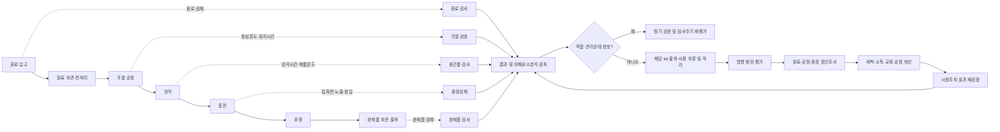
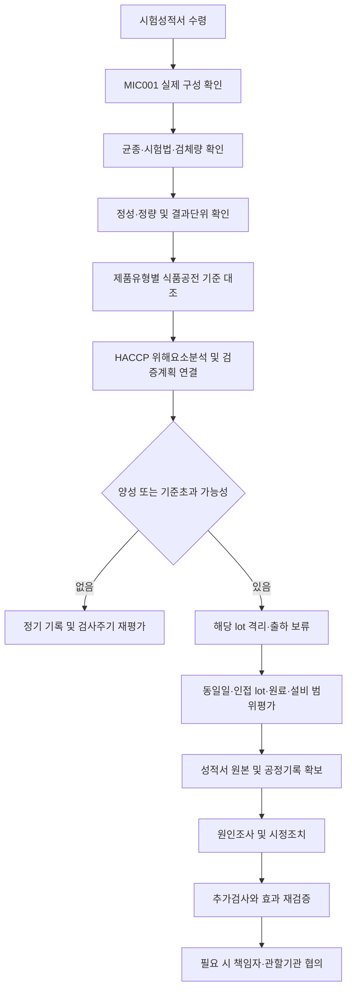

# [QA+ 블로그 생성 결과물] MIC001 주요식중독균 5종
생성일시: 2026-09-13 06:51:21 (KST)
적용모델: gpt-5.6-terra

================================================================================
# 📋 최종 발행용 블로그 패키지

### 1. 메타 데이터 (SEO 설정)

- **최종 포스팅 제목**: MIC001 주요식중독균 5종 검사, 성적서만 보지 말고 HACCP까지 이렇게 관리하세요
- **메타 디스크립션 (120자 내외 요약)**: MIC001 식중독균 5종 검사성적서는 코드만 보면 안 됩니다. 실제 균종·시험법·검체량 확인부터 HACCP 위해요소분석, 양성 시 격리·시정조치까지 정리했습니다.
- **추천 해시태그 (10개)**: #식품품질관리 #HACCP #식품안전 #식중독균검사 #MIC001 #미생물검사 #식품공전 #자가품질검사 #식품제조업 #식품QA
- **카테고리**: 식품품질실무 / HACCP가이드

> **검수 메모**  
> - MIC001은 식품공전의 법정 공통코드라고 단정할 수 없으므로, 시험기관별 패키지명·내부코드 가능성을 전제로 표현했습니다.  
> - 법령·기준은 개정될 수 있으므로, 실제 적용 전 최신 「식품의 기준 및 규격」 및 해당 식품유형의 미생물 기준 확인이 필요합니다.  
> - “양성 가능 결과”는 시험기관의 최종 판정, 시험법, 확인시험 여부 등을 성적서 원본으로 확인해야 하므로 단정적 표현을 피했습니다.  

---

## 2. 네이버 블로그 / 티스토리 복사용 최종 원고 (Markdown)

# MIC001 주요식중독균 5종 검사, 성적서만 보지 말고 HACCP까지 이렇게 관리하세요

> **20년 실무 선배의 한 줄 요약**  
> MIC001은 법정 공통코드가 아닐 수 있습니다. 먼저 성적서에 실제로 포함된 균종·시험법·검체량을 확인하고, 그 결과를 HACCP 위해요소분석과 현장 개선조치까지 연결해야 합니다.

---

## 1. “식중독균 5종 검사”보다 먼저 확인할 것은 우리 제품과 실제 검사 항목입니다

외부 시험성적서에 `MIC001 주요식중독균 5종`이라고 적혀 있으면, 처음 맡은 실무자분들은 일단 “5개 균을 검사했으니 안전하겠지”라고 생각하기 쉽습니다. 그런데 이 부분이 현장에서 정말 많이 헷갈리는 지점입니다. **MIC001은 식품공전에서 모든 기관이 공통으로 쓰는 법정 코드라고 단정할 수 없습니다.** 시험·검사기관의 자체 패키지명, 거래처용 검사코드, 사내 LIMS 코드일 가능성이 있기 때문입니다.

쉽게 말하면 MIC001은 “종합검진 A패키지” 같은 이름일 수 있습니다. 병원마다 종합검진 A패키지에 포함된 항목이 다를 수 있듯이, 시험기관마다 “주요식중독균 5종”의 구성도 달라질 수 있습니다. 어떤 기관은 살모넬라, 황색포도상구균, 장염비브리오, 병원성대장균, 리스테리아를 묶을 수 있고, 다른 기관은 리스테리아 대신 클로스트리디움 퍼프린젠스를 넣을 수도 있습니다.

그래서 시험의뢰 전이나 성적서 검토 시에는 “MIC001”이라는 코드만 보시면 안 됩니다. 반드시 균의 **국문명과 영문명**, 정성시험인지 정량시험인지, 검체량이 몇 g인지, 결과 단위가 CFU/g인지 MPN/g인지, 적용 시험법은 무엇인지까지 확인해야 합니다. 성적서에 “불검출”이라고 적혀 있어도, 그것이 `25 g당 불검출`인지 또는 다른 조건인지에 따라 해석의 무게가 달라집니다.

특히 HACCP 심사에서는 “검사를 했느냐”보다 “왜 이 제품에 이 균을 검사했느냐”를 더 많이 봅니다. 예를 들어 냉장 훈연연어 제품인데 장염비브리오와 리스테리아의 위해성 검토 없이 일반세균수만 관리한다면, 심사관 입장에서는 관리 근거가 약하다고 볼 수 있습니다. 반대로 가열 후 즉시 밀봉되는 레토르트 제품에 대해 모든 식중독균을 관행적으로 매번 검사한다면, 검사비는 쓰면서도 위해분석과 연결되지 않는 계획이 될 수 있습니다.


다음 단계는 어렵지 않습니다. **코드가 아니라 제품과 공정을 기준으로 검사 항목을 다시 읽는 것**입니다. 이제 법적 기준과 HACCP에서 이 검사가 어떤 의미를 갖는지 차근차근 정리해 보겠습니다.

---

## 2. 법적 기준과 HACCP에서 식중독균 검사가 갖는 의미

식품 미생물 기준의 큰 근거는 「식품위생법」 제7조입니다. 이 조항에 따라 식품의약품안전처장은 식품 또는 식품첨가물의 기준과 규격을 정할 수 있습니다. 즉, 특정 식품유형에 미생물 기준이 설정되어 있다면 그것은 단순 권고가 아니라 **법적 적합성 판단의 기준**이 될 수 있습니다.

구체적인 제품별 기준은 「식품의 기준 및 규격」, 즉 식품공전에서 확인합니다. 식품공전에는 식품유형별로 적용되는 미생물 기준이 다르고, 같은 균이라도 제품군에 따라 기준의 적용 여부와 판정 방식이 달라질 수 있습니다. 따라서 “살모넬라는 무조건 이렇게 관리한다”라는 식으로 모든 제품에 하나의 기준을 적용하면 안 됩니다.

쉽게 말하면 식품공전은 식품업계의 “제품별 시험 규칙집”입니다. 냉장 즉석섭취식품, 수산가공품, 육가공품, 음료류, 조미식품은 원료와 공정, 섭취 방식이 다르기 때문에 같은 미생물 항목이라도 위험도가 다릅니다. 특히 소비자가 다시 가열하지 않고 바로 먹는 제품은 가열 후 재오염과 냉장유통 중 증식 가능성까지 함께 봐야 합니다.

HACCP에서 식중독균 검사는 관리의 시작이자 끝이 아닙니다. HACCP의 핵심은 원료 입고부터 제조·가공·보관·출하까지의 생물학적 위해요소를 분석하고, 예방적으로 관리하는 것입니다. 식중독균 검사는 세척·소독, 가열, 냉각, 냉장, 구역 분리, 작업자 위생관리 등이 실제로 효과가 있었는지 확인하는 **검증(verification) 도구**입니다.

> **현장 핵심 정리**  
> 완제품 검사에서 음성이 나왔다고 공정 전체가 영구적으로 안전하다는 뜻은 아닙니다.  
> 반대로 한 번 양성이 나왔다고 해서 무조건 “재검해서 음성 나오면 끝”도 아닙니다.  
> 결과를 근거로 오염 경로를 찾아 재발을 막는 것이 HACCP 실무입니다.

| 구분 | 무엇을 확인하나 | 실무에서 놓치기 쉬운 점 |
|---|---|---|
| 식품위생법 제7조 | 식품 기준·규격 설정의 법적 근거 | “권고사항” 정도로 가볍게 해석하는 실수 |
| 식품공전 식품유형별 기준 | 내 제품에 적용되는 미생물 기준 | 다른 식품유형 기준을 그대로 가져오는 실수 |
| 식품공전 일반시험법 | 미생물 시험의 공식 시험 근거 | 시험법·검출한계·검체량을 확인하지 않는 실수 |
| HACCP 위해요소분석 | 왜 해당 균을 관리하는지에 대한 근거 | 검사성적서만 보관하고 분석표에 연결하지 않는 실수 |
| HACCP 검증 | 관리수단이 실제 효과가 있는지 확인 | 부적합 후 시정조치 효과를 재검증하지 않는 실수 |

법적 기준과 사내 관리기준도 반드시 구분해 두셔야 합니다. 법정 기준은 반드시 준수해야 하는 기준이고, 거래처 기준은 계약 또는 납품 조건일 수 있으며, 사내 경보수준은 법정 부적합 전에 이상 징후를 잡기 위한 예방 기준입니다. 이 세 가지가 한 표에 뒤섞여 있으면, 정작 부적합 발생 시 누가 어떤 판단을 해야 하는지 혼란이 생깁니다.

이제 “그렇다면 주요 식중독균 5종은 각각 무엇을 봐야 하나요?”라는 질문으로 넘어가 보겠습니다. 균 이름을 외우는 것보다, **어느 원료·공정·환경에서 들어오는지**를 이해하는 것이 훨씬 중요합니다.

---

## 3. 주요 식중독균 5종, 균 이름보다 오염 경로를 먼저 보세요

대표적으로 관리되는 균종에는 살모넬라, 황색포도상구균, 장염비브리오, 병원성대장균, 리스테리아 모노사이토제네스 또는 클로스트리디움 퍼프린젠스가 있습니다. 다만 다시 한 번 말씀드리지만, 이것이 모든 기관의 MIC001 구성과 정확히 일치한다고 단정하면 안 됩니다. 실제 의뢰서와 성적서의 균종 목록을 우선 확인하셔야 합니다.

**살모넬라(Salmonella spp.)**는 난류, 가금육, 육류, 향신료, 분말원료 등에서 위해요소로 검토되는 경우가 많습니다. 가열공정이 있다면 가열 조건의 검증이 중요하고, 가열 후 공정에서는 생원료 구역과의 교차오염 차단이 더 중요해집니다. 쉽게 말하면 생닭을 만진 장갑이나 칼이 익힌 제품 구역으로 넘어가지 않도록 만드는 것이 핵심입니다.

**황색포도상구균(Staphylococcus aureus)**은 작업자 손, 피부, 비강과 연관성이 높은 균으로 알려져 있습니다. 손으로 많이 취급하는 김밥, 반찬, 크림류, 육가공품, 조리식품에서는 작업자 위생과 실온 방치시간 관리가 특히 중요합니다. 상처가 있는 작업자의 작업 제한, 방수밴드와 장갑의 올바른 사용, 장갑 교체 주기, 손 세척·소독 준수가 단순하지만 강력한 예방수단입니다.

**장염비브리오(Vibrio parahaemolyticus)**는 수산물과 어패류에서 특히 주의해야 합니다. 여름철 냉장 온도 이탈, 해동수와 세척수 관리 미흡, 생선 손질용 칼·도마의 교차사용이 대표적인 위험요인입니다. 수산물 공장에서는 “냉장고에 넣어뒀다”가 아니라 실제 제품 중심온도와 보관시간, 해동 후 처리시간까지 관리해야 합니다.

**병원성대장균(pathogenic E. coli)**은 육류, 채소류, 비가열 섭취 식품, 지하수 또는 용수 사용 공정에서 위해요소로 검토할 수 있습니다. 일반적인 대장균 또는 대장균군 검사는 위생상태의 지표로 활용될 수 있지만, 병원성대장균 검사는 특정 병원성 균의 존재 가능성을 확인하는 별도 개념입니다. 일반세균수나 대장균군 결과가 적합하다고 병원성대장균 위험까지 자동으로 사라지는 것은 아닙니다.

마지막 다섯 번째 항목은 기관에 따라 **리스테리아 모노사이토제네스(Listeria monocytogenes)** 또는 **클로스트리디움 퍼프린젠스(Clostridium perfringens)**일 수 있습니다. 리스테리아는 냉장 즉석섭취식품, 유제품, 훈연수산물처럼 냉장 보관 중인 제품의 환경위생과 연결해서 봐야 합니다. 퍼프린젠스는 대량조리 육류, 국, 찜류처럼 조리 후 냉각이 늦어지거나 보온관리가 부적절한 공정에서 특히 중요하게 검토합니다.

| 주요 균 | 우선 검토할 제품·원료 | 핵심 예방관리 | 양성 또는 이상 시 첫 점검 위치 |
|---|---|---|---|
| 살모넬라 | 난류, 가금육, 육류, 향신료, 분말원료 | 원료관리, 충분한 가열, 가열 후 구역분리 | 원료 lot, 가열기록, 작업자·도구 동선 |
| 황색포도상구균 | 김밥, 반찬, 크림류, 조리식품, 육가공품 | 손 위생, 상처관리, 실온 노출시간 관리 | 손·장갑·집게·충전도구, 냉각 지연 |
| 장염비브리오 | 생선회, 조개류, 수산가공품 | 저온유통, 해동수·세척수 관리, 교차오염 차단 | 원료 온도, 해동수, 칼·도마, 냉장고 |
| 병원성대장균 | 채소류, 샐러드, 육류, 비가열 섭취식품 | 세척·소독, 용수관리, 가열, 구역분리 | 세척수, 원수, 채소 전처리, 가열 후 공정 |
| 리스테리아 또는 퍼프린젠스 | 냉장 즉석섭취식품 또는 대량조리식품 | 환경위생 또는 신속한 냉각·적정 보온 | 배수구·냉장실 또는 냉각시간·중심온도 |

이 표를 그대로 모든 공장에 적용하시면 안 됩니다. 하지만 위해요소분석을 할 때 “우리 공장은 어떤 균이 어디서 들어올 수 있지?”를 생각하는 출발점으로는 충분히 활용할 수 있습니다. 다음은 이 내용을 실제 검사계획으로 바꾸는 방법입니다.

---

## 4. 우리 제품에 필요한 식중독균 검사항목을 고르는 5가지 질문

검사항목 선정은 거래처가 요청한 패키지를 그대로 받아들이는 방식보다, 제품 위해요소분석을 먼저 해보는 방식이 훨씬 안전합니다. 특히 HACCP 운영업소라면 위해요소분석표, 원료규격서, 공정도, 제조공정설명서, 검증계획서의 내용이 서로 연결되어야 합니다. 문서마다 말이 다르면 심사 때 바로 질문이 들어옵니다.

첫 번째 질문은 **“이 제품은 소비자가 추가 가열 없이 먹는가?”**입니다. 비가열 섭취 제품이나 즉석섭취식품은 최종 단계에서 위해를 제거할 기회가 적습니다. 따라서 원료 세척·소독, 작업자 위생, 가열 후 교차오염 방지, 냉장유통 관리의 중요도가 커집니다.

두 번째 질문은 **“고위험 원료를 쓰는가?”**입니다. 난류, 가금육, 축산물, 수산물, 생채소, 향신료, 분말원료는 제품 특성에 따라 미생물 위해요소를 검토해야 할 수 있습니다. 단순히 원료가 국내산인지 수입산인지만 볼 것이 아니라, 원료의 미생물 규격서, 공급업체 성적서, 입고 온도, 전처리 방식, 과거 부적합 이력까지 봐야 합니다.

세 번째 질문은 **“최종 가열공정이 있는가, 그리고 실제로 검증되었는가?”**입니다. 가열솥 설정온도가 90℃라고 해서 제품 중심온도가 항상 90℃에 도달하는 것은 아닙니다. 제품의 점도, 충전량, 포장 형태, 적재량, 설비 상태에 따라 가장 늦게 가열되는 지점이 달라질 수 있으므로, 필요 시 중심온도와 유지시간을 포함한 공정 검증이 필요합니다.

네 번째 질문은 **“가열 후 다시 오염될 가능성이 있는가?”**입니다. 이 질문이 빠지면 많은 공장에서 문제가 생깁니다. 가열 직후의 제품은 안전해도 냉각컨베이어, 충전노즐, 작업자 장갑, 포장실 공기, 배수구 비산, 재사용 용기 등을 통해 다시 오염될 수 있습니다.

다섯 번째 질문은 **“냉장 유통기간이 길거나, 냉각이 느린가?”**입니다. 냉장 제품은 보관 중에도 일부 미생물이 문제가 될 수 있고, 대량조리 제품은 냉각 속도가 늦으면 위해가 커질 수 있습니다. 냉장고 설정온도만 기록하지 말고, 제품 중심온도와 냉각 완료 시간, 실제 유통 중 온도 이탈 가능성까지 함께 검토하셔야 합니다.

> **★ 20년 실무 선배 팁**  
> 검사계획서에는 “월 1회, 식중독균 5종 검사”만 쓰지 마세요.  
> “냉장 즉석섭취식품이며 가열 후 충전공정이 존재하므로, 가열 후 재오염 검증을 위해 ○○균을 포함한 완제품 및 환경검체를 월 1회 검사한다”처럼 **선정 이유**를 한 줄이라도 남겨두시면 심사 대응력이 확 달라집니다.

검사항목을 정했다면 다음은 검체 설계입니다. 완제품만 보내는 방식에서 한 단계 더 나아가, 오염이 어디에서 시작됐는지 찾을 수 있는 구조로 만들어야 합니다.

---

## 5. 완제품만 검사하지 말고, 오염 경로를 검사하세요

완제품 검사만으로도 출하 전 위생수준을 확인하는 데 도움이 됩니다. 하지만 완제품에서 부적합이 나왔을 때 원인을 찾기에는 정보가 부족한 경우가 많습니다. 제품 하나에서 균이 검출됐다고 해도 원료 때문인지, 작업자 때문인지, 냉각실 환경 때문인지, 충전기 때문인지 알 수 없기 때문입니다.

그래서 위험도가 높은 제품이나 가열 후 노출공정이 긴 제품은 원료·중간품·완제품·환경을 연결해서 보는 것이 좋습니다. 예를 들어 냉장 소스 제품이라면 원료 입고 시 향신료 또는 채소 원료, 가열 후 중간품, 충전 직전 제품, 충전노즐, 작업자 장갑, 배수구 주변 등을 위험도에 따라 설계할 수 있습니다. 다만 환경검사는 제품검사와 목적이 다르므로, 별도의 환경모니터링 계획과 조치기준을 마련해 두셔야 합니다.

환경검체에서 특정 균이 검출됐다고 해서 곧바로 제품 법정 부적합과 동일하게 판단하면 안 됩니다. 환경검사는 “오염 가능성이 어디에 숨어 있는가”를 찾는 예방 활동에 가깝습니다. 쉽게 말하면 완제품 검사가 건강검진이라면, 환경검사는 집 안의 누수와 곰팡이 발생 지점을 찾는 점검입니다.

검체 채취도 아무 때나 하면 정보 가치가 떨어집니다. 가열 전 구역과 가열 후 청결구역의 구분이 있는 공장은 구역별로 채취 목적을 분명히 해야 합니다. 예를 들어 청결구역의 충전노즐, 포장기 접촉면, 냉각컨베이어, 배수구 주변은 가열 후 재오염 위험을 확인하는 데 의미가 있을 수 있습니다.




또 하나, 검사 결과의 숫자만 보지 마시고 채취 당시의 현장 상태를 함께 기록하세요. 생산품목, 생산시간, 작업자 조, 세척 직후인지 생산 중인지, 설비 분해세척 여부, 원료 lot, 냉장온도, 가열기록을 묶어두면 나중에 이상이 발생했을 때 원인 분석 시간이 절반 이하로 줄어들 수 있습니다. 현장에서는 이 기록 차이가 정말 큽니다.

이제 가장 긴급한 상황, 즉 양성 또는 기준초과 가능 결과가 나왔을 때의 초기 대응 순서를 정리해 보겠습니다.

---

## 6. 식중독균 양성 또는 기준초과 시, 첫 24시간 이렇게 움직이세요

식중독균 양성 또는 기준초과 가능 결과가 확인되면 제일 먼저 해야 할 일은 **해당 lot의 출하·사용 보류와 격리**입니다. “재검사부터 해보자”가 첫 조치가 되면 안 됩니다. 최초 결과가 시험오류인지 여부를 확인하는 것과 별개로, 제품이 이미 유통되었는지와 추가 생산품에 영향이 있는지부터 확인해야 합니다.

두 번째는 영향 범위를 정하는 일입니다. 동일 생산일, 동일 원료 lot, 동일 설비, 동일 작업조, 세척 전후 생산분, 인접 lot를 기준으로 범위를 설정합니다. 제품마다 다르지만 최소한 “그 검체가 어느 시간대에 어떤 원료와 어떤 설비에서 생산되었는지”는 추적 가능해야 합니다.

세 번째는 성적서 원본을 다시 보는 것입니다. 균종명, 시험법, 검체량, 정성·정량 여부, 결과값, 검출한계, 판정기준을 확인하세요. 특히 “불검출/25 g”처럼 정성 결과를 보는 항목과 “CFU/g”처럼 정량 수치를 보는 항목은 대응 방식이 달라질 수 있습니다.

네 번째는 증거가 사라지기 전에 공정 이력을 확보하는 일입니다. 원료 입고검사 기록, 공급업체 성적서, 가열기록, 냉각기록, 냉장온도 기록, 세척·소독일지, 작업자 위생점검표, 금속검출기나 포장기록까지 관련 정보를 묶어 두십시오. 담당자가 기억으로 설명하려고 하면 며칠만 지나도 사실관계가 흐려집니다.

다섯 번째는 원인조사와 시정조치입니다. 원료 의심이면 잔여 원료와 동일 원료 lot를 확인하고, 가열 부족 의심이면 실제 제품 중심온도와 유지시간을 검토하며, 가열 후 재오염 의심이면 충전기·냉각설비·작업자·배수구 등 환경을 조사합니다. 이후 세척·소독 강화, 설비 분해점검, 작업동선 개선, 작업자 재교육, 공정조건 재검증을 실시하고 효과를 다시 검증해야 합니다.



> **중요합니다**  
> 최초 양성 결과가 나온 뒤 같은 검체 또는 다른 검체에서 음성이 나왔다고 해서 최초 결과가 자동으로 사라지는 것은 아닙니다.  
> 재시험은 “출하를 위한 면죄부”가 아니라, 격리·원인조사·시정조치 후 관리상태를 확인하는 검증활동으로 다루셔야 합니다.  
> 법정 기준 부적합 가능성, 유통제품 존재 여부, 회수·보고 필요성은 내부 책임자와 확인하고 필요 시 관할 행정기관 지침을 따라야 합니다.

이론으로 보면 단순하지만, 실제 현장에서는 기록이 부족하거나 책임자가 불명확해서 대응이 늦어지는 일이 많습니다. 아래 사례를 보면 왜 평소 계획과 기록이 중요한지 더 명확해집니다.

---

## 7. 실제 현장 사례로 보는 적용법

### 사례 1. 냉동만두 제조공장의 살모넬라 의심 대응

A 냉동만두 제조공장은 가금육과 채소 원료를 사용하는 제품을 생산하고 있었습니다. 거래처 제출용으로 완제품 식중독균 패키지 검사를 진행하던 중 특정 생산일의 만두에서 살모넬라 양성 가능 결과가 통보되었습니다. 처음에는 “냉동 제품이고, 가열 조리해서 먹는 제품인데 큰 문제겠느냐”는 의견도 나왔습니다. 그러나 품질팀은 즉시 해당 생산 lot와 인접 생산 lot를 출하 보류하고, 같은 날 사용한 닭고기 원료와 향신료 원료까지 범위를 넓혀 추적했습니다.

조사 결과 가열공정 자체의 온도기록은 기준대로 관리되고 있었지만, 가열 전 원료구역에서 사용한 운반대가 세척 후 청결구역 인근까지 이동한 사실이 확인되었습니다. 운반대 바퀴와 바닥의 오염이 작업자 신발과 카트 이동을 통해 간접적으로 가열 후 구역에 영향을 줬을 가능성이 제기됐습니다. 또한 생원료용 장갑 보관함과 청결구역용 장갑 보관함의 위치가 가까워 작업자들이 교체 과정에서 혼동하기 쉬운 구조였습니다. 근본 원인은 단순히 “작업자가 실수했다”가 아니라, 가열 전·후 구역 구분과 도구 동선 설계가 불명확했던 것이었습니다.

개선조치로 생원료구역 운반대와 청결구역 운반대를 색상으로 구분하고, 바퀴까지 포함한 세척·소독 표준을 새로 만들었습니다. 가열 후 구역 출입 시 장화 교체와 손 위생 절차를 강화하고, 출입문 앞에 시각표지를 설치했습니다. 이후 완제품뿐 아니라 충전 전 제품, 작업대 접촉면, 운반대 바퀴, 작업자 장갑을 포함한 추가 검증을 4주간 강화했습니다. 결과적으로 후속 검사에서는 이상이 확인되지 않았고, HACCP 위해요소분석표에도 “가열 후 재오염” 위험과 구체적 관리방법을 보완할 수 있었습니다.

### 사례 2. 냉장 소스류 공장의 황색포도상구균 검출 사례

B 소스 제조공장은 가열한 소스를 냉각한 뒤 충전하는 공정을 운영하고 있었습니다. 특정 크림소스 제품에서 황색포도상구균 수치가 사내 경보수준을 넘는 결과가 나왔지만, 법정 기준과 거래처 규격의 적용 여부를 제대로 구분하지 않아 현장이 한동안 혼란스러웠습니다. 생산팀은 가열솥 온도를 더 올리면 해결될 것이라고 판단했습니다. 하지만 품질팀이 공정별 검체를 채취해 보니 가열 직후 중간품에서는 문제가 없고, 냉각 후 충전 직전 단계에서 오염 가능성이 높아지는 양상이 보였습니다.

추가 조사에서 충전 작업자가 장갑을 장시간 교체하지 않고 설비 조정과 포장자재 정리를 함께 수행한 점이 확인되었습니다. 일부 작업자는 손에 작은 상처가 있었지만, 현장 반장에게 제대로 보고하지 않았습니다. 더 큰 문제는 상처 작업자 관리기준은 문서에 있었지만, 실제 점검표에는 상처 유무와 조치사항을 기록하는 칸이 없었다는 점입니다. 근본 원인은 개인위생 교육 부족만이 아니라, 작업자 건강상태 확인과 장갑 교체가 현장 표준으로 작동하지 않은 것이었습니다.

공장은 충전구역 작업자의 장갑 교체 기준을 작업 전, 화장실 이용 후, 설비 외부 접촉 후, 오염 가능 작업 후로 구체화했습니다. 상처 발생 시 보고-방수밴드-장갑 착용-작업 제한 여부 판단 절차를 SOP로 만들고, 일일 위생점검표에 확인란과 조치란을 추가했습니다. 충전노즐과 작업자 장갑에 대한 환경모니터링을 초기 2주간 주 2회 실시해 개선 효과를 확인했습니다. 이후 해당 제품은 단순 완제품 재검사에만 의존하지 않고, 가열 후 공정의 개인위생 검증 항목을 강화하는 방향으로 검사계획을 바꿨습니다.

### 사례 3. 수산가공품 공장의 장염비브리오 위험 관리 사례

C 수산가공품 공장은 양념 새우 제품을 여름철에 집중 생산했습니다. 일반세균수와 대장균군 결과는 대체로 안정적이었지만, 거래처에서 장염비브리오 검사 근거를 요청하면서 품질팀이 위해요소분석을 다시 검토하게 됐습니다. 처음에는 제품이 냉장 상태로 유통되므로 문제 가능성이 낮다고 판단했습니다. 그러나 원료 입고부터 해동, 세척, 양념, 포장까지의 시간을 확인해 보니 더운 날에는 해동 대기시간이 길어지는 경우가 있었습니다.

특히 해동수 교체 기준이 “오염 시 교체”처럼 모호하게 작성되어 있었고, 현장에서는 작업 종료 시에만 교체하는 경우도 있었습니다. 생새우 전처리용 칼과 양념 혼합용 도구가 세척 후 같은 건조대에서 관리되는 점도 확인되었습니다. 근본 원인은 냉장고 온도기록이 없어서가 아니라, 해동수·세척수·도구 동선 등 수산물 특유의 위험요인을 세부 관리기준으로 만들지 않은 데 있었습니다. 품질팀은 원료 입고온도, 해동 시작·종료 시각, 해동수 교체 주기, 전처리도구 색상구분, 세척 후 건조 위치를 관리항목으로 새로 설정했습니다.

또한 여름철 6월부터 9월까지는 장염비브리오 관련 검증 강도를 높이고, 원료와 완제품의 검사주기를 평상시보다 강화했습니다. 해동 후 실온 체류시간을 줄이기 위해 소분 해동 방식으로 바꾸고, 생산계획도 원료 입고량에 맞춰 조정했습니다. 개선 후에는 장염비브리오 검사 결과뿐 아니라, 해동수 관리기록과 현장 점검 결과도 함께 검토하는 체계가 자리 잡았습니다. 이 사례의 핵심은 “검사 항목 하나를 추가했다”가 아니라, 수산물 공정의 오염 경로를 실제 관리기준으로 바꿨다는 데 있습니다.

사례를 보시면 공통점이 하나 있습니다. 균을 없애는 방법은 단순 재검사가 아니라, **균이 들어온 길을 찾아 그 길을 막는 것**입니다. 이제 성적서를 읽을 때 실무자분들이 가장 많이 묻는 질문을 정리해 보겠습니다.

---

## 8. MIC001과 식중독균 검사, 자주 묻는 질문 6가지

### Q1. MIC001 주요식중독균 5종 검사는 법적으로 모든 식품이 해야 하나요?

**A. 아닙니다.** 모든 식품에 동일한 5종 검사가 법적으로 일률 적용된다고 보면 안 됩니다. 제품의 식품유형별 식품공전 기준, 자가품질검사 대상 여부, HACCP 위해요소분석 결과, 거래처 요구사항을 구분해서 판단해야 합니다.

### Q2. 성적서의 “불검출/25 g”은 정확히 무슨 뜻인가요?

**A. 일반적으로 해당 시험 조건에서 25 g 검체로 시험했을 때 대상 균이 검출되지 않았다는 정성시험 결과를 의미합니다.** 다만 시험기관의 성적서에 적힌 검체량, 전처리 방법, 시험법을 반드시 확인해야 합니다. 불검출은 그 검체와 그 시험조건에서의 결과이지, 공장 전체가 영구적으로 무오염이라는 뜻은 아닙니다.

### Q3. 일반세균수가 적합하면 식중독균 검사는 생략해도 되나요?

**A. 생략하면 안 되는 경우가 많습니다.** 일반세균수는 전반적인 위생상태를 보는 지표이고, 특정 병원성 미생물의 부재를 보장하는 시험은 아닙니다. 쉽게 말하면 일반세균수는 교실 전체의 청결도를 보는 것이고, 식중독균 검사는 특정 위험 인물이 있는지 확인하는 검사라고 이해하시면 됩니다.

### Q4. 식중독균 양성이면 재검사에서 음성이 나왔을 때 출하해도 되나요?

**A. 단순히 재검사 음성만으로 최초 양성 가능 결과를 없던 일로 처리하면 안 됩니다.** 우선 해당 lot를 격리하고, 유통 여부와 영향 범위를 확인한 뒤, 시험결과 검토·원인조사·시정조치를 진행해야 합니다. 법정 기준 부적합 또는 유통제품 관련 이슈가 있으면 내부 책임자 및 필요 시 관할기관과 협의해야 합니다.

### Q5. 검사 주기는 월 1회면 충분한가요?

**A. 제품 위험도에 따라 다릅니다.** 가열 유무, 비가열 섭취 여부, 원료 특성, 생산량, 계절성, 공정변경, 과거 부적합 이력, 거래처 요구사항을 근거로 정해야 합니다. 예를 들어 여름철 수산가공품, 냉장 즉석섭취식품, 신규 원료 도입 직후 제품은 평상시보다 검증 강도를 높이는 방식이 합리적입니다.

### Q6. 리스테리아와 퍼프린젠스 중 무엇을 검사해야 하나요?

**A. MIC001 구성부터 확인하고, 그다음 제품 특성으로 판단해야 합니다.** 냉장 즉석섭취식품이나 장기간 냉장 유통되는 제품은 리스테리아 환경관리 중요도가 높을 수 있고, 대량조리 후 냉각하는 육류·국·찜류는 퍼프린젠스와 냉각·보온 관리가 중요할 수 있습니다. 최종 판단은 최신 식품공전의 해당 식품유형 기준과 HACCP 위해요소분석 결과를 근거로 하셔야 합니다.

FAQ를 읽고 나면 결국 “우리 공장은 무엇을 기록해야 하나요?”가 남습니다. 바로 현장에서 사용할 수 있도록 점검표 형태로 정리해 드리겠습니다.

---

## 9. MIC001 식중독균 검사 실무 체크리스트

아래 표는 시험의뢰 전, 성적서 수령 후, 부적합 발생 시 바로 활용할 수 있는 기본 체크리스트입니다. 모든 항목을 한 번에 완벽하게 만들려고 하지 마시고, 현재 공장에서 빠져 있는 항목부터 하나씩 보완하시면 됩니다. 중요한 것은 담당자가 바뀌어도 같은 방식으로 판단할 수 있도록 문서화하는 것입니다.

| 단계 | 점검 항목 | 확인 기준 | 확인 방법 | 담당 부서 |
|---|---|---|---|---|
| 시험의뢰 전 | MIC001 실제 구성 확인 | 균종 5개를 국문·영문으로 확인 | 견적서·의뢰서·기관 항목표 확인 | QC |
| 시험의뢰 전 | 검사 목적 명확화 | 자가품질, HACCP 검증, 거래처 제출, 클레임 조사 구분 | 연간 검증계획서 기록 | QC/HACCP팀 |
| 시험의뢰 전 | 제품 위험도 평가 | 원료, 가열 유무, 냉장유통, 비가열 섭취 여부 검토 | 위해요소분석표 검토 | HACCP팀 |
| 검체 채취 | 검체 대표성 확보 | 생산일·lot·시간대·원료 lot가 추적 가능해야 함 | 검체채취기록서 작성 | QC/생산 |
| 성적서 검토 | 정성·정량 여부 확인 | 불검출인지, CFU/g 또는 MPN/g인지 확인 | 성적서 결과란 확인 | QC |
| 성적서 검토 | 검체량·시험법 확인 | 예: 25 g당 불검출 표기, 적용 시험법 확인 | 성적서 시험방법란 확인 | QC |
| 결과 반영 | HACCP 검증기록 작성 | 검토일, 검토자, 판정, 후속조치 기록 | 검증결과서 작성 | HACCP팀 |
| 이상 발생 | 해당 lot 격리 | 출하·사용 보류 상태 확인 | 격리표시, ERP 또는 재고기록 | 품질/물류 |
| 이상 발생 | 영향 범위 설정 | 동일일·인접 lot·동일 원료·동일 설비 확인 | 생산일지, 원료수불대장 확인 | QC/생산 |
| 이상 발생 | 시정조치 효과 확인 | 세척·소독·교육·설비개선 후 재검증 | 추가검사 및 현장점검 | HACCP팀 |
| 정기 검토 | 검사주기 재평가 | 계절, 공정변경, 부적합 이력 반영 | 연간 검증계획 검토 | 품질책임자 |

심사관이 자주 지적하는 부분도 함께 기억해 두세요. “검사항목 선정 근거가 없다”, “성적서는 있는데 검토기록이 없다”, “법정 기준과 사내 기준이 섞여 있다”, “가열 후 교차오염 관리가 약하다”, “부적합 시 조치절차가 모호하다”가 대표적입니다. 이 다섯 가지만 정리해도 HACCP 문서와 현장 운영 수준이 한 단계 올라갑니다.

---

## 10. 맺음말: 식중독균 5종 검사의 목적은 성적서 확보가 아니라 재발 방지입니다

오늘 내용은 길었지만, 실무에서는 아래 세 줄만 먼저 기억하셔도 됩니다.

1. **MIC001은 코드일 수 있으니, 실제 포함 균종·시험법·검체량부터 확인합니다.**
2. **검사항목은 관행이 아니라 식품공전 기준과 HACCP 위해요소분석을 근거로 선정합니다.**
3. **양성 또는 기준초과 가능 결과가 나오면 재검사부터 하지 말고, lot 격리·범위평가·원인조사·시정조치부터 합니다.**

식중독균 검사는 결과를 받는 순간 끝나는 업무가 아닙니다. “왜 이 균을 검사했는가”, “어느 공정에서 들어왔는가”, “다음 생산에서는 어떻게 막을 것인가”까지 답할 수 있어야 진짜 품질관리입니다. 일반세균수 적합, 성적서 불검출, 거래처 제출 완료에서 멈추지 말고 공정 개선까지 연결해 보세요.

마지막으로 법령과 기준은 개정될 수 있으니, 실제 발행·적용 전에는 반드시 최신 식품공전과 해당 식품유형의 미생물 기준을 재확인하시기 바랍니다. 막히는 부분이 있으면 언제든 댓글로 편하게 물어보세요. 후배님들의 부적합 제로와 칼퇴를 응원합니다.

---

## 3. 워드프레스 / 웹사이트용 HTML 원고

```html
<article class="food-qa-post">
  <header>
    <h1>MIC001 주요식중독균 5종 검사, 성적서만 보지 말고 HACCP까지 이렇게 관리하세요</h1>
    <blockquote>
      <p><strong>20년 실무 선배의 한 줄 요약</strong><br>
      MIC001은 법정 공통코드가 아닐 수 있습니다. 먼저 성적서에 실제로 포함된 균종·시험법·검체량을 확인하고, 그 결과를 HACCP 위해요소분석과 현장 개선조치까지 연결해야 합니다.</p>
    </blockquote>
  </header>

  <section>
    <h2>1. “식중독균 5종 검사”보다 먼저 확인할 것은 우리 제품과 실제 검사 항목입니다</h2>
    <p>외부 시험성적서에 <code>MIC001 주요식중독균 5종</code>이라고 적혀 있으면, 처음 맡은 실무자분들은 일단 “5개 균을 검사했으니 안전하겠지”라고 생각하기 쉽습니다. 그런데 이 부분이 현장에서 정말 많이 헷갈리는 지점입니다. <strong>MIC001은 식품공전에서 모든 기관이 공통으로 쓰는 법정 코드라고 단정할 수 없습니다.</strong> 시험·검사기관의 자체 패키지명, 거래처용 검사코드, 사내 LIMS 코드일 가능성이 있기 때문입니다.</p>
    <p>쉽게 말하면 MIC001은 “종합검진 A패키지” 같은 이름일 수 있습니다. 병원마다 종합검진 A패키지에 포함된 항목이 다를 수 있듯이, 시험기관마다 “주요식중독균 5종”의 구성도 달라질 수 있습니다. 어떤 기관은 살모넬라, 황색포도상구균, 장염비브리오, 병원성대장균, 리스테리아를 묶을 수 있고, 다른 기관은 리스테리아 대신 클로스트리디움 퍼프린젠스를 넣을 수도 있습니다.</p>
    <p>그래서 시험의뢰 전이나 성적서 검토 시에는 “MIC001”이라는 코드만 보시면 안 됩니다. 반드시 균의 <strong>국문명과 영문명</strong>, 정성시험인지 정량시험인지, 검체량이 몇 g인지, 결과 단위가 CFU/g인지 MPN/g인지, 적용 시험법은 무엇인지까지 확인해야 합니다. 성적서에 “불검출”이라고 적혀 있어도, 그것이 <code>25 g당 불검출</code>인지 또는 다른 조건인지에 따라 해석의 무게가 달라집니다.</p>
    <p>특히 HACCP 심사에서는 “검사를 했느냐”보다 “왜 이 제품에 이 균을 검사했느냐”를 더 많이 봅니다. 예를 들어 냉장 훈연연어 제품인데 장염비브리오와 리스테리아의 위해성 검토 없이 일반세균수만 관리한다면, 심사관 입장에서는 관리 근거가 약하다고 볼 수 있습니다. 반대로 가열 후 즉시 밀봉되는 레토르트 제품에 대해 모든 식중독균을 관행적으로 매번 검사한다면, 검사비는 쓰면서도 위해분석과 연결되지 않는 계획이 될 수 있습니다.</p>

    <figure>
      
      <figcaption>MIC001 코드를 실제 검사 항목과 제품 위해요소분석, 개선조치까지 연결해 검토해야 합니다.</figcaption>
    </figure>

    <p>다음 단계는 어렵지 않습니다. <strong>코드가 아니라 제품과 공정을 기준으로 검사 항목을 다시 읽는 것</strong>입니다. 이제 법적 기준과 HACCP에서 이 검사가 어떤 의미를 갖는지 차근차근 정리해 보겠습니다.</p>
  </section>

  <section>
    <h2>2. 법적 기준과 HACCP에서 식중독균 검사가 갖는 의미</h2>
    <p>식품 미생물 기준의 큰 근거는 「식품위생법」 제7조입니다. 이 조항에 따라 식품의약품안전처장은 식품 또는 식품첨가물의 기준과 규격을 정할 수 있습니다. 즉, 특정 식품유형에 미생물 기준이 설정되어 있다면 그것은 단순 권고가 아니라 <strong>법적 적합성 판단의 기준</strong>이 될 수 있습니다.</p>
    <p>구체적인 제품별 기준은 「식품의 기준 및 규격」, 즉 식품공전에서 확인합니다. 식품공전에는 식품유형별로 적용되는 미생물 기준이 다르고, 같은 균이라도 제품군에 따라 기준의 적용 여부와 판정 방식이 달라질 수 있습니다. 따라서 “살모넬라는 무조건 이렇게 관리한다”라는 식으로 모든 제품에 하나의 기준을 적용하면 안 됩니다.</p>
    <p>쉽게 말하면 식품공전은 식품업계의 “제품별 시험 규칙집”입니다. 냉장 즉석섭취식품, 수산가공품, 육가공품, 음료류, 조미식품은 원료와 공정, 섭취 방식이 다르기 때문에 같은 미생물 항목이라도 위험도가 다릅니다. 특히 소비자가 다시 가열하지 않고 바로 먹는 제품은 가열 후 재오염과 냉장유통 중 증식 가능성까지 함께 봐야 합니다.</p>
    <p>HACCP에서 식중독균 검사는 관리의 시작이자 끝이 아닙니다. HACCP의 핵심은 원료 입고부터 제조·가공·보관·출하까지의 생물학적 위해요소를 분석하고, 예방적으로 관리하는 것입니다. 식중독균 검사는 세척·소독, 가열, 냉각, 냉장, 구역 분리, 작업자 위생관리 등이 실제로 효과가 있었는지 확인하는 <strong>검증(verification) 도구</strong>입니다.</p>

    <blockquote>
      <p><strong>현장 핵심 정리</strong><br>
      완제품 검사에서 음성이 나왔다고 공정 전체가 영구적으로 안전하다는 뜻은 아닙니다.<br>
      반대로 한 번 양성이 나왔다고 해서 무조건 “재검해서 음성 나오면 끝”도 아닙니다.<br>
      결과를 근거로 오염 경로를 찾아 재발을 막는 것이 HACCP 실무입니다.</p>
    </blockquote>

    <table>
      <thead>
        <tr><th>구분</th><th>무엇을 확인하나</th><th>실무에서 놓치기 쉬운 점</th></tr>
      </thead>
      <tbody>
        <tr><td>식품위생법 제7조</td><td>식품 기준·규격 설정의 법적 근거</td><td>“권고사항” 정도로 가볍게 해석하는 실수</td></tr>
        <tr><td>식품공전 식품유형별 기준</td><td>내 제품에 적용되는 미생물 기준</td><td>다른 식품유형 기준을 그대로 가져오는 실수</td></tr>
        <tr><td>식품공전 일반시험법</td><td>미생물 시험의 공식 시험 근거</td><td>시험법·검출한계·검체량을 확인하지 않는 실수</td></tr>
        <tr><td>HACCP 위해요소분석</td><td>왜 해당 균을 관리하는지에 대한 근거</td><td>검사성적서만 보관하고 분석표에 연결하지 않는 실수</td></tr>
        <tr><td>HACCP 검증</td><td>관리수단이 실제 효과가 있는지 확인</td><td>부적합 후 시정조치 효과를 재검증하지 않는 실수</td></tr>
      </tbody>
    </table>

    <p>법적 기준과 사내 관리기준도 반드시 구분해 두셔야 합니다. 법정 기준은 반드시 준수해야 하는 기준이고, 거래처 기준은 계약 또는 납품 조건일 수 있으며, 사내 경보수준은 법정 부적합 전에 이상 징후를 잡기 위한 예방 기준입니다. 이 세 가지가 한 표에 뒤섞여 있으면, 정작 부적합 발생 시 누가 어떤 판단을 해야 하는지 혼란이 생깁니다.</p>
    <p>이제 “그렇다면 주요 식중독균 5종은 각각 무엇을 봐야 하나요?”라는 질문으로 넘어가 보겠습니다. 균 이름을 외우는 것보다, <strong>어느 원료·공정·환경에서 들어오는지</strong>를 이해하는 것이 훨씬 중요합니다.</p>
  </section>

  <section>
    <h2>3. 주요 식중독균 5종, 균 이름보다 오염 경로를 먼저 보세요</h2>
    <p>대표적으로 관리되는 균종에는 살모넬라, 황색포도상구균, 장염비브리오, 병원성대장균, 리스테리아 모노사이토제네스 또는 클로스트리디움 퍼프린젠스가 있습니다. 다만 다시 한 번 말씀드리지만, 이것이 모든 기관의 MIC001 구성과 정확히 일치한다고 단정하면 안 됩니다. 실제 의뢰서와 성적서의 균종 목록을 우선 확인하셔야 합니다.</p>
    <p><strong>살모넬라(Salmonella spp.)</strong>는 난류, 가금육, 육류, 향신료, 분말원료 등에서 위해요소로 검토되는 경우가 많습니다. 가열공정이 있다면 가열 조건의 검증이 중요하고, 가열 후 공정에서는 생원료 구역과의 교차오염 차단이 더 중요해집니다. 쉽게 말하면 생닭을 만진 장갑이나 칼이 익힌 제품 구역으로 넘어가지 않도록 만드는 것이 핵심입니다.</p>
    <p><strong>황색포도상구균(Staphylococcus aureus)</strong>은 작업자 손, 피부, 비강과 연관성이 높은 균으로 알려져 있습니다. 손으로 많이 취급하는 김밥, 반찬, 크림류, 육가공품, 조리식품에서는 작업자 위생과 실온 방치시간 관리가 특히 중요합니다. 상처가 있는 작업자의 작업 제한, 방수밴드와 장갑의 올바른 사용, 장갑 교체 주기, 손 세척·소독 준수가 단순하지만 강력한 예방수단입니다.</p>
    <p><strong>장염비브리오(Vibrio parahaemolyticus)</strong>는 수산물과 어패류에서 특히 주의해야 합니다. 여름철 냉장 온도 이탈, 해동수와 세척수 관리 미흡, 생선 손질용 칼·도마의 교차사용이 대표적인 위험요인입니다. 수산물 공장에서는 “냉장고에 넣어뒀다”가 아니라 실제 제품 중심온도와 보관시간, 해동 후 처리시간까지 관리해야 합니다.</p>
    <p><strong>병원성대장균(pathogenic E. coli)</strong>은 육류, 채소류, 비가열 섭취 식품, 지하수 또는 용수 사용 공정에서 위해요소로 검토할 수 있습니다. 일반적인 대장균 또는 대장균군 검사는 위생상태의 지표로 활용될 수 있지만, 병원성대장균 검사는 특정 병원성 균의 존재 가능성을 확인하는 별도 개념입니다. 일반세균수나 대장균군 결과가 적합하다고 병원성대장균 위험까지 자동으로 사라지는 것은 아닙니다.</p>
    <p>마지막 다섯 번째 항목은 기관에 따라 <strong>리스테리아 모노사이토제네스(Listeria monocytogenes)</strong> 또는 <strong>클로스트리디움 퍼프린젠스(Clostridium perfringens)</strong>일 수 있습니다. 리스테리아는 냉장 즉석섭취식품, 유제품, 훈연수산물처럼 냉장 보관 중인 제품의 환경위생과 연결해서 봐야 합니다. 퍼프린젠스는 대량조리 육류, 국, 찜류처럼 조리 후 냉각이 늦어지거나 보온관리가 부적절한 공정에서 특히 중요하게 검토합니다.</p>

    <table>
      <thead>
        <tr><th>주요 균</th><th>우선 검토할 제품·원료</th><th>핵심 예방관리</th><th>양성 또는 이상 시 첫 점검 위치</th></tr>
      </thead>
      <tbody>
        <tr><td>살모넬라</td><td>난류, 가금육, 육류, 향신료, 분말원료</td><td>원료관리, 충분한 가열, 가열 후 구역분리</td><td>원료 lot, 가열기록, 작업자·도구 동선</td></tr>
        <tr><td>황색포도상구균</td><td>김밥, 반찬, 크림류, 조리식품, 육가공품</td><td>손 위생, 상처관리, 실온 노출시간 관리</td><td>손·장갑·집게·충전도구, 냉각 지연</td></tr>
        <tr><td>장염비브리오</td><td>생선회, 조개류, 수산가공품</td><td>저온유통, 해동수·세척수 관리, 교차오염 차단</td><td>원료 온도, 해동수, 칼·도마, 냉장고</td></tr>
        <tr><td>병원성대장균</td><td>채소류, 샐러드, 육류, 비가열 섭취식품</td><td>세척·소독, 용수관리, 가열, 구역분리</td><td>세척수, 원수, 채소 전처리, 가열 후 공정</td></tr>
        <tr><td>리스테리아 또는 퍼프린젠스</td><td>냉장 즉석섭취식품 또는 대량조리식품</td><td>환경위생 또는 신속한 냉각·적정 보온</td><td>배수구·냉장실 또는 냉각시간·중심온도</td></tr>
      </tbody>
    </table>

    <p>이 표를 그대로 모든 공장에 적용하시면 안 됩니다. 하지만 위해요소분석을 할 때 “우리 공장은 어떤 균이 어디서 들어올 수 있지?”를 생각하는 출발점으로는 충분히 활용할 수 있습니다. 다음은 이 내용을 실제 검사계획으로 바꾸는 방법입니다.</p>
  </section>

  <section>
    <h2>4. 우리 제품에 필요한 식중독균 검사항목을 고르는 5가지 질문</h2>
    <p>검사항목 선정은 거래처가 요청한 패키지를 그대로 받아들이는 방식보다, 제품 위해요소분석을 먼저 해보는 방식이 훨씬 안전합니다. 특히 HACCP 운영업소라면 위해요소분석표, 원료규격서, 공정도, 제조공정설명서, 검증계획서의 내용이 서로 연결되어야 합니다. 문서마다 말이 다르면 심사 때 바로 질문이 들어옵니다.</p>
    <p>첫 번째 질문은 <strong>“이 제품은 소비자가 추가 가열 없이 먹는가?”</strong>입니다. 비가열 섭취 제품이나 즉석섭취식품은 최종 단계에서 위해를 제거할 기회가 적습니다. 따라서 원료 세척·소독, 작업자 위생, 가열 후 교차오염 방지, 냉장유통 관리의 중요도가 커집니다.</p>
    <p>두 번째 질문은 <strong>“고위험 원료를 쓰는가?”</strong>입니다. 난류, 가금육, 축산물, 수산물, 생채소, 향신료, 분말원료는 제품 특성에 따라 미생물 위해요소를 검토해야 할 수 있습니다. 단순히 원료가 국내산인지 수입산인지만 볼 것이 아니라, 원료의 미생물 규격서, 공급업체 성적서, 입고 온도, 전처리 방식, 과거 부적합 이력까지 봐야 합니다.</p>
    <p>세 번째 질문은 <strong>“최종 가열공정이 있는가, 그리고 실제로 검증되었는가?”</strong>입니다. 가열솥 설정온도가 90℃라고 해서 제품 중심온도가 항상 90℃에 도달하는 것은 아닙니다. 제품의 점도, 충전량, 포장 형태, 적재량, 설비 상태에 따라 가장 늦게 가열되는 지점이 달라질 수 있으므로, 필요 시 중심온도와 유지시간을 포함한 공정 검증이 필요합니다.</p>
    <p>네 번째 질문은 <strong>“가열 후 다시 오염될 가능성이 있는가?”</strong>입니다. 이 질문이 빠지면 많은 공장에서 문제가 생깁니다. 가열 직후의 제품은 안전해도 냉각컨베이어, 충전노즐, 작업자 장갑, 포장실 공기, 배수구 비산, 재사용 용기 등을 통해 다시 오염될 수 있습니다.</p>
    <p>다섯 번째 질문은 <strong>“냉장 유통기간이 길거나, 냉각이 느린가?”</strong>입니다. 냉장 제품은 보관 중에도 일부 미생물이 문제가 될 수 있고, 대량조리 제품은 냉각 속도가 늦으면 위해가 커질 수 있습니다. 냉장고 설정온도만 기록하지 말고, 제품 중심온도와 냉각 완료 시간, 실제 유통 중 온도 이탈 가능성까지 함께 검토하셔야 합니다.</p>

    <blockquote>
      <p><strong>★ 20년 실무 선배 팁</strong><br>
      검사계획서에는 “월 1회, 식중독균 5종 검사”만 쓰지 마세요.<br>
      “냉장 즉석섭취식품이며 가열 후 충전공정이 존재하므로, 가열 후 재오염 검증을 위해 ○○균을 포함한 완제품 및 환경검체를 월 1회 검사한다”처럼 <strong>선정 이유</strong>를 한 줄이라도 남겨두시면 심사 대응력이 확 달라집니다.</p>
    </blockquote>

    <p>검사항목을 정했다면 다음은 검체 설계입니다. 완제품만 보내는 방식에서 한 단계 더 나아가, 오염이 어디에서 시작됐는지 찾을 수 있는 구조로 만들어야 합니다.</p>
  </section>

  <section>
    <h2>5. 완제품만 검사하지 말고, 오염 경로를 검사하세요</h2>
    <p>완제품 검사만으로도 출하 전 위생수준을 확인하는 데 도움이 됩니다. 하지만 완제품에서 부적합이 나왔을 때 원인을 찾기에는 정보가 부족한 경우가 많습니다. 제품 하나에서 균이 검출됐다고 해도 원료 때문인지, 작업자 때문인지, 냉각실 환경 때문인지, 충전기 때문인지 알 수 없기 때문입니다.</p>
    <p>그래서 위험도가 높은 제품이나 가열 후 노출공정이 긴 제품은 원료·중간품·완제품·환경을 연결해서 보는 것이 좋습니다. 예를 들어 냉장 소스 제품이라면 원료 입고 시 향신료 또는 채소 원료, 가열 후 중간품, 충전 직전 제품, 충전노즐, 작업자 장갑, 배수구 주변 등을 위험도에 따라 설계할 수 있습니다. 다만 환경검사는 제품검사와 목적이 다르므로, 별도의 환경모니터링 계획과 조치기준을 마련해 두셔야 합니다.</p>
    <p>환경검체에서 특정 균이 검출됐다고 해서 곧바로 제품 법정 부적합과 동일하게 판단하면 안 됩니다. 환경검사는 “오염 가능성이 어디에 숨어 있는가”를 찾는 예방 활동에 가깝습니다. 쉽게 말하면 완제품 검사가 건강검진이라면, 환경검사는 집 안의 누수와 곰팡이 발생 지점을 찾는 점검입니다.</p>
    <p>검체 채취도 아무 때나 하면 정보 가치가 떨어집니다. 가열 전 구역과 가열 후 청결구역의 구분이 있는 공장은 구역별로 채취 목적을 분명히 해야 합니다. 예를 들어 청결구역의 충전노즐, 포장기 접촉면, 냉각컨베이어, 배수구 주변은 가열 후 재오염 위험을 확인하는 데 의미가 있을 수 있습니다.</p>

    <figure>
      
      <figcaption>원료·중간품·완제품·환경검체를 연결해야 오염 경로를 추적할 수 있습니다.</figcaption>
    </figure>

    <p>또 하나, 검사 결과의 숫자만 보지 마시고 채취 당시의 현장 상태를 함께 기록하세요. 생산품목, 생산시간, 작업자 조, 세척 직후인지 생산 중인지, 설비 분해세척 여부, 원료 lot, 냉장온도, 가열기록을 묶어두면 나중에 이상이 발생했을 때 원인 분석 시간이 절반 이하로 줄어들 수 있습니다. 현장에서는 이 기록 차이가 정말 큽니다.</p>
    <p>이제 가장 긴급한 상황, 즉 양성 또는 기준초과 가능 결과가 나왔을 때의 초기 대응 순서를 정리해 보겠습니다.</p>
  </section>

  <section>
    <h2>6. 식중독균 양성 또는 기준초과 시, 첫 24시간 이렇게 움직이세요</h2>
    <p>식중독균 양성 또는 기준초과 가능 결과가 확인되면 제일 먼저 해야 할 일은 <strong>해당 lot의 출하·사용 보류와 격리</strong>입니다. “재검사부터 해보자”가 첫 조치가 되면 안 됩니다. 최초 결과가 시험오류인지 여부를 확인하는 것과 별개로, 제품이 이미 유통되었는지와 추가 생산품에 영향이 있는지부터 확인해야 합니다.</p>
    <p>두 번째는 영향 범위를 정하는 일입니다. 동일 생산일, 동일 원료 lot, 동일 설비, 동일 작업조, 세척 전후 생산분, 인접 lot를 기준으로 범위를 설정합니다. 제품마다 다르지만 최소한 “그 검체가 어느 시간대에 어떤 원료와 어떤 설비에서 생산되었는지”는 추적 가능해야 합니다.</p>
    <p>세 번째는 성적서 원본을 다시 보는 것입니다. 균종명, 시험법, 검체량, 정성·정량 여부, 결과값, 검출한계, 판정기준을 확인하세요. 특히 “불검출/25 g”처럼 정성 결과를 보는 항목과 “CFU/g”처럼 정량 수치를 보는 항목은 대응 방식이 달라질 수 있습니다.</p>
    <p>네 번째는 증거가 사라지기 전에 공정 이력을 확보하는 일입니다. 원료 입고검사 기록, 공급업체 성적서, 가열기록, 냉각기록, 냉장온도 기록, 세척·소독일지, 작업자 위생점검표, 금속검출기나 포장기록까지 관련 정보를 묶어 두십시오. 담당자가 기억으로 설명하려고 하면 며칠만 지나도 사실관계가 흐려집니다.</p>
    <p>다섯 번째는 원인조사와 시정조치입니다. 원료 의심이면 잔여 원료와 동일 원료 lot를 확인하고, 가열 부족 의심이면 실제 제품 중심온도와 유지시간을 검토하며, 가열 후 재오염 의심이면 충전기·냉각설비·작업자·배수구 등 환경을 조사합니다. 이후 세척·소독 강화, 설비 분해점검, 작업동선 개선, 작업자 재교육, 공정조건 재검증을 실시하고 효과를 다시 검증해야 합니다.</p>

    <blockquote>
      <p><strong>중요합니다</strong><br>
      최초 양성 결과가 나온 뒤 같은 검체 또는 다른 검체에서 음성이 나왔다고 해서 최초 결과가 자동으로 사라지는 것은 아닙니다.<br>
      재시험은 “출하를 위한 면죄부”가 아니라, 격리·원인조사·시정조치 후 관리상태를 확인하는 검증활동으로 다루셔야 합니다.<br>
      법정 기준 부적합 가능성, 유통제품 존재 여부, 회수·보고 필요성은 내부 책임자와 확인하고 필요 시 관할 행정기관 지침을 따라야 합니다.</p>
    </blockquote>

    <p>이론으로 보면 단순하지만, 실제 현장에서는 기록이 부족하거나 책임자가 불명확해서 대응이 늦어지는 일이 많습니다. 아래 사례를 보면 왜 평소 계획과 기록이 중요한지 더 명확해집니다.</p>
  </section>

  <section>
    <h2>7. 실제 현장 사례로 보는 적용법</h2>

    <h3>사례 1. 냉동만두 제조공장의 살모넬라 의심 대응</h3>
    <p>A 냉동만두 제조공장은 가금육과 채소 원료를 사용하는 제품을 생산하고 있었습니다. 거래처 제출용으로 완제품 식중독균 패키지 검사를 진행하던 중 특정 생산일의 만두에서 살모넬라 양성 가능 결과가 통보되었습니다. 처음에는 “냉동 제품이고, 가열 조리해서 먹는 제품인데 큰 문제겠느냐”는 의견도 나왔습니다. 그러나 품질팀은 즉시 해당 생산 lot와 인접 생산 lot를 출하 보류하고, 같은 날 사용한 닭고기 원료와 향신료 원료까지 범위를 넓혀 추적했습니다.</p>
    <p>조사 결과 가열공정 자체의 온도기록은 기준대로 관리되고 있었지만, 가열 전 원료구역에서 사용한 운반대가 세척 후 청결구역 인근까지 이동한 사실이 확인되었습니다. 운반대 바퀴와 바닥의 오염이 작업자 신발과 카트 이동을 통해 간접적으로 가열 후 구역에 영향을 줬을 가능성이 제기됐습니다. 또한 생원료용 장갑 보관함과 청결구역용 장갑 보관함의 위치가 가까워 작업자들이 교체 과정에서 혼동하기 쉬운 구조였습니다. 근본 원인은 단순히 “작업자가 실수했다”가 아니라, 가열 전·후 구역 구분과 도구 동선 설계가 불명확했던 것이었습니다.</p>
    <p>개선조치로 생원료구역 운반대와 청결구역 운반대를 색상으로 구분하고, 바퀴까지 포함한 세척·소독 표준을 새로 만들었습니다. 가열 후 구역 출입 시 장화 교체와 손 위생 절차를 강화하고, 출입문 앞에 시각표지를 설치했습니다. 이후 완제품뿐 아니라 충전 전 제품, 작업대 접촉면, 운반대 바퀴, 작업자 장갑을 포함한 추가 검증을 4주간 강화했습니다. 결과적으로 후속 검사에서는 이상이 확인되지 않았고, HACCP 위해요소분석표에도 “가열 후 재오염” 위험과 구체적 관리방법을 보완할 수 있었습니다.</p>

    <h3>사례 2. 냉장 소스류 공장의 황색포도상구균 검출 사례</h3>
    <p>B 소스 제조공장은 가열한 소스를 냉각한 뒤 충전하는 공정을 운영하고 있었습니다. 특정 크림소스 제품에서 황색포도상구균 수치가 사내 경보수준을 넘는 결과가 나왔지만, 법정 기준과 거래처 규격의 적용 여부를 제대로 구분하지 않아 현장이 한동안 혼란스러웠습니다. 생산팀은 가열솥 온도를 더 올리면 해결될 것이라고 판단했습니다. 하지만 품질팀이 공정별 검체를 채취해 보니 가열 직후 중간품에서는 문제가 없고, 냉각 후 충전 직전 단계에서 오염 가능성이 높아지는 양상이 보였습니다.</p>
    <p>추가 조사에서 충전 작업자가 장갑을 장시간 교체하지 않고 설비 조정과 포장자재 정리를 함께 수행한 점이 확인되었습니다. 일부 작업자는 손에 작은 상처가 있었지만, 현장 반장에게 제대로 보고하지 않았습니다. 더 큰 문제는 상처 작업자 관리기준은 문서에 있었지만, 실제 점검표에는 상처 유무와 조치사항을 기록하는 칸이 없었다는 점입니다. 근본 원인은 개인위생 교육 부족만이 아니라, 작업자 건강상태 확인과 장갑 교체가 현장 표준으로 작동하지 않은 것이었습니다.</p>
    <p>공장은 충전구역 작업자의 장갑 교체 기준을 작업 전, 화장실 이용 후, 설비 외부 접촉 후, 오염 가능 작업 후로 구체화했습니다. 상처 발생 시 보고-방수밴드-장갑 착용-작업 제한 여부 판단 절차를 SOP로 만들고, 일일 위생점검표에 확인란과 조치란을 추가했습니다. 충전노즐과 작업자 장갑에 대한 환경모니터링을 초기 2주간 주 2회 실시해 개선 효과를 확인했습니다. 이후 해당 제품은 단순 완제품 재검사에만 의존하지 않고, 가열 후 공정의 개인위생 검증 항목을 강화하는 방향으로 검사계획을 바꿨습니다.</p>

    <h3>사례 3. 수산가공품 공장의 장염비브리오 위험 관리 사례</h3>
    <p>C 수산가공품 공장은 양념 새우 제품을 여름철에 집중 생산했습니다. 일반세균수와 대장균군 결과는 대체로 안정적이었지만, 거래처에서 장염비브리오 검사 근거를 요청하면서 품질팀이 위해요소분석을 다시 검토하게 됐습니다. 처음에는 제품이 냉장 상태로 유통되므로 문제 가능성이 낮다고 판단했습니다. 그러나 원료 입고부터 해동, 세척, 양념, 포장까지의 시간을 확인해 보니 더운 날에는 해동 대기시간이 길어지는 경우가 있었습니다.</p>
    <p>특히 해동수 교체 기준이 “오염 시 교체”처럼 모호하게 작성되어 있었고, 현장에서는 작업 종료 시에만 교체하는 경우도 있었습니다. 생새우 전처리용 칼과 양념 혼합용 도구가 세척 후 같은 건조대에서 관리되는 점도 확인되었습니다. 근본 원인은 냉장고 온도기록이 없어서가 아니라, 해동수·세척수·도구 동선 등 수산물 특유의 위험요인을 세부 관리기준으로 만들지 않은 데 있었습니다. 품질팀은 원료 입고온도, 해동 시작·종료 시각, 해동수 교체 주기, 전처리도구 색상구분, 세척 후 건조 위치를 관리항목으로 새로 설정했습니다.</p>
    <p>또한 여름철 6월부터 9월까지는 장염비브리오 관련 검증 강도를 높이고, 원료와 완제품의 검사주기를 평상시보다 강화했습니다. 해동 후 실온 체류시간을 줄이기 위해 소분 해동 방식으로 바꾸고, 생산계획도 원료 입고량에 맞춰 조정했습니다. 개선 후에는 장염비브리오 검사 결과뿐 아니라, 해동수 관리기록과 현장 점검 결과도 함께 검토하는 체계가 자리 잡았습니다. 이 사례의 핵심은 “검사 항목 하나를 추가했다”가 아니라, 수산물 공정의 오염 경로를 실제 관리기준으로 바꿨다는 데 있습니다.</p>

    <p>사례를 보시면 공통점이 하나 있습니다. 균을 없애는 방법은 단순 재검사가 아니라, <strong>균이 들어온 길을 찾아 그 길을 막는 것</strong>입니다. 이제 성적서를 읽을 때 실무자분들이 가장 많이 묻는 질문을 정리해 보겠습니다.</p>
  </section>

  <section>
    <h2>8. MIC001과 식중독균 검사, 자주 묻는 질문 6가지</h2>

    <h3>Q1. MIC001 주요식중독균 5종 검사는 법적으로 모든 식품이 해야 하나요?</h3>
    <p><strong>A. 아닙니다.</strong> 모든 식품에 동일한 5종 검사가 법적으로 일률 적용된다고 보면 안 됩니다. 제품의 식품유형별 식품공전 기준, 자가품질검사 대상 여부, HACCP 위해요소분석 결과, 거래처 요구사항을 구분해서 판단해야 합니다.</p>

    <h3>Q2. 성적서의 “불검출/25 g”은 정확히 무슨 뜻인가요?</h3>
    <p><strong>A. 일반적으로 해당 시험 조건에서 25 g 검체로 시험했을 때 대상 균이 검출되지 않았다는 정성시험 결과를 의미합니다.</strong> 다만 시험기관의 성적서에 적힌 검체량, 전처리 방법, 시험법을 반드시 확인해야 합니다. 불검출은 그 검체와 그 시험조건에서의 결과이지, 공장 전체가 영구적으로 무오염이라는 뜻은 아닙니다.</p>

    <h3>Q3. 일반세균수가 적합하면 식중독균 검사는 생략해도 되나요?</h3>
    <p><strong>A. 생략하면 안 되는 경우가 많습니다.</strong> 일반세균수는 전반적인 위생상태를 보는 지표이고, 특정 병원성 미생물의 부재를 보장하는 시험은 아닙니다. 쉽게 말하면 일반세균수는 교실 전체의 청결도를 보는 것이고, 식중독균 검사는 특정 위험 인물이 있는지 확인하는 검사라고 이해하시면 됩니다.</p>

    <h3>Q4. 식중독균 양성이면 재검사에서 음성이 나왔을 때 출하해도 되나요?</h3>
    <p><strong>A. 단순히 재검사 음성만으로 최초 양성 가능 결과를 없던 일로 처리하면 안 됩니다.</strong> 우선 해당 lot를 격리하고, 유통 여부와 영향 범위를 확인한 뒤, 시험결과 검토·원인조사·시정조치를 진행해야 합니다. 법정 기준 부적합 또는 유통제품 관련 이슈가 있으면 내부 책임자 및 필요 시 관할기관과 협의해야 합니다.</p>

    <h3>Q5. 검사 주기는 월 1회면 충분한가요?</h3>
    <p><strong>A. 제품 위험도에 따라 다릅니다.</strong> 가열 유무, 비가열 섭취 여부, 원료 특성, 생산량, 계절성, 공정변경, 과거 부적합 이력, 거래처 요구사항을 근거로 정해야 합니다. 예를 들어 여름철 수산가공품, 냉장 즉석섭취식품, 신규 원료 도입 직후 제품은 평상시보다 검증 강도를 높이는 방식이 합리적입니다.</p>

    <h3>Q6. 리스테리아와 퍼프린젠스 중 무엇을 검사해야 하나요?</h3>
    <p><strong>A. MIC001 구성부터 확인하고, 그다음 제품 특성으로 판단해야 합니다.</strong> 냉장 즉석섭취식품이나 장기간 냉장 유통되는 제품은 리스테리아 환경관리 중요도가 높을 수 있고, 대량조리 후 냉각하는 육류·국·찜류는 퍼프린젠스와 냉각·보온 관리가 중요할 수 있습니다. 최종 판단은 최신 식품공전의 해당 식품유형 기준과 HACCP 위해요소분석 결과를 근거로 하셔야 합니다.</p>

    <p>FAQ를 읽고 나면 결국 “우리 공장은 무엇을 기록해야 하나요?”가 남습니다. 바로 현장에서 사용할 수 있도록 점검표 형태로 정리해 드리겠습니다.</p>
  </section>

  <section>
    <h2>9. MIC001 식중독균 검사 실무 체크리스트</h2>
    <p>아래 표는 시험의뢰 전, 성적서 수령 후, 부적합 발생 시 바로 활용할 수 있는 기본 체크리스트입니다. 모든 항목을 한 번에 완벽하게 만들려고 하지 마시고, 현재 공장에서 빠져 있는 항목부터 하나씩 보완하시면 됩니다. 중요한 것은 담당자가 바뀌어도 같은 방식으로 판단할 수 있도록 문서화하는 것입니다.</p>

    <table>
      <thead>
        <tr><th>단계</th><th>점검 항목</th><th>확인 기준</th><th>확인 방법</th><th>담당 부서</th></tr>
      </thead>
      <tbody>
        <tr><td>시험의뢰 전</td><td>MIC001 실제 구성 확인</td><td>균종 5개를 국문·영문으로 확인</td><td>견적서·의뢰서·기관 항목표 확인</td><td>QC</td></tr>
        <tr><td>시험의뢰 전</td><td>검사 목적 명확화</td><td>자가품질, HACCP 검증, 거래처 제출, 클레임 조사 구분</td><td>연간 검증계획서 기록</td><td>QC/HACCP팀</td></tr>
        <tr><td>시험의뢰 전</td><td>제품 위험도 평가</td><td>원료, 가열 유무, 냉장유통, 비가열 섭취 여부 검토</td><td>위해요소분석표 검토</td><td>HACCP팀</td></tr>
        <tr><td>검체 채취</td><td>검체 대표성 확보</td><td>생산일·lot·시간대·원료 lot가 추적 가능해야 함</td><td>검체채취기록서 작성</td><td>QC/생산</td></tr>
        <tr><td>성적서 검토</td><td>정성·정량 여부 확인</td><td>불검출인지, CFU/g 또는 MPN/g인지 확인</td><td>성적서 결과란 확인</td><td>QC</td></tr>
        <tr><td>성적서 검토</td><td>검체량·시험법 확인</td><td>예: 25 g당 불검출 표기, 적용 시험법 확인</td><td>성적서 시험방법란 확인</td><td>QC</td></tr>
        <tr><td>결과 반영</td><td>HACCP 검증기록 작성</td><td>검토일, 검토자, 판정, 후속조치 기록</td><td>검증결과서 작성</td><td>HACCP팀</td></tr>
        <tr><td>이상 발생</td><td>해당 lot 격리</td><td>출하·사용 보류 상태 확인</td><td>격리표시, ERP 또는 재고기록</td><td>품질/물류</td></tr>
        <tr><td>이상 발생</td><td>영향 범위 설정</td><td>동일일·인접 lot·동일 원료·동일 설비 확인</td><td>생산일지, 원료수불대장 확인</td><td>QC/생산</td></tr>
        <tr><td>이상 발생</td><td>시정조치 효과 확인</td><td>세척·소독·교육·설비개선 후 재검증</td><td>추가검사 및 현장점검</td><td>HACCP팀</td></tr>
        <tr><td>정기 검토</td><td>검사주기 재평가</td><td>계절, 공정변경, 부적합 이력 반영</td><td>연간 검증계획 검토</td><td>품질책임자</td></tr>
      </tbody>
    </table>

    <p>심사관이 자주 지적하는 부분도 함께 기억해 두세요. “검사항목 선정 근거가 없다”, “성적서는 있는데 검토기록이 없다”, “법정 기준과 사내 기준이 섞여 있다”, “가열 후 교차오염 관리가 약하다”, “부적합 시 조치절차가 모호하다”가 대표적입니다. 이 다섯 가지만 정리해도 HACCP 문서와 현장 운영 수준이 한 단계 올라갑니다.</p>
  </section>

  <section>
    <h2>10. 맺음말: 식중독균 5종 검사의 목적은 성적서 확보가 아니라 재발 방지입니다</h2>
    <p>오늘 내용은 길었지만, 실무에서는 아래 세 줄만 먼저 기억하셔도 됩니다.</p>
    <ol>
      <li><strong>MIC001은 코드일 수 있으니, 실제 포함 균종·시험법·검체량부터 확인합니다.</strong></li>
      <li><strong>검사항목은 관행이 아니라 식품공전 기준과 HACCP 위해요소분석을 근거로 선정합니다.</strong></li>
      <li><strong>양성 또는 기준초과 가능 결과가 나오면 재검사부터 하지 말고, lot 격리·범위평가·원인조사·시정조치부터 합니다.</strong></li>
    </ol>
    <p>식중독균 검사는 결과를 받는 순간 끝나는 업무가 아닙니다. “왜 이 균을 검사했는가”, “어느 공정에서 들어왔는가”, “다음 생산에서는 어떻게 막을 것인가”까지 답할 수 있어야 진짜 품질관리입니다. 일반세균수 적합, 성적서 불검출, 거래처 제출 완료에서 멈추지 말고 공정 개선까지 연결해 보세요.</p>
    <p>마지막으로 법령과 기준은 개정될 수 있으니, 실제 발행·적용 전에는 반드시 최신 식품공전과 해당 식품유형의 미생물 기준을 재확인하시기 바랍니다. 막히는 부분이 있으면 언제든 댓글로 편하게 물어보세요. 후배님들의 부적합 제로와 칼퇴를 응원합니다.</p>
  </section>
</article>
```
================================================================================

[부록: 1단계 리서치 원본]
# [리서치 리포트] MIC001 주요식중독균 5종

> **사전 확인 사항 — ‘MIC001’은 법령상 공통 코드가 아닐 수 있습니다.**  
> MIC001은 시험·검사기관, 사내 LIMS(시험정보관리시스템), 외부 분석 의뢰서에서 사용하는 **검사 패키지/항목 코드**일 가능성이 큽니다. 따라서 블로그 원고 작성 전에는 반드시 해당 기관의 최신 시험의뢰서 또는 시험성적서에서 **MIC001에 포함된 정확한 5개 균종, 시험법, 정성·정량 여부**를 확인해야 합니다.  
>
> 현장에서 흔히 “주요 식중독균 5종” 패키지로 묶이는 균은 기관·식품유형에 따라 달라질 수 있으나, 일반적으로 아래 균들이 핵심 관리 대상입니다.
>
> - 살모넬라(Salmonella spp.)
> - 황색포도상구균(Staphylococcus aureus)
> - 장염비브리오(Vibrio parahaemolyticus)
> - 병원성대장균(예: E. coli O157:H7 또는 병원성 E. coli)
> - 리스테리아 모노사이토제네스(Listeria monocytogenes) 또는 클로스트리디움 퍼프린젠스(Clostridium perfringens)
>
> 즉, 이 글은 ‘MIC001 코드의 암기’가 아니라 **내 제품에 필요한 식중독균 검사항목을 판정하고, 검사결과를 HACCP 관리에 연결하는 방법**을 중심으로 설계하는 것이 바람직합니다.

---

### 1. 타겟 독자 및 검색 의도

- **주요 타겟**
  - 식품제조·가공업체의 품질관리(QC) 신입 및 실무자
  - HACCP 팀장, 미생물 시험 담당자
  - 외부 미생물검사 의뢰를 처음 진행하는 식품공장 담당자
  - 자가품질검사, 거래처 제출용 시험성적서, HACCP 검증 자료를 준비하는 담당자
  - 냉장 즉석섭취식품, 수산가공품, 육가공품, 도시락·반찬 제조업체 실무자

- **독자의 핵심 고통(Pain Point)**
  - “MIC001 주요식중독균 5종”이라고 적혀 있는데, **정확히 어떤 균을 검사하는지** 모르겠다.
  - 일반세균수나 대장균군은 적합인데 식중독균 검사를 또 해야 하는 이유가 궁금하다.
  - 살모넬라·리스테리아·황색포도상구균 등에서 양성이 나오면 **제품을 폐기해야 하는지, 재검하면 되는지** 판단이 어렵다.
  - 제품 유형별로 어떤 균을 우선 관리해야 하는지 모르겠다.
  - 심사 시 “미생물 검증계획의 근거가 부족하다”, “검사항목이 위해분석과 연결되지 않는다”는 지적을 받는다.
  - 시험성적서의 “불검출”, “n=5, c=0”, “CFU/g”, “MPN/g” 등의 의미를 현장 조치로 연결하지 못한다.

- **메인 키워드**
  - `MIC001 주요식중독균 5종`

- **서브/연관 키워드**
  - `식중독균 5종 검사`
  - `식품 미생물 검사 항목`
  - `HACCP 식중독균 검사`
  - `살모넬라 황색포도상구균 검사`
  - `식품공전 미생물 시험법`
  - `자가품질검사 식중독균`
  - `미생물 시험성적서 불검출 의미`

- **예상 검색 의도 분류**
  1. **정보 탐색형**: 주요 식중독균 5종의 종류와 특징을 알고 싶다.
  2. **실무 판단형**: 우리 제품은 어떤 균을 검사해야 하는가?
  3. **문제 해결형**: 식중독균 양성 또는 기준 초과 시 무엇부터 해야 하는가?
  4. **문서·심사 대응형**: HACCP 위해요소분석, 검증계획, 자가품질검사에 어떻게 반영하는가?
  5. **시험 의뢰형**: MIC001 코드가 무엇이며 성적서를 어떻게 읽는가?

---

### 2. 필수 인용 법령 및 표준 기준

## 2-1. 법적·공식 근거

### ① 「식품위생법」 제7조 — 식품 또는 식품첨가물에 관한 기준 및 규격
- 식품의약품안전처장은 국민보건을 위해 식품 등에 관한 기준과 규격을 정할 수 있습니다.
- 식품 중 미생물 기준은 단순한 권고사항이 아니라, 해당 식품유형에 기준이 설정되어 있다면 **법적 적합성 판단 기준**이 됩니다.
- 따라서 “우리 공장은 일반세균만 관리하면 된다”가 아니라, **생산 제품의 식품유형별 기준·규격을 먼저 확인한 뒤 필요한 식중독균 항목을 선정**해야 합니다.

### ② 「식품의 기준 및 규격」(식품공전)
확인해야 할 핵심 구성은 다음과 같습니다.

- **식품유형별 기준 및 규격의 미생물 기준**
  - 제품군별로 세균수, 대장균군, 대장균, 황색포도상구균, 살모넬라, 장염비브리오, 리스테리아 모노사이토제네스 등 관리 항목과 기준이 다르게 정해질 수 있습니다.
  - 모든 식품에 일률적으로 ‘식중독균 5종 불검출’ 기준이 적용되는 것은 아닙니다.
  - 특히 비가열 섭취 식품, 냉장 유통식품, 수산물, 육류·알가공품 등은 제품 특성에 따라 위해균 관리의 중요도가 높습니다.

- **제8. 일반시험법 – 4. 미생물시험법**
  - 식품공전에서 정한 미생물 시험법은 공인 시험의 기본 근거입니다.
  - 주요 식중독균의 시험은 배양법, 확인시험, 유전자 증폭 기반 신속법 등 적용 방법이 달라질 수 있습니다.
  - 신속검사법을 사용하더라도 법정 시험 또는 공인된 방법과의 동등성·적합성 확인이 필요할 수 있으므로, 시험기관의 시험성적서상 **시험방법과 검출한계**를 확인해야 합니다.

### ③ 「식품 및 축산물 안전관리인증기준」(HACCP 고시)
- HACCP에서는 원재료 입고부터 제조·가공·보관·출하까지 발생 가능한 생물학적 위해요소를 분석하고 관리해야 합니다.
- 식중독균 검사는 HACCP의 모든 것을 대신하는 활동이 아니라 다음을 입증하는 **검증(verification) 수단**입니다.
  - 세척·소독이 효과적으로 수행되는가?
  - 가열공정이 적절히 운영되는가?
  - 냉각·냉장 관리가 유지되는가?
  - 교차오염 방지구역과 작업자 위생관리가 작동하는가?
  - 완제품이 출하 가능한 위생 수준인가?

### ④ 식품안전나라 및 식품의약품안전처(MFDS) 공식 자료
- 식중독 발생 원인, 계절별 유행균, 식품별 예방수칙 등은 식품안전나라와 식약처 식중독 예방 자료를 보조 근거로 활용할 수 있습니다.
- 다만 블로그에서 “이 균은 반드시 불검출이어야 한다”라고 단정할 때는 홍보자료가 아니라 **해당 식품유형의 식품공전 기준**을 우선 인용해야 합니다.

---

## 2-2. MIC001 ‘주요식중독균 5종’ 해석 시 반드시 확인할 항목

| 확인 항목 | 확인해야 하는 이유 | 실무 확인 방법 |
|---|---|---|
| 검사기관 및 의뢰서 버전 | MIC001은 기관별 자체 코드일 수 있음 | 의뢰서, 견적서, 시험성적서의 항목명 확인 |
| 포함 균종 5개 | 동일한 “5종”이라도 기관별 구성 차이 가능 | 균의 국문·영문명까지 확인 |
| 정성/정량 시험 여부 | “불검출” 판단과 “CFU/g 기준” 판단은 다름 | 성적서의 결과 단위와 판정 기준 확인 |
| 검체량 | 살모넬라·리스테리아는 흔히 일정 검체량에서 불검출 여부를 판정 | “25 g당 불검출” 등 성적서 표기 확인 |
| 적용 시험법 | 식품공전법, ISO법, 신속법 등에 따라 절차가 다를 수 있음 | 성적서 시험방법란 및 시험기관 인정범위 확인 |
| 적용 기준 | 시험 항목이 있다고 법적 기준이 항상 있는 것은 아님 | 제품 식품유형의 식품공전 기준 대조 |
| 검사 목적 | 자가품질검사, HACCP 검증, 거래처 요구, 클레임 조사 등 목적별 해석이 다름 | 검사계획서·연간 검증계획서에 목적 명시 |

---

## 2-3. 현장 실무 팩트: 주요 식중독균별 관리 포인트

> 아래 표는 블로그에서 독자의 이해를 돕기 위한 대표적 관리 포인트입니다.  
> **개별 제품의 법정 기준, 시험법, 허용기준은 반드시 최신 식품공전 및 시험성적서 기준으로 확인**해야 합니다.

| 주요 균 | 주로 문제가 되는 식품·공정 | 현장 핵심 관리 포인트 | 양성/기준초과 시 우선 점검 |
|---|---|---|---|
| 살모넬라 | 난류, 가금육, 육류, 향신료, 분말원료, 비가열 섭취 제품 | 원료 관리, 가열, 교차오염 방지, 손 위생 | 원료 lot, 가열조건, 가열 후 구역 분리, 기구·작업자 동선 |
| 황색포도상구균 | 손으로 취급하는 조리식품, 크림류, 김밥·반찬류, 육가공품 | 작업자 위생, 상처 관리, 장시간 실온 방치 방지 | 작업자 손·장갑·도구, 냉각 지연, 실온 노출시간 |
| 장염비브리오 | 생선회, 조개류, 어패류, 수산가공품 | 저온 유통, 해수·원수 관리, 수산물과 다른 식품의 분리 | 원료 보관온도, 해동수·세척수, 칼·도마 교차사용, 여름철 냉장관리 |
| 병원성대장균 | 육류, 채소류, 샐러드, 비가열 섭취 식품, 지하수 사용 공정 | 세척·소독, 원수 관리, 가열, 교차오염 차단 | 세척수·용수, 채소 전처리, 분변오염 가능 원료, 가열 후 오염 |
| 리스테리아 모노사이토제네스 또는 클로스트리디움 퍼프린젠스* | 리스테리아: 냉장 즉석섭취식품·유제품·훈연수산물 / 퍼프린젠스: 대량조리 육류·국·찜류 | 리스테리아: 냉장구역 환경위생 / 퍼프린젠스: 냉각속도 및 보온관리 | 리스테리아: 배수구·컨베이어·냉장실 / 퍼프린젠스: 대량조리 후 냉각시간·중심온도·재가열 |

\* 어떤 균이 MIC001의 다섯 번째 항목인지 반드시 해당 시험기관의 검사 항목표를 확인해야 합니다.

---

## 2-4. 글에서 반드시 바로잡아야 할 오해

1. **“식중독균 5종 검사를 했으니 HACCP 관리가 끝났다”**
   - 아닙니다. 완제품 검사만으로는 오염이 발생한 공정과 원인을 예방할 수 없습니다.
   - HACCP의 핵심은 위해요소 분석, 공정관리, 모니터링, 개선조치, 검증입니다.

2. **“일반세균수가 적합하면 식중독균도 안전하다”**
   - 아닙니다. 일반세균수는 전반적인 위생상태를 보는 지표일 뿐, 특정 병원성 미생물의 부재를 보장하지 않습니다.

3. **“양성이면 같은 검체로 재시험해서 음성이 나오면 끝이다”**
   - 부적합 가능 결과가 나오면 우선 해당 lot의 출하·사용을 보류하고, 시험오류 여부 확인과 별개로 원인조사 및 범위평가를 해야 합니다.
   - 재시험은 최초 결과를 지우는 절차가 아니라, **격리·조사·시정조치 이후의 확인 활동**으로 다뤄야 합니다.

4. **“모든 제품은 식중독균 5종을 똑같이 검사해야 한다”**
   - 아닙니다. 제품 특성, 원료, 가열 유무, 섭취 방식, 유통온도, 소비자군, 법정 기준, 과거 부적합 이력을 근거로 검사계획을 설계해야 합니다.

---

### 3. 추천 블로그 목차 (Outline)

## H1 (제목 후보 3개)

1. **MIC001 주요식중독균 5종, 성적서만 보지 말고 이렇게 관리하세요**
2. **식중독균 5종 검사란? HACCP 실무자가 알아야 할 MIC001 해석법**
3. **살모넬라부터 리스테리아까지: 주요식중독균 5종 검사와 부적합 대응 가이드**

---

## H2 서론 (Intro): “5종 검사”보다 먼저 확인할 것은 우리 제품과 시험항목입니다

### 도입 문제 제기
- 외부 시험성적서에 “MIC001 주요식중독균 5종”이라고 적혀 있어도, 실무자는 다음 질문에 답할 수 있어야 합니다.
  - 이 5종은 정확히 무엇인가?
  - 우리 제품에 왜 이 균을 검사하는가?
  - 결과가 불검출이면 무엇을 입증하는가?
  - 양성 또는 기준 초과 시 어떤 제품과 공정을 멈춰야 하는가?

### 핵심 결론 먼저 제시
- MIC001은 모든 기관에 공통인 법정 코드가 아닐 수 있으므로, **검사 의뢰서의 실제 균종을 우선 확인**해야 합니다.
- 식중독균 검사 항목은 관행이 아니라 **제품 위해요소분석 결과와 식품공전상 제품 기준**을 근거로 정해야 합니다.
- 완제품 검사 결과보다 더 중요한 것은, 검사결과를 세척·소독·가열·냉각·교차오염 관리 개선으로 연결하는 것입니다.

### 추천 문장
> “식중독균 5종 검사는 체크리스트를 채우기 위한 검사가 아닙니다. 우리 공정에서 어떤 위해가 발생할 수 있는지 검증하는 도구로 써야 HACCP 심사와 실제 식품안전 모두에서 힘을 발휘합니다.”

---

## H2 본론 1: MIC001 주요식중독균 5종이란? 검사 전 알아야 할 정의와 공식 기준

### H3-1. MIC001은 무엇인가: 법정 균명과 검사기관 코드의 차이
- MIC001이 시험기관 또는 사내 시스템의 검사 코드일 수 있음을 설명
- “주요식중독균 5종”이라는 표현만 보고 균종을 단정하면 안 되는 이유
- 의뢰서에서 확인할 6가지:
  1. 균의 정확한 명칭
  2. 시험 검체량
  3. 정성·정량 여부
  4. 결과 단위
  5. 시험방법
  6. 판정기준 및 적용 기준

### H3-2. 식품공전과 HACCP에서 식중독균 검사가 갖는 의미
- 「식품위생법」 제7조 및 식품공전의 역할
- 식품유형별 미생물 기준이 다르다는 점
- HACCP 위해요소분석에서 생물학적 위해요소를 선정하는 흐름
  - 원료 유래 위해
  - 작업자·설비·환경 유래 오염
  - 가열 부족
  - 가열 후 재오염
  - 냉각·냉장관리 실패

### H3-3. 주요 식중독균 5종: 균별 특성과 관리 우선순위
균마다 다음의 동일한 형식으로 설명하면 독자가 비교하기 쉽습니다.

- **살모넬라**
  - 주요 원료 및 위험 식품
  - 가열 전·후 구역 분리가 중요한 이유
  - “불검출” 결과에서 확인할 검체량

- **황색포도상구균**
  - 작업자 손·피부·비강과의 관련성
  - 독소가 생성된 후에는 단순 재가열만으로 위험을 해결하기 어려울 수 있는 이유
  - 손 위생, 상처 관리, 실온 방치시간 관리 포인트

- **장염비브리오**
  - 수산물·어패류와 여름철 냉장관리의 중요성
  - 세척수, 해동수, 칼·도마 교차오염 관리

- **병원성대장균**
  - 비가열 채소류와 육류 취급 공정의 위험
  - 용수·세척·소독·가열 검증 포인트
  - 일반적인 대장균 검사와 병원성대장균 검사의 차이

- **리스테리아 모노사이토제네스 또는 클로스트리디움 퍼프린젠스**
  - 실제 MIC001 구성에 따라 내용을 선택·분기하도록 설계
  - 리스테리아: 냉장환경에서의 관리와 환경모니터링
  - 퍼프린젠스: 대량조리 후 냉각 및 보온관리

> **작성 팁:** 이 부분에서는 “모든 식품에 동일 적용”이라는 표현을 피하고, “해당 식품유형의 식품공전 기준 및 위해요소분석 결과에 따라 적용한다”는 문장을 반복적으로 넣는 것이 안전합니다.

---

## H2 본론 2: 20년 선배의 현장 실전 팁 — 검사계획부터 양성 대응까지

### H3-1. 제품별로 검사 균종을 고르는 실무 기준
다음 5개 질문을 체크리스트로 제시합니다.

1. 제품은 가열 후 섭취 식품인가, 비가열 섭취 식품인가?
2. 축산물·난류·수산물·채소류 중 어떤 고위험 원료를 사용하는가?
3. 최종제품에 가열공정이 있는가? 있다면 검증되었는가?
4. 가열 후 포장 전까지 사람·기구·공기·냉각설비에 의한 재오염 가능성이 있는가?
5. 냉장 유통기간이 길거나, 소비자가 추가 가열 없이 먹는 제품인가?

### H3-2. 완제품만 검사하지 말고 ‘오염 경로’를 검사하라
- 완제품 검사만 실시할 때의 한계
- 필요 시 함께 설계할 수 있는 검체 예시
  - 원료
  - 중간품
  - 완제품
  - 작업자 손 또는 장갑
  - 칼, 도마, 충전노즐, 컨베이어
  - 냉각실, 배수구, 바닥 주변 등 환경검체
  - 세척수·용수
- 단, 환경검사는 제품 검사와 다른 목적과 해석 기준을 가지므로 사내 환경모니터링 계획을 별도로 수립해야 함을 명시

### H3-3. 식중독균 ‘양성’ 또는 기준초과 시 24시간 초기 대응 순서
> 실제 회수·보고·행정 대응은 부적합 제품의 유통 여부, 법정 기준 해당 여부, 관할 행정기관의 지시에 따라 달라질 수 있습니다.

1. **해당 lot 즉시 격리 및 출하 보류**
2. **동일 원료·동일 생산일·인접 lot의 범위 설정**
3. **시험성적서 원본 확인**
   - 균종, 시험법, 검체량, 정성·정량, 결과값, 판정기준
4. **원료·공정·작업자·환경 이력 확보**
   - 원료 입고기록
   - 가열기록
   - 냉각기록
   - 냉장온도 기록
   - 세척·소독 기록
   - 종사자 위생점검 기록
5. **추가 검체 및 원인조사 계획 수립**
6. **세척·소독, 설비 분해점검, 공정조건 재검증 등 시정조치**
7. **시정조치 효과 검증**
8. **출하 재개 판단 근거 문서화**

### H3-4. 자주 발생하는 실패 사례
- 거래처 요청이라며 제품 특성과 무관하게 매번 같은 5종만 검사
- 검사결과는 파일로 보관하지만 HACCP 검증 결과서에는 반영하지 않음
- 살모넬라·리스테리아의 불검출 결과를 확인하면서 검체량을 확인하지 않음
- 황색포도상구균이 검출됐는데도 작업자 위생점검 없이 완제품만 재검사
- 수산물 제품에서 장염비브리오 위험은 분석하지 않고 일반세균수만 관리
- 대량조리 제품에서 냉각시간·중심온도 기록 없이 최종제품 검사로만 안전성을 판단

---

## H2 본론 3: FAQ 및 HACCP 심사관 단골 지적 사항

### FAQ 1. 주요식중독균 5종 검사는 법적으로 모든 식품이 해야 하나요?
- 아닙니다.
- 식품유형별 법정 미생물 기준, 자가품질검사 대상 여부, HACCP 위해요소분석 결과, 거래처 규격을 구분해야 합니다.
- “검사 필요성”과 “법정 기준 적용 여부”는 같은 말이 아닙니다.

### FAQ 2. 성적서에 ‘불검출/25 g’이라고 쓰여 있으면 무슨 뜻인가요?
- 일반적으로 일정량의 검체에서 해당 균이 검출되지 않았다는 정성시험 결과를 의미합니다.
- 다만 정확한 검체량, 전처리량, 시험법은 시험성적서를 기준으로 확인해야 합니다.
- “불검출”은 해당 검체와 해당 시험 조건에서의 결과이며, 공정 전체의 영구적 무오염을 의미하지는 않습니다.

### FAQ 3. 일반세균수와 식중독균 검사는 무엇이 다른가요?
- 일반세균수는 전반적인 위생상태를 판단하는 지표입니다.
- 식중독균 검사는 특정 병원성 균의 존재 또는 수를 확인하는 시험입니다.
- 따라서 일반세균수가 낮더라도 특정 식중독균에 대한 별도 위해관리가 필요할 수 있습니다.

### FAQ 4. 식중독균 양성이면 재검사해서 음성이 나오면 출하해도 되나요?
- 최초 양성 결과가 나온 경우에는 우선 제품 격리, 유통 범위 확인, 시험결과 검토, 원인조사와 시정조치가 선행되어야 합니다.
- 단순 재검사 음성만으로 최초 부적합 가능성을 삭제해서는 안 됩니다.
- 법정 기준 부적합 또는 유통제품 관련 상황은 즉시 내부 책임자 및 필요 시 관할 기관과 협의해야 합니다.

### FAQ 5. 검사 주기는 한 달에 한 번이면 충분한가요?
- 일률적인 정답은 없습니다.
- 생산량, 제품 위험도, 가열 유무, 원료 위험도, 공정변경, 계절성, 과거 부적합 이력, 거래처 요구조건을 근거로 설정해야 합니다.
- 고위험 제품 또는 공정변경 직후에는 검증 강도를 높이는 방식이 합리적입니다.

### 심사관 단골 지적 사항 5가지
1. **“검사항목 선정 근거가 없습니다.”**
   - 개선: HACCP 위해요소분석표에 원료·공정별 식중독균 위험과 선정 근거를 기록

2. **“성적서는 있는데, 결과에 따른 검토 기록이 없습니다.”**
   - 개선: 시험결과 검토자, 검토일, 판정, 후속조치 여부를 검증기록에 남김

3. **“법정 기준과 사내 관리기준을 구분하지 않았습니다.”**
   - 개선: 식품공전 기준, 거래처 기준, 사내 경보수준을 구분하여 문서화

4. **“가열 후 공정의 교차오염 관리가 약합니다.”**
   - 개선: 청결구역 구분, 작업자·도구 동선, 전용구 사용, 환경모니터링 강화

5. **“부적합 발생 시 조치 절차가 구체적이지 않습니다.”**
   - 개선: lot 격리, 범위평가, 재검증, 출하판정, 원인분석, 시정조치 책임자를 포함한 SOP 마련

---

## H2 결론 (Outro): 식중독균 5종 검사의 목적은 ‘성적서 확보’가 아니라 ‘재발 방지’입니다

### 실무 체크포인트 요약
- [ ] MIC001에 실제 포함된 5개 균종을 시험의뢰서로 확인했는가?
- [ ] 우리 제품의 식품유형별 식품공전 미생물 기준을 확인했는가?
- [ ] 검사 항목 선정 근거가 HACCP 위해요소분석에 연결되어 있는가?
- [ ] 성적서의 검체량, 시험법, 정성·정량 결과, 판정기준을 확인했는가?
- [ ] 양성 또는 기준초과 시 lot 격리와 원인조사 절차가 마련되어 있는가?
- [ ] 검사결과를 세척·소독, 가열, 냉각, 작업자 위생, 교차오염 방지 개선에 반영했는가?

### 마무리 메시지
> 미생물 검사는 결과를 받는 순간 끝나는 업무가 아닙니다.  
> “왜 이 균을 검사했는가”, “어느 공정에서 들어왔는가”, “다음 생산에서는 어떻게 막을 것인가”까지 답할 수 있어야 진짜 품질관리입니다.  
> MIC001의 5종 항목도 코드로 외우기보다, 우리 제품의 위해요소를 읽는 언어로 바꿔 관리해 보세요.

---

## 원고 작성 시 우선 확인할 공식 출처

1. **국가법령정보센터**
   - 「식품위생법」 제7조
   - https://www.law.go.kr

2. **식품안전나라 식품공전**
   - 「식품의 기준 및 규격」
   - 식품유형별 기준·규격
   - 제8. 일반시험법 – 4. 미생물시험법
   - https://various.foodsafetykorea.go.kr/fsd/

3. **한국식품안전관리인증원(HACCP)**
   - 「식품 및 축산물 안전관리인증기준」 및 HACCP 관련 자료
   - https://www.haccp.or.kr

4. **식품안전나라**
   - 식중독 통계, 예방정보, 식중독 원인균 관련 공식 자료
   - https://www.foodsafetykorea.go.kr

> **최종 발행 전 검증 권고:** 식품공전과 HACCP 고시는 수시 개정될 수 있으므로, 블로그에 조문·기준값·시험법을 직접 인용할 때는 게시일 기준의 최신 고시 전문과 해당 제품유형의 기준을 재확인해야 합니다.

[부록: 3단계 시각자료 기획 원본]
### 🎨 [시각자료 기획서]

#### 1. 대표 썸네일 (Thumbnail)

- **추천 헤드카피 문구**: `MIC001 식중독균 5종, 성적서만 믿으면 안 됩니다`
- **권장 비율**: 16:9
- **이미지 스타일**: Photorealistic documentary photography, real Korean food factory, QA verification scene
- **기획 의도**: 시험성적서의 숫자나 코드보다 실제 제조공정과 검증이 중요하다는 메시지를 전달합니다. 썸네일 문구는 이미지 생성 후 별도 편집으로 삽입하며, 생성 이미지 안에는 글자나 로고를 넣지 않습니다.
- **AI 이미지 프롬프트 (DALL-E / Flux용)**:

```text
Static locked-off camera, photorealistic DSLR photo, documentary photography, wide horizontal shot inside a real Korean food manufacturing facility, foreground showing a stainless steel QA worktable with a blurred laboratory sample container, sealed food sample bags, disposable sterile sampling tools and a clipboard with intentionally unreadable blurred markings, background showing a real Korean food production line with stainless steel equipment, a worker in a light blue one-piece hooded cleanroom coverall and face mask, face completely obscured by hood, mask and camera angle, worker positioned as a secondary element while the production equipment and quality verification scene dominate the frame, glossy green epoxy-coated concrete floor, bright LED and fluorescent lighting 5000-5600K, 700 lux, stainless steel equipment with realistic decade-of-service wear, natural water stains and scratches, beige and gray industrial wall surfaces, a blurred blue-and-white laminate A4 SOP notice board in the distant background with no readable writing, clear Korean food factory environment, balanced composition with clean negative space on the left for separately added headline text, high detail, 4K quality, no illustration, no cartoon, no vector, no infographic style, no 3D render, no CGI, no game engine look, no readable text, no letters, no numbers, no brand names, no logos, no watermark, no glossy showroom, no brand-new factory, no futuristic laboratory, no dramatic shadows, no haze or fog, no fisheye, no dutch angle, no identifiable face, no logos, no watermark, no readable foreground text --ar 16:9
```

---

#### 2. 본문 이미지 1 (IMAGE_PLACEHOLDER_1 대체)

- **배치 위치**: 1장 “식중독균 검사” 설명 후단
- **기획 의도**: `MIC001 코드 확인 → 실제 검사 항목 검토 → 제품·공정 위해분석 → 검사계획 수립 → 개선조치`라는 연결 구조를 한 장의 현장 사진으로 표현합니다. 인포그래픽처럼 글자를 직접 삽입하지 않고, QA 담당자가 성적서·샘플·생산라인을 함께 확인하는 장면으로 구성합니다.
- **AI 이미지 프롬프트 (영문)**:

```text
Static locked-off camera, photorealistic DSLR photo, documentary photography, medium-wide shot in a real Korean food factory QA office positioned beside the production area, a quality control worker wearing a light blue one-piece hooded cleanroom coverall, face mask and gloves, face fully hidden by hood, mask and side angle, reviewing an open test report with all text and numbers intentionally out of focus and unreadable, several sealed sterile sample containers and sample bags arranged on a stainless steel table, a blurred production line visible through an interior window behind the worker, visual sense of connecting laboratory results to product hazard analysis and corrective action, gray and beige fabric partition panels at chest height with metal top rails, gray and beige vinyl tile floor, exposed fluorescent ceiling lights 4500-5500K, 500-700 lux, beige roller blinds diffusing daylight, blue-and-white laminate A4 SOP board blurred in the background with no readable writing, Korean industrial food manufacturing workplace clearly recognizable, people secondary and equipment and documents dominant, natural documentary composition, high detail, 4K quality, no illustration, no cartoon, no vector, no infographic style, no 3D render, no CGI, no game engine look, no readable text, no letters, no numbers, no logos, no brand names, no watermark, no glossy showroom, no brand-new factory, no futuristic laboratory, no dramatic shadows, no haze or fog, no fisheye, no dutch angle, no identifiable face, no logos, no watermark, no readable foreground text --ar 16:9
```

- **한글 해설**:  
  한국 식품공장의 QA 사무공간과 생산구역을 동시에 보여주는 사진입니다. 성적서의 코드나 숫자는 의도적으로 흐리게 처리하고, 샘플 용기와 생산라인을 함께 배치해 “시험 결과를 공정 관리와 개선조치로 연결해야 한다”는 의미를 전달합니다.

---

#### 3. 본문 이미지 2 (IMAGE_PLACEHOLDER_2 대체)

- **배치 위치**: 5장 “완제품만 검사하지 말고, 오염 경로를 검사하세요” 소제목 하단
- **기획 의도**: 원료 입고부터 가열, 냉각, 충전, 포장, 완제품까지 이어지는 실제 공정과 검체 채취 지점을 보여줍니다. 이미지에는 글자·숫자·라벨을 넣지 않고, 장갑 낀 손과 샘플링 도구를 통해 각 단계의 검체 채취를 시각화합니다.
- **AI 이미지 프롬프트 (영문)**:

```text
Static locked-off camera, photorealistic DSLR photo, documentary photography, high-angle wide shot of a real Korean food manufacturing production line showing a continuous sequence from raw material receiving containers to a cooking vessel, cooling conveyor, filling nozzle, packaging area and finished product trays, several small sterile sampling containers placed discreetly beside appropriate sampling points, one gloved hand in the foreground using a sterile sampling swab near a stainless steel food-contact surface, no exposed skin beyond the glove cuff, workers only partially visible and secondary to the equipment, all faces completely hidden or outside the frame, glossy green epoxy-coated concrete floor, bright LED and fluorescent lighting 5000-5600K, 700 lux, stainless steel equipment showing realistic long-term use with natural scratches, water stains and moderate wear, clear separation between raw-material and post-heating clean areas, subtle physical color separation of tools without any written labels, blurred blue-and-white laminate A4 SOP board on the distant wall with unreadable content, real Korean food factory environment, static documentary composition, high detail, 4K quality, no illustration, no cartoon, no vector, no infographic style, no 3D render, no CGI, no game engine look, no readable text, no letters, no numbers, no logos, no brand names, no watermark, no bare hands, no uncovered hair, no missing mask, no glossy showroom, no brand-new factory, no futuristic laboratory, no dramatic shadows, no haze or fog, no fisheye, no dutch angle, no identifiable face, no logos, no watermark, no readable foreground text --ar 16:9
```

- **한글 해설**:  
  공정 전체를 한눈에 볼 수 있는 높은 시점의 현장 사진입니다. 원료와 가열공정, 냉각·충전·포장 구역을 구분하고, 각 구역에 멸균 검체 용기와 채취 도구를 배치해 원료·중간품·완제품·환경검체를 연결해서 관리하는 개념을 표현합니다.

---

#### 4. 본문 삽입용 Mermaid 프로세스 차트


#### 5. 보조 Mermaid 차트: 성적서 검토 및 양성 대응


> Mermaid 내 대괄호 문구는 본문용 구조도이므로 사용 가능하지만, 실제 AI 이미지 생성 프롬프트에서는 이미지 안에 읽을 수 있는 글자·숫자·로고가 포함되지 않도록 설정했습니다.
