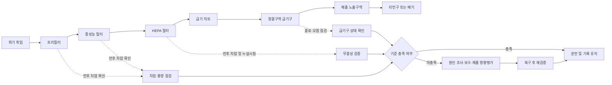
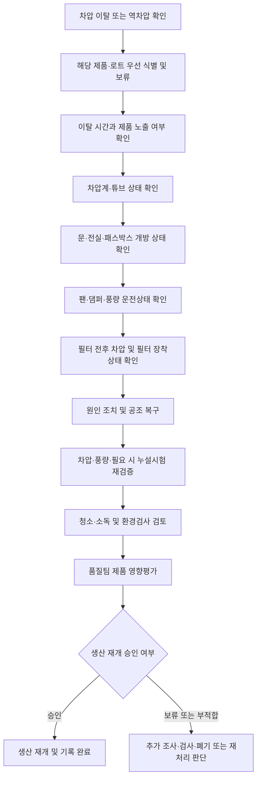

# [QA+ 블로그 생성 결과물] PR001 식품공장 HEPA 공조관리
생성일시: 2026-09-14 06:49:25 (KST)
적용모델: gpt-5.6-terra

================================================================================
# 📋 최종 발행용 블로그 패키지

### 1. 메타 데이터 (SEO 설정)

- **최종 포스팅 제목**: 식품공장 HEPA 공조관리 기준 총정리: 차압·필터 교체·누설시험·결로 대응
- **메타 디스크립션 (120자 내외 요약)**: 식품공장 HEPA 공조관리의 핵심인 차압, 필터 단계별 교체기준, 누설시험, 결로 대응, 제품 영향평가와 HACCP·FSSC 심사 대응법을 정리했습니다.
- **추천 해시태그 (10개)**:  
  #식품공장공조관리 #HEPA필터 #식품HACCP #FSSC22000 #식품품질관리 #차압관리 #식품안전 #공조설비관리 #필터교체 #위생관리
- **카테고리**: 식품품질실무 / HACCP가이드 / FSSC22000

> **편집·사실관계 검수 메모**
> - 모든 식품공장에 HEPA 또는 특정 차압값을 일률적으로 의무화하는 국내 공통 법정 기준이 있다는 식의 표현은 피하고, 공정 위험평가 및 사내 기준 설정 원칙으로 정리했습니다.
> - H13 등급은 EN 1822 또는 ISO 29463 계열 분류·제조사 성적서와 함께 관리하도록 표현을 보완했습니다.
> - “누설시험”은 필터 교체·하우징 보수·덕트 공사 후 고위생구역에서 특히 적극 검토해야 하는 검증 활동으로 정리했습니다. 실제 시험 필요 여부와 주기는 위험평가, 설비 구조, 고객 요구사항 및 사내 기준에 따라 정해야 합니다.
> - FSSC 22000 및 ISO 22002-1은 공조·환기·여과·결로·교차오염 위험을 관리하는 PRP 관점의 참고 체계로 표현했습니다.

---

## 2. 네이버 블로그 / 티스토리 복사용 최종 원고 (Markdown)

# 식품공장 HEPA 공조관리 기준: 차압·필터 교체·누설시험까지 한 번에 정리

> **20년 실무 선배의 한 줄 요약**  
> 식품공장 HEPA 공조관리는 “H13 필터를 달았다”로 끝나는 일이 아닙니다. **공기 흐름, 차압, 필터 단계별 상태, 결로, 유지보수 후 검증, 제품 영향평가 기록**까지 하나의 PR001 절차로 연결해야 심사와 현장 모두에서 흔들리지 않습니다.

---

## 1. HEPA를 설치했는데도 심사에서 지적받는 이유

“우리 공장은 HEPA 필터를 설치했는데 왜 공조관리 지적을 받았을까요?”

현장에서 정말 많이 나오는 질문입니다. 결론부터 말씀드리면, 심사관은 필터의 존재 자체보다 **그 필터가 지금도 제 역할을 하는지**를 봅니다. 설치 당시에는 멀쩡했더라도 가스켓이 들뜨거나, 덕트 내부가 오염되거나, 차압계가 고장 나면 제품 노출구역의 공기 안전성은 보장하기 어렵습니다.

특히 식품공장은 제약·반도체 클린룸과 달리 모든 공간을 동일한 청정도로 관리할 필요는 없습니다. 원료 입고장, 전처리실, 가열 후 제품 취급실, 내포장실, 외포장실은 위험 수준이 다르기 때문입니다. 그런데도 “전 구역 HEPA 설치” 또는 “전 구역 차압 10 Pa 이상”처럼 하나의 수치를 일괄 적용하면 오히려 관리 근거가 약해질 수 있습니다.

HEPA는 공기 중 입자상 오염물질을 고효율로 걸러주는 필터입니다. 쉽게 말하면 공기 중 먼지, 외부에서 유입되는 부유입자, 미생물을 포함할 수 있는 비말성 입자를 줄이는 마지막 방어막에 가깝습니다. 하지만 HEPA가 냄새, 휘발성 화학물질, 결로수, 작업자 손위생 불량, 청소 미흡까지 해결해 주는 만능장치는 아닙니다.

또 하나 놓치기 쉬운 부분은 공기 흐름입니다. 청결구역에 좋은 필터를 설치해도 저위생구역 공기가 문틈이나 물류 이동 중에 역류하면 의미가 반감됩니다. 그래서 공조관리는 **필터 관리가 아니라 공기 관리**라고 이해하시는 것이 맞습니다. 이 관점을 먼저 잡아야 PR001 문서도 제대로 작성됩니다.


---

## 2. 식품공장에 HEPA 필터는 반드시 설치해야 할까요?

먼저 가장 중요한 오해부터 정리하겠습니다. 국내 식품 관련 법령과 HACCP 기준이 모든 식품공장에 특정 등급의 HEPA 필터 설치를 일률적으로 의무화한다고 보기는 어렵습니다. 식품위생법, 식품위생법 시행규칙의 시설기준, 식품 및 축산물 안전관리인증기준은 공통적으로 식품이 먼지·이물·미생물·응축수 등으로 오염되지 않도록 시설과 작업환경을 위생적으로 관리하도록 요구합니다.

즉, 법과 HACCP가 요구하는 본질은 “HEPA를 달아라”가 아니라 **“공기 유래 오염 위험을 예방·관리하라”**입니다. 공정 위험평가 결과에 따라 일반 환기, 중성능 필터, 국소배기, 양압관리, HEPA 말단필터 등을 조합해 관리수단을 정해야 합니다.

HEPA 적용을 특히 검토해야 하는 곳은 가열 또는 살균 후 제품이 외기에 노출되는 구역입니다. 예를 들면 다음과 같습니다.

- 냉동만두의 증숙 후 냉각구역
- 레토르트 소스의 충전 전후 청결구역
- 바로 섭취하는 샐러드의 내포장실
- 분말제품의 충전실
- 무균 또는 고위생 충전구역

반대로 원료 하역장이나 흙 묻은 농산물 전처리구역은 무조건 양압·HEPA를 적용하기보다 분진 확산과 교차오염 차단이 더 중요할 수 있습니다. 이런 구역은 인접 청결구역으로 오염 공기가 넘어가지 않도록 음압 또는 국소배기 적용을 검토할 수 있습니다.

결국 핵심은 “어느 필터를 쓸까?”가 아니라 **“오염 공기가 어디에서 어디로 이동하면 안 되는가?”**를 먼저 정하는 것입니다.

| 구역 구분 | 대표 공정 예시 | 우선 관리 방향 | HEPA 검토 수준 |
|---|---|---|---|
| 일반구역 | 원료 입고, 원료 보관, 외포장 | 환기, 청소, 해충·먼지 유입 차단 | 공정 위험도에 따라 선택 |
| 전처리구역 | 세척, 절단, 분쇄, 혼합 | 분진·비산·교차오염 확산 방지 | 필요 시 국소 적용 |
| 준청결구역 | 가열 전 성형, 내포장 준비 | 구역 구분, 공기 흐름 관리 | 제품 특성에 따라 검토 |
| 고위생구역 | 가열 후 냉각, 충전, 내포장 | 양압, 여과공기, 출입통제 강화 | 적극 검토 |
| 무균·고위생 공정 | 무균충전, 민감 제품 충전 | 필터 무결성·차압·환경검증 | 핵심 관리 대상 |

---

## 3. 법적 기준과 HACCP·FSSC 관점은 이렇게 구분하시면 됩니다

식품위생법과 시행규칙의 시설기준은 작업장과 제조시설이 식품을 오염시키지 않는 구조와 상태를 유지하도록 요구합니다. 환기시설도 그 연장선에 있습니다. 공조설비에서 먼지, 응축수, 미생물 오염 가능성이 있는 공기가 제품이나 식품접촉면으로 유입되지 않도록 관리해야 한다는 것이 기본 원칙입니다.

식품 및 축산물 안전관리인증기준, 즉 HACCP 체계에서는 이를 선행요건프로그램(PRP)으로 관리합니다. 공조는 대체로 CCP보다 PRP 또는 운영선행요건(OPRP) 성격으로 운영되는 경우가 많습니다. 다만 가열 후 노출공정처럼 공기 유래 재오염 위해가 크고 관리 실패 시 제품 안전성에 직접 영향을 주는 공정은 공장 위험평가 결과에 따라 더 강하게 관리할 필요가 있습니다.

FSSC 22000 Version 6과 ISO 22002-1 관점에서도 포인트는 같습니다. 심사관은 “HEPA H13을 쓰고 있습니까?”보다 다음을 먼저 확인합니다.

- 공기·환기·여과·양압·응축수 위험을 평가했는가?
- 설정한 기준을 실제로 측정하고 기록하는가?
- 기준 이탈 시 즉시 조치하는가?
- 필터 교체·덕트 작업 등 유지보수 후 재검증하는가?
- 이탈 시 제품 영향평가가 연결되는가?

ISO 14644는 클린룸 공기 청정도 분류와 시험방법을 참고할 수 있는 표준입니다. 하지만 일반 식품공장이 ISO Class 인증을 반드시 받아야 한다는 의미는 아닙니다. 고위생구역의 입자·기류·검증방법을 설계할 때 참고할 수 있는 기술 기준으로 이해하는 편이 적절합니다.

필터 등급을 문서에 쓸 때는 ISO 29463 또는 EN 1822 계열의 분류와 제조사 성적서를 함께 확인하는 것이 안전합니다. 적용 표준, 필터 모델, 제조번호, 설치 위치, 성적서 번호를 연결해야 추적성이 생깁니다.

> **실무 핵심**  
> 법령은 “오염 방지”를 요구하고, PR001은 우리 공장이 그 요구를 충족하기 위해 설정한 **구체적인 관리방법과 이탈조치 기준**을 정하는 문서입니다.

---

## 4. PR001 공조관리 절차서에는 무엇을 반드시 넣어야 할까요?

PR001이 회사별 문서 코드라면, 가장 먼저 기존 문서 체계를 확인해야 합니다. 어떤 회사는 PR001이 공조관리 절차서일 수 있고, 다른 회사는 시설관리 절차서일 수 있습니다. 문서번호보다 중요한 것은 문서 안에 공조 위험관리의 핵심 요소가 빠짐없이 들어가 있는지입니다.

### PR001에 포함할 핵심 항목

1. **목적**  
   제조·가공구역의 공기 흐름, 여과설비, 차압, 온·습도 및 응축수 발생을 관리하여 공기 유래 이물·미생물·교차오염을 예방한다.

2. **적용범위**  
   외기 취입부, 공조기, 프리필터, 중성능 필터, HEPA 필터, 덕트, 급기구, 리턴구, 드레인팬, 냉각코일, 제품 노출구역.

3. **책임과 권한**
   - 품질관리팀: 기준 승인, 점검결과 검토, 이탈 시 제품 영향평가
   - 공무·시설팀: 설비 유지보수, 필터 교체, 계측기 관리
   - 생산팀: 작업 전 이상 유무 확인, 이상 발생 시 제품 보호 및 즉시 보고

4. **외부 전문업체 관리**  
   HEPA 누설시험이나 풍량 측정을 외부업체가 수행한다면 업체 적격성 평가가 필요합니다. 시험장비 교정성적서, 시험방법, 시험일자, 시험자 정보, 필터 위치와 번호가 성적서에 표시되는지 확인해야 합니다.

---

## 5. 차압·온습도·필터 교체기준은 숫자보다 ‘설정 근거’가 중요합니다

차압은 청결구역의 공기가 낮은 위생등급 구역으로 흐르도록 유지하기 위한 관리수단입니다. 보통 청결구역을 인접 구역보다 양압으로 운영하지만, 분진이나 알레르겐 비산을 막아야 하는 공정은 반대로 음압 또는 국소배기가 더 적절할 수 있습니다.

예를 들어 고위생 충전실을 인접 복도 대비 **+10 Pa 이상**으로 관리할 수 있습니다. 그러나 이 수치는 모든 식품공장에 적용되는 법적 정답이 아닙니다. 문 개방 시 압력 변동, 설비 풍량, 작업자 출입 빈도, 인접 구역 오염도, 공정 민감도를 평가해 정한 사내 관리기준이어야 합니다.

실무적으로는 목표 기준, 경보 기준, 조치 기준을 구분해 두면 운영이 편합니다.

- 목표값: 예시 +10 Pa 이상
- 주의·확인구간: 예시 +5~+9 Pa
- 이탈구간: 예시 +5 Pa 미만 또는 역차압

온도와 습도는 작업자 쾌적성만의 문제가 아닙니다. 습도가 높으면 천장, 덕트, 급기구 주변에 결로가 생길 수 있고, 이 물방울은 미생물 오염과 이물 혼입 위험으로 이어질 수 있습니다.

필터 교체주기도 “매년 1회”로만 정하면 부족합니다. 시간 기준은 둘 수 있지만, 전후 차압, 풍량 저하, 외관 파손, 누설시험 결과, 환경 모니터링 결과, 운전시간, 분진 부하를 함께 봐야 합니다.

| 관리항목 | 절차서에 정할 내용 | 현장 확인 방법 | 이탈 시 기본 조치 |
|---|---|---|---|
| 구역 차압 | 방향, 목표값, 경보값, 측정주기 | 고정 차압계 및 휴대용 계측기 교차 확인 | 문·댐퍼·팬·계측기부터 확인 |
| 온도·습도 | 구역별 기준, 계절별 관리방법 | 기록계 확인, 결로 육안점검 | 결로 위험 시 제품 보호 및 원인 제거 |
| 프리필터 | 점검주기, 세척·교체 조건 | 오염도, 전후 차압, 외관 | 막힘 시 우선 교체 또는 정비 |
| 중성능 필터 | 교체기준, 설치상태 | 차압 추세, 풍량, 외관 | 규격 확인 후 교체 |
| HEPA 필터 | 등급, 위치, 누설시험 주기 | 라벨, 성적서, 누설시험 결과 | 격리·재설치·재시험 |
| 풍량·풍속 | 측정 위치, 허용범위 | 풍량계·풍속계 측정 | 팬·댐퍼·덕트 밸런싱 확인 |
| 결로·누수 | 점검부위, 조치책임 | 천장·급기구·드레인 육안점검 | 생산 보호, 세척·소독, 원인개선 |




---

## 6. 차압 저하·누설·결로 발생 시 실전 대응 순서

차압이 갑자기 낮아졌다고 해서 무조건 HEPA가 막혔다고 판단하면 안 됩니다. 실제 현장에서는 차압계 튜브 이탈, 문 개방, 도어클로저 불량, 댐퍼 위치 변경, 인접 공조기 운전조건 변경, 팬 인버터 이상이 더 흔한 원인일 수 있습니다.

### 차압 이탈 대응 기본 순서

1. 해당 구역에서 생산 중인 제품과 로트를 식별·보류합니다.
2. 이탈 발생 시간과 제품 노출 여부를 확인합니다.
3. 차압계, 튜브, 전원 등 계측기 이상 여부를 확인합니다.
4. 출입문, 전실, 패스박스 동시 개방 여부를 확인합니다.
5. 팬, 댐퍼, 풍량 및 인접 공조기 운전상태를 확인합니다.
6. 필터 전후 차압, 필터 장착상태, 가스켓 상태를 점검합니다.
7. 원인 조치 후 차압·풍량을 재확인합니다.
8. 필터 교체 또는 덕트 개방 작업이 있었다면 필요 시 누설시험, 청소·소독, 환경검사를 실시합니다.
9. 품질팀이 제품 영향평가 후 생산재개 여부를 승인합니다.
10. 이탈보고서와 재발방지 조치를 기록합니다.

결로는 더 즉각적으로 대응해야 합니다. 천장이나 급기구에서 물방울이 떨어질 가능성이 있으면 제품과 식품접촉면을 우선 보호하고, 해당 구역의 생산 중지 또는 제품 이동을 검토해야 합니다. 이후 냉각코일 드레인, 단열 불량, 실내 습도, 외기 도입량, 공조기 정지 후 재가동 조건을 확인해야 합니다.

> **★ 심사관 대응 꿀팁**  
> “차압 이탈 시 필터를 교체합니다”라고만 쓰면 부족합니다.  
> **① 제품 격리 → ② 이탈시간 확인 → ③ 계측기·문·팬·댐퍼·필터 순서 점검 → ④ 복구 후 검증 → ⑤ 제품 영향평가 → ⑥ 재발방지** 흐름으로 작성해야 현장성이 있는 절차서가 됩니다.



---

## 7. 실제 현장 사례로 보는 HEPA 공조관리 적용법

### 사례 1. 냉동만두 제조공장 증숙 후 냉각구역의 차압 저하

한 냉동만두 제조공장에서는 증숙 후 만두가 냉각터널을 거쳐 내포장으로 넘어가는 구역을 청결구역으로 관리하고 있었습니다. 일상점검표상 차압은 매일 정상으로 기록됐지만, 여름철 특정 시간대에만 냉각구역 차압이 0 Pa 부근까지 떨어지는 현상이 반복됐습니다.

처음에는 HEPA 필터 막힘으로 판단해 필터 교체를 검토했지만, 필터 전후 차압과 풍량은 평소 범위에 있었습니다. 현장 확인 결과, 원료 반입시간에 인접 전처리실의 대형 배기팬이 동시에 가동되면서 청결구역의 급기량보다 배기 영향이 커지고 있었습니다. 여기에 작업자들이 물류 편의를 위해 전실 문과 복도 문을 동시에 열어두는 습관까지 겹쳤습니다.

개선조치로 공무팀은 인접 전처리실 배기팬 운전조건과 급기댐퍼를 재밸런싱했고, 청결구역과 복도 사이의 차압 목표값 및 경보값을 다시 설정했습니다. 생산팀에는 문 동시 개방 금지 교육을 실시하고, 전실 문 자동폐쇄 상태 확인항목을 추가했습니다.

품질팀은 차압 이탈 시 해당 시간대의 냉각 후 제품 로트를 보류하고, 노출시간·포장상태·환경검사 결과를 근거로 제품 영향평가를 하도록 절차를 개정했습니다. 이후 4주간 차압 데이터를 시간대별로 추적한 결과, 배기팬 가동시간에도 차압 방향이 유지되는 것을 확인했습니다.

**핵심 교훈:** 차압 저하를 곧바로 HEPA 필터 문제로 단정하지 말고, 팬·댐퍼·문·작업자 동선까지 하나의 공조 시스템으로 확인해야 합니다.

### 사례 2. 레토르트 소스 충전실 HEPA 교체 후 환경 미생물 증가

레토르트 소스 제조공장에서는 충전실 말단 HEPA 필터를 정기 유지보수 일정에 맞춰 교체했습니다. 필터 교체 당일에는 외관상 이상이 없었고, 다음 날 생산도 정상적으로 재개했습니다.

그런데 교체 후 실시한 환경 미생물 모니터링에서 급기구 주변과 충전기 상부의 일반세균 결과가 평소보다 높게 확인됐습니다. 작업자 위생 문제로 보였지만, 교체작업 기록을 검토하니 필터 반입과 설치 과정에서 천장 점검구가 장시간 개방되어 있었습니다. 또한 설치 후 가스켓 밀착 상태를 육안으로만 확인하고, 필터 무결성 또는 누설시험은 실시하지 않았습니다.

품질팀은 해당 시간대 충전 제품을 우선 보류하고, 필터 교체 전후의 로트와 환경검사 결과를 비교해 제품 영향평가를 실시했습니다. 공무팀은 필터를 재분리해 프레임, 가스켓, 하우징 장착부를 점검했고, 외부 전문업체를 통해 누설시험과 풍량 측정을 다시 진행했습니다.

이후 절차서에는 다음 단계를 추가했습니다.

**청소·소독 → 퍼지 운전 → 누설시험 또는 설치상태 검증 → 필요 시 환경검사 → 품질팀 생산재개 승인**

**핵심 교훈:** HEPA 여재 성능이 좋아도 설치 작업 자체가 오염원이 될 수 있으며, 교체 후 검증 없는 즉시 생산재개는 위험합니다.

### 사례 3. 분말음료 충전공장의 결로와 필터 오판 사례

분말음료 충전공장에서는 장마철마다 충전실 천장 급기구 주변에 물방울이 맺히는 현상이 발생했습니다. 현장에서는 공기 상태가 나쁘다고 판단해 HEPA 필터 교체를 우선 요청했습니다.

하지만 필터 전후 차압, 풍량, 누설시험 이력에는 특별한 이상이 없었습니다. 조사 결과 외기 습도가 높은 날 외기 도입량이 증가했고, 급기온도와 천장 표면온도의 차이로 급기구 주변에 결로가 발생하고 있었습니다. 냉각코일 드레인 배수도 원활하지 않아 공조기 내부 습기 관리가 불안정한 상태였습니다.

생산팀은 결로가 확인된 구역의 제품 노출을 즉시 최소화하고, 해당 시간대 제품을 별도 식별했습니다. 공무팀은 드레인 배관을 정비하고, 급기온도·외기 도입량·제습 운전조건을 조정했으며, 천장 내부 단열 상태를 보강했습니다.

이후 PR001 일상점검표에는 단순 온습도 숫자뿐 아니라 **“천장·급기구·덕트 주변 결로 및 누수 여부”**를 육안점검 항목으로 추가했습니다.

**핵심 교훈:** 필터가 정상이어도 결로·누수·단열 불량으로 공조 리스크는 발생할 수 있습니다.

---

## 8. HACCP·FSSC 심사에서 자주 지적되는 공조관리 실수

1. **기준은 있지만 설정 근거가 없는 경우**  
   “차압 +10 Pa 이상”, “HEPA 연 1회 교체”라고 적어 놓고 공장 구조와 공정 위험도를 반영한 위험평가 자료가 없는 경우입니다.

2. **기록과 현장이 다른 경우**  
   점검표에는 매일 정상으로 기록돼 있지만 실제 차압계 화면이 꺼져 있거나, 필터 라벨의 교체일과 문서상 교체일이 다른 경우입니다.

3. **유지보수 후 생산재개 기준이 없는 경우**  
   HEPA 교체, 덕트 보수, 천장 공사, 공조기 내부 세척 후 검증 없이 바로 생산을 시작하는 경우입니다.

4. **공조관리를 HEPA 관리로만 축소하는 경우**  
   프리필터·중성능 필터, 덕트, 냉각코일, 드레인팬, 결로, 공기 역류를 관리하지 않는 경우입니다.

5. **이상 발생 제품의 처리기준이 없는 경우**  
   차압 이탈 시 모든 제품을 무조건 폐기할 필요는 없지만, 아무 평가 없이 정상 출고해서도 안 됩니다.

---

## 9. PR001 일상·정기점검 체크리스트

일상점검은 생산 전 5~10분 안에 실제 확인 가능한 항목으로 구성하는 것이 좋습니다. 차압, 온습도, 결로, 급기구 상태, 문·전실 상태처럼 사고와 직접 연결되는 항목은 반드시 포함해야 합니다.

| 구분 | 점검 항목 | 권장 주기 예시 | 담당부서 | 기록 및 조치 |
|---|---|---:|---|---|
| 일상 | 구역별 차압, 공기 흐름 방향 | 작업 전 또는 일 1회 이상 | 생산·품질 | 기준 이탈 시 즉시 보고 |
| 일상 | 온도·습도, 결로·누수 | 작업 전 및 필요 시 수시 | 생산 | 제품 보호 후 공무 요청 |
| 일상 | 급기구·리턴구 오염, 이상 소음 | 일 1회 | 생산 | 청소 또는 정비 요청 |
| 주간·월간 | 프리필터 오염도·전후 차압 | 설비 부하에 따라 설정 | 공무 | 세척·교체 이력 관리 |
| 월간 | 팬·댐퍼·벨트·드레인 상태 | 월 1회 예시 | 공무 | 예방정비 기록 |
| 정기 | 풍량·풍속·차압 추세 분석 | 분기 또는 반기 검토 예시 | 공무·품질 | 기준 재검토 자료 |
| 정기 | HEPA 누설시험·무결성 확인 | 위험도 기반 주기 | 외부업체·공무 | 성적서 및 필터번호 보관 |
| 수시 | 필터 교체·덕트 공사 후 검증 | 작업 완료 후 | 공무·품질 | 청소·소독·재가동 승인 |

마지막으로 기록은 “보관”보다 **“연결”**이 중요합니다. 필터 교체기록, 제조사 성적서, 누설시험 성적서, 차압 추세, 이탈보고서, 제품 영향평가서가 하나의 필터 번호와 날짜로 연결되어야 합니다.

---

## 10. 식품공장 HEPA 공조관리 FAQ

### Q1. 식품공장은 반드시 HEPA 필터를 설치해야 하나요?

**A. 아닙니다.** 모든 식품공장에 동일한 HEPA 설치 의무가 적용되는 것은 아닙니다. 가열 후 제품 노출 여부, 바로 섭취하는 제품인지 여부, 충전공정 위험도, 고객 요구사항, 기존 환기설비 수준을 평가해 필요성을 결정해야 합니다.

### Q2. HEPA 필터는 H13으로 정하면 안전한가요?

**A. H13은 많이 사용되는 등급 중 하나이지만, H13이라는 표기만으로 공기 안전성이 완성되지는 않습니다.** 필터 여재 성능과 별개로 가스켓 밀착, 하우징 누설, 덕트 오염, 풍량 부족, 공기 역류가 있으면 실제 공급공기는 오염될 수 있습니다.

### Q3. HEPA 필터 교체주기를 무조건 1년으로 정해도 될까요?

**A. 기준주기로 1년을 설정할 수는 있지만, 시간만으로 운영하면 부족합니다.** 필터 전후 차압 상승, 풍량 저하, 파손, 누설시험 부적합, 환경 모니터링 이상이 있으면 예정일 전이라도 교체할 수 있도록 절차서에 조건을 넣어야 합니다.

### Q4. 필터 교체 후 누설시험은 꼭 해야 하나요?

**A. 신규 설치, HEPA 교체, 하우징 보수, 덕트 공사 후에는 누설 또는 무결성 확인을 적극 권장합니다.** 특히 제품 노출이 있는 고위생구역은 필터 자체보다 장착부 누설과 바이패스 위험이 더 문제가 될 수 있습니다.

### Q5. 차압 기준은 법령에 정해진 숫자가 있나요?

**A. 모든 식품공장에 공통 적용되는 하나의 법정 차압 수치가 있다고 보기는 어렵습니다.** 공장 구역 구조, 문 개방 빈도, 공조 풍량, 인접 구역의 오염도, 제품 노출 위험, 고객사 요구사항에 따라 사내 기준을 설정해야 합니다.

### Q6. 차압 이탈이 발생한 시간에 생산한 제품은 전량 폐기해야 하나요?

**A. 반드시 전량 폐기하는 것은 아닙니다.** 제품 노출 여부, 이탈 지속시간, 역차압 여부, 포장 상태, 환경검사 및 복구 검증 결과를 종합해 제품 영향평가를 해야 합니다. 다만 평가 전 해당 로트는 우선 식별·보류하는 것이 기본입니다.

### Q7. 프리필터와 중성능 필터도 HEPA처럼 관리해야 하나요?

**A. 네. 오히려 앞단 필터 관리가 HEPA 수명과 성능에 직접 영향을 줍니다.** 프리필터가 막히면 공조기 풍량이 떨어지고, 중성능 필터와 HEPA에 분진 부하가 과도하게 쌓일 수 있습니다.

---

## 11. 마무리: HEPA 관리는 필터가 아니라 ‘증명 가능한 공기관리’입니다

오늘 내용은 아래 세 줄로 정리하시면 됩니다.

1. **HEPA 설치 여부는 법 조문 하나가 아니라 공정 위험평가로 결정합니다.**  
2. **차압·풍량·온습도·결로·필터 상태·공기 흐름을 함께 관리해야 합니다.**  
3. **교체·고장·공사 후에는 제품 영향평가와 성능검증 기록까지 남겨야 합니다.**

PR001 공조관리 절차서를 만들 때는 “HEPA 필터를 설치했다”에서 멈추지 마세요. 왜 이 구역에 필요한지, 누가 무엇을 측정하는지, 기준을 벗어나면 제품을 어떻게 보호하는지, 유지보수 후 어떤 검증을 거쳐 생산을 재개하는지까지 이어져야 합니다.

이 흐름이 잡히면 HACCP 심사든 FSSC 22000 심사든 훨씬 자신 있게 대응할 수 있습니다.

---

## 3. 워드프레스 / 웹사이트용 HTML 원고

```html
<article class="food-qa-post">
  <header>
    <h1>식품공장 HEPA 공조관리 기준: 차압·필터 교체·누설시험까지 한 번에 정리</h1>
    <blockquote>
      <p><strong>20년 실무 선배의 한 줄 요약:</strong> 식품공장 HEPA 공조관리는 “H13 필터를 달았다”로 끝나는 일이 아닙니다. <strong>공기 흐름, 차압, 필터 단계별 상태, 결로, 유지보수 후 검증, 제품 영향평가 기록</strong>까지 하나의 PR001 절차로 연결해야 합니다.</p>
    </blockquote>
  </header>

  <section>
    <h2>1. HEPA를 설치했는데도 심사에서 지적받는 이유</h2>
    <p>심사관은 필터의 존재 자체보다 <strong>그 필터가 현재도 제 역할을 하는지</strong>를 확인합니다. 가스켓 들뜸, 덕트 오염, 차압계 고장, 공기 역류가 있으면 HEPA가 설치되어 있어도 제품 노출구역의 공기 안전성을 보장하기 어렵습니다.</p>
    <p>식품공장 공조관리는 전 구역에 동일한 HEPA 또는 차압 기준을 적용하는 방식이 아니라, 공정별 위해도에 따라 공기 흐름과 위생구역을 설계하는 방식으로 접근해야 합니다.</p>
    
  </section>

  <section>
    <h2>2. 식품공장에 HEPA 필터는 반드시 설치해야 할까요?</h2>
    <p>국내 식품 관련 법령과 HACCP 기준이 모든 식품공장에 특정 등급의 HEPA 필터 설치를 일률적으로 의무화한다고 보기는 어렵습니다. 핵심은 HEPA 설치 자체가 아니라 <strong>공기 유래 오염 위험을 예방·관리하는 것</strong>입니다.</p>
    <p>가열 또는 살균 후 제품이 외기에 노출되는 냉각구역, 충전실, 내포장실 등은 HEPA 적용을 적극 검토할 수 있습니다. 반면 원료 하역장과 전처리구역은 분진 확산 및 청결구역으로의 오염공기 유입 차단이 더 중요할 수 있습니다.</p>

    <table>
      <thead>
        <tr>
          <th>구역 구분</th>
          <th>대표 공정 예시</th>
          <th>우선 관리 방향</th>
          <th>HEPA 검토 수준</th>
        </tr>
      </thead>
      <tbody>
        <tr><td>일반구역</td><td>원료 입고, 원료 보관, 외포장</td><td>환기, 청소, 먼지 유입 차단</td><td>공정 위험도에 따라 선택</td></tr>
        <tr><td>전처리구역</td><td>세척, 절단, 분쇄, 혼합</td><td>분진·비산·교차오염 확산 방지</td><td>필요 시 국소 적용</td></tr>
        <tr><td>준청결구역</td><td>가열 전 성형, 내포장 준비</td><td>구역 구분, 공기 흐름 관리</td><td>제품 특성에 따라 검토</td></tr>
        <tr><td>고위생구역</td><td>가열 후 냉각, 충전, 내포장</td><td>양압, 여과공기, 출입통제 강화</td><td>적극 검토</td></tr>
        <tr><td>무균·고위생 공정</td><td>무균충전, 민감 제품 충전</td><td>필터 무결성·차압·환경검증</td><td>핵심 관리 대상</td></tr>
      </tbody>
    </table>
  </section>

  <section>
    <h2>3. 법적 기준과 HACCP·FSSC 관점</h2>
    <p>식품위생 관련 시설기준과 HACCP 체계의 핵심은 식품이 먼지, 이물, 미생물, 응축수 등으로 오염되지 않도록 작업환경을 위생적으로 관리하는 것입니다. 공조는 일반적으로 PRP 또는 OPRP로 관리되며, 가열 후 노출공정 등 위해도가 높은 구역은 공장 위험평가 결과에 따라 강화 관리할 수 있습니다.</p>
    <p>FSSC 22000 및 ISO 22002-1 관점에서도 중요한 것은 HEPA 등급 자체가 아니라 공기·환기·여과·양압·응축수 위험평가, 기준 이탈조치, 유지보수 후 재검증의 연결성입니다.</p>
    <blockquote>
      <p><strong>실무 핵심:</strong> 법령은 오염 방지를 요구하고, PR001은 공장이 이를 충족하기 위해 설정한 구체적인 관리방법과 이탈조치 기준을 정하는 문서입니다.</p>
    </blockquote>
  </section>

  <section>
    <h2>4. PR001 공조관리 절차서 필수 구성</h2>
    <ul>
      <li><strong>목적:</strong> 공기 흐름, 여과설비, 차압, 온·습도 및 응축수를 관리해 공기 유래 이물·미생물·교차오염을 예방합니다.</li>
      <li><strong>적용범위:</strong> 외기 취입부, 공조기, 프리필터, 중성능 필터, HEPA, 덕트, 급기구, 리턴구, 드레인팬, 냉각코일 및 제품 노출구역을 포함합니다.</li>
      <li><strong>책임과 권한:</strong> 품질팀은 기준 승인과 제품 영향평가, 공무팀은 유지보수와 계측기 관리, 생산팀은 일상 확인과 이상보고를 담당합니다.</li>
      <li><strong>외부업체 관리:</strong> 누설시험·풍량시험 수행업체의 시험장비 교정상태, 시험방법, 필터 위치 및 번호의 추적성을 확인합니다.</li>
    </ul>
  </section>

  <section>
    <h2>5. 차압·온습도·필터 교체기준</h2>
    <p>차압은 청결구역 공기가 저위생구역 방향으로 흐르도록 하는 관리수단입니다. 예를 들어 +10 Pa 이상을 목표값으로 설정할 수 있으나, 이는 법정 공통값이 아니라 공정 위험평가와 밸런싱 결과에 따라 정한 사내 기준이어야 합니다.</p>
    <p>필터 교체는 단순 기간 기준 외에도 전후 차압, 풍량 저하, 파손, 누설시험 결과, 환경 모니터링 결과, 운전시간 및 분진 부하를 함께 검토해야 합니다.</p>

    <table>
      <thead>
        <tr>
          <th>관리항목</th>
          <th>절차서에 정할 내용</th>
          <th>이탈 시 기본 조치</th>
        </tr>
      </thead>
      <tbody>
        <tr><td>구역 차압</td><td>방향, 목표값, 경보값, 측정주기</td><td>문·댐퍼·팬·계측기 확인</td></tr>
        <tr><td>온도·습도</td><td>구역별 기준, 계절별 관리방법</td><td>제품 보호 및 결로 원인 제거</td></tr>
        <tr><td>프리필터</td><td>점검주기, 세척·교체 조건</td><td>막힘 시 우선 교체 또는 정비</td></tr>
        <tr><td>HEPA 필터</td><td>등급, 위치, 누설시험 주기</td><td>격리·재설치·재시험</td></tr>
        <tr><td>결로·누수</td><td>점검부위, 조치책임</td><td>생산 보호, 세척·소독, 원인개선</td></tr>
      </tbody>
    </table>

    
  </section>

  <section>
    <h2>6. 차압 저하·누설·결로 발생 시 대응 순서</h2>
    <ol>
      <li>해당 제품과 로트를 우선 식별·보류합니다.</li>
      <li>이탈 시간과 제품 노출 여부를 확인합니다.</li>
      <li>차압계·튜브 등 계측기 상태를 확인합니다.</li>
      <li>문·전실·패스박스의 동시 개방 여부를 확인합니다.</li>
      <li>팬·댐퍼·풍량과 인접 공조기 운전상태를 점검합니다.</li>
      <li>필터 전후 차압, 장착상태, 가스켓 상태를 확인합니다.</li>
      <li>복구 후 차압·풍량 및 필요 시 누설시험을 실시합니다.</li>
      <li>청소·소독, 환경검사 검토, 제품 영향평가 후 생산재개 여부를 승인합니다.</li>
    </ol>
    <blockquote>
      <p><strong>심사 대응 포인트:</strong> “필터 교체” 한 줄이 아니라 제품 격리, 원인조사, 복구 검증, 제품 영향평가, 재발방지까지 연결해야 합니다.</p>
    </blockquote>
  </section>

  <section>
    <h2>7. 실제 현장 사례</h2>

    <h3>사례 1. 냉동만두 냉각구역 차압 저하</h3>
    <p>여름철 특정 시간대에만 냉각구역 차압이 0 Pa 부근으로 저하됐지만, 필터 전후 차압과 풍량은 정상이었습니다. 조사 결과 인접 전처리실 대형 배기팬 운전과 전실 문 동시 개방이 원인이었습니다. 배기팬 운전조건과 급기댐퍼를 재밸런싱하고, 문 동시 개방 금지 및 차압 이탈 제품 보류 절차를 추가해 개선했습니다.</p>

    <h3>사례 2. 레토르트 소스 충전실 HEPA 교체 후 미생물 증가</h3>
    <p>HEPA 교체 후 환경 미생물 수치가 상승한 원인은 천장 점검구 장시간 개방, 가스켓 밀착상태 미검증, 퍼지 운전 미실시였습니다. 이후 청소·소독, 퍼지 운전, 누설 또는 설치상태 검증, 필요 시 환경검사, 품질팀 생산재개 승인을 절차에 반영했습니다.</p>

    <h3>사례 3. 분말음료 충전공장 결로 발생</h3>
    <p>장마철 급기구 주변 결로를 HEPA 문제로 오판했으나, 실제 원인은 높은 외기 습도, 급기온도와 천장 표면온도 차이, 드레인 배수 불량이었습니다. 드레인 정비, 제습 운전조건 조정, 단열 보강 및 결로 육안점검 항목 추가로 개선했습니다.</p>
  </section>

  <section>
    <h2>8. HACCP·FSSC 심사 주요 지적사항</h2>
    <ul>
      <li>차압·필터 교체기준은 있으나 설정 근거가 없는 경우</li>
      <li>점검기록과 실제 차압계·필터 라벨 상태가 다른 경우</li>
      <li>HEPA 교체·덕트 공사 후 생산재개 기준이 없는 경우</li>
      <li>프리필터, 중성능 필터, 덕트, 드레인, 결로를 관리하지 않는 경우</li>
      <li>차압 이탈 제품의 보류·영향평가·출고판정 기준이 없는 경우</li>
    </ul>
  </section>

  <section>
    <h2>9. PR001 일상·정기점검 체크리스트</h2>
    <table>
      <thead>
        <tr>
          <th>구분</th>
          <th>점검 항목</th>
          <th>권장 주기 예시</th>
          <th>담당부서</th>
        </tr>
      </thead>
      <tbody>
        <tr><td>일상</td><td>구역별 차압, 공기 흐름 방향</td><td>작업 전 또는 일 1회 이상</td><td>생산·품질</td></tr>
        <tr><td>일상</td><td>온도·습도, 결로·누수</td><td>작업 전 및 필요 시</td><td>생산</td></tr>
        <tr><td>일상</td><td>급기구·리턴구 오염, 이상 소음</td><td>일 1회</td><td>생산</td></tr>
        <tr><td>월간</td><td>프리필터, 팬, 댐퍼, 벨트, 드레인 상태</td><td>설비 부하 및 사내 기준에 따라</td><td>공무</td></tr>
        <tr><td>정기</td><td>풍량·풍속·차압 추세 분석</td><td>분기 또는 반기 예시</td><td>공무·품질</td></tr>
        <tr><td>정기</td><td>HEPA 누설시험·무결성 확인</td><td>위험도 기반 주기</td><td>외부업체·공무</td></tr>
        <tr><td>수시</td><td>필터 교체·덕트 공사 후 검증</td><td>작업 완료 후</td><td>공무·품질</td></tr>
      </tbody>
    </table>
  </section>

  <section>
    <h2>10. 식품공장 HEPA 공조관리 FAQ</h2>

    <h3>Q1. 식품공장은 반드시 HEPA 필터를 설치해야 하나요?</h3>
    <p><strong>A.</strong> 아닙니다. 공정 위험도, 제품 노출 여부, 고객 요구사항, 기존 환기설비 수준을 평가해 결정해야 합니다.</p>

    <h3>Q2. HEPA 필터는 H13으로 정하면 안전한가요?</h3>
    <p><strong>A.</strong> H13 표기만으로 안전성이 완성되지는 않습니다. 가스켓, 하우징, 덕트, 풍량, 공기 역류까지 함께 관리해야 합니다.</p>

    <h3>Q3. HEPA 필터 교체주기를 1년으로 정해도 될까요?</h3>
    <p><strong>A.</strong> 기준주기로 설정할 수는 있지만, 전후 차압·풍량·파손·누설시험·환경 모니터링 결과를 함께 반영해야 합니다.</p>

    <h3>Q4. 필터 교체 후 누설시험은 꼭 해야 하나요?</h3>
    <p><strong>A.</strong> 신규 설치, HEPA 교체, 하우징 보수, 덕트 공사 후에는 특히 고위생구역을 중심으로 누설 또는 무결성 확인을 적극 검토해야 합니다.</p>

    <h3>Q5. 차압 기준은 법령에 정해진 숫자가 있나요?</h3>
    <p><strong>A.</strong> 모든 식품공장에 공통 적용되는 단일 법정 수치는 일반적으로 제시하기 어렵습니다. 위험평가와 밸런싱 근거로 사내 기준을 설정해야 합니다.</p>

    <h3>Q6. 차압 이탈 시간에 생산한 제품은 전량 폐기해야 하나요?</h3>
    <p><strong>A.</strong> 반드시 전량 폐기하는 것은 아닙니다. 다만 제품 노출 여부, 이탈시간, 포장상태, 환경검사, 복구 검증 결과를 근거로 평가하기 전까지는 해당 로트를 보류해야 합니다.</p>

    <h3>Q7. 프리필터와 중성능 필터도 관리해야 하나요?</h3>
    <p><strong>A.</strong> 네. 앞단 필터 관리가 HEPA 수명, 풍량, 최종 공기 품질에 직접 영향을 줍니다.</p>
  </section>

  <footer>
    <h2>11. 마무리: HEPA 관리는 필터가 아니라 증명 가능한 공기관리입니다</h2>
    <ol>
      <li><strong>HEPA 설치 여부는 법 조문 하나가 아니라 공정 위험평가로 결정합니다.</strong></li>
      <li><strong>차압·풍량·온습도·결로·필터 상태·공기 흐름을 함께 관리해야 합니다.</strong></li>
      <li><strong>교체·고장·공사 후에는 제품 영향평가와 성능검증 기록까지 남겨야 합니다.</strong></li>
    </ol>
    <p>PR001 공조관리 절차서는 단순 필터 관리대장이 아니라, 공기 유래 오염을 예방하고 이탈 시 제품을 보호하며 재가동을 검증하는 실무 문서여야 합니다.</p>
  </footer>
</article>
```
================================================================================

[부록: 1단계 리서치 원본]
# [리서치 리포트] PR001 식품공장 HEPA 공조관리

> **전제**: “PR001”은 법령상 전국 공통으로 정해진 문서명이 아니라, 기업·공장별 선행요건프로그램(PRP) 또는 사내 절차서 코드일 가능성이 높습니다. 따라서 실제 작성 시에는 해당 공장의 **PR001 원문, HACCP 관리기준서, 공조 도면, 구역별 청정도 기준**을 우선 대조해야 합니다.  
> 또한 국내 식품 HACCP 기준이 모든 식품공장에 HEPA 설치를 일률적으로 요구하는 것은 아닙니다. HEPA 적용 여부와 관리기준은 제품 특성, 구역 위험도, 공정 노출 정도, 고객·인증 요구사항에 따라 설정해야 합니다.

---

## 1. 타겟 독자 및 검색 의도

- **주요 타겟**
  - 식품공장 품질관리·공무·생산관리 담당자
  - HACCP 선행요건프로그램 작성 및 개정 담당자
  - 신규 식품공장 또는 클린룸 운영 담당자
  - FSSC 22000, ISO 22000, 고객 심사를 준비하는 품질팀
  - HEPA 필터 교체주기와 성능검증 기준을 설정해야 하는 실무자

- **독자의 핵심 고통(Pain Point)**
  - 식품공장에 HEPA 필터가 반드시 필요한지 판단하기 어려움
  - HEPA 필터의 등급, 설치 위치, 차압 기준을 어떻게 정해야 하는지 모름
  - 필터 교체주기를 단순히 “1년”으로 정해도 되는지 궁금함
  - 차압 저하·누설·파손 발생 시 제품 안전성 평가와 조치 방법이 불명확함
  - 공조기, 프리필터, 중성능 필터, HEPA 필터의 관리 책임이 분리되지 않음
  - 심사에서 요구하는 점검기록·성능검증 자료의 범위를 알기 어려움
  - HEPA를 설치했지만 공기 흐름, 양압, 결로, 천장 누수 등 다른 공조 리스크를 놓치기 쉬움

- **검색 의도**
  - 정보 탐색형: 식품공장 HEPA 관리기준과 법적 근거 확인
  - 실무 해결형: 차압·풍량·필터 교체·누설시험 기준 설정
  - 심사 대응형: HACCP 및 FSSC 심사 시 필요한 기록과 증빙 확인
  - 문서 작성형: PR001 공조관리 절차서와 점검표 작성

- **메인 키워드**
  - 식품공장 HEPA 공조관리

- **서브/연관 키워드**
  - 식품공장 HEPA 필터 관리기준
  - HACCP 공조관리
  - HEPA 필터 교체주기
  - 클린룸 차압 관리
  - HEPA 필터 누설시험
  - 식품공장 공기질 관리
  - FSSC 22000 공조 설비 관리

---

## 2. 필수 인용 법령 및 표준 기준

### 2-1. 법적·인증 기준

- **식품위생법**
  - 식품의 제조·가공·조리 과정에서 식품이 오염되지 않도록 시설과 위생관리 기준을 준수해야 한다는 기본 근거
  - 공조설비가 식품에 먼지, 미생물, 이물 또는 응축수를 유입시키지 않도록 관리해야 한다는 시설·위생관리 관점에서 연결

- **식품위생법 시행규칙 및 시설기준**
  - 식품 제조·가공업 시설기준 중 작업장, 제조시설, 환기시설, 위생시설 등에 관한 사항 검토
  - 업종과 제품 유형에 따라 적용 시설기준이 달라질 수 있으므로 해당 업종별 조항을 확인해야 함

- **식품 및 축산물 안전관리인증기준**
  - 식품의약품안전처 고시
  - HACCP 적용업소의 선행요건관리와 제조·가공시설의 위생적 관리에 관한 근거
  - 공조관리 자체가 항상 “HEPA 설치 의무”를 의미하는 것은 아니며, 공정 및 시설의 위해요인을 예방·관리하기 위한 방법으로 공조 및 필터관리를 설정하는 구조가 적절함

- **HACCP 선행요건관리**
  - 작업장 및 제조시설의 위생관리
  - 용수·공기·배수·폐기물·해충·교차오염 관리
  - 청소·소독 및 시설 유지관리
  - 공기 흐름으로 인한 교차오염 가능성이 있는 경우 위험도에 따라 차압, 여과, 환기, 공기 흐름 방향 등을 관리기준으로 설정

- **FSSC 22000 Version 6**
  - ISO 22000 기반의 식품안전경영시스템과 PRP 요구사항을 함께 적용
  - 일반적으로 식품 제조 분야에서는 **ISO 22002-1** 계열의 PRP 요구사항이 관련됨
  - 공기, 환기, 여과, 양압·음압, 응축수, 오염 확산 방지에 관한 요구사항을 공장별 위험평가와 연계하여 운영
  - FSSC 인증에서는 “HEPA가 설치되어 있는가”보다 **공조 위험을 평가하고, 설정한 관리기준이 실제로 검증·기록·유지되는가**가 중요함

### 2-2. 기술 기준 및 참고 표준

- **ISO 14644 시리즈**
  - 클린룸 및 청정구역의 공기 청정도 분류, 시험방법, 운영관리 참고
  - 식품공장이 반드시 ISO Class 청정구역 인증을 받아야 한다는 의미는 아님
  - 다만 무균공정, 분말·분진 민감 공정, 고위생 구역의 공기질 관리기준 설정에 참고 가능

- **ISO 29463 / EN 1822 계열**
  - 고효율 필터 및 EPA·HEPA·ULPA 필터의 분류와 시험에 관한 국제 기준
  - 필터 등급을 문서에 기재할 경우 제조사 성적서와 시험기준을 함께 확인

- **IEST 권고기준**
  - HEPA·ULPA 필터의 설치 후 누설시험, 필터 무결성시험 등에 참고되는 산업 기준
  - 국내 현장에서는 시험기관 또는 설비업체가 사용하는 시험방법과 장비 교정상태를 함께 확인해야 함

> **주의할 점**: “HEPA H13이면 무조건 안전하다”는 식으로 작성하면 안 됩니다. 필터가 고성능이어도 프레임 실링 불량, 하우징 누설, 바이패스, 덕트 오염, 부적절한 공기 흐름이 있으면 실제 공급 공기의 안전성이 확보되지 않을 수 있습니다.

---

## 3. HEPA 공조관리의 핵심 개념

### 3-1. HEPA의 역할

HEPA 필터는 공기 중 입자상 오염물질을 고효율로 제거하는 장치입니다.

관리 대상은 다음과 같습니다.

- 먼지 및 입자
- 미생물을 포함할 수 있는 비말·입자
- 작업장 외부에서 유입되는 부유입자
- 제품 노출공정의 공기 중 물리적 오염원

다만 HEPA 필터는 다음을 자동으로 해결하지 않습니다.

- 모든 미생물 문제
- 공기 중 화학적 오염
- 응축수 발생
- 덕트 내부 오염
- 작업자·자재 이동에 따른 교차오염
- 공조기 내부의 세척 불량
- 필터 교체 작업 중 오염

### 3-2. HEPA 적용 필요성 평가 항목

다음 항목을 기준으로 HEPA 적용 필요성을 평가하는 것이 적절합니다.

| 평가항목 | 주요 질문 |
|---|---|
| 제품 노출도 | 가열·살균 후 제품이 외부 공기에 노출되는가? |
| 제품 특성 | 바로 섭취하는 제품, 무균제품, 분말제품인가? |
| 공정 위험도 | 미생물 또는 이물 오염 시 회수·폐기 위험이 큰가? |
| 구역 구분 | 일반구역과 청결구역이 물리적으로 분리되어 있는가? |
| 공기 흐름 | 오염구역의 공기가 청결구역으로 이동할 가능성이 있는가? |
| 고객 요구 | 고객사 또는 수출국 기준에서 고위생 공조를 요구하는가? |
| 기존 설비 | 일반 환기만으로 제품 안전성을 충분히 확보할 수 있는가? |
| 검증 가능성 | 차압·풍량·입자·필터 무결성을 측정할 수 있는가? |

---

## 4. PR001 공조관리 절차서에 포함할 핵심 항목

### 4-1. 목적

예시:

> 본 절차서는 제조·가공구역의 공기 흐름, 여과설비, 차압, 온·습도 및 응축수 발생을 관리하여 공기 유래 이물·미생물·교차오염을 예방하는 것을 목적으로 한다.

### 4-2. 적용범위

다음 구역을 구분하여 적용합니다.

- 외부 공기 취입부
- 공조기 및 환기설비
- 프리필터·중성능 필터·HEPA 필터
- 제품 노출구역
- 청결구역·준청결구역·일반구역
- 포장실 및 내포장실
- 원료 전처리구역
- 세척·살균 후 제품 취급구역
- 실험실 또는 샘플 보관구역

### 4-3. 책임과 권한

- **품질관리팀**
  - 공조관리 기준 승인
  - 일상점검 및 이탈 검토
  - 환경 모니터링 결과 평가
  - 필터 성능시험 성적서 검토
- **공무·시설팀**
  - 공조기·덕트·필터 유지보수
  - 차압·풍량·온습도 계측기 관리
  - 필터 교체와 작업 후 복구
- **생산팀**
  - 작업 전 이상 유무 확인
  - 공조 이상 발생 시 제품 보호 및 보고
- **외부 전문업체**
  - HEPA 누설시험
  - 풍량·차압 측정
  - 계측기 교정 및 성능검증

---

## 5. 추천 블로그 목차(Outline)

### H1 제목 후보 3개

1. **식품공장 HEPA 공조관리 기준: 차압·필터 교체·누설시험까지 한 번에 정리**
2. **HACCP 심사에서 지적받지 않는 식품공장 HEPA 관리 실무**
3. **HEPA를 설치했다고 끝이 아닙니다: 식품공장 공조관리 PR001 작성법**

---

### H2 서론: 식품공장 HEPA, 설치보다 중요한 것은 ‘관리’입니다

#### 도입 소재

- “HEPA 필터가 설치되어 있으니 공기 관리는 끝났다”고 생각하기 쉬움
- 하지만 실제 심사에서는 다음과 같은 질문이 나옴
  - 최근 필터 성능시험은 언제 했는가?
  - 교체주기는 어떤 근거로 정했는가?
  - 차압이 기준을 벗어나면 어떻게 조치하는가?
  - 필터 교체 후 제품 영향평가는 했는가?
  - 공기가 청결구역에서 일반구역으로 흐른다는 것을 어떻게 확인했는가?

#### 핵심 결론

- HEPA 관리는 필터 하나가 아니라 **공기 흐름–여과–차압–환경–유지보수–검증 기록의 통합관리**
- 법적 기준과 사내 기준을 구분해야 함
- 모든 식품공장에 동일한 HEPA 기준을 적용하기보다 공정 위험도에 따라 관리수준을 정해야 함

---

### H2 본론 1. 식품공장에 HEPA 필터가 반드시 필요한가?

#### 1) 법적 의무와 사내 관리기준 구분

- 식품 관련 법령과 HACCP 기준은 위생적인 시설·공정·교차오염 방지를 요구
- 그러나 모든 식품공장에 특정 HEPA 등급이나 일률적인 교체주기를 요구하는 것은 아님
- HEPA는 위해평가 결과에 따라 설정하는 공조관리 수단으로 설명

#### 2) HEPA 적용이 특히 중요한 구역

- 가열·살균 후 제품이 노출되는 구역
- 바로 섭취하는 제품의 충전·포장구역
- 무균 또는 고위생 공정
- 분말·건조제품의 제품 노출공정
- 외부 미생물·이물 유입에 민감한 공정
- 고객사에서 청정공조를 요구하는 구역

#### 3) 구역별 차등관리 예시

| 구역 | 공조관리 방향 |
|---|---|
| 일반 원료구역 | 환기, 청소, 외부오염 차단 중심 |
| 전처리구역 | 분진 및 교차오염 확산 방지 |
| 가열 후 제품구역 | 양압, 여과공기, 출입·자재 관리 강화 |
| 충전·포장구역 | 제품 노출시간과 공기질 중심 관리 |
| 무균·고위생구역 | HEPA 무결성, 차압, 입자·미생물 검증 강화 |

---

### H2 본론 2. HEPA 공조관리 기준은 무엇을 정해야 하는가?

#### 1) 차압 관리

관리할 내용:

- 구역 간 차압 방향
- 기준값 및 경보값
- 측정 위치
- 측정 빈도
- 차압계 교정주기
- 기준 이탈 시 조치

예시적인 문서 구성:

- 청결구역은 인접 저위생구역 대비 양압 유지
- 단, 제품·분진·알레르겐의 비산 방지가 우선인 공정은 음압 또는 국소배기 적용 여부를 별도 평가
- 차압 기준은 공장 구조와 위험평가 결과에 따라 정하고, 임의의 업계 관행값을 법적 의무처럼 표현하지 않음

#### 2) 온도·습도

관리 목적:

- 미생물 증식 억제
- 결로 방지
- 제품 품질 유지
- 작업자 쾌적성 확보
- 분말의 흡습·응집 방지

확인사항:

- 천장·덕트·급기구 주변 결로
- 공조기 내부 드레인 및 배수
- 장마철 습도 상승
- 외기 도입량 변화
- 온습도 기준 이탈 시 제품 영향

#### 3) 필터 단계 관리

일반적인 구성 예:

1. 외기 흡입부
2. 프리필터
3. 중성능 또는 고성능 필터
4. HEPA 필터
5. 급기구 또는 말단 필터

중요 관리사항:

- 프리필터를 방치하면 HEPA 압력손실이 빨라짐
- 필터 전후 차압을 추적해야 교체 필요성을 합리적으로 판단할 수 있음
- HEPA만 교체하고 하우징·가스켓·덕트를 확인하지 않으면 누설 위험이 남음

#### 4) HEPA 필터 교체주기

고정된 “무조건 6개월 또는 1년”보다 다음 기준을 조합해야 합니다.

- 필터 전후 차압
- 풍량 및 풍속
- 필터 누설시험 결과
- 외관 파손 여부
- 환경 모니터링 결과
- 공조기 운전시간
- 분진 부하
- 필터 제조사 권장기준
- 과거 교체 이력

**권장 원칙**

> 교체주기는 시간 기준으로 설정할 수 있지만, 차압·성능·현장 상태에 따라 조기 교체할 수 있도록 조건을 함께 명시한다.

#### 5) HEPA 누설시험 및 성능검증

확인할 항목:

- 필터 여재 파손
- 프레임·가스켓 누설
- 하우징 및 장착부 바이패스
- 급기구 주변 누설
- 시험장비 교정상태
- 시험자 자격 또는 전문업체 적격성
- 시험 전후 제품 및 구역 보호조치

시험주기는 위험도에 따라 설정하되, 다음 시점에는 재시험을 검토해야 합니다.

- 신규 설치 후
- 필터 교체 후
- 공조기 또는 덕트 개조 후
- 충격·누수·화재·공사 발생 후
- 입자 또는 미생물 결과가 반복적으로 기준을 벗어난 경우
- 정기 검증주기가 도래한 경우

---

### H2 본론 3. 20년 선배의 현장 실전 팁과 트러블슈팅

#### 트러블 1. 차압이 갑자기 낮아진 경우

가능 원인:

- 필터 막힘이 아니라 팬 성능 저하
- 댐퍼 위치 변경
- 문 개방 또는 도어클로저 불량
- 차압계 튜브 이탈
- 덕트 누설
- 인접 구역 공조 운전조건 변경

조치 순서:

1. 계측기 이상 여부 확인
2. 출입문 및 패스박스 상태 확인
3. 팬·댐퍼·인버터 운전상태 확인
4. 필터 전후 차압 확인
5. 제품 노출 및 생산 영향평가
6. 원인 및 복구 결과 기록

#### 트러블 2. HEPA 교체 후 입자 또는 미생물 결과가 나빠진 경우

가능 원인:

- 교체 과정 중 구역 오염
- 필터 가스켓 미밀착
- 공조기 내부 또는 덕트 오염
- 작업자 동선 증가
- 청소·소독 미흡
- 필터 방향 또는 규격 오류
- 충분한 퍼지 운전 없이 생산 재개

필수 조치:

- 제품 격리 및 영향평가
- 교체 작업기록 검토
- 필터 설치상태 확인
- 누설시험 및 풍량 확인
- 구역 청소·소독
- 재검사 후 생산 재개
- 재발방지대책 수립

#### 트러블 3. 필터는 정상인데 결로가 발생하는 경우

가능 원인:

- 급기온도와 실내 표면온도 차이
- 습도 과다
- 단열 불량
- 냉각코일 드레인 문제
- 공조 운전 중단 후 재가동
- 천장 내부 누수

조치:

- 결로수의 제품 접촉 가능성 평가
- 해당 구역 생산 중지 또는 제품 보호
- 누수·결로 원인 제거
- 천장·덕트·급기구 세척 및 소독
- 공조 운전조건 재설정
- 구조적 단열 보강 검토

#### 트러블 4. 일반구역 공기가 청결구역으로 역류하는 경우

확인사항:

- 구역별 차압 방향
- 문 동시 개방
- 물류·작업자 이동 동선
- 국소배기 운전
- 외기 변화 및 계절별 조건
- 공조기 간 상호 영향

개선방안:

- 차압 단계 재설정
- 출입문 인터록
- 에어락 또는 전실 운영
- 자재 반입 절차 개선
- 급기·배기 밸런싱
- 구역별 공기 흐름 시각화 시험

---

### H2 본론 4. PR001 점검표와 기록관리 방법

#### 일상점검 항목

- 공조기 운전상태
- 구역별 차압
- 온도·습도
- 급기·배기 이상
- 필터 차압
- 결로·누수
- 급기구 및 리턴구 오염
- 이상 소음·진동
- 출입문 및 전실 상태

#### 정기점검 항목

- 필터 외관 및 장착상태
- 팬·벨트·댐퍼·코일 상태
- 차압계 및 온습도계 교정상태
- 필터 전후 차압 추세
- 풍량·풍속
- HEPA 누설시험
- 덕트 및 공조기 내부 청결도
- 환경 모니터링 결과와 공조 데이터의 상관성

#### 필수 기록

- 공조 일상점검표
- 필터 교체기록
- 필터 제조사 성적서
- HEPA 누설시험 성적서
- 풍량·차압 측정기록
- 계측기 교정성적서
- 공조 이상 및 이탈보고서
- 제품 영향평가서
- 유지보수 작업허가서
- 작업 후 청소·소독 및 생산 재개 확인서

---

### H2 본론 5. HACCP·FSSC 심사관이 자주 보는 지적 사항

#### 단골 지적 1. 기준은 있으나 설정 근거가 없음

- “차압 10 Pa 이상”이라고만 쓰고 근거·위험평가가 없음
- HEPA 교체주기를 매년으로 고정했지만 차압·성능자료가 없음
- 구역별 공기 흐름 방향과 기준이 문서에 없음

#### 단골 지적 2. 기록은 정상인데 실제 설비 상태가 다름

- 점검표에는 정상으로 기재되어 있으나 차압계가 고장남
- 필터 교체기록과 실제 필터 라벨이 불일치
- 성적서의 필터 번호와 현장 설치 필터가 다름

#### 단골 지적 3. 유지보수 후 오염평가가 없음

- HEPA 교체 후 작업자·공구·분진 유입을 평가하지 않음
- 덕트 공사 후 재검증 없이 생산 재개
- 공조 이상 중 생산된 제품의 처리기준이 없음

#### 단골 지적 4. 공조관리를 HEPA 관리로만 축소

- 결로·누수·덕트 오염·공기 역류를 관리하지 않음
- 프리필터와 중성능 필터 관리기록이 없음
- 제품 노출구역의 공기 흐름을 확인하지 않음

---

## 6. FAQ

### Q1. 식품공장은 반드시 HEPA 필터를 설치해야 하나요?

아닙니다. 모든 식품공장에 동일한 HEPA 설치 의무가 적용되는 것은 아닙니다. 제품 특성, 공정 위험도, 제품 노출 정도, 고객 및 인증 요구사항에 따라 필요성을 평가해야 합니다.

### Q2. HEPA 필터 등급은 H13으로 정하면 되나요?

H13이 널리 사용되는 등급 중 하나이지만, 일률적으로 정하기보다 공정의 청정도 요구, 풍량, 설비 구조, 제조사 사양 및 위험평가를 근거로 결정해야 합니다.

### Q3. HEPA 필터 교체주기는 1년으로 정해도 되나요?

1년을 기준주기로 사용할 수는 있으나, 차압·풍량·누설시험·환경 모니터링 결과에 따라 조기 교체하는 조건을 함께 설정해야 합니다.

### Q4. 필터 교체 후 누설시험은 꼭 해야 하나요?

신규 설치, 교체, 공조설비 개조 후에는 필터 자체와 장착부의 무결성을 확인하는 것이 바람직합니다. 고위생 또는 제품 노출구역은 정기적인 성능검증을 별도로 설정하는 것이 안전합니다.

### Q5. 차압 기준은 법령에 정해져 있나요?

모든 식품공장에 공통으로 적용되는 하나의 차압 수치가 정해져 있다고 보기 어렵습니다. 공장 구역, 공정위험, 공기 흐름, 고객·인증 요구사항을 반영하여 근거 있게 설정해야 합니다.

### Q6. 공조 이상 시 생산된 제품은 모두 폐기해야 하나요?

반드시 일률적으로 폐기하는 것은 아닙니다. 이상 발생시간, 제품 노출 여부, 공기질·환경검사 결과, 공정 특성, 차압 이탈 정도를 토대로 제품 영향평가를 실시해야 합니다. 평가 근거와 최종 처분을 기록해야 합니다.

---

## 7. 실무자가 바로 사용하는 PR001 체크포인트

- [ ] 공장 구역별 공조관리 등급이 설정되어 있는가?
- [ ] HEPA 적용 필요성에 대한 위험평가가 있는가?
- [ ] 일반구역·청결구역·고위생구역의 공기 흐름 방향이 정의되어 있는가?
- [ ] 차압·온도·습도 기준 및 측정주기가 정해져 있는가?
- [ ] 필터 단계별 관리책임이 구분되어 있는가?
- [ ] HEPA 필터의 규격·등급·설치 위치가 목록화되어 있는가?
- [ ] 필터 교체주기에 차압 및 성능 기준이 반영되어 있는가?
- [ ] 신규 설치·교체 후 누설시험 또는 성능검증을 실시하는가?
- [ ] 차압계·온습도계의 교정상태를 확인하는가?
- [ ] 결로·누수·덕트 오염을 점검하는가?
- [ ] 공조 이상 발생 시 제품 영향평가 절차가 있는가?
- [ ] 유지보수 후 청소·소독·환경검사·생산 재개 기준이 있는가?
- [ ] 점검기록과 실제 설비 상태가 일치하는가?
- [ ] HACCP 및 FSSC 심사 시 제시할 성능검증 자료가 보관되어 있는가?

---

## 8. 결론

식품공장 HEPA 공조관리는 단순히 고성능 필터를 설치하는 업무가 아닙니다. 핵심은 다음 네 가지입니다.

1. **공정 위험도에 맞는 HEPA 적용 여부를 결정할 것**
2. **차압·풍량·온습도·결로·공기 흐름을 함께 관리할 것**
3. **필터 교체와 누설시험을 객관적인 기록으로 검증할 것**
4. **공조 이상이 제품에 미친 영향을 평가하고 재발을 방지할 것**

PR001을 작성할 때는 “HEPA 필터를 설치했다”에서 끝내지 말고, **왜 필요한지, 어떤 기준으로 운영하는지, 기준 이탈 시 무엇을 하는지, 그 결과를 어떻게 증명하는지**까지 연결해야 합니다. 이것이 HACCP와 FSSC 22000 심사에서 인정받는 공조관리 문서의 핵심입니다.

### 공식 출처 확인 권장 목록

- 식품위생법
- 식품위생법 시행규칙 및 업종별 시설기준
- 식품 및 축산물 안전관리인증기준
- 식품의약품안전처 HACCP 관련 선행요건 관리기준
- FSSC 22000 Version 6
- ISO 22000
- ISO 22002-1
- ISO 14644 시리즈
- ISO 29463 또는 EN 1822 계열 필터 기준
- 해당 공장의 고객사 규격 및 사내 PR001 원문

[부록: 3단계 시각자료 기획 원본]
### 🎨 [시각자료 기획서]

#### 1. 대표 썸네일 (Thumbnail)

- **추천 헤드카피 문구**: **식품공장 HEPA 공조관리 완벽 정리**
- **이미지 스타일**: Photorealistic documentary photography, real Korean food manufacturing facility, QA+ 마스터 스타일
- **AI 이미지 프롬프트 (DALL-E / Flux용)**:

`Static locked-off camera, photorealistic DSLR photo, wide documentary view inside a real Korean food manufacturing facility high-hygiene production area, stainless steel air-handling and ventilation equipment with visible filter housing and ductwork, a secondary masked worker in a light blue one-piece hooded cleanroom coverall inspecting the equipment from the side, face fully obscured by hood, mask and camera angle, glossy green epoxy-coated concrete floor, bright overhead LED and fluorescent lighting at 5000-5600K and approximately 700 lux, stainless steel equipment showing realistic decade-of-service wear including subtle scratches and water stains, beige and blue laminate SOP boards blurred in the distant background with no readable writing, visual emphasis on air-management infrastructure rather than the worker, clean but realistically used Korean food factory, static locked-off camera, photorealistic DSLR photo, documentary photography, high detail, 4K quality, no illustration, no cartoon, no vector, no infographic style, no 3D render, no CGI, no game engine look, no readable text, no numbers, no logos, no brand names, no identifiable face, no watermark, no glossy showroom, no brand-new factory, no futuristic laboratory, no dramatic shadows, no haze or fog, no fisheye, no dutch angle, no identifiable face, no logos, no watermark, no readable foreground text --ar 16:9`

---

#### 2. 본문 이미지 1 (IMAGE_PLACEHOLDER_1 대체)

- **배치 위치**: 소제목 1 하단
- **기획 의도**: 일반구역에서 준청결구역, 고위생구역으로 갈수록 공기가 청결구역 방향으로 이동하는 개념을 실제 식품공장 공간으로 보여줍니다. 이미지 안에 화살표나 문자를 넣지 않고, 구역별 출입문·전실·차압계·공기 흐름을 암시하는 공간 구성을 사용합니다.
- **AI 이미지 프롬프트 (영문)**:

`Static locked-off camera, photorealistic DSLR documentary photograph inside a real Korean food factory showing three connected hygiene zones in depth: a rougher raw-material receiving area in the foreground, a separated transition room in the middle, and a clean post-heating product handling area in the background, sequential doors and pass-through structure clearly indicating controlled movement from lower hygiene to higher hygiene zones, subtle wall-mounted differential pressure gauges with displays too small and blurred to read, door seals and airlocks visible, no graphic arrows or overlay symbols, masked workers only as small secondary elements, workers wearing light blue or white one-piece hooded cleanroom coveralls with masks, faces completely obscured by hoods, masks and viewing angles, glossy green epoxy-coated concrete flooring throughout the production areas, bright LED and fluorescent lighting at 5000-5600K and approximately 700 lux, stainless steel equipment with natural decade-of-service scratches and water stains, Korean food manufacturing environment, blurred blue-and-white laminate SOP notice boards in the background with unreadable writing, realistic spatial separation and controlled airflow concept, static locked-off camera, photorealistic DSLR photo, documentary photography, high detail, 4K quality, no illustration, no cartoon, no vector, no infographic style, no 3D render, no CGI, no game engine look, no readable text, no numbers, no logos, no brand names, no identifiable face, no watermark, no glossy showroom, no brand-new factory, no futuristic laboratory, no dramatic shadows, no haze or fog, no fisheye, no dutch angle, no identifiable face, no logos, no watermark, no readable foreground text --ar 16:9`

- **한글 해설**:  
  실제 공장 안에서 위생등급이 다른 세 구역과 전실을 한 화면에 배치합니다. 공기 흐름을 그래픽 화살표로 표현하지 않고, 연속된 출입문과 전실, 차압계, 구역 분리 구조로 “공기가 관리된 방향으로 흐른다”는 점을 전달합니다. 차압계 숫자와 게시판 글자는 읽히지 않게 설정합니다.

---

#### 3. 본문 이미지 2 (IMAGE_PLACEHOLDER_2 대체)

- **배치 위치**: 소제목 5 하단
- **기획 의도**: 프리필터부터 중성능 필터, HEPA, 급기구까지 이어지는 실제 공조설비의 단계적 구조와 필터 전후 차압 측정 상황을 보여줍니다. 도식 대신 공조기 내부 및 필터 하우징을 실제 현장 사진처럼 구성합니다.
- **AI 이미지 프롬프트 (영문)**:

`Static locked-off camera, photorealistic DSLR documentary photograph of an opened air-handling unit in a real Korean food manufacturing facility, showing a physically separated sequence of coarse pre-filter, medium-efficiency filter and terminal HEPA filter housings leading toward a clean-air supply duct and ceiling supply diffuser, gloved hands only adjusting a handheld differential pressure measuring instrument with its display small and intentionally blurred, no visible face, no readable numbers or labels, filter frames and gasket seals clearly visible, realistic maintenance access panel, stainless steel surfaces with natural scratches, water marks and more than ten years of ordinary use, glossy green epoxy-coated concrete floor visible below, bright LED and fluorescent lighting at 5000-5600K and approximately 700 lux, masked worker in a light blue one-piece hooded cleanroom coverall partly visible only at the edge of frame, face completely hidden, blurred blue-and-white Korean SOP board in the background with unreadable writing, composition emphasizing airflow treatment stages from filters toward the supply outlet without arrows or infographic overlays, Korean food factory maintenance scene, static locked-off camera, photorealistic DSLR photo, documentary photography, high detail, 4K quality, no illustration, no cartoon, no vector, no infographic style, no 3D render, no CGI, no game engine look, no readable text, no numbers, no logos, no brand names, no identifiable face, no watermark, no glossy showroom, no brand-new factory, no futuristic laboratory, no dramatic shadows, no haze or fog, no fisheye, no dutch angle, no identifiable face, no logos, no watermark, no readable foreground text --ar 16:9`

- **한글 해설**:  
  공조기 점검 패널이 열린 실제 유지보수 장면으로, 필터 단계가 물리적으로 구분되어 보이도록 구성합니다. 장갑 낀 손만 등장시키고, 차압 측정기는 실제 작업 중인 모습으로 배치하되 숫자와 필터 라벨은 흐리게 처리합니다. 필터 교체·점검 후 누설시험과 차압 확인이 필요하다는 메시지를 전달하는 이미지입니다.

---

#### 4. 본문 삽입용 Mermaid 프로세스 차트


#### 5. 보조 Mermaid 차트: 차압 이탈 대응 순서


#### 6. 이미지 제작 시 공통 제외 조건

모든 이미지에서 다음 요소를 배제합니다.

- 읽을 수 있는 한글·영문·숫자·필터 번호·로고
- 브랜드명과 워터마크
- 식별 가능한 작업자 얼굴
- 맨손 작업, 마스크 미착용, 노출된 머리카락
- 흰색 또는 밝은 회색 바닥
- 서구식 사무실이나 반도체 클린룸으로 보이는 배경
- 인포그래픽, 벡터 화살표, 3D 렌더링, 일러스트 스타일
- 과도하게 새것처럼 반짝이는 쇼룸형 설비와 미래형 연구실 분위기
