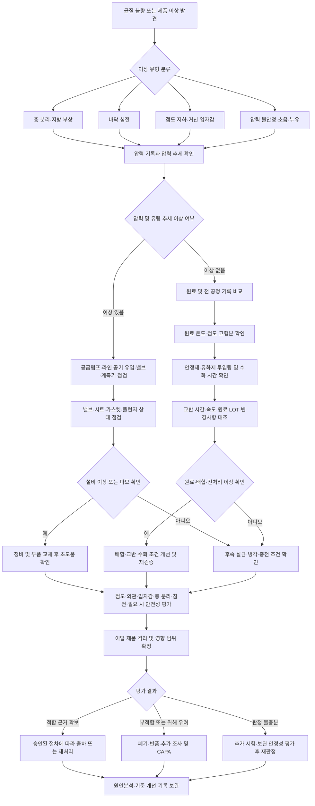

# [QA+ 블로그 생성 결과물] EQ002 균질화 공정이해
생성일시: 2026-09-15 07:24:12 (KST)
적용모델: gpt-5.6-terra

================================================================================
# 📋 최종 발행용 블로그 패키지

### 1. 메타 데이터 (SEO 설정)

- **최종 포스팅 제목**: EQ002 균질화 공정 완벽 이해: 압력만 보면 놓치는 품질관리 핵심 7가지
- **메타 디스크립션 (120자 내외 요약)**: EQ002 고압 균질기 관리의 핵심을 정리했습니다. 압력·온도·유량·밸브 마모·CIP·보관 안정성까지 층 분리와 침전을 줄이는 실무 가이드입니다.
- **추천 해시태그 (10개)**: #식품품질관리 #균질화공정 #고압균질기 #EQ002 #HACCP #식품안전 #식품제조 #CIP세척 #예방보전 #품질관리실무
- **카테고리**: 식품품질실무 / HACCP가이드

> **사실관계 검수 반영 사항**
> - 「식품위생법」 제7조는 식품 등의 기준·규격과 관련된 조항이며, 모든 제품에 공통 적용되는 법정 균질 압력값은 별도로 정하고 있지 않다는 취지는 유지했습니다.
> - 「식품위생법」 제48조는 식품안전관리인증기준(HACCP) 적용업소 인증의 법적 근거입니다.
> - CCP·OPRP·일반관리 구분 중 **OPRP는 ISO 22000/FSSC 22000 체계에서 주로 사용하는 용어**입니다. 국내 HACCP 운영에서는 위해요소 분석과 HACCP 계획에 따라 관리수단을 설정해야 합니다.
> - ATP 검사는 세척 상태 확인에 활용될 수 있으나, 알레르겐·특정 단백질·세척제 잔류의 단독 검증수단으로 사용하기에는 한계가 있으므로 별도 검증법과 병행해야 합니다.
> - 25℃ 가속 보관시험, 압력 범위, 교정 주기, 수화 시간 등은 일반 고정값이 아니라 제품별 밸리데이션·설비 매뉴얼·사내 SOP에 따라 설정해야 합니다.

---

## 2. 네이버 블로그 / 티스토리 복사용 최종 원고 (Markdown)

# [EQ002] 균질화 공정 완벽 이해: 압력만 보면 놓치는 품질관리 핵심 7가지

> **20년 실무 선배의 한 줄 요약**  
> 균질화는 “압력계 숫자를 맞추는 일”이 아니라, 원료 상태·설비 상태·세척 상태를 묶어 **층 분리 없는 안정적인 제품을 재현하는 일**입니다. EQ002의 압력·온도·유량 기록과 제품 점도·입도·보관 안정성 결과를 반드시 함께 관리하세요.

---

## 1. 압력이 정상인데 왜 제품은 분리될까요?

균질기 압력계가 작업표준 범위에 들어왔는데도 음료 위에 지방층이 뜨거나, 소스 바닥에 침전이 생기는 일이 있습니다. 현장에서 정말 많이 헷갈리는 부분입니다. 압력이 정상이라는 사실은 “설비가 표시상 압력을 만들고 있다”는 뜻이지, 제품이 충분히 균질화되었다는 보증서는 아닙니다. 압력계 숫자 하나만 보고 “균질은 문제없다”고 판단하면 원인을 놓치기 쉽습니다.

균질화의 본래 목적은 액상 제품 속 지방구나 고형분 입자를 더 작고 균일하게 분산시키는 것입니다. 쉽게 말하면 큰 돌멩이와 작은 돌멩이가 섞인 길을 고르게 다져서, 시간이 지나도 한쪽으로 몰리지 않게 만드는 작업이라고 보시면 됩니다. 입자가 크고 불균일하면 무거운 고형분은 아래로 가라앉고, 지방처럼 가벼운 성분은 위로 뜹니다. 그래서 균질화 품질은 충전 직후보다 보관 1일차, 3일차, 7일차에 더 명확하게 드러나는 경우가 많습니다.

특히 EQ002가 사내 설비번호라면, 먼저 “우리 공장의 EQ002가 정확히 어떤 방식의 균질기인지”부터 확인해야 합니다. 고압 균질기인지, 인라인 믹서인지, 콜로이드밀인지에 따라 관리 포인트가 달라집니다. 이 글에서는 가장 일반적인 **고압 균질기(Homogenizer)** 를 기준으로 설명드립니다. 실제 적용 전에는 반드시 EQ002 설비 매뉴얼, 사내 작업표준서(SOP), 예방보전 기준서와 대조해 주세요.

압력이 정상이어도 품질이 흔들리는 대표 원인은 생각보다 다양합니다. 균질 밸브와 시트의 마모, 압력계 오차, 원료 온도 저하, 안정제 수화 부족, 유량 변화, 원료 고형분 편차, 세척수 잔류 등이 대표적입니다. 결국 균질화는 설비만의 문제가 아니라 배합부터 후속 살균·냉각까지 연결된 공정입니다. 이 큰 그림을 먼저 잡아야 현장에서 불량 원인을 빠르게 좁힐 수 있습니다.


*이미지 1. 압력계 수치가 정상이어도 밸브 마모, 원료 온도, 안정제 수화, 유량 및 냉각 조건에 따라 제품 안정성은 달라질 수 있습니다.*

이제 가장 기본부터 바로잡아 보겠습니다. 균질화와 단순 교반, 그리고 유화는 비슷해 보여도 관리 방식이 전혀 다릅니다.

---

## 2. 균질화·교반·유화, 비슷해 보여도 관리 포인트는 다릅니다

**교반(Mixing)** 은 여러 원료를 전체적으로 섞는 공정입니다. 예를 들어 물에 설탕을 녹이고 분말을 분산시키기 위해 탱크 임펠러를 돌리는 것이 교반입니다. 교반이 부족하면 분말 덩어리, 국부적인 고형분 편차, 안정제 미수화가 발생할 수 있습니다. 균질기에 들어가기 전 원료 상태를 만드는 기초공정이라고 보시면 됩니다.

반면 **균질화(Homogenization)** 는 고압과 전단력을 이용해 입자 또는 지방구를 미세화하는 공정입니다. 쉽게 말하면 잘 섞어 놓은 원료를 아주 좁은 통로로 빠르게 통과시켜, 큰 입자를 더 작은 입자로 쪼개고 균일하게 퍼뜨리는 방식입니다. 고압 균질기에서는 밸브 틈을 지날 때 압력 강하, 난류, 충돌, 전단력이 발생합니다. 이 힘으로 지방구와 분산 입자가 작아지면서 층 분리와 침전 가능성이 줄어듭니다.

**유화(Emulsification)** 는 원래 잘 섞이지 않는 물과 기름을 안정적으로 분산시키는 현상 또는 공정입니다. 유화제, 단백질, 검류 같은 안정제가 계면에 자리 잡아 물과 기름이 다시 합쳐지지 않도록 도와줍니다. 즉, 균질기는 입자를 작게 만드는 기계적 역할을 하고, 유화제·단백질·안정제는 작아진 입자가 다시 뭉치지 않게 붙잡아 주는 역할을 합니다. 균질기만 좋아도 안 되고, 처방만 좋아도 안 되는 이유가 여기 있습니다.

예를 들어 식물성 음료에서 안정제가 충분히 수화되지 않았다면, 균질 압력을 올려도 침전 문제가 완전히 해결되지 않을 수 있습니다. 반대로 유화제 투입량이 맞더라도 균질 밸브가 마모되어 입자 미세화가 부족하면 상부 지방 부상이 생길 수 있습니다. 그래서 현장에서는 “유화 불량인가요, 균질 불량인가요?”라고 둘 중 하나만 고르기보다, **원료 분산 → 유화 조건 → 균질 조건 → 열처리·냉각 조건**을 순서대로 보는 습관이 중요합니다.

| 구분 | 교반 | 유화 | 균질화 |
|---|---|---|---|
| 핵심 목적 | 원료를 전체적으로 섞음 | 물과 기름의 안정적 분산 | 입자·지방구의 미세화 및 균일화 |
| 주요 수단 | 임펠러, 교반 속도, 시간 | 유화제·단백질·안정제·온도 | 압력, 밸브, 전단력, 유량 |
| 대표 불량 | 분말 뭉침, 배합 편차 | 기름 분리, 재응집 | 지방 부상, 침전, 거친 입자감 |
| 현장 확인법 | 탱크 상·중·하부 균일성 | 층 분리, 유화 상태 | 점도, 입도, 외관, 보관 안정성 |
| 흔한 오해 | 오래 돌리면 무조건 좋다 | 유화제만 넣으면 끝이다 | 압력만 높이면 해결된다 |

여기까지 이해하셨다면 다음 질문이 나옵니다. “그렇다면 균질 압력은 법에서 몇 bar로 정해 놓았나?” 결론부터 말씀드리면, 제품 공통으로 적용되는 법정 압력값은 없습니다.

---

## 3. 법적 기준과 HACCP에서는 균질화를 어떻게 볼까요?

「**식품위생법 제7조**」는 식품 또는 식품첨가물의 기준·규격과 관련된 법적 근거를 둡니다. 균질화 공정 자체에 대해 모든 제품에 공통으로 적용되는 “법정 균질 압력”을 정한 것은 아닙니다. 대신 균질화 후 생산된 최종 제품이 해당 제품유형의 성분규격, 미생물 규격, 식품첨가물 사용기준, 이물 기준 등을 충족해야 합니다. 쉽게 말하면 법은 “압력계가 몇 MPa여야 한다”보다 “그 공정으로 만든 제품이 안전하고 규격에 맞아야 한다”는 결과를 봅니다.

「**식품위생법 제48조**」와 「**식품 및 축산물 안전관리인증기준**」은 HACCP 운영의 근거가 됩니다. HACCP에서는 공정별 위해요소를 분석하고, 그 위해를 통제하기 위한 관리수단을 정해야 합니다. 균질기는 제품과 공정에 따라 CCP가 될 수도 있고, ISO 22000/FSSC 22000 체계에서 말하는 OPRP 또는 일반 공정관리 항목이 될 수도 있습니다. 따라서 “균질기는 무조건 CCP가 아니다” 혹은 “고압 설비니까 무조건 CCP다”라고 단정하면 안 됩니다.

균질화 공정에서 검토할 수 있는 위해요소는 크게 세 가지입니다.

1. 밸브·시트·플런저·가스켓 마모에 따른 금속 또는 비금속 이물 혼입 같은 **물리적 위해**
2. CIP 세척제나 윤활유가 잔류·누출될 수 있는 **화학적 위해**
3. 세척 불량이나 장시간 정체에 따른 미생물 증식 가능성 같은 **생물학적 위해**

ISO 22000:2018 또는 FSSC 22000 Version 6를 운영하는 사업장이라면 설비 예방보전, 측정장비 관리, 세척 검증, 부적합품 통제, 변경관리 자료까지 연결해서 보셔야 합니다. 심사관은 균질기 운전일지 한 장만 보지 않습니다.

- “이 압력 기준은 왜 설정했습니까?”
- “압력계가 맞다는 것은 어떻게 증명합니까?”
- “밸브를 교체한 뒤 제품 영향은 확인했습니까?”

기록은 작성 자체보다 **기준 설정 근거와 제품 품질의 연결성**이 핵심입니다.

> **실무 핵심 정리**  
> 균질 압력은 법정 고정값이 아니라, 제품별 시험생산·보관 안정성 시험·설비 사양 검토를 통해 설정한 **자사 검증 관리기준**입니다.  
> 따라서 SOP에는 목표값만 적지 말고, 허용범위·이탈 시 조치·품질 확인항목·설정 근거 문서까지 연결해 두셔야 합니다.

법적 관점을 잡았다면 이제 실제 공정 관리로 들어가 보겠습니다. 현장에서는 균질기 앞, 운전 중, 균질기 뒤의 관리 포인트를 나눠 보는 것이 가장 빠르고 정확합니다.

---

## 4. EQ002 균질화 공정관리: 전·중·후로 나누면 답이 보입니다

균질화 **전**에는 원료가 충분히 혼합되었는지부터 확인해야 합니다. 안정제나 증점제가 들어가는 제품은 정해진 교반 시간과 수화 시간을 확보하지 않으면 균질기에서 해결되지 않습니다. 예를 들어 검류가 덩어리진 상태로 들어가면 균질 후에도 미세한 뭉침, 점도 편차, 침전이 남을 수 있습니다. 배합 완료 후 탱크 상·중·하부의 외관과 점도를 비교해 보는 간단한 확인도 큰 도움이 됩니다.

균질화 **중**에는 압력뿐 아니라 압력 변동, 유량, 제품 온도, 이상 소음, 누유를 같이 봐야 합니다. 같은 설정 압력이라도 유량이 갑자기 바뀌거나 원료 점도가 달라지면 실제 균질 효과는 달라질 수 있습니다. 운전 중 압력이 반복적으로 출렁인다면 공급 펌프의 흡입 불량, 라인 내 공기 유입, 밸브 이상, 압력계 이상 등을 의심해야 합니다. “압력은 평균값으로 맞는다”는 이유만으로 변동을 방치하면 배치 내 품질 편차가 커집니다.

균질화 **후**에는 제품 외관, 점도, 입자감, 색상·광택, 층 분리 가능성을 확인합니다. 가능하다면 균질 직후 시료와 충전 후 일정 시간 보관한 시료를 함께 비교하세요. 예를 들어 냉장 제품은 사내 보관 안정성 계획에 따라 1일차·3일차·7일차 또는 유통기한 중간 시점까지 관찰할 수 있습니다. 제품 특성상 침전이 예상되는 경우에는 용기 바닥의 침전 높이, 상층 분리 두께, 재분산성까지 기준화하는 것이 좋습니다.

원료 온도는 특히 놓치기 쉬운 변수입니다. 지방을 포함하거나 점도가 높은 제품은 온도가 낮아질수록 유동성이 떨어지고, 균질기 부하가 증가하며, 균질 효율이 달라질 수 있습니다. 반대로 너무 높은 온도는 향미 손실, 단백질 안정성 저하, 점도 변화로 이어질 수 있습니다. 그래서 “균질 온도 00~00℃”처럼 제품별 검증 범위를 설정하되, 여기서의 숫자는 반드시 자사 처방과 설비 매뉴얼에 맞춰 정해야 합니다.

| 관리 단계 | 필수 확인 항목 | 왜 확인해야 하나요? | 기록 예시 |
|---|---|---|---|
| 균질 전 | 원료 온도, 점도, 고형분, 교반 상태 | 균질기에 투입되는 원료의 조건을 일정하게 유지 | 배합기록, 원료 투입기록 |
| 균질 전 | 안정제·유화제 투입량 및 수화 시간 | 재응집·층 분리 방지의 기초 조건 | 배합표, 교반시간 기록 |
| 균질 중 | 압력, 압력 변동, 유량 | 미세화 조건의 재현성 확보 | EQ002 운전일지 |
| 균질 중 | 소음, 진동, 누유, 밸브 위치 | 설비 고장과 이물 위험 조기 발견 | 설비 일상점검표 |
| 균질 후 | 점도, 외관, 입자감, 색상 | 즉시 확인 가능한 품질 이상 파악 | 공정검사성적서 |
| 충전 후 | 층 분리, 침전, 지방 부상 | 장기 물리적 안정성 확인 | 보관 안정성 시험기록 |
| 세척 후 | 최종 린스, ATP·단백질 잔류 등 | 세척제·알레르겐·미생물 위험 예방 | CIP 기록, 검증성적서 |

> ATP 검사는 일반적인 세척 상태 확인에 활용할 수 있지만, 알레르겐·단백질·세척제 잔류를 단독으로 판정하는 시험은 아닙니다. 제품과 위해요소에 맞는 검증법을 별도로 설정하세요.

이제부터가 진짜 실무입니다. 균질기 이상이 의심될 때 무작정 압력을 올리기 전에, 아래 순서대로 확인하면 불필요한 재작업과 폐기를 많이 줄일 수 있습니다.

---

## 5. 20년 선배가 권하는 균질 불량 트러블슈팅 순서

### 1단계: 먼저 제품 이상을 정확히 분류하세요

층 분리, 지방 부상, 침전, 점도 저하, 거친 입자감은 비슷해 보여도 원인이 다를 수 있습니다. 상부에 기름층이나 크림층이 생기면 지방구 미세화 부족, 유화 안정성 저하, 밸브 마모를 우선 봐야 합니다. 바닥 침전이 많아지면 교반 부족, 분말 분산 불량, 고형분 조성 변화, 안정제 수화 부족 가능성을 먼저 확인합니다. 문제를 “균질 불량”이라는 한 단어로 묶어 버리면 조사 방향이 너무 넓어집니다.

### 2단계: 압력 기록보다 ‘압력 추세’를 보세요

운전일지에서 한 번 기록한 압력값만 보지 말고, 배치 시작·중간·종료의 추세를 비교하세요. 예를 들어 기준이 20 MPa라고 하더라도, 운전 중 18~22 MPa 사이에서 반복 변동하는 것과 20 MPa로 안정적으로 유지되는 것은 전혀 다릅니다. 단, 이 숫자는 특정 제품의 권장값이 아니라 추세 확인 방법을 설명하기 위한 예시입니다. 실제 허용범위는 제품 밸리데이션과 EQ002 설비 사양에 따라 설정해야 합니다.

### 3단계: 원료 조건과 전 공정 기록을 대조하세요

같은 압력인데 이번 로트만 점도가 낮아졌다면, 균질기보다 배합·교반·원료 입고 상태가 달라졌을 가능성도 큽니다. 원료 고형분, 지방 함량, 원료 온도, 유화제 투입량, 안정제 수화 시간, 교반 속도와 시간을 전 로트와 비교해 보세요. 특히 분말 원료의 입도나 공급업체 변경, 원료 보관조건 변화는 제품 물성에 은근히 큰 영향을 줍니다. 변경사항이 있었다면 변경관리 문서와 연결해 검토하는 것이 맞습니다.

### 4단계: 설비 상태를 숫자와 눈으로 함께 확인하세요

압력계가 정상이어도 균질 밸브와 시트가 마모되면 실제 전단 효과가 떨어질 수 있습니다. 누유, 비정상 진동, 타격음, 압력 불안정, 처리량 저하가 보이면 제조사 매뉴얼과 예방보전 기준에 따라 분해점검을 검토해야 합니다. 정비 후에는 부품 누락 여부, 식품 접촉부 재질 적합성, 조립 상태, 초도품 품질을 확인해야 합니다. “부품을 교체했으니 끝”이 아니라, 교체 후 제품 품질이 정상으로 돌아왔는지를 입증해야 합니다.

### 5단계: 이탈 제품은 즉시 격리하고 영향 범위를 확정하세요

압력 이탈이 발생했다고 해서 무조건 전량 폐기하는 것은 아닙니다. 반대로 제품 외관이 멀쩡해 보인다고 바로 출하해도 안 됩니다. 이탈 시작 시점, 마지막 정상 확인 시점, 해당 시간대 생산량, 후속 공정 진행 여부를 기준으로 영향 범위를 설정하고 제품을 우선 격리하세요. 이후 점도·외관·입도·보관 안정성, 필요 시 미생물 또는 이물 위험까지 평가해 재처리·출하·폐기 여부를 결정합니다.


*이미지 2. 균질 불량 발생 시 압력을 즉시 조정하기보다 제품 확인, 기록 대조, 원료·설비 조사, 제품영향 평가 순으로 대응해야 합니다.*



> **★ 심사 대응 꿀팁**  
> 심사관이 “압력 기준 근거가 무엇입니까?”라고 물으면 “예전부터 그렇게 했습니다”는 가장 위험한 답입니다.  
> 시험생산 결과, 점도·입도·층 분리 시험, 유통기한 안정성 결과, 고객 규격, 설비 제조사 권장조건을 묶어 **관리기준 설정 근거서**로 정리해 두세요.

이 원칙이 실제로 어떻게 적용되는지, 서로 다른 제품 사례로 자세히 보겠습니다.

---

## 6. 실제 현장 사례로 보는 균질화 공정 적용법

### 사례 1. 냉장 식물성 음료 제조공장: 압력은 정상인데 바닥 침전이 증가한 경우

A 공장은 귀리 베이스 식물성 음료를 생산했고, EQ002 균질기 압력은 작업표준 범위 내로 기록되고 있었습니다. 그런데 충전 직후에는 문제가 없던 제품에서 냉장 보관 3일차부터 바닥 침전이 눈에 띄게 증가했습니다.

생산팀은 처음에 균질 압력을 높이자는 의견을 냈지만, 품질팀은 바로 압력 조정을 하지 않고 전 공정 기록을 비교했습니다. 조사 결과, 해당 로트는 원료 귀리 분말의 입고 로트가 바뀌었고, 배합 탱크의 교반 시간이 기존 30분에서 18분으로 짧아진 사실을 확인했습니다. 생산량 증가로 다음 배치를 서두르면서 안정제 수화 시간도 충분히 확보되지 않았습니다.

균질기 자체의 압력과 온도는 정상 범위였지만, 균질기 투입 전 분산 상태가 이미 불균일했던 것이 근본 원인이었습니다. 개선 조치로 원료 변경 시 소규모 사전 시험을 의무화하고, 교반 시간과 수화 시간을 전자기록으로 관리했습니다. 또한 균질 후 시료만 보지 않고 냉장 1일차·3일차·7일차 침전 높이를 측정하는 보관 안정성 항목을 추가했습니다.

그 결과 이후 10개 연속 생산 로트에서 침전 편차가 줄었고, 압력을 불필요하게 올리지 않아 점도 저하 위험도 피할 수 있었습니다.

### 사례 2. 마요네즈형 소스 제조공장: 상부 유분 분리가 반복된 경우

B 공장은 난황과 식물유를 사용하는 마요네즈형 소스를 생산했는데, 완제품 상부에 유분이 맺히는 클레임이 반복됐습니다. 현장 기록상 균질 압력은 항상 목표값으로 관리되고 있었기 때문에 처음에는 유화제 품질 문제로만 판단했습니다.

하지만 품질팀이 EQ002 운전 중 압력 추세를 확인해 보니, 평균 압력은 정상이었지만 순간적인 압력 변동 폭이 기존보다 커져 있었습니다. 설비 점검 결과 균질 밸브 시트가 마모되어 있었고, 공급 라인 연결부에서 미세한 공기 유입도 확인됐습니다.

마모된 시트 때문에 실제 미세화 효율이 저하됐고, 공기 혼입은 유화 안정성을 추가로 떨어뜨리는 요인이 됐습니다. 정비팀은 밸브와 시트를 교체하고, 가스켓과 클램프 체결 상태를 점검했으며, 교체 부품의 LOT와 교체일을 예방보전 이력에 등록했습니다.

품질팀은 정비 후 초도 생산품에 대해 점도, 현미경 관찰 가능 여부, 제품별로 검증된 25℃ 가속 보관 조건에서의 유분 분리 상태를 확인했습니다. 이후에는 누적 운전시간, 압력 변동 폭, 누유 여부를 기준으로 부품 교체 알림 기준을 만들었습니다.

결과적으로 유분 분리 클레임은 감소했고, “압력값은 맞는데 왜 분리되지?”라는 현장 혼선도 줄었습니다.

### 사례 3. 레토르트 크림소스 제조공장: 세척 후 첫 배치의 점도가 낮아진 경우

C 공장은 크림소스를 생산한 뒤 매일 CIP를 실시하고 다음날 첫 배치를 가동했습니다. 그런데 특정 시기부터 세척 후 첫 배치만 점도가 기준보다 낮고, 맛도 약하게 느껴진다는 품질 이상이 발생했습니다.

생산팀은 균질 압력이 높아져 과도한 전단이 발생했다고 의심했지만, EQ002 압력과 제품 투입 온도는 기존과 큰 차이가 없었습니다. 품질팀은 CIP 기록을 확인했고, 최종 린스 단계의 시간은 기록돼 있었지만 실제 잔류수 배출 확인 기준이 없다는 점을 발견했습니다.

설비 배관의 낮은 지점과 우회라인에 세척수 또는 린스수가 일부 남아 다음날 첫 배치에 혼입된 것이 근본 원인이었습니다. 이로 인해 고형분이 희석되고 점도가 낮아졌으며, 균질기 문제처럼 보이는 현상이 나타난 것입니다.

개선 조치로 CIP 후 드레인 확인 절차, 에어 블로우 조건, 초도 제품 별도 격리 기준을 SOP에 반영했습니다. 또한 최종 린스수 전도도 확인, 필요 시 ATP 또는 단백질 잔류 확인을 세척 검증 계획에 포함했습니다. 이후 첫 배치 점도 편차가 안정화됐고, 세척 기록도 단순 “CIP 실시”가 아니라 세척 효과를 증명하는 자료로 바뀌었습니다.

세 사례의 공통점이 보이시죠? 균질 압력만으로는 원인을 설명할 수 없었습니다. 그래서 다음 표처럼 불량 현상별로 우선 확인 순서를 정해 두면 현장 대응 속도가 빨라집니다.

---

## 7. 불량 유형별 원인과 올바른 대응 방법

| 불량 현상 | 흔한 실수 | 우선 확인할 원인 | 올바른 대응 |
|---|---|---|---|
| 층 분리 | 압력만 즉시 올림 | 유화제, 안정제 수화, 원료 온도, 밸브 마모 | 처방·수화·압력·밸브 상태를 함께 검토 |
| 지방 부상 | 충전 문제로만 판단 | 지방구 미세화 부족, 시트 마모, 냉각조건 | 균질 효과와 후속 냉각 이력 확인 |
| 바닥 침전 | 균질기 고장으로 단정 | 교반 부족, 분말 뭉침, 고형분 변화 | 균질 전 분산 상태와 원료 LOT 비교 |
| 점도 저하 | 안정제를 추가 투입 | 과도한 전단, 제품 온도 상승, 희석수 혼입 | 압력·온도·CIP 후 잔류수 확인 |
| 점도 상승 | 균질 압력 부족으로 판단 | 온도 저하, 수화 과다, 배합 오차 | 온도 이력과 안정제 투입·수화 조건 검토 |
| 압력 불안정 | 압력계만 교체 | 공기 유입, 공급 불량, 밸브 손상 | 펌프→라인→밸브→계측기 순으로 점검 |
| 세척 후 첫 배치 이상 | 원료 불량으로 처리 | 세척수 잔류, 조립 오류, CIP 조건 불충분 | 배출·린스·초도품 격리 기준 강화 |
| 금속성 이물 우려 | 후단 금속검출기에만 의존 | 밸브·시트·플런저 마모, 정비 부품 누락 | 예방보전·분해점검·제품영향 평가 실시 |

균질기 밸브와 시트는 식품과 직접 접촉하면서 고압 조건을 견디는 부품입니다. 따라서 누유가 없더라도 마모 상태에 따라 균질 효과가 저하될 수 있습니다. 제조사 권장 교체주기, 누적 운전시간, 생산 품목, 압력 변동, 분해점검 결과를 종합해 예방보전 기준을 정하세요. 특히 점도가 높거나 입자가 많은 제품을 자주 생산한다면 부품 마모 속도도 달라질 수 있습니다.

압력계와 온도계도 관리 대상입니다. 관리기준 판정에 사용하는 측정값이라면, 사내 측정장비 관리절차에 따라 교정·비교검증·일상점검·교체 기준을 운영해야 합니다. 예를 들어 외부 교정 주기를 연 1회로 정했다면, 그 사이에도 기준 압력계와 비교하는 내부 점검을 월 1회 또는 분기 1회 운영하는 방식을 검토할 수 있습니다. 단, 실제 주기는 설비 중요도와 사내 품질시스템에 맞춰 정해야 합니다.

균질기 관리에서 자주 빠지는 것이 후속 공정입니다. 균질 직후 제품이 좋아 보여도 살균 조건, 냉각 속도, 충전 온도, 보관 온도가 바뀌면 점도나 분리 안정성이 달라질 수 있습니다. 특히 단백질과 지방이 포함된 제품은 열이력에 민감한 경우가 많습니다. 그러니 불량 조사 시 EQ002 전후의 데이터만 보지 말고, 최소한 배합부터 충전까지의 공정기록을 한 장의 흐름으로 펼쳐 놓고 보세요.

그다음은 세척입니다. 균질기는 구조상 밸브, 씰, 사각부, 우회라인 등 세척 취약부가 생길 수 있어 CIP 기록만으로 충분하다고 보기 어렵습니다.

---

## 8. 균질기 CIP 세척과 설비보전, 심사에서 가장 많이 보는 부분

CIP(Cleaning In Place)는 설비를 완전히 분해하지 않고 내부 배관과 접액부를 순환 세정하는 방식입니다. 하지만 “CIP 버튼을 눌렀다”는 사실과 “세척이 검증됐다”는 사실은 다릅니다. 세정제 종류, 농도, 세정 온도, 순환 시간, 유속, 최종 린스 조건은 설비 구조와 오염 특성에 따라 밸리데이션되어야 합니다. 쉽게 말하면 세척 프로그램을 돌린 기록은 출발점이고, 잔류물이 없다는 확인이 마침표입니다.

세척 검증 방법은 제품과 위험도에 따라 다르게 설계할 수 있습니다. 일반적으로 최종 린스수의 외관·전도도 확인, ATP 검사, 단백질 잔류 검사, 알레르겐 스왑, 미생물 스왑 등이 활용됩니다. 알레르겐 원료를 취급하는 공장이라면 일반 세척 검증과 별도로 교차오염 방지 관점의 검증이 필요합니다. 예를 들어 우유, 난류, 대두 등 알레르겐 함유 제품에서 비함유 제품으로 전환할 때는 사내 알레르겐 관리계획과 연동해야 합니다.

균질 밸브, 시트, 가스켓, 플런저, 씰류는 예방보전 대상입니다. “고장 나면 교체” 방식은 생산 중 갑작스러운 압력 불안정, 누유, 이물 위험으로 이어질 수 있습니다. 예방보전 계획에는 점검 주기, 교체 판단 기준, 담당자, 점검 결과, 부품 LOT, 정비 후 확인사항을 남겨야 합니다. 정비가 끝난 뒤에는 공구·부품 잔류 여부와 조립 상태도 확인해 주세요.

심사에서는 공정흐름도와 실제 배관이 맞는지도 자주 봅니다. 작업표준서에는 균질화를 거친다고 되어 있는데 실제 현장에 우회라인(By-pass)이 있고, 밸브 위치에 따라 균질기를 통과하지 않을 수 있다면 큰 지적사항이 될 수 있습니다. 변경된 배관, 밸브 추가, 설비 교체가 있었다면 공정흐름도·위해요소 분석표·작업표준서·교육자료를 함께 개정해야 합니다. 문서와 현장이 다르면 아무리 기록을 잘 써도 신뢰를 얻기 어렵습니다.

> **심사관 단골 질문 5가지**
>
> 1. 균질 압력 관리기준은 어떤 시험 결과로 설정했습니까?  
> 2. 압력계의 측정 신뢰성은 어떻게 보장합니까?  
> 3. 밸브·시트·가스켓 교체 이력은 어디에 있습니까?  
> 4. CIP 후 세척 효과는 무엇으로 검증합니까?  
> 5. 압력 이탈 제품은 어느 시점부터 격리하고 어떤 기준으로 처리합니까?  

마지막으로, 실무자분들이 가장 자주 묻는 질문을 짚고 마무리하겠습니다. 여기만 정리해 두셔도 신입 교육과 심사 준비 때 상당히 편해집니다.

---

## 9. 균질화 공정 FAQ: 실무자가 가장 많이 묻는 질문 6가지

### Q1. 균질기는 HACCP의 CCP인가요?

**A.** 균질기라는 설비 자체가 자동으로 CCP가 되는 것은 아닙니다. 제품 특성, 후속 살균공정 유무, 금속이물 통제수단, 세척관리 수준, 위해요소 분석 결과를 근거로 CCP·일반 공정관리 또는 ISO 22000/FSSC 22000 체계상 OPRP 등 적절한 관리수준을 결정해야 합니다. HACCP 팀의 위해요소 분석표와 결정도 적용 근거가 가장 중요합니다.

### Q2. 균질 압력은 몇 bar 또는 몇 MPa로 관리해야 하나요?

**A.** 모든 식품에 공통으로 적용되는 법정 압력값은 없습니다. 제품의 지방 함량, 고형분, 점도, 목표 입도, 원료 온도, 설비 사양, 보관 안정성 시험 결과를 바탕으로 자사 기준을 설정해야 합니다. 외부 사례의 압력값은 참고만 하고, 그대로 가져와 적용하면 오히려 품질 문제가 생길 수 있습니다.

### Q3. 압력이 기준에서 이탈하면 해당 제품은 전량 폐기해야 하나요?

**A.** 무조건 전량 폐기라고 단정하기보다 사전 승인된 이탈조치 절차에 따라 판단해야 합니다. 우선 제품을 격리하고, 이탈 시점·영향 범위·설비 이상 여부를 확인한 뒤 점도·외관·입도·안정성 및 필요 시 안전성 항목을 평가합니다. 다만 위해요소 통제 실패와 직접 연결된 경우에는 HACCP 계획에 따른 강화된 조치가 필요합니다.

### Q4. 균질 후 층 분리가 생기면 압력을 올리면 되나요?

**A.** 반드시 그렇지 않습니다. 유화제·안정제의 종류와 투입 순서, 수화 시간, 원료 온도, pH, 고형분, 밸브 마모, 냉각 조건까지 함께 봐야 합니다. 압력을 과도하게 올리면 제품에 따라 점도 저하, 단백질 불안정, 기포 증가, 부품 마모 증가가 생길 수 있습니다.

### Q5. 압력계도 검교정 대상인가요?

**A.** 압력계 수치가 제품 품질 판정이나 공정 관리기준에 사용된다면 측정 신뢰성을 확보해야 합니다. 사내 측정장비 관리절차에 따라 외부 교정, 기준계 비교검증, 일상점검, 이상 시 교체 기준을 정하고 기록으로 남기세요. 교정성적서만 보관하지 말고 설비번호 EQ002와 해당 압력계를 연결해 식별하는 것이 좋습니다.

### Q6. 균질 밸브와 가스켓은 언제 교체해야 하나요?

**A.** 제조사 권장사항을 기본으로 하되, 누적 운전시간, 제품 종류, 압력 변동, 누유, 분해점검 결과, 품질 편차를 함께 반영해야 합니다. 특히 “압력은 정상인데 분리·침전이 증가했다”면 밸브와 시트 마모를 우선 확인할 가치가 있습니다. 교체 후에는 부품 이력만 남기지 말고 초도품 품질 확인 결과까지 붙여 두세요.

---

## 10. EQ002 균질화 공정 일일 점검 체크리스트

아래 표는 바로 현장 점검표 초안으로 활용할 수 있는 형태입니다. 다만 관리기준의 구체적 수치와 점검 주기는 반드시 제품별 밸리데이션, 사내 SOP, 설비 제조사 매뉴얼에 맞게 확정하셔야 합니다.

| 점검 시점 | 점검 항목 | 확인 기준 예시 | 이상 시 조치 |
|---|---|---|---|
| 가동 전 | 작업지시서·제품명 확인 | 해당 제품의 승인된 조건 적용 | 조건 불명확 시 가동 보류 |
| 가동 전 | 원료 온도·점도 확인 | 제품별 SOP 범위 충족 | 배합·가열·냉각 조건 재확인 |
| 가동 전 | 유화제·안정제 투입 확인 | 처방량, 투입 순서, 수화 시간 일치 | 재교반 또는 품질팀 보고 |
| 가동 전 | 밸브·가스켓·클램프 상태 | 누유, 균열, 체결 이상 없음 | 정비 요청 및 설비 점검 |
| 운전 중 | 균질 압력 | 제품별 승인 관리범위 유지 | 제품 격리, 원인 조사 |
| 운전 중 | 압력 변동·유량 | 급격한 변동 또는 맥동 없음 | 공급라인·공기 유입·밸브 점검 |
| 운전 중 | 소음·진동·누유 | 비정상 상태 없음 | 즉시 보고, 필요 시 정지 |
| 운전 후 | 외관·점도·입자감 | 공정검사 기준 충족 | 보류 후 추가 시험 |
| 운전 후 | 층 분리·침전 안정성 | 사내 보관 시험 기준 충족 | 원료·설비·후공정 종합 조사 |
| 세척 후 | CIP 조건 확인 | 프로그램, 시간, 온도, 농도 기록 | 재세척 또는 원인 분석 |
| 세척 후 | 최종 린스·잔류 확인 | 사내 검증기준 충족 | 재린스·재세척·초도품 격리 |
| 정기 점검 | 압력계·온도계 관리 | 교정 또는 비교검증 유효 | 사용중지·교체·재검증 |
| 정기 점검 | 접액부 부품 교체 이력 | 예방보전 계획과 일치 | 교체 및 정비기록 작성 |

---

## 11. 맺음말: 균질화는 ‘압력 관리’가 아니라 ‘제품 안정성 관리’입니다

오늘 내용은 길었지만, 현장에서는 아래 세 가지만 기억하셔도 방향을 잃지 않습니다.

첫째, 균질화는 단순히 섞는 공정이 아니라 입자와 지방구를 균일하게 분산시켜 제품 안정성을 만드는 공정입니다.

둘째, 균질 압력은 법정 단일 숫자가 아니라 제품별 시험과 검증을 통해 설정해야 하는 자사 관리기준입니다.

셋째, 압력·온도·유량·원료 상태·밸브 마모·세척 상태·후속 공정을 함께 봐야 진짜 원인이 보입니다.

EQ002의 운전일지는 압력 숫자만 적는 서류가 아닙니다. 그 숫자가 점도, 입도, 외관, 층 분리, 침전 없는 제품으로 연결된다는 사실을 보여 주는 품질 데이터여야 합니다. 기록이 쌓일수록 “우리 제품은 어떤 조건에서 가장 안정적인가”가 보이고, 불량이 생겨도 감으로 대응하지 않게 됩니다.

처음에는 압력, 온도, 밸브, 점도, CIP까지 관리할 것이 많아 복잡하게 느껴질 수 있습니다. 하지만 하나씩 데이터를 연결해 보면 균질화 공정은 생각보다 정직합니다.

**압력계 숫자보다 제품의 안정성을 먼저 보세요.** 후배님들의 칼퇴를 응원합니다.

---

## 3. 워드프레스 / 웹사이트용 HTML 원고

```html
<article class="food-qa-post">
  <header>
    <h1>[EQ002] 균질화 공정 완벽 이해: 압력만 보면 놓치는 품질관리 핵심 7가지</h1>
    <p class="lead"><strong>20년 실무 선배의 한 줄 요약:</strong> 균질화는 “압력계 숫자를 맞추는 일”이 아니라, 원료 상태·설비 상태·세척 상태를 묶어 <strong>층 분리 없는 안정적인 제품을 재현하는 일</strong>입니다. EQ002의 압력·온도·유량 기록과 제품 점도·입도·보관 안정성 결과를 반드시 함께 관리하세요.</p>
  </header>

  <section>
    <h2>1. 압력이 정상인데 왜 제품은 분리될까요?</h2>
    <p>균질기 압력계가 작업표준 범위에 들어왔는데도 음료 위에 지방층이 뜨거나, 소스 바닥에 침전이 생기는 일이 있습니다. 현장에서 정말 많이 헷갈리는 부분입니다. 압력이 정상이라는 사실은 “설비가 표시상 압력을 만들고 있다”는 뜻이지, 제품이 충분히 균질화되었다는 보증서는 아닙니다. 압력계 숫자 하나만 보고 “균질은 문제없다”고 판단하면 원인을 놓치기 쉽습니다.</p>
    <p>균질화의 본래 목적은 액상 제품 속 지방구나 고형분 입자를 더 작고 균일하게 분산시키는 것입니다. 입자가 크고 불균일하면 무거운 고형분은 아래로 가라앉고, 지방처럼 가벼운 성분은 위로 뜹니다. 그래서 균질화 품질은 충전 직후보다 보관 1일차, 3일차, 7일차에 더 명확하게 드러나는 경우가 많습니다.</p>
    <p>특히 EQ002가 사내 설비번호라면, 먼저 “우리 공장의 EQ002가 정확히 어떤 방식의 균질기인지”부터 확인해야 합니다. 고압 균질기인지, 인라인 믹서인지, 콜로이드밀인지에 따라 관리 포인트가 달라집니다. 이 글에서는 가장 일반적인 <strong>고압 균질기(Homogenizer)</strong>를 기준으로 설명드립니다. 실제 적용 전에는 반드시 EQ002 설비 매뉴얼, 사내 작업표준서(SOP), 예방보전 기준서와 대조해 주세요.</p>
    <p>압력이 정상이어도 품질이 흔들리는 대표 원인은 균질 밸브와 시트의 마모, 압력계 오차, 원료 온도 저하, 안정제 수화 부족, 유량 변화, 원료 고형분 편차, 세척수 잔류 등입니다. 결국 균질화는 설비만의 문제가 아니라 배합부터 후속 살균·냉각까지 연결된 공정입니다.</p>

    <figure>
      
      <figcaption>압력계 수치가 정상이어도 밸브 마모, 원료 온도, 안정제 수화, 유량 및 냉각 조건에 따라 제품 안정성은 달라질 수 있습니다.</figcaption>
    </figure>
  </section>

  <section>
    <h2>2. 균질화·교반·유화, 비슷해 보여도 관리 포인트는 다릅니다</h2>
    <p><strong>교반(Mixing)</strong>은 여러 원료를 전체적으로 섞는 공정입니다. 물에 설탕을 녹이고 분말을 분산시키기 위해 탱크 임펠러를 돌리는 것이 대표적입니다. 교반이 부족하면 분말 덩어리, 국부적인 고형분 편차, 안정제 미수화가 발생할 수 있습니다.</p>
    <p><strong>균질화(Homogenization)</strong>는 고압과 전단력을 이용해 입자 또는 지방구를 미세화하는 공정입니다. 고압 균질기에서는 밸브 틈을 지날 때 압력 강하, 난류, 충돌, 전단력이 발생합니다. 이 힘으로 지방구와 분산 입자가 작아지면서 층 분리와 침전 가능성이 줄어듭니다.</p>
    <p><strong>유화(Emulsification)</strong>는 원래 잘 섞이지 않는 물과 기름을 안정적으로 분산시키는 현상 또는 공정입니다. 유화제, 단백질, 검류 같은 안정제가 계면에 자리 잡아 물과 기름이 다시 합쳐지지 않도록 도와줍니다.</p>

    <table>
      <thead>
        <tr>
          <th>구분</th>
          <th>교반</th>
          <th>유화</th>
          <th>균질화</th>
        </tr>
      </thead>
      <tbody>
        <tr>
          <td>핵심 목적</td>
          <td>원료를 전체적으로 섞음</td>
          <td>물과 기름의 안정적 분산</td>
          <td>입자·지방구의 미세화 및 균일화</td>
        </tr>
        <tr>
          <td>주요 수단</td>
          <td>임펠러, 교반 속도, 시간</td>
          <td>유화제·단백질·안정제·온도</td>
          <td>압력, 밸브, 전단력, 유량</td>
        </tr>
        <tr>
          <td>대표 불량</td>
          <td>분말 뭉침, 배합 편차</td>
          <td>기름 분리, 재응집</td>
          <td>지방 부상, 침전, 거친 입자감</td>
        </tr>
        <tr>
          <td>현장 확인법</td>
          <td>탱크 상·중·하부 균일성</td>
          <td>층 분리, 유화 상태</td>
          <td>점도, 입도, 외관, 보관 안정성</td>
        </tr>
        <tr>
          <td>흔한 오해</td>
          <td>오래 돌리면 무조건 좋다</td>
          <td>유화제만 넣으면 끝이다</td>
          <td>압력만 높이면 해결된다</td>
        </tr>
      </tbody>
    </table>
  </section>

  <section>
    <h2>3. 법적 기준과 HACCP에서는 균질화를 어떻게 볼까요?</h2>
    <p><strong>「식품위생법 제7조」</strong>는 식품 또는 식품첨가물의 기준·규격과 관련된 법적 근거를 둡니다. 균질화 공정 자체에 대해 모든 제품에 공통으로 적용되는 “법정 균질 압력”을 정한 것은 아닙니다. 최종 제품은 해당 제품유형의 성분규격, 미생물 규격, 식품첨가물 사용기준, 이물 기준 등을 충족해야 합니다.</p>
    <p><strong>「식품위생법 제48조」</strong>와 <strong>「식품 및 축산물 안전관리인증기준」</strong>은 HACCP 운영의 근거가 됩니다. 균질기는 제품과 공정에 따라 CCP가 될 수도 있고, ISO 22000/FSSC 22000 체계에서 말하는 OPRP 또는 일반 공정관리 항목이 될 수도 있습니다. 위해요소 분석 결과와 통제수단을 근거로 관리수준을 결정해야 합니다.</p>
    <ul>
      <li><strong>물리적 위해:</strong> 밸브·시트·플런저·가스켓 마모에 따른 금속 또는 비금속 이물 혼입</li>
      <li><strong>화학적 위해:</strong> CIP 세척제나 윤활유의 잔류 또는 누출</li>
      <li><strong>생물학적 위해:</strong> 세척 불량이나 장시간 정체에 따른 미생물 증식 가능성</li>
    </ul>
    <blockquote>
      <p><strong>실무 핵심 정리</strong><br>균질 압력은 법정 고정값이 아니라, 제품별 시험생산·보관 안정성 시험·설비 사양 검토를 통해 설정한 <strong>자사 검증 관리기준</strong>입니다. SOP에는 목표값뿐 아니라 허용범위·이탈 시 조치·품질 확인항목·설정 근거 문서까지 연결해 두셔야 합니다.</p>
    </blockquote>
  </section>

  <section>
    <h2>4. EQ002 균질화 공정관리: 전·중·후로 나누면 답이 보입니다</h2>
    <p>균질화 전에는 원료가 충분히 혼합되었는지부터 확인해야 합니다. 안정제나 증점제가 들어가는 제품은 정해진 교반 시간과 수화 시간을 확보하지 않으면 균질기에서 해결되지 않습니다.</p>
    <p>균질화 중에는 압력뿐 아니라 압력 변동, 유량, 제품 온도, 이상 소음, 누유를 같이 봐야 합니다. 같은 설정 압력이라도 유량이 바뀌거나 원료 점도가 달라지면 실제 균질 효과는 달라질 수 있습니다.</p>
    <p>균질화 후에는 제품 외관, 점도, 입자감, 색상·광택, 층 분리 가능성을 확인합니다. 균질 직후 시료와 충전 후 일정 시간 보관한 시료를 함께 비교하는 것이 좋습니다.</p>

    <table>
      <thead>
        <tr>
          <th>관리 단계</th>
          <th>필수 확인 항목</th>
          <th>확인 목적</th>
          <th>기록 예시</th>
        </tr>
      </thead>
      <tbody>
        <tr><td>균질 전</td><td>원료 온도, 점도, 고형분, 교반 상태</td><td>투입 원료 조건의 일정성 유지</td><td>배합기록, 원료 투입기록</td></tr>
        <tr><td>균질 전</td><td>안정제·유화제 투입량 및 수화 시간</td><td>재응집·층 분리 방지</td><td>배합표, 교반시간 기록</td></tr>
        <tr><td>균질 중</td><td>압력, 압력 변동, 유량</td><td>미세화 조건의 재현성 확보</td><td>EQ002 운전일지</td></tr>
        <tr><td>균질 중</td><td>소음, 진동, 누유, 밸브 위치</td><td>설비 고장과 이물 위험 조기 발견</td><td>설비 일상점검표</td></tr>
        <tr><td>균질 후</td><td>점도, 외관, 입자감, 색상</td><td>즉시 확인 가능한 품질 이상 파악</td><td>공정검사성적서</td></tr>
        <tr><td>충전 후</td><td>층 분리, 침전, 지방 부상</td><td>장기 물리적 안정성 확인</td><td>보관 안정성 시험기록</td></tr>
        <tr><td>세척 후</td><td>최종 린스, ATP·단백질 잔류 등</td><td>세척제·알레르겐·미생물 위험 예방</td><td>CIP 기록, 검증성적서</td></tr>
      </tbody>
    </table>

    <p><em>ATP 검사는 일반 세척 상태 확인에 활용할 수 있지만, 알레르겐·단백질·세척제 잔류를 단독으로 판정하는 시험은 아닙니다. 제품과 위해요소에 맞는 별도 검증법을 병행하세요.</em></p>
  </section>

  <section>
    <h2>5. 20년 선배가 권하는 균질 불량 트러블슈팅 순서</h2>

    <h3>1단계: 먼저 제품 이상을 정확히 분류하세요</h3>
    <p>층 분리, 지방 부상, 침전, 점도 저하, 거친 입자감은 비슷해 보여도 원인이 다를 수 있습니다. 상부 기름층이나 크림층은 지방구 미세화 부족, 유화 안정성 저하, 밸브 마모를 우선 확인하고, 바닥 침전은 교반 부족, 분말 분산 불량, 고형분 조성 변화, 안정제 수화 부족을 먼저 확인합니다.</p>

    <h3>2단계: 압력 기록보다 ‘압력 추세’를 보세요</h3>
    <p>운전일지에서 한 번 기록한 압력값만 보지 말고 배치 시작·중간·종료의 추세를 비교하세요. 예를 들어 기준이 20 MPa일 때 18~22 MPa 사이를 반복 변동하는 상태와 20 MPa로 안정적으로 유지되는 상태는 다릅니다. 단, 수치는 추세 확인을 위한 예시이며 실제 허용범위는 제품 밸리데이션과 EQ002 설비 사양에 따라 설정해야 합니다.</p>

    <h3>3단계: 원료 조건과 전 공정 기록을 대조하세요</h3>
    <p>같은 압력인데 특정 로트만 점도가 낮아졌다면 배합·교반·원료 입고 상태가 달라졌을 수 있습니다. 원료 고형분, 지방 함량, 원료 온도, 유화제 투입량, 안정제 수화 시간, 교반 속도와 시간을 이전 로트와 비교하세요. 원료 입도, 공급업체 변경, 보관조건 변화도 검토 대상입니다.</p>

    <h3>4단계: 설비 상태를 숫자와 눈으로 함께 확인하세요</h3>
    <p>압력계가 정상이어도 균질 밸브와 시트가 마모되면 실제 전단 효과가 떨어질 수 있습니다. 누유, 비정상 진동, 타격음, 압력 불안정, 처리량 저하가 보이면 제조사 매뉴얼과 예방보전 기준에 따라 분해점검을 검토해야 합니다.</p>

    <h3>5단계: 이탈 제품은 즉시 격리하고 영향 범위를 확정하세요</h3>
    <p>압력 이탈이 발생했다고 해서 무조건 전량 폐기하는 것은 아닙니다. 반대로 제품 외관이 멀쩡해 보인다고 바로 출하해서도 안 됩니다. 이탈 시작 시점, 마지막 정상 확인 시점, 해당 시간대 생산량, 후속 공정 진행 여부를 기준으로 영향 범위를 설정하고 제품을 우선 격리하세요.</p>

    <figure>
      
      <figcaption>균질 불량 발생 시 압력을 즉시 조정하기보다 제품 확인, 기록 대조, 원료·설비 조사, 제품영향 평가 순으로 대응해야 합니다.</figcaption>
    </figure>

    <pre class="mermaid">
flowchart TD
    A[균질 불량 또는 제품 이상 발견] --> B{이상 유형 분류}
    B --> B1[층 분리·지방 부상]
    B --> B2[바닥 침전]
    B --> B3[점도 저하·거친 입자감]
    B --> B4[압력 불안정·소음·누유]
    B1 --> C[압력 기록과 압력 추세 확인]
    B2 --> C
    B3 --> C
    B4 --> C
    C --> D{압력 및 유량 추세 이상 여부}
    D -->|이상 있음| E[공급펌프·라인 공기 유입·밸브·계측기 점검]
    D -->|이상 없음| F[원료 및 전 공정 기록 비교]
    E --> G[밸브·시트·가스켓·플런저 상태 점검]
    F --> H[원료 온도·점도·고형분 확인]
    H --> I[안정제·유화제 투입량 및 수화 시간 확인]
    I --> J[교반 시간·속도·원료 LOT·변경사항 대조]
    G --> K{설비 이상 또는 마모 확인}
    J --> L{원료·배합·전처리 이상 확인}
    K -->|예| M[정비 및 부품 교체 후 초도품 확인]
    K -->|아니오| N[후속 살균·냉각·충전 조건 확인]
    L -->|예| O[배합·교반·수화 조건 개선 및 재검증]
    L -->|아니오| N
    M --> P[제품 품질시험]
    O --> P
    N --> P
    P[점도·외관·입자감·층 분리·침전·필요 시 안전성 평가] --> Q[이탈 제품 격리 및 영향 범위 확정]
    Q --> R{평가 결과}
    R -->|적합 근거 확보| S[승인된 절차에 따라 출하 또는 재처리]
    R -->|부적합 또는 위해 우려| T[폐기·반품·추가 조사 및 CAPA]
    R -->|판정 불충분| U[추가 시험·보관 안정성 평가 후 재판정]
    S --> V[원인분석·기준 개선·기록 보완]
    T --> V
    U --> V
    </pre>

    <blockquote>
      <p><strong>심사 대응 꿀팁</strong><br>심사관이 “압력 기준 근거가 무엇입니까?”라고 물으면 “예전부터 그렇게 했습니다”는 가장 위험한 답입니다. 시험생산 결과, 점도·입도·층 분리 시험, 유통기한 안정성 결과, 고객 규격, 설비 제조사 권장조건을 묶어 <strong>관리기준 설정 근거서</strong>로 정리해 두세요.</p>
    </blockquote>
  </section>

  <section>
    <h2>6. 실제 현장 사례로 보는 균질화 공정 적용법</h2>

    <h3>사례 1. 냉장 식물성 음료 제조공장: 압력은 정상인데 바닥 침전이 증가한 경우</h3>
    <p>A 공장은 귀리 베이스 식물성 음료를 생산했고, EQ002 균질기 압력은 작업표준 범위 내로 기록되고 있었습니다. 그러나 충전 직후에는 문제가 없던 제품에서 냉장 보관 3일차부터 바닥 침전이 눈에 띄게 증가했습니다.</p>
    <p>조사 결과 원료 귀리 분말의 입고 로트가 바뀌었고, 배합 탱크 교반 시간이 기존 30분에서 18분으로 짧아졌으며 안정제 수화 시간도 충분하지 않았습니다. 균질기 압력과 온도는 정상 범위였지만 균질기 투입 전 분산 상태가 불균일했던 것이 근본 원인이었습니다.</p>
    <p>개선 조치로 원료 변경 시 소규모 사전 시험을 의무화하고, 교반 시간과 수화 시간을 전자기록으로 관리했습니다. 냉장 1일차·3일차·7일차 침전 높이를 측정하는 보관 안정성 항목도 추가했습니다.</p>

    <h3>사례 2. 마요네즈형 소스 제조공장: 상부 유분 분리가 반복된 경우</h3>
    <p>B 공장은 난황과 식물유를 사용하는 마요네즈형 소스를 생산했는데, 완제품 상부에 유분이 맺히는 클레임이 반복됐습니다. 평균 압력은 정상이었지만, EQ002 운전 중 순간 압력 변동 폭이 기존보다 커져 있었습니다.</p>
    <p>설비 점검 결과 균질 밸브 시트가 마모되어 있었고, 공급 라인 연결부에서는 미세한 공기 유입도 확인됐습니다. 정비팀은 밸브와 시트를 교체하고 가스켓·클램프 체결 상태를 점검했으며, 교체 부품 LOT와 교체일을 예방보전 이력에 등록했습니다.</p>
    <p>품질팀은 정비 후 초도 생산품의 점도, 현미경 관찰 가능 여부, 제품별로 검증된 가속 보관 조건에서의 유분 분리 상태를 확인했습니다. 이후 누적 운전시간, 압력 변동 폭, 누유 여부를 기준으로 부품 교체 알림 기준을 만들었습니다.</p>

    <h3>사례 3. 레토르트 크림소스 제조공장: 세척 후 첫 배치의 점도가 낮아진 경우</h3>
    <p>C 공장은 크림소스를 생산한 뒤 매일 CIP를 실시하고 다음날 첫 배치를 가동했습니다. 그런데 특정 시기부터 세척 후 첫 배치만 점도가 기준보다 낮고 맛도 약하게 느껴지는 품질 이상이 발생했습니다.</p>
    <p>EQ002 압력과 제품 투입 온도는 기존과 큰 차이가 없었지만, CIP 기록 검토 결과 최종 린스 단계의 시간은 기록돼 있어도 실제 잔류수 배출 확인 기준이 없었습니다. 배관의 낮은 지점과 우회라인에 세척수 또는 린스수가 일부 남아 다음날 첫 배치에 혼입된 것이 근본 원인이었습니다.</p>
    <p>개선 조치로 CIP 후 드레인 확인 절차, 에어 블로우 조건, 초도 제품 별도 격리 기준을 SOP에 반영했습니다. 최종 린스수 전도도 확인과 필요 시 ATP 또는 단백질 잔류 확인도 세척 검증 계획에 포함했습니다.</p>
  </section>

  <section>
    <h2>7. 불량 유형별 원인과 올바른 대응 방법</h2>
    <table>
      <thead>
        <tr>
          <th>불량 현상</th>
          <th>흔한 실수</th>
          <th>우선 확인할 원인</th>
          <th>올바른 대응</th>
        </tr>
      </thead>
      <tbody>
        <tr><td>층 분리</td><td>압력만 즉시 올림</td><td>유화제, 안정제 수화, 원료 온도, 밸브 마모</td><td>처방·수화·압력·밸브 상태를 함께 검토</td></tr>
        <tr><td>지방 부상</td><td>충전 문제로만 판단</td><td>지방구 미세화 부족, 시트 마모, 냉각조건</td><td>균질 효과와 후속 냉각 이력 확인</td></tr>
        <tr><td>바닥 침전</td><td>균질기 고장으로 단정</td><td>교반 부족, 분말 뭉침, 고형분 변화</td><td>균질 전 분산 상태와 원료 LOT 비교</td></tr>
        <tr><td>점도 저하</td><td>안정제를 추가 투입</td><td>과도한 전단, 제품 온도 상승, 희석수 혼입</td><td>압력·온도·CIP 후 잔류수 확인</td></tr>
        <tr><td>점도 상승</td><td>균질 압력 부족으로 판단</td><td>온도 저하, 수화 과다, 배합 오차</td><td>온도 이력과 안정제 투입·수화 조건 검토</td></tr>
        <tr><td>압력 불안정</td><td>압력계만 교체</td><td>공기 유입, 공급 불량, 밸브 손상</td><td>펌프→라인→밸브→계측기 순으로 점검</td></tr>
        <tr><td>세척 후 첫 배치 이상</td><td>원료 불량으로 처리</td><td>세척수 잔류, 조립 오류, CIP 조건 불충분</td><td>배출·린스·초도품 격리 기준 강화</td></tr>
        <tr><td>금속성 이물 우려</td><td>후단 금속검출기에만 의존</td><td>밸브·시트·플런저 마모, 정비 부품 누락</td><td>예방보전·분해점검·제품영향 평가 실시</td></tr>
      </tbody>
    </table>

    <p>균질기 밸브와 시트는 식품과 직접 접촉하면서 고압 조건을 견디는 부품입니다. 제조사 권장 교체주기, 누적 운전시간, 생산 품목, 압력 변동, 분해점검 결과를 종합해 예방보전 기준을 정하세요.</p>
    <p>압력계와 온도계 역시 관리 대상입니다. 관리기준 판정에 사용하는 측정값이라면 사내 측정장비 관리절차에 따라 교정·비교검증·일상점검·교체 기준을 운영해야 합니다.</p>
    <p>불량 조사 시 EQ002 전후 데이터만 보지 말고, 배합부터 충전까지의 공정기록을 한 장의 흐름으로 펼쳐 놓고 보세요. 균질 직후 제품이 좋아 보여도 살균 조건, 냉각 속도, 충전 온도, 보관 온도가 바뀌면 점도나 분리 안정성이 달라질 수 있습니다.</p>
  </section>

  <section>
    <h2>8. 균질기 CIP 세척과 설비보전, 심사에서 가장 많이 보는 부분</h2>
    <p>CIP(Cleaning In Place)는 설비를 완전히 분해하지 않고 내부 배관과 접액부를 순환 세정하는 방식입니다. 하지만 “CIP 버튼을 눌렀다”는 사실과 “세척이 검증됐다”는 사실은 다릅니다. 세정제 종류, 농도, 세정 온도, 순환 시간, 유속, 최종 린스 조건은 설비 구조와 오염 특성에 따라 밸리데이션되어야 합니다.</p>
    <p>세척 검증 방법은 제품과 위험도에 따라 다르게 설계할 수 있습니다. 최종 린스수의 외관·전도도 확인, ATP 검사, 단백질 잔류 검사, 알레르겐 스왑, 미생물 스왑 등이 활용됩니다. 알레르겐 원료를 취급하는 공장이라면 일반 세척 검증과 별도로 교차오염 방지 관점의 검증이 필요합니다.</p>
    <p>균질 밸브, 시트, 가스켓, 플런저, 씰류는 예방보전 대상입니다. 예방보전 계획에는 점검 주기, 교체 판단 기준, 담당자, 점검 결과, 부품 LOT, 정비 후 확인사항을 남겨야 합니다. 정비 후에는 공구·부품 잔류 여부와 조립 상태도 확인해야 합니다.</p>
    <p>작업표준서에는 균질화를 거친다고 되어 있는데 실제 현장에 우회라인(By-pass)이 있고, 밸브 위치에 따라 균질기를 통과하지 않을 수 있다면 큰 지적사항이 될 수 있습니다. 배관, 밸브, 설비가 변경됐다면 공정흐름도·위해요소 분석표·작업표준서·교육자료를 함께 개정해야 합니다.</p>

    <blockquote>
      <p><strong>심사관 단골 질문 5가지</strong></p>
      <ol>
        <li>균질 압력 관리기준은 어떤 시험 결과로 설정했습니까?</li>
        <li>압력계의 측정 신뢰성은 어떻게 보장합니까?</li>
        <li>밸브·시트·가스켓 교체 이력은 어디에 있습니까?</li>
        <li>CIP 후 세척 효과는 무엇으로 검증합니까?</li>
        <li>압력 이탈 제품은 어느 시점부터 격리하고 어떤 기준으로 처리합니까?</li>
      </ol>
    </blockquote>
  </section>

  <section>
    <h2>9. 균질화 공정 FAQ: 실무자가 가장 많이 묻는 질문 6가지</h2>

    <h3>Q1. 균질기는 HACCP의 CCP인가요?</h3>
    <p><strong>A.</strong> 균질기라는 설비 자체가 자동으로 CCP가 되는 것은 아닙니다. 제품 특성, 후속 살균공정 유무, 금속이물 통제수단, 세척관리 수준, 위해요소 분석 결과를 근거로 CCP·일반 공정관리 또는 ISO 22000/FSSC 22000 체계상 OPRP 등 적절한 수준을 결정해야 합니다.</p>

    <h3>Q2. 균질 압력은 몇 bar 또는 몇 MPa로 관리해야 하나요?</h3>
    <p><strong>A.</strong> 모든 식품에 공통으로 적용되는 법정 압력값은 없습니다. 제품의 지방 함량, 고형분, 점도, 목표 입도, 원료 온도, 설비 사양, 보관 안정성 시험 결과를 바탕으로 자사 기준을 설정해야 합니다.</p>

    <h3>Q3. 압력이 기준에서 이탈하면 해당 제품은 전량 폐기해야 하나요?</h3>
    <p><strong>A.</strong> 무조건 전량 폐기라고 단정하기보다 사전 승인된 이탈조치 절차에 따라 판단해야 합니다. 제품을 우선 격리하고, 이탈 시점·영향 범위·설비 이상 여부를 확인한 뒤 품질 및 필요 시 안전성 항목을 평가합니다.</p>

    <h3>Q4. 균질 후 층 분리가 생기면 압력을 올리면 되나요?</h3>
    <p><strong>A.</strong> 반드시 그렇지 않습니다. 유화제·안정제의 종류와 투입 순서, 수화 시간, 원료 온도, pH, 고형분, 밸브 마모, 냉각 조건까지 함께 봐야 합니다. 압력을 과도하게 올리면 제품에 따라 점도 저하, 단백질 불안정, 기포 증가, 부품 마모 증가가 생길 수 있습니다.</p>

    <h3>Q5. 압력계도 검교정 대상인가요?</h3>
    <p><strong>A.</strong> 압력계 수치가 제품 품질 판정이나 공정 관리기준에 사용된다면 측정 신뢰성을 확보해야 합니다. 외부 교정, 기준계 비교검증, 일상점검, 이상 시 교체 기준을 정하고 EQ002 설비번호와 해당 압력계를 연결해 식별하세요.</p>

    <h3>Q6. 균질 밸브와 가스켓은 언제 교체해야 하나요?</h3>
    <p><strong>A.</strong> 제조사 권장사항을 기본으로 하되, 누적 운전시간, 제품 종류, 압력 변동, 누유, 분해점검 결과, 품질 편차를 함께 반영해야 합니다. 교체 후에는 부품 이력뿐 아니라 초도품 품질 확인 결과까지 남기세요.</p>
  </section>

  <section>
    <h2>10. EQ002 균질화 공정 일일 점검 체크리스트</h2>
    <table>
      <thead>
        <tr>
          <th>점검 시점</th>
          <th>점검 항목</th>
          <th>확인 기준 예시</th>
          <th>이상 시 조치</th>
        </tr>
      </thead>
      <tbody>
        <tr><td>가동 전</td><td>작업지시서·제품명 확인</td><td>해당 제품의 승인된 조건 적용</td><td>조건 불명확 시 가동 보류</td></tr>
        <tr><td>가동 전</td><td>원료 온도·점도 확인</td><td>제품별 SOP 범위 충족</td><td>배합·가열·냉각 조건 재확인</td></tr>
        <tr><td>가동 전</td><td>유화제·안정제 투입 확인</td><td>처방량, 투입 순서, 수화 시간 일치</td><td>재교반 또는 품질팀 보고</td></tr>
        <tr><td>가동 전</td><td>밸브·가스켓·클램프 상태</td><td>누유, 균열, 체결 이상 없음</td><td>정비 요청 및 설비 점검</td></tr>
        <tr><td>운전 중</td><td>균질 압력</td><td>제품별 승인 관리범위 유지</td><td>제품 격리, 원인 조사</td></tr>
        <tr><td>운전 중</td><td>압력 변동·유량</td><td>급격한 변동 또는 맥동 없음</td><td>공급라인·공기 유입·밸브 점검</td></tr>
        <tr><td>운전 중</td><td>소음·진동·누유</td><td>비정상 상태 없음</td><td>즉시 보고, 필요 시 정지</td></tr>
        <tr><td>운전 후</td><td>외관·점도·입자감</td><td>공정검사 기준 충족</td><td>보류 후 추가 시험</td></tr>
        <tr><td>운전 후</td><td>층 분리·침전 안정성</td><td>사내 보관 시험 기준 충족</td><td>원료·설비·후공정 종합 조사</td></tr>
        <tr><td>세척 후</td><td>CIP 조건 확인</td><td>프로그램, 시간, 온도, 농도 기록</td><td>재세척 또는 원인 분석</td></tr>
        <tr><td>세척 후</td><td>최종 린스·잔류 확인</td><td>사내 검증기준 충족</td><td>재린스·재세척·초도품 격리</td></tr>
        <tr><td>정기 점검</td><td>압력계·온도계 관리</td><td>교정 또는 비교검증 유효</td><td>사용중지·교체·재검증</td></tr>
        <tr><td>정기 점검</td><td>접액부 부품 교체 이력</td><td>예방보전 계획과 일치</td><td>교체 및 정비기록 작성</td></tr>
      </tbody>
    </table>
  </section>

  <section>
    <h2>11. 맺음말: 균질화는 ‘압력 관리’가 아니라 ‘제품 안정성 관리’입니다</h2>
    <p>현장에서는 아래 세 가지만 기억하셔도 방향을 잃지 않습니다.</p>
    <ol>
      <li>균질화는 단순히 섞는 공정이 아니라 입자와 지방구를 균일하게 분산시켜 제품 안정성을 만드는 공정입니다.</li>
      <li>균질 압력은 법정 단일 숫자가 아니라 제품별 시험과 검증을 통해 설정해야 하는 자사 관리기준입니다.</li>
      <li>압력·온도·유량·원료 상태·밸브 마모·세척 상태·후속 공정을 함께 봐야 진짜 원인이 보입니다.</li>
    </ol>
    <p>EQ002의 운전일지는 압력 숫자만 적는 서류가 아닙니다. 그 숫자가 점도, 입도, 외관, 층 분리, 침전 없는 제품으로 연결된다는 사실을 보여 주는 품질 데이터여야 합니다. 기록이 쌓일수록 “우리 제품은 어떤 조건에서 가장 안정적인가”가 보이고, 불량이 생겨도 감으로 대응하지 않게 됩니다.</p>
    <p>처음에는 압력, 온도, 밸브, 점도, CIP까지 관리할 것이 많아 복잡하게 느껴질 수 있습니다. 하지만 하나씩 데이터를 연결해 보면 균질화 공정은 생각보다 정직합니다.</p>
    <p><strong>압력계 숫자보다 제품의 안정성을 먼저 보세요.</strong></p>
  </section>
</article>
```
================================================================================

[부록: 1단계 리서치 원본]
# [리서치 리포트] EQ002 균질화 공정이해

> **사전 확인 사항**  
> `EQ002`는 식품 관련 법령·식품공전·HACCP 고시에서 공통으로 사용하는 공식 공정명 또는 설비명으로 확인되지 않습니다. 일반적으로는 회사 내부의 **설비번호(Equipment No.)**, **교육과정 코드**, 또는 **균질기(Homogenizer) 관리번호**일 가능성이 높습니다.  
> 따라서 본 리포트는 **식품 제조 현장의 고압 균질화(Homogenization) 공정**을 기준으로 설계했습니다. 실제 글 작성 전에는 EQ002 설비의 제품군(유제품·음료·소스·유화액 등), 균질 방식, 관리 항목을 사내 SOP·작업표준서와 대조해야 합니다.

---

### 1. 타겟 독자 및 검색 의도

- **주요 타겟**
  - 식품공장 생산·품질관리(QC) 신입사원
  - HACCP 업무를 처음 맡은 실무자
  - 유제품·음료·소스·드레싱·식물성 음료 등 유화 제품 생산 담당자
  - 균질기 운전 및 공정점검표를 관리해야 하는 현장 관리자
  - HACCP 심사 또는 고객사 공장심사를 준비하는 팀장·실무 책임자

- **독자의 핵심 고통(Pain Point)**
  - “균질화는 단순히 잘 섞는 공정인가, 아니면 입자를 작게 만드는 공정인가?”
  - “균질 압력은 왜 관리해야 하며, 압력이 낮거나 높으면 제품에 어떤 문제가 생기는가?”
  - “균질화 불량과 유화 불량, 층 분리, 침전, 지방 부상은 어떻게 구분하는가?”
  - “균질기는 CCP인가? 아니면 일반 공정관리 항목인가?”
  - “균질기 세척 후 무엇을 확인해야 하는가? CIP만 돌리면 충분한가?”
  - “심사에서 균질기 관련으로 어떤 기록, 검교정, 유지보수 자료를 요구하는가?”
  - “압력계 수치가 정상인데도 제품 점도·안정성이 달라지는 원인은 무엇인가?”

- **메인 키워드**
  - **균질화 공정**

- **서브/연관 키워드**
  - 식품 균질기 원리
  - 고압 균질화 압력 관리
  - 유화 안정성 층분리 원인
  - 균질기 CIP 세척
  - 균질화 공정관리
  - 균질기 밸브 마모
  - 균질화 HACCP

- **예상 검색 의도(Search Intent)**
  1. **정보 탐색형**: 균질화의 정의, 원리, 유화와의 차이를 알고 싶다.
  2. **실무 해결형**: 층 분리·침전·점도 변화·입자감 등 품질 이상을 해결하고 싶다.
  3. **관리 기준 탐색형**: 압력, 온도, 유량, 점도, 입도 등을 어떤 방식으로 관리해야 하는지 알고 싶다.
  4. **심사 대응형**: HACCP·ISO 22000·FSSC 22000 심사 시 설비관리 및 기록관리 포인트를 알고 싶다.
  5. **교육형**: 신입사원에게 EQ002 균질 설비와 전후 공정의 연관성을 쉽게 설명하고 싶다.

---

### 2. 필수 인용 법령 및 표준 기준

## 2-1. 법적·공식 기준

- **「식품위생법」 제7조(식품 또는 식품첨가물에 관한 기준 및 규격)**
  - 식품의 제조·가공·보존 및 품질관리는 식품의약품안전처장이 정한 식품 기준·규격에 적합해야 합니다.
  - 균질화 자체에 일률적인 압력값을 법으로 정하는 것은 아니지만, 균질화 이후 제조되는 최종 제품은 해당 제품유형의 기준·규격을 충족해야 합니다.
  - 즉, 균질 압력은 “법정 단일 숫자”가 아니라 **제품의 기준·규격 및 자사 품질규격을 만족하도록 검증된 공정조건**으로 설정·관리해야 합니다.

- **「식품위생법」 제48조(식품안전관리인증기준)**
  - 식품안전관리인증기준(HACCP)의 법적 근거입니다.
  - 균질화 공정은 위해요소 분석 결과에 따라 CCP가 될 수도 있지만, 일반적으로는 제품 특성 및 후속 살균공정 유무에 따라 **일반위생관리·공정관리·OPRP 수준으로 관리되는 경우가 많습니다.**
  - 단, 이 판단은 제품·공정·위해요소 분석 결과에 근거해야 하며, “균질기는 무조건 CCP가 아니다”라고 일괄 적용해서는 안 됩니다.

- **「식품 및 축산물 안전관리인증기준」(식품의약품안전처 고시)**
  - HACCP 관리계획 수립 시 다음 요소가 핵심입니다.
    - 제품설명서 및 용도 확인
    - 제조공정 흐름도 작성과 현장 검증
    - 생물학적·화학적·물리적 위해요소 분석
    - 중요관리점(CCP) 결정 및 한계기준 설정
    - 모니터링, 개선조치, 검증, 기록관리
  - 균질화 공정은 위해요소 분석표에 다음과 같은 항목을 검토하는 방식으로 반영할 수 있습니다.
    - **물리적 위해**: 밸브·시트·가스켓·금속부품 마모에 따른 이물 혼입 가능성
    - **화학적 위해**: CIP 세척제 또는 윤활유 잔류 가능성
    - **생물학적 위해**: 세척 불충분, 장시간 정체, 사각부 잔류물에 따른 미생물 증식 가능성
    - **품질 위해/공정 이상**: 압력 저하, 밸브 마모, 원료 온도 부적정에 따른 유화 불안정 및 층 분리

- **「식품의 기준 및 규격」(식품공전, 식품의약품안전처 고시)**
  - 식품공전의 **총칙**, **식품별 기준 및 규격**, **일반시험법**을 확인해야 합니다.
  - 균질화 공정은 완제품의 물성·안정성에 영향을 주지만, 법적 적합성은 최종적으로 해당 제품유형의 기준·규격으로 판단됩니다.
  - 제품에 따라 확인해야 할 대표 항목은 다음과 같습니다.
    - 성분규격
    - 미생물 규격
    - 보존료 등 식품첨가물 사용기준
    - 이물 기준
    - 표시사항과 실제 배합·제조 내용의 일치 여부

- **식품의약품안전처 「식품안전나라」 및 HACCP 관련 해설서**
  - HACCP 위해요소 분석, 중요관리점 결정, 검증, 기록관리의 실제 적용 예시는 식품안전나라 자료실 및 한국식품안전관리인증원의 교육·기술지원 자료를 우선 확인하는 것이 좋습니다.
  - 블로그에서는 특정 압력값을 “법적 기준”처럼 표현하지 말고, 다음과 같이 구분해 설명해야 합니다.  
    - 법적 기준: 식품공전·HACCP 고시·식품위생법  
    - 사내 관리기준: 제품별 검증을 거쳐 설정한 균질 압력·온도·유량·입도·점도 기준  
    - 설비 기준: 제조사 매뉴얼의 운전압력·부품교체·윤활·CIP 조건

- **ISO 22000:2018 / FSSC 22000 Version 6**
  - ISO 22000 및 FSSC 22000은 위해요소 통제, PRP, OPRP, CCP, 설비 유지관리, 측정장비 관리, 부적합 관리 및 지속적 개선의 틀을 요구합니다.
  - FSSC 22000 Version 6 적용 사업장은 자사 적용 PRP 기술규격을 함께 확인해야 합니다. 식품 제조업에서는 일반적으로 **ISO/TS 22002-1(식품제조 PRP)** 적용 여부를 검토합니다.
  - 설비 측면에서는 다음 증빙이 중요합니다.
    - 예방보전 계획 및 실시기록
    - 압력계·온도계 등 측정장비의 교정 또는 검증 기록
    - 식품 접촉부 재질 및 부품관리
    - CIP/세척 검증
    - 설비 이상 발생 시 제품영향 평가 및 부적합품 처리 기록

> **권장 공식 확인 경로**
> - 국가법령정보센터: 「식품위생법」
> - 식품안전나라: 「식품의 기준 및 규격(식품공전)」, HACCP 관련 고시 및 자료
> - 한국식품안전관리인증원(HACCP인증원): HACCP 기술지원·교육자료
> - FSSC Foundation: FSSC 22000 Scheme Version 6 및 Interpretation 자료
> - ISO 공식 홈페이지 또는 인증기관: ISO 22000:2018 및 ISO/TS 22002-1 적용범위

---

## 2-2. 현장 실무 팩트

- **균질화(Homogenization)의 실무적 정의**
  - 균질화는 액상 또는 반고형 식품에 강한 압력과 전단력 등을 가해 **지방구, 입자 또는 분산상을 더 작고 균일하게 분산**시키는 공정입니다.
  - 단순 교반(Mixing)과 달리, 고압 균질기는 좁은 균질 밸브 틈을 통과시키는 과정에서 압력 강하·전단·난류·충돌 등의 힘을 이용합니다.
  - 제품에 따라 목적은 다릅니다.
    - 지방 부상 방지
    - 층 분리 감소
    - 침전 감소
    - 입자감 개선
    - 점도 및 질감 균일화
    - 색상·외관 안정화
    - 향미 발현 또는 분산성 개선

- **균질화와 유화의 차이**
  - **유화(Emulsification)**: 서로 잘 섞이지 않는 물과 기름을 계면활성제, 단백질, 안정제 등의 도움으로 분산·안정화하는 현상 또는 공정입니다.
  - **균질화(Homogenization)**: 이미 형성된 분산상의 입자를 더 작고 균일하게 만드는 기계적 공정입니다.
  - 현장에서는 두 개념이 함께 언급되지만, 균질기만 정상이라고 해서 유화 안정성이 자동으로 확보되는 것은 아닙니다.
  - 유화 안정성은 원료 조성, 유화제·안정제의 종류와 투입순서, 수화 조건, 원료 온도, pH, 고형분, 균질 조건, 후속 열처리 조건을 함께 봐야 합니다.

- **균질 조건에서 확인할 대표 관리항목**
  - 균질 압력
  - 1차·2차 압력 배분 여부(2단 균질기 적용 시)
  - 투입물 또는 제품 온도
  - 유량 및 체류시간
  - 원료의 점도·고형분·지방 함량
  - 균질 전 교반 상태
  - 균질 후 입도, 점도, 외관, 층 분리, 침전 여부
  - 압력계·온도계의 이상 유무
  - 균질 밸브, 시트, 플런저, 가스켓 등 마모 상태
  - CIP 조건 및 세척 후 잔류 여부

- **압력 관리의 핵심**
  - 압력이 낮으면 입자 미세화가 충분하지 않아 층 분리, 지방 부상, 침전, 거친 입자감이 발생할 수 있습니다.
  - 압력이 과도하면 제품 특성에 따라 과도한 전단으로 인한 점도 변화, 온도 상승, 단백질 구조 변화, 기포 증가 또는 설비부품 마모 증가가 나타날 수 있습니다.
  - 따라서 “압력이 높을수록 좋다”는 접근은 잘못입니다.
  - 가장 안전한 실무 기준은 다음과 같습니다.  
    **제품별 시험생산 또는 밸리데이션을 통해 품질 기준을 만족하는 압력 범위를 설정하고, 해당 범위를 작업표준서·점검표·이탈조치 기준에 반영한다.**

- **온도 관리의 핵심**
  - 점도가 높은 원료나 지방을 포함한 제품은 온도에 따라 유동성 및 균질 효율이 크게 달라질 수 있습니다.
  - 온도가 너무 낮으면 점도 증가 또는 지방 결정화 등으로 균질 효율이 떨어지거나 설비 부하가 증가할 수 있습니다.
  - 반대로 과도한 온도는 열 민감 성분, 향미, 점도, 단백질 안정성 등에 영향을 줄 수 있습니다.
  - 적정 온도는 제품 처방과 설비 제조사 권장조건에 따라 설정해야 합니다.

- **균질기 이상 시 대표적인 품질 징후**
  - 충전 후 시간이 지날수록 상부에 지방층 또는 크림층이 형성된다.
  - 용기 바닥에 침전물이 증가한다.
  - 제품 점도가 기존 로트와 다르다.
  - 입자감, 거침, 분말 뭉침이 느껴진다.
  - 색상 또는 광택이 균일하지 않다.
  - 동일 처방인데 배치별 외관 편차가 크다.
  - 압력은 표시되지만 실제 균질 효과가 떨어진다.

- **압력은 정상인데 품질이 나빠질 수 있는 대표 원인**
  1. 균질 밸브·시트 마모 또는 손상
  2. 압력계 오차 또는 교정 미실시
  3. 원료 온도 변화
  4. 원료의 고형분·지방 함량·점도 변화
  5. 유화제·안정제 투입량 또는 투입순서 오류
  6. 안정제 수화 불충분
  7. 교반 부족으로 인한 균질기 투입 전 분산 불량
  8. 유량 변화로 인한 실제 전단 조건 변화
  9. 균질 후 열처리·냉각 조건 변화
  10. CIP 후 세척수 또는 잔류수 혼입

---

### 3. 추천 블로그 목차 (Outline)

## H1 (제목 후보 3개)

1. **[EQ002] 균질화 공정 완벽 이해: 압력만 보면 놓치는 품질관리 핵심 7가지**
2. **식품공장 균질기 관리법: 층 분리·침전·점도 불량을 줄이는 실무 가이드**
3. **균질화 공정이란? 신입 QA·QC가 알아야 할 원리, 관리항목, 심사 대응 포인트**

---

## H2 서론 (Intro): “압력이 정상인데 왜 제품은 분리될까?”

### 도입 문제 제기
- 현장에서는 균질기 압력계가 정상 범위를 가리키는데도 층 분리, 침전, 지방 부상, 점도 편차가 발생하는 일이 적지 않습니다.
- 이때 단순히 “압력을 더 올리자”라고 판단하면 오히려 제품 품질과 설비 수명에 악영향을 줄 수 있습니다.
- 균질화는 압력 하나만 관리하는 공정이 아니라, 원료 상태·온도·유량·밸브 상태·후속 열처리·세척 상태가 함께 맞물리는 공정입니다.

### 핵심 결론 먼저 제시
- 균질화의 목표는 단순 혼합이 아니라 **분산 입자를 균일하게 만들고 제품의 물리적 안정성을 확보하는 것**입니다.
- 균질 압력은 법에서 일률적으로 정해 준 숫자가 아니라, **제품별 검증을 통해 설정한 자사 관리기준**으로 운영해야 합니다.
- HACCP 관점에서는 균질기를 무조건 CCP로 분류하기보다, 위해요소 분석을 통해 물리적·화학적·생물학적 위해와 품질 위해를 구분해 관리해야 합니다.

---

## H2 본론 1: 균질화 공정의 원리와 법적·공식 관리 관점

### H3 1. 균질화란 무엇인가?
- 균질화의 정의
- 단순 교반과 균질화의 차이
- 유화와 균질화의 차이
- 제품에 따라 균질화가 필요한 이유

### H3 2. 고압 균질기의 기본 작동 원리
- 원료 투입
- 고압 발생
- 균질 밸브 통과
- 압력 강하와 전단력 발생
- 입자 미세화 및 균일 분산
- 후속 살균·냉각·충전공정과의 연결

### H3 3. 균질화가 제품 품질에 미치는 영향
- 층 분리 및 지방 부상 감소
- 침전 감소
- 점도와 질감 균일화
- 색상·광택·외관 안정성 향상
- 입자감 및 이물감 개선
- 과도한 균질화 시 발생 가능한 품질 변화

### H3 4. 법령과 HACCP에서는 균질화 공정을 어떻게 보는가?
- 「식품위생법」 제7조에 따른 식품 기준·규격 준수의 원칙
- 「식품위생법」 제48조 및 「식품 및 축산물 안전관리인증기준」에 따른 위해요소 분석의 원칙
- 균질 압력은 법정 고정값이 아니라 제품별 검증 관리값이라는 점
- 균질기 공정에서 검토할 위해요소
  - 금속 마모편 등 물리적 위해
  - 세척제·윤활유 등 화학적 위해
  - 세척 불량·정체에 따른 미생물 위해
- CCP, OPRP, 일반 공정관리 여부는 공정별 HACCP 분석 결과에 따라 결정해야 한다는 점

### H3 5. 균질화 공정 관리항목 한눈에 보기

| 구분 | 확인 항목 | 관리 목적 | 기록 예시 |
|---|---|---|---|
| 원료 상태 | 온도, 점도, 고형분, 교반 상태 | 균질 효율 확보 | 배합·투입 기록 |
| 설비 조건 | 압력, 유량, 밸브 상태 | 입자 분산의 재현성 확보 | 균질기 운전일지 |
| 품질 확인 | 점도, 외관, 입도, 층 분리 | 제품 안정성 확인 | 공정검사성적서 |
| 위생 관리 | CIP 조건, 세척 검증 | 미생물·화학적 위해 예방 | CIP 기록, ATP/잔류 확인 |
| 설비 보전 | 부품 마모, 누유, 압력계 상태 | 이물·설비 이상 예방 | 예방보전 기록 |
| 측정 관리 | 압력계·온도계 검교정 | 측정 신뢰성 확보 | 교정성적서, 점검표 |

---

## H2 본론 2: 20년 선배의 현장 실전 팁 & 트러블슈팅 가이드

### H3 1. 균질화 전, 반드시 확인할 5가지
1. 원료가 충분히 혼합·분산되었는가?
2. 안정제·유화제가 규정량대로 투입되었는가?
3. 안정제 수화시간과 교반조건은 확보되었는가?
4. 균질기 투입 온도는 작업표준 범위인가?
5. 전 배치와 비교해 원료 점도·고형분·지방 함량에 차이가 없는가?

### H3 2. 균질기 운전 중 확인할 5가지
1. 압력이 기준 범위에서 안정적으로 유지되는가?
2. 압력 변동이 반복되지는 않는가?
3. 비정상 소음·진동·누유가 없는가?
4. 제품 온도가 예상보다 상승하지 않는가?
5. 운전 중 우회라인(By-pass) 또는 밸브 위치 오류가 없는가?

### H3 3. 균질화 후 확인할 4가지
1. 외관이 균일한가?
2. 점도가 기준 범위에 들어오는가?
3. 입자감·응집·분말 뭉침이 없는가?
4. 보관 안정성 시험에서 층 분리·침전·지방 부상이 없는가?

### H3 4. 불량 유형별 원인과 조치 가이드

| 현상 | 우선 확인 원인 | 현장 조치 방향 |
|---|---|---|
| 층 분리 | 균질압력 부족, 유화제·안정제 오류, 원료 온도 부적정 | 압력만 올리지 말고 처방·온도·수화 상태·밸브 상태를 함께 확인 |
| 지방 부상 | 지방구 미세화 불충분, 균질 밸브 마모, 냉각조건 변화 | 균질 효과 확인, 부품 점검, 후속 냉각조건 검토 |
| 침전 | 분산 불량, 고형분 조성 변화, 교반 부족 | 균질 전 혼합 상태와 원료 입도·수화 상태 확인 |
| 점도 저하 | 과도한 전단, 원료 온도 상승, 안정제 기능 저하 | 균질압력·온도·유량 및 안정제 공정조건 검토 |
| 점도 상승 | 원료 조성 변화, 수화 과다, 온도 저하 | 배합 오차, 수화시간, 온도 이력 확인 |
| 압력 불안정 | 원료 공급 불량, 에어 유입, 밸브 이상, 압력계 이상 | 공급라인·펌프·밸브·계측기 순으로 점검 |
| 금속성 이물 우려 | 밸브·시트·플런저 마모, 정비 후 부품 누락 | 설비 분해점검, 부품 이력 확인, 후단 이물관리 장치 점검 |
| 세척 후 품질 이상 | 세척수 잔류, 세척제 잔류, 조립 오류 | 린스 조건, 잔류 확인, 조립상태 및 초도품 확인 |

### H3 5. “압력계 숫자”만 믿으면 안 되는 이유
- 압력계가 정상이어도 밸브·시트 마모로 실제 균질 효율이 떨어질 수 있습니다.
- 압력계 자체가 오차를 가진다면 기록상 정상 압력은 실제 공정조건을 보장하지 못합니다.
- 같은 압력이라도 원료 온도·점도·유량·고형분이 달라지면 제품에 가해지는 실제 전단 조건은 달라질 수 있습니다.
- 따라서 압력 기록과 함께 **완제품 또는 반제품의 점도·입도·외관·보관 안정성 데이터**를 연계해 봐야 합니다.

### H3 6. 균질기 CIP와 세척 검증 실무
- CIP 프로그램명, 세정제 종류, 농도, 온도, 순환시간, 유속 등은 설비·세정 밸리데이션 결과에 따라 관리합니다.
- 세척 완료 후에는 다음을 사내 기준에 따라 확인합니다.
  - 최종 린스 상태
  - 필요 시 세정제 잔류 여부
  - ATP, 단백질 잔류, 미생물 스왑 등 검증 방법
  - 분해세척이 필요한 부위의 주기
  - 가스켓·밸브·데드레그(사각부) 상태
- 특히 알레르겐 원료 또는 강한 색소·향미 원료를 취급하는 경우, 교차오염 방지 관점의 세척 검증을 별도로 강화해야 합니다.

---

## H2 본론 3: 자주 묻는 질문(FAQ) 및 심사관 단골 지적 사항

### FAQ 1. 균질기는 HACCP CCP인가요?
- **답변:** 균질기라는 설비 자체가 자동으로 CCP가 되는 것은 아닙니다.  
- 제품 특성, 후속 살균공정 유무, 위해요소 분석 결과, 이물 통제수단, 세척관리 수준을 검토한 후 CCP·OPRP·일반관리 중 적절한 관리방식을 결정해야 합니다.

### FAQ 2. 균질 압력은 몇 bar 또는 몇 MPa로 해야 하나요?
- **답변:** 모든 식품에 공통으로 적용되는 법정 압력값은 없습니다.  
- 제품 처방, 지방 함량, 고형분, 점도, 목표 입도, 설비 사양, 보관 안정성 시험 결과를 근거로 자사 기준을 설정해야 합니다.
- 블로그에서 특정 압력값을 제시한다면 “일반적인 참고 범위”로만 표현하고, 반드시 **제품별 밸리데이션이 우선**임을 명시하는 것이 안전합니다.

### FAQ 3. 균질 압력이 기준 이탈하면 제품은 모두 폐기해야 하나요?
- **답변:** 즉시 전량 폐기로 판단하기보다, 사전에 마련된 이탈조치 절차에 따라 판단해야 합니다.
  1. 이탈 시점 및 영향 범위 확인  
  2. 해당 제품 격리  
  3. 압력계 이상·밸브 이상·운전 오류 여부 조사  
  4. 제품의 점도·외관·입도·안정성 등 품질 확인  
  5. 필요 시 미생물·이물 위험 평가  
  6. 재처리 가능 여부, 출하 가능 여부, 폐기 여부 결정  
- 단, 위해요소 통제 실패와 연결된 경우에는 HACCP 계획에 따른 강화된 조치가 필요합니다.

### FAQ 4. 균질 후 층 분리가 생기면 압력을 올리면 되나요?
- **답변:** 반드시 그렇지 않습니다.  
- 유화제·안정제의 투입 오류, 수화 불량, 원료 온도, pH, 고형분, 후속 열처리, 냉각조건, 충전 후 보관조건도 함께 확인해야 합니다.

### FAQ 5. 균질기 압력계도 검교정 대상인가요?
- **답변:** 압력을 관리기준 또는 제품 품질판정에 사용하는 경우, 측정값의 신뢰성을 확보해야 합니다.  
- 사내 측정장비 관리절차에 따라 교정, 비교검증, 점검 또는 교체주기를 정하고 기록을 유지해야 합니다.

### FAQ 6. 균질 밸브와 가스켓은 언제 교체해야 하나요?
- **답변:** “고장 나면 교체” 방식보다 예방보전 기준이 필요합니다.  
- 제조사 권장주기, 누적 운전시간, 압력 변동, 품질 편차, 누유, 마모 상태, 분해점검 결과를 근거로 교체주기를 관리하는 것이 바람직합니다.

### 심사관 단골 지적 사항 7가지
1. 균질 압력 관리기준은 있으나 설정 근거가 없다.
2. 작업일지에는 압력만 기록하고 제품 품질 결과와 연계하지 않는다.
3. 압력계·온도계의 교정 또는 점검 이력이 없다.
4. 밸브·가스켓·식품 접촉부품의 교체 이력이 없다.
5. CIP 기록은 있으나 세척 효과 검증 자료가 부족하다.
6. 압력 이탈 시 격리·평가·처리 절차가 문서화되어 있지 않다.
7. 공정흐름도상 균질화 공정과 실제 현장 배관·우회라인이 일치하지 않는다.

---

## H2 결론 (Outro): 균질화는 ‘압력 관리’가 아니라 ‘제품 안정성 관리’입니다

### 실무 체크포인트 요약
- 균질화는 단순 혼합이 아니라 입자와 분산상을 균일하게 만드는 공정입니다.
- 균질 압력은 법정 고정값이 아니라 제품별 검증을 거쳐 설정하는 사내 관리기준입니다.
- 압력·온도·유량·원료 상태·밸브 마모·세척 상태를 함께 관리해야 합니다.
- 압력계가 정상이어도 밸브 마모, 원료 조성 변화, 수화 불량으로 품질 이상이 발생할 수 있습니다.
- HACCP에서는 균질기를 일괄적으로 CCP로 판단하지 말고 위해요소 분석 결과에 따라 관리체계를 정해야 합니다.
- 좋은 균질기 관리 기록은 단순히 숫자를 남기는 것이 아니라, **설비조건과 제품 품질의 관계를 증명하는 자료**가 되어야 합니다.

### 따뜻한 응원 클로징
균질화 공정은 처음에는 압력, 온도, 밸브, 점도처럼 관리해야 할 숫자가 많아 복잡하게 느껴질 수 있습니다. 하지만 현장에서 반복적으로 제품 외관과 설비 데이터를 함께 비교하다 보면, “우리 제품이 안정적으로 만들어지는 조건”이 보이기 시작합니다. EQ002 균질화 공정의 핵심은 압력계 숫자 하나가 아니라, 그 숫자가 최종 제품의 안정성으로 연결되고 있는지 확인하는 데 있습니다.

[부록: 3단계 시각자료 기획 원본]
### 🎨 [시각자료 기획서]

#### 1. 대표 썸네일 (Thumbnail)

- **추천 헤드카피 문구**: **압력만 보면 놓치는 균질화 품질관리 7가지**
- **권장 비율**: 16:9
- **이미지 스타일**: Photorealistic documentary photography, real Korean food factory, QA+ 마스터 스타일
- **AI 이미지 프롬프트 (DALL-E / Flux용)**:

`Static locked-off camera, photorealistic DSLR photo, documentary photography, wide horizontal shot inside a real Korean beverage and sauce manufacturing facility, a stainless steel high-pressure homogenizer occupying most of the frame, an analog pressure gauge and product pipeline visible but with all markings and numbers too small and blurred to read, a secondary quality inspection table with sealed product sample containers and a laboratory-style viscosity sample setup in the background, worker shown only as a supporting element wearing a light blue one-piece hooded cleanroom coverall, face mask, hood and camera angle completely obscuring the face, glossy green epoxy-coated concrete floor, bright LED and fluorescent lighting 5000-5600K, approximately 700 lux, stainless steel equipment showing realistic decade-of-service wear with subtle scratches, water spots and practical use marks, beige industrial wall, blurred blue-and-white Korean SOP notice board in the distant background with unreadable text, composition with clean negative space on the left for adding headline text in post-production, realistic Korean food factory atmosphere, static locked-off camera, high detail, 4K quality, no illustration, no cartoon, no vector, no infographic style, no 3D render, no CGI, no game engine look, no readable text, no logos, no identifiable face, no watermark, no glossy showroom, no brand-new factory, no futuristic laboratory, no dramatic shadows, no haze or fog, no fisheye, no dutch angle, no identifiable face, no logos, no watermark, no readable foreground text --ar 16:9`

---

#### 2. 본문 이미지 1 (IMAGE_PLACEHOLDER_1 대체)

- **배치 위치**: 소제목 1 하단
- **기획 의도**: 압력계 수치가 정상이어도 밸브 마모, 원료 온도, 안정제 수화, 유량 및 후속 냉각 조건에 따라 제품 안정성이 달라질 수 있다는 점을 보여주는 사진입니다. 이미지 자체에는 설명 문구를 넣지 않고, 블로그 본문에서 화살표와 캡션을 후편집하는 구성을 권장합니다.
- **AI 이미지 프롬프트 (영문)**:

`Static locked-off camera, photorealistic DSLR photo, documentary photography, medium-wide shot of a real Korean food manufacturing facility during homogenization quality inspection, stainless steel high-pressure homogenizer and connected product piping centered in the frame, a small portion of a pressure gauge visible with dial markings and numbers deliberately out of focus and unreadable, gloved hands holding a temperature probe near the product inlet and checking a sanitary pipeline connection, a worn homogenizer valve housing and gasket connection visible as practical equipment details, a sample container of a creamy beverage on a nearby stainless steel inspection table showing subtle upper-layer separation without any label or text, background includes a Korean food factory with glossy green epoxy-coated concrete floor, bright overhead LED and fluorescent lighting 5000-5600K, approximately 700 lux, stainless steel surfaces with natural scratches, water spots and more than ten years of realistic use, blurred blue-and-white Korean SOP board on the wall with unreadable writing, worker body only partially visible in a light blue one-piece hooded cleanroom coverall and mask, face completely hidden, no exposed hair, gloves fully covering hands, people secondary and equipment dominant, realistic documentary composition, high detail, 4K quality, no illustration, no cartoon, no vector, no infographic style, no 3D render, no CGI, no game engine look, no readable text, no numbers, no logos, no brand names, no watermark, no glossy showroom, no brand-new factory, no futuristic laboratory, no dramatic shadows, no haze or fog, no fisheye, no dutch angle, no identifiable face, no logos, no watermark, no readable foreground text --ar 16:9`

- **한글 해설**:  
  균질기 본체와 배관을 중심에 배치하고, 한쪽에는 흐릿한 압력계, 다른 쪽에는 장갑 낀 손의 온도 확인 장면과 제품 샘플을 배치합니다. 샘플은 상층 분리가 살짝 보이되, 특정 브랜드나 제품으로 식별되지 않아야 합니다. 밸브와 가스켓은 신품처럼 반짝이지 않고 사용감이 있는 상태로 표현합니다.

---

#### 3. 본문 이미지 2 (IMAGE_PLACEHOLDER_2 대체)

- **배치 위치**: 소제목 5 하단
- **기획 의도**: 균질 불량 발생 시 압력만 즉시 조정하지 않고, 제품 이상 분류부터 압력 추세·원료·설비·제품 격리까지 단계적으로 조사하는 현장 대응 흐름을 표현합니다. 의사결정 단계는 Mermaid 차트로 별도 제공하고, 사진은 실제 조사 장면으로 구성합니다.
- **AI 이미지 프롬프트 (영문)**:

`Static locked-off camera, photorealistic DSLR photo, documentary photography, wide shot inside a real Korean food factory quality control area beside a homogenizer line, stainless steel homogenizer and sanitary piping occupying the center and right side of the frame, a gloved hand comparing several unlabelled product sample containers on a stainless steel inspection table, one sample showing slight sediment at the bottom and another showing a subtle upper separation layer, a second gloved hand pointing toward a blurred production record sheet and a pressure trend display with all text, numbers and markings unreadable, another worker in the background inspecting a worn valve and gasket connection, both workers wearing light blue or white one-piece hooded cleanroom coveralls and face masks, faces fully obscured by hoods, masks and camera angles, no exposed hair, glossy green epoxy-coated concrete floor, bright LED and fluorescent lighting 5000-5600K, approximately 700 lux, stainless steel equipment with realistic decade-of-service scratches, water spots and operational wear, blurred blue-and-white Korean SOP notice board in the background with unreadable text, documentary evidence-gathering atmosphere, equipment and samples dominant, people secondary, static locked-off camera, high detail, 4K quality, no illustration, no cartoon, no vector, no infographic style, no 3D render, no CGI, no game engine look, no readable text, no legible numbers, no logos, no brand names, no watermark, no glossy showroom, no brand-new factory, no futuristic laboratory, no dramatic shadows, no haze or fog, no fisheye, no dutch angle, no identifiable face, no logos, no watermark, no readable foreground text --ar 16:9`

- **한글 해설**:  
  불량 샘플, 흐릿한 운전기록, 균질기 밸브 점검을 한 화면에 담아 “제품 확인 → 기록 대조 → 원료·설비 조사”가 연결되는 분위기를 만듭니다. 문서에는 실제 글자나 숫자가 보이지 않게 하고, 블로그 편집 단계에서 단계별 설명을 추가하는 방식이 안전합니다.

---

#### 4. 본문 삽입용 Mermaid 프로세스 차트


> **편집 권장사항**: Mermaid 차트 안의 “압력 정상”은 “압력 추세 이상 없음”으로 해석해야 하며, 실제 관리 압력값은 제품별 밸리데이션·EQ002 설비 사양·사내 SOP에 따라 별도로 기입하는 것이 좋습니다.
