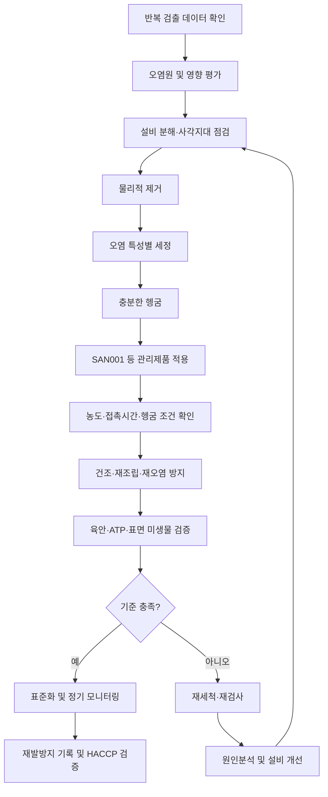

# [QA+ 블로그 생성 결과물] SAN001 바이오필름 예방제거
생성일시: 2026-09-15 06:51:47 (KST)
적용모델: gpt-5.6-terra

================================================================================
# 📋 최종 발행용 블로그 패키지

### 1. 메타 데이터 (SEO 설정)
- **최종 포스팅 제목**: 세척했는데 미생물이 또 나온다면? SAN001 바이오필름 예방·제거 실무 가이드
- **메타 디스크립션 (120자 내외 요약)**: 반복 미생물 검출 시 바이오필름을 의심해야 하는 이유와 SAN001 도입 전 검증, 세정·소독·CIP 관리, HACCP 심사 대응법을 정리했습니다.
- **추천 해시태그 (10개)**: #식품품질관리 #HACCP #식품안전 #바이오필름 #세척소독 #환경모니터링 #CIP관리 #식품공장 #미생물검사 #FSSC22000
- **카테고리**: 식품품질실무 / HACCP가이드 / 위생관리

> **QA 검수 메모**  
> - SAN001의 성분, 법적 제품 분류, 식품 접촉면 적용 가능 여부 및 바이오필름 제거 효능은 제공 원고만으로 확인할 수 없습니다. 본문에서는 제품 라벨, SDS, 제품규격서, 시험성적서 및 공급사 기술자료 확인을 전제로 표현했습니다.  
> - 「식품위생법」, 「식품위생법 시행규칙」, 식품의약품안전처 고시 「식품 및 축산물 안전관리인증기준」의 정확한 적용 조항·최신 개정 여부는 발행 전 국가법령정보센터 및 식품안전나라에서 재확인하는 것을 권장합니다.  
> - “HACCP 심사에서 바로 통과”처럼 결과를 보장하는 표현은 “심사 대응에 활용할 수 있다”로 교정했습니다.

---

## 2. 네이버 블로그 / 티스토리 복사용 최종 원고 (Markdown)

# 세척했는데 미생물이 또 나온다면? SAN001 바이오필름 예방·제거 실무 가이드

> **20년 실무 선배의 한 줄 요약**  
> SAN001을 포함한 바이오필름 관리제품은 단순히 “강한 약품”으로 접근하면 실패하기 쉽습니다. 반복 검출 지점을 데이터로 찾고, **분해·세정 → 제품 적용 → 검증 → 재발방지** 순서로 관리해야 현장과 HACCP 운영체계 모두에서 효과를 확인할 수 있습니다.

---

## 1. 매일 소독하는데 왜 미생물은 다시 나올까요?

“어제 세척·소독했는데 오늘 또 일반세균이 나왔습니다.”

식품공장에서 정말 자주 나오는 이야기입니다. 특히 배수구, 충전노즐, 밸브, 컨베이어 이음부, 냉각기 응축수 주변처럼 축축하거나 분해가 어려운 구역에서 같은 문제가 반복됩니다.

이때 소독제 농도를 올리거나 약품부터 바꾸는 경우가 많습니다. 하지만 원인을 확인하지 않은 약품 교체는 비용만 늘리고 재발은 남기는 경우가 많습니다.

반복 미생물 부적합은 바이오필름을 의심할 수 있는 신호입니다. 다만 ATP가 높거나 일반세균이 검출됐다고 해서 바이오필름으로 단정하면 안 됩니다. 아래 항목도 함께 조사해야 합니다.

- 원료 유입
- 세척도구 오염
- 작업자 접촉
- 용수 문제
- 공조기 결로
- 해충 유입
- 세척 후 재오염
- 설비 구조상 사각지대

바이오필름은 미생물이 설비 표면에 부착한 뒤, 스스로 만든 점액성 보호막 안에서 군집을 이룬 상태를 말합니다. 이 보호막은 EPS(Extracellular Polymeric Substances, 세포외고분자물질)로 불립니다. 쉽게 말하면 미생물이 만든 **끈적한 방어막 또는 갑옷**입니다.

그래서 일반 소독제가 표면에 닿았더라도 실제 미생물까지 충분히 도달하지 못할 수 있습니다.

> **현장 핵심 문장**  
> “소독을 했다”보다 “소독 효과를 증명할 수 있다”가 중요합니다.

SAN001은 이 관리 과정에서 검토할 수 있는 하나의 수단일 수 있습니다. 다만 제품명만으로 모든 식품공장 설비에서 바이오필름 제거 효과가 보장되는 것은 아닙니다. 반드시 제품 라벨, SDS, 사용설명서, 시험성적서, 식품 접촉면 사용 가능 여부를 확인하고 현장 조건에서 검증해야 합니다.


*이미지 설명: 설비 표면의 일반 잔사와 습윤한 틈새에 축적된 오염층을 비교해 관찰하는 장면입니다. 바이오필름 여부는 육안만으로 단정하지 않고, 검사 추이와 현장 조사를 함께 확인해야 합니다.*

---

## 2. 바이오필름은 일반 오염과 무엇이 다를까요?

일반 표면오염은 식품 잔사, 유지, 단백질, 당류, 먼지와 미생물이 표면에 남아 있는 상태입니다. 적절한 세정제, 물리적 마찰, 충분한 헹굼으로 상당 부분 제거할 수 있습니다.

반면 바이오필름은 미생물이 표면에 부착·증식하면서 보호막을 형성한 상태입니다. 단순 분무소독만으로는 제거가 어려울 수 있으며, 특히 다음 구역에서 문제를 일으키기 쉽습니다.

- 표면의 미세한 흠집
- 가스켓 틈
- 나사산
- 용접부
- 배관 저점부
- 밸브 시트
- 데드레그(dead leg)

여기서 반드시 구분해야 할 것은 **세정과 소독의 역할**입니다.

| 구분 | 목적 | 쉽게 이해하면 |
|---|---|---|
| 세정 | 유기물, 유지, 스케일, 잔사 제거 | 미생물의 갑옷을 벗기는 일 |
| 소독 | 세정 후 남아 있는 미생물 저감 | 드러난 미생물에 작용하는 일 |

바이오필름이 생기기 쉬운 대표 구역은 배수구와 트렌치, 충전기 노즐, 탱크 맨홀, 밸브와 O-ring, 컨베이어 벨트 연결부, 냉장실 응축수 발생부, CIP 회수라인과 데드레그입니다.

> 설비 외관이 반짝인다고 해서 내부까지 깨끗하다고 판단하면 안 됩니다.

육안으로 슬라임이나 변색이 보일 때까지 기다리면 늦을 수 있습니다. 같은 위치에서 2~3회 이상 유사한 미생물 패턴이 반복되거나, 세척 직후에는 괜찮다가 생산 중 수치가 다시 올라가는 경우에는 조사를 시작해야 합니다.

ATP 수치가 특정 설비에서 반복 상승하는 것도 단서가 될 수 있습니다. 다만 ATP는 미생물뿐 아니라 식품 잔사에도 반응하므로, ATP 결과 하나만으로 바이오필름 존재를 확정해서는 안 됩니다.

---

## 3. HACCP에서 바이오필름 관리는 왜 선행요건관리(PRP)일까요?

「식품위생법」과 「식품위생법 시행규칙」은 식품 제조·가공 과정에서 시설, 기계·기구, 작업장 등을 청결하고 위생적으로 유지하도록 하는 기본 틀을 제공합니다.

바이오필름이라는 용어 자체가 모든 법령에 직접 규정된 것은 아닙니다. 하지만 바이오필름으로 인해 미생물 오염이 반복된다면 위생적 취급, 시설·기구 관리, 세척·소독 관리가 충분하지 않았다는 문제로 연결될 수 있습니다.

식품의약품안전처 고시 「식품 및 축산물 안전관리인증기준」의 관점에서 이 문제는 주로 선행요건관리(PRP)와 연계됩니다.

- 영업장 관리
- 위생관리
- 세척·소독 관리
- 제조시설·설비 관리
- 용수 관리
- 검사관리
- 교육·훈련
- 기록관리 및 검증

HACCP은 특정 제품을 사용하라고 요구하는 제도가 아닙니다. 우리 공정의 위해요소를 분석하고, 정한 세척·소독 방법이 실제로 유효한지 검증하고 기록하도록 요구하는 관리체계입니다.

ISO 22000:2018, ISO/TS 22002-1 등 식품안전 표준도 같은 방향을 봅니다. 설비 위생설계, 예방정비, 세척·소독 절차, 환경모니터링, 시정조치가 따로 운영되는 것이 아니라 하나의 관리체계로 연결돼야 합니다.

FSSC 22000 인증업체라면 세척·소독제 적합성 검토, 공급사 관리, 지속적 개선 기록까지 검토 대상이 될 수 있습니다.

심사에서 자주 나오는 질문은 다음과 같습니다.

- 왜 SAN001을 선택했습니까?
- 희석농도는 누가, 어떻게 확인합니까?
- 접촉시간은 어떻게 보장합니까?
- 효과가 없을 때 누가 어떤 조치를 합니까?

작업표준서에만 있고 현장에 타이머, 농도확인도구, 기록지가 없다면 실행되지 않는 절차로 판단될 수 있습니다.

> **심사 대응 핵심**  
> 제품의 홍보 문구보다 중요한 것은 “우리 설비, 우리 오염 조건, 우리 사용방법에서 유효함을 어떻게 확인했는가”입니다.

---

## 4. SAN001 도입 전, 제품부터 검증하는 방법

SAN001이 세정제인지, 살균소독제인지, 또는 세정과 미생물 관리 기능을 함께 표방하는 복합제품인지부터 확인해야 합니다.

제품명이나 영업사원의 설명만으로 판단하지 말고 다음 자료를 요청하십시오.

- SDS
- 제품규격서
- 라벨
- 사용설명서
- 공인 또는 신뢰 가능한 시험성적서
- 식품 접촉면 적용 관련 자료
- 재질 적합성 자료

특히 “바이오필름 제거” 표현이 있다면 아래 시험 조건을 확인해야 합니다.

- 시험 균종
- 표면 재질
- 제품 농도
- 접촉시간
- 유기물 존재 조건
- 시험 방법
- 헹굼 조건

식품 접촉 가능 표면에 적용할 제품이라면 사용 가능 여부, 사용 후 헹굼 필요 여부, 헹굼수 조건을 특히 꼼꼼히 확인해야 합니다. “살균소독제”라는 명칭만으로 모든 설비와 사용 방식에 자동 적용되는 것은 아닙니다.

재질 적합성도 중요합니다. SUS 스테인리스에는 문제가 없어도 알루미늄, 동, 아연도금 부위, 고무 패킹, 실리콘, 특정 플라스틱, 코팅면에는 변색·부식·경화·팽윤이 발생할 수 있습니다.

본 적용 전에는 시험편 또는 눈에 띄지 않는 구역에서 소규모 테스트를 실시하고 다음 내용을 남기십시오.

- 적용 전·후 사진
- 표면 상태
- 변색 및 부식 여부
- 패킹 탄성
- 누액 여부
- 설비 기능 이상 여부

화학제품은 SDS 관리도 기본입니다. 보호구, 환기, 보관 온도, 누출 시 조치, 폐기 방법, 혼합 금지 물질을 작업자에게 교육해야 합니다.

> 산성·알칼리성 세정제, 염소계 제품, 과산화물계 제품, 4급암모늄계 제품 등은 임의 혼합 시 유해가스, 발열, 효능 저하 위험이 있습니다.  
> **모르겠으면 섞지 않는 것이 정답입니다.**

| 확인 항목 | 도입 전 반드시 볼 자료·질문 | 현장 판단 포인트 |
|---|---|---|
| 제품 분류 | 세정제, 살균소독제, 복합제품 여부 | 세정과 소독의 역할 구분 |
| 유효성 | 시험 균종, 표면 재질, 유기물 조건, 시험법 | 바이오필름 관련 주장 근거 확인 |
| 사용 조건 | 희석농도, 온도, 접촉시간, 분무·침지·CIP 방식 | 임의 고농도·임의 장시간 적용 금지 |
| 식품 접촉면 | 사용 가능 여부, 헹굼 필요 여부 | 라벨·기술자료 기준 준수 |
| 재질 적합성 | SUS, 고무, 실리콘, 플라스틱, 알루미늄 시험자료 | 패킹 열화·부식·변색 확인 |
| 안전관리 | SDS, PPE, 환기, 혼합금지, 보관법 | 교육 및 비상조치 반영 |
| 기록관리 | 제조번호, 희석기준, 사용일지 양식 | 추적성과 심사 대응 확보 |


### 바이오필름 관리 프로세스



```text
반복 검출
   ↓
오염원 조사·영향평가
   ↓
분해점검 ── 배수구 / 밸브 / 가스켓 / 노즐 / 데드레그
   ↓
물리적 제거
   ↓
세정 ── 헹굼
   ↓
SAN001 등 관리제품 적용
   ↓
농도·접촉시간·재질 적합성 확인
   ↓
건조·조립·재오염 방지
   ↓
ATP·표면 미생물·육안 검증
   ↓
적합 ─────────────── 부적합
  ↓                         ↓
표준화·정기관리       재세척·원인분석·설비개선
```

---

## 5. 바이오필름 관리 실전 절차: 세정 없이 소독부터 하지 마세요

### 1단계. 오염 구역 격리와 영향 평가

반복 검출 지점이 제품과 직접 접촉하는 곳인지, 비접촉 환경표면인지, 생산 중 오염 확산 가능성이 있는지 판단합니다.

필요하면 해당 설비 사용을 일시 중지하고, 직전 생산 제품의 검사 결과와 출고 상태도 검토합니다. 무조건 라인을 세우라는 뜻이 아니라, 위험도에 따라 합리적으로 판단하라는 의미입니다.

### 2단계. 분해점검과 물리적 제거

충전노즐, 밸브, 가스켓, 필터, 배수트랩, 컨베이어 롤러처럼 분해 가능한 부위는 열어봐야 합니다.

“CIP 했으니 괜찮겠지”라는 생각은 위험할 수 있습니다. 브러싱, 전용 패드, 스크래핑 등 물리적 제거가 필요할 수 있지만, 설비 손상과 이물 발생 위험이 있으므로 설비 제조사 기준과 사내 작업표준을 따라야 합니다.

### 3단계. 오염 특성에 맞는 세정과 헹굼

유지가 많은 설비는 유지 제거에 적합한 세정 조건을, 단백질·당류 잔사가 많은 설비는 해당 오염에 적합한 세정 조건을 검토해야 합니다. 무기질 스케일이 문제라면 별도 접근이 필요할 수 있습니다.

세정 후에는 잔류 세정제와 떨어져 나온 오염물을 충분히 헹궈내야 다음 단계 제품이 표면에 제대로 작용할 수 있습니다.

### 4단계. SAN001 등 관리제품 적용

적용 농도, 온도, 접촉시간, 분무량, 적용 방향, 헹굼 여부는 제품 라벨과 기술자료를 기준으로 정합니다.

접촉시간 5분이 필요한 제품을 분사 후 30초 만에 물로 흘려보낸다면, 작업은 했더라도 검증 가능한 소독이라고 보기 어렵습니다.

분무 방식이라면 노즐 뒷면, 볼트부, 벨트 하부 등 사각지대까지 적용됐는지 확인해야 합니다.

### 5단계. 건조·조립·재오염 방지

세척 후 젖은 상태로 장시간 방치하면 미생물이 다시 자라기 쉬운 환경이 됩니다.

세척도구, 장갑, 공구, 작업대가 오염원으로 작용하지 않도록 구역별 색상 구분과 보관 기준을 운영하십시오. 조립 작업자는 깨끗한 설비를 다시 오염시키지 않는 작업을 하고 있다는 인식을 가져야 합니다.

### 6단계. 검증

육안점검, ATP, 표면 미생물 검사, 필요 시 특정 위해미생물 환경모니터링을 조합합니다.

ISO 18593의 표면 샘플링 원칙처럼 같은 지점, 같은 면적, 같은 채취도구, 같은 시점 기준으로 비교해야 유의미한 데이터가 됩니다.

검증 없이 “이 약품이 좋은 것 같다”라고 결론 내리면 다음 심사나 다음 부적합 발생 시 다시 처음부터 설명해야 합니다.

---

## 6. CIP 바이오필름 관리에서 특히 놓치는 포인트

CIP에서 가장 흔한 착각은 “약품이 순환했으니 세척이 됐다”는 생각입니다.

세정액이 설비 내부 모든 표면에 충분히 닿았는지, 필요한 유속과 난류가 형성됐는지, 설정한 온도와 시간이 유지됐는지까지 확인해야 합니다.

CIP 세척은 아래 4가지 요소가 함께 맞아야 합니다.

- 기계력
- 화학력
- 온도
- 시간

특히 아래 구역은 우선점검 대상으로 설정하는 것이 좋습니다.

- 데드레그
- 저점부
- 밸브 시트
- 샘플링 밸브
- 회수라인
- 열교환기 주변

설계상 세정액이 충분히 흐르지 못하는 구간이라면 약품 농도만 올려도 해결되지 않습니다. 필요하면 배관 개조, 배수 개선, 밸브 교체, 분해세척 주기 조정 같은 설비 개선도 검토해야 합니다.

CIP 기록에는 최소한 다음 내용을 남기십시오.

- 세정액 종류
- 농도
- 온도
- 순환시간
- 최종 헹굼 상태
- 이상 발생 여부
- 재순환·재세척 여부

농도는 자동 주입기 설정값만 보지 말고, 사내 기준에 따라 실제 농도를 확인하는 방법을 정해야 합니다. 온도와 시간도 설비 화면 표시값과 기록이 일치하는지 확인해야 합니다.

CIP 후 미생물 부적합이 반복된다면 회수액과 최종 헹굼수도 함께 점검하십시오. 단, 개별 결과 한 번으로 단정하지 말고 수회 추이와 설비 운전조건을 연결해 해석해야 합니다.

---

## 7. SAN001 현장 파일럿 테스트, 이렇게 설계하면 실패가 줄어듭니다

파일럿 테스트 대상은 반복 검출 지점 2~3곳과 정상 관리 지점 1곳을 함께 선정하는 것이 좋습니다.

예를 들어 충전노즐 1곳, 배수구 1곳, 컨베이어 하부 1곳을 시험군으로 정하고, 위생 상태가 안정적인 인접 설비를 비교군으로 둡니다.

비교군이 있어야 계절, 생산량, 작업자 교대, 원료 변화로 인한 결과 변동과 제품 적용 효과를 구분하기 쉽습니다.

적용 전에는 최소 수회 이상의 기초 데이터를 확보하십시오.

- ATP 값
- 일반세균 또는 위생지표균 결과
- 생산 품목
- 생산시간
- 세척 담당자
- 기존 세척방법
- 설비 상태
- 채취 위치와 면적

예를 들어 월·수·금에 세척 직후와 생산 4시간 후를 같은 방식으로 채취하면 재오염 양상을 확인하기 좋습니다.

시험 중에는 희석농도, 접촉시간, 적용방법, 분무량, 작업도구, 채취 위치를 최대한 고정해야 합니다. 희석은 계량컵, 자동 희석기, 시험지 또는 사내 승인된 방법으로 확인하고 기록합니다. 접촉시간은 타이머로 관리하는 것이 가장 명확합니다.

판정 기준도 적용 전에 정해야 합니다.

- 세척 직후 ATP 내부 기준 충족
- 주 1회 표면 미생물 검사에서 연속 4주 적합
- 생산 중 재검출 빈도 감소
- 재질 이상 없음
- 작업자 자극 없음

| 단계 | 점검 항목 | 권장 관리 방법 | 기록 예시 |
|---|---|---|---|
| 사전조사 | 반복 검출 지점 선정 | 검사 이력, 설비 구조, 생산품 분석 | 위치도, 검출이력 |
| 기준선 확보 | 적용 전 위생상태 | 동일 지점·면적·채취법으로 수회 측정 | ATP·스왑 결과 |
| 전처리 | 분해·세정·헹굼 | 유기물·스케일 제거 후 적용 | 세정제, 시간, 이상 여부 |
| 제품 적용 | SAN001 사용조건 준수 | 라벨 기준 농도·접촉시간·헹굼조건 준수 | 제조번호, 희석농도, 작업자 |
| 효과검증 | ATP·미생물·육안점검 | 세척 직후와 생산 중 결과 비교 | 적합/부적합, 결과 추이 |
| 재발방지 | 설비·작업 개선 | 패킹 교체, 분해주기, 배수 개선, 교육 | 시정조치 보고서 |

---

## 8. 현장 사례로 보는 적용 포인트

> 아래 사례는 특정 업체를 식별하지 않은 실무형 사례입니다. 실제 적용 시에는 공정, 제품, 설비 재질, 미생물 결과 및 사용제품의 기술자료에 따라 별도 검증이 필요합니다.

### 사례 1. 냉동만두 제조공장 컨베이어 벨트 이음부 반복 검출

냉동만두 제조공장의 성형 후 이송 컨베이어에서 일반세균이 주 1~2회 반복 검출됐습니다. 매일 폼 세정과 소독을 했고 외관도 깨끗해 보였기 때문에 생산팀은 검사 오차를 먼저 의심했습니다.

하지만 ATP 측정 지점을 벨트 상부뿐 아니라 벨트 이음부, 롤러 하부, 프레임 안쪽까지 확대하자 특정 이음부에서 반복적으로 높은 값이 확인됐습니다.

분해점검 결과 벨트 연결핀 주변에 만두피와 육류 유래 잔사가 미세하게 끼어 있었고, 세척수가 충분히 빠지지 않아 습윤 상태가 지속되고 있었습니다.

개선조치는 다음과 같았습니다.

- 일일 세척 시 이음부 전용 브러시 작업 추가
- 주 1회 롤러 하부 점검 및 분해세척 설정
- 세정과 헹굼 완료 후 관리제품 적용
- 접촉시간 타이머 관리
- 동일 지점 100cm² 기준 ATP 및 표면 미생물 스왑 4주 검증

핵심은 약품 자체보다 **벨트 이음부를 정식 세척 대상으로 포함하고 작업을 표준화한 것**이었습니다.

### 사례 2. 소스류 제조공장 충전노즐·가스켓 부적합

파우치 소스를 생산하는 공장에서 특정 충전라인의 환경검사 결과가 불안정했습니다. 해당 라인은 점도가 높은 고추장 베이스 소스를 생산했고, 생산 종료 후 CIP도 정상 수행하고 있었습니다.

초기에는 충전노즐 외부만 검사했기 때문에 큰 이상이 보이지 않았습니다. 그러나 노즐을 분해해 가스켓과 밸브 시트 내부를 확인하자 미세한 소스 잔사와 변색 부위가 발견됐습니다.

조사 결과 점도가 높은 제품 특성상 노즐 내부에 잔사가 남기 쉬웠고, CIP 조건이 해당 부위에 충분한 기계력을 주지 못할 가능성이 있었습니다. 가스켓 교체 주기도 사용시간이 아닌 고장 발생 기준으로 운영되고 있었습니다.

개선조치는 다음과 같았습니다.

- 충전노즐 가스켓 예방교체 주기 설정
- 품목 전환 시 분해점검 기준 추가
- CIP 후 최종 헹굼수 상태 확인
- 노즐 조립 전 전용 작업대·공구 위생점검
- SAN001 파일럿 시 사용 조건, 헹굼 필요 여부, 가스켓 재질 영향 확인
- 동일 지점 표면 미생물 검사 6주 추이 관리

이후 환경모니터링 지점도 “노즐 외부”에서 “가스켓·밸브 시트 포함”으로 개정했습니다.

### 사례 3. 레토르트 음료 공장 CIP 회수라인 미생물 상승

레토르트 음료 공장에서는 완제품 미생물 문제는 없었지만, 특정 탱크의 CIP 후 환경검사와 ATP 결과가 다른 탱크보다 높게 나왔습니다.

현장에서는 고온 공정을 거치므로 큰 문제가 아니라고 판단했지만, QA팀은 위생관리 취약 신호로 보고 조사했습니다.

배관도와 실제 설비를 대조한 결과 회수라인 일부에 유속이 낮아질 가능성이 있는 구간이 있었고, 밸브 구조상 세정액이 충분히 닿지 않을 수 있다는 의심이 제기됐습니다.

조사 결과 자동 CIP 프로그램의 순환시간은 기준에 맞았지만, 특정 밸브 전환 시점에 회수라인 일부의 세정 효율이 떨어질 가능성이 확인됐습니다. 또한 월 1회 분해점검 주기는 생산량 증가를 반영하지 못하고 있었습니다.

개선조치는 다음과 같았습니다.

- 밸브 전환 시퀀스 수정
- 해당 구간 분해점검 주기를 생산량 기준 2주 1회로 강화
- 관리제품 적용 전 공급사 기술자료 및 설비 재질 적합성 검토
- 제한 구간 파일럿 운영
- ATP, 표면 미생물 검사, 최종 헹굼수 확인 병행

이 사례는 바이오필름 의심 문제를 해결할 때 **설비 구조와 운전조건을 빼놓으면 안 된다**는 점을 보여줍니다.

---

## 9. HACCP 심사에서 바로 나오는 질문과 준비자료

| 심사관 질문 | 현장에서 준비할 답변과 증빙 |
|---|---|
| 세척·소독제 선정 근거는? | 제품규격서, SDS, 라벨, 적용성 검토서, 시험자료 |
| 사용 농도는 어떻게 확인하는가? | 희석표준서, 계량도구, 자동희석기 점검, 작업일지 |
| 접촉시간은 어떻게 보장하는가? | 작업표준서, 타이머, CIP 시간기록 |
| 식품 접촉면에 사용 가능한가? | 용도 확인자료, 헹굼 기준, 제품 라벨 |
| 효과는 어떻게 검증하는가? | ATP, 표면 미생물, 환경모니터링 추이 |
| 반복 부적합 시 조치는? | 일탈보고서, 원인분석서, 재세척·재검사 기록 |
| 사각지대는 어떻게 관리하는가? | 위생설계 점검표, 분해세척 주기, 예방정비 계획 |
| 작업자 교육은 했는가? | 교육자료, 참석자 서명, 이해도 확인 기록 |

ATP는 빠른 일상 위생확인 도구로 유용하지만 식품 잔사에도 반응할 수 있습니다. 따라서 다음처럼 역할을 나눠 운영하는 것이 좋습니다.

- **일상 확인**: 육안점검 + ATP
- **정기 검증**: 표면 미생물 검사
- **고위험 또는 반복 부적합 지점**: 필요 시 특정 위해미생물 환경모니터링
- **반복 부적합 발생 시**: 재세척 → 재검사 → 원인분석 → 제품 영향평가 → 설비 분해점검 → 교육 및 예방정비 → 추적검증

---

## 10. 자주 묻는 질문(FAQ)

### Q1. SAN001은 예방용인가요, 이미 생긴 바이오필름 제거용인가요?

**A. 제품명만으로 판단할 수 없습니다.** 라벨, 기술자료, 시험성적서에서 예방 목적, 일반 살균 목적, 기존 바이오필름 제거 목적 중 무엇을 검증했는지 확인해야 합니다. 기존 바이오필름 제거 효과는 표면 재질, 균종, 농도, 접촉시간, 유기물 존재 여부에 따라 달라질 수 있습니다.

### Q2. 유기물이나 식품 잔사가 남아 있어도 바로 적용하면 되나요?

**A. 원칙적으로 세정 전처리를 먼저 고려해야 합니다.** 유지·단백질·당류 잔사는 제품이 표면과 미생물에 충분히 작용하는 것을 방해할 수 있습니다. 현장에서는 분해·세정·헹굼을 선행한 조건과 그렇지 않은 조건을 파일럿으로 비교해 두는 것이 안전합니다.

### Q3. 더 진하게 사용하면 제거 효과도 더 좋아지지 않나요?

**A. 아닙니다. 권장 농도를 넘기는 것이 정답은 아닙니다.** 설비 부식, 고무·플라스틱 열화, 잔류 부담, 작업자 자극, 비용 증가가 발생할 수 있습니다. 라벨과 기술자료에 제시된 농도 및 접촉시간을 정확히 지키는 것이 중요합니다.

### Q4. ATP 결과만 좋아지면 바이오필름이 제거됐다고 봐도 되나요?

**A. ATP는 좋은 현장 도구이지만 단독 판정 도구는 아닙니다.** ATP는 미생물뿐 아니라 식품 잔사와 다른 유기물에도 반응할 수 있습니다. 같은 지점의 표면 미생물 검사, 육안점검, 반복 검출 이력, 필요 시 특정 미생물 검사를 함께 봐야 합니다.

### Q5. CIP를 매일 하는데 밸브나 가스켓도 분해세척해야 하나요?

**A. 반복 부적합이 있는 설비라면 반드시 검토해야 합니다.** CIP가 모든 내부 표면에 충분한 유속과 접촉조건으로 작용하는지 확인되지 않았다면 밸브 시트, 가스켓, 노즐은 별도 분해점검 대상이 될 수 있습니다. 분해 주기는 달력 기준보다 생산량, 제품 점도, 오염 이력, 설비 구조를 반영해 정하는 것이 실무적입니다.

### Q6. 식품 접촉면에 적용한 뒤 헹굼이 필요한지는 어떻게 정하나요?

**A. 반드시 제품 라벨과 공급사 기술자료의 조건을 따라야 합니다.** 식품 접촉면 사용 가능 여부와 헹굼 필요 여부를 현장 관행으로 정하면 안 됩니다. 헹굼이 필요하다면 헹굼수 관리 기준, 헹굼 시간, 최종 확인 방법까지 작업표준서에 포함하십시오.

---

## 11. 오늘부터 쓰는 바이오필름 관리 체크리스트

반복 검출이 발생하면 최근 1~3개월 검사 데이터를 먼저 펼쳐보십시오.

- 위치
- 날짜
- 생산품
- 작업조
- 세척 담당자
- 설비 상태
- 세척방법
- 생산량
- 온도·습도 등 환경조건

같은 균이 같은 곳에서 나오는지, 특정 제품 생산 후에만 나오는지, 특정 교대조에서만 흔들리는지 확인해야 합니다.

그다음에는 설비를 실제로 열어보십시오. 배관도에는 없지만 현장에는 존재하는 임시호스, 막힌 드레인, 오래된 패킹, 세척이 어려운 브래킷이 원인인 경우가 많습니다.

품질팀만 보지 말고 생산팀, 설비팀, 세척 담당자가 함께 설비를 보는 것이 좋습니다. 각 부서가 보는 지점이 다르기 때문에 원인을 더 빨리 찾을 수 있습니다.

SAN001 적용 여부를 결정했다면 아래 자료를 한 파일로 관리하십시오.

- 제품 적합성 자료
- SDS
- 희석 기준
- 작업자 교육자료
- 파일럿 결과
- ATP·미생물 결과 추이
- 재질 점검 결과
- 일탈 및 시정조치 기록

바이오필름 관리는 한 번의 대청소로 끝나는 업무가 아닙니다. 분해점검 주기, 세척도구 위생관리, 습윤부 건조, 배수 개선, 패킹 교체, 환경모니터링이 함께 돌아가야 재발을 줄일 수 있습니다.

> **최종 3줄 요약**  
> 1. 반복 미생물 검출은 바이오필름 의심 신호이지만, 원료·용수·작업자·설비까지 함께 조사해야 합니다.  
> 2. SAN001은 SDS, 라벨, 사용 조건, 재질 적합성, 식품 접촉면 적용 가능 여부를 확인한 뒤 파일럿으로 검증해야 합니다.  
> 3. 세정 → 헹굼 → 관리제품 적용 → 검증 → 시정조치 기록의 흐름을 표준화하면 HACCP 심사 대응과 현장 위생 안정화에 활용할 수 있습니다.

바이오필름은 눈에 잘 보이지 않지만 반복 미생물 부적합이라는 방식으로 신호를 보냅니다. 오늘은 가장 반복적으로 검출되는 지점 한 곳을 정해 분해점검과 데이터 확인부터 시작해 보십시오.

---

## 3. 워드프레스 / 웹사이트용 HTML 원고

```html
<article class="food-qa-post">
  <header>
    <h1>세척했는데 미생물이 또 나온다면? SAN001 바이오필름 예방·제거 실무 가이드</h1>
    <p><strong>20년 실무 선배의 한 줄 요약:</strong> SAN001을 포함한 바이오필름 관리제품은 단순히 강한 약품으로 접근하면 실패하기 쉽습니다. 반복 검출 지점을 데이터로 찾고, <strong>분해·세정 → 제품 적용 → 검증 → 재발방지</strong> 순서로 관리해야 현장과 HACCP 운영체계에서 효과를 확인할 수 있습니다.</p>
  </header>

  <section>
    <h2>1. 매일 소독하는데 왜 미생물은 다시 나올까요?</h2>
    <p>배수구, 충전노즐, 밸브, 컨베이어 이음부, 냉각기 응축수 주변처럼 축축하거나 분해가 어려운 곳에서 미생물이 반복 검출되는 경우가 있습니다. 이때 소독제 농도를 올리거나 약품부터 바꾸기보다 원인을 먼저 확인해야 합니다.</p>
    <p>반복 미생물 부적합은 바이오필름을 의심할 수 있는 신호입니다. 다만 ATP 상승이나 일반세균 검출만으로 바이오필름이라고 단정해서는 안 됩니다. 원료 유입, 세척도구 오염, 작업자 접촉, 용수, 공조기 결로, 해충, 세척 후 재오염, 설비 사각지대도 함께 조사해야 합니다.</p>
    <p>바이오필름은 미생물이 설비 표면에 부착한 뒤 스스로 만든 점액성 보호막 안에서 군집을 이룬 상태입니다. 이 보호막은 EPS(세포외고분자물질)로 불리며, 미생물이 만든 끈적한 방어막 또는 갑옷으로 이해할 수 있습니다.</p>
    <blockquote><p>“소독을 했다”보다 “소독 효과를 증명할 수 있다”가 중요합니다.</p></blockquote>
    <p>SAN001 적용 여부는 제품 라벨, SDS, 제품규격서, 사용설명서, 시험성적서, 식품 접촉면 사용 가능 여부를 확인한 뒤 현장 조건에서 검증해야 합니다.</p>
    <figure>
      
      <figcaption>설비 표면의 일반 잔사와 습윤한 틈새에 축적된 오염층을 비교해 관찰하는 장면입니다.</figcaption>
    </figure>
  </section>

  <section>
    <h2>2. 바이오필름은 일반 오염과 무엇이 다를까요?</h2>
    <p>일반 표면오염은 식품 잔사, 유지, 단백질, 당류, 먼지와 미생물이 표면에 남아 있는 상태입니다. 적절한 세정제, 물리적 마찰, 충분한 헹굼으로 상당 부분 제거할 수 있습니다.</p>
    <p>반면 바이오필름은 미생물이 표면에 부착·증식하면서 보호막을 형성한 상태입니다. 가스켓 틈, 나사산, 용접부, 배관 저점부, 밸브 시트, 데드레그 등에서는 단순 분무소독만으로 제거가 어려울 수 있습니다.</p>
    <table>
      <thead><tr><th>구분</th><th>목적</th><th>쉽게 이해하면</th></tr></thead>
      <tbody>
        <tr><td>세정</td><td>유기물, 유지, 스케일, 잔사 제거</td><td>미생물의 갑옷을 벗기는 일</td></tr>
        <tr><td>소독</td><td>세정 후 남은 미생물 저감</td><td>드러난 미생물에 작용하는 일</td></tr>
      </tbody>
    </table>
    <p>ATP는 미생물뿐 아니라 식품 잔사에도 반응할 수 있으므로 ATP 결과 하나만으로 바이오필름 존재를 확정해서는 안 됩니다.</p>
  </section>

  <section>
    <h2>3. HACCP에서 바이오필름 관리는 왜 선행요건관리(PRP)일까요?</h2>
    <p>바이오필름이라는 용어가 모든 법령에 직접 규정된 것은 아니지만, 반복되는 미생물 오염은 위생적 취급, 시설·기구 관리, 세척·소독 관리의 미흡과 연결될 수 있습니다.</p>
    <p>식품의약품안전처 고시 「식품 및 축산물 안전관리인증기준」의 관점에서 바이오필름 관리는 영업장 관리, 위생관리, 세척·소독, 제조시설·설비, 용수, 검사, 교육, 기록 및 검증과 연계되는 선행요건관리 항목입니다.</p>
    <p>HACCP은 특정 제품의 사용을 요구하는 제도가 아닙니다. 공정의 위해요소를 분석하고, 세척·소독 방법이 실제로 유효한지 검증하고 기록하도록 하는 관리체계입니다.</p>
    <blockquote><p>제품의 홍보 문구보다 중요한 것은 “우리 설비, 우리 오염 조건, 우리 사용방법에서 유효함을 어떻게 확인했는가”입니다.</p></blockquote>
  </section>

  <section>
    <h2>4. SAN001 도입 전, 제품부터 검증하는 방법</h2>
    <p>SAN001이 세정제인지, 살균소독제인지, 또는 복합제품인지부터 확인해야 합니다. 제품명이나 영업사원 설명만으로 판단하지 말고 SDS, 제품규격서, 라벨, 사용설명서, 시험성적서, 식품 접촉면 적용자료, 재질 적합성 자료를 확인하십시오.</p>
    <table>
      <thead><tr><th>확인 항목</th><th>도입 전 반드시 볼 자료·질문</th><th>현장 판단 포인트</th></tr></thead>
      <tbody>
        <tr><td>제품 분류</td><td>세정제, 살균소독제, 복합제품 여부</td><td>세정과 소독의 역할 구분</td></tr>
        <tr><td>유효성</td><td>시험 균종, 표면 재질, 유기물 조건, 시험법</td><td>바이오필름 관련 주장 근거 확인</td></tr>
        <tr><td>사용 조건</td><td>희석농도, 온도, 접촉시간, 적용 방식</td><td>임의 고농도·장시간 적용 금지</td></tr>
        <tr><td>식품 접촉면</td><td>사용 가능 여부, 헹굼 필요 여부</td><td>라벨·기술자료 기준 준수</td></tr>
        <tr><td>재질 적합성</td><td>SUS, 고무, 실리콘, 플라스틱 등 시험자료</td><td>패킹 열화·부식·변색 확인</td></tr>
        <tr><td>안전관리</td><td>SDS, PPE, 환기, 혼합금지, 보관법</td><td>교육 및 비상조치 반영</td></tr>
      </tbody>
    </table>
    <p>산성·알칼리성 세정제, 염소계, 과산화물계, 4급암모늄계 제품 등은 임의 혼합 시 유해가스, 발열, 효능 저하 위험이 있을 수 있습니다. 모르겠으면 섞지 않는 것이 원칙입니다.</p>
    <figure>
      
      <figcaption>설비 분해점검, 세정, 관리제품 적용, 검증을 수행하는 식품공장 위생관리 현장입니다.</figcaption>
    </figure>
  </section>

  <section>
    <h2>5. 바이오필름 관리 실전 절차</h2>
    <ol>
      <li><strong>오염 구역 격리와 영향 평가:</strong> 제품 접촉면 여부, 확산 가능성, 직전 생산제품 영향 등을 위험도에 따라 평가합니다.</li>
      <li><strong>분해점검과 물리적 제거:</strong> 충전노즐, 밸브, 가스켓, 필터, 배수트랩, 컨베이어 롤러 등 분해 가능한 부위를 확인합니다.</li>
      <li><strong>오염 특성에 맞는 세정과 헹굼:</strong> 유지, 단백질, 당류, 무기질 스케일 등 오염 특성에 맞는 세정 조건을 검토합니다.</li>
      <li><strong>SAN001 등 관리제품 적용:</strong> 라벨과 기술자료 기준의 농도, 온도, 접촉시간, 적용방법, 헹굼 여부를 준수합니다.</li>
      <li><strong>건조·조립·재오염 방지:</strong> 세척도구, 장갑, 공구, 작업대의 위생과 구역별 보관 기준을 관리합니다.</li>
      <li><strong>검증:</strong> 육안점검, ATP, 표면 미생물 검사, 필요 시 특정 위해미생물 환경모니터링을 조합합니다.</li>
    </ol>
  </section>

  <section>
    <h2>6. CIP 바이오필름 관리에서 특히 놓치는 포인트</h2>
    <p>CIP에서 약품이 순환했다는 사실만으로 세척 효과를 보장할 수는 없습니다. 세정액이 모든 표면에 충분히 닿았는지, 필요한 유속과 난류가 형성됐는지, 설정 온도와 시간이 유지됐는지 확인해야 합니다.</p>
    <ul>
      <li>우선점검 구역: 데드레그, 저점부, 밸브 시트, 샘플링 밸브, 회수라인, 열교환기 주변</li>
      <li>기록 항목: 세정액 종류, 농도, 온도, 순환시간, 최종 헹굼 상태, 이상 여부</li>
      <li>반복 부적합 시: 회수액과 최종 헹굼수 확인, 분해점검, 배관·밸브·배수 개선 검토</li>
    </ul>
  </section>

  <section>
    <h2>7. SAN001 현장 파일럿 테스트 설계</h2>
    <p>반복 검출 지점 2~3곳과 정상 관리 지점 1곳을 비교군으로 선정합니다. 적용 전에는 ATP, 일반세균 또는 위생지표균, 생산품, 생산시간, 세척 담당자, 기존 세척방법을 포함한 기초 데이터를 최소 수회 확보합니다.</p>
    <table>
      <thead><tr><th>단계</th><th>점검 항목</th><th>권장 관리 방법</th><th>기록 예시</th></tr></thead>
      <tbody>
        <tr><td>사전조사</td><td>반복 검출 지점 선정</td><td>검사 이력, 설비 구조, 생산품 분석</td><td>위치도, 검출이력</td></tr>
        <tr><td>기준선 확보</td><td>적용 전 위생상태</td><td>동일 지점·면적·채취법으로 수회 측정</td><td>ATP·스왑 결과</td></tr>
        <tr><td>전처리</td><td>분해·세정·헹굼</td><td>유기물·스케일 제거 후 적용</td><td>세정제, 시간, 이상 여부</td></tr>
        <tr><td>제품 적용</td><td>SAN001 사용조건 준수</td><td>라벨 기준 농도·접촉시간·헹굼조건 준수</td><td>제조번호, 희석농도, 작업자</td></tr>
        <tr><td>효과검증</td><td>ATP·미생물·육안점검</td><td>세척 직후와 생산 중 결과 비교</td><td>적합/부적합, 결과 추이</td></tr>
        <tr><td>재발방지</td><td>설비·작업 개선</td><td>패킹 교체, 분해주기, 배수 개선, 교육</td><td>시정조치 보고서</td></tr>
      </tbody>
    </table>
  </section>

  <section>
    <h2>8. 현장 사례로 보는 적용 포인트</h2>
    <h3>사례 1. 냉동만두 제조공장 컨베이어 벨트 이음부 반복 검출</h3>
    <p>벨트 상부뿐 아니라 이음부, 롤러 하부, 프레임 안쪽까지 ATP 측정 지점을 확대한 결과 특정 이음부에서 반복적으로 높은 값이 확인됐습니다. 분해점검 결과 연결핀 주변 잔사와 배수 불량으로 인한 습윤 상태가 확인됐습니다. 이음부 전용 브러시 작업, 주 1회 롤러 하부 분해세척, 접촉시간 타이머 관리, 100cm² 기준 ATP·표면 미생물 4주 검증으로 관리방법을 표준화했습니다.</p>

    <h3>사례 2. 소스류 제조공장 충전노즐·가스켓 부적합</h3>
    <p>점도가 높은 소스 생산라인에서 충전노즐 외부 검사만으로는 이상을 확인하지 못했으나, 가스켓과 밸브 시트 내부 분해점검에서 미세한 소스 잔사와 변색이 발견됐습니다. 가스켓 예방교체 주기, 품목 전환 시 분해점검, 최종 헹굼수 확인, 전용 작업대와 공구 위생점검을 도입했습니다. 관리제품은 사용 조건, 헹굼 필요 여부, 가스켓 재질 영향을 파일럿으로 확인했습니다.</p>

    <h3>사례 3. 레토르트 음료 공장 CIP 회수라인 미생물 상승</h3>
    <p>특정 탱크의 CIP 후 결과가 불안정해 배관도와 실제 설비를 대조한 결과, 회수라인 일부의 저유속 구간과 밸브 전환 조건을 확인했습니다. 밸브 전환 시퀀스 수정, 생산량 기준 2주 1회 분해점검, ATP·표면 미생물·최종 헹굼수 병행 확인을 통해 설비 구조와 운전조건을 함께 관리했습니다.</p>
  </section>

  <section>
    <h2>9. HACCP 심사 질문과 준비자료</h2>
    <table>
      <thead><tr><th>심사관 질문</th><th>현장에서 준비할 답변과 증빙</th></tr></thead>
      <tbody>
        <tr><td>세척·소독제 선정 근거는?</td><td>제품규격서, SDS, 라벨, 적용성 검토서, 시험자료</td></tr>
        <tr><td>사용 농도는 어떻게 확인하는가?</td><td>희석표준서, 계량도구, 자동희석기 점검, 작업일지</td></tr>
        <tr><td>접촉시간은 어떻게 보장하는가?</td><td>작업표준서, 타이머, CIP 시간기록</td></tr>
        <tr><td>식품 접촉면에 사용 가능한가?</td><td>용도 확인자료, 헹굼 기준, 제품 라벨</td></tr>
        <tr><td>효과는 어떻게 검증하는가?</td><td>ATP, 표면 미생물, 환경모니터링 추이</td></tr>
        <tr><td>반복 부적합 시 조치는?</td><td>일탈보고서, 원인분석서, 재세척·재검사 기록</td></tr>
      </tbody>
    </table>
  </section>

  <section>
    <h2>10. 자주 묻는 질문(FAQ)</h2>
    <h3>Q1. SAN001은 예방용인가요, 이미 생긴 바이오필름 제거용인가요?</h3>
    <p><strong>A.</strong> 제품명만으로 판단할 수 없습니다. 라벨, 기술자료, 시험성적서에서 예방, 일반 살균, 기존 바이오필름 제거 중 무엇을 검증했는지 확인해야 합니다.</p>

    <h3>Q2. 유기물이나 식품 잔사가 남아 있어도 바로 적용하면 되나요?</h3>
    <p><strong>A.</strong> 원칙적으로 분해·세정·헹굼 등 전처리를 먼저 고려해야 합니다. 유기물은 제품의 표면 작용을 방해할 수 있습니다.</p>

    <h3>Q3. 더 진하게 사용하면 제거 효과도 더 좋아지지 않나요?</h3>
    <p><strong>A.</strong> 아닙니다. 권장 농도 초과는 설비 부식, 재질 열화, 잔류 부담, 작업자 자극, 비용 증가를 유발할 수 있습니다.</p>

    <h3>Q4. ATP 결과만 좋아지면 바이오필름이 제거됐다고 봐도 되나요?</h3>
    <p><strong>A.</strong> ATP는 단독 판정 도구가 아닙니다. 표면 미생물 검사, 육안점검, 반복 검출 이력, 필요 시 특정 미생물 검사를 함께 확인해야 합니다.</p>

    <h3>Q5. CIP를 매일 하는데 밸브나 가스켓도 분해세척해야 하나요?</h3>
    <p><strong>A.</strong> 반복 부적합이 있다면 검토해야 합니다. CIP가 모든 내부 표면에 충분한 유속과 접촉조건으로 작용하는지 확인되지 않았다면 밸브 시트, 가스켓, 노즐은 별도 점검 대상이 될 수 있습니다.</p>

    <h3>Q6. 식품 접촉면 적용 후 헹굼 필요 여부는 어떻게 정하나요?</h3>
    <p><strong>A.</strong> 반드시 제품 라벨과 공급사 기술자료 조건을 따라야 합니다. 헹굼이 필요하다면 헹굼수 관리 기준, 시간, 최종 확인방법까지 작업표준서에 포함해야 합니다.</p>
  </section>

  <section>
    <h2>11. 오늘부터 쓰는 바이오필름 관리 체크리스트</h2>
    <ul>
      <li>최근 1~3개월 검사 데이터를 위치, 날짜, 생산품, 작업조, 세척 담당자, 설비 상태와 함께 분석한다.</li>
      <li>같은 균이 같은 곳에서 나오는지, 특정 제품 또는 교대조와 연관되는지 확인한다.</li>
      <li>배관도와 실제 설비를 비교하고, 임시호스, 막힌 드레인, 오래된 패킹, 세척 어려운 브래킷을 확인한다.</li>
      <li>품질팀, 생산팀, 설비팀, 세척 담당자가 함께 분해점검을 수행한다.</li>
      <li>제품 적합성 자료, SDS, 희석 기준, 교육자료, 파일럿 결과, ATP·미생물 추이, 재질 점검 결과를 통합 관리한다.</li>
      <li>분해점검 주기, 세척도구 위생관리, 습윤부 건조, 배수 개선, 패킹 교체, 환경모니터링을 함께 운영한다.</li>
    </ul>

    <blockquote>
      <p><strong>최종 3줄 요약</strong><br>
      1. 반복 미생물 검출은 바이오필름 의심 신호이지만 원료·용수·작업자·설비까지 함께 조사해야 합니다.<br>
      2. SAN001은 SDS, 라벨, 사용 조건, 재질 적합성, 식품 접촉면 적용 가능 여부를 확인한 뒤 파일럿으로 검증해야 합니다.<br>
      3. 세정 → 헹굼 → 관리제품 적용 → 검증 → 시정조치 기록을 표준화하면 HACCP 심사 대응과 위생 안정화에 활용할 수 있습니다.</p>
    </blockquote>

    <p>바이오필름은 눈에 잘 보이지 않지만 반복 미생물 부적합이라는 방식으로 신호를 보냅니다. 가장 반복적으로 검출되는 지점 한 곳을 정해 데이터 확인과 분해점검부터 시작해 보십시오.</p>
  </section>
</article>
```
================================================================================

[부록: 1단계 리서치 원본]
# [리서치 리포트] SAN001 바이오필름 예방·제거

> **리서치 전제**  
> ‘SAN001’은 제품명 또는 사내 관리코드로 보이며, 본 리포트에서는 **특정 제품의 성분·살균력·바이오필름 제거 효능을 단정하지 않습니다.**  
> 실제 원고 작성 전에는 반드시 해당 제품의 **SDS(물질안전보건자료), 제품 라벨/사용설명서, 시험성적서, 식품용 기구등의 살균소독제 관련 신고·허가 또는 적합성 자료**를 확인해야 합니다.  
> 특히 “바이오필름 제거”는 일반적인 “살균”과 다른 주장으로, 표면·균종·농도·접촉시간·유기물 조건을 포함한 검증 자료가 필요합니다.

---

### 1. 타겟 독자 및 검색 의도

- **주요 타겟**
  - 식품제조·가공업체의 품질관리(QC), 품질보증(QA), HACCP 담당자
  - 세척·소독(CIP/COP) 관리 책임자 및 생산팀장
  - 미생물 부적합, 환경모니터링 양성, 반복 오염 문제를 해결해야 하는 공장 관리자
  - HACCP 정기심사·사후심사에서 위생관리 개선을 준비하는 실무자

- **독자의 핵심 고통(Pain Point)**
  - 세척과 소독을 매일 하는데도 특정 배수구, 컨베이어 틈새, 충전기 노즐, 탱크 밸브 등에서 미생물이 반복 검출된다.
  - 일반 소독제를 사용했지만 ATP, 일반세균, 대장균군 또는 특정 위해미생물 환경검사 결과가 안정화되지 않는다.
  - SAN001을 도입하려 하지만 “어떤 설비에, 어떤 순서로, 얼마나 자주, 어떤 기준으로 효과를 확인해야 하는지”가 불분명하다.
  - 심사 시 “세척·소독제의 선정 근거는 무엇인가?”, “농도와 접촉시간은 어떻게 관리하는가?”, “바이오필름 제거 효과를 어떻게 검증했는가?”라는 질문에 답하기 어렵다.
  - 제품 공급사의 홍보자료와 실제 식품공장 적용 조건 사이에 차이가 있어, 과장 없이 내부 검증을 설계해야 한다.

- **검색 의도(Search Intent)**
  1. **정보 탐색형**: 바이오필름이 무엇이며 일반 세균오염과 무엇이 다른지 알고 싶다.
  2. **문제 해결형**: 반복 미생물 부적합의 원인이 바이오필름인지 판단하고 제거 절차를 찾고 싶다.
  3. **제품 검증형**: SAN001의 적용 범위, 희석농도, 접촉시간, 재질 적합성, 헹굼 필요 여부를 확인하고 싶다.
  4. **심사 대응형**: HACCP 선행요건관리에서 세척·소독 검증자료와 기록을 어떻게 갖춰야 하는지 알고 싶다.
  5. **구매 의사결정형**: 기존 세정제·소독제와 비교해 도입 전 현장 테스트를 어떻게 해야 하는지 알고 싶다.

- **메인 키워드**
  - `SAN001 바이오필름 예방제거`

- **서브/연관 키워드**
  - `식품공장 바이오필름 제거`
  - `HACCP 세척 소독 관리`
  - `CIP 바이오필름`
  - `식품용 기구등 살균소독제`
  - `미생물 반복 부적합 원인`
  - `ATP 측정 세척 검증`
  - `환경모니터링 바이오필름`

- **독자가 실제로 궁금해할 핵심 질문**
  1. 바이오필름은 단순히 “때가 낀 것” 또는 “세균이 많은 것”과 어떻게 다른가?
  2. 일반 소독만으로 바이오필름이 제거되지 않는 이유는 무엇인가?
  3. SAN001은 예방용인가, 이미 형성된 바이오필름 제거용인가, 또는 둘 다인가?
  4. 사용 전 반드시 세척을 해야 하는가? 유기물 제거 없이 바로 사용해도 되는가?
  5. 농도·온도·접촉시간·분사량·헹굼 여부는 어떤 근거로 정해야 하는가?
  6. 스테인리스, 고무 패킹, 플라스틱 컨베이어, 알루미늄 등 설비 재질에 문제는 없는가?
  7. 효과는 ATP만으로 확인해도 되는가? 미생물 스왑검사도 해야 하는가?
  8. HACCP 심사 시 어떤 기록과 검증자료를 준비해야 하는가?

---

### 2. 필수 인용 법령 및 표준 기준

## 2-1. 법적·공식 기준

### ① 「식품위생법」
- 식품 제조·가공 과정에서 위생적으로 식품을 취급하고, 위해를 방지해야 한다는 기본 법적 근거로 활용합니다.
- 바이오필름 자체가 별도의 법정 용어로 직접 규정되어 있지 않더라도, 바이오필름으로 인한 미생물 오염은 결과적으로 **비위생적 취급, 시설·기구 관리 미흡, 위해요소 관리 미흡**과 연결될 수 있습니다.
- 원고에서는 “바이오필름 제거”를 단순한 청소 문제가 아니라 **식품 안전관리 및 위생적 제조환경 유지의 문제**로 설명하는 것이 적절합니다.

### ② 「식품위생법 시행규칙」의 식품제조·가공업 시설기준 및 영업자 준수사항
- 제조시설, 기계·기구, 작업장, 세척시설 등을 청결하게 유지하고 위생적으로 관리해야 하는 원칙과 연결됩니다.
- 특히 설비의 틈, 배관, 밸브, 고무 패킹, 배수구 등은 세척 사각지대가 되기 쉬우므로, “청결 유지”를 시각적 청소 수준이 아닌 **검증 가능한 위생관리**로 확장해 설명할 필요가 있습니다.

### ③ 식품의약품안전처 고시 「식품 및 축산물 안전관리인증기준」
- HACCP 적용업소의 선행요건관리 및 HACCP 관리체계 운영의 핵심 근거입니다.
- 바이오필름 관리와 직접 연계되는 실무 영역은 다음과 같습니다.
  - 영업장 관리
  - 위생관리
  - 세척·소독 관리
  - 제조시설·설비 및 기구 관리
  - 용수 관리
  - 보관·운송 관리
  - 검사관리
  - 교육·훈련
  - 기록관리 및 검증
- 블로그에서 강조할 핵심은 다음입니다.  
  **“HACCP은 특정 약품을 쓰라고 요구하는 제도가 아니라, 자사 공정의 위해요소를 분석하고 세척·소독 방법의 유효성을 검증·기록하도록 요구하는 관리체계다.”**

### ④ 식품의약품안전처 「식품용 기구등의 살균소독제」 관련 기준 확인
- SAN001이 식품과 접촉할 수 있는 기구·용기·포장 또는 식품제조설비에 사용되는 제품이라면, 제품의 용도와 관련 법적 적합성을 확인해야 합니다.
- 확인 항목:
  - 식품용 기구등의 살균소독제 해당 여부
  - 제품의 표시사항 및 사용방법
  - 식품 접촉 가능 표면 사용 가능 여부
  - 사용 후 음용수 등으로 헹굼이 필요한지 여부
  - 식품에 직접 사용 가능한 제품인지, 시설·설비 표면 전용인지 여부
  - 희석농도, 접촉시간, 적용 대상 재질
- **주의 문구**:  
  “살균소독제”라는 명칭만으로 모든 식품제조설비와 모든 사용 조건에서 안전성·유효성이 자동 보장되는 것은 아닙니다. 제품 라벨 및 공급사 기술자료의 적용 조건을 준수해야 합니다.

### ⑤ 「화학물질관리법」 및 산업안전보건 관련 SDS 관리
- SAN001이 화학제품인 경우, 취급자는 SDS를 통해 다음 사항을 관리해야 합니다.
  - 유해·위험성
  - 보호구
  - 보관 조건
  - 혼합 금지 물질
  - 누출 및 응급조치
  - 폐기 방법
  - 금속 부식성 또는 재질 영향
- 특히 산성·알칼리성 세정제, 염소계 소독제, 과산화물계 제품, 4급암모늄계 제품 등은 서로 임의 혼합 시 위험하거나 효능이 저하될 수 있으므로, **“기존 약품과 혼합 금지 여부”**를 현장 교육 항목으로 포함해야 합니다.

---

## 2-2. 국제 표준 및 참고할 만한 관리 기준

### ① ISO 22000:2018
- 식품안전경영시스템의 선행요건프로그램(PRP), 위해요소 관리, 모니터링, 검증 및 개선 체계와 연결됩니다.
- 바이오필름 예방·제거 활동은 다음 관점에서 설명할 수 있습니다.
  - 적절한 세척·소독 절차 수립
  - 설비 위생설계 및 유지보수
  - 환경모니터링
  - 세척·소독 효과 검증
  - 부적합 발생 시 원인분석 및 시정조치

### ② ISO/TS 22002-1 또는 해당 업종 PRP 표준
- 식품제조 분야의 선행요건프로그램으로서 건물·작업장, 설비, 세척 및 소독, 해충관리, 인적위생, 폐기물, 제품 회수 등 위생 기반관리를 다룹니다.
- 블로그에서는 “바이오필름은 소독제 하나로 해결하는 문제가 아니라, **위생설계·세척·소독·분해점검·환경모니터링을 묶어서 관리해야 하는 PRP 문제**”라는 메시지를 전달하는 데 유용합니다.

### ③ FSSC 22000 Version 6
- FSSC 22000 인증 운영업체라면 ISO 22000 및 관련 PRP 기술규격 외에 추가요구사항도 함께 관리해야 합니다.
- 바이오필름 이슈는 특히 다음 관리 주제와 연계됩니다.
  - 설비 관리 및 유지보수
  - 구매 자재 및 서비스 관리
  - 식품안전 및 품질문화
  - 품질관리
  - 시정조치 및 지속적 개선
- 다만 FSSC 22000이 특정 “바이오필름 제거제” 사용을 요구하는 것은 아니므로, 특정 제품의 도입이 아니라 **위생관리 유효성 입증**에 초점을 둬야 합니다.

### ④ ISO 18593
- 식품 사슬 환경에서 표면 샘플링을 수행하는 방법에 관한 국제표준입니다.
- 스왑, 스펀지, 접촉배지 등의 표면 미생물 채취 방법을 설정할 때 참고할 수 있습니다.
- SAN001 적용 전후 효과검증 시 단순 육안판정이 아닌, **동일 지점·동일 면적·동일 채취 방법·동일 시점 비교**가 중요하다는 근거로 활용하기 좋습니다.

---

## 2-3. 현장 실무 팩트: 바이오필름 이해

### 바이오필름이란?
- 미생물이 스테인리스, 플라스틱, 고무, 유리, 배관 내부 등 표면에 부착한 뒤, 자신이 만든 고분자성 보호막(EPS, Extracellular Polymeric Substances) 안에서 군집을 형성한 상태를 말합니다.
- 이 보호막은 미생물이 표면에 더 단단히 붙도록 만들고, 세정제·소독제가 미생물에 도달하는 것을 방해할 수 있습니다.
- 따라서 바이오필름이 형성되면 일반적인 표면오염보다 세척과 소독이 어려워질 수 있습니다.

### 바이오필름이 잘 생기는 대표 지점
- 배수구, 트렌치, 배관 저점부
- 충전노즐, 밸브, 가스켓, O-ring, 나사부
- 탱크 맨홀 주변 및 교반기 축
- 컨베이어 벨트 이음부와 롤러
- 세척수가 고이거나 완전히 건조되지 않는 구역
- 냉장·냉동실 응축수 발생 지점
- 손이 닿기 어렵고 분해세척이 잘 이뤄지지 않는 설비 틈새
- CIP 회수라인, 데드레그(dead leg), 유속이 충분하지 않은 배관 구간

### 바이오필름을 의심해야 하는 신호
- 같은 장소에서 일반세균 또는 위생지표균이 반복적으로 검출된다.
- 세척 직후에는 괜찮아 보이지만, 생산 중 또는 생산 후 미생물 수치가 다시 상승한다.
- ATP 수치가 특정 설비·구역에서 반복적으로 높게 나온다.
- 설비를 분해했을 때 슬라임, 끈적임, 변색, 침전물, 악취 등이 관찰된다.
- CIP를 수행했음에도 특정 제품군 또는 특정 생산라인에서만 미생물 부적합이 반복된다.
- 환경모니터링에서 동일 균 또는 유사 패턴의 균이 지속 검출된다.

> 단, ATP 수치 상승이나 미생물 양성만으로 바이오필름을 단정할 수는 없습니다.  
> 원료 유입, 작업자 접촉, 세척 불량, 교차오염, 용수 문제, 공조 문제 등 다른 원인과 함께 조사해야 합니다.

---

## 2-4. SAN001 도입 전 반드시 확인할 제품 검증 항목

| 확인 항목 | 실무 확인 내용 |
|---|---|
| 제품 분류 | 세정제인지, 살균소독제인지, 복합 기능 제품인지 |
| 유효성분 | SDS·제품규격서 기준 유효성분, pH, 사용 농도 |
| 적용 목적 | 예방용인지, 기존 바이오필름 제거용인지, 일반 살균용인지 |
| 적용 균종 | 일반세균, 효모·곰팡이, 리스테리아 등 대상 미생물별 시험자료 존재 여부 |
| 시험 조건 | 표면 재질, 유기물 존재 여부, 농도, 온도, 접촉시간, 시험법 |
| 사용 방법 | 분무, 침지, 포말, CIP 순환, 수동 닦기 등 |
| 전처리 필요성 | 유기물·유지·스케일 제거를 위한 사전 세정 필요 여부 |
| 헹굼 조건 | 식품 접촉면 사용 후 헹굼 필요 여부 및 헹굼수 기준 |
| 재질 적합성 | SUS, 알루미늄, 동, 고무, 실리콘, 플라스틱, 코팅면 영향 |
| 안전성 | PPE, 환기, 혼합금지, 보관·누출 대응 |
| 검증자료 | 공인시험성적서, 현장 적용성 평가, 고객사 레퍼런스의 적용 조건 |
| 기록 양식 | 제조번호, 희석농도, 사용일시, 작업자, 접촉시간, 검증결과 |

---

### 3. 추천 블로그 목차 (Outline)

## H1 (제목 후보 3개)

1. **SAN001로 바이오필름을 관리하려면? 식품공장 HACCP 담당자가 먼저 확인할 7가지**
2. **세척했는데 미생물이 또 나온다면: SAN001 바이오필름 예방·제거 실무 가이드**
3. **식품공장 바이오필름 관리, 약품보다 중요한 것은 검증입니다｜SAN001 적용 체크리스트**

---

## H2 서론 (Intro): “매일 소독하는데 왜 미생물은 다시 나올까?”

### 도입 문제 제기
- “세척·소독은 매일 했는데, 왜 배수구와 충전기 주변에서 미생물이 반복 검출될까요?”
- “약품을 더 강하게 쓰면 해결될까요?”
- “SAN001을 도입하면 정말 바이오필름 문제를 해결할 수 있을까요?”

### 서론에서 먼저 제시할 핵심 결론
- 반복 미생물 부적합은 바이오필름 가능성을 의심할 신호지만, 검사 결과만으로 단정해서는 안 됩니다.
- 바이오필름 관리는 제품 하나를 바꾸는 업무가 아니라 다음 4단계로 접근해야 합니다.

> **① 오염원과 취약지점 확인 → ② 물리적·화학적 세정 → ③ 소독 또는 바이오필름 관리제 적용 → ④ 현장 검증 및 재발방지**

- SAN001은 이 과정에서 사용할 수 있는 하나의 관리 수단일 수 있으나, 실제 도입 전에는 제품의 법적 적합성, 사용 조건, 설비 재질 적합성, 현장 효과를 검증해야 합니다.

### 서론에 넣을 공감 문장
- “현장에서는 ‘소독을 했다’보다 ‘소독 효과를 증명할 수 있다’가 더 중요합니다.”
- “심사관은 제품 이름보다, 왜 이 제품을 선택했고 어떻게 효과를 확인했는지를 봅니다.”

---

## H2 본론 1: 바이오필름의 정체와 HACCP에서 관리해야 하는 이유

### H3-1. 바이오필름은 일반적인 표면오염과 무엇이 다른가?
- 미생물이 표면에 부착하고 보호막을 형성하는 과정 설명
- 일반 세척만으로는 제거가 어려울 수 있는 이유
- “살균”과 “세정·제거”를 구분해야 하는 이유

### H3-2. 식품공장에서 바이오필름이 잘 생기는 6개 구역
- 배수구 및 바닥 경계면
- 배관·밸브·가스켓·데드레그
- 충전기와 노즐
- 컨베이어와 벨트 연결부
- 냉각·냉장 설비의 응축수 구역
- CIP 사각지대 및 분해세척 미흡 구역

### H3-3. HACCP 관점에서 본 바이오필름 관리
- 바이오필름 관리가 CCP보다 선행요건관리(PRP)와 밀접한 이유
- 세척·소독 절차서, 작업표준서, 검증기록의 중요성
- 반복 검출 시 일탈처리와 시정조치가 필요한 이유

### H3-4. “바이오필름 의심”과 “바이오필름 확정”은 다르다
- 반복 미생물 검출은 조사 시작 신호
- 원료, 작업자, 용수, 공조, 세척도구, 해충, 교차오염 등도 병행 점검
- 원인분석 없이 약품만 교체하는 방식의 한계

---

## H2 본론 2: SAN001 적용 전·후 실전 가이드 — 제품보다 절차가 먼저입니다

### H3-1. SAN001 도입 전, 제품 자료부터 확인하는 법
- SDS, 제품규격서, 사용설명서, 시험성적서 요청
- 식품 접촉면 적용 가능 여부 확인
- 희석농도·접촉시간·온도·헹굼 여부 확인
- 적용 가능한 재질과 사용 금지 재질 확인
- 기존 사용 약품과의 혼합 금지 여부 확인

> **실무 팁**  
> 공급사에 “바이오필름 제거가 된다”는 설명만 듣지 말고,  
> **어떤 균종, 어떤 표면, 어떤 농도, 어떤 접촉시간, 유기물 존재 조건에서 시험했는지**를 요청해야 합니다.

### H3-2. 바이오필름 관리의 기본 순서: 세정 없이 소독부터 하지 마세요
권장 흐름을 단계별로 제시합니다.

1. **오염 구역 격리 및 생산 영향 평가**
   - 해당 설비·구역의 사용 중지 여부 판단
   - 제품 노출 가능성 확인
   - 필요 시 추가 환경검사 계획 수립

2. **분해점검 및 물리적 제거**
   - 가스켓, 노즐, 밸브, 필터, 배수트랩 등 분해 가능한 부위 점검
   - 브러싱·스크래핑 등 물리적 제거 필요성 검토
   - 단, 설비 손상 및 이물 발생 위험을 고려해 작업표준 준수

3. **세정 단계**
   - 유지, 단백질, 당류, 무기질 스케일 등 오염 유형에 맞는 세정
   - 세정제는 오염물 제거를 위한 것이며, 소독제와 역할이 다름을 설명
   - 세정 후 충분한 헹굼 여부 확인

4. **SAN001 등 관리제품 적용**
   - 제품 라벨 및 제조사 권장 조건에 따라 적용
   - 임의 고농도 사용 금지
   - 접촉시간을 확보하고, 분무 사각지대가 없도록 관리
   - 식품 접촉면의 경우 헹굼 조건을 엄격히 준수

5. **건조·조립·재오염 방지**
   - 습윤 상태 방치 최소화
   - 세척도구 자체의 위생상태 확인
   - 조립 시 장갑, 공구, 작업대 교차오염 관리

6. **효과 검증**
   - ATP, 표면 미생물 검사, 육안점검, 필요 시 특정 미생물 검사
   - 적용 전후 결과를 동일 조건에서 비교

### H3-3. CIP 라인에서 놓치기 쉬운 포인트
- 단순히 약품 농도만 확인하지 말 것
- 다음 요소를 함께 점검할 것:
  - 유속 및 난류 형성 여부
  - 세정액 온도
  - 순환 시간
  - 농도
  - 배관 데드레그
  - 밸브·가스켓의 분해세척 주기
  - 회수액 오염 상태
  - 최종 헹굼수 상태
- **핵심 메시지**:  
  CIP는 “약품이 지나갔다”는 사실이 아니라, **세정액이 모든 대상 표면에 충분한 기계력과 접촉조건으로 도달했는가**가 중요합니다.

### H3-4. SAN001 현장 테스트(Pilot Test) 설계 예시
- **대상 선정**: 반복 검출 지점 2~3곳 + 정상 관리 지점 1곳(비교군)
- **사전 데이터 확보**: 최소 수회 이상 ATP 및 표면 미생물 결과 축적
- **적용 조건 고정**: 희석농도, 접촉시간, 작업자, 도구, 분무량, 채취시간 통일
- **비교 항목**
  - 적용 전·후 ATP 결과
  - 일반세균 또는 위생지표균 결과
  - 재발 주기 변화
  - 작업시간 및 약품 사용량
  - 설비 표면 이상 여부
  - 작업자 안전성 및 냄새·자극성
- **판정 원칙**
  - 한 번의 검사 결과만으로 효능을 판단하지 않기
  - 생산 조건이 다른 날의 결과를 단순 비교하지 않기
  - 목표기준과 허용기준을 사전에 설정하기
  - 이상 발생 시 재세척·재검증 기준을 정하기

---

## H2 본론 3: 검증 방법, FAQ 및 HACCP 심사관 단골 지적 사항

### H3-1. ATP 측정만으로 바이오필름 제거를 판단해도 될까요?
- ATP 측정은 빠른 현장 위생확인 도구로 유용합니다.
- 그러나 ATP는 미생물뿐 아니라 식품 잔사 등 유기물에도 반응할 수 있으므로, 바이오필름 제거 여부를 ATP 하나로 확정하기는 어렵습니다.
- 권장 조합:
  - 일상 확인: 육안점검 + ATP
  - 정기 검증: 표면 미생물 검사
  - 반복 부적합 또는 고위험 구역: 필요 시 특정 위해미생물 환경모니터링

### H3-2. SAN001을 더 진하게 사용하면 효과가 더 좋은가요?
- 아닙니다. 제품 라벨과 기술자료의 사용 조건을 벗어난 고농도 사용은 다음 문제를 유발할 수 있습니다.
  - 설비 부식 또는 고무·플라스틱 열화
  - 잔류 위험 또는 추가 헹굼 부담
  - 작업자 자극·안전사고
  - 비용 증가
  - 오히려 사용 조건 불일치로 인한 검증 불가
- 정답은 “더 진하게”가 아니라 **검증된 농도·접촉시간·세정 전처리 조건을 지키는 것**입니다.

### H3-3. 소독제를 매일 쓰는데도 같은 균이 나옵니다. 왜 그런가요?
가능한 원인:
- 세정 전 유기물 제거가 충분하지 않음
- 접촉시간 부족
- 희석농도 관리 실패
- 분무 사각지대 존재
- 설비 분해세척 누락
- 배관·패킹·밸브 내부 바이오필름 잔존
- 세척도구 자체 오염
- 작업 후 재오염
- 원료 또는 용수 유입 문제
- 환경모니터링 지점이 실제 위험지점을 반영하지 못함

### H3-4. 심사관이 자주 확인하는 질문과 준비자료

| 심사관 질문 | 준비해야 할 답변·자료 |
|---|---|
| 세척·소독제는 어떤 기준으로 선정했습니까? | 제품규격서, SDS, 적용 적합성 검토서, 공급사 시험자료 |
| 사용 농도는 어떻게 관리합니까? | 희석 기준서, 농도 확인 방법, 작업일지, 필요 시 측정기록 |
| 접촉시간은 어떻게 보장합니까? | 작업표준서, 타이머 사용, CIP 시간 기록 |
| 식품 접촉면에 사용해도 됩니까? | 제품 용도 확인자료, 라벨, 헹굼 기준 |
| 세척·소독 효과는 어떻게 검증합니까? | ATP, 미생물 검사, 환경모니터링 결과 추이 |
| 반복 미생물 부적합 시 어떻게 조치합니까? | 일탈보고서, 원인분석, 재세척·재검사, 시정조치 기록 |
| 설비 사각지대는 어떻게 관리합니까? | 위생설계 점검표, 분해세척 주기, 예방정비 계획 |
| 작업자 교육은 어떻게 합니까? | 교육자료, 교육일지, 작업자 이해도 확인자료 |

### H3-5. HACCP 문서에 반영할 수 있는 기록 항목
- 세척·소독 작업일지
  - 일자, 라인, 설비명, 작업자
  - 세정제·소독제명
  - 희석농도
  - 적용 방식
  - 접촉시간
  - 헹굼 여부
  - 이상 유무
- 세척·소독 검증일지
  - 채취 위치
  - 채취면적 및 채취방법
  - ATP 결과 또는 미생물 검사 결과
  - 기준값
  - 적합·부적합 판정
  - 재세척 및 시정조치 결과
- 바이오필름 의심구역 관리대장
  - 반복 검출 이력
  - 분해점검 결과
  - 적용한 개선조치
  - 재발 여부
  - 설비 개선 필요사항

---

## H2 결론 (Outro): 바이오필름 관리는 ‘강한 약품’이 아니라 ‘검증된 루틴’입니다

### 핵심 체크포인트 요약
- [ ] 반복 미생물 검출 지점을 데이터로 확인했는가?
- [ ] 바이오필름 외의 오염원도 함께 조사했는가?
- [ ] SAN001의 성분, 적용 용도, 법적 적합성, 사용 조건을 확인했는가?
- [ ] 세정 → 헹굼 → 관리제품 적용 → 필요 시 최종 헹굼의 순서를 표준화했는가?
- [ ] 설비 재질과 부식·열화 가능성을 검토했는가?
- [ ] ATP와 미생물 검사를 조합하여 효과를 검증했는가?
- [ ] 반복 부적합 시 재세척, 재검사, 원인분석, 시정조치 기록이 남는가?
- [ ] 배관, 밸브, 패킹, 배수구 등 사각지대의 분해점검 주기가 있는가?

### 마무리 문장 예시
> 바이오필름은 눈에 잘 보이지 않지만, 반복되는 미생물 부적합이라는 형태로 현장에 신호를 보냅니다.  
> SAN001 같은 관리제품을 검토하는 일은 좋은 출발이 될 수 있습니다. 다만 진짜 해결은 제품을 도입하는 순간이 아니라, 우리 공정에 맞는 사용 조건을 정하고 그 효과를 데이터로 검증할 때 시작됩니다.  
> 오늘 한 곳의 반복 검출 지점부터 기록으로 확인해 보세요. 그 작은 점검이 더 안정적인 HACCP 운영으로 이어집니다.

[부록: 3단계 시각자료 기획 원본]
### 🎨 [시각자료 기획서]

#### 1. 대표 썸네일 (Thumbnail)

- **추천 헤드카피 문구**: **세척했는데 또 검출된다면?**
- **보조 문구 권장**: **바이오필름 실무 대응 4단계**
- **이미지 스타일**: Photorealistic documentary photography, real Korean food factory, QA+ 마스터 스타일
- **AI 이미지 프롬프트 (DALL-E / Flux용)**:

  `Static locked-off camera, photorealistic DSLR photo, documentary photography, wide horizontal shot inside a real Korean food manufacturing facility, a stainless steel food-processing conveyor and drain area being inspected during sanitation investigation, gloved hands of a worker in a light blue one-piece hooded cleanroom coverall and face mask opening a conveyor belt joint for inspection, face fully obscured by hood, mask, and camera angle, the equipment and suspected wet seam occupying the center of the frame, glossy green epoxy-coated concrete floor, bright overhead LED and fluorescent lighting 5000-5600K, 700 lux, stainless steel equipment with realistic decade-of-service wear, natural water stains and scratches, beige and gray industrial surroundings, a blurred blue-and-white laminate A4 SOP notice board on the distant wall with no readable writing, clear Korean food factory context, restrained documentary composition, room for headline text in the upper left, high detail, 4K quality, no illustration, no cartoon, no vector, no infographic style, no 3D render, no CGI, no game engine look, no readable text, no numbers, no logos, no brand names, no identifiable face --ar 16:9. no glossy showroom, no brand-new factory, no futuristic laboratory, no dramatic shadows, no haze or fog, no fisheye, no dutch angle, no identifiable face, no logos, no watermark, no readable foreground text`

> 썸네일의 헤드카피는 이미지 생성 단계에서 넣지 말고, 블로그 편집 단계에서 별도 오버레이하는 것을 권장합니다. 이미지 안에는 읽을 수 있는 글자나 로고를 넣지 않습니다.

---

#### 2. 본문 이미지 1 (`IMAGE_PLACEHOLDER_1` 대체)

- **배치 위치**: 1장 마지막 문단 하단
- **기획 의도**: 일반 표면오염과 바이오필름의 차이를 설명하는 이미지입니다. 원고는 단면 인포그래픽을 요청하고 있지만, 채널의 실사 원칙에 따라 그래픽 단면도 대신 실제 설비 표면을 촬영한 **매크로 다큐멘터리 사진**으로 표현합니다. 설비 표면의 잔사, 습윤한 틈, 점액성 막처럼 보이는 오염층과 장갑 낀 손의 조사 장면을 통해 “표면에 붙은 오염”과 “틈새에 축적된 보호성 오염”의 차이를 직관적으로 보여줍니다.

- **AI 이미지 프롬프트**:

  `Static locked-off camera, photorealistic DSLR macro documentary photograph of a real Korean food factory conveyor belt joint and stainless steel equipment seam under sanitation investigation, close-up view of a disassembled belt connector, gasket edge, and shallow metal groove, one side showing a thin layer of ordinary food residue and the deeper seam showing a damp translucent organic buildup clinging to the surface, subtle realistic surface contamination without exaggerated laboratory imagery, a gloved hand holding a small inspection light and a sterile sampling swab, only the gloved hand visible, no face, food-processing equipment filling most of the frame, glossy green epoxy-coated concrete floor softly blurred in the background, bright LED and fluorescent lighting 5000-5600K, 700 lux, stainless steel with natural scratches, water stains, and more than ten years of realistic use, blurred blue-and-white laminate A4 SOP board in the distant background with unreadable writing, Korean food manufacturing facility clearly identifiable, shallow depth of field but key seam and residue in sharp focus, neutral documentary color, high detail, 4K quality, no illustration, no cartoon, no vector, no infographic style, no 3D render, no CGI, no game engine look, no readable text, no numbers, no logos, no brand names --ar 4:3. no glossy showroom, no brand-new factory, no futuristic laboratory, no dramatic shadows, no haze or fog, no fisheye, no dutch angle, no identifiable face, no logos, no watermark, no readable foreground text`

- **한글 해설**: 설비 이음부를 실제로 분해해 관찰하는 사진 구도입니다. EPS나 미생물을 문자·아이콘으로 표시하지 않고, 표면에 남은 일반 잔사와 습윤한 틈새의 축적 오염을 현실적인 질감으로 표현합니다. 설명용 라벨은 이미지가 아닌 본문 캡션으로 추가하는 것이 좋습니다.

---

#### 3. 본문 이미지 2 (`IMAGE_PLACEHOLDER_2` 대체)

- **배치 위치**: 4장 마지막 문단 하단
- **기획 의도**: 바이오필름 관리의 핵심 순서인 **오염원 조사 → 분해점검 → 세정 → 헹굼 → 관리제품 적용 → 검증·재발방지**를 보여주는 대표 현장 사진입니다. 여러 단계를 한 장의 복잡한 인포그래픽으로 만들기보다, 생산설비 앞에서 품질·생산·설비 담당자가 작업 순서를 확인하고 분해세척과 검증을 진행하는 장면으로 구성합니다.

- **AI 이미지 프롬프트**:

  `Static locked-off camera, photorealistic DSLR photo, documentary photography, medium-wide shot inside a real Korean food manufacturing facility during a controlled sanitation and biofilm management procedure, stainless steel food-processing line opened for inspection, conveyor belt joint, drain trap, valve, gasket, and removable fittings arranged on a dedicated sanitation work surface, several workers shown only as secondary elements wearing light blue or white one-piece hooded cleanroom coveralls and face masks, faces fully hidden by hoods, masks, and side angles, one gloved hand physically brushing a disassembled gasket and valve component, another gloved hand checking a small timer and sampling kit without readable numbers, a third worker observing the equipment condition, composition visually suggesting sequential work from inspection and disassembly to cleaning, rinsing, approved chemical application, and verification, no dramatic action, glossy green epoxy-coated concrete floor, bright LED and fluorescent lighting 5000-5600K, 700 lux, stainless steel equipment with realistic decade-of-service wear, water stains and scratches, beige industrial wall and blurred blue-and-white laminate A4 SOP notice board with unreadable writing, clear Korean factory environment, equipment occupying the center rather than people, static locked-off camera, high detail, 4K quality, no illustration, no cartoon, no vector, no infographic style, no 3D render, no CGI, no game engine look, no readable text, no numbers, no logos, no brand names, no identifiable face --ar 16:9. no glossy showroom, no brand-new factory, no futuristic laboratory, no dramatic shadows, no haze or fog, no fisheye, no dutch angle, no identifiable face, no logos, no watermark, no readable foreground text`

- **한글 해설**: 실제 설비를 열고 가스켓·밸브·배수부를 점검하는 현장 중심 사진입니다. 6단계 흐름 자체는 이미지에 글자로 넣지 않고, 본문 아래 Mermaid 차트와 함께 사용하면 정보 전달력이 높아집니다.

---

#### 4. 본문 삽입용 Mermaid 프로세스 차트


#### 5. 보조 텍스트형 구조도

```text
반복 검출
   ↓
오염원 조사·영향평가
   ↓
분해점검 ── 배수구 / 밸브 / 가스켓 / 노즐 / 데드레그
   ↓
물리적 제거
   ↓
세정 ── 헹굼
   ↓
SAN001 등 관리제품 적용
   ↓
농도·접촉시간·재질 적합성 확인
   ↓
건조·조립·재오염 방지
   ↓
ATP·표면 미생물·육안 검증
   ↓
적합 ─────────────── 부적합
  ↓                         ↓
표준화·정기관리       재세척·원인분석·설비개선
```

