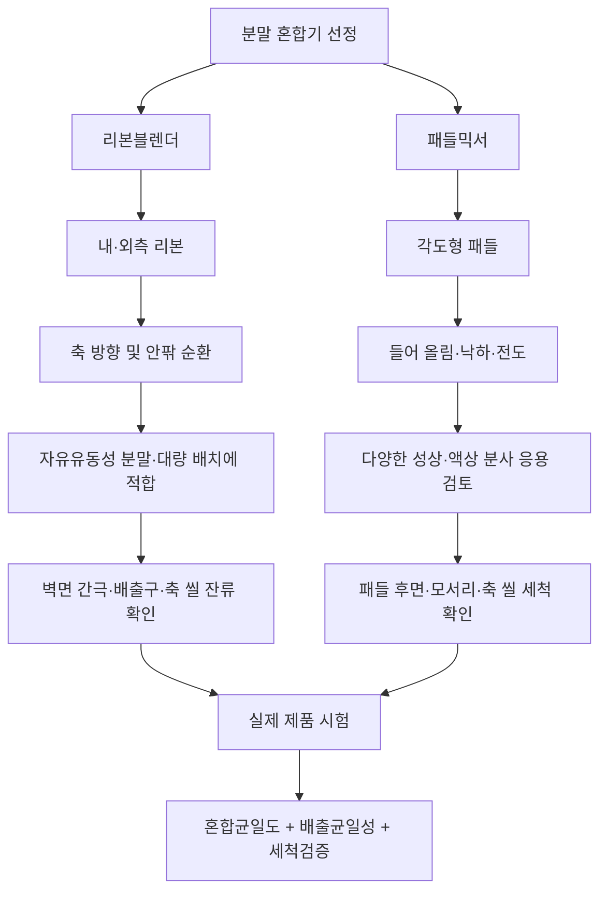
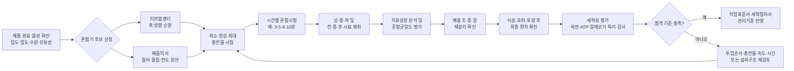
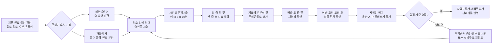

# [QA+ 블로그 생성 결과물] EQ003 리본블렌더 패들믹서 비교
생성일시: 2026-09-16 06:50:26 (KST)
적용모델: gpt-5.6-terra

================================================================================
# 📋 [최종 발행용 블로그 패키지]

### 1. 메타 데이터 (SEO 설정)

- **최종 포스팅 제목**: EQ003 리본블렌더 vs 패들믹서 비교｜분말 혼합기 선정 전 확인할 7가지와 HACCP 검증법
- **메타 디스크립션 (120자 내외 요약)**: EQ003 리본블렌더와 패들믹서의 구조·혼합 특성·세척성을 비교합니다. 충전율, 소량 원료, 배출 균일도, 알레르기 세척검증까지 실무 기준을 정리했습니다.
- **추천 해시태그 (10개)**: #리본블렌더 #패들믹서 #분말혼합기 #EQ003 #혼합균일도 #식품품질관리 #HACCP #식품안전 #알레르기관리 #식품제조설비
- **카테고리**: 식품품질실무 / HACCP가이드 / 식품제조설비

> **QA 검수 반영 사항**
> - HACCP상 혼합공정은 모든 경우 CCP가 아니라, 위해요소 분석 및 CCP 결정도 결과에 따라 CCP·일반공정관리·선행요건프로그램으로 구분된다는 표현을 유지했습니다.
> - ATP 검사는 세척 상태를 확인하는 보조적 위생 모니터링 수단이며, 알레르기 잔류의 직접적인 대체 시험이 아님을 명확히 반영했습니다. 알레르기 전환 검증은 검증된 알레르기 특이 시험법을 별도로 적용해야 합니다.
> - 혼합시간·회전속도·CV 기준은 법령상 일률 수치가 아니라 제품, 설비, 시험법, 위해도 평가 및 밸리데이션 결과에 따라 설정해야 한다는 원칙을 유지했습니다.
> - EQ003은 내부 설비번호 또는 특정 모델 코드일 수 있으므로, 제조사·유효용량·교반축·배출밸브 등 실제 사양 확인 전 정량 운전조건을 단정하지 않도록 편집했습니다.

---

## 2. 네이버 블로그 / 티스토리 복사용 최종 원고 (Markdown)

# EQ003 리본블렌더 vs 패들믹서 비교｜분말 혼합기 선정 전 꼭 확인할 7가지

> **20년 실무 선배의 한 줄 요약**  
> 리본블렌더와 패들믹서 중 “더 좋은 장비”를 찾기보다, 우리 제품의 입도·밀도·수분·알레르기 관리 수준에 맞는 장비를 **혼합균일도와 세척검증으로 입증**하는 것이 정답입니다.  
> EQ003 설비도 제조사 사양서만 믿지 말고, 최소·정상·최대 배치와 배출 초·중·말 구간까지 시험해 보셔야 합니다.

---

## 1. 둘 다 섞는 장비인데, 왜 제품 품질은 달라질까요?

현장에서 “리본블렌더도 분말 섞고, 패들믹서도 분말 섞는데 뭐가 그렇게 다르냐”는 말을 정말 많이 듣습니다. 그런데 같은 배합비, 같은 원료, 같은 10분 혼합 조건을 적용해도 결과는 상당히 다르게 나올 수 있습니다. 어떤 설비는 비타민이나 향미분처럼 소량 첨가되는 원료가 한쪽에 몰리고, 어떤 설비는 혼합은 잘 되지만 배출할 때 다시 분리됩니다. 특히 조미분말, 선식, 단백질 파우더, 건강기능식품처럼 미량 원료가 들어가는 제품은 이 차이가 바로 품질 편차로 연결됩니다.

리본블렌더는 나선형 리본이 원료를 좌우와 안팎으로 순환시키는 장비입니다. 반면 패들믹서는 판형 또는 날개형 패들이 원료를 들어 올리고 떨어뜨리며 상하·전후 방향으로 섞는 장비입니다. 쉽게 말하면 리본블렌더는 원료를 “옆으로 밀고 돌리는 방식”에 가깝고, 패들믹서는 원료를 “들었다가 뒤집어 주는 방식”에 가깝습니다. 이 움직임의 차이가 혼합 균일도, 입자 손상, 잔류량, 세척 난이도를 바꿉니다.

여기서 가장 조심하셔야 할 오해가 하나 있습니다. **혼합시간이 길면 무조건 더 균일해진다**는 생각입니다. 처음 5분에는 잘 섞이던 제품이 15분 후에는 입도와 밀도 차이 때문에 다시 분리되는 경우가 있습니다. 또 오래 돌리면 마찰열, 미분 발생, 정전기, 벽면 부착이 늘어나서 오히려 제품성이 나빠질 수 있습니다.

EQ003이 공장 내부 설비번호인지, 특정 제조사의 모델 코드인지에 따라 세부 사양은 반드시 확인해야 합니다. 현재 EQ003의 제조사, 유효용량, 교반축 형상, 회전속도 범위, 배출밸브 구조를 모르는 상태라면 “몇 분 돌리면 된다”는 식의 단정은 위험합니다. 실무에서는 장비 이름보다 **우리 제품을 넣었을 때 실제로 어떤 혼합 패턴과 잔류 패턴이 나오는지**가 훨씬 중요합니다. 이 기준을 놓치면 설비를 새로 들이고도 기존 불량을 그대로 반복하게 됩니다.


*리본블렌더의 나선형 리본 순환과 패들믹서의 상하 전도 특성을 비교하는 현장 이미지입니다.*

다음부터는 두 설비의 구조를 조금 더 실무적으로 뜯어보겠습니다. 구조를 알아야 “왜 이 제품은 잘 섞이고, 왜 저 제품은 뭉치는지”가 보이기 시작합니다.

---

## 2. 리본블렌더와 패들믹서의 구조·작동 원리 핵심 비교

리본블렌더는 일반적으로 U자형 수평 탱크 안에 하나의 회전축이 있고, 그 축에 내측 리본과 외측 리본이 설치된 구조입니다. 외측 리본은 원료를 한쪽 방향으로, 내측 리본은 반대 방향으로 보내면서 원료를 순환시킵니다. 이 과정에서 원료는 축 방향과 방사 방향으로 이동하며 서로 섞입니다. 비교적 자유유동성이 좋은 분말, 과립, 조미분, 곡물성 원료를 대량으로 다룰 때 많이 사용하는 이유가 여기에 있습니다.

다만 리본블렌더는 리본과 탱크 벽면 사이의 간극이 중요한 변수입니다. 간극이 너무 넓으면 벽면 근처 원료가 충분히 이동하지 못해 혼합 사각지대가 생길 수 있습니다. 반대로 간극이 지나치게 좁으면 입자가 끼거나 마찰이 증가해 원료 손상 또는 금속 마모 위험을 검토해야 합니다. 배출구 주변과 축 씰 부위도 원료가 남기 쉬운 곳이므로, “혼합은 잘 되는데 다음 제품에서 색이 섞인다”는 문제는 이 구간부터 의심하시면 됩니다.

패들믹서는 회전축에 여러 개의 패들이 일정 각도로 붙어 있고, 패들이 원료를 들어 올린 뒤 낙하시켜 혼합하는 방식입니다. 패들의 각도, 길이, 개수, 축 회전방향, 탱크 형상에 따라 원료의 움직임이 상당히 달라집니다. 그래서 같은 ‘패들믹서’라도 제조사별 성능 차이가 크게 날 수 있습니다. 플레이크, 저밀도 분말, 입자 파손을 줄여야 하는 원료, 액상 분사와 병행해야 하는 제품에 적용을 검토하는 경우가 많습니다.

패들믹서라고 해서 무조건 부드럽고 세척이 쉬운 것은 아닙니다. 패들 뒤쪽, 축 주변, 탱크 모서리, 배출밸브 상부, 씰 부위에 잔류가 생기면 세척 시간이 더 길어질 수 있습니다. 특히 유지나 당류가 포함된 분말, 고추가루·카레분처럼 색과 향이 강한 제품, 우유·대두·난류처럼 알레르기 원료가 들어간 제품은 분해세척 가능 여부까지 봐야 합니다. 쉽게 말하면, 패들이 많고 구조가 복잡할수록 혼합에는 유리할 수 있지만 세척 확인 포인트도 같이 늘어납니다.

| 비교 항목 | 리본블렌더 | 패들믹서 | 현장 판단 포인트 |
|---|---|---|---|
| 기본 혼합 방식 | 내·외측 리본의 축 방향 순환 | 패들의 들어 올림·전도·분산 | 원료가 어느 방향으로 잘 움직이는지 확인 |
| 강점 | 자유유동성 분말, 대량 배치, 단순 구조 | 다양한 성상, 부드러운 취급, 액상 분사 응용 | 제품 성상과 생산량을 함께 판단 |
| 주의점 | 벽면 간극·배출구 잔류·과충전 | 패들 뒤쪽·축 씰·모서리 잔류 | 내부 점검구로 실제 확인 필요 |
| 뭉침 원료 | 단순 리본형은 한계 가능 | 설계에 따라 분산 개선 가능 | 사전 체질·해쇄 여부도 검토 |
| 세척성 | 구조는 단순하지만 간극 확인 필요 | 구조가 복잡하면 분해세척 필요 | 알레르기 전환 제품에서 중요 |
| 검증 핵심 | 충전율·혼합시간·배출균일성 | 패들 각도·속도·체류패턴 | 실제 제품 시험이 최종 기준 |

### 리본블렌더·패들믹서 선정 프로세스



이제 구조를 이해하셨다면, 다음 질문은 자연스럽게 이어집니다. “그렇다면 우리 공장에서는 어떤 기준으로 골라야 하나요?” 장비의 외형이나 영업자료보다 먼저 봐야 할 기준을 정리해 보겠습니다.

---

## 3. 분말 혼합기 선정 전 반드시 확인할 7가지

첫째는 **원료의 입도와 밀도 차이**입니다. 입자가 아주 고운 분말과 굵은 과립을 한 배치에 섞으면, 혼합기 안에서는 균일해 보여도 배출이나 이송 중 재분리가 발생할 수 있습니다. 예를 들어 설탕, 소금, 분말향, 비타민 premix의 입도와 비중이 크게 다르면 작은 입자가 아래로 내려가거나 특정 성분이 한쪽으로 몰릴 수 있습니다. 이 경우 믹서만 바꾼다고 해결되지 않고, 원료 입도 조정·예비혼합·이송 낙차 개선까지 함께 검토해야 합니다.

둘째는 **수분과 응집성**입니다. 수분이 높은 분말, 유지 성분이 많은 분말, 당류가 많은 원료는 작은 덩어리를 만들기 쉽습니다. 이런 원료를 그냥 투입하면 리본이나 패들이 덩어리를 옮기기만 하고 내부까지 완전히 풀어 주지 못할 수 있습니다. 투입 전 체질, 해쇄, 덩어리 원료의 사전 선별, 액상 원료의 미세 분사 여부를 먼저 검토하셔야 합니다.

셋째는 **최소·정상·최대 충전율**입니다. 장비 유효용량이 1,000L라고 해서 매번 1,000L까지 채워도 되는 것은 아닙니다. 너무 적게 넣으면 교반부가 원료를 충분히 물지 못하고, 너무 많이 넣으면 상부 원료가 제대로 순환하지 못합니다. 따라서 설비 구매 또는 밸리데이션 단계에서 최소 배치, 통상 배치, 최대 배치 조건을 각각 시험해 두는 것이 안전합니다.

넷째는 **소량 첨가 원료의 투입 방식**입니다. 전체 배치 500kg에 200g만 넣는 감미료, 비타민, 향미료, 색소는 주원료 위에 그냥 뿌리면 균일해지기 어렵습니다. 이럴 때는 소량 원료를 주원료 일부와 먼저 1차 예비혼합한 뒤 본 혼합기에 투입하는 방식이 훨씬 안정적입니다. 쉽게 말하면, 소금 한 숟갈을 100인분 국에 바로 넣는 것보다 먼저 물 한 컵에 풀어 넣는 방식과 비슷합니다.

다섯째는 **액상 분사와 벽면 부착 가능성**입니다. 오일, 향료, 시럽, 액상조미료를 투입하는 제품이라면 분사 노즐의 위치와 분사량이 매우 중요합니다. 한 지점에 뭉치게 분사하면 그 부위만 젖고, 시간이 지나면 딱딱한 덩어리나 벽면 부착물이 생깁니다. 패들믹서는 설계에 따라 액상 분사 적용이 비교적 편할 수 있지만, 실제로는 노즐 분포와 분사 압력, 혼합 중 투입 시간까지 확인해야 합니다.

여섯째는 **제품 전환과 알레르기 교차오염 위험**입니다. 같은 설비로 대두 단백 제품 다음에 비대두 제품을 생산하거나, 우유 함유 제품 다음에 무유 제품을 생산한다면 세척성은 구매 조건이 아니라 식품안전 조건입니다. 식품 및 축산물 안전관리인증기준, 즉 HACCP 기준에서는 위해요소 분석 결과에 따라 교차오염 예방을 위한 관리기준과 검증 근거를 요구합니다. 쉽게 말하면 “세척했다”는 기록만으로는 부족하고, 실제로 이전 제품이 남지 않았다는 확인자료가 있어야 합니다.

일곱째는 **배출 이후 공정까지 포함한 평가**입니다. 혼합기 내부 시료만 검사해서는 부족합니다. 배출 초반, 중간, 마지막 구간에서 각각 시료를 채취하고, 이송호퍼·스크류컨베이어·포장기까지 거친 최종 제품의 편차를 확인해야 합니다. 현장에서는 믹서가 문제라고 생각했는데 실제 원인은 4m 높이의 낙차, 장시간 호퍼 체류, 공압이송 중 분리였던 경우가 많습니다.

> **실무 핵심**  
> 믹서 선정은 “리본이냐 패들이냐”의 문제가 아니라,  
> **원료 물성 → 투입 방식 → 혼합 → 배출 → 이송 → 포장 → 세척 전환** 전체 흐름을 검증하는 일입니다.

선정 기준을 잡았다면 이제 법적·HACCP 문서에 어떻게 반영해야 할지 정리할 차례입니다. 심사 때 실제로 가장 많이 지적받는 부분도 바로 여기입니다.

---

## 4. 식품 혼합공정 HACCP와 위생관리, 어디까지 관리해야 할까요?

식품위생법 및 관련 시설기준의 기본 취지는 명확합니다. 식품과 직접 접촉하는 제조설비는 오염을 방지할 수 있는 구조여야 하고, 세척·소독·점검이 가능해야 합니다. 혼합기는 원료가 장시간 머무르고 여러 성분이 접촉하는 설비이기 때문에, 작은 잔류도 교차오염이나 이물 문제로 이어질 수 있습니다. 따라서 탱크 내부 재질, 용접부 상태, 패킹·씰 재질, 윤활유 누유 가능성, 배출밸브 위생성을 정기점검 항목으로 넣어야 합니다.

HACCP 관점에서 혼합공정이 반드시 CCP가 되는 것은 아닙니다. **CCP(Critical Control Point, 중요관리점)**란 관리 실패 시 식품안전 위해를 허용 수준으로 예방·제거하거나 감소시킬 수 있는 핵심 단계입니다. 쉽게 말하면, 모든 공정을 무조건 CCP로 관리하는 것이 아니라 위해요소 분석과 CCP 결정도 결과에 따라 일반공정관리, 선행요건프로그램, CCP로 구분하는 것입니다. 다만 배합 오류, 알레르기 교차오염, 이물 혼입, 미생물 위험 등이 중요한 제품이라면 혼합공정에도 명확한 관리기준과 기록이 필요합니다.

작업표준서에는 최소한 원료 투입 순서, 투입량, 허용오차, 혼합시간, 회전속도, 배치량, 설비 점검 상태, 배출 확인 방법을 넣어야 합니다. 여기서 혼합시간과 회전속도는 법령이 일률적으로 “몇 분, 몇 rpm”이라고 정해 주는 항목이 아닙니다. 제품 배합, 원료 성상, 설비 구조, 밸리데이션 결과를 근거로 회사가 관리기준을 설정해야 합니다. 그러니 제조사 카탈로그의 권장 운전시간을 그대로 작업표준서에 복사하는 방식은 심사 대응력이 약합니다.

세척관리도 마찬가지입니다. 건식 제품이라고 무조건 건식청소만 하면 되는 것이 아니고, 습식세척을 한다고 무조건 안전한 것도 아닙니다. 고추가루나 곡물분처럼 수분이 들어가면 미생물 또는 응집 문제가 생길 수 있는 제품은 건식청소 원칙을 세울 수 있고, 유지·당류·점착성 원료는 적절한 습식세척과 충분한 건조가 필요할 수 있습니다. 중요한 것은 제품 특성별로 세척 방법, 분해 범위, 확인 방법, 재가동 승인 기준을 문서화하는 것입니다.

| 관리 항목 | 관리기준 예시 | 확인 방법 | 기록 예시 | 주의사항 |
|---|---|---|---|---|
| 원료 투입 순서 | 작업표준서 순서 준수 | 작업자 상호확인 | 배합기록지 | 소량 원료는 예비혼합 여부 명시 |
| 배치량 | 검증된 최소~최대 범위 | 계량값 확인 | 제조기록서 | 과충전·소량 배치 모두 관리 |
| 혼합시간 | 제품별 검증시간 준수 | 타이머·PLC 확인 | 운전기록 | 임의 연장 시 사유 기록 |
| 회전속도 | 검증 rpm 또는 설정단수 | 인버터·표시창 확인 | 설비운전일지 | 속도 변경은 변경관리 대상 |
| 혼합균일도 | 사내 합격기준 충족 | 지표성분 시험 | 시험성적서 | 내부 시료만 보지 말 것 |
| 세척 완료 | 육안·ATP·알레르기 특이 검사 | 점검 및 시험 | 세척점검표 | ATP는 알레르기 잔류의 대체 시험이 아님 |
| 설비 이상 | 볼트·용접부·씰 이상 없음 | 가동 전 점검 | 일상점검표 | 이상 시 제품 격리 기준 필요 |

이 기준을 문서에 써 놓는 것만으로는 충분하지 않습니다. 실제 현장에서 돌아가게 만들려면, 혼합 균일도와 세척성을 어떻게 시험할지 구체적인 방법이 있어야 합니다.

---

## 5. EQ003 성능검증, 이렇게 설계하면 바로 실무 자료가 됩니다

첫 단계는 EQ003의 기본 사양을 정확히 확보하는 것입니다. 제조사명, 모델명, 유효용량, 탱크 재질, 식품 접촉부 재질, 모터 출력, 회전속도 범위, 리본 또는 패들 형상, 배출밸브 구조를 확인하십시오. 가능하면 GA 도면, 부품도, 세척·분해 매뉴얼, 예방보전 매뉴얼도 함께 받아 두셔야 합니다. 특히 축 씰과 배출밸브의 구조를 확인하지 않으면 나중에 잔류·누유·세척 문제에서 곤란해집니다.

두 번째는 대표 제품과 최악조건 제품을 정하는 것입니다. 대표 제품은 가장 많이 생산하는 일반 제품으로 잡고, 최악조건 제품은 혼합 또는 세척이 가장 어려운 제품으로 잡습니다. 예를 들면 미량 첨가 원료가 많은 제품, 색이 진한 제품, 향이 강한 제품, 유지가 많은 제품, 알레르기 원료가 들어간 제품이 최악조건 후보입니다. 밸리데이션은 쉬운 제품으로 통과하는 시험이 아니라, 가장 어려운 조건에서도 관리된다는 것을 보여주는 시험입니다.

세 번째는 시간별·위치별 샘플링 계획입니다. 혼합 종료 시점의 내부 시료만 2개 채취해서 “균일합니다”라고 결론 내리면 자료의 신뢰도가 떨어집니다. 최소한 혼합시간별로 예를 들어 3분, 5분, 8분, 10분처럼 후보 시간을 설정하고, 각 조건에서 상·중·하 또는 전·중·후 위치의 시료를 설계해야 합니다. 실제 배출 단계에서는 배출 초반·중반·후반 시료를 별도로 검사해 배출 편차와 재분리 가능성을 확인하는 것이 좋습니다.

네 번째는 지표성분 선정입니다. 단순히 수분이나 색도만 보고 혼합균일도를 판단하면, 정작 관리가 필요한 미량 원료의 편차를 놓칠 수 있습니다. 예를 들어 비타민 강화 분말은 비타민 또는 관련 지표성분을, 조미분말은 식염·당·특정 향미성분을, 단백질 제품은 단백질 또는 특정 기능성 원료를 지표로 정할 수 있습니다. 다만 시험법의 정밀도, 검출한계, 제품 특성을 고려해 품질부서와 연구소가 함께 선정해야 합니다.

다섯 번째는 합격기준을 ‘제품별’로 정하는 것입니다. 변동계수(CV), 함량 편차, 외관, 입도, 수분, 배출 잔류량 등을 활용할 수 있지만, 모든 제품에 단일 숫자를 적용하면 무리가 생길 수 있습니다. 예를 들어 미량 기능성 원료 제품과 일반 곡물분말 제품은 관리 난이도와 분석법이 다릅니다. 따라서 사내 규격, 제품 표시 기준, 시험법의 재현성, 위해도 평가 결과를 근거로 승인 기준을 정하는 것이 맞습니다.

여섯 번째는 세척검증입니다. 세척 전후 사진만으로 끝내지 말고, 손전등 또는 내시경으로 리본·패들 뒤쪽, 축 씰 주변, 배출구 안쪽을 확인하십시오. 필요에 따라 ATP 검사, 헹굼수 검사, 알레르기 특이 검사키트, 제품 전환 후 첫 생산품 검사를 조합할 수 있습니다. 다만 ATP 검사는 일반적인 유기물 오염 수준을 확인하는 보조 수단일 뿐, 알레르기 잔류가 없음을 단독으로 입증하는 시험은 아닙니다. 알레르기 원료를 사용하는 공장이라면 “세척 후 음성 확인”의 기준, 검증된 시험법, 시험 위치를 반드시 사전에 정해 두셔야 합니다.


*EQ003 배출 초·중·말 시료 채취와 세척검증을 포함한 혼합성능 밸리데이션 현장 이미지입니다.*

### EQ003 혼합성능 밸리데이션 흐름



검증 설계를 알면 현장 문제도 더 빠르게 풀립니다. 이제 실제 공장에서 자주 나오는 세 가지 사례로, 장비 문제가 어떻게 공정 문제로 이어졌는지 보겠습니다.

---

## 6. 실제 현장 사례로 보는 리본블렌더·패들믹서 적용법

### 사례 1. 냉동만두용 복합조미분 리본블렌더의 미량 원료 편차

한 냉동만두 제조공장에서는 800kg 배치의 복합조미분을 리본블렌더로 혼합하고 있었습니다. 주원료는 소금, 설탕, 전분, 후추, 마늘분말이었고, 여기에 0.05% 수준의 향미증진 원료와 0.1% 수준의 추출분말이 들어갔습니다. 완제품 관능검사에서 어떤 포장은 감칠맛이 강하고 어떤 포장은 약하다는 불만이 반복됐습니다. 처음에는 리본블렌더의 혼합시간이 부족하다고 판단해 기존 7분에서 12분으로 연장했습니다.

그런데 분석 결과는 오히려 좋아지지 않았고, 배출 후반부에서 특정 지표성분의 편차가 더 크게 나타났습니다. 원인 분석을 해 보니 소량 원료를 주원료 위에 한 번에 투입하고 있었으며, 일부 원료는 수분을 먹어 작은 응집 덩어리를 형성하고 있었습니다. 또한 12분 혼합 과정에서 미세분이 증가하면서 입도 차이에 따른 재분리 가능성이 커졌습니다. 즉, 문제의 근본 원인은 ‘혼합시간 부족’이 아니라 ‘부적절한 소량 원료 투입과 과혼합’이었습니다.

개선 조치로 향미증진 원료와 추출분말을 전분 20kg과 먼저 3분간 예비혼합한 뒤 본 배치에 투입하도록 변경했습니다. 본 혼합기 운전조건은 7분, 9분, 12분으로 다시 시험했고, 배출 초·중·말 구간의 지표성분을 비교했습니다. 그 결과 9분 조건에서 가장 안정적인 배출 균일도가 확인됐고, 12분 조건은 재분리 경향이 나타났습니다. 작업표준서에는 “소량 첨가 원료는 예비혼합 후 투입”이라는 문구와 예비혼합 원료의 확인란을 추가했습니다.

개선 후에는 배치 간 관능 편차가 눈에 띄게 줄었고, 생산팀도 무조건 오래 돌리는 방식에서 벗어났습니다. 무엇보다 품질팀이 혼합기 내부 시료만 보지 않고 배출 구간까지 확인하는 체계로 바뀐 것이 큰 성과였습니다. 이 사례는 리본블렌더가 나빠서 생긴 문제가 아닙니다. 장비의 혼합 특성과 소량 원료의 투입 방법을 연결하지 못해서 발생한 문제였습니다.

### 사례 2. 액상 오일이 들어가는 분말소스 패들믹서의 뭉침 문제

분말소스와 시즈닝을 생산하는 공장에서는 패들믹서에 분말 원료를 넣은 뒤 식물성 오일과 액상향을 투입하고 있었습니다. 패들믹서라면 원료를 잘 들어 올려 주기 때문에 액상도 고르게 섞일 것이라고 기대했습니다. 그러나 포장 후 제품을 뜯어 보면 일부 봉지에서 단단한 덩어리가 발견됐고, 체로 거르면 오일이 과도하게 묻은 뭉침 입자가 나왔습니다. 작업자들은 혼합시간을 기존 5분에서 15분으로 늘려 보았지만, 뭉침은 완전히 없어지지 않았습니다.

현장 확인 결과 액상 원료가 탱크 한쪽 상부의 고정된 위치에서 한 번에 떨어지고 있었습니다. 원료 충전량도 설비 권장 운전범위 상한에 가까워 상부 원료의 순환이 원활하지 않았습니다. 액상이 떨어지는 부위에만 국부적으로 젖은 덩어리가 생겼고, 패들이 그 덩어리를 충분히 분산시키지 못한 채 다른 원료와 섞고 있었습니다. 근본 원인은 패들믹서의 성능 부족이 아니라 **분사 위치·분사속도·충전율이 제품 특성과 맞지 않았던 것**입니다.

개선 조치로 노즐을 2개로 분산하고, 액상 투입 시간을 30초 일괄 투입에서 180초 연속 미세 분사 방식으로 바꿨습니다. 동시에 1회 배치량을 90% 수준에서 75% 수준으로 낮춰 원료의 상부 순환 공간을 확보했습니다. 혼합은 분말 사전혼합 3분, 액상 분사 중 혼합 3분, 분사 후 안정화 혼합 2분으로 나누어 설정했습니다. 뭉침 여부는 체 분석, 외관 확인, 포장 후 24시간 보관 샘플 확인으로 검증했습니다.

그 결과 덩어리 발생률이 크게 낮아졌고, 오일 함량의 배치 내 편차도 안정화됐습니다. 추가로 세척 단계에서는 노즐 주변과 패들 후면에 유지 잔류가 남는 것이 확인되어 분해세척 주기와 세척 확인 위치를 보완했습니다. 이 사례에서 중요한 포인트는 액상 원료가 들어가는 순간부터 혼합공정은 단순한 “분말 혼합”이 아니라는 점입니다. 패들믹서의 장점을 살리려면 패들 형상뿐 아니라 분사 시스템과 충전율을 함께 설계해야 합니다.

### 사례 3. 건강기능식품 단백질 파우더의 알레르기 교차오염 관리

건강기능식품 OEM 공장에서는 유청단백 제품과 식물성 단백 제품을 같은 혼합설비에서 생산하고 있었습니다. 생산 후에는 작업자가 내부를 육안으로 확인하고 건식청소를 실시한 뒤 다음 제품으로 전환했습니다. 그런데 비유제품 생산 후 실시한 내부 점검에서 축 씰 주변과 배출밸브 틈에 미세한 분말 잔류가 반복적으로 발견됐습니다. 외관상 깨끗해 보여도 알레르기 교차오염 위험을 무시할 수 없는 상황이었습니다.

처음에는 작업자 청소 미흡으로 판단했지만, 반복 점검 결과 개인의 문제만은 아니었습니다. 설비 내부 패들 뒤쪽과 축 씰 구조상 브러시가 충분히 닿지 않는 구간이 있었고, 배출밸브를 완전히 분해하지 않으면 잔류가 남는 구조였습니다. 더구나 건식청소 후 바로 다음 제품을 생산하면서 세척 효과를 객관적으로 확인하는 절차가 없었습니다. 근본 원인은 “세척 기록은 있지만 세척검증이 없는 관리체계”였습니다.

개선 조치로 제품을 알레르기 위험도와 세척 난이도에 따라 등급화했습니다. 유청단백, 난류, 대두처럼 알레르기 표시 대상 원료가 포함된 제품은 생산순서를 후순위로 배치하고, 전환 시 배출밸브와 씰 부위의 분해세척을 의무화했습니다. 육안 확인만 하던 방식에서 벗어나, 정해진 스와브 위치에 대한 검증된 알레르기 특이 검사와 ATP 검사를 병행했습니다. 또한 세척 후 첫 생산품은 별도 표시·보류하여 검사 결과 확인 후 출고하도록 절차를 변경했습니다.

개선 후에는 내부 사각지대의 잔류 발견 건수가 감소했고, 세척 완료 승인도 품질팀 확인 후 이루어지도록 바뀌었습니다. 생산성만 보면 분해세척 시간이 늘어난 것처럼 보일 수 있습니다. 하지만 알레르기 교차오염 사고 한 번의 비용과 브랜드 신뢰 하락을 생각하면, 이 시간은 손실이 아니라 예방 투자입니다. HACCP에서 말하는 위생적 설계와 검증은 바로 이런 부분에서 실력을 보여 줍니다.

사례를 보면 답이 분명합니다. 장비 자체를 탓하기 전에 원료 투입, 충전율, 배출, 세척, 작업표준서가 설비 특성과 맞게 연결돼 있는지 먼저 보셔야 합니다.

---

## 7. 혼합 불균일·잔류·재분리 트러블슈팅 실전 가이드

혼합 후 특정 원료가 뭉친다면 가장 먼저 원료 상태부터 보셔야 합니다. 원료 입고 후 보관 중 수분을 먹었는지, 포대 내부에서 굳었는지, 액상 원료가 한 지점에 집중 투입됐는지 확인하십시오. 덩어리가 이미 생긴 원료는 믹서에 넣는다고 자동으로 풀리지 않습니다. 체질 또는 해쇄를 선행하고, 소량 원료는 일부 주원료와 예비혼합하는 방법이 가장 기본적인 해결책입니다.

혼합 직후에는 균일한데 포장품에서 분리가 나타난다면 혼합기만 보시면 안 됩니다. 스크류컨베이어의 회전, 진동피더의 진동, 높은 낙차, 장시간 호퍼 체류, 공압이송은 모두 분리를 일으킬 수 있습니다. 특히 입도와 비중 차이가 큰 제품은 이송거리가 길수록 성분별 이동 속도가 달라질 수 있습니다. 따라서 혼합기 출구, 이송 후, 포장 초·중·말 제품을 비교해 어느 구간부터 편차가 커지는지 찾으셔야 합니다.

세척 후에도 이전 제품의 냄새나 색이 남는다면 “세척제가 약하다”라고 단정하지 마십시오. 실제로는 배출구 사각지대, 패킹 틈, 축 씰, 리본·패들 뒷면 같은 구조적 잔류가 원인인 경우가 많습니다. 세척 직후에는 젖어 있어서 보이지 않다가 건조 후 색이 드러나는 경우도 있습니다. 그러니 세척 확인은 조명과 손전등을 활용한 육안점검, 필요 시 내시경 확인, ATP 검사, 검증된 알레르기 특이 검사까지 단계적으로 운영하는 것이 좋습니다.

혼합시간을 늘렸는데 균일도가 나빠진다면 최적 혼합 구간을 찾는 시험을 다시 하셔야 합니다. 예를 들어 5분, 7분, 9분, 12분 조건으로 나누어 시간별 결과를 비교하고, 배출 초·중·말 시료까지 확인하십시오. 최적점 이후에는 재분리, 미분화, 마찰열, 정전기 증가가 발생할 수 있습니다. “10분이 표준이니까 10분”이 아니라 “이 제품은 8분에서 가장 안정적이므로 8분”이라는 근거 기반 관리가 필요합니다.

| 현장 증상 | 흔한 오해 | 실제 점검 원인 | 우선 개선 조치 |
|---|---|---|---|
| 미량 원료 편차 | 혼합시간이 부족하다 | 예비혼합 미실시, 투입 위치 편중 | 주원료 일부와 예비혼합 |
| 분말 덩어리 발생 | 믹서 출력이 약하다 | 수분 증가, 액상 집중 투입, 과충전 | 체질·해쇄, 미세 분사, 배치량 조정 |
| 포장 후 성분 분리 | 믹서가 불량이다 | 이송·낙차·호퍼 체류 중 재분리 | 이송라인 포함 조사 |
| 이전 제품 색·향 잔류 | 청소를 덜 했다 | 씰·패킹·배출구 사각지대 잔류 | 분해세척·검증 위치 설정 |
| 혼합시간 연장 후 품질 저하 | 더 오래 돌리면 좋아진다 | 과혼합, 미분 증가, 정전기 | 시간별 균일도 재검증 |
| 금속성 이물 우려 | 금속검출기로 끝난다 | 용접부·볼트·리본·패들 마모 | 예방보전 및 가동 전 점검 강화 |

트러블슈팅은 감으로 하면 같은 문제가 돌아옵니다. 증상별로 원인을 하나씩 분리하고, 조치 후에는 반드시 시험 결과로 효과를 확인하셔야 재발을 막을 수 있습니다.

---

## 8. 자주 묻는 질문(FAQ)과 심사관 단골 지적 사항

**Q1. 리본블렌더와 패들믹서 중 어느 쪽이 더 균일한가요?**  
**A.** 설비 명칭만으로 우열을 정할 수 없습니다. 원료의 입도·밀도·수분·유동성, 배치량, 회전속도, 혼합시간, 배출구 구조가 함께 영향을 줍니다. 같은 제품을 대상으로 시간별·위치별 혼합균일도 시험을 해야 정확한 결론을 낼 수 있습니다.

**Q2. 혼합시간은 제조사 권장시간대로 설정하면 되나요?**  
**A.** 제조사 권장시간은 출발점으로는 유용하지만, 그 자체가 우리 제품의 관리기준은 아닙니다. 실제 배합으로 시간별 시험을 실시해 최소 균일 확보 시간과 과혼합 또는 재분리 시작 시점을 확인해야 합니다. 검증된 결과는 작업표준서와 제조기록서의 근거가 됩니다.

**Q3. 리본블렌더는 대용량 생산에 무조건 유리한가요?**  
**A.** 일반적으로 대용량 분말 혼합에 많이 사용되는 것은 맞습니다. 하지만 유효용량이 크다고 과충전해도 되는 것은 아니며, 충전율이 지나치게 높으면 상부 원료가 순환하지 않아 사각지대가 생길 수 있습니다. 최소·정상·최대 배치별 검증이 꼭 필요합니다.

**Q4. 패들믹서는 리본블렌더보다 세척이 쉬운가요?**  
**A.** 패들믹서의 세척성은 패들 개수, 축 씰, 용접부, 배출밸브 구조에 따라 달라집니다. 패들이 많거나 구조가 복잡하면 오히려 세척 확인 지점이 늘어날 수 있습니다. 구매 전에는 내부 사진만 보지 말고 실제 분해 방법과 소요 시간까지 확인하셔야 합니다.

**Q5. 혼합공정은 반드시 CCP로 관리해야 하나요?**  
**A.** 아닙니다. HACCP 위해요소 분석과 CCP 결정도 결과에 따라 CCP, 일반공정관리, 선행요건 관리로 구분됩니다. 다만 알레르기 교차오염, 배합 오류, 이물 혼입 같은 위해가 중요하다면 혼합공정에도 구체적인 관리기준과 검증 절차가 필요합니다.

**Q6. 혼합균일도 시험을 매 배치마다 해야 하나요?**  
**A.** 모든 배치에 대해 정밀성분 분석을 해야 하는지는 제품 위험도와 사내 관리방침에 따라 달라집니다. 일반적으로는 초기 밸리데이션, 정기검증, 원료·배합·설비 변경 시 재검증, 이상 발생 시 추가검증 체계를 운영합니다. 다만 배합 오류 예방을 위한 계량·투입 순서·운전기록 확인은 일상적으로 관리해야 합니다.

**Q7. EQ003 설비를 교체하거나 패들·리본을 바꾸면 문서도 수정해야 하나요?**  
**A.** 반드시 수정 검토가 필요합니다. 교반축 형상, 회전속도, 배출구, 용량이 바뀌면 혼합 패턴과 세척성도 달라질 수 있기 때문입니다. HACCP 위해요소 분석, 작업표준서, 설비점검표, 세척절차서, 밸리데이션 자료를 변경관리 절차에 따라 함께 검토하십시오.

심사에서 특히 많이 나오는 지적은 의외로 단순합니다. 작업표준서에는 혼합시간이 10분인데 실제 기록은 15분으로 되어 있거나, 원료 투입 순서가 작업자마다 다르거나, 회전속도와 충전량 기록이 없는 경우입니다. 또 “세척 완료” 서명은 있는데 세척 효과를 어떻게 확인했는지 증빙이 없으면 알레르기·교차오염 관리에서 약점이 됩니다. 설비를 바꾸고도 HACCP 문서와 작업표준서를 갱신하지 않은 경우도 빠지지 않고 지적받는 항목입니다.

---

## 9. EQ003 리본블렌더·패들믹서 도입 및 운영 체크리스트

아래 체크리스트는 신규 설비 도입, 기존 EQ003 설비 재평가, HACCP 심사 전 점검에 바로 활용하실 수 있습니다. 한 번에 완벽하게 만들려고 하지 마시고, 우선 현재 자료가 있는 항목과 없는 항목을 구분하는 것부터 시작하시면 됩니다. 특히 “없음”으로 표시되는 항목이 바로 개선 우선순위입니다. 품질팀 혼자 작성하지 말고 생산·공무·연구소·구매 담당자가 함께 검토하면 훨씬 실효성 있는 기준이 나옵니다.

| 구분 | 점검 항목 | 확인 기준 | 확인 방법 | 완료 |
|---|---|---|---|---|
| 설비 사양 | 제조사·모델명·유효용량 확보 | 최신 사양서 보유 | 명판·카탈로그·도면 확인 | □ |
| 설비 구조 | 리본/패들·씰·배출구 구조 확인 | 사각지대 파악 완료 | 내부 사진·도면 검토 | □ |
| 원료 적합성 | 입도·밀도·수분·유동성 평가 | 대표·최악조건 원료 선정 | 원료규격서·현장 테스트 | □ |
| 충전율 | 최소·정상·최대 배치 검증 | 각 배치 조건 시험 완료 | 제조시험 기록 | □ |
| 투입 방식 | 소량·액상 원료 투입방법 표준화 | 순서와 예비혼합 기준 명확 | 작업표준서 확인 | □ |
| 혼합시간 | 시간별 최적 조건 설정 | 과혼합 여부 포함 검증 | 시간별 샘플링 시험 | □ |
| 균일도 | 배출 초·중·말 편차 확인 | 지표성분 기준 충족 | 시험성적서 검토 | □ |
| 이송공정 | 이송·호퍼·포장 중 분리 확인 | 최종 제품 편차 확인 | 공정별 시료 비교 | □ |
| 세척성 | 내부 사각지대 세척 가능 여부 | 육안·시험 검증 기준 존재 | 손전등·ATP·스와브 | □ |
| 알레르기 | 제품 전환 관리기준 설정 | 생산순서·세척검증 수립 | 알레르기 관리표 | □ |
| 이물관리 | 용접부·체결부·패킹 점검 | 정기점검 주기 설정 | 설비점검표 | □ |
| 문서화 | HACCP·SOP·점검표 연계 | 변경 내용 반영 완료 | 문서 개정이력 | □ |

체크리스트를 운영할 때는 “점검했다”보다 “어떤 근거로 적합 판정했는가”를 남기는 것이 중요합니다. 예를 들어 세척 완료 여부는 단순 체크가 아니라 사진, 검사 결과, 확인자 서명, 이상 시 조치내역으로 이어져야 합니다. 혼합시간도 타이머 숫자만 남기지 말고 해당 시간이 어떤 밸리데이션 자료에서 나왔는지 연결해 두면 심사 대응이 훨씬 수월합니다. 이런 자료가 쌓이면 EQ003이 리본블렌더이든 패들믹서이든, 우리 공장에 맞는 검증된 설비로 관리할 수 있습니다.

---

## 10. 맺음말｜장비명이 아니라 검증된 공정 적합성이 답입니다

오늘 내용은 세 줄로 정리할 수 있습니다. 첫째, 리본블렌더와 패들믹서는 구조와 원료 이동 방식이 다르므로 제품별 적합성을 따져야 합니다. 둘째, 혼합시간을 오래 주는 방식이 아니라 시간별·위치별·배출 구간별 시험으로 최적 조건을 찾아야 합니다. 셋째, 혼합 성능만큼 세척성, 잔류량, 알레르기 교차오염 관리, 문서화가 중요합니다.

EQ003이 어떤 구조의 설비인지 최종 확인한 뒤에는 반드시 실제 생산 제품으로 시험해 보십시오. 최소·정상·최대 투입량, 소량 원료 배합, 배출 초·중·말, 세척 후 잔류까지 확인하면 장비 선정과 HACCP 대응의 절반은 끝난 셈입니다. 카탈로그의 장점보다 중요한 것은 우리 공장 제품에서 재현되는 품질입니다.

> **마지막 현장 조언**  
> “이 믹서가 좋다”보다 “이 제품을 이 조건에서 돌렸을 때 균일도와 세척검증이 확보된다”가 훨씬 강한 결론입니다.  
> 막히는 부분 있으면 언제든 댓글로 편하게 물어보세요. 후배님들의 불량 감소와 칼퇴를 응원합니다.

---

## 3. 워드프레스 / 웹사이트용 HTML 원고

```html
<article class="food-qa-post">
  <header>
    <h1>EQ003 리본블렌더 vs 패들믹서 비교｜분말 혼합기 선정 전 꼭 확인할 7가지</h1>
    <p class="lead"><strong>20년 실무 선배의 한 줄 요약:</strong> 리본블렌더와 패들믹서 중 “더 좋은 장비”를 찾기보다, 우리 제품의 입도·밀도·수분·알레르기 관리 수준에 맞는 장비를 <strong>혼합균일도와 세척검증으로 입증</strong>하는 것이 정답입니다.</p>
  </header>

  <section>
    <h2>1. 둘 다 섞는 장비인데, 왜 제품 품질은 달라질까요?</h2>
    <p>같은 배합비, 같은 원료, 같은 혼합 조건을 적용해도 리본블렌더와 패들믹서는 다른 결과를 낼 수 있습니다. 특히 비타민, 향미분, 색소처럼 소량 첨가되는 원료가 포함된 조미분말·선식·단백질 파우더·건강기능식품은 이러한 차이가 품질 편차로 직접 연결될 수 있습니다.</p>
    <p>리본블렌더는 나선형 리본으로 원료를 좌우와 안팎으로 순환시키는 방식이며, 패들믹서는 패들이 원료를 들어 올리고 떨어뜨리며 상하·전후 방향으로 혼합하는 방식입니다. 이 차이는 혼합 균일도, 입자 손상, 잔류량, 세척 난이도에 영향을 줍니다.</p>
    <p><strong>혼합시간이 길면 무조건 더 균일해진다는 생각은 위험합니다.</strong> 최적 혼합시간 이후에는 입도·밀도 차이에 따른 재분리, 미분 발생, 마찰열, 정전기, 벽면 부착이 늘어날 수 있습니다.</p>
    <p>EQ003이 내부 설비번호인지 특정 제조사의 모델 코드인지에 따라 세부 사양을 확인해야 합니다. 제조사, 유효용량, 교반축 형상, 회전속도 범위, 배출밸브 구조를 확인하지 않은 상태에서 특정 운전시간을 단정해서는 안 됩니다.</p>

    <figure>
      
      <figcaption>리본블렌더의 나선형 리본 순환과 패들믹서의 상하 전도 특성을 비교하는 현장 이미지</figcaption>
    </figure>
  </section>

  <section>
    <h2>2. 리본블렌더와 패들믹서의 구조·작동 원리 핵심 비교</h2>
    <p>리본블렌더는 일반적으로 U자형 수평 탱크 안에 회전축과 내측·외측 리본이 설치된 구조입니다. 외측 리본과 내측 리본이 서로 반대 방향으로 원료를 이동시키며 축 방향 및 방사 방향 혼합을 유도합니다. 자유유동성이 좋은 분말, 과립, 조미분, 곡물성 원료의 대량 배치에 활용되는 경우가 많습니다.</p>
    <p>리본과 탱크 벽면의 간극, 배출구, 축 씰은 잔류와 혼합 사각지대의 주요 확인 지점입니다. 반면 패들믹서는 각도형 패들이 원료를 들어 올리고 낙하시켜 혼합하며, 패들 각도·길이·개수·회전방향·탱크 형상에 따라 성능 차이가 날 수 있습니다.</p>
    <p>패들믹서는 다양한 성상과 액상 분사 제품에 적용을 검토할 수 있지만, 패들 후면·축 주변·탱크 모서리·배출밸브 상부·씰 부위의 잔류 및 분해세척 가능 여부를 함께 평가해야 합니다.</p>

    <table>
      <thead>
        <tr>
          <th>비교 항목</th>
          <th>리본블렌더</th>
          <th>패들믹서</th>
          <th>현장 판단 포인트</th>
        </tr>
      </thead>
      <tbody>
        <tr><td>기본 혼합 방식</td><td>내·외측 리본의 축 방향 순환</td><td>패들의 들어 올림·전도·분산</td><td>원료가 어느 방향으로 잘 움직이는지 확인</td></tr>
        <tr><td>강점</td><td>자유유동성 분말, 대량 배치, 단순 구조</td><td>다양한 성상, 부드러운 취급, 액상 분사 응용</td><td>제품 성상과 생산량을 함께 판단</td></tr>
        <tr><td>주의점</td><td>벽면 간극·배출구 잔류·과충전</td><td>패들 뒤쪽·축 씰·모서리 잔류</td><td>내부 점검구로 실제 확인 필요</td></tr>
        <tr><td>뭉침 원료</td><td>단순 리본형은 한계 가능</td><td>설계에 따라 분산 개선 가능</td><td>사전 체질·해쇄 여부도 검토</td></tr>
        <tr><td>세척성</td><td>구조는 단순하지만 간극 확인 필요</td><td>구조가 복잡하면 분해세척 필요</td><td>알레르기 전환 제품에서 중요</td></tr>
        <tr><td>검증 핵심</td><td>충전율·혼합시간·배출균일성</td><td>패들 각도·속도·체류패턴</td><td>실제 제품 시험이 최종 기준</td></tr>
      </tbody>
    </table>
  </section>

  <section>
    <h2>3. 분말 혼합기 선정 전 반드시 확인할 7가지</h2>
    <ol>
      <li><strong>원료의 입도와 밀도 차이:</strong> 믹서 내부가 균일해 보여도 배출·이송 중 재분리가 발생할 수 있으므로 예비혼합, 입도 조정, 낙차 개선을 함께 검토합니다.</li>
      <li><strong>수분과 응집성:</strong> 수분·유지·당류가 많은 원료는 응집될 수 있으므로 체질, 해쇄, 사전 선별, 미세 분사를 검토합니다.</li>
      <li><strong>최소·정상·최대 충전율:</strong> 유효용량과 실제 적정 충전율은 다릅니다. 최소·통상·최대 배치 조건을 각각 검증해야 합니다.</li>
      <li><strong>소량 첨가 원료의 투입 방식:</strong> 미량 감미료·비타민·향미료·색소는 주원료 일부와 예비혼합한 뒤 투입하는 방식이 안정적입니다.</li>
      <li><strong>액상 분사와 벽면 부착:</strong> 노즐 위치, 분사량, 분사 압력, 분사 시간 및 혼합 중 투입 조건을 확인해야 합니다.</li>
      <li><strong>제품 전환과 알레르기 교차오염:</strong> 알레르기 원료 사용 설비는 세척 가능 여부와 세척검증 방법을 구매 및 운영 조건으로 관리해야 합니다.</li>
      <li><strong>배출 이후 공정까지 포함한 평가:</strong> 배출 초·중·말, 이송호퍼, 스크류컨베이어, 포장기 통과 후 최종 제품까지 편차를 평가해야 합니다.</li>
    </ol>

    <blockquote>
      믹서 선정은 “리본이냐 패들이냐”의 문제가 아니라, <strong>원료 물성 → 투입 방식 → 혼합 → 배출 → 이송 → 포장 → 세척 전환</strong> 전체 흐름을 검증하는 일입니다.
    </blockquote>
  </section>

  <section>
    <h2>4. 식품 혼합공정 HACCP와 위생관리, 어디까지 관리해야 할까요?</h2>
    <p>식품과 직접 접촉하는 제조설비는 오염 방지 구조를 갖추고 세척·소독·점검이 가능해야 합니다. 혼합기는 원료가 장시간 머무르며 여러 성분이 접촉하므로, 탱크 내부 재질, 용접부, 패킹·씰, 윤활유 누유 가능성, 배출밸브 위생성을 정기점검 항목으로 관리해야 합니다.</p>
    <p>혼합공정이 반드시 CCP가 되는 것은 아닙니다. CCP 여부는 HACCP 위해요소 분석 및 CCP 결정도 결과에 따라 결정됩니다. 다만 배합 오류, 알레르기 교차오염, 이물 혼입, 미생물 위험이 중요한 제품은 혼합공정에 명확한 관리기준·기록·검증 절차가 필요합니다.</p>
    <p>혼합시간과 회전속도는 법령이 일률적으로 정한 수치가 아닙니다. 제품 배합, 원료 성상, 설비 구조, 밸리데이션 결과를 근거로 회사가 관리기준을 설정해야 합니다.</p>
    <p>세척관리 역시 제품 특성에 맞춰야 합니다. 건식청소 또는 습식세척의 선택, 분해 범위, 확인 방법, 재가동 승인 기준을 제품군별로 문서화하십시오.</p>
  </section>

  <section>
    <h2>5. EQ003 성능검증, 이렇게 설계하면 바로 실무 자료가 됩니다</h2>
    <ol>
      <li>제조사명, 모델명, 유효용량, 접촉부 재질, 모터 출력, 회전속도, 교반축, 배출밸브 등 기본 사양을 확보합니다.</li>
      <li>대표 제품과 혼합·세척이 가장 어려운 최악조건 제품을 선정합니다.</li>
      <li>시간별 후보 조건과 상·중·하 또는 전·중·후 위치별 시료 채취 계획을 수립합니다.</li>
      <li>제품 특성과 시험법 정밀도를 고려해 지표성분을 선정합니다.</li>
      <li>CV, 함량 편차, 외관, 입도, 수분, 배출 잔류량 등을 바탕으로 제품별 합격기준을 설정합니다.</li>
      <li>리본·패들 후면, 축 씰, 배출구 안쪽을 중심으로 세척검증을 수행합니다.</li>
    </ol>
    <p>ATP 검사는 일반적인 유기물 오염 수준을 확인하는 보조 수단입니다. 알레르기 잔류가 없음을 직접 입증하는 시험이 아니므로, 알레르기 제품 전환 시에는 검증된 알레르기 특이 검사법과 시험 위치를 별도로 설정해야 합니다.</p>

    <figure>
      
      <figcaption>EQ003 배출 초·중·말 시료 채취와 세척검증을 포함한 혼합성능 밸리데이션 현장</figcaption>
    </figure>
  </section>

  <section>
    <h2>6. 실제 현장 사례로 보는 리본블렌더·패들믹서 적용법</h2>

    <h3>사례 1. 냉동만두용 복합조미분 리본블렌더의 미량 원료 편차</h3>
    <p>800kg 배치의 복합조미분에서 0.05% 향미증진 원료와 0.1% 추출분말의 편차가 발생했습니다. 혼합시간을 7분에서 12분으로 늘렸지만 배출 후반부 지표성분 편차는 오히려 커졌습니다.</p>
    <p>원인은 소량 원료를 한 번에 투입한 점, 일부 원료의 응집, 과혼합에 따른 미세분 증가였습니다. 향미증진 원료와 추출분말을 전분 20kg과 3분간 예비혼합한 뒤 투입했고, 7분·9분·12분 조건을 재검증한 결과 9분에서 가장 안정적인 배출 균일도가 확인됐습니다.</p>

    <h3>사례 2. 액상 오일이 들어가는 분말소스 패들믹서의 뭉침 문제</h3>
    <p>패들믹서에서 액상 오일과 향료를 한쪽 상부의 고정 위치로 일괄 투입하면서 국부적 뭉침이 발생했습니다. 혼합시간을 5분에서 15분으로 늘려도 문제가 해결되지 않았습니다.</p>
    <p>노즐을 2개로 분산하고, 30초 일괄 투입을 180초 연속 미세 분사로 변경했습니다. 또한 배치량을 90%에서 75% 수준으로 낮추고, 분말 사전혼합 3분·액상 분사 중 혼합 3분·분사 후 안정화 혼합 2분으로 공정을 재설계했습니다.</p>

    <h3>사례 3. 건강기능식품 단백질 파우더의 알레르기 교차오염 관리</h3>
    <p>유청단백 제품과 식물성 단백 제품을 동일 설비에서 생산하면서, 축 씰과 배출밸브 틈에 잔류 분말이 반복적으로 발견됐습니다. 단순 건식청소와 육안점검만으로는 세척 효과를 객관적으로 입증하기 어려웠습니다.</p>
    <p>알레르기 위험도와 세척 난이도에 따라 제품을 등급화하고, 알레르기 표시 대상 원료가 포함된 제품을 후순위 생산으로 배치했습니다. 배출밸브와 씰 부위 분해세척을 의무화하고, 정해진 스와브 위치에서 알레르기 특이 검사와 ATP 검사를 병행했으며, 세척 후 첫 생산품은 검사 완료 전까지 보류하도록 절차를 변경했습니다.</p>
  </section>

  <section>
    <h2>7. 혼합 불균일·잔류·재분리 트러블슈팅 실전 가이드</h2>
    <table>
      <thead>
        <tr>
          <th>현장 증상</th>
          <th>흔한 오해</th>
          <th>실제 점검 원인</th>
          <th>우선 개선 조치</th>
        </tr>
      </thead>
      <tbody>
        <tr><td>미량 원료 편차</td><td>혼합시간이 부족하다</td><td>예비혼합 미실시, 투입 위치 편중</td><td>주원료 일부와 예비혼합</td></tr>
        <tr><td>분말 덩어리 발생</td><td>믹서 출력이 약하다</td><td>수분 증가, 액상 집중 투입, 과충전</td><td>체질·해쇄, 미세 분사, 배치량 조정</td></tr>
        <tr><td>포장 후 성분 분리</td><td>믹서가 불량이다</td><td>이송·낙차·호퍼 체류 중 재분리</td><td>이송라인 포함 조사</td></tr>
        <tr><td>이전 제품 색·향 잔류</td><td>청소를 덜 했다</td><td>씰·패킹·배출구 사각지대 잔류</td><td>분해세척·검증 위치 설정</td></tr>
        <tr><td>혼합시간 연장 후 품질 저하</td><td>더 오래 돌리면 좋아진다</td><td>과혼합, 미분 증가, 정전기</td><td>시간별 균일도 재검증</td></tr>
        <tr><td>금속성 이물 우려</td><td>금속검출기로 끝난다</td><td>용접부·볼트·리본·패들 마모</td><td>예방보전 및 가동 전 점검 강화</td></tr>
      </tbody>
    </table>
    <p>혼합 직후에는 균일하지만 포장품에서 분리가 발생한다면 믹서만 보아서는 안 됩니다. 스크류컨베이어, 진동피더, 낙차, 호퍼 체류, 공압이송 구간을 포함하여 시료를 비교해야 합니다.</p>
  </section>

  <section>
    <h2>8. 자주 묻는 질문과 심사관 단골 지적 사항</h2>

    <h3>Q1. 리본블렌더와 패들믹서 중 어느 쪽이 더 균일한가요?</h3>
    <p><strong>A.</strong> 설비 명칭만으로 우열을 정할 수 없습니다. 원료의 입도·밀도·수분·유동성, 배치량, 회전속도, 혼합시간, 배출구 구조를 함께 고려하고 실제 제품 시험으로 판단해야 합니다.</p>

    <h3>Q2. 혼합시간은 제조사 권장시간대로 설정하면 되나요?</h3>
    <p><strong>A.</strong> 제조사 권장시간은 출발점일 뿐입니다. 실제 배합으로 시간별 시험을 실시하여 최소 균일 확보 시간과 과혼합 또는 재분리 시작 시점을 확인해야 합니다.</p>

    <h3>Q3. 리본블렌더는 대용량 생산에 무조건 유리한가요?</h3>
    <p><strong>A.</strong> 대용량 분말 혼합에 많이 쓰이지만, 과충전하면 상부 원료 순환이 부족해질 수 있습니다. 최소·정상·최대 배치별 검증이 필요합니다.</p>

    <h3>Q4. 패들믹서는 리본블렌더보다 세척이 쉬운가요?</h3>
    <p><strong>A.</strong> 패들 개수, 축 씰, 용접부, 배출밸브 구조에 따라 달라집니다. 실제 분해 방법과 세척 소요 시간까지 확인해야 합니다.</p>

    <h3>Q5. 혼합공정은 반드시 CCP로 관리해야 하나요?</h3>
    <p><strong>A.</strong> 아닙니다. 위해요소 분석과 CCP 결정도 결과에 따라 CCP, 일반공정관리, 선행요건 관리로 구분됩니다.</p>

    <h3>Q6. 혼합균일도 시험을 매 배치마다 해야 하나요?</h3>
    <p><strong>A.</strong> 제품 위험도와 사내 관리방침에 따라 다릅니다. 일반적으로 초기 밸리데이션, 정기검증, 변경 시 재검증, 이상 발생 시 추가검증 체계를 운영합니다.</p>

    <h3>Q7. EQ003 설비를 교체하거나 패들·리본을 바꾸면 문서도 수정해야 하나요?</h3>
    <p><strong>A.</strong> 반드시 변경관리 검토가 필요합니다. 교반축 형상, 회전속도, 배출구, 용량이 바뀌면 혼합 패턴과 세척성도 달라질 수 있습니다.</p>

    <p>심사에서는 작업표준서와 실제 기록 불일치, 작업자별 투입 순서 차이, 회전속도·충전량 기록 부재, 세척검증 증빙 부재, 설비 변경 후 HACCP 문서와 SOP 미개정 등이 주요 지적사항이 될 수 있습니다.</p>
  </section>

  <section>
    <h2>9. EQ003 리본블렌더·패들믹서 도입 및 운영 체크리스트</h2>
    <table>
      <thead>
        <tr>
          <th>구분</th>
          <th>점검 항목</th>
          <th>확인 기준</th>
          <th>확인 방법</th>
          <th>완료</th>
        </tr>
      </thead>
      <tbody>
        <tr><td>설비 사양</td><td>제조사·모델명·유효용량 확보</td><td>최신 사양서 보유</td><td>명판·카탈로그·도면 확인</td><td>□</td></tr>
        <tr><td>설비 구조</td><td>리본/패들·씰·배출구 구조 확인</td><td>사각지대 파악 완료</td><td>내부 사진·도면 검토</td><td>□</td></tr>
        <tr><td>원료 적합성</td><td>입도·밀도·수분·유동성 평가</td><td>대표·최악조건 원료 선정</td><td>원료규격서·현장 테스트</td><td>□</td></tr>
        <tr><td>충전율</td><td>최소·정상·최대 배치 검증</td><td>각 배치 조건 시험 완료</td><td>제조시험 기록</td><td>□</td></tr>
        <tr><td>투입 방식</td><td>소량·액상 원료 투입방법 표준화</td><td>순서와 예비혼합 기준 명확</td><td>작업표준서 확인</td><td>□</td></tr>
        <tr><td>혼합시간</td><td>시간별 최적 조건 설정</td><td>과혼합 여부 포함 검증</td><td>시간별 샘플링 시험</td><td>□</td></tr>
        <tr><td>균일도</td><td>배출 초·중·말 편차 확인</td><td>지표성분 기준 충족</td><td>시험성적서 검토</td><td>□</td></tr>
        <tr><td>이송공정</td><td>이송·호퍼·포장 중 분리 확인</td><td>최종 제품 편차 확인</td><td>공정별 시료 비교</td><td>□</td></tr>
        <tr><td>세척성</td><td>내부 사각지대 세척 가능 여부</td><td>육안·시험 검증 기준 존재</td><td>손전등·ATP·스와브</td><td>□</td></tr>
        <tr><td>알레르기</td><td>제품 전환 관리기준 설정</td><td>생산순서·세척검증 수립</td><td>알레르기 관리표</td><td>□</td></tr>
        <tr><td>이물관리</td><td>용접부·체결부·패킹 점검</td><td>정기점검 주기 설정</td><td>설비점검표</td><td>□</td></tr>
        <tr><td>문서화</td><td>HACCP·SOP·점검표 연계</td><td>변경 내용 반영 완료</td><td>문서 개정이력</td><td>□</td></tr>
      </tbody>
    </table>
    <p>체크리스트는 단순히 “점검했다”는 표시가 아니라, 어떤 근거로 적합 판정을 했는지 남기는 도구로 운영해야 합니다. 세척 완료 여부는 사진, 검사 결과, 확인자 서명, 이상 시 조치내역으로 연결하고, 혼합시간은 밸리데이션 자료와 연결해 관리하십시오.</p>
  </section>

  <section>
    <h2>10. 맺음말｜장비명이 아니라 검증된 공정 적합성이 답입니다</h2>
    <p>첫째, 리본블렌더와 패들믹서는 구조와 원료 이동 방식이 다르므로 제품별 적합성을 따져야 합니다. 둘째, 혼합시간을 오래 주는 방식이 아니라 시간별·위치별·배출 구간별 시험으로 최적 조건을 찾아야 합니다. 셋째, 혼합 성능만큼 세척성, 잔류량, 알레르기 교차오염 관리, 문서화가 중요합니다.</p>
    <p>EQ003의 실제 구조와 사양을 확인한 뒤에는 반드시 실제 생산 제품으로 최소·정상·최대 투입량, 소량 원료 배합, 배출 초·중·말, 세척 후 잔류까지 시험하십시오. 카탈로그의 장점보다 중요한 것은 우리 공장 제품에서 재현되는 품질입니다.</p>
    <blockquote>
      <strong>마지막 현장 조언:</strong> “이 믹서가 좋다”보다 “이 제품을 이 조건에서 돌렸을 때 균일도와 세척검증이 확보된다”가 훨씬 강한 결론입니다.
    </blockquote>
  </section>
</article>
```
================================================================================

[부록: 1단계 리서치 원본]
# [리서치 리포트] EQ003 리본블렌더와 패들믹서 비교

> **전제 및 확인 필요 사항**  
> “EQ003”은 일반적으로 통용되는 공식 설비 명칭이라기보다 식품공장 내부 설비관리번호 또는 특정 업체의 모델 코드일 가능성이 있습니다. 따라서 아래 내용은 **분말·과립·건식 원료 혼합용 리본블렌더와 패들믹서의 일반적인 구조·성능·위생·HACCP 관점 비교**를 기준으로 설계했습니다.  
> 실제 원고 작성 전에는 EQ003의 제조사, 모델명, 용량, 교반축 형상, 사용 원료를 확인해야 하며, 제조사 사양을 확인하지 않은 상태에서 처리능력·혼합시간·균일도 수치를 단정하면 안 됩니다.

---

## 1. 타겟 독자 및 검색 의도

- **주요 타겟**
  - 식품공장 생산관리·품질관리 담당자
  - 분말식품, 조미식품, 건강기능식품, 곡물제품 제조 담당자
  - 신규 혼합설비 도입을 검토하는 공장장·생산팀장
  - HACCP 선행요건 및 공정관리 자료를 준비하는 실무자
  - 리본블렌더와 패들믹서 중 적합한 장비를 선정해야 하는 구매 담당자

- **독자의 핵심 고통(Pain Point)**
  - 리본블렌더와 패들믹서의 구조적 차이를 현장 관점에서 이해하기 어려움
  - 같은 혼합기라도 원료 특성에 따라 혼합 품질이 달라지는 이유를 모름
  - 혼합시간을 길게 하면 무조건 균일해지는지 판단하기 어려움
  - 과혼합, 원료 분리, 분말 손상, 뭉침, 잔류물 문제가 반복됨
  - 설비 세척성과 교차오염 관리 수준을 비교하기 어려움
  - EQ003 설비를 HACCP 공정도와 작업표준서에 어떻게 반영할지 막막함
  - 구매 사양서와 성능검증 기준을 무엇으로 작성해야 할지 모름

- **검색 의도**
  - 정보 탐색형: 리본블렌더와 패들믹서의 원리 및 차이 확인
  - 비교·평가형: 혼합 균일도, 처리속도, 잔류량, 세척성 비교
  - 구매 의사결정형: 제품 특성에 맞는 혼합기 선정
  - 문제 해결형: 혼합 불균일, 분리, 뭉침, 과혼합 원인 파악
  - HACCP 대응형: 혼합공정의 관리기준과 검증자료 구성

- **메인 키워드**
  - 리본블렌더 패들믹서 비교

- **서브/연관 키워드**
  - 리본믹서 원리
  - 패들믹서 장단점
  - 분말 혼합기 선정 기준
  - 혼합 균일도 시험
  - 식품 혼합공정 HACCP
  - 분말 원료 교차오염 및 세척검증

---

## 2. 필수 인용 법령 및 표준 기준

### 2-1. 법적·표준 근거

#### ① 식품위생법 및 관련 시행규칙

- 식품 제조·가공시설은 식품의 오염을 방지하고 위생적으로 관리되어야 합니다.
- 혼합설비는 원료와 직접 접촉하는 제조시설이므로 다음 사항을 확인해야 합니다.
  - 세척·소독이 가능한 구조인지
  - 부식·박리·파손 우려가 없는지
  - 윤활유, 금속분, 이물 등이 식품에 혼입될 가능성이 없는지
  - 원료 잔류로 인한 교차오염 가능성이 관리되는지

#### ② 식품 및 축산물 안전관리인증기준

- 혼합공정이 위해요소 분석 결과 중요한 관리가 필요한 공정으로 판단되는 경우, 공정별 관리기준과 모니터링 방법을 설정해야 합니다.
- 일반적인 혼합공정 관리항목은 다음과 같습니다.
  - 원료 투입 순서
  - 투입량 및 배합비
  - 혼합시간
  - 교반속도
  - 설비 운전상태
  - 이물 혼입 여부
  - 혼합 후 균일성
  - 알레르기 원료 및 특정 원료의 교차오염
  - 세척·점검 완료 여부

> **주의:** 혼합시간과 회전속도가 법령에 일률적으로 정해져 있는 것은 아닙니다. 제품 배합, 설비 구조, 원료 특성 및 검증 결과에 따라 회사가 관리기준을 설정하고 근거자료를 확보해야 합니다.

#### ③ 식품공전

- 제품 유형별 기준·규격과 원료의 성상, 이물, 미생물, 중금속 등 적용 항목을 검토해야 합니다.
- 혼합설비 자체의 비교에서는 식품공전의 특정 조항보다, 혼합 후 제품이 해당 품목의 기준·규격에 적합한지 확인하는 것이 중요합니다.
- 분말제품의 경우 혼합 불균일로 인해 다음 문제가 발생할 수 있습니다.
  - 특정 원료의 국부적 고농도 또는 저농도
  - 영양성분·기능성 원료의 함량 편차
  - 조미성분 또는 색소의 불균일
  - 미생물 또는 이물 관리 실패

#### ④ HACCP 실시상황평가 및 선행요건 관리

- 제조시설·설비의 위생관리
- 세척·소독관리
- 제조용수 및 용수관리
- 개인위생
- 이물관리
- 보관·운송관리
- 공정관리 및 기록관리

혼합설비 비교 시 단순한 혼합성능뿐 아니라 다음을 포함해야 합니다.

- 내부 사각지대와 잔류 가능성
- 분해·세척·건조 편의성
- 점검구 및 배출구의 위생성
- 패킹·씰·베어링 부위의 오염 가능성
- 세척 후 잔류물 확인 방법
- 제품 전환 시 알레르기 교차오염 관리

#### ⑤ FSSC 22000 Version 6 또는 ISO 22000 적용 시 검토사항

- PRP 및 위생적 설계
- 장비의 세척성과 유지보수성
- 위해요소 분석 및 관리
- 검증·검증결과 기록
- 변경관리
- 공급업체 및 설비 구매 사양 관리
- 알레르기 및 교차오염 관리
- 환경·공정 모니터링 필요성

---

### 2-2. 현장 실무 팩트

#### 리본블렌더의 일반적 특성

리본블렌더는 수평형 U자 또는 원통형 탱크 내부에 나선형 리본이 부착된 축을 회전시키는 구조입니다.

- 내측·외측 리본이 원료를 서로 다른 방향으로 이동시킴
- 분말, 과립, 비교적 자유유동성이 있는 원료에 널리 사용
- 구조가 비교적 단순하고 대용량 설계가 쉬움
- 충전율과 원료의 유동성이 혼합성능에 큰 영향을 줌
- 리본과 탱크 벽면 사이의 간극에 원료가 남을 수 있음
- 점성이 높거나 뭉침이 심한 원료는 혼합효율이 떨어질 수 있음

#### 패들믹서의 일반적 특성

패들믹서는 회전축에 패들 또는 판형 교반날이 설치되어 원료를 들어 올리고, 뒤집고, 분산시키는 방식입니다.

- 원료의 상하·전후 이동이 비교적 크게 발생
- 저밀도 분말, 과립, 플레이크 등 다양한 원료에 적용 가능
- 혼합뿐 아니라 부드러운 취급이 필요한 제품에 유리할 수 있음
- 패들 형상, 설치각도, 축 회전방향에 따라 혼합패턴이 크게 달라짐
- 일부 설비는 액상 분사, 코팅, 가습 공정과 조합 가능
- 패들 주변, 축 씰, 탱크 모서리의 잔류 여부를 확인해야 함

---

### 2-3. 핵심 비교표

| 비교항목 | 리본블렌더 | 패들믹서 |
|---|---|---|
| 기본 교반 방식 | 나선형 리본에 의한 축 방향·방사 방향 혼합 | 패들이 원료를 들어 올리고 뒤집는 혼합 |
| 일반적 적용 | 분말, 과립, 조미분, 곡물성 원료 | 분말, 과립, 플레이크, 비교적 다양한 성상 |
| 혼합 특성 | 연속적인 순환 혼합에 강점 | 상하·전후의 3차원 이동에 강점 |
| 대용량화 | 비교적 용이 | 설계에 따라 가능 |
| 전단력 | 설비 및 속도에 따라 중간 수준 | 대체로 낮거나 중간 수준 |
| 원료 손상 | 취급 원료에 따라 발생 가능 | 비교적 부드러운 혼합 설계 가능 |
| 뭉침 원료 | 단순형은 한계가 있을 수 있음 | 패들 형상 및 고속 운전으로 개선 가능 |
| 액상 분사 | 별도 노즐·고속분산장치 필요 | 설비 구성에 따라 적용 용이 |
| 잔류 위험 | 리본과 벽면 사이, 배출구 주변 | 패들 뒤쪽, 축 주변, 모서리 및 배출구 |
| 세척성 | 구조 단순 시 양호하나 내부 간극 확인 필요 | 패들·축·씰 구조가 복잡하면 세척성 차이 발생 |
| 주요 관리 포인트 | 충전율, 혼합시간, 배출 균일성 | 패들 각도, 회전속도, 체류패턴 |
| 적합성 판단 | 표준화된 분말 배합, 대량생산 | 원료 성상이 다양하거나 부드러운 혼합이 필요한 경우 |

> 위 표는 일반적인 설비 특성 비교이며, 실제 성능은 제조사 설계, 탱크 형상, 패들·리본 형태, 회전속도, 충전율, 원료 물성에 따라 달라집니다.

---

## 3. 추천 블로그 목차(Outline)

### H1 제목 후보 3개

1. **EQ003 리본블렌더 vs 패들믹서 비교｜분말 혼합기 선정 전 꼭 확인할 7가지**
2. **리본블렌더와 패들믹서, 무엇이 더 좋을까? 식품공장 실무 비교**
3. **혼합 불균일·잔류·세척 문제까지 보는 EQ003 믹서 선택 가이드**

---

### H2 서론: “둘 다 섞는 장비인데, 왜 제품 품질은 달라질까?”

#### 핵심 문제 제기

- 리본블렌더와 패들믹서는 외관상 모두 분말을 섞는 설비이지만 혼합 메커니즘은 다름
- 같은 배합비와 같은 혼합시간을 적용해도 다음 결과가 달라질 수 있음
  - 혼합 균일도
  - 원료 분리
  - 분말 손상
  - 설비 내 잔류량
  - 세척시간
  - 제품 전환 후 교차오염 위험

#### 서론에서 먼저 제시할 핵심 결론

- “어떤 믹서가 더 우수한가”보다 **제품 원료의 물성, 목표 혼합도, 생산량, 세척방식, 교차오염 위험에 어느 설비가 맞는가**가 중요함
- EQ003의 최종 적합성은 제조사 카탈로그가 아니라 **실제 제품을 이용한 혼합성능 및 세척성 검증**으로 판단해야 함

---

### H2 본론 1: 리본블렌더와 패들믹서의 구조 및 작동 원리

#### 1. 리본블렌더의 작동 원리

- U자형 또는 원통형 탱크
- 중앙 회전축과 내측·외측 리본
- 리본 회전에 따른 원료의 순환 및 축 방향 이동
- 원료 투입 위치와 배출구 위치에 따른 혼합 편차

#### 2. 패들믹서의 작동 원리

- 회전축에 장착된 패들이 원료를 들어 올리고 전도
- 패들 설치각도와 회전방향에 따라 원료 이동패턴이 달라짐
- 원료를 강하게 절단하기보다 부드럽게 혼합하도록 설계할 수 있음

#### 3. 혼합공정에서 반드시 구분할 개념

- 혼합시간과 혼합균일도는 같은 개념이 아님
- 혼합시간이 길어도 다음 문제가 발생할 수 있음
  - 입도·밀도 차이에 따른 재분리
  - 원료의 마찰열 증가
  - 분말 파손 및 미분 발생
  - 특정 성분의 벽면 부착
  - 과혼합 또는 품질 편차

---

### H2 본론 2: 성능·위생·HACCP 기준의 실무 비교

#### 1. 원료 물성별 적합성

다음 항목을 기준으로 설비를 비교합니다.

- 입자 크기
- 입자 밀도
- 수분함량
- 유동성
- 응집성
- 정전기 발생 여부
- 오일 또는 당류 함유 여부
- 열에 민감한 원료인지 여부
- 알레르기 원료 포함 여부

#### 2. 혼합 균일도

혼합 균일도 검토 항목:

- 상·중·하부 샘플링
- 전·중·후반 배출 샘플링
- 주요 지표성분 분석
- 반복 배치 간 편차
- 제품 기준과 시험법의 일치 여부
- 통계적 변동성 평가

**실무 팁**

- 혼합기 내부 샘플 1~2개만으로 균일성을 판단하면 안 됨
- 투입 직후, 정상 혼합 종료 시점, 배출 초·중·말 구간을 구분하는 것이 좋음
- 소량 첨가 원료가 있는 경우 해당 성분을 지표성분으로 선정해야 함
- 균일도 시험 결과는 혼합시간 설정과 재검증 주기의 근거로 활용할 수 있음

#### 3. 처리능력과 충전율

확인해야 할 사항:

- 최소·정상·최대 투입량
- 설비 유효용량과 실제 작업용량
- 과충전 시 혼합 사각지대 발생 여부
- 소량 생산 시 리본 또는 패들이 원료를 충분히 이동시키는지
- 배출 시 잔류량과 배출시간

#### 4. 세척성과 잔류물 관리

비교 포인트:

- 탱크 내부 사각지대
- 리본·패들과 탱크 벽면 사이의 간격
- 축 양끝 씰 구조
- 상부 투입구 및 점검구
- 하부 배출밸브
- 세척수 및 세척액의 배출성
- 분해세척 필요 여부
- 건식청소와 습식세척 적용 가능성
- 세척 후 잔류물 확인 방법

**현장 점검 방법**

- 세척 전후 사진 기록
- 손전등 또는 내시경을 활용한 내부 확인
- ATP 또는 적절한 위생검사
- 알레르기 원료 사용 후 특이적 잔류검사
- 제품 전환 시 첫 생산품 폐기 또는 회수 기준 설정

#### 5. 이물 및 설비 안전성

확인해야 할 잠재 위해:

- 리본·패들 용접부 파손
- 볼트·너트 풀림
- 금속 마모분
- 씰 또는 패킹 조각
- 윤활유 누출
- 덮개 개방 상태에서의 오조작
- 배출밸브 고착 또는 불완전 폐쇄

관리방법:

- 가동 전 설비점검표
- 정기적인 체결부 및 용접부 점검
- 금속검출기 또는 X-ray 검사와의 연계
- 예방보전 주기 설정
- 부품 교체 이력관리
- 이상 발생 시 제품 격리 및 원인조사

---

### H2 본론 3: 20년 선배의 현장 실전 팁 및 트러블슈팅 가이드

#### 트러블 1. 혼합 후에도 특정 원료가 뭉친다

**가능 원인**

- 원료 수분 증가
- 원료 투입 순서 부적절
- 액상 또는 점성 원료의 국부 투입
- 충전율 과다
- 교반속도 또는 혼합시간 부적합

**개선 방향**

- 덩어리 원료 사전 체질 또는 해쇄
- 소량 원료를 일부 주원료와 예비혼합
- 액상 원료의 분사 위치와 분사속도 조정
- 투입량과 혼합시간을 함께 재검증
- 패들 또는 고전단 보조장치 적용 검토

#### 트러블 2. 혼합 직후에는 균일하지만 포장 후 분리된다

**가능 원인**

- 입도·밀도 차이
- 진동 및 낙하 충격
- 이송 중 재분리
- 저장호퍼 체류시간 과다
- 공압이송 과정에서 성분 분리

**개선 방향**

- 혼합기뿐 아니라 이송·저장·포장공정까지 확인
- 낙차 및 진동 최소화
- 입도 차이 완화
- 포장 직전 재혼합 여부 검토
- 배출 초·중·말 제품의 균일도 비교

#### 트러블 3. 세척 후에도 이전 제품 냄새와 색이 남는다

**가능 원인**

- 패킹·씰 내부 잔류
- 배출구 사각지대
- 리본 또는 패들 뒤쪽 미세 잔류
- 습식세척 후 건조 불충분
- 고착성 원료 또는 지방성분 부착

**개선 방향**

- 제품별 세척난이도 등급화
- 세척순서와 세척제 농도 표준화
- 분해세척 주기 설정
- 알레르기 제품 전환 시 별도 검증
- 세척검증 결과에 따라 설비 구조 개선

#### 트러블 4. 혼합시간을 늘렸는데 균일도가 오히려 나빠진다

**가능 원인**

- 혼합 후 입도·밀도 차이에 따른 재분리
- 원료 마모로 미분 증가
- 열 발생 또는 정전기 증가
- 배출 과정에서 성분별 분리

**개선 방향**

- 시간별 샘플링으로 최적 혼합구간 설정
- 단순히 “오래 혼합”하는 기준 폐기
- 혼합 종료 후 배출 및 포장까지 포함해 평가
- 제품별 최적 회전속도와 충전율 설정

---

### H2 본론 4: EQ003 설비 성능검증 및 밸리데이션 설계

#### 1. 사전 확인자료

- 제조사명 및 모델명
- 설비 도면
- 유효용량
- 재질 및 식품 접촉부 재질
- 모터 출력
- 회전속도 범위
- 리본·패들 형상
- 배출구 구조
- 씰 및 패킹 재질
- 세척·분해 매뉴얼
- 설비 교정 또는 점검 필요 항목

#### 2. 혼합성능 시험계획

- 대표 제품 선정
- 가장 혼합이 어려운 제품 선정
- 최소·정상·최대 배치별 시험
- 혼합시간별 샘플링
- 배출 초·중·말 샘플링
- 지표성분 분석
- 반복시험을 통한 재현성 확인

#### 3. 합격기준 설정

합격기준은 제품별 시험법과 사내 규격에 따라 설정해야 합니다.

예시 항목:

- 주요 성분 함량 편차
- 배치 내 변동계수
- 배치 간 재현성
- 이물 미검출
- 혼합 후 제품의 외관 및 성상
- 배출 잔류량
- 세척 후 잔류 기준
- 알레르기 교차오염 기준

> 특정 합격수치나 혼합시간은 EQ003의 사양과 제품 특성 확인 없이 일반화하면 안 됩니다.

#### 4. 세척검증 시험

- 최악조건 제품 선정
  - 색이 강한 제품
  - 냄새가 강한 제품
  - 지방성분이 많은 제품
  - 알레르기 원료 포함 제품
  - 점착성이 큰 제품
- 세척 전후 육안검사
- ATP 또는 미생물 검사
- 알레르기 원료 잔류검사
- 헹굼수 검사
- 필요 시 제품 전환 후 첫 생산품 검사

---

### H2 본론 5: 자주 묻는 질문(FAQ) 및 심사관 단골 지적 사항

#### FAQ 1. 리본블렌더와 패들믹서 중 어느 것이 더 균일한가요?

- 설비 이름만으로 우열을 판단할 수 없습니다.
- 원료의 입도, 밀도, 수분, 투입량, 회전속도, 혼합시간 및 배출방식이 더 큰 영향을 줍니다.
- 동일 제품을 대상으로 혼합균일도 시험을 수행해야 합니다.

#### FAQ 2. 혼합시간은 어떻게 정하나요?

- 제조사 권장값을 출발점으로 삼되, 실제 제품을 이용해 검증해야 합니다.
- 시간별 샘플링을 통해 균일도가 확보되는 최소시간과 재분리가 시작되는 구간을 확인합니다.

#### FAQ 3. 리본블렌더가 대용량 생산에 더 적합한가요?

- 일반적으로 대용량 분말 혼합에 많이 사용되지만, 실제 적합성은 유효용량과 원료 유동성에 따라 달라집니다.
- 대용량이라고 해서 과충전이 허용되는 것은 아닙니다.

#### FAQ 4. 패들믹서는 세척이 더 쉬운가요?

- 패들 형상과 축 씰, 배출구 구조에 따라 달라집니다.
- 패들의 개수, 용접부, 축 주변, 탱크 모서리를 직접 확인해야 합니다.

#### FAQ 5. 혼합기는 CCP인가요?

- 모든 혼합공정이 CCP가 되는 것은 아닙니다.
- 위해요소 분석과 CCP 결정도에 따라 CCP, 일반공정관리, 선행요건 관리로 구분됩니다.
- 다만 혼합공정에서 배합비 오류, 알레르기 교차오염, 이물 또는 미생물 위해가 중요한 경우에는 관리기준과 검증이 필요합니다.

#### FAQ 6. 혼합균일도 시험은 매 배치마다 해야 하나요?

- 법정 요구사항과 제품·공정 위험도에 따라 운영방식이 달라질 수 있습니다.
- 초기 밸리데이션, 정기검증, 변경 시 재검증 및 이상 발생 시 추가검증 체계를 설계하는 것이 일반적입니다.

---

### 심사관 단골 지적 사항

- 작업표준서의 혼합시간과 실제 운전기록이 다름
- 회전속도 또는 충전량 기록이 없음
- 원료 투입 순서가 작업자별로 다름
- 혼합균일도 검증자료가 없음
- 제품 전환 시 세척기록만 있고 세척효과 검증이 없음
- 알레르기 원료 사용 후 교차오염 관리가 미흡함
- 리본·패들·볼트·용접부 점검기준이 없음
- 설비 내부 잔류물 확인 방법이 없음
- 배출 초·중·말 제품의 품질 편차를 확인하지 않음
- EQ003 설비 변경 후 HACCP 위해요소 분석과 작업표준서가 갱신되지 않음
- 제조사 매뉴얼의 운전범위와 현장 관리기준이 불일치함

---

### H2 결론: EQ003 선정의 핵심은 ‘장비명’이 아니라 ‘검증된 공정 적합성’

#### 실무 체크포인트 요약

1. EQ003의 정확한 제조사·모델·구조를 확인한다.
2. 리본 또는 패들의 혼합패턴과 사각지대를 확인한다.
3. 제품 원료의 입도·밀도·수분·응집성을 평가한다.
4. 최소·정상·최대 투입량별 혼합성능을 시험한다.
5. 혼합시간별로 균일도와 재분리 여부를 확인한다.
6. 배출 초·중·말 제품의 편차를 평가한다.
7. 내부 잔류량과 세척성을 확인한다.
8. 알레르기 및 색·향 원료의 교차오염 가능성을 검증한다.
9. 리본·패들·씰·패킹·용접부를 정기점검한다.
10. 검증 결과를 작업표준서, HACCP 문서, 설비관리기준에 반영한다.

#### 추천 결론 문장

리본블렌더와 패들믹서 중 어느 설비가 무조건 우수하다고 말하기는 어렵습니다. 중요한 것은 EQ003이 실제 생산제품에 대해 **균일하게 혼합되고, 과도한 손상이나 재분리가 발생하지 않으며, 세척과 교차오염 관리가 가능한지**를 객관적인 시험으로 확인하는 것입니다. 설비 비교의 최종 기준은 카탈로그의 장점이 아니라 우리 공장의 제품과 공정에서 재현되는 품질입니다.

[부록: 3단계 시각자료 기획 원본]
### 🎨 [시각자료 기획서]

#### 1. 대표 썸네일 (Thumbnail)

- **추천 헤드카피 문구**: `리본블렌더 vs 패들믹서, 무엇이 맞을까?`
- **이미지 스타일**: Photorealistic documentary photography, real Korean powder-processing factory, QA+ 마스터 스타일
- **AI 이미지 프롬프트 (DALL-E / Flux용)**:

`Static locked-off camera, photorealistic DSLR photo, wide documentary comparison scene inside a real Korean food powder manufacturing facility, two horizontal stainless steel powder mixers positioned side by side in the same production area, one ribbon blender with visible helical ribbon shaft through an open maintenance inspection area and one paddle mixer with visible paddle shaft through a separate inspection area, clean but naturally used stainless steel surfaces with realistic scratches and light powder residue, glossy green epoxy-coated concrete floor, bright overhead LED and fluorescent lighting 5000-5600K, approximately 700 lux, Korean factory environment, blurred blue-and-white laminate A4 SOP notice board on the distant wall with unreadable text, no people in the center, or a secondary worker in a light blue one-piece hooded cleanroom coverall and face mask with face fully obscured, documentary photography, static locked-off camera, high detail, 4K quality, no illustration, no cartoon, no vector, no infographic style, no 3D render, no CGI, no game engine look, no readable text, no numbers, no logos, no brand names, no labels, no watermark, wide horizontal composition with clean negative space for headline overlay, no glossy showroom, no brand-new factory, no futuristic laboratory, no dramatic shadows, no haze or fog, no fisheye, no dutch angle, no identifiable face, no logos, no watermark, no readable foreground text --ar 16:9`

> **디자인 메모**: 썸네일 문구는 이미지 생성 단계에서 넣지 말고, 블로그 편집기에서 별도 오버레이로 삽입하는 것을 권장합니다. 장비 내부 구조를 보여주되, 실제 사진처럼 자연스럽게 표현하고 인포그래픽 화살표나 설명 문자는 넣지 않습니다.

---

#### 2. 본문 이미지 1 (IMAGE_PLACEHOLDER_1 대체)

- **배치 위치**: 1장 소제목 하단
- **기획 의도**: 리본블렌더와 패들믹서의 구조적 차이와 원료 이동 특성을 한 장의 실제 현장 사진으로 전달합니다. 이미지 자체에 화살표, 단면도, 라벨을 넣지 않고, 비교 구조는 본문 Mermaid 다이어그램으로 보완합니다.
- **AI 이미지 프롬프트**:

`Static locked-off camera, photorealistic DSLR documentary photo inside a real Korean food powder manufacturing facility, two separate stainless steel horizontal powder mixers shown side by side through safely opened inspection covers, the left mixer clearly showing a helical inner and outer ribbon shaft with pale dry powder distributed around the shaft, the right mixer clearly showing multiple angled paddle blades lifting and turning powder inside the vessel, realistic decade-of-service wear on stainless steel including fine scratches, light powder residue, and subtle water marks, glossy green epoxy-coated concrete floor, bright LED and fluorescent factory lighting 5000-5600K, approximately 700 lux, gray and beige industrial surroundings, a secondary worker at the far side wearing a light blue one-piece hooded cleanroom coverall, face mask, and fully concealed face, person not central, blurred blue-and-white laminate A4 SOP board in the background with all writing unreadable, static locked-off camera, photorealistic DSLR photo, documentary photography, high detail, 4K quality, no illustration, no cartoon, no vector, no infographic style, no 3D render, no CGI, no game engine look, no readable text, no numbers, no logos, no brand names, no diagram arrows, no labels, no exposed hair, no bare hands, no identifiable face, no glossy showroom, no brand-new factory, no futuristic laboratory, no dramatic shadows, no haze or fog, no fisheye, no dutch angle, no identifiable face, no logos, no watermark, no readable foreground text --ar 16:9`

- **한글 해설**:  
  좌측에는 리본축, 우측에는 패들축이 보이도록 구성한 비교 사진입니다. 작업자는 부수적으로만 배치하고, 방진복·마스크·후드로 얼굴과 머리카락을 완전히 가립니다. 설비는 신품처럼 반짝이지 않고 실제 식품공장에서 사용된 흔적을 보여주도록 합니다.

---

#### 3. 본문 이미지 2 (IMAGE_PLACEHOLDER_2 대체)

- **배치 위치**: 5장 소제목 하단
- **기획 의도**: EQ003 성능검증의 핵심인 사양 확인, 배치 조건 시험, 시간별·배출 구간별 샘플링, 세척검증 과정을 실제 현장 장면으로 보여줍니다. 단계별 흐름은 Mermaid 차트로 정리합니다.
- **AI 이미지 프롬프트**:

`Static locked-off camera, photorealistic DSLR documentary photo inside a real Korean food manufacturing quality assurance area adjacent to a powder mixing line, foreground showing gloved hands of a quality technician collecting powder samples from three clean stainless steel sample containers arranged from the beginning, middle, and end of a mixer discharge sequence, no face visible, nearby stainless steel horizontal mixer discharge valve and inspection port visible in the background, a second worker in a light blue one-piece hooded cleanroom coverall and face mask inspecting the equipment from the side with face fully obscured, glossy green epoxy-coated concrete floor, bright LED and fluorescent lighting 5000-5600K, approximately 700 lux, stainless steel equipment with realistic scratches, light powder residue, and natural decade-of-service wear, blurred blue-and-white laminate A4 SOP board in the background with unreadable writing, small digital instruments present but displays out of focus and unreadable, hygienic handling with gloves and covered clothing, static locked-off camera, photorealistic DSLR photo, documentary photography, high detail, 4K quality, no illustration, no cartoon, no vector, no infographic style, no 3D render, no CGI, no game engine look, no readable text, no numbers, no logos, no brand names, no exposed hair, no bare hands, no identifiable face, no glossy showroom, no brand-new factory, no futuristic laboratory, no dramatic shadows, no haze or fog, no fisheye, no dutch angle, no identifiable face, no logos, no watermark, no readable foreground text --ar 16:9`

- **한글 해설**:  
  혼합기 배출구에서 초·중·말 시료를 채취하는 순간을 중심으로 표현합니다. 검증 흐름을 직접 글자로 넣지 않고, 장갑 낀 손·시료 용기·배출밸브·검사 장비를 통해 밸리데이션의 실무성을 전달합니다. 용기나 계기판에는 읽을 수 있는 글자와 숫자가 나타나지 않도록 합니다.

---

#### 4. 본문 삽입용 Mermaid 프로세스 차트



---

#### 5. 보조 Mermaid 비교 구조도


---

#### 6. 이미지 제작 시 공통 네거티브 프롬프트

`no glossy showroom, no brand-new factory, no futuristic laboratory, no dramatic shadows, no haze or fog, no fisheye, no dutch angle, no identifiable face, no logos, no watermark, no readable foreground text`
