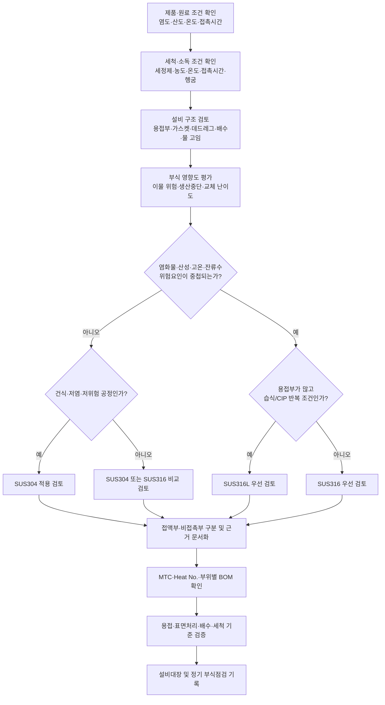

# [QA+ 블로그 생성 결과물] EQ005 스테인리스 304 316 선정
생성일시: 2026-09-16 07:20:10 (KST)
적용모델: gpt-5.6-terra

================================================================================
# 📋 최종 발행용 블로그 패키지

### 1. 메타 데이터 (SEO 설정)

- **최종 포스팅 제목**: 식품설비 SUS304·SUS316·SUS316L 선택 가이드｜제품보다 세척조건·배수구조를 먼저 보세요
- **메타 디스크립션 (120자 내외 요약)**: 식품설비에 SUS316L이 항상 정답은 아닙니다. 제품 염도·산도, 염소계 세정제, 온도, 용접부, 배수 구조를 기준으로 SUS304·316·316L을 선택하는 실무 가이드입니다.
- **추천 해시태그 (10개)**:  
  #식품설비 #SUS304 #SUS316 #SUS316L #식품품질관리 #HACCP #식품안전 #CIP #위생설계 #설비재질
- **카테고리**: 식품품질실무 / HACCP가이드 / 식품설비관리

> **QA·사실관계 검수 메모**  
> - 「식품위생법」 제9조는 식품 또는 식품첨가물에 관한 기준 및 규격, 기구 및 용기·포장에 관한 기준 및 규격 등의 고시 근거 조항입니다. 모든 식품 제조설비 접촉부에 SUS316L 사용을 일률적으로 의무화하는 규정으로 해석하면 안 됩니다.  
> - HACCP 관련 기준은 「식품 및 축산물 안전관리인증기준」 및 그 선행요건관리 취지에 따라, 설비가 세척·소독 가능하고 식품 오염을 방지할 수 있도록 위생적으로 유지·관리되는지를 중점적으로 봅니다.  
> - SUS304·SUS316·SUS316L은 통상 JIS 계열 호칭이며, 실제 발주 및 검수 시에는 적용 KS/JIS/ASTM 규격, MTC, Heat No., 부위별 BOM을 함께 확인해야 합니다.  
> - 염소계 세정제의 사용 가능 농도·온도·접촉시간은 설비 제작사와 세정제 제조사의 최신 권장조건 및 SDS를 기준으로 개별 확정해야 합니다.

---

## 2. 네이버 블로그 / 티스토리 복사용 최종 원고 (Markdown)

# EQ005 식품설비 재질 선정 가이드: SUS304·SUS316·SUS316L, 제품보다 세척조건을 먼저 보세요

> **20년 실무 선배의 한 줄 요약**  
> 식품설비라고 무조건 SUS316L을 선택할 필요는 없습니다. 다만 제품의 염도·산도, 세척제의 염화물 성분, 온도·접촉시간, 용접부와 배수 구조까지 평가한 뒤 **“우리 공정에서 부식과 이물 위험을 가장 안정적으로 막는 재질”**을 고르셔야 합니다.

---

## 1. “식품 접촉부니까 316L 아닌가요?” 현장에서 가장 많이 생기는 오해

설비 견적서를 받아 보면 식품 접촉부인데도 SUS304로 제안된 경우가 많습니다. 그러면 품질팀에서는 “식품이 닿으니 SUS316L로 올려야 하는 것 아닌가요?”라고 묻고, 구매팀은 “304도 식품설비에 많이 쓰는데 비용을 왜 더 올리느냐”고 고민하게 됩니다.

결론부터 말씀드리면 **식품 접촉 여부만으로 SUS316L을 일괄 적용하는 것은 정답이 아닙니다.**

반대로 기존 SUS304 탱크나 배관에 갈색 얼룩, 녹처럼 보이는 점, 백화 현상 또는 핀홀 형태의 점부식이 생기면 “역시 304라서 안 됐어”라고 판단하기도 합니다. 그런데 실제 현장을 열어 보면 재질 자체보다 염소계 세정제의 과다 사용, 헹굼 부족, 용접부 산화물 잔류, 물 고임, 철분 공구 오염이 원인인 경우가 많습니다.

SUS316으로 바꾸어도 같은 구조와 같은 세척 습관을 유지하면 다시 부식이 생길 수 있습니다. 비싼 재질을 넣고도 같은 문제가 반복되는 이유가 바로 여기에 있습니다.

EQ005라는 표기는 국내 법령이나 식품공전에서 정한 스테인리스 강종 코드가 아닙니다. 대부분 회사 내부의 설비관리번호, 투자 프로젝트 번호 또는 설비 사양서 번호일 가능성이 높습니다. 따라서 EQ005 설비의 재질을 검토할 때는 번호 자체보다 **그 설비가 무엇을 담고, 어떤 세척을 받고, 어느 환경에 설치되는지**를 먼저 확인해야 합니다.

탱크인지, 배관인지, 호퍼인지, 충전기 접액부인지에 따라 판단도 달라집니다.

특히 아래 조건이 겹치면 재질 상향 검토가 필요해집니다.

- 염수·김치·젓갈·수산물·염지육처럼 염화물 노출이 있는 제품
- 식초·유기산·과일산이 들어간 산성 제품
- 고온 CIP 세정
- 염소계 살균제 사용
- 물이 고이는 구조
- 용접부·가스켓·밸브 시트가 많은 구조

쉽게 말하면 스테인리스가 부담을 받는 조건을 여러 개 동시에 주는 공정이라면, 304만으로 버티게 하기보다 316 또는 316L 적용 범위를 적극적으로 검토하는 편이 안전합니다.


이제부터는 “316이 더 좋은 재질”이라는 단순 비교에서 벗어나 보겠습니다. 실무에서는 좋은 재질보다 **맞는 재질**, 그리고 그 재질이 오래 버틸 수 있게 만드는 구조와 관리기준이 더 중요합니다.

---

## 2. 법과 HACCP이 요구하는 것은 ‘SUS316L 사용’이 아니라 ‘위생적으로 유지되는 설비’입니다

먼저 분명히 짚고 가겠습니다.

「식품위생법」 제9조 및 이에 따른 「기구 및 용기·포장의 기준 및 규격」이 모든 식품 제조설비의 식품 접촉부를 반드시 SUS316 또는 SUS316L로 만들도록 일률적으로 정하고 있는 것은 아닙니다.

법령과 고시의 핵심은 식품과 접촉하는 기구·용기·포장이 유해물질을 이행하지 않고, 식품안전에 위해를 줄 수 있는 상태가 되지 않도록 관리하는 데 있습니다.

즉, “SUS316L이라는 이름표가 붙었는가”보다 실제 사용 상태에서 안전하고 위생적인가가 더 중요합니다.

HACCP 선행요건관리 관점도 같습니다. 「식품 및 축산물 안전관리인증기준」의 위생관리 취지상 작업장, 시설 및 설비는 청소·세척·소독이 가능해야 하고 식품 오염을 방지할 수 있도록 위생적으로 유지·관리되어야 합니다.

설비에 다음과 같은 문제가 있다면 강종이 316L이어도 심사 또는 실사에서 지적될 수 있습니다.

- 녹 또는 갈변
- 표면 박리
- 균열
- 거친 용접 비드
- 세척액 또는 제품의 고임
- 세척이 어려운 틈새
- 손상된 가스켓
- 식품 접촉부의 재질 불명 부품

쉽게 말하면 HACCP은 재질의 등급표만 보는 것이 아니라, **그 설비가 식품을 오염시키지 않도록 계속 관리되는지**를 봅니다.

식품 접촉부를 볼 때는 본체 스테인리스만 보면 안 됩니다. 탱크 내면은 316L인데 접액부 볼트가 일반 철재이거나, 밸브 시트와 O-ring이 세정제에 견디지 못하는 재질이면 그 부분이 먼저 문제를 일으킬 수 있습니다.

가스켓 틈새에 제품과 세정액이 남고, 그 주변에서 틈새부식이 시작되는 경우도 흔합니다. 따라서 설비 재질 검토는 탱크, 배관, 피팅, 밸브, 펌프, 볼트, 패킹까지 포함한 BOM 관점으로 접근하셔야 합니다.

또 하나 중요한 것은 식품공전의 역할입니다. 「식품의 기준 및 규격」은 스테인리스 강종을 직접 선정하는 설계 기준서는 아니지만, 식품의 산도·염도·성분과 오염 관리 관점에서 판단 근거가 될 수 있습니다.

예를 들어 고염 식품, 해산물 원료, 발효식품, 산성 소스는 설비 부식 위험을 키울 수 있는 공정 조건입니다. 따라서 품질팀은 제품 특성과 HACCP 위생관리 요구사항을 연결해 “왜 이 부위에 316L이 필요한가” 또는 “왜 304로도 관리 가능한가”를 문서로 설명할 수 있어야 합니다.

> **HACCP 관점 핵심 정리**  
> 특정 강종을 무조건 요구하는 것이 아니라, 식품 접촉부가 세척·소독 가능하고 부식·박리·이물 혼입 위험 없이 위생적으로 유지되는지를 관리하는 것이 핵심입니다.

법적 요구사항을 이해했다면, 이제 재질 특성을 정확히 구분할 차례입니다. 이 차이를 알아야 설비업체의 견적서와 품질팀의 요구사항을 같은 언어로 조율할 수 있습니다.

---

## 3. SUS304·SUS316·SUS316L, 이름은 비슷해도 적용 판단은 다릅니다

SUS304는 크롬(Cr)과 니켈(Ni)을 주성분으로 하는 대표적인 오스테나이트계 스테인리스강입니다. 가공성이 좋고 비교적 경제적이며, 식품공장 작업대, 커버, 호퍼, 일반 탱크, 건식 원료 이송부 등에 매우 널리 사용됩니다.

적절한 세척과 건조가 이루어지는 일반적인 환경에서는 SUS304도 충분히 안정적으로 사용할 수 있습니다. 그래서 “304는 식품에 쓰면 안 되는 재질”이라는 말은 맞지 않습니다.

SUS316은 304 계열에 몰리브덴(Mo)을 더한 계열로 이해하시면 됩니다. 몰리브덴은 염화물 환경에서 발생하기 쉬운 점부식과 틈새부식에 대한 저항성을 높이는 데 도움을 줍니다.

쉽게 말하면 소금기, 염수, 해산물 성분, 일부 산성 조건처럼 스테인리스에 부담을 주는 환경에서 304보다 한 단계 여유가 있는 재질입니다. 다만 “내식성이 더 좋다”와 “절대 부식되지 않는다”는 전혀 다른 말입니다.

SUS316L의 L은 Low Carbon, 즉 저탄소 계열이라는 뜻입니다. 용접부가 많은 탱크와 배관에서는 용접 열영향부의 입계부식 위험을 낮추는 데 유리할 수 있습니다.

그래서 액상식품 탱크, CIP 배관, 고염 원료 접액 배관, 반복 용접이 많은 구조물에서는 316L을 우선 검토하는 경우가 많습니다. 하지만 용접 품질이 나쁘고 산화 스케일을 그대로 두거나 적절한 표면 복원 관리를 하지 않으면 316L도 기대한 성능을 내기 어렵습니다.

| 구분 | SUS304 | SUS316 | SUS316L |
|---|---|---|---|
| 대표 특성 | 범용 크롬-니켈계 스테인리스 | 몰리브덴 첨가로 내식성 향상 | 316 계열의 저탄소 강종 |
| 상대 비용 | 가장 경제적 | 304보다 높음 | 304보다 높고 316과 유사하거나 다소 높음 |
| 일반 적용 | 건식 호퍼, 작업대, 커버, 저염 일반 공정 | 염수·수산물·산성 제품 접액부 | 용접부가 많은 탱크·배관·CIP 회로 |
| 강점 | 가공성, 경제성, 범용성 | 염화물·산성 환경에서 304보다 유리 | 용접 열영향부 관리에 유리 |
| 주의점 | 염소계 세정제, 잔류수, 틈새에서 부식 위험 | 염소계에 완전 무적이지 않음 | 재질만으로 용접·배수 문제 해결 불가 |

이 표를 보고 “그러면 무조건 316L로 가면 되겠네”라고 결론 내리시면 안 됩니다. 설비 전체를 상위 재질로 바꾸는 비용보다, 실제 고위험 접액부만 상향하고 나머지는 304로 합리화하는 방식이 더 효과적인 경우도 많습니다.

---

## 4. 재질보다 먼저 확인해야 할 4가지: 제품·세척·구조·부식 영향도

### 첫 번째, 제품과 원료의 특성입니다

제품에 소금, 염수, 간수, 젓갈 원료, 해산물 유래 성분이 들어가는지부터 확인해야 합니다. 식초, 구연산, 유기산, 과일 농축액, 산성 소스처럼 낮은 pH 조건도 함께 봐야 합니다.

단순히 제품의 pH만 보지 말고, 접촉시간과 온도까지 같이 확인해야 실제 위험도를 판단할 수 있습니다.

### 두 번째, 세척·소독 조건입니다

현장에서는 제품보다 세정제가 설비 수명을 더 크게 좌우하는 경우가 많습니다. 특히 차아염소산나트륨 등 염소계 세정·살균제를 사용한다면 다음 항목을 반드시 관리해야 합니다.

- 유효염소 농도
- 희석 방식
- 접촉시간
- 세정 온도
- 헹굼 여부
- 완전 배수 여부
- 작업자별 사용 편차

“하루에 한 번 뿌린다”는 정보만으로는 부족합니다. 작업자가 고농도로 희석해 장시간 방치하는 일이 없는지까지 봐야 합니다.

### 세 번째, 설비 구조와 표면 상태입니다

배관 저점부, 탱크 바닥, 가스켓 접합부, 밸브 시트 주변, 용접부 뒤쪽처럼 액이 고이는 부위는 틈새부식이 시작되기 쉽습니다.

데드레그(Dead leg)는 세정액과 제품이 충분히 순환하거나 배출되지 않는 막다른 구간을 말합니다. 쉽게 말하면 설비 안에서 물이나 소스가 빠지지 않고 고여 있는 ‘웅덩이’를 만들지 말라는 이야기입니다.

### 네 번째, 부식이 발생했을 때의 영향도입니다

분해와 교체가 쉬운 비접촉 커버의 작은 부식과, 하루 20톤을 생산하는 핵심 배관의 점부식은 위험도가 다릅니다.

핵심 설비에서 부식이 발생하면 다음 문제로 이어질 수 있습니다.

- 금속 이물 위험
- 생산 중단
- 세척 검증 재실시
- 고객사 클레임
- 납기 차질
- 긴급 보수 및 교체 비용
- HACCP 심사 또는 고객사 실사 지적

따라서 고위험 공정의 핵심 접액부는 초기 투자비만 보지 말고, 향후 가동중단 비용까지 포함해 판단하셔야 합니다.

| 검토 항목 | 확인 질문 | SUS304 적용 검토 조건 | SUS316/316L 우선 검토 조건 |
|---|---|---|---|
| 제품 염도 | 소금·염수·해산물 성분이 있는가? | 저염, 단시간 접촉 | 고염, 염수, 젓갈, 수산물 |
| 제품 산도 | 식초·유기산·과일산이 있는가? | 중성에 가깝고 체류 짧음 | 산성 제품, 고온·장시간 체류 |
| 세정제 | 염소계 세정·살균제를 쓰는가? | 비염소계 중심, 헹굼·건조 양호 | 염화물 노출 반복, 관리 오차 우려 |
| 온도 | 제품·세정 온도는 몇 ℃인가? | 상온~저온 중심 | 고온 세정과 화학약품이 결합 |
| 구조 | 액 고임·틈새·용접부가 많은가? | 단순 구조, 완전 배수 가능 | 복잡한 탱크·배관, 용접부 다수 |
| 부식 영향 | 고장 시 생산 영향은 어느 정도인가? | 교체 쉬움, 비핵심 부위 | 가동중단·이물 위험이 큰 핵심 설비 |


이 네 가지를 확인하면 “업체는 304를 제안하고 품질팀은 316L을 주장하는” 소모적인 논쟁이 크게 줄어듭니다.

---

## 5. 식품설비 재질 선정 실전 절차 5단계



### 1단계: 식품 접촉부와 비접촉부를 도면에서 분리합니다

발주 전에 P&ID, 제작도면 또는 배치도에 식품 접촉부를 표시하십시오.

식품 접촉부의 예시는 다음과 같습니다.

- 탱크 내면
- 제품 이송 배관 내면
- 밸브 접액부
- 펌프 케이싱
- 노즐
- 충전 노즐
- 호퍼 내면
- 제품이 닿는 피팅 및 클램프 부위

반면 프레임, 외장 커버, 제어반 지지대는 비접촉부일 수 있습니다. 단, 비접촉부라도 세척수 비산이나 염분이 많은 환경에 놓이면 외면 부식 관리가 필요합니다.

### 2단계: 제품 사양서와 세척 표준서를 같이 펼쳐 놓습니다

재질 선정 회의에 제품 배합표만 가져오면 반쪽짜리 검토가 됩니다.

SSOP 또는 CIP 조건서에서 다음 사항을 반드시 함께 확인해야 합니다.

- 세정제 종류
- 세정제 농도
- 세정 온도
- 순환시간
- 접촉시간
- 헹굼시간
- 염소계 살균제 사용 여부
- 세척 후 배수·건조 기준

예를 들어 알칼리 세정 1% 수준, 70℃, 30분 순환이라는 조건과 염소계 살균제 사용 여부는 재질 판단에 직접 영향을 줍니다.

정확한 허용 조건은 반드시 세정제 제조사와 설비 제작사의 권장사항을 기준으로 확정하셔야 합니다.

### 3단계: 용접부·가스켓·배수 구조를 검토합니다

탱크와 배관은 재질보다 용접부에서 먼저 문제가 생기는 경우가 많습니다.

용접부에 산화 스케일이 남아 있거나, 비드가 거칠고 미세한 틈이 있으면 세정액과 제품이 잔류합니다. 필요 시 용접 후 적절한 연마, 산세, 패시베이션 등 표면 복원 관리 기준을 계약서나 제작사 품질기준에 넣으십시오.

또한 아래 항목도 사전에 확인해야 합니다.

- 배수 방향
- 드레인 위치
- 배관 구배
- 저점부 잔류액 여부
- 분해 세척 필요 구간
- 가스켓 접합부의 세척성
- 밸브 시트 주변의 체류 가능성
- 데드레그 최소화 여부

### 4단계: MTC와 Heat No.로 실제 납품 재질을 확인합니다

견적서에 “SUS304 상당”이라고 적혀 있다고 해서 검수가 끝난 것은 아닙니다.

재질성적서(MTC, Mill Test Certificate)를 받아 다음 사항을 확인하십시오.

- 강종
- 화학성분
- 열번호(Heat No.)
- 적용 규격
- 자재 표기와 성적서의 연결성
- 판재·배관·피팅·밸브 등 부위별 재질

KS D 3698 또는 해외 제작품이라면 ASTM A240/A240M 등 적용 규격도 함께 확인할 수 있습니다.

특히 탱크 판재만 성적서가 있고 배관·피팅·밸브 접액부의 재질 자료가 빠지는 일이 많으니, 부위별 재질 리스트를 받아 두는 것이 좋습니다.

### 5단계: 재질 선정 근거를 설비대장에 남깁니다

심사 때 가장 곤란한 질문은 “왜 이 설비는 304이고, 저 설비는 316L인가요?”입니다.

이때 담당자의 기억으로 설명하면 담당자가 바뀌는 순간 관리가 무너집니다. 설비대장에 다음 내용을 기록해 두십시오.

- 접액부 재질
- 비접촉부 재질
- 제품 특성
- 세척 조건
- 선정 사유
- MTC 파일 위치
- Heat No.
- 용접 및 표면처리 기준
- 점검 주기
- 이상 발생 이력
- 개선조치 이력

> **★ 심사 대응 꿀팁**  
> 심사관은 “316L을 썼는지”보다 “부식 위험을 어떻게 평가했고, 실제 부식이 생겼을 때 어떤 기준으로 조치했는지”를 봅니다. 재질선정평가서, MTC, 설치 전·후 사진, 용접부 점검기록, 세척 표준서가 연결되어 있으면 설명이 훨씬 쉬워집니다.

---

## 6. SUS304 설비에 녹·갈변·점부식이 생겼을 때, 재질 교체 전에 확인할 것

첫 번째로 확인할 것은 그것이 진짜 모재 부식인지, 아니면 표면에 묻은 철분 오염인지입니다.

스테인리스 전용이 아닌 탄소강 와이어 브러시, 그라인더, 연마재를 사용하면 철분이 표면에 전이될 수 있습니다. 이후 습한 환경에서 그 철분이 녹슬면 마치 SUS304 자체가 녹슨 것처럼 보일 수 있습니다.

인접한 철재 프레임이나 천장 구조물에서 녹물이 떨어진 경우도 있으니 위치와 작업 이력을 먼저 확인하십시오.

두 번째는 세정제 사용 이력입니다.

- 염소계 살균제를 원액에 가깝게 사용했는가?
- 희석 농도를 작업자마다 다르게 적용했는가?
- 분무 후 방치시간이 길었는가?
- 고온 세정과 염화물 노출이 함께 있었는가?
- 세정 후 충분히 헹구었는가?
- 세척 후 잔류수가 남았는가?

특히 고온 조건과 염화물 노출이 결합되면 국부부식 위험이 커질 수 있습니다. 세정 후 충분히 헹구지 않으면 염류와 세정 성분이 건조 과정에서 농축되어 부식을 더 빠르게 만들 수 있습니다.

세 번째는 부식 위치입니다.

| 부식 발생 위치 | 우선 확인할 원인 |
|---|---|
| 용접 열영향부 주변 | 용접 후 표면처리 부족, 산화 스케일 잔류, 용접 품질 |
| 가스켓 주변·볼트 체결부 | 틈새부식, 가스켓 손상, 잔류액 |
| 탱크 바닥·배관 저점부 | 배수 불량, 잔류수, 세정액 농축 |
| 외부 프레임·커버 | 세척수 비산, 염분 환경, 철분 오염 |
| 특정 작업 구역 | 공구 오염, 세정제 사용 편차, 외부 녹물 유입 |

네 번째는 개선 순서입니다.

무조건 설비 전체를 316L로 교체하기 전에 다음 항목부터 검토하십시오.

1. 세정제 조건 조정  
2. 충분한 헹굼 기준 설정  
3. 완전 배수 구조 확보  
4. 표면 재처리  
5. 철분 공구 분리  
6. 틈새 구조 개선  
7. 용접부 마감 기준 강화  
8. 고위험 접액부만 316 또는 316L로 상향  

원인이 구조나 세척 관리라면 그 문제를 고치지 않는 한 316L에서도 유사한 문제가 생길 수 있습니다.

반대로 원인을 제거했는데도 고염·산성·고온 조건 자체가 피할 수 없는 공정이라면, 그때 고위험 접액부를 316 또는 316L로 상향하는 것이 합리적입니다.

---

## 7. 실제 현장 사례로 보는 SUS304·SUS316L 적용법

> 아래 사례는 식품공장 설비 검토 시 활용할 수 있도록 일반화한 실무형 사례입니다. 실제 설비 교체 또는 세정제 조건 변경 전에는 현장 조건, 제작사 사양, 세정제 제조사 권장조건, 필요 시 전문 부식 분석 결과를 함께 확인해야 합니다.

### 사례 1. 냉동만두 제조공장 염지육 배합탱크의 점부식 문제

냉동만두 제조공장의 육류 배합실에서 사용하던 SUS304 배합탱크 하부에 작은 갈색 점들이 반복적으로 발생했습니다. 처음에는 작업자들이 원료 육즙이나 세척 불량으로 생각해 표면만 닦고 계속 사용했습니다.

그러나 3개월 뒤 점들이 늘어나고 일부는 손톱으로 만졌을 때 표면이 거칠게 느껴질 정도로 진행되었습니다.

해당 탱크는 소금과 복합조미료가 포함된 염지육을 하루 2회 이상 배합했고, 세척 후 차아염소산계 살균제를 분무하는 방식으로 관리하고 있었습니다.

원인 분석 결과, 단순히 SUS304를 사용한 사실만이 문제가 아니었습니다.

- 탱크 바닥 드레인 주변에 미세한 물 고임이 있었음
- 살균제 분무 후 헹굼 기준이 없었음
- 염화물 성분이 접액부에 잔류했음
- 탱크 내부 용접부 일부에 산화 변색이 남아 있었음
- 드레인 주변 마감 부위가 거칠었음
- 수분과 염류가 드레인 주변에 집중되었음

즉, 염지육의 염분, 염소계 살균제, 잔류수, 용접부 표면 상태가 동시에 겹친 것이 근본 원인이었습니다.

현장에서는 탱크 전체를 즉시 교체하지 않고 먼저 세정·살균 표준을 개정해 희석 농도와 접촉시간, 헹굼 절차를 명확히 했습니다.

또한 드레인부 구배를 보완하고, 문제가 된 용접부는 표면 복원 작업을 실시한 뒤 상태를 사진으로 기록했습니다.

다음 증설 시에는 염지육이 장시간 접촉하는 배합탱크 내면과 접액 배관, 밸브 접액부를 SUS316L로 지정했습니다. 반면 외부 프레임과 비접촉 커버는 세척수 비산 관리와 표면 관리 기준을 강화하는 조건으로 SUS304를 유지했습니다.

개선 후에는 월 1회 부식점검을 실시했습니다. 이 사례의 핵심은 “304가 나빠서”가 아니라 **고위험 접액부는 316L로 상향하고, 세척·배수 문제는 별도로 바로잡아야 한다**는 점입니다.

### 사례 2. 산성 소스 레토르트 공장, 탱크는 316L인데 밸브 주변이 먼저 부식된 사례

토마토와 식초를 사용하는 산성 소스 레토르트 공장에서는 신규 조합탱크와 제품 배관을 SUS316L로 설치했습니다.

설비 투자 당시에는 “316L이니 부식 걱정은 없겠다”는 분위기였고, 재질성적서도 탱크 판재 중심으로 확보되어 있었습니다.

그런데 가동 후 밸브 하부와 클램프 연결부 주변에서 갈변과 표면 거침이 발견되었습니다. 탱크 내면은 비교적 양호했지만, 제품이 자주 고이는 밸브 시트 인근과 가스켓 접합부에 문제가 집중되었습니다.

품질팀과 공무팀이 설비를 분해해 보니 일부 피팅과 체결부의 재질 관리가 불명확했습니다.

- 본체 탱크는 316L이었음
- 일부 부속품은 “스테인리스”로만 구매됨
- 일부 피팅과 체결부는 정확한 강종 자료가 없었음
- 가스켓 재질의 산성 제품 및 CIP 조건 적합성 확인이 부족했음
- CIP 후 저점부 배수가 완전하지 않았음
- 산성 세정액과 수분이 접합부에 오래 남는 구조였음

즉, 316L 탱크를 적용했어도 구성품 전체와 배수 구조를 함께 관리하지 않아 틈새부식 위험이 남아 있었던 것입니다.

개선 조치로 접액부 밸브·피팅·클램프를 포함한 재질 BOM을 다시 작성했습니다. 재질 불명 부품은 MTC가 확인되는 사양으로 교체했고, 가스켓은 제품 및 세정제 조건에 맞는 내약품성 자료를 확인해 선정했습니다.

배관 저점부에는 드레인 개선을 적용하고, CIP 종료 후 배수 확인 항목을 작업일지에 넣었습니다. 밸브 분해점검 주기도 위험도에 따라 강화했습니다.

이 사례는 **316L 자체보다 전체 접액 시스템의 위생설계와 부속재질 관리가 중요하다**는 점을 잘 보여줍니다.

### 사례 3. 곡물 분말 호퍼에 불필요하게 316L을 적용하려다 비용을 줄인 사례

시리얼과 곡물 분말을 취급하는 건식 식품공장에서는 신규 자동투입 호퍼 견적을 받으면서 전 접촉부를 SUS316L로 요청했습니다.

품질팀은 식품 접촉설비이므로 상위 재질이 필요하다고 판단했고, 설비업체는 그대로 견적을 제출했습니다. 그런데 초기 견적이 예상 예산보다 약 20% 이상 높아지면서 투자 검토가 지연되었습니다.

공정 담당자와 함께 실제 사용 조건을 다시 조사해 보니 해당 호퍼는 상온의 건조 분말만 취급했고, 제품 체류시간도 짧았습니다.

세척 방식도 물 세척이 아니라 대부분 진공청소와 마른 닦음이었으며, 월 1회 정도만 분해 점검을 실시하고 있었습니다.

다음과 같은 주요 부식 요인이 거의 없었습니다.

- 염수
- 산성 제품
- 염소계 세정제
- 고온 CIP
- 장시간의 잔류수
- 고온·고습 접액 환경

다만 호퍼 외부가 세척수 비산 구역과 가까워 외면 오염 가능성은 있었습니다.

그래서 식품 접촉 내면과 일반 구조부에 SUS304를 적용하되, 용접부는 매끄럽게 마감하고 철분 공구 오염 방지 기준을 제작사에 요구했습니다.

외부 하부 프레임은 물 고임이 생기지 않도록 구조를 변경하고, 바닥과의 간격을 확보해 청소성을 높였습니다.

견적서에는 단순히 “SUS304”라고 적지 않고, 아래와 같이 구체화했습니다.

> “식품 접촉 내면 SUS304 적용, 지정 판재 두께 준수, 용접 마감 기준 준수, MTC 제출, 탄소강 공구 및 연마재에 의한 철분 오염 방지.”

품질팀은 재질선정평가서에 제품 특성, 세척 방식, 부식 위험도, 304 적용 근거를 남겼습니다.

결과적으로 불필요한 316L 상향 적용 비용을 줄이면서도 HACCP 관점의 위생성과 추적성은 확보할 수 있었습니다.

이 사례는 **304를 선택하는 것도 충분한 검토와 문서화가 있으면 매우 합리적인 의사결정**이 될 수 있다는 점을 보여줍니다.

---

## 8. 발주서·도면·검수 단계에서 꼭 넣어야 할 문구와 확인사항

설비 발주서에는 “스테인리스 제작” 또는 “SUS304 상당”처럼 모호한 표현을 피하셔야 합니다.

최소한 식품 접촉부와 비접촉부를 구분하고, 각각의 강종을 도면에 표시해야 합니다.

탱크 본체만 적고 배관·피팅·밸브·볼트·가스켓을 누락하면 설치 후 검증이 어려워집니다. 특히 외주 제작품은 제작사마다 ‘상당재’의 해석이 다를 수 있으므로 계약 단계에서 명확히 잡아야 합니다.

아래 문구는 일반 식품설비 발주서에 활용할 수 있는 기본 예시입니다.

> **발주 사양 예시**  
> “식품 접촉부 재질은 도면에 명확히 구분하여 표기하고, 지정 강종에 대한 재질성적서(MTC)를 제출한다. 식품 접촉부 용접부는 균열, 틈새, 용접 산화물 잔류, 과도한 표면 거침이 없도록 마감한다. 제작 및 설치 과정에서 탄소강 공구·연마재 등에 의한 철분 오염이 발생하지 않도록 관리하며, 세척 후 잔류액이 남지 않도록 배수 구조를 확보한다.”

고염·산성·염화물 노출이 예상되는 공정은 적용 범위를 더 구체적으로 적는 것이 좋습니다.

예를 들어 “염수·산성 원료 접촉부 및 CIP 반복 접촉부는 SUS316L 적용”이라고만 적지 말고, 아래 범위를 명시하십시오.

- 탱크 내면
- 제품 접촉 배관
- 밸브 접액부
- 피팅
- 노즐
- 펌프 케이싱
- 클램프
- 가스켓의 재질 및 내약품성 확인 기준

그래야 견적 단계에서 빠지는 부품이 줄어듭니다. 또한 세정제와 접촉하는 외면 부위도 별도 검토가 필요합니다.

검수 단계에서는 MTC와 현물의 연결성을 확인해야 합니다.

- MTC의 Heat No.
- 자재 표기
- 제작사 자재관리 기록
- 설치도면의 부위별 재질
- 실제 설치 자재

위 항목이 연결되는지 확인하십시오.

자석 반응만으로 304와 316을 판별하려고 하면 안 됩니다. 가공이나 용접 영향으로 일부 자성이 나타날 수 있으므로, 정확한 확인은 성적서와 필요 시 전문 성분 분석을 통해 판단해야 합니다.

---

## 9. HACCP 심사와 고객사 실사에서 자주 나오는 지적사항

### 1) 식품 접촉부 재질 선정 근거가 없는 경우

설비대장에 단순히 “스테인리스”라고만 적혀 있거나, 도면과 MTC가 연결되지 않을 때 많이 나옵니다.

이 경우 설비별로 아래 내용을 정리하면 대응이 쉬워집니다.

- 접액부 재질
- 선정 사유
- 제품 특성
- 세척 조건
- 관련 성적서 파일 위치
- 정기점검 주기
- 이상 발생 시 조치 기준

고위험 공정은 재질선정평가서를 별도로 작성해 두시면 좋습니다.

### 2) 용접부의 녹, 갈변, 표면 거침, 균열

심사관은 용접부에 제품이 남을 수 있는지, 세척이 가능한지, 박리된 금속이 이물이 될 가능성이 있는지를 봅니다.

보수 후에는 단순히 “수리 완료”라고 쓰지 말고 다음 항목을 남기십시오.

- 조치 전 사진
- 조치 후 사진
- 발생 위치
- 보수 방법
- 사용 자재
- 확인자
- 확인일
- 재발 방지 조치
- 구조 개선 또는 세정 조건 재검토 내용

반복 발생 부위라면 구조 개선 또는 세정 조건 재검토까지 연결해야 합니다.

### 3) 염소계 세정제를 작업자 감각으로 사용하는 경우

희석 비율이 사람마다 다르고, 접촉시간과 헹굼 기준이 없으면 부식 위험뿐 아니라 세척 검증의 일관성도 떨어집니다.

세정제별로 아래 사항을 SSOP에 명시하십시오.

- 농도
- 온도
- 접촉시간
- 헹굼 방법
- 사용 가능 설비
- 보관 기준
- 희석 방법
- 작업자 보호구
- 사용 후 배수 및 건조 기준

SDS와 제조사 권장 사용조건도 함께 보관하면 좋습니다.

### 4) 설비 하부와 배관 저점부의 물 고임

고인 물에는 제품 성분, 염류, 세정 성분이 농축될 수 있어 국부부식이 빨라질 수 있습니다.

배수 구배를 개선하고, 세척 후 다음 사항을 확인하는 절차를 넣으십시오.

- 드레인 개방 상태
- 저점부 잔류수 여부
- 가스켓 주변 잔류액 여부
- 배관 내부 배수 상태
- 탱크 바닥 잔류수 여부
- 세척 후 건조 상태

“닦았다”보다 “완전히 빠졌는가”가 더 중요한 순간이 많습니다.

---

## 10. EQ005 설비 재질 선정·검수 체크리스트

아래 표는 설비 구매 전, 설치 검수 시, 정기점검 때 공통으로 활용할 수 있습니다.

담당 부서가 나뉘어 있다면 품질팀은 위험평가와 기록 관리를, 공무팀은 구조·용접·배수 확인을, 생산팀은 실제 세척 조건 준수를 담당하는 방식으로 역할을 나누시면 좋습니다.

| 단계 | 점검 항목 | 기준 또는 확인 내용 | 확인 방법 | 담당 |
|---|---|---|---|---|
| 구매 전 | 제품 특성 확인 | 염도, pH, 원료 성분, 체류시간 확인 | 배합표·제품규격서 검토 | 품질·생산 |
| 구매 전 | 세척 조건 확인 | 세정제 종류, 농도, 온도, 접촉시간, 헹굼 조건 | SSOP·CIP 조건서 검토 | 품질·생산 |
| 구매 전 | 재질 선정 | 접액부와 비접촉부 강종 구분 | 재질선정평가서 작성 | 품질·공무 |
| 구매 전 | 구조 검토 | 데드레그, 틈새, 배수, 분해세척성 확인 | 제작도면·P&ID 검토 | 공무·품질 |
| 제작 중 | 용접 및 표면 | 용접부 균열·산화물·거친 비드 여부 확인 | 제작검사 기록·사진 | 제작사·공무 |
| 납품 시 | 재질 증빙 | MTC, Heat No., 적용 규격 확보 | 성적서와 자재 기록 대조 | 구매·품질 |
| 설치 후 | 위생성 확인 | 잔류액, 물 고임, 세척 사각 확인 | 물 배수 테스트·육안점검 | 생산·공무 |
| 운영 중 | 부식 점검 | 갈변, 점부식, 틈새부식, 철분 오염 확인 | 월 1회 또는 위험도별 점검 | 품질·공무 |
| 이상 발생 시 | 원인 분석 | 재질·세정제·용접·배수·공구 오염 분리 조사 | 5Why 및 개선조치서 | 전 부서 |

체크리스트는 만들어 두는 것보다 실제로 쓰는 것이 중요합니다.

특히 부식 이상이 발생했을 때는 “재질 불량”이라고 바로 결론 내리지 말고, 세정제 사용 이력과 위치별 구조적 특징을 함께 기록하십시오. 그래야 다음 설비 투자 때 같은 실수를 반복하지 않습니다.

---

## 11. 자주 묻는 질문(FAQ)

### Q1. 식품공장은 무조건 SUS316L을 써야 하나요?

**A. 아닙니다.** 국내 식품 관련 법령과 HACCP 기준이 모든 식품설비에 SUS316L을 일률적으로 의무화하지는 않습니다.

식품 접촉 여부뿐 아니라 제품의 염도·산도, 세척제, 온도, 접촉시간, 설비 구조, 부식 발생 시 영향도를 종합적으로 평가해서 결정해야 합니다.

### Q2. SUS304는 식품에 사용하면 안 되는 재질인가요?

**A. 아닙니다.** SUS304는 식품설비에서 매우 널리 쓰이는 범용 재질이며, 건식 공정이나 저염 제품, 적절히 세척·건조되는 일반 공정에는 합리적인 선택이 될 수 있습니다.

다만 염수, 염소계 세정제, 틈새, 잔류수, 고온 조건이 겹치면 부식 위험이 높아질 수 있습니다.

### Q3. SUS316이면 염소계 세정제를 마음껏 써도 되나요?

**A. 절대 그렇게 보시면 안 됩니다.** SUS316은 SUS304보다 염화물 환경에 유리할 수 있지만, 염소계 세정제의 농도가 높고 접촉시간이 길거나 헹굼이 부족하면 점부식·틈새부식이 발생할 수 있습니다.

세정제 제조사의 권장 농도와 사용시간을 지키고, 충분한 헹굼과 배수를 관리해야 합니다.

### Q4. SUS316과 SUS316L 중 어느 것을 선택해야 하나요?

**A. 용접부가 많고 습식 공정 또는 CIP 반복 조건이 있는 탱크·배관이라면 SUS316L을 우선 검토할 수 있습니다.**

L은 저탄소 계열이라 용접 열영향부의 입계부식 위험 관리에 유리할 수 있기 때문입니다. 다만 용접 품질과 후처리, 표면 상태가 나쁘다면 316L의 장점도 충분히 살리기 어렵습니다.

### Q5. 견적서에 ‘SUS304 상당’이라고 쓰여 있으면 충분한가요?

**A. 충분하지 않을 수 있습니다.** 식품 접촉부의 정확한 강종, 적용 위치, 판재 두께, 배관·피팅·밸브 재질, MTC 제출 여부, 용접 및 표면처리 기준을 계약서와 도면에 명시하는 것이 안전합니다.

“상당”이라는 표현은 추후 책임 범위를 모호하게 만들 수 있습니다.

### Q6. 자석에 붙으면 SUS304나 SUS316이 아닌가요?

**A. 자석 반응만으로 강종을 단정하면 안 됩니다.** 오스테나이트계 스테인리스도 냉간가공이나 용접 영향으로 일부 자성을 보일 수 있습니다.

정확한 재질 확인은 MTC, Heat No., 화학성분 분석 또는 전문 시험을 통해 하셔야 합니다.

---

## 12. 맺음말: 더 비싼 재질보다 더 맞는 조건을 선택하십시오

오늘 내용은 세 줄로 정리할 수 있습니다.

1. **식품설비라고 무조건 SUS316L이 정답은 아닙니다.**  
2. **SUS304와 SUS316L의 선택은 제품보다 세척제·온도·잔류수·용접부 조건에서 갈리는 경우가 많습니다.**  
3. **재질, 표면처리, 배수, 세척기준, MTC 관리가 함께 갖춰져야 HACCP과 현장 운영 모두 안정적입니다.**

EQ005 설비의 재질 선정은 단순히 “304냐 316이냐”를 고르는 일이 아닙니다.

우리 제품이 무엇인지, 세척할 때 어떤 약품을 쓰는지, 물이 어디에 남는지, 용접부와 가스켓이 어떤 구조인지까지 보는 위험평가 작업입니다.

설비 발주 전 체크시트 한 장을 남기는 습관이 나중의 녹 문제, 심사 지적, 생산 중단, 불필요한 교체 비용을 크게 줄여줍니다.

식품설비 SUS304·SUS316·SUS316L의 선택은 결국 가격 경쟁이 아니라, **부식과 이물 위험을 줄이기 위한 위생설계와 관리의 문제**입니다.

---

## 3. 워드프레스 / 웹사이트용 HTML 원고

```html
<article class="food-qa-post">
  <header>
    <h1>EQ005 식품설비 재질 선정 가이드: SUS304·SUS316·SUS316L, 제품보다 세척조건을 먼저 보세요</h1>
    <blockquote>
      <p><strong>20년 실무 선배의 한 줄 요약</strong>: 식품설비라고 무조건 SUS316L을 선택할 필요는 없습니다. 다만 제품의 염도·산도, 세척제의 염화물 성분, 온도·접촉시간, 용접부와 배수 구조까지 평가한 뒤 <strong>“우리 공정에서 부식과 이물 위험을 가장 안정적으로 막는 재질”</strong>을 고르셔야 합니다.</p>
    </blockquote>
  </header>

  <section>
    <h2>1. “식품 접촉부니까 316L 아닌가요?” 현장에서 가장 많이 생기는 오해</h2>

    <p>설비 견적서를 받아 보면 식품 접촉부인데도 SUS304로 제안된 경우가 많습니다. 그러면 품질팀에서는 “식품이 닿으니 SUS316L로 올려야 하는 것 아닌가요?”라고 묻고, 구매팀은 “304도 식품설비에 많이 쓰는데 비용을 왜 더 올리느냐”고 고민하게 됩니다.</p>

    <p>결론부터 말씀드리면 <strong>식품 접촉 여부만으로 SUS316L을 일괄 적용하는 것은 정답이 아닙니다.</strong></p>

    <p>반대로 기존 SUS304 탱크나 배관에 갈색 얼룩, 녹처럼 보이는 점, 백화 현상 또는 핀홀 형태의 점부식이 생기면 “역시 304라서 안 됐어”라고 판단하기도 합니다. 그런데 실제 현장을 열어 보면 재질 자체보다 염소계 세정제의 과다 사용, 헹굼 부족, 용접부 산화물 잔류, 물 고임, 철분 공구 오염이 원인인 경우가 많습니다.</p>

    <p>SUS316으로 바꾸어도 같은 구조와 같은 세척 습관을 유지하면 다시 부식이 생길 수 있습니다. 비싼 재질을 넣고도 같은 문제가 반복되는 이유가 바로 여기에 있습니다.</p>

    <p>EQ005라는 표기는 국내 법령이나 식품공전에서 정한 스테인리스 강종 코드가 아닙니다. 대부분 회사 내부의 설비관리번호, 투자 프로젝트 번호 또는 설비 사양서 번호일 가능성이 높습니다. 따라서 EQ005 설비의 재질을 검토할 때는 번호 자체보다 <strong>그 설비가 무엇을 담고, 어떤 세척을 받고, 어느 환경에 설치되는지</strong>를 먼저 확인해야 합니다.</p>

    <p>탱크인지, 배관인지, 호퍼인지, 충전기 접액부인지에 따라 판단도 달라집니다.</p>

    <ul>
      <li>염수·김치·젓갈·수산물·염지육처럼 염화물 노출이 있는 제품</li>
      <li>식초·유기산·과일산이 들어간 산성 제품</li>
      <li>고온 CIP 세정</li>
      <li>염소계 살균제 사용</li>
      <li>물이 고이는 구조</li>
      <li>용접부·가스켓·밸브 시트가 많은 구조</li>
    </ul>

    <p>쉽게 말하면 스테인리스가 부담을 받는 조건을 여러 개 동시에 주는 공정이라면, 304만으로 버티게 하기보다 316 또는 316L 적용 범위를 적극적으로 검토하는 편이 안전합니다.</p>

    <figure>
      
      <figcaption>제품 조건·세척 조건·설비 구조·부식 영향도를 함께 확인해야 식품설비 재질을 합리적으로 선정할 수 있습니다.</figcaption>
    </figure>

    <p>이제부터는 “316이 더 좋은 재질”이라는 단순 비교에서 벗어나 보겠습니다. 실무에서는 좋은 재질보다 <strong>맞는 재질</strong>, 그리고 그 재질이 오래 버틸 수 있게 만드는 구조와 관리기준이 더 중요합니다.</p>
  </section>

  <section>
    <h2>2. 법과 HACCP이 요구하는 것은 ‘SUS316L 사용’이 아니라 ‘위생적으로 유지되는 설비’입니다</h2>

    <p>먼저 분명히 짚고 가겠습니다.</p>

    <p>「식품위생법」 제9조 및 이에 따른 「기구 및 용기·포장의 기준 및 규격」이 모든 식품 제조설비의 식품 접촉부를 반드시 SUS316 또는 SUS316L로 만들도록 일률적으로 정하고 있는 것은 아닙니다.</p>

    <p>법령과 고시의 핵심은 식품과 접촉하는 기구·용기·포장이 유해물질을 이행하지 않고, 식품안전에 위해를 줄 수 있는 상태가 되지 않도록 관리하는 데 있습니다. 즉, “SUS316L이라는 이름표가 붙었는가”보다 실제 사용 상태에서 안전하고 위생적인가가 더 중요합니다.</p>

    <p>HACCP 선행요건관리 관점도 같습니다. 「식품 및 축산물 안전관리인증기준」의 위생관리 취지상 작업장, 시설 및 설비는 청소·세척·소독이 가능해야 하고 식품 오염을 방지할 수 있도록 위생적으로 유지·관리되어야 합니다.</p>

    <p>설비에 녹, 표면 박리, 균열, 거친 용접 비드, 세척액 고임 또는 세척이 어려운 틈새가 있으면 강종이 316L이어도 심사 또는 실사에서 지적될 수 있습니다.</p>

    <p>쉽게 말하면 HACCP은 재질의 등급표만 보는 것이 아니라, <strong>그 설비가 식품을 오염시키지 않도록 계속 관리되는지</strong>를 봅니다.</p>

    <p>식품 접촉부를 볼 때는 본체 스테인리스만 보면 안 됩니다. 탱크 내면은 316L인데 접액부 볼트가 일반 철재이거나, 밸브 시트와 O-ring이 세정제에 견디지 못하는 재질이면 그 부분이 먼저 문제를 일으킬 수 있습니다.</p>

    <p>가스켓 틈새에 제품과 세정액이 남고, 그 주변에서 틈새부식이 시작되는 경우도 흔합니다. 따라서 설비 재질 검토는 탱크, 배관, 피팅, 밸브, 펌프, 볼트, 패킹까지 포함한 BOM 관점으로 접근하셔야 합니다.</p>

    <blockquote>
      <p><strong>HACCP 관점 핵심 정리</strong><br>특정 강종을 무조건 요구하는 것이 아니라, 식품 접촉부가 세척·소독 가능하고 부식·박리·이물 혼입 위험 없이 위생적으로 유지되는지를 관리하는 것이 핵심입니다.</p>
    </blockquote>
  </section>

  <section>
    <h2>3. SUS304·SUS316·SUS316L, 이름은 비슷해도 적용 판단은 다릅니다</h2>

    <p>SUS304는 크롬(Cr)과 니켈(Ni)을 주성분으로 하는 대표적인 오스테나이트계 스테인리스강입니다. 가공성이 좋고 비교적 경제적이며, 식품공장 작업대, 커버, 호퍼, 일반 탱크, 건식 원료 이송부 등에 매우 널리 사용됩니다.</p>

    <p>적절한 세척과 건조가 이루어지는 일반적인 환경에서는 SUS304도 충분히 안정적으로 사용할 수 있습니다. 그래서 “304는 식품에 쓰면 안 되는 재질”이라는 말은 맞지 않습니다.</p>

    <p>SUS316은 304 계열에 몰리브덴(Mo)을 더한 계열로 이해하시면 됩니다. 몰리브덴은 염화물 환경에서 발생하기 쉬운 점부식과 틈새부식에 대한 저항성을 높이는 데 도움을 줍니다.</p>

    <p>SUS316L의 L은 Low Carbon, 즉 저탄소 계열이라는 뜻입니다. 용접부가 많은 탱크와 배관에서는 용접 열영향부의 입계부식 위험을 낮추는 데 유리할 수 있습니다.</p>

    <div class="table-responsive">
      <table>
        <thead>
          <tr>
            <th>구분</th>
            <th>SUS304</th>
            <th>SUS316</th>
            <th>SUS316L</th>
          </tr>
        </thead>
        <tbody>
          <tr>
            <td>대표 특성</td>
            <td>범용 크롬-니켈계 스테인리스</td>
            <td>몰리브덴 첨가로 내식성 향상</td>
            <td>316 계열의 저탄소 강종</td>
          </tr>
          <tr>
            <td>상대 비용</td>
            <td>가장 경제적</td>
            <td>304보다 높음</td>
            <td>304보다 높고 316과 유사하거나 다소 높음</td>
          </tr>
          <tr>
            <td>일반 적용</td>
            <td>건식 호퍼, 작업대, 커버, 저염 일반 공정</td>
            <td>염수·수산물·산성 제품 접액부</td>
            <td>용접부가 많은 탱크·배관·CIP 회로</td>
          </tr>
          <tr>
            <td>강점</td>
            <td>가공성, 경제성, 범용성</td>
            <td>염화물·산성 환경에서 304보다 유리</td>
            <td>용접 열영향부 관리에 유리</td>
          </tr>
          <tr>
            <td>주의점</td>
            <td>염소계 세정제, 잔류수, 틈새에서 부식 위험</td>
            <td>염소계에 완전 무적이지 않음</td>
            <td>재질만으로 용접·배수 문제 해결 불가</td>
          </tr>
        </tbody>
      </table>
    </div>
  </section>

  <section>
    <h2>4. 재질보다 먼저 확인해야 할 4가지: 제품·세척·구조·부식 영향도</h2>

    <h3>첫 번째, 제품과 원료의 특성입니다</h3>
    <p>제품에 소금, 염수, 간수, 젓갈 원료, 해산물 유래 성분이 들어가는지부터 확인해야 합니다. 식초, 구연산, 유기산, 과일 농축액, 산성 소스처럼 낮은 pH 조건도 함께 봐야 합니다.</p>
    <p>단순히 제품의 pH만 보지 말고, 접촉시간과 온도까지 같이 확인해야 실제 위험도를 판단할 수 있습니다.</p>

    <h3>두 번째, 세척·소독 조건입니다</h3>
    <p>현장에서는 제품보다 세정제가 설비 수명을 더 크게 좌우하는 경우가 많습니다. 특히 차아염소산나트륨 등 염소계 세정·살균제를 사용한다면 유효염소 농도, 희석 방식, 접촉시간, 세정 온도, 헹굼 여부를 반드시 관리해야 합니다.</p>

    <h3>세 번째, 설비 구조와 표면 상태입니다</h3>
    <p>배관 저점부, 탱크 바닥, 가스켓 접합부, 밸브 시트 주변, 용접부 뒤쪽처럼 액이 고이는 부위는 틈새부식이 시작되기 쉽습니다.</p>
    <p>데드레그(Dead leg)는 세정액과 제품이 충분히 순환하거나 배출되지 않는 막다른 구간을 말합니다. 쉽게 말하면 설비 안에서 물이나 소스가 빠지지 않고 고여 있는 ‘웅덩이’를 만들지 말라는 이야기입니다.</p>

    <h3>네 번째, 부식이 발생했을 때의 영향도입니다</h3>
    <p>분해와 교체가 쉬운 비접촉 커버의 작은 부식과, 하루 20톤을 생산하는 핵심 배관의 점부식은 위험도가 다릅니다. 핵심 설비에서 부식이 발생하면 금속 이물 위험, 생산 중단, 세척 검증 재실시, 고객사 클레임, 납기 차질로 이어질 수 있습니다.</p>

    <div class="table-responsive">
      <table>
        <thead>
          <tr>
            <th>검토 항목</th>
            <th>확인 질문</th>
            <th>SUS304 적용 검토 조건</th>
            <th>SUS316/316L 우선 검토 조건</th>
          </tr>
        </thead>
        <tbody>
          <tr>
            <td>제품 염도</td>
            <td>소금·염수·해산물 성분이 있는가?</td>
            <td>저염, 단시간 접촉</td>
            <td>고염, 염수, 젓갈, 수산물</td>
          </tr>
          <tr>
            <td>제품 산도</td>
            <td>식초·유기산·과일산이 있는가?</td>
            <td>중성에 가깝고 체류 짧음</td>
            <td>산성 제품, 고온·장시간 체류</td>
          </tr>
          <tr>
            <td>세정제</td>
            <td>염소계 세정·살균제를 쓰는가?</td>
            <td>비염소계 중심, 헹굼·건조 양호</td>
            <td>염화물 노출 반복, 관리 오차 우려</td>
          </tr>
          <tr>
            <td>온도</td>
            <td>제품·세정 온도는 몇 ℃인가?</td>
            <td>상온~저온 중심</td>
            <td>고온 세정과 화학약품이 결합</td>
          </tr>
          <tr>
            <td>구조</td>
            <td>액 고임·틈새·용접부가 많은가?</td>
            <td>단순 구조, 완전 배수 가능</td>
            <td>복잡한 탱크·배관, 용접부 다수</td>
          </tr>
          <tr>
            <td>부식 영향</td>
            <td>고장 시 생산 영향은 어느 정도인가?</td>
            <td>교체 쉬움, 비핵심 부위</td>
            <td>가동중단·이물 위험이 큰 핵심 설비</td>
          </tr>
        </tbody>
      </table>
    </div>

    <figure>
      
      <figcaption>제품 분석, 세척 조건 확인, 구조 검토, 위험도 평가, 강종 결정의 순서로 재질을 선정합니다.</figcaption>
    </figure>
  </section>

  <section>
    <h2>5. 식품설비 재질 선정 실전 절차 5단계</h2>

    <ol>
      <li><strong>식품 접촉부와 비접촉부를 도면에서 분리합니다.</strong></li>
      <li><strong>제품 사양서와 세척 표준서를 같이 검토합니다.</strong></li>
      <li><strong>용접부·가스켓·배수 구조를 확인합니다.</strong></li>
      <li><strong>MTC와 Heat No.로 실제 납품 재질을 검증합니다.</strong></li>
      <li><strong>재질 선정 근거를 설비대장에 남깁니다.</strong></li>
    </ol>

    <blockquote>
      <p><strong>심사 대응 꿀팁</strong><br>심사관은 “316L을 썼는지”보다 “부식 위험을 어떻게 평가했고, 실제 부식이 생겼을 때 어떤 기준으로 조치했는지”를 봅니다. 재질선정평가서, MTC, 설치 전·후 사진, 용접부 점검기록, 세척 표준서가 연결되어 있으면 설명이 훨씬 쉬워집니다.</p>
    </blockquote>
  </section>

  <section>
    <h2>6. SUS304 설비에 녹·갈변·점부식이 생겼을 때, 재질 교체 전에 확인할 것</h2>

    <p>첫 번째로 확인할 것은 그것이 진짜 모재 부식인지, 아니면 표면에 묻은 철분 오염인지입니다. 스테인리스 전용이 아닌 탄소강 와이어 브러시, 그라인더, 연마재를 사용하면 철분이 표면에 전이될 수 있습니다.</p>

    <p>두 번째는 세정제 사용 이력입니다. 염소계 살균제를 원액에 가깝게 사용했는지, 희석 농도를 작업자마다 다르게 적용했는지, 분무 후 방치시간이 길었는지 확인해야 합니다.</p>

    <p>세 번째는 부식 위치입니다. 부식이 용접 열영향부 주변에 집중된다면 용접 후 표면처리 부족, 산화 스케일 잔류, 용접 품질 문제를 의심해야 합니다. 가스켓 주변과 볼트 체결부에 집중된다면 틈새부식 가능성을 봐야 합니다.</p>

    <p>네 번째는 개선 순서입니다. 무조건 설비 전체를 316L로 교체하기 전에 세정제 조건 조정, 충분한 헹굼, 완전 배수, 표면 재처리, 철분 공구 분리, 틈새 구조 개선이 가능한지 먼저 검토하십시오.</p>
  </section>

  <section>
    <h2>7. 실제 현장 사례로 보는 SUS304·SUS316L 적용법</h2>

    <h3>사례 1. 냉동만두 제조공장 염지육 배합탱크의 점부식 문제</h3>
    <p>염지육과 염소계 살균제, 드레인 주변 잔류수, 용접부 표면 상태가 동시에 겹친 SUS304 배합탱크 사례입니다. 개선 시에는 세정·살균 표준을 먼저 정비하고, 드레인부 구배 및 용접부 표면 상태를 개선했습니다. 이후 증설 설비의 고위험 접액부만 SUS316L로 지정했습니다.</p>

    <h3>사례 2. 산성 소스 레토르트 공장, 탱크는 316L인데 밸브 주변이 먼저 부식된 사례</h3>
    <p>탱크 본체는 316L이었지만, 일부 부속품의 재질 증빙이 불명확하고 가스켓 적합성 및 CIP 후 배수 관리가 부족해 밸브와 클램프 주변에 문제가 집중된 사례입니다. 접액부 전체 BOM 관리와 배수 구조 개선이 핵심 조치였습니다.</p>

    <h3>사례 3. 곡물 분말 호퍼에 불필요하게 316L을 적용하려다 비용을 줄인 사례</h3>
    <p>상온 건식 분말을 짧게 취급하고 물 세척·염소계 세정·고온 CIP가 거의 없는 공정에서는, 용접 마감·MTC·철분 오염 방지 기준을 갖춘 SUS304가 합리적인 선택이 될 수 있습니다.</p>
  </section>

  <section>
    <h2>8. 발주서·도면·검수 단계에서 꼭 넣어야 할 문구와 확인사항</h2>

    <blockquote>
      <p><strong>발주 사양 예시</strong><br>“식품 접촉부 재질은 도면에 명확히 구분하여 표기하고, 지정 강종에 대한 재질성적서(MTC)를 제출한다. 식품 접촉부 용접부는 균열, 틈새, 용접 산화물 잔류, 과도한 표면 거침이 없도록 마감한다. 제작 및 설치 과정에서 탄소강 공구·연마재 등에 의한 철분 오염이 발생하지 않도록 관리하며, 세척 후 잔류액이 남지 않도록 배수 구조를 확보한다.”</p>
    </blockquote>

    <p>검수 단계에서는 MTC의 Heat No., 자재 표기, 제작사 자재관리 기록, 설치도면의 부위별 재질 및 실제 설치 자재가 연결되는지 확인해야 합니다.</p>

    <p>자석 반응만으로 304와 316을 판별하려고 하면 안 됩니다. 가공이나 용접 영향으로 일부 자성이 나타날 수 있으므로, 정확한 확인은 성적서와 필요 시 전문 성분 분석을 통해 판단해야 합니다.</p>
  </section>

  <section>
    <h2>9. HACCP 심사와 고객사 실사에서 자주 나오는 지적사항</h2>

    <ul>
      <li>식품 접촉부 재질 선정 근거가 없음</li>
      <li>도면과 MTC가 연결되지 않음</li>
      <li>용접부의 녹, 갈변, 표면 거침, 균열</li>
      <li>염소계 세정제의 농도·접촉시간·헹굼 기준 부재</li>
      <li>설비 하부 및 배관 저점부의 물 고임</li>
      <li>부식 이상 발생 후 사진 및 개선조치 기록 미흡</li>
    </ul>

    <p>심사 대응의 핵심은 “고급 재질을 썼다”가 아니라, 위험을 평가하고 선정 근거를 문서화하며 이상 발생 시 재발 방지까지 관리했다는 점을 보여주는 것입니다.</p>
  </section>

  <section>
    <h2>10. EQ005 설비 재질 선정·검수 체크리스트</h2>

    <div class="table-responsive">
      <table>
        <thead>
          <tr>
            <th>단계</th>
            <th>점검 항목</th>
            <th>기준 또는 확인 내용</th>
            <th>확인 방법</th>
            <th>담당</th>
          </tr>
        </thead>
        <tbody>
          <tr>
            <td>구매 전</td>
            <td>제품 특성 확인</td>
            <td>염도, pH, 원료 성분, 체류시간 확인</td>
            <td>배합표·제품규격서 검토</td>
            <td>품질·생산</td>
          </tr>
          <tr>
            <td>구매 전</td>
            <td>세척 조건 확인</td>
            <td>세정제 종류, 농도, 온도, 접촉시간, 헹굼 조건</td>
            <td>SSOP·CIP 조건서 검토</td>
            <td>품질·생산</td>
          </tr>
          <tr>
            <td>구매 전</td>
            <td>재질 선정</td>
            <td>접액부와 비접촉부 강종 구분</td>
            <td>재질선정평가서 작성</td>
            <td>품질·공무</td>
          </tr>
          <tr>
            <td>구매 전</td>
            <td>구조 검토</td>
            <td>데드레그, 틈새, 배수, 분해세척성 확인</td>
            <td>제작도면·P&amp;ID 검토</td>
            <td>공무·품질</td>
          </tr>
          <tr>
            <td>제작 중</td>
            <td>용접 및 표면</td>
            <td>용접부 균열·산화물·거친 비드 여부 확인</td>
            <td>제작검사 기록·사진</td>
            <td>제작사·공무</td>
          </tr>
          <tr>
            <td>납품 시</td>
            <td>재질 증빙</td>
            <td>MTC, Heat No., 적용 규격 확보</td>
            <td>성적서와 자재 기록 대조</td>
            <td>구매·품질</td>
          </tr>
          <tr>
            <td>설치 후</td>
            <td>위생성 확인</td>
            <td>잔류액, 물 고임, 세척 사각 확인</td>
            <td>물 배수 테스트·육안점검</td>
            <td>생산·공무</td>
          </tr>
          <tr>
            <td>운영 중</td>
            <td>부식 점검</td>
            <td>갈변, 점부식, 틈새부식, 철분 오염 확인</td>
            <td>월 1회 또는 위험도별 점검</td>
            <td>품질·공무</td>
          </tr>
          <tr>
            <td>이상 발생 시</td>
            <td>원인 분석</td>
            <td>재질·세정제·용접·배수·공구 오염 분리 조사</td>
            <td>5Why 및 개선조치서</td>
            <td>전 부서</td>
          </tr>
        </tbody>
      </table>
    </div>
  </section>

  <section>
    <h2>11. 자주 묻는 질문(FAQ)</h2>

    <h3>Q1. 식품공장은 무조건 SUS316L을 써야 하나요?</h3>
    <p><strong>A. 아닙니다.</strong> 국내 식품 관련 법령과 HACCP 기준이 모든 식품설비에 SUS316L을 일률적으로 의무화하지는 않습니다. 식품 접촉 여부뿐 아니라 제품의 염도·산도, 세척제, 온도, 접촉시간, 설비 구조, 부식 발생 시 영향도를 종합적으로 평가해서 결정해야 합니다.</p>

    <h3>Q2. SUS304는 식품에 사용하면 안 되는 재질인가요?</h3>
    <p><strong>A. 아닙니다.</strong> SUS304는 식품설비에서 매우 널리 쓰이는 범용 재질이며, 건식 공정이나 저염 제품, 적절히 세척·건조되는 일반 공정에는 합리적인 선택이 될 수 있습니다.</p>

    <h3>Q3. SUS316이면 염소계 세정제를 마음껏 써도 되나요?</h3>
    <p><strong>A. 절대 그렇게 보시면 안 됩니다.</strong> SUS316은 SUS304보다 염화물 환경에 유리할 수 있지만, 염소계 세정제의 농도가 높고 접촉시간이 길거나 헹굼이 부족하면 점부식·틈새부식이 발생할 수 있습니다.</p>

    <h3>Q4. SUS316과 SUS316L 중 어느 것을 선택해야 하나요?</h3>
    <p><strong>A. 용접부가 많고 습식 공정 또는 CIP 반복 조건이 있는 탱크·배관이라면 SUS316L을 우선 검토할 수 있습니다.</strong> 다만 용접 품질과 후처리, 표면 상태가 나쁘다면 316L의 장점도 충분히 살리기 어렵습니다.</p>

    <h3>Q5. 견적서에 ‘SUS304 상당’이라고 쓰여 있으면 충분한가요?</h3>
    <p><strong>A. 충분하지 않을 수 있습니다.</strong> 식품 접촉부의 정확한 강종, 적용 위치, 판재 두께, 배관·피팅·밸브 재질, MTC 제출 여부, 용접 및 표면처리 기준을 계약서와 도면에 명시하는 것이 안전합니다.</p>

    <h3>Q6. 자석에 붙으면 SUS304나 SUS316이 아닌가요?</h3>
    <p><strong>A. 자석 반응만으로 강종을 단정하면 안 됩니다.</strong> 오스테나이트계 스테인리스도 냉간가공이나 용접 영향으로 일부 자성을 보일 수 있습니다. 정확한 재질 확인은 MTC, Heat No., 화학성분 분석 또는 전문 시험을 통해 하셔야 합니다.</p>
  </section>

  <footer>
    <h2>12. 맺음말: 더 비싼 재질보다 더 맞는 조건을 선택하십시오</h2>

    <ol>
      <li><strong>식품설비라고 무조건 SUS316L이 정답은 아닙니다.</strong></li>
      <li><strong>SUS304와 SUS316L의 선택은 제품보다 세척제·온도·잔류수·용접부 조건에서 갈리는 경우가 많습니다.</strong></li>
      <li><strong>재질, 표면처리, 배수, 세척기준, MTC 관리가 함께 갖춰져야 HACCP과 현장 운영 모두 안정적입니다.</strong></li>
    </ol>

    <p>EQ005 설비의 재질 선정은 단순히 “304냐 316이냐”를 고르는 일이 아닙니다. 우리 제품이 무엇인지, 세척할 때 어떤 약품을 쓰는지, 물이 어디에 남는지, 용접부와 가스켓이 어떤 구조인지까지 보는 위험평가 작업입니다.</p>

    <p>설비 발주 전 체크시트 한 장을 남기는 습관이 나중의 녹 문제, 심사 지적, 생산 중단, 불필요한 교체 비용을 크게 줄여줍니다.</p>

    <p><strong>식품설비 SUS304·SUS316·SUS316L의 선택은 결국 가격 경쟁이 아니라, 부식과 이물 위험을 줄이기 위한 위생설계와 관리의 문제입니다.</strong></p>
  </footer>
</article>
```
================================================================================

[부록: 1단계 리서치 원본]
# [리서치 리포트] EQ005 스테인리스 304·316 선정

> **전제 확인**: `EQ005`는 국내 법령·식품공전에서 통용되는 스테인리스 재질 코드는 아닙니다. 일반적으로는 회사의 **설비관리번호(Equipment No.)**, 투자 사양서 번호 또는 내부 URS(User Requirement Specification)일 가능성이 높습니다.  
> 따라서 이 글은 **식품 제조설비·식품 접촉부(탱크, 배관, 호퍼, 컨베이어, 충전기 등)의 SUS304와 SUS316/316L 선정 기준**을 중심으로 설계합니다. 실제 EQ005의 사용 유체·세척 조건·설치 환경은 별도 확인이 필요합니다.

---

### 1. 타겟 독자 및 검색 의도

- **주요 타겟**
  - 식품공장 설비 구매·증설 업무를 맡은 생산팀/공무팀 담당자
  - HACCP·품질관리 부서의 설비 적합성 검토 담당자
  - 신입 엔지니어 또는 구매 담당자
  - 설비 제작업체 견적서에서 “SUS304”와 “SUS316L” 중 무엇을 선택해야 할지 판단해야 하는 실무자
  - 심사 또는 고객사 실사에서 “식품 접촉부 재질 선정 근거”를 요구받은 담당자

- **독자의 핵심 고통(Pain Point)**
  - “식품 설비니까 무조건 SUS316L이 맞나?”라는 질문에 비용과 근거를 함께 설명하기 어렵다.
  - SUS304와 SUS316의 차이를 단순히 “316이 더 좋다” 수준으로만 알고 있다.
  - 염소계 세정제, 염수, 산성 소스, 발효액, 해산물 원료 등을 다루는 설비에서 부식·녹·점부식이 발생했다.
  - 설비업체는 SUS304로 견적을 냈는데, 품질팀은 SUS316L을 요구한다. 누가 어떤 기준으로 결정해야 하는지 불명확하다.
  - HACCP 심사 시 설비 재질의 위생성, 세척 가능성, 부식 여부를 어떻게 관리해야 할지 막막하다.
  - “304/316 재질성적서(MTC)는 받았는데, 실제 설치된 부위까지 어떻게 검증하지?”라는 문제가 있다.

- **메인 키워드**
  - **식품설비 SUS304 SUS316 선정 기준**

- **서브/연관 키워드**
  - 식품기계 스테인리스 304 316 차이
  - SUS316L 식품설비 적용
  - 스테인리스 염소계 세정제 부식
  - 식품 접촉부 재질 기준
  - HACCP 설비 재질 관리
  - SUS304 녹 발생 원인
  - 스테인리스 재질성적서 MTC 확인법

- **예상 검색 의도(Search Intent)**
  1. **정보 탐색형**: SUS304, SUS316, SUS316L의 성분·특성·차이를 알고 싶다.
  2. **의사결정형**: 우리 공정의 탱크·배관·밸브·호퍼에 어떤 재질을 적용해야 하는지 알고 싶다.
  3. **문제 해결형**: SUS304 설비에 녹, 백화, 갈변, 점부식이 생긴 원인을 찾고 싶다.
  4. **감사·심사 대응형**: HACCP 또는 고객사 심사에서 설비 재질 선정 근거와 관리자료를 준비하고 싶다.
  5. **구매·검수형**: 견적서·도면·재질성적서에서 반드시 확인할 항목을 알고 싶다.

---

### 2. 필수 인용 법령 및 표준 기준

## 2-1. 법적·공식 근거

### ① 「식품위생법」 제9조(기구 및 용기·포장의 기준 및 규격)
- 식품의약품안전처장은 국민보건을 위하여 판매를 목적으로 하는 기구 및 용기·포장에 관한 기준 및 규격을 정할 수 있습니다.
- 식품과 직접 접촉하는 설비 부품은 실무적으로 **기구에 해당할 수 있으므로**, 재질 자체의 명칭보다도 식품으로 유해물질이 이행되지 않는지, 위생적으로 유지·관리되는지가 핵심입니다.
- 블로그에서는 “법에서 식품 설비는 반드시 SUS316을 사용하라고 정한 것은 아니다”라는 점을 분명히 설명해야 합니다.

### ② 「기구 및 용기·포장의 기준 및 규격」(식품의약품안전처 고시)
- 식품 접촉 기구·용기포장에 적용되는 기준입니다.
- 금속제 기구 등에 대해서는 재질과 용출(이행) 관련 기준을 확인해야 합니다.
- 핵심 메시지:
  - **SUS304 또는 SUS316이라는 강종 표기만으로 식품 접촉 적합성이 자동 보장되는 것은 아닙니다.**
  - 실제 적합성은 식품 접촉 용도, 제조 상태, 표면 상태, 용출 가능성, 세척·소독 조건 등을 포함하여 판단해야 합니다.
  - 식품 접촉부에 도금, 코팅, 용접부, 패킹, 가스켓, 밸브 시트 등이 포함된다면 스테인리스 본체 외 재질도 함께 관리해야 합니다.

### ③ 「식품 및 축산물 안전관리인증기준」(HACCP 고시)
- HACCP 선행요건관리 기준은 작업장·시설·설비가 식품 오염을 방지할 수 있도록 **청소·세척·소독이 가능하고, 위생적으로 유지·관리**될 것을 요구합니다.
- 재질 선정의 핵심은 “304냐 316이냐”의 단순 비교가 아니라 다음과 연결됩니다.
  - 내식성 및 부식 발생 가능성
  - 표면의 균열·공극·손상 여부
  - 세척 및 소독 가능성
  - 이물 혼입·금속 박리 방지
  - 설비의 유지보수 및 위생관리 가능성
- 글에서 HACCP 관점의 결론은 다음처럼 정리하는 것이 좋습니다.  
  **“HACCP은 특정 강종을 일률 지정하기보다, 식품 접촉부가 세척·소독 가능하고 부식·박리·이물 위험 없이 위생적으로 유지되는지를 본다.”**

### ④ 「식품의 기준 및 규격」(식품공전)
- 식품공전은 식품 자체의 기준·규격 및 시험법을 중심으로 다룹니다.
- 스테인리스 강종을 직접 선정하는 기준서라기보다는, 식품의 산도·염도·성분, 금속성 이물 및 오염 관리 관점에서 참고할 수 있습니다.
- 특히 고염·산성 식품, 해산물, 발효식품, 염지 원료 등의 공정은 재질 선정 시 부식 리스크를 높이는 공정 조건으로 검토해야 합니다.

---

## 2-2. 기술 표준 및 재질 확인 근거

### ① KS D 3698
- **냉간 압연 스테인리스 강판 및 강대** 관련 KS입니다.
- 식품설비에 널리 사용되는 판재, 탱크, 커버, 호퍼 등의 재질 사양을 확인할 때 활용할 수 있습니다.
- 구매사양서에는 단순히 “SUS304”라고만 쓰기보다 다음을 함께 명시하는 방식이 바람직합니다.
  - 적용 강종: SUS304 / SUS316 / SUS316L
  - 적용 부위: 식품 접촉부 / 비접촉부
  - 판재 두께
  - 표면 마감 수준
  - 용접 및 후처리 기준
  - 재질성적서(MTC) 제출 여부

### ② ASTM A240/A240M
- 크롬 및 크롬-니켈 스테인리스 강판·강대·판재 관련 대표 국제 규격입니다.
- 해외 제작 설비, 수입 탱크, 글로벌 공급사 도면에서는 ASTM 표기가 자주 사용됩니다.
- 실무에서는 다음과 같이 대조하여 읽을 수 있습니다.
  - SUS304 ↔ ASTM Type 304 계열
  - SUS316 ↔ ASTM Type 316 계열
  - SUS316L ↔ ASTM Type 316L 계열  
- 단, “동등재” 표현만 믿지 말고 실제 MTC의 화학성분 및 열번호(Heat No.)를 확인해야 합니다.

### ③ ISO 14159: 식품기계의 위생설계 요구사항
- 식품기계의 위생설계 원칙과 위험요소 저감 관점에서 참고할 수 있는 국제표준입니다.
- 강종 선정 외에도 다음을 함께 다뤄야 합니다.
  - 세척이 가능한 구조인지
  - 제품 잔류와 액 고임이 없는지
  - 용접부가 매끄럽고 균열·틈새가 없는지
  - 분해·조립 및 점검이 가능한지
  - 재질이 사용 조건에서 부식·열화되지 않는지

### ④ EHEDG / 3-A Sanitary Standards
- 법령은 아니지만, 유제품·음료·액상식품·CIP 설비의 위생설계에서 널리 인용되는 실무 참고 기준입니다.
- 특히 탱크, 배관, 밸브, 펌프, 열교환기, CIP 회로에서는 재질 자체보다도 다음 요소가 중요합니다.
  - 데드레그(Dead leg) 최소화
  - 배수성(Drainability)
  - 표면 조도 및 마감
  - 용접부의 위생적 처리
  - 패킹·가스켓의 내약품성
  - CIP 세정제 농도·온도·접촉시간 관리

---

## 2-3. 핵심 기술 팩트: SUS304·316·316L 비교

| 구분 | SUS304 | SUS316 | SUS316L |
|---|---|---|---|
| 대표 성분 특성 | 크롬(Cr)-니켈(Ni)계 오스테나이트계 스테인리스 | 304 계열에 몰리브덴(Mo)을 추가한 계열 | 316 계열 중 저탄소(Low Carbon) 강종 |
| 일반적 장점 | 가공성, 용접성, 경제성, 범용성 | 염화물·산성 환경에서 304보다 우수한 내식성 | 용접부 입계부식 위험 저감에 유리 |
| 상대 비용 | 낮음 | 304보다 높음 | 304보다 높고, 316과 유사하거나 조건에 따라 더 높음 |
| 일반 적용 예 | 건식 공정, 일반 식품 접촉 커버·호퍼·프레임·탱크 | 염수, 해산물, 산성 소스, 고염 식품, 염화물 노출 가능 공정 | 용접부가 많은 배관·탱크, 부식 리스크가 높은 습식/CIP 공정 |
| 유의점 | 염소계 세정제, 염수 잔류, 틈새·용접부에서 점부식 위험 | “염소에 절대 부식되지 않는다”는 의미는 아님 | 저탄소라고 해서 무조건 내식성이 크게 높아지는 것은 아니며, 사용 환경과 용접 품질이 중요 |

> **중요**: SUS316은 SUS304보다 내식성이 우수하지만, 염화물 농도·온도·접촉시간·산소 공급·표면 상태·틈새 존재 여부에 따라 부식될 수 있습니다.  
> 즉, “316을 쓰면 염소계 세정제를 마음껏 써도 된다”는 판단은 위험합니다.

---

## 2-4. 현장 실무 팩트 및 선정 원칙

### 핵심 원칙 1. “식품 접촉”만으로 SUS316L을 일괄 적용하지 않는다.
- 일반적인 건식 식품 공정, 실온의 저염 제품, 짧은 접촉시간, 적절한 세척 환경이라면 SUS304가 합리적인 선택이 될 수 있습니다.
- 반대로 고염·산성·고온·장시간 체류·염소계 세정제 노출이 결합되면 SUS304는 부식 위험이 커질 수 있습니다.

### 핵심 원칙 2. 제품보다 세척·소독 조건이 재질 수명을 좌우하는 경우가 많다.
다음 질문을 설비 구매 전에 반드시 확인해야 합니다.

1. 제품에 소금, 염수, 간수, 해산물 유래 염화물 성분이 있는가?
2. 식초, 유기산, 과일산, 산성 소스 등 낮은 pH의 제품인가?
3. 염소계 살균제(차아염소산나트륨 등)를 사용하는가?
4. CIP 세정 시 알칼리·산·살균제의 농도, 온도, 순환시간은 얼마인가?
5. 세정 후 충분한 헹굼과 완전 배수가 가능한가?
6. 설비 내부에 액 고임, 틈새, 용접 비드, 가스켓 접합부가 있는가?
7. 외부 환경이 고습·염분·세척수 비산 환경인가?
8. 용접부가 많은 구조인가? 용접 후 산세·패시베이션 처리를 하는가?

### 핵심 원칙 3. 재질보다 “표면·용접·배수·세척”이 먼저 무너지면 316도 실패한다.
- 스테인리스의 부식은 모재뿐 아니라 용접 열영향부, 철분 오염, 연마 불량, 틈새, 세정제 잔류에서 시작되는 경우가 많습니다.
- 특히 탄소강 작업 공구와 스테인리스 작업 공구를 혼용하면 표면에 철분이 전이되어 녹처럼 보이는 오염이 생길 수 있습니다.
- 용접 후 산화 스케일이 남거나 패시베이션이 불량하면 내식성이 저하될 수 있습니다.
- 따라서 발주 사양에는 **“식품 접촉부 용접 후 표면 처리 기준 및 세척·패시베이션 관리”**를 포함하는 것이 좋습니다.

---

### 3. 추천 블로그 목차 (Outline)

## H1 (제목 후보 3개)

1. **식품설비는 SUS304와 SUS316 중 무엇을 써야 할까? HACCP 실무자가 보는 재질 선정 기준**
2. **“316이 무조건 더 좋다”는 오해: 식품공장 스테인리스 304·316·316L 선택법**
3. **EQ005 설비 재질 선정 가이드: SUS304·SUS316L, 제품보다 세척조건을 먼저 보세요**

---

## H2 서론 (Intro): “SUS316L로 바꾸면 녹 문제가 끝날까요?”

### 도입 상황
- 설비 견적서에는 SUS304가 적혀 있는데, 품질팀은 “식품 접촉부니까 SUS316L로 해야 하지 않나요?”라고 묻는 현실적 상황을 제시합니다.
- 또는 기존 SUS304 탱크에 갈색 얼룩·점부식이 발생했고, 현장에서는 “304라서 그렇다”라고 결론 내리는 상황을 제시합니다.

### 서론에서 먼저 제시할 핵심 결론
- 식품설비에 **SUS316L이 항상 정답은 아니다.**
- HACCP 법령이 모든 식품설비에 SUS316L 사용을 의무화하는 것도 아니다.
- 다만 **염화물, 염수, 산성 제품, 고온 CIP, 염소계 세정제, 습윤 환경, 용접부·틈새 구조**가 있다면 304만으로는 리스크가 커질 수 있다.
- 재질 선정은 “304 vs 316”의 단순 비교가 아니라 다음 네 가지를 기준으로 해야 한다.
  1. 식품·원료의 특성
  2. 세척·소독 조건
  3. 설비 구조와 용접 품질
  4. 부식 발생 시 식품안전·가동중단 비용

### 독자에게 던질 질문
> “우리 EQ005 설비는 제품이 닿는 부위만 볼 것이 아니라, 어떤 세정제를 어떤 온도와 농도로 얼마나 오래 접촉시키는지까지 확인했는가?”

---

## H2 본론 1: SUS304·SUS316·SUS316L 차이와 식품설비 법적 기준

### 1. 법에서 요구하는 것은 ‘316 사용’이 아니라 ‘위생성과 안전성’
- 「식품위생법」 및 「기구 및 용기·포장의 기준 및 규격」의 기본 취지를 설명합니다.
- 식품 접촉 설비는 유해물질 이행, 부식, 박리, 이물 혼입, 세척 불량 등의 위험을 방지해야 합니다.
- HACCP에서는 설비가 청소·세척·소독 가능하고 위생적으로 유지되어야 한다는 점을 강조합니다.

### 2. SUS304는 어떤 재질인가?
- 범용 오스테나이트계 스테인리스강으로, 식품설비에서 가장 흔하게 사용되는 재질임을 설명합니다.
- 적용 가능 예시:
  - 건식 분말 원료 호퍼
  - 저염 제품 이송 슈트
  - 일반 작업대 및 커버
  - 비식품 접촉 프레임
  - 적절히 관리되는 일반 탱크·배관
- 주의할 환경:
  - 염수 및 해산물 가공
  - 염소계 세정제 장시간 접촉
  - 세척 후 잔류수가 남는 부위
  - 용접부·가스켓 주변 틈새

### 3. SUS316은 왜 내식성이 더 좋은가?
- 몰리브덴(Mo) 첨가로 염화물 환경에서의 국부부식 저항성이 304보다 향상되는 원리를 쉽게 설명합니다.
- 단, “내식성 향상”과 “부식 완전 방지”는 다르다고 명확히 구분합니다.

### 4. SUS316L의 ‘L’은 무엇인가?
- L은 저탄소(Low Carbon) 계열을 뜻합니다.
- 용접부가 많은 설비에서 용접 열영향부의 입계부식 리스크를 낮추는 데 유리할 수 있습니다.
- 적용 검토 예시:
  - CIP 배관
  - 용접부가 많은 탱크
  - 고염·산성 원료가 장시간 접촉하는 장치
  - 액상식품, 소스, 염지액, 해산물 공정 설비

### 5. 재질 표기와 실제 재질은 다를 수 있다
- “SUS304 상당”이라는 견적 문구만으로 검수하지 말 것을 안내합니다.
- 확인할 자료:
  - 재질성적서(MTC/Mill Test Certificate)
  - Heat No.(열번호)
  - 강종 및 화학성분
  - 설치 부위별 재질 도면
  - 밸브·배관·탱크·피팅·볼트의 재질 구분
  - 용접기록 및 표면처리 기록(필요 시)

---

## H2 본론 2: 20년 선배의 현장 실전 팁 — 재질 선정과 부식 트러블슈팅

### 1. 설비 선정 전, 반드시 작성할 ‘재질 선정 체크시트’
아래 항목을 표로 제시합니다.

| 검토 항목 | 확인 질문 | 304 적용 검토 | 316/316L 우선 검토 |
|---|---|---|---|
| 제품 염도 | 소금·염수·간수·해산물 성분이 있는가? | 저염·단시간 접촉 | 고염·염수·해산물 |
| 제품 산도 | 식초·유기산·과일산·산성 소스인가? | 중성에 가깝고 짧은 접촉 | 산성 조건·장시간 체류 |
| 세정제 | 염소계 세정제/살균제를 사용하는가? | 비염소계 중심, 충분한 헹굼 | 염화물 노출이 불가피한 경우 검토 |
| 온도 | 고온 세척 또는 고온 제품인가? | 상온·저온 중심 | 고온과 화학약품이 결합된 조건 |
| 설비 구조 | 액 고임·틈새·용접부가 많은가? | 단순 구조·배수 양호 | 복잡한 습식 설비·용접부 다수 |
| 부식 시 영향 | 부식 발생 시 생산·안전 영향은? | 교체·보수가 상대적으로 쉬움 | 리콜·가동중단 위험이 큰 핵심 설비 |

> 표의 목적은 “316L을 선택할 근거”뿐 아니라, “304를 선택해도 되는 근거”를 문서화하는 데 있습니다.

### 2. 공정별 추천 접근법
#### 사례 A. 분말, 곡류, 건식 원료 호퍼
- 일반적으로 SUS304를 우선 검토할 수 있습니다.
- 단, 세척수를 자주 사용하거나 고습 환경·염분 비산이 있다면 외부 부식 가능성을 별도 검토해야 합니다.

#### 사례 B. 김치, 젓갈, 수산물, 염지육, 염수 공정
- 염화물 노출 가능성이 높으므로 식품 접촉부는 SUS316 또는 SUS316L을 우선 검토합니다.
- 설비 재질만 바꾸지 말고, 세척 후 헹굼·배수·건조 관리와 틈새 제거를 동시에 설계해야 합니다.

#### 사례 C. 산성 소스, 식초 함유 제품, 과일 농축액 공정
- 산도, 온도, 체류 시간, 세정제 조합을 확인합니다.
- 탱크·배관·밸브 등 장시간 접촉부는 SUS316/316L 검토 우선순위가 높습니다.

#### 사례 D. 일반 음료·유제품 CIP 설비
- 제품 특성뿐 아니라 고온 알칼리, 산 세정, 살균 공정의 반복 조건을 확인해야 합니다.
- 용접부가 많고 CIP를 반복하는 배관·탱크는 316L 적용을 검토하되, CIP 조건과 위생설계를 함께 관리합니다.

#### 사례 E. 외부 세척이 잦은 프레임·바닥 인접 구조물
- 식품 비접촉부라도 고습·세척수 비산·염소계 소독제 노출이 반복되면 표면 부식이 발생할 수 있습니다.
- 식품 접촉부와 비접촉부를 구분하되, 청소 환경에 따른 외면 재질과 표면처리도 검토합니다.

### 3. SUS304 설비에서 녹 또는 갈색 얼룩이 발생했을 때 점검 순서
1. **진짜 모재 부식인지, 표면 철분 오염인지 확인한다.**
   - 탄소강 브러시·연마재·공구 사용 이력 확인
   - 인접 철재 구조물에서 녹물이 튀었는지 확인

2. **세척·소독제의 성분을 확인한다.**
   - 염소계 유효염소 농도
   - 희석 오류 여부
   - 접촉시간
   - 세척 온도
   - 세정 후 헹굼 실시 여부

3. **부식 위치를 확인한다.**
   - 용접부 주변인가?
   - 가스켓 틈새인가?
   - 물이 고이는 바닥부·배관 저점부인가?
   - 외부 비산 구역인가?

4. **설비 표면 상태를 확인한다.**
   - 용접 산화물 잔류 여부
   - 연마 불량, 스크래치, 거친 표면 여부
   - 패시베이션 처리 여부
   - 배수 불량 및 잔류수 여부

5. **단순 재질 교체 전에 원인 제거 대책을 세운다.**
   - 염소계 세정제 대체 또는 사용조건 조정
   - 헹굼·건조 기준 강화
   - 데드레그·틈새 구조 개선
   - 용접부 재처리 및 표면 복원
   - 필요 부위에 한하여 316/316L로 업그레이드

### 4. 발주서에 넣어야 할 문구 예시
> “식품 접촉부 재질은 SUS304 또는 SUS316L로 하되, 도면상 식품 접촉부를 명확히 구분하여 표기한다. 재질성적서(MTC)를 제출하고, 용접부는 균열·틈새·용접 산화물 잔류가 없도록 마감한다. 세척 후 잔류액이 남지 않도록 배수 구조를 확보하며, 재질 혼입 또는 탄소강 오염이 발생하지 않도록 제작·설치 공정을 관리한다.”

> 고염·산성·염화물 노출 공정이라면 다음처럼 구체화합니다.  
> “염수·산성 원료 접촉부 및 CIP 반복 접촉부는 SUS316L 적용을 원칙으로 하며, 적용 범위는 탱크 내면, 제품 접촉 배관, 밸브 접액부, 피팅 및 용접부를 포함한다.”

---

## H2 본론 3: FAQ 및 HACCP·고객사 심사 단골 지적 사항

### FAQ 1. 식품공장은 무조건 SUS316L을 써야 하나요?
- 아닙니다. 국내 식품 관련 법령과 HACCP 기준이 모든 식품설비에 SUS316L 사용을 일률적으로 의무화하지는 않습니다.
- 식품 접촉 여부, 제품 성상, 염화물·산성 조건, 세척제, 온도, 설비 구조, 부식 시 위험도를 종합적으로 평가해 선정해야 합니다.

### FAQ 2. SUS304는 식품에 사용하면 안 되는 재질인가요?
- 아닙니다. SUS304는 식품설비에 매우 널리 사용되는 범용 스테인리스 재질입니다.
- 다만 고염·염소계·틈새·고온 조건에서는 부식 리스크가 높아질 수 있으므로 적용 환경을 확인해야 합니다.

### FAQ 3. SUS316이면 염소계 세정제를 사용해도 안전한가요?
- 아닙니다. SUS316도 염화물 환경에서 점부식 또는 틈새부식이 발생할 수 있습니다.
- 세정제의 농도·온도·접촉시간을 관리하고, 세정 후 충분한 헹굼과 배수가 필요합니다.

### FAQ 4. SUS316과 SUS316L 중 무엇을 선택해야 하나요?
- 용접부가 많고, 용접 후 내식성 관리가 중요한 탱크·배관·CIP 설비라면 SUS316L을 우선 검토할 수 있습니다.
- 다만 최종 선정은 강종 이름만으로 하지 말고 설계·용접·표면처리·사용환경을 함께 검토해야 합니다.

### FAQ 5. 견적서에 ‘SUS304 상당’이라고 쓰여 있으면 충분한가요?
- 충분하지 않을 수 있습니다.
- 식품 접촉부의 정확한 강종, 적용 위치, 판재 두께, MTC 제출, 용접 및 표면처리 조건을 계약·도면에 명시하는 것이 안전합니다.

### FAQ 6. 자석에 붙으면 SUS304가 아닌가요?
- 자석 반응만으로 강종을 단정하면 안 됩니다.
- 가공·용접 등으로 일부 자성이 나타날 수 있으므로, 정확한 확인은 MTC, 성분 분석 또는 전문 시험을 통해 해야 합니다.

---

### HACCP·고객사 심사에서 자주 나오는 지적 사항

#### 지적 1. 식품 접촉부 재질 근거가 없다.
- **문제 사례**: 도면과 설비대장에 “스테인리스”라고만 적혀 있다.
- **개선 방법**:
  - 설비별 식품 접촉부 재질을 명시한다.
  - 재질성적서와 구매사양서를 보관한다.
  - 고위험 공정은 재질 선정 평가서를 작성한다.

#### 지적 2. 용접부에 녹, 갈변, 균열, 표면 거침이 있다.
- **문제 사례**: 용접 비드가 거칠고 세척 후 잔류물이 남는다.
- **개선 방법**:
  - 용접부 표면 상태 점검 기준을 마련한다.
  - 필요 시 연마·산세·패시베이션 등 적절한 표면 복원 조치를 검토한다.
  - 보수 후 사진과 조치기록을 남긴다.

#### 지적 3. 염소계 세정제를 고농도로 장시간 사용한다.
- **문제 사례**: 작업자마다 희석 비율이 다르고, 세정 후 헹굼 기준이 없다.
- **개선 방법**:
  - 세정제별 농도·온도·접촉시간·헹굼 기준을 SSOP에 명시한다.
  - 세정제 MSDS/SDS와 제조사 사용 권장사항을 확보한다.
  - 설비 재질별 사용 가능 세정제를 목록화한다.

#### 지적 4. 설비 하부와 배관 저점부에 물이 고인다.
- **문제 사례**: 고인 세척수에 염류와 세정제가 농축되어 부식이 반복된다.
- **개선 방법**:
  - 배수 구배와 드레인 구조를 개선한다.
  - 분해 세척이 필요한 구간을 지정한다.
  - 세척 후 건조·점검 기준을 운영한다.

#### 지적 5. 볼트, 너트, 패킹 등 부속재질이 관리되지 않는다.
- **문제 사례**: 본체는 316L인데 일반 철 볼트 또는 부적합 패킹이 사용된다.
- **개선 방법**:
  - 식품 접촉부 구성품 전체의 재질을 BOM에 관리한다.
  - 가스켓·O-ring은 제품, 세정제, 온도에 대한 내약품성을 확인한다.
  - 금속과 비금속 부품의 교체주기 및 검수기준을 설정한다.

---

## H2 결론 (Outro): EQ005 재질 선정, ‘더 비싼 재질’이 아니라 ‘더 맞는 조건’을 선택하는 일

### 실무 체크포인트 요약
- [ ] EQ005가 실제로 접촉하는 제품·원료의 염도와 산도를 확인했는가?
- [ ] 세척·소독제에 염소계 성분이 있는지 확인했는가?
- [ ] 세정 온도, 농도, 접촉시간, 헹굼 기준이 문서화되어 있는가?
- [ ] 탱크·배관·밸브·피팅·볼트·가스켓의 식품 접촉부 재질을 구분했는가?
- [ ] SUS304 적용 근거 또는 SUS316/316L 상향 적용 근거가 남아 있는가?
- [ ] MTC(재질성적서), 도면, 설치 검수기록을 보관하는가?
- [ ] 용접부, 틈새, 배수 불량, 철분 오염 가능성을 점검했는가?
- [ ] 부식이 발생했을 때 재질만 탓하지 않고 세척조건과 구조를 함께 조사하는가?

### 마무리 메시지
SUS316L은 좋은 재질이지만, 모든 문제를 해결하는 만능 답안은 아닙니다. 반대로 SUS304도 사용 조건을 정확히 이해하고 세척·용접·배수 관리를 제대로 한다면 충분히 안정적으로 사용할 수 있습니다.  

EQ005 설비의 재질 선정에서 가장 중요한 것은 “304냐 316이냐”라는 이름표가 아니라, **우리 제품·세척·구조·운영 조건에서 부식과 오염을 예방할 수 있는가**입니다. 설비 발주 전 체크시트 한 장을 남기는 습관이, 나중의 녹 문제와 심사 지적, 불필요한 교체 비용을 줄여줍니다.

[부록: 3단계 시각자료 기획 원본]
### 🎨 [시각자료 기획서]

#### 1. 대표 썸네일 (Thumbnail)

- **추천 헤드카피 문구**: **식품설비, 316L이 항상 정답일까?**
- **이미지 스타일**: Photorealistic documentary photography, real Korean food factory, QA+ 마스터 스타일
- **AI 이미지 프롬프트 (DALL-E / Flux용)**:

  `Static locked-off camera, photorealistic DSLR photo, documentary photography, wide horizontal shot inside a real Korean food manufacturing facility, stainless steel mixing tank and sanitary process piping as the main subjects, a quality assurance worker shown only from the side and back wearing a light blue one-piece hooded cleanroom coverall, face mask, face fully obscured and not identifiable, gloved hands inspecting a stainless steel weld seam and drain area with a flashlight, glossy green epoxy-coated concrete floor, bright overhead LED and fluorescent lighting 5000-5600K, approximately 700 lux, stainless steel equipment with realistic decade-of-service wear including subtle water stains, scratches and natural surface marks, beige and gray industrial wall surfaces, blurred blue-and-white laminate A4 SOP notice board in the distant background with text completely unreadable, Korean food factory atmosphere, clean but actively operated facility, subject positioned with generous negative space for headline overlay, high detail, 4K quality, no illustration, no cartoon, no vector, no infographic style, no 3D render, no CGI, no game engine look, no readable text, no numbers, no logos, no brand names, no identifiable face, --ar 16:9. no glossy showroom, no brand-new factory, no futuristic laboratory, no dramatic shadows, no haze or fog, no fisheye, no dutch angle, no identifiable face, no logos, no watermark, no readable foreground text`

---

#### 2. 본문 이미지 1 (IMAGE_PLACEHOLDER_1 대체)

- **배치 위치**: 1장 「식품 접촉부니까 316L 아닌가요?」 후반부, 4개 판단축 설명 직후
- **기획 의도**:  
  ‘제품 조건·세척 조건·설비 구조·부식 영향도’를 단순한 아이콘이나 인포그래픽이 아니라, 실제 설비 검토 회의의 장면으로 보여줍니다. 스테인리스 탱크, 염수 제품 샘플, 세척 노즐, 배수·용접부를 한 화면에 배치해 재질 선택은 강종의 우열이 아니라 공정 조건을 종합 평가하는 작업이라는 점을 전달합니다. 문서와 라벨은 모두 흐리거나 무표기로 처리해 이미지 안에 읽을 수 있는 글자가 생기지 않도록 합니다.
- **AI 이미지 프롬프트 (영문)**:

  `Static locked-off camera, photorealistic DSLR photo, documentary photography, medium-wide scene inside a real Korean food factory quality review area beside a stainless steel mixing tank, four physical inspection elements arranged naturally on a stainless worktable: a shallow tray containing a salty food ingredient mixture, a handheld spray nozzle and cleaning hose, a close-up stainless steel drain and welded seam component, and a blank risk assessment sheet with no readable markings, two pairs of blue nitrile-gloved hands pointing to the equipment and samples, workers' faces completely outside the frame, no bare hands, no exposed hair, stainless steel tank and sanitary piping in the background, glossy green epoxy-coated concrete floor, bright LED and fluorescent lighting 5000-5600K, approximately 700 lux, realistic decade-old stainless equipment with subtle scratches, water stains and used surfaces, blurred blue-and-white laminate A4 SOP board on the background wall with completely unreadable text, unmistakable Korean food manufacturing facility, practical documentary composition, visual metaphor for product condition, cleaning condition, equipment structure and corrosion impact assessment, high detail, 4K quality, no illustration, no cartoon, no vector, no infographic style, no 3D render, no CGI, no game engine look, no readable text, no numbers, no logos, no brand names, no identifiable face. no glossy showroom, no brand-new factory, no futuristic laboratory, no dramatic shadows, no haze or fog, no fisheye, no dutch angle, no identifiable face, no logos, no watermark, no readable foreground text`

- **한글 해설**:  
  실제 품질·공무 검토 현장처럼 보이도록 구성한 사진입니다. 네 가지 판단축을 각각 별도 그래픽으로 표현하지 않고, 염수 원료, 세척 도구, 용접부와 배수 구조, 위험평가 문서를 한 장면에 배치해 독자가 재질 선정의 검토 범위를 직관적으로 이해하도록 합니다.

---

#### 3. 본문 이미지 2 (IMAGE_PLACEHOLDER_2 대체)

- **배치 위치**: 4장 「재질보다 먼저 확인해야 할 4가지」 마지막 부분, 체크시트 작성 흐름도 직전
- **기획 의도**:  
  제품 분석부터 세척 조건, 구조 검토, 위험도 평가, 최종 강종 결정까지 이어지는 실무 절차를 실제 회의 장면으로 시각화합니다. 문서에는 읽을 수 있는 문자를 넣지 않고, 샘플·세척 호스·배관 저점부 사진·재질 샘플을 단계적으로 배치해 흐름을 표현합니다.
- **AI 이미지 프롬프트 (영문)**:

  `Static locked-off camera, photorealistic DSLR photo, documentary photography, overhead three-quarter view of a real Korean food factory engineering and QA review table beside an operating stainless steel process line, gloved hands arranging a practical five-step equipment material selection review from left to right: a covered food ingredient sample container, a cleaning chemical bottle with completely blank label and no symbols or text, a printed but fully blurred equipment drain and weld inspection photograph, a stainless steel material sample comparison placed beside sanitary pipe fittings, and a final blank approval folder, all connected only by natural table arrangement without arrows or graphic overlays, workers wearing light blue one-piece hooded cleanroom coveralls and masks with faces outside the frame or fully obscured, no bare hands, stainless equipment and sanitary piping visible beyond the table, glossy green epoxy-coated concrete floor, bright LED and fluorescent lighting 5000-5600K, approximately 700 lux, realistic decade-old stainless surfaces with subtle scratches, water stains and natural wear, blurred blue-and-white laminate A4 SOP board in background, authentic Korean food manufacturing environment, clear visual sequence from product analysis to cleaning review, structure review, risk evaluation and material decision, high detail, 4K quality, no illustration, no cartoon, no vector, no infographic style, no 3D render, no CGI, no game engine look, no readable text, no numbers, no logos, no brand names, no identifiable face. no glossy showroom, no brand-new factory, no futuristic laboratory, no dramatic shadows, no haze or fog, no fisheye, no dutch angle, no identifiable face, no logos, no watermark, no readable foreground text`

- **한글 해설**:  
  체크시트의 실제 작성 흐름을 보여주는 실사형 작업대 사진입니다. 왼쪽에서 오른쪽으로 원료, 세척, 구조, 재질 샘플, 승인 폴더를 배치해 5단계 절차를 표현합니다. 이미지 생성 모델이 임의의 문자를 만들지 않도록 모든 문서와 용기 라벨은 무표기 또는 완전한 아웃포커스로 지정합니다.

---

#### 4. 본문 삽입용 Mermaid 프로세스 차트


**활용 포인트**: Mermaid 차트는 본문에서 실제 판단 절차를 설명할 때 사용하고, 이미지에는 글자나 도식 대신 현장 설비·샘플·세척 도구·검토 문서를 배치하는 방식이 적합합니다.
