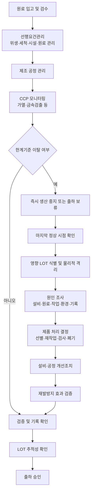

# [QA+ 블로그 생성 결과물] 식품안전 기대와현실
생성일시: 2026-09-16 15:45:11 (KST)
적용모델: gpt-5.6-terra

================================================================================
# 📋 최종 발행용 블로그 패키지

### 1. 메타 데이터 (SEO 설정)

- **최종 포스팅 제목**: HACCP 인증인데도 식품안전 사고가 생기는 이유: 기대와 현실, 현장 대응법
- **메타 디스크립션 (120자 내외 요약)**: HACCP 인증이 사고 ‘0건’을 보장하지 않는 이유를 알아봅니다. 선행요건관리, CCP 이탈 제품격리, LOT 추적, 클레임 재발방지 실무를 정리했습니다.
- **추천 해시태그 (10개)**:  
  #HACCP #식품안전 #식품품질관리 #식품공장QA #식품공장QC #선행요건관리 #CCP관리 #식품이물클레임 #LOT추적관리 #식품위생법
- **카테고리**: 식품품질실무 / HACCP 가이드

> **QA 검수 메모**
> - 「식품위생법」 제4조, 제7조, 제44조, 제45조, 제46조, 제48조 언급은 법령상 체계와 부합하도록 유지했습니다. 실제 회수·보고 여부는 제품 위해도, 최신 고시 및 관할 행정기관 판단에 따라 달라질 수 있으므로 본문에도 이를 명시했습니다.
> - 사례의 온도·시간, 수량, 개선 결과는 특정 법정 기준이 아닌 현장형 예시로 해석되어야 합니다.
> - 본문 이미지 3장은 모두 서로 다른 플레이스홀더로 반영했습니다.

---

## 2. 네이버 블로그 / 티스토리 복사용 최종 원고 (Markdown)

# HACCP 인증인데도 식품안전 사고가 생기는 이유: 기대와 현실, 현장 대응법

> **20년 실무 선배의 한 줄 요약**  
> HACCP은 “문제가 절대 없는 제품”을 보증하는 마크가 아니라, 위해요소를 미리 찾아 관리하고 문제가 생기면 피해를 최소화하는 예방 체계입니다.
>
> **현장 액션 플랜**  
> CCP 기록부터 보기보다 선행요건관리, 제품격리, LOT 추적, 재발방지 검증이 실제로 작동하는지 먼저 점검하세요.

---

## 1. “HACCP인데 왜 문제가 생기나요?”라는 가장 현실적인 질문

HACCP 인증 제품에서 이물 클레임, 미생물 부적합, 표시사항 오류가 발생하면 현장은 당황합니다. 소비자는 “HACCP 마크가 있는데 어떻게 이런 일이 생길 수 있나요?”라고 묻고, 생산팀은 “기준대로 관리했는데요”라고 답하게 됩니다.

그런데 이 둘의 말은 서로 완전히 틀린 말이라기보다, 식품안전을 바라보는 기준이 서로 다르기 때문에 생기는 충돌인 경우가 많습니다. 소비자는 한 건의 이상 사례도 없어야 안전하다고 느끼고, 현장은 수많은 변동 요인 속에서 위해 가능성을 낮추는 일을 매일 반복합니다.

식품공장은 생각보다 변수가 많습니다. 원료는 같은 거래처에서 들어와도 계절, 산지, 보관 상태에 따라 품질 편차가 생길 수 있습니다. 작업자는 매일 바뀌고, 설비는 마모되며, 세척 상태나 실내 온도·습도도 생산 조건에 영향을 줍니다. 포장재 인쇄 오류, 알레르겐 원료의 작업 전환, 냉장·냉동 유통 중 온도 이탈처럼 공장 밖에서 발생하는 변수도 무시할 수 없습니다.

그래서 식품안전은 “한 번 잘 만들면 끝나는 업무”가 아닙니다. 원료 입고부터 보관, 전처리, 제조, 포장, 금속검출, 출하, 유통, 클레임 대응까지 각각의 고리를 매일 확인해야 합니다. 이 고리 중 하나라도 약해지면 다른 관리가 잘되어 있어도 소비자 불안으로 이어질 수 있습니다.

특히 현장에서 많이 착각하는 부분이 “CCP만 문제없으면 식품안전도 문제없다”는 생각입니다.

> **현장에서 꼭 기억할 문장**  
> HACCP은 사고가 절대 발생하지 않는다는 약속이 아니라, 사고 가능성을 낮추고 발생 시 빠르게 통제할 수 있도록 만드는 관리 시스템입니다.


이 관점을 잡아야 HACCP 인증의 의미도 제대로 이해할 수 있습니다. 이제 소비자가 기대하는 안전과 법·현장이 관리하는 안전이 어디에서 다른지 차근차근 정리해 보겠습니다.

---

## 2. 식품안전의 기대와 현실: 소비자가 생각하는 안전은 무엇이 다를까요?

소비자는 HACCP 마크를 보면 대체로 세 가지를 기대합니다.

1. 이물이나 미생물 문제가 절대 없어야 한다고 생각합니다.  
2. 유통기한 안에 있는 제품이라면 구매 후 어떤 환경에 두어도 이상이 없어야 한다고 기대할 수 있습니다.  
3. 이상 제품을 발견했을 때 제조사가 즉시 원인을 밝혀내고 명확하게 설명해 줄 것이라고 생각합니다.  

이 기대 자체는 당연합니다. 소비자는 식품을 전문적으로 분석할 수 없기 때문에 포장 상태, 냄새, 색상, 이물, 유통기한, 표시사항을 보고 안전성을 판단합니다.

특히 머리카락, 플라스틱 조각, 벌레, 금속성 이물처럼 눈에 보이는 문제는 실제 위해 여부와 별개로 강한 불안감을 일으킵니다. “인체에 큰 위해가 아닐 수 있다”는 설명만으로 소비자의 걱정이 사라지지 않는 이유가 여기에 있습니다.

반면 법적·과학적 식품안전은 조금 더 복합적으로 판단됩니다. 「식품위생법」 제4조는 썩거나 상한 식품, 유독·유해 물질이 포함된 식품, 병원성 미생물 등에 오염된 식품의 제조·판매 등을 금지합니다. 또한 같은 법 제7조에 따라 식품 유형별 기준과 규격이 정해지고, 실제 적합 여부는 「식품의 기준 및 규격」, 즉 식품공전의 세부 기준과 시험법을 근거로 판단합니다.

쉽게 말하면 “깨끗해 보인다”는 것만으로 판단하는 것이 아니라, 어떤 위해요소가 어느 수준으로 존재하는지와 제조·유통 이력을 함께 봐야 한다는 뜻입니다.

소비자 기대와 현장 현실의 차이를 줄이려면 “소비자가 오해했다”는 식으로 접근하면 안 됩니다. 소비자의 불안은 정당하게 접수하고, 회사는 과학적 사실과 관리 조치를 투명하게 설명해야 합니다. 동시에 현장에서는 실제 관리 수준이 소비자가 기대하는 수준에 최대한 가까워지도록 예방 활동을 강화해야 합니다.

결국 식품안전은 법적 적합성, 공정 관리, 소비자 신뢰가 함께 움직여야 완성됩니다.

---

## 3. HACCP의 역할과 한계: 인증서 한 장이 아니라 예방 시스템입니다

「식품위생법」 제48조는 식품안전관리인증기준, 즉 HACCP의 법적 근거를 두고 있습니다. HACCP은 원료 관리부터 제조·가공·조리·유통까지의 과정에서 위해한 물질이 섞이거나 식품이 오염되는 것을 방지하기 위해 위해요소를 확인·평가하고 중점적으로 관리하는 체계입니다.

여기서 중요한 표현은 “사전에 분석하고 관리한다”입니다. 문제가 생긴 뒤 검사로 찾아내는 방식만이 아니라, 문제가 생길 수 있는 지점을 미리 관리하는 예방 중심 방식입니다.

HACCP의 위해요소는 보통 세 가지로 나눕니다.

- **생물학적 위해요소**: 병원성 미생물, 바이러스, 기생충 등
- **화학적 위해요소**: 세척제 잔류, 알레르겐 혼입, 농약·중금속 등
- **물리적 위해요소**: 금속, 유리, 플라스틱, 나사, 고무 조각 등

쉽게 말하면 식품에 “보이지 않는 균”, “성분상 위험”, “눈에 보이는 이물”이 들어갈 가능성을 공정별로 찾아 관리하는 것입니다.

다만 HACCP은 모든 예외 상황을 자동으로 막아 주는 장치는 아닙니다. 예를 들어 금속검출기가 정상적으로 작동해도 플라스틱, 고무, 섬유, 곤충, 머리카락은 검출하지 못할 수 있습니다. 가열 CCP가 기준 온도와 시간을 충족해도 가열 후 냉각 과정이나 포장 공정에서 재오염이 발생하면 문제가 될 수 있습니다.

또한 표시사항 오류나 알레르겐 표기 누락은 가열이나 금속검출로 해결되는 문제가 아닙니다.

| 구분 | HACCP이 하는 일 | HACCP만으로 해결되지 않는 일 |
|---|---|---|
| 위해요소 분석 | 공정별 생물학적·화학적·물리적 위해요소 분석 | 모든 돌발 상황의 자동 제거 |
| CCP 관리 | 한계기준 설정, 모니터링, 이탈 시 개선조치 | 선행요건이 무너진 상태의 모든 문제 해결 |
| 추적성 관리 | 원료·반제품·완제품·출하 이력 관리 기반 마련 | LOT 기록이 부정확하거나 누락된 문제 |
| 사고 대응 | 영향 제품 범위 판단, 격리·회수 판단 지원 | 사고 자체가 절대 일어나지 않도록 보장 |
| 소비자 신뢰 | 체계적으로 관리한다는 근거 제시 | 늦은 응대와 불성실한 소통으로 생긴 불신 해소 |

결국 HACCP의 성패는 인증 취득 여부보다 운영의 실효성에 달려 있습니다. 현장에 있는 작업자, 설비, 원료, 기록, 검증 활동이 서로 연결되어야 합니다.

---

## 4. CCP보다 먼저 봐야 할 것: 선행요건관리가 무너지면 생기는 일

HACCP 관리계획은 중요하지만, 그보다 먼저 바탕이 되는 것이 선행요건관리입니다. 선행요건관리란 작업장 위생, 세척·소독, 개인위생, 해충방제, 용수 관리, 시설 유지보수, 교차오염 방지, 원료 검수, 보관 관리처럼 일상적으로 유지해야 하는 기본 위생관리 체계를 말합니다.

쉽게 말하면 CCP가 “결승선 앞의 최종 방어선”이라면, 선행요건은 문제를 애초에 공정 안으로 들이지 않기 위한 울타리입니다. 울타리가 무너진 상태에서 결승선 하나만 지키는 방식으로는 한계가 분명합니다.

예를 들어 금속검출기 관리가 완벽하더라도 천장 결로수가 떨어지거나, 배수구 주변 청소가 불량하거나, 작업자가 장갑을 교체하지 않으면 미생물 및 교차오염 위험은 남습니다.

알레르겐 원료를 사용하는 공장이라면 더 민감합니다. 땅콩, 우유, 대두, 밀, 난류 등 특정 원료를 사용한 뒤 세척 검증 없이 다음 제품을 생산하면 금속검출기나 가열공정이 정상이어도 알레르겐 교차접촉 위험이 생길 수 있습니다. 따라서 공정별 위해요소 분석에는 반드시 작업 전환과 세척 검증 조건까지 연결되어야 합니다.

현장에서 선행요건이 약해졌다는 신호는 생각보다 쉽게 보입니다.

- 청소도구가 구역별로 구분되지 않는 경우
- 파손된 스크래퍼와 브러시가 계속 사용되는 경우
- 방충등 포집 결과가 반복되는데도 개선 조치가 없는 경우
- 모자 밖으로 머리카락이 나오거나 위생장화 세척 상태가 불량한 경우
- 컨베이어 벨트 균열, 실리콘 마감재 탈락, 고무 패킹 마모가 방치되는 경우

이런 문제를 “작은 위생 지적”으로 넘기면 결국 이물·미생물·교차오염 클레임으로 연결될 수 있습니다.

특히 시설 노후화는 품질팀 혼자 해결하기 어렵습니다. QA는 단순히 “수리 요청”을 하는 데서 끝내지 말고, 해당 설비가 어떤 위해요소와 연결되는지 위험성 평가 형태로 설명해야 합니다.

“벨트가 낡았습니다”보다 “벨트 균열부에서 고무 조각 혼입 가능성이 있고, 동일 라인에서 최근 이물 클레임 2건이 발생했습니다”라고 말하는 편이 훨씬 강합니다.


선행요건이 안정되어야 CCP도 의미 있게 작동합니다. 그렇다면 실제로 문제가 생겼을 때는 어떤 순서로 움직여야 할까요?



---

## 5. 한계기준 이탈이 발생했을 때: 기록보다 제품 통제가 먼저입니다

CCP 한계기준 이탈이 발생했을 때 가장 먼저 해야 할 일은 기록지 작성이 아닙니다. 가장 우선해야 할 것은 **영향을 받을 수 있는 제품을 식별하고, 출하되지 않도록 격리하는 것**입니다.

예를 들어 금속검출기 테스트 피스가 검출되지 않았거나 가열 온도가 설정 한계기준 아래로 내려갔다면, 즉시 해당 공정 또는 해당 제품의 흐름을 멈춰야 합니다. “나중에 다시 확인하자”는 대응은 사고 범위를 키우는 가장 위험한 습관입니다.

영향 제품 범위는 일반적으로 “마지막 정상 확인 시점부터 이상 발견 시점까지” 생산된 물량을 기준으로 잡습니다. 예를 들어 금속검출기 작동 확인을 2시간마다 하기로 했다면, 오전 10시 정상 확인 후 낮 12시에 부적합이 발견된 경우 오전 10시 이후 생산분이 우선 격리 대상이 됩니다.

다만 설비 이상 징후, 생산기록, 작업자 진술, 정비 이력에 따라 더 이전 생산분까지 확대해야 할 수도 있습니다. 이 범위를 즉시 특정하려면 생산 LOT, 시간대, 라인 번호, 포장 규격, 출하 수량이 정확히 연결되어 있어야 합니다.

### CCP 이탈 시 기본 대응 흐름

1. **생산 중지 또는 해당 제품 출하 보류**
2. **마지막 정상 확인 시점 확인**
3. **영향 제품 LOT 식별 및 물리적 격리**
4. **원인 조사: 설비·원료·작업·기록·환경 확인**
5. **제품 처리 결정: 재작업, 선별, 추가검사, 폐기 등**
6. **설비 조정·수리 또는 공정 조건 복구**
7. **정상화 확인 후 생산 재개**
8. **개선조치 및 재발방지 효과 검증**

여기서 정말 중요한 것은 “이탈 없음”만을 좋은 성과로 보는 문화에서 벗어나는 것입니다. 이탈은 발생할 수 있습니다. 하지만 이탈을 빨리 발견하고, 제품을 정확히 묶고, 원인을 제거하고, 재발하지 않도록 검증한 조직은 오히려 식품안전 관리 수준이 높다고 볼 수 있습니다.

반대로 이탈을 숨기거나 기록을 수정하는 문화는 작은 이상을 회수·판매중지·행정처분·브랜드 신뢰 하락으로 키웁니다.


---

## 6. “기록이 있다”와 “관리되었다”는 다릅니다

식품공장 기록은 심사 서류가 아니라 사고 발생 시 공정을 재구성하는 증거입니다. 어느 원료를 언제 입고했고, 누가 어느 설비에서 어떤 조건으로 생산했으며, 중간에 이상은 없었는지 확인할 수 있어야 합니다.

그래서 기록은 빠짐없이 쓰는 것도 중요하지만, 실제 생산 상황과 일치하는지가 더 중요합니다. 심사관도 단순히 서명란이 채워졌는지보다 문서와 현장의 정합성을 봅니다.

사후 작성으로 의심받는 기록에는 공통점이 있습니다.

- 매일 측정값이 소수점까지 지나치게 동일한 경우
- 생산이 끝난 시간 이후에 모니터링 기록이 작성된 경우
- 휴일이나 비가동일에도 점검값이 동일하게 기록된 경우
- 설비 고장 기록은 있는데 CCP 이탈 기록은 전혀 없는 경우
- 모든 개선조치가 “재점검 후 이상 없음” 한 줄로 끝나는 경우

기록의 신뢰성을 높이는 가장 좋은 방법은 기록 양식을 복잡하게 만드는 것이 아닙니다. 작업자가 실제로 측정할 수 있는 위치에, 실제 생산 흐름에 맞는 주기로, 이해하기 쉬운 기준을 두는 것입니다.

예를 들어 냉각수 온도를 30분마다 측정하도록 했는데 담당자가 동시에 포장·검수·청소까지 해야 한다면 그 기록은 현실적으로 무너질 가능성이 큽니다. 담당자와 대체자, 확인자, 이탈 시 연락 체계를 명확히 정해야 합니다.

추적관리는 특히 중요합니다. 원료 LOT, 반제품 LOT, 완제품 LOT, 생산일시, 라인, 출하처, 출하 수량이 2~4시간 이내에 조회되는 수준을 목표로 운영해 보세요. 회사 규모마다 전산 수준은 다르지만, 최소한 “이 제품이 어디로 몇 박스 나갔는지”와 “이 LOT에 어떤 원료가 사용됐는지”가 빠르게 확인되어야 합니다.

사고가 났을 때 회수 범위를 줄이고 소비자 위해를 최소화하는 가장 현실적인 힘이 바로 정확한 추적기록입니다.

---

## 7. 식품 이물 클레임 대응: QA 혼자 사과하고 끝내면 재발합니다

이물 클레임은 단순 고객 응대 업무가 아닙니다. 이물이 무엇인지, 어디에서 들어왔는지, 같은 문제가 다른 제품에도 생길 수 있는지를 확인해야 하는 식품안전 사건입니다.

따라서 QA가 고객에게 연락하고 환불하는 것으로 끝내면 안 됩니다. 생산·공무·구매·물류가 함께 원인을 분석하고 재발방지 조치를 검증해야 합니다.

클레임 접수 직후에는 감정적인 판단보다 증빙 확보가 먼저입니다.

- 제품명
- 제조일자 또는 유통기한
- LOT 번호
- 구매처 및 구매일
- 개봉일
- 보관 상태
- 이물 및 잔존 제품 회수 가능 여부
- 사진·동영상 등 증빙자료

이물은 성상, 색상, 크기, 재질, 자성 여부, 날카로움 여부를 확인하고 제조공정의 자재·부품과 비교해야 합니다.

### 부서별 권장 역할

- **QA/QC**: 위해성 검토, 제조기록 확인, 고객 소통, CAPA 관리
- **생산팀**: 해당 시간대 작업자, 작업 전환, 청소, 원료 투입 상황 확인
- **공무팀**: 설비 부품 마모 및 정비 이력 확인
- **구매팀**: 원료·포장재 협력업체 및 입고검사 이력 확인
- **물류팀**: 보관·운송 중 외부 혼입 또는 파손 가능성 점검

소비자에게는 방어적인 표현을 피해야 합니다.

> “HACCP 공장이니 문제없습니다.”  
> “그 정도 이물은 해롭지 않습니다.”  
> “유통 중 발생한 것 같습니다.”

이런 표현은 사실 확인 전에 사용하면 신뢰를 잃기 쉽습니다. 먼저 불편과 우려에 공감하고, 조사에 필요한 정보를 안내하며, 확인된 사실과 조치 내용을 과장 없이 전달해야 합니다.

법정 보고나 회수 필요성은 「식품위생법」 제45조의 위해식품등 회수, 제46조의 이물 발견보고 등 관련 규정과 관할 행정기관 안내, 최신 기준을 확인해 판단해야 합니다.

---

## 8. 실제 현장 사례로 보는 식품안전의 기대와 현실

> 아래 사례는 현장 적용을 돕기 위해 구성한 사례형 예시입니다. 제품 특성, 위해도, 법적 기준 및 회사 HACCP 관리계획에 따라 실제 대응 기준은 달라질 수 있습니다.

### 사례 1. 냉동만두 제조공장: 금속검출기는 정상인데 플라스틱 이물이 나온 경우

한 냉동만두 제조공장에서 소비자로부터 흰색 플라스틱 조각이 나왔다는 클레임이 접수됐습니다. 해당 제품은 금속검출기를 통과했고, 금속검출기 감도 점검 기록도 모두 적합으로 관리되어 있었습니다.

처음에는 원료 포장재 조각 또는 유통 중 외부 혼입 가능성을 중심으로 조사했지만, 이물의 형태가 공장 내부 자재와 유사하다는 점이 확인됐습니다. QA와 공무팀이 해당 LOT 생산 시간대의 성형기와 이송 컨베이어를 점검한 결과, 만두피 이송부에 설치된 플라스틱 가이드 레일 끝부분이 일부 마모되어 있었습니다.

문제는 단순히 가이드 레일이 마모된 것만이 아니었습니다. 예방보전 점검표에는 “설비 이상 없음”으로 기록되어 있었지만, 플라스틱 부품의 마모 한계나 교체주기가 구체적으로 정해져 있지 않았습니다.

또한 금속검출기가 정상이라는 이유로 생산팀이 물리적 이물 위험을 충분히 검토하지 않은 것이 근본 원인이었습니다. 쉽게 말하면 금속만 찾는 설비를 믿고, 플라스틱이 떨어질 수 있는 설비 상태를 놓친 것입니다.

해당 공장은 마지막 정상 외관 점검 시점 이후 생산된 1,860봉을 출하 보류하고 재고 제품을 선별했습니다.

개선조치로는 가이드 레일 재질을 내마모성이 높은 자재로 변경하고, 취성재·비금속 부품 관리대장에 위치·사진·교체 기준을 등록했습니다. 매일 점검하던 방식도 바꿨습니다. 작업 전 육안점검만 하던 것을 주간 단위 분해점검과 월간 마모 길이 측정으로 세분화했고, 기준 이상 마모 시 즉시 교체하도록 했습니다.

이후 3개월간 동일 공정의 이물 클레임은 발생하지 않았고, 내부 검증에서도 설비점검 기록과 실제 부품 상태의 일치도가 높아졌습니다.

### 사례 2. 소스류 제조공장: 가열 CCP는 적합했지만 미생물 클레임이 반복된 경우

소스류를 제조하는 공장에서 팩 포장 제품의 팽창과 산미 이상 클레임이 한 달 동안 3건 발생했습니다. 가열공정은 85℃ 이상, 30분 이상이라는 자체 한계기준을 충족했고, 가열기 온도 기록도 정상 범위였습니다.

처음에는 원료 미생물이나 가열 조건 부족을 의심했지만, 자가품질검사 결과는 일부 LOT에서만 이상 징후를 보였습니다. QA는 클레임 LOT와 정상 LOT의 제조기록을 비교하면서 냉각·충전 시간대에 차이가 있다는 점을 발견했습니다.

근본 원인은 가열 후 냉각 단계의 대기 시간이 길어진 것이었습니다. 포장기 트러블로 인해 가열된 소스가 충전 전 탱크에 계획보다 오래 체류했고, 이 과정에서 탱크 상부와 충전 노즐 주변의 세척·소독 관리가 충분하지 않았습니다.

가열 CCP 자체는 통과했지만, 가열 후 재오염을 예방하는 선행요건과 공정시간 관리가 약했던 것입니다. 특히 생산량이 많아지는 날에는 냉각 종료부터 충전 시작까지의 허용 시간이 명확히 설정되어 있지 않았습니다.

개선조치로 회사는 가열 종료 시점부터 충전 완료까지의 최대 허용 시간을 제품별로 설정했습니다. 포장기 비가동이 20분을 초과하면 제품을 출하 보류하고, 미생물 위험 평가 후 재가열 또는 폐기 여부를 결정하도록 절차를 개정했습니다.

충전 노즐은 생산 전·중·후 ATP 측정과 주기적 미생물 스왑 검증을 실시했고, 세척 후 조립 상태 확인 항목도 추가했습니다. 이후 6개월간 팽창 클레임은 발생하지 않았으며 환경모니터링 결과도 안정화되었습니다.

### 사례 3. RTD 음료 제조공장: 표시사항 오류가 식품안전 이슈가 된 경우

RTD 단백질 음료를 생산하는 공장에서 “제품에 우유 성분이 들어 있는데 알레르겐 표시가 없다”는 소비자 문의가 접수됐습니다. 제품 자체의 미생물 검사와 이화학 검사는 모두 적합이었고, 충전·살균 공정도 정상 관리되고 있었습니다.

생산 현장에서는 처음에 이를 단순 디자인 실수나 포장재 업체 오류로 생각했습니다. 하지만 QA가 포장재 승인 이력과 생산지시서를 추적한 결과, 신제품 리뉴얼 과정에서 배합은 변경됐지만 외포장 표시 문안의 최종 승인 절차가 누락된 사실이 확인됐습니다.

문제의 근본 원인은 표시사항 검토를 품질팀의 행정 업무로만 본 데 있었습니다. 배합 변경은 연구소, 포장 디자인은 마케팅, 발주는 구매, 생산은 생산팀이 각각 진행했고, 알레르겐 표시 변경 여부를 통합 검토하는 책임자가 명확하지 않았습니다.

알레르겐은 특정 소비자에게 중대한 건강 위해가 될 수 있으므로 단순 오탈자보다 훨씬 엄격하게 관리해야 합니다. 해당 공장은 출하 전 재고를 즉시 보류하고, 출하처별 수량을 확인해 자진 회수 범위를 검토했습니다.

개선조치로 배합·원료·함량·알레르겐·보관방법·유통기한 변경이 발생하면 반드시 표시사항 변경 검토서를 발행하도록 했습니다. 연구소, QA, 마케팅, 구매, 생산 책임자가 전자승인한 뒤에만 포장재 발주와 생산이 가능하도록 시스템을 바꿨습니다.

또한 초도 생산 시에는 실물 포장재와 승인본을 대조하는 “첫 생산 확인” 절차를 도입했습니다. 이후에는 표시사항 변경 건을 월간 품질회의 안건으로 관리했고, 1년 동안 동일 유형의 표시 오류는 재발하지 않았습니다.

세 사례를 보면 공통점이 보입니다. 사고의 시작은 작은 설비 마모, 공정 지연, 부서 간 변경관리 누락이었지만 근본 원인은 “HACCP의 특정 한 항목만 보고 전체 시스템 연결을 놓친 것”이었습니다.

---

## 9. 심사와 내부점검에서 놓치기 쉬운 실무 체크리스트

HACCP 심사나 내부점검에서 자주 나오는 지적은 의외로 거창한 문서 미비가 아닙니다. 현장 상태와 기록이 맞지 않거나, 이탈 시 제품 통제 근거가 불명확하거나, 선행요건 점검이 형식적으로 운영되는 문제가 더 많습니다.

심사관은 보통 문서 한 장만 보지 않습니다. 작업장, 인터뷰, 생산기록, 설비점검표, 교정성적서, 클레임 처리보고서가 서로 연결되는지를 봅니다.

먼저 선행요건관리에서는 구역 구분과 작업 동선이 실제로 지켜지는지 확인해야 합니다. 청결구역과 일반구역의 작업자 이동이 통제되는지, 세척도구가 구역별로 구분되는지, 손 세척과 소독 설비가 실제 사용 가능한 상태인지 점검하세요.

방충·방서 업체의 보고서가 있어도 포집 증가 원인과 개선 결과가 없다면 충분하지 않습니다. 용수, 압축공기, 얼음처럼 식품과 접촉할 가능성이 있는 매체도 관리 기준과 점검 결과를 연결해야 합니다.

CCP 관리에서는 한계기준의 설정 근거와 실제 실행 가능성을 확인해야 합니다. 예를 들어 금속검출기 검증주기를 1시간으로 정했는데 생산인력 구조상 실행되지 않는다면 종이 위의 관리계획일 뿐입니다.

가열, 냉각, 금속검출, X-ray, pH, 염도 등 어떤 CCP든 이탈 시 조치 대상 LOT가 명확해야 합니다. “설비를 재가동했다”는 기록이 아니라 “어느 제품을 격리했고 어떻게 처리했는가”가 있어야 합니다.

| 점검 영역 | 점검 항목 | 권장 확인 방법 | 이상 시 즉시 조치 |
|---|---|---|---|
| 개인위생 | 위생복·모자·장갑 착용 상태 | 작업 시작 전 현장 관찰, 사진 기록 | 재교육, 위생복 교체, 작업 전 재점검 |
| 세척·소독 | 세척 후 잔사·오염 여부 | 육안점검, ATP 측정, 필요 시 미생물 스왑 | 재세척·재소독 후 검증 |
| 시설·설비 | 벨트·패킹·나사·가이드 마모 | 일상점검 + 월간 예방보전 점검 | 해당 부품 교체, 영향 제품 평가 |
| CCP | 한계기준 및 검증 결과 | 생산시간과 기록시간 대조 | 생산 보류, 영향 LOT 격리 |
| 원료관리 | 원료 LOT·포장 파손·성적서 | 입고검사 및 보관 상태 확인 | 입고 보류, 협력업체 통보 |
| 표시관리 | 배합과 포장 표시 일치 | 초도 생산 실물 대조 | 포장재 사용 중지, 출하 보류 |
| 추적관리 | 원료-반제품-완제품-출하처 연결 | 모의추적 2~4시간 내 완료 목표 | LOT 체계 보완, 교육 실시 |
| 클레임 관리 | 유형별 반복성·원인·CAPA | 월간 클레임 데이터 분석 | 개선조치, 효과 검증 일정 등록 |

점검의 목적은 “지적 건수를 줄이는 것”이 아닙니다. 작은 이상을 소비자에게 닿기 전에 발견하고 현장 개선으로 연결하는 것입니다.

---

## 10. 식품안전 기대와 현실 FAQ: 현장에서 가장 많이 묻는 질문 6가지

### Q1. HACCP 인증 식품이면 무조건 안전한가요?

**A.** HACCP 인증은 해당 사업장이 위해요소를 분석하고 중점적으로 관리하는 체계를 갖추고 운영한다는 의미입니다. 하지만 모든 이물, 미생물, 표시 오류, 유통 중 변질 가능성이 절대 발생하지 않는다는 무결점 보증은 아닙니다. HACCP의 효과는 선행요건관리, 현장 실행력, 모니터링 정확성, 이탈조치, 검증 수준에 따라 달라집니다.

### Q2. HACCP이 있으면 최종 제품 검사는 하지 않아도 되나요?

**A.** 아닙니다. HACCP과 최종 제품 검사는 역할이 다릅니다. HACCP은 공정에서 위해요소를 예방·관리하는 시스템이고, 제품 검사는 식품공전상 기준·규격 적합 여부와 관리체계의 유효성을 확인하는 수단입니다. 검사 결과만으로 모든 생산분과 모든 위해요소를 100% 확인할 수 없기 때문에 공정관리와 함께 운영해야 합니다.

### Q3. 금속검출기를 설치하면 이물 클레임은 끝나는 것 아닌가요?

**A.** 금속검출기는 말 그대로 금속성 이물을 관리하는 설비입니다. 플라스틱, 고무, 유리, 머리카락, 섬유, 곤충, 원료 유래 이물은 금속검출기만으로 막기 어렵습니다. 원료 검수, 취성재 관리, 설비 예방보전, 청소도구 관리, 작업자 위생, 선별공정, X-ray 적용 가능성까지 함께 검토해야 합니다.

### Q4. 미생물 검사에 적합하면 안전한 제품이라고 봐도 되나요?

**A.** 해당 시료와 해당 검사 항목에 대해서는 기준에 적합하다는 의미입니다. 그러나 식품안전에는 미생물 외에도 화학적 위해요소, 물리적 이물, 알레르겐, 표시사항, 보관·유통 조건 등이 포함됩니다. 또한 검사는 표본 검사이므로 검사 결과는 공정 전반의 관리 상태와 함께 해석해야 합니다.

### Q5. 클레임이 한 건이면 개선조치까지 해야 하나요?

**A.** 한 건이라도 이물 종류, 인체 위해 가능성, 동일 LOT 및 인접 LOT의 반복성, 공정상 재발 가능성을 검토해야 합니다. 동일 원인이 다시 발생할 가능성이 있거나 위해 우려가 있다면 반드시 원인 조사와 재발방지 조치를 해야 합니다. 법정 보고·회수 여부는 관련 법령, 최신 고시, 관할 행정기관 안내를 바탕으로 판단해야 합니다.

### Q6. 심사에서는 기록만 잘 작성하면 통과할 수 있나요?

**A.** 기록은 중요하지만 기록만으로는 충분하지 않습니다. 심사에서는 기록의 시간, 생산량, 작업자 인터뷰, 현장 위생 상태, 설비점검 이력, 개선조치 결과가 서로 맞는지를 봅니다. 문서는 완벽한데 현장에 파손된 브러시나 누수 설비가 있다면 그 순간 기록의 신뢰성도 함께 무너집니다.

---

## 11. 오늘부터 적용하는 7일 식품안전 개선 계획

### 첫째 날: 최근 클레임 데이터를 분류하세요

현재 공장의 가장 큰 클레임 유형 3가지를 꺼내 보세요. 최근 6개월 데이터를 이물, 미생물, 포장불량, 표시사항, 이취, 배송·보관 문제로 분류하면 됩니다. 건수가 적더라도 소비자 위해 가능성이 높은 항목은 별도 표시하세요.

감으로 판단하던 문제를 숫자로 정리하는 것부터 개선이 시작됩니다.

### 둘째 날: 생산라인을 걸으며 위해요소를 찾으세요

“이 문제는 작업 전에 막을 수 있었나?”라는 질문을 던져 보세요. 금속검출기나 가열기만 보지 말고 바닥 배수, 천장, 결로, 컨베이어, 청소도구, 장갑, 원료 포장, 임시보수 부위를 확인하세요.

현장 사진을 찍고 위험 항목별로 담당 부서를 적어 두면 개선회의가 훨씬 빨라집니다. 지적을 위한 사진이 아니라 위해요소를 설명하기 위한 증거 사진이라는 점이 중요합니다.

### 셋째 날: 최근 이탈조치 기록 3건을 확인하세요

영향 제품 범위가 명확한지 확인하세요. 마지막 정상 시점, 이상 발견 시점, 격리 수량, 제품 처리방법, 재가동 확인 근거가 모두 있는지 보면 됩니다.

만약 “재점검 이상 없음”만 적혀 있다면 개선이 필요합니다. 그 기록만으로 외부 심사관이나 경영진에게 제품 안전성을 설명할 수 있는지 스스로 질문해 보세요.

### 넷째 날: 모의추적을 해보세요

완제품 1개 LOT를 임의로 선택해 원료 LOT, 생산일시, 작업라인, 작업자, 출하처, 출하수량을 역추적하고 정추적해 보세요.

목표 시간은 회사 규모에 따라 다르지만, 우선 4시간 이내에 기본 범위를 파악하는 수준을 목표로 잡으면 좋습니다. 추적이 안 되는 구간이 보이면 그곳이 실제 사고 때 가장 큰 병목이 됩니다.

### 다섯째 날: 작업자 교육을 짧고 구체적으로 하세요

“위생관리를 철저히 합시다” 같은 문구보다 “장갑을 바꾸어야 하는 순간 3가지”, “설비 파손을 발견했을 때 누구에게 어떻게 보고하는지”처럼 행동 기준을 알려줘야 합니다.

교육 후에는 현장에서 실제 행동이 바뀌는지 확인해야 합니다. 교육 참석 서명만으로는 식품안전문화가 만들어지지 않습니다.

### 여섯째 날: 부서 합동 클레임 복기회의를 운영하세요

생산·QA·공무·구매·물류가 함께 최근 클레임 한 건을 복기해 보세요. 누가 잘못했는지 찾는 회의가 아니라 어느 방어막이 약했는지 찾는 회의로 운영해야 합니다.

원료, 설비, 작업, 세척, 포장, 출하, 고객 대응 단계에서 하나씩 질문하면 부서 간 사각지대가 드러납니다. 이 회의가 정례화되면 클레임은 단순 비용이 아니라 개선 데이터가 됩니다.

### 일곱째 날: 개선조치 효과 확인일을 정하세요

부품을 교체했으면 한 달 뒤 마모 상태를 다시 보고, 세척 절차를 바꿨으면 ATP나 환경 미생물 결과로 확인하고, 교육을 했으면 작업자 행동을 관찰해야 합니다.

이것이 바로 CAPA, 즉 시정조치와 예방조치의 핵심입니다. 조치했다는 사실보다 “조치가 효과 있었는가”를 확인하는 조직이 결국 강한 공장이 됩니다.

---

## 12. 맺음말: 식품안전은 완벽 선언이 아니라 매일의 관리입니다

식품안전은 HACCP 인증서 한 장이나 검사성적서 한 장으로 완성되지 않습니다. 「식품위생법」 제1조의 목적처럼 식품으로 인한 위해를 예방하고 국민보건을 지키기 위해서는 원료부터 출하까지 모든 단계가 연결되어야 합니다.

「식품위생법」 제44조의 영업자 준수사항이 중요한 이유도 여기에 있습니다. 식품안전은 QA팀 한 부서의 업무가 아니라 공장 전체의 운영 수준입니다.

오늘 내용은 세 줄로 정리할 수 있습니다.

1. **HACCP은 무결점 보증이 아니라 예방적 위해요소 관리체계입니다.**
2. **CCP만큼 선행요건관리, 제품격리, 기록 신뢰성, LOT 추적이 중요합니다.**
3. **클레임은 숨길 일이 아니라 원인을 제거하고 재발을 막는 개선 기회로 관리해야 합니다.**

소비자는 안전한 식품을 기대할 권리가 있습니다. 식품회사는 그 기대에 부응하기 위해 법적 기준과 과학적 관리체계를 성실하게 운영할 책임이 있습니다.

다만 실무자인 우리는 “완벽합니다”라고 선언하기보다, 작은 이상도 놓치지 않고 발견·격리·개선·검증하는 모습을 만들어야 합니다.

오늘 작성한 정확한 기록 한 줄, 설비의 작은 균열을 발견한 한 번의 점검, 작업자에게 제대로 전달한 한 번의 교육이 결국 소비자의 식탁을 지킵니다.

---

## 3. 워드프레스 / 웹사이트용 HTML 원고

```html
<article class="food-qa-post">
  <header>
    <h1>HACCP 인증인데도 식품안전 사고가 생기는 이유: 기대와 현실, 현장 대응법</h1>
    <p class="lead">
      HACCP은 무결점 제품을 보증하는 마크가 아니라, 위해요소를 사전에 관리하고 이상 발생 시 피해를 최소화하기 위한 예방 관리체계입니다.
    </p>
    <blockquote>
      <p><strong>20년 실무 선배의 한 줄 요약:</strong> CCP 기록부터 보기보다 선행요건관리, 제품격리, LOT 추적, 재발방지 검증이 실제로 작동하는지 먼저 점검하세요.</p>
    </blockquote>
  </header>

  <section>
    <h2>1. “HACCP인데 왜 문제가 생기나요?”라는 가장 현실적인 질문</h2>
    <p>HACCP 인증 제품에서 이물 클레임, 미생물 부적합, 표시사항 오류가 발생하면 소비자는 “HACCP 마크가 있는데 어떻게 이런 일이 생길 수 있나요?”라고 묻습니다. 소비자는 한 건의 이상 사례도 없어야 안전하다고 느끼지만, 식품공장은 원료·작업자·설비·세척·포장·유통 등 수많은 변동 요인을 관리해야 합니다.</p>
    <p>식품안전은 원료 입고부터 보관, 전처리, 제조, 포장, 금속검출, 출하, 유통, 클레임 대응까지 각각의 고리를 매일 확인하는 일입니다. 특히 “CCP만 문제없으면 식품안전도 문제없다”는 생각은 현장에서 경계해야 합니다.</p>
    <blockquote>
      <p><strong>현장에서 꼭 기억할 문장:</strong> HACCP은 사고가 절대 발생하지 않는다는 약속이 아니라, 사고 가능성을 낮추고 발생 시 빠르게 통제할 수 있도록 만드는 관리 시스템입니다.</p>
    </blockquote>
    <figure>
      
      <figcaption>식품안전은 하나의 CCP만으로 끝나지 않으며, 여러 관리 지점이 함께 연결되어야 합니다.</figcaption>
    </figure>
  </section>

  <section>
    <h2>2. 식품안전의 기대와 현실</h2>
    <p>소비자는 HACCP 마크를 통해 이물이나 미생물 문제가 없어야 하고, 유통기한 내 제품은 안전해야 하며, 이상 발생 시 제조사가 명확한 설명을 제공할 것이라고 기대합니다. 이러한 기대는 당연합니다.</p>
    <p>반면 법적·과학적 식품안전은 위해요소의 종류와 수준, 제조·유통 이력을 함께 판단합니다. 「식품위생법」 제4조는 부패·변질 식품, 유독·유해 물질이 포함된 식품, 병원성 미생물 등에 오염된 식품의 제조·판매 등을 금지하며, 제7조에 따른 식품 유형별 기준·규격은 「식품의 기준 및 규격」에서 구체적으로 확인합니다.</p>
    <p>소비자의 불안은 정당하게 접수하고, 회사는 과학적 사실과 관리 조치를 투명하게 설명해야 합니다. 식품안전은 법적 적합성, 공정 관리, 소비자 신뢰가 함께 움직여야 완성됩니다.</p>
  </section>

  <section>
    <h2>3. HACCP의 역할과 한계</h2>
    <p>「식품위생법」 제48조는 식품안전관리인증기준인 HACCP의 법적 근거를 둡니다. HACCP은 원료 관리부터 제조·가공·조리·유통까지 위해요소를 확인·평가하고 중점적으로 관리하는 예방 중심 체계입니다.</p>
    <ul>
      <li><strong>생물학적 위해요소:</strong> 병원성 미생물, 바이러스, 기생충 등</li>
      <li><strong>화학적 위해요소:</strong> 세척제 잔류, 알레르겐 혼입, 농약·중금속 등</li>
      <li><strong>물리적 위해요소:</strong> 금속, 유리, 플라스틱, 나사, 고무 조각 등</li>
    </ul>
    <table>
      <thead>
        <tr>
          <th>구분</th>
          <th>HACCP이 하는 일</th>
          <th>HACCP만으로 해결되지 않는 일</th>
        </tr>
      </thead>
      <tbody>
        <tr>
          <td>위해요소 분석</td>
          <td>공정별 생물학적·화학적·물리적 위해요소 분석</td>
          <td>모든 돌발 상황의 자동 제거</td>
        </tr>
        <tr>
          <td>CCP 관리</td>
          <td>한계기준 설정, 모니터링, 이탈 시 개선조치</td>
          <td>선행요건이 무너진 상태의 모든 문제 해결</td>
        </tr>
        <tr>
          <td>추적성 관리</td>
          <td>원료·반제품·완제품·출하 이력 관리 기반 마련</td>
          <td>부정확하거나 누락된 LOT 기록 해결</td>
        </tr>
        <tr>
          <td>사고 대응</td>
          <td>영향 제품 범위 판단, 격리·회수 판단 지원</td>
          <td>사고가 절대 일어나지 않음을 보장</td>
        </tr>
      </tbody>
    </table>
  </section>

  <section>
    <h2>4. CCP보다 먼저 봐야 할 것: 선행요건관리</h2>
    <p>선행요건관리는 작업장 위생, 세척·소독, 개인위생, 해충방제, 용수 관리, 시설 유지보수, 교차오염 방지, 원료 검수, 보관 관리처럼 일상적으로 유지해야 하는 기본 위생관리 체계입니다.</p>
    <p>금속검출기가 정상이어도 천장 결로, 배수구 청소 불량, 장갑 교체 미흡, 알레르겐 원료 전환 시 세척 검증 누락 등이 발생하면 미생물 및 교차오염 위험은 남습니다.</p>
    <p>청소도구 미구분, 파손 브러시 지속 사용, 방충등 포집 증가 방치, 위생복 착용 불량, 벨트·패킹·실리콘 마감재 노후화는 선행요건이 약해졌다는 대표적인 신호입니다.</p>
    <figure>
      
      <figcaption>선행요건관리, 공정관리, CCP, 검증과 출하보류 판단은 하나의 연결된 방어체계입니다.</figcaption>
    </figure>
  </section>

  <section>
    <h2>5. 한계기준 이탈이 발생했을 때: 기록보다 제품 통제가 먼저입니다</h2>
    <p>CCP 한계기준 이탈이 발생했을 때 가장 먼저 해야 할 일은 기록지 작성이 아니라 영향 제품 식별과 물리적 격리입니다. 금속검출기 테스트 피스가 검출되지 않거나 가열 조건이 한계기준 아래로 내려갔다면, 해당 공정 또는 제품 흐름을 즉시 중단하거나 출하 보류해야 합니다.</p>
    <ol>
      <li>생산 중지 또는 해당 제품 출하 보류</li>
      <li>마지막 정상 확인 시점 확인</li>
      <li>영향 제품 LOT 식별 및 물리적 격리</li>
      <li>설비·원료·작업·기록·환경 원인 조사</li>
      <li>재작업, 선별, 추가검사, 폐기 등 제품 처리 결정</li>
      <li>설비 조정·수리 또는 공정 조건 복구</li>
      <li>정상화 확인 후 생산 재개</li>
      <li>개선조치 및 재발방지 효과 검증</li>
    </ol>
    <figure>
      
      <figcaption>CCP 이탈 시 기록보다 먼저 해야 할 일은 영향 제품을 식별하고 출하되지 않도록 물리적으로 격리하는 것입니다.</figcaption>
    </figure>
  </section>

  <section>
    <h2>6. “기록이 있다”와 “관리되었다”는 다릅니다</h2>
    <p>식품공장 기록은 심사 서류가 아니라 사고 발생 시 공정을 재구성하는 증거입니다. 원료 입고, 생산조건, 설비 상태, 이상 여부, 제품 처리 이력이 실제 현장과 일치해야 합니다.</p>
    <p>매일 측정값이 지나치게 동일하거나, 생산 종료 후 기록이 작성되거나, 설비 고장 기록은 있는데 CCP 이탈이 전혀 없거나, 모든 개선조치가 “재점검 후 이상 없음”으로 끝난다면 기록 신뢰성을 점검해야 합니다.</p>
    <p>원료 LOT, 반제품 LOT, 완제품 LOT, 생산일시, 라인, 출하처, 출하 수량을 신속하게 조회할 수 있어야 합니다. 회사 규모에 따라 다르지만 모의추적은 2~4시간 이내 기본 범위를 파악하는 수준을 목표로 운영할 수 있습니다.</p>
  </section>

  <section>
    <h2>7. 식품 이물 클레임 대응: QA 혼자 사과하고 끝내면 재발합니다</h2>
    <p>이물 클레임은 단순 고객 응대가 아니라 식품안전 사건입니다. 제품명, 제조일자 또는 유통기한, LOT 번호, 구매처, 구매일, 개봉일, 보관 상태, 사진·동영상, 이물 및 잔존 제품을 가능한 범위에서 확보해야 합니다.</p>
    <p>QA/QC는 위해성 검토와 고객 소통, 생산팀은 작업·세척·원료 투입 확인, 공무팀은 부품 마모 및 정비 이력 확인, 구매팀은 협력업체 이력 확인, 물류팀은 보관·운송 중 가능성 점검을 수행해야 합니다.</p>
    <p>법정 보고나 회수 필요성은 「식품위생법」 제45조, 제46조와 관련 고시, 최신 행정기관 안내를 바탕으로 제품 위해도에 따라 판단해야 합니다.</p>
  </section>

  <section>
    <h2>8. 실제 현장 사례로 보는 식품안전의 기대와 현실</h2>
    <h3>사례 1. 냉동만두 제조공장: 금속검출기는 정상인데 플라스틱 이물이 나온 경우</h3>
    <p>금속검출기 감도 점검은 적합이었지만, 소비자 클레임 이물의 형태가 내부 자재와 유사한 것으로 확인됐습니다. 조사 결과 만두피 이송부의 플라스틱 가이드 레일 마모가 원인이었습니다. 금속검출기 정상 여부만 확인하고 비금속 부품의 마모 기준과 교체주기를 정하지 않은 것이 근본 원인이었습니다.</p>

    <h3>사례 2. 소스류 제조공장: 가열 CCP는 적합했지만 미생물 클레임이 반복된 경우</h3>
    <p>가열 자체는 자체 한계기준을 충족했지만, 포장기 트러블로 가열 후 소스가 충전 전 탱크에 오래 체류했고 충전 노즐 주변의 세척·소독 관리가 충분하지 않았습니다. 가열 후 재오염 방지와 공정시간 관리라는 선행요건이 약했던 사례입니다.</p>

    <h3>사례 3. RTD 음료 제조공장: 표시사항 오류가 식품안전 이슈가 된 경우</h3>
    <p>배합 변경 후 우유 성분이 포함됐으나 외포장 알레르겐 표시 변경 승인 절차가 누락됐습니다. 연구소, QA, 마케팅, 구매, 생산 부서 간 변경관리가 분리되어 있었고, 이를 통합 검토하는 책임자가 명확하지 않았던 것이 원인이었습니다.</p>
  </section>

  <section>
    <h2>9. 심사와 내부점검에서 놓치기 쉬운 실무 체크리스트</h2>
    <table>
      <thead>
        <tr>
          <th>점검 영역</th>
          <th>점검 항목</th>
          <th>권장 확인 방법</th>
          <th>이상 시 즉시 조치</th>
        </tr>
      </thead>
      <tbody>
        <tr><td>개인위생</td><td>위생복·모자·장갑 착용 상태</td><td>작업 시작 전 현장 관찰</td><td>재교육, 위생복 교체, 재점검</td></tr>
        <tr><td>세척·소독</td><td>세척 후 잔사·오염 여부</td><td>육안점검, ATP 측정, 필요 시 미생물 스왑</td><td>재세척·재소독 후 검증</td></tr>
        <tr><td>시설·설비</td><td>벨트·패킹·나사·가이드 마모</td><td>일상점검과 월간 예방보전 점검</td><td>부품 교체, 영향 제품 평가</td></tr>
        <tr><td>CCP</td><td>한계기준 및 검증 결과</td><td>생산시간과 기록시간 대조</td><td>생산 보류, 영향 LOT 격리</td></tr>
        <tr><td>원료관리</td><td>원료 LOT·포장 파손·성적서</td><td>입고검사 및 보관 상태 확인</td><td>입고 보류, 협력업체 통보</td></tr>
        <tr><td>표시관리</td><td>배합과 포장 표시 일치</td><td>초도 생산 실물 대조</td><td>포장재 사용 중지, 출하 보류</td></tr>
        <tr><td>추적관리</td><td>원료-반제품-완제품-출하처 연결</td><td>모의추적 실시</td><td>LOT 체계 보완, 교육</td></tr>
        <tr><td>클레임 관리</td><td>유형별 반복성·원인·CAPA</td><td>월간 클레임 데이터 분석</td><td>개선조치 및 효과 검증 일정 등록</td></tr>
      </tbody>
    </table>
  </section>

  <section>
    <h2>10. 식품안전 기대와 현실 FAQ</h2>

    <h3>Q1. HACCP 인증 식품이면 무조건 안전한가요?</h3>
    <p><strong>A.</strong> HACCP은 위해요소를 분석하고 중점적으로 관리하는 체계를 운영한다는 의미입니다. 모든 이물, 미생물, 표시 오류, 유통 중 변질 가능성이 절대 발생하지 않는다는 무결점 보증은 아닙니다.</p>

    <h3>Q2. HACCP이 있으면 최종 제품 검사는 하지 않아도 되나요?</h3>
    <p><strong>A.</strong> 아닙니다. HACCP은 공정의 예방 관리체계이고, 제품 검사는 기준·규격 적합 여부와 관리체계의 유효성을 확인하는 수단입니다. 두 체계는 함께 운영해야 합니다.</p>

    <h3>Q3. 금속검출기를 설치하면 이물 클레임은 끝나는 것 아닌가요?</h3>
    <p><strong>A.</strong> 금속검출기는 금속성 이물을 관리하는 설비입니다. 플라스틱, 고무, 유리, 머리카락, 섬유, 곤충 등은 별도의 원료 검수, 취성재 관리, 예방보전, 작업자 위생관리 등이 필요합니다.</p>

    <h3>Q4. 미생물 검사에 적합하면 안전한 제품이라고 봐도 되나요?</h3>
    <p><strong>A.</strong> 해당 시료와 검사 항목이 기준에 적합하다는 의미입니다. 식품안전에는 미생물 외에도 화학적 위해요소, 이물, 알레르겐, 표시사항, 보관·유통 조건이 포함됩니다.</p>

    <h3>Q5. 클레임이 한 건이면 개선조치까지 해야 하나요?</h3>
    <p><strong>A.</strong> 한 건이라도 이물 종류, 인체 위해 가능성, 동일 LOT 및 인접 LOT 반복성, 공정상 재발 가능성을 검토해야 합니다. 위해 우려 또는 재발 가능성이 있다면 원인 조사와 재발방지 조치가 필요합니다.</p>

    <h3>Q6. 심사에서는 기록만 잘 작성하면 통과할 수 있나요?</h3>
    <p><strong>A.</strong> 기록만으로는 충분하지 않습니다. 심사에서는 기록의 시간, 생산량, 작업자 인터뷰, 현장 위생 상태, 설비점검 이력, 개선조치 결과가 서로 일치하는지를 확인합니다.</p>
  </section>

  <section>
    <h2>11. 오늘부터 적용하는 7일 식품안전 개선 계획</h2>
    <ol>
      <li><strong>첫째 날:</strong> 최근 6개월 클레임을 이물, 미생물, 포장불량, 표시사항, 이취, 배송·보관 문제로 분류합니다.</li>
      <li><strong>둘째 날:</strong> 생산라인을 걸으며 바닥 배수, 천장, 결로, 컨베이어, 청소도구, 장갑, 원료 포장, 임시보수 부위를 확인합니다.</li>
      <li><strong>셋째 날:</strong> 최근 이탈조치 기록 3건에서 마지막 정상 시점, 격리 수량, 제품 처리, 재가동 확인 근거를 확인합니다.</li>
      <li><strong>넷째 날:</strong> 완제품 1개 LOT를 선택해 원료부터 출하처까지 모의추적을 실시합니다.</li>
      <li><strong>다섯째 날:</strong> 장갑 교체 시점과 설비 파손 보고 방법처럼 행동 중심의 짧은 교육을 실시합니다.</li>
      <li><strong>여섯째 날:</strong> 생산·QA·공무·구매·물류가 함께 최근 클레임을 복기하며 약한 방어막을 찾습니다.</li>
      <li><strong>일곱째 날:</strong> 설비 교체, 세척 절차 변경, 교육 등 개선조치의 효과 확인일을 정합니다.</li>
    </ol>
  </section>

  <section>
    <h2>12. 맺음말: 식품안전은 완벽 선언이 아니라 매일의 관리입니다</h2>
    <p>식품안전은 HACCP 인증서 한 장이나 검사성적서 한 장으로 완성되지 않습니다. 원료부터 출하까지 모든 단계가 연결되어야 하며, 식품안전은 QA팀 한 부서의 업무가 아니라 공장 전체의 운영 수준입니다.</p>
    <ol>
      <li><strong>HACCP은 무결점 보증이 아니라 예방적 위해요소 관리체계입니다.</strong></li>
      <li><strong>CCP만큼 선행요건관리, 제품격리, 기록 신뢰성, LOT 추적이 중요합니다.</strong></li>
      <li><strong>클레임은 숨길 일이 아니라 원인을 제거하고 재발을 막는 개선 기회로 관리해야 합니다.</strong></li>
    </ol>
    <p>작은 이상도 놓치지 않고 발견·격리·개선·검증하는 관리 습관이 결국 소비자의 식탁을 지킵니다.</p>
  </section>
</article>
```
================================================================================

[부록: 1단계 리서치 원본]
# [리서치 리포트] 식품안전, 기대와 현실

### 1. 타겟 독자 및 검색 의도
- **주요 타겟**
  - 식품제조·가공업체 품질관리(QC)·품질보증(QA) 신입 및 실무자
  - HACCP 운영 담당자, 생산관리자, 공장장
  - 식품안전 사고·클레임 예방 체계를 점검하려는 경영진
  - 소비자 기대와 현장 관리 수준 사이의 간극을 설명해야 하는 식품업계 종사자

- **독자의 핵심 고통(Pain Point)**
  - “HACCP 인증을 받았는데도 왜 이물·미생물·표시사항 클레임이 발생하지?”
  - “식품안전은 ‘문제가 절대 발생하지 않는 것’인가, ‘발생 가능성을 관리하는 것’인가?”
  - “소비자는 HACCP 마크만 보면 완벽히 안전하다고 생각하는데, 현장에서는 어디까지 관리할 수 있나?”
  - “심사·점검 때는 문서가 갖춰져 있는데, 실제 생산현장에서는 작업자·설비·원료 변동을 어떻게 통제해야 하나?”
  - “식품안전 사고가 발생했을 때 HACCP 계획 자체의 문제인지, 선행요건관리·실행력의 문제인지 구분하기 어렵다.”

- **검색 의도(Search Intent)**
  - **정보 탐색형**: HACCP와 식품안전의 정확한 의미, 법적 관리 범위 확인
  - **문제 해결형**: HACCP 인증 후에도 발생하는 클레임·부적합의 원인 파악
  - **실무 적용형**: 소비자 기대 수준과 공장 운영 현실 사이의 간극을 줄이는 방법 탐색
  - **심사 대비형**: 현장 실행, 기록 신뢰성, 일탈조치 등 심사 시 확인받는 핵심 항목 점검

- **메인 키워드**: 식품안전 기대와 현실

- **서브/연관 키워드**
  - HACCP 한계와 역할
  - HACCP 인증 식품 안전한가
  - 식품안전 사고 예방
  - 식품 이물 클레임 대응
  - 식품공장 위생관리
  - HACCP 선행요건관리
  - 식품안전문화

- **독자가 글에서 얻고 싶은 핵심 답변**
  1. HACCP 인증은 식품의 “무결점”을 보증하는 제도인가?
  2. 식품안전 사고와 소비자 클레임은 왜 HACCP 운영 사업장에서도 발생할 수 있는가?
  3. CCP 관리만 잘하면 되는가, 아니면 선행요건관리도 동등하게 중요한가?
  4. 식품회사가 현실적으로 반드시 관리해야 할 항목은 무엇인가?
  5. 소비자 신뢰를 잃지 않으면서도 식품안전의 실제 관리 원리를 어떻게 설명할 수 있는가?

---

### 2. 필수 인용 법령 및 표준 기준

> **작성 유의사항**  
> 법령·고시 조문은 개정될 수 있으므로, 발행 전 반드시 국가법령정보센터 및 식품안전나라에서 최신 시행본을 확인해야 합니다. 블로그에서는 “HACCP 인증=절대적 무사고 보증”이라는 식의 표현을 피하고, “위해요소를 사전에 분석하고 중점 관리하는 예방적 관리체계”로 정확히 설명하는 것이 중요합니다.

#### 2-1. 법적/표준 근거

- **「식품위생법」 제1조(목적)**
  - 식품으로 인한 위생상의 위해를 방지하고 식품영양의 질적 향상을 도모하여 국민보건 증진에 이바지하는 것을 목적으로 합니다.
  - 블로그 활용 포인트: 식품안전은 단순히 “깨끗해 보이는 식품”이 아니라, 국민 건강에 위해를 줄 수 있는 요인을 예방·관리하는 법적 체계라는 점을 설명할 수 있습니다.

- **「식품위생법」 제4조(위해식품등의 판매 등 금지)**
  - 썩거나 상한 식품, 유독·유해 물질이 들어 있거나 묻어 있는 식품, 병원성 미생물 등에 오염된 식품 등은 판매·판매 목적 제조·수입·가공·사용·조리·보관·운반·진열이 금지됩니다.
  - 블로그 활용 포인트: 법은 “안전한 식품을 만들기 위한 노력”만이 아니라, 위해 우려 식품의 유통 자체를 금지하는 기준을 둡니다.

- **「식품위생법」 제7조(식품 또는 식품첨가물에 관한 기준 및 규격)**
  - 식품의 제조·가공·사용·조리·보존 방법 및 성분 규격 등에 관한 기준·규격의 근거 조항입니다.
  - 블로그 활용 포인트: 미생물, 식품첨가물, 오염물질, 제조·가공 기준은 식품별·유형별로 달라질 수 있으며, 막연한 “안전”이 아니라 기준·규격 적합성으로 관리됩니다.

- **「식품위생법」 제44조(영업자 등의 준수사항)**
  - 식품제조·가공업 등 영업자가 지켜야 하는 위생적 취급, 시설·설비 관리, 종업원 관리 등의 준수사항에 대한 법적 근거입니다.
  - 블로그 활용 포인트: 식품안전은 QC팀만의 업무가 아니라, 원료 입고부터 제조·보관·출하까지 영업장 전체의 준수사항이라는 점을 강조할 수 있습니다.

- **「식품위생법」 제45조(위해식품등의 회수)**
  - 유통 중인 식품에서 위해 우려가 확인될 경우 회수 등 필요한 조치를 하도록 하는 근거입니다.
  - 블로그 활용 포인트: 회수는 “관리 실패를 인정하는 행위”가 아니라, 소비자 위해 확산을 막기 위한 식품안전관리의 필수 안전장치입니다.

- **「식품위생법」 제46조(식품등의 이물 발견보고 등)**
  - 제조·가공·조리·유통 단계에서 이물을 발견한 경우의 보고 및 조치 체계와 관련된 근거입니다.
  - 블로그 활용 포인트: 이물은 소비자가 가장 민감하게 인식하는 식품안전 이슈입니다. 그러나 모든 이물이 곧바로 건강 위해를 의미하는 것은 아니며, 이물의 종류·혼입 경로·인체 위해 가능성에 따른 조사와 조치가 필요합니다.

- **「식품위생법」 제48조(식품안전관리인증기준)**
  - 식품안전관리인증기준(HACCP)의 법적 근거입니다.
  - 핵심 취지: 식품의 원료 관리, 제조·가공·조리·유통의 모든 과정에서 위해한 물질이 식품에 섞이거나 식품이 오염되는 것을 방지하기 위하여 각 과정의 위해요소를 확인·평가하고 중점적으로 관리하는 기준입니다.
  - 블로그 활용 포인트: HACCP는 최종 제품 검사만으로 안전을 확인하는 방식이 아니라, 공정별 위해요소를 사전에 관리하는 예방 중심 시스템입니다.

- **「식품 및 축산물 안전관리인증기준」**
  - 식품의약품안전처 고시로, HACCP 적용업소가 갖추고 운영해야 할 세부 안전관리인증기준을 규정합니다.
  - 실무 핵심 구성:
    - 선행요건관리
    - HACCP 관리계획 수립
    - 위해요소 분석
    - 중요관리점(CCP) 결정
    - 한계기준 설정
    - 모니터링
    - 개선조치
    - 검증
    - 기록관리
  - 블로그 활용 포인트: HACCP의 현실은 “CCP 기록지를 작성하는 일”이 아니라, 선행요건과 HACCP 관리계획이 실제 현장에서 일관되게 실행되는지 관리하는 데 있습니다.

- **「식품의 기준 및 규격」(식품공전)**
  - 식품 유형별 기준·규격, 식품첨가물 사용기준, 미생물 기준, 오염물질 기준, 시험법 등을 확인하는 공식 기준서입니다.
  - 블로그 활용 포인트: “HACCP 인증 제품인데 미생물 검사에서 부적합이 나올 수 있나?”라는 질문에 대해, HACCP 운영 여부와 별개로 최종 제품은 식품공전상 해당 식품유형의 기준·규격을 충족해야 한다는 점을 안내할 수 있습니다.

- **식품안전나라 「국내식품 부적합」, 「회수·판매중지」 공개 정보**
  - 실제 부적합·회수 사례를 통해 어떤 위해요인이 발생하는지 확인할 수 있는 공식 공개 자료입니다.
  - 블로그 활용 포인트: 특정 기업을 비난하는 방식보다, 부적합 유형을 미생물·이물·표시사항·보존기준·잔류물질 등으로 분류하여 예방 관점에서 분석하는 데 활용합니다.

- **FSSC 22000 Version 6 — 국제규격을 함께 운영하는 사업장에 한함**
  - FSSC 22000은 ISO 22000 기반의 식품안전경영시스템 요구사항, 관련 PRP(선행요건프로그램), FSSC 추가 요구사항으로 구성됩니다.
  - 핵심 관점:
    - 식품안전문화(Food Safety and Quality Culture)
    - 식품 사기(Food Fraud) 완화
    - 식품방어(Food Defense)
    - 알레르겐 관리
    - 환경모니터링
    - 서비스·구매품·공급업체 관리
  - 주의: FSSC 22000 인증이 국내 「식품위생법」 또는 HACCP 의무·준수사항을 자동으로 대체하는 것은 아닙니다. 국내 법적 요구사항은 별도로 충족해야 합니다.

#### 2-2. 현장 실무 팩트

- **HACCP은 ‘제로 리스크(Zero Risk)’ 보증제도가 아닙니다.**
  - HACCP의 본질은 식품안전 위해요소를 분석하고, 위해를 예방·제어할 수 있는 공정을 정해 관리하는 체계입니다.
  - 따라서 “HACCP 인증을 받았으니 이물·미생물·표시 오류가 절대 발생하지 않는다”는 해석은 부정확합니다.
  - 다만 HACCP 체계가 실효성 있게 운영된다면, 위해 발생 가능성을 낮추고 문제가 발생했을 때 원인을 추적·격리·개선할 수 있는 관리 기반을 갖추게 됩니다.

- **CCP 관리만으로 식품안전이 완성되지 않습니다.**
  - 손 세척, 작업장 구획, 세척·소독, 해충방제, 용수 관리, 시설 유지보수, 교차오염 방지, 원료 검수, 협력업체 관리 등은 선행요건관리의 영역입니다.
  - 현장에서는 선행요건이 약하면 금속검출·가열·X-ray 등 일부 CCP가 정상 운영되더라도 이물, 교차오염, 위생불량, 알레르겐 혼입 등의 위험이 커질 수 있습니다.

- **‘기록이 있다’와 ‘관리되었다’는 다릅니다.**
  - 심사나 내부점검에서는 기록의 누락 여부뿐 아니라 다음 사항의 정합성을 확인해야 합니다.
    - 실제 생산시간과 모니터링 시간의 일치 여부
    - 일탈 발생 시 제품 격리 여부
    - 한계기준 이탈 시 개선조치의 구체성
    - 재발방지 대책의 효과 검증 여부
    - 설비점검·교정·검증 결과와 CCP 기록의 연계성
  - 형식적으로 사후 작성된 것으로 보이는 기록은 식품안전관리의 신뢰성을 크게 떨어뜨립니다.

- **최종 제품 검사만으로는 모든 위험을 발견할 수 없습니다.**
  - 검사는 채취한 시료에 대한 결과입니다. 생산된 모든 제품과 모든 위해요소를 100% 확인하는 방식은 현실적으로 한계가 있습니다.
  - 따라서 공정 관리, 원료 관리, 위생 관리, 설비 관리, 추적관리와 함께 검사 결과를 해석해야 합니다.

- **소비자가 체감하는 안전과 법적 안전은 완전히 같지 않습니다.**
  - 소비자는 포장 팽창, 외관 이상, 이물, 냄새, 유통기한, 원산지·알레르겐 표시 오류 등을 통해 안전을 판단합니다.
  - 반면 법적 안전성 판단은 식품공전 기준·규격, 영업자 준수사항, 표시기준, 위해성 여부, 제조·유통 이력 등을 종합해 이뤄집니다.
  - 실무자는 소비자의 불안과 법적 판단을 대립시키기보다, 소비자 불안을 신속히 접수하고 사실관계·위해 여부·개선조치를 투명하게 관리해야 합니다.

- **이물 클레임은 ‘이물 발견’에서 끝나면 안 됩니다.**
  - 최소한 다음 흐름으로 관리할 필요가 있습니다.
    1. 고객 정보 및 제품·로트·구매처·보관 상태 확인  
    2. 이물 및 잔존 제품 회수 또는 증빙 확보  
    3. 이물의 성상·자성·재질·크기 등 확인  
    4. 제조기록, 금속검출 기록, 선별기록, 설비보전 기록, 작업자 투입기록 검토  
    5. 동일 로트 및 인접 로트의 범위 판단  
    6. 위해 가능성 검토 및 필요 시 보고·회수 등 조치  
    7. 원인 제거와 재발방지 효과 검증  

- **추적관리 체계는 사고 발생 후에 작동합니다.**
  - 평소에는 번거롭게 느껴지는 원료 LOT, 반제품 LOT, 완제품 LOT, 출하처, 생산일시 기록이 사고 시 회수 범위를 줄이고 소비자 위해를 최소화하는 핵심 정보가 됩니다.
  - “언제, 어떤 원료로, 누가, 어떤 설비에서, 어떤 조건으로 생산했고, 어디로 출하했는가”를 빠르게 확인할 수 있어야 합니다.

#### 2-3. 권장 공식 출처
- 국가법령정보센터: 「식품위생법」 최신 시행본
- 식품안전나라: 식품공전, 회수·판매중지 정보, 국내식품 부적합 정보, HACCP 관련 정보
- 한국식품안전관리인증원(HACCP인증원): HACCP 인증기준, 평가 관련 안내, 교육자료
- 식품의약품안전처(MFDS): 식품안전정책, 고시·행정규칙, 식품안전 관련 보도자료
- FSSC Foundation: FSSC 22000 Scheme Version 6 공식 문서

---

### 3. 추천 블로그 목차 (Outline)

- **H1 (제목 후보 3개)**
  1. **HACCP 인증인데 왜 식품안전 사고는 생길까? 식품안전의 기대와 현실**
  2. **“HACCP면 100% 안전 아닌가요?” 식품회사 실무자가 알아야 할 진짜 식품안전**
  3. **식품안전은 완벽이 아니라 관리입니다: 소비자 기대와 공장 현실 사이**

---

## H2 서론 (Intro): “HACCP인데 왜 문제가 생기나요?”라는 가장 현실적인 질문

### 도입 상황
- 소비자는 HACCP 마크가 붙은 제품을 보며 “완벽하게 안전한 제품”을 기대합니다.
- 그러나 현장 실무자는 원료 편차, 작업자 위생, 설비 마모, 세척 불량, 포장 불량, 보관·유통 조건, 표시 오류 등 수많은 변수를 매일 관리합니다.
- 이 간극 때문에 사고나 클레임이 발생하면 소비자는 “HACCP이 무슨 의미가 있나?”라고 묻고, 현장은 “관리했는데도 왜?”라는 혼란을 겪게 됩니다.

### 핵심 결론 먼저 제시
- HACCP은 식품안전을 “보증 마크”로 끝내는 제도가 아니라, 위해요소를 사전에 찾아 중점적으로 관리하는 예방 체계입니다.
- HACCP 인증 자체보다 중요한 것은 다음 세 가지입니다.
  1. **선행요건과 CCP가 실제 현장에서 작동하는가**
  2. **일탈 발생 시 제품을 즉시 통제하고 원인을 제거하는가**
  3. **기록·검증·교육을 통해 재발을 막는가**
- 식품안전의 목표는 “문제가 절대 일어나지 않는다”는 선언이 아니라, 위해 가능성을 낮추고 문제가 발생했을 때 소비자 위해를 최소화하는 것입니다.

---

## H2 본론 1: 식품안전의 ‘기대’와 ‘현실’ — HACCP을 정확히 이해하기

### H3. 소비자가 기대하는 식품안전
- HACCP 인증 제품은 이물, 변질, 미생물, 알레르겐 표시 오류 등이 절대 없을 것이라는 기대
- 유통기한 내 제품은 어떤 보관 환경에서도 안전할 것이라는 기대
- 제품에 이상이 있으면 제조사가 즉시 원인을 밝혀낼 것이라는 기대
- “깨끗한 공장” 이미지와 “법적·과학적 안전성”을 동일하게 보는 경향

### H3. 법과 기준이 말하는 식품안전
- 「식품위생법」은 위해식품의 제조·판매 등을 금지하고, 식품 기준·규격 및 영업자 준수사항을 규정함.
- 식품공전은 식품유형별 기준·규격을 제시함.
- HACCP은 원료부터 제조·가공·조리·유통 단계의 위해요소를 분석하고 중점 관리하는 예방 체계임.
- 즉, 식품안전은 하나의 시험성적서나 인증서가 아니라 **기준·공정·사람·설비·기록·검증이 함께 작동하는 시스템**임.

### H3. HACCP이 할 수 있는 것과 할 수 없는 것
| 구분 | HACCP이 하는 일 | HACCP만으로 해결되지 않는 일 |
|---|---|---|
| 위해요소 관리 | 공정별 생물학적·화학적·물리적 위해요소 분석 및 관리 | 모든 예외 상황을 자동으로 제거 |
| CCP 관리 | 한계기준 설정, 모니터링, 이탈 시 개선조치 | 선행요건이 무너진 상태에서 모든 문제 해결 |
| 추적성 | 원료·생산·출하 이력 관리 기반 마련 | 기록이 부정확하거나 LOT 관리가 불명확한 문제 |
| 사고 대응 | 문제 제품의 범위 판단, 격리·회수 판단 지원 | 사고 자체가 절대 발생하지 않도록 보장 |
| 소비자 신뢰 | 체계적 관리의 근거 제시 | 불성실한 소통이나 늦은 대응으로 인한 불신 해소 |

### H3. “최종 검사 합격”이 식품안전의 전부가 아닌 이유
- 검사는 표본을 대상으로 합니다.
- 검사 결과가 적합하더라도 이후 보관·유통 과정의 문제가 발생할 수 있습니다.
- 반대로 검사 항목에 포함되지 않은 모든 위해요소까지 한 번에 확인하기는 어렵습니다.
- 따라서 공정관리와 선행요건관리가 중심이고, 검사는 관리체계의 효과를 확인하는 수단으로 봐야 합니다.

---

## H2 본론 2: 20년 선배의 현장 실전 팁 — 기대와 현실의 간극을 줄이는 방법

### H3. 팁 1. CCP보다 먼저 “기본 위생”이 무너졌는지 보세요
- 현장에서 문제가 생기면 먼저 금속검출기, 가열공정, X-ray 등 CCP부터 확인하는 경우가 많습니다.
- 하지만 실제 원인은 다음과 같은 선행요건관리에서 발견되는 경우가 많습니다.
  - 원료 포장재 파손 및 이물 유입
  - 세척·소독 미흡
  - 작업 전환 시 교차오염
  - 작업복·개인위생 관리 미흡
  - 방충·방서 관리 미흡
  - 천장·벽체·배관·컨베이어 등 시설 노후화
  - 설비 부품 마모와 파손
  - 외주 세척·방역·물류업체 관리 미흡

**실무 체크 질문**
- “이 공정은 CCP인가?”보다 먼저 “이 문제가 작업 전 예방될 수 있었나?”를 질문합니다.
- 이물의 경우, 금속검출기 감도만 보기 전에 설비 파손 가능성, 플라스틱·고무·유리 취성재 관리, 청소도구 관리 상태를 함께 확인합니다.

### H3. 팁 2. 한계기준 이탈 시 ‘기록’보다 ‘제품 통제’가 먼저입니다
- CCP 한계기준 이탈이 확인됐다면 가장 먼저 해야 할 일은 기록지 작성이 아니라 **영향 제품의 식별과 격리**입니다.
- 권장 대응 순서:
  1. 공정 중지 또는 해당 제품의 출하 보류
  2. 마지막 정상 확인 시점 이후 생산분 확인
  3. 해당 제품의 격리 및 식별
  4. 원인 조사
  5. 재작업·폐기·추가검사 등 처리방안 결정
  6. 설비 조정 또는 공정 복구
  7. 정상화 확인 후 생산 재개
  8. 개선조치와 재발방지 조치 기록

**현장 멘토 팁**
- “이탈은 없었다”는 조직보다, “이탈을 빨리 발견하고 제품을 정확하게 통제했다”는 조직이 더 신뢰할 수 있습니다.
- 이탈 자체를 숨기는 문화는 작은 문제를 회수·행정처분·브랜드 신뢰 하락으로 키울 수 있습니다.

### H3. 팁 3. 이물 클레임은 QA 혼자 처리하지 마세요
- 이물은 QA 부서의 고객응대 업무가 아니라 생산·공무·구매·물류가 함께 해결해야 하는 공정 문제입니다.
- 부서별 확인 역할 예시:
  - **QA/QC**: 이물 확인, 위해성 검토, 제조기록 확인, 고객 대응, CAPA 관리
  - **생산팀**: 작업 상황, 작업자 투입, 공정 변경, 청소 상태 확인
  - **공무팀**: 설비 파손, 부품 마모, 임시 보수, 예방보전 이력 확인
  - **구매팀**: 원료·포장재 협력업체 및 입고검사 이력 확인
  - **물류팀**: 보관·운송·출하 이력 및 외부 혼입 가능성 확인

### H3. 팁 4. “사후 작성처럼 보이는 기록”을 없애는 운영 방식을 만드세요
- 기록은 심사 대응용 서류가 아니라, 이상 발생 시 공정을 재구성하는 증거입니다.
- 다음 신호가 보이면 기록 신뢰성을 점검해야 합니다.
  - 모든 날짜의 측정값이 지나치게 동일함
  - 생산량·생산시간과 모니터링 기록 시간이 맞지 않음
  - 휴일·비가동일에도 기록이 존재함
  - 설비 이상 기록은 있는데 CCP 이탈·개선조치가 없음
  - 일탈 조치가 매번 “재점검 후 이상 없음”으로만 끝남
  - 담당자 부재 시 대체자와 권한이 불명확함

### H3. 팁 5. 소비자에게는 ‘변명’보다 ‘관리 사실’을 전달하세요
- 소비자 클레임 대응 시 피해야 할 표현:
  - “HACCP 공장이니 문제가 있을 리 없습니다.”
  - “그 정도 이물은 인체에 해롭지 않습니다.”
  - “유통 과정 문제일 가능성이 큽니다.”
- 권장 소통 원칙:
  1. 불편과 우려에 대해 먼저 공감
  2. 제품·로트·구매·보관 정보를 정확히 확인
  3. 조사 절차와 예상 소요 과정을 안내
  4. 확인된 사실과 조치 내용을 과장 없이 설명
  5. 재발방지 조치까지 내부적으로 완료·검증

---

## H2 본론 3: 자주 묻는 질문(FAQ) 및 심사·점검에서 놓치기 쉬운 항목

### FAQ 1. HACCP 인증 식품이면 무조건 안전한가요?
- HACCP은 식품안전 위해요소를 예방적으로 관리하기 위한 제도입니다.
- 따라서 HACCP 인증은 해당 사업장이 인증기준에 따라 관리체계를 구축·운영한다는 의미이지, 모든 상황에서 제품 이상이 절대 발생하지 않는다는 무결점 보증은 아닙니다.
- HACCP의 효과는 현장 실행력, 선행요건관리, 모니터링 정확성, 일탈 시 조치, 검증 수준에 따라 달라집니다.

### FAQ 2. HACCP이 있으면 최종 제품 검사는 하지 않아도 되나요?
- 아닙니다. HACCP과 제품 검사는 역할이 다릅니다.
- HACCP은 공정 단계에서 위해요소를 예방·관리하는 체계이고, 제품 검사는 제품의 기준·규격 적합 여부와 관리체계의 유효성을 확인하는 수단입니다.
- 식품유형별 검사 항목과 기준은 식품공전, 자가품질검사 관련 규정 및 영업장 관리계획에 따라 확인해야 합니다.

### FAQ 3. 금속검출기를 설치하면 이물 클레임은 끝나는 것 아닌가요?
- 아닙니다. 금속검출기는 금속성 이물을 관리하는 설비입니다.
- 플라스틱, 고무, 머리카락, 섬유, 곤충, 원료 유래 이물 등은 금속검출기만으로 관리할 수 없습니다.
- 이물 예방은 원료 검수, 시설·설비 관리, 취성재 관리, 작업자 위생, 청소도구 관리, 공정 전·후 점검, 선별·검출 설비 검증을 함께 운영해야 합니다.

### FAQ 4. 미생물 기준에 적합하면 안전한 제품이라고 봐도 되나요?
- 해당 검사 항목과 시료에 대해서는 기준 적합성을 확인한 것입니다.
- 그러나 식품안전은 미생물만의 문제가 아닙니다. 화학적 위해요소, 물리적 위해요소, 알레르겐, 표시사항, 보관·유통 조건 등도 함께 관리해야 합니다.
- 또한 검사 결과는 시료에 대한 결과이므로, 공정 전반의 관리 상태와 함께 해석해야 합니다.

### FAQ 5. 클레임이 한 건이면 보고나 개선조치까지 해야 하나요?
- 위해 가능성, 이물 종류, 제품 특성, 동일 LOT·동일 공정의 반복성 등을 검토해야 합니다.
- 단일 건이라도 동일 원인이 재발할 가능성이 있거나 인체 위해 우려가 있다면, 원인 조사와 재발방지 조치가 필요합니다.
- 법정 보고·회수 여부는 관련 법령과 관할 행정기관의 안내에 따라 판단해야 합니다.

### FAQ 6. 심사에서 기록이 가장 중요한가요?
- 기록은 중요하지만, 기록만으로 충분하지 않습니다.
- 심사와 내부검증에서는 문서, 현장 상태, 인터뷰, 생산기록, 설비점검 이력, 일탈조치 결과가 서로 일치하는지가 중요합니다.
- 즉, “문서화된 시스템”이 아니라 “현장에서 작동하는 시스템”을 보여줘야 합니다.

### 심사·현장점검 시 자주 놓치는 체크포인트
> 아래 항목은 HACCP 운영의 실효성을 점검하기 위한 실무 체크포인트입니다. 실제 인증심사 기준 및 적용 범위는 업종·품목·인증 유형별 최신 기준을 확인해야 합니다.

- **선행요건관리**
  - 구역 구분과 교차오염 방지 동선이 실제로 유지되는가?
  - 손 세척·소독시설, 작업복, 위생복 착용 상태가 기준과 일치하는가?
  - 세척·소독 후 검증 방법과 기록이 있는가?
  - 방충·방서 관리 결과가 단순 기록에 그치지 않고 개선으로 연결되는가?
  - 용수, 압축공기, 얼음 등 식품 접촉 가능 매체의 관리 기준이 있는가?
  - 취성재·칼날·청소도구·설비 부품 관리대장이 현장 상태와 일치하는가?

- **CCP 관리**
  - 한계기준의 설정 근거가 명확한가?
  - 모니터링 주기와 방법이 실제 생산 조건에서 실행 가능한가?
  - 검출 설비의 작동 확인·성능 검증이 관리계획에 따라 이뤄지는가?
  - 한계기준 이탈 시 영향 제품 범위가 명확하게 설정되는가?
  - 개선조치 후 정상화 확인 기준이 있는가?

- **검증 및 기록관리**
  - 내부검증이 단순 체크리스트 서명으로 끝나지 않는가?
  - 자가품질검사·미생물 검사·환경검사 결과를 위해요소 분석 및 관리계획 개선에 활용하는가?
  - 설비 교정·점검 결과가 CCP 측정값의 신뢰성과 연결되는가?
  - 클레임·부적합·반품 데이터를 유형별로 분석하는가?
  - 교육 후 작업자의 실제 행동 변화가 확인되는가?

---

## H2 결론 (Outro): 식품안전은 ‘완벽 선언’이 아니라 ‘매일의 관리’입니다

### 마무리 핵심 메시지
- 소비자는 안전한 식품을 기대할 권리가 있고, 식품회사는 그 기대에 부응하기 위해 법적 기준과 과학적 관리체계를 성실히 운영할 책임이 있습니다.
- 다만 식품안전은 HACCP 인증서 한 장이나 최종 제품 검사 한 번으로 완성되지 않습니다.
- 원료 입고부터 생산, 세척, 설비보전, 포장, 보관, 출하, 클레임 대응까지 모든 단계에서 작은 이상을 놓치지 않는 실행력이 식품안전의 현실적인 경쟁력입니다.

### 실무 체크포인트 요약
- [ ] HACCP을 “무결점 보증”이 아닌 “예방적 위해관리 체계”로 이해하고 있는가?
- [ ] CCP뿐 아니라 선행요건관리가 현장에서 실제로 작동하는가?
- [ ] 한계기준 이탈 시 영향 제품을 즉시 식별·격리할 수 있는가?
- [ ] 기록이 실제 생산·점검 상황과 일치하는가?
- [ ] 이물·미생물·표시사항 클레임을 부서 간 원인분석과 재발방지로 연결하는가?
- [ ] 원료부터 출하처까지 LOT 추적이 가능한가?
- [ ] 소비자 불안에 방어적으로 대응하지 않고, 신속하고 사실 기반으로 소통하는가?

### 따뜻한 응원 클로징 문구
식품안전 업무는 “문제가 없었다”는 결과보다, 작은 이상을 먼저 발견하고 소비자에게 닿기 전에 막아낸 과정에서 가치가 드러납니다. 오늘 작성한 한 줄의 정확한 기록, 한 번의 설비 점검, 한 번의 작업자 교육이 결국 소비자의 식탁을 지키는 가장 현실적인 식품안전 관리입니다.

[부록: 3단계 시각자료 기획 원본]
### 🎨 [시각자료 기획서]

#### 1. 대표 썸네일 (Thumbnail)
- **추천 헤드카피 문구**: HACCP인데도 사고는 왜 생길까?
- **이미지 스타일**: Photorealistic documentary photography, real Korean food factory (QA+ 마스터 스타일)
- **구성 의도**: HACCP은 인증서가 아니라 원료·설비·위생·기록·출하를 연결하는 현장 관리체계라는 메시지를 전달합니다. 화면 중심에는 오래 사용한 생산설비와 점검 장면을 두고, 사람은 보조적으로 처리합니다.
- **AI 이미지 프롬프트 (DALL-E / Flux용)**:  
  `Static locked-off camera, photorealistic DSLR photo, documentary wide shot inside a real Korean food manufacturing facility, central stainless steel food production line with realistic decade-of-service wear, subtle water marks and small scratches, a masked worker in a light blue one-piece hooded cleanroom coverall inspecting the side of a conveyor and stainless steel processing equipment, face fully obscured by hood, mask and side angle, worker positioned off-center and secondary to the equipment, glossy green epoxy-coated concrete floor, bright overhead LED and fluorescent lighting 5000-5600K at industrial brightness, blurred blue-and-white laminate A4 SOP notice board on a distant wall with no readable writing, realistic Korean factory atmosphere, clean but actively used workplace, empty copy space in the upper left for added headline text, no text visible inside image, high detail, 4K quality, no illustration, no cartoon, no vector, no infographic style, no 3D render, no CGI, no game engine look --ar 16:9, no glossy showroom, no brand-new factory, no futuristic laboratory, no dramatic shadows, no haze or fog, no fisheye, no dutch angle, no identifiable face, no logos, no watermark, no readable foreground text`

---

#### 2. 본문 이미지 1 (IMAGE_PLACEHOLDER_1 대체)
- **배치 위치**: `1. “HACCP인데 왜 문제가 생기나요?”` 섹션 하단
- **기획 의도**: 소비자가 기대하는 ‘완벽한 안전’과 실제 공장에서 관리해야 하는 원료·작업자·설비·포장·유통 변수의 간극을, 인포그래픽 대신 하나의 실제 현장 점검 장면으로 보여줍니다. 여러 위험 요소가 한눈에 보이되, 위생상 문제 있는 장면은 배제합니다.
- **한글 해설**: 녹색 에폭시 바닥의 한국 식품공장에서 QA 점검자가 원료 상자, 컨베이어, 포장 구역을 멀리서 관찰하는 구도입니다. 화면에 글자는 넣지 않고, 서로 다른 관리 지점이 동시에 보이게 해 “식품안전은 하나의 CCP만으로 끝나지 않는다”는 의미를 만듭니다.
- **AI 이미지 프롬프트**:  
  `Static locked-off camera, photorealistic DSLR photo, documentary medium-wide shot of a real Korean food factory showing multiple food safety control points in one frame: sealed plain ingredient containers on a stainless steel receiving cart in the foreground, a worn stainless steel conveyor line in the center, a packaged product transfer area in the background, and a QA inspector in a white one-piece hooded cleanroom coverall with face mask observing the workflow from the side, face fully obscured by hood, mask and angle, workers secondary to the production scene, glossy green epoxy-coated concrete floor, bright overhead LED and fluorescent lighting 5000-5600K, stainless steel equipment with realistic decade-of-service wear, natural scratches and water marks, beige or gray industrial wall details, blurred blue-and-white laminate A4 SOP notice board in the background with all writing unreadable, plain unbranded containers and packaging with no readable labels, realistic operational Korean food manufacturing environment, no text visible inside image, documentary photography, high detail, 4K quality, no illustration, no cartoon, no vector, no infographic style, no 3D render, no CGI, no game engine look --ar 16:9, no glossy showroom, no brand-new factory, no futuristic laboratory, no dramatic shadows, no haze or fog, no fisheye, no dutch angle, no identifiable face, no logos, no watermark, no readable foreground text`

---

#### 3. 본문 이미지 2 (IMAGE_PLACEHOLDER_2 대체)
- **배치 위치**: `4. CCP보다 먼저 봐야 할 것: 선행요건관리가 무너지면 생기는 일` 섹션 하단
- **기획 의도**: 선행요건관리부터 공정관리, CCP 확인, 검증, 출하 보류 판단까지 이어지는 ‘다층 방어막’을 실제 생산라인의 연속된 공간으로 표현합니다.
- **한글 해설**: 한 방향으로 이어지는 컨베이어 라인에 세척·위생 구역, 공정 설비, 검출 설비, 격리용 보류 카트가 순서대로 보이는 장면입니다. 화살표나 텍스트 없이도 물리적인 생산 흐름이 자연스럽게 읽히도록 구성합니다.
- **AI 이미지 프롬프트**:  
  `Static locked-off camera, photorealistic DSLR photo, documentary side-wide shot down a real Korean food manufacturing line, visually showing a layered food safety workflow through physical zones: a clean sanitation station with plain color-coded cleaning tools stored neatly at the far left, stainless steel processing equipment in the middle, a compact metal detection checkpoint with its display too small and blurred to read, and a clearly separated stainless steel hold cart with sealed plain product cartons at the far right, no labels or readable markings, a worker in a light pink one-piece hooded cleanroom coverall and face mask standing beside the line conducting a visual inspection, face completely obscured, person secondary to equipment, glossy green epoxy-coated concrete floor, bright overhead LED and fluorescent lighting 5000-5600K, used stainless steel equipment with realistic decade-of-service wear, mild scratches and water stains, blurred blue-and-white laminate A4 SOP board on a distant wall with unreadable content, Korean food factory environment, no visible text, documentary photography, high detail, 4K quality, no illustration, no cartoon, no vector, no infographic style, no 3D render, no CGI, no game engine look --ar 16:9, no glossy showroom, no brand-new factory, no futuristic laboratory, no dramatic shadows, no haze or fog, no fisheye, no dutch angle, no identifiable face, no logos, no watermark, no readable foreground text`

---

#### 4. 본문 이미지 3 (IMAGE_PLACEHOLDER_3 대체)
- **배치 위치**: `6. “기록이 있다”와 “관리되었다”는 다릅니다` 섹션 하단 또는 `5. 한계기준 이탈이 발생했을 때` 섹션 보조 이미지
- **기획 의도**: CCP 이탈 또는 이상 징후 발생 시, 기록 작성보다 먼저 제품 LOT를 식별하고 물리적으로 격리해야 한다는 원칙을 보여줍니다.
- **한글 해설**: 장갑 낀 손이 무지(無字) 표식의 격리 카트에 밀봉된 제품 상자를 옮기고, 옆에는 흐릿한 종이 기록지와 태블릿이 놓인 장면입니다. 화면 중심을 ‘제품 통제’에 두어 “기록보다 제품 격리 우선” 메시지를 강조합니다.
- **AI 이미지 프롬프트**:  
  `Static locked-off camera, photorealistic DSLR photo, documentary close medium shot in a real Korean food manufacturing facility, gloved hands only, no face visible, carefully placing sealed plain food product cartons into a stainless steel quarantine hold cart beside a stopped conveyor line, the quarantine cart marked only with a simple non-text pictogram symbol and no letters or numbers, a clipboard with deliberately blurred unreadable forms and a small tablet with an indistinct unreadable screen resting on a nearby stainless steel table, focus on physical product isolation rather than paperwork, glossy green epoxy-coated concrete floor visible below, bright overhead LED and fluorescent lighting 5000-5600K, worn stainless steel equipment with realistic decade-of-service scratches and water marks, blurred blue-and-white laminate A4 SOP notice board in background with no readable writing, hygienic Korean food factory setting, no exposed hair, no bare hands, no readable packaging text, documentary photography, high detail, 4K quality, no illustration, no cartoon, no vector, no infographic style, no 3D render, no CGI, no game engine look --ar 16:9, no glossy showroom, no brand-new factory, no futuristic laboratory, no dramatic shadows, no haze or fog, no fisheye, no dutch angle, no identifiable face, no logos, no watermark, no readable foreground text`

---

#### 5. 본문 삽입용 Mermaid 프로세스 차트


**다이어그램 활용 포인트**
- 본문 4~6장 사이에 삽입하면 선행요건관리와 CCP, 이탈조치, LOT 격리, 검증의 연결 관계를 빠르게 설명할 수 있습니다.
- 핵심 메시지는 **“CCP 이탈 시 기록 작성보다 영향 제품의 즉시 격리가 우선”**이라는 점입니다.
