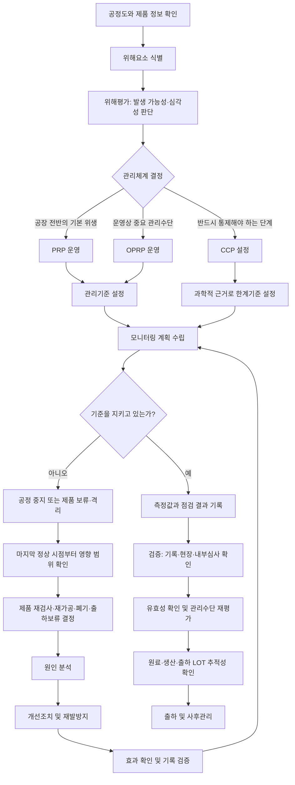

# [QA+ 블로그 생성 결과물] 식품안전 핵심용어 30
생성일시: 2026-09-17 06:53:16 (KST)
적용모델: gpt-5.6-terra

================================================================================
# 📋 [최종 발행용 블로그 패키지]

### 1. 메타 데이터 (SEO 설정)
- **최종 포스팅 제목**: CCP·한계기준·검증 쉽게 구분하기: 식품안전 실무 핵심용어 30
- **메타 디스크립션 (120자 내외 요약)**: HACCP 실무자가 자주 혼동하는 CCP, 한계기준, PRP, OPRP, 모니터링, 검증, 유효성 확인, 교정의 차이와 현장 적용법을 정리합니다.
- **추천 해시태그 (10개)**: #식품안전 #HACCP #식품품질관리 #CCP #한계기준 #위해요소분석 #식품제조업 #식품공장 #FSSC22000 #품질관리실무
- **카테고리**: 식품품질실무 / HACCP가이드

> **편집·사실 검수 반영 사항**
> - 「식품위생법」 제48조의 식품안전관리인증기준(HACCP) 관련 법적 근거 표현을 유지했습니다.
> - HACCP 세부 운영 기준은 「식품 및 축산물 안전관리인증기준」 및 최신 식품안전나라 고시를 확인하도록 안내했습니다.
> - “2~4시간 안에 추적” 및 “연 1회 이상 모의회수”는 모든 업종에 공통으로 법정 고정값이 아닐 수 있으므로, **자사 기준·인증 스킴·고객 요구사항에 따라 목표시간과 주기를 정해야 한다**는 방식으로 보완했습니다.
> - Q3의 오탈자 “정기적으로”를 교정했습니다.
> - HTML 본문에는 서로 다른 이미지 플레이스홀더 3개를 삽입했습니다.

---

## 2. 네이버 블로그 / 티스토리 복사용 최종 원고 (Markdown)

# CCP·한계기준·검증 쉽게 구분하기: 식품안전 실무 핵심용어 30

> **20년 실무 선배의 한 줄 요약**  
> 식품안전 용어는 시험을 위한 암기 과목이 아닙니다. 우리 공장에서 “무엇을, 누가, 어떤 기준으로 관리하고, 기준을 벗어나면 제품을 어떻게 처리할지”를 같은 언어로 정하는 도구입니다.

---

## 1. 용어를 정확히 알아야 HACCP 문서와 현장이 연결됩니다

HACCP 업무를 처음 맡으면 가장 먼저 막히는 것이 약어와 비슷한 표현입니다. CCP, CL, PRP, 검증, 유효성 확인, 교정, 개선조치가 모두 중요해 보이지만, 실제로는 **관리 목적과 실행 시점이 서로 다릅니다.** 이 차이를 모르고 문서를 작성하면 심사 때 설명이 꼬이거나, 더 심하게는 이탈 제품을 제대로 통제하지 못하는 문제가 생깁니다.

현장에서 특히 많이 나오는 질문이 있습니다. “금속검출기는 무조건 CCP 아닌가요?”, “온도계 교정이 검증인가요?”, “모니터링도 확인이고 검증도 확인인데 뭐가 다른가요?” 같은 질문입니다. 결론부터 말씀드리면, **용어는 설비 이름으로 정하는 것이 아니라 위해요소 분석과 관리 목적에 따라 정해야 합니다.**

예를 들어 손 세척은 대체로 선행요건관리(PRP)로 관리합니다. 반면 가열 후 바로 섭취하는 제품의 중심온도 관리는 위해요소를 제거하는 핵심 단계가 될 수 있어 CCP로 설정될 가능성이 큽니다. 쉽게 말하면 PRP는 “공장 전체가 기본적으로 깨끗하게 움직이게 하는 생활수칙”이고, CCP는 “여기서 놓치면 제품 안전이 무너질 수 있는 결정적 관문”입니다.

또 하나 중요한 점은, 문서에 적힌 표현과 현장 작업자의 표현이 같아야 한다는 것입니다. HACCP 계획서에는 “금속검출 CCP, 시간당 1회 감도점검”이라고 적혀 있는데, 작업자가 “바쁠 때는 점심 전후로만 확인한다”고 답하면 바로 부적합 위험이 생깁니다. 결국 식품안전 용어는 품질팀만 쓰는 말이 아니라 생산·설비·구매·물류팀이 함께 쓰는 공통 언어입니다.


이제 용어를 무작정 가나다순으로 외우지 말고, 실제 공장 관리 흐름에 맞춰 잡아보겠습니다. 먼저 “무엇이 위험한가”를 찾는 개념부터 정리해야 뒤에 나오는 CCP와 한계기준도 자연스럽게 이해됩니다.

---

## 2. 식품안전·위해요소·위해평가: HACCP의 출발점

첫 번째 용어는 **식품안전(Food Safety)** 입니다. 식품안전이란 식품이 의도된 방법으로 조리하거나 섭취되었을 때 소비자 건강에 위해를 일으키지 않도록 관리되는 상태를 말합니다. 맛이 좋고 외관이 멀쩡하다고 해서 안전한 식품이라는 뜻은 아닙니다. 쉽게 말하면 소비자가 먹었을 때 탈이 나지 않도록 만드는 것이 식품안전의 본질입니다.

두 번째는 **위해요소(Hazard)** 입니다. 위해요소는 사람 건강에 해를 줄 가능성이 있는 생물학적·화학적·물리적 인자 또는 상태를 뜻합니다. HACCP은 문제가 실제로 터진 뒤에 원인을 찾는 방식이 아니라, 터질 수 있는 위해요소를 미리 찾아 통제하는 예방관리 체계입니다. 그래서 위해요소 분석표에는 “이물이 발견됨”보다 “설비 마모에 따른 금속 이물 혼입 가능성”처럼 원인과 발생 경로를 적는 편이 훨씬 좋습니다.

위해요소는 보통 세 가지로 구분합니다.

- **생물학적 위해요소**: 살모넬라, 리스테리아 모노사이토제네스, 대장균, 노로바이러스, 기생충처럼 미생물과 관련된 위험
- **화학적 위해요소**: 세척·소독제 잔류, 농약, 동물용의약품, 중금속, 식품첨가물 과다 사용, 알레르겐 교차접촉
- **물리적 위해요소**: 금속, 유리, 플라스틱, 돌, 나무 조각처럼 식품에 섞이면 소비자에게 상해를 줄 수 있는 이물

여기서 꼭 구분해야 할 것이 **위해평가(Risk Assessment)** 입니다. 위해요소는 해를 일으킬 수 있는 ‘원인’이고, 위해평가는 그 원인이 실제로 발생할 가능성과 발생했을 때의 심각성을 판단하는 과정입니다. 예를 들어 금속 조각은 위해요소이고, 특정 공정에서 금속이 들어갈 가능성이 얼마나 되는지와 들어갔을 때 소비자 상해가 얼마나 심각한지를 평가하는 것이 위해평가입니다. 심사에서 “왜 이 항목을 중점 관리 대상으로 선정했습니까?”라는 질문이 나오면 위해평가 근거를 설명할 수 있어야 합니다.

| 구분 | 정의 | 현장 예시 | 흔한 실수 |
|---|---|---|---|
| 식품안전 | 섭취 시 건강상 위해가 없도록 관리된 상태 | 가열·냉각·보관·표시를 통한 안전 확보 | 맛, 외관, 수율만 관리하고 안전을 놓침 |
| 위해요소 | 건강에 해를 줄 수 있는 원인 | 살모넬라, 세척제, 금속 조각 | 문제 발생 여부만 보고 잠재 위해를 누락 |
| 생물학적 위해요소 | 미생물·바이러스·기생충 관련 위해 | 원료육의 병원성 미생물 | 생원료와 가열품 동선 혼재 |
| 화학적 위해요소 | 화학물질·알레르겐 관련 위해 | 세척제 잔류, 우유·대두 교차접촉 | 알레르겐을 표시 업무로만 생각 |
| 물리적 위해요소 | 이물에 의한 위해 | 금속, 유리, 경질 플라스틱 | 금속검출기로 모든 이물이 잡힌다고 생각 |
| 위해평가 | 발생 가능성·심각성으로 우선순위 판단 | 금속 혼입 가능성 3점, 심각성 4점 평가 | 모든 항목에 같은 점수를 부여 |

위해요소를 찾았다면 다음 질문은 하나입니다. “이 위험을 공장 전체 위생관리로 막을 것인가, 특정 공정에서 강하게 통제할 것인가?” 이 질문에 답하는 구조가 PRP, OPRP, CCP입니다.

---

## 3. HACCP·PRP·OPRP·CCP: 서로 대체할 수 없는 관리 체계

**HACCP(Hazard Analysis and Critical Control Point)** 은 위해요소를 분석하고, 중요한 관리 지점을 설정해 사전에 통제하는 식품안전관리 체계입니다. 국내에서는 「식품위생법」 제48조가 식품안전관리인증기준(HACCP)의 법적 근거가 됩니다. 세부 운영은 식품의약품안전처 고시인 「식품 및 축산물 안전관리인증기준」에서 선행요건관리, 위해요소 분석, 중요관리점, 한계기준, 모니터링, 개선조치, 검증 등의 틀로 요구합니다.

**선행요건관리(PRP, Prerequisite Program)** 는 HACCP이 제대로 작동하기 위한 기본 위생관리 기반입니다. 작업장 청소·소독, 개인위생, 해충방제, 용수관리, 폐기물관리, 원료 보관, 이물관리, 시설 유지보수가 여기에 포함됩니다. 쉽게 말하면 PRP는 “특정 제품 한 개가 아니라 공장 전체에 늘 깔려 있어야 하는 위생 바닥”입니다. 바닥이 무너지면 CCP를 아무리 잘 관리해도 다시 오염될 수 있습니다.

**중요관리점(CCP, Critical Control Point)** 은 특정 위해요소를 예방·제거하거나 허용 가능한 수준으로 감소시키기 위해 반드시 관리해야 하는 단계입니다. 대표적으로 가열, 금속검출, X-ray 검사, 냉각 등이 거론되지만, 모든 공장에서 같은 공정이 CCP가 되는 것은 아닙니다. 제품 특성, 원료 위험도, 전후 공정의 관리수단, 소비 방법을 분석한 뒤 결정해야 합니다. “다른 공장 금속검출기가 CCP니까 우리도 CCP”라고 정하면 심사에서 선정 근거가 약해집니다.

ISO 22000 또는 FSSC 22000을 운영하는 사업장이라면 **운영선행요건프로그램(OPRP)** 도 이해해야 합니다. OPRP는 중요 위해요소를 통제하기 위한 운영상 관리수단이지만, 국내 HACCP의 CCP와 단순히 1대1로 대응시키면 안 됩니다. ISO 체계에서는 PRP·OPRP·CCP를 위해요소 평가와 통제수단 조합에 따라 구분합니다. 따라서 ISO/FSSC 문서를 국내 HACCP 문서에 그대로 붙여 넣기보다, 자사 적용 기준과 용어 정의를 절차서에 분명히 적어두는 것이 안전합니다.

| 구분 | PRP | OPRP | CCP |
|---|---|---|---|
| 관리 목적 | 기본 위생환경 유지 | 중요 위해요소의 운영상 통제 | 중대한 위해요소의 필수 통제 |
| 주된 관리 방식 | 절차서·점검표·위생기준 | 실행기준·운영조건·관찰 | 명확한 한계기준과 모니터링 |
| 이탈 시 대응 | 위생개선 및 보완 | 원인·영향 평가 후 조치 | 즉시 제품 격리 및 안전성 판단 |
| 예시 | 손 위생, 해충방제, 청소 | 알레르겐 세척관리, 체 관리 | 가열, 금속검출, X-ray 검사* |
| 주의점 | 기본관리라고 가볍게 보면 안 됨 | CCP보다 약한 단계라는 뜻이 아님 | 공정별 위해요소 분석으로 결정 |

> **중요**  
> 가열·금속검출·X-ray는 흔히 CCP로 운영되지만, 실제 CCP 여부는 반드시 자사 제품과 공정의 위해요소 분석 결과로 결정해야 합니다.

PRP와 CCP를 구분했다면 이제 기준을 세워야 합니다. 이때부터는 “정상입니다”라는 말보다 숫자와 기록의 신뢰성이 훨씬 중요해집니다.

---

## 4. 한계기준·관리기준·모니터링·이탈: 숫자로 관리하는 법

**한계기준(CL, Critical Limit)** 은 CCP가 관리 상태인지 아닌지를 판단하는 명확한 경계선입니다. 예를 들어 “가열 중심온도 75℃ 이상, 1분 이상 유지” 또는 “금속검출기 Fe 2.0 mm, SUS 3.0 mm 시험편 검출”처럼 측정 가능하고 판정이 분명해야 합니다. 한계기준은 생산 편의를 위해 적는 숫자가 아니라, 위해요소가 안전한 수준으로 통제된다는 과학적 근거가 있는 숫자여야 합니다.

반면 **관리기준**은 공정·설비·위생 상태를 안정적으로 운영하기 위해 회사가 정한 기준입니다. 냉장실 온도 0~5℃ 관리, 작업장 조도 기준, 세척수 농도 기준, 작업복 청결 상태 등이 관리기준이 될 수 있습니다. 중요한 점은 모든 관리기준이 CCP 한계기준은 아니라는 것입니다. 문서에서 두 표현을 마구 섞어 쓰면 이탈 발생 시 제품 격리가 필요한지, 단순 보완이면 되는지 판단이 불명확해집니다.

**모니터링(Monitoring)** 은 CCP 또는 관리수단이 기준대로 유지되는지를 계획적으로 관찰하거나 측정하는 활동입니다. 좋은 모니터링 계획에는 다섯 가지가 들어가야 합니다. 누가 확인하는지, 무엇을 보는지, 어떻게 측정하는지, 언제 또는 몇 시간마다 확인하는지, 어디에 기록하는지가 명확해야 합니다.

예를 들어 다음과 같이 작성할 수 있습니다.

> 포장반장 / 금속검출기 시험편 통과 여부 / 표준시험편 사용 / 작업 시작 전·4시간마다·작업 종료 후 / 금속검출기 점검일지 기록

**이탈(Deviation)** 은 설정한 한계기준이나 관리기준을 벗어난 상태입니다. 예를 들어 CCP 가열 기준이 중심온도 75℃ 이상인데 73.8℃로 측정됐다면, “거의 75℃니까 괜찮다”가 아니라 이탈입니다. 이탈이 발생하면 해당 시점 이전부터 마지막 정상 확인 시점 이후까지의 제품 범위를 먼저 잡아야 합니다. 이 부분을 놓치면 심사관이 “마지막 정상 점검은 몇 시였고, 이탈 발견 시점은 몇 시이며, 그 사이 생산품은 어떻게 처리했습니까?”라고 물었을 때 답하기 어렵습니다.

> **현장 실무 꿀팁**  
> CCP 기록에는 가능한 한 “정상”, “이상 없음”만 쓰지 마세요. 온도·시간·중량·농도·시험편 결과처럼 실제 측정값을 남겨야 기록의 신뢰성이 생깁니다. 다만 시험편 통과 여부처럼 수치보다 판정 자체가 핵심인 항목은 “Fe 2.0 mm 검출 확인”처럼 구체적으로 남기면 됩니다.

기준을 벗어났다고 해서 무조건 제품을 폐기해야 하는 것은 아닙니다. 하지만 제품을 안전하다고 판단하려면 즉시 조치, 영향 범위 확인, 원인 제거, 재발방지까지 순서대로 가야 합니다.




---

## 5. 교정·개선조치·부적합: 이탈이 났을 때 제품부터 잡으세요

**교정(Correction)** 은 발견된 문제를 즉시 바로잡는 조치입니다. 예를 들어 제품에 잘못된 라벨이 붙은 것을 발견해 즉시 올바른 라벨로 교체했다면 교정입니다. 금속검출기 시험편이 통과하지 않아 설비를 재조정하고 다시 시험한 것도 즉시 조치에 해당할 수 있습니다. 쉽게 말하면 지금 눈앞의 문제를 멈추고 바로잡는 행동입니다.

**개선조치(Corrective Action)** 는 부적합이나 이탈의 원인을 제거하고 재발을 방지하는 조치입니다. 라벨을 바꾸는 것만으로는 개선조치가 아닙니다. 왜 잘못된 라벨이 투입됐는지, 포장재 보관구획이 없었는지, 작업 전 대조 확인이 생략됐는지, 작업자 교육이 부족했는지를 분석하고 관리방법을 바꿔야 합니다. 즉시 바로잡는 교정과 다시 안 생기게 만드는 개선조치를 분리해 생각하면 문서가 훨씬 명확해집니다.

**부적합(Nonconformity)** 은 법규, 인증기준, 고객 요구사항, 사내 절차서 등 정해진 요구사항을 충족하지 못한 상태입니다. 예를 들어 식품공전 미생물 기준을 초과한 경우는 물론이고, 사내 기준상 매일 해야 하는 온도계 일상점검을 누락한 경우도 부적합이 될 수 있습니다. “제품은 문제없어 보이니 기록 누락은 괜찮다”는 생각은 위험합니다. 기록이 없으면 그 시간대 관리가 실제로 이루어졌다는 객관적 증거가 사라지기 때문입니다.

이탈이 발생했을 때 권장 순서는 다음과 같습니다.

1. 해당 공정 또는 제품 LOT를 즉시 보류·격리합니다.
2. 마지막 정상 확인 시점부터 이탈 발견 시점까지 영향 범위를 정합니다.
3. 제품의 재가공·선별·폐기·출하보류 등 처리 결정을 근거와 함께 기록합니다.
4. 설비·사람·원료·방법·환경 측면에서 근본 원인을 분석합니다.
5. 개선조치를 시행한 뒤 효과를 확인합니다.

| 단계 | 반드시 할 일 | 기록 예시 | 놓치기 쉬운 함정 |
|---|---|---|---|
| 1. 교정 | 즉시 공정 정지, 설비 조정, 라벨 교체 | 조치 시각, 담당자, 조치 내용 | 문제 제품을 계속 생산함 |
| 2. 제품 통제 | 영향 LOT 보류·격리·식별 | 마지막 정상 시점, 이탈 발견 시점 | 이탈 전 생산품 범위를 누락 |
| 3. 원인 분석 | 5 Why, 설비·작업·원료 분석 | 마모 부품, 교육 미흡, 절차 누락 | “작업자 실수”로만 종료 |
| 4. 개선조치 | 절차 변경, 교육, 설비 보완 | 개선 완료일, 책임자, 증빙 | 재발방지 대책이 없음 |
| 5. 효과 확인 | 재점검·추가 모니터링·내부심사 | 자사 기준에 따른 추적 결과 | 조치 후 효과를 확인하지 않음 |

이제 “관리하고 조치했다”는 사실을 누가 확인할 것인지 살펴보겠습니다. 여기서 모니터링, 검증, 유효성 확인, 교정은 반드시 구분하셔야 합니다.

---

## 6. 검증·유효성 확인·교정·확인검사: 비슷해 보여도 시점이 다릅니다

**유효성 확인(Validation)** 은 설정한 관리수단이나 기준 자체가 실제 위해요소를 효과적으로 통제할 수 있는지를 사전에 입증하는 활동입니다. 예를 들어 가열 기준을 중심온도 75℃, 1분으로 정했다면 “왜 75℃, 왜 1분인가?”에 대한 근거가 있어야 합니다. 공신력 있는 문헌, 관계 법령·가이드라인, 자체 열분포 시험, 미생물 챌린지 테스트, 외부 전문가 검토 자료 등이 근거가 될 수 있습니다. 쉽게 말하면 유효성 확인은 “우리가 정한 방법이 애초에 안전한 방법이 맞는가?”를 확인하는 일입니다.

**검증(Verification)** 은 정해진 HACCP 계획과 관리 활동이 실제로 계획대로 운영되고 효과가 유지되는지 확인하는 활동입니다. CCP 기록 검토, 현장 관찰, 내부심사, 미생물 시험, 교정성적서 확인, 이탈조치 완료 여부 점검 등이 검증에 포함될 수 있습니다. 예를 들어 품질팀장이 매주 금속검출기 일지를 검토해 누락 여부와 이탈조치 적절성을 확인하는 것은 검증입니다. 즉, 검증은 “정한 방법을 현장에서 제대로 하고 있는가?”를 보는 활동입니다.

**교정(Calibration)** 은 온도계, 저울, pH meter, 염도계 같은 측정기기의 표시값이 기준값과 맞는지 비교하고 필요 시 조정해 신뢰성을 확보하는 활동입니다. 여기서 교정은 앞에서 설명한 교정(Correction)과 한글은 같지만 영어와 의미가 다릅니다. 문서에는 혼동을 줄이기 위해 “측정기기 교정(Calibration)” 또는 “부적합 교정(Correction)”이라고 구분해 쓰는 것을 권합니다.

특히 CCP 중심온도계를 관리하면서 연 1회 외부 교정만 받고 일상점검을 하지 않는 경우가 많은데, 현장에서는 매일 또는 사용 전 기준 온도 확인 같은 일상점검도 중요합니다.

**확인검사**는 시험·검사 결과를 통해 관리 상태를 확인하는 활동입니다. 완제품 미생물 검사, 표면 ATP 검사, 용수 검사, 알레르겐 스왑 검사 등이 여기에 해당할 수 있습니다. 다만 완제품 검사 몇 건이 정상이라고 해서 모든 제품의 식품안전이 보장되는 것은 아닙니다. 표본검사는 일부만 보는 것이므로, HACCP의 핵심은 시험성적서가 아니라 원료부터 출하까지 공정을 예방적으로 통제하는 데 있습니다.


> **한 번에 구분하는 공식**
>
> - **모니터링**: 지금 기준을 지키고 있나?
> - **유효성 확인**: 이 기준과 방법이 원래 안전한가?
> - **검증**: 정한 방법대로 계속 운영되고 있나?
> - **교정(Calibration)**: 측정값을 믿어도 되나?
> - **확인검사**: 시험 결과로 관리 상태를 뒷받침할 수 있나?

관리수단이 제대로 돌아가도, 문제가 생긴 제품을 찾아낼 수 없다면 사고 범위는 커집니다. 그래서 다음 용어들은 품질팀뿐 아니라 구매·생산·물류팀이 함께 관리해야 합니다.

---

## 7. 추적성·회수·알레르겐·교차오염·세척·소독: 공장 전체를 지키는 용어

**추적성(Traceability)** 은 원료 입고부터 제조, 보관, 출하까지 제품의 이력과 흐름을 추적할 수 있는 능력입니다. 핵심은 원료 LOT, 생산 LOT, 완제품 LOT, 출하처 정보가 끊기지 않고 연결되는 것입니다. 예를 들어 원료 대두단백 LOT A-240901이 어느 생산일자, 어느 배합탱크, 어느 완제품 LOT, 어느 거래처로 나갔는지를 신속하게 찾아낼 수 있어야 실무적으로 의미가 있습니다. 추적 목표시간은 법령, 인증 스킴, 고객 요구사항 및 자사 회수계획에 따라 정해 관리하세요. 서류는 있는데 실제 재고와 LOT가 맞지 않는다면 추적성 체계는 작동하지 않는 것입니다.

**회수(Recall)** 는 유통된 위해 우려 제품을 시장에서 회수하는 조치입니다. 회수는 사고가 난 뒤 연락처를 찾는 업무가 아니라, 평소 회수계획과 비상연락망, 거래처 명단, 제품 식별체계를 준비하는 업무입니다. 자사 회수계획과 적용 인증기준에서 정한 주기에 따라 모의회수를 실시하고, 목표 시간 내 추적 가능 여부와 회수율 산정 방식을 점검해보세요. 모의회수에서 100% 추적이 안 되면 실제 사고 때는 더 어렵다고 보시면 됩니다.

**식품 알레르겐(Allergen)** 은 특정 소비자에게 알레르기 반응을 유발할 수 있는 식품 또는 성분입니다. 알레르겐 관리는 원료 규격서 확인만으로 끝나지 않습니다. 입고 시 표시 확인, 창고 구획, 전용 용기와 도구 사용, 생산순서 관리, 세척 검증, 포장재 라벨 대조, 출하 LOT 관리까지 연결해야 합니다. 특히 대두·우유·계란·밀·땅콩류 등을 다루는 공장이라면 “알레르겐 원료가 어디에 있고, 어떤 설비를 거쳐, 어떤 제품에 영향을 줄 수 있는지”를 흐름도로 그려보는 것이 좋습니다.

**교차오염(Cross-contamination)** 은 미생물·알레르겐·이물이 사람, 손, 장갑, 기구, 설비, 공기, 원료를 통해 다른 제품으로 옮겨가는 현상입니다. 생원료 구역과 가열 후 제품 구역의 동선이 겹치거나, 알레르겐 함유 제품 생산 후 세척이 불충분한 경우가 대표적입니다.

**세척(Cleaning)** 은 식품 잔사와 오염물을 제거하는 활동이고, **소독·살균(Sanitation/Disinfection)** 은 미생물 수를 안전한 수준으로 줄이는 활동입니다. 유기물이 남아 있으면 소독제가 제 역할을 못 할 수 있으므로, 기본 순서는 대체로 세척 후 소독입니다.

마지막 용어는 **식품안전문화(Food Safety Culture)** 입니다. 절차서가 아무리 좋아도 생산량 때문에 손 세척, 온도 확인, 기록 작성을 생략하는 분위기라면 식품안전시스템은 서류에만 존재합니다. 반대로 작업자가 “기록 누락을 숨기는 것보다 즉시 보고하는 것이 맞다”고 믿는 조직은 이탈을 더 빨리 잡고 더 작게 끝낼 수 있습니다. 식품안전문화는 거창한 구호가 아니라, 문제가 보였을 때 멈추고 보고할 수 있는 현장 분위기에서 시작됩니다.

이 개념들이 실제 현장에서는 어떻게 적용되는지, 서로 다른 업종 사례로 살펴보겠습니다. 아래 사례는 특정 회사의 실제 정보를 공개한 것이 아니라, 현장에서 반복되는 문제 유형을 바탕으로 재구성한 예시입니다.

---

## 8. 실제 현장 사례로 보는 적용법

### 사례 1. 냉동만두 제조공장의 금속검출기 CCP 이탈

냉동만두 제조공장에서 포장 후 금속검출기를 CCP로 운영하고 있었습니다. 작업 시작 전, 4시간마다, 작업 종료 후 Fe와 SUS 시험편을 통과시켜 감도를 확인하도록 관리계획을 세웠습니다. 어느 날 오후 3시 점검에서 SUS 시험편이 검출되지 않았는데, 작업자는 설비를 재가동한 뒤 오후 3시 이후 생산품만 다시 검사하면 된다고 판단했습니다. 하지만 마지막 정상 점검은 오전 11시였기 때문에 실제 영향 범위는 오전 11시부터 오후 3시까지 생산된 제품 전체였습니다.

품질팀은 즉시 해당 시간대 완제품 1,280박스를 출하보류 구역으로 이동하고, 창고와 출하대기 제품을 LOT별로 재확인했습니다. 원인 분석 결과, 금속검출기 헤드 부근에 설치된 냉각팬 진동으로 감도 설정값이 미세하게 흔들렸고, 작업자는 일상점검 시 시험편 투입 위치를 일정하게 지키지 않았습니다.

즉시 조치로 설비를 정비하고, 보류 제품 전량을 검증된 조건에서 재검사했습니다. 개선조치로는 시험편 투입 위치 표시선을 부착하고, 점검 주기를 4시간에서 생산량 기준 2,000 kg마다 추가 확인하도록 보완했습니다. 또한 작업자 교육 시 “재검사 정상”이 이전 생산품의 안전성을 자동 보장하지 않는다는 점을 사례 중심으로 교육했습니다. 이후 3개월간 CCP 기록을 주 단위로 검증한 결과, 감도점검 누락과 부정확한 시험편 투입이 사라졌습니다.

### 사례 2. 소스류 제조공장의 알레르겐 교차접촉 문제

마요네즈 베이스 소스와 비알레르겐 매운 소스를 함께 생산하는 소스류 공장에서, 고객사로부터 비알레르겐 제품에 난류 표시가 누락된 것 아니냐는 문의가 들어왔습니다. 완제품 표시지는 비알레르겐 제품용으로 정상 사용됐지만, 생산 전날 계란 함유 마요네즈 소스를 같은 배합탱크와 충전라인에서 생산한 이력이 있었습니다.

현장 세척일지를 확인하니 “세척 완료”라고만 적혀 있었고, 세척제 농도·접촉시간·헹굼 확인·분해세척 여부가 구체적으로 남아 있지 않았습니다. 즉, 교정이나 세척 자체보다 알레르겐 OPRP 또는 PRP 관리기준이 불명확한 것이 근본 문제였습니다.

품질팀은 우선 해당 비알레르겐 제품 LOT를 출하보류하고, 보관 샘플과 설비 스왑 검사를 실시했습니다. 검사 결과 일부 구간에서 단백질 잔류 가능성이 확인되어 해당 LOT는 고객사와 협의 후 출하하지 않고 폐기 처리했습니다.

원인 분석에서는 생산순서가 “알레르겐 함유품 후 비함유품”으로 편성된 점, 탱크 하부 밸브 분해세척 절차가 없던 점, 세척 확인 기준이 정성적이었던 점이 확인됐습니다. 개선조치로 비알레르겐 제품을 먼저 생산하도록 생산순서를 변경하고, 불가피하게 후생산할 경우 밸브 분해세척과 단백질 스왑 확인을 의무화했습니다. 포장 전에는 원료 배합표와 라벨 문구를 생산·품질 담당자가 이중 대조하도록 절차도 보완했습니다. 그 결과 이후 고객사 감사에서 알레르겐 원료부터 라벨까지 연결된 관리 체계가 확인되어 개선 우수사례로 평가받았습니다.

### 사례 3. 레토르트 죽 제조공장의 가열 기준 유효성 확인 부족

레토르트 죽 제조공장은 살균공정을 CCP로 운영하면서 “121℃, 15분”을 한계기준으로 관리하고 있었습니다. 그런데 HACCP 정기평가 준비 중 심사원이 “이 제품과 포장규격에서 왜 121℃, 15분입니까?”라고 질문하자, 현장에는 오래된 설비 매뉴얼 외에 명확한 근거자료가 없었습니다.

작업자들은 매 배치 온도와 시간을 성실히 모니터링하고 있었지만, 그 조건이 제품 중심부까지 충분한 살균 효과를 낸다는 유효성 확인 자료가 부족한 상태였습니다. 모니터링은 잘했지만 유효성 확인이 약했던 전형적인 사례입니다.

회사는 외부 전문기관과 함께 열분포 및 열침투 시험을 실시했습니다. 시험 결과 용기 적재 위치와 제품 점도에 따라 냉점 부위가 달라질 수 있으며, 특정 고점도 제품은 기존 조건에서 목표 F값 확보 여유가 작다는 사실이 확인됐습니다.

이에 따라 제품군을 점도와 충전중량 기준으로 재분류하고, 고점도 제품에는 예열 조건과 유지시간을 추가 적용했습니다. 살균기 온도센서와 기록계는 외부 교정성적서뿐 아니라 생산 전 기준온도 비교 점검도 강화했습니다. 변경된 조건은 3개 연속 생산 LOT에서 확인검사와 기록 검토를 통해 효과를 검증했습니다. 이후 HACCP 계획서에는 한계기준뿐 아니라 설정 근거, 유효성 확인 보고서 번호, 검증 주기까지 연결해 기록했습니다. 결과적으로 심사에서는 단순히 “온도를 지켰다”는 수준을 넘어 “왜 그 온도가 안전한지 입증했다”는 평가를 받을 수 있었습니다.

사례를 보면 공통점이 있습니다. 좋은 품질팀은 문제가 없다고 말하는 팀이 아니라, 문제가 생겼을 때 제품 범위와 원인을 빠르게 잡고 재발하지 않게 만드는 팀입니다. 마지막으로 실무자분들이 가장 자주 묻는 질문을 정리해보겠습니다.

---

## 9. 자주 묻는 질문(FAQ)과 심사관 단골 지적 사항

### Q1. 금속검출기는 무조건 CCP인가요?

**A. 아닙니다.** 금속 위해요소의 발생 가능성, 전 공정의 예방관리 수준, 후속 제거공정 존재 여부, 제품 특성, 소비자 위해 수준을 분석해 결정해야 합니다. 다만 금속검출기를 CCP로 운영한다면 시험편 규격, 점검 주기, 한계기준, 이탈 제품 격리절차를 매우 명확히 관리해야 합니다.

### Q2. CCP와 OPRP는 CCP가 더 강하고 OPRP는 약한 관리인가요?

**A. 그렇게 단순하게 이해하면 곤란합니다.** OPRP는 ISO 22000 체계에서 중요 위해요소를 통제하기 위해 설정한 운영상 관리수단이며, 단지 “약한 CCP”라는 뜻이 아닙니다. 국내 HACCP과 ISO/FSSC를 함께 운영한다면 각 표준의 용어 정의와 자사 관리체계 연결표를 만들어두세요.

### Q3. 완제품 미생물검사를 정기적으로 하면 HACCP 검증은 충분한가요?

**A. 충분하지 않습니다.** 완제품 검사는 검증 활동의 일부일 뿐이며, 표본검사이므로 모든 제품의 안전성을 보장할 수 없습니다. CCP 모니터링 기록 검토, 현장점검, 측정기기 교정 확인, 내부심사, 이탈조치 효과 확인을 함께 운영해야 합니다.

### Q4. 모니터링 기록을 빠뜨렸는데 나중에 작성해도 되나요?

**A. 실제로 확인하지 않은 내용을 나중에 작성하면 기록 신뢰성 문제가 생깁니다.** 누락 사실을 숨기지 말고, 누락 시간대 제품의 안전성 영향평가와 관리자의 확인 내용을 남겨야 합니다. 그리고 왜 누락됐는지 분석해 인력 공백, 점검시점, 기록지 위치, 전산 권한 같은 원인을 개선해야 합니다.

### Q5. 세척과 소독은 왜 분리해서 관리해야 하나요?

**A. 세척은 잔사와 오염물을 제거하는 활동이고, 소독은 미생물 수를 줄이는 활동이기 때문입니다.** 표면에 기름·단백질·전분 같은 유기물이 남아 있으면 소독제가 미생물까지 충분히 도달하지 못할 수 있습니다. 세척제·소독제의 사용농도, 접촉시간, 온도, 헹굼 필요 여부는 반드시 제품 설명서와 자사 절차서에 맞게 관리하세요.

### Q6. “정상”이라고만 적은 CCP 기록도 인정될 수 있나요?

**A. 항목에 따라 다르지만, 온도·시간·중량·농도처럼 수치화 가능한 항목은 실제 측정값을 기록하는 것이 원칙적으로 안전합니다.** “정상”만 반복되면 실제 측정 여부와 사후 작성 여부를 의심받을 수 있습니다. 기록지는 작업자가 쉽게 작성할 수 있으면서도 심사 시 객관적으로 설명 가능한 형태로 설계해야 합니다.

### 심사관이 자주 보는 10가지

- [ ] HACCP 계획서 공정도와 실제 작업 동선이 다릅니다.
- [ ] 위해요소 분석 점수가 전 항목 동일하거나 평가 근거가 없습니다.
- [ ] CCP 한계기준의 법적·과학적 설정 근거가 없습니다.
- [ ] 모니터링 기록에 실제 수치 없이 “정상”만 반복됩니다.
- [ ] 이탈 시 마지막 정상 시점부터 제품 격리 범위를 잡지 못합니다.
- [ ] 개선조치에 근본 원인과 재발방지 대책이 없습니다.
- [ ] 온도계·저울·pH meter 등의 교정 및 일상점검 이력이 부족합니다.
- [ ] 원료 LOT–생산 LOT–출하 LOT가 연결되지 않습니다.
- [ ] 알레르겐 원료의 보관·생산순서·세척·표시 관리가 분리되어 있습니다.
- [ ] 절차서 내용과 작업자 인터뷰 답변이 다릅니다.

---

## 10. 오늘 바로 쓰는 식품안전 핵심용어 30 체크리스트

마지막으로 오늘 정리한 30개 용어를 업무 흐름에 맞춰 다시 묶어보겠습니다. 신입사원 교육자료, HACCP 팀 회의자료, 내부심사 체크리스트를 만들 때 아래 표를 그대로 활용하셔도 좋습니다. 단, 한계기준이나 점검주기 같은 수치는 반드시 자사 공정의 검증자료와 최신 법령·고시 기준을 반영해 정해야 합니다.

| 번호 | 핵심용어 | 문서에 적용할 때 확인할 질문 |
|---:|---|---|
| 1 | 식품안전 | 소비자 건강상 위해를 막는 관리목표가 분명한가? |
| 2 | 위해요소 | 생물학적·화학적·물리적 위해를 빠짐없이 찾았는가? |
| 3 | 생물학적 위해요소 | 생원료, 작업자, 냉각·보관 중 미생물 위험을 봤는가? |
| 4 | 화학적 위해요소 | 세척제, 첨가물, 농약, 알레르겐을 검토했는가? |
| 5 | 물리적 위해요소 | 금속 외 유리·플라스틱·돌 등도 검토했는가? |
| 6 | 위해요소 분석 | 공정도와 실제 현장이 일치하는가? |
| 7 | 위해평가 | 점수와 관리 우선순위의 근거가 있는가? |
| 8 | HACCP | 검사 중심이 아닌 예방 중심으로 설계됐는가? |
| 9 | PRP | 청소·개인위생·해충·용수 등 기반이 작동하는가? |
| 10 | OPRP | ISO/FSSC 적용 시 CCP와 구분 기준이 있는가? |
| 11 | CCP | 반드시 통제해야 하는 단계로 선정한 근거가 있는가? |
| 12 | 한계기준 | 측정 가능하고 과학적 근거가 있는 수치인가? |
| 13 | 관리기준 | CCP 한계기준과 일반 관리기준을 구분했는가? |
| 14 | 모니터링 | 누가·무엇을·어떻게·언제·어디에 기록하는가? |
| 15 | 개선조치 | 원인 제거와 재발방지가 포함됐는가? |
| 16 | 이탈 | 마지막 정상 시점부터 영향 제품을 격리했는가? |
| 17 | 검증 | 기록검토·현장관찰·내부심사가 운영되는가? |
| 18 | 유효성 확인 | 관리기준이 위해를 통제한다는 근거가 있는가? |
| 19 | 확인검사 | 시험 결과를 예방관리의 보조 수단으로 쓰는가? |
| 20 | 교정(Correction) | 눈앞의 부적합을 즉시 바로잡았는가? |
| 21 | 부적합 | 법규·고객·사내 요구사항을 충족하는가? |
| 22 | 추적성 | 원료–생산–출하 LOT를 신속하게 연결할 수 있는가? |
| 23 | 회수 | 모의회수와 비상연락망을 자사 기준에 따라 정기 점검하는가? |
| 24 | 알레르겐 | 원료부터 라벨까지 교차접촉을 관리하는가? |
| 25 | 교차오염 | 사람·도구·동선·공기 흐름을 관리하는가? |
| 26 | 세척 | 식품 잔사와 오염물을 충분히 제거하는가? |
| 27 | 소독·살균 | 농도·접촉시간·헹굼 조건을 지키는가? |
| 28 | 교정(Calibration) | 측정기기 값의 신뢰성을 정기적으로 확인하는가? |
| 29 | 내부심사 | 문서와 현장 일치성까지 확인하는가? |
| 30 | 식품안전문화 | 이상을 숨기지 않고 즉시 보고하는 분위기인가? |

---

## 11. 맺음말: 용어 암기보다 중요한 것은 같은 기준으로 움직이는 현장입니다

오늘 내용은 많아 보이지만, 핵심 흐름은 단순합니다.

> **위해요소를 찾고 → 관리수단을 정하고 → 기준을 세우고 → 운영 중 확인하고 → 이탈 시 제품을 통제하고 → 검증과 개선으로 다시 단단하게 만드는 것**

이것이 HACCP의 뼈대입니다. 용어 30개도 결국 이 흐름 안에서 이해하면 훨씬 덜 헷갈립니다.

특히 아래 다섯 쌍은 반드시 구분해두세요.

1. 위해요소와 위해평가  
2. PRP와 CCP  
3. 한계기준과 관리기준  
4. 모니터링과 검증  
5. 교정과 개선조치  

이 다섯 가지만 제대로 구분해도 HACCP 계획서, 점검일지, 부적합보고서의 수준이 확 달라집니다.

그리고 기억하실 점이 하나 더 있습니다. 좋은 기록은 “문제가 없었다”고 꾸미는 기록이 아니라, 문제가 생겼을 때 **언제 발견했고, 어떤 제품을 잡았고, 왜 발생했으며, 어떻게 재발을 막았는지**를 보여주는 기록입니다. 제품부터 잡고 원인을 나중에 잡는 순서만 지켜도 큰 사고를 상당히 줄일 수 있습니다.

> **게시 전 최신 기준 확인 안내**  
> 식품안전 관련 법령·고시·식품공전 기준은 개정될 수 있습니다. 실제 HACCP 계획서 작성 또는 기준 설정 전에는 반드시 **국가법령정보센터**, **식품안전나라**, **식품의약품안전처**에서 최신 「식품위생법」, 「식품 및 축산물 안전관리인증기준」, 「식품의 기준 및 규격」을 확인하세요.

후배님들의 HACCP 심사 대응과 현장 업무에 도움이 되기를 바랍니다.

---

## 3. 워드프레스 / 웹사이트용 HTML 원고

```html
<article class="food-qa-post">
  <header>
    <h1>CCP·한계기준·검증 쉽게 구분하기: 식품안전 실무 핵심용어 30</h1>
    <p><strong>20년 실무 선배의 한 줄 요약:</strong> 식품안전 용어는 시험을 위한 암기 과목이 아닙니다. 우리 공장에서 무엇을, 누가, 어떤 기준으로 관리하고 기준을 벗어나면 제품을 어떻게 처리할지 같은 언어로 정하는 도구입니다.</p>
  </header>

  <section>
    <h2>1. 용어를 정확히 알아야 HACCP 문서와 현장이 연결됩니다</h2>
    <p>HACCP 업무를 처음 맡으면 CCP, CL, PRP, 검증, 유효성 확인, 교정, 개선조치처럼 비슷해 보이는 용어에서 막히기 쉽습니다. 그러나 이 용어들은 관리 목적과 실행 시점이 서로 다릅니다. 이를 구분하지 못하면 심사 대응이 꼬이거나 이탈 제품을 제대로 통제하지 못할 수 있습니다.</p>
    <p>금속검출기가 무조건 CCP인지, 온도계 교정이 검증인지, 모니터링과 검증은 무엇이 다른지에 대한 답은 하나입니다. <strong>용어는 설비 이름이 아니라 위해요소 분석과 관리 목적에 따라 정해야 합니다.</strong></p>
    <p>손 세척은 대체로 PRP로 관리하지만, 가열 후 바로 섭취하는 제품의 중심온도 관리는 위해요소를 제거하는 핵심 단계가 되어 CCP가 될 수 있습니다. PRP는 공장 전체의 기본 위생 기반이며, CCP는 놓치면 제품 안전이 무너질 수 있는 결정적 관리 관문입니다.</p>

    <figure>
      
      <figcaption>식품안전 관리는 원료 입고부터 출하까지 공정 흐름 안에서 연결됩니다.</figcaption>
    </figure>
  </section>

  <section>
    <h2>2. 식품안전·위해요소·위해평가: HACCP의 출발점</h2>
    <p><strong>식품안전(Food Safety)</strong>이란 식품이 의도된 방법으로 조리하거나 섭취되었을 때 소비자 건강에 위해를 일으키지 않도록 관리되는 상태입니다. 맛과 외관이 좋아도 소비자 건강상 위해가 있다면 안전한 식품이라고 할 수 없습니다.</p>
    <p><strong>위해요소(Hazard)</strong>는 사람 건강에 해를 줄 가능성이 있는 생물학적·화학적·물리적 인자 또는 상태입니다. HACCP은 문제가 생긴 후 원인을 찾는 방식이 아니라, 발생할 수 있는 위해요소를 미리 찾아 통제하는 예방관리 체계입니다.</p>
    <ul>
      <li><strong>생물학적 위해요소:</strong> 살모넬라, 리스테리아 모노사이토제네스, 대장균, 노로바이러스, 기생충 등</li>
      <li><strong>화학적 위해요소:</strong> 세척·소독제 잔류, 농약, 동물용의약품, 중금속, 식품첨가물 과다 사용, 알레르겐 교차접촉 등</li>
      <li><strong>물리적 위해요소:</strong> 금속, 유리, 플라스틱, 돌, 나무 조각 등</li>
    </ul>
    <p><strong>위해평가(Risk Assessment)</strong>는 위해요소의 발생 가능성과 발생 시 심각성을 판단하는 과정입니다. 금속 조각은 위해요소이고, 특정 공정에서 금속이 혼입될 가능성과 소비자 상해의 심각성을 평가하는 것이 위해평가입니다.</p>

    <table>
      <thead>
        <tr><th>구분</th><th>정의</th><th>현장 예시</th><th>흔한 실수</th></tr>
      </thead>
      <tbody>
        <tr><td>식품안전</td><td>섭취 시 건강상 위해가 없도록 관리된 상태</td><td>가열·냉각·보관·표시 관리</td><td>맛·외관·수율만 관리</td></tr>
        <tr><td>위해요소</td><td>건강에 해를 줄 수 있는 원인</td><td>살모넬라, 세척제, 금속 조각</td><td>잠재 위해를 누락</td></tr>
        <tr><td>생물학적 위해요소</td><td>미생물·바이러스·기생충 관련 위해</td><td>원료육의 병원성 미생물</td><td>생원료와 가열품 동선 혼재</td></tr>
        <tr><td>화학적 위해요소</td><td>화학물질·알레르겐 관련 위해</td><td>세척제 잔류, 우유·대두 교차접촉</td><td>알레르겐을 표시 업무로만 생각</td></tr>
        <tr><td>물리적 위해요소</td><td>이물에 의한 위해</td><td>금속, 유리, 경질 플라스틱</td><td>금속검출기로 모든 이물이 잡힌다고 생각</td></tr>
        <tr><td>위해평가</td><td>발생 가능성·심각성으로 우선순위 판단</td><td>금속 혼입 가능성 3점, 심각성 4점</td><td>모든 항목에 같은 점수 부여</td></tr>
      </tbody>
    </table>
  </section>

  <section>
    <h2>3. HACCP·PRP·OPRP·CCP: 서로 대체할 수 없는 관리 체계</h2>
    <p><strong>HACCP</strong>은 위해요소를 분석하고 중요 관리 지점을 설정해 사전에 통제하는 식품안전관리 체계입니다. 국내 식품안전관리인증기준(HACCP)의 법적 근거는 「식품위생법」 제48조이며, 세부 운영은 「식품 및 축산물 안전관리인증기준」을 확인해야 합니다.</p>
    <p><strong>PRP(선행요건관리)</strong>는 청소·소독, 개인위생, 해충방제, 용수관리, 폐기물관리, 원료 보관, 이물관리, 시설 유지보수 등 HACCP 운영의 기본 위생 기반입니다.</p>
    <p><strong>CCP(중요관리점)</strong>는 특정 위해요소를 예방·제거하거나 허용 가능한 수준으로 감소시키기 위해 반드시 관리해야 하는 단계입니다. 가열, 금속검출, X-ray 검사, 냉각 등이 흔한 예시이지만, 실제 CCP 여부는 반드시 자사 제품과 공정의 위해요소 분석 결과로 결정해야 합니다.</p>
    <p><strong>OPRP(운영선행요건프로그램)</strong>는 ISO 22000 또는 FSSC 22000 체계에서 중요 위해요소를 통제하기 위한 운영상 관리수단입니다. OPRP를 단순히 약한 CCP로 보거나 국내 HACCP의 CCP와 1대1 대응시키면 안 됩니다.</p>

    <table>
      <thead>
        <tr><th>구분</th><th>PRP</th><th>OPRP</th><th>CCP</th></tr>
      </thead>
      <tbody>
        <tr><td>관리 목적</td><td>기본 위생환경 유지</td><td>중요 위해요소의 운영상 통제</td><td>중대한 위해요소의 필수 통제</td></tr>
        <tr><td>주된 관리 방식</td><td>절차서·점검표·위생기준</td><td>실행기준·운영조건·관찰</td><td>명확한 한계기준과 모니터링</td></tr>
        <tr><td>이탈 시 대응</td><td>위생개선 및 보완</td><td>원인·영향 평가 후 조치</td><td>즉시 제품 격리 및 안전성 판단</td></tr>
        <tr><td>예시</td><td>손 위생, 해충방제, 청소</td><td>알레르겐 세척관리, 체 관리</td><td>가열, 금속검출, X-ray 검사</td></tr>
      </tbody>
    </table>
  </section>

  <section>
    <h2>4. 한계기준·관리기준·모니터링·이탈: 숫자로 관리하는 법</h2>
    <p><strong>한계기준(CL, Critical Limit)</strong>은 CCP가 관리 상태인지 아닌지를 판단하는 명확한 경계선입니다. 예를 들어 가열 중심온도 75℃ 이상, 1분 이상 유지 또는 금속검출기 Fe 2.0 mm, SUS 3.0 mm 시험편 검출처럼 측정 가능하고 판정이 분명해야 합니다.</p>
    <p><strong>관리기준</strong>은 공정·설비·위생 상태를 안정적으로 운영하기 위해 회사가 정한 기준입니다. 냉장실 온도, 세척수 농도, 조도, 작업복 청결 상태 등이 해당할 수 있으며, 모든 관리기준이 CCP 한계기준은 아닙니다.</p>
    <p><strong>모니터링(Monitoring)</strong>은 CCP 또는 관리수단이 기준대로 유지되는지를 계획적으로 관찰하거나 측정하는 활동입니다. 담당자, 확인 항목, 측정 방법, 주기, 기록 위치를 명확히 해야 합니다.</p>
    <p><strong>이탈(Deviation)</strong>은 설정한 한계기준 또는 관리기준을 벗어난 상태입니다. CCP 가열 기준이 75℃ 이상인데 73.8℃가 측정됐다면 이탈입니다. 마지막 정상 확인 시점부터 이탈 발견 시점까지의 제품 범위를 우선 설정해야 합니다.</p>

    <aside>
      <p><strong>현장 실무 팁:</strong> CCP 기록에는 “정상”, “이상 없음”만 반복하기보다 온도·시간·중량·농도·시험편 결과처럼 실제 측정값을 기록하세요. 시험편 통과 여부가 핵심인 경우에는 “Fe 2.0 mm 검출 확인”처럼 구체적으로 남기는 것이 좋습니다.</p>
    </aside>

    <figure>
      
      <figcaption>CCP 이탈 시에는 원인 분석보다 제품 보류·격리와 영향 범위 확인이 먼저입니다.</figcaption>
    </figure>
  </section>

  <section>
    <h2>5. 교정·개선조치·부적합: 이탈이 났을 때 제품부터 잡으세요</h2>
    <p><strong>교정(Correction)</strong>은 발견된 문제를 즉시 바로잡는 조치입니다. 잘못 붙은 라벨을 올바른 라벨로 교체하거나, 금속검출기 시험편 미검출 후 설비를 재조정하는 조치가 예입니다.</p>
    <p><strong>개선조치(Corrective Action)</strong>는 부적합 또는 이탈의 원인을 제거하고 재발을 방지하는 조치입니다. 라벨을 교체하는 교정만으로는 충분하지 않으며, 잘못된 라벨이 투입된 원인과 절차상 문제를 분석해 관리방법을 바꿔야 합니다.</p>
    <p><strong>부적합(Nonconformity)</strong>은 법규, 인증기준, 고객 요구사항, 사내 절차서 등 정해진 요구사항을 충족하지 못한 상태입니다. 식품공전 기준 초과뿐 아니라 온도계 일상점검 누락도 부적합이 될 수 있습니다.</p>

    <ol>
      <li>해당 공정 또는 제품 LOT를 즉시 보류·격리합니다.</li>
      <li>마지막 정상 확인 시점부터 이탈 발견 시점까지 영향 범위를 정합니다.</li>
      <li>재가공·선별·폐기·출하보류 등 제품 처리 결정을 근거와 함께 기록합니다.</li>
      <li>설비·사람·원료·방법·환경 측면에서 근본 원인을 분석합니다.</li>
      <li>개선조치를 시행한 뒤 효과를 확인합니다.</li>
    </ol>

    <table>
      <thead>
        <tr><th>단계</th><th>반드시 할 일</th><th>기록 예시</th><th>놓치기 쉬운 함정</th></tr>
      </thead>
      <tbody>
        <tr><td>1. 교정</td><td>공정 정지, 설비 조정, 라벨 교체</td><td>조치 시각, 담당자, 조치 내용</td><td>문제 제품을 계속 생산</td></tr>
        <tr><td>2. 제품 통제</td><td>영향 LOT 보류·격리·식별</td><td>정상 시점과 이탈 발견 시점</td><td>이탈 전 생산품 범위 누락</td></tr>
        <tr><td>3. 원인 분석</td><td>5 Why, 설비·작업·원료 분석</td><td>마모 부품, 교육 미흡, 절차 누락</td><td>작업자 실수로만 종료</td></tr>
        <tr><td>4. 개선조치</td><td>절차 변경, 교육, 설비 보완</td><td>완료일, 책임자, 증빙</td><td>재발방지 대책 없음</td></tr>
        <tr><td>5. 효과 확인</td><td>재점검·추가 모니터링·내부심사</td><td>자사 기준에 따른 추적 결과</td><td>조치 후 효과 미확인</td></tr>
      </tbody>
    </table>
  </section>

  <section>
    <h2>6. 검증·유효성 확인·교정·확인검사: 비슷해 보여도 시점이 다릅니다</h2>
    <p><strong>유효성 확인(Validation)</strong>은 설정한 관리수단 또는 기준 자체가 실제 위해요소를 효과적으로 통제할 수 있는지를 사전에 입증하는 활동입니다. 문헌, 법령·가이드라인, 열분포 시험, 열침투 시험, 미생물 챌린지 테스트, 전문가 검토 자료 등이 근거가 될 수 있습니다.</p>
    <p><strong>검증(Verification)</strong>은 정해진 HACCP 계획과 관리 활동이 실제 계획대로 운영되고 효과가 유지되는지를 확인하는 활동입니다. CCP 기록 검토, 현장 관찰, 내부심사, 미생물 시험, 교정성적서 확인, 이탈조치 완료 여부 점검 등이 포함될 수 있습니다.</p>
    <p><strong>측정기기 교정(Calibration)</strong>은 온도계, 저울, pH meter, 염도계 등의 표시값이 기준값과 맞는지 비교하고 필요 시 조정해 신뢰성을 확보하는 활동입니다. 부적합 교정(Correction)과 혼동하지 않도록 문서에서 구분해 표기하는 것이 좋습니다.</p>
    <p><strong>확인검사</strong>는 완제품 미생물 검사, 표면 ATP 검사, 용수 검사, 알레르겐 스왑 검사처럼 시험 결과를 통해 관리 상태를 확인하는 활동입니다. 다만 표본검사만으로 모든 제품의 안전성을 보장할 수는 없습니다.</p>

    <figure>
      
      <figcaption>측정기기 신뢰성 확인과 기록 검토는 검증 체계의 중요한 구성요소입니다.</figcaption>
    </figure>

    <aside>
      <p><strong>한 번에 구분하는 공식</strong></p>
      <ul>
        <li><strong>모니터링:</strong> 지금 기준을 지키고 있나?</li>
        <li><strong>유효성 확인:</strong> 이 기준과 방법이 원래 안전한가?</li>
        <li><strong>검증:</strong> 정한 방법대로 계속 운영되고 있나?</li>
        <li><strong>교정(Calibration):</strong> 측정값을 믿어도 되나?</li>
        <li><strong>확인검사:</strong> 시험 결과로 관리 상태를 뒷받침할 수 있나?</li>
      </ul>
    </aside>
  </section>

  <section>
    <h2>7. 추적성·회수·알레르겐·교차오염·세척·소독</h2>
    <p><strong>추적성(Traceability)</strong>은 원료 입고부터 제조, 보관, 출하까지 제품의 이력과 흐름을 추적할 수 있는 능력입니다. 원료 LOT, 생산 LOT, 완제품 LOT, 출하처 정보가 끊기지 않고 연결되어야 합니다. 추적 목표시간은 법령, 인증 스킴, 고객 요구사항, 자사 회수계획에 맞춰 정해야 합니다.</p>
    <p><strong>회수(Recall)</strong>는 유통된 위해 우려 제품을 시장에서 회수하는 조치입니다. 평소 회수계획, 비상연락망, 거래처 명단, 제품 식별체계를 준비하고 자사 기준에 따라 모의회수를 실시해야 합니다.</p>
    <p><strong>알레르겐(Allergen)</strong> 관리는 원료 규격서 확인에서 끝나지 않습니다. 입고 표시 확인, 창고 구획, 전용 도구, 생산순서, 세척 검증, 포장재 라벨 대조, 출하 LOT 관리까지 연결해야 합니다.</p>
    <p><strong>교차오염(Cross-contamination)</strong>은 미생물·알레르겐·이물이 사람, 장갑, 기구, 설비, 공기, 원료를 통해 다른 제품으로 옮겨가는 현상입니다. 생원료 구역과 가열 후 제품 구역의 동선 혼재, 알레르겐 제품 생산 후 불충분한 세척이 대표 사례입니다.</p>
    <p><strong>세척(Cleaning)</strong>은 식품 잔사와 오염물을 제거하는 활동이며, <strong>소독·살균(Sanitation/Disinfection)</strong>은 미생물 수를 안전한 수준으로 줄이는 활동입니다. 유기물이 남아 있으면 소독제가 제 역할을 못할 수 있으므로 일반적으로 세척 후 소독 순서를 관리합니다.</p>
    <p><strong>식품안전문화(Food Safety Culture)</strong>는 이상을 숨기지 않고 즉시 보고하며, 생산량보다 식품안전 기준을 우선할 수 있는 현장 분위기에서 시작됩니다.</p>
  </section>

  <section>
    <h2>8. 실제 현장 사례로 보는 적용법</h2>

    <h3>사례 1. 냉동만두 제조공장의 금속검출기 CCP 이탈</h3>
    <p>냉동만두 제조공장은 포장 후 금속검출기를 CCP로 운영하고, 작업 시작 전·4시간마다·작업 종료 후 Fe와 SUS 시험편으로 감도를 확인했습니다. 오후 3시 점검에서 SUS 시험편이 검출되지 않았으나, 작업자는 오후 3시 이후 생산품만 재검사하면 된다고 판단했습니다.</p>
    <p>그러나 마지막 정상 점검은 오전 11시였으므로 실제 영향 범위는 오전 11시부터 오후 3시까지 생산된 제품 전체였습니다. 품질팀은 해당 시간대 완제품 1,280박스를 출하보류 구역으로 이동하고 LOT별로 재확인했습니다. 냉각팬 진동에 따른 감도 흔들림과 시험편 투입 위치 불일치가 원인으로 확인됐습니다.</p>
    <p>설비 정비와 보류 제품 전량 재검사를 실시하고, 시험편 투입 위치 표시선을 부착했습니다. 또한 점검 주기에 생산량 2,000 kg마다 추가 점검을 더하고, 재검사 정상이 이전 생산품의 안전성을 자동 보장하지 않는다는 내용을 교육했습니다.</p>

    <h3>사례 2. 소스류 제조공장의 알레르겐 교차접촉 문제</h3>
    <p>마요네즈 베이스 소스와 비알레르겐 매운 소스를 생산하는 공장에서 고객사가 난류 표시 누락 가능성을 문의했습니다. 표시지는 정상 제품용이었지만, 전날 계란 함유 마요네즈 소스를 같은 배합탱크와 충전라인에서 생산한 이력이 있었습니다.</p>
    <p>세척일지에는 세척 완료라고만 적혀 있었고 세척제 농도, 접촉시간, 헹굼 확인, 분해세척 여부가 남아 있지 않았습니다. 품질팀은 해당 LOT를 출하보류하고 보관 샘플 및 설비 스왑 검사를 실시했습니다. 일부 구간에서 단백질 잔류 가능성이 확인돼 해당 LOT는 출하하지 않고 폐기했습니다.</p>
    <p>생산순서를 비알레르겐 제품 우선으로 변경하고, 불가피한 후생산 시 밸브 분해세척과 단백질 스왑 확인을 의무화했습니다. 포장 전에는 원료 배합표와 라벨 문구를 생산·품질 담당자가 이중 대조하도록 절차를 보완했습니다.</p>

    <h3>사례 3. 레토르트 죽 제조공장의 가열 기준 유효성 확인 부족</h3>
    <p>레토르트 죽 제조공장은 살균공정을 CCP로 운영하며 121℃, 15분을 한계기준으로 관리했습니다. 그러나 심사 준비 중 해당 제품과 포장규격에서 왜 그 조건이 필요한지 보여줄 명확한 근거자료가 오래된 설비 매뉴얼 외에는 부족했습니다.</p>
    <p>회사는 외부 전문기관과 열분포 및 열침투 시험을 실시했고, 용기 적재 위치와 제품 점도에 따라 냉점 부위가 달라질 수 있음을 확인했습니다. 특정 고점도 제품은 기존 조건에서 목표 F값 확보 여유가 작았습니다.</p>
    <p>이에 따라 제품군을 점도와 충전중량 기준으로 재분류하고, 고점도 제품에 예열 조건과 유지시간을 추가했습니다. 생산 전 기준온도 비교 점검을 강화하고, 변경 조건은 3개 연속 생산 LOT의 확인검사와 기록 검토로 검증했습니다. HACCP 계획서에는 한계기준, 설정 근거, 유효성 확인 보고서 번호, 검증 주기를 연결해 기록했습니다.</p>
  </section>

  <section>
    <h2>9. 자주 묻는 질문과 심사관 단골 지적 사항</h2>

    <h3>Q1. 금속검출기는 무조건 CCP인가요?</h3>
    <p><strong>A.</strong> 아닙니다. 금속 위해요소의 발생 가능성, 전 공정 예방관리 수준, 후속 제거공정 존재 여부, 제품 특성, 소비자 위해 수준을 분석해 결정해야 합니다.</p>

    <h3>Q2. CCP가 OPRP보다 강하고 OPRP는 약한 관리인가요?</h3>
    <p><strong>A.</strong> 그렇게 단순하게 이해하면 곤란합니다. OPRP는 ISO 22000 체계에서 중요 위해요소를 통제하기 위한 운영상 관리수단입니다. 국내 HACCP과 ISO/FSSC를 함께 운영한다면 용어 정의와 자사 관리체계 연결표를 만들어두세요.</p>

    <h3>Q3. 완제품 미생물검사를 정기적으로 하면 HACCP 검증은 충분한가요?</h3>
    <p><strong>A.</strong> 충분하지 않습니다. 완제품 검사는 검증 활동의 일부이며, CCP 기록 검토, 현장점검, 측정기기 교정 확인, 내부심사, 이탈조치 효과 확인을 함께 운영해야 합니다.</p>

    <h3>Q4. 모니터링 기록을 빠뜨렸는데 나중에 작성해도 되나요?</h3>
    <p><strong>A.</strong> 실제 확인하지 않은 내용을 나중에 작성하면 기록 신뢰성 문제가 생깁니다. 누락 사실을 숨기지 말고, 해당 시간대 제품의 영향평가와 관리자 확인 내용을 남겨야 합니다.</p>

    <h3>Q5. 세척과 소독은 왜 분리해서 관리해야 하나요?</h3>
    <p><strong>A.</strong> 세척은 잔사와 오염물 제거, 소독은 미생물 수 저감 활동이기 때문입니다. 사용농도, 접촉시간, 온도, 헹굼 필요 여부는 제품 설명서와 자사 절차서에 맞게 관리해야 합니다.</p>

    <h3>Q6. 정상이라고만 적은 CCP 기록도 인정될 수 있나요?</h3>
    <p><strong>A.</strong> 항목에 따라 다르지만, 온도·시간·중량·농도처럼 수치화 가능한 항목은 실제 측정값을 기록하는 것이 안전합니다. 정상만 반복되면 실제 측정 여부와 사후 작성 여부를 의심받을 수 있습니다.</p>

    <h3>심사관이 자주 보는 10가지</h3>
    <ul>
      <li>HACCP 계획서 공정도와 실제 작업 동선이 다릅니다.</li>
      <li>위해요소 분석 점수가 전 항목 동일하거나 평가 근거가 없습니다.</li>
      <li>CCP 한계기준의 법적·과학적 설정 근거가 없습니다.</li>
      <li>모니터링 기록에 실제 수치 없이 정상만 반복됩니다.</li>
      <li>이탈 시 마지막 정상 시점부터 제품 격리 범위를 잡지 못합니다.</li>
      <li>개선조치에 근본 원인과 재발방지 대책이 없습니다.</li>
      <li>온도계·저울·pH meter 등의 교정 및 일상점검 이력이 부족합니다.</li>
      <li>원료 LOT–생산 LOT–출하 LOT가 연결되지 않습니다.</li>
      <li>알레르겐 원료의 보관·생산순서·세척·표시 관리가 분리되어 있습니다.</li>
      <li>절차서 내용과 작업자 인터뷰 답변이 다릅니다.</li>
    </ul>
  </section>

  <section>
    <h2>10. 오늘 바로 쓰는 식품안전 핵심용어 30 체크리스트</h2>
    <p>한계기준이나 점검주기 같은 수치는 반드시 자사 공정의 검증자료와 최신 법령·고시 기준을 반영해 정해야 합니다.</p>
    <table>
      <thead>
        <tr><th>번호</th><th>핵심용어</th><th>문서에 적용할 때 확인할 질문</th></tr>
      </thead>
      <tbody>
        <tr><td>1</td><td>식품안전</td><td>소비자 건강상 위해를 막는 관리목표가 분명한가?</td></tr>
        <tr><td>2</td><td>위해요소</td><td>생물학적·화학적·물리적 위해를 빠짐없이 찾았는가?</td></tr>
        <tr><td>3</td><td>생물학적 위해요소</td><td>생원료, 작업자, 냉각·보관 중 미생물 위험을 봤는가?</td></tr>
        <tr><td>4</td><td>화학적 위해요소</td><td>세척제, 첨가물, 농약, 알레르겐을 검토했는가?</td></tr>
        <tr><td>5</td><td>물리적 위해요소</td><td>금속 외 유리·플라스틱·돌 등도 검토했는가?</td></tr>
        <tr><td>6</td><td>위해요소 분석</td><td>공정도와 실제 현장이 일치하는가?</td></tr>
        <tr><td>7</td><td>위해평가</td><td>점수와 관리 우선순위의 근거가 있는가?</td></tr>
        <tr><td>8</td><td>HACCP</td><td>검사 중심이 아닌 예방 중심으로 설계됐는가?</td></tr>
        <tr><td>9</td><td>PRP</td><td>청소·개인위생·해충·용수 등 기반이 작동하는가?</td></tr>
        <tr><td>10</td><td>OPRP</td><td>ISO/FSSC 적용 시 CCP와 구분 기준이 있는가?</td></tr>
        <tr><td>11</td><td>CCP</td><td>반드시 통제해야 하는 단계로 선정한 근거가 있는가?</td></tr>
        <tr><td>12</td><td>한계기준</td><td>측정 가능하고 과학적 근거가 있는 수치인가?</td></tr>
        <tr><td>13</td><td>관리기준</td><td>CCP 한계기준과 일반 관리기준을 구분했는가?</td></tr>
        <tr><td>14</td><td>모니터링</td><td>누가·무엇을·어떻게·언제·어디에 기록하는가?</td></tr>
        <tr><td>15</td><td>개선조치</td><td>원인 제거와 재발방지가 포함됐는가?</td></tr>
        <tr><td>16</td><td>이탈</td><td>마지막 정상 시점부터 영향 제품을 격리했는가?</td></tr>
        <tr><td>17</td><td>검증</td><td>기록검토·현장관찰·내부심사가 운영되는가?</td></tr>
        <tr><td>18</td><td>유효성 확인</td><td>관리기준이 위해를 통제한다는 근거가 있는가?</td></tr>
        <tr><td>19</td><td>확인검사</td><td>시험 결과를 예방관리의 보조 수단으로 쓰는가?</td></tr>
        <tr><td>20</td><td>교정(Correction)</td><td>눈앞의 부적합을 즉시 바로잡았는가?</td></tr>
        <tr><td>21</td><td>부적합</td><td>법규·고객·사내 요구사항을 충족하는가?</td></tr>
        <tr><td>22</td><td>추적성</td><td>원료–생산–출하 LOT를 신속하게 연결할 수 있는가?</td></tr>
        <tr><td>23</td><td>회수</td><td>모의회수와 비상연락망을 자사 기준에 따라 점검하는가?</td></tr>
        <tr><td>24</td><td>알레르겐</td><td>원료부터 라벨까지 교차접촉을 관리하는가?</td></tr>
        <tr><td>25</td><td>교차오염</td><td>사람·도구·동선·공기 흐름을 관리하는가?</td></tr>
        <tr><td>26</td><td>세척</td><td>식품 잔사와 오염물을 충분히 제거하는가?</td></tr>
        <tr><td>27</td><td>소독·살균</td><td>농도·접촉시간·헹굼 조건을 지키는가?</td></tr>
        <tr><td>28</td><td>교정(Calibration)</td><td>측정기기 값의 신뢰성을 정기적으로 확인하는가?</td></tr>
        <tr><td>29</td><td>내부심사</td><td>문서와 현장 일치성까지 확인하는가?</td></tr>
        <tr><td>30</td><td>식품안전문화</td><td>이상을 숨기지 않고 즉시 보고하는 분위기인가?</td></tr>
      </tbody>
    </table>
  </section>

  <footer>
    <h2>11. 맺음말: 용어 암기보다 중요한 것은 같은 기준으로 움직이는 현장입니다</h2>
    <p>HACCP의 핵심 흐름은 단순합니다. <strong>위해요소를 찾고, 관리수단을 정하고, 기준을 세우고, 운영 중 확인하고, 이탈 시 제품을 통제하고, 검증과 개선으로 다시 단단하게 만드는 것</strong>입니다.</p>
    <p>특히 위해요소와 위해평가, PRP와 CCP, 한계기준과 관리기준, 모니터링과 검증, 교정과 개선조치를 구분해두세요. 이 다섯 쌍을 구분하면 HACCP 계획서, 점검일지, 부적합보고서의 품질이 달라집니다.</p>
    <p>좋은 기록은 문제가 없었다고 꾸미는 기록이 아닙니다. 문제가 생겼을 때 언제 발견했고, 어떤 제품을 통제했고, 왜 발생했으며, 어떻게 재발을 막았는지를 보여주는 기록입니다.</p>
    <aside>
      <p><strong>게시 전 최신 기준 확인 안내:</strong> 식품안전 관련 법령·고시·식품공전 기준은 개정될 수 있습니다. 실제 HACCP 계획서 작성 또는 기준 설정 전에는 국가법령정보센터, 식품안전나라, 식품의약품안전처에서 최신 「식품위생법」, 「식품 및 축산물 안전관리인증기준」, 「식품의 기준 및 규격」을 확인하세요.</p>
    </aside>
  </footer>
</article>
```
================================================================================

[부록: 1단계 리서치 원본]
# [리서치 리포트] 식품안전 핵심용어 30

### 1. 타겟 독자 및 검색 의도
- **주요 타겟**
  - 식품제조·가공업체 품질관리(QC)·품질보증(QA) 신입사원
  - HACCP 팀원 또는 팀장으로 처음 지정된 실무자
  - HACCP 인증심사·정기평가를 준비하는 식품공장 관리자
  - 식품안전 관련 용어를 한 번에 정리하려는 생산·구매·물류 담당자

- **독자의 핵심 고통(Pain Point)**
  - HACCP 교육, 사내 회의, 심사 준비 과정에서 CCP·CL·OPRP·검증·유효성 확인 등 용어가 혼재되어 혼란스럽다.
  - “모니터링과 검증은 무엇이 다른가?”, “한계기준과 관리기준은 같은 말인가?”처럼 유사 용어를 현장 문서에 정확히 적용하기 어렵다.
  - 법령·식품공전·HACCP 기준에서 쓰는 표현과 ISO/FSSC 22000에서 쓰는 표현이 달라 어느 것을 사용해야 할지 고민된다.
  - 단순 사전식 정의가 아니라, **우리 공장의 관리일지·점검표·개선조치보고서에 어떻게 쓰는지**까지 알고 싶다.

- **메인 키워드**
  - 식품안전 핵심용어

- **서브/연관 키워드**
  - HACCP 용어 정리
  - 식품안전 용어 30
  - CCP 한계기준 모니터링 검증 차이
  - 선행요건관리 PRP
  - 위해요소 분석
  - 식품공장 품질관리 용어

- **주요 검색 의도(Search Intent)**
  1. 식품안전/HACCP 기본 용어를 빠르게 학습하려는 **정보 탐색형**
  2. 인증심사 또는 사내 교육을 앞두고 용어를 정리하려는 **실무 적용형**
  3. HACCP 문서 작성 시 용어 사용 오류를 줄이려는 **문제 해결형**
  4. ISO 22000·FSSC 22000까지 확장해 이해하려는 **전문성 향상형**

---

### 2. 필수 인용 법령 및 표준 기준

> **작성 원칙:** 블로그 본문에서는 법령의 조문 번호만 나열하기보다, “어떤 용어가 어떤 공식 문서에서 정의·요구되는지”를 함께 설명하는 편이 실무자에게 유용합니다. 고시·기준은 개정될 수 있으므로 게시 전 반드시 국가법령정보센터 및 식품안전나라의 최신본을 확인해야 합니다.

#### 2-1. 우선 확인할 공식 출처

| 구분 | 공식 근거 | 글에서 활용할 핵심 내용 |
|---|---|---|
| HACCP 제도 근거 | **「식품위생법」 제48조(식품안전관리인증기준)** | 식품안전관리인증(HACCP)의 법적 근거, 인증 대상 및 관리 체계 |
| HACCP 세부 운영 기준 | **「식품 및 축산물 안전관리인증기준」(식품의약품안전처 고시)** | 선행요건관리, HACCP 관리, 위해요소 분석, 중요관리점, 한계기준, 모니터링, 개선조치, 검증 등 |
| 식품의 기준·규격 | **「식품의 기준 및 규격」(식품공전)** | 식품유형별 규격, 미생물 기준, 식품첨가물·오염물질·이물 기준 등 |
| 업종별 시설·위생관리 | **「식품위생법 시행규칙」 및 영업자 준수사항 관련 규정** | 위생관리책임자, 시설 기준, 종업원 위생, 보존·유통 관리의 법적 배경 |
| 국제 식품안전 원칙 | **Codex Alimentarius, General Principles of Food Hygiene (CXC 1-1969)** | HACCP 7원칙과 위해요소 분석의 국제적 기본 틀 |
| ISO 식품안전경영시스템 | **ISO 22000:2018** | PRP, OPRP, CCP, 위해요소 통제, 검증·유효성 확인의 경영시스템 관점 |
| FSSC 인증 운영 시 | **FSSC 22000 Scheme Version 6** | ISO 22000 기반의 식품안전경영시스템, 추가요구사항 및 조직 차원의 관리 개념 |

#### 2-2. 블로그에서 정리할 ‘식품안전 핵심용어 30’

아래 30개는 단순히 가나다순으로 나열하기보다, **① 기본 개념 → ② HACCP 분석 → ③ 현장 통제 → ④ 검증·개선 → ⑤ 시스템 확장** 순서로 배열하는 것을 권장합니다.

| 번호 | 핵심용어 | 실무 중심 정의 | 현장 적용 예시/주의점 |
|---:|---|---|---|
| 1 | 식품안전(Food Safety) | 식품이 섭취자에게 위해를 일으키지 않도록 관리되는 상태 | “맛·품질”과 다름. 외관이 좋아도 병원성 미생물 위해가 있으면 식품안전 문제임 |
| 2 | 위해요소(Hazard) | 건강에 위해를 줄 가능성이 있는 생물학적·화학적·물리적 인자 또는 상태 | HACCP의 출발점. “문제 발생 여부”가 아니라 “발생 가능 위해”를 찾는 개념 |
| 3 | 생물학적 위해요소 | 세균, 바이러스, 기생충, 곰팡이 등 미생물 관련 위해요소 | 살모넬라, 리스테리아 모노사이토제네스, 노로바이러스 등 |
| 4 | 화학적 위해요소 | 세척·소독제, 농약, 동물용의약품, 알레르겐, 중금속 등 화학물질 위해 | 알레르겐은 원료 교차접촉 및 표시 오류까지 함께 관리해야 함 |
| 5 | 물리적 위해요소 | 금속, 유리, 플라스틱, 돌, 나무 등 이물 혼입 위해요소 | 금속검출기만으로 모든 이물을 관리할 수 없다는 점을 명확히 설명 |
| 6 | 위해요소 분석(Hazard Analysis) | 원료부터 출하까지 공정별 위해요소를 파악하고, 예방·제어 방법을 결정하는 활동 | 공정도 확인, 위해요소 도출, 발생 가능성·심각성 평가, 관리수단 설정으로 이어짐 |
| 7 | 위해평가(Risk Assessment) | 위해요소의 발생 가능성과 심각성 등을 고려하여 관리 우선순위를 판단하는 평가 | 회사의 평가표는 있어도 근거 없이 점수만 매기면 심사 시 지적될 수 있음 |
| 8 | HACCP | 위해요소를 사전에 분석하고 중요관리점을 중점 관리하는 예방적 식품안전관리 체계 | 검사 결과만 확인하는 사후관리와 구별됨 |
| 9 | 선행요건관리(PRP) | HACCP가 작동하기 위한 기본 위생관리 기반 | 작업장 세척·소독, 개인위생, 해충방제, 용수, 이물관리, 보관관리 등 |
| 10 | 운영선행요건프로그램(OPRP) | ISO 22000 체계에서 위해요소를 통제하기 위해 설정하는 운영상 필수 관리수단 | 국내 HACCP의 CCP와 완전히 같은 개념으로 번역하면 안 됨 |
| 11 | 중요관리점(CCP) | 식품안전 위해요소를 예방·제거하거나 허용 가능한 수준으로 감소시키기 위해 필수적으로 관리해야 하는 단계 | 가열, 금속검출, X-ray 검사 등이 대표 사례이나 제품·공정별 분석이 우선 |
| 12 | 한계기준(CL, Critical Limit) | CCP가 관리 상태인지 판단하기 위한 허용 한계 | 예: 중심온도, 시간, 금속검출 감도. “측정 가능하고 명확한 값”이어야 함 |
| 13 | 관리기준 | 현장에서 공정·위생 상태를 관리하기 위해 설정한 기준 | 한계기준과 혼용 주의. 모든 관리기준이 CCP 한계기준은 아님 |
| 14 | 모니터링(Monitoring) | CCP 또는 관리수단이 기준대로 유지되는지 계획적으로 관찰·측정하는 활동 | 누가, 무엇을, 어떤 방법·주기로, 어디에 기록하는지가 핵심 |
| 15 | 개선조치(Corrective Action) | 기준 이탈 또는 부적합 발생 시 원인을 바로잡고 재발을 방지하는 조치 | 단순 폐기·재검사만이 아니라, 영향 제품 처리와 원인 제거를 포함해야 함 |
| 16 | 이탈(Deviation) | 설정한 한계기준 또는 관리기준을 벗어난 상태 | “이탈 없음” 기록만 반복하지 말고 실제 측정값 기록의 신뢰성을 확보해야 함 |
| 17 | 검증(Verification) | HACCP 계획과 관리 활동이 계획대로 실행되고 효과적으로 유지되는지 확인하는 활동 | 기록 검토, 현장 관찰, 기기 교정 확인, 미생물 시험, 내부심사 등이 포함될 수 있음 |
| 18 | 유효성 확인(Validation) | 설정한 관리수단 또는 기준이 실제로 위해요소를 효과적으로 제어할 수 있음을 사전에 입증하는 활동 | 가열 조건 설정 시 문헌, 챌린지 테스트, 공정 데이터 등을 근거로 삼음 |
| 19 | 확인검사 | 관리 결과를 시험·검사 등을 통해 확인하는 활동 | 완제품 미생물 검사만으로 HACCP 관리 전체를 대체할 수 없음 |
| 20 | 교정(Correction) | 발견된 부적합을 즉시 바로잡는 조치 | 예: 잘못 부착된 표시지를 즉시 교체. 재발방지까지 포함하면 개선조치 성격이 됨 |
| 21 | 부적합(Nonconformity) | 정해진 요구사항 또는 기준을 충족하지 못한 상태 | 법규, 사내 기준, 고객 기준, 인증기준 모두 부적합 판단 기준이 될 수 있음 |
| 22 | 추적성(Traceability) | 원료 입고부터 제조·보관·출하까지 제품 이력과 흐름을 추적할 수 있는 능력 | 원료 LOT–생산 LOT–출하처 연결이 핵심. 서류상만 연결되면 부족 |
| 23 | 회수(Recall) | 유통된 위해 우려 제품을 시장에서 회수하는 조치 | 회수계획, 연락망, 모의회수, 회수율 확인 등 사전 체계가 중요 |
| 24 | 식품 알레르겐(Allergen) | 특정 소비자에게 알레르기 반응을 유발할 수 있는 식품 또는 성분 | 원료 확인, 보관 구획, 생산순서, 세척 검증, 표시사항 관리가 연결됨 |
| 25 | 교차오염(Cross-contamination) | 미생물·알레르겐·이물 등이 사람·기구·설비·공기·원료 등을 통해 다른 제품으로 옮겨가는 것 | 생·가열구역 동선 분리, 장갑·도구 구분, 세척 후 확인이 핵심 |
| 26 | 세척(Cleaning) | 오염물과 잔사를 물리적·화학적으로 제거하는 활동 | 세척과 소독은 다름. 유기물이 남아 있으면 소독 효과가 떨어질 수 있음 |
| 27 | 소독·살균(Sanitation/Disinfection) | 미생물 수를 안전한 수준으로 줄이기 위한 처리 | 사용 농도, 접촉시간, 온도, 헹굼 필요 여부를 제품 표시사항 및 절차에 따라 관리 |
| 28 | 교정(Calibration) | 측정기기의 표시값이 기준값에 맞는지 비교·조정하여 신뢰성을 확보하는 활동 | 온도계, 저울, pH meter, 금속검출기 시편 등 측정 신뢰성 관리와 연결 |
| 29 | 내부심사(Internal Audit) | 조직이 자체적으로 식품안전시스템의 적합성과 이행 상태를 점검하는 활동 | “서류 확인”에 그치지 말고 현장 일치성, 기록 진실성, 개선조치 완료 여부를 확인 |
| 30 | 식품안전문화(Food Safety Culture) | 구성원이 식품안전을 일상적 의사결정과 행동의 우선순위로 실천하는 조직 문화 | 규정이 있어도 생산성 때문에 생략하는 문화라면 시스템은 작동하지 않음 |

#### 2-3. 반드시 구분해 설명할 실무 팩트

1. **위해요소(Hazard)와 위해(Risk)는 다르다.**
   - 위해요소는 해를 일으킬 수 있는 원인입니다.
   - 위해는 그 위해요소가 실제 발생할 가능성과 발생했을 때의 심각성 등을 고려한 개념입니다.
   - 현장에서는 “금속은 위해요소, 금속 혼입 가능성 및 피해 수준을 평가하는 것은 위해평가”로 설명하면 이해가 쉽습니다.

2. **CCP와 PRP는 대체 관계가 아니다.**
   - PRP는 전 공정의 위생 기반을 관리합니다.
   - CCP는 위해요소를 통제하기 위해 특별히 엄격한 한계기준과 모니터링이 필요한 공정 단계입니다.
   - 예를 들어 손 세척은 일반적으로 PRP 영역이며, 제품 가열온도 관리는 CCP가 될 수 있습니다. 단, 최종 판단은 해당 제품·공정의 위해요소 분석 결과에 따라야 합니다.

3. **한계기준과 관리기준을 무조건 같은 말로 쓰면 안 된다.**
   - HACCP CCP의 한계기준은 이탈 시 즉각 조치가 필요한 판단선입니다.
   - 일반 위생점검 기준이나 설비 운영 기준은 관리기준일 수 있습니다.
   - 사내 문서에서 용어 정의를 통일하지 않으면 심사 시 기록 해석이 불명확해질 수 있습니다.

4. **모니터링·검증·유효성 확인은 시점과 목적이 다르다.**
   - 모니터링: 공정 운영 중 기준 충족 여부를 확인
   - 검증: 시스템이 계획대로 운영되는지 사후 확인
   - 유효성 확인: 설정한 관리방법 자체가 효과가 있는지 과학적·기술적으로 입증

5. **완제품 검사만으로 식품안전이 보장되지는 않는다.**
   - 시험은 표본검사이므로 모든 제품의 안전을 보증하기 어렵습니다.
   - HACCP의 핵심은 완제품 검사 의존이 아니라, 원료부터 공정·출하까지 위해요소를 예방적으로 통제하는 것입니다.

---

### 3. 추천 블로그 목차 (Outline)

## H1 제목 후보 3개
1. **식품공장 신입이 꼭 알아야 할 식품안전 핵심용어 30: HACCP 용어 한 번에 정리**
2. **CCP·한계기준·검증, 아직 헷갈리나요? 현장 실무자를 위한 식품안전 용어 30**
3. **HACCP 심사 전에 꼭 정리하세요: 식품안전 핵심용어 30과 실무 적용법**

---

## H2 서론 (Intro): 용어를 정확히 알아야 HACCP 문서와 현장이 연결됩니다

### 도입 문제 제기
- 식품안전 업무를 처음 맡으면 가장 먼저 마주하는 장벽은 복잡한 약어와 유사 용어입니다.
- CCP, CL, PRP, 검증, 유효성 확인은 모두 중요해 보이지만, 각각의 목적이 다릅니다.
- 용어를 혼동하면 단순한 표현 실수를 넘어 다음과 같은 현장 문제가 생길 수 있습니다.
  - CCP가 아닌 항목을 CCP로 과도하게 관리함
  - 이탈 발생 시 제품 처분만 하고 재발방지 조치를 누락함
  - 검증과 모니터링 기록을 같은 방식으로 작성함
  - HACCP 계획서와 실제 작업 방식이 달라짐

### 핵심 결론 먼저 제시
- 식품안전 용어는 외우는 것이 목적이 아니라, **“무엇을 관리하고, 누가 확인하며, 기준을 벗어나면 어떻게 조치할 것인가”를 명확히 하는 공통 언어**입니다.
- 이 글에서는 현장에서 가장 많이 쓰이고 혼동하기 쉬운 식품안전 핵심용어 30개를 실무 언어로 정리합니다.

---

## H2 본론 1: 식품안전 핵심용어 30 — 먼저 큰 그림부터 잡기

### H3. 식품안전의 출발점: 식품안전·위해요소·위해평가
- 식품안전의 정의
- 위해요소의 세 가지 분류
  - 생물학적 위해요소
  - 화학적 위해요소
  - 물리적 위해요소
- 위해요소와 위해평가의 차이
- 실무 예시: “금속 혼입”을 위해요소 분석표에 작성하는 방식

### H3. HACCP의 뼈대: HACCP·PRP·OPRP·CCP
- HACCP의 예방관리 원리
- 선행요건관리(PRP)가 먼저 갖춰져야 하는 이유
- CCP의 의미와 선정 원칙
- ISO/FSSC 운영 사업장이 알아야 할 OPRP 개념
- **핵심 정리 표:** PRP vs OPRP vs CCP 비교

| 구분 | PRP | OPRP | CCP |
|---|---|---|---|
| 관리 목적 | 기본 위생환경 유지 | 중요 위해요소의 운영상 통제 | 중대한 위해요소의 필수 통제 |
| 기준 관리 | 절차·점검기준 중심 | 실행기준 중심 | 명확한 한계기준 필요 |
| 이탈 시 대응 | 위생개선·보완 | 원인 및 영향 평가 | 제품 격리 등 즉각적 조치 필요 |
| 예시 | 손 위생, 해충방제 | 알레르겐 세척관리 등 | 가열, 금속검출 등* |

> \* 실제 CCP 여부는 제품·공정별 위해요소 분석을 통해 결정해야 한다는 주석을 반드시 삽입합니다.

### H3. 기준을 지키는 활동: 한계기준·관리기준·모니터링·이탈
- 한계기준이 갖춰야 할 조건: 명확성, 측정 가능성, 과학적 근거
- 관리기준과 한계기준의 차이
- 모니터링 5요소: 누가(담당자), 무엇을(항목), 어떻게(방법), 언제(주기), 어디에(기록)
- 이탈 발생 시 현장에서 놓치기 쉬운 포인트

### H3. 문제가 생겼을 때: 교정·개선조치·부적합
- 즉시 바로잡는 교정(Correction)
- 원인을 제거하고 재발을 막는 개선조치(Corrective Action)
- 부적합의 범위: 법규, 인증기준, 고객기준, 사내기준
- 사례: 금속검출기 감도점검 불합격 시 조치 흐름

### H3. 시스템이 잘 작동하는지 확인하는 활동: 검증·유효성 확인·교정
- 모니터링, 검증, 유효성 확인의 차이
- 교정(Calibration)이 필요한 대표 측정기기
- 시험성적서·교정성적서·자체점검 기록의 활용 방법

### H3. 공장 전체를 지키는 용어: 추적성·회수·알레르겐·교차오염·식품안전문화
- 추적성 관리의 기본 단위: 원료 LOT, 제조 LOT, 출하 LOT
- 회수는 사고 후 업무가 아니라 사전 훈련이 필요한 체계
- 알레르겐 교차접촉 방지와 표시관리
- 식품안전문화가 기록 신뢰성과 연결되는 이유

---

## H2 본론 2: 20년 선배의 현장 실전 팁 & 트러블슈팅 가이드

### H3. 팁 1: “CCP가 많을수록 관리가 잘된다”는 오해부터 버리세요
- 모든 공정을 CCP로 지정하면 관리 인력과 기록만 늘어날 수 있음
- PRP로 관리할 항목과 CCP로 관리할 항목을 위해요소 분석에 근거해 구분
- 심사 시에는 CCP 개수보다 **선정 근거와 실제 관리 효과성**이 중요

### H3. 팁 2: 한계기준은 “지킬 수 있는 숫자”가 아니라 “안전을 보장하는 숫자”여야 합니다
- 생산 편의성만 고려해 기준을 느슨하게 설정하면 안 됨
- 기준 설정 근거 예시
  - 관계 법령·식품공전
  - 공인된 문헌 또는 가이드라인
  - 설비 제조사 기준
  - 자체 검증 데이터
  - 외부 시험·분석 또는 전문가 검토 결과
- 가열공정, 냉각공정, 금속검출공정 등에서 근거자료를 보관해야 하는 이유

### H3. 팁 3: 모니터링 기록은 ‘정상’이라는 말보다 실제 측정값이 중요합니다
- “정상”, “이상 없음”만 반복 기재하는 기록의 한계
- 온도·시간·감도 등 객관적 수치를 기록해야 하는 항목 구분
- 기록 누락·사후 작성 의심을 줄이는 관리 방법
  - 작성 시점 명확화
  - 수정 방법 표준화
  - 전산기록의 권한 관리
  - 관리자의 정기 기록 검토

### H3. 팁 4: 이탈이 발생했을 때는 제품부터 잡고, 원인을 나중에 잡으세요
- 권장 대응 순서
  1. 공정 중지 또는 해당 LOT 격리
  2. 이탈 시점과 영향 범위 확인
  3. 제품 안전성 평가 및 처리 결정
  4. 설비·작업자·원료·방법 등 원인 조사
  5. 개선조치 실행
  6. 조치 효과 확인 및 기록화
- “재검사 결과 정상”만으로 이전 생산제품의 안전성이 자동 보장되지 않는 이유 설명

### H3. 팁 5: 알레르겐은 ‘원료관리’만으로 끝나지 않습니다
- 입고: 원료 규격서와 표시사항 확인
- 보관: 구획·식별·낙하 및 비산 방지
- 생산: 생산순서 관리, 전용 도구·용기 운영
- 세척: 세척 절차 및 필요 시 세척 검증
- 포장: 표시사항, 포장재 혼입, 라벨 대조 확인
- 출하: 제품·포장재 LOT 추적성 확보

---

## H2 본론 3: 자주 묻는 질문(FAQ) 및 심사관 단골 지적 사항

### FAQ 1. CCP와 OPRP는 정확히 무엇이 다른가요?
- 국내 HACCP 체계와 ISO 22000 체계는 용어 구조가 일부 다름
- OPRP를 단순히 “CCP보다 약한 관리점”으로 이해하면 안 됨
- 각 조직의 적용 표준과 위해요소 분석 결과에 따라 관리체계를 설계해야 함

### FAQ 2. 금속검출기는 무조건 CCP인가요?
- 아닙니다.
- 금속 위해요소의 발생 가능성, 전 공정 예방관리 수준, 후속 공정 존재 여부, 제품 특성 등을 분석해 결정해야 함
- 다만 금속검출 공정이 CCP로 운영되는 사업장은 한계기준, 시험편 관리, 점검 주기, 이탈제품 격리 절차를 명확히 해야 함

### FAQ 3. 완제품 미생물검사를 하면 HACCP 검증은 충분한가요?
- 충분하다고 보기 어렵습니다.
- 완제품 검사는 검증 활동의 일부가 될 수 있지만, 공정 모니터링·기록 검토·교정 상태 확인·현장점검 등을 함께 운영해야 함

### FAQ 4. 모니터링 기록을 빠뜨렸는데 나중에 작성해도 되나요?
- 실제 확인하지 않은 내용을 사후 작성하는 것은 기록 신뢰성 문제를 유발할 수 있음
- 누락 사실을 투명하게 관리하고, 해당 시간대 제품의 안전성 평가 및 누락 재발방지 조치를 해야 함

### FAQ 5. 세척과 소독은 왜 구분해서 관리해야 하나요?
- 세척은 오염물 제거, 소독은 미생물 저감이 주목적
- 세척이 불충분하면 유기물 등에 의해 소독 효과가 저하될 수 있음
- 세척·소독제의 사용농도, 접촉시간, 헹굼 여부는 절차서에 명확히 규정할 필요가 있음

### 심사관 단골 지적 사항 체크리스트
- [ ] HACCP 계획서의 공정도와 실제 작업 동선이 일치하지 않음
- [ ] 위해요소 분석의 평가 근거가 부족하거나 모든 항목이 형식적으로 동일 점수임
- [ ] CCP 한계기준의 법적·과학적 설정 근거가 없음
- [ ] 모니터링 기록에 실제 수치 대신 “정상”만 기재됨
- [ ] 이탈 발생 시 해당 제품의 격리·처리 기록이 불명확함
- [ ] 개선조치에 원인분석과 재발방지 대책이 없음
- [ ] 온도계·저울 등 측정기기의 교정 및 일상점검 이력이 부족함
- [ ] 원료 LOT, 생산 LOT, 출하 LOT가 연결되지 않아 추적성 확인이 어려움
- [ ] 알레르겐 원료와 일반 원료의 보관·생산·세척 관리가 불명확함
- [ ] 문서상 절차와 현장 작업자 인터뷰 내용이 다름

---

## H2 결론 (Outro): 용어 암기보다 중요한 것은 같은 기준으로 움직이는 현장입니다

### 핵심 체크포인트 요약
- 식품안전은 검사로만 확인하는 일이 아니라, 위해요소를 공정에서 미리 통제하는 활동입니다.
- HACCP의 핵심 흐름은 다음처럼 기억하면 됩니다.  
  **위해요소 분석 → 관리수단 결정 → CCP/기준 설정 → 모니터링 → 이탈조치 → 검증 및 개선**
- 특히 아래 5개는 반드시 구분합니다.
  1. 위해요소와 위해평가
  2. PRP와 CCP
  3. 한계기준과 일반 관리기준
  4. 모니터링과 검증
  5. 교정과 개선조치

### 따뜻한 응원 클로징
- 처음에는 용어가 많아 부담스럽지만, 모든 용어는 결국 한 가지 목적을 향합니다.  
  **“소비자에게 안전한 식품을 제공한다”는 목적입니다.**
- 자사 공정 하나를 떠올리며 “이 위해요소는 어디서, 어떤 기준으로, 누가 관리하는가?”를 연결해 보면 용어가 훨씬 쉽게 정리됩니다.

---

### 4. Writer Agent 작성 시 권장 사항

- 용어 30개를 한 문단에 몰아넣지 말고, **표 + 현장 사례 + 비교표** 구조로 작성합니다.
- 법령을 인용할 때는 “「식품위생법」 제48조” 및 “「식품 및 축산물 안전관리인증기준」”을 기본 근거로 제시합니다.
- ISO 22000/FSSC 22000의 OPRP는 국내 HACCP 기준과 혼동하지 않도록 별도 안내 박스로 분리합니다.
- “금속검출기는 반드시 CCP”처럼 모든 공장에 적용되는 단정적 표현은 피합니다.
- 각 용어 설명은 다음 형식으로 통일하면 가독성이 좋습니다.  
  **정의 → 왜 중요한가 → 현장 예시 → 흔한 실수**
- 본문 하단에는 식품안전나라, 식품의약품안전처, 국가법령정보센터의 최신 자료 확인을 권장하는 고지를 넣습니다.

[부록: 3단계 시각자료 기획 원본]
### 🎨 [시각자료 기획서]

#### 1. 대표 썸네일 (Thumbnail)
- **추천 헤드카피 문구**: **CCP·한계기준·검증, 현장에서 바로 구분하기**
- **이미지 스타일**: Photorealistic documentary photography, real Korean food factory, QA+ 유튜브 B-roll 마스터 스타일
- **AI 이미지 프롬프트 (DALL-E / Flux용)**:

`Static locked-off camera, photorealistic DSLR photo, wide documentary shot inside a real Korean food manufacturing facility, stainless steel food production line with a heat treatment unit, conveyor, inspection equipment and a quality control worker observing the process from the side, worker wearing a light blue one-piece hooded cleanroom coverall and face mask, face completely obscured by the mask, hood and camera angle, no identifiable person, glossy green epoxy-coated concrete floor, bright overhead LED and fluorescent lighting at 5000-5600K and approximately 700 lux, stainless steel equipment with natural decade-of-service wear, realistic water stains and fine scratches, blurred blue-and-white laminate A4 SOP notice board on the distant wall with all writing completely unreadable, balanced composition with clean empty space in the upper left for later headline overlay, Korean food factory atmosphere, static locked-off camera, documentary photography, high detail, 4K quality, no illustration, no cartoon, no vector, no infographic style, no 3D render, no CGI, no game engine look, no readable text, no numbers, no logos, no brand names, no watermark, no glossy showroom, no brand-new factory, no futuristic laboratory, no dramatic shadows, no haze or fog, no fisheye, no dutch angle, no identifiable face, no logos, no watermark, no readable foreground text --ar 16:9`

---

#### 2. 본문 이미지 1 (`IMAGE_PLACEHOLDER_1` 대체)
- **배치 위치**: 소제목 1의 HACCP 용어 설명 후
- **기획 의도**: PRP·CCP·모니터링·검증이 별개의 추상 용어가 아니라 원료 입고부터 출하까지의 실제 공정 안에서 연결된다는 점을 보여주는 현장 기록사진입니다. 이미지 생성 시 인포그래픽이나 글자 대신, 생산구역·검사구역·완제품 보관구역이 한 화면에 자연스럽게 보이도록 구성합니다.
- **AI 이미지 프롬프트**:

`Static locked-off camera, photorealistic DSLR documentary photograph of a real Korean food manufacturing facility showing a continuous production flow from raw material receiving area through food processing, inspection and finished product staging in one wide composition, stainless steel conveyors and processing equipment arranged in a clearly visible sequence, a small pallet of sealed unbranded raw material containers at the far side, central processing equipment, inspection station and finished product pallets at the near side, workers only as secondary background elements wearing light blue or white one-piece hooded cleanroom coveralls and face masks, all faces completely obscured by masks, hoods and camera angles, no exposed hair, glossy green epoxy-coated concrete floor, bright LED and fluorescent lighting at 5000-5600K and approximately 700 lux, stainless steel equipment showing realistic long-term use with subtle scratches and water stains rather than showroom shine, physical floor boundary lines without letters or numbers, blurred blue-and-white laminate A4 SOP notice board on the distant wall with writing unreadable, the composition should communicate process flow through physical arrangement only, no infographic elements, no diagrams, no labels, no readable text, static locked-off camera, photorealistic DSLR photo, documentary photography, high detail, 4K quality, no illustration, no cartoon, no vector, no infographic style, no 3D render, no CGI, no game engine look, no glossy showroom, no brand-new factory, no futuristic laboratory, no dramatic shadows, no haze or fog, no fisheye, no dutch angle, no identifiable face, no logos, no watermark, no readable foreground text`

- **한글 해설**: 실제 한국 식품공장의 공정 흐름을 한 장의 넓은 현장 사진으로 보여줍니다. 원료, 가공, 검사, 완제품 구역을 물리적 배치로 구분하되, 이미지 안에 CCP·PRP 등의 문자나 화살표를 삽입하지 않습니다.

---

#### 3. 본문 이미지 2 (`IMAGE_PLACEHOLDER_2` 대체)
- **배치 위치**: 소제목 4의 이탈 관리 및 개선조치 설명 후
- **기획 의도**: CCP 이탈이 발생했을 때 제품을 먼저 멈추고 격리한 뒤 원인 분석과 개선조치로 이어지는 대응을 표현합니다. 흐름도 대신, 생산라인 정지·보류 제품·품질 담당자의 확인이라는 실제 현장 상황을 한 컷에 담습니다.
- **AI 이미지 프롬프트**:

`Static locked-off camera, photorealistic DSLR documentary photograph inside a real Korean food manufacturing facility during a controlled food safety deviation response, foreground showing several sealed unbranded finished-product cartons on a pallet placed in a designated hold area behind a simple physical barrier, cartons marked only with plain non-readable color-coded hold tags with no letters, numbers or symbols, middle ground showing a stainless steel inspection and metal detection station stopped for inspection, a quality staff member in a light blue one-piece hooded cleanroom coverall and face mask checking the equipment and a production record clipboard, face fully obscured by mask, hood and side angle, no identifiable person, another worker in the background wearing a white one-piece hooded cleanroom coverall and face mask with no exposed hair, glossy green epoxy-coated concrete floor, bright LED and fluorescent lighting at 5000-5600K and approximately 700 lux, stainless steel equipment with natural decade-of-service wear, subtle scratches and water stains, small digital display present but digits indistinct and unreadable, blurred blue-and-white laminate A4 SOP notice board on distant wall with all writing unreadable, realistic controlled factory response atmosphere, no dramatic emergency scene, no visible brand names, static locked-off camera, photorealistic DSLR photo, documentary photography, high detail, 4K quality, no illustration, no cartoon, no vector, no infographic style, no 3D render, no CGI, no game engine look, no glossy showroom, no brand-new factory, no futuristic laboratory, no dramatic shadows, no haze or fog, no fisheye, no dutch angle, no identifiable face, no logos, no watermark, no readable foreground text`

- **한글 해설**: 금속검출 또는 검사공정에서 이탈이 발생한 직후, 제품을 출하하지 않고 보류·격리하는 장면을 중심으로 구성합니다. 품질 담당자는 설비와 기록을 확인하고, 제품은 무지 박스와 글자가 없는 색상 태그로 식별해 실제 대응 흐름을 표현합니다.

---

#### 4. 본문 이미지 3 (`IMAGE_PLACEHOLDER_3` 대체)
- **배치 위치**: 소제목 6의 검증·유효성 확인·교정·확인검사 설명 후
- **기획 의도**: 모니터링 기록 검토, 측정기기 교정, 확인검사가 서로 연결되어 관리체계의 신뢰성을 높인다는 점을 보여주는 기록관리 장면입니다. 문서의 내용은 읽히지 않게 하고, 측정기기와 장갑 낀 손을 중심으로 촬영합니다.
- **AI 이미지 프롬프트**:

`Static locked-off camera, photorealistic DSLR close documentary photograph of a quality verification station inside a real Korean food manufacturing facility, gloved hands only in the foreground, one hand holding a stainless steel calibrated reference thermometer beside a food process temperature probe and another hand reviewing a paper monitoring sheet on a clipboard, all paper writing and numbers completely out of focus and unreadable, no face visible, no bare hands, no exposed hair, stainless steel inspection table with a used but clean digital thermometer, reference container and small sampling tools, background showing a real production line softly out of focus, workers in light blue one-piece hooded cleanroom coveralls and face masks with faces fully obscured, glossy green epoxy-coated concrete floor visible in the background, bright LED and fluorescent lighting at 5000-5600K and approximately 700 lux, stainless steel equipment with realistic decade-of-service wear including subtle scratches and water stains, blurred blue-and-white laminate A4 SOP notice board in the background with unreadable writing, restrained practical Korean factory quality-control atmosphere, static locked-off camera, photorealistic DSLR photo, documentary photography, high detail, 4K quality, no illustration, no cartoon, no vector, no infographic style, no 3D render, no CGI, no game engine look, no readable text, no readable numbers, no logos, no brand names, no watermark, no glossy showroom, no brand-new factory, no futuristic laboratory, no dramatic shadows, no haze or fog, no fisheye, no dutch angle, no identifiable face, no logos, no watermark, no readable foreground text`

- **한글 해설**: 측정기기의 기준값 확인과 기록 검토를 함께 보여주는 품질 검증 장면입니다. 얼굴 대신 장갑 낀 손과 온도계, 기록지를 중심으로 구성하며, 기록지의 문자는 아웃포커싱 처리해 읽을 수 없도록 합니다.

---

#### 5. 본문 삽입용 Mermaid 프로세스 차트


