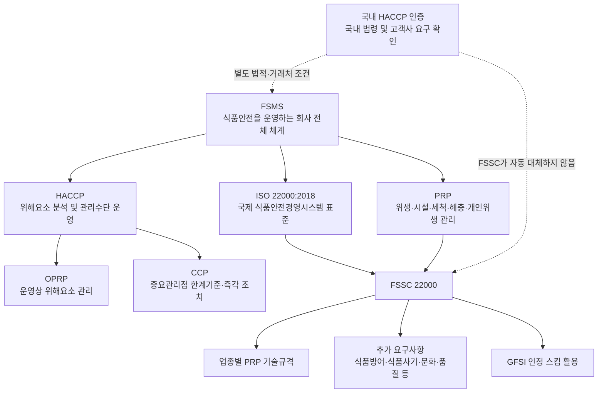

# [QA+ 블로그 생성 결과물] FSMS HACCP ISO FSSC 관계
생성일시: 2026-09-18 06:53:45 (KST)
적용모델: gpt-5.6-terra

================================================================================
# 📋 최종 발행용 블로그 패키지

## 1. 메타 데이터 (SEO 설정)

- **최종 포스팅 제목**: FSMS·HACCP·ISO 22000·FSSC 22000 차이와 관계 총정리｜식품회사 실무 가이드
- **메타 디스크립션 (120자 내외 요약)**: FSMS, HACCP, ISO 22000, FSSC 22000의 차이와 포함 관계를 정리합니다. 국내 HACCP 법적 요구, GFSI 인증, FSSC 준비 항목까지 식품회사 실무 관점에서 확인하세요.
- **추천 해시태그 (10개)**:  
  #식품안전 #식품품질관리 #HACCP #FSMS #ISO22000 #FSSC22000 #GFSI #식품제조업 #식품공장 #품질관리실무
- **카테고리**: 식품품질실무 / HACCP가이드 / FSSC 22000
- **QA 검수 결과**: 발행 가능  
  - 내부 관리번호·파일 구분코드 미사용  
  - 법령 표현은 「식품위생법」 제48조 및 「식품 및 축산물 안전관리인증기준」 기준으로 정리  
  - FSSC 22000은 ISO 표준이 아닌 Foundation FSSC 22000의 인증 스킴임을 명확화  
  - FSSC Scheme Version 6의 적용 시점은 2024년 4월 1일로 표기하되, 실제 심사 전 최신 공식 스킬 문서와 인증기관 안내 확인 문구 유지  
  - HTML 이미지 태그 3개 삽입 및 각 placeholder 중복 없이 적용 완료  

---

## 2. 네이버 블로그 / 티스토리 복사용 최종 원고 (Markdown)

# FSMS·HACCP·ISO 22000·FSSC 22000 차이: 식품회사 실무자가 꼭 알아야 할 관계 정리

> **20년 실무 선배의 한 줄 요약**  
> FSMS는 식품안전을 운영하는 회사 전체의 틀이고, HACCP은 위해요소를 잡는 핵심 도구입니다. ISO 22000은 그 체계를 국제표준으로 만든 것이며, FSSC 22000은 ISO 22000에 업종별 PRP와 추가 요구사항을 더한 GFSI 인정 인증 스킴입니다.

---

## 1. “HACCP이 있는데 FSSC 22000도 해야 하나요?”가 헷갈리는 진짜 이유

거래처에서 갑자기 “FSSC 22000 인증서 제출이 가능합니까?”라고 물어보면, 현장에서는 대개 국내 HACCP 인증서부터 꺼내 봅니다. 이미 위해요소분석도 했고, CCP 기록도 쓰고 있으며, HACCP 사후관리도 받고 있으니 “이걸로 같은 의미 아닌가요?”라는 질문이 나오는 것이 당연합니다.

그런데 결론부터 말씀드리면, **HACCP·ISO 22000·FSSC 22000은 서로 겹치는 부분은 많아도 동일한 인증이나 완전한 대체재는 아닙니다.** 특히 거래처가 GFSI 인정 인증을 요구했다면, HACCP 인증서만으로는 조건을 충족하지 못할 수 있습니다.

이 문제가 어려운 이유는 네 용어가 모두 식품안전과 관련돼 있고, 실제 심사 현장에서도 비슷한 단어가 반복되기 때문입니다. 위해요소분석, 위생관리, 교육훈련, 문서관리, 추적성, 회수훈련 같은 기본 활동은 국내 HACCP과 ISO 22000, FSSC 22000에 모두 등장합니다. 하지만 심사자가 보는 범위와 증빙 방식, 인증의 법적 지위, 고객사가 인정하는 수준은 서로 다를 수 있습니다.

인증 이름만 비교하다 보면 “우리가 무엇을 추가로 준비해야 하는가”를 놓치게 됩니다.

국내 HACCP은 「식품위생법」 제48조에 근거한 **식품안전관리인증기준**입니다. 쉽게 말하면 국내 식품 제조·가공 현장에서 위해요소를 체계적으로 관리하는지 정부 체계 안에서 확인받는 제도입니다.

반면 ISO 22000과 FSSC 22000은 국제적으로 통용되는 식품안전경영시스템 기반의 민간 인증 체계입니다. 따라서 FSSC 인증서가 있다고 해서 국내 법정 HACCP 요구가 자동으로 면제되는 것도 아니고, HACCP 인증이 있다고 해서 FSSC 요구사항이 자동으로 충족되는 것도 아닙니다.

현장에서 가장 먼저 할 일은 “어느 인증이 더 높은가?”를 묻는 것이 아닙니다.

**우리 회사가 법적으로 반드시 충족해야 하는 기준은 무엇인지, 고객사가 요구하는 인증은 정확히 무엇인지, 수출 바이어가 GFSI 인정 스킴을 요구하는지**를 분리해서 확인해야 합니다.

이 세 가지 질문만 제대로 해도 불필요한 인증 준비 비용과 시간을 상당히 줄일 수 있습니다. 인증은 멋있어 보이는 이름을 고르는 일이 아니라, 우리 공장의 사업 목적과 공급망 요구에 맞는 체계를 선택하는 일입니다.


> **이미지 해설**  
> 생산설비는 FSMS라는 전체 체계를, 작업자의 공정 점검은 HACCP 관리를, 기록 검토와 현장 위생관리는 ISO 22000 및 FSSC 22000의 시스템 운영을 상징합니다.

---

## 2. FSMS·HACCP·ISO 22000·FSSC 22000의 포함 관계, 한 번에 정리하기

먼저 가장 큰 개념인 **FSMS(Food Safety Management System, 식품안전경영시스템)**부터 잡아야 합니다.

FSMS는 특정 인증서 이름이 아니라, 회사가 식품안전을 지속적으로 관리하기 위해 만드는 전체 운영 체계입니다. 쉽게 말하면 HACCP 계획서 한 권이 아니라, 경영진의 방침부터 원료 구매, 생산, 품질검사, 설비관리, 교육, 클레임 대응, 회수, 개선활동까지 연결하는 회사의 운영 방식입니다.

품질팀 혼자 열심히 기록한다고 FSMS가 되는 것이 아닙니다. 구매·생산·물류·연구소·대표이사가 함께 움직여야 제대로 작동합니다.

**HACCP(Hazard Analysis and Critical Control Point)**은 FSMS 안에서 위해요소를 관리하는 핵심 방법론입니다. 원료 입고부터 출하까지 생물학적·화학적·물리적 위해요소를 분석하고, 반드시 관리해야 할 공정에는 CCP를 설정해 한계기준과 모니터링 방법을 운영합니다.

쉽게 말하면 “어디에서 식품이 위험해질 수 있는지 미리 찾고, 그 위험이 실제 제품으로 넘어가지 않도록 중요한 지점을 집중 관리하는 방식”입니다.

가열공정의 중심온도, 금속검출기 감도, 냉장보관 온도 등이 대표적인 관리 항목이 될 수 있습니다.

**ISO 22000:2018**은 ISO가 제정한 식품안전경영시스템 국제표준입니다. HACCP 원칙을 포함하면서도 조직 상황 분석, 이해관계자 요구사항, 최고경영자 리더십, 내부심사, 경영검토, 비상대응, 의사소통, 지속적 개선까지 요구합니다.

쉽게 말하면 HACCP이 “생산공정의 위해를 어떻게 잡을 것인가”에 집중한다면, ISO 22000은 “회사가 식품안전 문제를 발견하고 예방하고 개선하는 시스템을 갖췄는가”까지 확인하는 표준입니다.

그래서 HACCP 계획서가 잘 작성돼 있어도 내부심사나 경영검토가 형식적이면 ISO 심사에서는 부적합이 나올 수 있습니다.

**FSSC 22000**은 ISO가 발행하는 표준이 아니라, Foundation FSSC 22000이 운영하는 인증 스킴입니다.

FSSC 22000은 기본적으로 아래 조합으로 구성됩니다.

`ISO 22000:2018 + 업종별 PRP 기술규격 + FSSC Additional Requirements`

식품 제조업이라면 일반적으로 ISO/TS 22002-1 기반의 PRP 요구사항을 함께 검토해야 하며, 식품방어, 식품사기 완화, 알레르겐, 환경모니터링, 품질관리, 식품안전문화 등의 추가 요구사항도 준비해야 합니다.

즉, FSSC는 ISO 22000을 기반으로 하지만 단순히 “ISO보다 상위 인증”이라고 말하기보다는, **GFSI 인정 수준을 목표로 더 구체적인 운영 요구사항을 결합한 인증 스킴**이라고 이해하는 것이 정확합니다.

| 구분 | 정체 | 핵심 목적 | 현장 적용 방식 |
|---|---|---|---|
| FSMS | 식품안전경영시스템이라는 큰 틀 | 조직 전체의 식품안전 관리와 지속적 개선 | 경영책임, 교육, 의사소통, 검증, 개선 포함 |
| HACCP | 위해요소 관리 방법론 | 위해요소 예방·제거·허용수준 감소 | 위해요소분석, CCP, 한계기준, 모니터링 |
| ISO 22000 | 국제 FSMS 표준 | 식품사슬 조직의 식품안전경영시스템 구축 | HACCP + PRP + 리더십 + 내부심사 + 경영검토 |
| FSSC 22000 | GFSI 인정 인증 스킴 | 글로벌 공급망 요구 수준의 식품안전 인증 | ISO 22000 + 업종별 PRP + 추가 요구사항 |



여기서 한 가지 꼭 기억하셔야 합니다.

**FSSC 22000 인증을 받았다고 해서 국내 HACCP 법적 요구를 무조건 대신하는 것은 아닙니다.**

반대로 국내 HACCP을 아주 성실하게 운영하고 있다면 FSSC 준비의 좋은 출발점은 될 수 있습니다. 다만 두 제도는 심사 기준과 법적 지위가 다르므로, “기존 인증서로 대체 가능한가”는 반드시 고객사와 관할 기준을 개별적으로 확인해야 합니다.

---

## 3. HACCP 7원칙과 PRP·OPRP·CCP, 심사에서 가장 많이 헷갈리는 부분

HACCP의 국제적 근간은 Codex Alimentarius의 **CXC 1-1969, General Principles of Food Hygiene**입니다. 이 기준은 위해요소분석과 중요관리점 관리에 관한 HACCP 7원칙을 제시합니다.

국내 HACCP 운영도 이러한 국제 HACCP 원칙과 연결돼 있으며, 실무에서는 「식품 및 축산물 안전관리인증기준」의 요구사항을 함께 확인해야 합니다.

다만 현장에서는 HACCP 7원칙을 외우는 것보다, 각 원칙이 기록과 실제 행동으로 이어지는지가 훨씬 중요합니다.

예를 들어 가열공정을 CCP로 정했다면 단순히 “가열 CCP”라고 쓰는 것으로 끝나면 안 됩니다. 어떤 미생물을 어떤 수준까지 관리하기 위해 가열이 필요한지, 중심온도와 시간이 왜 그 기준인지, 온도계는 어떻게 검교정하는지, 기준 이탈 제품은 어디에 격리하고 어떤 평가를 거쳐 처리하는지까지 연결돼야 합니다.

쉽게 말하면 심사관은 기록지에 체크가 있는지보다 “체크가 틀렸을 때 공장이 정말 제품을 멈추고 판단할 수 있는가”를 봅니다. 이 부분이 약하면 HACCP 계획서가 아무리 예쁘게 작성돼 있어도 운영 부적합으로 이어집니다.

ISO 22000에서는 위해요소 관리수단을 일반적으로 PRP, OPRP, CCP로 구분해 운영합니다.

- **PRP(선행요건프로그램)**: 작업장 위생, 세척·소독, 해충방제, 개인위생, 시설 유지보수, 이물관리처럼 안전한 제조 환경을 만드는 기본 관리
- **OPRP(운영 선행요건프로그램)**: 특정 위해요소를 예방하거나 허용수준으로 낮추기 위해 운영상 관리가 필요한 항목
- **CCP(중요관리점)**: 기준이 벗어나면 식품안전에 직접적이고 중대한 영향을 줄 수 있어 한계기준과 즉각적인 이탈조치가 요구되는 지점

CCP 개수가 적다고 해서 HACCP이 약한 것은 절대 아닙니다. 오히려 위해요소분석 근거 없이 모든 공정을 CCP로 잡아버리면 현장 관리가 분산되고, 심사 때 선정 논리가 무너질 수 있습니다.

예를 들어 냉동식품 공장의 금속검출은 제품 특성과 공정 위험도에 따라 CCP가 될 수 있지만, 작업자 손 세척은 보통 PRP로 관리하는 것이 자연스럽습니다.

중요한 것은 이름표가 아니라, 위험도 평가와 관리수단 선택이 과학적 근거 및 현장 운영과 맞아떨어지는지입니다.

| 구분 | 의미 | 대표 항목 | 관리 방식 |
|---|---|---|---|
| PRP | 기본 위생환경 관리 | 세척·소독, 해충방제, 개인위생, 시설관리 | 일상점검, 위생기준, 정기 검증 |
| OPRP | 특정 위해요소를 운영상 통제 | 알레르겐 전환세척, 체 관리, 냉장온도 관리 | 관리기준, 모니터링, 이탈조치 |
| CCP | 식품안전에 필수적인 중요관리점 | 가열, 금속검출, 산도 관리 등 | 한계기준, 연속 또는 고빈도 모니터링, 즉각 조치 |

이제 개념이 정리됐다면, 다음은 “우리 공장이 어느 수준의 인증을 준비해야 하는가”를 판단할 차례입니다.

이 단계에서 가장 위험한 방식은 경쟁사가 받았으니 우리도 무조건 따라가는 것입니다. 인증 유지에는 심사비보다 인력, 교육, 기록, 개선조치, 경영진 참여에 더 큰 비용이 들어간다는 점을 꼭 기억하셔야 합니다.

---

## 4. 우리 회사는 HACCP·ISO 22000·FSSC 22000 중 무엇을 선택해야 할까요?

첫 번째 판단 기준은 **법적 요구사항**입니다.

우리 업종과 품목이 국내 HACCP 의무 적용 대상인지, 적용 시기와 영업장 규모에 따른 조건은 무엇인지 최신 법령과 고시를 확인해야 합니다. 「식품위생법」 제48조와 「식품위생법 시행규칙」, 식품안전나라 및 한국식품안전관리인증원 자료를 기준으로 확인하는 것이 안전합니다.

예전에 들은 정보나 타사 사례만 믿고 판단하면 적용 대상 여부를 잘못 이해할 수 있습니다.

두 번째 기준은 **거래처의 정확한 승인 조건**입니다.

대형 유통사, 프랜차이즈 본사, 수출 바이어는 “식품안전 인증 보유”라는 모호한 표현을 쓰기도 합니다. 이때 담당자가 HACCP 인증서만 제출했다가 나중에 “GFSI-recognized scheme이 필요하다”는 답변을 받는 일이 생각보다 많습니다.

반드시 이메일이나 품질협약서 형태로 다음 사항을 서면 확인해야 합니다.

- HACCP 인증 인정 여부
- ISO 22000 인정 여부
- FSSC 22000, BRCGS, SQF 등 특정 스킴 필수 여부
- 인증 범위에 포함돼야 하는 제품·공정·사업장

세 번째 기준은 **사업의 확장 방향**입니다.

국내 판매 중심이고 법정 HACCP 및 주요 고객사 요구만 충족하면 되는 기업이라면 우선 HACCP 운영의 내실을 다지는 편이 합리적일 수 있습니다.

반면 해외 수출, 글로벌 식품기업 협력사 등록, 다국적 유통망 납품을 목표로 한다면 FSSC 22000 같은 GFSI 인정 스킴을 검토할 필요가 커집니다.

ISO 9001을 이미 운영하는 회사라면 ISO 22000을 통합경영시스템 관점에서 도입하는 방법도 검토할 수 있습니다.

네 번째 기준은 **유지관리 역량**입니다.

FSSC 22000은 인증 취득 자체보다 이후 운영이 중요합니다. 내부심사원 양성, 경영검토, 공급업체 위험평가, 식품방어·식품사기 평가, 환경모니터링, 변경관리, 식품안전문화 활동을 지속적으로 증빙해야 합니다.

공장장과 대표이사가 “인증서는 품질팀이 알아서 받는 것”이라고 생각하는 조직이라면, 먼저 경영진의 역할과 자원 지원부터 합의하는 것이 순서입니다.

| 회사 상황 | 우선 검토 방향 | 반드시 확인할 사항 |
|---|---|---|
| 국내 판매 중심 제조업체 | 법정 HACCP 및 고객사 요구 우선 | 의무 적용 여부, 납품처 품질기준 |
| 대형 유통사·프랜차이즈 납품 확대 | 고객사 승인 규격 확인 후 결정 | 특정 인증서, 공장별 인증 범위 |
| 수출 준비 기업 | GFSI 인정 스킴 요구 여부 확인 | 바이어 국가, 고객사 승인 문서 |
| ISO 9001 운영 기업 | ISO 22000 통합 운영 검토 | 기존 내부심사·경영검토 활용 가능성 |
| 글로벌 식품기업 협력사 등록 | FSSC 등 고객사 지정 스킴 우선 | FSSC 외 BRCGS·SQF 허용 여부 |

> **20년 선배의 실무 조언**  
> 인증서 이름부터 고르지 마세요. 거래처 요구서, 목표 시장, 공장 운영 역량을 먼저 펼쳐놓고 판단하면 답이 보입니다. “FSSC가 필요하다”는 결론이 나더라도, 제품·공정·사업장이 인증 범위(Scope)에 정확히 들어가는지까지 확인해야 실제 납품에서 문제가 없습니다.

---

## 5. HACCP 공장에서 FSSC 22000으로 갈 때 빠지기 쉬운 준비 항목

HACCP을 운영하는 공장이 FSSC를 준비할 때 가장 흔한 실수는 HACCP 관리계획서만 확대하는 것입니다.

물론 위해요소분석표, CCP 관리기준, 검증기록은 매우 중요합니다. 하지만 FSSC 심사는 HACCP 계획서 외에도 회사의 경영시스템이 실제로 작동하는지를 봅니다.

조직 상황 분석, 식품안전 목표, 리스크와 기회, 내부·외부 의사소통, 내부심사, 경영검토가 약하면 예상보다 많은 보완이 필요해집니다.

두 번째로 많이 빠지는 부분은 **업종별 PRP의 구체성**입니다.

FSSC 식품 제조 범주에서는 일반적으로 ISO/TS 22002-1 기반의 요구사항을 검토하게 됩니다. 건물 구조, 작업장 동선, 배수, 환기, 조명, 이물 예방, 세척도구 관리, 폐기물, 해충방제, 유지보수, 직원 복지시설 등 기본 위생환경이 문서와 현장 모두에서 일치해야 합니다.

쉽게 말하면 “가열 CCP는 잘 관리하는데 천장 결로, 배수구 역류, 세척도구 구분이 안 된다”면 국제심사에서는 좋은 평가를 받기 어렵습니다.

세 번째는 **공급망 관리와 식품사기(Food Fraud)·식품방어(Food Defense)**입니다.

식품사기는 경제적 이익을 목적으로 원료를 바꾸거나 희석하거나 허위 표시하는 위험을 말합니다. 식품방어는 고의적인 오염이나 위해 행위로부터 시설과 제품을 보호하는 활동입니다.

예를 들어 고가의 천연향료, 벌꿀, 올리브유, 축산 원료, 향신료처럼 대체·혼입 위험이 있는 원료는 원료별 취약성 평가와 공급업체 관리 수준이 연결돼야 합니다.

네 번째는 **식품안전문화와 경영검토의 실효성**입니다.

FSSC 22000 Scheme Version 6에서는 식품안전 및 품질 문화 활동의 중요성이 강조됩니다. 단순히 연 1회 교육했다는 기록보다, 현장 작업자가 이상사항을 보고할 수 있는지, 개선제안이 반영되는지, 관리자가 식품안전 우선 결정을 하는지 보여줘야 합니다.

경영검토 회의록도 “HACCP 운영 결과를 검토함” 한 줄로 끝낼 것이 아니라, 클레임 추이·부적합·감사결과·목표 달성도·자원 필요사항을 검토하고 무엇을 결정했는지 남겨야 합니다.

FSSC 22000 Scheme Version 6은 2024년 4월 1일부터 적용됐습니다. 다만 세부 요구사항과 적용 해석은 개정될 수 있으므로, 실제 인증 계약이나 심사 준비 전에는 FSSC 공식 Scheme 문서, 적용 인증 범주, 인증기관의 안내를 최신본으로 확인해야 합니다.

블로그나 타사 매뉴얼은 방향을 잡는 데는 좋지만, 최종 심사기준을 대신할 수는 없습니다.

이거 현장에서 정말 많이 놓치는데요. **“작년에 받은 컨설팅 자료”가 올해 심사 요구사항과 같다고 단정하면 안 됩니다.**


---

## 6. 20년 실무 선배가 권하는 FSSC·ISO 준비 로드맵

첫 단계는 **인증 목표와 적용 범위 확정**입니다.

어느 공장, 어느 제품군, 어느 공정까지 인증 범위에 포함할지를 먼저 결정해야 합니다. 제조공장만 포함할지, 별도 보관창고와 물류 활동까지 포함할지, 외주공정이 있는지에 따라 준비 범위가 달라집니다.

인증 범위가 실제 납품 제품과 다르면 인증서를 갖고도 거래처 승인을 받지 못할 수 있습니다.

두 번째는 **Gap Analysis, 즉 갭 분석**입니다.

현재 HACCP 문서와 현장 운영 상태를 ISO 22000 및 FSSC 요구사항 조항별로 비교해야 합니다. 이때 “문서 있음/없음”만 체크하면 안 되고, 문서화 여부·현장 실행 여부·기록 보유 여부·효과성 검증 여부를 각각 평가해야 합니다.

예를 들어 공급업체 평가서가 있어도 모든 원료업체를 동일한 연 1회 점수로 평가한다면, 위험 기반 관리 측면에서 보완이 필요할 수 있습니다.

세 번째는 **PRP와 위해요소분석의 재정비**입니다.

시설·설비·위생·세척·해충·알레르겐·이물·폐기물·유지보수·외주서비스 관리기준이 실제 작업장과 맞는지 확인합니다.

이어서 원료 입고부터 출하까지 위해요소분석을 다시 보고, 관리수단을 PRP·OPRP·CCP 중 어디에 둘지 선정 근거를 정리합니다.

이때 변경된 원료, 신제품, 신규 설비, 포장재 변경, 고객사 클레임 이력도 반드시 반영해야 합니다.

네 번째는 **운영 사이클을 실제로 돌리는 것**입니다.

교육만 하고 끝내지 말고, 내부심사를 실시해 부적합을 찾고, 원인을 분석하고, 시정조치를 완료한 뒤 경영검토까지 연결해야 합니다.

예를 들어 내부심사에서 냉장창고 온도기록 누락을 발견했다면 작업자 재교육만 할 것이 아니라, 기록 누락 시간대·담당자·교대 방식·알람 유무를 분석해 근본 원인을 잡아야 합니다.

심사관은 문제가 한 번도 없었던 회사보다, 문제를 발견했을 때 투명하게 분석하고 재발을 막은 회사를 더 신뢰합니다.


### 인증 준비 단계별 실무 체크리스트

| 단계 | 핵심 산출물 | 현장 확인 포인트 | 권장 운영 주기 예시 |
|---|---|---|---|
| 1. 범위 확정 | 인증 Scope, 제품·공정 목록 | 사업장·창고·외주공정 누락 여부 | 인증 준비 시작 시 |
| 2. 갭 분석 | 조항별 Gap Analysis 표 | 문서·실행·기록·효과성 분리 평가 | 최초 1회, 변경 시 재검토 |
| 3. PRP 정비 | 위생관리 기준서, 점검표 | 시설·동선·도구·세척 상태 일치 여부 | 일일·주간·월간 차등 |
| 4. 위해요소 분석 | 위해요소분석표, OPRP/CCP 근거 | 원료·공정 변경사항 반영 여부 | 연 1회 이상 및 변경 시 |
| 5. 내부심사 | 내부심사계획서, 부적합 보고서 | 심사원의 독립성, 원인분석 수준 | 연 1회 이상 |
| 6. 경영검토 | 경영검토 회의록, 실행계획 | 자원배정·개선결정·책임자 지정 | 연 1회 이상 |
| 7. 모의심사 | 모의심사 결과 및 조치계획 | 현장 인터뷰와 기록 일치 여부 | 본심사 1~2개월 전 |

---

## 7. 실제 현장 사례로 보는 HACCP·ISO·FSSC 적용법

### 사례 1. 냉동만두 제조공장: 금속검출 CCP는 있었지만 변경관리가 없었던 사례

수도권의 냉동만두 제조공장은 국내 HACCP 인증을 안정적으로 유지하고 있었고, 금속검출기를 CCP로 운영하고 있었습니다.

금속검출 감도는 철 2.0 mm, 비철 2.5 mm, SUS 3.0 mm 기준으로 설정돼 있었고, 작업 시작 전과 2시간 간격으로 테스트피스를 통과시키며 기록도 남기고 있었습니다.

그런데 대형 유통사 납품 확대를 위해 FSSC 22000 준비를 시작하면서, 심사 전 갭 분석에서 포장재 변경 이력이 제대로 관리되지 않은 사실이 확인됐습니다.

기존 필름 공급업체의 납기 문제가 생기자 구매팀이 유사 규격의 인쇄필름으로 변경했지만, 품질팀에는 사후 통보만 됐고 라벨 검증도 충분히 이뤄지지 않았습니다.

문제는 실제 제품에서 알레르겐 표시 누락 가능성이 발견되면서 커졌습니다. 만두피와 만두소의 배합은 같았지만, 신규 포장필름의 인쇄 원고에 일부 알레르겐 강조 표시가 기존 디자인과 다르게 적용된 것이었습니다.

근본 원인은 구매 변경이 단순 납기 문제로 취급됐고, 포장재 변경을 식품안전 및 법규 변경으로 검토하는 절차가 없었던 데 있었습니다.

HACCP의 금속검출 CCP는 잘 운영됐지만, FSMS 관점의 변경관리와 부서 간 의사소통이 빠져 있었던 것입니다.

개선조치로 공장은 원료·포장재·공정·설비·세척제·외주업체 변경 시 사용하는 변경관리 신청서를 만들었습니다.

구매팀이 변경을 요청하면 품질팀, 생산팀, 연구소가 알레르겐·표시사항·이물 위험·공정 적합성·고객사 규격 영향을 검토한 뒤 승인하도록 흐름을 바꿨습니다.

특히 포장재는 초도 입고 시 인쇄 원고 대조, 바코드 확인, 알레르겐 표시 확인, 현장 잔재 포장재 회수 확인을 의무화했습니다.

이후 3개월 동안 포장재 변경 6건을 이 절차로 운영했고, 라벨 오류 의심 사례 2건을 생산 전 단계에서 차단할 수 있었습니다.

### 사례 2. 레토르트 소스 제조공장: 가열기록은 완벽했지만 공급업체 위험평가가 약했던 사례

한 레토르트 소스 제조공장은 스팀 레토르트 공정의 온도·시간 기록을 자동 저장하고 있었습니다.

제품별로 121℃, 15분 등 설정된 살균조건을 관리했고, 데이터 로거 검증과 온도계 검교정도 정기적으로 실시하고 있었습니다.

공장 직원들은 “우리는 가장 중요한 가열공정을 잘 잡고 있으니 FSSC 심사도 큰 문제 없을 것”이라고 생각했습니다.

하지만 사전 모의심사에서 고추분말과 향신료 원료의 식품사기 취약성 평가가 형식적인 체크리스트 수준이라는 지적을 받았습니다.

해당 공장은 모든 공급업체를 연 1회 동일한 배점으로 평가하고 있었으며, 원료의 가격변동성이나 원산지 혼입 가능성, 과거 부적합 이력은 반영하지 않았습니다.

특히 고추분말은 원산지와 색소 혼입, 미생물 관리 위험이 모두 존재할 수 있는 원료인데도 단순 성적서 제출 여부만 확인하고 있었습니다.

근본 원인은 구매팀의 가격·납기 평가와 품질팀의 공급업체 평가가 분리돼 있었고, 위험도에 따라 공급업체를 차등 관리하는 기준이 없었던 것입니다.

즉, 제품을 잘 가열하는 것과 안전한 원료를 안정적으로 구매하는 것은 별개인데, 공장은 전자에만 집중하고 있었습니다.

개선조치로 원료를 고위험·중위험·저위험 3등급으로 분류했습니다.

고위험 원료는 원산지 증빙, 시험성적서, 공급업체 현장평가 또는 제3자 인증 확인, 입고검사 강화, 이상 가격변동 모니터링을 적용했습니다.

고추분말은 입고 로트별 색상·이물·수분 확인 외에 연간 계획에 따라 미생물 및 잔류농약 검사를 실시하도록 바꿨습니다.

그 결과 구매팀은 단가만으로 공급처를 변경할 수 없게 됐고, 품질팀이 사전 승인한 공급업체 목록 안에서 구매가 이뤄지기 시작했습니다.

### 사례 3. 과채음료 제조공장: 추적성 훈련은 했지만 회수 의사결정이 없었던 사례

과채음료를 생산하는 한 공장은 연 1회 추적성 모의훈련을 실시하고 있었습니다.

완제품 1개 로트를 선정한 뒤 원료 입고기록, 생산일보, 충전기록, 출하전표를 찾아 연결하는 방식이었고, 보통 2시간 안에 자료를 제출할 수 있었습니다.

서류만 보면 추적성 체계가 잘 운영되는 것처럼 보였습니다.

그러나 ISO 22000 전환 심사 준비 과정에서 “실제 회수 상황이라면 누가 출하중지와 고객 통보를 결정하는가”라는 질문에 담당자들이 명확히 답하지 못했습니다.

문제는 추적성 훈련이 단순 문서 찾기 훈련에 머물렀다는 점입니다.

회수 필요성이 판단됐을 때 영업팀, 대표이사, 품질책임자, 물류팀의 역할과 연락 순서가 구체적으로 정리돼 있지 않았습니다.

야간이나 휴일에 위해 정보가 접수됐을 경우의 비상연락망도 최신화되지 않아, 퇴사한 직원 번호가 남아 있었습니다.

근본 원인은 회수 절차를 품질팀 업무로만 생각했고, 고객 커뮤니케이션과 경영진 의사결정이 필요한 위기관리 활동으로 보지 않았던 데 있었습니다.

개선조치로 공장은 회수관리팀을 품질·생산·영업·물류·경영진으로 구성하고, 역할별 대체 담당자를 지정했습니다.

모의훈련도 연 1회 문서 추적만 하는 방식에서 벗어나, “알레르겐 표시 오류”, “미생물 부적합 통보”, “유통 중 이물 클레임”처럼 시나리오를 나눠 실시했습니다.

훈련 목표는 4시간 이내 대상 로트 100% 확인, 출하처별 수량 파악, 고객 통보 초안 작성, 잔여 재고 격리까지 완료하는 것으로 설정했습니다.

두 번째 훈련에서는 최초보다 대응 시간이 5시간 20분에서 2시간 45분으로 단축됐고, 경영진도 회수 의사결정 절차의 필요성을 체감하게 됐습니다.


이 세 사례의 공통점은 분명합니다.

HACCP의 중요한 공정관리 기록이 잘돼 있어도, 변경관리·공급망 관리·위기대응·경영진 의사결정이 연결되지 않으면 FSMS는 약해질 수 있습니다.

반대로 현장의 기본이 잡혀 있다면, ISO나 FSSC 준비은 새로운 일을 무조건 늘리는 과정이 아니라 기존 관리활동을 체계화하는 과정이 될 수 있습니다.

---

## 8. 심사관이 자주 보는 지적사항과 바로잡는 방법

첫 번째 단골 지적은 위해요소분석의 **평가 근거 부족**입니다.

발생 가능성과 심각성을 1점, 2점, 3점으로 평가해 놓았지만 왜 그 점수인지 설명하지 못하는 경우가 많습니다.

과거 클레임, 시험성적서, 법규 기준, 학술자료, 원료업체 정보, 공정조건 같은 근거가 연결돼야 합니다.

“경험상 낮습니다”라는 답변은 심사 현장에서 가장 위험한 답변 중 하나입니다.

두 번째는 CCP와 OPRP 선정 논리가 약한 경우입니다.

결정도를 사용했다면 각 질문에 대한 답변 근거가 있어야 하고, 결정도를 사용하지 않았다면 별도의 위험평가와 관리수단 선정 논리가 문서화돼야 합니다.

특히 금속검출, 체, 자석봉, 냉장보관, 알레르겐 세척 같은 항목은 공장마다 분류가 달라질 수 있으므로 타사 문서를 그대로 복사하면 안 됩니다.

제품 특성, 위해요소, 공정 위치, 후속 공정 유무를 반영해 우리 공장 논리를 만들어야 합니다.

세 번째는 **이탈조치가 제품처분까지 연결되지 않는 문제**입니다.

예를 들어 가열온도 이탈이 발생했을 때 설비를 조정하고 다시 생산한 기록만 있으며, 이탈 시간 동안 생산된 제품을 어떻게 격리·평가·처분했는지 없는 경우가 많습니다.

이탈조치는 “기계를 고쳤다”가 아니라 “부적합 가능 제품을 안전하게 통제했다”까지 포함해야 합니다.

로트번호, 수량, 격리장소, 평가결과, 재처리 또는 폐기 승인자를 기록으로 남겨야 합니다.

네 번째는 내부심사와 경영검토가 형식적인 경우입니다.

내부심사는 자기 부서 문서를 자기 직원이 확인하는 방식보다, 가능한 한 독립성을 갖춘 심사원이 프로세스 중심으로 보는 편이 좋습니다.

경영검토에서는 심사결과, 고객불만, 목표 달성도, 부적합, 공급업체 성과, 자원 필요사항을 검토하고 개선 결정을 내려야 합니다.

“회의를 했다”가 아니라 “무엇을 결정했고 누가 언제까지 실행하는가”가 남아야 심사에서 설득력이 생깁니다.

| 흔한 실수 | 왜 문제가 될까요? | 올바른 대응 |
|---|---|---|
| 위해요소 점수만 있고 근거가 없음 | 위험평가의 객관성이 부족함 | 시험자료, 클레임, 법규, 공정자료 연결 |
| CCP 수를 많이 설정함 | 관리 집중도가 떨어지고 선정 논리가 약해짐 | PRP·OPRP·CCP를 위험 기반으로 분류 |
| 이탈 시 재작업만 기록 | 제품 격리·평가·처분이 누락됨 | 영향 로트, 수량, 처분 승인까지 기록 |
| 공급업체를 모두 같은 방식으로 평가 | 원료별 위험 차이를 반영하지 못함 | 원료 위험도별 차등 승인·평가 |
| 내부심사가 문서 확인에 그침 | 실제 현장 운영의 문제를 못 찾음 | 인터뷰·현장관찰·기록추적 병행 |
| 경영검토가 회의록 한 장으로 끝남 | 경영진 리더십과 개선 증빙 부족 | 자원·책임자·완료기한을 명확히 결정 |

---

## 9. 자주 묻는 질문(FAQ)

### Q1. HACCP 인증이 있으면 ISO 22000은 필요 없나요?

**A.** 법적 의무와 고객사 요구사항에 따라 다릅니다. 국내 판매 중심이고 HACCP과 거래처 요구사항으로 충분하다면 ISO 22000이 반드시 필요한 것은 아닙니다. 다만 수출 확대, 글로벌 고객사 납품, ISO 9001과의 통합경영시스템 운영, 경영시스템 고도화가 목표라면 ISO 22000 도입을 검토할 가치가 있습니다.

### Q2. ISO 22000과 FSSC 22000 중 어느 것이 더 높은 인증인가요?

**A.** 단순히 높고 낮다고 표현하기보다 목적과 구성 차이가 있다고 보는 것이 정확합니다. FSSC 22000은 ISO 22000을 기반으로 업종별 PRP 기술규격과 FSSC 추가 요구사항을 포함하며, GFSI 인정 스킴으로 활용됩니다. 거래처가 GFSI 인정 인증을 요구한다면 ISO 22000 단독 인증만으로 충분한지 고객사에 서면 확인해야 합니다.

### Q3. FSSC 22000을 받으면 국내 HACCP 인증은 안 받아도 되나요?

**A.** 일반적으로 그렇게 판단하면 안 됩니다. 국내 HACCP은 「식품위생법」 체계에 따른 식품안전관리인증 제도이고, FSSC는 국제 민간 인증 스킴입니다. 국내 법령상 HACCP 적용·인증 요구가 있거나 고객사가 HACCP을 요구한다면 FSSC 보유 여부와 별도로 충족 여부를 확인해야 합니다.

### Q4. HACCP의 CCP와 ISO 22000의 OPRP는 무엇이 다른가요?

**A.** CCP는 한계기준 이탈 시 식품안전에 직접적인 영향을 줄 수 있어 매우 엄격하게 관리하는 중요 지점입니다. OPRP는 위해요소를 관리하기 위해 운영상 관리가 필요하지만, CCP와 다른 관리방식과 기준을 적용할 수 있는 항목입니다. 핵심은 “무조건 이것은 CCP”라고 정하는 것이 아니라, 위해요소 분석과 관리수단의 타당성을 근거로 구분하는 것입니다.

### Q5. FSSC 22000 준비 기간은 얼마나 걸리나요?

**A.** 기존 HACCP 운영 수준, 제품 종류, 공장 수, 원료 위험도, 문서 수준, 내부심사 경험에 따라 크게 달라집니다. 실무적으로는 문서만 만든 뒤 바로 심사받기보다, 최소 한 번 이상의 내부심사·시정조치·경영검토 사이클을 실제로 운영할 시간을 잡는 편이 안전합니다. 급하게 인증서를 받는 것보다 인증 후 유지 가능한 체계를 만드는 것이 훨씬 중요합니다.

### Q6. ISO 22000 인증서가 있으면 해외 바이어의 GFSI 요구를 충족하나요?

**A.** 자동으로 충족된다고 보면 안 됩니다. ISO 22000 단독 인증과 FSSC 22000 같은 GFSI 인정 인증 스킴은 동일한 의미가 아닙니다. 바이어에게 “ISO 22000이 가능한지, FSSC·BRCGS·SQF 중 특정 스킴이 필수인지”를 계약 전 이메일로 확인해 두는 것이 가장 안전합니다.

### Q7. 식품방어와 식품사기는 작은 공장도 꼭 해야 하나요?

**A.** FSSC 준비이라면 규모와 관계없이 해당 위험을 평가하고 관리하는 체계가 필요합니다. 다만 대기업 수준의 복잡한 시스템을 그대로 따라 하기보다, 우리 공장의 출입통제·원료 접근권한·CCTV·협력업체 관리·고위험 원료 구매기준에 맞춰 현실적으로 설계하면 됩니다. 중요한 것은 서류를 만들기 위한 평가가 아니라 실제 취약점을 찾고 줄이는 활동입니다.

---

## 10. 인증 이름보다 중요한 것은 ‘우리 공장이 식품안전을 관리하는 방식’입니다

오늘 내용을 세 줄로 정리하면 이렇습니다.

**FSMS는 식품안전을 운영하는 전체 체계이고, HACCP은 위해요소를 관리하는 핵심 방법이며, ISO 22000은 FSMS 국제표준입니다.**

그리고 **FSSC 22000은 ISO 22000에 업종별 PRP와 추가 요구사항을 결합한 GFSI 인정 인증 스킴**입니다.

이 관계만 정확히 이해해도 고객사, 경영진, 생산팀에 인증 필요성을 설명할 때 훨씬 수월해집니다.

국내 HACCP을 이미 운영하는 공장이라면 절반은 준비돼 있을 가능성이 높습니다. 다만 FSSC나 ISO 22000으로 확장하려면 HACCP 계획서뿐 아니라 경영책임, 변경관리, 공급업체 관리, 식품방어, 식품사기, 내부심사, 경영검토, 지속적 개선까지 연결해야 합니다.

쉽게 말하면 “문제가 안 생기게 관리하는 공장”에서 한 단계 더 나아가, “문제가 생길 가능성을 조직적으로 찾아내고 개선하는 회사”가 돼야 합니다. 그게 바로 FSMS의 핵심입니다.

마지막으로 인증 준비 전 아래 항목만은 꼭 체크해 보세요.

- [ ] 우리 회사는 국내 HACCP 적용 또는 인증 대상인가?
- [ ] 고객사와 수출 바이어가 요구하는 인증은 정확히 무엇인가?
- [ ] ISO 22000 단독이면 되는가, GFSI 인정 스킴이 필요한가?
- [ ] 인증 범위에 목표 제품·공정·사업장이 포함되는가?
- [ ] PRP, OPRP, CCP의 관리 근거와 기록이 연결되는가?
- [ ] 공급업체 위험평가, 식품방어, 식품사기 관리가 실제 운영되는가?
- [ ] 내부심사 결과가 시정조치와 경영검토까지 이어지는가?

인증서는 심사 당일에 만들어지는 것이 아닙니다.

평소 현장에서 이상을 발견하고, 제품을 격리하고, 원인을 분석하고, 다시는 같은 문제가 생기지 않도록 개선하는 과정에서 만들어집니다.

처음에는 FSMS, HACCP, ISO, FSSC 용어가 복잡해 보여도 결국 해야 할 일은 같습니다.

**위해요소를 제대로 찾고, 기준대로 관리하고, 문제가 생기면 숨기지 않고 개선하는 것.**

그 기본이 잡혀 있다면 다음 인증 단계도 충분히 통과할 수 있습니다.

막히는 부분이 있으면 댓글로 편하게 물어보세요. 후배님들의 심사 통과와 칼퇴를 응원합니다.

---

## 3. 워드프레스 / 웹사이트용 HTML 원고

```html
<article class="food-qa-post">
  <header>
    <h1>FSMS·HACCP·ISO 22000·FSSC 22000 차이: 식품회사 실무자가 꼭 알아야 할 관계 정리</h1>
    <p class="lead"><strong>FSMS는 식품안전을 운영하는 회사 전체의 틀이고, HACCP은 위해요소를 잡는 핵심 도구입니다. ISO 22000은 그 체계를 국제표준으로 만든 것이며, FSSC 22000은 ISO 22000에 업종별 PRP와 추가 요구사항을 더한 GFSI 인정 인증 스킴입니다.</strong></p>
  </header>

  <section>
    <h2>1. “HACCP이 있는데 FSSC 22000도 해야 하나요?”가 헷갈리는 진짜 이유</h2>
    <p>거래처에서 갑자기 “FSSC 22000 인증서 제출이 가능합니까?”라고 물어보면, 현장에서는 대개 국내 HACCP 인증서부터 꺼내 봅니다. 이미 위해요소분석도 했고, CCP 기록도 쓰고 있으며, HACCP 사후관리도 받고 있으니 “이걸로 같은 의미 아닌가요?”라는 질문이 나오는 것이 당연합니다.</p>
    <p>그런데 결론부터 말씀드리면, <strong>HACCP·ISO 22000·FSSC 22000은 서로 겹치는 부분은 많아도 동일한 인증이나 완전한 대체재는 아닙니다.</strong> 특히 거래처가 GFSI 인정 인증을 요구했다면, HACCP 인증서만으로는 조건을 충족하지 못할 수 있습니다.</p>
    <p>국내 HACCP은 「식품위생법」 제48조에 근거한 식품안전관리인증기준입니다. 반면 ISO 22000과 FSSC 22000은 국제적으로 통용되는 식품안전경영시스템 기반의 민간 인증 체계입니다. FSSC 인증서가 있다고 해서 국내 HACCP 법적 요구가 자동으로 면제되는 것도 아니고, HACCP 인증이 있다고 해서 FSSC 요구사항이 자동으로 충족되는 것도 아닙니다.</p>
    <p>따라서 우리 회사가 법적으로 충족해야 하는 기준, 고객사가 요구하는 인증, 수출 바이어가 요구하는 GFSI 인정 스킴을 분리해서 확인해야 합니다.</p>

    <figure>
      
      <figcaption>FSMS는 위생관리, 공정관리, 검증, 경영시스템을 연결하는 전체 운영 체계입니다.</figcaption>
    </figure>
  </section>

  <section>
    <h2>2. FSMS·HACCP·ISO 22000·FSSC 22000의 포함 관계</h2>
    <p><strong>FSMS(Food Safety Management System, 식품안전경영시스템)</strong>는 특정 인증서 이름이 아니라, 회사가 식품안전을 지속적으로 관리하기 위해 만드는 전체 운영 체계입니다. 경영진 방침부터 원료 구매, 생산, 품질검사, 설비관리, 교육, 클레임 대응, 회수, 개선활동까지 연결하는 회사의 운영 방식이라고 볼 수 있습니다.</p>
    <p><strong>HACCP(Hazard Analysis and Critical Control Point)</strong>은 FSMS 안에서 위해요소를 관리하는 핵심 방법론입니다. 원료 입고부터 출하까지 생물학적·화학적·물리적 위해요소를 분석하고, 필요한 공정에 CCP를 설정해 한계기준과 모니터링 방법을 운영합니다.</p>
    <p><strong>ISO 22000:2018</strong>은 ISO가 제정한 식품안전경영시스템 국제표준입니다. HACCP 원칙뿐 아니라 조직 상황, 리더십, 내부심사, 경영검토, 비상대응, 의사소통, 지속적 개선까지 요구합니다.</p>
    <p><strong>FSSC 22000</strong>은 ISO 표준이 아니라 Foundation FSSC 22000이 운영하는 인증 스킴입니다. 기본적으로 ISO 22000:2018, 업종별 PRP 기술규격, FSSC Additional Requirements를 조합한 체계이며 GFSI 인정 스킴으로 활용됩니다.</p>

    <table>
      <thead>
        <tr>
          <th>구분</th>
          <th>정체</th>
          <th>핵심 목적</th>
          <th>현장 적용 방식</th>
        </tr>
      </thead>
      <tbody>
        <tr>
          <td>FSMS</td>
          <td>식품안전경영시스템이라는 큰 틀</td>
          <td>조직 전체의 식품안전 관리와 지속적 개선</td>
          <td>경영책임, 교육, 의사소통, 검증, 개선 포함</td>
        </tr>
        <tr>
          <td>HACCP</td>
          <td>위해요소 관리 방법론</td>
          <td>위해요소 예방·제거·허용수준 감소</td>
          <td>위해요소분석, CCP, 한계기준, 모니터링</td>
        </tr>
        <tr>
          <td>ISO 22000</td>
          <td>국제 FSMS 표준</td>
          <td>식품사슬 조직의 식품안전경영시스템 구축</td>
          <td>HACCP, PRP, 리더십, 내부심사, 경영검토</td>
        </tr>
        <tr>
          <td>FSSC 22000</td>
          <td>GFSI 인정 인증 스킴</td>
          <td>글로벌 공급망 요구 수준의 식품안전 인증</td>
          <td>ISO 22000, 업종별 PRP, 추가 요구사항</td>
        </tr>
      </tbody>
    </table>

    <p><strong>FSSC 22000 인증을 받았다고 해서 국내 HACCP 법적 요구를 무조건 대신하는 것은 아닙니다.</strong> 기존 인증서로 대체가 가능한지는 고객사 요구사항과 관할 기준을 개별적으로 확인해야 합니다.</p>
  </section>

  <section>
    <h2>3. HACCP 7원칙과 PRP·OPRP·CCP</h2>
    <p>HACCP의 국제적 근간은 Codex Alimentarius의 <strong>CXC 1-1969, General Principles of Food Hygiene</strong>입니다. 국내 HACCP 실무에서는 「식품 및 축산물 안전관리인증기준」의 최신 요구사항도 함께 확인해야 합니다.</p>
    <p>ISO 22000에서는 위해요소 관리수단을 PRP, OPRP, CCP로 구분해 운영합니다.</p>

    <table>
      <thead>
        <tr>
          <th>구분</th>
          <th>의미</th>
          <th>대표 항목</th>
          <th>관리 방식</th>
        </tr>
      </thead>
      <tbody>
        <tr>
          <td>PRP</td>
          <td>기본 위생환경 관리</td>
          <td>세척·소독, 해충방제, 개인위생, 시설관리</td>
          <td>일상점검, 위생기준, 정기 검증</td>
        </tr>
        <tr>
          <td>OPRP</td>
          <td>특정 위해요소를 운영상 통제</td>
          <td>알레르겐 전환세척, 체 관리, 냉장온도 관리</td>
          <td>관리기준, 모니터링, 이탈조치</td>
        </tr>
        <tr>
          <td>CCP</td>
          <td>식품안전에 필수적인 중요관리점</td>
          <td>가열, 금속검출, 산도 관리 등</td>
          <td>한계기준, 고빈도 모니터링, 즉각 조치</td>
        </tr>
      </tbody>
    </table>

    <p>CCP 개수가 적다고 HACCP이 약한 것은 아닙니다. 중요한 것은 제품 특성, 위해요소, 공정 위치, 후속 공정 유무를 고려한 위험도 평가와 관리수단 선정의 근거입니다.</p>
  </section>

  <section>
    <h2>4. 우리 회사는 HACCP·ISO 22000·FSSC 22000 중 무엇을 선택해야 할까요?</h2>
    <ol>
      <li><strong>법적 요구사항</strong>: 업종과 품목의 HACCP 적용 또는 인증 대상 여부를 최신 법령·고시로 확인합니다.</li>
      <li><strong>거래처 승인 조건</strong>: HACCP, ISO 22000, FSSC 22000, BRCGS, SQF 중 무엇이 필요한지 서면으로 확인합니다.</li>
      <li><strong>사업 확장 방향</strong>: 국내 판매 중심인지, 수출·글로벌 유통망 납품을 목표로 하는지 검토합니다.</li>
      <li><strong>유지관리 역량</strong>: 내부심사, 경영검토, 공급업체 관리, 식품방어, 식품사기, 식품안전문화 운영 역량을 평가합니다.</li>
    </ol>

    <blockquote>
      <p><strong>20년 선배의 실무 조언</strong><br>인증서 이름부터 고르지 마세요. 거래처 요구서, 목표 시장, 공장 운영 역량을 먼저 펼쳐놓고 판단해야 합니다. 인증 범위에 제품·공정·사업장이 정확히 포함되는지도 반드시 확인해야 합니다.</p>
    </blockquote>
  </section>

  <section>
    <h2>5. HACCP 공장에서 FSSC 22000으로 갈 때 빠지기 쉬운 준비 항목</h2>
    <p>HACCP을 운영하는 공장이 FSSC를 준비할 때 가장 흔한 실수는 HACCP 관리계획서만 확대하는 것입니다. FSSC는 HACCP 계획서 외에도 조직 상황 분석, 식품안전 목표, 리스크와 기회, 의사소통, 내부심사, 경영검토 등 경영시스템의 작동 여부를 봅니다.</p>
    <p>특히 업종별 PRP의 구체성, 식품사기와 식품방어 평가, 공급업체 위험도별 관리, 식품안전문화, 실효성 있는 경영검토를 놓치기 쉽습니다.</p>
    <p>FSSC 22000 Scheme Version 6은 2024년 4월 1일부터 적용됐습니다. 단, 실제 심사 준비 전에는 반드시 FSSC 공식 Scheme 문서와 인증기관 안내의 최신 버전을 확인해야 합니다.</p>

    <figure>
      
      <figcaption>FSSC 준비는 HACCP 계획서 확대만이 아니라 PRP 정비, 시설 점검, 갭 분석, 내부심사 체계화가 함께 이뤄져야 합니다.</figcaption>
    </figure>
  </section>

  <section>
    <h2>6. FSSC·ISO 준비 로드맵</h2>
    <ol>
      <li>인증 목표와 Scope 확정</li>
      <li>요구사항 조항별 Gap Analysis</li>
      <li>PRP 현장 정비</li>
      <li>위해요소분석 및 PRP·OPRP·CCP 선정 근거 재검토</li>
      <li>FSMS 문서화 및 교육</li>
      <li>내부심사와 시정조치</li>
      <li>경영검토</li>
      <li>모의심사와 인증심사</li>
    </ol>

    <table>
      <thead>
        <tr>
          <th>단계</th>
          <th>핵심 산출물</th>
          <th>현장 확인 포인트</th>
          <th>권장 운영 주기 예시</th>
        </tr>
      </thead>
      <tbody>
        <tr><td>범위 확정</td><td>인증 Scope, 제품·공정 목록</td><td>사업장·창고·외주공정 누락 여부</td><td>인증 준비 시작 시</td></tr>
        <tr><td>갭 분석</td><td>조항별 Gap Analysis 표</td><td>문서·실행·기록·효과성 분리 평가</td><td>최초 1회, 변경 시</td></tr>
        <tr><td>PRP 정비</td><td>위생관리 기준서, 점검표</td><td>시설·동선·도구·세척 상태 일치 여부</td><td>일일·주간·월간 차등</td></tr>
        <tr><td>위해요소 분석</td><td>분석표, OPRP/CCP 근거</td><td>원료·공정 변경사항 반영 여부</td><td>연 1회 이상 및 변경 시</td></tr>
        <tr><td>내부심사</td><td>내부심사계획서, 부적합 보고서</td><td>심사원의 독립성, 원인분석 수준</td><td>연 1회 이상</td></tr>
        <tr><td>경영검토</td><td>경영검토 회의록, 실행계획</td><td>자원배정·개선결정·책임자 지정</td><td>연 1회 이상</td></tr>
        <tr><td>모의심사</td><td>모의심사 결과 및 조치계획</td><td>현장 인터뷰와 기록 일치 여부</td><td>본심사 1~2개월 전</td></tr>
      </tbody>
    </table>
  </section>

  <section>
    <h2>7. 실제 현장 사례로 보는 HACCP·ISO·FSSC 적용법</h2>

    <h3>사례 1. 냉동만두 제조공장: 금속검출 CCP는 있었지만 변경관리가 없었던 사례</h3>
    <p>냉동만두 제조공장은 금속검출기를 CCP로 운영하고 있었고, 철 2.0 mm, 비철 2.5 mm, SUS 3.0 mm 기준의 테스트와 기록도 유지하고 있었습니다. 그러나 포장재 공급업체 변경 과정에서 품질팀 검토와 라벨 검증이 누락됐고, 알레르겐 강조 표시 누락 가능성이 확인됐습니다.</p>
    <p>개선조치로 원료·포장재·공정·설비·세척제·외주업체 변경 시 품질팀, 생산팀, 연구소가 함께 검토·승인하는 변경관리 절차를 구축했습니다. 이후 포장재 변경 6건을 절차에 따라 운영하면서 라벨 오류 의심 사례 2건을 생산 전 차단했습니다.</p>

    <h3>사례 2. 레토르트 소스 제조공장: 가열기록은 완벽했지만 공급업체 위험평가가 약했던 사례</h3>
    <p>스팀 레토르트 공정의 온도·시간 기록과 검교정은 잘 운영됐지만, 고추분말과 향신료의 식품사기 취약성 평가는 형식적이었습니다. 모든 공급업체를 동일 기준으로 평가해 원료 가격변동성, 원산지 혼입 가능성, 과거 부적합 이력을 반영하지 못했습니다.</p>
    <p>개선조치로 원료를 고위험·중위험·저위험으로 나누고, 고위험 원료에는 원산지 증빙, 시험성적서, 공급업체 현장평가 또는 제3자 인증 확인, 입고검사 강화, 이상 가격변동 모니터링을 적용했습니다.</p>

    <h3>사례 3. 과채음료 제조공장: 추적성 훈련은 했지만 회수 의사결정이 없었던 사례</h3>
    <p>과채음료 공장은 추적성 모의훈련을 통해 2시간 안에 원료부터 출하까지의 자료를 추적할 수 있었습니다. 그러나 실제 회수 상황에서 누가 출하중지, 고객 통보, 경영진 보고를 결정할지 명확하지 않았습니다.</p>
    <p>개선조치로 품질·생산·영업·물류·경영진으로 회수관리팀을 구성하고, 역할별 대체 담당자를 지정했습니다. 시나리오별 모의훈련을 실시한 결과 대응 시간이 5시간 20분에서 2시간 45분으로 단축됐습니다.</p>

    <figure>
      
      <figcaption>식품안전 시스템은 기록 작성에 그치지 않고 이탈제품 격리, 평가, 처분, 시정조치까지 연결돼야 합니다.</figcaption>
    </figure>
  </section>

  <section>
    <h2>8. 심사관이 자주 보는 지적사항과 바로잡는 방법</h2>
    <table>
      <thead>
        <tr>
          <th>흔한 실수</th>
          <th>왜 문제가 될까요?</th>
          <th>올바른 대응</th>
        </tr>
      </thead>
      <tbody>
        <tr><td>위해요소 점수만 있고 근거가 없음</td><td>위험평가의 객관성이 부족함</td><td>시험자료, 클레임, 법규, 공정자료 연결</td></tr>
        <tr><td>CCP 수를 많이 설정함</td><td>관리 집중도가 떨어지고 선정 논리가 약해짐</td><td>PRP·OPRP·CCP를 위험 기반으로 분류</td></tr>
        <tr><td>이탈 시 재작업만 기록</td><td>제품 격리·평가·처분이 누락됨</td><td>영향 로트, 수량, 처분 승인까지 기록</td></tr>
        <tr><td>공급업체를 모두 같은 방식으로 평가</td><td>원료별 위험 차이를 반영하지 못함</td><td>원료 위험도별 차등 승인·평가</td></tr>
        <tr><td>내부심사가 문서 확인에 그침</td><td>실제 현장 운영의 문제를 못 찾음</td><td>인터뷰·현장관찰·기록추적 병행</td></tr>
        <tr><td>경영검토가 회의록 한 장으로 끝남</td><td>경영진 리더십과 개선 증빙 부족</td><td>자원·책임자·완료기한을 명확히 결정</td></tr>
      </tbody>
    </table>
  </section>

  <section>
    <h2>9. 자주 묻는 질문(FAQ)</h2>

    <h3>Q1. HACCP 인증이 있으면 ISO 22000은 필요 없나요?</h3>
    <p><strong>A.</strong> 법적 의무와 고객사 요구사항에 따라 다릅니다. 국내 판매 중심이고 HACCP과 거래처 요구사항으로 충분하다면 ISO 22000이 반드시 필요한 것은 아닙니다. 다만 수출 확대, 글로벌 고객사 납품, ISO 9001과의 통합경영시스템 운영, 경영시스템 고도화가 목표라면 ISO 22000 도입을 검토할 가치가 있습니다.</p>

    <h3>Q2. ISO 22000과 FSSC 22000 중 어느 것이 더 높은 인증인가요?</h3>
    <p><strong>A.</strong> 단순히 높고 낮다고 표현하기보다 목적과 구성 차이가 있다고 보는 것이 정확합니다. FSSC 22000은 ISO 22000을 기반으로 업종별 PRP 기술규격과 FSSC 추가 요구사항을 포함하며, GFSI 인정 스킴으로 활용됩니다.</p>

    <h3>Q3. FSSC 22000을 받으면 국내 HACCP 인증은 안 받아도 되나요?</h3>
    <p><strong>A.</strong> 일반적으로 그렇게 판단하면 안 됩니다. 국내 HACCP은 「식품위생법」 체계에 따른 식품안전관리인증 제도이고, FSSC는 국제 민간 인증 스킴입니다. 국내 법령상 HACCP 적용·인증 요구가 있거나 고객사가 HACCP을 요구한다면 별도로 충족 여부를 확인해야 합니다.</p>

    <h3>Q4. HACCP의 CCP와 ISO 22000의 OPRP는 무엇이 다른가요?</h3>
    <p><strong>A.</strong> CCP는 한계기준 이탈 시 식품안전에 직접적인 영향을 줄 수 있어 매우 엄격하게 관리하는 중요 지점입니다. OPRP는 위해요소를 관리하기 위해 운영상 관리가 필요하지만, CCP와 다른 관리방식과 기준을 적용할 수 있는 항목입니다.</p>

    <h3>Q5. FSSC 22000 준비 기간은 얼마나 걸리나요?</h3>
    <p><strong>A.</strong> 기존 HACCP 운영 수준, 제품 종류, 공장 수, 원료 위험도, 문서 수준, 내부심사 경험에 따라 크게 달라집니다. 최소 한 번 이상의 내부심사·시정조치·경영검토 사이클을 실제로 운영할 시간을 확보하는 것이 안전합니다.</p>

    <h3>Q6. ISO 22000 인증서가 있으면 해외 바이어의 GFSI 요구를 충족하나요?</h3>
    <p><strong>A.</strong> 자동으로 충족된다고 보면 안 됩니다. ISO 22000 단독 인증과 FSSC 22000 같은 GFSI 인정 인증 스킴은 동일한 의미가 아닙니다. 바이어에게 허용되는 인증 스킴을 계약 전에 이메일로 확인해 두는 것이 가장 안전합니다.</p>

    <h3>Q7. 식품방어와 식품사기는 작은 공장도 꼭 해야 하나요?</h3>
    <p><strong>A.</strong> FSSC 준비이라면 규모와 관계없이 해당 위험을 평가하고 관리하는 체계가 필요합니다. 다만 대기업의 복잡한 시스템을 그대로 따라 하기보다, 출입통제·원료 접근권한·CCTV·협력업체 관리·고위험 원료 구매기준에 맞춰 현실적으로 설계해야 합니다.</p>
  </section>

  <section>
    <h2>10. 인증 이름보다 중요한 것은 ‘우리 공장이 식품안전을 관리하는 방식’입니다</h2>
    <p><strong>FSMS는 식품안전을 운영하는 전체 체계이고, HACCP은 위해요소를 관리하는 핵심 방법이며, ISO 22000은 FSMS 국제표준입니다.</strong> FSSC 22000은 ISO 22000에 업종별 PRP와 추가 요구사항을 결합한 GFSI 인정 인증 스킴입니다.</p>
    <p>국내 HACCP을 이미 운영하는 공장이라면 좋은 출발점이 있을 수 있습니다. 다만 ISO 22000 또는 FSSC 22000으로 확장하려면 HACCP 계획서뿐 아니라 경영책임, 변경관리, 공급업체 관리, 식품방어, 식품사기, 내부심사, 경영검토, 지속적 개선까지 연결해야 합니다.</p>

    <h3>인증 준비 전 최종 체크리스트</h3>
    <ul>
      <li>우리 회사는 국내 HACCP 적용 또는 인증 대상인가?</li>
      <li>고객사와 수출 바이어가 요구하는 인증은 정확히 무엇인가?</li>
      <li>ISO 22000 단독이면 되는가, GFSI 인정 스킴이 필요한가?</li>
      <li>인증 범위에 목표 제품·공정·사업장이 포함되는가?</li>
      <li>PRP, OPRP, CCP의 관리 근거와 기록이 연결되는가?</li>
      <li>공급업체 위험평가, 식품방어, 식품사기 관리가 실제 운영되는가?</li>
      <li>내부심사 결과가 시정조치와 경영검토까지 이어지는가?</li>
    </ul>

    <p>인증서는 심사 당일에 만들어지는 것이 아닙니다. 평소 현장에서 이상을 발견하고, 제품을 격리하고, 원인을 분석하고, 재발하지 않도록 개선하는 과정에서 만들어집니다.</p>
    <p><strong>위해요소를 제대로 찾고, 기준대로 관리하고, 문제가 생기면 숨기지 않고 개선하는 것.</strong> 그 기본이 잡혀 있다면 다음 인증 단계도 충분히 통과할 수 있습니다.</p>
  </section>
</article>
```
================================================================================

[부록: 1단계 리서치 원본]
# [리서치 리포트] FSMS·HACCP·ISO 22000·FSSC 22000 관계

### 1. 타겟 독자 및 검색 의도
- **주요 타겟**
  - 식품제조업체 품질관리(QC)·품질보증(QA) 신입 및 실무자
  - HACCP 운영은 하고 있지만 ISO 22000 또는 FSSC 22000 도입을 검토하는 담당자
  - 수출, 대형 유통사 납품, 글로벌 식품기업 협력사 등록을 준비하는 팀장·공장장
  - “우리 회사에는 HACCP만 있으면 되는가?”, “FSSC는 ISO보다 상위 개념인가?”를 정리하려는 실무자

- **독자의 핵심 고통(Pain Point)**
  - FSMS, HACCP, ISO 22000, FSSC 22000을 모두 비슷한 인증으로 이해해 차이를 설명하기 어렵다.
  - 국내 HACCP 인증을 이미 보유했는데 ISO 22000이나 FSSC 22000을 추가로 받아야 하는지 판단이 어렵다.
  - 거래처가 “FSSC 22000 인증”을 요구할 때, HACCP이나 ISO 22000 인증서로 대체 가능한지 혼란스럽다.
  - 심사 준비 시 HACCP 관리계획만 잘 만들면 되는지, PRP·경영책임·내부심사·공급망 관리까지 어느 범위를 준비해야 하는지 막막하다.
  - ISO 22000과 FSSC 22000의 차이를 “국제표준”이라는 말만으로 설명하다가 고객사 또는 경영진 설득에 실패한다.

- **메인 키워드**
  - **FSMS HACCP ISO 22000 FSSC 22000 차이**

- **서브/연관 키워드**
  - 식품안전경영시스템(FSMS)
  - HACCP ISO 22000 차이
  - ISO 22000 FSSC 22000 차이
  - FSSC 22000 인증 조건
  - HACCP FSSC 22000 필요성
  - PRP OPRP CCP 차이
  - GFSI 인정 인증

- **핵심 검색 의도 요약**
  1. 네 용어의 포함 관계를 한 번에 이해하고 싶다.
  2. 국내 HACCP, ISO 22000, FSSC 22000 중 우리 회사에 필요한 수준을 판단하고 싶다.
  3. 인증심사·거래처 요구사항에 대응하기 위한 실무 준비 범위를 알고 싶다.

---

### 2. 필수 인용 법령 및 표준 기준

## 2-1. 반드시 짚어야 할 개념 관계

독자가 가장 쉽게 이해할 수 있는 핵심 문장은 아래와 같습니다.

> **FSMS는 식품안전경영체계라는 ‘큰 틀’이고, HACCP은 위해요소를 관리하는 핵심 방법론이며, ISO 22000은 FSMS를 구축하기 위한 국제표준입니다. FSSC 22000은 ISO 22000에 업종별 선행요건프로그램(PRP)과 추가 요구사항을 결합한 GFSI 인정 식품안전 인증제도입니다.**

| 구분 | 정체 | 핵심 목적 | 적용 범위/특징 |
|---|---|---|---|
| **FSMS** | Food Safety Management System, 식품안전경영시스템 | 조직 전체가 식품안전을 지속적으로 관리하도록 하는 경영체계 | HACCP, PRP, 경영책임, 의사소통, 검증, 개선 등을 포괄하는 상위 개념 |
| **HACCP** | 위해요소분석 및 중요관리점 | 식품 제조·취급 과정의 생물학적·화학적·물리적 위해요소 관리 | 위해요소분석, CCP 설정, 한계기준, 모니터링, 개선조치, 검증, 기록관리 중심 |
| **ISO 22000** | 국제표준화기구(ISO)의 식품안전경영시스템 표준 | 국제적으로 통용되는 FSMS 요구사항 제시 | HACCP 원칙과 PRP를 기반으로 조직 상황, 리더십, 리스크, 성과평가, 지속적 개선 요구 |
| **FSSC 22000** | Foundation FSSC 22000의 인증 스킴 | GFSI 요구 수준의 식품안전 인증체계 운영 | ISO 22000 + 업종별 PRP 기술규격 + FSSC 추가 요구사항으로 구성 |

### 포함 관계를 설명하는 추천 도식

```text
FSMS(식품안전경영시스템)
 ├─ PRP(선행요건프로그램)
 ├─ HACCP(위해요소분석 및 관리)
 ├─ ISO 22000(국제 FSMS 표준)
 └─ FSSC 22000(ISO 22000 + 업종별 PRP + 추가 요구사항의 인증 스킴)
```

단, 아래처럼 단순히 “FSSC가 ISO의 상위 버전”이라고 표현하면 부정확할 수 있습니다.

- **ISO 22000**: ISO가 제정한 **국제표준**
- **FSSC 22000**: Foundation FSSC 22000이 운영하는 **인증 스킴(Scheme)**
- FSSC 22000은 ISO 22000을 기반으로 하지만, ISO가 FSSC를 발행하거나 운영하는 것은 아닙니다.

---

## 2-2. 법적·표준 근거

### A. 국내 HACCP의 법적 근거

- **「식품위생법」 제48조(식품안전관리인증기준)**
  - 식품의약품안전처장이 식품제조·가공업소 등에서 HACCP 기준을 준수하는지 인증할 수 있는 근거를 규정합니다.
  - 일부 식품 유형·영업장에는 단계적으로 HACCP 의무적용 제도가 운영되어 왔으므로, 실제 의무 대상 여부는 업종·품목·매출액·종업원 수·시행 시기 등 최신 기준을 확인해야 합니다.

- **「식품위생법 시행규칙」**
  - 식품안전관리인증의 신청, 조사·평가, 사후관리 등에 관한 세부 사항을 규정합니다.

- **「식품 및 축산물 안전관리인증기준」(식품의약품안전처 고시)**
  - HACCP 인증의 세부 평가기준, 선행요건관리, HACCP 관리, 인증 및 사후관리와 관련된 실무 기준입니다.
  - 식품 HACCP 실무에서 “법정 HACCP 인증”을 언급할 때 가장 직접적으로 확인해야 할 고시입니다.

- **공식 확인처**
  - 국가법령정보센터: 「식품위생법」, 「식품위생법 시행규칙」
  - 식품안전나라 및 한국식품안전관리인증원(HACCP인증원): 식품안전관리인증기준, 평가 관련 자료

> **실무상 주의:** 국내 HACCP은 식품위생법에 따른 법정 인증·관리 체계입니다. 반면 ISO 22000과 FSSC 22000은 민간 인증기관의 심사를 통해 취득하는 국제 인증 체계입니다. 따라서 세 인증은 목적과 요구수준이 겹치는 부분이 있어도 법적 지위가 동일하지 않습니다.

---

### B. HACCP의 국제적 원칙 근거

- **Codex Alimentarius, General Principles of Food Hygiene (CXC 1-1969)**
  - Codex HACCP System and Guidelines for its Application
  - 국제적으로 통용되는 HACCP 7원칙과 적용 절차의 근간입니다.
  - HACCP 7원칙은 일반적으로 다음과 같이 정리합니다.

| HACCP 7원칙 | 실무 산출물 예시 |
|---|---|
| 1. 위해요소 분석 실시 | 위해요소분석표 |
| 2. 중요관리점(CCP) 결정 | CCP 결정도, CCP 선정 근거 |
| 3. 한계기준 설정 | 금속검출 기준, 가열 온도·시간 등 |
| 4. CCP 모니터링 체계 설정 | 점검주기, 담당자, 기록지 |
| 5. 개선조치 설정 | 이탈 시 제품격리·원인조사·재발방지 |
| 6. 검증 절차 설정 | 검교정, 미생물 검사, 기록 검토, 내부검증 |
| 7. 문서화 및 기록관리 | HACCP 계획서, 모니터링 기록, 검증 기록 |

---

### C. ISO 22000 공식 표준 근거

- **ISO 22000:2018 — Food safety management systems — Requirements for any organization in the food chain**
  - 식품사슬 내 모든 조직에 적용 가능한 식품안전경영시스템 요구사항 국제표준입니다.
  - 제조업뿐 아니라 사료, 운송·보관, 포장재, 세척·위생 서비스 등 식품사슬 조직에도 적용할 수 있습니다.
  - ISO 22000:2018은 ISO의 공통 경영시스템 구조(HLS)를 사용하므로 ISO 9001, ISO 14001 등과 통합 운영하기에 유리합니다.

- **ISO 22000에서 특히 강조할 실무 요소**
  - 조직 상황 및 이해관계자 요구사항 파악
  - 최고경영자의 리더십과 식품안전방침
  - 식품안전팀 구성 및 역량 관리
  - PRP 운영
  - 위해요소 분석과 관리수단 분류
  - OPRP와 CCP의 관리
  - 비상상황 대비 및 대응
  - 추적성, 회수 체계, 부적합 관리
  - 내부심사, 경영검토, 시정조치 및 지속적 개선
  - 내부·외부 의사소통 관리

> **실무 포인트:** ISO 22000은 HACCP 계획서만 평가하는 표준이 아닙니다. “식품안전이 개인의 경험이 아니라 회사의 경영시스템으로 운영되는가”를 봅니다. 따라서 경영검토, 내부심사, 교육훈련, 협력업체 관리, 변경관리, 비상대응 등의 증빙이 중요합니다.

---

### D. FSSC 22000 공식 스킴 근거

- **FSSC 22000 Scheme Version 6**
  - FSSC 22000 인증의 현행 주요 기준은 **FSSC 22000 Scheme Version 6**입니다.
  - Version 6 인증심사는 2024년 4월 1일부터 적용되었습니다.
  - 세부 요구사항과 적용 업종 범주는 스킴 개정에 따라 달라질 수 있으므로 심사 준비 시 반드시 FSSC 공식 홈페이지의 최신 Scheme 문서를 확인해야 합니다.

- **FSSC 22000의 기본 구성**
  1. **ISO 22000:2018**
  2. **업종별 PRP 기술규격**
  3. **FSSC Additional Requirements(추가 요구사항)**

- **업종별 PRP 기술규격 예시**
  - 식품 제조: **ISO/TS 22002-1**  
  - 포장재 제조: **ISO/TS 22002-4**
  - 사료 생산: **ISO/TS 22002-6**
  - 운송 및 보관: **ISO/TS 22002-5**
  - 케이터링: **ISO 22002-2**
  - 소매·도매: **ISO 22002-5** 등 적용 범주별 확인 필요

> 적용 PRP 규격은 인증 범주(Category)와 활동 범위에 따라 달라질 수 있습니다. “식품 제조업이니까 ISO 22000만 준비하면 된다”는 접근은 FSSC 심사에서 부족할 수 있습니다.

- **FSSC 추가 요구사항의 주요 주제 예시**
  - 식품안전 및 품질 문화(Food Safety and Quality Culture)
  - 품질관리(Quality Control)
  - 장비 관리
  - 식품 손실 및 폐기물 관리
  - 구매품·서비스 관리
  - 식품방어(Food Defense)
  - 식품사기 완화(Food Fraud Mitigation)
  - 알레르겐 관리
  - 환경 모니터링
  - 로고 사용 및 인증 관리

> FSSC Version 6의 세부 조항명, 적용 범위 및 심사 방식은 공식 Scheme 문서의 최신본으로 검토해야 합니다. 블로그에서는 “대표 요구사항”과 “현장 준비 방향”을 안내하고, 계약 심사 전에는 인증기관 및 공식 문서로 최종 확인하도록 안내하는 것이 안전합니다.

---

### E. GFSI 관련 핵심 팩트

- **GFSI(Global Food Safety Initiative)**는 글로벌 식품안전 인증 스킴의 벤치마킹을 수행하는 이니셔티브입니다.
- **FSSC 22000은 GFSI가 인정하는 인증 스킴 중 하나**로 널리 활용됩니다.
- 반면 **ISO 22000 단독 인증은 FSSC 22000과 동일한 의미의 GFSI 인정 인증으로 볼 수 없습니다.**
- 따라서 글로벌 유통사, 다국적 식품기업 또는 수출 거래처가 “GFSI-recognized certification”을 요구한다면, ISO 22000 보유 여부만으로 충족된다고 단정하면 안 됩니다. 고객사의 승인 규격을 서면으로 확인해야 합니다.

---

## 2-3. 현장 실무 팩트 및 트러블슈팅 포인트

### 1) HACCP이 있다고 FSSC 요구사항이 자동 충족되지는 않는다
국내 HACCP을 충실히 운영하는 공장은 FSSC 준비의 좋은 기반을 갖고 있을 수 있습니다. 그러나 다음 항목은 별도 보완이 필요한 경우가 많습니다.

- ISO 구조에 맞춘 문서체계 및 조항별 증빙
- 조직 상황·이해관계자 분석
- 식품안전 목표 및 성과지표 관리
- 경영검토의 입력·출력 체계화
- 내부심사원 역량 및 독립성
- 리스크와 기회 관리
- 식품방어 및 식품사기 취약성 평가
- 공급업체 승인·평가의 위험 기반 운영
- 식품안전·품질 문화 활동의 증빙
- 품질관리 및 규격 적합성 관리

### 2) ISO 22000 인증이 있어도 FSSC 인증으로 자동 전환되지 않는다
FSSC는 ISO 22000을 포함하지만, 업종별 PRP와 FSSC 추가 요구사항까지 충족해야 합니다.

```text
ISO 22000 인증 보유
   ≠ FSSC 22000 인증 보유

FSSC 22000 인증 취득
   = ISO 22000 요구사항 충족
   + 해당 업종 PRP 충족
   + FSSC 추가 요구사항 충족
   + FSSC 승인 인증기관의 심사 및 인증
```

### 3) CCP가 적다고 HACCP이 약한 것은 아니다
ISO 22000에서는 위해요소 분석 결과 관리수단을 PRP, OPRP, CCP로 구분해 운영합니다.

- **PRP**: 작업장 위생, 해충방제, 세척·소독, 개인위생, 시설관리 등 기본 위생환경 관리
- **OPRP**: 위해요소를 예방하거나 허용수준으로 낮추기 위해 운영상 관리가 필요한 항목
- **CCP**: 식품안전 위해요소를 예방·제거·허용수준으로 감소시키기 위해 필수적이며, 한계기준 이탈 시 즉각적 관리가 요구되는 공정

심사에서 중요한 것은 “CCP 숫자”가 아니라 위해요소 분석의 과학적 근거, 관리수단 선정 논리, 모니터링과 이탈조치의 유효성입니다.

### 4) 거래처 요구사항은 ‘인증서 이름’보다 ‘승인 조건’으로 확인해야 한다
다음 질문을 거래처에 서면으로 확인하도록 안내합니다.

- HACCP 인증이면 납품 가능한가?
- ISO 22000 인증을 인정하는가?
- FSSC 22000, BRCGS, SQF 등 GFSI 인정 스킴이 필수인가?
- 인증 범위(Scope)에 해당 제품·공정·사업장이 포함되어야 하는가?
- 본사 인증으로 지점·공장도 인정되는가?
- 특정 국가 또는 고객사 자체 감사가 추가로 필요한가?

---

### 3. 추천 블로그 목차 (Outline)

## H1 (제목 후보 3개)

1. **FSMS·HACCP·ISO 22000·FSSC 22000 차이: 식품회사 실무자가 꼭 알아야 할 관계 정리**
2. **HACCP이 있는데 FSSC 22000이 또 필요한가요? ISO 22000까지 한 번에 이해하기**
3. **식품안전 인증, 무엇을 받아야 할까? HACCP·ISO 22000·FSSC 22000의 포함 관계와 선택 기준**

---

## H2 서론 (Intro): “HACCP 인증이 있는데 ISO나 FSSC도 해야 하나요?”

### 도입 상황
- 거래처 또는 수출 바이어가 FSSC 22000 인증을 요구한다.
- 회사는 이미 HACCP 인증을 보유하고 있어 “같은 식품안전 인증 아닌가요?”라는 질문이 나온다.
- QA팀은 ISO 22000 문서와 FSSC 요구사항을 추가로 준비해야 하는지 판단하기 어렵다.

### 서론에서 먼저 제시할 핵심 결론
> HACCP은 식품안전 위해요소를 관리하는 핵심 방법이고, FSMS는 이를 조직 전체의 경영체계로 운영하는 틀입니다. ISO 22000은 FSMS 국제표준이며, FSSC 22000은 ISO 22000에 업종별 PRP와 추가 요구사항을 더한 GFSI 인정 인증 스킴입니다.

### 독자의 오해를 바로잡는 한 문장
- HACCP, ISO 22000, FSSC 22000은 서로 완전히 대체되는 동일 인증이 아닙니다.
- 특히 거래처가 GFSI 인정 인증을 요구하는 경우에는 국내 HACCP 또는 ISO 22000 단독 인증으로 대체 가능한지 반드시 고객사 기준을 확인해야 합니다.

---

## H2 본론 1: FSMS·HACCP·ISO 22000·FSSC 22000, 무엇이 어떻게 다른가?

### 1. FSMS는 ‘인증 이름’이 아니라 식품안전경영의 큰 틀
- FSMS의 정의
- 식품안전은 품질팀만의 일이 아니라 경영진, 생산, 구매, 물류, 설비, 연구개발이 함께 관리해야 하는 영역이라는 점 설명
- FSMS 구성요소:
  - PRP
  - HACCP
  - 의사소통
  - 교육훈련
  - 문서 및 기록관리
  - 내부심사
  - 경영검토
  - 시정조치와 지속적 개선

### 2. HACCP은 위해요소를 관리하는 핵심 도구
- HACCP 7원칙 간단 정리
- CCP 한계기준, 모니터링, 이탈 시 개선조치의 중요성
- 국내 법정 HACCP과 국제 HACCP 원칙의 관계
- 근거 인용:
  - 「식품위생법」 제48조
  - 「식품 및 축산물 안전관리인증기준」
  - Codex CXC 1-1969

### 3. ISO 22000은 HACCP을 포함하는 국제 FSMS 표준
- ISO 22000:2018의 목적
- HACCP과 ISO 22000의 차이:
  - HACCP: 공정 위해요소 관리 중심
  - ISO 22000: 위해요소 관리 + 경영시스템 + 의사소통 + 지속개선
- PRP·OPRP·CCP 관계를 쉬운 표로 설명

### 4. FSSC 22000은 ISO 22000 기반의 GFSI 인정 인증 스킴
- FSSC 구성 공식:
  - ISO 22000:2018
  - 업종별 PRP 기술규격
  - FSSC Additional Requirements
- ISO 22000 단독 인증과 FSSC 22000의 차이
- FSSC가 필요한 대표 상황:
  - 글로벌 고객사 납품
  - 수출 확대
  - GFSI 인정 인증 요구
  - 다국적 기업 협력사 등록
- FSSC가 무조건 필요한 것은 아니라는 균형 잡힌 안내

### 본론 1 삽입 추천 표

| 질문 | 답변 |
|---|---|
| HACCP은 법정 인증인가? | 국내 식품위생법 체계에서는 식품안전관리인증 제도로 운영된다. 적용 대상 여부는 최신 법령·고시 확인이 필요하다. |
| ISO 22000은 HACCP보다 상위인가? | 단순 상하관계보다는 HACCP을 포함하는 식품안전경영시스템 국제표준으로 이해하는 것이 정확하다. |
| FSSC 22000은 ISO가 발행하는가? | 아니다. FSSC 22000은 Foundation FSSC 22000이 운영하는 인증 스킴이다. |
| ISO 22000 인증만 있으면 FSSC 요구를 충족하는가? | 일반적으로 자동 충족되지 않는다. FSSC의 업종별 PRP와 추가 요구사항 및 별도 인증이 필요하다. |
| HACCP만으로 해외 거래처 요구를 충족할 수 있는가? | 거래처 요구사항에 따라 다르다. GFSI 인정 인증을 요구하면 HACCP만으로 부족할 수 있다. |

---

## H2 본론 2: 20년 선배의 현장 실전 팁 — 우리 공장은 무엇을 준비해야 할까?

### 1. 인증 선택 전, 먼저 물어야 할 5가지
1. 법적으로 HACCP 적용 또는 인증 대상인가?
2. 현재 또는 목표 거래처가 요구하는 인증은 무엇인가?
3. 수출 국가와 바이어가 GFSI 인정 인증을 요구하는가?
4. 공장 운영 수준과 인력으로 국제인증 유지가 가능한가?
5. 단순 인증 취득이 아니라 고객사 감사·클레임 대응력까지 높일 목표가 있는가?

### 2. 회사 상황별 추천 판단 가이드

| 회사 상황 | 우선 검토 방향 |
|---|---|
| 국내 판매 중심의 일반 식품제조업체 | 법정 HACCP 적용 여부와 고객사 요구사항을 우선 검토 |
| 대형 유통사·프랜차이즈 납품 확대 | 고객사 품질협약서 및 승인 기준 확인 후 HACCP·ISO·FSSC 필요성 판단 |
| 수출 준비 또는 해외 바이어 거래 | 바이어가 요구하는 GFSI 인정 스킴 여부를 서면 확인 |
| ISO 9001을 이미 운영하는 기업 | ISO 22000과 통합경영시스템 관점 검토 가능 |
| 글로벌 식품기업 협력사 등록 목적 | FSSC 22000 등 고객사가 인정하는 스킴을 우선 검토 |

### 3. HACCP 공장에서 FSSC 22000으로 갈 때 자주 빠지는 항목
- HACCP 계획서만 보완하고 경영시스템 요구사항을 놓치는 경우
- 식품방어 계획이 형식적인 체크리스트에 머무르는 경우
- 식품사기 취약성 평가에서 원료 리스크와 구매관리 기준이 연결되지 않는 경우
- 공급업체 평가가 연 1회 점수평가로 끝나고, 위험도별 차등관리 체계가 없는 경우
- 내부심사가 자기 부서 점검 또는 서류 확인에만 머무르는 경우
- 경영검토 회의록에 의사결정, 자원 배정, 개선조치가 남지 않는 경우
- 알레르겐 교차오염 예방이 구역·도구·생산순서·세척검증과 연결되지 않는 경우
- 추적성 모의훈련은 했지만 회수 의사결정과 고객·관할기관 연락체계가 불명확한 경우

### 4. 심사 준비 실전 로드맵
1. **인증 목표와 적용 범위 확정**
   - 대상 사업장, 제품, 공정, 보관·물류 활동을 명확히 설정
2. **Gap Analysis 실시**
   - 현재 HACCP·위생관리 기준과 ISO/FSSC 요구사항 비교
3. **PRP 재정비**
   - 건물·시설, 위생, 세척, 해충방제, 이물관리, 유지보수, 폐기물, 알레르겐, 외주관리 점검
4. **위해요소 분석 재검토**
   - 원료부터 출하까지 위해요소 분석 근거와 관리수단의 유효성 검토
5. **FSMS 문서체계 구축**
   - 방침, 목표, 절차서, 지침서, 기록서, 변경관리, 비상대응, 회수관리 정비
6. **식품방어·식품사기·공급망 관리 강화**
7. **교육훈련 및 내부심사 실시**
8. **경영검토 및 시정조치 완료**
9. **인증심사 전 모의심사**
10. **인증 후 유지관리 체계 운영**

### 5. 현장 멘토형 조언
> 인증서는 심사일에 만드는 것이 아니라, 평소 공장이 문제를 발견하고 바로잡는 방식에서 나옵니다. 특히 FSSC 심사에서는 “기록이 있는가”를 넘어 “그 기록을 분석해 실제로 개선했는가”를 확인합니다.

---

## H2 본론 3: FAQ 및 심사관 단골 지적 사항

### FAQ 1. HACCP 인증이 있으면 ISO 22000은 필요 없나요?
- 법적 의무와 고객사 요구사항에 따라 다릅니다.
- 국내 HACCP은 법정 식품안전관리 체계이고, ISO 22000은 국제 FSMS 표준입니다.
- 수출, 글로벌 고객사 납품, 통합경영시스템 운영 목적이 있다면 ISO 22000 또는 FSSC 22000 도입을 검토할 수 있습니다.

### FAQ 2. ISO 22000과 FSSC 22000 중 어느 것이 더 높은 인증인가요?
- “높고 낮다”보다 목적과 인정 범위가 다르다고 설명하는 것이 정확합니다.
- FSSC 22000은 ISO 22000을 기반으로 업종별 PRP와 추가 요구사항을 포함하며, GFSI 인정 스킴으로 활용됩니다.
- 거래처가 GFSI 인정 인증을 요구한다면 FSSC 22000 같은 인정 스킴이 필요할 수 있습니다.

### FAQ 3. FSSC 22000을 받으면 국내 HACCP 인증을 안 받아도 되나요?
- 일반적으로 그렇게 판단하면 안 됩니다.
- 국내 법령상 HACCP 적용·인증 의무 또는 고객사 요구가 있는 경우, FSSC 보유만으로 국내 HACCP 요구사항이 자동 면제된다고 볼 수 없습니다.
- 반드시 적용 법령, 관할기관 안내 및 거래처 조건을 확인해야 합니다.

### FAQ 4. HACCP의 CCP와 ISO 22000의 OPRP는 무엇이 다른가요?
- CCP는 한계기준 이탈 시 식품안전에 직접적인 중대한 영향이 발생할 수 있어 엄격한 관리가 필요한 공정입니다.
- OPRP는 위해요소를 관리하기 위해 운영상 관리가 필요하지만, CCP와는 다른 방식의 관리기준과 모니터링 체계를 적용할 수 있는 항목입니다.
- 구분의 핵심은 명칭이 아니라 위해요소 분석 결과와 관리수단의 타당성입니다.

### FAQ 5. FSSC 인증 준비는 얼마나 걸리나요?
- 기존 HACCP·ISO 운영 수준, 공장 수, 제품 복잡성, 원료 리스크, 조직 역량에 따라 달라집니다.
- 중요한 것은 인증서 발급 일정만 잡는 것이 아니라, 최소 한 번 이상의 내부심사·경영검토·시정조치 완료 사이클을 실제로 운영하는 것입니다.

---

### 심사관 단골 지적 사항 체크리스트

- [ ] 위해요소 분석표의 위해요소 발생 가능성·심각성 평가 근거가 불명확하다.
- [ ] CCP/OPRP 선정 근거가 결정도 또는 과학적 자료와 연결되지 않는다.
- [ ] 한계기준 또는 관리기준의 설정 근거가 없다.
- [ ] 모니터링 이탈 시 제품 격리, 평가, 처분 기록이 연결되지 않는다.
- [ ] 검교정 결과가 측정장비 목록 및 CCP/OPRP 측정과 연결되지 않는다.
- [ ] 공급업체 평가가 원료 위험도에 따라 차등 운영되지 않는다.
- [ ] 변경관리 없이 원료, 공정, 설비, 포장재를 변경했다.
- [ ] 알레르겐 관리에서 라벨 검증과 교차오염 방지 활동이 분리되어 있다.
- [ ] 추적성 모의훈련은 했지만 회수 절차의 유효성을 검증하지 않았다.
- [ ] 내부심사가 형식적이며, 발견된 부적합의 원인분석과 시정조치가 약하다.
- [ ] 경영검토가 단순 회의록 수준이고 자원·개선 결정이 확인되지 않는다.
- [ ] 식품방어·식품사기 평가가 실제 원료·공급망 위험과 연계되지 않는다.
- [ ] 식품안전·품질 문화 활동의 목표, 교육, 참여, 효과성 증빙이 부족하다.

---

## H2 결론 (Outro): 인증 이름보다 중요한 것은 ‘우리 공장이 식품안전을 관리하는 방식’

### 결론 핵심 메시지
- **FSMS**는 식품안전경영의 전체 체계입니다.
- **HACCP**은 위해요소를 예방·관리하는 핵심 방법입니다.
- **ISO 22000**은 FSMS를 위한 국제표준입니다.
- **FSSC 22000**은 ISO 22000에 업종별 PRP와 추가 요구사항을 결합한 GFSI 인정 인증 스킴입니다.

### 마무리 실무 체크포인트
- [ ] 우리 회사에 법정 HACCP 적용 또는 인증 요구가 있는가?
- [ ] 고객사·수출 바이어가 요구하는 인증은 정확히 무엇인가?
- [ ] ISO 22000 단독이면 되는가, GFSI 인정 인증이 필요한가?
- [ ] 현재 HACCP 기록이 실제 개선활동까지 연결되는가?
- [ ] PRP, 공급업체 관리, 식품방어, 식품사기, 내부심사, 경영검토 체계가 작동하는가?
- [ ] 인증 범위에 목표 제품·공정·사업장이 정확히 포함되는가?

### 따뜻한 응원 클로징 문구 예시
> HACCP, ISO 22000, FSSC 22000은 인증서의 이름을 비교하는 문제가 아니라 우리 공장이 고객에게 안전한 식품을 일관되게 제공할 수 있는지를 증명하는 방법의 차이입니다. 처음에는 용어가 복잡해 보여도, 결국 현장에서 해야 할 일은 같습니다. 위해요소를 제대로 찾고, 기준대로 관리하고, 문제가 생기면 숨기지 않고 개선하는 것. 그 기본이 잡혀 있다면 다음 인증 단계도 충분히 준비할 수 있습니다.

[부록: 3단계 시각자료 기획 원본]
### 🎨 [시각자료 기획서]

#### 1. 대표 썸네일 (Thumbnail)
- **추천 헤드카피 문구**: FSMS·HACCP·ISO 22000·FSSC 22000, 무엇이 다를까?
- **이미지 스타일**: Photorealistic documentary photography, real Korean food factory (QA+ 마스터 스타일)
- **기획 의도**: HACCP 현장을 기반으로 문서·검증·경영시스템으로 확장되는 주제를 직관적으로 보여줍니다. 헤드카피는 이미지 생성 후 디자인 단계에서 별도 오버레이하며, 생성 이미지 안에는 글자를 넣지 않습니다.
- **AI 이미지 프롬프트 (DALL-E / Flux용)**:  
  `Static locked-off camera, photorealistic DSLR photo, wide horizontal 16:9 documentary scene inside a real Korean food manufacturing facility, stainless steel food production line as the central subject, a quality supervisor in a light blue one-piece hooded cleanroom coverall and face mask reviewing an unlabeled clipboard beside the equipment, face fully obscured by hood, mask, and side angle, another masked worker in the distant background operating equipment, glossy green epoxy-coated concrete floor, bright overhead LED and fluorescent lighting 5000-5600K at approximately 700 lux, stainless steel equipment with realistic decade-of-service wear including subtle water marks and scratches, blurred blue-and-white laminate A4 SOP notice board on distant wall with no readable writing, beige roller blinds, Korean factory atmosphere, clean hygienic operation, generous negative space in upper left for later headline overlay, documentary photography, high detail, 4K quality, no illustration, no cartoon, no vector, no infographic style, no 3D render, no CGI, no game engine look, no readable text, no logos, no identifiable face --ar 16:9, no glossy showroom, no brand-new factory, no futuristic laboratory, no dramatic shadows, no haze or fog, no fisheye, no dutch angle, no identifiable face, no logos, no watermark, no readable foreground text`

---

#### 2. 본문 이미지 1 (IMAGE_PLACEHOLDER_1 대체)
- **배치 위치**: 1장 하단, “인증 이름이 아니라 포함 관계를 먼저 이해해야 한다”는 설명 뒤
- **기획 의도**: 원고의 ‘FSMS가 가장 큰 운영 체계이며 HACCP·ISO 22000·FSSC 22000이 서로 다른 역할로 연결된다’는 내용을, 텍스트형 인포그래픽 대신 실제 현장의 다층적 관리 장면으로 표현합니다. 하나의 생산 현장을 중심에 두고 위생관리, 공정관리, 검증 문서, 경영 검토를 상징하는 요소가 한 프레임에 자연스럽게 보이도록 구성합니다.
- **한글 해설**: 화면 중앙의 생산설비는 FSMS의 전체 틀을, 장갑 낀 작업자의 공정 점검은 HACCP 관리, 문서 검토 장면은 ISO/FSSC의 시스템 운영을 상징합니다. 실제 이미지는 글자 없이 제작하고, 포함 관계 도식은 바로 아래 Mermaid 차트로 보완합니다.
- **AI 이미지 프롬프트**:  
  `Static locked-off camera, photorealistic DSLR photo, medium-wide documentary view inside a real Korean food factory showing an integrated food safety management scene, central stainless steel conveyor and processing equipment with natural decade-of-service wear, one worker in a white one-piece hooded cleanroom coverall and face mask performing a hygienic equipment inspection, face completely hidden by mask, hood, and angle, a second masked quality worker at the side reviewing blank non-readable paper records on a clipboard, color-coded but text-free cleaning tools stored neatly in the far background, small unlabeled pictogram-only hygiene stickers, glossy green epoxy-coated concrete floor, bright overhead LED and fluorescent lighting 5000-5600K at approximately 700 lux, blurred blue-and-white laminate A4 SOP notice board on distant wall with no readable writing, real Korean food manufacturing workplace details, people secondary to the equipment and process, documentary photography, high detail, 4K quality, no illustration, no cartoon, no vector, no infographic style, no 3D render, no CGI, no game engine look, no readable text, no logos, no identifiable face --ar 16:9, no glossy showroom, no brand-new factory, no futuristic laboratory, no dramatic shadows, no haze or fog, no fisheye, no dutch angle, no identifiable face, no logos, no watermark, no readable foreground text`

---

#### 3. 본문 이미지 2 (IMAGE_PLACEHOLDER_2 대체)
- **배치 위치**: 5장 하단, “HACCP 보유 공장에서 FSSC 22000으로 갈 때 빠지기 쉬운 준비 항목” 설명 뒤
- **기획 의도**: HACCP 관리계획서만으로 끝나는 것이 아니라 갭 분석, PRP 현장 정비, 문서화, 내부심사, 경영검토로 확대되는 FSSC 준비 과정을 실제 공장 점검 장면으로 전달합니다.
- **한글 해설**: 설비·배수·세척도구·작업 동선을 동시에 확인하는 장면을 통해 PRP 정비와 갭 분석의 현실적인 분위기를 보여줍니다. 인물보다 공장 시설과 위생 상태가 화면 중심이 되도록 설계합니다.
- **AI 이미지 프롬프트**:  
  `Static locked-off camera, photorealistic DSLR photo, wide documentary inspection scene in a real Korean food manufacturing facility, a masked auditor-like quality employee in a light pink one-piece hooded cleanroom coverall standing off-center and inspecting the production area with an unlabeled clipboard, face fully obscured by hood, mask, and downward angle, central composition focused on stainless steel processing equipment, clean floor drain, neatly separated text-free cleaning tools, protected utility lines, and hygienic production flow, another masked worker in pale blue coverall operating in the distant background, glossy green epoxy-coated concrete floor, never white or light gray floor, bright overhead LED and fluorescent lighting 5000-5600K at approximately 700 lux, stainless steel equipment showing realistic long-term use with subtle scratches and water marks, blurred blue-and-white laminate A4 SOP notice board on distant wall with no readable writing, real Korean factory atmosphere, documentary photography, high detail, 4K quality, no illustration, no cartoon, no vector, no infographic style, no 3D render, no CGI, no game engine look, no readable text, no logos, no identifiable face --ar 16:9, no glossy showroom, no brand-new factory, no futuristic laboratory, no dramatic shadows, no haze or fog, no fisheye, no dutch angle, no identifiable face, no logos, no watermark, no readable foreground text`

---

#### 4. 본문 이미지 3 (IMAGE_PLACEHOLDER_3 대체)
- **배치 위치**: 6~8장 사이 또는 7장 사례·8장 심사 지적사항 표 직전
- **기획 의도**: FSSC·ISO 준비의 핵심인 내부심사, 기록 검증, 이탈제품 격리 및 시정조치 연결을 보여주는 검증 장면입니다. “기록을 작성하는 것”을 넘어 “문제가 발생했을 때 제품과 공정을 실제로 통제하는 현장”이라는 메시지를 시각화합니다.
- **한글 해설**: 금속검출기 후단 또는 포장 전 단계에서 품질담당자가 장갑 낀 손으로 비식별 기록지를 확인하고, 옆에는 격리 상태를 암시하는 물리적 분리 구역을 배치합니다. 숫자·로트번호·라벨 등 읽을 수 있는 정보는 노출하지 않습니다.
- **AI 이미지 프롬프트**:  
  `Static locked-off camera, photorealistic DSLR photo, medium close documentary view of food safety verification in a real Korean frozen food factory, central stainless steel metal detector and conveyor with realistic decade-of-service wear, gloved hands of a quality worker in a light blue one-piece hooded cleanroom coverall checking an unlabeled non-readable clipboard beside the conveyor, no face visible, a separate small stainless steel quarantine cart in the background with plain blank containers and no labels, masked worker only partially visible and fully obscured, glossy green epoxy-coated concrete floor, bright overhead LED and fluorescent lighting 5000-5600K at approximately 700 lux, stainless equipment with subtle scratches and water marks, blurred blue-and-white laminate A4 SOP notice board on distant wall with no readable writing, hygienic Korean food manufacturing environment, focus on verification, product control, and traceability practice without readable documents, documentary photography, high detail, 4K quality, no illustration, no cartoon, no vector, no infographic style, no 3D render, no CGI, no game engine look, no readable text, no logos, no identifiable face --ar 16:9, no glossy showroom, no brand-new factory, no futuristic laboratory, no dramatic shadows, no haze or fog, no fisheye, no dutch angle, no identifiable face, no logos, no watermark, no readable foreground text`

---

#### 5. 본문 삽입용 Mermaid 관계·준비 프로세스 차트


