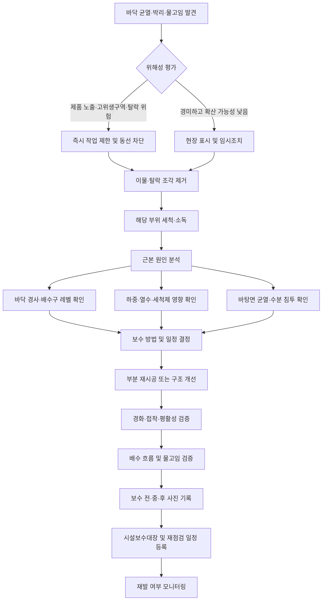

# [QA+ 블로그 생성 결과물] 식품공장 바닥관리
생성일시: 2026-09-19 07:25:15 (KST)
적용모델: gpt-5.6-terra

================================================================================
# 📋 [최종 발행용 블로그 패키지]

### 1. 메타 데이터 (SEO 설정)
- **최종 포스팅 제목**: 식품공장 바닥관리 핵심: 균열·물고임·배수구를 HACCP 관점에서 관리하는 법
- **메타 디스크립션 (120자 내외 요약)**: 식품공장 바닥관리에서 놓치기 쉬운 균열, 박리, 물고임, 배수구 슬라임 문제를 HACCP·시설관리 관점에서 점검하고 보수하는 실무 가이드입니다.
- **추천 해시태그 (10개)**: #식품공장바닥관리 #HACCP #식품위생 #식품안전 #시설관리 #배수구관리 #물고임 #바닥균열 #식품품질관리 #FSSC22000
- **카테고리**: 식품품질실무 / HACCP가이드

> **법령·사실관계 검수 메모**
> - 「식품위생법」 제36조 및 「식품위생법 시행규칙」 별표 14는 식품 관련 영업의 시설기준과 연결됩니다. 다만 실제 적용 기준은 영업 종류와 최신 개정사항에 따라 달라질 수 있으므로 심사 전 최신 법령과 관할기관 안내를 확인해야 합니다.
> - HACCP 관련 고시 명칭은 「식품 및 축산물 안전관리인증기준」으로 표기했습니다.
> - FSSC 22000 및 ISO/TS 22002-1 관련 문구는 특정 바닥재를 의무화한다는 의미가 아니라, 청소 가능성·배수성·오염 축적 방지라는 PRP 운영 취지로 정리했습니다.
> - 현장 사례의 수치와 개선 결과는 작성자가 제시한 실무 사례로 유지했으며, 외부 공인 통계나 일반화된 기준으로 표현하지 않았습니다.

---

## 2. 네이버 블로그 / 티스토리 복사용 최종 원고 (Markdown)

# 식품공장 바닥관리, 청소보다 중요한 것은 ‘균열·물고임·배수’입니다

> **20년 실무 선배의 한 줄 요약**  
> 식품공장 바닥은 깨끗해 보이는지만 볼 일이 아닙니다. **오염이 고이지 않고, 세척이 가능하며, 배수구 오염이 제조구역으로 퍼지지 않는 구조**로 관리해야 HACCP 심사와 현장 위생을 동시에 잡을 수 있습니다.

식품공장 바닥관리는 단순 청소 업무가 아닙니다. 바닥의 균열, 박리, 물고임, 배수구 슬라임은 작업화·대차 바퀴·호스·청소도구를 통해 제조구역 전체로 오염을 확산시킬 수 있습니다. 특히 습식공정에서는 바닥이 미생물의 저장고가 되지 않도록 구조와 위생관리 기준을 함께 운영해야 합니다.

---

## 1. 바닥은 더러워도 되는 곳이라는 착각부터 버려야 합니다

식품공장에서 바닥은 식품과 직접 닿지 않는다는 이유로 관리 우선순위가 뒤로 밀리기 쉽습니다. 실제로 현장 점검을 다니다 보면 설비 표면, 작업자 위생복, 금속검출기에는 신경을 많이 쓰면서도 바닥의 작은 균열이나 배수구 슬라임은 “다음 보수 때 하자”라고 넘기는 경우가 많습니다.

그런데 바닥은 작업화, 대차 바퀴, 호스, 청소도구를 통해 오염을 가장 넓게 퍼뜨릴 수 있는 매개체입니다. 특히 습식공정에서는 바닥 자체가 미생물의 저장고가 되지 않도록 관리해야 합니다.

세척 후 바닥에 남은 물이 매일 같은 장소에 고인다고 생각해 보겠습니다. 처음에는 물기 조금 남은 정도로 보이지만, 그 위를 원료 운반 대차와 작업화가 계속 지나갑니다. 이후 그 바퀴와 작업화가 포장실 또는 고위생구역으로 이동하면, 바닥의 오염이 구역 경계를 넘어갈 수 있습니다.

쉽게 말하면, 바닥의 물고임은 단순히 보기 싫은 문제가 아니라 공장 전체에 오염을 실어 나르는 ‘작은 환승역’이 되는 셈입니다.

바닥 균열도 마찬가지입니다. 균열 안으로 원료액, 세척수, 기름, 분말, 유기물이 들어가면 일반적인 표면 세척만으로는 완전히 제거하기 어렵습니다. 겉으로는 깨끗해 보여도 틈 내부에 수분과 유기물이 남으면 미생물이 증식하기 쉬운 환경이 만들어집니다.

여기에 바닥재가 박리되어 조각이 떨어지기 시작하면 미생물 문제뿐 아니라 이물 혼입 위험까지 같이 생깁니다.

제가 현장에서 가장 많이 강조하는 기준은 하나입니다.

> **“깨끗해 보이는 바닥”이 아니라 “오염이 머물 수 없는 바닥”을 만들어야 합니다.**

이를 위해서는 청소만 잘하는 것으로 부족하고, 표면 상태·배수 경사·배수구 위생·도구 구분·보수 이력까지 함께 관리해야 합니다. 이제부터 HACCP 관점에서 왜 이 부분을 중요하게 보는지 기준부터 차근차근 정리해 보겠습니다.


---

## 2. 식품공장 바닥관리의 법적 기준, 핵심은 ‘재질’보다 ‘관리 목적’입니다

식품공장 바닥관리의 기본 법적 근거는 「식품위생법」 제36조의 시설기준입니다. 식품제조·가공업 등 식품 관련 영업자는 식품의 오염을 막을 수 있는 시설기준을 갖추어야 하며, 세부 사항은 「식품위생법 시행규칙」 별표 14의 업종별 시설기준과 연결됩니다.

여기서 중요한 점은 “반드시 에폭시를 사용해야 한다”처럼 특정 바닥재를 일률적으로 지정하는 방식은 아니라는 것입니다. 시설이 위생적으로 관리될 수 있는 구조인지, 청소와 배수가 가능한 상태인지가 핵심입니다.

HACCP 인증업소라면 바닥 문제는 단순한 건물 하자가 아닙니다. 식품의약품안전처 고시 「식품 및 축산물 안전관리인증기준」의 선행요건관리와 연결되는 관리 항목입니다. 영업장 관리, 시설·설비 관리, 세척·소독 관리, 방충·방서 관리, 폐기물 관리 등이 바닥 및 배수구 관리와 직접 맞물립니다.

즉, 바닥 균열 하나라도 위치와 상태에 따라 시설관리 부적합, 위생관리 미흡, 이물관리 미흡으로 이어질 수 있습니다.

국제 표준인 FSSC 22000 및 ISO/TS 22002-1 식품제조 PRP도 같은 방향을 봅니다. 건물 구조와 바닥은 청소 가능해야 하고, 물이 고이지 않아야 하며, 적절하게 배수되어야 합니다. 또한 오염이 축적되거나 해충이 서식하기 쉬운 상태가 되지 않도록 유지해야 합니다.

쉽게 말하면, 심사관은 바닥재의 브랜드보다 “이 바닥을 매일 제대로 씻을 수 있는가, 물이 빠지는가, 깨진 부분이 오염원이 되지 않는가”를 확인합니다.

다만 업종별 시설기준과 최신 HACCP 평가 항목은 개정될 수 있습니다. 따라서 인증심사나 사후심사를 앞둔 경우에는 식품의약품안전처 및 한국식품안전관리인증원 자료실의 최신 평가 매뉴얼, 업종별 해설서, 관할 지자체 안내를 함께 확인하는 것이 안전합니다.

법령 문구를 외우는 것보다 내 공정에 어떤 위해가 발생하는지를 설명할 수 있어야 현장 대응이 훨씬 강해집니다.

| 관리 목적 | 심사에서 확인하는 현장 상태 | 관리가 안 될 때의 위험 |
|---|---|---|
| 청소 가능성 | 표면이 평활하고 균열·들뜸·탈락이 없는지 | 이물 발생, 세균 잔류, 세척 불량 |
| 배수성 | 세척수와 오염수가 배수구 방향으로 빠지는지 | 물고임, 미생물 증식, 미끄럼 사고 |
| 내구성 | 세척제·소독제·열수·중량물에 견디는지 | 박리, 재균열, 바닥재 이물 |
| 배수구 위생 | 트렌치·덮개·배관 주변에 슬라임과 악취가 없는지 | 해충 유인, 교차오염, 악취 |
| 접합부 청결성 | 바닥-벽체 코브(cove) 및 실리콘 상태가 양호한지 | 청소 사각지대, 오염 축적 |

기준을 이해했다면 다음은 내 공장의 바닥을 어떤 위험 순서로 볼지 정하는 단계입니다. 모든 균열을 같은 수준으로 처리하면 비용과 인력이 낭비되기 쉽습니다. 반대로 작은 문제라고 미루면 반복 부적합으로 이어질 수 있으니, 위해성 기반 우선순위가 필요합니다.

---

## 3. HACCP 심사에서 자주 지적되는 바닥 문제 7가지

첫 번째는 **바닥 균열, 깨짐, 줄눈 벌어짐**입니다. 특히 균열이 작업대 주변, 원료 투입구, 포장라인, 냉장실 출입구처럼 수분과 이동이 많은 위치에 있으면 위해도가 올라갑니다.

균열의 폭이 작더라도 깊이가 있거나 표면 조각이 탈락할 가능성이 있으면 그냥 넘기면 안 됩니다. 심사에서는 균열의 크기보다 그 부위가 청소 가능한지와 오염이 축적되는지를 봅니다.

두 번째는 **에폭시 또는 우레탄 표면의 박리와 들뜸**입니다. 바닥 코팅이 벗겨진 부분은 세척수가 스며들고, 시간이 지나면 가장자리부터 더 크게 탈락하는 경우가 많습니다.

박리된 조각은 물리적 이물이 될 수 있고, 들뜬 표면 아래에는 수분이 고일 수 있습니다. 특히 열수 세척, 강알칼리 세척제, 염분이 있는 원료액, 지게차 하중이 반복되는 구역은 손상이 빨라질 수 있습니다.

세 번째는 **반복적인 물고임과 역구배**입니다. 세척 후 스퀴지로 물을 밀어도 특정 구역에 계속 물이 남는다면, 작업자 문제만으로 판단하면 안 됩니다. 바닥 경사 불량, 배수구 레벨 불량, 배수관 막힘, 트렌치 덮개 막힘 등을 함께 확인해야 합니다.

물이 고이는 곳은 미생물 위해뿐 아니라 작업자 전도사고 위험도 높아 산업안전 관점에서도 즉시 관리해야 합니다.

네 번째부터 일곱 번째는 배수구 슬라임·악취, 바닥-벽체 접합부 파손, 배수구 덮개 파손, 장기 임시보수입니다.

배수구의 점액질 슬라임은 유기물과 미생물이 축적되었다는 신호일 수 있으며, 초파리나 나방파리 같은 해충을 유인할 가능성도 있습니다. 벽체 접합부의 코브가 깨지거나 실리콘이 떨어지면 브러시가 닿지 않는 사각지대가 생깁니다.

그리고 테이프, 일반 실리콘, 임시 모르타르를 수개월씩 방치하는 것은 “개선 조치 중”이 아니라 “부적합을 장기 방치한 것”으로 보일 수 있다는 점을 꼭 기억하셔야 합니다.

> **현장 판단 기준**  
> “작아 보이는가?”가 아니라 **“오염이 들어갈 틈이 있는가, 물이 남는가, 바닥재가 떨어질 수 있는가, 고위생구역으로 이동될 수 있는가?”**로 판단하시면 됩니다.

이제 이 7가지 문제를 발견했을 때 무엇부터 해야 하는지 보겠습니다. 현장에서는 ‘당장 생산을 멈춰야 하나요?’라는 질문이 가장 많이 나옵니다. 정답은 모든 문제를 일괄 중단으로 처리하는 것이 아니라, 위해성 평가와 즉시조치, 근본개선을 구분하는 것입니다.

---

## 4. 균열·박리 발견 시, 이렇게 판단하고 보수하세요

바닥 균열을 발견하면 첫 단계는 **위치와 위해성 판단**입니다. 제품이 노출되는 구역인지, 밀봉 포장 이후 구역인지, 고위생구역인지, 원료 전처리구역인지에 따라 위험도가 달라집니다.

균열 부근에 탈락 조각이 있는지, 세척수나 원료액이 침투하는지, 대차 바퀴와 작업화가 자주 지나는지도 함께 확인해야 합니다. 포장실 또는 즉석섭취식품(RTE) 고위생구역이라면 상대적으로 더 보수적으로 판단하는 것이 맞습니다.

두 번째는 **즉시조치**입니다. 먼저 탈락한 바닥재 조각과 주변 이물을 제거하고, 해당 위치를 세척·소독합니다. 균열부로 수분이나 이물이 들어가지 않도록 임시 차단하고, 필요하면 이동 동선을 변경하거나 해당 구역 사용을 제한합니다.

제품 노출 가능성이 있었다면 생산 lot, 시간대, 작업 내용, 이물 혼입 가능성을 검토해 품질부서가 위해성 평가 기록을 남겨야 합니다.

세 번째는 **근본 원인 분석**입니다. 보수재를 덧바른 뒤 같은 위치가 다시 갈라진다면 표면 문제로 끝나지 않습니다. 바탕 콘크리트 균열, 지게차나 핸드자키의 반복 하중, 냉장실 출입부의 온도 변화, 열수 세척에 의한 열충격, 배수 불량으로 인한 수분 침투, 기존 시공의 접착 불량을 확인해야 합니다.

쉽게 말하면, 상처 난 피부에 밴드만 계속 붙이고 있는지, 아니면 상처가 계속 나는 원인을 제거했는지를 봐야 합니다.

마지막은 **보수 후 검증과 기록**입니다. 보수 완료 사진만 찍고 끝내면 부족합니다. 보수재가 완전히 경화된 뒤 들뜸 없이 접착되었는지, 표면이 평활한지, 세척수에 견디는지, 물이 배수구로 자연스럽게 흐르는지 확인해야 합니다.

시설보수대장에는 발견일, 위치, 임시조치, 원인, 보수 방법, 완료일, 검증자, 재점검 예정일을 남기세요. 이 기록이 있어야 심사 때 “방치하지 않았고, 재발방지까지 관리했다”고 설명할 수 있습니다.




---

## 5. 물고임과 배수 불량은 청소 문제가 아니라 구조 문제로 접근해야 합니다

세척 후 물이 남는다고 해서 무조건 청소 담당자에게 “스퀴지 작업을 잘하세요”라고만 하면 해결되지 않습니다. 물론 스퀴지 사용법, 세척수 사용량, 청소 순서도 중요합니다.

하지만 매일 같은 위치에 물이 고이거나, 배수구 주변보다 바닥이 더 낮거나, 배수가 느리고 악취가 난다면 구조적 원인을 먼저 의심해야 합니다. 이런 상태는 청소를 열심히 해도 반복될 가능성이 높습니다.

물고임의 대표 원인은 크게 다섯 가지입니다.

1. 바닥 경사가 배수구 방향으로 형성되지 않은 경우  
2. 배수구 또는 트렌치가 막힌 경우  
3. 배수구 덮개 아래에 찌꺼기가 쌓인 경우  
4. 배수구 레벨이 주변 바닥보다 높게 시공된 경우  
5. 과도한 고압 세척수로 물량 자체가 과다한 경우  

특히 공장 증축이나 설비 이동 후에 물고임이 생겼다면 기존 경사와 설비 기초 높이가 달라졌을 가능성도 확인해야 합니다. 현장에서는 간단히 물을 소량 흘려 보내는 테스트를 해 보면 흐름 방향을 빠르게 파악할 수 있습니다.

내부 관리기준도 공장 특성에 맞춰 정해야 합니다. 법령에 모든 사업장에 적용되는 “물고임 허용시간 10분” 같은 일률적 숫자가 있는 것은 아닙니다.

따라서 세척 종료 후 스퀴지 작업을 완료한 시점에 육안상 고인 물이 없어야 한다거나, 생산 시작 전 위생점검자가 바닥 건조 상태와 배수구 상태를 확인한다는 식으로 기준을 설정하는 것이 현실적입니다.

반복 물고임 구역은 평면도에 표시해 집중점검 대상과 시설개선 대상으로 별도 관리하면 좋습니다.

생산 중 바닥 세척도 주의해야 합니다. 제품 또는 포장재가 노출된 상태에서 고압수나 많은 세척수를 사용하면 비산수가 설비·포장재·제품 주변으로 튈 수 있습니다.

불가피하게 생산 중 청소해야 한다면 저압·소량 방식으로 제한하고, 제품을 보호하거나 해당 작업을 일시 중지한 뒤 청소하는 절차를 SOP에 정해야 합니다. 특히 배수구 방향으로 오염수를 밀어내는 과정에서 반대 방향으로 튀지 않도록 작업 동선과 장비 배치를 검토하십시오.

| 원인 | 현장에서 보이는 징후 | 우선 조치 | 근본 개선 방향 |
|---|---|---|---|
| 바닥 경사 불량 | 늘 같은 위치에 물이 남음 | 스퀴지로 물기 제거, 구역 표시 | 레벨 측정 후 부분 재시공 |
| 배수구 막힘 | 배수가 느리고 역류·악취 발생 | 덮개 탈거, 찌꺼기 제거 | 배관 세척, 막힘 원인 제거 |
| 배수구 레벨 불량 | 배수구보다 낮은 웅덩이 존재 | 임시 물기 제거 | 배수구 또는 주변 바닥 레벨 보정 |
| 세척수 과다 사용 | 세척 후 장시간 젖어 있음 | 물 사용량 조절 | 저압 세척 SOP 및 교육 |
| 스퀴지 불량·작업 미흡 | 벽체 모서리와 설비 하부에 물 잔류 | 도구 교체, 재작업 | 도구 규격·작업 동선 표준화 |

물고임을 정리했다면 다음 고위험 지점은 배수구입니다. 바닥 전체를 아무리 깨끗하게 닦아도 배수구에 슬라임과 찌꺼기가 남아 있으면, 결국 오염은 다시 주변으로 퍼질 수 있습니다.

배수구는 일반 바닥의 일부가 아니라 별도 관리 대상이라고 생각하시면 정확합니다.

---

## 6. 배수구·트렌치는 ‘고위험 구역’으로 분리 관리해야 합니다

배수구는 원료 찌꺼기, 세척수, 유기물, 미생물이 모이는 구조입니다. 특히 육류, 수산물, 절단채소, 소스, 조리식품처럼 수분과 유기물이 많은 공정에서는 배수구 오염이 빠르게 누적될 수 있습니다.

덮개 아래와 트렌치 측면은 눈에 잘 보이지 않아 청소가 빠지기 쉬운 곳입니다. 악취, 점액질 슬라임, 날파리 발생은 “소독이 부족하다”는 신호라기보다 물리적 세척과 시설점검이 부족하다는 신호일 때가 많습니다.

배수구 청소는 일반 바닥 청소와 도구부터 분리해야 합니다. 배수구 전용 브러시, 전용 스퀴지, 전용 장갑, 전용 폐기물통을 색상 또는 라벨로 구분하세요.

예를 들어 제조구역 바닥은 파란색, 배수구는 빨간색, 화장실·폐기물 구역은 검은색처럼 공장 자체 기준을 만들 수 있습니다. 법령이 모든 공장에 특정 색상을 의무화하는 것은 아니지만, 한눈에 구분되는 방식은 교차오염 예방과 심사 대응에 매우 효과적입니다.

권장 청소 순서는 다음과 같습니다.

> **찌꺼기 제거 → 세척제 도포 → 물리적 마찰 세척 → 충분한 헹굼 → 필요 시 소독 → 물기 제거 및 건조 상태 확인**

여기서 핵심은 소독제를 먼저 붓는 것이 아니라 유기물과 슬라임을 먼저 제거하는 것입니다. 유기물이 남아 있으면 소독 효과가 떨어질 수 있기 때문입니다.

또 서로 다른 세척제와 소독제를 임의로 섞으면 유해가스가 발생할 수 있으므로, 반드시 제품 라벨과 SDS(물질안전보건자료)의 사용방법을 따라야 합니다.

악취가 반복되면 공무팀과 같이 배관 상태까지 확인해야 합니다. 트랩의 봉수 부족, 배관 막힘, 오염수 역류, 배관 기울기 불량, 침전물 축적은 표면 청소만으로 해결되지 않습니다.

배수구 악취가 특히 새벽이나 생산 시작 전 심해진다면 트랩과 배관 문제를 의심해 볼 수 있습니다. QA는 위해성과 위생기준을 판단하고, 생산팀은 일상 청소를 수행하며, 공무팀은 구조적 원인을 개선하는 식으로 역할을 나누는 것이 가장 효율적입니다.


---

## 7. 20년 현장 사례로 보는 식품공장 바닥관리 적용법

### 사례 1. 냉동만두 제조공장 성형실의 반복 물고임 개선

냉동만두 제조공장의 성형실에서 세척 후마다 성형기 하부에 약 1~2m² 크기의 물고임이 반복됐습니다. 작업자들은 매일 생산 전 스퀴지로 물을 제거했기 때문에 큰 문제는 아니라고 생각했습니다.

그러나 HACCP 사후심사에서 해당 구역의 물고임과 대차 바퀴 이동 동선이 지적됐습니다. 성형실은 생원료 취급구역이었고, 같은 대차가 급속동결 전 대기구역까지 이동하고 있어 교차오염 가능성이 있었습니다.

처음에는 청소 담당자의 작업 미흡으로 판단해 재교육을 실시했지만, 일주일 뒤에도 같은 위치에 물이 남았습니다. 현장에 물을 흘려보내고 레벨을 확인해 보니 배수구 방향 경사가 거의 없었고, 성형기 설치 당시 설비 기초가 추가되면서 주변 바닥이 낮아진 것이 원인이었습니다.

트렌치 덮개 아래에는 만두피 조각과 전분 찌꺼기도 축적되어 배수 속도를 더 떨어뜨리고 있었습니다. 즉, 작업자 문제와 시설 문제가 함께 있었던 것입니다.

개선조치로 생산 종료 후 트렌치 덮개를 탈거해 세척하는 주 1회 분해세척 기준을 만들었습니다. 동시에 매일 청소 후에는 성형기 하부의 물고임 여부를 위생점검표에 기록하도록 했습니다.

공무팀은 주말 생산중단 시간에 해당 구역을 부분 절삭하고 배수구 방향으로 경사를 재시공했습니다. 재시공 후에는 세척수 흐름 시험, 스퀴지 작업성, 바닥 평활성, 대차 이동성까지 확인했습니다.

그 결과 세척 종료 후 고인 물이 남지 않았고, 바닥 건조 확인 시간도 평균 20분 이상 단축됐습니다. 무엇보다 심사 대응 시 “닦아서 관리한다”가 아니라 “반복 원인을 분석해 구조를 개선했다”는 근거를 제시할 수 있었습니다.

이 사례의 핵심은 물고임이 보이면 청소 능력만 평가하지 말고, **경사·배수구 레벨·설비 기초 높이**를 같이 봐야 한다는 점입니다.

### 사례 2. 소스류 제조공장 충진실 에폭시 박리 문제

소스류 제조공장의 충진실에서는 충진기 세척구역 주변 에폭시 바닥이 동전 크기부터 손바닥 크기까지 벗겨지고 있었습니다. 처음에는 표면이 조금 거칠어진 정도라 생산에는 영향이 없다고 판단했습니다.

그러나 바닥재 조각이 발견되면서 이물관리 측면의 우려가 커졌고, 박리 부위에 세척수가 스며들어 건조도 늦어졌습니다. 해당 구역은 산성 소스와 알칼리성 세척제를 모두 사용하는 곳이라 바닥재에 가해지는 화학적 부담도 컸습니다.

현장에서는 기존과 같은 에폭시를 다시 덧바르면 해결될 것으로 생각했습니다. 하지만 보수 이력을 확인해 보니 같은 위치에서 6개월 간격으로 세 번 보수가 반복된 상태였습니다.

원인 분석 결과, 고온 세척수 사용과 산·알칼리 세척제 반복 노출, 충진기 이동 시 발생하는 집중 하중, 기존 바탕면 수분 관리 부족이 복합적으로 작용한 것으로 확인됐습니다.

쉽게 말하면 보수재 자체만의 문제가 아니라 공정 조건에 맞지 않는 재질과 시공 조건이 문제였습니다.

긴급조치로는 박리 조각을 완전히 제거하고, 해당 구역을 표시해 제품 운반 동선을 우회시켰습니다. 이후 시공업체에 단순 견적만 요청하지 않고, 세척제 종류·사용 농도·열수 사용 여부·바닥 온도·핸드자키 하중·보수 가능 시간을 정리한 기술조건서를 전달했습니다.

그 결과 내약품성과 내열성이 더 적합한 우레탄 모르타르 계열 바닥재를 검토해 부분 재시공했습니다. 시공 전에는 바탕면 수분 상태와 기존 들뜸 범위를 확인했고, 충분한 경화 시간을 확보한 뒤 생산을 재개했습니다.

보수 후에는 매일 육안점검, 주 1회 접착 상태 확인, 월 1회 시설팀 합동점검을 3개월간 운영했습니다. 이후 같은 구역의 재박리는 발생하지 않았고, 세척 후 표면 손상도 현저히 줄었습니다.

이 사례에서 배우실 점은 “에폭시냐 우레탄이냐”가 정답이 아니라는 것입니다. **내수성, 내약품성, 내열성, 중량물 하중, 시공·경화 조건**을 공정에 맞춰 검토해야 재발을 막을 수 있습니다.

### 사례 3. 레토르트 식품공장 배수구 슬라임과 악취 개선

레토르트 죽 생산공장에서는 조리실 배수구에서 반복적으로 악취와 점액질 슬라임이 발생했습니다. 청소 담당자는 매일 작업 종료 후 배수구에 소독제를 투입하고 있었지만, 며칠만 지나면 악취가 다시 올라왔습니다.

여름철에는 배수구 주변에 초파리도 관찰되어 방충관리 점검에서도 문제가 됐습니다. 심사 준비 점검에서 확인해 보니 배수구용 브러시와 일반 바닥 브러시가 같은 세척실에 함께 보관되고 있었습니다.

문제의 직접 원인은 트렌치 내부에 죽 원료와 전분성 찌꺼기가 남아 있는 것이었습니다. 근본 원인은 배수구 덮개를 매일 열어 세척하지 않았고, 소독제만 붓는 방식으로 청소를 끝냈다는 점이었습니다.

게다가 배수구 청소 도구를 일반 바닥에 사용하면서 오염을 넓힐 가능성도 있었습니다. 배관 점검 결과 일부 구간에 침전물이 쌓여 배수 흐름도 원활하지 않았습니다.

개선조치로 배수구를 고위험구역으로 지정하고, 빨간색 전용 브러시·전용 장갑·전용 스퀴지를 배치했습니다. 청소 SOP에는 덮개 탈거, 찌꺼기 제거, 세척제 도포, 브러싱, 헹굼, 승인된 소독제 사용, 물기 제거 순서를 명확히 넣었습니다.

배수구 청소는 일반 바닥 청소의 마지막 단계로 배치했고, 청소 후 도구는 별도 보관함에서 세척·건조하도록 했습니다. 공무팀은 배관 고압세척과 트랩 상태 점검을 실시했습니다.

개선 후 4주 동안 주 2회 ATP 또는 내부 위생검증 기준에 따른 모니터링을 병행했습니다. 악취 민원과 초파리 관찰 빈도가 줄었고, 배수구 주변의 슬라임도 눈에 띄게 감소했습니다.

무엇보다 작업자들이 “소독제를 많이 쓰는 것”보다 “찌꺼기를 물리적으로 없애는 것”이 먼저라는 원칙을 이해하게 됐습니다. 배수구 문제는 소독제의 문제가 아니라 **유기물 제거, 도구 분리, 배관 상태**의 문제라는 것을 보여주는 사례입니다.

사례를 보면 공통점이 보입니다. 균열은 보수재만의 문제가 아니고, 물고임은 청소자만의 문제가 아니며, 악취는 소독제만의 문제가 아닙니다.

현장 문제는 대부분 구조·작업방법·도구·기록이 함께 얽혀 있으므로 부서 협업으로 풀어야 합니다.

---

## 8. 바닥 청소 SOP와 구역별 도구 관리는 이렇게 표준화하세요

바닥 청소 SOP는 “바닥을 깨끗이 청소한다”처럼 추상적으로 쓰면 현장에서 실행되지 않습니다. 누가, 언제, 어떤 도구로, 어느 방향으로, 어떤 세척제를 사용하고, 무엇을 확인할지까지 구체적으로 정해야 합니다.

특히 습식공정은 세척수 비산과 오염수 이동을 고려해 생산 종료 후 청소를 원칙으로 잡는 것이 좋습니다. 생산 중 청소가 불가피한 경우에는 제품·포장재 보호조치와 저압·소량 세척 기준을 별도로 두어야 합니다.

기본 순서는 제품과 포장재를 먼저 정리하고, 큰 원료 찌꺼기를 제거하는 것부터 시작합니다. 그다음 구역별 전용 도구로 세척제를 도포하고, 제조사가 정한 접촉시간 동안 작용시킵니다.

이후 브러시나 패드로 물리적 마찰을 가해 오염물을 제거하고, 깨끗한 물로 충분히 헹굽니다. 필요할 경우 승인된 소독제를 지정 농도와 접촉시간에 맞춰 사용한 뒤, 스퀴지로 물기를 배수구 방향으로 제거합니다.

청소 순서는 일반적으로 깨끗한 구역에서 오염구역 방향으로 운영하는 것이 원칙입니다. 예를 들어 고위생 포장구역, 일반 제조구역, 원료 전처리구역, 폐기물·배수구 구역 순으로 관리할 수 있습니다.

단, 공장 구조와 공정 흐름에 따라 달라질 수 있으므로 무조건 다른 공장 방식을 복사하면 안 됩니다. 중요한 것은 배수구용 도구나 폐기물 구역 도구가 다시 고위생구역으로 돌아가지 않게 하는 것입니다.

청소도구는 색상뿐 아니라 보관 위치와 상태까지 관리해야 합니다. 색으로 구분해도 브러시가 바닥에 닿은 채 방치되거나, 젖은 상태로 밀폐 보관되면 자체적으로 오염원이 될 수 있습니다.

벽걸이형 도구걸이를 사용해 바닥에서 띄워 건조시키고, 도구 손상·모 빠짐·오염 여부를 정기적으로 점검하세요. 도구 교체주기는 일률적으로 정하기보다 손상도와 세척 상태를 기준으로 운영하되, 최소 월 1회 상태점검 기록을 남기면 좋습니다.

---

## 9. HACCP 심사 대응용 바닥관리 점검표와 보수이력 작성법

심사관이 바닥을 볼 때 가장 먼저 확인하는 것은 현재 상태입니다. 하지만 그다음에는 “이 문제를 알고 있었는가, 발견 후 어떻게 조치했는가, 재발하지 않게 관리하는가”를 봅니다.

따라서 현장이 완벽하지 않더라도 발견 사실과 개선계획, 임시조치, 완료 검증이 정리되어 있으면 대응력이 달라집니다. 반대로 반복 균열과 물고임이 있는데 기록이 전혀 없다면 관리체계 미흡으로 판단될 가능성이 큽니다.

시설점검은 일상점검과 정기점검으로 나누는 것이 좋습니다. 생산팀 또는 위생관리 담당자는 매일 생산 전·후에 물고임, 이물, 악취, 미끄럼 위험, 배수구 덮개 상태를 확인합니다.

QA와 공무팀은 주 1회 또는 월 1회 합동점검으로 균열, 박리, 코브 파손, 배수 경사, 반복 불량 위치를 확인할 수 있습니다. 위험도가 높은 습식구역과 고위생구역은 점검 빈도를 더 높게 설정해야 합니다.

보수이력에는 최소한 발견일, 위치, 발견자, 문제 유형, 위해성 평가, 임시조치, 원인 분석, 개선 담당부서, 완료 예정일, 완료일, 검증 결과를 남기세요.

사진은 개선 전·중·후로 촬영하면 가장 좋습니다. 특히 장기 공사가 필요한 경우에는 임시조치의 유효기간과 재점검 날짜를 반드시 정해야 합니다. “추후 보수 예정”이라는 문구만 있고 기한이 없으면 심사에서는 사실상 관리하지 않는 것으로 보일 수 있습니다.

심사관에게 설명할 때는 변명보다 구조화된 답변이 효과적입니다.

> “지난주 발견했고, 즉시 탈락부를 제거한 뒤 임시 차단했습니다. 반복 원인은 지게차 하중과 배수 불량으로 판단했으며, 공무팀이 10월 15일 부분 재시공 예정입니다. 완료 후 배수 시험과 표면 상태를 QA가 검증할 예정입니다.”

이 정도만 정리되어 있어도 현장을 알고 관리하고 있다는 인상을 줄 수 있습니다.

| 점검 항목 | 내부 관리 기준 예시 | 점검 주기 | 담당 부서 | 기록 방법 |
|---|---|---:|---|---|
| 바닥 균열·박리 | 탈락·들뜸·수분 침투 부위가 없을 것 | 매일 / 월 1회 합동 | 생산 / QA·공무 | 일상점검표, 사진 |
| 물고임 | 세척 종료 및 스퀴지 작업 후 고인 물이 없을 것 | 매일 | 생산·위생 | 청소점검표 |
| 배수구 슬라임·악취 | 찌꺼기·점액·악취·해충 흔적이 없을 것 | 매일 / 주 1회 분해 | 위생·생산 | 배수구 청소일지 |
| 도구 구분 | 배수구·폐기물·제조구역 도구가 구분될 것 | 매일 | 위생관리자 | 도구점검표 |
| 임시 보수 | 임시조치 기한 및 근본개선 일정이 있을 것 | 주 1회 | QA·공무 | 시설보수대장 |
| 보수 후 검증 | 접착·평활성·배수·세척 가능성을 확인할 것 | 보수 완료 시 | QA·공무 | 검증기록서 |

---

## 10. 식품공장 바닥관리 FAQ: 심사 전에 가장 많이 묻는 질문

### Q1. 바닥에 작은 균열 하나가 있어도 HACCP 부적합인가요?

**A.** 균열 크기만으로 무조건 부적합이라고 단정할 수는 없습니다. 다만 균열이 깊어 수분이나 원료액이 들어갈 수 있고, 바닥재 조각이 떨어지거나 청소가 어려운 상태라면 개선 대상입니다.

특히 제품 노출구역, 포장실, 고위생구역에 있다면 즉시조치와 보수계획을 세우는 것이 안전합니다.

### Q2. 물고임은 생산 시작 전에 닦기만 하면 괜찮지 않나요?

**A.** 일회성 물기라면 즉시 제거로 관리할 수 있습니다. 하지만 같은 위치에서 반복된다면 배수 경사, 배수구 막힘, 바닥 레벨, 세척수 과다 사용 등 구조적 원인이 있을 가능성이 높습니다.

심사에서는 “닦았다”보다 “왜 반복되는지 분석하고 재발방지를 했는가”를 더 중요하게 봅니다.

### Q3. 바닥 보수에 실리콘을 사용해도 되나요?

**A.** 긴급한 틈새 차단을 위한 임시조치로 사용할 수는 있습니다. 다만 습기, 세척제, 열수, 대차 하중에 견디지 못해 쉽게 탈락하거나 곰팡이가 생길 수 있으므로 장기 보수재로는 신중해야 합니다.

보수재는 식품 제조환경 적합성, 내수성, 내약품성, 접착성, 경화 후 표면 상태를 확인해 선정하십시오.

### Q4. 배수구에 소독제를 매일 부으면 악취와 미생물이 해결되나요?

**A.** 아닙니다. 슬라임과 유기물이 남아 있으면 소독제가 충분히 작용하지 못할 수 있습니다. 먼저 덮개와 트렌치 내부의 찌꺼기를 물리적으로 제거하고 세척한 뒤, 필요 시 소독제를 사용하는 순서가 맞습니다.

악취가 계속되면 배관 막힘, 트랩 이상, 역류 여부까지 공무팀과 확인해야 합니다.

### Q5. 청소도구는 꼭 색상으로 구분해야 하나요?

**A.** 법령에서 모든 사업장에 특정 색상 사용을 일률적으로 의무화하는 것은 아닙니다. 하지만 색상, 라벨, 전용 보관함, 구역별 도구걸이로 구분하면 작업자가 실수할 가능성이 크게 줄어듭니다.

최소한 배수구·폐기물·화장실용 도구와 제조구역용 도구는 분리하는 것을 권장합니다.

### Q6. 에폭시, 우레탄, 타일 중 무엇이 가장 좋은 바닥재인가요?

**A.** 공정 조건을 빼고는 정답을 말하기 어렵습니다. 열수 세척, 산·알칼리 세척제, 지게차 하중, 냉장·냉동 환경, 습식 여부, 염분 노출 여부에 따라 적합한 재질이 달라집니다.

시공업체에는 반드시 세척 조건과 하중 조건을 전달하고, 내약품성·내열성·보수 가능성 자료를 요구하세요.

---

## 11. 오늘 바로 실행하는 식품공장 바닥관리 체크리스트

지금 당장 현장을 한 바퀴 돌면서 아래 항목부터 확인해 보세요. 처음부터 전체 재시공 계획을 세우려고 하면 부담이 커집니다.

우선 위해도가 높은 곳, 즉 제품 노출구역·고위생구역·습식구역·배수구 주변부터 표시하는 것이 좋습니다. 작은 문제라도 사진과 위치를 남기면 개선 우선순위를 정하기 쉬워집니다.

1. 바닥에 균열, 들뜸, 박리, 타일 탈락, 줄눈 벌어짐이 있는지 확인합니다.  
2. 세척 후 물이 반복적으로 고이는 위치가 있는지 확인합니다.  
3. 배수구 덮개를 열어 찌꺼기, 슬라임, 악취, 해충 흔적을 확인합니다.  
4. 바닥-벽체 접합부와 코브 부위에 검은 오염물, 실리콘 탈락, 파손이 있는지 봅니다.  
5. 배수구용 청소도구와 일반 제조구역 청소도구가 분리되어 있는지 확인합니다.  
6. 임시 보수 부위에 완료 예정일과 담당자가 지정되어 있는지 확인합니다.  
7. 최근 3개월간 같은 위치에서 반복된 시설 부적합이 있는지 보수이력을 검토합니다.  
8. 생산 시작 전 바닥 상태를 확인하는 점검 항목이 실제 일지에 반영되어 있는지 확인합니다.  

이 체크리스트에서 한두 건이 나왔다고 너무 걱정하실 필요는 없습니다. 중요한 것은 발견한 문제를 숨기거나 미루지 않고, 위해성에 따라 즉시조치와 근본개선을 구분하는 것입니다.

QA 혼자 끌어안지 말고 생산팀·공무팀과 사진, 위치, 원인 추정, 개선기한을 공유하세요. 바닥관리는 협업이 안 되면 절대 오래 유지되지 않습니다.

---

## 12. 맺음말: 바닥관리는 청소 상태가 아니라 ‘오염이 쌓이지 않는 구조’를 만드는 일입니다

오늘 내용은 세 가지만 기억하시면 됩니다.

첫째, 바닥 균열과 박리는 작은 크기보다 **수분·이물·미생물이 쌓일 수 있는지**를 기준으로 판단해야 합니다.

둘째, 반복되는 물고임은 청소 문제로만 보지 말고 **배수 경사와 시설 구조 문제**로 접근해야 합니다.

셋째, 배수구는 일반 바닥과 분리된 고위험구역으로 보고 전용 도구와 분해세척 기준을 운영해야 합니다.

바닥관리는 생산량을 직접 올려주는 업무처럼 보이지 않아 늘 뒤로 밀립니다. 하지만 현장을 오래 관리해 보면 작은 균열 하나, 매일 물이 고이는 한 지점, 제대로 열어보지 않은 배수구 하나가 결국 큰 위생 문제와 심사 지적으로 이어지는 경우가 정말 많습니다.

그래서 바닥 문제는 발견 즉시 ‘청소할 일’인지, ‘보수할 일’인지, ‘구조를 바꿔야 할 일’인지 구분하는 습관이 중요합니다.

오늘 퇴근 전 10분만 투자해서 공장 바닥을 천천히 걸어보세요. “깨끗해 보이는가?” 대신 “물이 어디에 남는가, 틈새에 무엇이 들어갈 수 있는가, 이 도구가 다른 구역으로 이동하는가?”를 기준으로 보면 개선할 지점이 훨씬 선명하게 보일 겁니다.

이 작은 점검이 HACCP 심사 대응은 물론, 작업자 안전과 제품 안전까지 지키는 출발점이 됩니다.

막히는 부분 있으면 언제든 댓글로 편하게 물어보세요. 후배님들의 **부적합 없는 심사와 칼퇴**를 응원합니다.

---

## 3. 워드프레스 / 웹사이트용 HTML 원고

```html
<article class="food-qa-post">
  <header>
    <h1>식품공장 바닥관리, 청소보다 중요한 것은 ‘균열·물고임·배수’입니다</h1>
    <p><strong>20년 실무 선배의 한 줄 요약:</strong> 식품공장 바닥은 깨끗해 보이는지만 볼 일이 아닙니다. <strong>오염이 고이지 않고, 세척이 가능하며, 배수구 오염이 제조구역으로 퍼지지 않는 구조</strong>로 관리해야 HACCP 심사와 현장 위생을 동시에 잡을 수 있습니다.</p>
  </header>

  <section>
    <h2>1. 바닥은 더러워도 되는 곳이라는 착각부터 버려야 합니다</h2>
    <p>식품공장에서 바닥은 식품과 직접 닿지 않는다는 이유로 관리 우선순위가 뒤로 밀리기 쉽습니다. 실제로 현장 점검을 다니다 보면 설비 표면, 작업자 위생복, 금속검출기에는 신경을 많이 쓰면서도 바닥의 작은 균열이나 배수구 슬라임은 “다음 보수 때 하자”라고 넘기는 경우가 많습니다.</p>
    <p>그런데 바닥은 작업화, 대차 바퀴, 호스, 청소도구를 통해 오염을 가장 넓게 퍼뜨릴 수 있는 매개체입니다. 특히 습식공정에서는 바닥 자체가 미생물의 저장고가 되지 않도록 관리해야 합니다.</p>
    <p>세척 후 바닥에 남은 물이 매일 같은 장소에 고인다고 생각해 보겠습니다. 처음에는 물기 조금 남은 정도로 보이지만, 그 위를 원료 운반 대차와 작업화가 계속 지나갑니다. 이후 그 바퀴와 작업화가 포장실 또는 고위생구역으로 이동하면, 바닥의 오염이 구역 경계를 넘어갈 수 있습니다.</p>
    <p>쉽게 말하면, 바닥의 물고임은 단순히 보기 싫은 문제가 아니라 공장 전체에 오염을 실어 나르는 ‘작은 환승역’이 되는 셈입니다.</p>
    <p>바닥 균열도 마찬가지입니다. 균열 안으로 원료액, 세척수, 기름, 분말, 유기물이 들어가면 일반적인 표면 세척만으로는 완전히 제거하기 어렵습니다. 겉으로는 깨끗해 보여도 틈 내부에 수분과 유기물이 남으면 미생물이 증식하기 쉬운 환경이 만들어집니다.</p>
    <p>여기에 바닥재가 박리되어 조각이 떨어지기 시작하면 미생물 문제뿐 아니라 이물 혼입 위험까지 같이 생깁니다.</p>
    <blockquote>
      <p><strong>“깨끗해 보이는 바닥”이 아니라 “오염이 머물 수 없는 바닥”을 만들어야 합니다.</strong></p>
    </blockquote>
    <p>이를 위해서는 청소만 잘하는 것으로 부족하고, 표면 상태·배수 경사·배수구 위생·도구 구분·보수 이력까지 함께 관리해야 합니다.</p>
    <figure>
      
      <figcaption>바닥 균열과 물고임은 작업화와 대차 바퀴를 통해 다른 구역으로 오염을 이동시킬 수 있습니다.</figcaption>
    </figure>
  </section>

  <section>
    <h2>2. 식품공장 바닥관리의 법적 기준, 핵심은 ‘재질’보다 ‘관리 목적’입니다</h2>
    <p>식품공장 바닥관리의 기본 법적 근거는 「식품위생법」 제36조의 시설기준입니다. 식품제조·가공업 등 식품 관련 영업자는 식품의 오염을 막을 수 있는 시설기준을 갖추어야 하며, 세부 사항은 「식품위생법 시행규칙」 별표 14의 업종별 시설기준과 연결됩니다.</p>
    <p>여기서 중요한 점은 “반드시 에폭시를 사용해야 한다”처럼 특정 바닥재를 일률적으로 지정하는 방식은 아니라는 것입니다. 시설이 위생적으로 관리될 수 있는 구조인지, 청소와 배수가 가능한 상태인지가 핵심입니다.</p>
    <p>HACCP 인증업소라면 바닥 문제는 단순한 건물 하자가 아닙니다. 식품의약품안전처 고시 「식품 및 축산물 안전관리인증기준」의 선행요건관리와 연결되는 관리 항목입니다. 영업장 관리, 시설·설비 관리, 세척·소독 관리, 방충·방서 관리, 폐기물 관리 등이 바닥 및 배수구 관리와 직접 맞물립니다.</p>
    <p>국제 표준인 FSSC 22000 및 ISO/TS 22002-1 식품제조 PRP도 같은 방향을 봅니다. 건물 구조와 바닥은 청소 가능해야 하고, 물이 고이지 않아야 하며, 적절하게 배수되어야 합니다. 또한 오염이 축적되거나 해충이 서식하기 쉬운 상태가 되지 않도록 유지해야 합니다.</p>
    <p>다만 업종별 시설기준과 최신 HACCP 평가 항목은 개정될 수 있습니다. 인증심사나 사후심사를 앞둔 경우에는 식품의약품안전처 및 한국식품안전관리인증원 자료실의 최신 평가 매뉴얼, 업종별 해설서, 관할 지자체 안내를 함께 확인하는 것이 안전합니다.</p>

    <table>
      <thead>
        <tr>
          <th>관리 목적</th>
          <th>심사에서 확인하는 현장 상태</th>
          <th>관리 미흡 시 위험</th>
        </tr>
      </thead>
      <tbody>
        <tr>
          <td>청소 가능성</td>
          <td>표면이 평활하고 균열·들뜸·탈락이 없는지</td>
          <td>이물 발생, 세균 잔류, 세척 불량</td>
        </tr>
        <tr>
          <td>배수성</td>
          <td>세척수와 오염수가 배수구 방향으로 빠지는지</td>
          <td>물고임, 미생물 증식, 미끄럼 사고</td>
        </tr>
        <tr>
          <td>내구성</td>
          <td>세척제·소독제·열수·중량물에 견디는지</td>
          <td>박리, 재균열, 바닥재 이물</td>
        </tr>
        <tr>
          <td>배수구 위생</td>
          <td>트렌치·덮개·배관 주변에 슬라임과 악취가 없는지</td>
          <td>해충 유인, 교차오염, 악취</td>
        </tr>
        <tr>
          <td>접합부 청결성</td>
          <td>바닥-벽체 코브(cove) 및 실리콘 상태가 양호한지</td>
          <td>청소 사각지대, 오염 축적</td>
        </tr>
      </tbody>
    </table>
  </section>

  <section>
    <h2>3. HACCP 심사에서 자주 지적되는 바닥 문제 7가지</h2>
    <p>첫 번째는 <strong>바닥 균열, 깨짐, 줄눈 벌어짐</strong>입니다. 특히 균열이 작업대 주변, 원료 투입구, 포장라인, 냉장실 출입구처럼 수분과 이동이 많은 위치에 있으면 위해도가 올라갑니다. 균열의 폭이 작더라도 깊이가 있거나 표면 조각이 탈락할 가능성이 있으면 그냥 넘기면 안 됩니다.</p>
    <p>두 번째는 <strong>에폭시 또는 우레탄 표면의 박리와 들뜸</strong>입니다. 박리된 조각은 물리적 이물이 될 수 있고, 들뜬 표면 아래에는 수분이 고일 수 있습니다. 특히 열수 세척, 강알칼리 세척제, 염분이 있는 원료액, 지게차 하중이 반복되는 구역은 손상이 빨라질 수 있습니다.</p>
    <p>세 번째는 <strong>반복적인 물고임과 역구배</strong>입니다. 세척 후 스퀴지로 물을 밀어도 특정 구역에 계속 물이 남는다면, 작업자 문제만으로 판단하면 안 됩니다. 바닥 경사 불량, 배수구 레벨 불량, 배수관 막힘, 트렌치 덮개 막힘 등을 함께 확인해야 합니다.</p>
    <p>네 번째부터 일곱 번째는 배수구 슬라임·악취, 바닥-벽체 접합부 파손, 배수구 덮개 파손, 장기 임시보수입니다. 배수구의 점액질 슬라임은 유기물과 미생물이 축적되었다는 신호일 수 있으며, 해충을 유인할 가능성도 있습니다.</p>
    <blockquote>
      <p><strong>현장 판단 기준:</strong> “작아 보이는가?”가 아니라 “오염이 들어갈 틈이 있는가, 물이 남는가, 바닥재가 떨어질 수 있는가, 고위생구역으로 이동될 수 있는가?”로 판단해야 합니다.</p>
    </blockquote>
  </section>

  <section>
    <h2>4. 균열·박리 발견 시, 이렇게 판단하고 보수하세요</h2>
    <p>바닥 균열을 발견하면 첫 단계는 <strong>위치와 위해성 판단</strong>입니다. 제품이 노출되는 구역인지, 밀봉 포장 이후 구역인지, 고위생구역인지, 원료 전처리구역인지에 따라 위험도가 달라집니다.</p>
    <p>균열 부근에 탈락 조각이 있는지, 세척수나 원료액이 침투하는지, 대차 바퀴와 작업화가 자주 지나는지도 함께 확인해야 합니다. 포장실 또는 즉석섭취식품(RTE) 고위생구역이라면 상대적으로 더 보수적으로 판단하는 것이 맞습니다.</p>
    <p>두 번째는 <strong>즉시조치</strong>입니다. 먼저 탈락한 바닥재 조각과 주변 이물을 제거하고, 해당 위치를 세척·소독합니다. 균열부로 수분이나 이물이 들어가지 않도록 임시 차단하고, 필요하면 이동 동선을 변경하거나 해당 구역 사용을 제한합니다.</p>
    <p>세 번째는 <strong>근본 원인 분석</strong>입니다. 바탕 콘크리트 균열, 지게차나 핸드자키의 반복 하중, 냉장실 출입부의 온도 변화, 열수 세척에 의한 열충격, 배수 불량으로 인한 수분 침투, 기존 시공의 접착 불량을 확인해야 합니다.</p>
    <p>마지막은 <strong>보수 후 검증과 기록</strong>입니다. 보수재가 완전히 경화된 뒤 들뜸 없이 접착되었는지, 표면이 평활한지, 세척수에 견디는지, 물이 배수구로 자연스럽게 흐르는지 확인해야 합니다.</p>
    <p>시설보수대장에는 발견일, 위치, 임시조치, 원인, 보수 방법, 완료일, 검증자, 재점검 예정일을 남기세요.</p>
    <figure>
      
      <figcaption>균열 보수는 즉시조치, 근본 원인 분석, 재시공, 배수 검증, 기록관리까지 이어져야 합니다.</figcaption>
    </figure>
  </section>

  <section>
    <h2>5. 물고임과 배수 불량은 청소 문제가 아니라 구조 문제로 접근해야 합니다</h2>
    <p>세척 후 물이 남는다고 해서 무조건 청소 담당자에게 “스퀴지 작업을 잘하세요”라고만 하면 해결되지 않습니다. 매일 같은 위치에 물이 고이거나, 배수구 주변보다 바닥이 더 낮거나, 배수가 느리고 악취가 난다면 구조적 원인을 먼저 의심해야 합니다.</p>
    <p>물고임의 대표 원인은 바닥 경사 불량, 배수구 또는 트렌치 막힘, 덮개 아래 찌꺼기 축적, 배수구 레벨 불량, 과도한 고압 세척수 사용입니다. 공장 증축이나 설비 이동 후 물고임이 생겼다면 기존 경사와 설비 기초 높이가 달라졌을 가능성도 확인해야 합니다.</p>
    <p>법령에 모든 사업장에 적용되는 일률적 물고임 허용시간이 있는 것은 아닙니다. 따라서 세척 종료와 스퀴지 작업 후 육안상 고인 물이 없어야 한다거나, 생산 시작 전 위생점검자가 바닥 건조 상태와 배수구 상태를 확인하도록 내부 기준을 설정하는 방식이 현실적입니다.</p>

    <table>
      <thead>
        <tr>
          <th>원인</th>
          <th>현장에서 보이는 징후</th>
          <th>우선 조치</th>
          <th>근본 개선 방향</th>
        </tr>
      </thead>
      <tbody>
        <tr>
          <td>바닥 경사 불량</td>
          <td>늘 같은 위치에 물이 남음</td>
          <td>스퀴지로 물기 제거, 구역 표시</td>
          <td>레벨 측정 후 부분 재시공</td>
        </tr>
        <tr>
          <td>배수구 막힘</td>
          <td>배수가 느리고 역류·악취 발생</td>
          <td>덮개 탈거, 찌꺼기 제거</td>
          <td>배관 세척, 막힘 원인 제거</td>
        </tr>
        <tr>
          <td>배수구 레벨 불량</td>
          <td>배수구보다 낮은 웅덩이 존재</td>
          <td>임시 물기 제거</td>
          <td>배수구 또는 주변 바닥 레벨 보정</td>
        </tr>
        <tr>
          <td>세척수 과다 사용</td>
          <td>세척 후 장시간 젖어 있음</td>
          <td>물 사용량 조절</td>
          <td>저압 세척 SOP 및 교육</td>
        </tr>
        <tr>
          <td>스퀴지 불량·작업 미흡</td>
          <td>벽체 모서리와 설비 하부에 물 잔류</td>
          <td>도구 교체, 재작업</td>
          <td>도구 규격·작업 동선 표준화</td>
        </tr>
      </tbody>
    </table>
  </section>

  <section>
    <h2>6. 배수구·트렌치는 ‘고위험 구역’으로 분리 관리해야 합니다</h2>
    <p>배수구는 원료 찌꺼기, 세척수, 유기물, 미생물이 모이는 구조입니다. 특히 육류, 수산물, 절단채소, 소스, 조리식품처럼 수분과 유기물이 많은 공정에서는 배수구 오염이 빠르게 누적될 수 있습니다.</p>
    <p>배수구 청소는 일반 바닥 청소와 도구부터 분리해야 합니다. 배수구 전용 브러시, 전용 스퀴지, 전용 장갑, 전용 폐기물통을 색상 또는 라벨로 구분하세요.</p>
    <p>권장 청소 순서는 <strong>찌꺼기 제거 → 세척제 도포 → 물리적 마찰 세척 → 충분한 헹굼 → 필요 시 소독 → 물기 제거 및 건조 상태 확인</strong>입니다. 소독제를 먼저 붓는 것이 아니라 유기물과 슬라임을 먼저 제거하는 것이 핵심입니다.</p>
    <p>서로 다른 세척제와 소독제를 임의로 섞으면 유해가스가 발생할 수 있으므로, 반드시 제품 라벨과 SDS(물질안전보건자료)의 사용방법을 따라야 합니다.</p>
    <p>악취가 반복되면 트랩의 봉수 부족, 배관 막힘, 오염수 역류, 배관 기울기 불량, 침전물 축적까지 확인해야 합니다. QA는 위해성과 위생기준을 판단하고, 생산팀은 일상 청소를 수행하며, 공무팀은 구조적 원인을 개선하는 역할 분담이 필요합니다.</p>
    <figure>
      
      <figcaption>배수구는 일반 바닥과 구분된 고위험구역으로 보고 전용 도구와 분해세척 기준을 운영해야 합니다.</figcaption>
    </figure>
  </section>

  <section>
    <h2>7. 20년 현장 사례로 보는 식품공장 바닥관리 적용법</h2>

    <h3>사례 1. 냉동만두 제조공장 성형실의 반복 물고임 개선</h3>
    <p>냉동만두 제조공장의 성형실에서 세척 후마다 성형기 하부에 약 1~2m² 크기의 물고임이 반복됐습니다. 작업자들은 매일 생산 전 스퀴지로 물을 제거했기 때문에 큰 문제는 아니라고 생각했습니다.</p>
    <p>그러나 HACCP 사후심사에서 해당 구역의 물고임과 대차 바퀴 이동 동선이 지적됐습니다. 성형실은 생원료 취급구역이었고, 같은 대차가 급속동결 전 대기구역까지 이동하고 있어 교차오염 가능성이 있었습니다.</p>
    <p>현장에 물을 흘려보내고 레벨을 확인해 보니 배수구 방향 경사가 거의 없었고, 성형기 설치 당시 설비 기초가 추가되면서 주변 바닥이 낮아진 것이 원인이었습니다. 트렌치 덮개 아래에는 만두피 조각과 전분 찌꺼기도 축적되어 배수 속도를 더 떨어뜨리고 있었습니다.</p>
    <p>개선조치로 생산 종료 후 트렌치 덮개를 탈거해 세척하는 주 1회 분해세척 기준을 만들고, 성형기 하부 물고임 여부를 위생점검표에 기록하도록 했습니다. 공무팀은 생산중단 시간에 해당 구역을 부분 절삭하고 배수구 방향으로 경사를 재시공했습니다.</p>
    <p>이 사례의 핵심은 물고임이 보이면 청소 능력만 평가하지 말고, <strong>경사·배수구 레벨·설비 기초 높이</strong>를 같이 봐야 한다는 점입니다.</p>

    <h3>사례 2. 소스류 제조공장 충진실 에폭시 박리 문제</h3>
    <p>소스류 제조공장의 충진실에서는 충진기 세척구역 주변 에폭시 바닥이 동전 크기부터 손바닥 크기까지 벗겨지고 있었습니다. 바닥재 조각이 발견되면서 이물관리 측면의 우려가 커졌고, 박리 부위에 세척수가 스며들어 건조도 늦어졌습니다.</p>
    <p>보수 이력을 확인해 보니 같은 위치에서 6개월 간격으로 세 번 보수가 반복된 상태였습니다. 원인 분석 결과, 고온 세척수 사용과 산·알칼리 세척제 반복 노출, 충진기 이동 시 발생하는 집중 하중, 기존 바탕면 수분 관리 부족이 복합적으로 작용한 것으로 확인됐습니다.</p>
    <p>시공업체에는 세척제 종류·사용 농도·열수 사용 여부·바닥 온도·핸드자키 하중·보수 가능 시간을 정리한 기술조건서를 전달했습니다. 그 결과 내약품성과 내열성이 더 적합한 우레탄 모르타르 계열 바닥재를 검토해 부분 재시공했습니다.</p>
    <p>이 사례에서 배우실 점은 “에폭시냐 우레탄이냐”가 정답이 아니라는 것입니다. <strong>내수성, 내약품성, 내열성, 중량물 하중, 시공·경화 조건</strong>을 공정에 맞춰 검토해야 재발을 막을 수 있습니다.</p>

    <h3>사례 3. 레토르트 식품공장 배수구 슬라임과 악취 개선</h3>
    <p>레토르트 죽 생산공장에서는 조리실 배수구에서 반복적으로 악취와 점액질 슬라임이 발생했습니다. 청소 담당자는 매일 작업 종료 후 배수구에 소독제를 투입하고 있었지만, 며칠만 지나면 악취가 다시 올라왔습니다.</p>
    <p>문제의 직접 원인은 트렌치 내부에 죽 원료와 전분성 찌꺼기가 남아 있는 것이었습니다. 근본 원인은 배수구 덮개를 매일 열어 세척하지 않았고, 소독제만 붓는 방식으로 청소를 끝냈다는 점이었습니다.</p>
    <p>개선조치로 배수구를 고위험구역으로 지정하고, 빨간색 전용 브러시·전용 장갑·전용 스퀴지를 배치했습니다. 청소 SOP에는 덮개 탈거, 찌꺼기 제거, 세척제 도포, 브러싱, 헹굼, 승인된 소독제 사용, 물기 제거 순서를 명확히 넣었습니다.</p>
    <p>이 사례는 배수구 문제가 소독제의 문제가 아니라 <strong>유기물 제거, 도구 분리, 배관 상태</strong>의 문제라는 것을 보여줍니다.</p>
  </section>

  <section>
    <h2>8. 바닥 청소 SOP와 구역별 도구 관리는 이렇게 표준화하세요</h2>
    <p>바닥 청소 SOP는 “바닥을 깨끗이 청소한다”처럼 추상적으로 쓰면 현장에서 실행되지 않습니다. 누가, 언제, 어떤 도구로, 어느 방향으로, 어떤 세척제를 사용하고, 무엇을 확인할지까지 구체적으로 정해야 합니다.</p>
    <p>기본 순서는 제품과 포장재 정리, 큰 원료 찌꺼기 제거, 구역별 전용 도구를 이용한 세척제 도포, 제조사가 정한 접촉시간 확보, 브러시나 패드를 이용한 물리적 마찰, 충분한 헹굼, 필요 시 승인된 소독제 사용, 스퀴지를 이용한 물기 제거입니다.</p>
    <p>청소 순서는 일반적으로 깨끗한 구역에서 오염구역 방향으로 운영합니다. 고위생 포장구역, 일반 제조구역, 원료 전처리구역, 폐기물·배수구 구역 순으로 관리할 수 있습니다.</p>
    <p>청소도구는 색상뿐 아니라 보관 위치와 상태까지 관리해야 합니다. 벽걸이형 도구걸이를 사용해 바닥에서 띄워 건조시키고, 도구 손상·모 빠짐·오염 여부를 정기적으로 점검하세요.</p>
  </section>

  <section>
    <h2>9. HACCP 심사 대응용 바닥관리 점검표와 보수이력 작성법</h2>
    <p>심사관은 현재 상태뿐 아니라 “이 문제를 알고 있었는가, 발견 후 어떻게 조치했는가, 재발하지 않게 관리하는가”를 확인합니다. 따라서 발견 사실, 개선계획, 임시조치, 완료 검증을 기록으로 정리해야 합니다.</p>
    <p>시설점검은 일상점검과 정기점검으로 나누는 것이 좋습니다. 생산팀 또는 위생관리 담당자는 매일 생산 전·후에 물고임, 이물, 악취, 미끄럼 위험, 배수구 덮개 상태를 확인합니다. QA와 공무팀은 주 1회 또는 월 1회 합동점검으로 균열, 박리, 코브 파손, 배수 경사, 반복 불량 위치를 확인할 수 있습니다.</p>
    <p>보수이력에는 발견일, 위치, 발견자, 문제 유형, 위해성 평가, 임시조치, 원인 분석, 개선 담당부서, 완료 예정일, 완료일, 검증 결과를 남기세요. 사진은 개선 전·중·후로 촬영하면 가장 좋습니다.</p>
  </section>

  <section>
    <h2>10. 식품공장 바닥관리 FAQ</h2>

    <h3>Q1. 바닥에 작은 균열 하나가 있어도 HACCP 부적합인가요?</h3>
    <p><strong>A.</strong> 균열 크기만으로 무조건 부적합이라고 단정할 수는 없습니다. 다만 균열이 깊어 수분이나 원료액이 들어갈 수 있고, 바닥재 조각이 떨어지거나 청소가 어려운 상태라면 개선 대상입니다.</p>

    <h3>Q2. 물고임은 생산 시작 전에 닦기만 하면 괜찮지 않나요?</h3>
    <p><strong>A.</strong> 일회성 물기라면 즉시 제거로 관리할 수 있습니다. 하지만 같은 위치에서 반복된다면 배수 경사, 배수구 막힘, 바닥 레벨, 세척수 과다 사용 등 구조적 원인을 확인해야 합니다.</p>

    <h3>Q3. 바닥 보수에 실리콘을 사용해도 되나요?</h3>
    <p><strong>A.</strong> 긴급한 틈새 차단을 위한 임시조치로 사용할 수는 있습니다. 다만 장기 보수재로는 내수성, 내약품성, 접착성, 경화 후 표면 상태를 검토해야 합니다.</p>

    <h3>Q4. 배수구에 소독제를 매일 부으면 악취와 미생물이 해결되나요?</h3>
    <p><strong>A.</strong> 아닙니다. 먼저 덮개와 트렌치 내부의 찌꺼기를 물리적으로 제거하고 세척한 뒤, 필요 시 소독제를 사용하는 순서가 맞습니다.</p>

    <h3>Q5. 청소도구는 꼭 색상으로 구분해야 하나요?</h3>
    <p><strong>A.</strong> 특정 색상 사용이 모든 사업장에 일률적으로 의무화된 것은 아니지만, 색상·라벨·전용 보관함·구역별 도구걸이로 구분하면 교차오염과 작업 실수를 줄일 수 있습니다.</p>

    <h3>Q6. 에폭시, 우레탄, 타일 중 무엇이 가장 좋은 바닥재인가요?</h3>
    <p><strong>A.</strong> 열수 세척, 산·알칼리 세척제, 지게차 하중, 냉장·냉동 환경, 습식 여부, 염분 노출 여부에 따라 적합한 재질이 달라집니다. 공정 조건을 기준으로 내약품성·내열성·보수 가능성을 검토해야 합니다.</p>
  </section>

  <section>
    <h2>11. 오늘 바로 실행하는 식품공장 바닥관리 체크리스트</h2>
    <ol>
      <li>바닥에 균열, 들뜸, 박리, 타일 탈락, 줄눈 벌어짐이 있는지 확인합니다.</li>
      <li>세척 후 물이 반복적으로 고이는 위치가 있는지 확인합니다.</li>
      <li>배수구 덮개를 열어 찌꺼기, 슬라임, 악취, 해충 흔적을 확인합니다.</li>
      <li>바닥-벽체 접합부와 코브 부위에 검은 오염물, 실리콘 탈락, 파손이 있는지 확인합니다.</li>
      <li>배수구용 청소도구와 일반 제조구역 청소도구가 분리되어 있는지 확인합니다.</li>
      <li>임시 보수 부위에 완료 예정일과 담당자가 지정되어 있는지 확인합니다.</li>
      <li>최근 3개월간 같은 위치에서 반복된 시설 부적합이 있는지 보수이력을 검토합니다.</li>
      <li>생산 시작 전 바닥 상태를 확인하는 점검 항목이 실제 일지에 반영되어 있는지 확인합니다.</li>
    </ol>
  </section>

  <footer>
    <h2>12. 맺음말: 바닥관리는 청소 상태가 아니라 ‘오염이 쌓이지 않는 구조’를 만드는 일입니다</h2>
    <p>바닥 균열과 박리는 작은 크기보다 <strong>수분·이물·미생물이 쌓일 수 있는지</strong>를 기준으로 판단해야 합니다. 반복되는 물고임은 청소 문제로만 보지 말고 <strong>배수 경사와 시설 구조 문제</strong>로 접근해야 합니다.</p>
    <p>또한 배수구는 일반 바닥과 분리된 고위험구역으로 보고 전용 도구와 분해세척 기준을 운영해야 합니다.</p>
    <p>오늘 퇴근 전 10분만 투자해서 공장 바닥을 천천히 걸어보세요. “깨끗해 보이는가?” 대신 “물이 어디에 남는가, 틈새에 무엇이 들어갈 수 있는가, 이 도구가 다른 구역으로 이동하는가?”를 기준으로 보면 개선할 지점이 훨씬 선명하게 보일 겁니다.</p>
    <p>이 작은 점검이 HACCP 심사 대응은 물론, 작업자 안전과 제품 안전까지 지키는 출발점이 됩니다.</p>
  </footer>
</article>
```
================================================================================

[부록: 1단계 리서치 원본]
# [리서치 리포트] 식품공장 바닥관리

### 1. 타겟 독자 및 검색 의도
- **주요 타겟**
  - 식품공장 품질관리(QC)·품질보증(QA) 신입 및 실무 담당자
  - HACCP 선행요건관리 담당자, 생산팀장, 공무팀·시설관리 담당자
  - HACCP 인증심사 또는 사후심사를 준비하는 공장장·팀장
  - 바닥 균열, 배수 불량, 물고임, 곰팡이, 악취, 미끄럼 사고 문제를 해결해야 하는 현장 관리자

- **독자의 핵심 고통(Pain Point)**
  - “바닥이 깨지고 줄눈이 벌어졌는데, 당장 보수해야 할 HACCP 부적합 사항인가?”
  - “세척 후 물이 고이는데 단순 청소 문제인지, 배수 구조 문제인지 모르겠다.”
  - “배수로와 바닥을 아무리 청소해도 악취·점액·초파리·리스테리아 위험이 반복된다.”
  - “심사에서 바닥 균열, 배수구 오염, 물고임을 지적받았는데 어떤 기준으로 개선보고서를 써야 할지 막막하다.”
  - “에폭시·우레탄·타일 중 식품공장 바닥에 무엇을 적용해야 하는지, 보수 우선순위는 어떻게 정해야 하는지 궁금하다.”
  - “생산 중 바닥 세척을 하면 교차오염 위험이 생기는데, 언제·어떻게 청소해야 하는가?”

- **검색 의도(Search Intent)**
  1. **정보 탐색형**: 식품공장 바닥의 법적·HACCP 관리기준 확인
  2. **문제 해결형**: 바닥 균열·물고임·배수구 악취·곰팡이·미끄럼 해결 방법 탐색
  3. **심사 대응형**: HACCP 심사 지적 예방 및 개선조치 보고서 작성 근거 확보
  4. **구매·시공 검토형**: 식품공장용 바닥재와 배수시설 보수·교체 기준 탐색

- **메인 키워드**: 식품공장 바닥관리

- **서브/연관 키워드**
  - 식품공장 바닥 균열 HACCP
  - 식품공장 배수구 관리
  - HACCP 물고임 관리
  - 식품공장 바닥 청소
  - 식품공장 에폭시 바닥 보수
  - 식품공장 배수 불량 개선
  - HACCP 선행요건관리 시설관리

---

### 2. 필수 인용 법령 및 표준 기준

> **작성 유의사항:** 바닥관리의 법적 요구사항은 “특정 바닥재를 반드시 사용하라”는 방식보다, 식품의 오염을 막을 수 있도록 작업장·배수시설을 위생적으로 유지해야 한다는 구조·관리 기준으로 규정되어 있습니다. 따라서 블로그에서는 “에폭시를 써야 한다”보다 “내수성·내약품성·청소 용이성·균열 방지·배수성”이라는 관리 목적을 중심으로 설명해야 합니다.

#### A. 국내 법령·고시 기반 근거

- **「식품위생법」 제36조(시설기준)**
  - 식품접객업·식품제조가공업 등 식품 관련 영업은 대통령령으로 정하는 시설기준을 갖추어야 합니다.
  - 바닥, 벽, 천장, 배수시설은 단순한 건물 관리 대상이 아니라 식품 제조시설의 위생 요건과 직접 연결됩니다.

- **「식품위생법 시행규칙」 별표 14, 업종별 시설기준**
  - 식품제조·가공업 등의 작업장은 식품 등의 제조·가공 과정에서 오염되지 않도록 위생적으로 관리될 수 있는 구조여야 합니다.
  - 작업장 바닥은 청소와 배수가 원활하고, 오염원이 쌓이거나 해충이 서식하기 쉬운 상태가 되지 않도록 관리하는 것이 핵심입니다.
  - 실제 적용 시에는 업종, 영업등록 형태, 관할 지자체 해석에 따라 세부 확인이 필요합니다.

- **식품의약품안전처 고시 「식품 및 축산물 안전관리인증기준」**
  - HACCP 인증업소는 위해요소분석뿐 아니라 선행요건관리 체계를 운영해야 합니다.
  - 바닥·배수로·배수구 관리는 일반적으로 다음 선행요건관리 항목과 연결됩니다.
    - 영업장 관리
    - 위생관리
    - 세척·소독 관리
    - 시설·설비 관리
    - 방충·방서 관리
    - 용수 관리 및 폐기물 관리
  - 바닥 균열, 파손, 물고임, 배수구 오염은 미생물 증식·이물 발생·해충 유입·교차오염 가능성과 연결되므로, HACCP 심사에서 시설관리 또는 위생관리 부적합으로 판단될 수 있습니다.

- **식품의약품안전처 「식품안전관리인증기준(HACCP) 평가 관련 해설서·평가 매뉴얼」**
  - 인증 심사에서는 시설이 청소·소독하기 쉬운 구조인지, 파손된 부위가 방치되지 않았는지, 배수와 오염구역 관리가 적절한지 등을 현장 확인합니다.
  - 블로그 작성 시 최신 HACCP 평가 매뉴얼 및 업종별 해설서를 식약처 또는 한국식품안전관리인증원(HACCP인증원) 자료실에서 확인해 인용하는 것이 좋습니다.

- **「산업안전보건기준에 관한 규칙」 및 산업안전보건법상 사업주의 안전조치 의무**
  - 바닥의 물기·기름·세척제 잔류물은 위생 문제뿐 아니라 전도·미끄럼 사고 위험입니다.
  - 바닥관리는 HACCP 위생관리와 산업안전 관리가 겹치는 대표 영역입니다.
  - 따라서 물고임 개선 시 “미생물 오염 방지”뿐 아니라 “미끄럼 사고 예방” 효과도 함께 제시하면 현장 설득력이 높아집니다.

#### B. 국제 식품안전표준 참고 근거

- **FSSC 22000 Scheme Version 6**
  - FSSC 22000은 ISO 22000 식품안전경영시스템 요구사항과 PRP(선행요건프로그램), 추가 요구사항을 결합한 인증체계입니다.
  - 식품제조 분야 PRP는 일반적으로 **ISO/TS 22002-1(식품 제조 선행요건프로그램)** 또는 FSSC가 인정하는 적용 표준을 기반으로 운영됩니다.
  - 건물의 구조, 바닥, 배수, 청소 가능성, 오염 방지, 폐기물 및 해충관리 등이 핵심 관리 대상입니다.
  - 단, 적용 ISO/TS 또는 ISO 표준의 판본과 FSSC 전환 요구사항은 인증기관 및 해당 시점의 Scheme 문서를 반드시 확인해야 합니다.

- **ISO/TS 22002-1, Prerequisite programmes on food safety — Part 1: Food manufacturing**
  - 식품 제조시설의 바닥은 청소가 가능하고, 물이 고이지 않으며, 배수가 적절하고, 식품안전 위해를 유발하지 않도록 설계·유지되어야 한다는 원칙과 연결됩니다.
  - 실무적으로는 균열·들뜸·탈락·줄눈 파손·배수 불량·배수구 역류가 대표적인 관리 이슈입니다.

---

#### C. 현장 실무 팩트: 바닥관리에서 반드시 확인할 항목

| 관리 항목 | 현장 확인 포인트 | 식품안전상 위험 |
|---|---|---|
| 바닥 균열·파손 | 균열, 깨짐, 들뜸, 박리, 타일 탈락, 줄눈 벌어짐 여부 | 이물 발생, 세균·수분 잔류, 청소 불량 |
| 물고임 | 세척 후 또는 생산 중 특정 구역에 물이 계속 고이는지 | 미생물 증식, 작업화·바퀴를 통한 교차오염, 미끄럼 사고 |
| 배수 경사 | 배수구 방향으로 자연 배수가 되는지, 역구배가 없는지 | 물고임, 악취, 오염수 역류 |
| 배수구·트렌치 | 찌꺼기, 점액, 슬라임, 악취, 해충 발생 여부 | 미생물 증식, 해충 유인, 에어로졸·교차오염 |
| 바닥-벽체 접합부 | 직각 모서리, 실리콘 탈락, 코브(Cove) 파손 여부 | 청소 사각지대, 오염 축적 |
| 바닥재 내구성 | 세척제·소독제·열수·염분·산성 또는 알칼리성 물질에 손상되는지 | 표면 박리, 균열, 이물 발생 |
| 청소도구 구분 | 바닥용 도구와 설비·식품접촉면 도구가 구분되는지 | 세척도구를 통한 교차오염 |
| 청소 시점 | 생산 중 청소가 제품 또는 포장재에 영향을 주는지 | 비산수·오염수에 의한 교차오염 |
| 보수 이력 | 발견일, 임시조치, 근본개선일, 검증 결과가 기록되는지 | 심사 시 반복 부적합 판단 가능성 |

#### D. 바닥관리의 핵심 실무 원칙

1. **깨끗해 보이는 바닥보다 “오염이 머물지 않는 바닥”이 중요합니다.**  
   균열과 물고임은 표면 세척만으로 해결되지 않습니다. 오염이 축적되는 구조 자체를 개선해야 합니다.

2. **배수구는 바닥의 일부가 아니라 고위험 구역으로 관리해야 합니다.**  
   특히 습식공정, 육류·수산물·샐러드·즉석섭취식품(RTE) 공장에서는 배수구의 미생물 오염이 바퀴, 작업화, 세척수 비산 등을 통해 확산될 수 있습니다.

3. **생산구역과 비생산구역의 바닥도구는 구분해야 합니다.**  
   화장실, 원료 입고장, 폐기물 보관장, 일반 복도, 고위생구역의 스퀴지·브러시·빗자루를 색상 또는 구역별로 구분하지 않으면 청소 행위 자체가 오염원이 될 수 있습니다.

4. **임시 보수는 임시일 뿐입니다.**  
   테이프, 실리콘 덧바름, 부분 모르타르 보수는 긴급조치로는 가능할 수 있으나, 반복 탈락·균열이 발생한다면 원인 분석 후 재시공 계획이 필요합니다.

5. **바닥 문제는 QA만의 일이 아닙니다.**  
   QA는 위해성과 기준을 판단하고, 생산팀은 일상점검·청소를 수행하며, 공무팀은 경사·배수·재질·보수공사를 담당해야 합니다. 책임부서와 기한이 없는 점검표는 효과가 없습니다.

---

### 3. 추천 블로그 목차 (Outline)

- **H1 (제목 후보 3개)**
  1. **식품공장 바닥관리, 청소보다 중요한 것은 ‘균열·물고임·배수’입니다**
  2. **HACCP 심사에서 지적받는 식품공장 바닥 문제 7가지와 개선 방법**
  3. **식품공장 바닥 균열·배수구 악취·물고임, 현장에서 이렇게 관리하세요**

---

## H2 서론 (Intro): “바닥은 더러워도 되는 곳”이라는 착각부터 버려야 합니다

### 도입 문제 제기
- 식품공장에서 바닥은 식품과 직접 접촉하지 않는다는 이유로 관리 우선순위에서 밀리기 쉽습니다.
- 하지만 바닥의 물고임, 균열, 배수구 슬라임은 작업화·대차 바퀴·호스·세척도구를 통해 제조구역 전체로 퍼질 수 있습니다.
- 특히 세척이 많은 습식공정에서는 바닥이 미생물의 저장고가 되지 않도록 관리하는 것이 중요합니다.

### 핵심 결론 먼저 제시
- 식품공장 바닥관리는 단순 청소업무가 아니라 다음 네 가지를 관리하는 일입니다.
  1. **표면 손상 관리**: 균열·박리·파손·줄눈 탈락 방지
  2. **배수 관리**: 물고임·역류·악취 방지
  3. **세척·소독 관리**: 오염 제거와 세척도구 교차오염 방지
  4. **기록·보수 관리**: 발견-조치-검증-재발방지의 이력화

### 독자 공감 문장 예시
> “세척 후 바닥에 물이 조금 남는 정도는 괜찮겠지”라고 생각하기 쉽습니다. 그러나 그 ‘조금의 물’이 매일 같은 자리에 고이고, 대차 바퀴와 작업화가 지나간다면 단순한 청결 문제가 아니라 HACCP 선행요건관리 문제로 바뀝니다.

---

## H2 본론 1: 식품공장 바닥관리의 기준 — HACCP에서 보는 핵심은 ‘청소 가능성’과 ‘배수성’

### H3. 법령과 HACCP가 요구하는 바닥의 기본 조건
- 식품 제조시설은 식품 오염을 방지할 수 있는 위생적 구조여야 합니다.
- 바닥은 다음 상태를 충족하도록 관리해야 합니다.
  - 청소와 세척이 가능한 재질일 것
  - 균열, 들뜸, 탈락 등으로 오염이 축적되지 않을 것
  - 세척수와 오염수가 고이지 않고 배수될 것
  - 배수구와 연결부가 청소 가능한 구조일 것
  - 해충·악취·오염수 역류의 원인이 되지 않을 것

### H3. 바닥 불량이 식품안전 문제로 이어지는 과정
1. 바닥 균열 또는 줄눈 파손 발생  
2. 수분, 원료 찌꺼기, 세척수, 유기물이 틈새에 잔류  
3. 세척만으로 제거되지 않는 미생물 서식 환경 형성  
4. 작업화·바퀴·호스·청소도구를 통해 오염 확산  
5. 고위생구역 또는 포장구역으로 교차오염 가능성 증가  

### H3. 식품공장 바닥의 대표 부적합 유형 7가지
1. **균열과 깨짐**
   - 바닥이 갈라져 이물과 수분이 쌓이는 상태
2. **에폭시·우레탄 박리 및 들뜸**
   - 표면 코팅이 벗겨져 조각이 이물이 될 수 있는 상태
3. **물고임**
   - 세척 후 물이 배수구로 흘러가지 않고 고이는 상태
4. **배수구 슬라임과 악취**
   - 유기물·미생물 축적으로 점액, 악취, 해충이 발생하는 상태
5. **바닥-벽체 접합부 파손**
   - 모서리에 오염물이 쌓이고 세척이 어려운 상태
6. **배수구 덮개 파손 또는 틈새**
   - 대차 바퀴 걸림, 이물 유입, 해충 유입 위험이 있는 상태
7. **부적절한 임시보수**
   - 테이프, 탈락하기 쉬운 실리콘, 내수성이 낮은 보수재 등을 장기간 사용하는 상태

### H3. 바닥재 선택 시 확인할 기준
- “어떤 바닥재가 정답인가?”보다 공정 조건에 맞는지를 판단해야 합니다.
- 검토 항목
  - 습식 또는 건식 공정 여부
  - 열수 세척 여부
  - 산성·알칼리성 세척제 및 소독제 사용 여부
  - 지게차·대차 등 중량물 이동 빈도
  - 육류·수산물·절단채소 등 고수분 원료 취급 여부
  - 저온실·냉장실처럼 결로가 발생할 가능성
  - 보수 시 생산중단 가능 시간
- 에폭시, 우레탄 모르타르, 타일 등의 재질은 장단점이 다르므로, 시공업체의 설명만 듣기보다 **세척 조건·온도·하중·내약품성 자료**를 요구하는 것이 좋습니다.

---

## H2 본론 2: 20년 선배의 현장 실전 팁 — 균열, 물고임, 배수구는 이렇게 해결합니다

### H3. 문제 1: 바닥 균열이 생겼을 때의 대응 순서
#### 1단계. 위해성 판단
- 균열 부위가 식품 노출구역, 포장구역, 고위생구역에 있는가?
- 바닥재 조각이 탈락해 이물 혼입 가능성이 있는가?
- 세척수·원료액이 스며들어 악취 또는 미생물 증식이 우려되는가?
- 대차나 작업화가 수시로 지나는 위치인가?

#### 2단계. 즉시조치
- 탈락 조각 제거 및 주변 청소
- 균열부에 수분과 이물이 유입되지 않도록 임시 차단
- 필요 시 해당 구역 사용 제한 또는 이동 동선 변경
- 제품 노출 가능성이 있었다면 이물·위생 위해성 평가 실시

#### 3단계. 근본개선
- 단순 표면 균열인지, 바탕 콘크리트 균열인지 확인
- 반복 파손이라면 중량물 하중, 열충격, 배수 불량, 시공 불량, 세척제 영향 등을 분석
- 보수 후에는 표면 평활성, 접착상태, 세척 가능성, 배수 상태를 검증하고 사진을 남김

#### 실무 팁
> 균열 보수의 핵심은 “메우는 것”이 아니라 “다시 벌어지지 않게 하는 것”입니다. 동일 위치에 반복 균열이 발생한다면 보수재 문제가 아니라 바닥 하부, 하중, 온도 변화 또는 배수 구조를 의심해야 합니다.

---

### H3. 문제 2: 세척 후 물고임이 생길 때의 원인별 해결법

| 원인 | 현장 징후 | 우선 개선조치 |
|---|---|---|
| 바닥 경사 불량 | 매번 같은 위치에 물이 남음 | 바닥 경사 측정 및 부분 재시공 검토 |
| 배수구 막힘 | 배수가 느리고 역류 또는 악취 발생 | 트렌치·배수관 청소, 막힘 원인 제거 |
| 배수구 높이 불량 | 배수구보다 바닥이 낮은 구역 존재 | 배수구 레벨 또는 주변 바닥 보수 |
| 과도한 세척수 사용 | 청소 후 장시간 바닥이 젖어 있음 | 저압·적정량 세척, 스퀴지 작업 표준화 |
| 스퀴지 작업 미흡 | 물이 구석·벽체 주변에 남음 | 청소 SOP, 작업자 교육, 도구 상태 점검 |
| 배수구 덮개 오염 | 덮개 아래로 물이 잘 빠지지 않음 | 덮개 탈거 세척 및 정기점검 주기 설정 |

#### 물고임 관리 기준을 현장에 정하는 방법
- 법령에 일률적인 “물고임 허용시간”이 제시된 것은 아니므로, 공장 특성에 맞는 내부 기준을 설정해야 합니다.
- 예시:
  - 세척 종료 후 스퀴지 작업 완료 시점에 육안상 고인 물이 없어야 함
  - 생산 시작 전 바닥 상태를 위생점검자가 확인
  - 반복 물고임 구역은 도면에 표시하고 시설보수 완료일까지 집중점검
- 단, 이 기준은 단순히 “몇 분 이내”라는 숫자보다 **생산 시작 전 건조 상태, 오염수 잔류 여부, 구역 위험도**를 함께 반영해야 합니다.

---

### H3. 문제 3: 배수구 악취·슬라임·초파리가 반복될 때
#### 배수구를 일반 바닥청소와 분리해야 하는 이유
- 배수구는 유기물과 수분이 모이는 곳이므로 일반 바닥보다 오염 위험이 높습니다.
- 배수구 청소도구를 바닥 또는 설비 청소에 같이 사용하면 오염을 넓히는 결과가 될 수 있습니다.

#### 권장 관리 방법
- 배수구 전용 브러시·전용 스퀴지·전용 장갑을 색상으로 구분
- 청소 순서는 원칙적으로 **깨끗한 구역에서 오염구역 방향**으로 설정
- 배수구 덮개와 트렌치는 가능한 범위에서 분리 세척
- 찌꺼기 제거 → 세척 → 필요 시 소독 → 충분한 헹굼 → 건조 또는 물기 제거 순서로 관리
- 배수구 청소 후에는 주변 바닥과 이동 동선을 재점검
- 악취가 반복되면 단순 소독제 투입보다 배관 막힘, 트랩 문제, 역류, 침전물 여부를 공무팀과 함께 확인

#### 주의할 점
- 강한 소독제를 반복 투입하는 방식만으로는 슬라임 문제를 해결하기 어렵습니다.
- 유기물이 남아 있으면 소독 효과가 떨어질 수 있으므로, **물리적 제거와 세척이 먼저**입니다.
- 서로 다른 세척제·소독제를 임의로 혼합하면 유해가스가 발생할 수 있으므로, 반드시 제품의 안전자료(SDS)와 사용방법을 따라야 합니다.

---

### H3. 바닥 청소 표준작업절차(SOP) 예시
1. 생산 종료 후 제품, 포장재, 이동식 설비를 정리한다.
2. 큰 이물과 원료 찌꺼기를 먼저 제거한다.
3. 구역별 전용 도구를 사용해 세척제를 도포한다.
4. 필요한 접촉시간 동안 세척제가 작용하도록 한다.
5. 브러시 또는 패드로 오염 부위를 물리적으로 세척한다.
6. 깨끗한 물로 충분히 헹군다.
7. 필요 시 승인된 소독제를 기준 농도와 접촉시간에 맞춰 사용한다.
8. 스퀴지로 물기를 배수구 방향으로 제거한다.
9. 배수구 덮개, 트렌치, 벽체 접합부, 설비 하부를 확인한다.
10. 청소 완료 후 물고임·균열·악취·잔사 여부를 점검하고 기록한다.

---

### H3. 바닥관리 점검표에 반드시 넣을 문항
- 바닥에 균열, 들뜸, 박리, 탈락 부위가 없는가?
- 바닥과 벽체 접합부에 오염물 또는 파손이 없는가?
- 세척 후 물고임 없이 배수가 원활한가?
- 배수구 덮개와 트렌치에 원료 찌꺼기, 점액, 악취가 없는가?
- 배수구 청소도구가 다른 구역 또는 식품접촉면 청소도구와 구분되는가?
- 바닥이 미끄럽지 않고 전도 위험이 없는가?
- 보수가 필요한 부위에 임시조치와 근본개선 계획이 수립되었는가?
- 전회 점검에서 지적된 바닥 문제의 조치가 완료되었는가?

---

## H2 본론 3: 자주 묻는 질문(FAQ) 및 HACCP 심사관 단골 지적 사항

### FAQ 1. 바닥에 작은 균열이 하나 있어도 HACCP 부적합인가요?
- 균열의 크기만으로 판단하기보다 위치, 깊이, 탈락 가능성, 수분 유입 가능성, 식품 노출 여부를 함께 봐야 합니다.
- 다만 세척이 어렵고 이물·수분이 축적되는 균열이라면 개선 대상입니다.
- 특히 포장실, 고위생구역, 제품 노출구역이라면 즉시조치와 보수계획이 필요합니다.

### FAQ 2. 물고임이 있어도 생산 전 닦으면 괜찮지 않나요?
- 일회성 물기 제거로 끝날 문제가 아닐 수 있습니다.
- 반복되는 물고임은 배수 경사, 배수구 높이, 막힘, 세척방법 문제일 가능성이 높습니다.
- 심사에서는 “닦았다”보다 “왜 반복되는지 분석하고 재발을 막았는지”를 더 중요하게 볼 수 있습니다.

### FAQ 3. 바닥 보수에 실리콘을 사용해도 되나요?
- 긴급한 틈새 차단을 위한 임시조치가 될 수는 있으나, 식품 제조환경의 습기·세척·하중·세척제에 견딜 수 있는지 검토해야 합니다.
- 쉽게 탈락하거나 곰팡이가 생기는 실리콘을 장기간 방치하면 오히려 이물 및 위생 문제가 될 수 있습니다.
- 보수재 선정 시 식품 제조구역 사용 적합성, 내수성, 내약품성, 접착성, 경화 후 상태를 확인해야 합니다.

### FAQ 4. 배수구에 소독제를 매일 부으면 악취와 미생물이 해결되나요?
- 아닙니다. 유기물과 슬라임이 남은 상태에서는 소독 효과가 제한될 수 있습니다.
- 찌꺼기 제거와 물리적 세척이 우선이며, 소독은 그 다음 단계입니다.
- 악취가 지속되면 배관 막힘, 트랩 이상, 오염수 역류 등의 시설 문제도 확인해야 합니다.

### FAQ 5. 바닥 청소도구는 꼭 색상 구분을 해야 하나요?
- 법령이 모든 공장에 특정 색상을 의무화하는 것은 아니지만, 구역별 도구 구분은 교차오염 예방을 위한 매우 효과적인 관리 방법입니다.
- 최소한 화장실·폐기물 구역·배수구용 도구와 제조구역용 도구는 분리하는 것이 바람직합니다.
- 색상, 라벨, 보관 위치, 도구걸이 표기로 구분하면 현장 실행력이 높아집니다.

---

### HACCP 심사관 단골 지적 사항과 대응 포인트

| 심사 현장 지적 사례 | 심사관이 보는 위험 | 바람직한 대응 |
|---|---|---|
| 바닥 균열과 들뜸 방치 | 이물·미생물 축적, 청소 불량 | 즉시조치, 보수계획, 완료 사진 및 검증기록 |
| 세척 후 물고임 | 미생물 증식, 교차오염, 안전사고 | 배수 원인 분석, 경사 개선, 일상점검 강화 |
| 배수구 슬라임·악취 | 유기물 축적, 해충·미생물 위험 | 전용도구, 세척주기, 분해세척 및 검증 |
| 바닥-벽체 모서리 오염 | 청소 사각지대 | 코브 상태 점검, 세척방법 개선, 파손 보수 |
| 보수 부위 테이프 처리 장기화 | 이물 발생, 임시조치 방치 | 임시조치 기한 설정, 근본개선 일정 관리 |
| 배수구 청소도구와 일반 도구 혼용 | 교차오염 | 색상구분, 전용 보관함, 작업자 교육 |
| 시설보수 기록 부재 | 반복 부적합·관리체계 미흡 | 시설점검대장, 보수이력, 검증기록 운영 |

---

## H2 결론 (Outro): 식품공장 바닥관리는 ‘청소 상태’가 아니라 ‘오염이 쌓이지 않는 구조’를 만드는 일입니다

### 실무 체크포인트 요약
- 바닥 균열과 들뜸은 작은 문제라도 위치와 위해성을 평가한다.
- 세척 후 반복되는 물고임은 청소 문제가 아니라 배수 구조 문제로 접근한다.
- 배수구는 일반 바닥과 분리된 고위험 구역으로 관리한다.
- 바닥 청소도구는 구역별로 구분하고, 배수구용 도구는 전용화한다.
- 임시보수는 반드시 기한과 근본개선 계획을 함께 관리한다.
- 점검 결과는 사진, 보수이력, 개선 전후 검증자료로 남긴다.

### 따뜻한 응원 클로징 예시
> 바닥관리는 눈에 잘 띄지 않고, 생산성과 직접 관련 없어 보이기 때문에 늘 뒤로 밀리기 쉽습니다. 하지만 현장을 오래 관리해 보면 작은 균열 하나, 늘 고이는 물 한 곳, 청소되지 않은 배수구 하나가 결국 더 큰 위생 문제와 심사 지적으로 이어지는 경우가 많습니다.  
>   
> 오늘은 공장 바닥을 한 번 천천히 걸어보세요. “깨끗해 보이는가?”보다 “물이 고이는가, 틈새에 오염이 남는가, 청소가 가능한가?”를 기준으로 보면 개선해야 할 지점이 훨씬 명확해집니다.

[부록: 3단계 시각자료 기획 원본]
### 🎨 [시각자료 기획서]

#### 1. 대표 썸네일 (Thumbnail)
- **추천 헤드카피 문구**: `식품공장 바닥관리의 핵심은 균열·물고임·배수`
- **이미지 스타일**: Photorealistic documentary photography, real Korean food factory, QA+ 마스터 스타일
- **AI 이미지 프롬프트 (DALL-E / Flux용)**:  
  `Static locked-off camera, photorealistic DSLR photo, wide documentary shot inside a real Korean food manufacturing facility, wet-process production area with a stainless steel processing machine and a floor drain in the foreground, subtle floor crack and a small area of standing water visibly emphasized by natural composition, worker in a light blue one-piece hooded cleanroom coverall, face mask, face fully obscured by hood, mask and camera angle, worker positioned as a secondary element, glossy green epoxy-coated concrete floor, never white or light gray flooring, bright overhead LED and fluorescent lighting 5000-5600K, realistic stainless steel equipment with natural scratches, water stains and more than ten years of service wear, beige or gray industrial wall surfaces, blurred blue-and-white laminate A4 SOP notice board in the background with unreadable content, Korean food factory clearly recognizable, ample clean negative space for headline overlay, no readable text or numbers within the image, documentary photography, high detail, 4K quality, no illustration, no cartoon, no vector, no infographic style, no 3D render, no CGI, no game engine look, no glossy showroom, no brand-new factory, no futuristic laboratory, no dramatic shadows, no haze or fog, no fisheye, no dutch angle, no identifiable face, no logos, no watermark, no readable foreground text --ar 16:9`

---

#### 2. 본문 이미지 1 (IMAGE_PLACEHOLDER_1 대체)
- **배치 위치**: 소제목 1 하단
- **기획 의도**: 바닥 균열과 물고임이 작업화·대차 바퀴를 통해 다른 구역으로 오염을 확산시키는 위험을 하나의 실제 현장 장면으로 표현합니다. 인포그래픽 대신, 균열·잔류수·대차 바퀴 동선을 동시에 확인할 수 있는 다큐멘터리 사진 구도로 구성합니다.
- **한글 해설**: 생산구역 바닥의 균열 틈에 물과 유기물이 남아 있고, 바로 옆으로 원료 운반 대차가 지나가는 장면입니다. 화면 중앙에는 균열과 물고임을 배치하고, 작업자는 부수적인 요소로만 보이게 하여 바닥 자체의 위해성을 강조합니다.
- **AI 이미지 프롬프트**:  
  `Static locked-off camera, photorealistic DSLR photo, low but level documentary view of a real Korean food manufacturing facility floor in a wet-process production area, close foreground detail of a narrow but deep floor crack containing residual water and faint organic residue, a stainless steel material cart with visibly wet wheels passing near the damaged area, the cart moving toward a distant partitioned packaging area, composition showing potential contamination transfer through the wheel path without arrows or diagrams, glossy green epoxy-coated concrete floor, absolutely no white or light gray floor, bright overhead LED and fluorescent lighting 5000-5600K, stainless steel equipment in the background with realistic scratches, water stains and natural decade-of-service wear, worker only partially visible from the lower body, wearing a light blue one-piece hooded cleanroom coverall and protective footwear, no exposed skin or hair, no identifiable face, Korean food factory environment clearly recognizable, blurred blue-and-white laminate A4 SOP notice board on the distant wall with unreadable content, no readable text, no numbers, no logos, documentary photography, high detail, 4K quality, no illustration, no cartoon, no vector, no infographic style, no 3D render, no CGI, no game engine look, no glossy showroom, no brand-new factory, no futuristic laboratory, no dramatic shadows, no haze or fog, no fisheye, no dutch angle, no identifiable face, no logos, no watermark, no readable foreground text --ar 16:9`

---

#### 3. 본문 이미지 2 (IMAGE_PLACEHOLDER_2 대체)
- **배치 위치**: 소제목 4 하단
- **기획 의도**: 균열 발견 후 위해성 평가, 즉시조치, 원인분석, 보수, 배수 검증, 기록관리로 이어지는 개선 흐름을 실제 현장 작업의 연속성을 느낄 수 있도록 표현합니다.
- **한글 해설**: 한 장의 사진 안에 현장 담당자가 균열 위치를 점검하고, 주변을 임시 차단한 뒤 보수 후 배수 흐름을 확인하는 상황을 담습니다. 문서나 계기판의 글자는 읽히지 않게 처리하며, 사람보다 바닥 상태와 검증 행위를 중심으로 구성합니다.
- **AI 이미지 프롬프트**:  
  `Static locked-off camera, photorealistic DSLR photo, documentary scene inside a real Korean food factory during floor repair verification, foreground showing a repaired floor crack with a smooth food-production-compatible repair surface, a small temporary physical barrier positioned around the area, a gloved hand holding a clipboard with completely blurred and unreadable markings, another gloved hand using a small amount of clean water to verify that the floor slopes naturally toward a stainless steel drain, no readable text or numbers, worker visible only from the torso and hands, wearing a light blue one-piece hooded cleanroom coverall, protective mask and gloves, face fully hidden by hood and camera angle, glossy green epoxy-coated concrete floor, never white or light gray flooring, bright LED and fluorescent lighting 5000-5600K, aged stainless steel drain and equipment with realistic scratches, water stains and normal service wear, blurred blue-and-white laminate A4 SOP notice board in the background, Korean food manufacturing facility clearly recognizable, people secondary to the repaired floor and drainage verification, documentary photography, high detail, 4K quality, no illustration, no cartoon, no vector, no infographic style, no 3D render, no CGI, no game engine look, no glossy showroom, no brand-new factory, no futuristic laboratory, no dramatic shadows, no haze or fog, no fisheye, no dutch angle, no identifiable face, no logos, no watermark, no readable foreground text --ar 16:9`

---

#### 4. 본문 이미지 3 (IMAGE_PLACEHOLDER_3 대체)
- **배치 위치**: 소제목 6 하단
- **기획 의도**: 배수구를 일반 바닥과 분리된 고위험 구역으로 관리하고, 전용 도구와 물리적 세척을 우선하는 원칙을 보여줍니다.
- **한글 해설**: 작업자가 배수구 덮개를 열고 전용 브러시로 트렌치 내부의 슬라임과 유기물을 제거하는 장면입니다. 빨간색 전용 도구와 장갑을 사용해 도구 구분을 직관적으로 보여주되, 라벨이나 문자는 넣지 않습니다.
- **AI 이미지 프롬프트**:  
  `Static locked-off camera, photorealistic DSLR photo, medium close documentary shot of a real Korean food manufacturing facility drainage trench being cleaned, stainless steel drain cover opened beside a wet glossy green epoxy-coated concrete floor, gloved hands using a dedicated red drain brush to physically remove organic residue and slimy buildup from the trench, a separate red-handled drain squeegee and red protective gloves placed on a wall-mounted drying rack, no bare hands, no exposed hair, no face visible, cleaning action focused on physical removal before sanitizing, aged stainless steel drain with realistic water stains, scratches and more than ten years of service wear, bright LED and fluorescent lighting 5000-5600K, background showing Korean food factory structures and a blurred blue-and-white laminate A4 SOP notice board with unreadable content, no readable text, no numbers, no logos, documentary photography, high detail, 4K quality, no illustration, no cartoon, no vector, no infographic style, no 3D render, no CGI, no game engine look, no glossy showroom, no brand-new factory, no futuristic laboratory, no dramatic shadows, no haze or fog, no fisheye, no dutch angle, no identifiable face, no logos, no watermark, no readable foreground text --ar 16:9`

---

#### 5. 본문 삽입용 Mermaid 프로세스 차트


