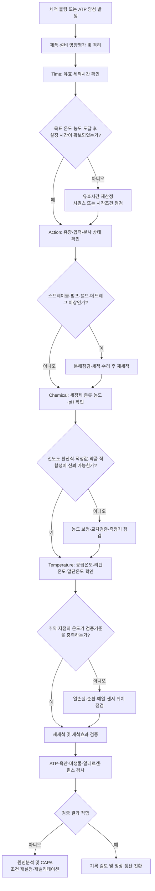

# [QA+ 블로그 생성 결과물] CIP TACT 4대조건
생성일시: 2026-09-20 06:50:39 (KST)
적용모델: gpt-5.6-terra

================================================================================
# 📋 [최종 발행용 블로그 패키지]

### 1. 메타 데이터 (SEO 설정)

- **최종 포스팅 제목**: CIP TACT 4대조건 완벽 정리｜온도·시간·농도·유속, 무엇부터 관리해야 할까?
- **메타 디스크립션 (120자 내외 요약)**: CIP 세척 불량 발생 시 약품 농도부터 올리기 전 확인해야 할 TACT 4대조건을 정리합니다. 시간·유속·세정제·온도 관리와 HACCP 검증 실무를 확인하세요.
- **추천 해시태그 (10개)**:  
  #CIP #CIP세척 #TACT4대조건 #식품품질관리 #식품안전 #HACCP #세척밸리데이션 #식품공장 #ATP검사 #FSSC22000
- **카테고리**: 식품품질실무 > HACCP·위생관리

---

## 2. 네이버 블로그 / 티스토리 복사용 최종 원고 (Markdown)

# CIP TACT 4대조건 완벽 정리: 온도·시간·농도·유속, 무엇부터 관리해야 할까?

> **20년 실무 선배의 한 줄 요약**  
> CIP는 “정해진 프로그램을 돌리는 일”이 아니라, 시간(Time)·작용력(Action)·화학작용(Chemical)·온도(Temperature)의 균형으로 세척효과를 증명하는 일입니다. 세척 불량이 생기면 약품부터 더 넣지 말고, TACT 순서대로 데이터를 확인해 원인을 좁혀보세요.

---

## 1. “CIP를 돌렸는데 왜 ATP가 나오죠?” 현장에서 진짜 많이 헷갈리는 이유

CIP가 정상 종료되었는데도 탱크 맨홀 주변이나 밸브 시트에서 ATP가 양성으로 나오는 경우가 있습니다. 자동운전 화면에는 온도도 정상이고 세정제 농도도 기준 안에 들어와 있는데, 현장 점검에서는 끈적임이나 잔류물이 발견되기도 합니다.

이때 많은 공장에서 “세척시간을 10분 늘릴까요?” 또는 “가성소다 농도를 조금 올릴까요?”부터 이야기합니다. 그런데 이 접근은 원인을 찾기보다 비용과 리스크만 키우는 경우가 많습니다.

CIP 세척은 약품을 단순히 순환시키는 공정이 아닙니다. 세정액이 오염물에 충분히 닿아야 하고, 오염물을 떼어낼 물리적 힘이 있어야 하며, 오염물 성상에 맞는 화학작용과 적절한 온도가 뒷받침되어야 합니다. 이 네 가지가 바로 **TACT 4대조건**입니다.

쉽게 말하면 설거지할 때 세제만 많이 넣는다고 눌어붙은 기름때가 깨끗해지지 않는 것과 같습니다.

특히 식품공장에서는 제품 특성이 세척 난이도를 크게 바꿉니다.

- 유지방과 단백질이 많은 유제품·크림소스
- 전분과 당류가 많은 소스·음료
- 색소와 점착성이 강한 양념류
- 알레르겐 함유 제품

같은 설비라도 제품이 달라지면 세척 부담도 달라집니다. 따라서 “다른 공장이 20분 세척하니까 우리도 20분이면 된다”는 논리는 심사나 사고 발생 시 방어 근거가 되기 어렵습니다.

또 하나 놓치기 쉬운 부분이 있습니다. CIP 화면에서 ‘완료’가 떴다는 것은 설정된 시퀀스가 종료됐다는 뜻이지, 설비 내부 모든 지점이 위생적으로 깨끗하다는 의미는 아닙니다.

펌프 성능 저하, 밸브 누설, 스프레이볼 막힘, 배관 데드레그, 가스켓 손상은 자동기록만 보고는 놓치기 쉽습니다. 그래서 CIP 관리는 데이터와 현장 확인을 반드시 함께 가져가야 합니다.


이제부터는 막연하게 “세척이 안 된다”고 표현하지 말고, TACT라는 문제해결 프레임으로 접근해 보겠습니다. 원인을 네 갈래로 나누면 재세척만 반복하던 문제도 훨씬 빨리 정리됩니다.

---

## 2. CIP TACT 4대조건이란? 세척력은 네 가지의 조합입니다

CIP는 **Cleaning In Place**의 약자로, 설비를 완전히 분해하지 않고 탱크·배관·열교환기·충전기 접액부 등을 내부 순환 방식으로 세척하는 시스템입니다.

작업자가 설비 안으로 들어가 닦기 어려운 구간을 세정액의 흐름과 화학작용으로 관리한다는 점에서 매우 효율적입니다. 다만 자동화되어 있다고 해서 세척 결과까지 자동으로 보증되는 것은 아닙니다. 설비 구조와 오염 특성에 따라 조건을 설계하고 검증해야 합니다.

TACT는 세척효과를 설명하는 대표적인 네 가지 요소의 앞글자를 딴 개념입니다.

- **Time**: 시간
- **Action**: 물리적 작용력
- **Chemical**: 화학작용
- **Temperature**: 온도

현장에서는 흔히 “온도·시간·농도·유속”으로 부르지만, 정확히 보면 Chemical에는 세정제의 종류·농도·pH가 포함되고, Action에는 유량·유속·압력·난류·분사 패턴이 포함됩니다.

즉, 단순한 숫자 네 개가 아니라 세척력을 만드는 네 개의 축이라고 이해하시면 됩니다.

| TACT 요소 | 현장 의미 | 무엇을 봐야 하나요? | 흔한 착각 |
|---|---|---|---|
| **Time** | 유효 세척 접촉시간 | 목표 온도·농도 도달 후 실제 순환시간 | CIP 전체 프로그램 시간이 곧 세척시간이라고 생각함 |
| **Action** | 유속·난류·분사 등 물리적 힘 | 펌프 유량, 압력, 스프레이볼 상태, 밸브 개도 | 화면상 유량만 정상이면 모든 구간이 세척된다고 생각함 |
| **Chemical** | 세정제의 종류·농도·pH | 전도도, 적정값, 약품 투입량, 세정제 적합성 | 농도만 높이면 무조건 세척이 좋아진다고 생각함 |
| **Temperature** | 반응 촉진 및 오염물 제거 효율 | 공급온도, 리턴온도, 말단부 온도 | 공급온도만 보면 충분하다고 생각함 |

TACT에서 가장 중요한 원칙은 **네 조건이 서로 보완될 수는 있어도, 검증 없이 임의로 상쇄해서는 안 된다**는 것입니다.

예를 들어 알칼리 세정 온도를 낮추면 약품 반응성이 떨어질 수 있고, 이를 시간 연장으로 보완할 수 있을지 여부는 실제 데이터로 확인해야 합니다. 반대로 세정제 농도를 올렸다고 세척시간을 바로 줄여도 되는 것은 아닙니다.

오염물 제거뿐 아니라 헹굼 부담, 약품 잔류, 설비 부식 가능성까지 함께 봐야 하기 때문입니다.

> 쉽게 말하면 TACT는 줄다리기와 비슷합니다. 네 명이 함께 줄을 당겨야 충분한 힘이 나오는데, 한 명이 빠졌다고 나머지 한 명에게 무조건 두 배 힘을 내라고 하면 균형이 깨집니다.

특히 Action, 즉 물리력은 현장에서 가장 자주 놓치는 요소입니다. 온도와 농도는 PLC 화면에 표시되지만, 실제 스프레이볼이 막혔는지, 말단 배관까지 난류가 형성되는지는 별도 확인이 필요합니다.

---

## 3. 법적 기준과 HACCP 심사에서 보는 핵심은 무엇일까요?

먼저 분명히 말씀드리면, 국내 법령이 모든 식품공장 CIP에 대해 “알칼리 세정은 반드시 몇 ℃, 몇 분, 몇 %”라고 일률적으로 숫자를 정해 놓은 것은 아닙니다.

제품 유형, 설비 재질, 오염물, 세정제 종류가 다르기 때문에 획일 기준을 적용하기 어렵기 때문입니다. 대신 법령과 HACCP 체계는 식품 제조시설과 기구·용기를 위생적으로 관리하고, 오염을 예방하며, 그 관리가 실제로 유효하다는 것을 보여줄 것을 요구합니다.

「식품위생법」 및 「식품위생법 시행규칙」은 식품 등의 위생적 취급과 영업장·시설의 위생관리 의무를 기본으로 둡니다. 또한 「식품 및 축산물 안전관리인증기준」의 선행요건관리에서는 다음 항목이 중요한 관리 대상이 됩니다.

- 세척·소독 관리
- 제조시설·설비 관리
- 화학물질 관리
- 기록관리 및 개선조치

쉽게 말하면 심사관은 “CIP를 돌렸습니까?”보다 아래 질문을 합니다.

> “왜 이 조건으로 돌리며, 이 조건이 실제로 유효하다는 증거가 있습니까?”

Codex Alimentarius의 **General Principles of Food Hygiene(CXC 1-1969)** 역시 식품 접촉표면과 설비를 효과적으로 세척·소독하고, 세척·소독 프로그램의 효과를 검증·검토해야 한다는 원칙을 제시합니다.

ISO/TS 22002-1 및 FSSC 22000의 PRP 관점에서도 세척·소독 절차의 문서화, 화학물질 관리, 설비 위생설계, 검증활동 및 변경관리가 중요합니다.

| 심사에서 주로 보는 항목 | 준비해야 할 증거 | 현장 대응 포인트 |
|---|---|---|
| 세척조건 설정 근거 | 세정제 공급사 자료, 초기 검증자료, 위험평가 | 타사 조건이 아니라 자사 설비 기준임을 설명 |
| TACT 모니터링 | 시간·온도·농도·유량 또는 압력 기록 | 자동기록의 저장·조회 가능 여부 확인 |
| 기준 이탈 시 조치 | 재세척, 격리, 원인분석, 재발방지 기록 | “재세척 실시”에서 끝나면 부족 |
| 세척효과 검증 | ATP, 미생물, 알레르겐, 육안, 린스 검사 | 검증 목적별 시험법을 구분 |
| 측정기기 신뢰성 | 온도계·전도도계·유량계 교정 또는 검증 이력 | 기준값만 있고 기기 관리가 없으면 지적 가능 |
| 설비 위생상태 | 분해점검, 가스켓·밸브·스프레이볼 점검표 | 사각지대와 고위험 부위의 주기 관리 |

심사 대응에서 가장 위험한 답변은 “원래부터 그렇게 했습니다”입니다.

오랫동안 사고 없이 운영한 경험은 참고 근거가 될 수 있지만, 설비 증설·제품 변경·세정제 변경·생산량 증가가 있었다면 기존 조건이 계속 유효하다는 보장은 없습니다.

특히 신규 CIP 설비를 도입했거나 배관 라인을 연장했다면 유속과 리턴온도 분포가 달라질 수 있으므로 재평가가 필요합니다.

법적 요구사항을 어렵게 생각할 필요는 없습니다. 핵심은 세 가지입니다.

1. **기준을 정한다.**
2. **정한 기준대로 운전됐는지 확인한다.**
3. **세척이 실제로 효과 있었는지 검증하고, 이탈 시 개선한다.**

이 세 줄이 표준서·기록·현장 실행에서 자연스럽게 연결되면 HACCP 심사 대응도 훨씬 편해집니다.

---

## 4. 세척 불량이 발생했을 때, TACT 순서대로 진단하는 방법

세척 불량이 생기면 우선 제품을 생산에 투입하기 전에 해당 설비와 마지막 생산품의 위험도를 판단해야 합니다.

알레르겐 전환 직후이거나 병원성 미생물 위험이 높은 제품, 비가열 제품에 사용하는 설비라면 더 보수적으로 접근해야 합니다. 문제 구간을 격리하고, 필요하면 재세척 및 추가 검증을 먼저 실시한 뒤 원인조사에 들어가야 합니다.

원인이 확인되지 않은 상태에서 “한 번 더 돌렸으니 괜찮다”고 종료하는 방식은 재발 가능성이 큽니다.

### ① Time: 유효 세척시간 확인

CIP 프로그램이 알칼리 세정 30분으로 설정되어 있어도, 시작 후 8분 동안 목표 온도에 도달하지 않았고 5분 동안 세정제 농도가 안정화되지 않았다면 실제 유효 세척시간은 30분이 아닐 수 있습니다.

트렌드 화면에서 다음 시각을 분리해서 확인하세요.

- 알칼리 세정 시작 시각
- 목표 농도 도달 시각
- 목표 공급온도 도달 시각
- 목표 리턴온도 도달 시각
- 세정 종료 시각

### ② Action: 유량·압력·분사 상태 확인

ATP가 탱크 상부, 맨홀, 교반축 주변, 밸브 시트처럼 특정 위치에서 반복적으로 나온다면 약품 농도보다 물리적 사각지대를 먼저 의심하는 편이 맞습니다.

다음 항목을 점검해야 합니다.

- 펌프 임펠러 마모
- 스트레이너 막힘
- 밸브 오개방
- 배관 누설
- 스프레이볼 노즐 막힘
- 스프레이볼 회전 불량
- 데드레그 및 분사 음영부

공급 측 압력이 정상이어도 실제 탱크 내 분사 패턴이 불량한 경우가 있으므로, 정기 분해점검과 필요 시 분사 확인시험이 필요합니다.

### ③ Chemical: 세정제 적합성과 실제 농도 확인

지방·단백질·유기물에는 일반적으로 알칼리 세정이 활용되고, 무기질 스케일에는 산 세정이 활용됩니다.

다만 세정제 종류와 농도는 반드시 다음 항목을 함께 검토해야 합니다.

- 세정제 공급업체 사용설명서
- 식품설비 적용 가능성
- 설비 재질 적합성
- 자사 검증 결과
- 세정제 농도-전도도 환산표
- 온도 보정 적용 여부
- 교정 또는 비교검증 이력

전도도계로 농도를 관리한다면 약품별 농도-전도도 환산표가 최신인지, 온도 보정이 적용되는지, 정기 교정 또는 비교검증이 이뤄지는지도 확인해야 합니다.

### ④ Temperature: 공급온도뿐 아니라 리턴온도 확인

공급온도가 목표값으로 유지돼도 설비 말단이나 리턴부의 온도가 충분히 오르지 않는다면, 열손실·순환 불량·대상 설비 예열 부족을 의심할 수 있습니다.

특히 아래 구간은 가장 불리한 지점이 어디인지 파악하는 것이 중요합니다.

- 배관이 긴 구간
- 외기 영향이 큰 구간
- 대형 탱크
- 열교환기 내부
- 충전기 말단부
- 보온이 취약한 배관 구간

무조건 온도를 올리는 것은 가스켓·패킹 손상, 화상 위험, 에너지비 상승, 일부 오염물의 고착 문제를 만들 수 있으니 주의해야 합니다.


### CIP TACT 트러블슈팅 흐름도



| 현상 | 우선 확인할 요소 | 현장 점검 포인트 | 즉시 조치 예시 |
|---|---|---|---|
| ATP가 특정 부위에서 반복 양성 | Action, Chemical | 스프레이볼, 유량, 밸브 시트, 가스켓, 농도 | 해당 부위 분해점검 후 재세척·재검사 |
| 미생물 결과가 간헐적으로 불안정 | Temperature, Action | 리턴온도, 펌프 편차, 데드레그, 밸브 누설 | 운전 트렌드 비교 및 고위험 지점 스와브 |
| 세척 후 산패취·잔향 발생 | Time, Chemical, 헹굼 | 세정제 적합성, 헹굼수량, 최종 린스 | 헹굼 조건 재확인 및 린스 pH·전도도 확인 |
| 세정제 사용량이 갑자기 증가 | Chemical, 설비상태 | 자동투입기, 누액, 회수탱크, 전도도계 | 투입 밸브·계량펌프 점검, 약품 재고 대조 |
| CIP는 완료됐는데 탱크 일부 오염 | Action | 분사 압력, 노즐 막힘, 음영부, 교반기 주변 | 스프레이볼 분해세척·교체, 분사범위 평가 |
| 헹굼수 pH·전도도 이상 | Chemical, Time | 헹굼시간, 급수량, 밸브 시퀀스 | 추가 헹굼 및 밸브 누설·시퀀스 확인 |

---

## 5. CIP 조건은 어떻게 설정하고 밸리데이션해야 할까요?

CIP 세척조건 설정의 출발점은 “우리 공장에서 가장 세척이 어려운 조건이 무엇인가?”를 정하는 것입니다.

다음과 같은 조건을 우선 검토해야 합니다.

- 가장 점도가 높은 제품
- 유지방·단백질이 많은 제품
- 색소가 강한 제품
- 알레르겐 함유 제품
- 생산 후 방치시간이 긴 조건
- 설비 말단 또는 세척 취약부가 포함된 조건

세척이 쉬운 맑은 음료만 기준으로 잡고, 점착성 소스나 크림 제품까지 같은 조건으로 관리하면 나중에 문제가 생길 가능성이 높습니다. 밸리데이션은 가장 불리한 조건을 포함해야 의미가 있습니다.

실무적으로는 세정제 공급업체의 권장 조건을 초기 출발점으로 삼을 수 있습니다. 하지만 그것이 곧 자사 검증 완료를 의미하지는 않습니다.

설비 용량, 배관 길이, 탱크 형상, 스프레이 장치, 펌프 성능, 제품 특성, 물의 경도, 생산 스케줄이 다르면 실제 세척 결과도 달라집니다.

따라서 권장 조건을 적용한 뒤 자사 설비에서 시간·온도·농도·유량 데이터를 확보하고, 세척 후 검증 결과로 적합성을 확인해야 합니다.

검증 항목은 목적별로 나눠 설계하는 것이 좋습니다.

| 검증 목적 | 활용 가능한 확인 방법 | 유의사항 |
|---|---|---|
| 유기물 잔류 확인 | ATP 검사, 육안점검 | ATP 음성만으로 모든 위험을 보증할 수 없음 |
| 미생물학적 위생 확인 | 표면 스와브, 린스 미생물 검사 | 비가열·고위험 공정에서 중요 |
| 알레르겐 교차오염 관리 | 해당 알레르겐 전용 검사법 | 전환 품목과 위험평가 기준 반영 |
| 세정제 헹굼 확인 | 최종 헹굼수 pH·전도도 등 | 자사 관리기준과 세정제 특성 반영 |
| 설비 건전성 확인 | 분해점검, 밸브·가스켓·스프레이볼 점검 | 자동기록만으로 확인 불가한 항목 존재 |

변경관리는 특히 중요합니다.

- 세척시간을 30분에서 20분으로 단축
- 알칼리 세정제 농도 변경
- 세정제 공급업체 또는 제품 변경
- 펌프 교체
- 배관 증설
- 탱크 또는 충전기 개조
- 생산량 및 제품군 변경

위 항목은 모두 세척조건 변경으로 볼 수 있습니다. 변경 전후에는 CIP 트렌드, ATP, 미생물 또는 린스 결과, 육안점검, 초기 생산품의 품질·미생물 결과를 비교하는 검증시험이 필요합니다.

> **★ 20년 선배의 실무 팁**  
> 밸리데이션 자료를 거창한 보고서로만 생각하지 마세요. “어떤 최악 조건에서, 어떤 TACT 기준으로, 어떤 항목을 검사했고, 결과가 어떠했으며, 이탈 시 무엇을 했는지”가 연결되면 됩니다.  
> 단, 시험일·설비번호·제품명·로트·측정기기·판정기준이 빠지면 나중에 심사에서 증거력이 떨어집니다.


---

## 6. 실제 현장 사례로 보는 CIP TACT 적용법

### 사례 1. 냉동만두 제조공장: 만두소 배합탱크에서 ATP가 반복 양성

냉동만두 제조공장의 만두소 배합탱크에서 CIP 후 맨홀 주변과 교반축 하부의 ATP 값이 반복적으로 관리기준을 초과했습니다.

해당 공장은 알칼리 세정 25분, 온수 헹굼, 산 세정, 최종 헹굼으로 구성된 자동 CIP를 운영하고 있었고, 화면상 온도와 전도도는 모두 정상 범위였습니다.

처음에는 돼지고기와 지방 함량이 높은 만두소 때문이라고 보고 알칼리 세정제 농도를 상향하려 했습니다. 그러나 위치별 ATP 결과를 다시 비교해 보니 탱크 벽면은 양호하고 맨홀 안쪽과 교반축 주변만 반복적으로 양성이 나왔습니다.

원인 분석 결과, 핵심 문제는 Chemical보다 **Action 부족**이었습니다.

- 스프레이볼 일부 노즐에 미세한 이물과 스케일이 축적됨
- 분사 패턴이 한쪽으로 치우침
- 맨홀 림과 교반축 하부가 분사 음영부가 됨
- CIP 펌프 스트레이너 청소 주기가 불명확함
- 생산일자별 유량이 미세하게 흔들림

즉, 화면상 전체 유량은 기준 안에 있었지만 탱크 내부 모든 부위에 동일한 물리력이 전달되지 않았던 것입니다.

개선조치로 스프레이볼을 분해세척하고, 노즐 상태와 회전 여부를 주간 점검항목으로 추가했습니다. 펌프 스트레이너는 기존 월 1회 점검에서 주 1회 점검으로 강화했고, 탱크 맨홀·교반축 주변은 월 1회 분해점검과 ATP 확인을 실시하도록 표준서를 개정했습니다.

알칼리 농도는 기존 조건을 유지한 채, 목표 온도와 농도 도달 후의 유효 세척시간이 실제로 25분 확보되도록 프로그램 시작 기준도 수정했습니다.

조치 후 4주간의 ATP 추세와 육안점검 결과가 안정화되었고, 불필요한 약품 농도 상향 없이 문제를 해결할 수 있었습니다.

---

### 사례 2. 소스류 제조공장: 세척 후에도 고추장 소스의 색과 잔향이 남은 문제

점도가 높은 고추장 베이스 소스를 생산하는 공장에서는 제품 전환 후 탱크와 이송배관에서 색 잔류와 매운 향이 남는 문제가 발생했습니다.

현장에서는 세척시간이 부족하다고 판단해 전체 CIP 시간을 15분 늘렸지만, 충전기 말단부에서 간헐적으로 잔향이 계속 확인됐습니다. ATP는 대부분 음성이었기 때문에 세척이 완료된 것으로 판단하기도 했습니다.

하지만 다음 제품이 백색 크림소스였기 때문에 색소와 향미의 교차오염 가능성을 가볍게 볼 수 없는 상황이었습니다.

조사 과정에서 CIP 데이터는 공급온도만 관리하고 있었으며, 충전기 말단의 리턴온도는 별도로 확인하지 않는다는 점이 발견됐습니다.

배관 말단까지 거리가 길고 보온 상태가 좋지 않아 공급부는 기준온도에 도달해도 말단 리턴온도는 낮은 상태로 유지되는 날이 있었습니다.

또한 고점도 소스의 생산 종료 후 CIP 시작까지 대기시간이 길어지면서 소스가 건조·고착되는 경우도 있었습니다.

원인은 단순한 시간 부족이 아니라 **Temperature와 Time의 실제 유효성 부족**, 그리고 제품 잔류 특성을 고려하지 않은 운전 방식이었습니다.

개선조치로 다음을 적용했습니다.

- 생산 종료 후 CIP 시작 허용시간 설정
- 허용시간 초과 시 사전 린스 강화
- 충전기 말단 리턴온도 추가 모니터링
- 공급온도와 리턴온도가 모두 기준 도달 후 유효 세척시간 계산
- ATP 외 색 잔류 육안점검 및 초기 생산품 관능 확인 병행

그 결과 전체 세척시간을 무작정 늘리는 대신, 실제 취약 지점의 조건을 맞추는 방식으로 잔향과 색소 교차오염 우려를 줄일 수 있었습니다.

---

### 사례 3. RTD 음료 제조공장: 미생물 결과가 특정 요일에만 흔들린 문제

혼합음료를 생산하는 한 공장에서는 월요일 첫 생산품의 일반세균 결과가 다른 요일보다 높게 나오는 경향이 있었습니다.

평일 매일 CIP를 실시했고, 자동기록상 알칼리 농도와 세정온도는 기준 안에 있었기 때문에 원인을 찾기 어려웠습니다.

처음에는 원료 입고 문제나 작업자 위생 문제를 의심했지만, 원료와 작업자 환경검사에서는 뚜렷한 이상이 발견되지 않았습니다. 결국 주말 생산 중단 이후 재가동되는 설비의 상태를 중심으로 조사했습니다.

조사 결과, 회수탱크의 세정액 농도는 전도도계 기준으로 정상처럼 보였지만, 전도도계의 비교검증 이력이 오래되어 실제 농도와 차이가 발생할 가능성이 있었습니다.

더 큰 문제는 주말 동안 일부 밸브 시트에서 미세 누설이 발생해 정체구간이 형성되고, 월요일 CIP 시 해당 구간의 순환력이 충분하지 않을 수 있다는 점이었습니다.

또한 열교환기 라인의 리턴유량이 주말 후 첫 CIP에서 낮게 나타나는 패턴도 확인됐습니다.

즉, 이 사례는 Chemical 측정 신뢰성과 Action의 설비 건전성이 동시에 얽힌 문제였습니다.

개선조치로 다음을 실시했습니다.

- 전도도계를 표준용액 및 적정법으로 교차확인
- 농도 환산식 재정비
- 교정 및 일상점검 기준 문서화
- 밸브 시트 분해점검 및 마모 씰 교체
- 주말 후 첫 CIP 리턴유량·리턴온도 확인 강화
- 월요일 첫 생산품 미생물 모니터링 강화

이후 특정 요일에 집중되던 미생물 편차가 감소했고, “CIP 기록이 정상인데 왜 결과가 흔들리지?”라는 문제를 데이터 신뢰성과 설비 사각지대 관점에서 해결할 수 있었습니다.

---

## 7. 심사관이 자주 지적하는 CIP 관리의 빈틈

### 1) 시간·온도·농도만 있고 Action 기준이 없는 경우

유량계가 있다면 유량 관리기준과 이탈 기준을 정할 수 있어야 합니다. 압력으로 관리한다면 어느 위치의 압력을 어떤 목적에서 보는지 설명할 수 있어야 합니다.

탱크 세척이라면 아래 내용도 함께 관리되어야 합니다.

- 스프레이볼 사양
- 스프레이볼 점검주기
- 막힘 확인 방법
- 분사 상태 확인 방법
- 사각지대 관리방법

“펌프가 돌아가니까 문제없다”는 설명은 충분하지 않습니다.

### 2) 최초 조건 설정 근거가 불명확한 경우

세정제 공급업체의 권장조건만 파일로 보관하고, 자사 설비에서 실제로 확인한 ATP·미생물·육안점검·린스 결과가 없다면 심사 시 약점이 됩니다.

특히 다음 변경 후 예전 자료만 적용하는 경우가 많습니다.

- 신설 라인 도입
- 제품 변경
- 배관 증설
- 세정제 변경
- 생산량 증가
- 펌프 및 주요 부품 교체

조건은 한 번 정하면 영원히 고정되는 것이 아니라, 변경이 발생할 때마다 유효성을 재검토해야 하는 관리 대상입니다.

### 3) 자동운전 기록은 풍부한데 이탈 시 조치가 연결되지 않는 경우

예를 들어 목표온도 미도달 알람이 있었는데도 생산을 진행했고, 재세척 여부나 제품 영향평가가 기록되지 않았다면 문제가 됩니다.

이탈기록에는 최소한 다음 내용이 남아야 합니다.

- 발생일시
- 설비명 또는 설비번호
- 이탈 내용
- 관련 제품 및 제품 영향평가
- 즉시조치
- 원인분석
- 재발방지조치
- 효과확인 결과

“알람 확인 후 정상화됨” 한 줄로 끝내기에는 식품안전 관리 증거가 부족합니다.

### 4) 검증을 ATP 하나로만 끝내는 경우

ATP는 빠르고 편리하지만 유기물 잔류 확인에 강점이 있는 도구이지, 모든 위험을 포괄하는 만능 시험은 아닙니다.

- 알레르겐 전환 관리: 알레르겐 검사
- 비가열 제품의 미생물 위험: 표면 스와브 또는 린스 미생물 검사
- 약품 헹굼 확인: 최종 헹굼수 관리
- 설비 건전성 확인: 정기 분해점검

이런 빈틈은 서류를 더 많이 만든다고 해결되지는 않습니다. 표준서의 기준, PLC 데이터, 현장 점검표, 검증 결과, 이탈조치 기록이 한 줄로 이어져야 합니다.

---

## 8. CIP TACT 관련 자주 묻는 질문(FAQ)

### Q1. TACT 4대조건 중 가장 중요한 것은 무엇인가요?

**A.** 하나만 고르기는 어렵습니다. 제품 특성, 오염 종류, 설비 구조에 따라 취약한 조건이 달라지기 때문입니다.

다만 현장에서는 온도와 농도는 화면으로 확인하면서도 유량·분사 상태를 놓치는 경우가 많습니다. 따라서 ATP가 특정 위치에서 반복된다면 Action부터 확인해 보시는 것을 권합니다.

### Q2. 세척시간을 줄여도 되나요?

**A.** 줄일 수는 있지만, 생산성 향상만을 이유로 임의 단축하면 안 됩니다.

목표 온도·농도 도달 후 유효시간이 얼마인지 먼저 확인하고, 변경 전후 ATP·미생물·육안점검·초기 생산품 결과를 비교해 세척효과가 유지됨을 검증해야 합니다.

특히 고점도 제품이나 알레르겐 함유 제품은 더 보수적으로 접근해야 합니다.

### Q3. ATP 검사 음성이면 CIP 밸리데이션은 끝난 것 아닌가요?

**A.** 아닙니다. ATP는 유기물 오염의 신속 확인에는 유용하지만, 미생물학적 안전성·알레르겐 제거·세정제 잔류 여부를 단독으로 보증하지는 않습니다.

검증 목적에 따라 ATP, 미생물 스와브 또는 린스, 알레르겐 검사, 최종 헹굼수 확인을 조합해야 합니다.

### Q4. CIP 세정제 농도는 전도도계만으로 관리해도 되나요?

**A.** 전도도계는 매우 실용적인 관리수단이지만, 해당 세정제와 온도 조건에서 유효한 농도 환산식이 있어야 합니다.

정기 교정 또는 적정법과의 비교검증, 센서 세척, 이탈 시 조치 기준까지 갖춰야 신뢰성 있는 관리가 됩니다. 세정제 공급업체의 관리방법과 자사 표준서를 일치시키는 것도 중요합니다.

### Q5. 자동 CIP 설비인데 현장 분해점검까지 해야 하나요?

**A.** 필요합니다. 자동기록은 설정된 밸브 시퀀스와 시간·온도·농도 등의 이행 여부를 보여주지만, 가스켓 손상, 밸브 시트 오염, 스프레이볼 막힘, 설비 미세누설 같은 문제는 현장점검 없이는 발견하기 어렵습니다.

모든 부위를 매일 분해할 필요는 없지만, 위험도에 따라 정기 점검주기와 점검범위를 정해 운영해야 합니다.

### Q6. 공급온도는 정상인데 리턴온도가 낮습니다. 바로 세척 불량인가요?

**A.** 바로 부적합이라고 단정할 수는 없지만, 중요한 경고 신호로 봐야 합니다.

말단부 열손실, 유량 부족, 설비 예열 부족, 온도센서 위치 문제 등을 확인하고, 실제 세척 취약부의 ATP·미생물·육안 결과와 연결해 평가해야 합니다.

공급온도만으로 세척력을 판단하면 가장 불리한 지점을 놓칠 수 있습니다.

---

## 9. 현장에서 바로 쓰는 CIP TACT 단계별 체크리스트

아래 체크리스트는 모든 공장에 동일하게 적용되는 법정 수치표가 아닙니다.

자사 표준서와 세정제 공급업체 권장사항, 설비 조건, 밸리데이션 결과를 기준으로 빈칸을 채워 운영하시면 됩니다.

중요한 것은 체크리스트를 만들고 끝내는 것이 아니라, 이탈 시 실제로 조치하고 결과를 남기는 것입니다.

| 점검 단계 | 점검 항목 | 자사 관리기준 예시 | 확인 방법 | 이탈 시 조치 |
|---|---|---|---|---|
| 생산 전 | 전회 생산품 및 알레르겐 여부 | 고위험 품목 전환 여부 확인 | 생산계획·배합기록 확인 | 강화 세척 또는 추가 검증 결정 |
| 생산 종료 후 | CIP 시작 지연시간 | 자사 허용시간 이내 | 생산종료·CIP 시작시각 비교 | 초과 시 사전 린스 등 추가조치 |
| 알칼리 세정 | 목표 농도 도달 여부 | 자사 설정 전도도 또는 적정값 | 전도도계·적정 기록 | 농도 보정 후 유효시간 재산정 |
| 알칼리 세정 | 공급·리턴온도 | 자사 검증온도 이상 | PLC 트렌드·현장계기 | 미도달 시 재세척 또는 원인점검 |
| 알칼리 세정 | 유효 세척시간 | 목표 조건 도달 후 설정시간 | 트렌드 시작·종료시각 확인 | 부족분 보완 후 재검증 |
| 물리력 | 유량·압력·분사 상태 | 설비별 설정 기준 | 유량계·압력계·분사점검 | 펌프·필터·스프레이볼 점검 |
| 최종 헹굼 | pH·전도도·외관 | 자사 린스 관리기준 | 린스 측정 및 육안 확인 | 추가 헹굼, 밸브 누설 확인 |
| 세척 후 검증 | ATP·스와브·알레르겐 | 위험도별 판정기준 | 지정 위치 검사 | 재세척, 제품영향 평가 |
| 정기점검 | 밸브·가스켓·스프레이볼 | 월간 또는 위험도별 주기 | 분해점검표 | 세척·교체·원인분석 |
| 기록관리 | 이탈 및 개선조치 | 누락 없이 작성 | 기록 검토 | CAPA 완료·효과확인 |

체크리스트를 운영할 때는 점검 위치를 구체적으로 정하는 것이 좋습니다.

“탱크 내부 ATP 측정”이라고만 쓰면 담당자마다 측정 위치가 달라져 추세 비교가 어려워집니다.

예를 들면 다음과 같이 고위험 위치를 지정할 수 있습니다.

- 맨홀 림 안쪽 6시 방향
- 교반축 하부
- 탱크 상부 음영부
- 밸브 시트 접액부
- 충전기 1번 노즐 접액부
- 배관 말단 샘플링 포인트

또한 관리기준은 너무 많아도 현장에서 지켜지지 않습니다.

- 매 회차 자동으로 확인 가능한 항목
- 일일 확인이 필요한 항목
- 주간 점검 항목
- 월간 분해점검 항목

으로 나눠 운영해 보세요. 현장 실행이 가능한 수준으로 설계해야 기록도 살아 있고, 심사 때도 담당자가 자신 있게 설명할 수 있습니다.

---

## 10. 맺음말: CIP 관리는 TACT를 외우는 일이 아니라 세척효과를 증명하는 일입니다

오늘 내용은 길었지만, 실무에서는 아래 세 가지만 기억하셔도 방향을 잡을 수 있습니다.

1. **CIP 세척력은 시간(Time), 작용력(Action), 화학작용(Chemical), 온도(Temperature)의 조합으로 결정됩니다.**
2. **세척시간·약품농도·온도·유량 중 하나를 바꾸면, 반드시 세척효과가 유지되는지 검증해야 합니다.**
3. **자동 CIP 완료기록만 보지 말고, 육안점검·ATP·미생물·알레르겐·헹굼 확인을 목적에 맞게 조합해야 합니다.**

CIP는 설비가 자동으로 수행하는 공정이지만, 기준을 설계하고 데이터를 읽고 이상을 발견하는 일은 결국 사람이 합니다.

세척 불량이 발생했을 때 “약품을 더 넣을까?”부터 고민하지 마시고, **Time → Action → Chemical → Temperature** 순서로 차분히 보세요.

막연했던 문제도 데이터와 현장 확인을 연결하면 충분히 원인을 좁혀갈 수 있습니다.

---

## 3. 워드프레스 / 웹사이트용 HTML 원고

```html
<article class="food-qa-post">
  <header>
    <h1>CIP TACT 4대조건 완벽 정리: 온도·시간·농도·유속, 무엇부터 관리해야 할까?</h1>
    <p class="lead"><strong>20년 실무 선배의 한 줄 요약:</strong> CIP는 정해진 프로그램을 돌리는 일이 아니라, 시간(Time)·작용력(Action)·화학작용(Chemical)·온도(Temperature)의 균형으로 세척효과를 증명하는 일입니다.</p>
  </header>

  <section>
    <h2>1. “CIP를 돌렸는데 왜 ATP가 나오죠?” 현장에서 진짜 많이 헷갈리는 이유</h2>
    <p>CIP가 정상 종료되었는데도 탱크 맨홀 주변이나 밸브 시트에서 ATP가 양성으로 나오는 경우가 있습니다. 자동운전 화면에는 온도와 세정제 농도가 정상으로 표시되지만, 현장 점검에서는 끈적임이나 잔류물이 발견되기도 합니다.</p>
    <p>이때 세척시간이나 약품 농도부터 올리기보다, 세척력을 만드는 <strong>TACT 4대조건</strong>을 순서대로 확인해야 합니다. 세정액의 접촉시간, 물리적 작용력, 세정제의 화학작용, 적정 온도가 모두 확보되어야 세척효과를 설명할 수 있습니다.</p>

    <figure>
      
      <figcaption>자동 CIP 완료기록과 실제 세척 결과는 다를 수 있으므로 현장 확인이 필요합니다.</figcaption>
    </figure>

    <p>CIP 완료 화면은 설정된 시퀀스가 끝났다는 뜻이지, 설비의 모든 지점이 위생적으로 깨끗하다는 의미는 아닙니다. 펌프 성능 저하, 밸브 누설, 스프레이볼 막힘, 배관 데드레그, 가스켓 손상은 자동기록만으로 놓치기 쉽습니다.</p>
  </section>

  <section>
    <h2>2. CIP TACT 4대조건이란? 세척력은 네 가지의 조합입니다</h2>
    <p>CIP는 Cleaning In Place의 약자로, 설비를 완전히 분해하지 않고 탱크·배관·열교환기·충전기 접액부 등을 내부 순환 방식으로 세척하는 시스템입니다.</p>

    <table>
      <thead>
        <tr>
          <th>TACT 요소</th>
          <th>현장 의미</th>
          <th>무엇을 봐야 하나요?</th>
          <th>흔한 착각</th>
        </tr>
      </thead>
      <tbody>
        <tr>
          <td><strong>Time</strong></td>
          <td>유효 세척 접촉시간</td>
          <td>목표 온도·농도 도달 후 실제 순환시간</td>
          <td>CIP 전체 프로그램 시간이 곧 세척시간이라고 생각함</td>
        </tr>
        <tr>
          <td><strong>Action</strong></td>
          <td>유속·난류·분사 등 물리적 힘</td>
          <td>펌프 유량, 압력, 스프레이볼 상태, 밸브 개도</td>
          <td>화면상 유량만 정상이면 모든 구간이 세척된다고 생각함</td>
        </tr>
        <tr>
          <td><strong>Chemical</strong></td>
          <td>세정제의 종류·농도·pH</td>
          <td>전도도, 적정값, 약품 투입량, 세정제 적합성</td>
          <td>농도만 높이면 무조건 세척이 좋아진다고 생각함</td>
        </tr>
        <tr>
          <td><strong>Temperature</strong></td>
          <td>반응 촉진 및 오염물 제거 효율</td>
          <td>공급온도, 리턴온도, 말단부 온도</td>
          <td>공급온도만 보면 충분하다고 생각함</td>
        </tr>
      </tbody>
    </table>

    <p>TACT의 핵심은 네 조건이 서로 보완될 수는 있어도, <strong>검증 없이 임의로 상쇄해서는 안 된다</strong>는 점입니다. 농도 상승, 시간 단축, 온도 변경, 유량 변경은 모두 세척효과와 헹굼 부담, 설비 부식 가능성까지 함께 검토해야 합니다.</p>
  </section>

  <section>
    <h2>3. 법적 기준과 HACCP 심사에서 보는 핵심</h2>
    <p>국내 법령은 모든 식품공장 CIP에 대해 일률적인 시간·온도·농도 수치를 정해두지 않습니다. 대신 식품 제조시설과 기구·용기를 위생적으로 관리하고, 오염을 예방하며, 그 관리가 실제로 유효하다는 것을 보여줄 것을 요구합니다.</p>
    <p>「식품위생법」 및 「식품위생법 시행규칙」, 「식품 및 축산물 안전관리인증기준」의 선행요건관리 관점에서 세척·소독 관리, 설비 관리, 화학물질 관리, 기록 및 개선조치는 중요한 관리 항목입니다.</p>
    <p>심사에서는 “CIP를 돌렸는가?”보다 “왜 이 조건으로 운전하며, 그 조건이 실제로 유효하다는 증거가 있는가?”를 확인합니다.</p>
  </section>

  <section>
    <h2>4. 세척 불량 발생 시 TACT 순서대로 진단하는 방법</h2>

    <h3>Time: 유효 세척시간 확인</h3>
    <p>알칼리 세정이 30분으로 설정되어 있어도 목표 온도와 목표 농도에 도달하기 전 시간이 포함되어 있다면 실제 유효 세척시간은 30분이 아닐 수 있습니다. 시작 시각, 목표 농도 도달 시각, 공급·리턴온도 도달 시각, 종료 시각을 분리해 확인해야 합니다.</p>

    <h3>Action: 유량·압력·분사 상태 확인</h3>
    <p>ATP가 특정 위치에서 반복 양성이라면 스프레이볼 막힘, 펌프 성능 저하, 스트레이너 막힘, 밸브 오개방, 배관 누설, 데드레그와 같은 물리적 사각지대를 우선 점검해야 합니다.</p>

    <h3>Chemical: 세정제 적합성과 실제 농도 확인</h3>
    <p>세정제 종류와 농도는 공급업체 사용설명서, 설비 재질 적합성, 자체 검증 결과를 함께 검토해야 합니다. 전도도계 관리 시에는 약품별 농도-전도도 환산식, 온도 보정, 교정 및 적정법 비교검증 이력이 필요합니다.</p>

    <h3>Temperature: 공급온도뿐 아니라 리턴온도 확인</h3>
    <p>공급온도가 정상이어도 말단부와 리턴부 온도가 충분하지 않다면 열손실, 순환 불량, 설비 예열 부족을 의심해야 합니다.</p>

    <figure>
      
      <figcaption>세척 불량은 Time → Action → Chemical → Temperature 순으로 확인합니다.</figcaption>
    </figure>

    <table>
      <thead>
        <tr>
          <th>현상</th>
          <th>우선 확인할 요소</th>
          <th>현장 점검 포인트</th>
          <th>즉시 조치 예시</th>
        </tr>
      </thead>
      <tbody>
        <tr>
          <td>ATP가 특정 부위에서 반복 양성</td>
          <td>Action, Chemical</td>
          <td>스프레이볼, 유량, 밸브 시트, 가스켓, 농도</td>
          <td>해당 부위 분해점검 후 재세척·재검사</td>
        </tr>
        <tr>
          <td>미생물 결과가 간헐적으로 불안정</td>
          <td>Temperature, Action</td>
          <td>리턴온도, 펌프 편차, 데드레그, 밸브 누설</td>
          <td>운전 트렌드 비교 및 고위험 지점 스와브</td>
        </tr>
        <tr>
          <td>세척 후 산패취·잔향 발생</td>
          <td>Time, Chemical, 헹굼</td>
          <td>세정제 적합성, 헹굼수량, 최종 린스</td>
          <td>헹굼 조건 재확인 및 린스 pH·전도도 확인</td>
        </tr>
      </tbody>
    </table>
  </section>

  <section>
    <h2>5. CIP 조건 설정과 밸리데이션 방법</h2>
    <p>CIP 조건은 자사 공장에서 가장 세척이 어려운 조건을 기준으로 설정해야 합니다. 고점도 제품, 유지방·단백질이 많은 제품, 색소가 강한 제품, 알레르겐 함유 제품, 생산 후 방치시간이 긴 조건을 우선 검토합니다.</p>
    <p>세정제 공급업체의 권장 조건은 출발점일 뿐이며, 자사 설비의 배관 길이, 탱크 형상, 펌프 성능, 물의 경도, 제품 특성에 맞는 검증이 필요합니다.</p>

    <blockquote>
      <p><strong>실무 팁:</strong> 밸리데이션은 “어떤 최악 조건에서, 어떤 TACT 기준으로, 어떤 항목을 검사했고, 결과가 어떠했으며, 이탈 시 무엇을 했는지”가 연결되도록 구성해야 합니다. 시험일, 설비번호, 제품명, 로트, 측정기기, 판정기준도 빠지지 않아야 합니다.</p>
    </blockquote>

    <figure>
      
      <figcaption>ATP, 스와브, 린스 확인, 설비 점검 기록을 목적에 맞게 조합해 세척효과를 검증합니다.</figcaption>
    </figure>
  </section>

  <section>
    <h2>6. 실제 현장 사례로 보는 CIP TACT 적용법</h2>

    <h3>사례 1. 냉동만두 제조공장: 만두소 배합탱크 ATP 반복 양성</h3>
    <p>화면상 온도와 전도도는 정상 범위였지만 맨홀 안쪽과 교반축 주변에서 ATP 양성이 반복됐습니다. 분석 결과 스프레이볼 노즐의 이물·스케일, 분사 패턴 치우침, 스트레이너 점검주기 불명확이 원인이었습니다.</p>
    <p>스프레이볼 분해세척, 노즐 및 회전 상태 주간점검, 스트레이너 점검주기 강화, 고위험 부위 ATP 확인을 적용해 약품 농도 상향 없이 문제를 해결했습니다.</p>

    <h3>사례 2. 소스류 제조공장: 고추장 소스 색과 잔향 잔류</h3>
    <p>세척시간을 늘려도 충전기 말단부 잔향이 남았습니다. 조사 결과 공급온도만 관리하고 리턴온도를 관리하지 않았으며, 긴 배관 구간의 열손실과 CIP 시작 지연으로 인한 제품 고착이 확인됐습니다.</p>
    <p>생산 종료 후 CIP 시작 허용시간 설정, 사전 린스 강화, 말단 리턴온도 추가 모니터링, 색 잔류 육안점검과 초기 생산품 관능 확인을 병행했습니다.</p>

    <h3>사례 3. RTD 음료 제조공장: 월요일 미생물 결과 편차</h3>
    <p>전도도계 비교검증 이력이 오래됐고, 주말 동안 일부 밸브 시트의 미세 누설로 정체구간이 형성됐습니다. 또한 주말 후 첫 CIP에서 리턴유량이 낮은 경향이 확인됐습니다.</p>
    <p>전도도계 환산식 재정비, 적정법 교차확인, 밸브 씰 교체, 월요일 첫 CIP의 리턴유량·리턴온도 확인 강화로 결과 편차를 낮췄습니다.</p>
  </section>

  <section>
    <h2>7. 심사관이 자주 지적하는 CIP 관리의 빈틈</h2>
    <ul>
      <li>시간·온도·농도 기준만 있고 Action 기준이 없는 경우</li>
      <li>세척조건의 최초 설정 근거와 자사 검증자료가 부족한 경우</li>
      <li>자동운전 이탈 발생 후 재세척, 제품 영향평가, CAPA가 연결되지 않는 경우</li>
      <li>ATP 검사 하나만으로 미생물·알레르겐·세정제 잔류까지 판단하는 경우</li>
    </ul>
    <p>표준서의 기준, PLC 데이터, 현장 점검표, 검증 결과, 이탈조치 기록이 한 줄로 연결되어야 합니다.</p>
  </section>

  <section>
    <h2>8. CIP TACT 관련 FAQ</h2>

    <h3>Q1. TACT 4대조건 중 가장 중요한 것은 무엇인가요?</h3>
    <p><strong>A.</strong> 하나만 고르기 어렵습니다. 다만 ATP가 특정 위치에서 반복된다면 화면 데이터만으로 확인하기 어려운 Action, 즉 유량·분사·난류 상태부터 확인하는 것이 효과적입니다.</p>

    <h3>Q2. 세척시간을 줄여도 되나요?</h3>
    <p><strong>A.</strong> 가능합니다. 다만 목표 온도와 농도 도달 후의 유효시간을 확인하고, 변경 전후 ATP·미생물·육안점검·초기 생산품 결과를 비교해 세척효과가 유지됨을 검증해야 합니다.</p>

    <h3>Q3. ATP 음성이면 CIP 밸리데이션이 끝난 것 아닌가요?</h3>
    <p><strong>A.</strong> 아닙니다. ATP는 유기물 잔류 확인에 유용하지만, 미생물학적 안전성·알레르겐 제거·세정제 잔류까지 단독으로 보증하지는 않습니다.</p>

    <h3>Q4. 세정제 농도는 전도도계만으로 관리해도 되나요?</h3>
    <p><strong>A.</strong> 전도도계는 유용하지만 세정제별 농도-전도도 환산식, 온도 보정, 정기 교정 또는 적정법 비교검증이 필요합니다.</p>

    <h3>Q5. 자동 CIP 설비인데 분해점검도 해야 하나요?</h3>
    <p><strong>A.</strong> 필요합니다. 가스켓 손상, 밸브 시트 오염, 스프레이볼 막힘, 미세 누설 등은 자동기록만으로 확인하기 어렵습니다.</p>

    <h3>Q6. 공급온도는 정상인데 리턴온도가 낮습니다. 바로 세척 불량인가요?</h3>
    <p><strong>A.</strong> 즉시 부적합이라고 단정할 수는 없지만 중요한 경고 신호입니다. 열손실, 유량 부족, 설비 예열 부족, 센서 위치 등을 확인하고 실제 취약부의 검증 결과와 함께 평가해야 합니다.</p>
  </section>

  <section>
    <h2>9. 현장에서 바로 쓰는 CIP TACT 단계별 체크리스트</h2>

    <table>
      <thead>
        <tr>
          <th>점검 단계</th>
          <th>점검 항목</th>
          <th>자사 관리기준 예시</th>
          <th>확인 방법</th>
          <th>이탈 시 조치</th>
        </tr>
      </thead>
      <tbody>
        <tr>
          <td>생산 전</td>
          <td>전회 생산품 및 알레르겐 여부</td>
          <td>고위험 품목 전환 여부 확인</td>
          <td>생산계획·배합기록 확인</td>
          <td>강화 세척 또는 추가 검증 결정</td>
        </tr>
        <tr>
          <td>생산 종료 후</td>
          <td>CIP 시작 지연시간</td>
          <td>자사 허용시간 이내</td>
          <td>생산종료·CIP 시작시각 비교</td>
          <td>초과 시 사전 린스 등 추가조치</td>
        </tr>
        <tr>
          <td>알칼리 세정</td>
          <td>목표 농도 도달 여부</td>
          <td>자사 설정 전도도 또는 적정값</td>
          <td>전도도계·적정 기록</td>
          <td>농도 보정 후 유효시간 재산정</td>
        </tr>
        <tr>
          <td>알칼리 세정</td>
          <td>공급·리턴온도</td>
          <td>자사 검증온도 이상</td>
          <td>PLC 트렌드·현장계기</td>
          <td>미도달 시 재세척 또는 원인점검</td>
        </tr>
        <tr>
          <td>물리력</td>
          <td>유량·압력·분사 상태</td>
          <td>설비별 설정 기준</td>
          <td>유량계·압력계·분사점검</td>
          <td>펌프·필터·스프레이볼 점검</td>
        </tr>
        <tr>
          <td>최종 헹굼</td>
          <td>pH·전도도·외관</td>
          <td>자사 린스 관리기준</td>
          <td>린스 측정 및 육안 확인</td>
          <td>추가 헹굼, 밸브 누설 확인</td>
        </tr>
        <tr>
          <td>세척 후 검증</td>
          <td>ATP·스와브·알레르겐</td>
          <td>위험도별 판정기준</td>
          <td>지정 위치 검사</td>
          <td>재세척, 제품영향 평가</td>
        </tr>
      </tbody>
    </table>
  </section>

  <footer>
    <h2>10. 맺음말: CIP 관리는 TACT를 외우는 일이 아니라 세척효과를 증명하는 일입니다</h2>
    <ol>
      <li>CIP 세척력은 시간(Time), 작용력(Action), 화학작용(Chemical), 온도(Temperature)의 조합으로 결정됩니다.</li>
      <li>세척시간·약품농도·온도·유량 중 하나를 바꾸면, 반드시 세척효과가 유지되는지 검증해야 합니다.</li>
      <li>자동 CIP 완료기록만 보지 말고, 육안점검·ATP·미생물·알레르겐·헹굼 확인을 목적에 맞게 조합해야 합니다.</li>
    </ol>
    <p>세척 불량이 발생했을 때 약품을 더 넣기 전에 <strong>Time → Action → Chemical → Temperature</strong> 순서로 데이터를 확인해 보세요. 데이터와 현장 확인을 연결하면 원인을 훨씬 빠르게 좁혀갈 수 있습니다.</p>
  </footer>
</article>
```
================================================================================

[부록: 1단계 리서치 원본]
# [리서치 리포트] CIP TACT 4대조건

### 1. 타겟 독자 및 검색 의도
- **주요 타겟**: 식품공장 품질관리(QC)·품질보증(QA) 담당자, 생산·공무 담당자, HACCP 팀원, CIP 설비 신규 도입 또는 세척 밸리데이션을 준비하는 관리자
- **독자의 핵심 고통(Pain Point)**:  
  - CIP 세척이 매일 돌아가는데도 “정말 깨끗하게 세척된 것인지” 객관적으로 설명하기 어려움  
  - 세척 불량, ATP 양성, 미생물 기준 이탈 발생 시 온도·시간·농도·유속 중 무엇을 먼저 조정해야 할지 모름  
  - 심사에서 CIP 세척조건의 설정 근거, 농도 관리, 세척효과 검증 자료를 요구받을 때 대응이 막막함  
  - 생산성 향상을 위해 세척시간이나 약품 농도를 줄이고 싶지만, 식품안전 리스크 없이 변경하는 방법이 불명확함
- **메인 키워드**: CIP TACT 4대조건
- **서브/연관 키워드**: CIP 세척조건, TACT 원리, CIP 세척 밸리데이션, CIP 농도 온도 시간 유속, 식품공장 세척관리, ATP 검사, CIP 세척 불량 원인

**검색 의도 분석**
- **정보 탐색형**: “CIP TACT가 무엇인가?”, “4가지 조건이 각각 어떤 역할을 하는가?”
- **실무 해결형**: “CIP 세척이 안 될 때 무엇을 확인해야 하는가?”, “농도·온도·시간은 어떻게 정하는가?”
- **심사 대응형**: “HACCP 심사에서 CIP 관련 어떤 자료를 보는가?”, “세척 밸리데이션은 어떻게 해야 하는가?”
- **개선·최적화형**: “세척시간을 줄여도 되는가?”, “세척약품 농도는 낮춰도 되는가?”

---

### 2. 필수 인용 법령 및 표준 기준

- **법적/표준 근거**
  1. **「식품위생법」 및 「식품위생법 시행규칙」**
     - 식품 등의 위생적 취급, 영업장 및 시설의 위생관리 의무에 관한 상위 법령입니다.
     - CIP 자체의 온도·시간·농도·유속을 숫자로 직접 규정하는 법령은 아니지만, 식품 제조시설 및 기구·용기 등의 청결한 관리와 오염 방지가 기본 요구사항입니다.
     - **공식 확인처**: 국가법령정보센터

  2. **「식품 및 축산물 안전관리인증기준」**
     - HACCP 적용업소는 선행요건관리 기준에 따라 영업장 관리, 위생관리, 세척·소독 관리, 제조시설 및 설비 관리 등을 운영해야 합니다.
     - CIP 설비를 운영하는 공장은 세척·소독 절차, 사용 약품, 관리 기준, 모니터링, 개선조치 및 기록을 자사 HACCP 시스템 안에서 관리할 필요가 있습니다.
     - 핵심은 “CIP를 가동했다”는 사실이 아니라, **설정된 세척 조건이 오염 제거에 유효하며 지속적으로 관리되고 있음을 입증하는 것**입니다.
     - **공식 확인처**: 국가법령정보센터, 한국식품안전관리인증원(HACCP)

  3. **식품의약품안전처 「식품안전관리인증기준(HACCP) 선행요건관리 관련 해설·평가 자료」**
     - 업종 및 시설 특성에 맞는 세척·소독 관리 기준, 세척도구 및 약품 관리, 기록관리 등의 실무적 해석에 활용할 수 있습니다.
     - 다만 세부 운영 방법은 제품 특성, 설비 구조, 오염 종류, 사용 세정제의 사용설명서 및 자체 검증 결과를 반영해야 합니다.

  4. **Codex Alimentarius, General Principles of Food Hygiene (CXC 1-1969)**
     - 식품 제조시설은 식품 접촉표면과 설비를 효과적으로 세척·소독하고, 세척 및 소독 프로그램의 효과를 검증·검토해야 한다는 국제적 원칙을 제시합니다.
     - HACCP의 기본 토대가 되는 위생관리 원칙으로, 수출 대응 또는 글로벌 기준 설명 시 인용하기 좋습니다.
     - **공식 확인처**: FAO/WHO Codex Alimentarius

  5. **ISO/TS 22002-1 또는 FSSC 22000의 PRP(선행요건프로그램) 요구사항**
     - 식품 제조업의 전제조건프로그램(PRP)에서는 세척 및 소독 프로그램, 화학물질 관리, 설비 위생설계, 검증 활동 등을 요구합니다.
     - FSSC 22000 인증 조직은 적용되는 PRP 표준과 FSSC 추가요구사항에 따라 세척·소독 프로그램의 문서화 및 실행 증거를 관리해야 합니다.
     - 인증 심사에서는 특히 세척절차의 현장 실행성, 세척 후 검증, 변경관리, 부적합 시 조치의 연결성을 확인하는 경향이 있습니다.

- **현장 실무 팩트**

  #### ① TACT란 무엇인가
  CIP의 세척효과는 일반적으로 다음 네 가지 인자의 조합으로 설명합니다.

  | 요소 | 영문 | 핵심 의미 | 현장 관리 예시 |
  |---|---|---|---|
  | 시간 | Time | 세정액이 오염물에 충분히 접촉하는 시간 | 알칼리 세정 20분, 산 세정 15분 등 |
  | 작용력 | Action | 유속·난류·충돌 등 물리적 세척력 | 펌프 유량, 배관 유속, 스프레이볼 분사 상태 |
  | 화학작용 | Chemical | 세정제 종류·농도·pH에 따른 오염 분해력 | 가성소다 농도, 질산·인산계 산 세정제 농도 |
  | 온도 | Temperature | 세정반응 촉진 및 오염물 제거 효율 | 알칼리 세정액 공급온도·리턴온도 |

  > 실무에서는 TACT를 네 개의 독립된 숫자가 아니라, **서로 보완하거나 상쇄될 수 있는 세척 변수의 조합**으로 이해해야 합니다.  
  > 예를 들어 온도를 낮추거나 약품 농도를 줄였다면, 시간·유속을 늘리는 것만으로 동일한 세척효과가 확보되는지 반드시 검증해야 합니다.

  #### ② TACT의 가장 중요한 원칙: “하나를 줄이면, 검증 없이 끝나지 않는다”
  - 세척시간 단축, 세정제 농도 변경, 온도 하향, 펌프·배관 변경은 모두 세척효과에 영향을 줄 수 있는 변경입니다.
  - “예전부터 이렇게 해왔다”, “다른 공장도 이 조건을 쓴다”는 것은 설정 근거가 될 수는 있어도 **자사 설비의 유효성 검증 근거를 대체하지 못합니다.**
  - 특히 제품 점도, 유지방·단백질·당류·전분 함량, 알레르겐, 색소, 탄화물, 미생물 위험도에 따라 최적 조건은 달라집니다.

  #### ③ 각 조건별 대표적인 관리 포인트
  - **Time(시간)**  
    - CIP 전체 운전시간이 아니라, 실제 세정액이 목표 온도·목표 농도에 도달한 뒤 설비 내부에 접촉하는 **유효 세척시간**을 관리해야 합니다.
    - 예: 알칼리 세정 시작 직후의 저온·저농도 구간까지 모두 “세척시간”으로 계산하면 실제 세척력이 과대평가될 수 있습니다.

  - **Action(작용력·물리력)**  
    - 배관 CIP에서는 보통 세정액이 충분한 난류를 형성할 수 있도록 유량·유속·압력 조건을 관리합니다.
    - 탱크 CIP에서는 스프레이볼 또는 회전식 세척장치의 분사 패턴, 압력, 회전 상태, 음영부(shadow area) 발생 여부가 중요합니다.
    - 유량계·압력계 이상, 펌프 성능 저하, 밸브 누설, 막힌 스프레이볼은 “조건값은 정상인데 세척은 안 되는” 대표 원인입니다.

  - **Chemical(화학작용)**  
    - 알칼리 세정은 일반적으로 지방·단백질·유기물 제거에 활용되며, 산 세정은 무기질 스케일 제거에 활용됩니다.
    - 세정제는 반드시 공급업체의 사용 조건, 식품용 설비 적용 가능 여부, 재질 적합성, 헹굼 조건을 검토해야 합니다.
    - 농도는 전도도, 적정, 굴절계 등 공장에 설정된 관리 방법으로 확인할 수 있으며, 측정기기의 교정 및 관리 기준도 필요합니다.

  - **Temperature(온도)**  
    - 온도는 세정반응과 오염물 용해에 영향을 주지만, 무조건 높인다고 좋은 것은 아닙니다.
    - 과도한 온도는 설비 가스켓·패킹 손상, 특정 오염물의 고착, 에너지 비용 증가, 작업안전 문제를 유발할 수 있습니다.
    - 관리 시에는 CIP 공급온도만 볼 것이 아니라, 가장 불리한 지점의 **리턴온도** 또는 말단부 온도도 함께 검토하는 것이 실무적으로 중요합니다.

  #### ④ 세척효과 검증은 “CIP 완료 신호”만으로 판단하지 않는다
  다음 항목을 조합하여 자사 제품·설비에 맞는 검증 체계를 구성할 수 있습니다.

  - 육안점검: 탱크 내부, 맨홀, 가스켓, 밸브 시트, 데드레그 우려 부위
  - ATP 검사: 유기물 잔류에 대한 신속 확인 도구
  - 미생물 검사: 표면 스와브, 린스(rinse) 검사 등
  - 알레르겐 검사: 품목 전환 또는 알레르겐 교차오염 관리가 필요한 경우
  - 세정액 농도·온도·유량·시간 데이터 확인
  - 최종 헹굼수의 전도도, pH, 잔류 세정제 관련 확인
  - 분해점검: 밸브, 가스켓, 충전기 접액부 등 CIP 사각지대 확인
  - 생산품 모니터링: 초기 생산품의 미생물·이화학·관능 결과 추적

  > ATP 음성만으로 미생물학적 안전성, 알레르겐 제거 또는 세정제 헹굼 완전성이 모두 보증되는 것은 아닙니다. 검증 목적에 맞는 시험법을 선택해야 합니다.

---

### 3. 추천 블로그 목차 (Outline)

- **H1 (제목 후보 3개)**  
  1. **CIP TACT 4대조건 완벽 정리: 온도·시간·농도·유속, 무엇부터 관리해야 할까?**  
  2. **식품공장 CIP 세척이 안 될 때: TACT 4대조건으로 원인 찾는 실무 가이드**  
  3. **HACCP 심사 전 꼭 점검할 CIP TACT: 세척조건 설정과 밸리데이션 방법**

- **H2 서론 (Intro): “CIP를 돌렸는데 왜 ATP가 나오죠?”**
  - 현장의 현실적인 질문으로 시작  
    - “CIP는 정상 종료됐는데 탱크 맨홀 주변에서 ATP가 계속 양성입니다.”  
    - “약품 농도도 맞고 온도도 맞는데, 왜 미생물 결과가 흔들릴까요?”  
    - “세척시간을 10분 줄여도 생산에 문제없을까요?”
  - 핵심 결론 먼저 제시  
    - CIP 세척은 단순히 약품을 순환시키는 공정이 아니라, **시간(Time), 물리적 작용력(Action), 화학작용(Chemical), 온도(Temperature)가 균형을 이루는 공정**이다.
    - 어느 하나의 조건만 맞아도 충분하지 않으며, 최종적으로는 자사 설비와 제품에 대해 세척효과를 검증해야 한다.
  - 독자에게 전달할 메시지  
    - “TACT는 외울 개념이 아니라, 세척 불량의 원인을 좁히는 현장 문제해결 프레임이다.”

- **H2 본론 1: CIP TACT 4대조건이란? — 세척력은 네 가지의 조합이다**
  - CIP(Cleaning In Place)의 정의와 적용 설비
    - 배관, 탱크, 열교환기, 충전기 접액부 등 분해 없이 내부를 세척하는 방식
  - TACT 4대조건 표로 설명
    - Time: 유효 세척시간
    - Action: 유속·난류·분사·압력
    - Chemical: 세정제 종류·농도·pH
    - Temperature: 세정액 온도 및 리턴온도
  - “TACT는 정답 숫자가 아니다”라는 점 강조
    - 제품, 오염물, 설비 구조, 세정제, 배관 길이, 재질에 따라 조건이 달라짐
    - 인터넷의 일반적인 권장값을 그대로 적용하는 위험성
  - HACCP 및 위생관리 관점의 연결
    - 세척·소독은 선행요건관리의 핵심
    - 설정 기준, 모니터링, 이탈 시 조치, 검증 기록을 갖추어야 함
  - 추천 시각자료
    - TACT 4요소를 원형 또는 사각형 인포그래픽으로 구성
    - “시간만 늘린다고 해결되지 않는 이유” 도식화

- **H2 본론 2: 20년 선배의 현장 실전 팁 — CIP 세척 불량은 이렇게 진단한다**
  - **실전 팁 1. 세척시간은 ‘프로그램 시간’이 아니라 ‘유효시간’을 봐야 한다**
    - 목표 온도·농도에 도달하기 전 구간과 실제 세척 구간을 분리해 확인
    - 자동 CIP 트렌드 데이터에서 확인해야 할 항목: 시작·종료 시점, 온도 상승곡선, 농도 안정화 시점, 리턴값
  - **실전 팁 2. 농도 이상이 없는데 세척이 안 되면 유량과 분사를 의심한다**
    - 펌프 성능 저하, 필터 막힘, 밸브 개도 오류, 스프레이볼 막힘·회전 불량, 배관 누설 확인
    - 특히 탱크 상부, 맨홀, 교반축 주변, 밸브 시트, 충전기 말단부는 사각지대가 되기 쉬움
  - **실전 팁 3. 온도는 공급온도와 리턴온도를 함께 본다**
    - 공급온도만 정상이고 리턴온도가 낮다면, 열손실·순환불량·세척 대상 설비의 예열 부족 가능성 검토
    - 온도계 위치, 센서 정확도, 기록 주기 확인
  - **실전 팁 4. 오염물 종류에 따라 세척전략을 바꾼다**
    - 지방·단백질·당류·전분·무기질 스케일은 제거 메커니즘이 다름
    - 동일한 CIP 프로그램을 모든 제품에 기계적으로 적용하지 말고, 고위험 품목·점착성 품목·알레르겐 함유 품목은 별도 평가
  - **실전 팁 5. 변경은 반드시 ‘작은 시험 + 검증’으로 관리한다**
    - 세척시간 단축, 세정제 변경, 농도 변경, 온도 변경, 설비 증설·개조 시 변경관리 실시
    - 변경 전후 비교 항목 예시  
      - CIP 운전 데이터  
      - ATP 결과  
      - 미생물 스와브 또는 린스 결과  
      - 알레르겐 검사 결과(해당 시)  
      - 초기 생산품의 품질·미생물 결과  
      - 현장 육안점검 결과
  - **트러블슈팅 표 제안**

    | 현상 | 우선 확인할 TACT 요소 | 현장 점검 포인트 |
    |---|---|---|
    | ATP가 반복 양성 | Action, Chemical | 유량, 스프레이볼, 세정제 농도, 사각지대 |
    | 세척 후 산패취·잔향 발생 | Time, Chemical, 헹굼 | 세정시간, 세정제 적합성, 최종 헹굼 상태 |
    | 미생물 결과가 간헐적으로 불안정 | Temperature, Action | 리턴온도, 유량 편차, 밸브 누설, 데드레그 |
    | 세정제 사용량이 급증 | Chemical, 설비 상태 | 약품 자동투입기, 전도도계, 누액, 회수탱크 관리 |
    | CIP는 정상 종료되나 탱크 일부 오염 | Action | 스프레이볼 압력·분사패턴, 탱크 구조, 교반기 주변 |
    | 헹굼수 pH·전도도 이상 | Chemical, Time | 헹굼시간, 급수량, 밸브 시퀀스, 세정제 잔류 |

- **H2 본론 3: FAQ 및 심사관 단골 지적 사항**
  - **FAQ 1. CIP TACT 중 가장 중요한 조건은 무엇인가요?**
    - 한 가지를 고를 수 없으며, 제품·오염물·설비별로 취약한 조건이 다릅니다.
    - 다만 현장에서는 “농도와 온도는 보지만 유량·분사 상태는 놓치는 경우”가 많으므로 Action 관리가 중요하다는 메시지 제시.

  - **FAQ 2. 세척시간을 줄여도 되나요?**
    - 가능 여부는 기존 세척조건의 검증 결과와 변경 후 재검증 결과에 따라 판단해야 합니다.
    - 생산성 개선만을 이유로 임의 단축하면 세척 불량과 교차오염 위험이 발생할 수 있습니다.

  - **FAQ 3. ATP 검사 결과가 음성이면 CIP 검증은 끝난 것인가요?**
    - 아닙니다.
    - ATP는 신속한 위생 상태 확인에 유용하지만, 미생물·알레르겐·세정제 잔류 등 모든 위험을 단독으로 평가하지는 못합니다.

  - **FAQ 4. CIP 세정제 농도는 어떤 방식으로 관리해야 하나요?**
    - 세정제 공급업체의 관리 방법과 자사 표준서에 따라 전도도, 적정, 굴절계 등 적합한 방법을 정합니다.
    - 중요한 것은 측정방법의 일관성, 관리기준 설정, 측정기기 교정, 이탈 시 조치입니다.

  - **FAQ 5. 자동 CIP인데도 현장 확인이 필요한가요?**
    - 필요합니다.
    - 자동 운전 기록은 조건 이행 여부를 보여주지만, 실제 분사 상태·누설·가스켓 오염·설비 손상 등은 현장 점검 또는 분해점검이 필요할 수 있습니다.

  - **심사관 단골 지적 사항 체크리스트**
    - CIP 세척 표준서에 시간·온도·농도 기준은 있으나, 유량·압력 또는 물리적 작용력 관리기준이 없음
    - 세척조건의 최초 설정 근거 또는 밸리데이션 자료가 없음
    - 자동 CIP 데이터는 있으나 기준 이탈 시 개선조치 기록이 없음
    - 세정제 농도 측정기기 또는 온도계의 교정·검증 이력이 불명확함
    - 탱크·밸브·가스켓·충전기 등 고위험 부위의 정기 점검 계획이 없음
    - ATP 결과만 보유하고, 미생물·알레르겐·헹굼 적절성에 대한 검증 전략이 없음
    - 제품 변경, 세정제 변경, 배관 증설 후 CIP 조건을 재검토하지 않음
    - 세척 불량 발생 시 원인분석이 “재세척 실시” 수준에서 끝나고 재발방지 조치가 없음

- **H2 결론 (Outro): CIP 관리는 TACT를 외우는 일이 아니라, 세척효과를 증명하는 일이다**
  - 핵심 요약
    1. CIP 세척력은 **시간·작용력·화학작용·온도**의 조합으로 결정된다.
    2. 네 조건 중 하나를 변경하면 나머지 조건과 세척효과에 미치는 영향을 검토해야 한다.
    3. 자동 CIP 기록만으로 충분하지 않으며, 육안점검·ATP·미생물·알레르겐·헹굼 확인 등 목적에 맞는 검증이 필요하다.
    4. HACCP 심사 대응의 핵심은 “정해진 프로그램을 돌렸다”가 아니라, “우리 공장의 세척조건이 유효하게 관리되고 있다”는 증거다.
  - 마무리 문구 제안  
    - “CIP는 설비가 하는 자동공정이지만, 기준을 설계하고 데이터를 읽고 이상을 발견하는 것은 결국 사람의 일입니다. TACT 4대조건을 기준으로 하나씩 점검하면, 막연했던 세척 불량도 충분히 원인을 좁혀갈 수 있습니다.”

[부록: 3단계 시각자료 기획 원본]
### 🎨 [시각자료 기획서]

#### 1. 대표 썸네일 (Thumbnail)
- **추천 헤드카피 문구**: **CIP 세척력, TACT 4가지만 보세요**
- **이미지 스타일**: Photorealistic documentary photography, real Korean food factory, QA+ 마스터 스타일
- **AI 이미지 프롬프트 (DALL-E / Flux용)**:

`Static locked-off camera, photorealistic DSLR photo, wide documentary view inside a real Korean food manufacturing facility showing a stainless steel CIP system connected to a process tank, visible sanitary pipes, pump, valves, return line and control cabinet, one secondary worker in a light blue one-piece hooded cleanroom coverall and face mask standing at the side with face fully obscured by mask, hood and camera angle, glossy green epoxy-coated concrete floor, bright overhead LED and fluorescent lighting 5000-5600K, 700 lux, stainless steel equipment with realistic decade-of-service wear, natural water marks and scratches, distant blurred blue-and-white laminate SOP notice board with unreadable content, balanced composition with clear empty space for headline overlay, static locked-off camera, photorealistic DSLR photo, documentary photography, high detail, 4K quality, no illustration, no cartoon, no vector, no infographic style, no 3D render, no CGI, no game engine look, no readable text or numbers inside the image, no logos, no brand names, no identifiable face, no exposed hair, no bare hands, no glossy showroom, no brand-new factory, no futuristic laboratory, no dramatic shadows, no haze or fog, no fisheye, no dutch angle, no identifiable face, no logos, no watermark, no readable foreground text --ar 16:9`

---

#### 2. 본문 이미지 1 (IMAGE_PLACEHOLDER_1 대체)
- **배치 위치**: 소제목 1 하단
- **기획 의도**: CIP 자동운전이 정상 종료된 상황과 실제 설비의 세척 취약부를 한 장면 안에서 대비합니다. 화면 속 글자를 강조하기보다, 전경의 탱크 맨홀 림·밸브 시트에 남은 잔류물과 배경의 정상 종료 상태를 시각적으로 보여주는 구도입니다.
- **AI 이미지 프롬프트**:

`Static locked-off camera, photorealistic DSLR documentary photograph inside a real Korean food factory, split-depth composition showing a stainless steel CIP process tank in the foreground with its open inspection manway, gasket edge and sanitary valve seat showing subtle sticky food residue and water marks, while a blurred CIP control panel in the background shows only indistinct glowing interface shapes with no readable text, numbers or logos, a masked worker in a light blue one-piece hooded cleanroom coverall inspecting the equipment from the side, face completely hidden by hood, mask and angle, only gloved hands visible near the valve, glossy green epoxy-coated concrete floor, bright LED and fluorescent lighting 5000-5600K, 700 lux, stainless steel equipment with realistic decade-of-service scratches and natural wear, blurred blue-and-white laminate SOP board in the background with unreadable content, documentary realism, static locked-off camera, photorealistic DSLR photo, high detail, 4K quality, no illustration, no cartoon, no vector, no infographic style, no 3D render, no CGI, no game engine look, no readable text, no readable numbers, no logos, no brand names, no exposed hair, no bare hands, no identifiable face, no glossy showroom, no brand-new factory, no futuristic laboratory, no dramatic shadows, no haze or fog, no fisheye, no dutch angle, no identifiable face, no logos, no watermark, no readable foreground text --ar 16:9`

- **한글 해설**: 자동 CIP 완료와 실제 세척 결과가 다를 수 있음을 보여주는 실사 현장 사진입니다. 제어패널은 배경에 흐릿하게 두고, 맨홀 림과 밸브 시트의 잔류물에 시선이 집중되도록 구성합니다.

---

#### 3. 본문 이미지 2 (IMAGE_PLACEHOLDER_2 대체)
- **배치 위치**: 소제목 4 하단
- **기획 의도**: 세척 불량 발생 후 TACT를 순서대로 점검하는 트러블슈팅 장면입니다. 한 이미지 안에서 작업자가 시간·유량·세정액·온도 데이터를 확인하고, 스프레이볼과 밸브를 현장 점검하는 흐름을 표현합니다.
- **AI 이미지 프롬프트**:

`Static locked-off camera, photorealistic DSLR documentary photograph inside a real Korean food manufacturing facility during CIP troubleshooting, medium-wide shot of a stainless steel process tank, sanitary piping, circulation pump, return line and spray device arranged clearly in the frame, a masked worker in a pale blue one-piece hooded cleanroom coverall examining a flow meter and temperature sensor connection with gloved hands, face fully obscured by hood, mask and side angle, another partially visible worker in a white one-piece hooded cleanroom coverall checking a disassembled spray ball and valve seat on a stainless worktable, no exposed hair, no bare hands, control instruments visible only as blurred shapes without readable text or numbers, glossy green epoxy-coated concrete floor, bright LED and fluorescent lighting 5000-5600K, 700 lux, stainless steel equipment showing realistic decade-of-service wear, scratches and water stains, blurred blue-and-white laminate SOP board on the wall with unreadable content, practical Korean factory layout, static locked-off camera, photorealistic DSLR photo, documentary photography, high detail, 4K quality, no illustration, no cartoon, no vector, no infographic style, no 3D render, no CGI, no game engine look, no readable text, no readable numbers, no logos, no brand names, no identifiable face, no glossy showroom, no brand-new factory, no futuristic laboratory, no dramatic shadows, no haze or fog, no fisheye, no dutch angle, no identifiable face, no logos, no watermark, no readable foreground text --ar 16:9`

- **한글 해설**: TACT의 네 요소를 문자나 아이콘으로 표현하지 않고, 실제 현장에서 확인하는 계기·배관·펌프·스프레이볼·밸브를 함께 배치해 문제 진단의 순서를 전달합니다.

---

#### 4. 본문 이미지 3 (IMAGE_PLACEHOLDER_3 대체)
- **배치 위치**: 소제목 5 하단
- **기획 의도**: CIP 밸리데이션과 세척효과 검증을 기록으로 남기는 장면입니다. ATP 측정, 스와브 채취, 리턴온도 확인, 설비번호 및 시험기록 관리가 한 장면에 드러나도록 구성하되 모든 문서 글자는 읽히지 않게 처리합니다.
- **AI 이미지 프롬프트**:

`Static locked-off camera, photorealistic DSLR documentary photograph inside a real Korean food manufacturing facility, close-to-medium shot of a gloved hand collecting a hygiene swab from the inner rim of a stainless steel process tank beside a small handheld ATP testing device, another gloved hand holding a clipboard with deliberately blurred and unreadable validation records, background showing sanitary return piping, temperature probe connection and CIP pump, masked worker wearing a light pink one-piece hooded cleanroom coverall with face completely hidden by hood, mask and camera angle, no exposed hair, glossy green epoxy-coated concrete floor, bright LED and fluorescent lighting 5000-5600K, 700 lux, stainless steel equipment with realistic decade-of-service use, natural scratches and water marks, blurred blue-and-white laminate SOP board in the background with unreadable content, evidence-oriented Korean food factory documentary photography, static locked-off camera, photorealistic DSLR photo, high detail, 4K quality, no illustration, no cartoon, no vector, no infographic style, no 3D render, no CGI, no game engine look, no readable text, no readable numbers, no logos, no brand names, no identifiable face, no bare hands, no glossy showroom, no brand-new factory, no futuristic laboratory, no dramatic shadows, no haze or fog, no fisheye, no dutch angle, no identifiable face, no logos, no watermark, no readable foreground text --ar 16:9`

- **한글 해설**: ATP 검사만으로 모든 위험을 판단할 수 없다는 본문 취지에 맞춰, 스와브 채취·온도 확인·기록관리 장면을 함께 보여줍니다. 측정기와 문서는 실제 장비처럼 보이되 화면과 문자의 내용은 읽히지 않게 합니다.

---

#### 5. 본문 삽입용 Mermaid 프로세스 차트


**활용 포인트**: 이 차트는 약품 농도만 먼저 올리지 않고, `Time → Action → Chemical → Temperature` 순서로 데이터를 확인한 뒤 재세척과 검증으로 연결되는 CIP 문제해결 흐름을 보여줍니다.
