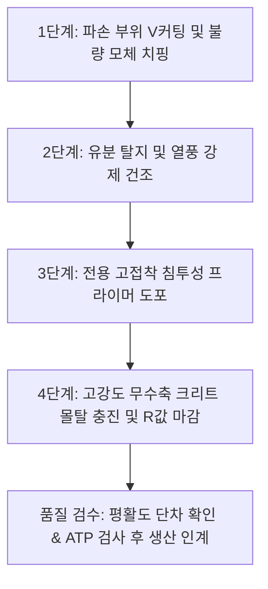

# [QA+ 블로그 생성 결과물] 식품공장 에폭시바닥
생성일시: 2026-10-09 06:48:49 (KST)
적용모델: gemini-3.8-flash

================================================================================
# 📋 [최종 발행용 블로그 패키지]

### 1. 메타 데이터 (SEO 설정)
- **최종 포스팅 제목**: 에폭시 vs 크리트? 20년 차 품질선배가 정리한 식품공장 바닥재 시공·보수 완벽 실무 가이드 (HACCP 심사 대비)
- **메타 디스크립션 (120자 내외 요약)**: 식품공장 바닥 박리와 크랙으로 인한 이물 혼입·HACCP 지적을 원천 차단하는 법! 에폭시와 폴리우레탄 크리트의 공학적 비교, 건·습식 구역 분리 설계, 긴급 패칭(Patching) 4단계와 SQM/QCM 유지관리 노하우를 총정리해 드립니다.
- **추천 해시태그 (10개)**: #식품공장바닥 #에폭시시공 #유크리트 #폴리우레탄크리트 #HACCP시설기준 #식품품질관리 #선행요건프로그램 #식품안전 #공장유지보수 #SQM
- **카테고리**: 식품품질실무 / HACCP가이드

---

### 2. 네이버 블로그 / 티스토리 복사용 최종 원고 (Markdown)

# 에폭시 vs 크리트? 20년 차 품질선배가 정리한 식품공장 바닥재 시공·보수 완벽 가이드

> **20년 실무 선배의 한 줄 요약**: 식품공장 바닥 관리는 단순히 페인트를 칠하는 미관 작업이 아니라 물리적 이물 혼입과 미생물 교차오염을 원천 차단하는 핵심 위생 인프라이며, 건식·습식 구역 분리 시공과 선제적 일상 패칭(Patching)만이 HACCP 심사 지적과 막대한 재시공 비용을 막는 유일한 해법입니다.

---

## 1. 현장에서 바닥 에폭시는 왜 1년도 안 돼 들뜨고 깨질까?

공장에 갓 부임한 품질관리 담당자나 공무팀 후배들이 가장 빈번하게 토로하는 고민 중 하나가 바로 "선배님, 작년 정기 셧다운(Shut-down) 공사 때 거금을 들여 바닥 에폭시를 싹 새로 깔았는데, 벌써 트렌치 주변이 부풀어 오르고 지게차 다니는 통로가 깨져 나갑니다. 다음 달 식약처 HACCP 정기 조사평가인데 어떡하죠?"라는 하소연입니다. 수천만 원의 시설 투자 예산을 결재받아 반짝반짝하게 거울처럼 빛나는 녹색 바닥을 만들어 놓았는데, 불과 몇 달 만에 껍질이 벗겨지듯 들뜨고 깨지는 광경을 보면 눈앞이 캄캄해지는 것이 솔직한 심정일 것입니다.

이런 현상이 반복되는 근본적인 이유는 에폭시라는 도료가 지닌 태생적인 물리화학적 특성과 실제 식품 가공 현장의 가혹한 환경 사이의 미스매치(Mismatch)에서 비롯됩니다. 일반 제조업이나 물류창고에서는 에폭시가 훌륭한 내마모성과 경제성을 보여주지만, 식품 제조 현장은 매일 70℃ 이상의 고온 온수 세척, 잔류 피와 유지류(기름기), 산·알칼리 폼 세척제(CIP 약품), 그리고 수백 킬로그램에 달하는 원료 대차와 지게차의 집중 하중이 쉴 새 없이 가해지는 혹독한 전장입니다. 

에폭시 수지는 열팽창계수가 하부 콘크리트 모체와 현격히 달라서 고온의 온수가 닿는 순간 급격하게 팽창했다가 찬물 린스 시 수축하면서 내부 응력이 발생하게 됩니다. 이 응력이 반복되면 콘크리트 표면과 도막 사이의 접착력이 한계를 초과하여 결국 하부 표면을 물고 함께 떨어져 나오는 박리(Delamination) 현상이 필연적으로 일어납니다. 게다가 눈에 잘 보이지 않는 미세한 핀홀(Pin-hole)이나 미세 균열 틈새로 유기물과 수분이 침투하면 바닥 아래에서 혐기성 부패가 일어나 악취를 풍기고 가스를 방출해 도막을 위로 밀어 올리게 됩니다.

결국 많은 중소 식품기업들이 초기 평당 시공 단가가 저렴하다는 이유만으로 가열실이나 세척실 같은 습식 다습 구역까지 무분별하게 일반 에폭시 라이닝을 적용했다가, 매년 땜질식 덧칠 보수를 반복하며 누적 비용을 눈덩이처럼 키우는 악순환에 빠지게 됩니다. 바닥 파손은 단순한 시설 노후화의 문제가 아니라, 깨진 에폭시 조각이 제품에 혼입되는 심각한 물리적 이물 클레임이자 바닥 틈새에 리스테리아 모노사이토제네스(*Listeria monocytogenes*) 같은 식중독균이 서식처를 형성하는 교차오염의 진원지가 된다는 사실을 뼈아프게 직시해야 합니다.


이제 왜 바닥이 그토록 쉽게 망가지는지 메커니즘을 이해했으니, 다음으로 정부 기관과 식품안전 국제 표준에서는 작업장 바닥을 법적으로 어떤 수준까지 요구하고 있는지 명확한 기준부터 짚고 넘어가겠습니다.

---

## 2. 법적 기준과 공식 가이드라인 핵심 정리: 바닥 위생의 법적 한계선

식품공장의 바닥 관리는 단순히 품질 부서의 자체 위생 철학에 머무는 것이 아니라, 현행 식품위생법과 식품의약품안전처 고시, 나아가 FSSC 22000 등 글로벌 식품안전 표준에서 매우 엄격하게 규정하고 있는 법적 강제 규격입니다. 시설 기준을 위반할 경우 HACCP 부적합 판정은 물론, 시정명령이나 영업정지 등 행정처분으로 이어질 수 있으므로 심사관의 관점에서 평가 기준을 정확히 숙지하고 있어야 합니다.

우선 **식품위생법 시행규칙 [별표 14]** '식품제조·가공업의 시설기준'을 살펴보면, "작업장의 바닥은 콘크리트 등으로 내수성 처리를 하여야 하며, 배수가 잘 되도록 하고 파손된 곳이 없어야 한다"라고 명시되어 있습니다. 여기서 법률 용어로 쓰인 '내수성 처리'라는 표현을 쉽게 말하면, 물이나 화학 세척액이 바닥 속으로 스며들지 않는 방수성과 비침투성을 완벽히 갖추어야 한다는 뜻입니다. 콘크리트 자체는 다공성(Porous) 물질이므로 미세한 기포 구멍이 수없이 많아 그대로 방치하면 오염물질을 스펀지처럼 빨아들이기 때문에, 반드시 도막형 바닥재로 표면을 밀봉 코팅해야 법적 기준을 충족할 수 있습니다.

나아가 **식품 및 축산물 안전관리인증기준 (식약처 고시)** 선행요건 프로그램(PRP)의 작업장 환경 관리 조항에서는 한 단계 더 나아간 구체적인 물성을 요구합니다. "작업장의 바닥, 벽, 천장은 청소 및 소독이 용이하고 내수성·내열성·내화학성을 갖추어야 하며, 미생물 오염이나 물리적 위해(도막 박리 조각 등)를 유발하지 않도록 평활하고 균열이 없어야 한다"라고 못 박고 있습니다. 또한 배수가 원활하도록 적절한 경사도(배수 구배)를 확보해야 하며, 바닥과 벽면이 접하는 모서리 부위는 먼지와 오염물질이 퇴적되지 않도록 R값(라운딩/Coving) 곡면 처리를 하도록 강력히 권고 및 유도하고 있습니다.

글로벌 식품안전 인증인 **FSSC 22000 (ISO/TS 22002-1 선행요건 프로그램 제5.2조)** 역시 "바닥은 작업 하중에 견딜 수 있도록 설계되어야 하며, 고인 물이 생기지 않도록 배수가 용이해야 하고, 생산 환경에 적용되는 세척 소독제에 내화학성을 지녀야 한다"라고 명문화하고 있습니다. 심사관들이 정기 현장 실사에서 랜턴을 비추며 바닥을 유심히 살피는 핵심 포인트 3가지는 다음과 같습니다.
1. **바닥 크랙 및 코팅 들뜸으로 인한 이물 낙하 위험이 있는가?**
2. **배수 구배 불량으로 세척 후 물고임 웅덩이가 형성되어 바닥 세균 번식 조건이 되는가?**
3. **벽과 바닥의 접점 모서리에 찌든 때와 곰팡이가 끼어 있는가?**

| 법령 및 표준 구분 | 바닥 관련 핵심 조항 명칭 | 요구 성능 및 기술적 규격 | 심사 시 중점 불합격 판정 요소 |
| :--- | :--- | :--- | :--- |
| **식품위생법 시행규칙** | [별표 14] 식품제조가공업 시설기준 | 콘크리트 등 내수성 재질 시공, 배수 불량 방지, 바닥 파손 전무 | 바닥 파손 방치, 콘크리트 노출 및 비위생적 상태 |
| **식약처 HACCP 고시** | 선행요건 프로그램 관리기준 | 평활도 유지, 내열·내수·내화학성 도막, 세척·소독 용이성 | 도막 탈락 조각의 제품 혼입 우려, 균열 내 미생물 증식 |
| **FSSC 22000 / ISO/TS** | Clause 5.2 (구조 및 바닥 레이아웃) | 정하중·동하중 지지력, 배수 시스템 연계, 청소 화학제 내성 | 바닥 침하, 물고임(Stagnant water), 화학 부식 현상 |

이러한 규제 프레임워크를 머릿속에 담아두었다면, 다음 단계로는 과연 어떤 구역에 에폭시를 쓰고 어떤 구역에 특수 바닥재를 써야 하는지 재질별 특성을 명확히 비교해 보아야 합니다.

---

## 3. 에폭시(Epoxy) vs 폴리우레탄 크리트(Ucrete 계열): 완벽 비교 분석

식품공장 바닥재를 검토할 때 가장 많이 대립하는 선택지가 바로 전통적인 **에폭시(Epoxy)**와 흔히 '유크리트(Ucrete)'라는 상표명으로 널리 알려진 **수용성 폴리우레탄 하이브리드 크리트(Polyurethane Concrete)**입니다. 에폭시 수지는 비스페놀 A와 에피클로로히드린 등을 반응시켜 만든 열경화성 플라스틱 도료로, 시공 후 표면 광택이 매우 미려하고 표면이 유리알처럼 매끄러워 시각적인 위생 청결감을 주기에 최적화되어 있습니다. 게다가 자재대와 시공 인건비가 저렴하여 초기 공사 비용을 아끼는 데는 더없이 매력적인 자재입니다.

그러나 에폭시는 '열'과 '수분'이라는 치명적인 아킬레스건을 안고 있습니다. 에폭시의 열변형 온도는 통상 50~60℃ 수준으로, 80℃가 넘는 고온 살균수나 자숙 공정의 증기 드레인이 바닥에 쏟아지면 열충격(Thermal Shock)을 견디지 못하고 분자 결합이 와해되어 도막이 들뜨고 부서집니다. 반면 폴리우레탄 크리트는 수용성 폴리우레탄 수지와 특수 시멘트 골재, 경화제를 하이브리드 방식으로 배합한 획기적인 복합 재료입니다. 이 자재는 콘크리트 모체와 열팽창계수가 거의 완벽하게 일치하여 120℃가 넘는 스팀 세척이나 고온 열수 배출 시에도 바닥 모체와 도막이 한 몸처럼 수축·팽창하므로 들뜸 현상이 원천 차단됩니다.

또 하나의 결정적인 차이는 충격 저항성과 내화학성입니다. 에폭시는 경도가 높아 단단한 대신 취성(Brittle, 깨지기 쉬운 성질)이 강하여 무거운 스테인리스 바트(Chamber)나 파렛트 모서리가 바닥에 떨어지면 도자기 깨지듯 칩(Chip)이 발생합니다. 반면 폴리우레탄 크리트는 탄성과 인성을 동시에 지니고 있어 중하중 지게차가 선회하거나 중량물이 낙하해도 충격을 흡수하여 균열이 발생하지 않습니다. 또한 식품 현장에서 자주 쓰이는 유기산(젖산, 아세트산, 구연산) 및 가성소다(NaOH) 세척액에 노출되어도 표면 연화나 변색, 박리 현상이 극히 드뭅니다.

따라서 현명한 품질팀과 공무팀이라면 공장 전체를 하나의 자재로 통일하는 우를 범하지 말고 공정 특성에 맞춘 이원화 설계를 단행해야 합니다. 물을 전혀 쓰지 않는 건식 포장실, 외포장 구역, 일반 통로, 완제품 물류창고는 평당 시공비가 합리적인 에폭시 라이닝(두께 2~3mm)을 적용하여 예산을 절감하고, 가열실, 전처리 세척실, 소스 배합실, 도축·정육 가공실, 트렌치 주변 등 가혹한 습식 구역은 폴리우레탄 크리트(두께 6~9mm)를 과감하게 시공하는 것이 장기적인 LCC(Life Cycle Cost, 생애주기비용) 관점에서 수억 원의 재시공 비용을 아끼는 지름길입니다.

| 성능 및 비교 항목 | 일반 에폭시 라이닝 (Epoxy Lining) | 폴리우레탄 하이브리드 크리트 (Ucrete 계열) |
| :--- | :--- | :--- |
| **주요 원료 조성** | 에폭시 수지 + 아민계 경화제 | 수용성 폴리우레탄 수지 + 특수 시멘트 + 규사 골재 |
| **내열 온도 범위** | 상온 ~ 최대 60℃ (열수 접촉 시 박리) | -40℃ (냉동실) ~ 최대 +130℃ (스팀 청소 가능) |
| **내충격성 / 인성** | 낮음 (취성으로 인해 충격 시 깨짐 조각 발생) | 매우 높음 (충격 흡수 및 복원력 우수) |
| **내화학성 (산/알칼리)** | 보통 (고농도 유기산 및 열알칼리에 취약) | 탁월 (락틱산, 올레산, 고농도 CIP 세척제 완벽 방어) |
| **습윤면 시공 가능 여부** | 불가 (콘크리트 함수율 4~6% 이하 필수) | 가능 (수용성 바인더로 다습한 콘크리트 위 시공 가능) |
| **경화 및 양생 시간** | 48~72시간 이상 (완전 경화 지연) | 12~24시간 (시공 후 다음 날 즉시 보행 및 생산 가동) |
| **평당 초기 시공 비용** | 상대적 저렴 (크리트 대비 30~40% 수준) | 초기 투자비 높음 (에폭시 대비 약 2.5~3배) |
| **추천 적용 공정 구역** | 완제품 포장실, 상온 창고, 일반 보행 복도 | 가열조 주변, 세척실, 레토르트실, 폐수 트렌치 주변 |


이처럼 두 자재의 성능 특성을 파악했다면, 도대체 왜 현장에서 에폭시 하자가 그토록 집요하게 발생하는지 그 3대 근본 원인을 공학적으로 깊이 들여다보겠습니다.

---

## 4. 바닥 하자 3대 원인별 메커니즘과 현장 예방 관리 기준

현장에서 발생하는 바닥 박리의 90% 이상은 자재 자체의 불량보다는 시공 환경의 통제 실패와 가혹한 사용 조건에서 기인합니다. 20년 현장 경험상 하자를 유발하는 주범은 크게 세 가지로 요약할 수 있습니다. 바로 **콘크리트 하부 수분(함수율)**, **배수 불량으로 인한 고온 열수 축적**, 그리고 **이동 대차의 집중 하중**입니다. 이 세 가지 요인이 바닥 도막에 어떤 물리적 손상을 입히는지 메커니즘을 정확히 파악해야 재발 방지 대책을 세울 수 있습니다.

### ① 콘크리트 타설 후 함수율 미달 건조와 삼투압 블리스터링(Blistering)
신축 공장이거나 바닥 몰탈을 재타설한 후 공사 기간에 쫓겨 충분한 양생을 거치지 않고 에폭시를 시공할 때 100% 발생하는 현상입니다. 콘크리트는 타설 후 최소 28일 이상 충분히 양생되어 내부 함수율(Moisture Content)이 4~6% 이하(표준 전자 수분측정기 기준)로 떨어져야 비로소 에폭시 프라이머를 도포할 수 있는 바탕면이 됩니다. 만약 콘크리트 내부에 잉여 수분이 갇힌 상태에서 불투기성인 에폭시를 덮어버리면, 지열이나 실내 온도 상승에 의해 수분이 수증기압으로 변해 상부 도막을 들어 올립니다. 쉽게 말하면 바닥 표면에 지름 수 센티미터 크기의 볼록한 물집(Blister)이 잡히고, 이를 발로 밟으면 툭 터지면서 내부에서 썩은 물이 배어 나오는 끔찍한 하자가 발생하는 것입니다.

### ② 고온 세척수 유입과 열팽창 불일치로 인한 전단 파괴
가열 솥 바닥 세척이나 소스 배합 탱크 CIP 세척 후 배출되는 75~85℃의 고온 열수가 바닥으로 쏟아질 때 일어나는 현상입니다. 콘크리트의 열팽창계수는 약 $1.0 \times 10^{-5}/\text{K}$ 수준인 반면, 무용제 에폭시 수지의 열팽창계수는 $6.0 \sim 8.0 \times 10^{-5}/\text{K}$로 콘크리트보다 무려 6배에서 8배나 큽니다. 즉, 뜨거운 물이 쏟아지면 에폭시는 콘크리트보다 훨씬 많이 늘어나려 하고, 찬물로 헹구면 훨씬 급격히 줄어들려고 발버둥을 칩니다. 이 과정에서 두 계면 사이에 막대한 전단 응력(Shear Stress)이 발생하고, 결국 접착 강도가 약한 콘크리트 상부 시멘트 페이스트 층이 뜯겨 나가며 에폭시가 낙엽처럼 벗겨지게 됩니다.

### ③ 소형 경질 우레탄/나일론 바퀴 대차의 집중 하중과 진동 충격
식품공장 내부에서는 수백 킬로그램의 원료육이나 절임 배추, 소스 원액을 실은 이동식 대차(핸드 파렛트 트럭 또는 덤프 바트)가 쉴 새 없이 움직입니다. 이때 대차 바퀴로 흔히 쓰이는 나일론이나 단단한 경질 우레탄 바퀴는 바닥과의 접촉 면적이 극히 좁아 접촉면 접지압이 수십 $\text{kgf/cm}^2$에 달합니다. 지게차나 대차가 에폭시 표면의 미세한 크랙 위를 반복해서 지나가면 충격 하중과 진동이 도막 모서리를 타격하여 미세한 파쇄(Spalling) 현상을 일으킵니다. 이렇게 부서진 에폭시 미세 파편들은 바퀴에 묻어 포장 구역까지 이동하거나 작업자의 장화 바닥을 통해 청정구역으로 전파되어 치명적인 이물 혼입 사고를 일으키게 됩니다.

따라서 이러한 하자를 원천 차단하기 위해서는 시공 전 바닥 슬래브의 함수율을 정밀 수분계로 측정하는 절차를 표준작업지침서(SOP)에 의무화하고, 습식 공정에는 열충격에 강한 자재를 배치하며, 대차 바퀴 재질을 연질 고무나 충격 흡수형 엘라스토머 바퀴로 교체하는 복합적 예방 조치가 필수적입니다.

이제 하자의 원인을 명확히 짚어냈으니, 실제 현장에서 크랙이나 들뜸이 발생했을 때 품질팀과 공무팀이 당장 실행할 수 있는 단계별 실전 조치 요령을 살펴보겠습니다.

---

## 5. 20년 차 선배가 전수하는 바닥 보수 및 시공 단계별 실전 가이드 (Step by Step)

바닥이 깨졌을 때 생산을 전면 중단하고 공장 전체 바닥을 뜯어고칠 수 있는 식품기업은 현실적으로 거의 없습니다. 품질팀장과 공무팀장의 역할은 주말이나 야간의 제한된 짧은 셧다운 시간(12~24시간) 동안 신속하고 완벽하게 부분 보수(Patching)를 완료하여 월요일 새벽 생산 가동에 지장을 주지 않는 것입니다. 20년 동안 수없이 바닥을 뜯고 메워보며 정립한 실패 없는 실전 보수 4단계를 전수해 드립니다.



### 1단계: 파손 부위의 과감한 V커팅 및 불량 모체 제거 (치핑 작업)
대부분의 초보 실무자들이 저지르는 가장 흔한 실수는 깨진 틈새 위에 그냥 실리콘을 쏘거나 에폭시 주제·경화제만 대충 섞어 붓으로 바르는 것입니다. 이는 며칠 못 가 100% 다시 떨어져 나갑니다. 다이아몬드 날을 장착한 핸드 그라인더를 사용하여 크랙 라인을 따라 깊이 10~15mm, 폭 20mm 이상으로 과감하게 V자 또는 U자형으로 커팅(Grooving)해야 합니다. 들뜬 에폭시 주변은 망치와 정(Chisel)을 이용해 두드렸을 때 텅텅거리는 빈 소리가 나지 않고 단단한 콘크리트 본체가 나올 때까지 주변 도막을 완전히 걷어내야 합니다.

### 2단계: 유분 완벽 탈지와 고진공 흡입 및 강제 건조
파손 틈새에는 수개월 동안 침투한 유지류(기름때)와 미생물 슬러지가 엉겨 붙어 있습니다. 알칼리 탈지 세척제를 뿌려 솔로 문지른 뒤 깨끗이 린스하고, 공업용 진공청소기로 미세 분진까지 완벽하게 빨아들여야 합니다. 그다음 산업용 열풍기(Heat Gun)나 가스 토치를 이용하여 젖어 있는 콘크리트 모체를 강제 건조시켜 내부 수분을 바짝 날려야 합니다. 표면 온도가 내려간 후 콘크리트 수분 측정기로 찍었을 때 함수율이 확실히 떨어졌는지 확인하는 것이 접착의 성패를 가릅니다.

### 3단계: 전용 고접착 프라이머(하도) 도포 및 오픈 타임 준수
콘크리트 모체와 보수 몰탈 사이의 접착 가교 역할을 하는 프라이머(하도제)를 결코 생략해서는 안 됩니다. 일반 건조면에는 주제와 경화제를 정량(1:1 또는 2:1 등 제조사 규격)으로 전동 믹서기를 이용해 3분 이상 균일하게 교반한 침투성 에폭시 프라이머를 붓이나 롤러로 듬뿍 먹여줍니다. 만약 바닥이 완전히 마르기 어려운 습식 구역이라면 일반 에폭시 프라이머 대신 '습윤면 전용 수용성 에폭시 프라이머'나 '우레탄 크리트 전용 스크래치 코트'를 도포해야 기포 발생과 박리를 방지할 수 있습니다. 도포 후 손으로 만졌을 때 묻어나지 않고 끈적거리는 지촉 건조 상태(Tack-free time)에 즉시 본 작업을 이어가야 합니다.

### 4단계: 고강도 무수축 크리트 퍼티 충진 및 단차 없는 미장 마감
충진재로는 건조 수축이 있는 일반 시멘트 몰탈을 절대 쓰면 안 되며, '초속경 고강도 에폭시 퍼티'나 3액형 '폴리우레탄 크리트 보수 몰탈'을 사용해야 합니다. 흙손(Trowel)을 사용하여 V커팅된 홈 내부에 공기가 갇히지 않도록 강하게 꾹꾹 눌러가며 밀실하게 채워 넣습니다. 이때 기존 정상 바닥 도막과의 단차(경계 턱)가 생기지 않도록 평활도를 완벽하게 맞추어 미장 마감을 해야 지게차 바퀴가 지나갈 때 걸리지 않습니다. 벽면과 만나는 모서리 보수라면 전용 R값 성형 흙손(Coving Trowel)을 사용하여 반경 30~50mm의 매끄러운 곡면을 형성해 주어야 미생물 번식 틈새가 사라집니다.

> 💡 **현장 실무 꿀팁 (HACCP 심사관 입회 시 즉각적인 방어 노하우)**  
> 정기 심사관이 현장 라운딩 중 보수된 바닥 자국을 발견하고 "바닥이 패칭되어 있는데 위생적으로 취약하지 않느냐"고 질문할 때, 당황하지 마십시오. 공무/품질팀 바인더에서 **'바닥 시설 예방보전 점검일지'**와 **'보수재 공인 시험성적서(식품 접촉 안전성 인증 또는 휘발성유기화합물 VOC 불검출 성적서)'**, 그리고 **'보수 전-중-후 사진 대지'**를 즉시 제시하십시오.  
> *"저희 공장은 일상 점검 매뉴얼에 따라 미세 크랙 발견 즉시 24시간 이내에 전용 고강도 크리트 패칭재로 즉각 보수하고 있으며, 시공 후 표면 미생물 스왑 검사를 통해 음성(적합) 판정을 확인한 후 생산을 재개하고 있습니다."*라고 답변하면 심사관은 지적이 아닌 최고의 선행요건 우수 관리 사례로 평가하게 됩니다.

---

## 6. 실제 현장 사례로 보는 적용법 (업종별 트러블슈팅 3선)

식품공장은 제조하는 품목의 물리적 특성, 사용하는 용수의 온도, 공정 내 낙하물질의 성상에 따라 바닥에 가해지는 스트레스가 완전히 다릅니다. 제가 직접 컨설팅하고 개선을 이끌어냈던 세 가지 서로 다른 업종(냉동만두, 소스류 레토르트, 축산물 육가공)의 생생한 현장 개선 사례를 공유합니다.

### 사례 1. 냉동만두 제조 공장 (가열 자숙 및 냉동 터널 공정)
- **상황 및 배경**: 일 생산량 15톤 규모의 냉동만두 제조 공장으로, 만두를 찜기에서 쪄내는 증자기(Steamer) 하부와 영하 35℃의 급속 IQF 냉동 터널 입출구 바닥에 일반 녹색 에폭시 라이닝(두께 3mm)이 시공되어 있었습니다.
- **문제 발생**: 증자기 하부 트렌치 주변 에폭시가 끓는 물과 수증기로 인해 완전히 껍질처럼 벗겨져 콘크리트 골재가 훤히 드러났고, 냉동 터널 앞은 결빙과 해동이 반복되면서 에폭시가 잘게 부서져 만두 성형 트레이 바닥에 녹색 미세 페인트 파편이 부착되는 치명적인 이물 사고가 발생했습니다.
- **원인 분석**: 증자기 주변은 95℃의 고온 드레인 수가 지속해서 유출되어 에폭시의 열변형 한계(60℃)를 매일 초과하였고, 냉동 구역은 도막 수축 응력과 지게차 동결 바퀴의 마찰 충격이 겹쳐 계면 전단 파괴가 일어난 것이 근본 원인이었습니다.
- **해결 및 개선 조치**: 주말 48시간 생산 셧다운을 이용하여 파손된 에폭시를 전동 평삭기로 전면 샌딩 제거하고 모체를 노출시켰습니다. 95℃ 열수와 영하 35℃ 극저온을 동시에 견딜 수 있는 3액형 폴리우레탄 하이브리드 크리트(두께 9mm 사양)를 전면 타설하였으며, 트렌치 낙하 지점에는 스테인리스 앵글 보강을 실시했습니다.
- **결과**: 시공 후 3년이 경과한 현재까지 단 한 건의 도막 들뜸이나 균열이 발생하지 않았으며, 냉동 터널 앞 이물 클레임 제로(0건)를 달성하고 HACCP 정기 심사에서 시설 설비 유지관리 만점을 획득했습니다.

### 사례 2. 소스류 레토르트 제조 공장 (배합실 및 고온 살균 레토르트 솥 주변)
- **상황 및 배경**: 토마토 페이스트, 불닭 소스 등 강산성 및 당류가 다량 함유된 소스를 생산하는 공장으로, 대형 2톤 교반 솥 4기와 레토르트 살균 챔버가 24시간 가동되는 전형적인 고온·습식 현장이었습니다.
- **문제 발생**: 산도가 높은 소스 원액이 바닥에 튈 때마다 에폭시 표면이 누렇게 변색되고 화학적으로 녹아내리며 끈적거림이 발생했습니다. 솥 하부 에폭시가 파인 틈새로 소스 찌꺼기가 스며들어 매일 락스로 세척해도 쿰쿰한 쉰내가 진동하고 초파리가 들끓어 위생 점검 시 단골 지적을 받았습니다.
- **원인 분석**: 일반 비스페놀 에폭시는 pH 3.0 이하의 유기산(구연산, 초산 등)에 장시간 노출 시 고분자 사슬이 분해되는 취약점이 있습니다. 게다가 산성 물질과 세척 잔류수가 크랙 틈새로 침투해 시멘트의 알칼리 성분을 중화시켜 콘크리트 자체를 푸석푸석한 모래로 풍화시킨 것이 근본 원인이었습니다.
- **해결 및 개선 조치**: 부식된 콘크리트 층을 깊이 30mm까지 완전히 파내어 치핑하고 고강도 무수축 시멘트로 기단부를 재형성했습니다. 그 위에 고농도 유기산에 완벽한 내화학성을 지닌 폴리우레탄 크리트 내화학 전용 등급을 시공하고, 교반 솥 다리 하부와 벽체 모서리 전체에 반경 50mm의 라운딩(R-Coving) 일체형 시공을 적용했습니다.
- **결과**: 강산성 소스가 낙하해도 표면 변색이나 부식이 완벽히 차단되었고, 물청소 한 번으로 오염물이 트렌치로 매끄럽게 흘러내려 세척 작업 시간이 일평균 40분 단축되었으며 악취와 날파리 발생이 완전히 근절되었습니다.

### 사례 3. 축산물 식육가공 공장 (원료 해동실 및 발골·정육실)
- **상황 및 배경**: 냉동 우육 및 돈육을 해동하여 분쇄 및 햄·소시지를 제조하는 축산물 가공 공장으로, 해동실 바닥은 늘 핏물(혈액)과 동물성 유지가 흥건하고 매일 80℃의 온수 폼 세척을 진행하는 사업장이었습니다.
- **문제 발생**: 미끄럼 방지를 위해 규사를 섞은 논슬립(Non-slip) 에폭시를 시공했으나, 기름기와 핏물이 틈새 규사 사이에 흡착되어 세척이 되지 않았습니다. 더욱이 파렛트 대차 바퀴 하중에 의해 규사가 뜯겨 나가며 날카로운 요철이 생겼고, 바닥 미생물 간이 검사(ATP 측정) 결과 기준치(200 RLU)를 10배 이상 초과하는 2,500 RLU가 검출되었습니다.
- **원인 분석**: 동물성 지방산(Oleic acid 등)은 에폭시 도막 내부로 침투하여 연화(Softening)를 유발하며, 거친 논슬립 에폭시 표면의 엠보싱 굴곡이 적절한 R값을 갖지 못하고 거칠게 마감되어 단백질 유기물이 고착되는 바이오필름(Biofilm) 형성 처가 된 것이 원인이었습니다.
- **해결 및 개선 조치**: 기존 규사 코팅층을 전동 연삭기로 완전히 갈아내어 평탄화한 후, 동물성 유지에 특화된 수용성 폴리우레탄 크리트 엠보스 마감재(중간 조도 논슬립 시스템)로 재시공했습니다. 세척 시 오염물이 끼지 않으면서도 작업자의 장화가 미끄러지지 않는 완만한 텍스처를 구현했습니다.
- **결과**: 고온 알칼리 폼 세척 후 기름때가 잔류 없이 완벽히 씻겨 내려갔으며, 바닥 ATP 측정값이 평균 50 RLU 이하로 획기적으로 안정화되어 안전사고(미끄러짐 낙상) 예방과 교차오염 차단이라는 두 마리 토끼를 잡았습니다.

---

## 7. 식품공장 바닥 일상점검 및 정기 유지관리 표준 점검표

바닥 관리는 문제가 터진 뒤에 대규모 예산을 들여 공사하는 '사후 정비' 방식으로는 결코 감당할 수 없습니다. 일상적인 청소 및 작업 과정에서 미세 크랙이나 도막 들뜸 징후를 조기에 발견하여 즉각 패칭하는 '예방 보전' 시스템을 체계화해야 합니다. 품질관리팀(QA)과 공무/시설팀이 현장에서 매일, 매월 체크리스트에 편철하여 실제로 활용할 수 있는 표준 점검표를 제시합니다.

| 점검 구분 | 세부 점검 항목 | 판정 기준 (적합 조건) | 점검 주기 및 방법 | 부적합 시 즉각 조치 요령 |
| :--- | :--- | :--- | :--- | :--- |
| **물리적 파손** | 에폭시 크랙, 패임, 박리(도막 들뜸) 유무 | 균열, 부풀어 오름, 깨짐 조각 노출이 전혀 없을 것 | 매일 (작업 전·후 육안 확인) | 즉시 통제구역 설정, 24시간 내 V커팅 후 초속경 크리트 패칭 |
| **청결 및 미생물** | 바닥 틈새 잔류 유기물 및 물때, 곰팡이 유무 | 바닥 표면 청결 유지, 바이오필름 및 악취가 없을 것 | 매일 (세척 소독 후 육안 및 ATP) | 고온 알칼리 탈지 세척 재실시, 미생물 스왑 검사(ATP 100 RLU 이하) |
| **배수 및 구배** | 세척 작업 종료 후 바닥 물고임(웅덩이) 유무 | 물이 고이지 않고 트렌치로 자연 배수될 것 (최소 1/100 구배) | 매일 (세척 린스 직후 잔류수 확인) | 스퀴지(고무 밀대)로 잔류수 제거, 장기적으로 레벨링 몰탈 구배 보수 |
| **이물 혼입 위험** | 바닥 파손 조각의 비산 및 이동 대차 바퀴 오염 | 대차 바퀴 및 작업자 장화에 도막 파편 부착이 없을 것 | 주 1회 (물류 통로 및 포장실 입구) | 대차 바퀴 세척 및 연질 휠 교체, 파손 구역 표면 샌딩 마감 |
| **벽·바닥 접점** | 모서리 라운딩(R값) 탈락 및 코킹 실리콘 곰팡이 | R-Coving 탈락이 없고 실리콘 흑색 곰팡이가 없을 것 | 주 1회 (구역별 모서리 정밀 점검) | 오염된 실리콘 칼로 제거 후 항균 비초산 실리콘 또는 크리트 R값 재시공 |
| **트렌치 접합부** | 배수 트렌치 SUS 프레임과 바닥재 사이 틈새 벌어짐 | 트렌치 금속 날개와 바닥재 간 이격(이음매 벌어짐) 전무 | 월 1회 (랜턴을 비추어 경계선 확인) | 이격 틈새 V커팅 후 탄성 변성실리콘 또는 수용성 크리트 씰링 충진 |


---

## 8. 품질팀·공무팀이 가장 자주 묻는 질문 (FAQ 5가지)

### Q1. 깨진 에폭시 조각 부위를 긴급 심사 대비용으로 청테이프나 일반 실리콘으로 막아도 되나요?
**절대 안 됩니다.** 현장에서 심사를 하루 앞두고 다급한 마음에 초록색 청테이프를 붙여놓거나 일반 투명 실리콘을 대충 문질러 놓는 경우를 종종 봅니다. 심사관이 이를 발견하는 순간 "임기응변식 눈가림 관리"로 판단하여 일반 보완이 아닌 중대 지적(HACCP 감점 및 보완 요구)을 내리게 됩니다. 청테이프의 접착 끈적이는 유기물 오염을 흡착하여 살모넬라나 대장균의 온상이 되며, 일반 실리콘은 물과 닿으면 며칠 내로 곰팡이가 피어납니다. 시간이 정 없다면 식품 접촉 인증을 받은 '항균 초속경 변성 실리콘'으로 밀실하게 메우거나, 2시간 만에 완전 경화되는 '긴급 보수용 2액형 고강도 아크릴/우레탄 패치제'를 사용하여 표면을 단차 없이 평평하게 깎아내야 합니다.

### Q2. 공장 전체를 크리트로 깔기엔 예산이 턱없이 부족한데, 부분 시공으로도 HACCP 통과가 가능한가요?
**충분히 가능하며, 실제로 가장 권장하는 합리적인 방식입니다.** 식약처나 HACCP 인증원은 공장 전체 바닥을 고가의 특정 자재로 통일하라고 요구하지 않습니다. "위해요소가 제어되고 교차오염이 발생하지 않는 상태"를 유지하는 것이 핵심입니다. 따라서 공무팀과 협의하여 물을 많이 쓰고 열수가 닿는 가열조 주변 반경 2m, 세척실, 폐수 트렌치 주변 50cm 구간만 선별하여 폴리우레탄 크리트로 부분 전환 시공하고, 물을 쓰지 않는 건식 포장실이나 복도는 기존 에폭시를 깨끗하게 유지보수하는 '구역별 하이브리드 바닥 설계'를 도입하십시오. 이원화된 시설 관리 기준서를 심사관에게 당당하게 제시하면 예산 효율성과 과학적 위생 관리를 모두 인정받을 수 있습니다.

### Q3. 바닥 배수 구배(경사도)가 안 맞아서 물이 고이는데, 바닥재 시공만으로 잡을 수 있나요?
**바닥재의 두께만으로는 심각한 구배 불량을 완전히 잡기 어렵습니다.** 에폭시나 얇은 크리트(3~4mm)는 기본적으로 콘크리트 바닥의 레벨을 그대로 따라가는 도막재입니다. 물이 찰랑거리며 고이는 웅덩이 부위는 깊이가 최소 10~20mm 이상 꺼져 있는 경우가 대부분입니다. 이 상태에서 도료만 두껍게 부으면 자재 내부 경화 불량이 발생하거나 수축 균열이 일어납니다. 따라서 물고임을 잡으려면 기존 에폭시를 완전히 연삭해 낸 후, 초속경 고유동성 무수축 셀프 레벨링 몰탈(구배용 패칭 몰탈)을 사용하여 배수 트렌치 방향으로 최소 1/100(거리 1m당 높이차 1cm) 이상의 구배를 바닥 바탕면에서 먼저 형성한 다음, 그 위에 최종 바닥재를 올려야 완벽한 배수가 구현됩니다.

### Q4. 바닥과 벽면이 만나는 모서리의 R값(라운딩) 처리는 에폭시 시공 시 어떻게 설계해야 하나요?
**에폭시 시공 전, 시멘트 몰탈이나 전용 에폭시 퍼티로 반경 30~50mm의 곡면을 먼저 형성하는 것이 필수입니다.** 벽과 바닥이 직각(90도)으로 만나면 바닥 세척 시 고압수가 닿지 않아 구석에 먼지, 찌꺼기, 곰팡이가 고착됩니다. 이를 방지하기 위해 샌드위치 판넬 하부나 콘크리트 벽체 하단에 전용 R-Coving 흙손을 사용하여 완만한 부채꼴 모양의 곡면 기단부를 만듭니다. 그 후 바닥 에폭시를 벽면 라운딩을 타고 약 100~150mm 높이까지 치켜올려 일체형으로 코팅(Coving 도장)해야 합니다. 이렇게 시공하면 바닥 물청소를 할 때 물과 거품이 모서리에 고이지 않고 매끄럽게 트렌치로 미끄러져 내려가며 걸레질이나 스퀴지 작업도 매우 수월해집니다.

### Q5. 시공 후 바닥에서 심한 페인트 신나 냄새(유기용제 냄새)가 나는데, 제품에 냄새가 배지 않게 하려면 어떻게 해야 하나요?
**식품공장 내부 보수에는 반드시 무용제(Solvent-free) 자재를 사용해야 하며, 환기 양생 프로토콜을 철저히 지켜야 합니다.** 시중의 저가 유성 에폭시는 시너(Thinner) 같은 휘발성 유기용제를 다량 함유하고 있어, 도포 후 며칠 동안 유독가스와 악취를 뿜어냅니다. 이 냄새는 공기 중으로 퍼져 주변의 밀가루, 식용유, 포장재 등에 스며들어 치명적인 이취(Off-flavor) 클레임을 유발합니다. 따라서 자재 발주 시 공무팀에 "용제가 전혀 들어가지 않은 무용제 에폭시(100% Solids Epoxy)" 또는 "친환경 수용성 무독성 폴리우레탄 크리트"를 스펙으로 지정해야 합니다. 시공 중 및 시공 후에는 배기 팬을 총가동하여 강제 배기를 실시하고, 냄새가 완전히 빠진 후 공기질 안전성을 확인하고 생산 원료를 입고시켜야 합니다.

---

## 9. 품질보증(SQM)과 공정품질(QCM) 관점으로 본 바닥 관리의 본질 & 맺음말

많은 사람들이 바닥 관리를 시설팀이나 공무팀의 단순 노무 업무로 치부하곤 합니다. 하지만 품질을 20년 동안 해오며 내린 결론은, 바닥이야말로 공장의 품질보증(SQM) 체계와 일상 공정품질(QCM) 관리가 완벽하게 교차하는 가장 중요한 위생 플랫폼이라는 사실입니다.

여기서 우리가 명확히 짚고 넘어가야 할 품질 개념이 있습니다. **SQM(Standard Quality Management)**은 QA(품질보증) 활동의 표준화를 의미합니다. 즉, 우리 공장의 바닥 품질 기준을 어떻게 정의하고, 건식과 습식 구역의 설비 스펙을 어떻게 설계하며, 유지보수 절차와 책임 권한을 어떤 매뉴얼로 표준화하여 일관되게 운영·개선할 것인가를 다루는 거시적 품질보증 시스템입니다. 반면 **QCM(Quality Chain Management)**은 현장의 구체적인 QC(품질관리) 활동을 의미합니다. 원료 입고부터 전처리, 가열, 포장으로 이어지는 제조 공정의 품질 흐름(Chain) 속에서 매일 바닥의 크랙을 검사하고, 배수 상태를 측정하며, 미생물 오염도를 판정하여 이상 발생 시 즉각 조치로 연결하는 실행 중심의 품질 연결고리 관리 활동입니다.

| 관리 구분 | 품질 개념 정의 | 바닥 관리에서의 실제 적용 업무 | 담당 및 관리 지표 |
| :--- | :--- | :--- | :--- |
| **SQM**<br>(Standard Quality Management) | **QA 활동의 표준화**<br>(품질보증 체계, 절차, 기준, 책임과 기록을 일관되게 설계·운영·개선하는 관리) | • 공정별 바닥재 선정 표준 지침서(SOP) 제정<br>• 바닥 보수재 식품 접촉 안전성 평가 기준 수립<br>• 시설 투자 및 LCC(생애주기비용) 예산 표준화 | 품질보증팀 / 공무팀<br>(HACCP 인증 유지, 시설 적합률) |
| **QCM**<br>(Quality Chain Management) | **QC 활동**<br>(원료·공정·제품의 검사·측정·판정·이상조치가 품질 흐름 안에서 연결되도록 관리) | • 일상 바닥 크랙 및 박리 육안 검사 진행<br>• 세척 후 바닥 ATP 미생물 측정 및 판정<br>• 파손 발견 시 즉각 라인 통제 및 긴급 패칭 연계 | 생산품질팀 / 현장 QC<br>(이물 혼입률 0%, ATP 적합률) |

경영진이나 재경 부서를 설득하여 바닥 보수 예산을 확보하는 것은 품질 실무자에게 늘 커다란 도전입니다. "바닥 좀 깨진 게 뭐 대수냐, 대충 덧칠하고 넘어가자"라고 말하는 경영진에게 단순히 "HACCP 심사에 걸립니다"라고만 말해서는 지갑을 열 수 없습니다. 이때 품질팀은 SQM과 QCM의 논리로 무장해야 합니다. 바닥 파손 조각이 제품에 혼입되어 대형 유통사에서 전량 리콜(Recall)이 발생했을 때 치러야 할 수억 원의 브랜드 손실 비용, 바닥 틈새 식중독균 번식으로 인한 생산 중단 손실 비용을 구체적인 숫자로 환산하여 제시하십시오. 1,000만 원의 선제적 바닥 보수 투자가 3억 원의 잠재적 리콜 리스크를 방어한다는 데이터 기반의 설득만이 회사의 인프라를 바꿀 수 있습니다.

오늘 다룬 식품공장 바닥 관리의 핵심 원칙 세 가지를 다시 한번 가슴에 새겨봅시다.
1. **공정 환경에 따른 이원화**: 물과 열을 쓰는 습식 구역은 폴리우레탄 크리트, 마른 건식 구역은 에폭시로 확실히 분리 설계하십시오.
2. **사전 예방적 일상 점검**: 호미로 막을 미세 크랙을 방치하여 가래로도 못 막는 대형 바닥 박리로 키우지 마십시오.
3. **표준화된 긴급 패칭 프로세스**: V커팅, 강제 건조, 프라이머, 고강도 충진의 4단계 원칙을 철저히 지켜 단 한 조각의 도막 파편도 완제품에 들어가지 않게 하십시오.

현장의 차가운 바닥 위에서 장화를 신고 랜턴을 비추며 묵묵히 식품 안전을 지켜내는 전국의 수많은 품질관리, 공무 엔지니어 후배님들이야말로 K-푸드의 진정한 숨은 영웅들입니다. 오늘 정리해 드린 가이드라인이 여러분의 현장 바닥 트러블을 명쾌하게 해결하고, 다가오는 HACCP 심사를 당당하게 통과하는 든든한 무기가 되기를 진심으로 바랍니다. 실무 현장에서 바닥 자재 선정이나 긴급 보수 방법으로 막히는 부분이 있다면 언제든 댓글로 편하게 질문을 남겨주세요. 20년 선배가 성심껏 노하우를 나눠드리겠습니다. 대한민국 품질 실무자 여러분의 칼퇴근을 언제나 열렬히 응원합니다!

---

### 3. 워드프레스 / 웹사이트용 HTML 원고

```html
<article class="food-qa-post" style="font-family: -apple-system, BlinkMacSystemFont, 'Segoe UI', Roboto, 'Helvetica Neue', Arial, sans-serif; line-height: 1.8; color: #2d3748; max-width: 860px; margin: 0 auto; padding: 20px;">

  <header style="border-bottom: 2px solid #e2e8f0; padding-bottom: 24px; margin-bottom: 32px;">
    <h1 style="font-size: 2rem; font-weight: 800; color: #1a202c; line-height: 1.4; margin-bottom: 16px;">
      에폭시 vs 크리트? 20년 차 품질선배가 정리한 식품공장 바닥재 시공·보수 완벽 가이드
    </h1>
    <div style="background-color: #ebf8ff; border-left: 4px solid #3182ce; padding: 16px 20px; border-radius: 0 8px 8px 0;">
      <p style="margin: 0; font-size: 1.02rem; color: #2b6cb0; font-weight: 600;">
        <strong>20년 실무 선배의 한 줄 요약:</strong> 식품공장 바닥 관리는 단순히 페인트를 칠하는 미관 작업이 아니라 물리적 이물 혼입과 미생물 교차오염을 원천 차단하는 핵심 위생 인프라이며, 건식·습식 구역 분리 시공과 선제적 일상 패칭(Patching)만이 HACCP 심사 지적과 막대한 재시공 비용을 막는 유일한 해법입니다.
      </p>
    </div>
  </header>

  <section style="margin-bottom: 40px;">
    <h2 style="font-size: 1.5rem; font-weight: 700; color: #2d3748; border-bottom: 2px solid #edf2f7; padding-bottom: 8px; margin-bottom: 20px;">
      1. 현장에서 바닥 에폭시는 왜 1년도 안 돼 들뜨고 깨질까?
    </h2>
    <p>공장에 갓 부임한 품질관리 담당자나 공무팀 후배들이 가장 빈번하게 토로하는 고민 중 하나가 바로 <em>"선배님, 작년 정기 셧다운(Shut-down) 공사 때 거금을 들여 바닥 에폭시를 싹 새로 깔았는데, 벌써 트렌치 주변이 부풀어 오르고 지게차 다니는 통로가 깨져 나갑니다. 다음 달 식약처 HACCP 정기 조사평가인데 어떡하죠?"</em>라는 하소연입니다. 수천만 원의 시설 투자 예산을 결재받아 반짝반짝하게 거울처럼 빛나는 녹색 바닥을 만들어 놓았는데, 불과 몇 달 만에 껍질이 벗겨지듯 들뜨고 깨지는 광경을 보면 눈앞이 캄캄해지는 것이 솔직한 심정일 것입니다.</p>
    
    <p>이런 현상이 반복되는 근본적인 이유는 에폭시라는 도료가 지닌 태생적인 물리화학적 특성과 실제 식품 가공 현장의 가혹한 환경 사이의 미스매치(Mismatch)에서 비롯됩니다. 일반 제조업이나 물류창고에서는 에폭시가 훌륭한 내마모성과 경제성을 보여주지만, 식품 제조 현장은 매일 70℃ 이상의 고온 온수 세척, 잔류 피와 유지류(기름기), 산·알칼리 폼 세척제(CIP 약품), 그리고 수백 킬로그램에 달하는 원료 대차와 지게차의 집중 하중이 쉴 새 없이 가해지는 혹독한 전장입니다.</p>

    <p>에폭시 수지는 열팽창계수가 하부 콘크리트 모체와 현격히 달라서 고온의 온수가 닿는 순간 급격하게 팽창했다가 찬물 린스 시 수축하면서 내부 응력이 발생하게 됩니다. 이 응력이 반복되면 콘크리트 표면과 도막 사이의 접착력이 한계를 초과하여 결국 하부 표면을 물고 함께 떨어져 나오는 박리(Delamination) 현상이 필연적으로 일어납니다. 게다가 눈에 잘 보이지 않는 미세한 핀홀(Pin-hole)이나 미세 균열 틈새로 유기물과 수분이 침투하면 바닥 아래에서 혐기성 부패가 일어나 악취를 풍기고 가스를 방출해 도막을 위로 밀어 올리게 됩니다.</p>

    <p>결국 많은 중소 식품기업들이 초기 평당 시공 단가가 저렴하다는 이유만으로 가열실이나 세척실 같은 습식 다습 구역까지 무분별하게 일반 에폭시 라이닝을 적용했다가, 매년 땜질식 덧칠 보수를 반복하며 누적 비용을 눈덩이처럼 키우는 악순환에 빠지게 됩니다. 바닥 파손은 단순한 시설 노후화의 문제가 아니라, 깨진 에폭시 조각이 제품에 혼입되는 심각한 물리적 이물 클레임이자 바닥 틈새에 리스테리아 모노사이토제네스(<em>Listeria monocytogenes</em>) 같은 식중독균이 서식처를 형성하는 교차오염의 진원지가 된다는 사실을 뼈아프게 직시해야 합니다.</p>

    <div style="text-align: center; margin: 30px 0;">
      
      <p style="font-size: 0.9rem; color: #718096; margin-top: 8px;">[그림 1] 가혹한 습식 공정 조건에서 발생하는 에폭시 바닥 도막 박리 현상</p>
    </div>

    <p>이제 왜 바닥이 그토록 쉽게 망가지는지 메커니즘을 이해했으니, 다음으로 정부 기관과 식품안전 국제 표준에서는 작업장 바닥을 법적으로 어떤 수준까지 요구하고 있는지 명확한 기준부터 짚고 넘어가겠습니다.</p>
  </section>

  <section style="margin-bottom: 40px;">
    <h2 style="font-size: 1.5rem; font-weight: 700; color: #2d3748; border-bottom: 2px solid #edf2f7; padding-bottom: 8px; margin-bottom: 20px;">
      2. 법적 기준과 공식 가이드라인 핵심 정리: 바닥 위생의 법적 한계선
    </h2>
    <p>식품공장의 바닥 관리는 단순히 품질 부서의 자체 위생 철학에 머무는 것이 아니라, 현행 식품위생법과 식품의약품안전처 고시, 나아가 FSSC 22000 등 글로벌 식품안전 표준에서 매우 엄격하게 규정하고 있는 법적 강제 규격입니다. 시설 기준을 위반할 경우 HACCP 부적합 판정은 물론, 시정명령이나 영업정지 등 행정처분으로 이어질 수 있으므로 심사관의 관점에서 평가 기준을 정확히 숙지하고 있어야 합니다.</p>

    <p>우선 <strong>식품위생법 시행규칙 [별표 14]</strong> '식품제조·가공업의 시설기준'을 살펴보면, <em>"작업장의 바닥은 콘크리트 등으로 내수성 처리를 하여야 하며, 배수가 잘 되도록 하고 파손된 곳이 없어야 한다"</em>라고 명시되어 있습니다. 여기서 법률 용어로 쓰인 '내수성 처리'라는 표현을 쉽게 말하면, 물이나 화학 세척액이 바닥 속으로 스며들지 않는 방수성과 비침투성을 완벽히 갖추어야 한다는 뜻입니다. 콘크리트 자체는 다공성(Porous) 물질이므로 미세한 기포 구멍이 수없이 많아 그대로 방치하면 오염물질을 스펀지처럼 빨아들이기 때문에, 반드시 도막형 바닥재로 표면을 밀봉 코팅해야 법적 기준을 충족할 수 있습니다.</p>

    <p>나아가 <strong>식품 및 축산물 안전관리인증기준 (식약처 고시)</strong> 선행요건 프로그램(PRP)의 작업장 환경 관리 조항에서는 한 단계 더 나아간 구체적인 물성을 요구합니다. <em>"작업장의 바닥, 벽, 천장은 청소 및 소독이 용이하고 내수성·내열성·내화학성을 갖추어야 하며, 미생물 오염이나 물리적 위해(도막 박리 조각 등)를 유발하지 않도록 평활하고 균열이 없어야 한다"</em>라고 못 박고 있습니다. 또한 배수가 원활하도록 적절한 경사도(배수 구배)를 확보해야 하며, 바닥과 벽면이 접하는 모서리 부위는 먼지와 오염물질이 퇴적되지 않도록 R값(라운딩/Coving) 곡면 처리를 하도록 강력히 권고 및 유도하고 있습니다.</p>

    <p>글로벌 식품안전 인증인 <strong>FSSC 22000 (ISO/TS 22002-1 선행요건 프로그램 제5.2조)</strong> 역시 <em>"바닥은 작업 하중에 견딜 수 있도록 설계되어야 하며, 고인 물이 생기지 않도록 배수가 용이해야 하고, 생산 환경에 적용되는 세척 소독제에 내화학성을 지녀야 한다"</em>라고 명문화하고 있습니다. 심사관들이 정기 현장 실사에서 랜턴을 비추며 바닥을 유심히 살피는 핵심 포인트 3가지는 다음과 같습니다.</p>

    <ul style="padding-left: 20px; color: #4a5568;">
      <li style="margin-bottom: 6px;"><strong>바닥 크랙 및 코팅 들뜸으로 인한 이물 낙하 위험이 있는가?</strong></li>
      <li style="margin-bottom: 6px;"><strong>배수 구배 불량으로 세척 후 물고임 웅덩이가 형성되어 바닥 세균 번식 조건이 되는가?</strong></li>
      <li style="margin-bottom: 6px;"><strong>벽과 바닥의 접점 모서리에 찌든 때와 곰팡이가 끼어 있는가?</strong></li>
    </ul>

    <div style="overflow-x: auto; margin-top: 24px;">
      <table style="width: 100%; border-collapse: collapse; text-align: left; font-size: 0.95rem; border: 1px solid #e2e8f0;">
        <thead>
          <tr style="background-color: #f7fafc; border-bottom: 2px solid #cbd5e0;">
            <th style="padding: 12px; border: 1px solid #e2e8f0; color: #2d3748;">법령 및 표준 구분</th>
            <th style="padding: 12px; border: 1px solid #e2e8f0; color: #2d3748;">바닥 관련 핵심 조항</th>
            <th style="padding: 12px; border: 1px solid #e2e8f0; color: #2d3748;">요구 성능 및 규격</th>
            <th style="padding: 12px; border: 1px solid #e2e8f0; color: #2d3748;">심사 시 중점 불합격 판정 요소</th>
          </tr>
        </thead>
        <tbody>
          <tr>
            <td style="padding: 12px; border: 1px solid #e2e8f0; font-weight: 600;">식품위생법 시행규칙</td>
            <td style="padding: 12px; border: 1px solid #e2e8f0;">[별표 14] 시설기준</td>
            <td style="padding: 12px; border: 1px solid #e2e8f0;">콘크리트 등 내수성 재질 시공, 배수 불량 방지, 바닥 파손 전무</td>
            <td style="padding: 12px; border: 1px solid #e2e8f0; color: #e53e3e;">바닥 파손 방치, 콘크리트 노출 및 비위생 상태</td>
          </tr>
          <tr style="background-color: #fcfdfd;">
            <td style="padding: 12px; border: 1px solid #e2e8f0; font-weight: 600;">식약처 HACCP 고시</td>
            <td style="padding: 12px; border: 1px solid #e2e8f0;">선행요건 관리기준</td>
            <td style="padding: 12px; border: 1px solid #e2e8f0;">평활도 유지, 내열·내수·내화학성 도막, 세척·소독 용이성</td>
            <td style="padding: 12px; border: 1px solid #e2e8f0; color: #e53e3e;">도막 탈락 조각의 제품 혼입 우려, 균열 내 미생물 번식</td>
          </tr>
          <tr>
            <td style="padding: 12px; border: 1px solid #e2e8f0; font-weight: 600;">FSSC 22000 / ISO</td>
            <td style="padding: 12px; border: 1px solid #e2e8f0;">ISO/TS 22002-1 (5.2)</td>
            <td style="padding: 12px; border: 1px solid #e2e8f0;">정·동하중 지지력, 배수 시스템 연계, 청소 화학제 내성</td>
            <td style="padding: 12px; border: 1px solid #e2e8f0; color: #e53e3e;">바닥 침하, 물고임(Stagnant water), 화학 부식 현상</td>
          </tr>
        </tbody>
      </table>
    </div>
  </section>

  <section style="margin-bottom: 40px;">
    <h2 style="font-size: 1.5rem; font-weight: 700; color: #2d3748; border-bottom: 2px solid #edf2f7; padding-bottom: 8px; margin-bottom: 20px;">
      3. 에폭시(Epoxy) vs 폴리우레탄 크리트(Ucrete 계열): 완벽 비교 분석
    </h2>
    <p>식품공장 바닥재를 검토할 때 가장 많이 대립하는 선택지가 바로 전통적인 <strong>에폭시(Epoxy)</strong>와 흔히 '유크리트(Ucrete)'라는 상표명으로 널리 알려진 <strong>수용성 폴리우레탄 하이브리드 크리트(Polyurethane Concrete)</strong>입니다. 에폭시 수지는 비스페놀 A와 에피클로로히드린 등을 반응시켜 만든 열경화성 플라스틱 도료로, 시공 후 표면 광택이 매우 미려하고 표면이 유리알처럼 매끄러워 시각적인 위생 청결감을 주기에 최적화되어 있습니다. 게다가 자재대와 시공 인건비가 저렴하여 초기 공사 비용을 아끼는 데는 더없이 매력적인 자재입니다.</p>

    <p>그러나 에폭시는 '열'과 '수분'이라는 치명적인 아킬레스건을 안고 있습니다. 에폭시의 열변형 온도는 통상 50~60℃ 수준으로, 80℃가 넘는 고온 살균수나 자숙 공정의 증기 드레인이 바닥에 쏟아지면 열충격(Thermal Shock)을 견디지 못하고 분자 결합이 와해되어 도막이 들뜨고 부서집니다. 반면 폴리우레탄 크리트는 수용성 폴리우레탄 수지와 특수 시멘트 골재, 경화제를 하이브리드 방식으로 배합한 획기적인 복합 재료입니다. 이 자재는 콘크리트 모체와 열팽창계수가 거의 완벽하게 일치하여 120℃가 넘는 스팀 세척이나 고온 열수 배출 시에도 바닥 모체와 도막이 한 몸처럼 수축·팽창하므로 들뜸 현상이 원천 차단됩니다.</p>

    <p>또 하나의 결정적인 차이는 충격 저항성과 내화학성입니다. 에폭시는 경도가 높아 단단한 대신 취성(Brittle, 깨지기 쉬운 성질)이 강하여 무거운 스테인리스 바트(Chamber)나 파렛트 모서리가 바닥에 떨어지면 도자기 깨지듯 칩(Chip)이 발생합니다. 반면 폴리우레탄 크리트는 탄성과 인성을 동시에 지니고 있어 중하중 지게차가 선회하거나 중량물이 낙하해도 충격을 흡수하여 균열이 발생하지 않습니다. 또한 식품 현장에서 자주 쓰이는 유기산(젖산, 아세트산, 구연산) 및 가성소다(NaOH) 세척액에 노출되어도 표면 연화나 변색, 박리 현상이 극히 드뭅니다.</p>

    <p>따라서 현명한 품질팀과 공무팀이라면 공장 전체를 하나의 자재로 통일하는 우를 범하지 말고 공정 특성에 맞춘 이원화 설계를 단행해야 합니다. 물을 전혀 쓰지 않는 건식 포장실, 외포장 구역, 일반 통로, 완제품 물류창고는 평당 시공비가 합리적인 에폭시 라이닝(두께 2~3mm)을 적용하여 예산을 절감하고, 가열실, 전처리 세척실, 소스 배합실, 도축·정육 가공실, 트렌치 주변 등 가혹한 습식 구역은 폴리우레탄 크리트(두께 6~9mm)를 과감하게 시공하는 것이 장기적인 LCC(Life Cycle Cost, 생애주기비용) 관점에서 수억 원의 재시공 비용을 아끼는 지름길입니다.</p>

    <div style="overflow-x: auto; margin: 24px 0;">
      <table style="width: 100%; border-collapse: collapse; text-align: left; font-size: 0.95rem; border: 1px solid #e2e8f0;">
        <thead>
          <tr style="background-color: #f7fafc; border-bottom: 2px solid #cbd5e0;">
            <th style="padding: 12px; border: 1px solid #e2e8f0;">성능 및 비교 항목</th>
            <th style="padding: 12px; border: 1px solid #e2e8f0; color: #2b6cb0;">일반 에폭시 라이닝 (Epoxy)</th>
            <th style="padding: 12px; border: 1px solid #e2e8f0; color: #276749;">폴리우레탄 하이브리드 크리트</th>
          </tr>
        </thead>
        <tbody>
          <tr>
            <td style="padding: 12px; border: 1px solid #e2e8f0; font-weight: 600;">주요 원료 조성</td>
            <td style="padding: 12px; border: 1px solid #e2e8f0;">에폭시 수지 + 아민계 경화제</td>
            <td style="padding: 12px; border: 1px solid #e2e8f0;">수용성 우레탄 수지 + 특수 시멘트 + 규사 골재</td>
          </tr>
          <tr style="background-color: #fcfdfd;">
            <td style="padding: 12px; border: 1px solid #e2e8f0; font-weight: 600;">내열 온도 범위</td>
            <td style="padding: 12px; border: 1px solid #e2e8f0; color: #c53030;">상온 ~ 최대 60℃ (열수 접촉 시 박리)</td>
            <td style="padding: 12px; border: 1px solid #e2e8f0; color: #22543d; font-weight: 600;">-40℃ (냉동) ~ 최대 +130℃ (스팀 청소 가능)</td>
          </tr>
          <tr>
            <td style="padding: 12px; border: 1px solid #e2e8f0; font-weight: 600;">내충격성 / 인성</td>
            <td style="padding: 12px; border: 1px solid #e2e8f0;">낮음 (취성으로 충격 시 깨짐 조각 발생)</td>
            <td style="padding: 12px; border: 1px solid #e2e8f0; font-weight: 600;">매우 높음 (충격 흡수 및 복원력 탁월)</td>
          </tr>
          <tr style="background-color: #fcfdfd;">
            <td style="padding: 12px; border: 1px solid #e2e8f0; font-weight: 600;">내화학성 (산/알칼리)</td>
            <td style="padding: 12px; border: 1px solid #e2e8f0;">보통 (고농도 유기산 및 열알칼리에 취약)</td>
            <td style="padding: 12px; border: 1px solid #e2e8f0; font-weight: 600;">탁월 (락틱산, 올레산, 고농도 CIP액 방어)</td>
          </tr>
          <tr>
            <td style="padding: 12px; border: 1px solid #e2e8f0; font-weight: 600;">습윤면 시공 가능 여부</td>
            <td style="padding: 12px; border: 1px solid #e2e8f0; color: #c53030;">불가 (콘크리트 함수율 4~6% 이하 필수)</td>
            <td style="padding: 12px; border: 1px solid #e2e8f0; color: #22543d; font-weight: 600;">가능 (수용성 바인더로 다습 콘크리트 시공 가능)</td>
          </tr>
          <tr style="background-color: #fcfdfd;">
            <td style="padding: 12px; border: 1px solid #e2e8f0; font-weight: 600;">경화 및 양생 시간</td>
            <td style="padding: 12px; border: 1px solid #e2e8f0;">48~72시간 이상 (완전 경화 지연)</td>
            <td style="padding: 12px; border: 1px solid #e2e8f0; font-weight: 600;">12~24시간 (시공 익일 즉시 가동 가능)</td>
          </tr>
          <tr>
            <td style="padding: 12px; border: 1px solid #e2e8f0; font-weight: 600;">초기 평당 시공비</td>
            <td style="padding: 12px; border: 1px solid #e2e8f0; font-weight: 600;">상대적 저렴 (크리트 대비 30~40%)</td>
            <td style="padding: 12px; border: 1px solid #e2e8f0;">초기 투자비 높음 (에폭시 대비 약 2.5~3배)</td>
          </tr>
          <tr style="background-color: #fcfdfd;">
            <td style="padding: 12px; border: 1px solid #e2e8f0; font-weight: 600;">추천 적용 공정 구역</td>
            <td style="padding: 12px; border: 1px solid #e2e8f0;">완제품 포장실, 상온 창고, 일반 보행 복도</td>
            <td style="padding: 12px; border: 1px solid #e2e8f0; font-weight: 600; color: #22543d;">가열조 주변, 세척실, 레토르트실, 폐수 트렌치</td>
          </tr>
        </tbody>
      </table>
    </div>

    <div style="text-align: center; margin: 30px 0;">
      
      <p style="font-size: 0.9rem; color: #718096; margin-top: 8px;">[그림 2] 식품공장 공정 특성에 맞춘 건식(에폭시) 및 습식(크리트) 바닥재 선정 가이드</p>
    </div>
  </section>

  <section style="margin-bottom: 40px;">
    <h2 style="font-size: 1.5rem; font-weight: 700; color: #2d3748; border-bottom: 2px solid #edf2f7; padding-bottom: 8px; margin-bottom: 20px;">
      4. 바닥 하자 3대 원인별 메커니즘과 현장 예방 관리 기준
    </h2>
    <p>현장에서 발생하는 바닥 박리의 90% 이상은 자재 자체의 불량보다는 시공 환경의 통제 실패와 가혹한 사용 조건에서 기인합니다. 20년 현장 경험상 하자를 유발하는 주범은 크게 세 가지로 요약할 수 있습니다. 바로 <strong>콘크리트 하부 수분(함수율)</strong>, <strong>배수 불량으로 인한 고온 열수 축적</strong>, 그리고 <strong>이동 대차의 집중 하중</strong>입니다.</p>

    <h3 style="font-size: 1.15rem; font-weight: 700; color: #2b6cb0; margin-top: 20px;">① 콘크리트 타설 후 함수율 미달 건조와 삼투압 블리스터링(Blistering)</h3>
    <p>신축 공장이거나 바닥 몰탈을 재타설한 후 공사 기간에 쫓겨 충분한 양생을 거치지 않고 에폭시를 시공할 때 100% 발생하는 현상입니다. 콘크리트는 타설 후 최소 28일 이상 충분히 양생되어 내부 함수율(Moisture Content)이 4~6% 이하(표준 전자 수분측정기 기준)로 떨어져야 비로소 에폭시 프라이머를 도포할 수 있는 바탕면이 됩니다. 만약 콘크리트 내부에 잉여 수분이 갇힌 상태에서 불투기성인 에폭시를 덮어버리면, 지열이나 실내 온도 상승에 의해 수분이 수증기압으로 변해 상부 도막을 들어 올립니다. 바닥 표면에 지름 수 센티미터 크기의 볼록한 물집(Blister)이 잡히고, 이를 발로 밟으면 툭 터지면서 내부에서 썩은 물이 배어 나오는 하자가 바로 이것입니다.</p>

    <h3 style="font-size: 1.15rem; font-weight: 700; color: #2b6cb0; margin-top: 20px;">② 고온 세척수 유입과 열팽창 불일치로 인한 전단 파괴</h3>
    <p>가열 솥 바닥 세척이나 소스 배합 탱크 CIP 세척 후 배출되는 75~85℃의 고온 열수가 바닥으로 쏟아질 때 일어나는 현상입니다. 콘크리트의 열팽창계수는 약 1.0 × 10⁻⁵/K 수준인 반면, 무용제 에폭시 수지의 열팽창계수는 6.0 ~ 8.0 × 10⁻⁵/K로 콘크리트보다 무려 6배에서 8배나 큽니다. 뜨거운 물이 쏟아지면 에폭시는 콘크리트보다 훨씬 많이 늘어나려 하고, 찬물로 린스하면 급격히 줄어듭니다. 이 과정에서 계면 사이에 막대한 전단 응력(Shear Stress)이 발생하고, 접착 강도가 약한 상부 시멘트 페이스트 층이 뜯겨 나가며 에폭시가 낙엽처럼 벗겨지게 됩니다.</p>

    <h3 style="font-size: 1.15rem; font-weight: 700; color: #2b6cb0; margin-top: 20px;">③ 소형 경질 우레탄/나일론 바퀴 대차의 집중 하중과 진동 충격</h3>
    <p>식품공장 내부에서는 수백 킬로그램의 원료육이나 절임 배추, 소스 원액을 실은 이동식 대차가 쉴 새 없이 움직입니다. 이때 대차 바퀴로 흔히 쓰이는 나일론이나 단단한 경질 우레탄 바퀴는 바닥과의 접촉 면적이 극히 좁아 접촉면 접지압이 수십 kgf/cm²에 달합니다. 지게차나 대차가 에폭시 표면의 미세 크랙 위를 반복 통과하면 충격 하중과 진동이 도막 모서리를 타격하여 미세한 파쇄(Spalling) 현상을 일으킵니다. 이렇게 부서진 에폭시 미세 파편들은 바퀴에 묻어 포장 구역까지 이동하거나 작업자의 장화 바닥을 통해 청정구역으로 전파되어 치명적인 이물 혼입 사고를 일으킵니다.</p>
  </section>

  <section style="margin-bottom: 40px;">
    <h2 style="font-size: 1.5rem; font-weight: 700; color: #2d3748; border-bottom: 2px solid #edf2f7; padding-bottom: 8px; margin-bottom: 20px;">
      5. 20년 차 선배가 전수하는 바닥 보수 및 시공 단계별 실전 가이드 (Step by Step)
    </h2>
    <p>바닥이 깨졌을 때 생산을 전면 중단하고 공장 전체 바닥을 뜯어고칠 수 있는 식품기업은 현실적으로 거의 없습니다. 품질팀장과 공무팀장의 역할은 주말이나 야간의 제한된 짧은 셧다운 시간(12~24시간) 동안 신속하고 완벽하게 부분 보수(Patching)를 완료하여 월요일 새벽 생산 가동에 지장을 주지 않는 것입니다. 20년 동안 수없이 바닥을 뜯고 메워보며 정립한 실패 없는 실전 보수 4단계를 전수합니다.</p>

    <div style="background-color: #f7fafc; border: 1px solid #e2e8f0; border-radius: 8px; padding: 20px; margin: 20px 0;">
      <h4 style="margin-top: 0; color: #2d3748; font-size: 1.05rem;">🛠️ 표준 바닥 보수 프로세스 요약</h4>
      <p style="margin: 4px 0;"><strong>1단계 (치핑):</strong> 파손 부위 V커팅 및 불량 모체 제거 →</p>
      <p style="margin: 4px 0;"><strong>2단계 (전처리):</strong> 유분 완벽 탈지 및 열풍 강제 건조 (함수율 4% 이하) →</p>
      <p style="margin: 4px 0;"><strong>3단계 (하도):</strong> 침투성 에폭시 / 크리트 전용 프라이머 도포 →</p>
      <p style="margin: 4px 0;"><strong>4단계 (충진):</strong> 고강도 무수축 크리트 몰탈 충진 및 R값 곡면 마감</p>
    </div>

    <h3 style="font-size: 1.15rem; font-weight: 700; color: #2d3748; margin-top: 20px;">1단계: 파손 부위의 과감한 V커팅 및 불량 모체 제거 (치핑 작업)</h3>
    <p>대부분의 초보 실무자들이 저지르는 가장 흔한 실수는 깨진 틈새 위에 그냥 실리콘을 쏘거나 에폭시 주제·경화제만 대충 섞어 붓으로 바르는 것입니다. 이는 며칠 못 가 100% 다시 떨어져 나갑니다. 다이아몬드 날을 장착한 핸드 그라인더를 사용하여 크랙 라인을 따라 깊이 10~15mm, 폭 20mm 이상으로 과감하게 V자 또는 U자형으로 커팅(Grooving)해야 합니다. 들뜬 에폭시 주변은 망치와 정(Chisel)을 이용해 두드렸을 때 텅텅거리는 빈 소리가 나지 않고 단단한 콘크리트 본체가 나올 때까지 주변 도막을 완전히 걷어내야 합니다.</p>

    <h3 style="font-size: 1.15rem; font-weight: 700; color: #2d3748; margin-top: 20px;">2단계: 유분 완벽 탈지와 고진공 흡입 및 강제 건조</h3>
    <p>파손 틈새에는 수개월 동안 침투한 유지류(기름때)와 미생물 슬러지가 엉겨 붙어 있습니다. 알칼리 탈지 세척제를 뿌려 솔로 문지른 뒤 깨끗이 린스하고, 공업용 진공청소기로 미세 분진까지 완벽하게 빨아들여야 합니다. 그다음 산업용 열풍기(Heat Gun)나 가스 토치를 이용하여 젖어 있는 콘크리트 모체를 강제 건조시켜 내부 수분을 바짝 날려야 합니다. 표면 온도가 내려간 후 콘크리트 수분 측정기로 찍었을 때 함수율이 확실히 떨어졌는지 확인하는 것이 접착의 성패를 가릅니다.</p>

    <h3 style="font-size: 1.15rem; font-weight: 700; color: #2d3748; margin-top: 20px;">3단계: 전용 고접착 프라이머(하도) 도포 및 오픈 타임 준수</h3>
    <p>콘크리트 모체와 보수 몰탈 사이의 접착 가교 역할을 하는 프라이머(하도제)를 결코 생략해서는 안 됩니다. 일반 건조면에는 주제와 경화제를 정량으로 전동 믹서기를 이용해 3분 이상 균일하게 교반한 침투성 에폭시 프라이머를 듬뿍 먹여줍니다. 만약 바닥이 완전히 마르기 어려운 습식 구역이라면 일반 에폭시 프라이머 대신 '습윤면 전용 수용성 에폭시 프라이머'나 '우레탄 크리트 전용 스크래치 코트'를 도포해야 기포 발생과 박리를 방지할 수 있습니다. 지촉 건조 상태(Tack-free time)에 즉시 본 작업을 이어가야 합니다.</p>

    <h3 style="font-size: 1.15rem; font-weight: 700; color: #2d3748; margin-top: 20px;">4단계: 고강도 무수축 크리트 퍼티 충진 및 단차 없는 미장 마감</h3>
    <p>충진재로는 건조 수축이 있는 일반 시멘트 몰탈을 절대 쓰면 안 되며, '초속경 고강도 에폭시 퍼티'나 3액형 '폴리우레탄 크리트 보수 몰탈'을 사용해야 합니다. 흙손(Trowel)을 사용하여 V커팅된 홈 내부에 공기가 갇히지 않도록 강하게 꾹꾹 눌러가며 밀실하게 채워 넣습니다. 기존 정상 도막과의 단차가 생기지 않도록 평활도를 완벽하게 맞추어야 지게차 바퀴에 걸리지 않습니다. 벽면 모서리라면 전용 R-Coving 흙손으로 반경 30~50mm 곡면을 형성합니다.</p>

    <div style="background-color: #f0fff4; border-left: 4px solid #38a169; padding: 16px; margin-top: 24px; border-radius: 0 8px 8px 0;">
      <p style="margin: 0; color: #22543d; font-size: 0.95rem;">
        <strong>★ 현장 실무 꿀팁 (HACCP 심사관 방어 노하우):</strong><br>
        심사관이 보수 흔적을 보고 "위생적으로 취약하지 않느냐"고 물으면, 당황하지 말고 <strong>'바닥 예방보전 점검일지'</strong>, <strong>'식품 접촉 안전성 시험성적서'</strong>, <strong>'전·중·후 사진 대지'</strong>를 제시하십시오. <em>"일상 점검 매뉴얼에 따라 크랙 발생 즉시 24시간 내 식품 접촉 인증 전용 크리트로 긴급 보수하며, 표면 미생물 ATP 음성 판정 후 가동합니다"</em>라고 설명하면 지적이 아닌 '선행요건 최우수 사례'로 기록됩니다.
      </p>
    </div>
  </section>

  <section style="margin-bottom: 40px;">
    <h2 style="font-size: 1.5rem; font-weight: 700; color: #2d3748; border-bottom: 2px solid #edf2f7; padding-bottom: 8px; margin-bottom: 20px;">
      6. 실제 현장 사례로 보는 적용법 (업종별 트러블슈팅 3선)
    </h2>
    <div style="background: #ffffff; border: 1px solid #e2e8f0; border-radius: 8px; padding: 20px; margin-bottom: 20px; box-shadow: 0 1px 3px rgba(0,0,0,0.05);">
      <h3 style="font-size: 1.15rem; color: #2b6cb0; margin-top: 0;">사례 1. 냉동만두 제조 공장 (가열 자숙 및 냉동 터널 공정)</h3>
      <ul style="padding-left: 20px; color: #4a5568; margin-bottom: 0;">
        <li><strong>상황:</strong> 일산 15톤 냉동만두 공장. 찜기 증자기 하부 및 -35℃ 급속 냉동 터널 입출구에 녹색 에폭시(두께 3mm) 시공.</li>
        <li><strong>문제:</strong> 증자기 주변 에폭시가 끓는 물에 들떠 콘크리트 노출. 냉동 터널 앞은 결빙/해동 충격으로 에폭시가 깨져 트레이에 녹색 페인트 파편 혼입 사고 발생.</li>
        <li><strong>해결:</strong> 파손 도막 전면 평삭 샌딩 제거 후, 95℃ 열수와 -35℃ 극저온에 동시 대응하는 3액형 폴리우레탄 하이브리드 크리트(두께 9mm) 시공 및 배수 앵글 보강.</li>
        <li><strong>결과:</strong> 3년 경과 시점까지 도막 들뜸 제로, 냉동 터널 이물 클레임 0건, HACCP 정기 심사 시설 만점 획득.</li>
      </ul>
    </div>

    <div style="background: #ffffff; border: 1px solid #e2e8f0; border-radius: 8px; padding: 20px; margin-bottom: 20px; box-shadow: 0 1px 3px rgba(0,0,0,0.05);">
      <h3 style="font-size: 1.15rem; color: #2b6cb0; margin-top: 0;">사례 2. 소스류 레토르트 제조 공장 (배합실 및 고온 살균 솥 주변)</h3>
      <ul style="padding-left: 20px; color: #4a5568; margin-bottom: 0;">
        <li><strong>상황:</strong> 토마토 페이스트, 매운 양념 등 강산성 소스 생산. 2톤 교반 솥 4기와 레토르트 챔버 가동 구역.</li>
        <li><strong>문제:</strong> 산성 소스 낙하로 에폭시가 변색·용해되며 끈적임 발생. 파인 틈새로 소스가 스며들어 매일 쉰내 발생 및 초파리 번식으로 단골 지적.</li>
        <li><strong>해결:</strong> 부식된 콘크리트 기단부를 30mm 치핑 후 무수축 시멘트 재형성. 고농도 유기산 전용 내화학 폴리우레탄 크리트 및 반경 50mm R-Coving 일체 시공.</li>
        <li><strong>결과:</strong> 산성 물질 접촉 시에도 부식 차단, 세척 시간 일평균 40분 단축, 작업장 악취 및 날파리 완전 근절.</li>
      </ul>
    </div>

    <div style="background: #ffffff; border: 1px solid #e2e8f0; border-radius: 8px; padding: 20px; box-shadow: 0 1px 3px rgba(0,0,0,0.05);">
      <h3 style="font-size: 1.15rem; color: #2b6cb0; margin-top: 0;">사례 3. 축산물 식육가공 공장 (원료 해동실 및 발골·정육실)</h3>
      <ul style="padding-left: 20px; color: #4a5568; margin-bottom: 0;">
        <li><strong>상황:</strong> 해동실 바닥에 상시 혈액과 동물성 유지 존재. 매일 80℃ 온수 알칼리 폼 세척 실시.</li>
        <li><strong>문제:</strong> 미끄럼 방지 규사 에폭시 시공 부위에 동물성 기름이 고착되어 세척 불가. 규사 탈락 요철 발생 및 바닥 ATP 검사 2,500 RLU(기준치 200의 12배) 검출.</li>
        <li><strong>해결:</strong> 기존 규사층 연삭 평탄화 후, 유지류 분해 내성을 지닌 수용성 폴리우레탄 크리트 엠보스(완만한 조도 시스템) 재시공.</li>
        <li><strong>결과:</strong> 폼 세척 후 기름때 완전 제거, ATP 측정값 평균 50 RLU 이하로 안정화되어 미끄럼 방지와 미생물 제어 동시 달성.</li>
      </ul>
    </div>
  </section>

  <section style="margin-bottom: 40px;">
    <h2 style="font-size: 1.5rem; font-weight: 700; color: #2d3748; border-bottom: 2px solid #edf2f7; padding-bottom: 8px; margin-bottom: 20px;">
      7. 식품공장 바닥 일상점검 및 정기 유지관리 표준 점검표
    </h2>
    <p>바닥 관리는 문제가 터진 뒤에 대규모 공사를 벌이는 '사후 정비' 방식으로는 감당할 수 없습니다. 일상 청소 및 작업 과정에서 미세 결함을 조기 발견하여 즉각 조치하는 예방 보전 시스템을 가동해야 합니다.</p>

    <div style="overflow-x: auto; margin-top: 16px;">
      <table style="width: 100%; border-collapse: collapse; text-align: left; font-size: 0.95rem; border: 1px solid #e2e8f0;">
        <thead>
          <tr style="background-color: #f7fafc; border-bottom: 2px solid #cbd5e0;">
            <th style="padding: 10px; border: 1px solid #e2e8f0;">점검 구분</th>
            <th style="padding: 10px; border: 1px solid #e2e8f0;">세부 점검 항목</th>
            <th style="padding: 10px; border: 1px solid #e2e8f0;">판정 기준 (적합)</th>
            <th style="padding: 10px; border: 1px solid #e2e8f0;">주기 / 방법</th>
            <th style="padding: 10px; border: 1px solid #e2e8f0;">부적합 시 즉각 조치</th>
          </tr>
        </thead>
        <tbody>
          <tr>
            <td style="padding: 10px; border: 1px solid #e2e8f0; font-weight: 600;">물리적 파손</td>
            <td style="padding: 10px; border: 1px solid #e2e8f0;">크랙, 패임, 박리 유무</td>
            <td style="padding: 10px; border: 1px solid #e2e8f0;">균열, 부풀림, 도막 조각 노출 전무</td>
            <td style="padding: 10px; border: 1px solid #e2e8f0;">매일 육안 확인</td>
            <td style="padding: 10px; border: 1px solid #e2e8f0;">구역 통제 후 24시간 내 V커팅 패칭</td>
          </tr>
          <tr style="background-color: #fcfdfd;">
            <td style="padding: 10px; border: 1px solid #e2e8f0; font-weight: 600;">청결·미생물</td>
            <td style="padding: 10px; border: 1px solid #e2e8f0;">틈새 유기물, 물때, 곰팡이</td>
            <td style="padding: 10px; border: 1px solid #e2e8f0;">바이오필름, 악취 전무</td>
            <td style="padding: 10px; border: 1px solid #e2e8f0;">매일 세척 후 ATP</td>
            <td style="padding: 10px; border: 1px solid #e2e8f0;">알칼리 탈지 재세척 (ATP 100 RLU 이하 관리)</td>
          </tr>
          <tr>
            <td style="padding: 10px; border: 1px solid #e2e8f0; font-weight: 600;">배수 및 구배</td>
            <td style="padding: 10px; border: 1px solid #e2e8f0;">세척 후 물고임(웅덩이) 여부</td>
            <td style="padding: 10px; border: 1px solid #e2e8f0;">자연 배수 완료 (최소 1/100 구배)</td>
            <td style="padding: 10px; border: 1px solid #e2e8f0;">매일 세척 직후</td>
            <td style="padding: 10px; border: 1px solid #e2e8f0;">스퀴지 제거, 장기적 구배 몰탈 레벨링</td>
          </tr>
          <tr style="background-color: #fcfdfd;">
            <td style="padding: 10px; border: 1px solid #e2e8f0; font-weight: 600;">이물 위험</td>
            <td style="padding: 10px; border: 1px solid #e2e8f0;">파손 도막 비산 및 바퀴 오염</td>
            <td style="padding: 10px; border: 1px solid #e2e8f0;">바퀴 및 장화에 페인트 파편 부착 전무</td>
            <td style="padding: 10px; border: 1px solid #e2e8f0;">주 1회 통로 점검</td>
            <td style="padding: 10px; border: 1px solid #e2e8f0;">바퀴 연질 휠 교체 및 도막 단차 샌딩</td>
          </tr>
          <tr>
            <td style="padding: 10px; border: 1px solid #e2e8f0; font-weight: 600;">벽·바닥 접점</td>
            <td style="padding: 10px; border: 1px solid #e2e8f0;">모서리 라운딩(R) 탈락/곰팡이</td>
            <td style="padding: 10px; border: 1px solid #e2e8f0;">R-Coving 탈락 및 흑색 곰팡이 전무</td>
            <td style="padding: 10px; border: 1px solid #e2e8f0;">주 1회 정밀 확인</td>
            <td style="padding: 10px; border: 1px solid #e2e8f0;">오염부 제거 후 항균 실리콘/크리트 성형</td>
          </tr>
          <tr style="background-color: #fcfdfd;">
            <td style="padding: 10px; border: 1px solid #e2e8f0; font-weight: 600;">트렌치 접합</td>
            <td style="padding: 10px; border: 1px solid #e2e8f0;">트렌치 SUS-바닥재 간 틈새</td>
            <td style="padding: 10px; border: 1px solid #e2e8f0;">금속 날개와 바닥재 간 이격 전무</td>
            <td style="padding: 10px; border: 1px solid #e2e8f0;">월 1회 정밀 점검</td>
            <td style="padding: 10px; border: 1px solid #e2e8f0;">이격 틈새 V커팅 후 탄성 변성실리콘 충진</td>
          </tr>
        </tbody>
      </table>
    </div>

    <div style="text-align: center; margin: 30px 0;">
      
      <p style="font-size: 0.9rem; color: #718096; margin-top: 8px;">[그림 3] 배수 트렌치 이격 방지 및 모서리 라운딩(R-Coving) 표준 상세도</p>
    </div>
  </section>

  <section style="margin-bottom: 40px;">
    <h2 style="font-size: 1.5rem; font-weight: 700; color: #2d3748; border-bottom: 2px solid #edf2f7; padding-bottom: 8px; margin-bottom: 20px;">
      8. 품질팀·공무팀이 가장 자주 묻는 질문 (FAQ 5선)
    </h2>
    <div style="margin-bottom: 20px;">
      <h3 style="font-size: 1.1rem; font-weight: 700; color: #2c5282;">Q1. 깨진 에폭시 조각 부위를 심사 대비용으로 청테이프나 일반 실리콘으로 막아도 되나요?</h3>
      <p style="margin-top: 8px;"><strong>절대 안 됩니다.</strong> 심사관이 발견하는 즉시 '임기응변식 눈가림 관리'로 판단되어 중대 보완 지적이 내려집니다. 청테이프의 점착제는 미생물의 영양원이 되며, 일반 실리콘은 물과 접촉 시 흑색 곰팡이가 번식합니다. 시간이 촉박하다면 식품 접촉 인증을 받은 '항균 변성 실리콘'이나 2시간 경화 '초속경 아크릴/우레탄 패칭재'를 사용해야 합니다.</p>
    </div>

    <div style="margin-bottom: 20px;">
      <h3 style="font-size: 1.1rem; font-weight: 700; color: #2c5282;">Q2. 공장 전체를 크리트로 깔기엔 예산이 부족한데, 부분 시공으로도 HACCP 통과가 되나요?</h3>
      <p style="margin-top: 8px;"><strong>충분히 가능하며 가장 권장하는 합리적 방식입니다.</strong> 인증원은 특정 자재로의 통일을 요구하지 않습니다. 가열기 주변 2m, 세척실, 트렌치 주변 등 가혹한 습식 구역만 폴리우레탄 크리트로 부분 전환하고, 건식 포장실이나 복도는 에폭시를 유지하는 '하이브리드 바닥 설계'를 적용하여 기준서에 명시하십시오.</p>
    </div>

    <div style="margin-bottom: 20px;">
      <h3 style="font-size: 1.1rem; font-weight: 700; color: #2c5282;">Q3. 바닥 배수 구배(경사도)가 안 맞아 물이 고이는데 바닥재 두께만으로 잡을 수 있나요?</h3>
      <p style="margin-top: 8px;"><strong>바닥재 두께만으로는 불가능합니다.</strong> 물이 고이는 부위는 통상 10~20mm 이상 꺼져 있습니다. 도료만 두껍게 부으면 경화 불량과 수축 균열이 일어납니다. 기존 도막을 연삭한 후 초속경 무수축 셀프 레벨링 몰탈로 최소 1/100 구배를 바탕면에서 먼저 형성한 뒤 바닥재를 올려야 합니다.</p>
    </div>

    <div style="margin-bottom: 20px;">
      <h3 style="font-size: 1.1rem; font-weight: 700; color: #2c5282;">Q4. 바닥과 벽면이 만나는 모서리 R값(라운딩) 처리는 어떻게 설계해야 하나요?</h3>
      <p style="margin-top: 8px;"><strong>바닥재 도포 전 몰탈이나 전용 퍼티로 반경 30~50mm 곡면을 먼저 형성해야 합니다.</strong> 직각(90도) 모서리는 오염물이 퇴적되므로 전용 R-Coving 흙손으로 곡면 기단부를 만들고, 바닥재를 벽면 위 100~150mm까지 치켜올려 일체형으로 코팅(Coving) 마감해야 물청소 시 매끄러운 배수가 가능합니다.</p>
    </div>

    <div style="margin-bottom: 20px;">
      <h3 style="font-size: 1.1rem; font-weight: 700; color: #2c5282;">Q5. 시공 후 페인트 시너 냄새가 나는데 제품에 이취가 배지 않게 하려면 어떡하나요?</h3>
      <p style="margin-top: 8px;"><strong>반드시 무용제(Solvent-free) 또는 수용성 자재를 사용해야 합니다.</strong> 유성 에폭시의 휘발성 유기용제는 유제품이나 분말, 식용유에 흡착되어 치명적인 이취 클레임을 부릅니다. '무용제 에폭시' 또는 '친환경 수용성 우레탄 크리트'를 스펙으로 발주하고, 시공 중/후 강제 배기를 철저히 실행해야 합니다.</p>
    </div>
  </section>

  <section style="margin-bottom: 40px;">
    <h2 style="font-size: 1.5rem; font-weight: 700; color: #2d3748; border-bottom: 2px solid #edf2f7; padding-bottom: 8px; margin-bottom: 20px;">
      9. 품질보증(SQM)과 공정품질(QCM) 관점으로 본 바닥 관리의 본질 & 맺음말
    </h2>
    <p>바닥 관리는 시설팀의 단순 노무 업무가 아니라 공장의 <strong>품질보증(SQM)</strong> 체계와 일상 <strong>공정품질(QCM)</strong> 관리가 완벽히 교차하는 핵심 위생 플랫폼입니다.</p>

    <div style="overflow-x: auto; margin: 20px 0;">
      <table style="width: 100%; border-collapse: collapse; text-align: left; font-size: 0.95rem; border: 1px solid #e2e8f0;">
        <thead>
          <tr style="background-color: #f7fafc; border-bottom: 2px solid #cbd5e0;">
            <th style="padding: 12px; border: 1px solid #e2e8f0;">관리 구분</th>
            <th style="padding: 12px; border: 1px solid #e2e8f0;">품질 개념 정의</th>
            <th style="padding: 12px; border: 1px solid #e2e8f0;">바닥 관리 실제 적용 업무</th>
            <th style="padding: 12px; border: 1px solid #e2e8f0;">담당 및 관리 지표</th>
          </tr>
        </thead>
        <tbody>
          <tr>
            <td style="padding: 12px; border: 1px solid #e2e8f0; font-weight: 700; color: #2b6cb0;">SQM<br><span style="font-size: 0.8rem; font-weight: normal; color: #718096;">Standard Quality Management</span></td>
            <td style="padding: 12px; border: 1px solid #e2e8f0;"><strong>QA 활동의 표준화</strong><br>(품질보증 체계, 절차, 기준, 책임을 일관되게 설계·운영·개선)</td>
            <td style="padding: 12px; border: 1px solid #e2e8f0;">• 공정별 바닥재 선정 표준(SOP) 제정<br>• 보수재 식품 접촉 안전성 평가 기준 수립<br>• 시설 투자 및 LCC 예산 표준화</td>
            <td style="padding: 12px; border: 1px solid #e2e8f0;">품질보증팀 / 공무팀<br>(HACCP 적합성, 시설 적합률)</td>
          </tr>
          <tr style="background-color: #fcfdfd;">
            <td style="padding: 12px; border: 1px solid #e2e8f0; font-weight: 700; color: #276749;">QCM<br><span style="font-size: 0.8rem; font-weight: normal; color: #718096;">Quality Chain Management</span></td>
            <td style="padding: 12px; border: 1px solid #e2e8f0;"><strong>QC 활동</strong><br>(원료·공정·제품 검사·측정·판정이 품질 흐름 안에서 유기적 연결)</td>
            <td style="padding: 12px; border: 1px solid #e2e8f0;">• 일상 바닥 크랙 육안 검사 진행<br>• 세척 후 ATP 미생물 측정 및 판정<br>• 파손 발견 시 라인 통제 및 패칭 연계</td>
            <td style="padding: 12px; border: 1px solid #e2e8f0;">생산품질팀 / 현장 QC<br>(이물 혼입률 0%, ATP 적합률)</td>
          </tr>
        </tbody>
      </table>
    </div>

    <p>경영진을 설득할 때는 감정적 호소가 아닌 SQM과 QCM의 수치적 리스크 논리로 무장해야 합니다. 바닥 박리 조각의 완제품 혼입으로 인한 리콜 비용, 식중독균 증식에 따른 라인 셧다운 손실을 정량화하십시오. 1,000만 원의 선제적 바닥 패칭 투자가 3억 원의 잠재적 리콜 리스크를 방어한다는 데이터 기반의 설득만이 회사의 인프라를 바꿉니다.</p>

    <div style="background-color: #edf2f7; padding: 20px; border-radius: 8px; margin-top: 24px;">
      <h4 style="margin-top: 0; color: #1a202c;">📌 식품공장 바닥 관리의 3대 핵심 원칙</h4>
      <ol style="margin-bottom: 0; padding-left: 20px; color: #2d3748;">
        <li><strong>공정 환경에 따른 이원화:</strong> 습식 구역은 폴리우레탄 크리트, 마른 건식 구역은 에폭시로 확실히 분리하십시오.</li>
        <li><strong>사전 예방적 일상 점검:</strong> 호미로 막을 미세 크랙을 방치하여 대형 도막 박리로 키우지 마십시오.</li>
        <li><strong>표준화된 긴급 패칭 프로세스:</strong> V커팅, 강제 건조, 프라이머, 고강도 충진의 4단계 원칙을 철저히 준수하십시오.</li>
      </ol>
    </div>

    <p style="margin-top: 24px;">현장의 차가운 바닥 위에서 장화를 신고 랜턴을 비추며 묵묵히 식품 안전을 지켜내는 전국의 수많은 품질관리, 공무 엔지니어 여러분이야말로 K-푸드의 숨은 영웅입니다. 오늘 전수해 드린 가이드라인이 여러분의 현장 고민을 명쾌하게 해결하는 든든한 무기가 되기를 바랍니다. 작업 중 막히는 실무 이슈가 있다면 언제든 댓글로 편하게 질문해 주십시오!</p>
  </section>

  <footer style="border-top: 1px solid #e2e8f0; padding-top: 20px; font-size: 0.9rem; color: #a0aec0; text-align: center;">
    <p>© 20년 차 식품품질선배 | 무단 전재 및 재배포를 금하며, 현장 실무 적용을 적극 권장합니다.</p>
  </footer>

</article>
```
================================================================================

[부록: 1단계 리서치 원본]
# [리서치 리포트] 식품공장 에폭시 바닥재 시공 및 유지관리 실무

### 1. 타겟 독자 및 검색 의도
- **주요 타겟**: 식품제조가공업체 품질관리(QA/QC) 담당자, 공무/시설 관리팀, HACCP 인증 및 정기 사후심사를 준비 중인 실무 책임자
- **독자의 핵심 고통(Pain Point)**: 
  - 신축/보수 시 저렴해서 에폭시(Epoxy)를 깔았으나, 고온 세척수(열수), 지게차/대차 이동 충격, 화학 세척제(산·알칼리)로 인해 바닥이 들뜨거나 깨져 이물 혼입 및 미생물 번식 리스크 발생
  - HACCP 심사 시 "바닥 파손으로 인한 교차오염 우려" 지적을 반복적으로 받아 근본적인 대책(보수 방법 또는 하이브리드/크리트 계열 전환 여부)이 절실함
- **메인 키워드**: 식품공장 에폭시바닥
- **서브/연관 키워드**: 식품공장 바닥재, HACCP 바닥 기준, 에폭시 들뜸 보수, 유크리트(Ucrete) 비교, 위생구역 바닥 시공

---

### 2. 필수 인용 법령 및 표준 기준
- **법적/표준 근거**:
  - **식품위생법 시행규칙 [별표 14]** (식품제조·가공업의 시설기준): 작업장의 바닥은 콘크리트 등으로 내수성 처리를 하여야 하며, 배수가 잘 되도록 하고 파손된 곳이 없어야 함.
  - **식품 및 축산물 안전관리인증기준 (식약처 고시)**: 작업장의 바닥, 벽, 천장은 청소·소독이 용이하고 내수성·내열성·내화학성을 갖추어야 하며, 미생물 오염이나 물리적 위해(박리 조각 등)를 유발하지 않도록 평활하고 균열이 없어야 함.
  - **FSSC 22000 / ISO/TS 22002-1 (PRP 기준)**: 5.2 구조 및 레이아웃 - 바닥은 작업 하중에 견딜 수 있고 배수가 용이해야 하며, 세척 및 소독제에 내성이 있어야 함.
- **현장 실무 팩트**:
  - **에폭시(Epoxy)의 한계**: 열팽창계수가 콘크리트와 달라 60℃ 이상의 열수 접촉 시 콘크리트 모체와의 박리 현상(들뜸, 크랙) 발생률 급증. 충격(파렛트, 대차 바퀴)에 취약하여 미세 깨짐 조각이 물리적 이물로 제품에 혼입될 위험 상존.
  - **공정별 구역 분리 적용**:
    - *건식구역/포장실/원료창고*: 일반 에폭시(라이닝 또는 코팅)로도 비용 대비 우수한 관리 가능.
    - *습식구역/가열실/세척구역*: 열수 및 유기산에 견디는 폴리우레탄 하이브리드(수용성 폴리우레탄 크리트, Ucrete 등) 적용이 사실상 표준.
  - **R값(곡면 처리, Coving) 시공**: 바닥과 벽면이 만나는 모서리는 먼지 및 오염 방지를 위해 곡면(라운딩) 처리 필수.

---

### 3. 추천 블로그 목차 (Outline)

- **H1 (제목 후보 3개)**:
  1. 식품공장 에폭시 바닥, 왜 자꾸 깨질까? (HACCP 심사관 단골 지적과 실무 해결책)
  2. 에폭시 vs 크리트? 20년 차 품질선배가 정리한 식품공장 바닥재 완벽 가이드
  3. 깨지고 들뜨는 식품공장 에폭시 바닥, 긴급 보수법부터 공정별 맞춤 시공까지

- **H2 서론 (Intro)**: 
  - 저렴해서 시공한 에폭시 바닥, 1년도 안 돼 들뜨고 깨지는 현실
  - 바닥 깨짐은 단순 미관 문제가 아닌 '물리적 이물'과 '리스테리아 등 교차오염'의 1차 진원지
  - 결론: 공정 특성(건식 vs 습식/열수)에 맞춘 바닥재 선택과 선제적 트러블슈팅만이 예산과 HACCP 점수를 모두 지키는 길

- **H2 본론 1**: 법령으로 보는 식품공장 바닥 기준 & 에폭시의 기본 특성
  - 식품위생법 및 HACCP 고시에서 요구하는 바닥의 조건 (내수성, 비침투성, 무균열, 라운딩)
  - 에폭시(Epoxy)의 구조적 장단점 (낮은 초기 비용, 미려한 표면 vs 열·충격·수분에 취약)
  - 건식 구역(포장실, 복도)과 습식 구역(전처리실, 가열·세척실)의 명확한 구분 필요성

- **H2 본론 2**: 20년 선배의 현장 트러블슈팅 & 유지보수 실전 노하우
  - 에폭시 바닥이 박리되는 3대 원인: ① 콘크리트 함수율(수분 미건조), ② 열수 배출, ③ 중하중 대차 이동
  - 현장 긴급 보수(Patching) 팁: 긴급 보수용 퍼티/우레탄 크리트 패치제 활용 및 프라이머 접착 공정 누락 방지
  - 바닥 물고임(구배 불량) 해결: 트렌치(Trench) 주변 시공 요령 및 최소 구배(1/100) 관리법

- **H2 본론 3**: HACCP 심사 단골 지적 사항과 FAQ
  - Q1. 깨진 에폭시 조각을 임시로 청테이프나 실리콘으로 막아도 심사 통과가 될까요? (절대 불가 사유 및 대체법)
  - Q2. 바닥 전면 재시공이 어려운데, 부분 보수로 심사 방어가 가능한가요?
  - Q3. 벽-바닥 모서리(R값/라운딩) 처리는 에폭시 시공 시 어떻게 설계해야 하나요?

- **H2 결론 (Outro)**:
  - 식품공장 바닥 관리 3원칙(건식/습식 구분, 일상 점검표 운영, 크랙 즉시 패칭) 요약
  - 시설 보수 예산 설득을 위해 품질팀이 공무팀·경영진에게 제시해야 할 데이터(이물 클레임 리스크 비용) 조언
  - 현장 위생을 묵묵히 지켜내는 실무자들을 향한 격려와 응원 메시지

[부록: 3단계 시각자료 기획 원본]

본문 이미지 1
AI 이미지 프롬프트: `식품공장 에폭시바닥 식품 제조·품질관리 현장의 실사형 대표 사진`
본문 이미지 2와 3은 사용하지 않습니다. 본문은 텍스트와 HTML 정보 박스로 구성합니다.

